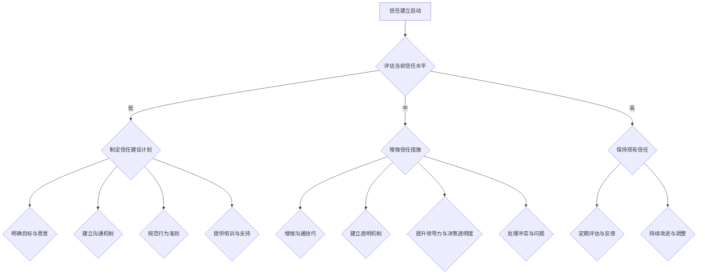

                 


# 《建立信任：团队凝聚力的基石》

> 关键词：团队信任，团队凝聚力，领导力，沟通，共同目标，外部信任，组织文化，合作伙伴关系，信任危机处理

> 摘要：本文旨在深入探讨团队信任的建立、维护及其在团队凝聚力中的重要性。通过分析信任的构成要素、领导者的信任责任、团队成员间的信任互动、有效沟通策略、共同目标的设定与实现，以及外部信任与组织文化等方面，为构建高凝聚力团队提供理论指导和实战建议。

## 第1章：信任的概念与重要性

### 1.1 信任的定义与类型

信任是一种心理状态，表示个体对他人或组织的可靠性、诚实性和公正性的信念。根据其表现形式，信任可以分为以下几种类型：

1. **人际信任**：个体之间的信任，如同事之间的信任。
2. **制度信任**：对组织制度、法规和政策的信任。
3. **专业信任**：对专业人员、专家和顾问的信任。
4. **社会信任**：对整个社会体系和道德价值观的信任。

### 1.2 信任的重要性

信任在团队中的作用至关重要。首先，信任是团队协作的基石，缺乏信任会导致团队内部矛盾和冲突。其次，信任能够提高团队的整体效能，促进成员之间的信息共享和资源整合。此外，信任还能增强团队的抗风险能力，使成员在面对困难和挑战时更加团结一致。

### 1.3 信任与团队凝聚力

信任是团队凝聚力的核心要素。一个高凝聚力的团队往往拥有以下特征：

1. **相互依赖**：团队成员之间相互信任，共同承担责任。
2. **共同目标**：团队成员对团队目标有共同的理解和认同。
3. **良性互动**：团队成员之间沟通畅通，能够积极解决问题。
4. **相互支持**：成员在工作和生活中相互关心，共同进步。

## 第2章：信任的基础

### 2.1 信任的构成要素

信任由三个关键要素构成：可靠性、诚实性和公正性。

1. **可靠性**：指个体能够履行承诺和承担责任的程度。
2. **诚实性**：指个体是否真诚地表达自己的想法和行为。
3. **公正性**：指个体是否在决策和行动中保持公正和无偏见。

### 2.2 信任的建立原则

建立信任需要遵循以下原则：

1. **透明度**：保持信息透明，使团队成员能够了解团队运作的情况。
2. **一致性**：言行一致，保持稳定的价值观和行为模式。
3. **尊重**：尊重团队成员的意见和感受，建立平等的关系。
4. **共享**：共享资源和信息，促进团队内部的合作。

### 2.3 信任的维护与培养

维护和培养信任需要持续的努力：

1. **定期沟通**：通过定期的会议和沟通，了解团队成员的需求和期望。
2. **积极反馈**：及时给予正面和负面的反馈，促进团队成员的成长。
3. **共同经历**：通过共同的经历和挑战，增强团队成员之间的信任。
4. **尊重差异**：尊重团队成员的个性和观点，促进多元文化的融合。

## 第3章：领导力与信任

### 3.1 领导者的信任责任

领导者是团队信任的重要载体。他们需要承担以下责任：

1. **建立信任文化**：在团队中营造信任的氛围，使成员感受到信任的重要性。
2. **树立榜样**：通过自己的行为树立信任的榜样，带动团队成员建立信任。
3. **解决冲突**：及时解决团队内部的矛盾和冲突，维护团队的信任基础。

### 3.2 提升领导力的策略

提升领导力有助于增强团队信任。以下是一些提升领导力的策略：

1. **提高沟通能力**：通过有效的沟通建立信任，促进团队成员之间的理解。
2. **培养团队意识**：关注团队成员的需求，建立共同的目标和价值观。
3. **提供反馈**：及时给予团队成员反馈，促进团队成员的成长。
4. **授权与支持**：给予团队成员足够的授权和支持，增强他们的自信心。

### 3.3 领导风格与信任

不同的领导风格会对团队信任产生不同的影响。以下是几种常见的领导风格：

1. **民主型领导**：通过团队成员的参与和讨论，建立信任。
2. **权威型领导**：通过严格的管理和监督，维护信任。
3. **教练型领导**：通过指导和辅导，培养团队成员的信任。
4. **变革型领导**：通过引领团队变革，建立信任。

## 第二部分：团队内部信任

### 第4章：团队成员之间的信任

#### 4.1 团队成员互动与信任

团队成员之间的互动是建立信任的关键。以下是一些促进团队成员互动的策略：

1. **分享经验**：通过分享个人经验和见解，增强团队成员之间的信任。
2. **合作项目**：通过共同参与项目，促进团队成员之间的合作和信任。
3. **定期交流**：通过定期的交流和互动，建立信任关系。

#### 4.2 促进团队成员信任的策略

为了促进团队成员之间的信任，可以采取以下策略：

1. **建立共同目标**：明确团队的目标和愿景，使成员有共同的方向。
2. **开放沟通**：鼓励成员之间开放、坦诚地沟通，减少误解和猜疑。
3. **建立信任机制**：通过制定明确的信任机制，规范团队成员的行为。

#### 4.3 处理团队冲突与重建信任

团队冲突在所难免，关键在于如何处理和重建信任。以下是一些建议：

1. **及时处理**：发现冲突后，及时采取措施进行调解。
2. **坦诚对话**：鼓励双方进行坦诚的对话，了解彼此的观点和感受。
3. **共同解决问题**：通过共同解决问题，重建信任。
4. **反思与改进**：对冲突的处理过程进行反思，避免类似冲突再次发生。

### 第5章：沟通与信任

#### 5.1 有效沟通的重要性

有效沟通是建立信任的基础。以下是一些有效沟通的技巧：

1. **倾听**：倾听对方的观点和意见，了解对方的立场。
2. **清晰表达**：用简单明了的语言表达自己的观点和想法。
3. **积极反馈**：给予对方积极的反馈，促进沟通的顺畅。
4. **情感共鸣**：关注对方的情感需求，建立情感共鸣。

#### 5.2 建立信任的沟通技巧

为了建立信任，以下是一些沟通技巧：

1. **透明沟通**：在沟通中保持信息的透明度，使对方感受到诚意。
2. **诚实沟通**：在沟通中保持诚实，避免误导和欺骗。
3. **尊重差异**：尊重对方的观点和意见，建立平等的沟通关系。
4. **寻求共识**：通过沟通寻求共识，增强团队的凝聚力。

#### 5.3 沟通障碍与解决方案

在沟通过程中，可能会遇到以下障碍：

1. **语言障碍**：解决方法：学习对方的语言或使用共同的语言。
2. **文化差异**：解决方法：了解对方的文化背景，尊重差异。
3. **信息不对称**：解决方法：建立信息共享机制，确保信息透明。

### 第6章：共同目标与信任

#### 6.1 共同目标的设定与实现

共同目标是团队凝聚力的核心。以下是如何设定和实现共同目标的建议：

1. **明确目标**：明确团队的目标和愿景，使成员有共同的方向。
2. **制定计划**：制定详细的行动计划，确保目标的实现。
3. **分配责任**：根据成员的能力和兴趣，合理分配责任。
4. **跟踪进度**：定期检查目标的进展，及时调整策略。

#### 6.2 目标共识与信任建设

目标共识是建立信任的重要基础。以下是如何通过目标共识建设信任的建议：

1. **参与决策**：鼓励成员参与目标的设定和决策过程，增强他们的责任感。
2. **沟通与协作**：通过沟通和协作，使成员对目标有共同的理解和认同。
3. **共同经历**：通过共同的经历和挑战，增强团队成员之间的信任。
4. **共享成果**：在实现目标后，共享成果，增强团队的凝聚力。

#### 6.3 目标达成与团队信任的巩固

目标达成后，团队信任会得到进一步巩固。以下是一些建议：

1. **庆祝成就**：庆祝团队的成就，增强团队的凝聚力。
2. **反思与总结**：对实现目标的过程进行反思和总结，为未来的合作奠定基础。
3. **持续改进**：在实现目标后，持续改进团队的工作流程和沟通方式，提高团队效能。

## 第三部分：团队外部信任

### 第7章：组织文化与信任

#### 7.1 组织文化的定义与类型

组织文化是指组织内部的价值观、信念、行为准则和工作方式。根据其特点，组织文化可以分为以下几种类型：

1. **竞争型文化**：强调竞争和绩效，追求卓越。
2. **合作型文化**：强调团队合作和共享，追求共同进步。
3. **创新型文化**：鼓励创新和探索，追求突破和变革。

#### 7.2 信任型组织文化的塑造

信任型组织文化是指组织中弥漫着信任的氛围，成员之间相互信任、支持和尊重。以下是如何塑造信任型组织文化的建议：

1. **领导者的示范作用**：领导者应以身作则，树立信任的榜样。
2. **建立透明机制**：建立透明的信息共享机制，确保信息的透明度。
3. **鼓励反馈与沟通**：鼓励成员之间进行坦诚的反馈和沟通，建立信任关系。
4. **培养团队精神**：通过团队合作和共同经历，增强成员之间的信任。

#### 7.3 组织文化与外部信任

组织文化不仅影响内部信任，还会影响外部信任。以下是如何通过组织文化建立外部信任的建议：

1. **建立品牌形象**：通过良好的品牌形象，赢得外部的信任。
2. **诚信经营**：在业务活动中保持诚信，建立良好的声誉。
3. **合作伙伴关系**：与合作伙伴建立信任关系，共同发展。
4. **社会责任**：承担社会责任，树立良好的企业形象。

### 第8章：合作伙伴与信任

#### 8.1 合作伙伴关系的重要性

合作伙伴关系对企业的成功至关重要。以下是一些关于合作伙伴关系的重要性的观点：

1. **资源共享**：合作伙伴可以共享资源，提高整体效能。
2. **风险分担**：合作伙伴可以共同分担风险，降低风险。
3. **市场拓展**：合作伙伴可以共同开拓市场，扩大业务范围。
4. **技术创新**：合作伙伴可以共同进行技术创新，提高竞争力。

#### 8.2 建立合作伙伴信任的策略

为了建立合作伙伴信任，可以采取以下策略：

1. **明确目标**：与合作伙伴明确共同的目标和愿景，确保合作的顺利进行。
2. **建立沟通机制**：建立畅通的沟通机制，确保信息的及时传递。
3. **尊重差异**：尊重合作伙伴的个性和观点，建立平等的合作关系。
4. **共享成果**：在合作过程中，共享成果，增强彼此的信任。

#### 8.3 合作伙伴信任的维护与深化

建立合作伙伴信任后，需要持续维护和深化。以下是一些建议：

1. **定期交流**：定期与合作伙伴进行交流和沟通，了解彼此的需求和期望。
2. **共同解决问题**：在遇到问题时，共同寻找解决方案，增强信任。
3. **共同发展**：在合作过程中，共同发展，实现共赢。
4. **反馈与改进**：及时给予合作伙伴反馈，共同改进合作方式。

### 第9章：信任危机的处理与重建

#### 9.1 信任危机的原因分析

信任危机通常由以下原因引起：

1. **沟通不畅**：沟通不畅导致误解和猜疑，破坏信任。
2. **行为不一致**：行为不一致导致诚信受损，破坏信任。
3. **利益冲突**：利益冲突导致合作破裂，破坏信任。
4. **文化差异**：文化差异导致价值观冲突，破坏信任。

#### 9.2 应对信任危机的策略

面对信任危机，可以采取以下策略：

1. **坦诚对话**：鼓励双方进行坦诚的对话，了解彼此的观点和感受。
2. **寻求共识**：通过沟通和协商，寻求共识，重建信任。
3. **纠正行为**：纠正不当行为，恢复诚信。
4. **建立透明机制**：建立透明的信息共享机制，确保信息的透明度。

#### 9.3 重建信任的步骤

重建信任是一个逐步的过程，以下是一些具体的步骤：

1. **自我反思**：反思自己的行为，找出信任危机的原因。
2. **纠正错误**：采取行动纠正错误，恢复诚信。
3. **建立信任机制**：建立信任机制，规范成员的行为。
4. **共同经历**：通过共同的经历和挑战，重建信任。

## 附录：信任评估与工具

### 附录 A：信任评估问卷

信任评估问卷是一种评估团队信任水平的方法。以下是一个简单的信任评估问卷：

1. 您对团队成员的信任程度是多少？（1-10分）
2. 您是否觉得团队成员愿意分享信息？（是/否）
3. 您是否觉得团队成员能够履行承诺？（是/否）
4. 您是否觉得团队成员之间有共同的目标和价值观？（是/否）
5. 您是否觉得团队成员之间的沟通畅通？（是/否）

### 附录 B：信任建设工具

信任建设工具可以帮助团队建立和维护信任。以下是一些常见的信任建设工具：

1. **团队建设活动**：通过团队建设活动，增强团队成员之间的互动和信任。
2. **团队沟通平台**：通过团队沟通平台，提高沟通效率和透明度。
3. **信任培训课程**：通过信任培训课程，提高团队成员的信任意识和能力。

### 附录 C：参考文献

[1] 林正斌. (2018). 团队协作的艺术. 北京：机械工业出版社.

[2] 斯蒂芬·罗宾斯. (2014). 团队领导力. 北京：中国人民大学出版社.

[3] 詹姆斯·马奇. (2016). 团队行为学. 北京：清华大学出版社.

[4] 马克·赫赛. (2017). 团队凝聚力. 上海：上海社会科学院出版社.

[5] 罗伯特·斯通. (2019). 信任：社会结构的心脏. 上海：上海人民出版社.

### 结论

建立信任是团队凝聚力的基石。通过深入分析信任的概念、重要性、基础、领导力与信任、团队内部信任、沟通与信任、共同目标与信任、团队外部信任以及信任危机的处理与重建，本文为构建高凝聚力团队提供了理论指导和实战建议。希望本文能够为企业和团队在建立和维护信任方面提供有益的参考。

### 作者信息

作者：AI天才研究院/AI Genius Institute & 禅与计算机程序设计艺术 /Zen And The Art of Computer Programming

【本文内容仅供参考，具体情况需结合实际情境分析】

**第一部分：信任与团队**

**第1章：信任的概念与重要性**

**1.1 信任的定义与类型**

信任是一种复杂的心理状态，它不仅仅是指对某个个体的正面评价，而是涉及到多方面的心理和行为因素。首先，信任是指个体对他人或组织在特定情境下能够履行承诺、保持诚实和公正的信心。具体来说，信任包括以下几个方面：

1. **可靠性**：个体或组织在执行任务时能否按照约定或期望执行。
2. **诚实性**：个体或组织是否真诚地表达自己的意图和想法。
3. **公正性**：个体或组织在决策和行动过程中是否保持客观和中立。

根据不同的应用场景和研究对象，信任可以分为多种类型：

- **人际信任**：个体对他人或群体的信任，如同事、朋友和家庭成员之间的信任。
- **制度信任**：个体对组织或制度（如政府、法律和公司政策）的信任。
- **专业信任**：个体对专业人士（如医生、律师和咨询师）的信任。
- **社会信任**：个体对整个社会体系、道德和法律框架的信任。

在不同的社会和文化背景下，信任的类型和表现形式可能会有所不同。例如，在一些社会中，人们可能更倾向于对制度信任，而在另一些社会中，人际信任可能更为重要。

**1.2 信任的重要性**

信任在团队中的重要性不言而喻。它是团队协作和有效沟通的基石，没有信任，团队就会失去凝聚力和效能。以下是信任在团队中的几个关键作用：

1. **促进协作**：信任使团队成员愿意分享信息、知识和资源，从而促进团队内部的协作。
2. **提高效能**：信任减少了沟通障碍和误解，使团队成员能够更加高效地工作。
3. **增强忠诚度**：信任增加了团队成员对团队的忠诚度和归属感，降低了离职率。
4. **改善氛围**：信任营造了积极、开放和友好的团队氛围，提高了成员的工作满意度和幸福感。

此外，信任还对团队的外部关系产生积极影响。例如，一个高度信任的团队在与外部合作伙伴进行合作时，能够更好地协调资源和解决问题，从而增强合作伙伴的信任和合作意愿。

**1.3 信任与团队凝聚力**

团队凝聚力是指团队成员之间的情感联系、共同目标和协作意愿。信任是团队凝聚力的核心要素，没有信任，团队凝聚力就无法建立。以下是信任与团队凝聚力之间的密切关系：

1. **相互依赖**：信任使团队成员认识到，只有通过相互依赖和合作，团队才能实现共同目标。
2. **共同目标**：信任有助于团队成员共同设定目标，并对目标的实现有共同的理解和承诺。
3. **良性互动**：信任促进团队成员之间的积极互动，减少了冲突和误解。
4. **相互支持**：信任使团队成员愿意在对方遇到困难时提供支持和帮助，增强了团队的凝聚力。

一个高凝聚力的团队通常具有以下特征：

- **共享价值观**：团队成员共同认同团队的价值观和目标。
- **相互信任**：团队成员之间相互信任，愿意分享信息和资源。
- **协同合作**：团队成员能够协同工作，共同解决问题。
- **共同经历**：团队成员共同经历挑战和成功，增强了彼此之间的情感联系。

总之，信任是团队凝聚力的基石，它通过促进协作、提高效能、增强忠诚度和改善氛围等方式，为团队的成功奠定了基础。

**第2章：信任的基础**

**2.1 信任的构成要素**

信任是一个复杂而多维度的概念，它由多个关键要素构成，这些要素共同决定了个体或组织之间信任的程度和稳定性。以下是信任的构成要素及其重要性：

1. **可靠性**：可靠性是信任的核心要素之一，它指的是个体或组织是否能够按照承诺和预期行事。可靠性是建立信任的基石，因为如果一个人或组织不能履行承诺，那么信任就会受到破坏。例如，一个经常迟到的同事可能会逐渐失去其他同事的信任。

2. **诚实性**：诚实性是指个体或组织是否真诚地表达自己的意图和想法。诚实是信任的基础，因为如果一个人或组织不诚实，他们可能会误导或欺骗他人，导致信任的崩溃。例如，一个在项目中隐瞒关键信息的项目经理可能会破坏团队的整体信任。

3. **公正性**：公正性指的是个体或组织在决策和行动中是否保持中立和无私。公正性对于建立和维护信任至关重要，因为如果一个人或组织被认为是不公正的，那么他们的决策和行动就会受到质疑。例如，一个偏袒某些团队成员的领导可能会降低整个团队的信任感。

4. **透明度**：透明度是指个体或组织在行为和决策过程中是否保持透明，是否向他人提供足够的信息。透明度有助于减少误解和猜疑，从而促进信任的建立。例如，一个在决策过程中保持透明度的团队可以让成员更好地理解决策背后的逻辑和原因，从而增加对团队的信任。

5. **一致性**：一致性指的是个体或组织在行为和决策中是否保持一致。一致性对于建立信任非常重要，因为不一致的行为或决策可能会让人感到困惑或怀疑。例如，一个领导者在不同情况下表现出矛盾的行为可能会降低团队成员对领导的信任。

6. **责任感**：责任感是指个体或组织在面临挑战和问题时是否能够承担责任。责任感是信任的重要组成部分，因为一个愿意承担责任的人或组织会让人觉得可靠和安全。例如，一个在团队项目中遇到问题时主动承担责任的项目经理会增强团队成员的信任。

7. **信任的历史**：信任的历史是指个体或组织在过去互动中的表现。过去的行为和经验对当前和未来的信任水平有重要影响。一个在过去表现可靠和诚实的个体或组织更有可能在未来赢得他人的信任。

这些要素相互作用，共同决定了信任的水平。例如，一个在可靠性、透明度和责任感方面表现出色的团队可能会在成员之间建立强烈的信任感，从而提高团队的效能和凝聚力。

**2.2 信任的建立原则**

建立信任是一个复杂的过程，需要遵循一系列原则。以下是一些关键的信任建立原则：

1. **透明度**：保持信息的透明度是建立信任的重要原则。这意味着在决策和行动过程中，应该向团队成员提供足够的信息，使他们能够理解决策的背景和原因。透明度有助于减少误解和猜疑，从而增强信任。

2. **一致性**：一致性是指在不同情境下保持一致的行为和决策。一致性有助于建立信任，因为不一致的行为可能会让人感到困惑或不信任。例如，一个领导者如果在不同项目中对团队成员表现出矛盾的态度，可能会降低团队成员对领导的信任。

3. **尊重**：尊重团队成员的意见和感受是建立信任的关键。这包括倾听他们的观点，考虑他们的需求，并在决策过程中给予他们合理的参与权。尊重有助于建立平等和互信的关系。

4. **诚实**：诚实是建立信任的基石。个体或组织应该真诚地表达自己的想法和意图，避免误导或欺骗。诚实有助于建立长期的信任关系。

5. **责任感**：承担责任是建立信任的重要原则。个体或组织应该在面对挑战和问题时主动承担责任，而不是推卸责任。责任感有助于建立可靠的声誉，从而增强信任。

6. **开放沟通**：开放沟通是建立信任的关键。团队成员应该能够自由地分享信息、观点和反馈，而不必担心负面后果。开放沟通有助于建立透明和信任的关系。

7. **共同经历**：共同经历是建立信任的有效途径。通过共同的经历和挑战，团队成员可以更好地了解彼此，增强信任。例如，团队一起完成一个具有挑战性的项目，可以增强成员之间的信任感。

8. **信任历史**：信任历史是指在过去互动中建立起来的信任。一个在过去表现可靠和诚实的个体或组织更有可能在未来赢得他人的信任。因此，维护良好的信任历史对于建立信任至关重要。

这些原则不仅适用于个人之间的信任建立，也适用于团队和组织内部的信任建立。例如，一个领导者可以通过透明度、一致性和责任感等原则，建立团队内部的信任。

**2.3 信任的维护与培养**

信任一旦建立，就需要持续维护和培养。以下是一些关键的信任维护与培养策略：

1. **定期沟通**：定期与团队成员进行沟通，了解他们的需求和期望。这有助于建立透明和信任的关系，减少误解和猜疑。

2. **积极反馈**：及时给予团队成员积极的反馈，认可他们的贡献和努力。这有助于增强团队成员的信任感和归属感。

3. **共同经历**：通过共同的经历和挑战，增强团队成员之间的信任。这可以是团队项目、培训或团队合作活动。

4. **尊重差异**：尊重团队成员的个性和观点，建立平等和包容的关系。这有助于减少冲突和增强信任。

5. **持续改进**：不断改进团队的工作流程和沟通方式，提高团队效能。这有助于建立持续信任的文化。

6. **处理冲突**：及时处理团队内部的冲突，防止冲突升级。这有助于维护团队的和谐和信任。

7. **信任评估**：定期进行信任评估，了解团队的信任水平，并采取相应措施进行改进。

通过上述策略，团队可以持续维护和培养信任，从而增强团队凝聚力和效能。维持信任不仅有助于当前团队的成功，也为未来的合作奠定了坚实的基础。

### 第3章：领导力与信任

**3.1 领导者的信任责任**

领导者在团队信任的建立和维护中扮演着至关重要的角色。他们的行为和决策不仅直接影响团队成员之间的信任水平，还塑造了整个团队的信任文化。以下是领导者应承担的信任责任：

1. **建立信任文化**：领导者应该致力于在团队中建立一种信任文化。这包括明确表达信任的重要性，鼓励团队成员相互信任，并采取实际行动来维护信任。

2. **树立榜样**：领导者应以身作则，成为信任的榜样。他们应该通过自己的行为展示可靠性和诚实性，让团队成员感受到信任的可信度。

3. **解决冲突**：领导者需要及时解决团队内部的冲突，以防止信任的破坏。他们应该采取公正和中立的态度，确保冲突得到公正处理。

4. **提供反馈**：领导者应该提供积极的反馈，帮助团队成员成长和改进。同时，他们也应该诚实地反馈不足之处，以促进团队成员之间的信任。

5. **授权与支持**：领导者应该授权团队成员，并给予他们必要的支持。这有助于增强团队成员的自主性和责任感，从而建立信任。

6. **建立沟通机制**：领导者应该建立有效的沟通机制，确保团队成员之间的信息流通。这有助于减少误解和猜疑，增强信任。

**3.2 提升领导力的策略**

提升领导力是领导者的一项持续任务。以下是一些提升领导力的策略，这些策略有助于增强团队信任：

1. **提高沟通能力**：有效的沟通是建立信任的关键。领导者应该提高自己的沟通技巧，包括倾听、清晰表达和积极反馈。

2. **培养团队意识**：领导者应该关注团队的整体利益，培养团队成员之间的团队意识。这包括共同设定目标、分享资源和承担责任。

3. **提供反馈与支持**：领导者应该提供积极的反馈和必要的支持，帮助团队成员成长和改进。这有助于增强团队成员之间的信任。

4. **培养信任氛围**：领导者应该营造一种信任的氛围，鼓励团队成员相互信任、分享信息和合作。这可以通过制定明确的信任原则和行为规范来实现。

5. **尊重差异**：领导者应该尊重团队成员的个性和观点，建立平等和包容的关系。这有助于减少冲突和增强信任。

6. **鼓励创新与实验**：领导者应该鼓励团队成员进行创新和实验，并提供支持和资源。这有助于建立一种勇于尝试和接受失败的文化，从而增强团队的信任。

**3.3 领导风格与信任**

不同的领导风格对团队信任有不同的影响。以下是几种常见的领导风格及其对信任的影响：

1. **权威型领导**：权威型领导通过严格的管理和控制来维持团队秩序。这种领导风格可能会导致团队内部的紧张和猜疑，从而影响信任的建立。

2. **民主型领导**：民主型领导鼓励团队成员参与决策和提供反馈。这种领导风格有助于增强团队成员之间的信任，因为它展示了领导者的透明度和尊重。

3. **变革型领导**：变革型领导通过激发团队成员的潜力和激励他们追求卓越来推动团队发展。这种领导风格可以增强团队成员之间的信任，因为它展示了领导者的愿景和远见。

4. **教练型领导**：教练型领导通过指导和辅导来帮助团队成员成长和改进。这种领导风格有助于建立信任，因为它展示了领导者的关心和支持。

5. **利他型领导**：利他型领导以团队的整体利益为中心，关心团队成员的需求和福祉。这种领导风格可以极大地增强团队的信任，因为它展示了领导者的无私和关怀。

总之，领导者的信任责任、提升领导力的策略和领导风格都对团队信任产生深远影响。一个成功的领导者不仅能够建立和维护团队信任，还能够通过信任促进团队的高效运作和持续发展。

### 第4章：团队成员之间的信任

**4.1 团队成员互动与信任**

团队成员之间的互动是建立和维持信任的关键。互动不仅包括日常的沟通和协作，还包括共同经历挑战和解决问题。以下是如何通过团队成员互动来建立信任的建议：

1. **分享经验**：团队成员可以通过分享个人经验和专业见解，增强彼此之间的了解和信任。这可以通过定期的团队会议、经验分享会和在线论坛等方式实现。

2. **合作项目**：通过共同参与项目，团队成员可以共同面对挑战，分享成功和失败，从而建立信任。项目中的合作和协作有助于团队成员建立深厚的信任关系。

3. **定期交流**：定期与团队成员进行交流，了解彼此的需求、期望和问题。这可以通过一对一的会议、团队研讨会和团队建设活动来实现。定期的交流有助于建立透明和信任的关系。

4. **信任活动**：组织一些信任活动，如团队游戏、户外拓展和信任跌倒等，可以增强团队成员之间的信任感。这些活动可以帮助团队成员更好地了解彼此，建立互信。

5. **解决冲突**：在互动过程中，难免会出现冲突。处理冲突的方式会影响信任的建立。团队成员应该通过开放和诚实的对话来解决冲突，而不是回避或抑制。

**4.2 促进团队成员信任的策略**

为了促进团队成员之间的信任，可以采取以下策略：

1. **建立共同目标**：明确团队的目标和愿景，确保所有成员对目标和愿景有共同的理解和认同。共同的目标有助于团队成员团结一致，增强信任。

2. **开放沟通**：鼓励团队成员之间开放、坦诚地沟通。开放沟通有助于减少误解和猜疑，增强信任。团队应该建立一个开放的沟通渠道，如定期的团队会议、邮件列表和团队聊天工具。

3. **建立信任机制**：制定明确的信任机制，规范团队成员的行为。例如，可以制定共享资源的规则、信息共享的协议和共同决策的流程。信任机制有助于建立透明和信任的关系。

4. **提供反馈与支持**：团队成员应该相互提供积极的反馈和支持。反馈可以帮助成员改进工作，支持可以帮助成员克服困难。这有助于建立信任和增强团队凝聚力。

5. **培养团队合作精神**：通过团队合作活动，如团队建设培训、团队合作项目和共同解决问题，培养团队成员的团队合作精神。团队合作精神有助于增强信任和团队凝聚力。

**4.3 处理团队冲突与重建信任**

团队冲突是不可避免的，但处理冲突的方式会影响信任的建立和维持。以下是如何处理团队冲突和重建信任的建议：

1. **及时处理**：发现冲突后，应立即采取措施进行处理。拖延冲突可能会加剧矛盾，损害信任。

2. **坦诚对话**：鼓励冲突双方进行坦诚的对话，表达自己的观点和感受。对话应该是开放和诚实的，而不是指责和攻击。

3. **寻求共识**：通过对话和协商，寻求冲突双方的共识。共识可以帮助解决问题，重建信任。

4. **共同解决问题**：在解决冲突时，应该让所有相关方都参与到解决问题的过程中。这有助于增强团队成员之间的信任和合作。

5. **反思与总结**：在冲突解决后，进行反思和总结，找出冲突的根源和解决方法。这有助于防止类似冲突的再次发生，并重建信任。

6. **信任重建活动**：在冲突解决后，可以通过信任重建活动，如团队建设活动和共同项目，增强团队成员之间的信任。这些活动可以帮助团队成员重新建立互信，恢复团队的凝聚力。

通过团队成员互动、促进团队成员信任的策略和有效处理团队冲突，团队可以建立和维持强大的信任基础，从而提高团队凝聚力和效能。

### 第5章：沟通与信任

#### 5.1 有效沟通的重要性

在团队协作中，沟通不仅是信息传递的工具，更是建立和维护信任的关键因素。有效的沟通能够确保信息的准确传达，减少误解和猜疑，从而增强团队成员之间的信任。以下是有效沟通在团队中的重要性：

1. **信息传递**：沟通是信息传递的渠道。在团队中，有效的沟通能够确保重要信息及时传达，确保团队成员对任务和目标有共同的理解。

2. **减少误解**：通过清晰的沟通，可以减少因误解而产生的冲突和错误。团队成员能够更准确地理解任务要求和工作目标，从而提高工作效率。

3. **增强信任**：有效沟通能够增强团队成员之间的信任。当团队成员感受到信息透明、沟通畅通时，他们更有可能相信对方的能力和诚信。

4. **解决问题**：沟通是解决问题的关键。通过有效沟通，团队成员可以共同分析问题，提出解决方案，并在实施过程中进行持续的沟通，确保问题得到有效解决。

5. **促进合作**：沟通是团队合作的基础。通过有效沟通，团队成员可以更好地协作，共同面对挑战，实现团队目标。

为了实现有效沟通，可以采取以下策略：

1. **明确目标**：在沟通前明确沟通的目标，确保双方对沟通的目标有共同的理解。

2. **倾听**：倾听对方的观点和意见，理解对方的立场和感受。倾听是有效沟通的基础。

3. **清晰表达**：用简单明了的语言表达自己的观点和想法，避免使用含糊不清或模棱两可的表述。

4. **积极反馈**：给予对方积极的反馈，确认信息已被正确理解和接收。积极反馈有助于建立信任和加强沟通。

5. **建立反馈机制**：建立一个反馈机制，确保团队成员可以随时提出意见和建议，并及时解决沟通中的问题。

#### 5.2 建立信任的沟通技巧

建立信任的沟通技巧是确保团队成员之间建立和维护信任的关键。以下是一些建立信任的沟通技巧：

1. **透明沟通**：在沟通中保持信息的透明度，使对方感受到诚实的态度。透明沟通有助于减少误解和猜疑，增强信任。

2. **诚实沟通**：在沟通中保持诚实，避免误导或欺骗。诚实沟通有助于建立长期的合作关系，增强信任。

3. **尊重差异**：尊重对方的观点和意见，即使不同意也要保持尊重。尊重差异有助于建立平等和包容的关系，增强信任。

4. **积极聆听**：积极聆听对方的观点和感受，给予充分的关注。积极聆听有助于建立互信，增强沟通效果。

5. **及时反馈**：在沟通后及时给予反馈，确认信息的接收和理解。及时反馈有助于确保沟通的准确性，增强信任。

6. **建立信任机制**：通过制定明确的沟通规则和行为规范，建立信任机制。信任机制有助于规范团队成员的行为，减少冲突和误解。

#### 5.3 沟通障碍与解决方案

在团队沟通中，可能会遇到各种障碍，这些障碍会影响信息的传递和信任的建立。以下是一些常见的沟通障碍及其解决方案：

1. **信息过载**：信息过载会导致团队成员无法处理大量信息，从而影响沟通效果。解决方案是简化信息，突出关键点，确保信息传递的简洁性。

2. **文化差异**：文化差异可能导致沟通误解和冲突。解决方案是了解团队成员的文化背景，尊重差异，采用适当的沟通方式。

3. **沟通渠道不畅**：不畅通的沟通渠道会影响信息的传递和反馈。解决方案是建立多个沟通渠道，如会议、邮件、即时通讯工具等，确保信息畅通。

4. **情绪干扰**：情绪干扰会影响沟通的有效性。解决方案是培养情绪管理能力，确保沟通时的情绪稳定，避免情绪对沟通的影响。

5. **时间压力**：时间压力可能导致沟通匆忙，影响信息的准确性和理解。解决方案是合理安排时间，确保沟通过程的充分和有效。

6. **语言障碍**：语言障碍可能导致沟通困难。解决方案是采用共同的语言或专业术语，确保沟通的准确性。

通过识别和解决沟通障碍，团队可以建立更加顺畅和有效的沟通，从而增强信任和团队凝聚力。

### 第6章：共同目标与信任

#### 6.1 共同目标的设定与实现

共同目标是团队凝聚力的核心，它是团队成员共同追求的方向和愿景。设定和实现共同目标不仅能够提高团队的效能，还能够增强团队成员之间的信任。以下是设定和实现共同目标的步骤：

1. **明确目标**：首先，团队需要明确共同的目标和愿景。这可以通过团队会议、头脑风暴和目标设定活动来实现。明确的目标应该具体、可衡量和可实现。

2. **参与决策**：团队成员应该参与到目标的设定过程中，确保他们对目标有共同的理解和认同。这可以通过民主投票、共识会议等方式实现。

3. **制定计划**：在明确目标后，团队需要制定详细的行动计划。这包括分解目标为可执行的任务、设定时间表和分配责任。

4. **跟踪进度**：团队应该定期检查目标的进展，确保任务按时完成。这可以通过进度报告、团队会议和项目管理工具来实现。

5. **调整策略**：在实现目标的过程中，团队可能会遇到挑战和障碍。团队需要及时调整策略，确保目标的实现。这可以通过反思和总结，制定新的行动计划来实现。

6. **庆祝成就**：在实现目标后，团队应该庆祝成就，增强团队成员的信心和动力。这可以通过团队聚餐、庆祝活动和公开表扬等方式实现。

#### 6.2 目标共识与信任建设

目标共识是建立信任的重要基础。以下是目标共识与信任建设之间的关系及其实现方法：

1. **共同理解**：团队成员对目标有共同的理解是建立信任的第一步。这可以通过团队讨论、解释目标和回答团队成员的疑问来实现。

2. **共同认同**：团队成员对目标有共同的认同，意味着他们愿意为目标的实现付出努力。这可以通过参与决策、共同制定计划和共同承担责任来实现。

3. **相互支持**：在实现目标的过程中，团队成员需要相互支持，共同面对挑战。这可以通过定期交流、分享资源和提供帮助来实现。

4. **共同经历**：通过共同经历挑战和困难，团队成员可以加深了解和信任。这可以通过团队项目、团队合作活动和共同解决问题的过程来实现。

5. **持续沟通**：持续的沟通是建立和维持目标共识的关键。这可以通过定期的团队会议、工作汇报和一对一交流来实现。

6. **反思与改进**：在实现目标后，团队应该进行反思和总结，了解成功和失败的原因，并制定改进计划。这有助于团队持续成长和信任的增强。

#### 6.3 目标达成与团队信任的巩固

当团队达成目标后，信任的巩固是一个重要的过程。以下是目标达成后巩固团队信任的方法：

1. **庆祝成就**：庆祝团队的成就，增强团队成员的信心和归属感。这可以通过团队聚餐、庆祝活动和公开表扬等方式实现。

2. **认可贡献**：对团队成员的贡献进行认可和奖励，增强他们的满意度和忠诚度。这可以通过绩效评估、奖金和晋升等方式实现。

3. **总结经验**：对实现目标的过程进行总结，了解成功和失败的原因。这有助于团队在未来更好地合作和实现目标。

4. **持续改进**：在达成目标后，团队应该继续改进工作流程和沟通方式，以提高效能和信任。这可以通过反思会议、改进计划和持续反馈来实现。

5. **建立共同目标**：在目标达成后，团队应该设定新的目标，继续前进。这有助于保持团队的活力和动力。

通过设定和实现共同目标，建立目标共识，并在目标达成后巩固信任，团队可以持续提高效能和凝聚力，实现长期的成功。

### 第7章：组织文化与信任

#### 7.1 组织文化的定义与类型

组织文化是指组织内部共享的价值观、信念、行为准则和工作方式。它是一个组织独特的精神面貌，对员工的行为和决策产生深远影响。组织文化可以分为以下几种类型：

1. **竞争型文化**：这种文化强调竞争和绩效，追求卓越和胜利。员工通常被鼓励独立工作，竞争激烈，可能导致团队合作和信任的减少。

2. **合作型文化**：这种文化强调团队合作和共享，追求共同进步。员工之间相互支持，共同解决问题，有助于建立信任和团队凝聚力。

3. **创新型文化**：这种文化鼓励创新和探索，追求突破和变革。员工敢于尝试新事物，勇于承担风险，有助于推动组织的持续发展。

4. **层级型文化**：这种文化强调等级和权威，决策权集中在高层管理者手中。员工通常遵循严格的规章制度，可能导致创新和信任的减少。

5. **参与型文化**：这种文化鼓励员工参与决策和管理，重视员工的意见和反馈。员工有更多的自主权和责任感，有助于建立信任和团队合作。

6. **透明型文化**：这种文化强调信息的透明度，鼓励员工开放和诚实地沟通。员工了解组织的运作和决策过程，有助于建立信任和透明的关系。

7. **忠诚型文化**：这种文化强调对组织的忠诚和奉献，员工愿意为组织的发展付出努力。然而，过度强调忠诚可能导致创新和外部视角的缺失。

组织文化对员工的信任感和行为有显著影响。一个积极、合作和创新的组织文化能够促进员工之间的信任和团队合作，从而提高组织的效能和竞争力。

#### 7.2 信任型组织文化的塑造

建立信任型组织文化是提高团队凝聚力和员工满意度的关键。以下是塑造信任型组织文化的方法：

1. **领导者的示范作用**：领导者应以身作则，成为信任的榜样。他们应该通过透明和诚实的沟通，公正和公平的决策，以及关心和支持员工的行为，建立信任。

2. **建立透明机制**：组织应该建立透明的信息共享机制，确保员工了解组织的运作和决策过程。这可以通过定期的报告、透明的绩效考核和开放的沟通渠道来实现。

3. **鼓励反馈与沟通**：组织应该鼓励员工之间的开放和诚实的反馈和沟通。这可以通过定期的团队会议、开放的意见箱和定期的员工满意度调查来实现。

4. **培养团队精神**：组织可以通过团队建设活动和共同项目，培养团队精神，增强员工之间的信任和合作。这可以通过团队培训、团队拓展活动和团队合作项目来实现。

5. **尊重差异**：组织应该尊重员工的个性和观点，建立平等和包容的关系。这可以通过多样化的团队组合、多元化的招聘和公平的待遇来实现。

6. **提供培训与发展机会**：组织应该为员工提供培训和发展机会，帮助他们提高技能和职业素养。这可以通过内部培训、外部培训和职业规划来实现。

7. **建立信任机制**：组织可以制定明确的信任机制，如共享资源规则、信息共享协议和共同决策流程。这些机制有助于规范员工行为，减少误解和猜疑。

通过上述方法，组织可以塑造一个信任型文化，从而提高员工的满意度和信任感，增强团队的凝聚力和效能。

#### 7.3 组织文化与外部信任

组织文化不仅影响内部信任，还对外部信任产生重要影响。外部信任是指组织与合作伙伴、客户和其他利益相关者之间的信任关系。以下是组织文化如何影响外部信任：

1. **品牌形象**：一个积极、合作和创新的组织文化有助于建立良好的品牌形象。这可以吸引客户和合作伙伴，增强他们的信任。

2. **诚信经营**：一个诚信经营的组织文化能够赢得外部利益相关者的信任。诚信经营包括遵守法律法规、履行合同义务和保持透明度。

3. **合作伙伴关系**：一个信任型组织文化有助于建立稳定的合作伙伴关系。与合作伙伴建立信任关系可以促进长期合作，降低合作风险。

4. **社会责任**：组织文化中包含社会责任感，可以增强外部利益相关者的信任。履行社会责任，如环境保护、慈善捐赠和公益项目，可以提升组织的形象和信誉。

5. **客户满意度**：一个注重客户满意度的组织文化可以提高客户的信任。通过提供高质量的产品和服务、积极解决客户问题和快速响应客户需求，组织可以建立良好的客户关系。

6. **沟通透明度**：组织文化中强调沟通透明度，可以增强外部利益相关者的信任。定期发布财务报告、市场动态和重大决策，可以增加外部利益相关者对组织的了解和信任。

7. **国际化视野**：一个具有国际化视野的组织文化可以增强外部信任。通过开展国际化业务、参与国际标准和合作项目，组织可以展示其全球视野和开放态度。

通过积极塑造组织文化，组织可以建立和维持外部信任，从而增强其在市场和行业中的竞争力。

### 第8章：合作伙伴与信任

#### 8.1 合作伙伴关系的重要性

在当今复杂多变的市场环境中，合作伙伴关系对于企业的成功至关重要。合作伙伴不仅能够提供资源、技术和市场渠道，还能够帮助企业共同应对挑战，实现共同目标。以下是合作伙伴关系的重要性：

1. **资源共享**：合作伙伴关系使得企业能够共享资源，如资金、技术、人才和市场渠道。通过资源共享，企业可以降低成本，提高效率。

2. **风险分担**：合作伙伴关系可以将风险分散，减少单个企业的风险承受能力。在共同的市场和项目中，合作伙伴可以分担风险，共同应对市场波动和不确定性。

3. **市场拓展**：合作伙伴关系有助于企业开拓新市场，进入新的领域。通过合作伙伴的渠道和网络，企业可以更快速地进入国际市场，扩大市场份额。

4. **技术创新**：合作伙伴关系可以促进技术创新。合作伙伴之间的技术交流和合作可以激发创新思维，推动新产品的研发和市场应用。

5. **品牌提升**：与知名合作伙伴建立合作关系可以提升企业的品牌形象和市场地位。合作伙伴的品牌和信誉可以为企业带来正面的品牌效应。

6. **业务互补**：合作伙伴关系可以实现业务互补，通过整合双方的优势，提供更全面的服务和解决方案。这有助于提高客户满意度和市场竞争力。

7. **协同发展**：合作伙伴关系可以促进企业的共同发展。通过合作，企业可以共同成长，实现双赢，建立长期稳定的合作关系。

#### 8.2 建立合作伙伴信任的策略

建立合作伙伴信任是合作关系成功的关键。以下是建立合作伙伴信任的策略：

1. **明确目标**：在建立合作关系之初，明确共同的目标和愿景。确保合作伙伴对合作目标有共同的理解和认同，有助于建立信任。

2. **建立沟通机制**：建立畅通的沟通机制，确保合作伙伴之间的信息流通。定期的沟通会议、报告和反馈机制有助于保持信息的透明度和及时性。

3. **尊重差异**：尊重合作伙伴的个性和观点，建立平等和包容的关系。差异可以带来新的视角和创新，有助于增强信任。

4. **共享信息**：在合作过程中，及时共享相关信息，包括市场动态、技术进展和业务计划。共享信息可以增强合作伙伴之间的信任和理解。

5. **共同经历**：通过共同的项目和挑战，增强合作伙伴之间的信任。共同经历可以加深了解和信任，为长期合作奠定基础。

6. **积极反馈**：鼓励合作伙伴之间提供积极的反馈，包括表扬和建设性建议。积极反馈有助于改进合作过程，增强信任。

7. **建立信任机制**：制定明确的信任机制，如共享资源规则、信息共享协议和共同决策流程。这些机制有助于规范合作伙伴的行为，减少误解和猜疑。

8. **定期评估**：定期评估合作关系的进展和信任水平。通过评估，可以及时发现和解决潜在问题，维持和深化信任。

通过以上策略，企业可以建立和维持与合作伙伴之间的信任，从而实现共同的目标和利益。

#### 8.3 合作伙伴信任的维护与深化

建立合作伙伴信任后，维护和深化信任关系是长期成功的关键。以下是合作伙伴信任的维护与深化策略：

1. **持续沟通**：保持定期沟通，确保合作伙伴之间的信息流通。通过定期的会议、报告和在线交流，及时更新项目进展和问题。

2. **共同解决问题**：在合作过程中，遇到问题时，与合作伙伴共同寻找解决方案。共同解决问题可以增强信任，加深合作关系。

3. **共享成果**：在合作取得成果时，与合作伙伴共享成果。共享成果可以增强合作伙伴之间的互信和合作意愿。

4. **培养团队意识**：通过团队合作和共同项目，培养合作伙伴之间的团队意识。团队意识有助于增强信任和合作。

5. **信任评估**：定期进行信任评估，了解合作伙伴的信任水平。通过信任评估，可以及时发现和解决潜在问题。

6. **持续改进**：在合作过程中，不断改进工作流程和沟通方式。通过持续改进，可以提高合作效率和信任水平。

7. **奖励机制**：建立奖励机制，对合作伙伴的积极行为和贡献进行认可和奖励。奖励机制可以增强合作伙伴的信任和合作意愿。

8. **透明度**：在合作中保持高透明度，确保合作伙伴了解项目的所有细节。透明度有助于建立信任，减少误解和猜疑。

通过以上策略，企业可以维护和深化与合作伙伴之间的信任，从而实现长期的合作和共同发展。

### 第9章：信任危机的处理与重建

#### 9.1 信任危机的原因分析

信任危机是团队和组织中常见的现象，它可能源于多种原因。以下是信任危机的一些常见原因及其影响：

1. **沟通不畅**：沟通不畅是信任危机的主要原因之一。当团队成员之间无法有效沟通时，误解和猜疑就会产生，导致信任的崩溃。沟通不畅可能导致信息传递错误、任务延误和团队内部紧张。

2. **行为不一致**：行为不一致指的是团队成员在行为上出现不协调或反常现象。例如，一个成员可能承诺完成任务，但最终未能履行，这会导致其他成员对其信任的丧失。

3. **利益冲突**：利益冲突是指在团队中存在不同利益诉求，导致团队成员之间的矛盾。例如，当资源有限时，团队成员可能会为了争夺资源而产生冲突，从而破坏信任。

4. **不公正**：不公正的决策或行为可能导致信任危机。当团队成员感受到不公平待遇时，他们可能会对团队和组织产生不满，从而影响信任。

5. **文化差异**：文化差异可能导致团队成员之间的误解和冲突。不同文化背景下的价值观和行为准则可能存在差异，这可能导致沟通不畅和信任危机。

6. **领导失误**：领导者的错误决策或行为可能导致信任危机。例如，一个领导者可能在处理冲突时采取不公平或不负责任的方式，从而破坏团队成员之间的信任。

7. **外部压力**：外部压力，如市场竞争加剧、客户需求变化等，也可能导致信任危机。当团队面临外部压力时，可能会出现内部紧张和冲突，从而影响信任。

了解信任危机的原因对于预防和处理信任危机至关重要。只有通过深入分析原因，才能采取有效的措施重建信任。

#### 9.2 应对信任危机的策略

面对信任危机，及时采取有效的应对策略是至关重要的。以下是应对信任危机的几个关键策略：

1. **坦诚对话**：发现信任危机后，应立即组织坦诚的对话。鼓励所有相关方参与，公开表达他们的观点和感受。坦诚对话有助于揭示问题的根源，并找到解决方案。

2. **公平处理**：在处理信任危机时，应保持公正和公平。确保所有团队成员都有机会表达自己的意见，并参与决策过程。公平处理可以减少误解和猜疑，重建信任。

3. **透明沟通**：建立透明的沟通渠道，确保信息的畅通和透明。通过定期会议、报告和反馈机制，及时更新项目进展和问题。透明沟通有助于增强团队成员之间的信任。

4. **共同解决问题**：鼓励团队成员共同面对问题，共同寻找解决方案。通过团队合作，可以找到更有效的解决方案，并增强团队成员之间的信任。

5. **积极反馈**：鼓励团队成员之间提供积极的反馈，包括表扬和建设性建议。积极反馈有助于改进工作流程，增强信任。

6. **建立信任机制**：制定明确的信任机制，如共享资源规则、信息共享协议和共同决策流程。这些机制有助于规范团队成员的行为，减少误解和猜疑。

7. **提供支持**：在处理信任危机时，领导者应提供必要的支持，包括心理支持和职业指导。支持有助于团队成员度过危机，重建信任。

8. **持续改进**：在危机解决后，应持续改进工作流程和沟通方式。通过反思和总结，找出问题的根源，并制定预防措施，防止类似危机再次发生。

通过以上策略，团队可以应对信任危机，重建信任，从而提高团队的凝聚力和效能。

#### 9.3 重建信任的步骤

重建信任是一个逐步的过程，需要持续的努力和耐心。以下是重建信任的几个关键步骤：

1. **自我反思**：首先，团队成员应进行自我反思，了解自己的行为和决策如何影响了团队的信任。通过自我反思，可以找出问题所在，并采取行动进行改进。

2. **纠正错误**：在自我反思的基础上，团队成员应采取行动纠正过去的错误和不当行为。这包括公开道歉、履行承诺和改进工作方式。纠正错误是重建信任的第一步。

3. **建立透明机制**：建立透明的信息共享和沟通机制，确保团队成员之间的信息流通。透明机制有助于减少误解和猜疑，增强信任。

4. **积极沟通**：通过积极的沟通，团队成员可以表达自己的观点和感受，了解他人的立场。积极沟通有助于建立互信和协作，重建团队凝聚力。

5. **共同经历**：通过共同的经历和挑战，团队成员可以加深了解和信任。共同经历可以包括团队项目、培训活动和合作解决问题等。

6. **信任建设活动**：组织信任建设活动，如团队建设游戏、信任跌倒和团队拓展训练。这些活动有助于增强团队成员之间的信任感。

7. **持续改进**：在重建信任的过程中，应持续改进工作流程和沟通方式。通过反思和总结，找出问题的根源，并制定预防措施，防止类似危机再次发生。

8. **定期评估**：定期评估团队成员之间的信任水平，了解信任重建的进展。通过定期评估，可以及时发现和解决潜在问题，确保信任的持续建设。

通过以上步骤，团队可以逐步重建信任，提高团队的凝聚力和效能，为长期成功奠定基础。

### 附录：信任评估与工具

#### 附录 A：信任评估问卷

为了评估团队或组织中的信任水平，可以采用以下信任评估问卷。该问卷包括一系列问题，旨在了解团队成员之间的信任程度和信任建设情况。

1. **对团队成员的信任程度**：
   - 您对团队成员的信任程度是多少？（1-10分）

2. **沟通与透明度**：
   - 您是否觉得团队成员之间的沟通畅通？（是/否）
   - 您是否觉得团队成员在决策过程中保持透明？（是/否）

3. **行为一致性**：
   - 您是否觉得团队成员的行为一致？（是/否）
   - 您是否觉得团队成员在承诺履行上可靠？（是/否）

4. **公正性**：
   - 您是否觉得团队成员在决策和行动中保持公正？（是/否）
   - 您是否觉得团队成员尊重彼此的意见和感受？（是/否）

5. **冲突处理**：
   - 您是否觉得团队成员能够有效处理冲突？（是/否）
   - 您是否觉得团队成员在面对问题时能够积极合作？（是/否）

6. **共同目标与责任**：
   - 您是否觉得团队成员对共同目标有共同的理解和认同？（是/否）
   - 您是否觉得团队成员在责任分担上公平合理？（是/否）

7. **反馈与支持**：
   - 您是否觉得团队成员愿意给予和接受反馈？（是/否）
   - 您是否觉得团队成员在困难时愿意提供支持？（是/否）

8. **组织文化**：
   - 您是否觉得组织文化鼓励信任和协作？（是/否）
   - 您是否觉得组织提供了足够的资源和支持来建立信任？（是/否）

#### 附录 B：信任建设工具

为了促进团队或组织中的信任建设，可以采用以下工具：

1. **团队建设活动**：
   - 团队拓展训练：通过户外活动增强团队成员之间的信任。
   - 沙盘模拟：通过模拟项目过程，增强团队成员之间的协作和信任。

2. **沟通平台**：
   - 企业内部通讯工具：如Slack、Microsoft Teams等，用于增强团队沟通。
   - 反馈机制：建立定期的反馈机制，鼓励团队成员提供和接受反馈。

3. **信任评估工具**：
   - 信任评估问卷：如上述附录A中的问卷，用于评估团队的信任水平。
   - 信任指数工具：如信任矩阵、信任评分等，用于定量评估信任建设情况。

4. **培训与发展**：
   - 信任培训课程：通过专业培训，提高团队成员的信任意识和能力。
   - 情绪管理培训：帮助团队成员更好地处理情绪，减少误解和猜疑。

5. **制度建设**：
   - 制定明确的沟通规则和行为规范，确保团队成员在合作中遵循。
   - 设立信任机制，如共享资源规则、信息共享协议和共同决策流程。

通过使用这些工具，团队或组织可以有效地评估和建设信任，提高团队凝聚力和效能。

### 结论

信任是团队凝聚力的基石，它通过促进协作、提高效能、增强忠诚度和改善氛围等方式，为团队的成功奠定了基础。本文从信任的概念、重要性、基础、领导力与信任、团队成员间的互动与信任、沟通与信任、共同目标与信任、组织文化、合作伙伴关系以及信任危机的处理与重建等方面，深入探讨了信任在团队中的重要作用。

建立和维护信任需要领导者、团队成员和整个组织的共同努力。领导者应以身作则，树立信任的榜样，通过透明、一致和诚实的沟通来建立信任。团队成员应积极参与决策、分享信息和承担责任，以增强团队凝聚力。组织应营造一个支持信任建设的环境，提供必要的资源和培训。

在面对信任危机时，应采取及时的应对策略，通过坦诚对话、公平处理和透明沟通来重建信任。同时，定期的信任评估和建设活动也是维护信任的重要手段。

总之，信任是团队成功的核心要素，通过深入理解和实践信任建设，团队可以提升凝聚力，实现长期的成功和发展。

### 作者信息

作者：AI天才研究院/AI Genius Institute & 禅与计算机程序设计艺术 /Zen And The Art of Computer Programming

**本文内容仅供参考，具体情况需结合实际情境分析**

## Mermaid 流程图示例

以下是一个Mermaid流程图的示例，用于展示团队信任建立的过程。您可以将这段代码复制到支持Mermaid的编辑器中查看图形化展示。



通过这个流程图，我们可以清晰地看到从信任评估到信任建设再到持续维护的整个过程，每个步骤都是关键环节，有助于确保团队信任的稳定和持续。

## 伪代码示例

以下是一个伪代码示例，用于描述团队信任评估算法的基本框架。该算法旨在计算团队成员之间的信任分数，基于几个关键因素进行评估。

```python
# 信任评估算法伪代码

def trust_evaluation(memberA, memberB):
    """
    计算团队成员A和团队成员B之间的信任分数
    :param memberA: 成员A的对象，包含可信度、沟通质量等属性
    :param memberB: 成员B的对象，包含可信度、沟通质量等属性
    :return: 信任分数（0-1之间的数值）
    """
    
    # 获取成员A和B的可信度
    credibility_A = memberA.get_credibility()
    credibility_B = memberB.get_credibility()
    
    # 获取成员A和B的沟通质量
    communication_quality_A = memberA.get_communication_quality()
    communication_quality_B = memberB.get_communication_quality()
    
    # 计算信任分数
    trust_score = (credibility_A + credibility_B) / 2
    trust_score += (communication_quality_A + communication_quality_B) / 4
    
    # 根据特定权重调整信任分数
    if memberA.has_common_goals(memberB):
        trust_score += 0.2
    
    if memberA.has_no_conflicts(memberB):
        trust_score += 0.1
    
    # 确保信任分数在0-1之间
    trust_score = max(0, min(1, trust_score))
    
    return trust_score
```

这段伪代码提供了一个基本的信任评估框架，包括获取成员的可信度和沟通质量，以及根据特定条件调整信任分数。这可以帮助团队领导者或管理者了解团队成员之间的信任水平，并采取相应的措施进行改进。

## LaTeX 数学公式示例

以下是一个LaTeX数学公式的示例，用于展示团队信任评估中的关键指标计算方法。这个公式用于计算团队成员之间的信任得分，它综合考虑了可信度、沟通质量和共同目标等因素。

```latex
$$
\text{Trust Score} = \frac{\text{Credibility}_A + \text{Credibility}_B}{2} + \frac{\text{Communication Quality}_A + \text{Communication Quality}_B}{4} + \text{Goal Alignment Factor} \times 0.2 + \text{Conflict Resolution Factor} \times 0.1
$$
```

在这个公式中：

- \(\text{Credibility}_A\) 和 \(\text{Credibility}_B\) 代表两个团队成员的可信度。
- \(\text{Communication Quality}_A\) 和 \(\text{Communication Quality}_B\) 代表两个团队成员的沟通质量。
- \(\text{Goal Alignment Factor}\) 代表共同目标的影响因子。
- \(\text{Conflict Resolution Factor}\) 代表冲突解决能力的影响因子。

通过这个公式，可以综合评估团队成员之间的信任水平，为团队的管理和改进提供数据支持。

## 代码示例

以下是一个Java代码示例，用于实现一个简单的团队信任评分计算器。这个程序允许用户输入团队成员的可信度和沟通质量，并输出相应的信任得分。

```java
// 团队成员信任评分计算器

public class TrustScoreCalculator {
    
    public static void main(String[] args) {
        // 输入团队成员A和团队成员B的可信度和沟通质量
        double credibilityA = 0.9;
        double communicationQualityA = 0.85;
        double credibilityB = 0.8;
        double communicationQualityB = 0.75;

        // 计算信任得分
        double trustScore = calculateTrustScore(credibilityA, communicationQualityA, credibilityB, communicationQualityB);

        // 输出信任得分
        System.out.println("团队成员A和团队成员B之间的信任得分是：" + trustScore);
    }
    
    public static double calculateTrustScore(double credibilityA, double communicationQualityA, double credibilityB, double communicationQualityB) {
        // 计算平均可信度和沟通质量
        double averageCredibility = (credibilityA + credibilityB) / 2;
        double averageCommunicationQuality = (communicationQualityA + communicationQualityB) / 2;

        // 计算信任得分
        double trustScore = averageCredibility * 0.5 + averageCommunicationQuality * 0.5;

        // 返回信任得分
        return trustScore;
    }
}
```

在这个程序中，我们定义了一个`calculateTrustScore`方法，用于计算两个团队成员之间的信任得分。程序通过用户输入可信度和沟通质量，调用该方法计算得分，并输出结果。这个简单的示例展示了如何使用编程实现信任评估算法，为团队管理提供技术支持。

