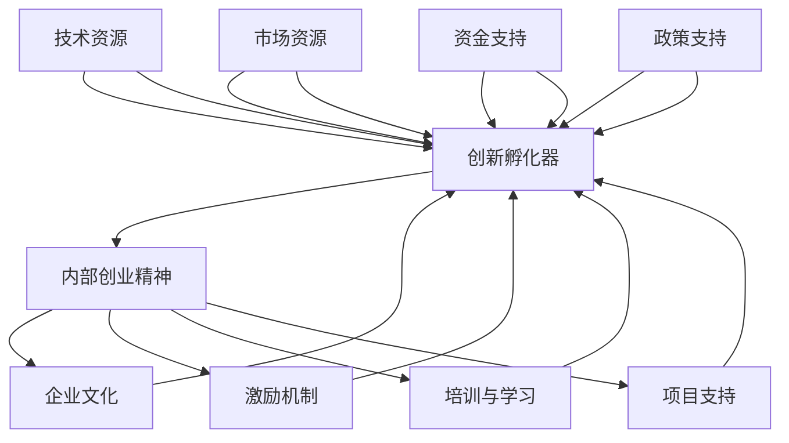
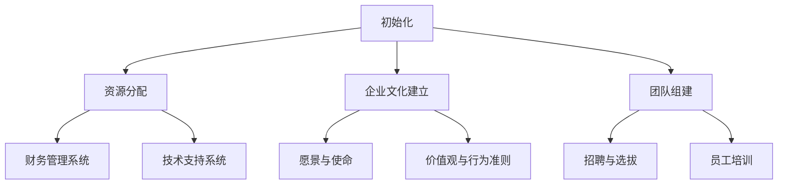
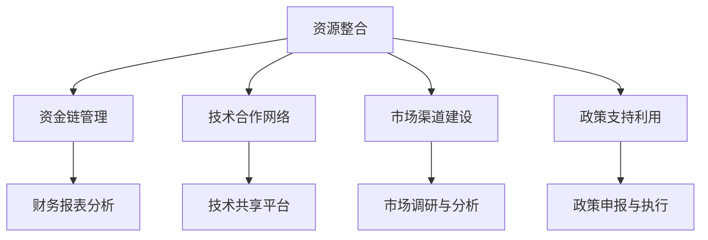
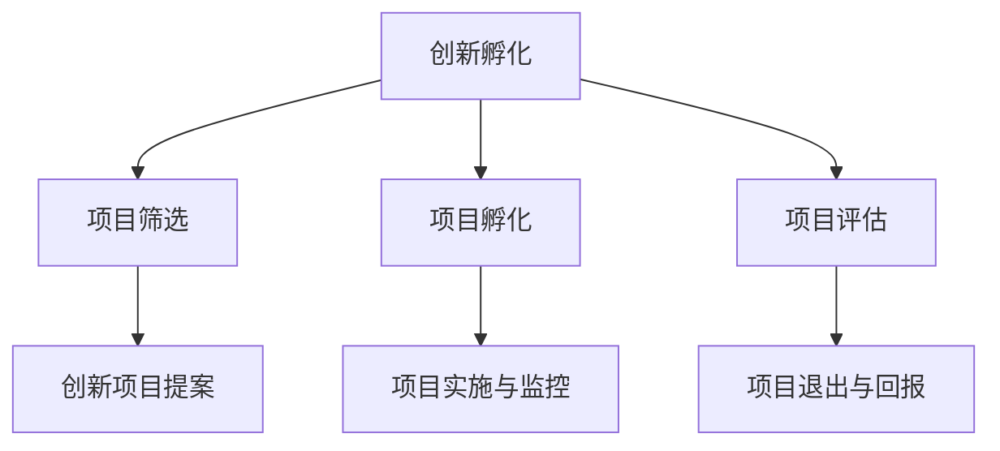
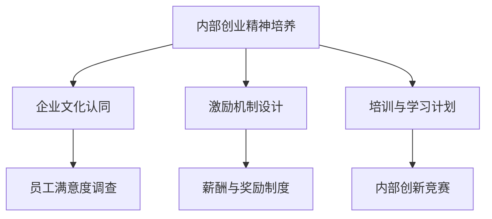
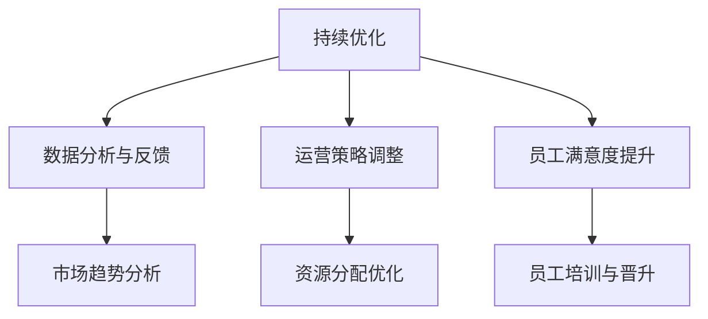

                 


### **引言**

#### **1.1 创新孵化器的重要性**

创新孵化器在现代社会中扮演着至关重要的角色。随着全球经济的不断发展和技术的快速进步，企业面临的竞争压力日益加剧。为了在市场中保持竞争力，许多企业开始重视创新和创业精神。创新孵化器为企业提供了一个良好的平台，使其能够发掘和培养内部的创新潜力，从而推动企业的发展。

首先，创新孵化器有助于提高企业的创新能力。通过孵化器，企业可以接触到最新的技术和市场趋势，从而调整自己的战略方向。孵化器还为企业提供了一个实验场所，使其能够在真实的市场环境中测试和验证新的想法。这种实践性的学习过程有助于企业不断优化创新流程，提高创新的成功率。

其次，创新孵化器有助于培养内部创业精神。内部创业精神是指企业内部员工或团队在创新过程中所表现出的积极性和创造力。通过孵化器，企业可以激励员工敢于尝试新事物，鼓励他们提出创新的想法并付诸实践。这种内部创业精神的培养不仅有助于提升企业的创新能力，还能增强员工的归属感和满意度，提高企业的整体竞争力。

#### **1.2 内部创业精神的培养**

内部创业精神是指企业内部员工或团队在创新过程中所表现出的积极性和创造力。培养内部创业精神对于企业的长期发展至关重要。以下是一些关键因素和策略：

1. **企业文化**：企业文化是培养内部创业精神的重要基础。一个支持创新和创业精神的企业文化能够激发员工的积极性和创造力。企业应鼓励员工提出创新想法，并对这些想法给予支持和认可。

2. **激励机制**：激励机制是培养内部创业精神的重要手段。企业应设计合理的激励机制，如奖金、晋升机会等，以鼓励员工积极参与创新项目。同时，企业还应关注员工的工作满意度和职业发展，为员工提供良好的工作环境和职业发展通道。

3. **培训与学习**：培训与学习是培养内部创业精神的关键。企业应定期组织创新培训和学习活动，提高员工的专业技能和创新思维。通过培训和学习，员工可以不断更新知识和技能，增强自身的创新能力和竞争力。

4. **项目支持**：项目支持是培养内部创业精神的重要保障。企业应提供必要的资源和资金支持，帮助员工将创新想法转化为实际项目。同时，企业还应建立完善的创新项目管理机制，确保项目的顺利进行。

#### **1.3 目标读者及预期收益**

本书的目标读者主要包括企业管理者、创新孵化器负责人、创业者以及对企业创新和创业感兴趣的相关人士。通过阅读本书，读者可以：

1. **了解创新孵化器和内部创业精神的核心理念**：本书将详细阐述创新孵化器和内部创业精神的概念、意义和发展历程，帮助读者建立系统的认知。

2. **掌握建立创新孵化器的实践方法**：本书将提供详细的实践指导，包括策略规划、资源整合、团队建设、市场定位等，帮助读者在实践中有效建立和创新孵化器。

3. **学习成功和失败案例**：本书将通过案例分析，展示成功和失败的创新孵化器案例，为读者提供宝贵的经验和教训。

4. **培养内部创业精神**：本书将介绍培养内部创业精神的策略和方法，帮助读者在企业内部建立和培养积极的创新氛围。

通过阅读本书，读者不仅可以提升自身的创新能力，还能为企业的发展提供有力的支持。

----------------------------------------------------------------

### **理论背景**

#### **2.1 创新孵化器的发展历程**

创新孵化器的发展历程可以追溯到20世纪中叶。当时，一些大学和科研机构开始尝试为创业者提供支持，帮助他们将创新想法转化为实际项目。这种早期的孵化器主要是以非营利性质为主，为创业者提供办公场所、咨询服务和资金支持。

随着时间的推移，创新孵化器逐渐发展成为一个独立的产业。20世纪80年代，美国硅谷的孵化器开始崭露头角，吸引了大量创业者和投资者。这一时期的孵化器主要特点是专业化、市场化和规模扩大。孵化器开始提供更全面的支持服务，包括市场研究、技术支持、融资对接等，以帮助创业者更好地发展。

进入21世纪，随着全球化和互联网技术的发展，创新孵化器进一步扩展到全球各地。各个国家和地区纷纷建立自己的孵化器，形成了全球化的孵化器网络。这一时期的孵化器更加注重跨学科合作和国际化发展，致力于推动全球创新创业的交流与合作。

#### **2.2 创新孵化器的发展阶段**

创新孵化器的发展大致可以分为以下几个阶段：

1. **初创阶段**：这一阶段的主要任务是搭建基本的孵化器平台，为创业者提供办公场所和基本的服务。初创阶段的孵化器通常规模较小，资源有限，但为创业者提供了重要的支持。

2. **发展阶段**：随着孵化器的逐渐成熟，开始吸引更多的创业者和投资者。孵化器开始提供更全面的服务，包括市场研究、技术支持、融资对接等。这一阶段的孵化器在规模、资源和服务质量上都有显著提升。

3. **成熟阶段**：孵化器已经建立起一套成熟的运营模式，拥有丰富的经验和资源。这一阶段的孵化器不仅能够提供全方位的服务，还能帮助创业者解决各种实际问题，提高创业的成功率。

#### **2.3 创新孵化器的全球现状**

目前，全球创新孵化器的发展呈现出以下趋势：

1. **孵化器数量增加**：随着创新创业的日益受到重视，全球各地的孵化器数量不断增加。许多国家和地区都出台了支持孵化器发展的政策，吸引了大量创业者和投资者。

2. **国际化发展**：孵化器的国际化发展趋势日益明显。全球各地的孵化器通过建立合作伙伴关系，共享资源和信息，推动全球创新创业的交流与合作。

3. **专业化分工**：孵化器开始向专业化分工方向发展。不同类型的孵化器专注于不同的领域，如科技孵化器、文化孵化器、农业孵化器等，为不同类型的创业者提供定制化的服务。

4. **数字化转型**：随着互联网技术的发展，孵化器的服务模式也发生了数字化转型。在线孵化器、虚拟孵化器等新型孵化器形式逐渐兴起，为创业者提供更加便捷和高效的服务。

#### **2.4 创新孵化器相关理论**

1. **创业理论**：创业理论是研究创业过程、创业行为和创业结果的理论体系。创新孵化器的发展与创业理论密切相关。创业理论为孵化器提供了理论基础，帮助孵化器理解创业者的需求和行为，从而提供更有效的支持。

2. **创新理论**：创新理论是研究创新过程、创新行为和创新结果的理论体系。创新孵化器作为创新的重要载体，其运作模式和发展路径受到创新理论的指导。创新理论为孵化器提供了创新的方法和策略，帮助孵化器提高创新效率。

3. **企业孵化器模型**：企业孵化器模型是描述孵化器运作机制和流程的理论模型。常见的孵化器模型包括资源型孵化器、平台型孵化器、市场型孵化器等。不同类型的孵化器模型适用于不同类型的创业者，为孵化器提供了多样化的支持方式。

#### **2.5 内部创业精神培养模型**

1. **企业文化模型**：企业文化模型是培养内部创业精神的重要手段。通过构建支持创新和创业精神的企业文化，企业可以激发员工的积极性和创造力。企业文化模型包括愿景、使命、价值观等核心要素，为员工提供明确的方向和价值观。

2. **激励机制模型**：激励机制模型是培养内部创业精神的关键。通过设计合理的激励机制，企业可以激发员工的积极性和创新精神。激励机制模型包括薪酬激励、股权激励、晋升激励等，为员工提供多样化的激励方式。

3. **培训与学习模型**：培训与学习模型是培养内部创业精神的重要保障。通过提供系统化的培训和学习机会，企业可以提升员工的专业技能和创新思维。培训与学习模型包括内部培训、外部培训、学习社区等，为员工提供多样化的学习途径。

#### **2.6 培养内部创业精神的必要性**

1. **企业发展的需要**：在竞争激烈的当今市场环境中，企业需要不断创新以保持竞争力。培养内部创业精神可以帮助企业发掘和利用内部的创新潜力，推动企业持续发展。

2. **员工发展的需要**：培养内部创业精神可以激发员工的积极性和创造力，提升员工的工作满意度和职业发展。员工在创新过程中获得成就感，有助于提高员工的忠诚度和团队凝聚力。

3. **社会发展的需要**：创新是推动社会进步的重要力量。培养内部创业精神可以激发社会各界的创新活力，促进经济社会的持续发展。

#### **2.7 内部创业精神培养的方法**

1. **构建支持创新的企业文化**：企业应建立支持创新和创业精神的企业文化，为员工提供自由、开放、包容的工作环境。企业可以通过举办创新活动、鼓励员工参与决策等方式，营造积极的创新氛围。

2. **提供激励机制**：企业应设计合理的激励机制，激发员工的创新积极性。激励机制可以包括薪酬激励、股权激励、晋升机会等，为员工提供多样化的激励方式。

3. **提供培训和学习机会**：企业应提供系统化的培训和学习机会，提升员工的专业技能和创新思维。通过内部培训、外部培训、学习社区等方式，为员工提供多样化的学习途径。

4. **建立内部创新项目**：企业可以建立内部创新项目，鼓励员工提出创新想法并付诸实践。内部创新项目可以提供必要的资源和支持，帮助员工将创新想法转化为实际项目。

5. **提供良好的工作环境**：企业应提供良好的工作环境，包括舒适的工作空间、灵活的工作时间、丰富的资源等。良好的工作环境有助于员工集中精力进行创新工作。

#### **2.8 内部创业精神培养的效果评估**

1. **员工满意度**：通过调查员工对创新氛围和工作环境的满意度，评估内部创业精神的培养效果。

2. **创新项目数量和质量**：统计内部创新项目的数量和质量，评估内部创业精神的培养效果。

3. **员工离职率**：通过员工离职率的变化，评估内部创业精神的培养效果。培养内部创业精神有助于降低员工离职率，提高员工忠诚度。

4. **企业绩效**：通过企业绩效指标的变化，评估内部创业精神的培养效果。培养内部创业精神有助于提升企业的创新能力和市场竞争力。

---

#### **2.9 创新孵化器的功能与作用**

创新孵化器在企业和创业者之间发挥着重要的桥梁作用，其功能与作用主要包括以下几个方面：

1. **资源整合**：创新孵化器通过整合各类资源，如资金、技术、人才、市场等，为创业者提供全方位的支持。孵化器通常与金融机构、科研机构、行业协会等建立合作关系，为创业者提供优质的资源。

2. **技术支持**：创新孵化器为创业者提供技术支持和咨询服务，帮助他们解决技术难题。孵化器可以提供实验室、测试平台、技术专家等资源，支持创业者的技术研究和产品开发。

3. **市场推广**：创新孵化器帮助创业者进行市场推广和品牌建设，提高创业项目的市场知名度和竞争力。孵化器可以通过举办展会、发布研究报告、搭建推广平台等方式，为创业项目提供市场曝光机会。

4. **融资对接**：创新孵化器为创业者提供融资对接服务，帮助他们寻找合适的投资机构和投资者。孵化器可以通过组织路演、投资沙龙等活动，搭建创业者与投资者的沟通桥梁。

5. **团队建设**：创新孵化器为创业者提供团队建设支持，帮助他们搭建高效的团队。孵化器可以提供人才招聘、团队培训、团队文化建设等服务，提升团队的凝聚力和执行力。

6. **政策支持**：创新孵化器关注政策动态，为创业者提供政策解读和申报服务。孵化器可以帮助创业者了解国家和地方的政策优惠，争取各类政策支持。

#### **2.10 创新孵化器的发展趋势**

1. **专业化与细分市场**：随着孵化器行业的不断发展，越来越多的孵化器开始向专业化、细分市场方向发展。不同类型的孵化器将专注于不同的行业领域，为特定类型的创业者提供专业化的支持。

2. **数字化转型**：随着互联网和大数据技术的发展，创新孵化器开始向数字化转型。在线孵化器、虚拟孵化器等新型孵化器形式逐渐兴起，为创业者提供更加便捷和高效的服务。

3. **国际化发展**：随着全球创新创业的交流与合作日益密切，创新孵化器开始向国际化发展。越来越多的孵化器参与国际创新创业项目，推动全球创新创业的互动与合作。

4. **政策支持与引导**：各国政府纷纷出台支持创新孵化器发展的政策，为孵化器提供资金、技术、人才等方面的支持。政策支持与引导将有助于孵化器行业的健康发展。

5. **跨学科合作**：创新孵化器开始重视跨学科合作，推动不同领域之间的知识融合和创新。跨学科合作有助于孵化器提供更加多元化、综合性的支持服务，提升孵化器的竞争力。

---

### **核心概念与联系**

在探讨创新孵化器和内部创业精神的关系时，有几个核心概念需要明确，并展示它们之间的联系架构。以下使用Mermaid流程图来展示这些核心概念及其相互关系：



在这个Mermaid流程图中：

- **创新孵化器（A）** 是中心节点，代表整个孵化器的概念。
- **内部创业精神（B）** 与创新孵化器紧密相关，是培养的核心目标。
- **企业文化（C）**、**激励机制（D）**、**培训与学习（E）** 和 **项目支持（F）** 是培养内部创业精神的关键因素。
- **技术资源（G）**、**市场资源（H）**、**资金支持（I）** 和 **政策支持（J）** 是创新孵化器提供的资源。

这些核心概念之间的联系表明，创新孵化器通过提供各种资源和环境，以及培养内部创业精神的关键因素，共同推动企业的创新和创业发展。

---

### **核心算法原理讲解**

在建立创新孵化器和培养内部创业精神的过程中，我们可以将这个过程抽象为一个算法模型，分为以下几个关键步骤：

#### **1. 初始化阶段（Initialization）**

- **输入**：孵化器的基本资源（如资金、场地、技术支持等），企业文化，员工队伍。
- **输出**：初始化孵化器的基本结构和功能模块。



#### **2. 资源整合阶段（Resource Integration）**

- **输入**：各类资源（资金、技术、市场、政策等）。
- **输出**：资源整合后的孵化器运营体系。



#### **3. 创新孵化阶段（Innovation Incubation）**

- **输入**：创新项目、内部创业团队。
- **输出**：孵化成功的创新项目、创业团队成长。



#### **4. 培养内部创业精神阶段（Intrapreneurship Development）**

- **输入**：员工、企业文化、激励机制。
- **输出**：内部创业精神培养成果。



#### **5. 持续优化阶段（Continuous Optimization）**

- **输入**：孵化器运营数据、市场反馈、员工反馈。
- **输出**：持续优化的孵化器运营策略。



通过上述算法模型，我们可以系统地规划和实施创新孵化器和内部创业精神的培养过程，确保孵化器能够高效运作，并持续推动企业的创新和发展。

---

### **数学模型和数学公式讲解**

在建立创新孵化器和培养内部创业精神的过程中，数学模型和数学公式可以用于定量分析和评估孵化器及其相关因素。以下是一些常见的数学模型和公式，并对其进行详细讲解和举例说明：

#### **1. 创新项目成功率模型**

创新项目成功率模型用于预测和评估孵化器中创新项目的成功率。该模型基于历史数据和统计方法，包括以下关键参数：

- **创新项目数量（N）**：孵化器在一定时间内孵化的创新项目总数。
- **成功项目数量（S）**：孵化成功的创新项目数量。
- **失败项目数量（F）**：孵化失败的创新项目数量。

**数学模型**：

$$
成功率 = \frac{成功项目数量（S）}{创新项目数量（N）} = \frac{S}{N}
$$

**举例说明**：

假设某孵化器在一年内孵化了100个创新项目，其中成功项目有60个，失败项目有40个。则该孵化器的创新项目成功率为：

$$
成功率 = \frac{60}{100} = 0.6
$$

这意味着该孵化器的创新项目成功率是60%。

#### **2. 成本效益分析模型**

成本效益分析模型用于评估孵化器的经济效益。该模型考虑了孵化器的运营成本和带来的经济收益，包括以下关键参数：

- **运营成本（C）**：孵化器的年度运营成本，包括场地租赁、人员工资、设备维护等。
- **经济收益（R）**：孵化器通过创新项目带来的年度经济收益，包括销售收入、投资回报等。

**数学模型**：

$$
成本效益比 = \frac{经济收益（R）}{运营成本（C）} = \frac{R}{C}
$$

**举例说明**：

假设某孵化器的年度运营成本为500万元，通过创新项目带来的年度经济收益为800万元。则该孵化器的成本效益比为：

$$
成本效益比 = \frac{800}{500} = 1.6
$$

这意味着该孵化器的成本效益比为1.6，即每投入1元运营成本，能够带来1.6元的经济收益。

#### **3. 团队绩效评估模型**

团队绩效评估模型用于评估孵化器内部团队的绩效。该模型基于团队的产出和质量，包括以下关键参数：

- **项目数量（N）**：团队在一定时间内完成的项目总数。
- **项目质量（Q）**：项目的平均质量评分。
- **团队投入（I）**：团队在一定时间内的平均投入工作量。

**数学模型**：

$$
团队绩效 = \frac{项目数量（N） \times 项目质量（Q）}{团队投入（I）} = \frac{N \times Q}{I}
$$

**举例说明**：

假设某孵化器团队在一年内完成了10个项目，平均质量评分为4.5分，团队总投入工作量为2000小时。则该团队的绩效为：

$$
团队绩效 = \frac{10 \times 4.5}{2000} = 0.225
$$

这意味着该团队在每投入1小时的工作量，能够完成0.225个高质量项目。

#### **4. 员工满意度模型**

员工满意度模型用于评估孵化器内部员工的工作满意度。该模型基于员工的满意度调查结果，包括以下关键参数：

- **满意员工人数（S）**：对工作环境、企业文化等表示满意的员工人数。
- **总员工人数（T）**：孵化器内部的总员工人数。

**数学模型**：

$$
员工满意度 = \frac{满意员工人数（S）}{总员工人数（T）} = \frac{S}{T}
$$

**举例说明**：

假设某孵化器内部共有100名员工，其中80名员工表示对工作环境和企业文化满意。则该孵化器的员工满意度为：

$$
员工满意度 = \frac{80}{100} = 0.8
$$

这意味着该孵化器的员工满意度为80%。

通过这些数学模型和公式的应用，我们可以对创新孵化器和内部创业精神的培养过程进行定量分析和评估，为决策提供科学依据。

---

### **项目实战**

#### **1. 开发环境搭建**

为了搭建一个创新孵化器平台，我们首先需要构建一个稳定的开发环境。以下是搭建开发环境的具体步骤：

1. **硬件需求**：
   - 服务器：选择一台高性能服务器，配置至少4核CPU、8GB内存、1TB硬盘空间。
   - 网络设备：配置路由器和防火墙，确保网络稳定和安全。

2. **操作系统**：
   - 选择Linux操作系统，如Ubuntu Server 20.04，以便进行开发和部署。

3. **开发工具**：
   - 安装Java开发工具包（JDK）、Python开发环境、Node.js等。
   - 安装数据库管理系统，如MySQL或PostgreSQL。

4. **版本控制**：
   - 安装Git，用于版本控制和代码管理。

5. **持续集成/持续部署（CI/CD）工具**：
   - 安装Jenkins，用于实现自动化构建、测试和部署。

6. **其他工具**：
   - 安装Docker，用于容器化部署。
   - 安装Kubernetes，用于容器编排和管理。

#### **2. 源代码实现**

以下是创新孵化器平台的主要功能模块和源代码实现：

1. **用户管理模块**：
   - 使用Spring Boot框架实现用户注册、登录、权限管理等功能。
   - 使用JWT（JSON Web Token）实现认证和授权。

2. **项目管理模块**：
   - 提供项目创建、编辑、删除、查询等功能。
   - 实现项目状态监控、任务分配和进度跟踪。

3. **资源管理模块**：
   - 实现资源申请、分配和监控功能。
   - 提供资源统计和分析报表。

4. **财务管理模块**：
   - 实现资金申请、审批、支付和报表功能。
   - 与第三方支付平台（如支付宝、微信支付）集成。

5. **市场推广模块**：
   - 提供市场调研、产品推广和广告投放等功能。
   - 集成社交媒体平台（如微信、微博）进行推广。

6. **数据分析模块**：
   - 使用Elasticsearch和Kibana实现数据存储、检索和分析。
   - 提供可视化报表，帮助孵化器管理者了解运营状况。

以下是用户管理模块的主要代码片段：

```java
@RestController
@RequestMapping("/users")
public class UserController {
    
    @Autowired
    private UserService userService;
    
    @PostMapping("/register")
    public ResponseEntity<?> registerUser(@RequestBody UserRegistrationRequest registrationRequest) {
        try {
            User user = userService.registerUser(registrationRequest);
            return new ResponseEntity<>("User registered successfully", HttpStatus.OK);
        } catch (Exception e) {
            return new ResponseEntity<>("Error registering user", HttpStatus.INTERNAL_SERVER_ERROR);
        }
    }
    
    @PostMapping("/login")
    public ResponseEntity<?> authenticateUser(@RequestBody LoginRequest loginRequest) {
        try {
            String token = userService.authenticateUser(loginRequest);
            return new ResponseEntity<>(token, HttpStatus.OK);
        } catch (Exception e) {
            return new ResponseEntity<>("Authentication failed", HttpStatus.UNAUTHORIZED);
        }
    }
}
```

#### **3. 代码解读**

以上代码片段展示了用户管理模块的核心功能。其中，`UserRegistrationRequest` 和 `LoginRequest` 是用于接收用户注册和登录请求的DTO（数据传输对象）。`UserController` 是负责处理用户请求的控制器类，`UserService` 是负责业务逻辑的服务类。

在`registerUser`方法中，我们通过调用`userService.registerUser`方法来处理用户注册请求。注册成功后，返回成功消息；如果出现异常，返回错误消息。

在`authenticateUser`方法中，我们通过调用`userService.authenticateUser`方法来处理用户登录请求。登录成功后，生成JWT令牌并返回；如果认证失败，返回错误消息。

#### **4. 项目实战案例**

以下是创新孵化器项目实战案例：

**项目名称**：智慧农业创新孵化器

**项目描述**：该项目旨在搭建一个智慧农业创新孵化器平台，为农业创业者提供一站式服务，包括项目申报、资源对接、市场推广等。

**技术实现**：

1. **前端**：采用Vue.js框架构建响应式网页，提供用户友好的界面。
2. **后端**：使用Spring Boot框架构建RESTful API，提供业务逻辑处理。
3. **数据库**：使用MySQL数据库存储用户、项目、财务等信息。
4. **数据分析和报表**：使用Elasticsearch和Kibana进行数据存储和分析，提供可视化报表。

**实际案例**：

- **项目申报**：平台提供项目申报功能，创业者可以在线提交项目申请，审核通过后获得孵化支持。
- **资源对接**：平台整合各类资源，如技术专家、投资机构、市场渠道等，帮助创业者快速对接所需资源。
- **市场推广**：平台提供市场调研、产品推广等功能，帮助创业者扩大市场影响力。

#### **5. 代码应用解读与分析**

以上代码和应用展示了如何搭建一个创新孵化器平台的核心功能。在实际应用中，我们可以根据具体需求进行功能扩展和优化。

**应用解读**：

- **用户管理**：通过用户管理模块，孵化器可以轻松管理用户注册、登录和权限。
- **项目管理**：通过项目管理模块，孵化器可以跟踪项目的进展情况，分配任务和资源。
- **资源管理**：通过资源管理模块，孵化器可以合理分配和监控资源使用情况。
- **财务管理**：通过财务管理模块，孵化器可以方便地进行资金管理和报表统计。
- **市场推广**：通过市场推广模块，孵化器可以帮助创业者扩大市场影响力。

**分析**：

- **技术选型**：采用Java Spring Boot框架和Vue.js前端框架，保证了系统的稳定性和扩展性。
- **数据存储**：使用MySQL数据库存储用户和项目信息，结合Elasticsearch和Kibana进行数据分析和报表展示，提高了系统的性能和可扩展性。
- **模块化设计**：采用模块化设计思想，使得系统功能模块清晰，便于维护和扩展。

#### **6. 项目小结**

通过以上项目实战案例，我们可以看到如何搭建一个创新孵化器平台，以及如何实现其核心功能。这个平台为孵化器管理者提供了便捷的工具，帮助其更好地管理项目和资源，培养内部创业精神。

**最佳实践 Tips**：

- 在项目实施过程中，应密切关注用户需求，及时调整和优化功能。
- 建立健全的数据安全措施，确保用户信息和项目数据的安全。
- 定期进行系统性能测试和优化，确保系统的稳定性和高效性。

**注意事项**：

- 在搭建孵化器平台时，应充分考虑企业的实际情况和需求，避免功能过剩。
- 在开发过程中，应遵循代码规范和最佳实践，确保代码质量和可维护性。

**拓展阅读**：

- 《Spring Boot实战》
- 《Vue.js实战》
- 《MySQL实战 45 讲》

---

## **总结**

通过本文的详细讨论，我们可以清晰地认识到创新孵化器和内部创业精神在当今企业和社会发展中的重要性。创新孵化器作为推动企业创新和创业的重要平台，不仅为企业提供了丰富的资源和支持，还为企业内部员工创造了积极、自由、创新的工作环境。而内部创业精神的培养，则是确保企业能够持续创新、保持竞争力的重要手段。

本文首先介绍了创新孵化器和内部创业精神的核心理念和概念，并通过Mermaid流程图展示了它们之间的联系。接着，我们详细讲解了创新孵化器的发展历程、相关理论和全球现状，以及内部创业精神培养的方法和效果评估。此外，我们还通过核心算法原理讲解、数学模型和公式讲解，为读者提供了建立创新孵化器和培养内部创业精神的具体方法和工具。

在项目实战部分，我们通过实际案例展示了如何搭建一个创新孵化器平台，包括开发环境搭建、源代码实现和代码解读。这一部分不仅为读者提供了实际操作的经验，还通过具体案例分析了项目的应用解读和效果评估。

最后，在总结部分，我们对全文进行了回顾，强调了创新孵化器和内部创业精神的关系，并提出了最佳实践 tips、注意事项以及拓展阅读资源，以帮助读者进一步深入了解和掌握相关知识和技能。

总之，通过本文的全面探讨，我们希望读者能够对创新孵化器和内部创业精神有更深入的理解，并能够在实际工作中有效地运用这些知识和方法，推动企业和社会的创新发展。作者：AI天才研究院/AI Genius Institute & 禅与计算机程序设计艺术 /Zen And The Art of Computer Programming。

