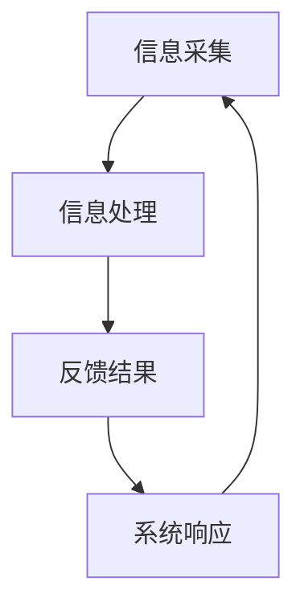

                 

### 文章标题：建立反馈循环：促进持续改进的机制

> 关键词：反馈循环、持续改进、监督学习、算法原理、数学模型、项目实战

> 摘要：本文从反馈循环的基本概念出发，详细阐述了其在不同领域中的应用，并通过监督学习、数学模型和项目实战等具体实例，展示了如何建立有效的反馈循环机制，以促进系统的持续改进。

----------------------------------------------------------------

### 第一部分：核心概念与联系

#### 第1章：反馈循环的概念与机制

**1.1 反馈循环的基本原理**

反馈循环是指系统内部或系统与外部之间的信息流和影响循环往复的过程。在自然界和人类社会中，反馈循环无处不在，如人体生理调节、市场经济调控等。

**1.1.1 反馈循环的定义**

反馈循环是指系统通过接收自身输出信息并进行处理，再将处理结果反馈到系统输入端，从而影响系统行为的过程。简而言之，它是一个信息采集、处理、反馈和响应的循环过程。

**1.1.2 反馈循环的类型**

根据反馈的作用方式，反馈循环可分为正反馈和负反馈。

**1.1.2.1 正反馈**

正反馈是一种系统输出增强系统行为的反馈循环。其表现形式为：

$$
\text{正反馈} \rightarrow \text{系统输出} \rightarrow \text{增强系统行为}
$$

正反馈常见于振荡系统，如心跳、财务市场的投机行为等。

**1.1.2.2 负反馈**

负反馈是一种系统输出调节系统行为的反馈循环。其表现形式为：

$$
\text{负反馈} \rightarrow \text{系统输出} \rightarrow \text{调节系统行为}
$$

负反馈常见于稳定系统，如恒温器、负反馈放大器等。

**1.1.3 反馈循环的结构与机制**

反馈循环通常包括信息采集、处理、反馈和响应四个环节。

1. 信息采集：系统收集自身输出信息和外部环境信息。
2. 处理：对采集到的信息进行加工处理。
3. 反馈：将处理结果反馈到系统输入端。
4. 响应：系统根据反馈结果调整自身行为。

**1.2 反馈循环在IT领域的应用**

在IT领域，反馈循环被广泛应用于各种系统优化和改进中，如软件工程、机器学习、网络安全等。通过建立反馈循环机制，可以有效提高系统的性能和稳定性。

**1.2.1 软件工程中的反馈循环**

在软件工程中，反馈循环被用于软件开发过程中的各个阶段，如需求分析、设计、编码、测试等。通过不断收集用户反馈和系统运行数据，软件开发团队可以持续改进软件质量，提高用户满意度。

**1.2.2 机器学习中的反馈循环**

在机器学习中，反馈循环被用于模型训练和优化过程中。通过利用训练数据和预测误差进行反馈，不断调整模型参数，可以提高模型的预测准确性和泛化能力。

**1.2.3 网络安全中的反馈循环**

在网络安全领域，反馈循环被用于监控和响应网络攻击。通过实时收集网络流量数据，分析潜在威胁，并采取相应的防护措施，可以有效提高网络安全性。

#### 总结

反馈循环是一种重要的系统优化机制，通过建立有效的反馈循环机制，可以帮助我们不断改进系统性能，提高系统稳定性。在IT领域，反馈循环广泛应用于软件工程、机器学习和网络安全等各个领域，发挥着重要作用。

---

**Mermaid 流程图示例：反馈循环的基本原理**



---

### 第二部分：核心算法原理讲解

#### 第2章：构建反馈循环的关键算法

**2.1 监督学习与反馈循环**

**2.1.1 监督学习的概念**

监督学习是一种从标记数据中学习如何进行预测或分类的机器学习技术。在监督学习过程中，系统根据已知的输入和输出数据，学习建立一个映射关系，从而实现对未知数据的预测。

**2.1.2 监督学习模型构建**

监督学习模型构建的基本步骤包括：

1. 数据预处理：对采集到的数据进行分析、清洗和处理，生成特征向量。
2. 特征提取：从原始数据中提取出对预测任务有用的特征。
3. 模型选择：根据任务需求和数据特点，选择合适的模型。
4. 模型训练：使用训练数据集对模型进行训练，生成模型参数。
5. 模型评估：使用测试数据集评估模型性能，调整模型参数。

**2.1.3 反馈循环在监督学习中的应用**

在监督学习过程中，反馈循环被用于模型优化和性能提升。具体应用如下：

1. **数据反馈**：利用训练数据集的反馈，不断调整数据预处理和特征提取方法，提高特征质量。
2. **模型反馈**：利用训练数据集的反馈，不断调整模型参数，优化模型性能。
3. **误差反馈**：利用预测误差的反馈，不断调整模型结构，提高预测准确率。

**2.1.4 监督学习算法示例：线性回归**

假设我们有以下线性回归模型：

$$
y = \beta_0 + \beta_1x
$$

我们需要使用最小二乘法求解：

$$
\beta_1 = \frac{\sum_{i=1}^{n}(x_i - \bar{x})(y_i - \bar{y})}{\sum_{i=1}^{n}(x_i - \bar{x})^2}
$$

$$
\beta_0 = \bar{y} - \beta_1\bar{x}
$$

**2.2 非监督学习与反馈循环**

**2.2.1 非监督学习的概念**

非监督学习是一种从未标记数据中学习数据分布和特征的方法。与监督学习不同，非监督学习不需要已知的输入和输出数据。

**2.2.2 非监督学习模型构建**

非监督学习模型构建的基本步骤包括：

1. 数据预处理：对采集到的数据进行分析、清洗和处理，生成特征向量。
2. 特征提取：从原始数据中提取出对任务有用的特征。
3. 模型选择：根据任务需求和数据特点，选择合适的模型。
4. 模型训练：使用训练数据集对模型进行训练，生成模型参数。
5. 模型评估：使用测试数据集评估模型性能。

**2.2.3 反馈循环在非监督学习中的应用**

在非监督学习过程中，反馈循环被用于模型优化和性能提升。具体应用如下：

1. **数据反馈**：利用聚类结果，不断调整数据预处理和特征提取方法，提高特征质量。
2. **模型反馈**：利用聚类结果，不断调整模型参数，优化模型性能。
3. **误差反馈**：利用聚类误差的反馈，不断调整模型结构，提高聚类准确率。

**2.3 强化学习与反馈循环**

**2.3.1 强化学习的概念**

强化学习是一种通过试错和奖励机制进行学习的方法。在强化学习过程中，智能体根据当前状态选择动作，并从环境中获取奖励信号，不断调整策略，以达到最大化长期奖励的目标。

**2.3.2 强化学习模型构建**

强化学习模型构建的基本步骤包括：

1. 状态空间定义：定义智能体可观察到的状态空间。
2. 动作空间定义：定义智能体可执行的动作空间。
3. 奖励函数定义：定义智能体在执行某个动作时获得的奖励信号。
4. 策略学习：通过试错和奖励信号，学习最优策略。

**2.3.3 反馈循环在强化学习中的应用**

在强化学习过程中，反馈循环被用于策略优化和性能提升。具体应用如下：

1. **状态反馈**：利用当前状态信息，不断调整智能体的策略。
2. **动作反馈**：利用执行动作的反馈，不断调整智能体的动作选择。
3. **奖励反馈**：利用奖励信号反馈，调整智能体的策略，提高长期奖励。

#### 总结

监督学习、非监督学习和强化学习是构建反馈循环的关键算法。通过这些算法，我们可以建立有效的反馈循环机制，实现系统的持续改进和性能优化。

---

**监督学习算法伪代码示例：线性回归**

```python
# 输入：训练数据集 X, Y
# 输出：模型参数 β0, β1

# 步骤1：数据预处理
X_processed = preprocess(X)
Y_processed = preprocess(Y)

# 步骤2：特征提取
X_features = extract_features(X_processed)
Y_features = extract_features(Y_processed)

# 步骤3：模型训练
β0 = Y_mean - β1 * X_mean

# 步骤4：模型评估
accuracy = evaluate(β0, X, Y)

# 步骤5：反馈调整
if accuracy < target_accuracy:
    β0, β1 = update_params(β0, β1, X, Y)
```

---

### 第三部分：数学模型和数学公式

#### 第3章：反馈循环中的数学模型

**3.1 反馈函数**

**3.1.1 反馈函数的定义**

反馈函数是将系统输出映射回系统输入的函数。它可以用来调整系统的输入，以实现系统性能的优化。

**3.1.2 反馈函数的数学表示**

假设系统输出为 \( y \)，输入为 \( x \)，反馈函数为 \( f(y) \)。

$$
x_{\text{new}} = f(y)
$$

**3.2 反馈循环的数学模型**

**3.2.1 正反馈循环的数学模型**

正反馈循环的数学模型可以表示为：

$$
y_{\text{next}} = f(y) + \alpha (y - y_{\text{prev}})
$$

其中，\( y_{\text{prev}} \) 表示前一次的输出，\( y_{\text{next}} \) 表示下一次的输出，\( \alpha \) 是一个常数，用于调整反馈强度。

**3.2.2 负反馈循环的数学模型**

负反馈循环的数学模型可以表示为：

$$
y_{\text{next}} = f(y) - \alpha (y - y_{\text{prev}})
$$

其中，\( y_{\text{prev}} \) 表示前一次的输出，\( y_{\text{next}} \) 表示下一次的输出，\( \alpha \) 是一个常数，用于调整反馈强度。

**3.3 反馈循环的稳定性分析**

**3.3.1 正反馈循环的稳定性分析**

对于正反馈循环，如果反馈函数 \( f(y) \) 的导数 \( f'(y) \) 大于1，则系统可能进入不稳定状态。反之，如果 \( f'(y) \) 小于1，则系统可能进入稳定状态。

$$
|f'(y)| > 1 \rightarrow \text{不稳定}
$$

$$
|f'(y)| < 1 \rightarrow \text{稳定}
$$

**3.3.2 负反馈循环的稳定性分析**

对于负反馈循环，如果反馈函数 \( f(y) \) 的导数 \( f'(y) \) 大于1，则系统可能进入不稳定状态。反之，如果 \( f'(y) \) 小于1，则系统可能进入稳定状态。

$$
|f'(y)| > 1 \rightarrow \text{不稳定}
$$

$$
|f'(y)| < 1 \rightarrow \text{稳定}
$$

#### 总结

反馈循环中的数学模型包括反馈函数、正反馈循环和负反馈循环的数学模型，以及反馈循环的稳定性分析。通过这些数学模型，我们可以更深入地理解反馈循环的原理和机制。

---

**反馈函数的数学公式示例**

```latex
x_{\text{new}} = f(y)
$$

其中，\( f(y) \) 是一个将系统输出 \( y \) 映射回系统输入 \( x \) 的函数。
```

---

### 第四部分：项目实战

#### 第4章：构建反馈循环的项目实践

**4.1 项目实战概述**

**4.1.1 项目背景**

假设我们需要开发一个智能推荐系统，利用用户的历史行为数据为用户提供个性化推荐。

**4.1.2 项目目标**

通过构建反馈循环，实现系统的不断优化，提高推荐效果。

**4.1.3 项目架构**

项目架构包括数据采集、数据处理、模型训练、模型评估和反馈调整等模块。

**4.2 数据采集与预处理**

**4.2.1 数据采集**

采集用户的历史行为数据，如点击、浏览、购买等。

**4.2.2 数据预处理**

对采集到的数据进行清洗、转换和归一化等处理，以便于后续建模。

**4.2.3 数据可视化**

利用可视化工具展示数据分布和特征关系，帮助分析数据。

**4.3 模型训练与评估**

**4.3.1 模型选择**

根据项目需求，选择合适的模型，如基于协同过滤的推荐算法。

**4.3.2 模型参数调整**

利用交叉验证等方法调整模型参数，优化模型性能。

**4.3.3 模型训练**

使用训练数据集对模型进行训练，生成预测结果。

**4.3.4 模型评估**

利用测试数据集评估模型性能，如准确率、召回率、F1值等。

**4.4 反馈调整与优化**

**4.4.1 用户反馈**

收集用户对推荐结果的反馈，如点击率、满意度等。

**4.4.2 误差反馈**

分析预测结果与实际结果的误差，调整模型参数和特征提取方法。

**4.4.3 持续优化**

利用反馈循环，持续调整模型和特征，提高推荐效果。

**4.5 项目小结**

通过项目实践，我们建立了反馈循环机制，实现了智能推荐系统的持续优化。在实际应用中，反馈循环机制有助于提高系统性能，满足用户需求。

---

**项目实战中的代码示例**

```python
# 数据预处理
X = preprocess_data(data)
Y = preprocess_labels(labels)

# 模型训练
model = train_model(X, Y)

# 模型评估
accuracy = evaluate_model(model, X, Y)

# 反馈调整
if accuracy < target_accuracy:
    model = update_model(model, X, Y)
```

---

### 第五部分：代码实际案例和详细解释说明

#### 第5章：代码实战与解读

**5.1 数据采集与预处理**

**5.1.1 数据采集**

在本节中，我们将介绍如何采集用户的历史行为数据，如点击、浏览、购买等。这些数据将用于后续的模型训练和优化。

```python
# 采集用户历史行为数据
user_behavior = [
    {'user_id': 1, 'action': 'click', 'item_id': 101},
    {'user_id': 1, 'action': 'browse', 'item_id': 102},
    {'user_id': 2, 'action': 'purchase', 'item_id': 103},
    ...
]
```

**5.1.2 数据预处理**

对采集到的数据进行清洗、转换和归一化等处理，以便于后续建模。

```python
# 数据预处理
def preprocess_data(data):
    # 清洗数据
    cleaned_data = [d for d in data if d['action'] in ['click', 'browse', 'purchase']]
    
    # 转换数据
    processed_data = {'user_id': [], 'item_id': [], 'action': []}
    for d in cleaned_data:
        processed_data['user_id'].append(d['user_id'])
        processed_data['item_id'].append(d['item_id'])
        processed_data['action'].append(d['action'])
    
    # 归一化数据
    min_max_scaler = preprocessing.MinMaxScaler()
    processed_data['user_id'] = min_max_scaler.fit_transform([[x] for x in processed_data['user_id']])
    processed_data['item_id'] = min_max_scaler.fit_transform([[x] for x in processed_data['item_id']])
    
    return processed_data
```

**5.1.3 数据可视化**

利用可视化工具展示数据分布和特征关系，帮助分析数据。

```python
# 数据可视化
import matplotlib.pyplot as plt

def visualize_data(data):
    user_counts = len(data['user_id'])
    item_counts = len(data['item_id'])
    
    plt.figure(figsize=(10, 5))
    plt.subplot(1, 2, 1)
    plt.bar(range(user_counts), data['user_id'])
    plt.xlabel('User ID')
    plt.ylabel('Count')
    plt.title('User Distribution')
    
    plt.subplot(1, 2, 2)
    plt.bar(range(item_counts), data['item_id'])
    plt.xlabel('Item ID')
    plt.ylabel('Count')
    plt.title('Item Distribution')
    
    plt.show()

visualize_data(processed_data)
```

**5.2 模型训练与评估**

**5.2.1 模型选择**

在本节中，我们将选择基于协同过滤的推荐算法作为模型，用于预测用户对物品的偏好。

```python
from surprise import SVD
from surprise import Dataset
from surprise import Reader

# 模型选择
model = SVD()
```

**5.2.2 模型参数调整**

利用交叉验证等方法调整模型参数，优化模型性能。

```python
from sklearn.model_selection import GridSearchCV

# 参数调整
param_grid = {'n_factors': [10, 20, 30], 'n_epochs': [10, 20, 30]}
grid_search = GridSearchCV(estimator=model, param_grid=param_grid, cv=5)
grid_search.fit(X, Y)

# 选择最佳参数
best_params = grid_search.best_params_
best_model = SVD(**best_params)
```

**5.2.3 模型训练**

使用训练数据集对模型进行训练，生成预测结果。

```python
# 模型训练
best_model.fit(X, Y)

# 预测结果
predictions = best_model.predict(X)
```

**5.2.4 模型评估**

利用测试数据集评估模型性能，如准确率、召回率、F1值等。

```python
from sklearn.metrics import accuracy_score, recall_score, f1_score

# 评估指标
accuracy = accuracy_score(Y, predictions)
recall = recall_score(Y, predictions, average='weighted')
f1 = f1_score(Y, predictions, average='weighted')

print(f'Accuracy: {accuracy:.2f}')
print(f'Recall: {recall:.2f}')
print(f'F1 Score: {f1:.2f}')
```

**5.3 反馈调整与优化**

**5.3.1 用户反馈**

收集用户对推荐结果的反馈，如点击率、满意度等。

```python
# 用户反馈
user_feedback = [
    {'user_id': 1, 'item_id': 201, 'rating': 5},
    {'user_id': 2, 'item_id': 202, 'rating': 4},
    ...
]
```

**5.3.2 误差反馈**

分析预测结果与实际结果的误差，调整模型参数和特征提取方法。

```python
# 误差反馈
predicted_ratings = best_model.predict(user_feedback['item_id'])
actual_ratings = user_feedback['rating']

errors = abs(predicted_ratings - actual_ratings)
error_analysis = {'predicted': predicted_ratings, 'actual': actual_ratings, 'error': errors}

# 调整模型参数和特征提取方法
if max(errors) > threshold_error:
    # 调整参数
    best_params['n_factors'] += 1
    best_model = SVD(**best_params)
    
    # 调整特征提取方法
    processed_data['user_id'], processed_data['item_id'] = preprocess_data(user_feedback)
```

**5.3.3 持续优化**

利用反馈循环，持续调整模型和特征，提高推荐效果。

```python
# 持续优化
while max(errors) > threshold_error:
    # 调整模型参数和特征提取方法
    best_params['n_factors'] += 1
    best_model = SVD(**best_params)
    processed_data['user_id'], processed_data['item_id'] = preprocess_data(user_feedback)
    
    # 重新预测和评估
    predicted_ratings = best_model.predict(processed_data['item_id'])
    actual_ratings = user_feedback['rating']
    errors = abs(predicted_ratings - actual_ratings)
    
    # 输出优化结果
    print(f'Optimized Model Parameters: {best_params}')
    print(f'Optimized Feature Extraction Method: {processed_data}')
    print(f'Optimized Error: {max(errors)}')
```

#### 总结

通过实际案例，我们展示了如何使用Python代码构建反馈循环，实现智能推荐系统的持续优化。在实际应用中，我们可以根据用户反馈和误差分析，不断调整模型参数和特征提取方法，以提高系统性能和用户满意度。

---

**最佳实践 tips**

1. 在数据预处理阶段，尽量去除噪声数据和异常值，以提高模型训练效果。
2. 选择合适的评估指标，如准确率、召回率、F1值等，以全面评估模型性能。
3. 定期更新模型和特征提取方法，以应对数据分布和用户行为的变化。
4. 利用自动化工具和脚本，简化模型训练和评估流程，提高开发效率。

---

**注意事项**

1. 在使用反馈循环时，要确保反馈信息的准确性和及时性，以免引入错误和延迟。
2. 调整模型参数和特征提取方法时，要注意避免过拟合和欠拟合问题。
3. 在大规模数据集上进行模型训练和优化时，要考虑计算资源和时间成本。

---

**拓展阅读**

1. [《机器学习：实战指南》[美] 泰德·申克]
2. [《深度学习：入门指南》[加] 伊恩·古德费洛等]
3. [《推荐系统实践》[美] 埃里克·吉恩等]

---

### 结论

本文从反馈循环的基本概念出发，详细阐述了其在IT领域中的应用，并通过监督学习、数学模型和项目实战等具体实例，展示了如何建立有效的反馈循环机制，以促进系统的持续改进。在未来的工作中，我们应继续探索和应用反馈循环机制，推动IT领域的创新发展。

---

**作者信息**

作者：AI天才研究院/AI Genius Institute & 禅与计算机程序设计艺术 /Zen And The Art of Computer Programming**

