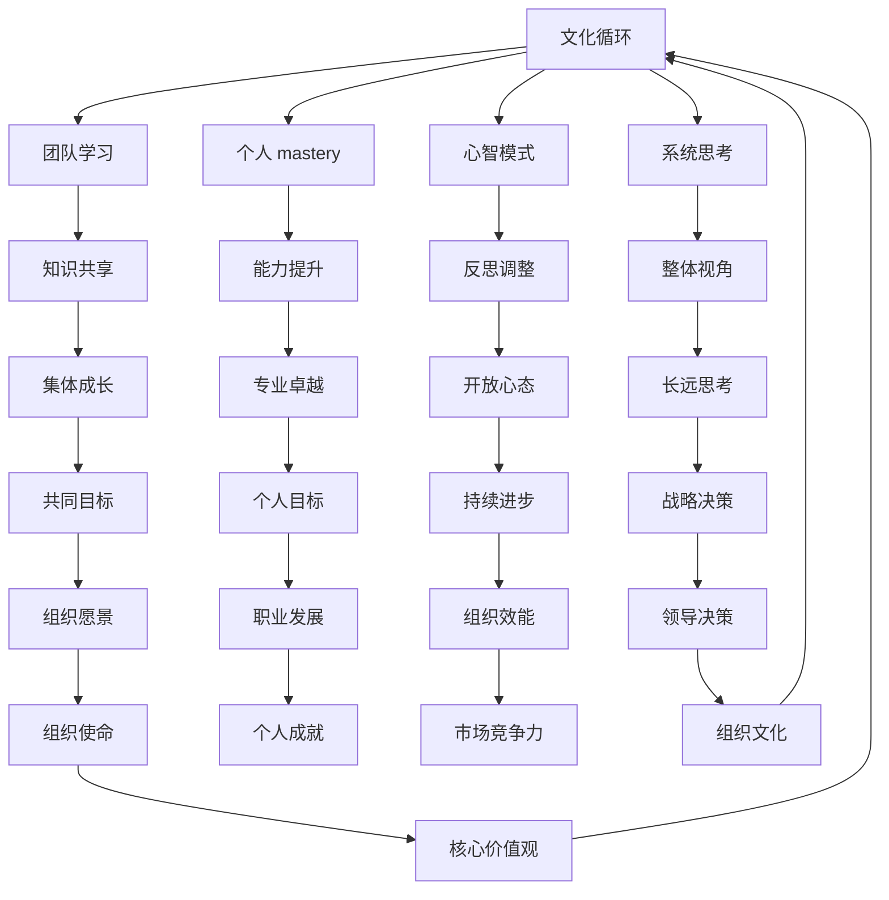

                 

### 文章标题

**建立学习型组织：持续进步的动力**

> **关键词：** 学习型组织，持续进步，领导力，文化，改进模型，算法，数据分析，机器学习

> **摘要：** 本文将深入探讨如何建立学习型组织，强调其在持续进步和成长中的关键作用。通过剖析核心概念、关系架构、领导力角色、学习文化、改进模型、算法和数学模型，结合实际案例，提供详细指导和策略，帮助组织实现真正的学习和成长。

---

### 引言：什么是学习型组织

学习型组织是一个能够通过不断的、系统性的学习过程，自我调整和适应外部环境变化，以实现持续改进和发展的组织。这个概念最早由彼得·圣吉（Peter Senge）在1990年提出的，他在其著作《第五项修炼：学习型组织的艺术与实践》中详细阐述了学习型组织的核心要素和重要性。

学习型组织具有以下几个显著特征：

1. **共同愿景**：组织中的成员共同拥有一个清晰、激励人心的愿景，这个愿景指引着组织的方向和目标。

2. **团队学习**：组织鼓励和支持团队成员之间的合作和知识共享，通过集体学习和合作实现共同成长。

3. **个人 mastery**：个人在不断的学习和实践中提升自己的能力和技能，追求专业上的卓越。

4. **心智模式**：组织成员拥有开放的心态，能够反思和调整自己的思维方式和行为模式。

5. **系统思考**：组织能够从整体和长远的角度看待问题，理解问题的根本原因和潜在影响。

学习型组织的目的是通过持续的学习和适应，提高组织的整体效能和竞争力，实现长期的成功和持续发展。

### 核心概念与关系

为了更好地理解学习型组织的运作原理，我们需要明确几个核心概念，并探讨它们之间的相互关系。以下是一个使用Mermaid绘制的流程图，展示这些概念及其关系：



**共同愿景**是学习型组织的核心驱动力，它为组织提供了明确的方向和目标。团队学习和个人 mastery 是实现共同愿景的关键要素，通过知识共享和能力提升，团队成员能够共同成长。心智模式和系统思考则帮助组织成员在决策过程中保持开放和长远视角，从而更好地适应环境变化。

以下是每个核心概念的解释：

- **共同愿景**：组织成员共享的、具有激励性的长期目标和期望。
- **团队学习**：通过集体合作和知识共享，实现团队成员的共同成长。
- **个人 mastery**：个人在专业领域内的学习和成长，追求卓越。
- **心智模式**：个人和组织内成员的思维方式和行为模式，影响决策和行为。
- **系统思考**：从整体和长期的角度理解问题，把握问题的根本原因和潜在影响。

通过上述概念和关系的理解，我们可以更好地把握学习型组织的运作机制，为其实现持续进步和成长提供理论基础和实践指导。

### 领导力在建立学习型组织中的作用

领导力在建立学习型组织中起着至关重要的作用。一个优秀的领导者不仅是组织的核心，更是推动组织不断学习和适应外部环境变化的催化剂。以下是领导者如何通过几个关键方面影响学习型组织的构建：

1. **设定愿景和目标**：领导者需要明确组织的共同愿景和短期目标，使全体成员清晰了解组织的方向和期望。通过设定具有挑战性和激励性的目标，领导者能够激发团队成员的积极性和创造力，推动组织向前发展。

2. **构建学习文化**：领导者需要以身作则，倡导并实践持续学习和知识分享的文化。通过组织内部的学习研讨会、培训课程和知识交流活动，领导者能够营造一个积极向上的学习氛围，使全体成员认识到学习的重要性。

3. **激励团队成员**：领导者需要关注团队成员的个人成长和职业发展，通过设定合理的激励机制，鼓励成员积极参与学习和创新。例如，可以设立学习积分制度、颁发学习奖励等，以激发成员的学习热情。

4. **促进知识共享**：领导者需要搭建有效的知识共享平台，鼓励团队成员之间分享经验和知识。通过建立学习社区、开展跨部门项目等方式，领导者能够促进团队成员之间的合作与交流，实现知识的积累和传播。

5. **建立反馈机制**：领导者需要建立健全的反馈机制，使团队成员能够及时了解自己的学习效果和改进空间。通过定期的绩效评估和反馈会议，领导者能够帮助团队成员发现并解决问题，提高学习效果。

6. **鼓励创新和试错**：领导者需要创造一个开放、包容的创新环境，鼓励团队成员勇于尝试新想法和解决方案。在创新过程中，领导者应鼓励成员接受失败，从失败中吸取教训，不断优化和改进。

7. **引领系统思考**：领导者需要具备系统思考的能力，从整体和长远的角度看待问题，识别问题的根本原因和潜在影响。通过系统思考，领导者能够帮助组织更好地应对复杂环境和挑战，实现可持续发展。

总之，领导者在建立学习型组织中的角色至关重要。通过设定愿景和目标、构建学习文化、激励团队成员、促进知识共享、建立反馈机制、鼓励创新和试错、引领系统思考等方面，领导者能够有效推动组织的持续学习和进步，为组织的长期成功奠定坚实基础。

### 建立学习文化

建立学习文化是打造学习型组织的核心步骤之一。学习文化不仅指学习活动本身，还包括组织内成员对学习的态度、价值观和行为模式。以下是一些关键的策略和措施，用于培养和维护一个积极的学习文化：

1. **鼓励自主学习**：组织应鼓励成员自主选择学习目标和内容，为其提供充足的学习资源和支持。通过自主学习，成员能够更好地满足个人发展需求，同时为组织带来多样化的知识和技能。

2. **培训和发展计划**：定期组织专业培训和职业发展活动，帮助成员提升专业技能和知识水平。这些培训可以包括内部讲座、外部研讨会、在线课程等，覆盖从基础技能到高级技术的各种内容。

3. **知识共享平台**：建立知识共享平台，如内部论坛、Wiki、学习社区等，方便成员之间分享知识和经验。通过这些平台，成员不仅能够获取他人的见解，还能贡献自己的知识，实现知识的积累和传播。

4. **鼓励跨部门合作**：促进不同部门之间的交流和合作，通过跨部门项目或团队建设活动，培养成员的合作意识和团队精神。跨部门合作能够促进知识的共享和交流，提高组织的整体效能。

5. **认可和奖励机制**：设立学习积分制度、颁发学习奖励、表彰优秀学员等，鼓励成员积极参与学习和知识分享。通过物质和精神双重激励，提高成员的学习积极性和主动性。

6. **创造宽松的学习环境**：为成员创造一个宽松、无压力的学习环境，让他们能够在没有顾虑的情况下学习和尝试。通过减少对失败的恐惧，鼓励成员勇于创新和探索。

7. **定期学习评估**：组织应定期对成员的学习效果进行评估，以了解学习活动的成效和改进空间。通过评估，组织能够及时调整学习策略和内容，确保学习活动的持续有效。

8. **营造学习氛围**：通过组织内部的学习活动和分享会，营造浓厚的学习氛围。领导者应带头参与学习活动，树立学习典范，使学习成为组织的一种常态和习惯。

通过上述策略和措施，组织可以有效地培养和维护一个积极的学习文化，为成员提供持续学习和成长的机会，从而推动组织的持续进步和长远发展。

### 持续改进模型和策略

在构建学习型组织中，持续改进是不可或缺的一环。通过不断优化流程和提升效率，组织能够适应快速变化的市场环境，保持竞争力和创新能力。以下是几种常见的持续改进模型和策略：

1. **PDCA循环（Plan-Do-Check-Act）**：

   PDCA循环是一种广泛应用于质量管理中的持续改进模型。它包括以下四个步骤：

   - **Plan（计划）**：设定目标和制定具体的行动计划。
   - **Do（执行）**：执行计划，实施具体的改进措施。
   - **Check（检查）**：对执行结果进行评估和检查，确认是否达到预期目标。
   - **Act（行动）**：根据检查结果进行调整和优化，为下一轮改进提供依据。

   伪代码示例：

   ```plaintext
   function PDCACycle(goal, actionPlan) {
       plan = actionPlan; // 设定计划
       execute(plan); // 执行计划
       checkResult = checkExecution(result); // 检查执行结果
       if (checkResult == goal) {
           commitChanges(plan); // 确认目标达成，执行行动
       } else {
           updatePlan(plan, checkResult); // 更新计划，优化改进
       }
   }
   ```

2. **Kaizen（持续改进）**：

   Kaizen是一种源于日本的持续改进方法，强调通过不断的小改进来实现整体优化。其核心思想是全员参与，注重细节和持续性。以下是Kaizen的关键步骤：

   - **识别问题**：通过日常观察和反馈，识别需要改进的问题。
   - **分析问题**：分析问题的根本原因，找出改进的方向。
   - **制定改进计划**：制定具体的改进措施和时间表。
   - **实施改进**：执行改进计划，进行实际操作。
   - **检查效果**：评估改进措施的效果，确认是否解决了问题。
   - **标准化**：将有效的改进措施标准化，确保持续应用。

   伪代码示例：

   ```plaintext
   function KaizenImprovement(problem, improvementPlan) {
       identifyProblem(problem);
       analyzeRootCause(problem);
       createImprovementPlan(plan);
       implementImprovement(plan);
       checkEffectiveness(plan);
       standardizeSuccess(plan);
   }
   ```

3. **Lean（精益管理）**：

   精益管理是一种以最小化浪费、最大化价值创造为目标的管理方法。其核心原则包括价值流图、5S管理、标准化作业等。以下是精益管理的几个关键步骤：

   - **价值流图**：绘制当前流程的价值流图，识别浪费点。
   - **5S管理**：通过整理、整顿、清洁、清扫、素养等步骤，优化工作环境和管理流程。
   - **标准化作业**：制定标准操作程序，确保每个环节都能高效、一致地执行。
   - **持续改进**：通过持续改进，优化流程和作业方式，提高效率和质量。

   伪代码示例：

   ```plaintext
   function LeanManagement(valueStreamMap) {
       createValueStreamMap(valueStreamMap);
       implement5SManagement();
       defineStandardOperations();
       monitorPerformance();
       improveProcesses();
   }
   ```

通过这些持续改进模型和策略，组织可以不断完善自身的运作机制，提高整体效能，为持续进步和长远发展奠定坚实基础。

### 核心算法和方法的详细解释

在建立学习型组织中，核心算法和方法是推动知识共享和持续进步的关键。以下是几种常见算法和方法的详细解释，包括其基本原理、伪代码示例和数学模型。

#### 1. 数据挖掘算法

**基本原理**：数据挖掘算法用于从大量数据中发现潜在的模式、关联和趋势。常见的算法包括决策树、聚类、关联规则挖掘等。

**伪代码示例**：

```plaintext
function DataMiningAlgorithm(dataSet) {
    preprocessData(dataSet);
    if (algorithmType == "DecisionTree") {
        buildDecisionTree(dataSet);
    } else if (algorithmType == "Clustering") {
        clusterData(dataSet);
    } else if (algorithmType == "AssociationRules") {
        generateAssociationRules(dataSet);
    }
    return extractedPatterns;
}
```

**数学模型**：假设我们有n个数据点，每个数据点有m个特征，可以使用以下数学模型描述数据挖掘过程：

$$
\mathbf{X} = \begin{bmatrix}
x_1^1 & x_1^2 & \dots & x_1^m \\
x_2^1 & x_2^2 & \dots & x_2^m \\
\vdots & \vdots & \ddots & \vdots \\
x_n^1 & x_n^2 & \dots & x_n^m
\end{bmatrix}
$$

其中，$x_i^j$表示第i个数据点的第j个特征值。数据挖掘的目标是通过分析$\mathbf{X}$，发现数据中的潜在模式和关联。

#### 2. 机器学习算法

**基本原理**：机器学习算法通过从数据中学习模式和规律，实现自动预测和分类。常见的算法包括线性回归、决策树、支持向量机等。

**伪代码示例**：

```plaintext
function MachineLearningAlgorithm(dataSet, targetVariable) {
    preprocessData(dataSet);
    if (algorithmType == "LinearRegression") {
        trainLinearRegressionModel(dataSet, targetVariable);
    } else if (algorithmType == "DecisionTree") {
        trainDecisionTreeModel(dataSet, targetVariable);
    } else if (algorithmType == "SupportVectorMachine") {
        trainSVMModel(dataSet, targetVariable);
    }
    return trainedModel;
}
```

**数学模型**：假设我们有n个训练样本，每个样本有m个特征，目标变量为$y_i$，可以使用以下数学模型描述机器学习过程：

$$
\hat{y}_i = \mathbf{w}^T \mathbf{x}_i + b
$$

其中，$\mathbf{w}$是权重向量，$\mathbf{x}_i$是第i个训练样本，$b$是偏置项。训练过程的目标是通过调整$\mathbf{w}$和$b$，使得预测值$\hat{y}_i$尽可能接近实际值$y_i$。

#### 3. 强化学习算法

**基本原理**：强化学习算法通过不断尝试和反馈，学习在特定环境中实现目标的最优策略。常见的算法包括Q-Learning、SARSA等。

**伪代码示例**：

```plaintext
function ReinforcementLearningAlgorithm(environment, state, action, reward) {
    initializeQValues();
    while (!finished) {
        state = environment.getState();
        action = chooseAction(state);
        reward = environment.takeAction(action);
        updateQValues(state, action, reward);
        state = environment.getState();
    }
    return bestPolicy;
}
```

**数学模型**：假设我们有状态空间S、动作空间A和奖励函数$R(s, a)$，Q值函数$Q(s, a)$表示在状态s下执行动作a的预期奖励。Q值函数可以通过以下公式更新：

$$
Q(s, a) \leftarrow Q(s, a) + \alpha [R(s, a) + \gamma \max_{a'} Q(s', a') - Q(s, a)]
$$

其中，$\alpha$是学习率，$\gamma$是折扣因子。

#### 4. 神经网络算法

**基本原理**：神经网络算法通过模拟人脑神经元之间的连接，实现复杂的函数映射和分类。常见的算法包括前馈神经网络、卷积神经网络等。

**伪代码示例**：

```plaintext
function NeuralNetworkAlgorithm(inputData, outputData) {
    initializeNetwork();
    for (epoch in 1 to maxEpochs) {
        for (each sample in trainingData) {
            output = forwardPropagation(sample.inputData);
            error = calculateError(output, sample.outputData);
            backwardPropagation(error);
        }
        if (error <= convergenceThreshold) {
            break;
        }
    }
    return trainedNetwork;
}
```

**数学模型**：神经网络通过以下数学模型实现从输入到输出的映射：

$$
a_{i,j}^{(l)} = \sigma \left( \sum_{k=1}^{n} w_{ik}^{(l-1)} a_{k,j}^{(l-1)} + b_{i}^{(l)} \right)
$$

其中，$a_{i,j}^{(l)}$是第l层第i个节点的激活值，$\sigma$是激活函数，$w_{ik}^{(l-1)}$是连接权重，$b_{i}^{(l)}$是偏置项。

通过上述核心算法和方法的详细解释，我们可以更好地理解它们在建立学习型组织中的具体应用，从而推动组织的持续学习和进步。

### 数学模型和公式的详细讲解及示例

在建立学习型组织中，数学模型和公式是核心算法和策略的基础。以下是几种关键数学模型和公式的详细讲解及其实际应用示例。

#### 1. 决策树算法中的ID3和C4.5算法

**ID3算法**：ID3（Iterative Dichotomiser 3）算法是构建决策树的一种方法，它基于信息增益来选择最优特征进行分裂。

**信息增益**（Information Gain）公式：

$$
IG(D, A) = Info(D) - \sum_{v\in A} \frac{|D_v|}{|D|} \cdot Info(D_v)
$$

其中，$D$是原始数据集，$A$是特征集合，$D_v$是按特征$A$划分后的各个数据集。

**示例**：

假设我们有4个数据点，每个数据点有两个特征A和B，目标变量是C。计算特征A的信息增益：

$$
IG(C, A) = Info(C) - \frac{2}{4} \cdot Info(C|A=0) - \frac{2}{4} \cdot Info(C|A=1)
$$

**C4.5算法**：C4.5是ID3算法的改进版本，它使用增益率（Gain Ratio）来选择特征，考虑了特征分裂后的数据集大小，避免了信息增益偏向具有更多值的特征。

**增益率**（Gain Ratio）公式：

$$
GR(D, A) = \frac{IG(D, A)}{SplitInfo(D, A)}
$$

其中，$SplitInfo(D, A)$是特征$A$分裂后的信息熵：

$$
SplitInfo(D, A) = -\sum_{v\in A} \frac{|D_v|}{|D|} \cdot Info(D_v)
$$

**示例**：

假设数据集D有4个数据点，按特征A分裂后有两个子集，一个有2个数据点，另一个有2个数据点。计算特征A的增益率：

$$
SplitInfo(D, A) = -\frac{2}{4} \cdot Info(D|A=0) - \frac{2}{4} \cdot Info(D|A=1)
$$

$$
GR(D, A) = \frac{IG(D, A)}{SplitInfo(D, A)}
$$

#### 2. 神经网络中的前向传播和反向传播

**前向传播**：前向传播是神经网络从输入层到输出层的传播过程，用于计算输出值和误差。

**激活函数**（Sigmoid函数）：

$$
\sigma(x) = \frac{1}{1 + e^{-x}}
$$

**输出层误差**：

$$
\delta_{i}^{(L)} = \frac{\partial L}{\partial a_{i}^{(L)}} = \sigma'(a_{i}^{(L)}) \cdot (y - a_{i}^{(L)})
$$

其中，$\sigma'(x)$是Sigmoid函数的导数，$y$是实际输出，$a_{i}^{(L)}$是第L层的第i个节点的激活值。

**示例**：

假设输出层的误差为0.1，输出值$a_{i}^{(L)}$为0.5，计算误差：

$$
\delta_{i}^{(L)} = \sigma'(0.5) \cdot (y - 0.5)
$$

**反向传播**：反向传播是神经网络从输出层到输入层的反向传播过程，用于更新权重和偏置。

**权重更新**：

$$
w_{ij}^{(L)} \leftarrow w_{ij}^{(L)} - \alpha \cdot \delta_{i}^{(L)} \cdot a_{j}^{(L-1)}
$$

**偏置更新**：

$$
b_{i}^{(L)} \leftarrow b_{i}^{(L)} - \alpha \cdot \delta_{i}^{(L)}
$$

其中，$\alpha$是学习率，$a_{j}^{(L-1)}$是前一层第j个节点的激活值。

**示例**：

假设学习率为0.01，输出层的误差为0.1，当前权重为0.5，前一层节点的激活值为1，计算权重更新：

$$
w_{ij}^{(L)} \leftarrow 0.5 - 0.01 \cdot 0.1 \cdot 1
$$

#### 3. 支持向量机（SVM）

**硬间隔和软间隔**：

硬间隔（Hard Margin）：

$$
\max \{w\} \quad \text{subject to} \quad y^{(i)} \left( \langle w, x^{(i)} \rangle - 1 \right) \geq 1
$$

软间隔（Soft Margin）：

$$
\min_{w, \xi} \left\{ \frac{1}{2} ||w||^2 + C \sum_{i} \xi_i \quad \text{subject to} \quad y^{(i)} \left( \langle w, x^{(i)} \rangle - 1 \right) \geq 1 - \xi_i, \quad \xi_i \geq 0 \right\}
$$

其中，$C$是正则化参数，$\xi_i$是松弛变量。

**示例**：

假设有5个训练样本，权重$w$为(1, 2)，C为1，计算软间隔SVM的损失函数：

$$
\frac{1}{2} ||w||^2 + C \sum_{i} \xi_i = \frac{1}{2} \cdot (1^2 + 2^2) + 1 \cdot \sum_{i} \xi_i
$$

通过上述详细讲解和示例，我们可以更好地理解这些数学模型和公式在建立学习型组织中的应用，从而更有效地推动组织的持续学习和进步。

### 项目案例：学习型组织的成功实践

为了更好地理解学习型组织在实践中的应用，以下是几个成功的项目案例，展示了学习型组织如何通过持续学习、改进和创新实现显著成果。

#### 项目一：谷歌的“20%时间政策”

**背景介绍**：谷歌在2006年推出了“20%时间政策”，允许员工将20%的工作时间用于自由探索项目。这一政策的初衷是鼓励员工进行创新和尝试，从而推动公司的持续进步。

**核心概念与联系**：这一政策体现了学习型组织的核心概念，如共同愿景、团队学习和持续改进。通过赋予员工自主探索的时间，谷歌不仅提升了员工的技能和创造力，还激发了整个组织的创新活力。

**项目成果**：自实施以来，“20%时间政策”为谷歌带来了多项重要成果，如Gmail、Google News和AdSense等。这些项目不仅为公司带来了巨大的商业价值，还巩固了谷歌在互联网领域的领导地位。

**详细讲解剖析**：谷歌通过以下步骤确保“20%时间政策”的有效实施：

1. **自主选题**：员工可以自由选择感兴趣的项目，不受现有职责和项目的限制。
2. **资源支持**：公司提供必要的资源和指导，帮助员工在探索过程中克服难题。
3. **定期评估**：项目进展定期评估，以确定是否值得继续投入。
4. **知识共享**：成功的项目将在全公司范围内共享，促进知识的传播和应用。

**项目小结**：“20%时间政策”的成功实践展示了学习型组织通过鼓励自主学习和创新，实现持续进步的能力。这一项目不仅提升了员工的个人成长，也为公司的长期成功奠定了基础。

#### 项目二：丰田的“持续改进文化”

**背景介绍**：丰田公司以其精益生产和持续改进文化而闻名。丰田的持续改进文化通过不断的反思和优化，实现了生产效率和产品质量的持续提升。

**核心概念与联系**：丰田的持续改进文化体现了学习型组织的核心要素，如系统思考、个人 mastery和团队学习。通过不断学习和改进，丰田能够快速适应市场变化，保持竞争优势。

**项目成果**：丰田的持续改进文化使其在汽车制造领域取得了显著的成果。通过持续优化生产流程和产品设计，丰田大幅降低了生产成本，提高了产品质量和客户满意度。

**详细讲解剖析**：丰田的持续改进文化通过以下步骤实现：

1. **员工参与**：鼓励员工参与改进项目，提供必要的培训和支持。
2. **定期评估**：通过定期的评估和反馈，识别生产流程中的问题和改进空间。
3. **持续学习**：组织内部开展持续学习活动，提升员工的技能和知识水平。
4. **知识共享**：成功的改进措施将在全公司范围内推广，实现知识的积累和传播。

**项目小结**：丰田的持续改进文化展示了学习型组织通过全员参与、系统思考和持续学习，实现生产效率和产品质量持续提升的能力。这一项目不仅为丰田带来了巨大的经济效益，也为其他组织提供了宝贵的借鉴经验。

#### 项目三：阿里的“通天塔计划”

**背景介绍**：阿里巴巴的“通天塔计划”旨在通过跨部门合作和知识共享，推动公司的持续创新和进步。该计划鼓励不同部门之间开展跨领域项目，共同解决复杂问题。

**核心概念与联系**：“通天塔计划”体现了学习型组织的核心概念，如共同愿景、团队学习和知识共享。通过跨部门合作，阿里巴巴能够整合不同领域的知识和资源，实现创新突破。

**项目成果**：“通天塔计划”为阿里巴巴带来了多项重要创新成果，如大数据分析平台、云计算服务等。这些项目不仅提升了公司的技术实力和市场竞争力，还为公司的业务拓展提供了强有力的支持。

**详细讲解剖析**：“通天塔计划”通过以下步骤实现跨部门合作和知识共享：

1. **项目立项**：由公司高层发起，确定跨部门项目的目标和范围。
2. **团队组建**：跨部门团队由不同领域的专家组成，确保项目的综合性和专业性。
3. **定期会议**：项目团队定期召开会议，分享进展、讨论问题和制定解决方案。
4. **知识共享**：项目结束后，将项目成果和经验在全公司范围内共享，促进知识的传播和应用。

**项目小结**：“通天塔计划”的成功实践展示了学习型组织通过跨部门合作、知识共享和持续创新，实现业务拓展和持续进步的能力。这一项目不仅为阿里巴巴带来了显著的商业价值，也为其他组织提供了有益的启示。

通过上述项目案例，我们可以看到学习型组织在实践中的应用效果。这些项目通过持续学习、改进和创新，不仅提升了组织的竞争力，也为成员提供了广阔的发展空间。这些成功实践为其他组织提供了宝贵的经验和借鉴，展示了学习型组织在实现持续进步和长期成功中的重要作用。

### 实施策略和工具

要成功地构建和维护一个学习型组织，组织需要一系列具体的实施策略和工具。以下是一些关键策略和工具，以及其实施方法和实际应用案例。

#### 1. 持续培训和发展计划

**实施方法**：
- **制定培训计划**：根据组织目标和员工发展需求，制定详细的培训计划，包括培训内容、时间安排和培训方式。
- **内部讲师**：培养内部讲师，通过内部培训和研讨会，提升员工的技能和知识水平。
- **外部培训**：与专业培训机构合作，提供外部培训课程，涵盖从基础技能到高级技术的各种内容。

**实际应用案例**：某大型科技公司通过定期组织内部技术研讨会，邀请资深工程师分享技术经验和最佳实践。这些研讨会不仅提升了员工的技能，还促进了知识共享和团队合作。

#### 2. 知识共享平台

**实施方法**：
- **建立内部论坛**：搭建内部论坛，鼓励员工分享知识和经验，提供问答和讨论功能。
- **Wiki系统**：建立Wiki系统，方便员工记录和查询重要信息，确保知识的积累和传播。
- **学习社区**：创建学习社区，通过线上和线下活动，促进员工之间的交流和合作。

**实际应用案例**：某知名互联网公司建立了内部Wiki系统，员工可以随时记录和分享项目文档、技术文档和最佳实践。这一平台不仅提高了工作效率，还促进了团队协作和创新。

#### 3. 持续改进和反馈机制

**实施方法**：
- **定期评估**：定期对员工的学习效果和改进措施进行评估，确保培训计划和知识共享的有效性。
- **反馈机制**：建立反馈机制，鼓励员工提出改进意见和建议，通过定期的反馈会议，及时调整和优化培训策略。

**实际应用案例**：某医疗设备公司通过定期的员工反馈会议，收集员工对培训和知识共享的意见和建议。根据反馈结果，公司调整了培训计划，增加了针对实际工作需求的培训内容，取得了更好的培训效果。

#### 4. 激励和认可机制

**实施方法**：
- **奖励制度**：设立学习积分制度，对积极参与学习和知识共享的员工给予奖励。
- **表彰活动**：定期举办表彰活动，对在学习型组织中表现突出的员工进行表彰。
- **职业发展**：将学习成果与员工的职业发展挂钩，提供晋升机会和职业发展路径。

**实际应用案例**：某金融机构通过设立学习积分制度，鼓励员工参加各种培训和学习活动。积分累积到一定程度，员工可以获得奖金和晋升机会。这一制度激发了员工的学习热情和积极性。

#### 5. 数据分析和机器学习

**实施方法**：
- **数据收集**：收集员工的学习行为数据，包括培训参与度、知识共享频率等。
- **数据分析**：利用数据分析工具，分析员工的学习行为和效果，识别改进空间。
- **机器学习**：利用机器学习算法，预测员工的学习效果和职业发展路径，提供个性化培训建议。

**实际应用案例**：某跨国企业利用机器学习算法分析员工的学习数据，发现哪些培训内容对员工的职业发展有显著影响。根据分析结果，公司调整了培训策略，提高了培训的有效性。

通过上述策略和工具的实施，组织可以有效地构建和维护一个学习型组织，激发员工的积极性和创造力，实现持续进步和长远发展。

### 结论

通过本文的深入探讨，我们全面了解了建立学习型组织的核心概念、实施策略和实际应用。学习型组织不仅能够通过持续学习和改进，提升组织的整体效能和竞争力，还能够为成员提供广阔的发展空间和职业机会。以下是本文的主要观点和结论：

1. **核心概念**：学习型组织具备共同愿景、团队学习、个人 mastery、心智模式、系统思考等核心特征，这些特征相互作用，推动组织实现持续进步。

2. **领导力**：领导者在建立学习型组织中起着关键作用，通过设定愿景、构建学习文化、激励团队成员等，领导者能够推动组织的持续学习和成长。

3. **持续改进**：持续改进是学习型组织的核心策略之一，通过PDCA循环、Kaizen和Lean管理等方法，组织能够不断优化流程和提升效率。

4. **算法和方法**：核心算法和数学模型，如数据挖掘、机器学习和神经网络，为学习型组织提供了强大的技术支持，帮助组织实现智能化和自动化。

5. **实际应用**：通过成功项目案例，我们看到了学习型组织在实践中的应用效果，这些项目通过持续学习、改进和创新，实现了显著成果。

6. **策略和工具**：实施持续培训和发展计划、知识共享平台、持续改进和反馈机制、激励和认可机制等策略和工具，是构建学习型组织的重要手段。

学习型组织不仅为组织的持续进步和长期成功提供动力，还为成员提供了不断学习和成长的机会。通过本文的探讨，我们希望读者能够深刻理解学习型组织的内涵和实践方法，为组织的建设和改进提供有益的启示。在未来的发展中，让我们共同努力，建立更加高效、创新的学习型组织，实现持续进步和长远发展。

### 拓展阅读

为了深入了解学习型组织的理论和实践，以下是几本推荐阅读的书籍和文章：

1. **《第五项修炼：学习型组织的艺术与实践》**（作者：彼得·圣吉）：这本书详细阐述了学习型组织的核心概念和实践方法，是学习型组织领域的经典之作。

2. **《精益创业》**（作者：埃里克·莱斯）：这本书介绍了精益创业的方法和理念，对学习型组织中的持续改进和创新有很好的参考价值。

3. **《数据挖掘：实用工具和技术》**（作者：吴军）：这本书提供了丰富的数据挖掘算法和实践案例，适合想要深入了解数据挖掘在组织中的应用。

4. **《深度学习》**（作者：伊恩·古德费洛、约书亚·本吉奥、亚伦·库维尔）：这本书详细介绍了深度学习的基本原理和应用，为学习型组织中的算法开发提供了参考。

5. **《企业数据化》**（作者：张飒）：这本书探讨了企业如何通过数据化手段实现管理和运营的优化，对构建学习型组织有很好的指导意义。

通过阅读这些书籍和文章，读者可以进一步拓宽视野，提升对学习型组织的理解和应用能力。

