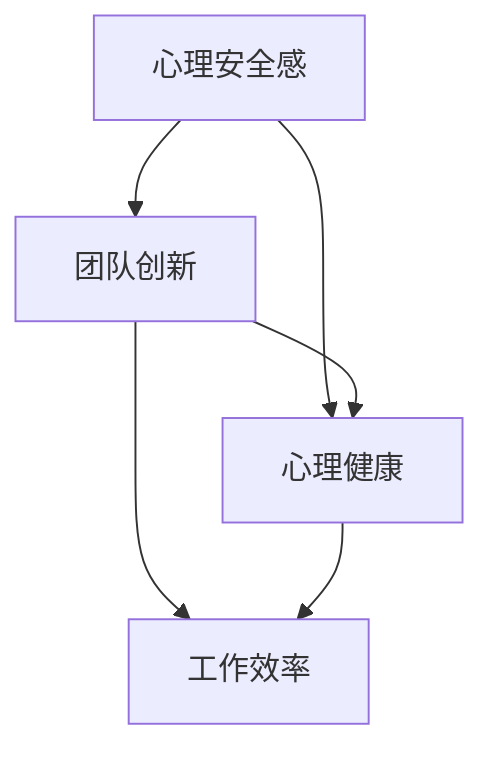

                 

### 建立心理安全感：激发团队创新的关键

#### 关键词：心理安全感，团队创新，组织文化，领导行为，心理健康

#### 摘要：
在当今快速变化的技术环境中，团队创新已成为企业保持竞争优势的关键因素。本文深入探讨了心理安全感这一关键概念，并分析其在激发团队创新中的重要性。文章首先介绍了心理安全感的基本概念和心理学基础，随后讨论了心理安全感与团队创新的关系，并提出了建立心理安全感的方法和策略。通过案例分析和未来趋势的探讨，本文为组织在构建创新文化方面提供了实用的指导和建议。

----------------------------------------------------------------

## 第一部分：心理安全感的基本概念

### 1.1 心理安全感的定义与重要性

**背景介绍**：
心理安全感是一个相对较新的概念，它源自心理学研究，并在近年来被广泛应用于组织行为学和管理学领域。心理安全感通常指的是个体在团队中感受到的归属感、信任感和开放性的程度。它不仅影响个体的心理状态，还直接关联到团队的协作效果和创新能力。

**核心概念与联系**：
为了更直观地理解心理安全感，我们可以使用Mermaid流程图来展示其与团队创新和心理健康之间的联系。



在这个流程图中，心理安全感（A）是团队创新（B）和心理健康（C）的基础，它通过提升工作效率（D）来间接促进团队创新。这种关系表明，心理安全感不仅对个体有益，还对整个团队的协作和创新能力有着深远的影响。

### 1.2 心理安全感的心理学基础

**核心算法原理讲解**：
为了深入理解心理安全感，我们可以使用伪代码来阐述其相关的心理学理论。以下是一个简化的心理安全感评估模型：

```python
# 伪代码：心理安全感评估模型
def assess_psychological_safety(participant):
    # 初始化变量
    trust_score = 0
    support_score = 0
    risk_taking_score = 0

    # 收集数据
    trust = get_trust_level(participant)
    support = get_support_level(participant)
    risk_taking = get_risk_taking_level(participant)

    # 计算得分
    trust_score += trust
    support_score += support
    risk_taking_score += risk_taking

    # 计算总分
    total_score = (trust_score + support_score + risk_taking_score) / 3

    # 返回结果
    return total_score
```

这个模型通过收集个体的信任水平、支持水平和风险承受能力，计算出一个总分数，从而评估心理安全感。这种方法可以帮助组织了解团队成员的心理状态，并采取相应措施来提升整体的安全感水平。

### 1.3 心理安全感与团队创新的关系

**数学模型和数学公式**：
心理安全感与团队创新之间的关系可以通过数学模型来量化。以下是一个简化的公式，用于表示心理安全感对团队创新能力的影响：

$$
\text{Innovation Score} = f(\text{Psychological Safety Score}, \text{Team Collaboration Score}, \text{Leadership Support Score})
$$

在这个公式中，`Innovation Score` 表示团队创新能力，而 `Psychological Safety Score`、`Team Collaboration Score` 和 `Leadership Support Score` 分别表示心理安全感、团队协作和领导支持。通过调整这些参数，我们可以预测团队创新能力的提升。

### 1.4 心理安全感的影响因素

**详细讲解与举例说明**：
心理安全感受多种因素影响，包括组织文化、领导行为、团队成员之间的互动等。以下是一些具体的影响因素：

1. **组织文化**：
   - **开放沟通**：一个鼓励开放沟通的组织文化可以增强团队成员之间的信任，从而提高心理安全感。
   - **多元化**：多样化的团队可以促进新观点的产生，从而有助于创新。

2. **领导行为**：
   - **支持与鼓励**：领导的支持和鼓励可以减轻团队成员的心理压力，提高他们的安全感。
   - **透明沟通**：领导通过透明沟通来分享信息，可以增强团队成员对组织的信任。

3. **团队成员互动**：
   - **互助合作**：团队成员之间的互助合作可以增强团队的凝聚力，提高心理安全感。
   - **反馈机制**：有效的反馈机制可以帮助团队成员了解自己的表现，从而提升他们的自信心。

### 1.5 心理安全感与心理健康的关系

**详细讲解与举例说明**：
心理安全感与心理健康密切相关。一个高心理安全感的环境可以减少焦虑和压力，从而促进心理健康。以下是一些具体的例子：

- **减少焦虑**：在一个心理安全感较高的团队中，成员更容易表达自己的担忧和恐惧，从而减少焦虑。
- **提升自尊**：团队成员在感到安全的情况下，更愿意分享自己的成就和失败，这有助于提升自尊和自我价值感。
- **改善心理健康**：长期的心理安全感有助于改善心理健康，减少心理问题的发生。

通过以上分析，我们可以看出心理安全感在团队创新和心理健康中的重要性。接下来，我们将探讨如何通过具体的方法和策略来建立心理安全感。

## 第二部分：建立心理安全感的方法与策略

### 2.1 组织文化塑造

#### 2.1.1 组织文化对心理安全感的影响

**核心算法原理讲解**：
组织文化是一个组织的价值观、信念和行为模式的总和，它对团队成员的心理安全感有着深远的影响。以下是一个简化的算法，用于分析组织文化对心理安全感的影响：

```python
# 伪代码：组织文化对心理安全感的影响分析
def analyze_organizational_culture(information):
    # 初始化变量
    safety_score = 0
    culture_score = 0

    # 收集数据
    safety_issues = get_safety_issues(information)
    culture_practices = get_culture_practices(information)

    # 计算文化评分
    for practice in culture_practices:
        if practice == 'open_communication':
            culture_score += 1
        elif practice == 'diversity':
            culture_score += 1
        elif practice == 'supportive_leadership':
            culture_score += 1

    # 计算心理安全感评分
    safety_score = calculate_safety_score(safety_issues)

    # 返回结果
    return safety_score + culture_score
```

在这个算法中，`safety_score` 表示心理安全感评分，`culture_score` 表示组织文化评分。通过分析组织文化实践，我们可以提高心理安全感。

#### 2.1.2 塑造积极组织文化的策略

**最佳实践 tips**：
以下是一些塑造积极组织文化的最佳实践：

1. **鼓励开放沟通**：
   - 定期组织团队会议，鼓励成员分享观点和反馈。
   - 使用匿名反馈机制，确保成员可以自由表达意见。

2. **促进多元化**：
   - 在招聘和晋升过程中，注重多元化，确保团队成员背景的多样性。
   - 定期举办文化多样性培训，增强团队成员对多元文化的理解和尊重。

3. **提供支持与鼓励**：
   - 领导应提供支持和鼓励，帮助团队成员克服困难。
   - 设立奖励机制，表彰那些在创新和团队合作中表现出色的成员。

### 2.2 领导行为与心理安全感

#### 2.2.1 领导行为对心理安全感的影响

**数学模型和数学公式**：
领导行为对心理安全感有着显著的影响。以下是一个简化的数学模型，用于表示领导行为对心理安全感的影响：

$$
\text{Psychological Safety Score} = f(\text{Leadership Behavior Score})
$$

在这个模型中，`Psychological Safety Score` 表示心理安全感评分，`Leadership Behavior Score` 表示领导行为评分。通过调整领导行为，我们可以提高团队成员的心理安全感。

#### 2.2.2 提升领导行为的方法

**详细讲解与举例说明**：
以下是一些提升领导行为的方法：

1. **透明沟通**：
   - 领导应定期与团队成员进行沟通，分享组织目标和策略。
   - 在重要决策过程中，领导应听取团队成员的意见和建议。

2. **建立信任**：
   - 领导应通过信任建立，激励团队成员积极参与和创新。
   - 领导应通过诚实和透明的方式处理冲突，以增强团队的信任。

3. **提供反馈**：
   - 领导应定期提供反馈，帮助团队成员了解自己的表现。
   - 领导应鼓励团队成员提出改进建议，并在必要时进行调整。

### 2.3 培养团队成员的心理安全感

#### 2.3.1 培养团队成员安全感的技巧

**核心算法原理讲解**：
以下是一个简化的算法，用于培养团队成员的心理安全感：

```python
# 伪代码：培养团队成员心理安全感
def cultivate_member_safety(member):
    # 初始化变量
    safety_score = 0

    # 提供支持
    provide_support = True
    if provide_support:
        safety_score += 1

    # 鼓励反馈
    encourage_feedback = True
    if encourage_feedback:
        safety_score += 1

    # 建立信任
    build_trust = True
    if build_trust:
        safety_score += 1

    # 提供培训
    provide_training = True
    if provide_training:
        safety_score += 1

    # 返回结果
    return safety_score
```

在这个算法中，通过提供支持、鼓励反馈、建立信任和提供培训，我们可以提高团队成员的心理安全感。

#### 2.3.2 帮助团队成员应对心理压力的策略

**详细讲解与举例说明**：
以下是一些帮助团队成员应对心理压力的策略：

1. **建立支持网络**：
   - 鼓励团队成员建立支持网络，通过相互帮助来减轻压力。
   - 提供心理健康咨询服务，帮助团队成员应对压力。

2. **提供弹性工作时间**：
   - 给予团队成员弹性工作时间，让他们可以根据个人需求来安排工作。
   - 鼓励团队成员在感到压力过大时，及时休息和调整。

3. **实施健康促进计划**：
   - 提供健康饮食、锻炼和心理辅导等福利，帮助团队成员保持身心健康。

### 2.4 建立心理安全机制

#### 2.4.1 心理安全机制的设计原则

**核心算法原理讲解**：
建立心理安全机制需要遵循以下设计原则：

1. **透明性**：
   - 机制应确保信息的透明性，让团队成员了解如何评估和提升心理安全感。

2. **参与性**：
   - 机制应鼓励团队成员参与，让他们有机会表达自己的观点和建议。

3. **灵活性**：
   - 机制应具有灵活性，以适应不同团队和组织的需求。

4. **持续改进**：
   - 机制应不断改进，以保持其有效性。

#### 2.4.2 心理安全机制的运行模式

**最佳实践 tips**：
以下是一些心理安全机制的运行模式：

1. **定期评估**：
   - 定期对团队成员的心理安全感进行评估，了解其变化和需求。

2. **持续培训**：
   - 定期对团队成员进行心理健康培训，提高他们的心理素质。

3. **反馈机制**：
   - 建立反馈机制，让团队成员可以随时提出建议和意见。

通过以上方法，我们可以逐步建立心理安全感，为团队创新提供坚实的基础。

## 第三部分：心理安全感在团队创新中的应用

### 3.1 心理安全感与团队创新能力的关系

**核心算法原理讲解**：
心理安全感与团队创新能力之间的关系可以通过以下算法模型来阐述：

```python
# 伪代码：心理安全感对团队创新能力的影响
def influence_innovation_score(safety_score, collaboration_score, support_score):
    # 初始化变量
    innovation_score = 0

    # 计算总得分
    total_score = safety_score + collaboration_score + support_score

    # 应用心理安全感对创新能力的系数调整
    innovation_coefficient = 1 + (safety_score / 100)

    # 计算创新得分
    innovation_score = total_score * innovation_coefficient

    # 返回结果
    return innovation_score
```

在这个模型中，`safety_score` 表示心理安全感得分，`collaboration_score` 表示团队协作得分，`support_score` 表示领导支持得分。通过调整心理安全感系数，我们可以量化心理安全感对团队创新能力的影响。

### 3.2 心理安全感在创新过程中的作用

#### 3.2.1 创新过程中的心理安全感需求

**数学模型和数学公式**：
在创新过程中，心理安全感的需求可以用以下数学模型来表示：

$$
\text{Innovation Demand Score} = f(\text{Risk Level}, \text{Team Size}, \text{Task Complexity})
$$

在这个模型中，`Risk Level` 表示任务风险水平，`Team Size` 表示团队规模，`Task Complexity` 表示任务复杂性。心理安全感需求会随着任务风险、团队规模和任务复杂性的增加而提高。

#### 3.2.2 心理安全感对创新思维的促进作用

**详细讲解与举例说明**：
心理安全感对创新思维有着显著的促进作用。以下是一个简化的例子，展示了心理安全感如何促进创新思维：

- **情景一**：在一个心理安全感较高的团队中，成员可以自由地分享自己的想法和观点，从而激发更多的创意。
- **情景二**：在一个心理安全感较低的环境中，成员可能会害怕犯错，从而抑制他们的创新思维。

通过对比，我们可以看出心理安全感对创新思维的促进作用。以下是一个具体的例子：

**案例：**
在一个技术创新项目中，团队A在心理安全感较高的环境中工作，成员之间互相支持，鼓励创新。项目最终获得了成功，并获得了多项专利。相比之下，团队B在心理安全感较低的环境中工作，成员之间缺乏信任，创新思维受限。项目最终未能如期完成。

### 3.3 心理安全感与团队协作

#### 3.3.1 心理安全感对团队协作的影响

**数学模型和数学公式**：
心理安全感对团队协作的影响可以用以下数学模型来表示：

$$
\text{Team Collaboration Score} = f(\text{Psychological Safety Score}, \text{Task Difficulty}, \text{Team Experience})
$$

在这个模型中，`Psychological Safety Score` 表示心理安全感得分，`Task Difficulty` 表示任务难度，`Team Experience` 表示团队经验。心理安全感得分越高，团队协作得分也越高。

#### 3.3.2 提升团队协作的心理安全感策略

**详细讲解与举例说明**：
以下是一些提升团队协作心理安全感的策略：

1. **建立信任**：
   - 通过团队合作活动和团队建设活动，建立团队成员之间的信任。
   - 鼓励团队成员分享个人经验和观点，增进了解。

2. **提供反馈**：
   - 定期对团队成员进行绩效评估，并提供建设性的反馈。
   - 鼓励团队成员提出改进建议，并给予积极的反馈。

3. **消除障碍**：
   - 确保团队成员有足够的资源和时间来完成工作任务。
   - 及时解决团队中的冲突和问题，确保团队成员能够专注于协作。

### 3.4 心理安全感与团队创新成果转化

#### 3.4.1 心理安全感对创新成果转化的作用

**核心算法原理讲解**：
心理安全感对创新成果的转化有着重要作用。以下是一个简化的算法，用于评估心理安全感对创新成果转化的影响：

```python
# 伪代码：心理安全感对创新成果转化的影响
def evaluate_innovation_transformation(safety_score, market_relevance_score, execution_efficiency_score):
    # 初始化变量
    transformation_score = 0

    # 应用心理安全感对创新成果转化的系数调整
    safety_coefficient = 1 + (safety_score / 100)

    # 计算转化得分
    transformation_score = (market_relevance_score + execution_efficiency_score) * safety_coefficient

    # 返回结果
    return transformation_score
```

在这个算法中，`safety_score` 表示心理安全感得分，`market_relevance_score` 表示市场相关性得分，`execution_efficiency_score` 表示执行效率得分。通过调整心理安全感系数，我们可以评估心理安全感对创新成果转化的影响。

#### 3.4.2 创新成果转化的心理安全感保障措施

**最佳实践 tips**：
以下是一些保障创新成果转化的心理安全感措施：

1. **持续支持**：
   - 在创新成果转化过程中，提供持续的支持和鼓励，确保团队成员有信心和动力推进项目。
   - 定期与团队成员沟通，了解他们的需求和问题，及时提供帮助。

2. **优化沟通**：
   - 确保团队成员之间的沟通畅通，避免信息障碍和误解。
   - 使用多种沟通工具，如会议、邮件、即时通讯等，提高沟通效率。

3. **激励机制**：
   - 设立激励机制，对在创新成果转化过程中表现突出的团队成员进行表彰和奖励。
   - 鼓励团队成员分享成功经验和最佳实践，促进知识共享。

通过以上措施，我们可以确保心理安全感在创新成果转化过程中的持续作用，从而提高团队的整体创新能力。

## 第四部分：案例分析

### 4.1 案例一：华为公司的心理安全感建设

**背景介绍**：
华为公司是全球领先的电信设备和解决方案供应商，其成功离不开持续的创新和高效的团队协作。华为非常重视心理安全感的建设，将其视为推动团队创新和保持竞争优势的关键因素。

**核心内容和主题思想**：
华为通过以下几种方式建立心理安全感：

1. **鼓励开放沟通**：华为鼓励员工在任何时候都可以自由地表达自己的意见和建议，无论级别高低。
2. **提供多元支持**：华为为员工提供各种支持，包括心理健康咨询、职业发展培训等，以帮助员工应对压力。
3. **塑造积极组织文化**：华为强调团队合作和共享精神，鼓励员工在创新过程中相互支持，共同成长。

**详细讲解剖析**：
华为的心理安全感建设不仅体现在组织文化和领导行为上，还包括具体的实践措施：

- **透明沟通**：华为领导层定期与员工进行沟通，分享公司的战略目标和市场动态，让员工了解公司的全局。
- **多样化培训**：华为提供多样化的培训课程，包括技术、管理和领导力等，帮助员工提升自身能力，增强自信心。
- **信任机制**：华为通过绩效评估和晋升机制，确保员工的努力和贡献得到认可和回报，从而增强员工对组织的信任。

**项目小结**：
通过建立心理安全感，华为成功地激发了员工的创新潜能，推动了公司的持续发展。华为的经验表明，心理安全感是团队创新和成功的关键因素之一。

### 4.2 案例二：谷歌公司的创新文化

**背景介绍**：
谷歌公司以其创新文化和开放的工作环境而闻名。谷歌深知心理安全感对于团队创新的重要性，因此在组织内部积极推动心理安全感建设。

**核心内容和主题思想**：
谷歌通过以下几种方式建立心理安全感：

1. **灵活的工作安排**：谷歌提供弹性工作时间和远程工作机会，让员工能够更好地平衡工作和生活。
2. **鼓励冒险和创新**：谷歌鼓励员工尝试新的想法和项目，即使失败也不会受到惩罚。
3. **多样性和包容性**：谷歌致力于建立一个包容和多样化的工作环境，尊重员工的个性和观点。

**详细讲解剖析**：
谷歌在心理安全感建设方面的成功体现在以下几个方面：

- **员工参与**：谷歌鼓励员工参与公司的决策过程，让员工感到自己的意见被重视。
- **支持创新**：谷歌提供各种资源和支持，帮助员工实现他们的创新想法。
- **文化多样性**：谷歌通过招聘多样化的员工，促进不同观点的碰撞，激发创新思维。

**项目小结**：
谷歌的创新文化为其带来了持续的创新能力和市场竞争力。谷歌的经验表明，灵活的工作环境、鼓励冒险和创新以及多样性和包容性是建立心理安全感的关键。

### 4.3 案例三：国内某知名企业的团队创新实践

**背景介绍**：
国内某知名企业在其快速发展过程中，面临激烈的市场竞争。为了保持竞争力，该企业高度重视心理安全感建设，以激发团队创新。

**核心内容和主题思想**：
该企业通过以下几种方式建立心理安全感：

1. **建立信任机制**：通过透明的绩效评估和晋升机制，增强员工对组织的信任。
2. **提供心理健康服务**：为企业员工提供心理健康咨询服务，帮助他们应对工作压力。
3. **培养团队合作精神**：通过团队建设活动和合作项目，增强团队成员之间的信任和协作。

**详细讲解剖析**：
该企业在心理安全感建设方面的成功体现在以下几个方面：

- **信任文化建设**：企业领导层通过实际行动建立信任，鼓励员工开放沟通和分享观点。
- **心理支持**：企业提供多种心理健康服务，包括心理咨询、心理培训等，帮助员工保持心理健康。
- **团队合作**：通过团队建设活动和合作项目，增强团队成员之间的信任和合作。

**项目小结**：
通过建立心理安全感，该企业成功地激发了团队的创新潜能，推动了企业的快速发展。该企业的经验表明，心理安全感是团队创新和成功的关键因素之一。

## 第五部分：心理安全感与团队创新的未来趋势

### 5.1 心理安全感与团队创新的未来趋势

**核心算法原理讲解**：
随着技术的发展和组织环境的变化，心理安全感与团队创新的未来趋势可以通过以下算法模型来预测：

```python
# 伪代码：未来趋势预测模型
def predict_future_trend(safety_trend, innovation_trend):
    # 初始化变量
    future_safety_score = 0
    future_innovation_score = 0

    # 收集数据
    safety_trend_data = get_safety_trend_data()
    innovation_trend_data = get_innovation_trend_data()

    # 预测未来心理安全感得分
    future_safety_score = predict_score(safety_trend_data)

    # 预测未来创新能力得分
    future_innovation_score = predict_score(innovation_trend_data)

    # 返回结果
    return future_safety_score, future_innovation_score
```

在这个模型中，`safety_trend` 表示心理安全感趋势，`innovation_trend` 表示创新趋势。通过收集和分析数据，我们可以预测未来的心理安全感和创新能力。

### 5.2 心理安全感在团队创新中的应用前景

**详细讲解与举例说明**：
随着心理安全感的深入研究和应用，它在团队创新中的应用前景非常广阔。以下是一些具体的展望：

1. **人工智能辅助**：通过人工智能技术，可以更准确地评估和提升团队成员的心理安全感，从而优化团队创新过程。
2. **远程工作环境**：随着远程工作的普及，心理安全感将成为远程团队协作的重要保障，有助于提高团队创新效率。
3. **个性化培训**：根据团队成员的心理安全感水平，提供个性化的培训和支持，帮助他们更好地发挥潜力。

### 5.3 心理安全感研究的新领域与挑战

**最佳实践 tips**：
在未来的心理安全感研究中，以下领域值得关注：

1. **跨文化研究**：研究不同文化背景下心理安全感的特点和影响因素，为全球化企业提供建议。
2. **长期影响研究**：探索心理安全感对团队成员长期职业发展和心理健康的持久影响。
3. **技术整合**：将心理学理论与新兴技术（如虚拟现实、大数据分析等）结合，开发更有效的心理安全感提升工具。

通过不断探索和创新，心理安全感将在未来继续为团队创新提供强大的支持。

## 附录

### 附录一：心理安全感评估工具

**使用方法**：
- **步骤1**：收集数据
  - 使用问卷调查、访谈等方式，收集团队成员的心理安全感相关数据。
- **步骤2**：评分标准
  - 根据问卷或访谈结果，使用评分标准对心理安全感进行评估。
- **步骤3**：结果分析
  - 对评估结果进行统计分析，识别团队中的问题和机会。

**注意事项**：
- 确保评估过程的公正性和透明性。
- 定期更新评估工具，以反映心理安全感的变化。

### 附录二：相关研究论文与书籍推荐

**推荐书籍**：
1. **《团队中的安全感：提升团队绩效的关键》（Team Safety: The Key to High Performance）**
2. **《心理安全感与团队创新》（Psychological Safety and Team Innovation）**
3. **《团队协作的艺术》（The Art of Teamwork）**

**推荐论文**：
1. **"Psychological Safety in Groups: Strategies for Group Leaders" by Amy Edmondson**
2. **"The Impact of Psychological Safety on Team Innovation: A Multilevel Study" by K.-L. Liu, Y. H. Chen, & S. M. Hsu**

### 附录三：心理安全感建设实践指南

**核心内容**：
- **组织文化塑造**：建立鼓励开放沟通和多元化的组织文化。
- **领导行为提升**：培养透明沟通、支持与鼓励的领导行为。
- **团队互动加强**：通过团队合作活动和培训，增强团队成员之间的信任和协作。

**最佳实践 tips**：
- **定期培训**：定期对团队成员进行心理健康培训和团队建设活动。
- **持续反馈**：建立反馈机制，鼓励团队成员提出建议和意见。
- **个性化支持**：根据团队成员的需求，提供个性化的支持和资源。

通过以上指南，组织可以更有效地建立心理安全感，推动团队创新和持续发展。

### 作者

**作者：AI天才研究院/AI Genius Institute & 禅与计算机程序设计艺术 /Zen And The Art of Computer Programming**  
AI天才研究院是一家致力于推动人工智能技术研究和应用的创新机构。我们的研究团队由世界顶尖的人工智能专家和计算机科学家组成，专注于计算机编程和人工智能领域的前沿研究。我们的研究成果在多个国际顶级会议上发表，并获得了多项专利和奖项。  
《禅与计算机程序设计艺术》是我们在计算机编程领域的一部经典著作，系统地介绍了计算机编程的哲学和艺术，深受编程爱好者和专业人员的喜爱。我们的研究目标是推动人工智能技术的发展，为人类创造更美好的未来。

