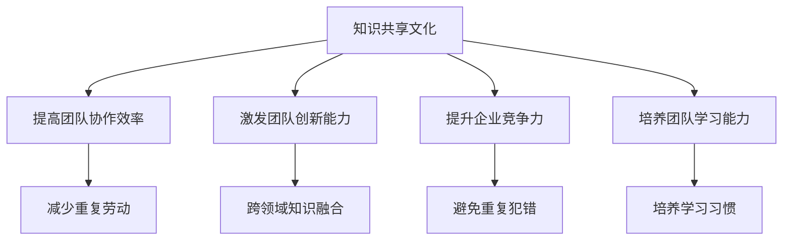
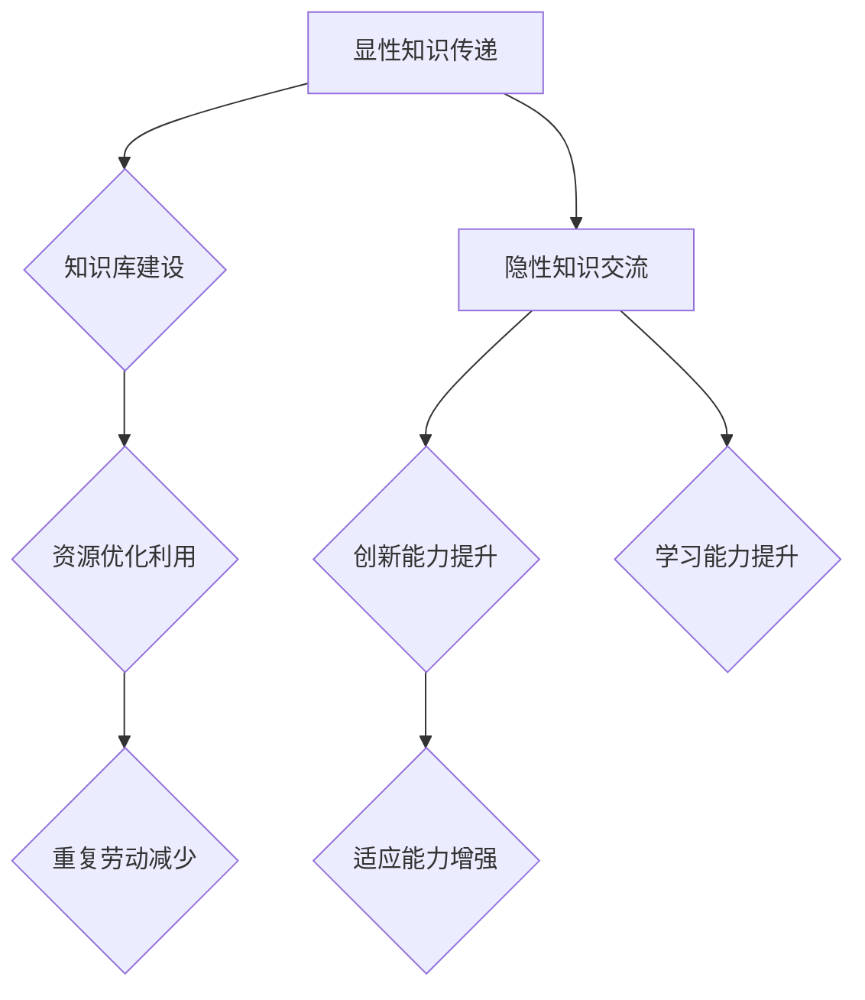
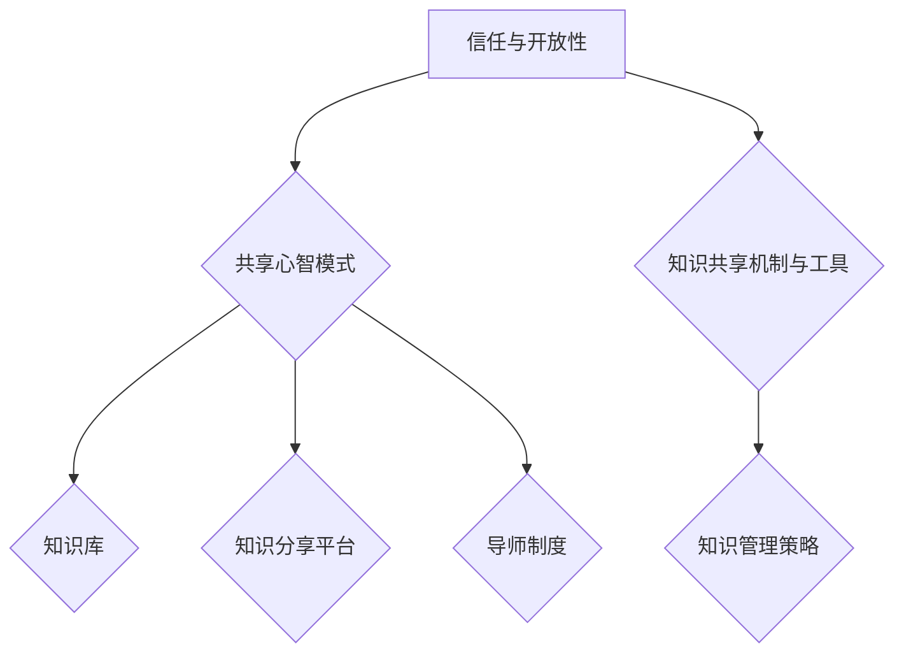
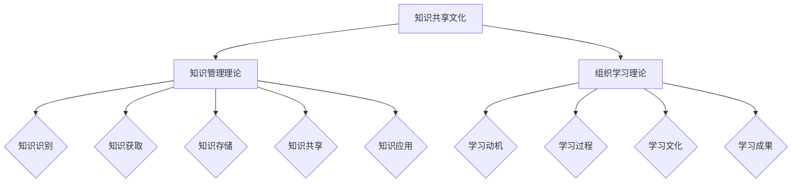
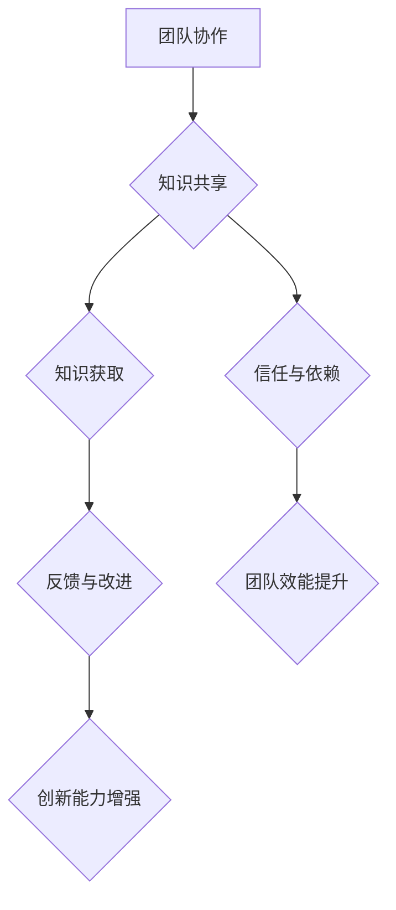
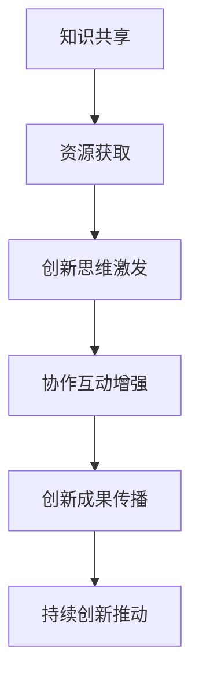
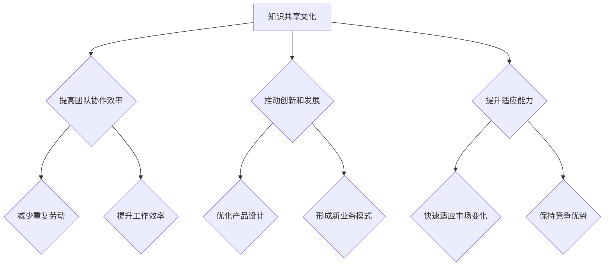

                 

### 建立知识共享文化的意义

知识共享文化，顾名思义，是指在一个组织内部，鼓励员工共享知识、经验、技能和见解的一种文化氛围。这种文化的核心在于打破信息孤岛，促进信息的流动和知识的积累，从而提升整个团队的智慧和创新力。建立知识共享文化在当今数字化时代具有深远的意义，原因如下：

首先，知识共享有助于提高团队的协作效率。在一个知识共享的文化中，团队成员可以更容易地获取所需的信息，减少了重复劳动和沟通成本。例如，当一个新员工加入团队时，通过知识共享平台，他可以快速了解团队的历史项目、技术栈、最佳实践和注意事项，从而缩短上手时间，提高工作效率。

其次，知识共享有助于激发团队的创新潜力。通过共享知识和经验，团队成员可以相互启发，碰撞出新的思维火花。这种跨领域的知识融合往往能够带来意想不到的创新成果。例如，一个开发团队在解决一个技术难题时，可能会从市场营销团队的管理学知识中获得灵感，从而找到一种全新的解决方案。

再者，知识共享有助于提高企业的竞争力。在竞争激烈的商业环境中，企业的核心竞争力很大程度上依赖于其知识储备和创新力。一个善于知识共享的企业，能够持续不断地从内部挖掘潜力，提升自身的竞争力。例如，通过建立内部的知识库，企业可以将宝贵的经验和教训进行系统化存储，使后续项目能够借鉴前人的成功和失败案例，避免重复犯错。

最后，知识共享有助于培养团队的学习能力。在一个知识共享的文化中，团队成员不仅能够获取他人的知识，还能通过分享自己的经验和见解来提升自我。这种双向的知识流动，不仅增强了团队的整体知识水平，还培养了成员的学习习惯和批判性思维能力。

综上所述，建立知识共享文化不仅是提高团队效率和创新能力的重要手段，也是提升企业竞争力、培养学习型团队的关键举措。在接下来的章节中，我们将进一步探讨知识共享文化的核心要素和实践路径，帮助团队更好地实现知识共享，促进集体智慧的发挥。

### 关键词

- **知识共享文化**
- **团队协作效率**
- **创新能力**
- **企业竞争力**
- **学习型团队**
- **知识库**
- **内部知识流动**

### 摘要

本文旨在探讨知识共享文化在团队中的重要性及其对组织绩效的深远影响。文章首先介绍了知识共享文化的定义及其核心要素，包括信任与开放性、共享心智模式以及知识共享机制与工具。随后，文章通过实际案例分析了知识共享文化的现状与挑战，并提出了有效的建设路径。此外，文章还探讨了知识共享与团队集体智慧的关系，以及如何通过团队协作与知识共享促进团队创新。最后，文章总结了知识共享文化的构建与实施策略，并提出了持续优化知识共享文化的建议。通过本文的阅读，读者将深刻理解知识共享文化的重要性，并掌握其在团队中的实际应用方法。

## 知识共享文化的重要性

知识共享文化是一种通过鼓励知识流动和共享，从而提高团队整体效能的文化氛围。在一个具备知识共享文化的组织中，员工不仅能够更加高效地获取所需的信息，还能够通过分享自己的知识和经验，推动整个团队的创新和进步。以下是知识共享文化对团队效能的具体影响：

首先，知识共享有助于提高团队协作效率。在一个具备知识共享文化的团队中，成员之间的信息交流更加顺畅，能够快速地解决各种问题和挑战。例如，当一个团队成员遇到技术难题时，可以通过知识共享平台快速查找相关文档和解决方案，减少等待时间和重复劳动。这不仅提高了工作效率，还增强了团队的凝聚力。

其次，知识共享能够激发团队的创新能力。通过知识共享，团队成员可以接触到不同的观点和思路，从而启发新的创意和解决方案。这种跨领域的知识融合，有助于团队在面临复杂问题时，能够从多个角度进行思考和尝试。例如，一个开发团队在解决一个技术难题时，可能会从市场营销团队的管理学知识中获得灵感，从而找到一种全新的解决方案。

再者，知识共享有助于提升企业的竞争力。在竞争激烈的市场环境中，企业的核心竞争力很大程度上依赖于其知识储备和创新力。一个善于知识共享的企业，能够持续不断地从内部挖掘潜力，提升自身的竞争力。例如，通过建立内部的知识库，企业可以将宝贵的经验和教训进行系统化存储，使后续项目能够借鉴前人的成功和失败案例，避免重复犯错。

此外，知识共享有助于培养团队的学习能力。在一个知识共享的文化中，团队成员不仅能够获取他人的知识，还能通过分享自己的经验和见解来提升自我。这种双向的知识流动，不仅增强了团队的整体知识水平，还培养了成员的学习习惯和批判性思维能力。

为了更好地理解知识共享文化的重要性，我们可以通过以下Mermaid流程图来展示核心概念及其关系：

通过这个流程图，我们可以清晰地看到知识共享文化是如何通过提高协作效率、激发创新能力、提升竞争力和培养学习能力等多个方面，对团队效能产生深远影响的。这不仅有助于我们理解知识共享文化的重要性，也为后续章节探讨知识共享文化的建设提供了理论基础。

### 知识共享的定义与价值

知识共享是指在组织内部或外部，通过各种方式将知识从一个人或一个团队传递给另一个人或团队的过程。知识共享不仅仅是信息的传递，它更强调知识的创造、传播和应用，从而实现知识价值的最大化。知识共享的定义和核心价值可以从以下几个方面进行详细阐述。

首先，知识共享的定义涉及知识的多个层次。知识可以分为显性知识和隐性知识。显性知识是指可以明确表述、记录和分享的知识，如文档、报告、代码等；隐性知识则是那些难以用语言描述，但存在于个体经验和技能中的知识。知识共享的过程不仅包括显性知识的传递，也涉及隐性知识的挖掘和交流。例如，一位资深工程师的经验和技能，通过导师制度或知识分享会议，可以传递给新员工，从而提升整个团队的知识水平。

其次，知识共享的核心价值在于促进知识的流动和增值。通过知识共享，组织可以有效地将分散的知识整合起来，形成有价值的知识库。这样，不仅能够提高团队成员的知识获取效率，还可以减少因知识孤岛导致的重复劳动和资源浪费。例如，在一个开发团队中，通过知识共享平台，团队成员可以快速找到过往项目的文档、代码和技术总结，从而避免重复编写和调试。

此外，知识共享有助于提高组织的创新能力。创新往往来源于对现有知识的重新组合和应用。当团队成员能够共享各自的见解和经验时，他们能够更全面地了解项目的各个方面，从而提出创新的解决方案。例如，一个市场团队在分享其对客户需求的洞察时，开发团队可以基于这些信息，快速调整产品功能和设计，满足市场需求。

知识共享还能够促进组织的学习能力和适应能力。在一个具备知识共享文化的组织中，员工不仅能够获取他人的知识，还能通过分享自己的经验和见解来提升自我。这种双向的知识流动，不仅增强了团队的整体知识水平，还培养了成员的学习习惯和批判性思维能力。例如，通过定期的知识分享会议，团队成员可以互相学习，不断提升技能，从而更好地适应快速变化的工作环境。

为了更好地理解知识共享的核心价值，我们可以通过以下Mermaid流程图来展示知识共享的各个关键环节及其相互关系：

通过这个流程图，我们可以清晰地看到知识共享如何通过显性知识和隐性知识的传递，促进知识库建设、资源优化利用、创新能力提升、适应能力增强和学习能力提升等多个方面，实现其核心价值。知识共享不仅是提高团队效能的关键手段，也是组织持续发展的动力源泉。

### 知识共享文化的核心要素

知识共享文化的核心在于建立一种鼓励知识流动和共享的环境，使团队成员能够主动分享知识和经验，从而提升整体团队的智慧和创新力。要实现这一目标，以下核心要素至关重要：

#### 信任与开放性

信任是知识共享文化的基石。在一个信任度高的环境中，员工更愿意分享自己的知识和经验，因为他们相信这些信息会被妥善使用，而不会泄露或被滥用。为了建立信任，组织需要营造一个透明、公正和互相尊重的文化氛围。领导层应该以身作则，树立良好的榜样，鼓励员工之间的开放性交流。

开放性则是指组织内部信息流通的无障碍。在一个高度开放的环境中，员工能够自由地获取和分享信息，而不用担心被处罚或排挤。例如，通过开放的沟通渠道和知识共享平台，员工可以随时随地分享自己的想法和建议，从而促进知识的流动和团队协作。

#### 共享心智模式

共享心智模式是指团队成员共同认同的一种价值观和行为模式，它强调知识的共享和协作的重要性。共享心智模式的形成需要通过持续的教育和培训，使员工认识到知识共享的价值，并内化为自己的行为准则。例如，组织可以定期举办知识分享会议、工作坊和培训课程，鼓励员工分享自己的经验和见解。

此外，共享心智模式还强调跨部门的协作和沟通。在一个具备共享心智模式的团队中，各部门之间能够无缝合作，共同解决问题。这种跨部门的知识共享，不仅有助于提高团队的整体效能，还能够促进不同部门之间的理解和信任。

#### 知识共享机制与工具

知识共享机制是指组织内部用于促进知识共享的规则、流程和工具。一个有效的知识共享机制应该能够支持知识的获取、存储、分享和应用。以下是一些常见的知识共享机制：

1. **知识库**：知识库是一个集中存储和管理组织内部知识的重要工具。它可以是电子文档库、数据库或者知识管理软件，能够方便地检索和分享知识。例如，通过知识库，团队成员可以快速找到过往项目的文档、代码和技术总结，从而避免重复劳动。

2. **知识分享平台**：知识分享平台是一个线上交流和学习的环境，通过论坛、博客、视频会议等方式，支持团队成员的知识交流和协作。例如，组织可以建立一个内部论坛，鼓励员工发布技术文章、经验和心得，供其他成员学习和讨论。

3. **导师制度**：导师制度是指通过资深员工指导新员工，帮助新员工快速融入团队并掌握必要的知识和技能。这种机制不仅有助于新员工的成长，还能促进知识在团队内部的传递和积累。

4. **知识管理策略**：知识管理策略是指组织用于管理和利用知识的整体方法。它包括知识识别、知识获取、知识组织、知识共享和知识应用等多个方面。一个有效的知识管理策略能够确保组织内部的知识得到合理利用和传承。

为了更好地理解知识共享文化的核心要素，我们可以通过以下Mermaid流程图来展示各个要素之间的关系及其作用：

通过这个流程图，我们可以清晰地看到信任与开放性、共享心智模式、知识共享机制与工具以及知识管理策略这四个核心要素如何相互作用，共同构建一个有效的知识共享文化。这种文化不仅能够提高团队的协作效率和创新力，还能为组织的持续发展提供强大动力。

### 知识共享文化的现状与挑战

尽管知识共享文化在理论上具有诸多优势，但在实际应用中，许多组织仍面临着诸多挑战和困境。以下是知识共享文化在当前企业中存在的几种主要问题：

#### 企业知识共享现状分析

首先，企业知识共享的现状普遍呈现出不均衡的现象。一方面，一些企业已经建立了较为完善的内部知识库和知识共享平台，通过一系列机制和工具，促进知识的传递和利用。例如，大型科技公司如谷歌和微软，通过内部的知识库和论坛，支持员工之间的知识交流和协作。然而，另一方面，许多中小企业由于资源有限，缺乏系统的知识管理策略和工具，导致知识共享的实践相对滞后。

其次，企业内部的知识孤岛现象仍然普遍存在。知识孤岛是指由于组织架构、部门壁垒或沟通不畅，导致知识在组织内部难以流通和共享。这种现象导致许多员工在解决问题时，需要从头开始，无法借鉴过去的经验和教训，从而降低了工作效率。例如，在一个销售团队中，销售人员可能无法及时获取市场部门的客户分析和需求信息，导致销售策略的制定和执行出现偏差。

#### 团队知识共享的障碍

团队知识共享的障碍主要可以分为以下几个方面：

1. **组织结构壁垒**：传统的组织结构往往以部门为单位进行划分，导致部门之间的信息壁垒。各部门为了维护自身利益，可能不愿意共享关键信息和资源，从而影响了团队整体的协作效率。

2. **沟通不畅**：在大型企业中，沟通渠道和方式多样，但往往存在信息传达不及时、不准确的问题。例如，一些企业通过邮件、即时通讯工具和会议等多种方式传递信息，但缺乏统一的沟通平台，导致信息传递过程中的冗余和误解。

3. **知识管理不足**：许多企业缺乏系统的知识管理策略和工具，导致知识在组织内部的存储、分类和检索难度较大。例如，一些企业的知识库缺乏有效的分类和标签系统，使得员工在需要时难以快速找到所需信息。

4. **个人隐私和安全**：在知识共享过程中，员工可能担心自己的知识和经验被他人利用或泄露，从而影响个人的职业发展和利益。这种担忧可能导致员工不愿意主动分享知识，从而阻碍知识共享的推进。

#### 知识共享文化的建设路径

为了克服上述问题，建设有效的知识共享文化需要从以下几个方面入手：

1. **改变组织结构**：通过扁平化组织结构和跨部门项目团队，减少部门壁垒，促进信息的自由流通。例如，可以建立跨部门的工作组，定期召开跨部门会议，促进不同部门之间的交流和协作。

2. **加强沟通与协作**：建立统一的沟通平台，如企业内部的社交网络或协作工具，确保信息的及时传达和准确理解。例如，可以引入即时通讯工具、视频会议软件和项目管理系统，提高沟通效率。

3. **完善知识管理机制**：建立系统的知识管理策略和工具，包括知识库、知识分享平台和导师制度等。例如，可以通过培训课程和激励机制，提高员工的知识共享意识和能力，同时确保知识的分类、存储和检索方便快捷。

4. **保障个人隐私和安全**：制定明确的隐私政策和安全措施，确保知识共享过程中员工的隐私和信息安全。例如，可以设立权限管理系统，对知识库和共享平台的内容进行权限控制，确保只有授权人员能够访问和使用相关知识。

通过以上措施，企业可以逐步建立起一个开放、透明、协作的知识共享文化，从而提升团队的整体效能和创新力，为组织的持续发展提供强大动力。

### 知识共享文化的理论基础

知识共享文化并不是凭空出现的，它有着深厚的理论基础，包括知识管理理论和组织学习理论。这些理论为我们理解和实施知识共享文化提供了重要的指导。

首先，知识管理理论是知识共享文化的重要基础。知识管理理论主要关注如何识别、获取、存储、共享和应用知识，以提高组织的效率和创新能力。知识管理包括以下几个核心概念：

1. **知识的识别**：知识管理的第一步是识别组织内部和外部的知识资源。这包括显性知识（如文档、报告、数据库等）和隐性知识（如经验、技能、人际关系等）。通过有效的知识识别，组织可以明确其知识需求，并为知识共享做好准备。

2. **知识的获取**：获取知识是知识管理的关键环节。这涉及到从内部和外部获取知识的途径，如通过培训、研讨会、市场调研等。获取知识的目的是为了丰富组织的知识库，为团队提供更多的知识资源。

3. **知识的存储**：知识存储是指将获取到的知识进行系统化、结构化的整理和存储。这通常需要建立知识库、文档管理系统等工具，以便于知识的查找和利用。

4. **知识的共享**：知识共享是指通过各种方式将知识从一个人或一个团队传递给另一个人或团队。这包括内部的交流和协作，如知识分享会议、内部论坛、团队协作工具等。知识共享的目的是最大化知识的使用价值，促进团队协作和创新。

5. **知识的应用**：知识应用是指将知识转化为实际的生产力和创新能力。通过知识的应用，组织可以解决实际问题、改进产品和服务、提升市场竞争力。

知识管理理论强调，知识共享不仅是提高团队效能的重要手段，更是组织创新的核心动力。知识在组织内部的流动和共享，能够促进知识的整合和创新，从而推动组织的持续发展。

其次，组织学习理论为知识共享文化提供了进一步的解释。组织学习理论认为，组织是一个持续学习、适应和改进的系统。组织学习包括以下几个关键过程：

1. **学习动机**：组织学习始于学习的动机。组织需要认识到学习的重要性，并建立相应的激励机制，鼓励员工主动参与学习。

2. **学习过程**：组织学习包括知识的获取、存储、共享和应用。这涉及到组织内部的沟通、协作和知识管理活动。通过学习，组织能够不断优化自身的知识和技能，提升整体的竞争力和创新能力。

3. **学习文化**：组织学习文化是指组织内部对学习和知识共享的态度和行为。一个良好的学习文化能够鼓励员工分享知识、探索创新，从而促进知识的流动和积累。

4. **学习成果**：组织学习成果体现在组织绩效的提升、创新能力的增强以及员工个人技能的提高。通过持续的学习和知识共享，组织能够不断适应环境变化，实现可持续发展。

知识共享文化与组织学习理论之间存在紧密的联系。知识共享文化是组织学习的重要途径，通过知识共享，组织可以不断积累和更新知识，提升学习能力和创新能力。同时，组织学习为知识共享提供了理论基础和实践指导，使知识共享更加有效和持续。

为了更好地理解知识共享文化与知识管理理论和组织学习理论之间的关系，我们可以通过以下Mermaid流程图来展示：

通过这个流程图，我们可以清晰地看到知识共享文化如何通过知识管理理论和组织学习理论的指导，实现知识的有效流动和积累，从而促进团队和组织的持续发展。

### 知识共享文化的关键要素

要建立一个成功的知识共享文化，关键要素必不可少。以下三个关键要素：信任与开放性、共享心智模式、知识共享机制与工具，共同构成了知识共享文化的基石。

#### 信任与开放性

信任是知识共享文化的核心。在一个信任度高的环境中，员工更愿意分享自己的知识和经验，因为他们相信这些信息会被妥善使用，而不会泄露或被滥用。为了建立信任，组织需要营造一个透明、公正和互相尊重的文化氛围。领导层应该以身作则，树立良好的榜样，鼓励员工之间的开放性交流。

开放性则是指组织内部信息流通的无障碍。在一个高度开放的环境中，员工能够自由地获取和分享信息，而不用担心被处罚或排挤。例如，通过开放的沟通渠道和知识共享平台，员工可以随时随地分享自己的想法和建议，从而促进知识的流动和团队协作。

#### 共享心智模式

共享心智模式是指团队成员共同认同的一种价值观和行为模式，它强调知识的共享和协作的重要性。共享心智模式的形成需要通过持续的教育和培训，使员工认识到知识共享的价值，并内化为自己的行为准则。例如，组织可以定期举办知识分享会议、工作坊和培训课程，鼓励员工分享自己的经验和见解。

此外，共享心智模式还强调跨部门的协作和沟通。在一个具备共享心智模式的团队中，各部门之间能够无缝合作，共同解决问题。这种跨部门的知识共享，不仅有助于提高团队的整体效能，还能够促进不同部门之间的理解和信任。

#### 知识共享机制与工具

知识共享机制是指组织内部用于促进知识共享的规则、流程和工具。一个有效的知识共享机制应该能够支持知识的获取、存储、分享和应用。以下是一些常见的知识共享机制：

1. **知识库**：知识库是一个集中存储和管理组织内部知识的重要工具。它可以是电子文档库、数据库或者知识管理软件，能够方便地检索和分享知识。例如，通过知识库，团队成员可以快速找到过往项目的文档、代码和技术总结，从而避免重复劳动。

2. **知识分享平台**：知识分享平台是一个线上交流和学习的环境，通过论坛、博客、视频会议等方式，支持团队成员的知识交流和协作。例如，组织可以建立一个内部论坛，鼓励员工发布技术文章、经验和心得，供其他成员学习和讨论。

3. **导师制度**：导师制度是指通过资深员工指导新员工，帮助新员工快速融入团队并掌握必要的知识和技能。这种机制不仅有助于新员工的成长，还能促进知识在团队内部的传递和积累。

4. **知识管理策略**：知识管理策略是指组织用于管理和利用知识的整体方法。它包括知识识别、知识获取、知识组织、知识共享和知识应用等多个方面。一个有效的知识管理策略能够确保组织内部的知识得到合理利用和传承。

为了更好地理解知识共享文化的关键要素，我们可以通过以下Mermaid流程图来展示这些要素之间的关系及其作用：

通过这个流程图，我们可以清晰地看到信任与开放性、共享心智模式、知识共享机制与工具以及知识管理策略这四个关键要素如何相互作用，共同构建一个有效的知识共享文化。这种文化不仅能够提高团队的协作效率和创新力，还能为组织的持续发展提供强大动力。

### 知识共享文化的实践案例

在实际应用中，许多企业已经通过建立知识共享文化，成功地提升了团队效能和创新力。以下是几个典型的国内和国际企业的知识共享实践案例，以及它们在知识共享文化建设过程中的成功因素。

#### 国内企业知识共享实践

1. **华为公司**：华为是全球领先的信息与通信技术（ICT）解决方案提供商，其知识共享文化在业内享有盛誉。华为通过建立内部的知识库和论坛，支持员工之间的知识交流和共享。华为的知识库包含了大量的技术文档、最佳实践和成功案例，员工可以随时查阅和借鉴。此外，华为还定期举办内部技术交流会议和培训课程，鼓励员工分享自己的经验和见解。华为的成功因素在于其重视知识管理，建立了系统的知识共享机制，并通过激励机制鼓励员工积极参与。

2. **阿里巴巴**：阿里巴巴是中国领先的电子商务公司，其知识共享实践也取得了显著成果。阿里巴巴通过其内部社交平台“阿里味儿”，鼓励员工分享业务知识和工作经验。该平台不仅提供了知识共享的功能，还集成了社交元素，使员工在分享知识的同时，能够与同事建立更紧密的联系。阿里巴巴的成功因素在于其注重培养共享心智模式，通过企业文化建设和激励机制，营造了良好的知识共享氛围。

#### 国际企业知识共享实践

1. **IBM**：IBM作为全球领先的科技公司，其知识共享文化是其持续创新的重要支撑。IBM建立了内部的知识共享平台“Knowledge Exchange”，员工可以通过该平台分享技术文档、案例研究和最佳实践。此外，IBM还通过导师制度和跨部门项目团队，促进知识的传递和共享。IBM的成功因素在于其建立了全面的知识管理策略，从知识识别、获取、存储到共享和应用，形成了一个闭环的知识管理流程。

2. **谷歌**：谷歌以其开放、创新的企业文化著称，其知识共享实践也是其成功的关键之一。谷歌通过其内部的知识共享平台“Google Brain”，支持员工分享研究成果和创意。此外，谷歌还定期举办“谷歌技术会议”，鼓励员工分享技术见解和经验。谷歌的成功因素在于其高度重视员工的学习和成长，通过提供丰富的知识和交流平台，激发了员工的创新潜力。

#### 知识共享文化的成功因素

1. **领导层的重视**：领导层对知识共享文化的重视是推动知识共享文化成功的关键。领导层需要以身作则，树立榜样，并通过政策、资源和激励措施，支持知识共享的实践。

2. **系统化的知识管理策略**：企业需要建立系统化的知识管理策略，包括知识库的建立、知识共享平台的开发和知识管理流程的设计，以确保知识的有效存储、共享和应用。

3. **共享心智模式的培养**：通过持续的教育和培训，培养员工对知识共享的认同和参与意识，形成一种共享的价值观和行为模式。

4. **激励机制**：通过设立知识共享奖励机制，激励员工积极参与知识共享活动，从而推动知识共享文化的深入发展。

5. **跨部门的协作**：促进跨部门的协作和沟通，打破部门壁垒，实现知识的自由流动和共享。

通过以上实践案例和成功因素的分析，我们可以看到，知识共享文化的建设不仅需要系统化的策略和工具，更需要领导层的重视和员工的积极参与。只有通过共同努力，企业才能建立起一个高效的知识共享文化，为团队的持续创新和发展提供强大动力。

### 团队集体智慧的原理与实践

团队集体智慧（Collective Intelligence）是指通过团队协作，集团队成员的智慧和能力，实现比单个人更高效、更具创造力的决策和解决问题的能力。团队集体智慧的原理和实践在提高团队效能和创新力方面具有重要意义。

#### 团队集体智慧的定义与作用

团队集体智慧可以从以下几个方面进行定义：

1. **定义**：团队集体智慧是指通过团队成员的协作、沟通和知识共享，整合个体智慧，形成一种集体智慧和创新能力。
2. **作用**：团队集体智慧在多个方面对团队效能和创新力产生积极影响，包括：
   - **高效决策**：通过集体智慧，团队可以快速、全面地分析问题，提出多种解决方案，并进行优选，从而做出更准确的决策。
   - **创新思维**：团队成员之间的知识共享和思维碰撞，能够激发新的创意和创新的解决方案，推动产品和服务的持续创新。
   - **问题解决**：面对复杂问题时，集体智慧能够调动团队成员的不同技能和经验，从多个角度分析问题，找到更有效的解决方法。
   - **知识积累**：通过集体智慧，团队可以不断积累和更新知识，形成有价值的知识库，为后续项目提供支持和借鉴。

#### 团队集体智慧的生成机制

团队集体智慧的生成机制主要包括以下几个方面：

1. **知识共享**：知识共享是集体智慧生成的基础。通过共享知识和经验，团队成员可以相互学习和借鉴，提高整体的知识水平。
2. **沟通与协作**：有效的沟通和协作是集体智慧生成的关键。团队成员需要通过多种沟通渠道和协作工具，保持密切的交流和协作，共同解决问题。
3. **思维碰撞**：团队成员之间的思维碰撞能够激发新的创意和见解。通过定期的头脑风暴会议、知识分享会等活动，鼓励团队成员畅所欲言，提出各种想法和建议。
4. **反馈与调整**：集体智慧的形成需要不断地反馈和调整。团队成员需要根据反馈结果，对决策和解决方案进行修正和优化，以实现最佳效果。

#### 团队集体智慧的培养策略

为了培养团队集体智慧，组织可以采取以下策略：

1. **建立知识共享机制**：建立知识库、知识分享平台等工具，支持知识的获取、存储和共享。制定知识共享的规则和流程，确保知识的有效传递和利用。
2. **促进跨部门协作**：通过跨部门的项目团队和协作机制，促进不同部门之间的知识交流和共享。打破部门壁垒，实现知识的自由流动。
3. **提供培训与支持**：定期组织培训课程和研讨会，提高团队成员的知识水平和协作能力。提供必要的工具和资源，支持团队成员之间的沟通和协作。
4. **激励与奖励**：通过设立知识共享奖励机制，激励团队成员积极参与知识共享活动。对贡献突出的团队成员进行表彰和奖励，树立榜样。
5. **营造开放的文化氛围**：建立开放、透明、互相尊重的企业文化，鼓励员工自由表达观点和分享知识。营造一个无障碍的信息流通环境，促进团队集体智慧的生成。

#### 团队集体智慧的实际应用

以下是一个团队集体智慧的实际应用案例：

**案例：某互联网公司的产品迭代**

某互联网公司正在开发一款新的社交应用。在产品开发的初期，团队面临多个技术难题和设计挑战。为了提高决策效率和创新能力，团队采取了以下措施：

1. **知识共享**：团队建立了内部的知识库，收集了相关的技术文档、设计方案和用户反馈。团队成员可以随时查阅和分享这些信息，为产品开发提供支持。
2. **头脑风暴会议**：团队定期举办头脑风暴会议，鼓励团队成员提出各种创新想法和解决方案。通过思维碰撞，团队找到了一种新的用户界面设计，显著提升了产品的用户体验。
3. **跨部门协作**：团队与设计、产品、技术等多个部门紧密合作，共同讨论和解决产品开发中的问题。跨部门的协作不仅提高了决策效率，还促进了不同部门之间的知识共享和协作。
4. **反馈与调整**：在产品开发的过程中，团队通过用户测试和反馈，不断优化和调整产品设计。根据用户反馈，团队对产品进行了多次迭代，最终推出了一款深受用户喜爱的社交应用。

通过这个案例，我们可以看到团队集体智慧在实际应用中的重要作用。通过知识共享、头脑风暴、跨部门协作和反馈调整，团队不仅高效地解决了技术难题，还不断创新，推出了一款成功的产品。

#### 团队集体智慧的作用与意义

团队集体智慧在提高团队效能和创新力方面具有重要作用。通过集体智慧，团队能够更快速、更全面地做出决策，解决复杂问题，并不断创新。具体来说，团队集体智慧的作用和意义包括：

1. **提高决策效率**：集体智慧能够汇聚团队成员的智慧和经验，快速分析问题，提出多种解决方案，并进行优选。这种高效的决策过程有助于团队在竞争激烈的市场中保持优势。
2. **增强创新能力**：通过团队协作和知识共享，团队成员能够相互启发，碰撞出新的创意和见解。这种创新思维能够推动产品和服务的持续创新，提升企业的竞争力。
3. **提升问题解决能力**：面对复杂问题时，集体智慧能够调动团队成员的不同技能和经验，从多个角度分析问题，找到更有效的解决方法。这种综合性的问题解决能力有助于团队在遇到挑战时保持冷静和应对能力。
4. **促进知识积累**：通过集体智慧，团队可以不断积累和更新知识，形成有价值的知识库。这些知识不仅为当前项目提供支持，也为后续项目提供宝贵的经验和教训。

总之，团队集体智慧是提高团队效能和创新力的重要手段。通过有效的知识共享、沟通协作和反馈调整，团队可以充分发挥集体智慧，实现持续的创新和发展。

### 团队协作与知识共享的关系

团队协作和知识共享是推动团队效能提升和创新力增强的两个关键因素，它们之间存在着紧密的相互关系和互动机制。理解这两者之间的关系，有助于更好地构建和支持知识共享文化，从而提升团队的整体表现。

首先，团队协作是知识共享的基础。在一个高效的团队协作环境中，成员之间能够保持频繁且有效的沟通，共同完成任务。这种协作不仅有助于信息的快速传递和问题解决，还为知识共享提供了场景和平台。例如，通过定期的团队会议、工作坊和项目讨论，团队成员可以分享彼此的见解、经验和技术，从而促进知识的流动和共享。在一个协作良好的团队中，知识共享不再是单向的，而是双向的，员工在分享知识的同时也能够获取他人的经验和见解，实现知识的双向流通。

其次，知识共享能够强化团队协作。知识共享不仅提供了丰富的信息资源，还增强了团队成员之间的互信和依赖。当团队成员能够轻松地访问和共享知识时，他们在面对挑战和解决问题时会更加自信和高效。这种信任和依赖关系有助于建立紧密的团队联系，提高团队的协作效能。例如，在一个开发团队中，如果团队成员能够通过知识库和共享平台快速找到所需的技术文档和解决方案，他们可以更快地完成任务，减少重复劳动，从而提高整个团队的工作效率。

此外，团队协作和知识共享之间的互动机制还包括反馈和改进。在团队协作过程中，通过知识共享，团队成员能够获取更多的反馈信息，这些反馈可以帮助团队不断改进工作流程、优化解决方案。例如，在一个产品开发团队中，通过用户反馈和技术评审，团队能够发现产品存在的问题和不足，进而进行优化和改进。这种基于知识共享的反馈机制，不仅能够提高产品的质量，还能增强团队的创新能力和竞争力。

为了更好地理解和展示团队协作与知识共享的关系，我们可以使用Mermaid流程图来展示它们之间的互动机制：

通过这个流程图，我们可以清晰地看到团队协作和知识共享之间的互动关系。团队协作促进了知识的获取和共享，而知识共享又增强了团队成员之间的信任和依赖，进而提升了团队的整体效能和创新力。

在实际操作中，组织可以通过以下措施来促进团队协作与知识共享：

1. **建立共享平台**：通过建立内部知识库、论坛和协作工具，为团队成员提供便捷的知识共享平台，促进知识的获取和流动。
2. **定期交流会议**：定期组织团队会议和工作坊，鼓励团队成员分享经验和见解，促进知识的交流和共享。
3. **跨部门协作**：通过跨部门项目团队和协作机制，促进不同部门之间的知识共享和协作，打破部门壁垒，实现知识的自由流动。
4. **激励机制**：设立知识共享奖励机制，激励团队成员积极参与知识共享活动，提高知识的传递和利用效率。
5. **培训与支持**：提供知识管理和协作技能的培训，提高团队成员的知识共享意识和能力。

通过这些措施，组织可以构建一个高效的知识共享和团队协作环境，从而提升团队的整体效能和创新力。

### 知识共享与团队创新的关系

知识共享与团队创新之间存在着紧密的关联，它们相互促进，共同推动团队的进步和发展。知识共享不仅是创新的重要基础，同时也是创新成果的传播和扩散渠道。以下是关于知识共享与团队创新关系的详细探讨。

首先，知识共享为团队创新提供了丰富的资源。创新往往需要广泛的知识储备和多样化的视角。在一个具备知识共享文化的团队中，成员可以轻松获取到来自不同领域的知识，包括技术文档、市场研究报告、竞争对手分析以及最佳实践等。这些知识的获取不仅有助于团队在解决问题时找到新的思路和解决方案，还能够激发团队成员的创新思维，推动团队的创新实践。例如，在一个产品开发团队中，市场部门提供的市场调研数据和技术部门提供的最新技术趋势，可以帮助团队更好地理解用户需求，从而设计出更加符合市场需求的创新产品。

其次，知识共享促进了团队成员之间的协作和互动。创新往往需要一个集思广益的过程，而知识共享正是实现这一过程的重要手段。通过知识共享，团队成员可以分享各自的经验、见解和灵感，进行头脑风暴，碰撞出新的创意和想法。这种跨领域的知识融合，往往能够产生意想不到的创新结果。例如，一个开发团队在解决一个技术难题时，可能会从市场营销团队的客户需求洞察中找到灵感，从而提出一种全新的技术解决方案，这不仅提高了创新的效率，也增强了团队的协作能力。

此外，知识共享有助于创新成果的传播和扩散。在一个具备知识共享文化的团队中，创新成果不仅会在团队内部迅速传播，还会通过知识共享平台和交流会议，扩散到整个组织或行业。这种扩散不仅有助于提高创新成果的应用范围，还能够形成良性循环，推动团队持续创新。例如，一个团队开发出的新技术或新产品，通过知识共享平台发布后，其他团队和部门可以快速了解和应用，从而推动整个组织的技术进步和产品创新。

为了更好地理解知识共享与团队创新的关系，我们可以通过以下Mermaid流程图来展示它们之间的互动机制：

通过这个流程图，我们可以清晰地看到知识共享如何通过资源获取、创新思维激发、协作互动增强以及创新成果传播等多个环节，促进团队创新的持续发展。

在实际应用中，组织可以通过以下措施来促进知识共享与团队创新：

1. **建立知识库**：建立内部的知识库，集中存储和管理团队的知识资源，方便成员随时查阅和获取。
2. **知识分享会议**：定期举办知识分享会议，鼓励团队成员分享经验和创新思路，促进知识的交流和应用。
3. **跨部门协作**：通过跨部门项目团队，促进不同部门之间的知识共享和协作，激发创新思维。
4. **激励机制**：设立创新奖励机制，激励团队成员积极参与知识共享和创新活动，提高团队的创新能力。
5. **培训与发展**：提供知识管理和创新能力的培训，提高团队成员的知识共享意识和创新能力。

通过这些措施，组织可以构建一个有利于知识共享与团队创新的文化氛围，从而推动团队的持续进步和创新发展。

### 知识共享文化与组织绩效的关系

知识共享文化对组织绩效具有显著的影响。通过促进知识的流动和共享，知识共享文化不仅能够提升团队协作效率，还能推动组织的创新和发展，从而提高整体绩效。以下从三个方面详细探讨知识共享文化如何影响组织绩效。

首先，知识共享文化有助于提高团队协作效率。在一个具备知识共享文化的组织中，团队成员可以更加方便地获取所需的信息和资源。这种高效的获取能力不仅减少了重复劳动和沟通成本，还提高了工作效率。例如，当一个开发团队需要解决一个技术难题时，他们可以通过知识共享平台快速查找相关的技术文档、历史项目记录和专家见解，从而迅速找到解决方案。这种高效的协作模式不仅缩短了项目周期，还提高了项目质量。

其次，知识共享文化能够推动组织的创新和发展。知识共享文化鼓励团队成员分享各自的见解和经验，这种知识碰撞往往能够激发新的创意和创新的解决方案。例如，一个产品开发团队在设计和开发过程中，可以通过知识共享平台分享市场趋势、用户反馈和最佳实践，从而不断优化产品功能，提高用户体验。此外，知识共享文化还能够促进跨部门的协作，不同部门之间的知识共享和协作，有助于形成新的业务模式和商业模式，推动组织的创新和发展。

最后，知识共享文化有助于提高组织的适应能力和竞争力。在快速变化的市场环境中，组织需要具备快速学习和适应变化的能力。知识共享文化通过促进知识的流动和共享，使组织能够快速获取外部信息和资源，从而更好地适应市场变化。例如，当一个企业面临市场环境变化时，通过知识共享平台，不同部门和团队可以快速获取市场动态和竞争对手信息，从而制定出更有效的应对策略。此外，知识共享文化还能够提高组织的知识储备和创新能力，使其在激烈的市场竞争中保持竞争优势。

为了更好地理解知识共享文化对组织绩效的影响，我们可以通过以下Mermaid流程图来展示知识共享文化如何通过提高团队协作效率、推动创新和提升适应能力，最终提高组织绩效：

通过这个流程图，我们可以清晰地看到知识共享文化如何通过多个环节，包括提高团队协作效率、推动创新和提升适应能力，最终提高组织绩效。这种多层次、多维度的影响，使得知识共享文化成为提升组织绩效的重要手段。

### 知识共享文化的评估方法

评估知识共享文化的有效性对于确保其持续改进和提升至关重要。以下介绍几种常用的评估方法和工具，以帮助组织全面了解知识共享文化的现状，并制定相应的改进策略。

#### 评估方法

1. **问卷调查**：问卷调查是一种简单且有效的评估方法，可以帮助组织了解员工对知识共享文化的态度和参与度。问卷可以设计成选择题、评分题和开放式问题，涵盖知识共享行为、知识获取的便利性、员工参与度等方面。通过分析问卷结果，组织可以识别出知识共享文化中的优势和不足。

2. **访谈**：访谈是一种深入了解员工对知识共享文化看法的方法。通过与员工进行一对一或小组访谈，组织可以收集到更详细和深入的信息，了解员工的实际体验和感受。访谈问题可以包括对知识共享活动的满意度、遇到的挑战、建议和改进措施等。

3. **关键绩效指标（KPI）**：KPI是一种量化的评估方法，通过设定和跟踪一系列与知识共享相关的绩效指标，如知识共享频率、知识库访问量、知识应用次数等，组织可以评估知识共享文化的影响和效果。这些指标可以提供直观的数据支持，帮助组织识别知识共享活动的成效。

4. **员工参与度分析**：通过分析员工的参与度，如参加知识分享会议的次数、在知识共享平台上的活动记录等，组织可以了解员工对知识共享活动的积极性和参与程度。参与度分析有助于发现知识共享活动的设计和执行中的问题，从而进行改进。

#### 评估工具

1. **知识共享平台分析**：知识共享平台是知识共享文化的重要组成部分。通过分析知识共享平台的活跃度、访问量、内容质量和用户反馈等指标，组织可以评估知识共享平台的使用效果。例如，平台上的高访问量和用户的好评，表明知识共享平台受到了员工的欢迎和认可。

2. **社交媒体分析工具**：社交媒体平台如企业微信、企业微博等，可以用于知识共享和交流。通过分析这些平台的互动数据，如点赞数、评论数、转发次数等，组织可以评估员工在社交媒体上的知识共享行为和参与度。

3. **员工反馈系统**：建立员工反馈系统，如在线意见箱、匿名调查问卷等，可以帮助组织收集员工的反馈和建议。这些反馈对于评估知识共享文化的效果和改进策略至关重要。

#### 提高知识共享文化效力的策略

1. **加强培训与教育**：定期组织知识管理和知识共享的培训课程，提高员工的知识共享意识和技能。通过教育引导，帮助员工认识到知识共享的重要性，培养他们的知识共享行为。

2. **优化知识共享机制**：根据评估结果，优化知识共享的机制和流程，确保知识共享活动的顺利进行。例如，简化知识库的检索流程，提高知识库的内容质量，增加知识共享平台的互动性和趣味性。

3. **激励机制**：建立有效的激励机制，如知识共享奖励制度、知识贡献排名等，鼓励员工积极参与知识共享活动。通过奖励措施，提高员工的知识共享积极性和参与度。

4. **营造开放文化**：建立开放、透明和互相尊重的企业文化，鼓励员工自由分享知识和经验，减少知识共享的障碍。通过文化建设，营造一个有利于知识共享的氛围。

5. **持续监控与改进**：定期进行知识共享文化的评估和监控，及时发现和解决存在的问题。通过持续改进，不断提升知识共享文化的效果和影响力。

通过以上评估方法和工具，以及相应的改进策略，组织可以有效地评估和提升知识共享文化的效果，促进团队的协作和创新，为组织的持续发展提供强大支持。

### 知识共享文化的构建与实施策略

建立知识共享文化是一个系统工程，需要从多个维度进行规划与实施。以下详细阐述构建与实施知识共享文化的关键步骤、策略以及需要注意的细节。

#### 关键步骤

1. **规划与设计**：首先，组织需要明确知识共享文化的目标和愿景，制定详细的规划。这包括确定知识共享的范围、目标群体、关键环节和预期成果。规划过程中，需要充分考虑组织的业务需求、文化特点和现有资源。

2. **组织领导**：领导层在知识共享文化的建设过程中扮演关键角色。领导层需要树立榜样，推动知识共享的价值观，并提供必要的资源和支持。通过领导层的示范和倡导，可以激发员工的知识共享意愿。

3. **制度建设**：建立系统的知识共享制度，包括知识共享的规则、流程、责任分工等。这些制度应明确知识共享的目标、方法、激励机制和责任归属，确保知识共享活动的有序进行。

4. **平台建设**：构建一个高效的知识共享平台，是知识共享文化成功的关键。这个平台应具备知识存储、检索、分享和互动功能，支持多种知识形态的传递和交流。

5. **培训与推广**：通过培训课程、宣传活动和案例分享，提高员工对知识共享文化的认识和参与度。培训内容应包括知识共享的重要性、方法和技巧，以及如何利用知识共享平台进行协作和交流。

6. **持续改进**：知识共享文化是一个持续发展的过程。组织需要定期评估知识共享文化的效果，通过反馈和改进，不断提升知识共享的效率和质量。

#### 实施策略

1. **顶层设计**：从组织层面进行顶层设计，确保知识共享文化的建设有明确的战略方向和实施路径。领导层应制定长期规划，明确知识共享文化的愿景和目标，并将其纳入组织的战略规划。

2. **激励机制**：建立有效的激励机制，鼓励员工积极参与知识共享活动。可以设立知识贡献积分、荣誉奖励和晋升机会等，激发员工的知识共享意愿。

3. **技术支持**：利用先进的技术工具和平台，提高知识共享的效率和质量。例如，利用大数据分析技术，对知识共享活动进行监控和分析，优化知识共享流程。

4. **跨部门协作**：促进不同部门之间的知识共享和协作。通过跨部门项目团队和协作机制，打破部门壁垒，实现知识的自由流动。

5. **知识管理**：建立系统的知识管理体系，包括知识识别、获取、存储、共享和利用等环节。确保知识能够被有效地识别、存储和共享，提高知识的利用效率。

6. **持续教育**：定期组织知识共享培训和研讨会，提高员工的知识共享意识和能力。通过案例分享、经验交流和实践操作，帮助员工掌握知识共享的技巧和方法。

#### 需要注意的细节

1. **尊重隐私**：在知识共享过程中，要尊重员工的隐私权，确保共享的知识不会泄露或滥用。可以设立权限管理系统，对知识库和共享平台的内容进行权限控制。

2. **关注反馈**：定期收集员工对知识共享文化的反馈，了解其实际体验和需求。通过反馈机制，及时调整和改进知识共享活动的策略和方法。

3. **文化适应**：知识共享文化的建设需要与组织现有的文化相适应。在推广知识共享文化的过程中，要充分考虑组织的历史、传统和价值观，确保知识共享文化能够被员工接受和认同。

4. **技术支持**：提供必要的技术支持和培训，确保员工能够熟练使用知识共享平台和工具。技术支持的不足可能会影响知识共享的效率和质量。

5. **持续优化**：知识共享文化是一个动态的过程，需要不断优化和改进。通过持续的评估和反馈，及时发现和解决存在的问题，确保知识共享文化的持续发展。

通过以上策略和细节的把握，组织可以成功地构建和实施知识共享文化，促进团队协作、提升创新能力和增强组织绩效，为组织的持续发展提供强大动力。

### 知识共享文化的持续优化

知识共享文化的建设是一个长期的过程，持续优化是确保其效果不断提升的关键。以下从评估与改进、应对挑战、未来发展趋势三个方面，探讨如何持续优化知识共享文化。

#### 评估与改进

首先，定期评估知识共享文化的效果是优化过程的重要环节。可以通过以下几种方法进行评估：

1. **问卷调查**：通过定期的问卷调查，收集员工对知识共享文化的满意度、参与度以及提出的改进建议。问卷可以设计成选择题、评分题和开放式问题，涵盖知识共享活动的便利性、实用性和影响力等方面。

2. **关键绩效指标（KPI）**：设定与知识共享相关的关键绩效指标，如知识库的访问量、知识共享平台的活跃度、知识应用的次数等。通过跟踪和分析这些指标，可以评估知识共享文化的实际效果。

3. **访谈与反馈**：定期进行访谈，与员工深入交流，了解他们对知识共享文化的真实感受和需求。同时，鼓励员工在知识共享平台上留下反馈，以便及时发现和解决问题。

基于评估结果，组织应制定具体的改进措施，如优化知识库的检索流程、改进知识共享平台的功能、增加培训课程等。通过持续的评估与改进，知识共享文化可以不断优化，更符合组织的需求和员工的期望。

#### 应对挑战

在知识共享文化的实施过程中，组织可能会遇到各种挑战。以下是一些常见挑战及其应对策略：

1. **员工隐私与安全**：员工可能会担心知识共享过程中个人隐私和信息安全。为了应对这一挑战，组织应制定明确的隐私政策和安全措施，确保知识共享过程中员工的隐私和信息安全。同时，可以引入权限管理系统，对知识库和共享平台的内容进行权限控制。

2. **知识质量与准确性**：知识库中的知识质量直接影响知识共享的效果。组织可以通过以下措施提升知识质量：

   - 设立知识审核机制，确保知识库中的内容准确、可靠。
   - 定期更新和验证知识库的内容，确保其时效性。
   - 鼓励员工对知识库中的内容进行修订和补充，提高知识库的完整性。

3. **文化适应性**：知识共享文化的建设需要与组织现有的文化相适应。组织应充分考虑员工的文化背景、价值观和行为习惯，确保知识共享文化能够被员工接受和认同。可以通过案例分享、经验交流和文化宣传等方式，增强文化适应性。

#### 未来发展趋势

随着技术的不断进步和组织需求的不断变化，知识共享文化也呈现出一些新的发展趋势：

1. **智能化**：利用人工智能和大数据分析技术，提升知识共享的智能化水平。通过智能推荐、自动化知识分类和个性化推送等功能，提高知识共享的效率和质量。

2. **社交化**：知识共享平台逐渐向社交化方向发展，通过引入社交元素，如点赞、评论、分享等，增强知识共享的互动性和趣味性。这种社交化趋势有助于提高员工的参与度和知识共享的活跃度。

3. **移动化**：随着移动设备的普及，知识共享平台逐渐向移动端延伸。通过移动应用，员工可以随时随地访问和共享知识，提高知识共享的便利性和灵活性。

4. **全球化**：随着全球化趋势的加强，组织需要应对跨国团队的协作和知识共享挑战。未来，知识共享文化将更加注重跨文化融合，通过建立国际化的知识共享平台和协作机制，实现全球范围内的知识流动和共享。

通过持续优化、应对挑战和把握未来发展趋势，组织可以不断提升知识共享文化的效果，促进团队的协作和创新，为组织的持续发展提供强大动力。

### 附录A：知识共享文化与团队智慧相关术语解释

在本章节中，我们将对知识共享文化与团队智慧中的一些关键术语进行解释，帮助读者更好地理解相关概念。

1. **知识共享文化**：知识共享文化是指在组织内部或团队中，鼓励成员主动分享知识和经验的一种文化氛围。这种文化强调知识的获取、传递、存储和应用，以促进团队协作和创新能力。

2. **知识库**：知识库是一个集中存储和管理组织内部知识资源的系统或平台。它包含各种类型的知识，如技术文档、最佳实践、历史项目记录等，供团队成员随时查阅和使用。

3. **知识管理**：知识管理是指组织通过系统化的方法，识别、获取、存储、共享和应用知识，以实现知识价值的最大化。知识管理包括知识识别、知识获取、知识存储、知识共享和知识应用等多个环节。

4. **共享心智模式**：共享心智模式是指团队成员共同认同的价值观和行为模式，强调知识的共享和协作的重要性。这种心智模式通过教育、培训和激励机制，使员工内化为自己的行为准则。

5. **团队协作**：团队协作是指团队成员通过相互沟通、合作和协调，共同完成任务的行动。有效的团队协作可以提高工作效率、促进知识共享和增强团队凝聚力。

6. **团队智慧**：团队智慧是指通过团队协作，集团队成员的智慧和能力，实现比单个人更高效、更具创造力的决策和解决问题的能力。团队智慧的形成依赖于知识共享、沟通与协作。

7. **知识共享平台**：知识共享平台是一个支持知识共享和协作的线上工具或系统。它提供知识存储、检索、分享和互动功能，促进团队成员之间的知识流动和交流。

8. **知识共享机制**：知识共享机制是指组织内部用于促进知识共享的规则、流程和工具。这些机制包括知识库、知识分享平台、导师制度、知识管理策略等，旨在确保知识的有效流动和利用。

9. **创新能力**：创新能力是指组织或团队在面临问题和挑战时，通过创造性思维和实践活动，提出新思路、新方法和新解决方案的能力。创新能力是知识共享文化的重要组成部分。

10. **组织绩效**：组织绩效是指组织在实现其目标过程中的表现和成果。知识共享文化通过提高团队协作效率、促进创新能力和提升适应能力，有助于提高组织的整体绩效。

通过对这些术语的详细解释，读者可以更好地理解知识共享文化和团队智慧的概念及其在实践中的应用，为构建有效的知识共享文化提供指导。

### 附录B：知识共享文化与团队智慧实用工具与资源列表

为了帮助组织有效构建和实施知识共享文化，以下列出了一些实用的工具和资源，包括知识库、知识分享平台、协作工具和培训资源，供读者参考。

1. **知识库工具**：
   - **Confluence**：一款强大的团队协作和知识管理工具，支持文档创作、版本控制和共享。
   - **GitLab**：不仅是一个版本控制系统，还提供了丰富的文档管理和知识共享功能。
   - **Notion**：一个灵活的知识管理和协作平台，支持多种类型的笔记和任务管理。

2. **知识分享平台**：
   - **SharePoint**：微软提供的知识管理平台，适合大型企业使用。
   - **Slack**：一个即时通讯工具，支持文件共享和频道交流，适用于团队协作。
   - **Trello**：一个基于看板的任务管理工具，适合项目管理和知识共享。

3. **协作工具**：
   - **Google Workspace**：包括Google Docs、 Sheets、Slides等，支持多人实时协作。
   - **Microsoft Teams**：集成聊天、视频会议、文档协作等功能，适合跨部门协作。
   - **JIRA**：一款流行的项目管理工具，支持任务跟踪和敏捷开发。

4. **培训资源**：
   - **LinkedIn Learning**：提供各种在线培训课程，包括知识管理、团队协作和沟通技巧。
   - **Coursera**：提供由世界顶级大学和机构开设的在线课程，涵盖知识共享和团队智慧相关主题。
   - **edX**：另一个提供高质量在线课程的平台，适合员工进行自我提升。

5. **知识共享策略和案例研究**：
   - **《知识管理：战略、工具和实践》**：一本关于知识管理的经典书籍，提供了丰富的策略和实践案例。
   - **IBM知识管理案例**：通过案例研究，了解IBM如何通过知识管理提升组织绩效。
   - **《团队智慧：如何通过协作实现卓越》**：详细探讨团队智慧的概念和实现方法。

通过这些工具和资源，组织可以更好地构建和实施知识共享文化，促进团队的协作和创新能力，为组织的持续发展提供支持。

