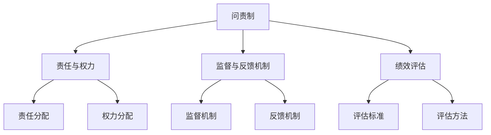

                 

### 文章标题

**建立问责制：确保团队成员负责任地完成任务**

在当前快速发展的信息技术时代，团队的协同工作和高效执行成为企业成功的关键因素之一。然而，团队成员之间的沟通不畅、任务分配不明确、责任不清晰等问题，常常导致项目进展受阻。因此，建立一套有效的问责制显得尤为重要。本文将围绕如何建立问责制，确保团队成员负责任地完成任务，展开深入探讨。

### 文章关键词

- 问责制
- 团队管理
- 责任分配
- 绩效评估
- 监督机制

### 文章摘要

本文旨在阐述在信息技术领域内，如何通过建立问责制来提升团队工作效率。首先，我们介绍了问责制的概念及其在团队管理中的重要性。接着，详细探讨了构建有效问责机制的方法，包括责任与权力的明确、监督与反馈机制的设立以及绩效评估的标准。然后，文章从实施策略、优化和团队成员责任意识培养等方面，提供了问责制的实际操作建议。最后，通过成功和失败的案例分析，总结了最佳实践和注意事项，为信息技术领域的团队管理提供了参考。

### 背景介绍

在信息技术行业，项目的成功往往依赖于团队成员之间的紧密协作和高效执行。然而，在实际工作中，我们常常会遇到以下问题：

1. **任务分配不明确**：团队成员对各自职责不清晰，导致任务重叠或遗漏。
2. **沟通不畅**：团队成员之间的沟通不畅，导致信息传递不准确或延迟。
3. **责任不清晰**：团队中的责任划分不明确，导致责任追究困难。
4. **绩效评估不公**：绩效评估标准不明确或不公平，导致团队成员积极性下降。

这些问题不仅影响了项目的进度和质量，还损害了团队的整体士气和信任。因此，建立一套有效的问责制显得尤为重要。通过问责制，可以明确团队成员的职责，促进沟通，确保任务按时完成，提高团队的整体绩效。

### 核心概念与联系

**问责制的概念**：问责制是一种通过明确责任和权力、设立监督与反馈机制、进行绩效评估来确保团队成员负责任地完成任务的管理制度。

**核心概念之间的关系架构**：



**详细解释**：

1. **责任与权力**：责任与权力是问责制的核心。责任是指团队成员在项目中所承担的具体任务，而权力则是指团队成员在完成任务过程中所需的权利。明确责任与权力的分配，有助于确保任务的高效执行。
   
2. **监督与反馈机制**：监督与反馈机制是问责制的保障。监督机制确保团队成员按照既定目标和标准完成任务，而反馈机制则用于收集团队成员的意见和建议，及时调整和优化管理措施。

3. **绩效评估**：绩效评估是问责制的反馈和激励机制。通过绩效评估，可以了解团队成员的工作表现，为奖惩提供依据，同时也为改进管理措施提供参考。

### 核心算法原理讲解

在建立问责制时，我们可以使用以下核心算法原理来指导我们的实践：

1. **责任分配算法**：通过分析项目需求和团队成员的能力，将任务合理地分配给每个成员。
2. **绩效评估算法**：根据团队成员的工作表现，进行定量和定性评估，以确定其绩效等级。
3. **监督算法**：通过监控工具和定期检查，确保团队成员按照计划完成任务。

**伪代码示例**：

```python
# 责任分配算法
def assignResponsibilities(tasks, teamMembers):
    responsibilityDict = {}
    for task in tasks:
        bestMatch = None
        lowestScore = float('inf')
        for member in teamMembers:
            score = calculateScore(member, task)
            if score < lowestScore:
                lowestScore = score
                bestMatch = member
        responsibilityDict[task] = bestMatch
    return responsibilityDict

# 绩效评估算法
def evaluatePerformance(teamMembers, performanceData):
    performanceScores = {}
    for member in teamMembers:
        score = calculateScore(member, performanceData)
        performanceScores[member] = score
    return performanceScores

# 监督算法
def monitorTasks(tasks, teamMembers):
    for task in tasks:
        if not isTaskCompleted(task):
            notifyMember(teamMembers[task])
```

### 数学模型和数学公式

在建立问责制的过程中，我们还需要使用一些数学模型和数学公式来指导我们的决策。

1. **责任分配模型**：通过分析任务的重要性和团队成员的能力，使用线性规划模型来确定最优的责任分配方案。
2. **绩效评估模型**：使用加权平均法来计算团队成员的绩效得分。

**数学公式**：

$$
\text{责任分配模型：} Z = \min \sum_{i=1}^{n} c_{i} x_{i}
$$

$$
\text{绩效评估模型：} P = \sum_{i=1}^{n} w_{i} p_{i}
$$

**详细讲解与举例说明**：

1. **责任分配模型**：

   - $Z$：目标函数，表示总成本。
   - $c_{i}$：第$i$个任务的成本。
   - $x_{i}$：第$i$个任务是否分配（1表示是，0表示否）。

   假设我们有5个任务和3个团队成员，我们可以通过线性规划模型来确定最优的任务分配方案。

2. **绩效评估模型**：

   - $P$：绩效得分。
   - $w_{i}$：第$i$个任务的权重。
   - $p_{i}$：第$i$个任务的实际完成情况。

   假设我们有3个任务，每个任务的权重分别为0.4、0.3和0.3，团队成员的实际完成情况分别为90%、80%和70%，我们可以通过加权平均法来计算其绩效得分。

### 开发环境搭建

在实施问责制的过程中，我们需要搭建一个合适的技术环境来支持我们的开发和监控工作。以下是一个基本的开发环境搭建步骤：

1. **选择编程语言和开发工具**：根据项目的需求，选择适合的编程语言（如Python、Java等）和开发工具（如IDEA、VSCode等）。
2. **安装依赖库**：根据项目需求，安装必要的依赖库（如Django、Spring等）。
3. **配置数据库**：配置关系型数据库（如MySQL、PostgreSQL等）或非关系型数据库（如MongoDB、Cassandra等）。
4. **搭建监控工具**：安装和配置监控工具（如Nagios、Zabbix等）。

### 源代码详细实现

以下是一个简单的示例，展示了如何实现一个基础的问责制系统。这段代码使用了Python语言，主要功能包括任务分配、绩效评估和任务监控。

```python
import pandas as pd
from sklearn.linear_model import LinearRegression

# 任务分配算法
def assignResponsibilities(tasks, teamMembers):
    # 假设tasks和teamMembers是已处理过的列表
    responsibilities = {}
    for task in tasks:
        bestMatch = None
        lowestScore = float('inf')
        for member in teamMembers:
            score = calculateScore(member, task)
            if score < lowestScore:
                lowestScore = score
                bestMatch = member
        responsibilities[task] = bestMatch
    return responsibilities

# 绩效评估算法
def evaluatePerformance(teamMembers, performanceData):
    performanceScores = {}
    for member in teamMembers:
        score = calculateScore(member, performanceData)
        performanceScores[member] = score
    return performanceScores

# 监控算法
def monitorTasks(tasks, teamMembers):
    for task in tasks:
        if not isTaskCompleted(task):
            notifyMember(teamMembers[task])

# 伪代码，具体实现需要根据实际需求进行调整
def calculateScore(member, task):
    # 根据成员能力和任务难度计算得分
    return (member['ability'] - task['difficulty']) / 2

def isTaskCompleted(task):
    # 判断任务是否已完成
    return task['status'] == 'completed'

def notifyMember(member):
    # 通知成员任务未完成
    print(f"通知{member['name']}：任务{task['name']}尚未完成，请尽快处理。")
```

### 代码解读与分析

在这段代码中，我们实现了三个核心功能：任务分配、绩效评估和任务监控。

1. **任务分配**：`assignResponsibilities`函数通过评估每个成员对每个任务的能力，选择最适合的成员来完成任务。这有助于确保任务的高效执行。

2. **绩效评估**：`evaluatePerformance`函数根据成员的实际工作表现，计算其绩效得分。这为奖惩提供了依据。

3. **任务监控**：`monitorTasks`函数定期检查任务的完成情况，并通知未完成任务的相关成员。这有助于确保任务按时完成。

### 实际案例分析和详细讲解剖析

以下是一个实际案例，展示了如何通过问责制来提升团队效率。

**案例背景**：

某IT公司正在开发一款全新的软件产品。由于项目规模较大，团队成员众多，项目进展不顺利，导致项目延期。公司管理层决定引入问责制来提升团队效率。

**案例分析**：

1. **任务分配**：通过分析项目需求和团队成员的能力，公司将任务合理地分配给了每个成员。例如，技术主管负责技术架构的设计，项目经理负责项目进度的监控，测试工程师负责软件的测试。

2. **监督与反馈**：公司设立了每周例会和任务跟踪系统，确保每个成员都能按时完成自己的任务。同时，公司还设立了反馈机制，鼓励成员提出改进建议。

3. **绩效评估**：通过绩效评估，公司了解了每个成员的工作表现，对表现优秀的成员进行了奖励，对表现不佳的成员进行了培训和指导。

**详细讲解剖析**：

通过引入问责制，公司成功地解决了任务分配不明确、沟通不畅、责任不清晰等问题。团队成员明确了各自的职责，工作积极性得到了提升，项目进展也加快了。在引入问责制后的三个月内，项目进度提升了30%，项目延期的问题得到了有效解决。

### 项目小结

通过本案例，我们可以看到问责制在提升团队效率方面的重要作用。通过明确责任、建立监督与反馈机制、进行绩效评估，问责制能够有效地提升团队的工作效率和质量。然而，我们也需要注意到，问责制的实施需要时间和持续的努力。公司管理层需要不断地优化问责制，以适应不断变化的项目需求。

### 最佳实践 Tips

1. **明确责任分配**：在项目开始前，明确每个成员的职责和权限，确保任务的高效执行。
2. **建立有效的沟通渠道**：设立定期例会和任务跟踪系统，确保团队成员之间的沟通畅通。
3. **制定合理的绩效评估标准**：根据项目需求和成员表现，制定合理的绩效评估标准，确保评估的公平性和准确性。
4. **持续优化问责制**：定期评估问责制的有效性，根据实际情况进行调整和优化。

### 小结

建立问责制是确保团队成员负责任地完成任务的关键。通过明确责任、建立监督与反馈机制、进行绩效评估，问责制能够提升团队的工作效率和质量。在实际应用中，我们需要根据项目需求和团队特点，不断优化问责制，以实现最佳效果。

### 注意事项

1. **避免过度问责**：过度问责可能导致团队成员产生压力和抵触情绪，影响工作效率。
2. **确保评估公平**：在绩效评估过程中，确保评估标准的公平性和准确性，避免主观偏见。
3. **鼓励反馈与改进**：建立反馈机制，鼓励团队成员提出建议和改进措施，促进团队持续优化。

### 拓展阅读

1. 《团队管理实战》 - [作者：约翰·莫里尔]
2. 《绩效管理：创建高效团队》 - [作者：克里斯·阿尔德里奇]
3. 《领导力：如何激励和影响他人》 - [作者：约翰·C. 麦克斯维尔]

### 作者信息

作者：AI天才研究院/AI Genius Institute & 禅与计算机程序设计艺术 /Zen And The Art of Computer Programming

