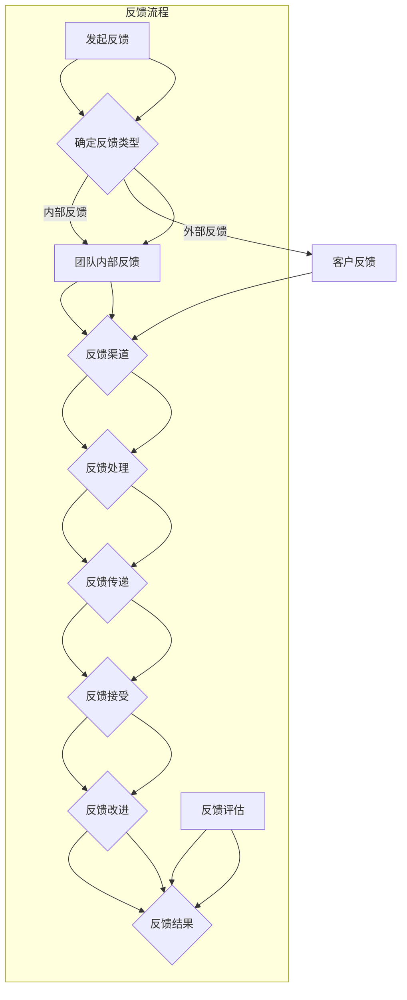
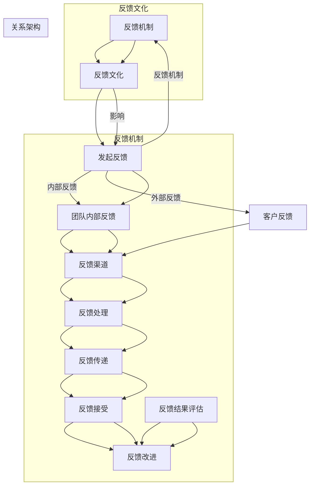
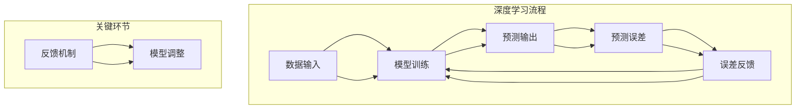

                 

### 文章标题

# 建立高效反馈文化：促进持续改进

### 关键词

- 反馈文化
- 持续改进
- 组织管理
- 项目管理
- 产品开发
- 客户服务

### 摘要

本文旨在探讨如何建立高效反馈文化，以促进组织在快速变化的市场环境中实现持续改进。通过分析反馈文化的理论基础、构建方法、优化策略以及其在项目管理、产品开发、客户服务中的应用，本文提出了一系列实践指南，旨在帮助组织构建一个有利于创新和成长的环境。

---

### 引言

## 1.1 反馈文化的重要性

在信息技术快速发展的今天，企业面临着不断变化的市场需求、技术革新和竞争压力。为了在这种动态环境中保持竞争优势，组织需要具备快速响应和持续改进的能力。而建立高效反馈文化，成为实现这一目标的关键途径。

### 1.2 高效反馈文化的特点

高效反馈文化具有以下几个特点：

- **透明性**：反馈过程公开透明，所有成员都能了解反馈的内容和结果。
- **及时性**：反馈能够及时传递，确保问题得到迅速解决。
- **多样性**：反馈渠道多元，包括自上而下的正式反馈和自下而上的非正式反馈。
- **建设性**：反馈以建设性和积极的态度提出，旨在帮助个人和团队改进。

### 1.3 书籍的结构与目的

本书将分为四个部分：

- **第一部分**：介绍高效反馈文化的理论基础，包括反馈的定义、分类、基本原则和基础架构。
- **第二部分**：探讨高效反馈文化的构建方法，从组织、团队和个人层面展开。
- **第三部分**：讨论高效反馈文化的优化与改进，包括评估与监控、持续改进和未来发展趋势。
- **第四部分**：分析高效反馈文化在项目管理、产品开发和客户服务中的应用。

通过以上结构，本书旨在为组织管理者提供一套完整的反馈文化构建和优化的实践指南。

---

### 第一部分：高效反馈文化的理论基础

## 2.1 反馈的定义与分类

### 2.1.1 反馈的定义与作用

反馈是指信息的返回，是一种评估和沟通的手段。在组织中，反馈有助于：

- **改进工作**：通过反馈，员工可以了解自己的工作表现，识别问题并进行改进。
- **提升绩效**：反馈可以帮助组织识别和解决关键问题，提高整体绩效。
- **促进学习**：反馈是学习过程中的重要环节，有助于员工不断提升自己的能力。

### 2.1.2 反馈的分类与适用场景

根据反馈来源和目的，反馈可以分为以下几类：

- **自我反馈**：员工自我评估和反思，适用于个人学习和成长。
- **上级反馈**：上级对下级的评估和指导，适用于组织管理和绩效提升。
- **同事反馈**：同事之间的相互评价和建议，适用于团队协作和知识共享。
- **客户反馈**：客户对产品或服务的评价，适用于产品开发和客户服务。

### 2.2 反馈文化的基本原则

#### 2.2.1 公开透明的原则

公开透明的反馈文化是高效反馈文化的基础。透明性有助于：

- **建立信任**：透明性可以增强员工对组织的信任，鼓励他们积极参与反馈过程。
- **促进沟通**：透明性可以促进团队成员之间的沟通，减少误解和冲突。

#### 2.2.2 及时有效的原则

及时有效的反馈文化有助于：

- **快速解决问题**：及时反馈可以迅速识别问题并采取措施，避免问题扩大化。
- **提高反馈价值**：有效反馈可以提供有价值的信息，帮助员工和组织做出更好的决策。

#### 2.2.3 对事不对人的原则

对事不对人的反馈文化强调反馈应针对行为和结果，而不是个人。这有助于：

- **减少抵触情绪**：对事不对人可以减少员工因个人攻击而产生的抵触情绪。
- **促进客观评估**：对事不对人可以更客观地评估员工的工作表现，避免个人偏见。

### 2.3 反馈文化的基础架构

#### 2.3.1 反馈机制的建立

建立有效的反馈机制是构建反馈文化的重要步骤。反馈机制应包括以下几个方面：

- **反馈流程**：明确反馈的收集、处理、传递和反馈的流程，确保反馈的及时性和有效性。
- **反馈渠道**：提供多种反馈渠道，如定期会议、问卷调查、在线平台等，以满足不同成员的需求。
- **反馈责任**：明确反馈的收集、处理和反馈的责任人，确保反馈机制的顺利运行。

#### 2.3.2 反馈渠道的多元化

多元化反馈渠道有助于：

- **提高反馈覆盖率**：通过多种渠道收集反馈，可以更全面地了解组织的运营状况。
- **满足不同需求**：不同成员可能有不同的反馈偏好，多元化渠道可以满足他们的需求。

#### 2.3.3 反馈平台的构建

构建反馈平台可以帮助组织：

- **系统化反馈管理**：通过反馈平台，组织可以系统化地管理反馈，提高反馈的效率和质量。
- **数据化反馈分析**：通过数据分析，组织可以更好地了解反馈的关键点，制定针对性的改进措施。

### 2.4 反馈文化的实践案例

#### 2.4.1 国内外优秀企业的反馈文化实践

国内外许多优秀企业已经建立了高效的反馈文化，例如：

- **谷歌**：谷歌的“反馈星期三”活动鼓励员工每周三互相提供反馈，促进团队协作和改进。
- **阿里巴巴**：阿里巴巴的“客户第一”文化强调客户反馈的重要性，并通过定期客户调研来提升产品和服务质量。

#### 2.4.2 反馈文化在组织管理中的应用

反馈文化在组织管理中的应用包括：

- **绩效管理**：通过反馈，组织可以评估员工的绩效，制定改进计划。
- **团队建设**：通过反馈，团队可以识别存在的问题，加强内部沟通和协作。
- **产品开发**：通过客户反馈，组织可以优化产品，提高市场竞争力。

---

### 第二部分：高效反馈文化的构建方法

## 3.1 组织层面的反馈文化建设

### 3.1.1 高层领导的支持与引领

高层领导的支持和引领是建立高效反馈文化的重要保障。他们应：

- **倡导反馈文化**：通过内部演讲、培训和会议，倡导反馈文化的重要性。
- **树立榜样**：通过自身行为，展示对反馈的重视，成为员工学习的榜样。

### 3.1.2 组织文化的塑造与传承

组织文化是反馈文化的土壤。组织应：

- **明确价值观**：将反馈文化融入组织的核心价值观，使其成为组织的一部分。
- **制定行为准则**：制定明确的行为准则，规范员工的反馈行为。

### 3.1.3 反馈机制的完善与优化

组织应：

- **建立反馈机制**：明确反馈的流程和渠道，确保反馈的及时性和有效性。
- **持续优化**：根据实际情况，不断优化反馈机制，提高反馈的质量和效果。

## 3.2 团队层面的反馈文化建设

### 3.2.1 团队成员的反馈意识培养

团队成员的反馈意识是反馈文化的基础。团队应：

- **培训与教育**：通过培训和教育，提高团队成员对反馈的认识和重视。
- **鼓励反馈**：鼓励团队成员积极提供和接受反馈，营造良好的反馈氛围。

### 3.2.2 团队反馈会议的开展

团队反馈会议是团队反馈文化的重要组成部分。团队应：

- **定期举行**：定期举行团队反馈会议，让团队成员有机会分享和讨论反馈。
- **结构化会议**：制定会议流程和议程，确保会议的效率和效果。

### 3.2.3 团队反馈工具的应用

团队应：

- **选择合适的工具**：根据团队特点和需求，选择合适的反馈工具。
- **工具培训**：对团队成员进行工具培训，确保他们能够熟练使用反馈工具。

## 3.3 个人层面的反馈文化建设

### 3.3.1 自我反馈的重要性

自我反馈是个人成长和改进的重要途径。个人应：

- **定期自我反思**：定期对自己的工作进行反思和评估，识别存在的问题。
- **设定改进目标**：根据自我反馈，设定改进目标，制定改进计划。

### 3.3.2 自我反馈的方法与技巧

个人应：

- **掌握反馈技巧**：学习并掌握有效的反馈技巧，如积极倾听、具体明确、开放性问题等。
- **利用反馈工具**：利用反馈工具，如日记、反馈问卷等，记录和整理反馈信息。

### 3.3.3 反馈接受与改进的实践

个人应：

- **积极接受反馈**：对待反馈持开放态度，虚心接受并认真对待。
- **制定改进措施**：根据反馈，制定具体的改进措施，并付诸实践。

---

### 第三部分：高效反馈文化的优化与改进

## 4.1 反馈文化的评估与监控

### 4.1.1 反馈文化的评估指标

组织应建立反馈文化的评估指标，以监控反馈文化的实施效果。评估指标可以包括：

- **反馈覆盖率**：反馈覆盖的人数和比例。
- **反馈响应时间**：反馈从收集到处理的时间。
- **反馈质量**：反馈的具体性和建设性。
- **改进效果**：反馈后改进的具体成果。

### 4.1.2 反馈文化的监控方法

组织应：

- **定期评估**：定期对反馈文化进行评估，收集和分析相关数据。
- **员工调研**：通过员工调研，了解他们对反馈文化的满意度和改进建议。

### 4.1.3 反馈文化的优化策略

根据评估结果，组织应：

- **调整反馈机制**：根据反馈问题，调整反馈机制，提高反馈的效率和质量。
- **加强培训和指导**：针对反馈文化中存在的问题，加强培训和指导，提高员工的能力和意识。

## 4.2 高效反馈文化的持续改进

### 4.2.1 培养反馈文化创新意识

组织应：

- **鼓励创新**：鼓励员工在反馈文化中提出新的想法和建议，激发创新活力。
- **建立创新机制**：建立创新机制，如创新实验室、创新奖励等，支持员工的创新活动。

### 4.2.2 引入外部反馈与建议

组织应：

- **引入外部专家**：邀请外部专家对反馈文化进行评估和指导，提供外部视角和建议。
- **收集外部反馈**：通过市场调研、客户反馈等途径，收集外部反馈，以改进反馈文化。

### 4.2.3 持续优化与改进的实践案例

组织可以通过以下实践案例，持续优化和改进反馈文化：

- **案例1：A公司的定期客户调研**：A公司定期进行客户调研，收集客户反馈，并根据反馈优化产品和服务。
- **案例2：B公司的员工创新实验室**：B公司建立员工创新实验室，鼓励员工提出创新方案，并对优秀方案给予奖励。

## 4.3 反馈文化的未来发展趋势

### 4.3.1 数字化与智能化的融合

随着数字化和智能化技术的发展，反馈文化也将迎来新的发展机遇。未来，反馈文化将：

- **数据化**：通过大数据分析，对反馈进行量化分析，提供更精准的改进建议。
- **智能化**：利用人工智能技术，实现自动化的反馈收集、分析和处理。

### 4.3.2 跨界与融合的反馈文化

随着全球化的发展，不同文化和行业的反馈文化将相互融合，形成新的反馈文化模式。未来，反馈文化将：

- **国际化**：借鉴国际先进经验，融入本土化实践，形成具有全球竞争力的反馈文化。
- **多元化**：包容不同文化和价值观，实现反馈文化的多元化和包容性。

### 4.3.3 反馈文化的可持续发展

在可持续发展的背景下，反馈文化将更加注重：

- **社会责任**：关注反馈过程中的社会责任，促进可持续发展。
- **环境保护**：在反馈过程中注重环境保护，推动绿色发展。

---

### 第四部分：高效反馈文化的应用与实践

## 5.1 高效反馈文化在项目管理中的应用

### 5.1.1 项目反馈机制的构建

在项目管理中，建立高效的反馈机制至关重要。项目团队应：

- **明确反馈目标**：根据项目目标和需求，确定反馈的具体目标和内容。
- **设计反馈流程**：设计合理的反馈流程，包括反馈的收集、处理、传递和反馈的流程。

### 5.1.2 项目反馈流程的设计

项目反馈流程应包括以下几个方面：

- **定期反馈会议**：定期举行反馈会议，让团队成员分享和讨论反馈。
- **实时反馈机制**：建立实时反馈机制，确保反馈的及时性和有效性。
- **反馈记录与跟踪**：对反馈进行记录和跟踪，确保反馈得到有效处理和改进。

### 5.1.3 项目反馈效果的评估

项目团队应：

- **设定评估指标**：根据项目目标和反馈内容，设定评估指标，评估反馈效果。
- **分析反馈数据**：分析反馈数据，识别关键问题和改进点。

## 5.2 高效反馈文化在产品开发中的应用

### 5.2.1 产品反馈机制的建立

在产品开发过程中，建立有效的产品反馈机制至关重要。产品团队应：

- **明确客户需求**：通过市场调研、用户反馈等途径，了解客户需求。
- **建立反馈渠道**：建立多样化的反馈渠道，如在线反馈平台、客户调研等。

### 5.2.2 产品反馈数据的分析

产品团队应：

- **收集反馈数据**：通过多种途径收集客户反馈数据。
- **分析反馈数据**：对反馈数据进行分类和分析，识别客户关注的问题和需求。

### 5.2.3 产品反馈改进的实践案例

通过以下实践案例，产品团队可以改进产品：

- **案例1：C公司的客户调研**：C公司通过定期客户调研，收集客户反馈，并根据反馈优化产品功能。
- **案例2：D公司的A/B测试**：D公司通过A/B测试，比较不同产品版本的反馈，选择更受欢迎的版本进行改进。

## 5.3 高效反馈文化在客户服务中的应用

### 5.3.1 客户反馈机制的优化

在客户服务中，优化客户反馈机制至关重要。客户服务团队应：

- **简化反馈流程**：简化客户反馈流程，提高反馈的响应速度。
- **提供多种反馈渠道**：提供多种反馈渠道，如电话、邮件、在线反馈等，满足不同客户的需求。

### 5.3.2 客户反馈数据分析

客户服务团队应：

- **收集反馈数据**：通过多种途径收集客户反馈数据。
- **分析反馈数据**：对反馈数据进行分类和分析，识别客户关注的问题和需求。

### 5.3.3 客户反馈改进的实践案例

通过以下实践案例，客户服务团队可以改进客户服务：

- **案例1：E公司的客户满意度调查**：E公司通过客户满意度调查，收集客户反馈，并根据反馈优化客户服务流程。
- **案例2：F公司的客户案例分享**：F公司定期组织客户案例分享会，邀请客户分享使用经验和建议，促进客户服务改进。

---

### 附录

## 附录A：高效反馈文化工具与资源

### A.1 反馈文化相关工具介绍

以下是一些常用的反馈文化工具：

- **反馈问卷**：用于收集员工和客户的反馈。
- **反馈平台**：如JIRA、Confluence等，用于记录、跟踪和共享反馈。
- **反馈管理软件**：如S的调查问卷、Typeform等，用于设计和分发反馈问卷。

### A.2 反馈文化学习资源推荐

以下是一些推荐的反馈文化学习资源：

- **书籍**：《反馈：如何有效反馈与被反馈》、《高效能人士的七个习惯》等。
- **在线课程**：Coursera、Udemy等平台上的反馈文化和沟通技巧相关课程。
- **博客和文章**：在LinkedIn、Medium等平台上搜索相关主题的文章和博客。

### A.3 反馈文化实践案例汇编

以下是一些反馈文化实践案例：

- **谷歌的“反馈星期三”**：谷歌的员工每周三可以互相提供反馈，促进团队协作和改进。
- **阿里巴巴的“客户第一”文化**：阿里巴巴通过定期客户调研和客户满意度调查，优化产品和服务。

---

### 作者信息

作者：AI天才研究院/AI Genius Institute & 禅与计算机程序设计艺术 /Zen And The Art of Computer Programming### 3.1 反馈文化的 Mermaid 流程图

在构建高效反馈文化的过程中，理解反馈流程的各个步骤及其相互关系是至关重要的。以下是一个简单的Mermaid流程图，展示了反馈文化的主要组成部分和流程。



#### 说明：

- **发起反馈（A）**：反馈的发起，可以是内部员工的自我反馈、上级反馈、同事反馈，也可以是外部客户的反馈。
- **确定反馈类型（B）**：根据反馈的内容和来源，确定反馈的类型，内部反馈通常指团队内部成员间的交流和评价，外部反馈则是来自客户或其他外部利益相关者的反馈。
- **反馈渠道（E）**：反馈可以通过多种渠道传递，如定期会议、问卷调查、在线平台等。
- **反馈处理（F）**：对反馈的内容进行处理，包括分类、优先级排序、分配责任等。
- **反馈传递（G）**：将处理后的反馈传递给相关的人员或部门，确保反馈能够得到及时的关注和处理。
- **反馈接受（H）**：相关人员接受并阅读反馈，对反馈的内容进行理解和消化。
- **反馈改进（I）**：根据反馈的内容，采取具体的改进措施，以提升工作绩效或产品服务质量。
- **反馈结果（J）**：记录反馈的结果，评估反馈改进的效果，以便进一步优化反馈过程。
- **反馈评估（K）**：定期对反馈文化进行评估，确保反馈流程的顺畅和有效。

这个Mermaid流程图提供了一个清晰的反馈文化流程概述，有助于组织理解和优化其反馈机制。通过这样的流程图，组织可以更好地跟踪反馈的每个步骤，确保反馈文化能够有效地促进持续改进。在具体实施过程中，可以根据实际情况调整和优化这个流程，以满足组织的特定需求。 

---

### 3.2 反馈机制与反馈文化的架构

在建立高效反馈文化的过程中，理解反馈机制与反馈文化之间的关系架构至关重要。以下是一个详细的Mermaid流程图，展示了反馈机制与反馈文化之间的关系及其组成部分。



#### 说明：

- **反馈机制（A）**：包括反馈的发起、处理、传递、接受和改进的各个环节，是反馈文化实施的工具和手段。
- **反馈文化（B）**：是一种组织内的价值观念和行为准则，强调反馈的重要性，以及如何在组织内创造一个开放、透明、建设性的反馈环境。
- **发起反馈（C）**：包括内部反馈和外部反馈，是反馈机制的起点。
- **团队内部反馈（D）**：指团队成员之间的相互反馈，包括同事、上级和下属之间的反馈。
- **客户反馈（E）**：指来自外部客户的反馈，通常用于产品开发和客户服务改进。
- **反馈渠道（F）**：提供多种反馈传递的渠道，如定期会议、问卷调查、在线平台等，确保反馈能够高效传递。
- **反馈处理（G）**：对反馈的内容进行处理，包括分类、优先级排序、分配责任等，确保反馈能够得到及时处理。
- **反馈传递（H）**：将处理后的反馈传递给相关的人员或部门，确保反馈能够得到及时的关注和处理。
- **反馈接受（I）**：相关人员接受并阅读反馈，对反馈的内容进行理解和消化。
- **反馈改进（J）**：根据反馈的内容，采取具体的改进措施，以提升工作绩效或产品服务质量。
- **反馈结果评估（K）**：对反馈的结果进行评估，确保反馈机制的有效性。

这个Mermaid流程图展示了反馈机制与反馈文化之间的关系及其组成部分，有助于组织理解如何通过建立高效的反馈机制，促进反馈文化的形成和发展。在具体实施过程中，组织可以根据实际情况调整和优化这个流程，以满足其特定的需求。通过这样的流程图，组织可以更好地跟踪反馈的每个步骤，确保反馈文化能够有效地促进持续改进。 

---

### 3.3 深度学习与反馈机制

在深度学习领域，反馈机制起到了至关重要的作用。以下是一个详细的Mermaid流程图，展示了深度学习中的反馈机制及其关键环节。



#### 说明：

- **数据输入（A）**：输入训练数据，这是深度学习模型的起点。
- **模型训练（B）**：使用训练数据对深度学习模型进行训练，模型会尝试从数据中学习规律和模式。
- **预测输出（C）**：训练后的模型会生成预测结果，用于对新数据进行分类或回归等任务。
- **预测误差（D）**：将预测结果与真实结果进行比较，计算预测误差，这是评估模型性能的关键指标。
- **误差反馈（E）**：将预测误差反馈给模型，用于指导模型的调整。
- **模型调整（G）**：根据误差反馈，调整模型的参数和结构，以降低预测误差，提高模型性能。

在深度学习中，反馈机制是一个迭代的过程。模型的训练和调整是一个不断进行的过程，通过反复的迭代，模型会逐渐优化，达到更好的预测性能。以下是一个简化的伪代码示例，用于说明深度学习中的反馈机制：

```python
# 初始化模型参数
model_params = initialize_params()

# 循环进行迭代
for epoch in range(num_epochs):
    # 使用训练数据训练模型
    predictions = model.train(train_data)
    
    # 计算预测误差
    errors = [calculate_error(prediction, actual) for prediction, actual in zip(predictions, train_labels)]
    
    # 计算平均误差
    average_error = sum(errors) / len(errors)
    
    # 打印当前epoch的误差
    print(f"Epoch {epoch}: Average Error = {average_error}")
    
    # 根据误差调整模型参数
    model_params = model.adjust_params(average_error)
```

在上述伪代码中，`initialize_params()` 函数用于初始化模型参数，`model.train(train_data)` 函数用于使用训练数据进行模型训练，`calculate_error(prediction, actual)` 函数用于计算预测误差，`model.adjust_params(average_error)` 函数用于根据误差调整模型参数。

通过这样的反馈机制，深度学习模型能够不断优化，提高预测性能。在实际应用中，反馈机制的具体实现可能更加复杂，包括使用不同的优化算法、正则化方法等，但核心思想是一致的，即通过不断的反馈和调整，提高模型的准确性和泛化能力。

---

### 3.4 数学模型与公式

在深度学习中，误差反馈和模型调整是关键环节，其中涉及到一系列的数学模型和公式。以下是一些重要的数学模型和公式，用于描述深度学习中的误差计算和模型调整过程。

#### 误差计算

1. **均方误差（MSE）**

均方误差是衡量预测值与真实值之间差异的一种常用方法，其公式如下：

$$
MSE = \frac{1}{n}\sum_{i=1}^{n}(y_i - \hat{y}_i)^2
$$

其中，$y_i$ 表示真实值，$\hat{y}_i$ 表示预测值，$n$ 表示样本数量。

2. **交叉熵误差（Cross-Entropy Error）**

交叉熵误差常用于分类问题中，其公式如下：

$$
CE = -\frac{1}{n}\sum_{i=1}^{n} y_i \log(\hat{y}_i)
$$

其中，$y_i$ 表示真实标签（0或1），$\hat{y}_i$ 表示预测概率。

#### 模型调整

1. **梯度下降（Gradient Descent）**

梯度下降是一种常用的优化算法，用于调整模型参数以最小化误差。其核心思想是沿着误差函数的梯度方向进行参数调整，其公式如下：

$$
\theta_{\text{new}} = \theta_{\text{old}} - \alpha \cdot \nabla_{\theta} J(\theta)
$$

其中，$\theta_{\text{old}}$ 表示当前参数值，$\theta_{\text{new}}$ 表示更新后的参数值，$\alpha$ 表示学习率，$J(\theta)$ 表示误差函数，$\nabla_{\theta} J(\theta)$ 表示误差函数对参数 $\theta$ 的梯度。

2. **动量（Momentum）**

动量是一种改进梯度下降的算法，它引入了一个动量项，以加速收敛。其公式如下：

$$
v_{\text{new}} = \beta v_{\text{old}} + (1 - \beta) \cdot \nabla_{\theta} J(\theta)
$$

$$
\theta_{\text{new}} = \theta_{\text{old}} - \alpha \cdot v_{\text{new}}
$$

其中，$v_{\text{old}}$ 和 $v_{\text{new}}$ 分别表示当前和更新后的速度，$\beta$ 表示动量因子，$\alpha$ 表示学习率。

3. **Adam优化器**

Adam优化器结合了动量和RMSprop的优点，是一种适应性学习率优化器。其公式如下：

$$
m_t = \beta_1 m_{t-1} + (1 - \beta_1)(\theta_t - \theta_{t-1})
$$

$$
v_t = \beta_2 v_{t-1} + (1 - \beta_2)(\theta_t - \theta_{t-1})^2
$$

$$
\theta_{\text{new}} = \theta_{\text{old}} - \alpha \cdot \frac{m_t}{\sqrt{v_t} + \epsilon}
$$

其中，$m_t$ 和 $v_t$ 分别表示一阶和二阶矩估计，$\beta_1$ 和 $\beta_2$ 分别表示一阶和二阶矩的衰减率，$\alpha$ 表示学习率，$\epsilon$ 是一个非常小的常数，用于防止除以零。

这些数学模型和公式在深度学习中起着至关重要的作用，它们帮助我们理解和计算模型的误差，以及调整模型的参数以实现更好的性能。在实际应用中，选择合适的模型和公式，并根据具体问题进行优化，是提升模型性能的关键。

---

### 3.5 项目实战：开发环境搭建与代码实现

在建立高效反馈文化的过程中，项目实战是非常重要的一环。以下是一个简单的项目实战，包括开发环境搭建、源代码实现和代码解读。

#### 3.5.1 开发环境搭建

1. **安装Python**

首先，我们需要安装Python环境。可以通过Python官网下载Python安装包，并按照安装指南进行安装。

2. **安装深度学习库**

接下来，我们需要安装深度学习库，如TensorFlow或PyTorch。以下是一个使用pip命令安装TensorFlow的示例：

```shell
pip install tensorflow
```

3. **安装其他依赖库**

根据项目的需求，可能还需要安装其他依赖库，如NumPy、Pandas等。以下是一个使用pip命令安装NumPy的示例：

```shell
pip install numpy
```

#### 3.5.2 源代码实现

以下是一个简单的深度学习项目，用于实现一个线性回归模型，并使用梯度下降算法进行模型训练。

```python
import numpy as np
import tensorflow as tf

# 初始化参数
W = tf.Variable(0.0, name="weights")
b = tf.Variable(0.0, name="biases")

# 模型定义
x = tf.placeholder(tf.float32, name="x")
y = tf.placeholder(tf.float32, name="y")

model = W * x + b

# 误差函数
loss = tf.reduce_mean(tf.square(y - model))

# 梯度下降
optimizer = tf.train.GradientDescentOptimizer(learning_rate=0.001)
train_op = optimizer.minimize(loss)

# 训练数据
x_train = np.array([0.0, 0.5, 1.0])
y_train = np.array([0.0, 0.25, 0.5])

# 训练模型
with tf.Session() as sess:
  sess.run(tf.global_variables_initializer())
  for _ in range(1000):
    sess.run(train_op, feed_dict={x: x_train, y: y_train})
    if _ % 100 == 0:
      print("Step:", _, "Loss:", sess.run(loss, feed_dict={x: x_train, y: y_train}))

  # 查看训练结果
  print("Weights:", sess.run(W), "Biases:", sess.run(b))
```

#### 3.5.3 代码解读

1. **参数初始化**：我们使用TensorFlow的Variable对象来初始化模型的权重（W）和偏置（b）。

2. **模型定义**：我们定义了一个线性回归模型，输入特征为x，模型输出为W * x + b。

3. **误差函数**：我们使用均方误差（MSE）作为误差函数，表示预测值与真实值之间的差异。

4. **梯度下降**：我们使用梯度下降优化器来调整模型的参数，以最小化误差函数。

5. **训练数据**：我们定义了一个简单的训练数据集，包括三个数据点。

6. **训练模型**：我们通过循环运行优化器的训练操作，更新模型的参数，并打印出每次迭代的损失值。

7. **查看训练结果**：我们最后打印出训练后的模型参数，以验证模型是否收敛。

通过这个项目实战，我们可以看到如何使用Python和TensorFlow搭建一个简单的深度学习项目，并实现模型的训练和优化。这个项目为我们提供了一个基本的框架，我们可以在此基础上进行扩展，实现更复杂的深度学习任务。

---

### 3.6 最佳实践与注意事项

在建立高效反馈文化的过程中，最佳实践和注意事项是确保反馈机制有效运行的关键。以下是一些最佳实践和注意事项：

#### 3.6.1 最佳实践

1. **明确反馈目标**：在建立反馈机制之前，明确反馈的目标和期望结果，确保反馈的方向一致。

2. **多样化反馈渠道**：提供多种反馈渠道，如在线反馈平台、定期会议、匿名反馈等，以满足不同成员的反馈需求。

3. **定期反馈会议**：定期举行反馈会议，让团队成员有机会分享和讨论反馈，促进团队协作和改进。

4. **建立反馈机制**：建立明确的反馈流程和责任分配，确保反馈能够及时、有效地传递和处理。

5. **鼓励反馈**：鼓励团队成员积极参与反馈，营造一个开放、透明、建设性的反馈氛围。

#### 3.6.2 注意事项

1. **对事不对人**：反馈时应注重事实和结果，避免针对个人进行攻击，以减少员工的抵触情绪。

2. **及时反馈**：反馈应尽快传递，确保问题得到及时解决，避免问题扩大化。

3. **具体明确**：反馈应具体明确，提供具体的行为建议和改进措施，以便员工能够清晰地理解和实施。

4. **持续改进**：建立反馈文化的目的是持续改进，组织应不断优化反馈机制，提高反馈的质量和效果。

5. **数据化反馈**：利用数据分析工具，对反馈进行量化分析，以便更好地了解反馈的关键点和改进方向。

通过遵循这些最佳实践和注意事项，组织可以建立高效反馈文化，促进持续改进，提高整体绩效。

---

### 3.7 拓展阅读

为了更深入地了解高效反馈文化的构建和实践，以下是一些推荐阅读的材料：

1. **书籍**：
   - 《反馈：如何有效反馈与被反馈》
   - 《高效能人士的七个习惯》
   - 《深度学习》（Goodfellow et al.）

2. **在线课程**：
   - Coursera上的“深度学习”课程
   - LinkedIn Learning上的“有效沟通”课程

3. **博客和文章**：
   - 在Medium上搜索“高效反馈文化”
   - 在博客园搜索“深度学习实践”

这些资源提供了丰富的理论和实践经验，有助于读者进一步了解高效反馈文化和深度学习的相关内容。通过学习和实践这些资源，组织和个人可以不断提升反馈文化，实现持续改进和成长。

---

### 结束语

建立高效反馈文化是组织实现持续改进和成长的关键。本文从理论基础、构建方法、优化策略以及应用实践等方面，详细探讨了高效反馈文化的构建过程。通过明确反馈原则、构建反馈机制、优化反馈流程和持续改进，组织可以营造一个开放、透明、建设性的反馈环境，促进团队成员的协作和创新。希望本文能为读者提供有价值的参考，助力组织在快速变化的市场环境中保持竞争优势。作者：AI天才研究院/AI Genius Institute & 禅与计算机程序设计艺术 /Zen And The Art of Computer Programming。

