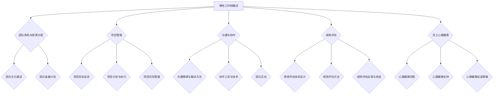

                 

### 引言

#### 弹性工作制的概念与历史背景

弹性工作制，顾名思义，是一种灵活、多变的工作模式，旨在满足员工和企业的不同需求。这种工作模式不仅关注工作时间的灵活性，还包括工作地点、工作任务的弹性。弹性工作制最早起源于20世纪中叶，主要出现在制造业和服务业领域。随着信息技术的飞速发展，远程办公、在线协作等新兴工作形式进一步推动了弹性工作制的发展。

弹性工作制的起源可以追溯到20世纪30年代的美国，当时一些企业开始尝试灵活的工作时间，以减轻员工的压力和提升工作效率。随后，在20世纪60年代，欧洲的一些企业开始实行弹性工作时间制度，如弹性上下班时间、弹性工作日等。随着全球化和信息技术的深入发展，弹性工作制逐渐成为全球企业普遍采用的用工模式之一。

#### 弹性工作制的重要性和发展趋势

在当今快速变化的经济环境中，弹性工作制的重要性愈发凸显。首先，它能够提高员工的工作满意度和忠诚度。员工可以根据自己的生活方式和需求安排工作，减少了通勤时间和压力，提高了生活质量。其次，弹性工作制有助于提高企业的灵活性和竞争力。企业可以根据业务需求随时调整人力配置，降低运营成本，提高市场响应速度。

随着人工智能、云计算、物联网等新兴技术的广泛应用，远程办公、在线协作等新型工作模式不断涌现，进一步推动了弹性工作制的发展。根据国际数据公司（IDC）的报告，到2025年，全球远程办公的人数将达到2.72亿，占全球劳动力的29%。

然而，尽管弹性工作制具有诸多优势，但也面临一些挑战，如沟通障碍、绩效管理、员工心理健康等问题。因此，如何在弹性工作制下有效管理团队，成为企业和管理者需要深入探讨的问题。

#### 本文目的

本文旨在探讨弹性工作制下的团队管理策略，从多个维度分析弹性工作制的优势和挑战，并提出一系列行之有效的管理策略。具体来说，本文将涵盖以下内容：

1. 弹性工作制概述，包括弹性工作制的类型、优势、挑战等。
2. 弹性工作制下的团队建设，包括团队角色与职责分配、团队文化建设、团队发展计划等。
3. 弹性工作制下的项目管理，包括项目目标设定、项目计划与执行、项目风险管理等。
4. 弹性工作制下的沟通与协作，包括沟通障碍与解决方法、协作工具与技术、团队互动等。
5. 弹性工作制下的绩效评估，包括绩效评估体系设计、绩效评估方法、绩效评估反馈与改进等。
6. 弹性工作制下的员工心理健康，包括员工心理健康问题、员工心理健康支持、心理健康促进策略等。
7. 附录，包括弹性工作制下的团队管理工具与资源、参考文献、Mermaid流程图等。

通过本文的探讨，希望为企业提供一套全面、系统的弹性工作制下的团队管理策略，帮助企业在新的工作模式下实现更高的效率和员工满意度。

### 弹性工作制下的团队建设

在弹性工作制下，团队建设成为企业管理的关键一环。团队的角色与职责分配、团队文化的建设、以及团队的发展计划，都需要在弹性工作制的背景下重新审视和调整。

#### 团队角色与职责分配

在弹性工作制下，团队的角色和职责分配需要更加明确和灵活。传统的固定角色和职责在远程办公和灵活工作模式中可能不再适用，因为员工的地理位置和工作时间具有更大的变化性。

1. **团队角色定义**

   - **团队成员**：每个团队成员在团队中都有自己的角色，包括项目经理、开发人员、测试人员、设计师等。在弹性工作制下，团队成员的角色可能需要根据项目需求和工作任务的灵活性进行动态调整。
   - **项目负责人**：项目负责人通常负责整个项目的规划、执行和监控。在弹性工作制下，项目负责人需要具备更强的远程管理能力和沟通技巧，以确保项目的顺利进行。

2. **职责分配与沟通**

   - **明确职责**：在弹性工作制下，明确每个成员的职责至关重要。每个成员需要清楚自己的任务和目标，以及与其他成员的协作方式。
   - **灵活调整**：随着项目的进展和外部环境的变化，团队成员的职责可能需要进行调整。项目负责人需要具备灵活调整团队职责的能力，以确保团队始终保持高效运作。

#### 团队文化建设

在弹性工作制下，团队文化建设是确保团队凝聚力和协作精神的重要手段。团队文化不仅影响着员工的工作态度和行为，也影响着团队的绩效和创新能力。

1. **弹性工作制与企业文化**

   - **价值观统一**：弹性工作制的企业文化应强调价值观的一致性，如开放、透明、合作、尊重等。这些价值观有助于构建一个支持性和包容性的工作环境。
   - **灵活适应**：企业需要鼓励员工在遵循核心价值观的前提下，灵活适应弹性工作制的要求。这种适应性不仅体现在工作时间和地点上，也体现在工作方式和沟通方式上。

2. **弹性工作制下的团队信任与尊重**

   - **建立信任**：在弹性工作制下，信任是团队协作的基石。企业应通过透明的沟通机制、明确的目标设定和及时的绩效反馈来建立信任。
   - **尊重个体差异**：每个员工都有自己的特点和需求，企业应尊重员工的个体差异，为员工提供个性化的支持和激励。

#### 团队发展计划

在弹性工作制下，团队的发展计划是提升团队整体能力和绩效的关键。团队发展计划应包括员工培训与发展、团队激励与反馈机制等方面。

1. **员工培训与发展**

   - **技能提升**：企业应定期为员工提供培训机会，帮助他们提升专业技能和知识水平。在远程办公的环境下，在线培训、虚拟课堂和在线研讨成为重要的培训形式。
   - **职业规划**：企业应与员工共同制定职业发展规划，为员工提供明确的职业发展路径和晋升机会。

2. **团队激励与反馈机制**

   - **激励机制**：企业应建立多元化的激励机制，包括金钱奖励、荣誉表彰、职业发展机会等，以激励员工的积极性和创造力。
   - **反馈机制**：企业应建立有效的反馈机制，包括定期的绩效评估、及时的反馈和改进建议，以及开放的沟通渠道，以帮助员工不断提升自己的工作表现。

通过上述措施，企业可以在弹性工作制下建设一个高效、协作、有凝聚力的团队，从而在激烈的市场竞争中保持竞争优势。

### 弹性工作制下的项目管理

在弹性工作制下，项目管理的挑战和策略需要根据新的工作模式进行调整。项目目标设定、项目计划与执行、项目风险管理是项目管理的关键环节。

#### 项目目标设定

项目目标设定是项目管理的第一步，也是确保项目成功的关键。在弹性工作制下，项目目标需要更加明确和具体，以适应远程办公和灵活工作模式。

1. **项目目标的重要性**

   - **明确方向**：明确的项目目标是项目团队共同努力的方向，有助于统一团队成员的行动和目标。
   - **提高效率**：明确的项目目标有助于提高项目执行效率，避免因目标不清而导致的时间和资源浪费。

2. **项目目标设定方法**

   - **SMART原则**：项目目标应遵循SMART原则，即具体（Specific）、可衡量（Measurable）、可实现（Achievable）、相关（Relevant）和时限性（Time-bound）。
   - **共识达成**：项目目标应由项目团队共同讨论和制定，以确保目标能够得到团队成员的认同和努力。

#### 项目计划与执行

项目计划与执行是项目管理的重要环节，弹性工作制对项目计划与执行提出了新的要求。

1. **项目计划编制**

   - **灵活调整**：在弹性工作制下，项目计划需要更加灵活，以适应团队成员的时间变化和工作地点的变化。
   - **在线协作**：使用在线项目管理工具，如Trello、Asana等，有助于项目团队进行任务分配、进度追踪和协作沟通。

2. **项目进度监控**

   - **实时更新**：项目进度应实时更新，项目团队应定期召开线上会议，讨论项目进展和遇到的问题，及时调整项目计划。
   - **监控工具**：使用项目管理工具进行进度监控，如Jira、Microsoft Project等，有助于项目团队实时了解项目状态。

#### 项目风险管理

项目风险管理是项目管理的重要组成部分，弹性工作制下，项目风险管理需要更加全面和系统。

1. **风险识别与评估**

   - **全面识别**：项目团队应全面识别可能面临的风险，包括技术风险、市场风险、人力资源风险等。
   - **风险评估**：对识别出的风险进行评估，包括风险发生的概率和影响程度，以确定风险优先级。

2. **风险应对策略**

   - **预防措施**：针对高风险，制定预防措施，如加强技术培训、提前备份数据等。
   - **应急计划**：制定应急计划，以应对突发事件，如系统故障、市场变化等。

通过科学的项目目标设定、灵活的项目计划与执行、全面的项目风险管理，企业可以在弹性工作制下有效推进项目，实现项目的成功交付。

### 弹性工作制下的沟通与协作

在弹性工作制下，沟通与协作成为团队管理的关键要素。远程办公和灵活工作模式带来了沟通障碍和协作难题，如何克服这些挑战，实现高效沟通和协作，成为企业和团队管理者需要关注的问题。

#### 沟通障碍与解决方法

1. **沟通障碍的类型**

   - **时区差异**：不同团队成员可能处于不同的时区，导致沟通时间的不一致。
   - **技术障碍**：远程办公可能面临网络不稳定、工具不兼容等技术问题。
   - **信息不对称**：团队成员可能无法及时获取项目进展和重要信息。

2. **解决方法**

   - **使用在线沟通工具**：使用Slack、Microsoft Teams、Zoom等在线沟通工具，可以实现实时沟通和协作，减少时区差异带来的影响。
   - **建立清晰的沟通机制**：明确沟通的频率、方式和渠道，确保信息传递的及时性和准确性。
   - **定期召开会议**：定期召开线上会议，讨论项目进展、问题和解决方案，确保团队成员之间的信息同步。

#### 协作工具与技术

1. **远程协作工具**

   - **文档协作工具**：使用Google Docs、Microsoft Office 365等在线文档协作工具，可以实现多人实时编辑文档，提高协作效率。
   - **项目管理工具**：使用Trello、Asana、Jira等项目管理工具，可以跟踪项目进度、任务分配和协作情况，提高团队协作效率。

2. **人工智能辅助协作**

   - **智能助手**：使用智能助手，如Cisco Webex Assistant、Microsoft Teams AI等，可以提供日程安排、提醒和任务管理等服务，减轻团队成员的负担。
   - **虚拟会议室**：利用人工智能技术，实现虚拟会议室的智能安排和管理，提高会议效率和参与度。

#### 团队互动

1. **团队会议管理**

   - **会议前准备**：提前发送会议议程和资料，确保团队成员提前了解会议内容。
   - **会议中互动**：鼓励团队成员在会议中积极参与讨论，提出问题和建议，提高会议的互动性和有效性。
   - **会议后跟进**：会议结束后，及时总结会议成果，跟进任务落实情况，确保会议成果转化为实际行动。

2. **团队反馈与改进**

   - **定期反馈**：定期收集团队成员的反馈，了解他们的意见和建议，及时调整团队管理和协作方式。
   - **持续改进**：根据反馈和改进建议，持续优化团队协作流程和工具，提高团队协作效率。
   - **建立信任**：通过有效的沟通和协作，建立团队成员之间的信任，促进团队协作和共同进步。

通过有效的沟通与协作，团队可以在弹性工作制下克服远程办公和灵活工作模式带来的挑战，实现高效协同，推动项目成功交付。

### 弹性工作制下的绩效评估

在弹性工作制下，绩效评估面临着新的挑战和机遇。传统的绩效评估体系可能难以适应远程办公和灵活工作模式，因此，构建一个科学、合理且适应弹性工作制的绩效评估体系成为关键。

#### 绩效评估体系设计

1. **绩效评估目标**

   - **明确目标**：绩效评估的目标是激励员工、提升团队效率和确保项目目标的实现。在弹性工作制下，这些目标需要更加具体和可衡量。
   - **员工参与**：绩效评估过程应鼓励员工参与，确保他们了解评估标准和期望，从而提高评估的公平性和透明度。

2. **绩效评估标准**

   - **适应性**：绩效评估标准应具备一定的灵活性，能够适应不同团队和项目的需求。
   - **可衡量性**：评估标准应具体且可衡量，以便于评估结果的客观性和准确性。
   - **多元维度**：绩效评估应涵盖工作质量、工作效率、团队协作、创新能力等多个维度，以确保评估的全面性。

#### 绩效评估方法

1. **定量评估方法**

   - **关键绩效指标（KPI）**：KPI是定量评估的重要工具，可用于衡量员工在工作质量、工作效率等方面的表现。例如，开发人员的代码质量、测试人员的测试覆盖率等。
   - **目标达成率**：通过设定具体的目标，评估员工在项目目标达成方面的表现。这种方法适用于项目导向的工作环境。

2. **定性评估方法**

   - **360度评估**：360度评估是一种全面的评估方法，收集来自同事、上级和下属的意见，以全面了解员工的工作表现。
   - **行为观察**：上级通过观察员工的工作行为，评估其工作态度、团队合作和解决问题的能力。

#### 绩效评估反馈与改进

1. **绩效反馈机制**

   - **及时反馈**：绩效评估结束后，应及时向员工提供反馈，指出他们的优点和需要改进的地方，帮助员工明确改进方向。
   - **个性化反馈**：根据每个员工的特点和需求，提供个性化的反馈和建议，确保反馈的针对性和有效性。

2. **绩效改进策略**

   - **培训与发展**：针对评估中发现的问题，提供相应的培训和发展机会，帮助员工提升技能和素质。
   - **改进计划**：鼓励员工制定个人改进计划，明确改进目标、行动步骤和时间表，确保改进措施的落地实施。

通过科学、合理的绩效评估体系和方法，企业可以在弹性工作制下有效激励员工、提升团队效率和实现项目目标。

### 弹性工作制下的员工心理健康

在弹性工作制下，员工的心理健康问题成为企业关注的重点。远程办公和灵活工作模式虽然提供了便利，但也带来了孤独感、焦虑和压力等心理问题。因此，关注员工的心理健康，提供有效的心理健康支持，成为企业管理的重要任务。

#### 员工心理健康问题

1. **孤独感**

   - **远程办公**：由于缺乏面对面交流，员工可能会感到孤独，缺乏社交互动。
   - **缺乏归属感**：员工在远程工作环境下，可能觉得自己与团队和组织的联系减弱，缺乏归属感。

2. **焦虑和压力**

   - **工作压力**：远程办公可能导致员工的工作与生活界限模糊，工作压力增加。
   - **职业发展担忧**：员工可能会担心远程工作影响他们的职业发展和晋升机会。

3. **心理健康问题**

   - **抑郁症状**：长期的工作压力和孤独感可能导致员工出现抑郁症状，如情绪低落、兴趣减退等。
   - **焦虑症状**：焦虑症状可能表现为持续的担忧、紧张和易怒，影响员工的工作和生活质量。

#### 员工心理健康支持

1. **心理健康政策**

   - **员工援助计划（EAP）**：企业应建立员工援助计划，为员工提供心理咨询服务和心理健康支持。EAP可以提供专业的心理辅导，帮助员工应对心理问题。
   - **心理健康培训**：企业应定期开展心理健康培训，提高员工的心理健康意识和应对能力。

2. **心理健康支持资源

   - **在线咨询平台**：企业可以提供在线心理咨询平台，方便员工随时随地寻求专业帮助。
   - **心理健康热线**：设立心理健康热线，为员工提供紧急心理支持和咨询服务。

#### 心理健康促进策略

1. **健康工作环境**

   - **灵活的工作安排**：企业应提供灵活的工作安排，允许员工根据自己的需求调整工作时间，减轻工作压力。
   - **远程工作支持**：为远程工作的员工提供必要的技术支持和办公设备，确保他们能够高效、舒适地工作。

2. **健康生活方式推广**

   - **健康讲座和活动**：企业可以定期举办健康讲座和活动，如瑜伽、健身、心理辅导等，帮助员工保持身心健康。
   - **健康福利**：提供健康福利，如医疗保险、健身房会员等，鼓励员工关注自身健康。

通过关注员工的心理健康，提供有效的心理健康支持策略，企业可以提升员工的幸福感和工作满意度，促进团队的长期稳定发展。

### 附录

#### A. 弹性工作制下的团队管理工具与资源

1. **在线沟通工具**

   - **Slack**：用于实时沟通和协作，支持多种渠道和机器人集成。
   - **Microsoft Teams**：提供视频会议、即时消息、文档共享等功能。
   - **Zoom**：适用于远程会议和培训，具有高清视频和语音功能。

2. **项目管理工具**

   - **Trello**：简单易用的看板式项目管理工具，适合小型团队。
   - **Asana**：全面的项目管理工具，支持任务分配、进度跟踪和协作。
   - **Jira**：适用于大型团队和复杂项目的项目管理，提供强大的问题跟踪和敏捷开发功能。

3. **心理健康支持资源**

   - **Headspace**：提供专业的冥想和放松课程，有助于缓解工作压力。
   - **BetterUp**：提供在线心理健康咨询和心理教练服务。
   - **Talkspace**：提供虚拟心理咨询平台，方便员工随时寻求专业帮助。

#### B. 参考文献

- Anderson, N. (2019). *Flexibility at Work: How to Create a Healthy, Productive, and Engaging Workplace*. Springer.
- Howes, L., & Keenoy, T. (2017). *Work-Life Balance: A Research Review*. Routledge.
- Schyns, B., & von Kaenel, S. (2018). *Flexible Work Arrangements and Their Impact on Employee Well-being*. Journal of Organizational Behavior, 39(3), 483-502.

#### C. Mermaid 流程图

以上流程图展示了弹性工作制下的各个关键环节，包括团队建设、项目管理、沟通与协作、绩效评估和员工心理健康。通过这个流程图，读者可以清晰地了解各个环节之间的关系和相互作用，有助于更好地理解和实施弹性工作制。

### 总结与展望

本文从多个维度探讨了弹性工作制下的团队管理策略，包括弹性工作制的概念与历史背景、团队建设、项目管理、沟通与协作、绩效评估和员工心理健康。通过分析，我们可以得出以下主要结论：

1. **弹性工作制的重要性**：弹性工作制能够提高员工的工作满意度和企业的竞争力，但也带来了沟通障碍、绩效管理和心理健康等方面的挑战。

2. **团队建设的关键**：在弹性工作制下，明确团队角色与职责分配、建设积极团队文化、制定有效的团队发展计划是确保团队高效运作的基础。

3. **项目管理的策略**：科学的项目目标设定、灵活的项目计划与执行、全面的项目风险管理是弹性工作制下项目成功的关键。

4. **沟通与协作的技巧**：克服沟通障碍、使用适当的协作工具、建立有效的团队互动机制是提升团队协作效率的重要手段。

5. **绩效评估的体系**：构建科学、合理的绩效评估体系，能够激励员工、提升团队效率和实现项目目标。

6. **员工心理健康的重要性**：关注员工的心理健康，提供有效的心理健康支持，有助于提升员工的幸福感和工作满意度。

展望未来，随着技术的进步和全球化的深入，弹性工作制将进一步普及。企业和团队管理者需要不断探索和实践新的管理策略，以应对不断变化的工作环境和挑战。通过持续改进和优化团队管理策略，企业可以在弹性工作制下实现更高的效率和员工满意度，从而在激烈的市场竞争中保持领先地位。

### 注意事项与最佳实践

在实施弹性工作制时，企业和团队管理者需要注意以下几个方面：

1. **明确沟通机制**：建立清晰的沟通渠道和频率，确保团队成员之间的信息传递及时、准确。
2. **强化团队凝聚力**：通过定期的团队活动和在线互动，增强团队凝聚力，提高团队成员之间的信任和合作。
3. **提供技术支持**：为远程工作的员工提供必要的技术设备和培训，确保他们能够高效、舒适地工作。
4. **重视员工反馈**：定期收集员工反馈，了解他们的需求和意见，及时调整管理策略。
5. **平衡工作与生活**：鼓励员工合理安排工作时间，避免过度工作，保持身心健康。

通过以上最佳实践，企业可以更好地应对弹性工作制带来的挑战，提升团队管理和运营效率。

### 拓展阅读

1. **《远程工作管理指南》**：详细介绍了远程工作的管理策略和实践，适合想要进一步了解远程工作管理的读者。
2. **《团队协作技巧：如何在线高效协作》**：提供了多种团队协作工具和技巧，有助于提升远程团队协作效率。
3. **《心理健康在职场中的重要性》**：探讨了心理健康对职场表现的影响，以及如何提升员工的心理健康水平。

通过阅读这些拓展资料，读者可以更深入地了解弹性工作制下的团队管理策略和实践。

