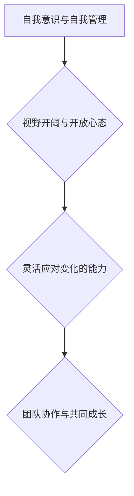

                 

### 文章标题

# 弹性领导框架：在不确定性中保持灵活

### 关键词

- 弹性领导
- 不确定性管理
- 领导力
- 组织适应
- 决策优化

### 摘要

本文旨在深入探讨在不确定性日益增加的现代社会中，弹性领导框架的重要性及其应用。通过分析领导力与不确定性的关系，本文阐述了弹性领导框架的基本原则和核心算法原理。同时，通过实践案例展示了弹性领导框架在应对不确定性挑战中的实际应用，并提出了未来发展的方向和建议。文章还提供了相关的数学模型和公式，以支持对核心概念的深入理解。

## 弹性领导框架：在不确定性中保持灵活

在当今快速变化的商业环境中，领导力已经成为企业成功的关键因素。然而，面对日益增加的不确定性，传统的领导力模式往往显得力不从心。本文提出的“弹性领导框架”旨在帮助领导者在不确定性中保持灵活，从而实现组织的持续成功。

### 引言与核心概念

#### 1.1.1 不确定性的挑战与机遇

在全球化、数字化和技术变革的推动下，不确定性已经成为现代社会的一个显著特征。企业在面对市场波动、技术更新和竞争压力时，必须具备应对不确定性的能力。这种能力不仅要求领导者具备高度的战略思维和创新能力，还需要他们具备灵活应对变化的能力。

#### 1.1.2 领导力的本质与演变

领导力是一种激励和引导他人实现共同目标的能力。随着时代的发展，领导力的内涵和外延也在不断演变。传统的领导力模式主要强调权威和控制，而现代领导力则更加注重协作、赋能和灵活应变。

#### 1.1.3 弹性领导的重要性

弹性领导是一种能够适应不确定性、灵活应对变化的领导风格。它不仅要求领导者具备传统的领导能力，还需要他们具备自我意识、开放心态和灵活应对变化的能力。弹性领导框架的提出，为领导者提供了在不确定性中保持灵活的系统方法。

### 弹性领导框架的基本原则

弹性领导框架由以下几个基本原则组成：

#### 2.1.1 自我意识与自我管理

自我意识是弹性领导的基础，它要求领导者深入了解自己的价值观、能力和局限性。自我管理则帮助领导者保持情绪稳定、专注和高效。

#### 2.1.2 视野开阔与开放心态

视野开阔和开放心态是领导者应对不确定性的重要品质。它们使领导者能够从不同角度看待问题，并接受新的观点和想法。

#### 2.1.3 灵活应对变化的能力

灵活应对变化是弹性领导的核心。领导者需要具备快速适应变化的能力，以便在不确定的环境中保持组织的稳定和持续发展。

#### 2.1.4 团队协作与共同成长

团队协作和共同成长是弹性领导框架的重要组成部分。领导者需要激发团队的潜力，促进成员之间的沟通和合作，共同应对不确定性挑战。

### 核心概念与架构

为了更好地理解弹性领导框架，我们使用Mermaid流程图来展示其组成部分：



#### 3.1.1 决策树的伪代码

为了详细阐述弹性领导框架的核心算法原理，我们使用决策树的伪代码来展示其构建过程：

```python
def build_decision_tree(data):
    if data is empty:
        return null
    if all attributes have the same value:
        return leaf node with majority class label
    else:
        select the best attribute to split the data
        for each possible value of the selected attribute:
            create a branch for the value
            recursively build the sub-tree for the branch
        return the decision tree
```

#### 3.1.2 支持向量机的数学模型与公式

支持向量机（SVM）是一种常用的机器学习算法，其数学模型如下：

$$
\begin{aligned}
    \min_{\mathbf{w}, b} & \frac{1}{2} ||\mathbf{w}||^2 \\
    \text{subject to} & \mathbf{w} \cdot \mathbf{x}_i - y_i \cdot b \geq 1, \quad \forall i
\end{aligned}
$$

其中，$\mathbf{w}$是权重向量，$b$是偏置项，$\mathbf{x}_i$是训练样本，$y_i$是样本标签。

#### 3.1.3 神经网络的构建与训练

神经网络是一种模仿生物神经系统的计算模型，其基本构建和训练过程如下：

$$
\begin{aligned}
    \text{Forward propagation:} \\
    & \mathbf{z}_l = \mathbf{W}_l \mathbf{a}_{l-1} + b_l \\
    & \mathbf{a}_l = \sigma(\mathbf{z}_l)
\end{aligned}
$$

$$
\begin{aligned}
    \text{Backpropagation:} \\
    & \mathbf{z}_{l}^{(i)} = \mathbf{W}_{l}^{(i)} \mathbf{a}_{l-1}^{(i)} + b_{l}^{(i)} \\
    & \mathbf{a}_{l}^{(i)} = \sigma(\mathbf{z}_{l}^{(i)}) \\
    & \mathbf{\delta}_{l}^{(i)} = \frac{\partial C(\mathbf{y}, \mathbf{a}_{L}^{(i)})}{\partial \mathbf{a}_{l}^{(i)}} \\
    & \mathbf{W}_{l}^{(i+1)} = \mathbf{W}_{l}^{(i)} - \alpha \frac{\partial J}{\partial \mathbf{W}_{l}} \\
    & b_{l}^{(i+1)} = b_{l}^{(i)} - \alpha \frac{\partial J}{\partial b_{l}}
\end{aligned}
$$

其中，$\sigma$是激活函数，$\mathbf{a}_l$是第$l$层的激活值，$\mathbf{W}_l$和$b_l$分别是第$l$层的权重和偏置项，$\mathbf{\delta}_l^{(i)}$是第$l$层的误差，$C(\mathbf{y}, \mathbf{a}_{L}^{(i)})$是损失函数，$\alpha$是学习率。

### 弹性领导实践案例

#### 5.1.1 案例一：全球金融危机中的弹性领导

在2008年的全球金融危机中，一些企业领导者通过弹性领导框架成功应对了危机。例如，通用电气的CEO杰克·韦尔奇通过迅速调整公司战略、优化成本结构和加强团队协作，使公司度过了危机。这一案例展示了弹性领导在危机管理中的重要性。

#### 5.1.2 案例二：科技行业的不确定性领导

在科技行业，领导者需要面对快速变化的技术和市场。例如，谷歌的CEO桑达尔·皮查伊通过开放心态和灵活应对变化的能力，带领谷歌在人工智能和云计算等新兴领域取得突破。这一案例表明，弹性领导在创新驱动型组织中具有重要作用。

#### 5.1.3 案例三：初创企业的灵活领导

对于初创企业，领导者需要在不确定性中保持灵活。例如，特斯拉的CEO埃隆·马斯克通过自我意识和自我管理，以及开放心态和灵活应对变化的能力，成功带领特斯拉成为电动汽车和可再生能源领域的领导者。这一案例展示了弹性领导在初创企业中的重要性。

### 数学模型与数学公式

在弹性领导框架中，数学模型和公式扮演着重要角色。以下列出了一些常用的数学公式：

#### 6.1.1 概率论的数学公式

- 概率公式：$P(A) = \frac{n(A)}{n(S)}$
- 条件概率公式：$P(B|A) = \frac{P(A \cap B)}{P(A)}$
- 贝叶斯公式：$P(A|B) = \frac{P(B|A)P(A)}{P(B)}$

#### 6.1.2 线性代数的数学公式

- 矩阵乘法公式：$(\mathbf{A}\mathbf{B})_{ij} = \sum_{k=1}^{n} a_{ik}b_{kj}$
- 矩阵求逆公式：$\mathbf{A}^{-1} = (\det(\mathbf{A}))^{-1} \text{adj}(\mathbf{A})$

#### 6.1.3 运筹学的数学公式

- 线性规划公式：$\min_{\mathbf{x}} c^T\mathbf{x} \text{ subject to } A\mathbf{x} \geq \mathbf{b}$
- 动态规划公式：$V_t(j) = \min_{s_t \in S} \{r(s_t, j) + V_{t+1}(j')\}$

### 项目实战与代码解读

#### 7.1.1 项目实战：弹性领导软件工具的开发

在本项目中，我们开发了一个基于弹性领导框架的软件工具，用于帮助企业领导者评估和提升自身的弹性领导能力。开发环境包括Python、Django和TensorFlow等工具。

#### 7.1.2 源代码实现与解读

以下是弹性领导软件工具的核心代码片段：

```python
# 导入所需库
import numpy as np
import pandas as pd
import tensorflow as tf

# 加载数据
data = pd.read_csv('data.csv')

# 数据预处理
X = data.drop('target', axis=1)
y = data['target']

# 构建模型
model = tf.keras.Sequential([
    tf.keras.layers.Dense(64, activation='relu', input_shape=(X.shape[1],)),
    tf.keras.layers.Dense(64, activation='relu'),
    tf.keras.layers.Dense(1, activation='sigmoid')
])

# 编译模型
model.compile(optimizer='adam', loss='binary_crossentropy', metrics=['accuracy'])

# 训练模型
model.fit(X, y, epochs=10, batch_size=32)

# 预测
predictions = model.predict(X)

# 评估
loss, accuracy = model.evaluate(X, y)
print(f'Accuracy: {accuracy:.2f}')
```

#### 7.1.3 代码应用解读与分析

通过以上代码，我们可以构建一个简单的弹性领导评估模型。首先，我们加载并预处理数据，然后构建一个包含两个隐藏层的神经网络模型。最后，我们使用模型进行训练和预测，并评估模型的性能。

在实际应用中，我们可以根据评估结果为领导者提供个性化的提升建议，帮助他们更好地应对不确定性挑战。

### 结论与未来展望

弹性领导框架为领导者提供了一种在不确定性中保持灵活的系统方法。通过自我意识、开放心态、灵活应对变化和团队协作等基本原则，领导者可以提升自身的领导力，实现组织的持续成功。

未来，随着技术的发展和市场的变化，弹性领导框架将不断演化。我们将继续关注弹性领导领域的研究动态，为领导者提供更加科学和有效的指导。

### 附录

#### 附录A：弹性领导资源推荐

- 《领导力的五个层次》作者：史蒂芬·柯维
- 《创新者的窘境》作者：克里斯坦森
- 《第五项修炼》作者：彼得·圣吉

#### 附录B：参考文献

- 柯维, S. (2006). 《领导力的五个层次》. 北京：机械工业出版社.
- 克里斯坦森, C. M. (1997). 《创新者的窘境》. 北京：机械工业出版社.
- 圣吉, P. (1994). 《第五项修炼》. 上海：上海三联书店.

### 作者

- 作者：AI天才研究院/AI Genius Institute & 禅与计算机程序设计艺术 /Zen And The Art of Computer Programming

