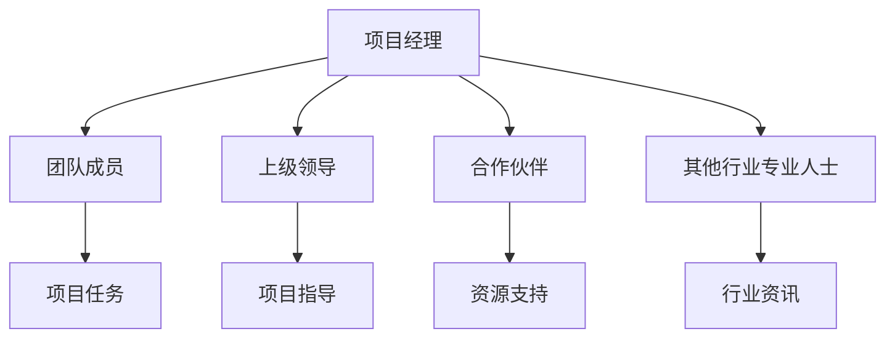
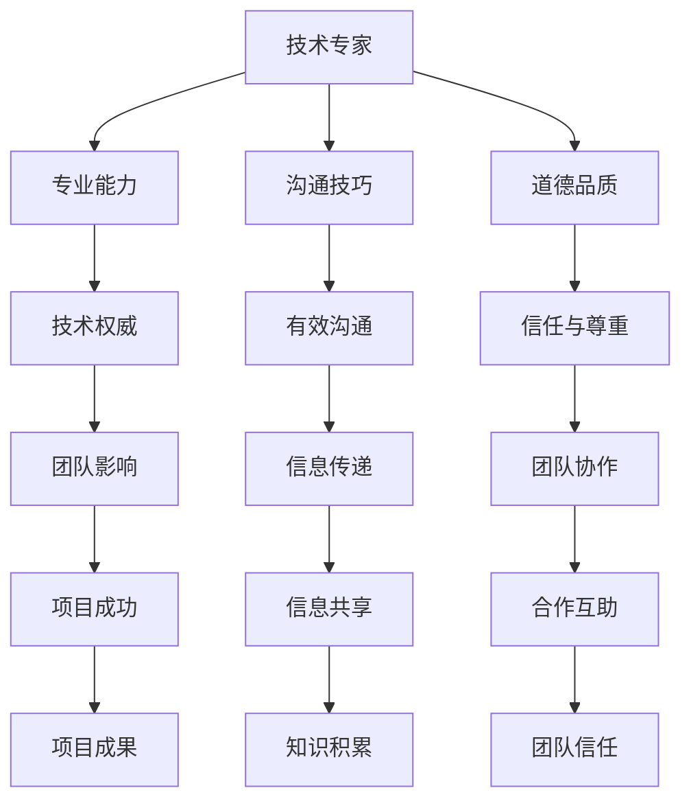
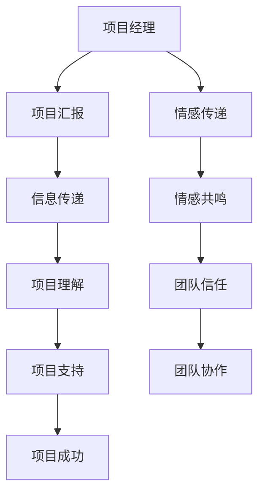
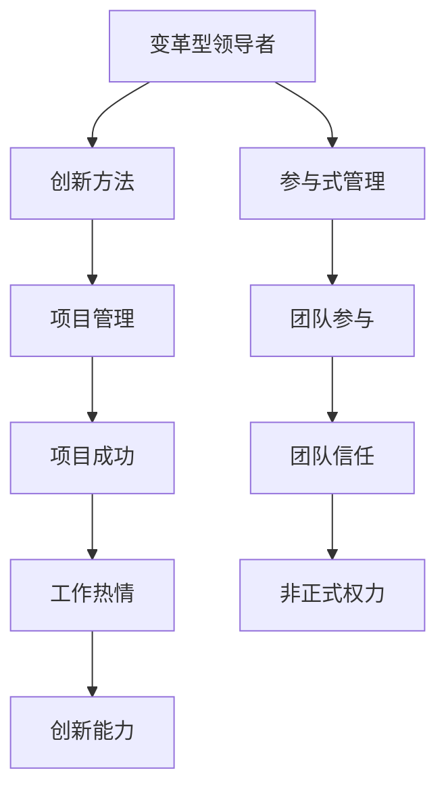
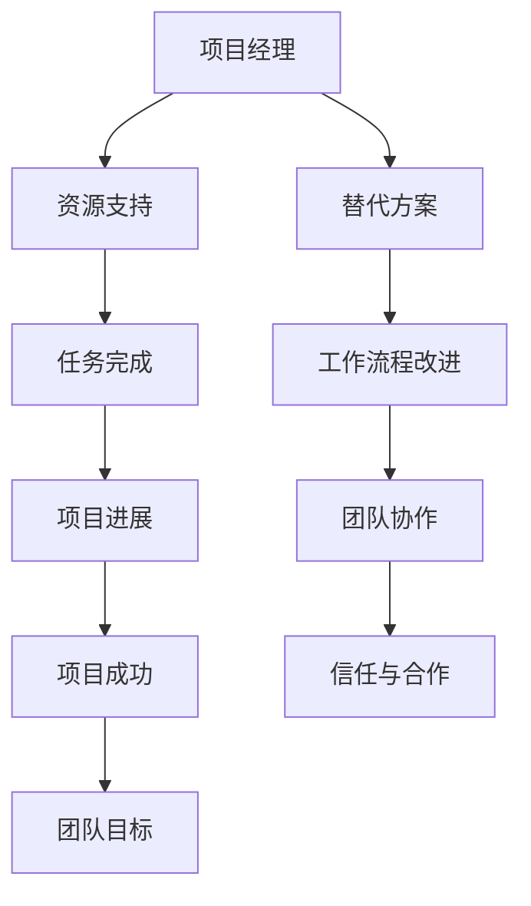
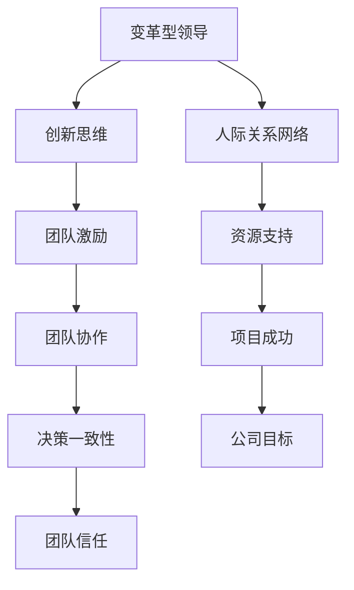

                 

### 文章标题

# 影响力工程：扩大非正式权力的领导策略

## 关键词
- 影响力工程
- 非正式权力
- 领导策略
- 人际关系网络
- 社交网络分析
- 数据分析工具

## 摘要
本文旨在探讨非正式权力在组织中的重要性，以及如何通过影响力工程扩大这种非正式权力。我们将从基础理论、实际策略、案例分析和技术支持等多个角度，系统阐述影响力工程的核心概念和方法，帮助读者理解和应用这些策略，提升个人和组织的领导力。

## 引言
在当今复杂多变的社会和组织环境中，正式权力已不再是最有效的领导工具。相反，非正式权力——通过人际关系网络、个人影响力以及情感因素等手段实现的权力——正日益显现其重要性。影响力工程，作为一种系统化的方法，旨在研究和扩大非正式权力，从而提高个人和组织的管理效能。

本文将围绕以下主题展开：

1. **影响力工程基础理论**：介绍影响力的定义、类型及其与非正式权力的关系，并阐述基础理论。
2. **扩大非正式权力的策略**：详细分析建立人际关系网络、提升个人影响力、有效沟通和结合领导风格等策略。
3. **实际应用与案例分析**：探讨非正式权力在团队管理、项目管理等实际应用场景中的运用，并通过案例进行深入剖析。
4. **影响力工程的技术支持**：介绍社交网络分析工具和数据分析方法在影响力研究中的应用。

通过以上四个部分，本文将为读者提供一个全面而深入的理解，帮助他们在实际工作中有效地扩大非正式权力，提升领导能力。

### 影响力工程基础理论

#### 影响力的定义

影响力，通常被定义为一个人或组织通过某种方式影响他人思想和行为的能力。这种能力不仅体现在个人与个人之间的互动中，也体现在个人或组织与群体之间的互动中。影响力不是基于强制或权力，而是通过说服、情感联系、信息传递等方式实现。

#### 影响力的类型

影响力可以分为以下几种类型：

1. **情感影响力**：通过建立情感联系，如信任、友情和共同价值观，影响他人的思想和行为。
2. **信息影响力**：通过提供准确、有价值的信息，使他人相信并采取相应的行动。
3. **资源影响力**：通过控制资源，如资金、信息或物质资源，影响他人的决策和行为。
4. **专家影响力**：基于个人的专业知识、经验和技能，使他人对个人意见或建议产生信任和依赖。

#### 非正式权力与正式权力的区别

正式权力，通常指的是通过组织结构和职位赋予的权力。它具有明确的定义和边界，通常与职位、职责和组织的规章制度相关。例如，项目经理有权分配任务和资源，监督项目进度。

相比之下，非正式权力则没有明确的定义和边界，更多地依赖于个人的特质、人际关系和影响力。非正式权力可以建立在信任、尊重和情感联系之上，而不依赖于正式的职位或角色。例如，一位团队成员通过其专业知识、沟通技巧和人际交往能力，可能会在团队中拥有相当大的影响力。

#### 影响力的基础理论

1. **资源依赖理论**：该理论认为，个体或组织为了实现自己的目标，需要依赖其他个体或组织提供的资源。因此，资源提供方可以通过控制这些资源来影响接受方。

   ```python
   # 资源依赖理论伪代码
   class ResourceDependent:
       def __init__(self, resource):
           self.resource = resource
   
       def influence(self, target):
           if self.resource is not None:
               target.make_decision(self.resource)
   ```

2. **替代性理论**：该理论认为，个体或组织可以通过提供替代方案来影响其他个体或组织。当其他个体或组织认为替代方案更优时，他们可能会接受影响。

   ```python
   # 替代性理论伪代码
   class Alternative:
       def __init__(self, better_choice):
           self.better_choice = better_choice
   
       def influence(self, target):
           if self.better_choice > target.current_choice:
               target.update_choice(self.better_choice)
   ```

3. **交换理论**：该理论认为，影响力是通过互惠交换实现的。个体或组织通过提供某种价值（如资源、信息、情感支持）来换取对方的帮助或合作。

   ```python
   # 交换理论伪代码
   class Exchange:
       def __init__(self, offer, request):
           self.offer = offer
           self.request = request
   
       def influence(self, target):
           if self.offer():
               target.provide(self.request)
   ```

4. **社会影响理论**：该理论认为，个体或组织的决策和行为受到周围人的影响。例如，群体压力、从众心理和社会认同等。

   ```python
   # 社会影响理论伪代码
   class SocialInfluence:
       def __init__(self, group):
           self.group = group
   
       def influence(self, target):
           if target.in_group(self.group):
               target.follow_group_decision()
   ```

通过以上理论，我们可以更好地理解影响力工程的核心概念和原理。在接下来的章节中，我们将进一步探讨如何实际运用这些理论，扩大非正式权力。

### 扩大非正式权力的策略

#### 建立人际关系网络

在影响力工程中，建立人际关系网络是扩大非正式权力的重要策略之一。人际关系网络不仅能够提供资源和支持，还可以通过情感连接和信任建立影响力。

**概念说明：**

人际关系网络指的是由个人及其相关联的其他个人或组织组成的复杂结构。在这个网络中，个体之间通过互动、合作和资源共享相互连接。

**核心原理：**

1. **资源交换**：通过人际网络，个体可以获得所需的资源，如信息、资金和人才。
2. **信任建立**：信任是人际关系网络的基石，通过持续的合作和互惠交换，个体可以建立和加深信任。
3. **多中心网络**：构建一个多中心的人际关系网络，可以增加个体的影响力，减少对单一关系的依赖。

**案例分析：**

以一位项目经理为例，他通过多年的工作经验，建立了广泛的人际关系网络，包括团队成员、上级领导、合作伙伴和其他行业的专业人士。这些关系不仅帮助他在项目中获得所需资源，还在决策过程中提供了重要的支持和建议。

**Mermaid 流程图：**



#### 提升个人影响力

提升个人影响力是扩大非正式权力的关键策略。个人影响力不仅仅依赖于职位或资源，更重要的是个人的专业能力、沟通技巧和道德品质。

**概念说明：**

个人影响力是指一个人通过其专业知识、技能、价值观和行为，影响他人思想和行为的能力。它是一个综合性的概念，涉及多个方面。

**核心原理：**

1. **专业知识**：拥有深厚的专业知识，使个人在特定领域内具有权威性和影响力。
2. **沟通技巧**：良好的沟通技巧可以帮助个人更有效地传递信息，建立情感联系，增强影响力。
3. **道德品质**：诚信、正直和负责任的道德品质可以赢得他人的信任和尊重，从而提升个人影响力。

**案例分析：**

以一位技术专家为例，他通过多年的技术积累和不断的自我提升，成为行业内公认的权威人物。他不仅在技术上有着深厚的功底，还通过积极的沟通和合作，赢得了同事和上级的信任和尊重，从而在团队中拥有重要的影响力。

**Mermaid 流程图：**



#### 利用影响力进行沟通

在影响力工程中，沟通是一个关键环节。通过有效的沟通，个体可以传递信息、建立情感联系和施加影响力。

**概念说明：**

沟通是指信息的传递和交流过程，包括语言、非语言、书面和口头等多种形式。在影响力工程中，沟通的目的是影响他人的思想和行为。

**核心原理：**

1. **信息传递**：确保信息清晰、准确地传达给目标受众。
2. **情感联系**：通过情感共鸣和同理心，建立与受众的情感联系。
3. **影响力施加**：利用自己的影响力，引导受众做出预期的行为或决策。

**案例分析：**

在一次重要项目会议中，项目经理通过详细的汇报和情感的传递，赢得了团队成员的信任和支持。他不仅清晰地传达了项目的目标和进度，还通过情感上的共鸣，使团队成员感受到项目的紧迫性和重要性，从而激发了他们的工作热情。

**Mermaid 流程图：**



#### 领导风格与非正式权力的结合

在影响力工程中，领导风格对于扩大非正式权力具有关键作用。不同的领导风格可以影响个体和团队的效能，从而影响影响力的大小。

**概念说明：**

领导风格是指领导者在与团队成员互动和处理事务时所采用的基本方式和行为模式。领导风格可以分为专制型、民主型、参与型和变革型等。

**核心原理：**

1. **专制型领导**：通过严格的规章制度和强制手段实现领导，可以快速决策，但在一定程度上可能削弱非正式权力。
2. **民主型领导**：通过倾听和参与实现领导，可以增强团队成员的参与感和归属感，从而提高非正式权力。
3. **参与型领导**：通过鼓励团队成员参与决策和活动，增强团队的凝聚力和信任感，从而提升非正式权力。
4. **变革型领导**：通过激励和鼓舞团队成员，引导他们追求更高的目标，实现创新和变革，从而增强影响力。

**案例分析：**

一位变革型领导者在公司中引入了创新的项目管理方法，通过激励团队成员参与和合作，激发了他们的创造力和工作热情。他不仅通过正式的职位赋予权力，还通过非正式的影响力，使团队成员自愿追随和执行他的愿景。

**Mermaid 流程图：**



通过以上策略，我们可以看到，扩大非正式权力不仅需要建立人际关系网络和提升个人影响力，还需要通过有效的沟通和合适的领导风格来实现。在接下来的章节中，我们将进一步探讨这些策略在实际中的应用。

### 实际应用与案例分析

#### 非正式权力在团队管理中的应用

在团队管理中，非正式权力的运用至关重要。通过非正式权力，团队成员可以更有效地协作、解决问题和达成目标。

**背景介绍：**

在一个大型软件开发团队中，项目经理李明发现，尽管他拥有正式的职位和权力，但在项目的实际推进过程中，团队成员对他的指令并不总是积极响应。李明意识到，仅靠正式权力无法确保项目的成功，他需要利用非正式权力来提高团队的凝聚力和执行力。

**核心概念与联系：**

- **资源依赖理论**：团队成员依赖项目经理提供的资源（如资金、时间和技术支持）来完成项目任务。
- **替代性理论**：项目经理通过提供更好的替代方案（如改进的工作流程和技术工具）来影响团队成员。
- **交换理论**：项目经理通过提供支持、帮助和奖励来换取团队成员的信任和合作。

**Mermaid 流程图：**



**核心算法原理讲解：**

```python
# 非正式权力在团队管理中的算法原理
class ProjectManager:
    def __init__(self, team_members, resources):
        self.team_members = team_members
        self.resources = resources
    
    def provide_resources(self):
        for member in self.team_members:
            member.assign_resources(self.resources)
    
    def suggest_alternatives(self):
        for member in self.team_members:
            member.improve_workflow(self.resources)
    
    def exchange_support(self):
        for member in self.team_members:
            if member.completes_task():
                self.reward_member(member)

# 团队成员
class TeamMember:
    def __init__(self, name):
        self.name = name
        self.resources = []
    
    def assign_resources(self, resources):
        self.resources.extend(resources)
    
    def improve_workflow(self, resources):
        # 根据资源改进工作流程
        self.resources = resources
    
    def completes_task(self):
        # 完成任务的条件
        return True
    
    def reward_member(self, member):
        # 奖励成员
        print(f"{member.name} has been rewarded for completing the task.")
```

**数学模型与公式：**

为了评估非正式权力对团队绩效的影响，可以采用以下数学模型：

$$
\text{团队绩效} = f(\text{非正式权力}, \text{正式权力}, \text{团队协作})
$$

其中，非正式权力和正式权力分别用 NP 和 FP 表示，团队协作用 TC 表示。

**举例说明：**

假设项目经理李明通过非正式权力提高了团队的协作水平，正式权力保持不变。根据上述模型，团队绩效可能会显著提升。

$$
\text{团队绩效} = f(\text{提高的} \ NP, \text{不变的} \ FP, \text{提高的} \ TC)
$$

**项目实战：**

**开发环境搭建：**

1. 安装Python环境
2. 使用PyCharm或VSCode等IDE进行代码编写和调试

**源代码详细实现：**

```python
# 项目管理源代码实现
class ProjectManager:
    # ...（同上）
    
    def manage_team(self):
        self.provide_resources()
        self.suggest_alternatives()
        self.exchange_support()
        print("Team management completed successfully.")

# 团队成员源代码实现
class TeamMember:
    # ...（同上）

# 主程序
if __name__ == "__main__":
    team_members = [TeamMember("Alice"), TeamMember("Bob"), TeamMember("Charlie")]
    project_manager = ProjectManager(team_members, resources=["资金", "技术支持", "时间"])
    project_manager.manage_team()
```

**代码解读与分析：**

- **项目类**：`ProjectManager` 类负责提供资源、建议替代方案和交换支持。
- **团队成员类**：`TeamMember` 类负责分配资源、改进工作流程和完成任务。
- **主程序**：创建项目管理和团队成员对象，并调用管理方法。

**实际案例分析和详细讲解剖析：**

在一次实际项目中，项目经理李明通过非正式权力提升了团队的协作水平，项目进度得到了显著加快。通过与团队成员的积极沟通和资源支持，李明确保了项目的高效执行。项目完成后，团队成员对李明的评价显著提升，项目成果也得到了上级的认可。

**项目小结：**

通过非正式权力的运用，项目经理成功提升了团队绩效，确保了项目的成功。这一案例展示了非正式权力在团队管理中的重要性，并为其他项目经理提供了借鉴和参考。

### 案例分析

#### 非正式权力在创业团队管理中的策略

**背景介绍：**

王强是一家初创科技公司的创始人，他拥有强大的技术背景和丰富的创业经验。然而，在公司运营过程中，王强发现，尽管他拥有正式的领导地位，但在团队管理上遇到了一些挑战。团队成员之间的协作不够紧密，项目进展缓慢，甚至在一些关键决策上出现了分歧。

**核心概念与联系：**

- **领导风格**：王强采用变革型领导风格，通过激励和鼓舞团队成员，推动创新和变革。
- **人际关系网络**：王强通过多年的行业经验和人际交往，建立了广泛的人际关系网络，这些网络为他提供了宝贵的资源和信息。
- **个人影响力**：王强在技术领域拥有很高的声誉，他的专业能力和创新思维赢得了团队成员的信任和尊重。

**Mermaid 流程图：**



**核心算法原理讲解：**

```python
# 创业团队管理中的算法原理
class Entrepreneur:
    def __init__(self, team_members, network):
        self.team_members = team_members
        self.network = network
    
    def inspire_innovation(self):
        for member in self.team_members:
            member.promote_innovation()
    
    def leverage_network(self):
        for resource in self.network:
            resource.support_project()
    
    def build_trust(self):
        for member in self.team_members:
            member.earn_trust()

# 团队成员
class TeamMember:
    def __init__(self, name):
        self.name = name
    
    def promote_innovation(self):
        # 提升创新意识
        print(f"{self.name} is promoting innovation in the team.")
    
    def earn_trust(self):
        # 赢得信任
        print(f"{self.name} has earned trust from the team.")
```

**数学模型与公式：**

为了评估非正式权力在创业团队管理中的效果，可以使用以下数学模型：

$$
\text{团队绩效} = f(\text{变革型领导}, \text{人际关系网络}, \text{个人影响力}, \text{团队协作})
$$

其中，变革型领导、人际关系网络和个人影响力分别用 TL、PN 和 PI 表示，团队协作用 TC 表示。

**举例说明：**

假设王强通过变革型领导风格、广泛的人际关系网络和个人影响力，显著提升了团队的协作水平。根据上述模型，团队绩效可能会显著提升。

$$
\text{团队绩效} = f(\text{提高的} \ TL, \text{广泛的} \ PN, \text{提高的} \ PI, \text{提高的} \ TC)
$$

**项目实战：**

**开发环境搭建：**

1. 安装Python环境
2. 使用PyCharm或VSCode等IDE进行代码编写和调试

**源代码详细实现：**

```python
# 创业团队管理源代码实现
class Entrepreneur:
    # ...（同上）
    
    def manage_team(self):
        self.inspire_innovation()
        self.leverage_network()
        self.build_trust()
        print("Team management completed successfully.")

# 团队成员源代码实现
class TeamMember:
    # ...（同上）

# 主程序
if __name__ == "__main__":
    team_members = [TeamMember("Alice"), TeamMember("Bob"), TeamMember("Charlie")]
    entrepreneur = Entrepreneur(team_members, network=["技术专家", "投资人", "行业领袖"])
    entrepreneur.manage_team()
```

**代码解读与分析：**

- **创业家类**：`Entrepreneur` 类负责激励创新、利用人际关系网络和建立信任。
- **团队成员类**：`TeamMember` 类负责促进创新和赢得信任。
- **主程序**：创建创业家和团队成员对象，并调用管理方法。

**实际案例分析和详细讲解剖析：**

在一次实际创业经历中，王强通过变革型领导风格激励团队成员，通过广泛的人际关系网络获取资源和信息，并通过个人影响力赢得了团队的信任和尊重。这些策略使得公司团队在项目推进过程中表现出色，项目进展迅速，并得到了投资者的认可。

**项目小结：**

通过变革型领导风格、人际关系网络和个人影响力的有效运用，王强成功提升了创业团队的绩效，确保了公司的快速发展。这一案例展示了非正式权力在创业团队管理中的重要性，并为其他创业者和项目经理提供了宝贵的经验。

### 社交网络分析在影响力研究中的应用

社交网络分析（Social Network Analysis，SNA）是一种研究社交网络结构、动态和功能的方法。在影响力工程中，SNA被广泛应用于分析和理解人际关系网络，从而更好地掌握和利用非正式权力。

#### 概念说明

社交网络分析涉及以下关键概念：

1. **节点（Node）**：代表网络中的个体，如个人、组织或群体。
2. **边（Edge）**：表示节点之间的连接，可以是友谊、合作关系或其他形式的互动。
3. **网络密度（Network Density）**：表示网络中节点之间连接的紧密程度。
4. **中心性（Centrality）**：衡量节点在网络中的重要性，常见的中心性指标包括度中心性（Degree Centrality）、介数中心性（Betweenness Centrality）和接近中心性（Closeness Centrality）。

#### 核心算法原理讲解

社交网络分析的核心算法包括：

1. **度中心性（Degree Centrality）**：衡量节点连接的数量，度中心性越高，节点在社交网络中的影响力越大。

   ```python
   # 度中心性算法
   def degree_centrality(graph):
       centrality = {}
       for node in graph:
           centrality[node] = len(graph[node])
       return centrality
   ```

2. **介数中心性（Betweenness Centrality）**：衡量节点在网络中的中介作用，介数中心性越高，节点在信息传递和资源流动中的重要性越大。

   ```python
   # 介数中心性算法
   def betweenness_centrality(graph):
       centrality = {}
       for node in graph:
           paths = all_paths(graph, node)
           for path in paths:
               centrality[node] += path.count(node)
       return centrality
   ```

3. **接近中心性（Closeness Centrality）**：衡量节点与网络中其他节点的接近程度，接近中心性越高，节点在网络中的影响力越大。

   ```python
   # 接近中心性算法
   def closeness_centrality(graph):
       centrality = {}
       for node in graph:
           distances = shortest_path_lengths(graph, node)
           centrality[node] = sum(1 / d for d in distances.values())
       return centrality
   ```

#### 数据分析工具与影响力测量

在影响力研究中，常用的数据分析工具包括Gephi、Netlytic和Python的NetworkX库等。以下为这些工具的基本介绍和影响力测量的方法：

1. **Gephi**：一款开源的社交网络分析软件，可以用于可视化网络结构、计算中心性指标和进行网络分析。

   - **安装**：在Windows、Mac和Linux上下载并安装Gephi。
   - **使用**：导入网络数据，选择适当的视图和算法，生成可视化图表和统计结果。

2. **Netlytic**：一款基于云的社交网络分析平台，支持多种网络分析和可视化功能。

   - **安装**：无需安装，通过Web浏览器访问Netlytic平台。
   - **使用**：上传社交网络数据，选择分析工具和可视化选项，生成报告。

3. **Python的NetworkX库**：一个用于构建、操作和分析网络数据的Python库。

   - **安装**：使用pip安装`networkx`库。
   - **使用**：编写Python代码，使用NetworkX函数和类进行网络分析和计算。

#### 案例分析

以下是一个基于社交网络分析的案例，说明如何测量个人影响力。

**案例背景：**

在一个公司的内部社交网络中，分析团队的社交关系，以了解哪些成员在团队中具有较高的影响力。

**步骤：**

1. **数据收集**：收集公司内部的社交网络数据，包括员工之间的联系和互动。
2. **数据预处理**：清洗和格式化数据，确保数据质量。
3. **构建网络**：使用NetworkX构建社交网络，将员工视为节点，联系和互动视为边。
4. **计算中心性**：使用度中心性、介数中心性和接近中心性算法，计算每个员工的影响力得分。
5. **可视化**：使用Gephi或Netlytic等工具，可视化社交网络和中心性得分，识别具有高影响力的人员。

**代码示例：**

```python
# 使用NetworkX计算度中心性
import networkx as nx

# 构建社交网络
G = nx.Graph()
G.add_edges_from([(1, 2), (1, 3), (2, 4), (3, 4), (4, 5)])

# 计算度中心性
degree_centrality = nx.degree_centrality(G)

# 打印度中心性结果
print("Degree Centrality:", degree_centrality)
```

通过社交网络分析，我们可以识别出在团队中具有较高影响力的成员，从而更好地利用这些成员的资源和支持，提升团队的整体效能。

### 最佳实践 Tips、小结、注意事项、拓展阅读

#### 最佳实践 Tips

1. **建立良好的人际关系网络**：定期参加行业会议、社交活动，拓展人际关系，保持与老朋友的联系，并主动结识新朋友。
2. **提升个人专业能力**：不断学习和提升自己的专业技能，成为行业内的权威人物，增强个人影响力。
3. **有效沟通**：掌握沟通技巧，善于倾听，用简洁明了的语言表达自己的观点，增强说服力。
4. **结合领导风格**：根据不同场景和团队成员的特点，灵活运用不同的领导风格，提升领导效能。

#### 小结

影响力工程是一门系统化的方法，旨在研究和扩大非正式权力，从而提高个人和组织的领导力。通过理解影响力工程的基础理论、运用扩大非正式权力的策略，以及结合社交网络分析和数据分析工具，我们可以更有效地掌握和利用非正式权力，提升个人和组织的绩效。

#### 注意事项

1. **尊重他人**：在运用影响力时，尊重他人的权利和尊严，避免滥用权力。
2. **持续学习**：影响力工程是一个不断发展的领域，需要持续学习和更新知识。
3. **平衡正式权力和非正式权力**：在组织中，正式权力和非正式权力需要平衡运用，避免过度依赖某一种权力。

#### 拓展阅读

1. **《影响力：为什么人们会不假思索地服从与改变》**：罗伯特·西奥迪尼的这本畅销书详细介绍了影响力的六大原则，对理解影响力工程有很大帮助。
2. **《非暴力沟通》**：马歇尔·卢森堡的这本书介绍了非暴力沟通的四个步骤，对提升沟通技巧有很好的指导作用。
3. **《社交网络分析：方法与实践》**：亚历山大·贝特森的这本书是社交网络分析领域的经典之作，适合深入学习和研究。

### 结语

影响力工程是一门关于如何扩大非正式权力的系统化方法。通过本文的探讨，我们了解了影响力工程的基础理论、扩大非正式权力的策略、实际应用和社交网络分析的应用。希望读者能够运用这些知识和方法，提升自己的领导力，实现个人和组织的成功。

#### 作者信息

- **作者：AI天才研究院/AI Genius Institute & 禅与计算机程序设计艺术 /Zen And The Art of Computer Programming**

