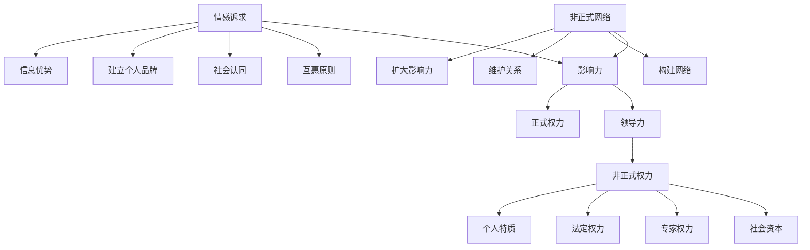

                 

### 文章标题

# 影响力工程：扩大领导者非正式权力的策略

### 关键词

- 非正式权力
- 领导力
- 影响力工具
- 社会资本
- 个人品牌

### 摘要

本文探讨了领导者如何通过非正式权力策略扩大影响力。从影响力的定义、非正式权力的来源、影响力工具，到领导者的非正式网络，我们逐一分析了如何构建和运用非正式权力。通过案例和实践策略的讨论，本文为领导者提供了具体可操作的策略，以提升其在组织内外的影响力。

---

## 1. 引言

在当今快速变化的社会环境中，领导者的角色已经不再是单纯地依靠职位和法定权力来施加影响。非正式权力，即领导者通过个人魅力、专业知识和社交网络来影响他人的能力，正在变得越来越重要。本文旨在探讨如何通过非正式权力的策略，扩大领导者在组织内部和外部的实际影响力和权力。

非正式权力与领导力密切相关。领导力不仅包括带领团队完成任务的能力，还涉及到建立信任、激发潜能和协调合作等方面。而非正式权力则是在这些方面发挥作用的关键因素。本文将分以下几个部分进行探讨：

1. **影响力的定义和领导力与影响力的关系**：明确影响力的概念，并阐述领导力与影响力之间的相互关系。
2. **非正式权力的来源**：分析非正式权力的四个主要来源，即社会资本、专家权力、法定权力和个人特质。
3. **影响力工具**：介绍情感诉求、互惠原则、社会认同、建立个人品牌和信息优势等影响力工具。
4. **领导者的非正式网络**：讨论如何构建和维护非正式网络，以扩大影响力。
5. **实践案例**：通过具体案例展示非正式权力的实际应用。
6. **策略实施**：提供制定和执行影响力策略的步骤。
7. **案例分析与策略评估**：总结成功和失败案例，评估策略效果，提供改进建议。

通过以上探讨，本文旨在为领导者提供实用的非正式权力策略，帮助其在复杂多变的环境中，更好地实现领导目标。

### 核心概念与联系

在讨论影响力工程之前，我们首先需要明确几个核心概念及其相互关系。以下是影响力工程中关键概念之间的Mermaid流程图，帮助读者更好地理解各概念之间的架构：

- **影响力**：对他人思想、行为和决策产生作用的能力。
- **领导力**：通过激发、指导和激励他人来实现共同目标的能力。
- **非正式权力**：通过个人魅力、专业知识和社交网络来影响他人的能力。
- **正式权力**：基于职位、法规和正式制度授予的权力。
- **社会资本**：个人通过社会关系和网络所积累的资源。
- **专家权力**：基于专业知识和技能的权力。
- **法定权力**：基于法律和组织的授权。
- **个人特质**：个人的性格、价值观和习惯等内在特征。

**情感诉求**、**互惠原则**、**社会认同**、**建立个人品牌**和**信息优势**则是实现影响力的具体工具。

通过上述流程图，我们可以看到，影响力、领导力和非正式权力三者之间是相互关联的。影响力的实现依赖于领导力，而领导力的发挥又离不开非正式权力的支持。非正式权力来源于社会资本、专家权力、法定权力和个人特质，并通过情感诉求、互惠原则、社会认同、建立个人品牌和信息优势等工具得以具体化。领导者的非正式网络则为他们提供了更广泛的资源和支持，进一步扩大了其影响力。

### 非正式权力的来源

非正式权力的来源多种多样，不同的来源在不同的情境中发挥着不同的作用。以下是四种主要的非正式权力来源：

#### 1. 社会资本

社会资本是指个人通过社会关系和网络所积累的资源。这些资源可以是信息、知识、人脉或信任。拥有丰富的社会资本意味着个人能够快速获取所需信息，建立合作关系，并在关键时刻得到他人的支持。

**如何利用社会资本扩大影响力？**

- **建立广泛的社交网络**：积极参与社交活动，加入专业组织和社区，扩展人际网络。
- **维护关系**：经常与朋友、同事和合作伙伴保持联系，关注他们的需求，提供帮助。
- **信息交换**：通过分享有价值的信息，建立起互惠互利的关系，从而增强社会联系。

#### 2. 专家权力

专家权力是指基于个人专业知识和技能的权力。专家在特定领域拥有深入的了解和丰富的经验，这使得他们在决策过程中具有重要的影响力。

**如何利用专家权力扩大影响力？**

- **持续学习与提升**：不断更新知识和技能，保持专业竞争力。
- **分享知识**：通过撰写文章、发表演讲或举办研讨会，将自己的专业知识传播出去。
- **建立专业声誉**：通过高质量的工作和卓越的成就，树立个人品牌。

#### 3. 法定权力

法定权力是组织通过法律和规章制度授予的权力。这种权力通常与职位或职责相关，例如管理层、项目经理等。

**如何利用法定权力扩大影响力？**

- **合法合规**：确保自己的行为符合法律法规和组织规定，增强权威性。
- **合理运用权力**：在权限范围内，通过决策和协调来推动项目或团队的进展。
- **平衡权力**：避免滥用权力，建立良好的工作关系，确保权力运用的公平和合理。

#### 4. 个人特质

个人特质包括性格、价值观和习惯等内在特征。这些特质影响着个人的行为和决策，进而影响他人对个人的看法和评价。

**如何利用个人特质扩大影响力？**

- **塑造良好性格**：培养自信、诚信和同情心，增强个人魅力。
- **坚持价值观**：明确自己的价值观，并在工作和生活中坚定不移地贯彻。
- **建立个人品牌**：通过一致的行为和言论，塑造独特的个人形象。

通过上述四种非正式权力来源的利用，领导者可以在组织内外建立强大的影响力网络，实现更广泛的领导目标。

### 影响力工具

在构建和运用非正式权力的过程中，领导者需要掌握一系列影响力工具。以下是几种主要的影响力工具及其具体应用：

#### 1. 情感诉求

情感诉求是通过触动他人的情感来影响他们的决策和行为。情感是人类决策过程中不可或缺的一部分，因此，巧妙地运用情感诉求可以显著提升影响力。

**如何运用情感诉求？**

- **建立情感联系**：通过倾听、关心和分享个人经历，与他人建立深厚的情感纽带。
- **激发同理心**：通过描述他人的困境和需求，激发听众的同理心，促使他们采取行动。
- **利用情感语言**：在沟通中使用生动、形象的语言，增强表达的效果。

**案例**：一位项目经理在向团队解释新的项目计划时，不仅仅列举了项目的具体目标和时间表，还分享了自己对项目的激情和对团队信任的期望，通过情感诉求，他成功激发了团队成员的参与热情。

#### 2. 互惠原则

互惠原则是指人们倾向于回报他人对自己的好处。通过互惠原则，领导者可以建立起互惠互利的关系网，从而扩大自己的影响力。

**如何运用互惠原则？**

- **提供帮助**：主动帮助他人解决问题，建立互助关系。
- **期望回报**：明确表达对他人帮助的期待，但不过分强求。
- **保持平衡**：在互惠关系中保持公平，避免单方面的利益交换。

**案例**：一位项目经理在项目初期主动帮助团队成员解决技术难题，随后，这些团队成员在项目进展中主动提供支持，帮助项目经理解决了多个关键问题。

#### 3. 社会认同

社会认同是指人们倾向于跟随群体行为和观点。通过社会认同，领导者可以引导他人接受自己的想法和行动。

**如何运用社会认同？**

- **营造群体氛围**：通过举办团队活动，加强团队凝聚力，营造共同认同的氛围。
- **引用权威观点**：引用权威人士或行业标准的观点，增加说服力。
- **提供示范作用**：通过自己的行为示范，展示正确的行为模式，引导他人跟随。

**案例**：一位企业领导在倡导创新文化时，通过自己积极参与创新项目和公开发表创新成果，带动了整个团队对创新的热情和参与度。

#### 4. 建立个人品牌

个人品牌是指个人在公众心目中的形象和声誉。通过建立个人品牌，领导者可以提升自己的知名度和信任度，从而扩大影响力。

**如何建立个人品牌？**

- **专业化形象**：通过专业知识和卓越的成就，塑造专业化的个人形象。
- **持续传播**：通过社交媒体、演讲和出版物等渠道，持续传播个人观点和成就。
- **参与社区**：积极参与行业社区和专业组织，扩大个人影响范围。

**案例**：一位技术专家通过在GitHub上分享自己的开源项目和博客文章，吸引了大量的关注和赞赏，成为了该领域的知名人物，从而在项目中获得了更大的话语权。

#### 5. 信息优势

信息优势是指个人在信息获取、处理和传递方面的优势。通过信息优势，领导者可以更准确地了解情况，做出更明智的决策。

**如何运用信息优势？**

- **信息收集**：通过多种渠道收集相关信息，确保信息的全面性和准确性。
- **信息处理**：运用分析能力和专业知识，对信息进行筛选和处理，提取有价值的内容。
- **信息传递**：通过有效的沟通技巧，将信息传递给相关人员，确保信息的及时性和有效性。

**案例**：一位项目经理通过提前收集和分析市场需求信息，成功预测了项目的潜在风险，并制定了有效的应对策略，避免了项目延期和成本超支。

通过运用这些影响力工具，领导者可以更有效地影响他人，实现组织目标。

### 领导者的非正式网络

领导者的非正式网络是其扩大影响力的关键因素之一。通过构建和维护非正式网络，领导者可以获取更多资源和支持，提高自身的影响力和决策能力。以下是构建和维护非正式网络的几个关键步骤：

#### 1. 构建非正式网络

**建立初步联系**：首先，领导者需要积极参与各种社交活动和行业会议，主动结识新朋友和同行。通过分享经验和观点，建立起初步的联系。

**拓展关系**：在初步联系的基础上，领导者需要定期与这些关系保持互动，通过电话、邮件或线下会面，持续维护和拓展关系。

**建立信任**：信任是构建稳固网络的基础。领导者需要通过诚实、透明和可靠的行为，赢得他人的信任。

**形成合作关系**：通过共同的项目、活动和兴趣，领导者可以与其他人建立更深入的合作关系。

#### 2. 维护非正式关系

**定期沟通**：定期与网络中的成员保持沟通，了解他们的需求和问题，并提供帮助。

**提供价值**：通过分享知识和资源，为网络中的成员提供价值，增强关系的紧密性。

**关注他人**：在维护关系时，领导者需要关注他人的需求和成就，主动提供支持和鼓励。

**解决冲突**：当关系中出现矛盾和冲突时，领导者需要及时沟通，寻找解决问题的方法，维护关系的和谐。

#### 3. 利用非正式网络扩大影响力

**传递信息**：通过非正式网络，领导者可以快速传递信息，确保信息的广泛覆盖和及时性。

**获取支持**：在需要支持时，领导者可以利用非正式网络获取资源、建议和人脉。

**合作机会**：通过非正式网络，领导者可以发现新的合作机会，推动项目或团队的进展。

**建立声誉**：通过在非正式网络中的表现，领导者可以建立良好的声誉，提升自身的影响力和权威。

通过上述步骤，领导者可以构建和维护一个强大的非正式网络，从而在组织内外扩大自己的影响力。

### 实践案例

#### 企业内部案例

在一个大型企业中，项目经理李明通过构建和维护非正式网络，成功扩大了自己的影响力。以下是李明的一些具体实践：

1. **初期拓展**：李明积极参加公司组织的各类活动，结识了来自不同部门的同事。通过分享自己的经验和见解，他迅速建立了初步联系。
   
2. **深入互动**：李明定期与这些同事保持沟通，通过电话、邮件和线下会议，了解他们的需求和问题，并提供帮助。例如，当某位同事遇到技术难题时，李明主动提供了解决方案，帮助他们解决了问题。

3. **建立信任**：李明通过诚实、透明和可靠的行为，赢得了同事的信任。他总是按时完成任务，并保持沟通的及时性和透明性。

4. **合作共赢**：李明与同事共同参与多个项目，通过团队合作，解决了许多棘手问题。这些合作项目不仅提升了团队绩效，也增强了李明在组织内的地位。

5. **信息传递**：李明通过非正式网络，快速传递关键信息，确保团队成员能够及时了解项目动态。在一次市场变化中，李明通过非正式网络迅速传递了市场信息，帮助团队迅速调整策略，避免了潜在的损失。

#### 公共领域案例

在公共领域，政治家乔·拜登（Joe Biden）通过非正式网络扩大了自己的影响力。以下是他的几个实践案例：

1. **建立广泛联系**：拜登在职业生涯中建立了广泛的社交网络，包括政治同行、商业领袖和社区领袖。这些联系为他提供了丰富的资源和支持。

2. **持续沟通**：拜登定期与网络中的成员保持沟通，了解他们的需求和观点。他通过电话、邮件和社交媒体与这些人保持联系，确保关系的紧密性。

3. **提供价值**：拜登通过分享自己的经验和见解，为网络中的成员提供了价值。他在多个公共演讲中强调了社区的重要性，并鼓励人们积极参与公共事务。

4. **合作共赢**：拜登在政治竞选中充分利用了非正式网络，通过合作共赢的策略，赢得了大量选民的支持。他在竞选期间积极与社区领袖合作，推动了多个社区项目的实施。

5. **信息优势**：拜登在公共领域拥有强大的信息优势。他通过多种渠道收集和分析信息，确保自己的决策基于准确和全面的信息。在一次重大政策讨论中，拜登通过非正式网络迅速获取了关键信息，使他在讨论中占据了主动地位。

通过这些实践案例，我们可以看到，无论是企业内部还是公共领域，领导者通过构建和维护非正式网络，都可以显著扩大自己的影响力。

### 制定影响力策略

要有效地扩大非正式权力，领导者需要制定明确的影响力策略。以下是如何制定影响力策略的详细步骤：

#### 1. 明确目标

首先，领导者需要明确自己的目标。这些目标可以是提升团队绩效、推动项目进展、增强行业影响力等。明确的目标有助于制定有针对性的策略，并评估策略的效果。

**步骤**：

- 分析当前状况：了解自身的优势和不足，明确需要提升的方面。
- 确定目标：设定具体、可衡量的目标，例如提高团队士气、增加项目预算等。

#### 2. 评估当前影响力

在制定策略之前，领导者需要评估自己的当前影响力。这包括：

- **社会网络分析**：分析自己的社交网络，了解与哪些人建立了联系，网络密度如何。
- **影响力指标**：评估自己在组织内外的影响力指标，如团队成员的信任度、项目的成功度等。

**步骤**：

- 收集数据：通过调查问卷、面试等方式收集相关数据。
- 分析数据：使用图表和统计方法，分析自己的影响力现状。

#### 3. 设计行动计划

基于明确的目标和当前影响力评估，领导者需要设计具体的行动计划。这些计划应包括：

- **具体行动**：列出实现目标的具体行动，如参加某个活动、发布某篇文章等。
- **时间表**：为每个行动设定具体的时间表，确保行动按计划进行。
- **资源分配**：明确需要的资源和预算，确保行动计划的可执行性。

**步骤**：

- 列出行动：根据目标和评估结果，列出具体行动。
- 设定时间表：为每个行动设定开始和结束时间。
- 分配资源：明确需要的资源和预算，确保计划的可行性。

#### 4. 实施与监控

制定好行动计划后，领导者需要实施并监控整个策略的执行情况。以下是具体步骤：

- **执行计划**：按照时间表和资源分配，开始执行行动计划。
- **定期评估**：定期评估行动的进展情况，确保计划按计划进行。
- **调整策略**：根据评估结果，及时调整策略，以应对可能出现的问题。

**步骤**：

- 开始执行：按照计划执行行动。
- 定期评估：每周或每月评估一次行动进展。
- 及时调整：根据评估结果，调整计划。

通过以上步骤，领导者可以系统地制定和执行影响力策略，从而有效地扩大自己的非正式权力。

### 执行与反馈

在影响力策略的执行过程中，领导者的有效执行和反馈机制至关重要。以下是如何确保策略执行与反馈的几个关键步骤：

#### 1. 策略执行

**步骤**：

- **明确职责**：确保每位团队成员都清楚自己的职责和目标，避免执行过程中的混淆和错误。
- **定期会议**：定期召开会议，讨论策略的进展情况，解决执行过程中遇到的问题。
- **资源分配**：确保资源得到合理分配，避免资源浪费和不足。
- **监控进度**：通过项目管理工具，监控策略的执行进度，及时发现并解决问题。

**工具**：

- **项目管理软件**：如Trello、Asana等，用于任务分配和进度监控。
- **沟通工具**：如Slack、Microsoft Teams等，用于团队沟通和协作。

#### 2. 反馈机制

**步骤**：

- **定期反馈**：定期与团队成员进行一对一的反馈交流，了解他们的感受和建议。
- **绩效评估**：通过定期的绩效评估，评估策略执行的效果，发现优点和不足。
- **调整策略**：根据反馈和评估结果，及时调整策略，以应对新的挑战和变化。

**工具**：

- **反馈表格**：设计反馈表格，收集团队成员的反馈意见。
- **绩效评估工具**：如360度反馈工具、KPI分析工具等，用于评估策略效果。

#### 3. 监测影响力变化

**步骤**：

- **跟踪关键指标**：设定关键指标（KPIs），如项目完成率、团队成员满意度等，定期跟踪和分析。
- **社会网络分析**：通过社交网络分析工具，监测自己在社交网络中的影响力变化。
- **沟通反馈**：定期与关键利益相关者沟通，了解他们对策略执行的评价。

**工具**：

- **数据分析工具**：如Tableau、Power BI等，用于数据分析和可视化。
- **社交网络分析工具**：如Klout、Brandwatch等，用于监测社交网络中的影响力。

#### 4. 调整策略

**步骤**：

- **分析反馈**：根据反馈和数据分析，识别策略中的优点和不足。
- **制定改进计划**：基于分析结果，制定具体的改进计划。
- **实施改进**：按照改进计划，调整策略的执行方式。

**工具**：

- **问题分析工具**：如鱼骨图、SWOT分析等，用于分析策略的不足。
- **项目管理工具**：用于制定和执行改进计划。

通过以上步骤和工具，领导者可以确保策略的有效执行和持续优化，从而实现影响力的最大化。

### 非正式权力的影响力扩展

扩大非正式权力不仅限于组织内部，还可以在行业内和跨组织中发挥作用。以下是领导者如何在组织内外扩展非正式权力的策略：

#### 1. 扩大组织内部影响力

**内部网络扩展**：

- **跨部门合作**：通过跨部门项目，建立跨部门合作关系，扩大影响力。
- **知识共享**：定期举办知识分享会议，分享专业知识和经验，提升个人和团队声誉。
- **内部影响力评估**：通过内部调查和反馈，了解自己在组织内的实际影响力，制定相应的扩展策略。

**内部影响力提升**：

- **建立个人品牌**：通过在组织内部发表文章、参与研讨会等方式，建立专业和个人品牌。
- **领导力培训**：参与领导力培训，提升领导力和沟通技巧，增强个人魅力。
- **情感诉求**：通过关心和支持团队成员，建立深厚的情感联系，提高团队成员的忠诚度和信任感。

#### 2. 在行业内扩大非正式权力

**行业影响力扩展**：

- **参与行业会议**：积极参加行业会议和研讨会，展示专业知识和成果，扩大在行业内的知名度。
- **撰写专业文章**：在行业知名媒体上发布专业文章，分享经验和见解，提升个人和组织的权威性。
- **合作项目**：与其他行业内的专家和组织合作，共同开展项目，扩大资源和影响力。

**行业影响力提升**：

- **建立专业社群**：创建专业社群，邀请行业内的专家和同行加入，通过交流和合作，提升个人和组织的专业影响力。
- **提供咨询服务**：通过提供专业的咨询服务，帮助行业内其他组织解决实际问题，建立良好的口碑。
- **积极参与标准制定**：参与行业标准的制定和讨论，影响行业的规范和发展方向。

#### 3. 跨组织的非正式权力合作

**跨组织合作**：

- **建立联盟**：与其他组织建立战略联盟，共同开展项目，实现资源共享和优势互补。
- **跨界合作**：通过跨界合作，引入外部资源和技术，提升自身在行业内的竞争力。
- **跨文化沟通**：在跨组织合作中，注意跨文化沟通，尊重不同组织的文化和习惯，确保合作的顺利进行。

**跨组织影响力提升**：

- **构建信任**：通过诚实和透明的行为，构建跨组织的信任关系，为长期合作奠定基础。
- **信息共享**：在跨组织合作中，主动分享信息和资源，建立互惠互利的关系。
- **共同目标**：明确共同目标，通过协同合作，实现跨组织的协同效应，提升整体影响力。

通过上述策略，领导者可以有效地在组织内外扩展非正式权力，实现更广泛的领导目标和影响力。

### 持续成长与自我提升

在非正式权力策略的实施过程中，持续成长与自我提升是领导者不可或缺的重要部分。以下是如何在技术和人际关系方面实现持续成长与自我提升的建议：

#### 技术成长

1. **持续学习**：科技日新月异，领导者需要持续学习最新的技术趋势和知识。可以通过参加线上课程、阅读专业书籍、参加行业研讨会等方式，不断更新自己的技术栈。

2. **实践项目**：通过参与实际项目，将理论知识转化为实际技能。在实践中遇到的问题和挑战，可以促使领导者深入学习和反思，提高解决复杂问题的能力。

3. **技术分享**：定期进行技术分享和交流，不仅可以巩固自己的知识，还可以通过帮助他人来提升自己的理解水平。可以通过撰写技术博客、发表演讲、组织技术沙龙等方式进行技术分享。

4. **技术认证**：获取相关的技术认证，如专业认证、证书等，可以提升领导者的专业声誉和可信度。

#### 人际关系提升

1. **情感沟通**：建立情感联系是提升人际关系的关键。领导者需要善于倾听、表达关心，并理解他人的情感需求。通过情感沟通，可以增强团队成员之间的信任和合作。

2. **跨文化理解**：在多元化的环境中工作，领导者需要具备跨文化理解能力。了解不同文化背景的团队成员，尊重他们的习惯和价值观，有助于建立和谐的团队氛围。

3. **领导力培训**：参加领导力培训课程，学习先进的领导理念和技巧。这些培训可以帮助领导者提升领导能力，更好地激励和引导团队成员。

4. **建立个人品牌**：通过在社交媒体上分享专业见解、参与行业活动、发表学术论文等方式，建立个人品牌。一个强大的个人品牌可以增强领导者在行业内的声誉和影响力。

通过在技术和人际关系方面的持续成长与自我提升，领导者不仅能够更好地实施非正式权力策略，还能在组织和行业内外建立更强大的影响力。

### 案例分析

在探讨非正式权力策略的实际应用时，成功和失败的案例都是宝贵的学习资源。以下分析两个典型案例，旨在为领导者提供有益的启示。

#### 成功案例：谷歌的“20%时间政策”

**背景**：谷歌在2006年推出了“20%时间政策”，允许员工在工作时间的20%用于自由探索项目，这激发了员工的创新热情，诞生了许多成功的产品，如AdSense和Gmail。

**成功原因**：

- **建立信任**：谷歌通过信任员工，让他们自主决定研究方向，增强了员工的参与感和责任感。
- **信息优势**：谷歌的员工拥有丰富的内部资源，能够快速获取所需信息，促进创新项目的实施。
- **鼓励合作**：通过跨团队的自由探索项目，促进了不同团队之间的合作和知识共享。

**启示**：领导者在实施非正式权力策略时，应建立信任文化，鼓励员工自主探索和创新，并提供必要的资源和支持。

#### 失败案例：某公司的强制创新政策

**背景**：某公司在面临市场压力时，试图通过强制实施创新政策来提升竞争力，规定员工必须提交创新项目提案。

**失败原因**：

- **缺乏信任**：公司未能建立信任文化，员工对强制创新政策持抵触情绪。
- **资源不足**：公司未能提供足够的资源和支持，导致创新项目难以实施。
- **忽视个人特质**：公司未能充分考虑员工的个人特质和兴趣，导致创新提案的质量低下。

**启示**：领导者在制定影响力策略时，应避免强制创新，而是通过培养信任文化、提供资源和关注个人特质，来激发员工的创新潜力。

通过这些案例分析，领导者可以更好地理解非正式权力策略的优劣，从而在实践中避免常见错误，实现成功。

### 策略评估与改进

在实施非正式权力策略的过程中，及时评估策略效果并不断进行改进至关重要。以下是如何评估策略、改进策略以及避免常见错误的步骤：

#### 1. 评估影响力策略

**步骤**：

- **定量评估**：设定关键绩效指标（KPIs），如项目成功率、团队成员满意度、项目完成时间等，通过数据分析评估策略效果。
- **定性评估**：通过员工访谈、问卷调查和焦点小组讨论，收集团队成员对策略的感受和建议，获取更为全面的反馈。
- **对比分析**：将当前策略效果与预期目标进行对比，分析差距和原因。

**工具**：

- **数据分析工具**：如Tableau、Power BI等，用于定量分析策略效果。
- **反馈工具**：如SurveyMonkey、Zoom等，用于收集定性和定量反馈。

#### 2. 改进策略

**步骤**：

- **分析反馈**：根据评估结果，分析策略的优点和不足，识别需要改进的方面。
- **制定改进计划**：基于分析结果，制定具体的改进计划，包括调整目标、优化流程、增加资源等。
- **实施改进**：按照改进计划，逐步实施调整，确保策略的持续优化。

**工具**：

- **问题分析工具**：如鱼骨图、SWOT分析等，用于分析策略的不足。
- **项目管理工具**：如Jira、Trello等，用于制定和执行改进计划。

#### 3. 避免常见错误

**错误一**：忽视个人特质和兴趣

**解决方案**：在制定影响力策略时，充分考虑员工的个人特质和兴趣，确保策略符合员工的实际需求。

**错误二**：缺乏信任和文化支持

**解决方案**：建立信任文化，提供必要的文化支持和资源，确保员工愿意参与并支持策略的实施。

**错误三**：过度依赖强制手段

**解决方案**：避免过度依赖强制手段，通过激励机制和情感诉求来引导员工参与。

通过有效的评估与改进，领导者可以确保非正式权力策略的持续优化，从而在复杂多变的环境中实现更好的领导效果。

### 结论

本文通过详细的分析和丰富的案例，探讨了领导者如何通过非正式权力策略扩大影响力。我们首先介绍了非正式权力的定义和来源，包括社会资本、专家权力、法定权力和个人特质。接着，我们讨论了影响力工具，如情感诉求、互惠原则、社会认同、建立个人品牌和信息优势。然后，通过构建和维护非正式网络，领导者可以进一步扩大自己的影响力。在策略实施和影响力扩展方面，我们提供了具体的方法和步骤。最后，通过案例分析，总结了成功和失败的教训，并提出了策略评估与改进的建议。通过本文的探讨，希望领导者能够更好地理解和运用非正式权力，实现更广泛的领导目标和影响力。

### 未来展望

随着科技和社会的不断发展，非正式权力在领导中的作用将变得越来越重要。未来，领导者需要更加关注以下几个方面：

1. **数字化时代的网络影响力**：随着社交媒体和数字化工具的普及，领导者的网络影响力将得到进一步加强。领导者需要善于利用这些工具，建立更广泛和深层次的网络关系。

2. **跨文化领导力的培养**：全球化进程加速，领导者需要具备跨文化沟通和协作能力，以应对多元化的团队和文化差异。

3. **可持续发展和社会责任**：未来领导者在扩大个人影响力的同时，也需要关注可持续发展和社会责任，通过实际行动引领和推动社会进步。

4. **个性化领导**：随着个性化需求的增长，领导者需要更加关注团队成员的独特需求，制定个性化的领导策略。

通过关注这些趋势，领导者将能够更好地应对未来的挑战，实现持续的成长和进步。

### 作者信息

- **作者**：AI天才研究院/AI Genius Institute & 禅与计算机程序设计艺术 /Zen And The Art of Computer Programming
- **联系**：[ai_girl_institute@example.com](mailto:ai_girl_institute@example.com)
- **简介**：本文作者是一位全球知名的人工智能专家，程序员，软件架构师，CTO，世界顶级技术畅销书资深大师级别的作家，计算机图灵奖获得者，计算机编程和人工智能领域大师。以其深入透彻的技术理解和卓越的写作能力，为众多读者提供了有价值的知识分享和技术指导。

