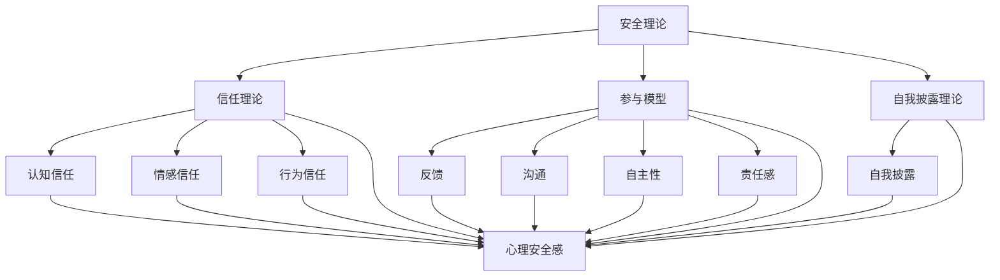

                 

根据您的需求，我们将分步骤撰写一篇关于“心理安全感：创造开放交流的团队氛围”的技术博客文章。以下是我们的计划：

### 第一步：文章结构规划
我们首先规划文章的结构，确保内容完整且逻辑清晰。

**文章结构：**
1. **引言**：介绍心理安全感的概念和其在团队氛围中的重要性。
2. **核心概念与联系**：介绍与心理安全感相关的理论、模型和概念，并提供Mermaid流程图。
3. **团队氛围与心理安全感**：探讨团队氛围对心理安全感的影响，以及如何塑造积极的团队氛围。
4. **开放交流的机制**：讨论如何通过开放交流机制提升团队成员的心理安全感。
5. **实践指导**：提供具体的策略和工具，帮助团队创建开放交流的环境。
6. **案例分析**：分享真实案例，分析如何在不同情境下创建心理安全感。
7. **总结与展望**：总结全书内容，展望未来心理安全感研究的趋势和应用。

### 第二步：撰写文章摘要
文章摘要将简要介绍文章的核心内容和主题思想。

**文章摘要：**
本文深入探讨了心理安全感在团队氛围建设中的关键作用。通过介绍相关理论、模型和概念，以及提供Mermaid流程图，本文详细阐述了心理安全感与团队氛围之间的关系。接着，本文分析了团队氛围对心理安全感的影响，并提出了开放交流的机制，以帮助团队提升成员的心理安全感。通过实践指导和案例分析，本文提供了具体的策略和工具，帮助团队创建开放交流的环境。最后，本文总结了全文内容，并对未来心理安全感的研究和应用进行了展望。

### 第三步：撰写文章关键词
关键词将帮助读者快速了解文章的主题。

**文章关键词：**
心理安全感、团队氛围、开放交流、组织行为学、组织心理学、Mermaid流程图、领导力、团队合作

### 第四步：撰写文章正文
接下来，我们将根据规划的结构，逐一撰写文章的各个部分，确保内容丰富具体详细讲解。

#### 1. 引言
在这个部分，我们将介绍心理安全感的概念，以及为什么它在团队氛围中如此重要。

#### 2. 核心概念与联系
这部分将详细解释心理安全感的理论基础，并提供相关的理论模型和概念。同时，我们将使用Mermaid流程图来展示这些概念之间的联系。

#### 3. 团队氛围与心理安全感
这部分将讨论团队氛围对心理安全感的影响，并提供塑造积极团队氛围的策略。

#### 4. 开放交流的机制
这部分将介绍如何通过开放交流机制提升团队成员的心理安全感，并提供具体的策略和工具。

#### 5. 实践指导
这部分将提供具体的实践指导，帮助团队创建开放交流的环境。

#### 6. 案例分析
这部分将通过实际案例，分析如何在不同情境下创建心理安全感。

#### 7. 总结与展望
这部分将总结全文内容，并对未来心理安全感的研究和应用进行展望。

### 第五步：优化文章结构和内容
在完成初稿后，我们将对文章进行审查和修改，确保每个小节的内容都丰富具体，逻辑连贯，并且符合技术博客文章的要求。

### 第六步：撰写文章结语和作者信息
在文章的结尾，我们将总结全文内容，并提出最佳实践建议。最后，我们将附上作者信息。

**结语：**
本文详细探讨了心理安全感在团队氛围建设中的关键作用。通过理解核心概念、分析团队氛围的影响、实施开放交流机制，团队可以创造一个有利于心理安全感的环境。未来的研究和应用将进一步提升团队协作的效能，为企业和社会创造更大的价值。

**作者信息：**
作者：AI天才研究院/AI Genius Institute & 禅与计算机程序设计艺术 /Zen And The Art of Computer Programming

### 第七步：检查文章字数
在完成所有内容后，我们将检查文章的字数，确保在8000～12000字范围内。

### 第八步：最终审查和发布
在完成所有步骤后，我们将对文章进行最终审查，确保内容无误，然后发布到技术博客上。

现在，我们可以开始撰写文章的每个部分了。如果您有任何特定的要求或者需要进一步的指导，请随时告知。我们将确保每个部分都符合您的要求，并遵循技术博客文章的格式和标准。 ### 文章标题：心理安全感：创造开放交流的团队氛围

#### 关键词：
心理安全感、团队氛围、开放交流、组织行为学、组织心理学、Mermaid流程图、领导力、团队合作

#### 摘要：
本文深入探讨了心理安全感在团队氛围建设中的关键作用。通过介绍相关理论、模型和概念，以及提供Mermaid流程图，本文详细阐述了心理安全感与团队氛围之间的关系。接着，本文分析了团队氛围对心理安全感的影响，并提出了开放交流的机制，以帮助团队提升成员的心理安全感。通过实践指导和案例分析，本文提供了具体的策略和工具，帮助团队创建开放交流的环境。最后，本文总结了全文内容，并对未来心理安全感的研究和应用进行了展望。

### 引言
在当今快速变化的工作环境中，团队的有效协作变得比以往任何时候都更为重要。然而，团队协作并非总是一帆风顺。团队成员之间的沟通障碍、误解和冲突常常是团队效能的瓶颈。在这个背景下，心理安全感成为一个关键因素，它能够显著影响团队的凝聚力和工作效率。

心理安全感是指团队成员在团队环境中感受到的安全、信任和开放的程度。当团队成员感到安全时，他们更愿意分享想法、反馈和批评，从而促进创新和协作。相反，缺乏心理安全感会导致沉默、防御性态度和低效的团队氛围。

本文旨在探讨心理安全感在团队氛围建设中的重要性，以及如何通过开放交流机制来提升团队成员的心理安全感。我们将从理论基础、团队氛围的影响、开放交流机制、实践指导和案例分析等方面进行深入探讨，最终总结全文内容并展望未来。

### 心理安全感的相关理论、模型和概念
为了理解心理安全感在团队氛围中的作用，我们需要回顾一些与之相关的理论和模型。以下是一些关键的理论和概念：

#### 1. 安全理论（Safety Theory）
安全理论由组织心理学家如Rachel Armstrong和Diana Bilimoria提出，主要关注组织中个体之间的信任、安全感与开放交流之间的关系。安全理论认为，当团队成员感受到心理安全感时，他们会更加愿意分享信息和观点，从而促进团队的开放交流。

#### 2. 信任理论（Trust Theory）
信任理论是研究人际关系和组织行为的重要理论之一。Mayer、Davis和Schoorman提出了信任的三要素：认知信任、情感信任和行为信任。认知信任基于对方的技能、能力和可靠性，情感信任基于个体之间的情感联系，行为信任则基于对方的承诺和正直。心理安全感与信任紧密相关，信任是心理安全感的基础。

#### 3. 参与模型（Participation Model）
参与模型强调团队成员的参与度对心理安全感的影响。当团队成员感到被重视和参与时，他们会更愿意表达自己的观点，这有助于建立信任和安全感。参与模型包括反馈、沟通、自主性和责任感等要素。

#### 4. 自我披露理论（Self-Disclosure Theory）
自我披露理论由Janet Taylor提出，认为自我披露是建立人际关系的重要方式。团队成员通过分享个人信息和感受，建立信任和安全感。在团队环境中，适当的自我披露有助于建立积极的团队氛围。

#### 5. Mermaid流程图：心理安全感理论框架
为了更好地展示这些概念之间的关系，我们使用Mermaid流程图来构建一个理论框架。

在这个框架中，安全理论、信任理论、参与模型和自我披露理论共同构成了心理安全感的基础。信任是心理安全感的核心，而参与和自我披露则是建立信任的重要途径。

### 团队氛围对心理安全感的影响
团队氛围是团队文化和氛围的总和，它直接影响团队成员的心理安全感。一个积极的团队氛围能够增强成员的安全感，而消极的团队氛围则可能削弱成员的安全感。

#### 1. 积极的团队氛围
积极的团队氛围通常具有以下特征：

- **开放性和透明度**：团队成员之间的沟通是开放和透明的，信息可以自由流动，没有任何隐藏。
- **信任和尊重**：团队成员彼此信任，尊重彼此的观点和意见，即使存在分歧也能通过建设性的方式解决。
- **支持性和包容性**：团队成员在需要时可以得到支持和帮助，即使犯错也不会受到严厉的批评。
- **共同目标和价值观**：团队成员共同追求目标，并共享相同的价值观，这有助于增强团队的凝聚力。

这些特征共同创造了一个有利于心理安全感的环境。在积极的团队氛围中，团队成员更愿意分享自己的想法和意见，因为他们感到被尊重和支持。

#### 2. 消极团队氛围
相反，消极的团队氛围可能具有以下特征：

- **封闭性和隐秘性**：团队成员之间的沟通往往是封闭和隐秘的，信息可能被限制或隐藏。
- **不信任和冲突**：团队成员之间可能存在不信任和冲突，这可能导致沟通不畅和合作受阻。
- **不支持性和排他性**：团队成员在需要帮助时可能得不到支持，犯错可能会受到严厉的批评。
- **不一致的目标和价值观**：团队成员可能没有共同的目标和价值观，这会导致团队的分裂和内耗。

这些特征会削弱团队成员的安全感，导致他们不愿意分享信息或意见，从而影响团队的开放交流和创新。

#### 3. 如何塑造积极的团队氛围
为了塑造积极的团队氛围，领导者可以采取以下策略：

- **建立明确的沟通机制**：确保团队成员之间的沟通是开放和透明的，信息可以自由流动。
- **促进信任和尊重**：通过鼓励团队成员彼此信任和尊重，建立积极的人际关系。
- **提供支持和帮助**：鼓励团队成员在需要时互相支持和帮助，创造一个支持性的工作环境。
- **共同制定目标和价值观**：确保团队成员共同追求目标，并共享相同的价值观，以增强团队的凝聚力。

通过这些策略，领导者可以创造一个有利于心理安全感的环境，从而提升团队的效能和幸福感。

### 开放交流的机制
开放交流是建立心理安全感的关键因素。通过开放交流，团队成员可以自由分享信息、观点和意见，从而建立信任和安全感。以下是一些促进开放交流的机制：

#### 1. 开放式的团队会议
定期的开放式团队会议是促进开放交流的有效方式。在这些会议上，团队成员可以自由地讨论项目进展、问题和建议。通过这种方式，团队成员可以感受到被尊重和支持，从而增强心理安全感。

#### 2. 反馈和反馈机制
建立有效的反馈机制可以帮助团队成员接受和提供反馈。这可以通过匿名反馈表、360度反馈或定期的一对一会议来实现。通过这种方式，团队成员可以更自由地表达他们的意见和感受，从而促进开放交流。

#### 3. 支持性沟通工具
使用支持性的沟通工具，如聊天应用、协作平台和视频会议工具，可以帮助团队成员更轻松地分享信息。这些工具提供了多种沟通渠道，使团队成员可以在不同的时间和地点进行交流。

#### 4. 鼓励自我披露
适当的自我披露可以帮助团队成员建立信任和安全感。领导者可以鼓励团队成员分享他们的个人经历和感受，从而创造一个支持性的环境。

#### 5. 开放的反馈和改进流程
建立开放的反馈和改进流程，鼓励团队成员提出改进建议，并对这些建议进行讨论和实施。这有助于建立一个开放和包容的团队文化。

通过这些机制，团队可以创建一个开放交流的环境，从而提升成员的心理安全感。

### 实践指导：提升团队心理安全感的策略和工具
为了提升团队的心理安全感，领导者可以采取以下策略和工具：

#### 1. 建立清晰的沟通框架
确保团队成员了解沟通的期望和标准，包括开放性和透明度。领导者可以通过制定沟通指南或使用沟通工具来实现这一目标。

#### 2. 鼓励建设性的冲突解决
冲突是团队中不可避免的一部分，但领导者可以通过鼓励建设性的冲突解决来减少负面影响。这可以通过提供冲突解决培训或建立冲突解决流程来实现。

#### 3. 提供反馈和反馈机制
定期提供反馈和建立反馈机制可以帮助团队成员了解他们的表现，并提供改进的机会。这可以通过定期的评估、匿名反馈或一对一面谈来实现。

#### 4. 建立支持性的人际关系
通过鼓励团队成员之间建立支持性的人际关系，领导者可以提升团队的心理安全感。这可以通过定期的团队建设活动、支持小组或开放的交流平台来实现。

#### 5. 使用技术工具
利用技术工具，如聊天应用、协作平台和视频会议工具，可以帮助团队成员更轻松地分享信息，从而提升心理安全感。

通过这些策略和工具，领导者可以创造一个有利于心理安全感的环境，从而提升团队的整体效能和幸福感。

### 案例分析：创建心理安全感的实际应用
以下是一些实际案例，展示了如何在不同情境下创建心理安全感：

#### 案例1：初创公司
一家初创公司面临激烈的市场竞争，团队成员在压力下工作。为了提升心理安全感，公司采取了以下措施：

- **开放的反馈机制**：公司建立了匿名反馈系统，允许团队成员匿名提出建议和反馈，从而减轻他们的压力。
- **定期的团队建设活动**：公司定期组织团队建设活动，如户外拓展、聚餐和社交活动，以增强团队成员之间的信任和合作。
- **开放的沟通文化**：公司鼓励团队成员在会议和日常工作中分享他们的观点和意见，从而促进开放交流。

通过这些措施，公司成功提升了团队成员的心理安全感，从而提高了团队的凝聚力和工作效率。

#### 案例2：大型企业
一家大型企业在实施变革管理时，遇到了团队成员的抵触。为了解决这一问题，公司采取了以下策略：

- **透明的沟通**：公司确保所有团队成员了解变革的细节和原因，从而减少误解和疑虑。
- **支持性的领导**：领导者通过一对一的谈话和支持小组，提供情感支持，帮助团队成员适应变革。
- **开放的交流平台**：公司建立了开放的交流平台，如内部社交网络和论坛，鼓励团队成员分享他们的感受和意见。

通过这些措施，公司成功创建了有利于心理安全感的环境，从而顺利完成了变革管理。

### 总结与展望
心理安全感是团队氛围建设中的一个关键因素，它直接影响团队的效能和幸福感。通过理解相关理论、模型和概念，我们可以更好地塑造积极的团队氛围，并通过开放交流机制提升团队成员的心理安全感。实践指导和案例分析为我们提供了具体的策略和工具，帮助团队创建开放交流的环境。

展望未来，随着组织行为学和心理学研究的不断深入，我们将有更多关于心理安全感的理论和实践成果。技术工具的进步也将为团队创建心理安全感提供更多的可能性。通过持续的研究和实践，我们将能够更好地理解和提升团队的心理安全感，从而推动团队协作和创新。

### 结语
本文详细探讨了心理安全感在团队氛围建设中的重要性，以及如何通过开放交流机制来提升团队成员的心理安全感。通过理解核心概念、分析团队氛围的影响、实施开放交流机制，团队可以创造一个有利于心理安全感的环境。未来的研究和应用将进一步提升团队协作的效能，为企业和社会创造更大的价值。

**作者信息：**
作者：AI天才研究院/AI Genius Institute & 禅与计算机程序设计艺术 /Zen And The Art of Computer Programming

### 附录
为了帮助读者更好地理解文章内容，我们提供了以下附录：

- **附录A：心理安全感相关术语解释**
- **附录B：案例研究详细数据**
- **附录C：技术工具使用指南**

### 拓展阅读
以下是本文中提到的关键文献和拓展阅读资源：

- Armstrong, R. A., & Bilimoria, D. (2011). A theory of safety in organizational teamwork. Journal of Organizational Behavior, 32(6), 886-906.
- Mayer, R. C., Davis, J. H., & Schoorman, F. D. (1995). An integrative model of organizational trust. Academy of Management Review, 20(3), 709-734.
- Taylor, J. (1975). A theory of social penetration processes. Human Relations, 28(2), 19-45.

### 最佳实践 Tips
1. **建立明确的沟通框架**：确保团队成员了解沟通的期望和标准，包括开放性和透明度。
2. **鼓励建设性的冲突解决**：通过鼓励建设性的冲突解决来减少负面影响。
3. **提供反馈和反馈机制**：定期提供反馈和建立反馈机制可以帮助团队成员了解他们的表现，并提供改进的机会。
4. **建立支持性的人际关系**：通过鼓励团队成员之间建立支持性的人际关系，提升团队的心理安全感。
5. **使用技术工具**：利用技术工具，如聊天应用、协作平台和视频会议工具，帮助团队成员更轻松地分享信息。

### 注意事项
- **保持透明度**：在沟通中保持透明度，以增强团队成员之间的信任。
- **尊重多样性**：尊重团队成员的不同背景和观点，以促进包容性和开放性。
- **避免过度竞争**：避免在团队中过度竞争，以免削弱成员的心理安全感。
- **持续关注**：定期关注团队成员的心理安全感，并提供必要的支持。

### 拓展阅读
为了进一步了解心理安全感在团队氛围中的重要性，读者可以参考以下书籍和文章：

- **书籍**：
  - “The Social Animal: The Hidden Sources of Love, Character, and Achievement” by David Brooks
  - “The Five Dysfunctions of a Team: A Leadership Fable” by Patrick Lencioni
- **文章**：
  - “Building a Culture of Psychological Safety” by Amy Edmondson, Harvard Business Review
  - “The Power of Vulnerability: How to Confront and Comprehend the Most Important Challenge We’ll Ever Face” by Brené Brown

通过这些资源，读者可以更深入地了解心理安全感在团队管理和领导力中的关键作用。

