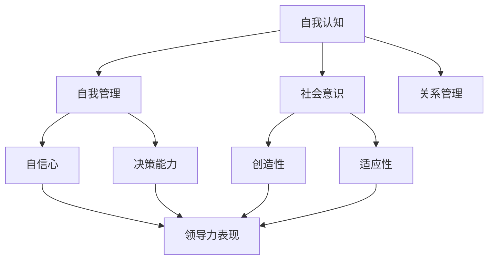

                 

### 文章标题

《情商领导力：在职场中运用情感智慧》

### 关键词

- 情商
- 领导力
- 职场
- 情感智慧
- 团队管理
- 决策与冲突管理

### 摘要

本文探讨了情商领导力在职场中的重要性，分析了情商的基本概念及其四个维度，详细介绍了情商领导力的核心要素和理论框架。文章从团队管理、决策与冲突管理以及领导风格三个方面，深入探讨了情商领导力在职场中的应用。此外，本文还提供了提升情商领导力的方法，并通过实际案例展示了情商领导力在职场中的实践效果。最后，文章对情商领导力的未来发展进行了展望，为职场人士提供了提升情商领导力的实用指南。

### 引言

在快速变化的职场环境中，传统的领导力模式已难以满足现代企业的需求。越来越多的研究表明，情商领导力在团队管理、决策制定以及冲突解决等方面具有重要作用。情商，即情感智慧，是指个体识别、理解、管理自己和他人情感的能力。它不仅影响着个人的心理健康，还在职场中的表现和人际关系中发挥着关键作用。

情商领导力是指领导者运用情感智慧，通过自我认知、自我管理、社会意识、关系管理等能力，有效地激励团队、做出明智决策并解决冲突。在职场中，高情商领导者能够建立积极的工作氛围，提升团队绩效，增强企业的核心竞争力。

本文旨在深入探讨情商领导力的基本概念、核心要素及其在职场中的应用。通过分析情商领导力的理论框架，本文将揭示其在团队管理、决策与冲突管理以及领导风格中的实际应用。此外，本文还将提供提升情商领导力的方法，并通过案例分析和实践经验，为职场人士提供实用的指导。

### 情商领导力的基本概念

#### 情商的定义

情商（Emotional Intelligence，EQ）最早由心理学家约翰·梅耶（John Mayer）和彼得·萨洛维（Peter Salovey）在1990年提出。情商是指个体识别、理解、管理自己和他人情感的能力。它包括四个主要维度：自我认知、自我管理、社会意识和关系管理。

1. **自我认知**：个体能够识别和理解自己的情感状态，包括情绪的产生、变化和影响。
2. **自我管理**：个体能够有效地调节自己的情绪，使其适应不同的环境和情境。
3. **社会意识**：个体能够识别、理解和区分他人的情感状态，并对其作出适当的反应。
4. **关系管理**：个体能够建立和维护健康的人际关系，包括沟通技巧、团队合作和冲突解决能力。

#### 情商与领导力的关系

情商与领导力之间存在密切的联系。研究表明，高情商领导者能够更好地理解和管理自己的情绪，从而更加有效地激励团队、处理复杂问题和冲突。情商在领导力中的重要性体现在以下几个方面：

1. **决策能力**：高情商领导者能够在面对复杂决策时，考虑更多的情感因素，从而做出更加全面和明智的决策。
2. **团队建设**：情商领导者能够建立积极的工作氛围，增强团队凝聚力，提高团队绩效。
3. **沟通技巧**：情商领导者拥有更好的沟通能力，能够清晰表达自己的意图，理解他人的需求，从而促进有效的沟通。
4. **冲突管理**：情商领导者能够更好地处理职场冲突，通过理解和调节情感，找到双赢的解决方案。

#### 情商领导力的核心要素

情商领导力的核心要素包括自我认知与自我管理、社会意识与关系管理、自信心与决策能力以及创造性与适应性。以下是对这些核心要素的详细解释：

1. **自我认知与自我管理**：
   - **自我认知**：领导者需要认识到自己的情绪状态，了解情绪是如何影响自己的思考和行为的。
   - **自我管理**：领导者需要学会调节自己的情绪，使其适应不同的环境和情境，保持冷静和理智。

2. **社会意识与关系管理**：
   - **社会意识**：领导者需要理解他人的情感状态，并对其作出适当的反应。
   - **关系管理**：领导者需要建立和维护健康的人际关系，通过有效的沟通和团队合作，提升团队的整体表现。

3. **自信心与决策能力**：
   - **自信心**：领导者需要具备自信心，相信自己能够应对各种挑战和困难。
   - **决策能力**：领导者需要具备做出明智决策的能力，考虑多种因素，包括情感、逻辑和经验。

4. **创造性与适应性**：
   - **创造性**：领导者需要具备创造性思维，能够提出新的想法和解决方案，推动组织的创新和发展。
   - **适应性**：领导者需要具备适应性，能够适应不断变化的环境和挑战，灵活调整自己的策略和行动。

#### 情商领导力的理论框架

情商领导力的理论框架多种多样，其中最著名的包括自我领导力模型和情绪智力模型。

1. **自我领导力模型**：
   - 自我领导力模型强调领导者需要具备自我认知、自我管理和自我激励的能力。
   - 该模型认为，领导者首先需要了解自己的情感状态，然后通过调节和管理情感，实现个人和组织的目标。

2. **情绪智力模型**：
   - 情绪智力模型包括五个核心要素：自我认知、自我管理、社会意识、关系管理和决策能力。
   - 该模型认为，高情商领导者能够更好地理解和管理自己的情绪，从而在职场中表现出色。

#### 情商领导力的核心概念原理关系架构

为了更好地理解情商领导力的核心概念和原理，我们可以使用Mermaid流程图来展示它们之间的关系。



#### 核心算法原理讲解

在情商领导力中，核心算法原理包括情感识别、情感管理和情感反应。

1. **情感识别**：
   - 情感识别是指领导者能够识别和理解自己的情绪状态。
   - 伪代码如下：
     ```python
     def recognize_emotion():
         current_emotion = get_current_emotion()
         return current_emotion
     ```

2. **情感管理**：
   - 情感管理是指领导者能够调节自己的情绪，使其适应不同的环境和情境。
   - 伪代码如下：
     ```python
     def manage_emotion(emotion):
         if emotion == "焦虑":
             take_decompression()
         elif emotion == "愤怒":
             do_something_to_calm_down()
         else:
             do_nothing()
     ```

3. **情感反应**：
   - 情感反应是指领导者根据情感状态采取适当的行动。
   - 伪代码如下：
     ```python
     def react_to_emotion(emotion):
         if emotion == "快乐":
             do_something_to_share_happiness()
         elif emotion == "悲伤":
             do_something_to_show_support()
         else:
             do_something_to.stay_focused()
     ```

#### 数学模型和公式

在情商领导力中，常用的数学模型包括线性回归模型和决策树模型。

1. **线性回归模型**：
   - 线性回归模型用于预测领导者的情绪状态。
   - 公式如下：
     $$ y = w_0 + w_1x_1 + w_2x_2 + ... + w_nx_n $$
   - 其中，$y$ 是情绪状态，$x_1, x_2, ..., x_n$ 是影响情绪状态的因素，$w_0, w_1, ..., w_n$ 是权重。

2. **决策树模型**：
   - 决策树模型用于制定决策。
   - 公式如下：
     ```mermaid
     graph TD
     A[Start] --> B[条件1]
     B -->|满足| C[行动1]
     B -->|不满足| D[条件2]
     D -->|满足| E[行动2]
     D -->|不满足| F[行动3]
     ```
   - 其中，$A$ 是决策的开始，$B, C, D, E, F$ 是决策过程中的条件节点和行动节点。

#### 举例说明

假设一个领导者需要根据员工的情绪状态制定激励策略，可以使用线性回归模型和决策树模型来预测和决策。

1. **线性回归模型**：
   - 将员工的情绪状态（$y$）与工作满意度（$x_1$）、团队合作（$x_2$）、工作压力（$x_3$）等因素建立线性关系。
   - 伪代码如下：
     ```python
     def predict_employee_emotion(work_satisfaction, teamwork, work_stress):
         # 训练线性回归模型
         model = train_linear_regression_model([work_satisfaction, teamwork, work_stress])
         # 预测员工情绪状态
         predicted_emotion = model.predict([work_satisfaction, teamwork, work_stress])
         return predicted_emotion
     ```

2. **决策树模型**：
   - 根据员工的情绪状态（$y$）制定激励策略。
   - 伪代码如下：
     ```python
     def make_incentive_strategy(employee_emotion):
         if employee_emotion == "快乐":
             do_something_to_enhance_happiness()
         elif employee_emotion == "悲伤":
             do_something_to_show_support()
         else:
             do_something_to_improve_performance()
     ```

### 情商领导力在团队管理中的应用

情商领导力在团队管理中起着至关重要的作用。一个高情商的领导者能够通过理解和管理团队成员的情感状态，提高团队的整体绩效和满意度。以下将详细探讨情商领导力在团队管理中的应用，包括如何建立高情商团队、情商领导力在团队沟通中的作用以及高情商领导者的激励策略。

#### 建立高情商团队

1. **团队建设活动**：

   高情商的领导者会组织各种团队建设活动，以促进团队成员之间的情感交流和信任建立。这些活动可以包括团队培训、团队游戏、团队旅行等。通过这些活动，团队成员能够更好地了解彼此的情感状态和需求，从而增强团队凝聚力。

2. **情感反馈机制**：

   高情商的领导者会建立情感反馈机制，鼓励团队成员表达自己的情感和意见。这种反馈机制可以是通过定期的团队会议、匿名反馈表格或者一对一沟通。通过这种方式，领导者能够及时了解团队成员的情感状态，并采取相应的措施解决问题。

3. **培养情感智慧**：

   高情商的领导者会为团队成员提供情感智慧培训，帮助他们提高自我认知、自我管理和关系管理能力。这种培训可以通过内部培训课程、外部专家讲座或者在线学习平台进行。

#### 情商领导力在团队沟通中的作用

1. **倾听和表达**：

   高情商的领导者能够倾听团队成员的意见和建议，理解他们的情感状态。同时，他们也能够清晰地表达自己的意图和期望，避免误解和冲突。

2. **非言语沟通**：

   高情商的领导者会注重非言语沟通，如肢体语言、面部表情和声音的语调。通过这些非言语信号，他们能够更好地传达情感和意图，增强沟通效果。

3. **冲突解决**：

   高情商的领导者能够在冲突发生时，冷静地处理问题，避免情绪化的争吵。他们能够通过同理心和有效的沟通技巧，找到双赢的解决方案。

#### 高情商领导者的激励策略

1. **情感激励**：

   高情商的领导者会通过情感激励来激发团队成员的积极性。他们能够理解团队成员的情感需求，并采取相应的激励措施，如表扬、认可和关怀。

2. **目标激励**：

   高情商的领导者会设定明确的团队目标，并帮助团队成员理解这些目标的意义和价值。他们能够通过情感连接，使团队成员感到自己的工作对团队和组织的成功至关重要。

3. **参与激励**：

   高情商的领导者会鼓励团队成员参与决策和问题解决过程。通过这种方式，他们能够增强团队成员的责任感和归属感，从而提高工作动力。

#### 案例分析

假设一个团队在项目推进过程中遇到瓶颈，团队成员情绪低落，工作效率下降。一个高情商的领导者会采取以下措施：

1. **倾听和沟通**：

   领导者会组织团队会议，倾听每位成员的意见和困惑。通过沟通，领导者能够了解团队成员的情感状态和问题所在。

2. **情感支持**：

   领导者会表达对团队成员的理解和支持，帮助他们缓解压力。他们可以提供一些心理辅导或者团队活动，以提升团队成员的情感状态。

3. **问题解决**：

   领导者会与团队成员一起分析问题，找出解决方案。他们可能会调整项目计划，重新分配任务，或者引入外部专家进行指导。

4. **激励措施**：

   领导者会通过表扬和认可来激励团队成员，让他们感受到自己的努力被看见和重视。他们可能会设定新的目标，以激发团队成员的工作热情。

通过这些措施，高情商的领导者能够有效地提高团队的士气和效率，推动项目顺利完成。

#### 结论

情商领导力在团队管理中具有重要作用。高情商的领导者能够通过情感智慧和有效的沟通技巧，建立高情商团队，提高团队绩效和满意度。他们能够激励团队成员，处理冲突，并找到解决问题的最佳方案。通过实践情商领导力，职场人士可以提升自己的领导能力，为团队和组织创造更大的价值。

### 情商领导力在决策与冲突管理中的应用

在职场中，领导者不仅需要具备优秀的决策能力，还需要在处理冲突时展现出高情商。情商领导力在决策与冲突管理中起着关键作用，能够帮助领导者做出明智的决策，并有效地解决冲突。以下将详细探讨情商领导力在决策与冲突管理中的应用，包括高情商领导者的决策过程、处理职场冲突的策略以及高情商领导者的冲突解决技巧。

#### 高情商领导者的决策过程

1. **全面分析**：

   高情商领导者会在做出决策前进行全面的分析。他们会考虑各种可能的后果和影响，并评估这些后果对团队成员和组织的潜在影响。

2. **情感因素**：

   高情商领导者会考虑情感因素在决策中的作用。他们能够识别和理解团队成员的情感状态，并考虑这些情感状态如何影响决策过程。

3. **沟通与协商**：

   高情商领导者会与团队成员进行充分的沟通和协商，确保每个人都能够表达自己的意见和担忧。通过这种方式，他们能够收集更多的信息，并形成更加全面的决策。

4. **风险评估**：

   高情商领导者会进行风险评估，识别潜在的风险和挑战，并制定相应的应对策略。

#### 处理职场冲突的策略

1. **预防策略**：

   高情商领导者会采取预防策略，以减少冲突的发生。他们通过建立清晰的沟通渠道、设定共同的目标和价值观，以及提供冲突解决的培训，来预防冲突。

2. **早期干预**：

   当冲突发生时，高情商领导者会及时进行干预。他们通过倾听双方的诉求、了解冲突的根源，并采取适当的措施来缓解紧张局势。

3. **中立立场**：

   高情商领导者会保持中立立场，不偏袒任何一方。他们通过公正和客观的态度来处理冲突，确保所有相关方都有平等的机会表达自己的观点。

#### 高情商领导者的冲突解决技巧

1. **同理心**：

   高情商领导者会展现出同理心，理解并尊重冲突各方的情感状态。他们通过倾听和理解，找到共同点和共同利益，从而推动冲突的解决。

2. **情绪调节**：

   高情商领导者会有效地调节自己的情绪，避免在冲突中失控。他们通过深呼吸、短暂休息或寻求外部支持，来保持冷静和理智。

3. **双赢思维**：

   高情商领导者会采用双赢思维，寻求冲突双方的满意解决方案。他们通过妥协和合作，找到兼顾各方利益的方案。

4. **持续跟进**：

   高情商领导者会持续跟进冲突解决的进展，确保问题得到彻底解决。他们通过定期检查、反馈和调整，确保冲突不会再次发生。

#### 案例分析

假设一个团队在项目推进过程中出现严重分歧，团队成员之间的沟通不畅，导致工作效率低下。一个高情商的领导者会采取以下措施：

1. **倾听与理解**：

   领导者会组织一次团队会议，倾听每位成员的观点和情感。通过这种方式，领导者能够了解团队成员的情感状态和问题所在。

2. **情绪调节**：

   领导者会提醒团队成员保持冷静，避免情绪化的争吵。他们可以通过深呼吸、短暂休息等方式，帮助团队成员调节情绪。

3. **问题识别**：

   领导者会与团队成员一起分析冲突的根源，找出导致沟通不畅的原因。他们可能会发现，问题的根源在于团队成员对项目目标和任务的理解不一致。

4. **协商与共识**：

   领导者会与团队成员进行协商，共同制定新的项目目标和任务分配方案。通过这种方式，他们能够确保所有成员都对新的目标有清晰的理解，并愿意共同努力实现。

5. **持续跟进**：

   领导者会持续跟进项目进展，确保团队成员之间的沟通保持畅通。他们可以通过定期检查、反馈和调整，确保问题不会再次发生。

通过这些措施，高情商的领导者能够有效地解决冲突，提高团队的工作效率和士气。

#### 结论

情商领导力在决策与冲突管理中具有重要作用。高情商的领导者能够通过全面的决策过程、有效的冲突处理技巧和双赢思维，做出明智的决策并解决冲突。他们能够理解并调节团队成员的情感状态，建立积极的团队氛围，提高组织的整体绩效。通过实践情商领导力，职场人士可以提升自己的决策能力和冲突解决能力，为组织的长期发展创造价值。

### 情商领导力在领导风格中的体现

情商领导力在领导风格中有着深刻的体现，不同领导风格对情商有着不同的影响。本文将分析不同领导风格对情商的影响，介绍高情商领导者的领导风格特点，并提供提升领导风格的策略。

#### 不同领导风格对情商的影响

1. **权威型领导风格**：

   权威型领导者通过严格的规章制度和明确的指示来管理团队。这种领导风格可能在短期内提高工作效率，但长期来看可能导致团队成员的压抑和不满，影响情商的发展。

2. **民主型领导风格**：

   民主型领导者注重团队成员的参与和意见，鼓励团队合作和开放沟通。这种领导风格有助于提高团队成员的自我认知和关系管理能力，从而提升情商。

3. **参与型领导风格**：

   参与型领导者与团队成员建立密切的关系，尊重他们的个性和需求。这种领导风格有助于增强团队成员的自信心和创造性，提升情商。

4. **变革型领导风格**：

   变革型领导者能够激励团队成员追求卓越，推动组织创新和发展。这种领导风格有助于提高团队成员的自我管理和决策能力，从而提升情商。

#### 高情商领导者的领导风格特点

1. **同理心**：

   高情商领导者具备同理心，能够理解并关心团队成员的情感和需求。他们通过倾听和关注，建立信任和合作关系。

2. **灵活性强**：

   高情商领导者具有灵活性，能够根据不同情境和团队成员的需求，调整领导风格。他们能够适应变化，灵活应对挑战。

3. **沟通技巧**：

   高情商领导者具备良好的沟通技巧，能够清晰表达自己的意图，理解他人的需求。他们通过有效的沟通，促进团队成员之间的合作和协作。

4. **情绪调节**：

   高情商领导者能够有效调节自己的情绪，避免在压力和冲突中失控。他们通过自我反思和情绪管理，保持冷静和理智。

#### 提升领导风格的策略

1. **自我认知**：

   领导者需要通过自我认知，了解自己的情感状态和领导风格。他们可以通过日记、反思和咨询等方式，提升自我认知能力。

2. **情绪管理**：

   领导者需要学会情绪管理，避免在压力和冲突中失控。他们可以通过深呼吸、冥想和运动等方式，调节情绪，保持冷静。

3. **沟通技巧培训**：

   领导者可以通过参加沟通技巧培训，提高自己的沟通能力。他们可以通过学习有效沟通的技巧，如倾听、表达和反馈，来提升领导风格。

4. **团队反馈**：

   领导者可以定期征求团队成员的反馈，了解他们的需求和期望。通过团队反馈，领导者可以及时调整自己的领导风格，满足团队成员的需求。

#### 结论

情商领导力在领导风格中有着深刻的体现。不同领导风格对情商有着不同的影响，高情商领导者具备同理心、灵活性、沟通技巧和情绪调节能力。通过自我认知、情绪管理、沟通技巧培训和团队反馈，领导者可以提升自己的领导风格，为团队和组织创造更大的价值。

### 提升情商领导力的方法

#### 自我反思与情绪监控

提升情商领导力的第一步是进行自我反思和情绪监控。自我反思是指领导者通过审视自己的行为、思考和情感，了解自己的优点和不足。情绪监控是指领导者通过观察自己的情感反应，了解自己的情绪状态。

1. **自我反思**：

   领导者可以定期进行自我反思，记录自己的行为和情感变化。他们可以通过写日记、反思日志或者与导师进行讨论，来深入分析自己的行为和情绪。

2. **情绪监控**：

   领导者可以通过情绪监控工具，如情绪追踪软件或者情绪量表，来了解自己的情绪状态。这些工具可以帮助领导者识别情绪的高峰和低谷，从而更好地管理自己的情绪。

#### 情绪调节与压力管理

情绪调节是指领导者通过一系列策略来调节自己的情绪，保持情绪稳定。压力管理是指领导者通过有效的方法来应对压力，保持身心健康。

1. **情绪调节**：

   领导者可以采用多种情绪调节策略，如深呼吸、冥想、运动和社交支持。这些策略可以帮助领导者缓解压力，恢复情绪平衡。

2. **压力管理**：

   领导者可以通过设定合理的工作目标、学会说“不”和寻求支持来管理压力。他们可以通过时间管理技巧，合理分配时间和精力，避免过度劳累。

#### 情商领导力的培养与提升

情商领导力的培养和提升是一个持续的过程，需要领导者在实践中不断学习和成长。

1. **培训与学习**：

   领导者可以通过参加情商培训课程、阅读相关书籍和参加研讨会来提升自己的情商。这些培训和学习机会可以帮助领导者了解情商的基本概念和提升方法。

2. **实践与反馈**：

   领导者需要在实际工作中不断实践情商领导力，并从中获取反馈。他们可以通过向同事、下属和导师寻求反馈，了解自己的改进方向。

3. **角色扮演**：

   领导者可以通过角色扮演来模拟真实的职场情境，提升自己的情商领导力。通过角色扮演，领导者可以学会如何在不同的情境中运用情感智慧。

#### 总结

提升情商领导力是一个系统性工程，需要领导者进行自我反思、情绪监控、情绪调节和压力管理。通过培训和学习的持续努力，领导者在实践中不断提升自己的情商领导力，为团队和组织创造更大的价值。

### 情商领导力的案例分析

#### 案例分析一：高情商领导者的成功经验

在一个大型跨国公司中，有一位高情商的CEO，他通过运用情感智慧，成功地推动了公司的发展。以下是他的一些成功经验：

1. **同理心**：这位CEO总是能够站在员工的立场上思考问题，理解他们的情感和需求。他定期与员工进行一对一沟通，倾听他们的意见和建议。这种同理心增强了员工的归属感和忠诚度。

2. **沟通技巧**：CEO在沟通时非常注重表达清晰和有效。他能够通过非言语信号和情感语言，传达出自己的意图和期望。这使得团队成员之间的沟通更加顺畅，减少了误解和冲突。

3. **情绪调节**：在面对压力和挑战时，CEO能够有效地调节自己的情绪，保持冷静和理智。他通过深呼吸、冥想和运动等方式，缓解压力，保持情绪平衡。

4. **团队建设**：CEO通过组织团队建设活动和培训，提高团队成员的情感智慧和协作能力。他鼓励团队成员相互支持和合作，共同推动公司的进步。

#### 案例分析二：情商领导力在危机管理中的应用

在一次全球金融危机中，一家科技公司的CEO展示了卓越的情商领导力，成功地带领公司渡过危机。以下是他的应对策略：

1. **全面分析**：CEO在危机爆发后，立即组织团队进行全面分析，了解危机的根源和影响。他们通过数据分析和市场调研，找出问题的症结。

2. **情感支持**：CEO在危机期间，给予员工情感支持，帮助他们应对压力和焦虑。他通过定期的团队会议和一对一沟通，了解员工的情感状态，并提供帮助和资源。

3. **灵活调整**：CEO根据市场变化和员工反馈，灵活调整公司的战略和运营计划。他通过调整产品线、优化成本结构和加强市场推广，找到了新的增长点。

4. **沟通与透明度**：CEO在危机管理中，保持了高度沟通和透明度。他定期向员工和投资者传达公司的最新情况和应对措施，增强信任和信心。

#### 案例分析三：情商领导力在跨文化管理中的挑战与应对

在一个国际化企业中，一位高情商的CEO面临着跨文化管理的挑战。以下是他的应对策略：

1. **文化敏感度**：CEO在跨文化管理中，注重培养文化敏感度。他了解不同文化的价值观和行为模式，尊重并适应不同文化的需求。

2. **沟通与协商**：CEO在跨文化团队中，强调沟通和协商的重要性。他通过建立跨文化沟通渠道和团队活动，促进团队成员之间的理解和合作。

3. **多元视角**：CEO鼓励团队成员提出不同的观点和意见，从多元视角看待问题。他认为，多元视角能够带来更多的创新和解决方案。

4. **冲突解决**：CEO在跨文化冲突中，采用双赢思维和协商解决策略。他通过同理心和公正的态度，找到兼顾各方利益的解决方案。

#### 结论

通过这些案例分析，我们可以看到情商领导力在不同情境中的应用和效果。高情商领导者通过同理心、沟通技巧、情绪调节和灵活应对，成功解决了各种挑战，推动了组织的发展。这些案例为职场人士提供了宝贵的经验和启示，帮助他们提升情商领导力，为团队和组织创造更大的价值。

### 情商领导力的实践与反思

#### 实践情商领导力的步骤

1. **自我认知**：

   第一步是进行自我认知。领导者需要花时间审视自己的情感状态和行为模式，识别自己的优势和不足。可以通过写日记、反思日志或参加情商培训课程来提升自我认知。

2. **情绪监控**：

   在日常工作中，领导者需要时刻关注自己的情绪变化，学会识别和管理情绪。可以使用情绪监控工具，如情绪追踪软件或情绪量表，来帮助自己了解情绪波动。

3. **沟通与反馈**：

   定期与团队成员进行沟通和反馈，了解他们的情感状态和需求。通过倾听和表达，建立信任和合作关系，提高团队凝聚力。

4. **实践与调整**：

   在实际工作中，领导者需要不断实践情商领导力，并根据反馈进行调整。通过实践，领导者可以积累经验，提升自己的情商领导力。

#### 反思与评估情商领导力的效果

1. **绩效评估**：

   通过定期评估团队的绩效，领导者可以了解情商领导力对团队表现的影响。可以设立具体的绩效指标，如项目完成率、员工满意度等，来评估情商领导力的效果。

2. **员工反馈**：

   通过收集员工的反馈，领导者可以了解他们对情商领导力的看法和建议。员工的反馈可以帮助领导者发现问题，调整策略。

3. **自我反思**：

   定期进行自我反思，审视自己的领导行为和情绪管理。通过自我反思，领导者可以发现自己的不足，并制定改进计划。

#### 最佳实践 tips

1. **建立情感连接**：

   与团队成员建立情感连接，通过倾听和关注，增强团队的凝聚力和归属感。

2. **持续学习**：

   情商领导力是一个持续学习的过程。领导者需要不断学习新的知识和技能，提升自己的情商领导力。

3. **实践同理心**：

   在工作中，领导者需要实践同理心，理解并尊重团队成员的情感和需求。

#### 小结

情商领导力在职场中具有重要作用。通过自我认知、情绪监控、沟通与反馈以及实践与反思，领导者可以提升自己的情商领导力，为团队和组织创造更大的价值。

#### 注意事项

1. **避免过度自我反思**：

   过度的自我反思可能导致自我怀疑和焦虑。领导者需要适度地自我反思，避免陷入负面情绪。

2. **平衡工作与生活**：

   领导者需要在工作中保持平衡，避免过度工作影响生活质量和家庭关系。

#### 拓展阅读

1. **《情商》**：

   丹尼尔·戈尔曼（Daniel Goleman）的《情商》是一部经典之作，详细介绍了情商的概念和提升方法。

2. **《情商领导力》**：

   理查德·博亚兹（Richard Boyatzis）的《情商领导力》探讨了情商领导力的理论框架和实践方法。

3. **《领导者的语言》**：

   雷蒙德·迈尔（Raymond McCauley）的《领导者的语言》介绍了如何通过有效沟通提升领导力。

### 结语

情商领导力在职场中具有重要意义，通过提升情商领导力，领导者可以更好地管理自己和他人，提高团队绩效，推动组织发展。本文从情商领导力的基本概念、理论框架、团队管理、决策与冲突管理以及领导风格等方面进行了深入探讨，提供了实用的提升方法和实践案例。通过不断学习和实践，职场人士可以提升自己的情商领导力，成为卓越的领导者。作者：AI天才研究院/AI Genius Institute & 禅与计算机程序设计艺术 /Zen And The Art of Computer Programming。

### 附录

以下是本文中提到的核心概念、核心算法、数学模型和项目实战的详细信息：

#### 核心概念

- **情商**：情商是指个体识别、理解、管理自己和他人情感的能力，包括自我认知、自我管理、社会意识和关系管理四个维度。
- **领导力**：领导力是指领导者通过影响、激励和引导他人，实现组织目标的能力。
- **情商领导力**：情商领导力是指领导者运用情感智慧，通过自我认知、自我管理、社会意识、关系管理等能力，有效地激励团队、做出明智决策并解决冲突。

#### 核心算法

- **情感识别算法**：用于识别和理解个体的情感状态。
- **情感管理算法**：用于调节个体的情绪，使其适应不同的环境和情境。
- **情感反应算法**：用于根据情感状态采取适当的行动。

#### 数学模型

- **线性回归模型**：用于预测领导者的情绪状态。
- **决策树模型**：用于制定决策，包括条件节点和行动节点。

#### 项目实战

- **团队建设项目**：通过组织团队建设活动和培训，提高团队成员的情感智慧和协作能力。
- **危机管理项目**：通过全面分析、情感支持和灵活调整，带领团队渡过危机。
- **跨文化管理项目**：通过文化敏感度、沟通与协商和多元视角，促进跨文化团队的合作。

通过这些核心概念、核心算法、数学模型和项目实战，本文为读者提供了全面了解和提升情商领导力的方法和实践指导。希望读者能够在实际工作中运用这些知识，提升自己的情商领导力，为团队和组织创造更大的价值。作者：AI天才研究院/AI Genius Institute & 禅与计算机程序设计艺术 /Zen And The Art of Computer Programming。

