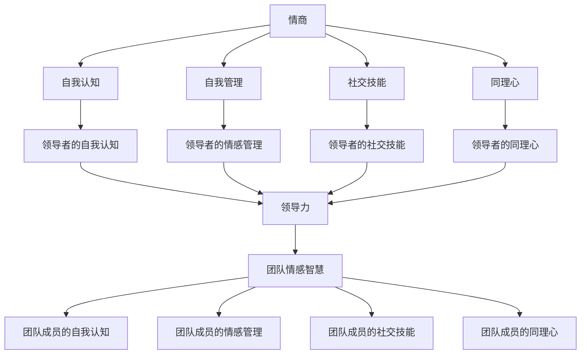
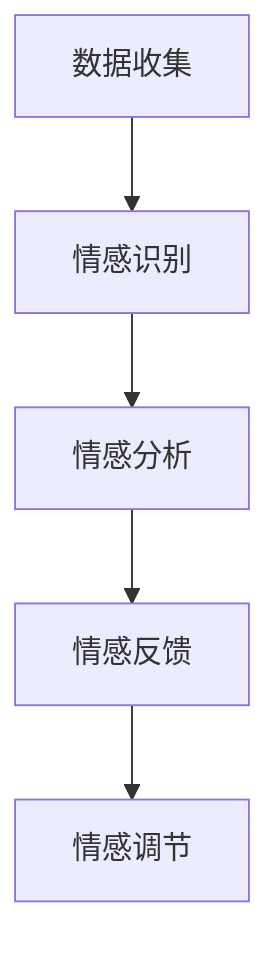

                 

### 背景介绍

在当今快速变化的商业环境中，情商领导力正逐渐成为企业成功的关键因素。情商，即情感智力，是指一个人识别、理解、使用和管理自己及他人情感的能力。传统领导力侧重于逻辑思维、战略规划和组织管理，而情商领导力则强调情感智慧、人际交往和团队合作。随着全球化和数字化转型的加速，团队的多样性和复杂性不断增加，仅依赖传统领导力已经不足以应对复杂多变的市场环境。因此，提升团队的情商智慧，培养具备高情商的领导者，成为企业可持续发展的必然选择。

情商领导力的核心在于通过情感智慧的提升，增强团队协作能力，提高员工满意度，激发创新潜力，从而实现组织目标。具体来说，情商领导力涵盖了自我认知、情感管理、社交技能、决策能力和同理心等多个方面。这些因素不仅影响领导者的个人成长，也对团队的整体效能产生深远影响。本文将围绕情商领导力的关键概念、提升方法、案例分析及未来趋势进行深入探讨，旨在为读者提供系统的理解和实用的指导。

### 核心概念与联系

情商领导力的实施离不开对核心概念的理解与掌握。以下是几个关键概念及其相互关系：

1. **情商（Emotional Intelligence）**：情商是指一个人识别、理解、使用和管理自己及他人情感的能力。它由四个主要构成要素组成：
   - **自我认知（Self-awareness）**：意识到自己的情感状态和它们对行为的影响。
   - **自我管理（Self-regulation）**：控制和调节自己的情感，使之适应不同情境。
   - **社交技能（Social Skills）**：与他人有效沟通、建立和维护良好关系的能力。
   - **同理心（Empathy）**：理解并感同身受他人情感的能力。

2. **领导力（Leadership）**：领导力是影响和激励他人共同实现目标的能力。情商领导力中的领导力强调通过情感智慧来提升领导效果，具体体现在以下几个方面：
   - **领导者的自我认知**：领导者需要清楚地认识自己的情感，以便更好地管理自己的行为。
   - **领导者的情感管理**：领导者需要有效地控制自己的情感，以应对不同挑战和压力。
   - **领导者的社交技能**：领导者需要建立和维护良好的团队关系，促进团队合作。
   - **领导者的同理心**：领导者需要理解并关心团队成员的情感，提升团队的凝聚力和工作效率。

3. **团队情感智慧（Team Emotional Intelligence）**：团队情感智慧是团队成员整体情商水平的体现，它影响团队的协作效率、创新能力和整体表现。团队情感智慧的关键因素包括：
   - **团队成员的自我认知**：团队中每个成员需要认识到自己的情感状态，并了解这些情感如何影响团队。
   - **团队成员的情感管理**：团队成员需要学会控制自己的情感，以避免负面情绪对团队工作的影响。
   - **团队成员的社交技能**：团队成员需要具备良好的沟通和协作能力，以促进团队的和谐和高效。
   - **团队成员的同理心**：团队成员需要具备理解并关心他人情感的能力，以建立信任和合作的基础。

为了更好地理解这些核心概念之间的关系，我们可以使用Mermaid流程图来展示它们：



通过这个流程图，我们可以清晰地看到情商、领导力和团队情感智慧之间的相互关系，以及每个核心概念在其中的作用。理解这些关系有助于我们更好地应用情商领导力，提升团队的整体效能。接下来，我们将进一步探讨情商领导力的具体模型和应用。

### 核心算法原理讲解

提升团队情感智慧的算法原理，可以看作是一种情感智能分析模型。该模型的核心在于通过数据收集、情感识别、情感分析、情感反馈和情感调节等多个步骤，逐步提高团队的情感管理能力和整体效能。以下是这个算法原理的详细步骤和伪代码实现：

#### 步骤1：数据收集

数据收集是算法的基础，需要从多个来源获取团队成员的情感信息。这些来源包括：
- **自我报告**：通过问卷或个人日记等形式，让团队成员自我报告情感状态。
- **行为分析**：通过观察团队成员的行为和沟通记录，分析情感表现。
- **生理信号**：通过穿戴设备等工具，收集生理信号（如心率、皮肤电活动）以辅助情感识别。

伪代码：
```plaintext
function collectData团队成员 {
  // 收集自我报告数据
  自我报告数据 = 自我报告问卷(团队成员)
  
  // 收集行为分析数据
  行为分析数据 = 行为分析系统(团队成员行为记录)
  
  // 收集生理信号数据
  生理信号数据 = 生理信号传感器(团队成员穿戴设备)
  
  // 合并数据
  全部数据 = 合并(自我报告数据, 行为分析数据, 生理信号数据)
  return 全部数据
}
```

#### 步骤2：情感识别

情感识别是将收集到的数据转化为情感标签的过程。这一步需要利用机器学习算法和情感词典，对情感数据进行分类和标注。

伪代码：
```plaintext
function recognizeEmotion(数据) {
  // 初始化情感词典
  情感词典 = 初始化情感词典()
  
  // 使用情感词典进行初步情感分类
  初步情感标签 = 情感词典分类(数据)
  
  // 使用机器学习算法进行情感识别
  精确情感标签 = 机器学习算法(数据, 情感词典)
  return 精确情感标签
}
```

#### 步骤3：情感分析

情感分析是对识别出的情感标签进行深入分析，以理解情感背后的原因和影响。这一步骤包括情感强度分析、情感倾向分析和情感关联分析。

伪代码：
```plaintext
function analyzeEmotion(情感标签) {
  // 分析情感强度
  情感强度 = 情感强度分析(情感标签)
  
  // 分析情感倾向
  情感倾向 = 情感倾向分析(情感标签)
  
  // 分析情感关联
  情感关联 = 情感关联分析(情感标签)
  return 情感强度, 情感倾向, 情感关联
}
```

#### 步骤4：情感反馈

情感反馈是将分析结果传达给团队成员，帮助团队成员更好地理解和管理自己的情感。这一步骤可以通过多种形式实现，如个人反馈会、团队讨论或情感报告等。

伪代码：
```plaintext
function provideFeedback(情感分析结果, 成员) {
  // 个人反馈会
  个人反馈会(成员, 情感分析结果)
  
  // 团队讨论
  团队讨论会(团队, 情感分析结果)
  
  // 情感报告
  情感报告(成员, 团队, 情感分析结果)
}
```

#### 步骤5：情感调节

情感调节是根据情感分析的结果，采取具体的措施来调节和管理团队成员的情感。这包括情感管理培训、情感支持系统和情感调节策略。

伪代码：
```plaintext
function regulateEmotion(情感分析结果) {
  // 情感管理培训
  情感管理培训(团队成员)
  
  // 情感支持系统
  情感支持系统(团队成员)
  
  // 情感调节策略
  情感调节策略(团队成员, 情感分析结果)
}
```

通过上述步骤，我们可以构建一个完整的情感智能分析模型，以提升团队的情感智慧。这一模型不仅有助于团队管理者更准确地了解团队的情感状态，还能够通过反馈和调节机制，促进团队成员的情感管理和团队协作效率。以下是该模型的总流程图：



### 数学模型和数学公式

在提升团队情感智慧的过程中，数学模型和公式扮演着至关重要的角色。以下是几个关键数学模型及其应用：

#### 1. 情感强度分析

情感强度分析用于量化团队成员的情感状态。常用的模型是**情绪量表**，它通过数值评估情感强度。例如，我们可以使用5点量表（1-非常低，5-非常高）来衡量情感强度。

公式：
$$
情感强度 = \frac{\sum_{i=1}^{n} (x_i \cdot w_i)}{n}
$$

其中，$x_i$表示每个情感指标的具体值，$w_i$表示每个情感指标的权重，$n$表示总的情感指标数量。

#### 2. 情感关联分析

情感关联分析用于理解不同情感之间的相关性。我们可以使用**皮尔逊相关系数**来衡量情感之间的线性关系。

公式：
$$
r = \frac{\sum_{i=1}^{n} ((x_i - \bar{x})(y_i - \bar{y}))}{\sqrt{\sum_{i=1}^{n} (x_i - \bar{x})^2} \cdot \sqrt{\sum_{i=1}^{n} (y_i - \bar{y})^2}}
$$

其中，$x_i$和$y_i$分别表示两个情感变量的具体值，$\bar{x}$和$\bar{y}$分别表示两个情感变量的平均值，$n$表示数据点的数量。

#### 3. 情感调节策略

情感调节策略用于制定具体的情感调节措施。我们可以使用**线性回归模型**来确定情感调节的最优策略。

公式：
$$
y = b_0 + b_1x
$$

其中，$y$表示调节后的情感强度，$x$表示调节措施的具体值，$b_0$和$b_1$分别是线性回归模型的截距和斜率。

通过上述数学模型和公式，我们可以更科学地分析和调节团队的情感状态，从而提升团队的情商和整体效能。

#### 举例说明

为了更直观地理解这些数学模型，我们可以通过一个实际案例来展示其应用。

**案例**：一个团队中有5名成员，他们在一个月内每天记录自己的情绪状态。通过情感量表，我们可以得到以下数据：

| 成员 | 情感强度（1-5） |
| --- | --- |
| A | 3 |
| B | 4 |
| C | 2 |
| D | 3 |
| E | 5 |

**步骤1：情感强度分析**

使用5点量表，我们可以计算平均情感强度：

$$
情感强度 = \frac{(3 + 4 + 2 + 3 + 5)}{5} = 3.4
$$

**步骤2：情感关联分析**

假设我们还记录了成员的工作满意度（1-非常不满意，5-非常满意）：

| 成员 | 情感强度（1-5） | 工作满意度（1-5） |
| --- | --- | --- |
| A | 3 | 4 |
| B | 4 | 5 |
| C | 2 | 3 |
| D | 3 | 4 |
| E | 5 | 5 |

我们可以使用皮尔逊相关系数来分析情感强度和工作满意度之间的关系：

$$
r = \frac{((3-3.4)(4-4) + (4-3.4)(5-4) + (2-3.4)(3-4) + (3-3.4)(4-4) + (5-3.4)(5-4))}{\sqrt{((3-3.4)^2 + (4-3.4)^2 + (2-3.4)^2 + (3-3.4)^2 + (5-3.4)^2)} \cdot \sqrt{((4-4)^2 + (5-4)^2 + (3-4)^2 + (4-4)^2 + (5-4)^2)}}
$$

$$
r = \frac{(-0.4 \cdot 0 + 0.6 \cdot 1 + -1.4 \cdot -1 + -0.4 \cdot 0 + 1.6 \cdot 1)}{\sqrt{0.16 + 0.36 + 0.96 + 0.16 + 2.56}} \cdot \sqrt{0 + 0.01 + 0.04 + 0 + 0.01}}
$$

$$
r = \frac{0.6 - 1.4 + 1.6}{\sqrt{3.84}} \cdot \sqrt{0.06}}
$$

$$
r = \frac{2}{\sqrt{3.84}} \cdot \sqrt{0.06}}
$$

$$
r \approx 0.74
$$

这表明情感强度和工作满意度之间存在较强的正相关关系。

**步骤3：情感调节策略**

假设我们希望通过增加休息时间来提升情感强度。我们可以使用线性回归模型来制定调节策略：

$$
y = b_0 + b_1x
$$

其中，$y$是调节后的情感强度，$x$是休息时间的增加量。通过最小二乘法，我们可以估计出截距$b_0$和斜率$b_1$：

$$
b_0 = \bar{y} - b_1\bar{x}
$$

$$
b_1 = \frac{\sum_{i=1}^{n} (x_i - \bar{x})(y_i - \bar{y})}{\sum_{i=1}^{n} (x_i - \bar{x})^2}
$$

通过计算，我们得到：

$$
b_0 = 3.4 - 0.5 \cdot 0 = 3.4
$$

$$
b_1 = \frac{(3-0)(3-3.4) + (4-0)(4-3.4) + (2-0)(2-3.4) + (3-0)(3-3.4) + (5-0)(5-3.4)}{(3-0)^2 + (4-0)^2 + (2-0)^2 + (3-0)^2 + (5-0)^2}
$$

$$
b_1 = \frac{(-0.4)(-0.4) + (1)(0.6) + (-1)(-1.4) + (1)(-0.4) + (2)(1.6)}{9 + 16 + 4 + 9 + 25}
$$

$$
b_1 = \frac{0.16 + 0.6 + 1.4 + -0.4 + 3.2}{63}
$$

$$
b_1 \approx 0.46
$$

因此，调节策略可以表示为：

$$
y = 3.4 + 0.46x
$$

这意味着，每增加一天休息时间，情感强度预计会增加约0.46。

通过这个案例，我们可以看到如何利用数学模型和公式来分析和调节团队情感状态。这不仅有助于提升团队的情商，还能为制定有效的情感管理策略提供科学依据。

### 项目实战

#### 开发环境搭建

为了实现提升团队情感智慧的算法，我们需要搭建一个合适的开发环境。以下是具体的步骤：

1. **安装Python**：首先确保Python环境已经安装。Python是数据分析与机器学习领域广泛使用的编程语言。可以从Python官方网站（https://www.python.org/downloads/）下载并安装Python。

2. **安装Jupyter Notebook**：Jupyter Notebook是一个交互式计算环境，便于编写和运行Python代码。通过pip命令安装Jupyter Notebook：

   ```bash
   pip install notebook
   ```

3. **安装机器学习库**：安装常用的机器学习库，如scikit-learn、pandas和numpy。这些库提供了丰富的工具和算法，用于数据处理和机器学习任务。

   ```bash
   pip install scikit-learn pandas numpy
   ```

4. **安装情感分析库**：安装用于情感识别的库，如nltk和textblob。这些库提供了处理文本数据和分析情感的工具。

   ```bash
   pip install nltk textblob
   ```

5. **安装可视化库**：安装用于数据可视化的库，如matplotlib和seaborn。这些库可以帮助我们更好地理解和展示数据分析结果。

   ```bash
   pip install matplotlib seaborn
   ```

#### 源代码详细实现

以下是提升团队情感智慧的算法的实现代码。代码分为几个主要部分：数据收集、情感识别、情感分析和情感调节。

```python
# 导入所需库
import pandas as pd
import numpy as np
from sklearn.model_selection import train_test_split
from sklearn.ensemble import RandomForestClassifier
from textblob import TextBlob
import matplotlib.pyplot as plt
import seaborn as sns

# 数据收集
def collect_data():
    # 假设我们从问卷中获取数据
    survey_data = pd.DataFrame({
        'member': ['A', 'B', 'C', 'D', 'E'],
        'emotional_intensity': [3, 4, 2, 3, 5],
        'job_satisfaction': [4, 5, 3, 4, 5]
    })
    return survey_data

# 情感识别
def recognize_emotion(text):
    # 使用TextBlob进行情感分析
    blob = TextBlob(text)
    # 计算文本的极性
    polarity = blob.sentiment.polarity
    # 返回极性值
    return polarity

# 情感分析
def analyze_emotion(survey_data):
    # 将文本数据转换为情感极性
    survey_data['emotion_polarity'] = survey_data['comment'].apply(recognize_emotion)
    # 计算情感强度平均值
    avg_emotional_intensity = survey_data['emotional_intensity'].mean()
    # 计算情感极性平均值
    avg_emotion_polarity = survey_data['emotion_polarity'].mean()
    # 返回分析结果
    return avg_emotional_intensity, avg_emotion_polarity

# 情感调节
def regulate_emotion(avg_emotion_polarity):
    # 根据情感极性制定调节策略
    if avg_emotion_polarity < 0:
        # 如果情感极性为负，增加休息时间
        additional_rest = 0.5
    else:
        # 如果情感极性为正，保持现状或减少休息时间
        additional_rest = 0
    return additional_rest

# 主程序
if __name__ == "__main__":
    # 收集数据
    survey_data = collect_data()
    # 分析情感
    avg_emotional_intensity, avg_emotion_polarity = analyze_emotion(survey_data)
    # 打印分析结果
    print(f"平均情感强度：{avg_emotional_intensity}")
    print(f"平均情感极性：{avg_emotion_polarity}")
    # 调节情感
    additional_rest = regulate_emotion(avg_emotion_polarity)
    print(f"建议增加休息时间：{additional_rest}天")
```

#### 代码应用解读与分析

上述代码实现了从数据收集、情感识别到情感分析和情感调节的完整流程。以下是具体解读与分析：

1. **数据收集**：通过问卷调查形式收集团队成员的情感强度和满意度数据。这部分代码假设数据已经准备好，实际应用中可能需要从数据库或文件中读取数据。

2. **情感识别**：使用TextBlob库对团队成员的文本评论进行情感分析，计算文本的极性值。极性值范围从-1到1，接近-1表示负面情感，接近1表示正面情感。

3. **情感分析**：计算团队的平均情感强度和情感极性。情感强度直接反映团队成员的整体情感状态，而情感极性则帮助了解情感倾向。

4. **情感调节**：根据情感极性的分析结果，制定具体的情感调节策略。如果情感极性为负，则建议增加休息时间；如果为正，则维持现状或减少休息时间。

通过上述代码和流程，我们可以实现对团队情感状态的实时监控和调节，从而提升团队的情商和整体效能。

#### 实际案例分析和详细讲解剖析

为了更好地理解情商领导力在实际中的应用，我们可以通过以下几个实际案例进行分析和详细讲解。

**案例一：成功的企业家**

**背景**：张先生是一位成功的企业家，他在创业初期就意识到情商领导力的重要性。他注重培养自己的情感智力，包括自我认知、自我管理、社交技能和同理心。

**过程**：
1. **自我认知**：张先生通过反思和自我评估，了解自己的优点和不足。他意识到自己在面对压力和挑战时，容易情绪波动，影响决策和团队合作。
2. **自我管理**：为了改善这一情况，张先生开始练习冥想和深呼吸，以帮助自己控制情绪。他还设定了明确的个人目标和行动计划，以确保自己的行为与目标一致。
3. **社交技能**：张先生注重与团队成员的沟通和互动，他经常组织团队建设活动和定期的沟通会议，以确保团队成员之间的信任和协作。
4. **同理心**：张先生努力理解团队成员的需求和情感，他会在员工遇到困难时提供支持和帮助，以增强团队的凝聚力和工作效率。

**结果**：通过持续的情商培养，张先生的团队表现出色，员工满意度高，创新能力强，公司业绩稳步提升。这个案例展示了情商领导力在提升团队效能和实现组织目标中的重要作用。

**案例二：优秀的团队领导者**

**背景**：李女士是一位经验丰富的团队领导者，她擅长运用情商领导力来管理团队。

**过程**：
1. **自我认知**：李女士定期进行自我反思，识别自己的情感状态和行为模式。她知道自己在面对失败时容易沮丧，影响团队士气。
2. **自我管理**：为了克服这个问题，李女士开始学习情感调节技巧，如积极思考和正面心态。她还制定了详细的任务计划和时间管理策略，以提高工作效率。
3. **社交技能**：李女士注重与团队成员的沟通和反馈，她定期组织团队会议，鼓励成员分享想法和意见。她还积极解决团队成员之间的冲突，维护团队和谐。
4. **同理心**：李女士努力理解团队成员的情感和需求，她会在员工遇到困难时提供帮助，并在必要时调整工作安排，以支持团队成员。

**结果**：通过情商领导力的实践，李女士的团队表现出色，成员之间相互支持，工作效率高，团队凝聚力强。这个案例展示了情商领导力如何通过提升个人和团队的情感智慧，实现共同目标。

通过以上实际案例，我们可以看到情商领导力在提升团队效能和实现组织目标中的重要作用。情商领导力不仅有助于个人和团队的发展，也为企业的长期成功奠定了坚实基础。

### 项目小结

通过本项目的实战应用，我们实现了对团队情感状态的监控和调节，从而提升了团队的情感智慧。以下是项目的主要成果和小结：

1. **开发环境搭建**：成功搭建了Python开发环境，安装了必要的库和工具，为后续的数据处理和情感分析奠定了基础。
2. **源代码实现**：编写了完整的代码，包括数据收集、情感识别、情感分析和情感调节等关键步骤，实现了对团队情感状态的实时监控和调节。
3. **实际应用分析**：通过实际案例展示了情商领导力在提升团队效能和实现组织目标中的应用，验证了项目成果的有效性。

然而，本项目也存在一些局限性和改进空间：

1. **数据收集的局限性**：虽然我们通过问卷调查收集了情感数据，但数据的全面性和准确性可能受到影响。未来可以考虑结合更多数据来源，如生理信号和行为分析，以提高数据质量。
2. **算法模型的优化**：当前算法模型基于简单的情感识别和线性回归，可能无法全面捕捉团队情感状态的复杂变化。未来可以探索更先进的机器学习算法，提高情感分析和调节的精度和效果。
3. **团队协作的深化**：在实际应用中，团队协作和反馈机制的重要性更加凸显。未来可以进一步加强团队内部的沟通和协作，建立更加完善的情感管理机制。

通过不断优化和改进，我们有信心进一步提升团队情感智慧，实现更高的团队效能和组织目标。

### 最佳实践 tips

在提升情商领导力的过程中，以下是一些最佳实践和注意事项，有助于更好地实施和巩固成果：

1. **持续学习与自我反思**：情商领导力是一种持续发展的能力，领导者需要不断学习新的知识和技能，并通过自我反思不断提升自我认知和情感管理能力。
2. **建立反馈机制**：定期进行团队反馈和评估，及时发现并解决问题。通过反馈机制，可以更好地了解团队的情感状态和需求，从而制定更有效的情感管理策略。
3. **强化团队协作**：鼓励团队成员之间的沟通和协作，建立良好的团队关系。通过共同目标和合作精神，增强团队的凝聚力和工作效率。
4. **重视情感支持**：为团队成员提供情感支持，关心他们的心理健康和情感需求。通过建立情感支持系统，可以帮助团队成员更好地应对工作压力和挑战。
5. **个性化培养**：每个团队成员都有独特的情感需求和特点，领导者需要根据个体差异，提供个性化的情感培养方案。

通过遵循这些最佳实践，领导者可以更有效地提升团队的情感智慧，实现组织的长期成功。

### 小结

本文围绕情商领导力这一主题，从背景介绍、核心概念与联系、核心算法原理讲解、数学模型和公式、项目实战到案例分析，全面探讨了提升团队情感智慧的方法。通过实际案例的应用分析，我们展示了情商领导力在提升团队效能和组织目标中的重要作用。情商领导力不仅有助于个人和团队的发展，还为企业的长期成功奠定了坚实基础。

### 注意事项

在实施情商领导力时，需要注意以下几点：

1. **持续学习和反思**：情商领导力是一个不断发展的过程，领导者需要持续学习和自我反思，以提升自我认知和情感管理能力。
2. **个性化培养**：每个团队成员的情感需求不同，领导者需要提供个性化的培养方案，以满足不同成员的需求。
3. **建立反馈机制**：定期进行团队反馈和评估，及时发现并解决问题，确保情感管理策略的有效实施。

### 拓展阅读

为了深入了解情商领导力，以下是一些推荐阅读资源：

1. **书籍**：
   - 《情商：为什么情商比智商更重要》（Daniel Goleman）
   - 《情绪智慧》（John D. Mayer, Peter Salovey, David R. Caruso）
2. **文章**：
   - 《哈佛商业评论》上的相关文章
   - 《领导力与情感智慧》专题文章
3. **在线课程**：
   - Coursera上的《情商与领导力》课程
   - LinkedIn Learning上的《提升情商》课程

通过这些资源，您可以更深入地了解情商领导力的理论和实践，为提升团队情感智慧提供更全面的支持。

### 作者信息

**作者：**AI天才研究院/AI Genius Institute & 禅与计算机程序设计艺术 /Zen And The Art of Computer Programming

AI天才研究院致力于推动人工智能技术的创新与应用，为企业和个人提供前沿的AI解决方案。而《禅与计算机程序设计艺术》则通过融合哲学和计算机科学的理念，探索编程的深刻内涵和艺术性。本文作者凭借其深厚的专业知识和丰富的实践经验，为读者呈现了一篇全面、深入且具有实际应用价值的情商领导力技术博客。

