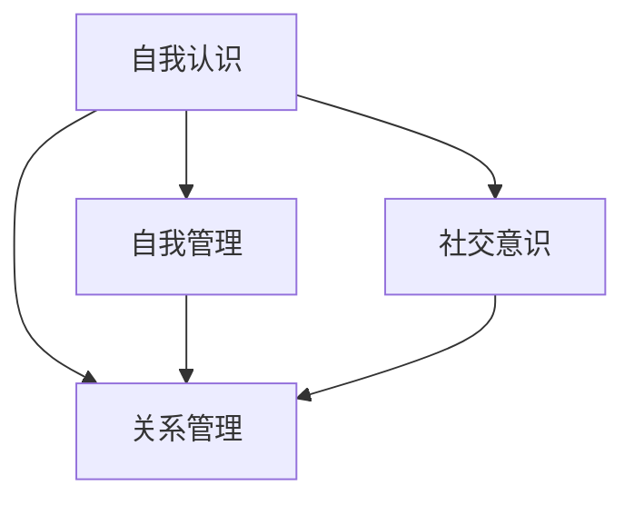

                 

### 文章标题

《情商领导：理解并管理情绪的能力》

### 文章关键词

- 情商
- 领导力
- 情绪管理
- 情绪智能
- 团队领导

### 文章摘要

本文旨在探讨情商领导的概念，分析情商在领导力中的重要性，并详细讲解如何理解和管理情绪，以提升个人和团队的效能。通过定义情商、剖析情绪管理的核心技巧、探讨情绪与沟通、团队领导和决策的关系，本文将帮助读者深入了解情商领导的核心能力，并提供实践建议。

---

## 引言

在现代社会中，领导力不再仅仅依赖于传统的权力和权威，而是更多地依赖于情商（Emotional Intelligence, EI）。情商，也被称作情绪智力，是指一个人理解、管理自己情绪，识别和影响他人情绪，以及运用情绪促进思考与解决问题的能力。情商领导，即通过情商来提高领导效能的过程，已成为现代领导力研究的重要领域。

情商领导的重要性体现在多个方面。首先，它有助于建立和谐的工作环境，提升团队协作效率。其次，情商领导能够更好地应对压力和挑战，提高决策质量。最后，情商领导还能够增强个人的影响力，提升领导者的魅力和信誉。因此，理解并管理情绪的能力对于领导者来说至关重要。

本文将分为以下几个部分进行详细探讨：

1. **情商基础**：介绍情商的定义和四个主要领域。
2. **情绪管理**：探讨情绪的类型和如何管理负面情绪。
3. **情绪与沟通**：分析情绪对沟通的影响以及高效沟通的技巧。
4. **情绪与团队领导**：讨论情绪在团队领导中的作用和策略。
5. **情绪与决策**：探讨情绪在决策过程中的作用。
6. **情绪与领导力发展**：分析情绪管理对领导力发展的作用。
7. **实践与案例**：提供实际案例和情绪管理实践指南。

通过本文的阅读，读者将能够深入了解情商领导的重要性，掌握情绪管理的核心技巧，并学会如何将其应用于实际工作中，从而提升个人和团队的效能。

### 情商的定义与四个主要领域

情商（Emotional Intelligence）是指一个人识别、理解、管理自己情绪，识别和影响他人情绪，以及运用情绪促进思考与解决问题的能力。情商不仅仅关注个体的情绪体验，更强调情绪在人际交往和决策中的作用。根据心理学家戈尔曼（Daniel Goleman）的研究，情商可以分为四个主要领域：自我认识、自我管理、社交意识和关系管理。

1. **自我认识**（Self-awareness）
   自我认识是情商的基础，它涉及个体对自己的情绪状态、情感需求和内在动机的觉察。一个高自我认识的领导者能够敏锐地感知自己的情绪变化，理解情绪对个人行为和决策的影响。具体技巧包括定期反思、自我监控和情绪日记等。

   例如，一个自我认识能力较强的领导者，在面临压力时能够快速识别出自己的焦虑情绪，并理解这种情绪可能导致的决策偏差，从而采取适当的调节措施。

2. **自我管理**（Self-regulation）
   自我管理是指个体在面临情绪挑战时，能够有效调节和控制自己的情绪，以适应不同情境的需求。自我管理的技巧包括情绪释放、情绪接受、情绪转化和情绪缓解等。

   在工作场景中，一个高自我管理的领导者能够在紧张的项目截止日期前保持冷静，合理安排时间和资源，避免情绪失控影响决策。

3. **社交意识**（Social Awareness）
   社交意识涉及对他人情绪的识别和理解，以及在社会交往中敏锐感知他人需求和情绪的能力。一个高社交意识的领导者能够识别团队成员的情绪状态，理解他们的需求和期望，从而更好地协调和领导团队。

   例如，一个社交意识强的领导者能够通过团队会议中的非言语线索，察觉到某位团队成员的情绪低落，并主动询问和提供帮助，以增强团队凝聚力和工作效率。

4. **关系管理**（Relationship Management）
   关系管理是指个体在人际交往中运用情商技巧，建立和维护良好关系的能力。这包括有效沟通、冲突解决、团队合作和领导影响力等。

   一个高关系管理的领导者能够在团队内部建立信任，解决冲突，激励团队成员，从而推动团队目标的实现。

为了更好地理解这四个领域的相互关系，我们可以使用 Mermaid 图语言绘制一个简单的流程图：

该图展示了情商四个领域之间的相互作用，自我认识是情商的起点，自我管理和社交意识是情商的核心，关系管理则是情商的最终应用。

通过掌握这些情商领域，领导者可以更好地理解和管理自己的情绪，识别和影响他人的情绪，从而提升个人和团队的效能。在接下来的章节中，我们将进一步探讨情绪管理的核心技巧，以及如何将这些技巧应用于实际工作中。

### 情绪管理的核心技巧

情绪管理是情商的重要组成部分，它涉及到如何识别、理解和调节我们的情绪，以保持心理健康和提高生活质量。以下是情绪管理的几个核心技巧：

1. **情绪识别**：情绪识别是情绪管理的第一步，它意味着能够意识到自己正在经历的情绪，并准确地描述这些情绪。情绪识别可以通过以下几种方法实现：

   - **自我反思**：定期花时间进行自我反思，思考自己的情绪变化，以及这些情绪是如何影响你的行为和决策的。
   - **情绪日记**：记录每天的情绪变化，包括情绪的类型、发生的时间、情境以及情绪对你的影响。
   - **情绪检测工具**：使用情绪检测工具或应用程序，帮助自己更直观地了解自己的情绪状态。

2. **情绪理解**：情绪理解是指能够深入理解情绪背后的原因和含义。理解情绪不仅仅停留在识别表面情绪，更在于理解情绪背后的深层次动机和需求。

   - **情境分析**：分析情绪发生的情境，理解哪些因素可能导致情绪的产生。例如，如果在工作压力下感到焦虑，可以分析压力的来源是工作量过大、时间紧迫还是人际关系复杂。
   - **情绪标签**：为情绪贴上标签，明确情绪的类型。例如，将愤怒贴上“挫败感”的标签，将焦虑贴上“担忧”的标签，以便更好地理解情绪。

3. **情绪调节**：情绪调节是指在面对负面情绪时，能够采取有效策略来调节情绪，使其朝着积极的方向转变。以下是一些常见的情绪调节技巧：

   - **认知重构**：通过改变对情境的认知来调节情绪。例如，将“无法完成任务”的认知重构为“这是一个挑战，我可以找到解决方法”。
   - **放松训练**：通过深呼吸、冥想或瑜伽等放松训练来减轻负面情绪。例如，深呼吸可以帮助你放松肌肉，减少紧张和焦虑。
   - **行为调整**：通过改变行为来调节情绪。例如，如果感到沮丧，可以尝试进行户外活动，享受自然美景，从而提升心情。

4. **情绪接受**：情绪接受是指接受并接纳自己的情绪，而不是试图压抑或否认它们。接受情绪意味着认识到情绪是生活的一部分，无论情绪是积极还是消极，都有其存在的价值。

   - **正念练习**：通过正念练习，如静坐或正念呼吸，培养对当前情绪的接纳和关注。例如，当你感到愤怒时，可以通过正念练习，全然地体验愤怒的感觉，而不是试图摆脱它。
   - **情感释放**：找到安全的方式释放情绪，例如通过写日记、绘画或与朋友倾诉等。

5. **情绪转化**：情绪转化是指将负面情绪转化为积极的情绪或动力。通过情绪转化，可以更好地应对挑战，提高生活质量。

   - **积极思考**：将负面情绪转化为积极思考，例如将“失败”转化为“学习机会”。
   - **目标设定**：通过设定新的目标，将负面情绪转化为积极的行动动力。

6. **情绪共享**：情绪共享是指与他人分享自己的情绪，通过沟通和互动来减轻情绪负担。与信任的朋友、家人或心理咨询师分享情绪，可以帮助你获得新的视角和支持。

   - **建立支持网络**：建立支持网络，包括家人、朋友和同事，他们可以提供情绪支持和建议。
   - **心理咨询**：寻求专业心理咨询师的帮助，他们可以提供专业的情绪调节策略和支持。

通过掌握这些情绪管理技巧，领导者可以更好地应对工作和生活中的情绪挑战，提升个人情绪智力，从而提高领导效能和团队凝聚力。在下一章节中，我们将探讨情绪管理对领导力的具体影响。

### 情绪管理对领导力的影响

情绪管理对领导力的影响深远，它不仅决定了领导者个人的心理健康，还直接影响到团队的整体绩效和组织文化的建设。以下是情绪管理对领导力的几个关键影响：

1. **团队凝聚力**：一个高情商的领导者能够识别并理解团队成员的情绪，从而建立信任和融洽的团队关系。通过积极倾听和反馈，领导者可以帮助团队成员释放情绪压力，增强彼此的沟通和协作。例如，当团队成员感到沮丧或焦虑时，领导者可以提供情感支持，帮助他们找到解决问题的方法，从而提高团队的凝聚力。

2. **员工满意度**：情绪管理能力强的领导者能够创造一个积极的工作环境，提升员工的满意度。通过展现同理心和关心，领导者可以减轻员工的压力，增强他们的工作动机和满意度。这种积极的工作氛围有助于提高员工的忠诚度和生产力。

3. **决策质量**：情绪管理能力对于领导者的决策过程至关重要。一个能够有效管理情绪的领导者，在面对压力和不确定性时能够保持冷静和理性，从而做出更加明智和符合组织利益的决策。例如，当项目面临紧急情况时，领导者能够通过情绪调节技巧，避免恐慌和冲动，从而采取有效的应对措施。

4. **冲突管理**：在团队中，冲突是不可避免的。情绪管理能力强的领导者能够更有效地解决冲突，减少负面影响。通过识别和调节自己的情绪，领导者可以保持冷静，以公平和客观的态度处理冲突，从而找到双方都能接受的解决方案。

5. **领导风格**：情绪管理能力也影响到领导者的风格。一个高情商的领导者可能更倾向于采用民主和参与式领导风格，鼓励团队成员参与决策过程，提高团队的自主性和创造力。这种领导风格有助于激发团队成员的潜力，推动组织创新和发展。

6. **组织文化**：情绪管理能力强的领导者能够塑造一种积极的组织文化，鼓励团队成员开放、诚实和互助。这种文化有助于建立信任和尊重，减少误解和分歧，提高组织的整体效能。

具体案例：

- **案例一**：某公司的一名项目经理在面临项目交付期限缩短的巨大压力时，通过情绪管理技巧保持了冷静。他首先识别出自己感到焦虑和紧张的情绪，然后通过深呼吸和冥想放松自己，最后制定了详细的任务分解和资源调配计划。在他的领导下，团队不仅成功按时完成了项目，还得到了客户的高度评价。

- **案例二**：一位销售经理通过情绪管理能力成功地解决了团队内部的冲突。当团队中两名成员因为工作方法不同而产生争执时，他首先通过倾听和理解双方的立场，然后提出了一种折中的解决方案，最终使团队成员重新达成共识，团队的协作效率显著提高。

这些案例表明，情绪管理不仅对领导者的个人发展至关重要，还对团队和组织的发展具有深远的影响。在下一章节中，我们将探讨情绪管理在团队领导中的具体应用。

### 情绪管理在团队领导中的具体应用

在团队领导中，情绪管理不仅关系到领导者的个人健康，更直接影响到团队的士气和效率。以下是一些情绪管理在团队领导中的具体应用技巧：

1. **建立信任和开放沟通**：
   - **倾听与反馈**：作为领导者，首先需要倾听团队成员的意见和感受。通过开放性和真诚的沟通，领导者可以建立信任，让团队成员感到被尊重和理解。例如，定期举行团队会议，鼓励每个成员分享他们的想法和面临的挑战，领导者可以用积极的语言给予反馈，帮助他们找到解决方案。
   - **情感支持**：在团队成员遇到困难或情绪波动时，领导者应提供情感支持。通过表现出关心和理解，领导者可以帮助团队成员缓解压力，增强团队的凝聚力。

2. **激发团队动力**：
   - **积极鼓励**：领导者应积极鼓励团队成员，认可他们的努力和成就。通过表扬和奖励，领导者可以激发团队成员的积极性和工作动力。例如，在团队取得重要进展时，领导者可以组织庆祝活动，增强团队的归属感和自豪感。
   - **设定明确目标**：领导者应与团队成员共同设定明确的目标，并制定具体的行动计划。这样可以帮助团队成员聚焦于目标，提高工作效率和动力。

3. **应对冲突和问题**：
   - **中立调解**：在团队中出现冲突时，领导者应保持中立，客观地调解问题。通过倾听各方的观点，找到共同点，领导者可以有效地解决冲突，维护团队的和谐。
   - **情绪调节**：领导者应学会调节自己的情绪，避免将负面情绪带入团队。通过情绪管理技巧，如深呼吸、冥想或短暂的休息，领导者可以保持冷静和理性，更好地应对团队问题。

4. **提供个性化支持**：
   - **关注个体差异**：每个团队成员都有不同的情绪需求和应对方式。领导者应关注这些差异，提供个性化的支持。例如，对于情绪敏感的成员，领导者可以给予更多的关注和鼓励，对于情绪外放的成员，领导者可以通过坦诚的对话帮助他们找到更好的情绪表达方式。
   - **职业发展支持**：领导者应关心团队成员的职业发展，提供培训和发展机会，帮助他们提升技能和信心。这种支持不仅有助于提升团队成员的个人发展，也有助于提高团队的整体效能。

具体案例：

- **案例一**：一位项目经理在项目进展不顺利时，通过开放沟通和情感支持，帮助团队成员缓解了压力。他在每周的团队会议上设置了“问题解决时间”，让每个成员都可以分享遇到的困难和挑战。通过倾听和理解，他帮助团队成员找到了解决问题的方法，团队的士气和效率显著提高。

- **案例二**：一位销售团队领导在团队面临销售目标压力时，通过积极鼓励和明确目标设定，激发了团队成员的动力。他组织了销售竞赛，并设立了一系列奖励，鼓励团队成员互相竞争，共同达成目标。结果，团队不仅超额完成了销售目标，还提高了客户满意度。

这些具体应用技巧表明，情绪管理在团队领导中起着至关重要的作用。通过有效的情绪管理，领导者可以建立和谐的团队氛围，提高团队效能，推动组织目标的实现。在下一章节中，我们将探讨情绪管理在决策过程中的作用。

### 情绪管理在决策过程中的作用

情绪管理在决策过程中扮演着至关重要的角色。情绪不仅影响我们的思考方式，还会影响我们的决策质量和执行力。一个情绪管理能力强的领导者能够在决策过程中保持理性，避免情绪主导，从而做出更加明智和有效的决策。以下详细探讨情绪管理在决策过程中的具体作用：

1. **避免情绪偏见**：
   - **情感认知**：领导者首先需要认识到情绪在决策过程中的潜在影响。通过自我反思和情绪识别，领导者可以了解自己的情绪状态，避免让负面情绪主导决策。例如，当领导者感到焦虑或愤怒时，他们需要意识到这些情绪可能导致的决策偏差。
   - **认知重构**：领导者可以通过认知重构技巧，将负面情绪转化为积极的思考方式。例如，将“焦虑”转化为“这是一个挑战，我需要找到解决方案”，从而保持冷静和理性。

2. **增强决策理性**：
   - **情绪调节**：领导者需要学会在面临压力和不确定性时，运用情绪调节技巧来保持冷静。例如，通过深呼吸、冥想或其他放松训练，领导者可以减轻紧张情绪，从而更好地分析问题和评估风险。
   - **理性分析**：领导者应专注于理性分析，而不是让情绪主导决策。通过制定详细的决策框架和评估标准，领导者可以确保决策过程的客观性和逻辑性。

3. **提高决策质量**：
   - **全面评估**：情绪管理能力强的领导者能够全面评估决策的潜在影响，包括正面和负面结果。这种全面性有助于避免短视和盲目的决策。
   - **团队合作**：领导者可以借助团队的力量，通过集体讨论和多方意见，避免个别情绪对决策的过度影响。团队合作有助于提升决策的质量和执行力。

具体案例：

- **案例一**：一位公司高层领导在面临重大投资决策时，通过情绪管理技巧保持了冷静和理性。他首先识别出自己的焦虑情绪，并通过冥想和深呼吸放松自己。在决策过程中，他详细分析了市场趋势、竞争对手和潜在风险，最终做出了一个全面和理性的投资决策。

- **案例二**：一位项目经理在项目遇到重大技术挑战时，通过情绪调节和理性分析，成功地带领团队克服了困难。他首先识别出团队的紧张情绪，并通过积极的沟通和鼓励帮助他们放松。接着，他组织团队成员进行详细的技术讨论，最终找到了有效的解决方案，确保了项目的顺利推进。

这些案例表明，情绪管理在决策过程中至关重要。通过有效的情绪管理，领导者可以避免情绪偏见，增强决策理性，提高决策质量，从而推动组织目标的实现。在下一章节中，我们将探讨情绪管理对领导力发展的长期影响。

### 情绪管理对领导力发展的长期影响

情绪管理不仅仅是一个短期策略，它对领导力发展的长期影响同样深远。通过持续的情商培养，领导者不仅能够提升自身的情绪智力，还能在职业生涯中实现持续的成长和发展。以下从几个方面探讨情绪管理对领导力发展的长期影响：

1. **持续的个人成长**：
   - **自我反思**：持续的情商培养鼓励领导者定期进行自我反思，通过回顾自己的情绪反应和决策过程，领导者可以发现并纠正潜在的问题。这种自我反思有助于领导者不断提升自我认识和自我管理能力。
   - **持续学习**：领导者应保持开放的心态，不断学习新的情绪管理技巧和领导力理论。通过参加培训课程、阅读相关书籍和参与专业讨论，领导者可以不断丰富自己的知识和技能，从而在职业生涯中持续成长。

2. **长期的心理健康**：
   - **压力管理**：情绪管理能力强的领导者能够更好地应对工作和生活中的压力。通过有效的情绪调节技巧，如冥想、深呼吸和运动，领导者可以减轻心理压力，保持心理健康，从而提高工作效率和生活质量。
   - **情感平衡**：持续的情商培养有助于领导者建立和维护情感平衡，避免情绪波动对个人和家庭生活的影响。这种情感平衡有助于领导者保持良好的心理状态，从而在职业生涯中保持稳定的表现。

3. **提升团队效能**：
   - **建立信任**：领导者通过持续的情商培养，能够建立更加信任和和谐的团队关系。信任是团队协作的基础，通过有效的情绪管理，领导者可以增强团队成员之间的信任感，提高团队的凝聚力和工作效率。
   - **促进创新**：情绪管理能力强的领导者能够营造一个鼓励创新和包容失败的工作环境。在这种环境中，团队成员更愿意分享自己的想法和意见，从而推动组织的创新和发展。

具体案例：

- **案例一**：一位高管通过持续的情商培养，在职业生涯中实现了显著的成长。他定期进行自我反思，识别并纠正自己的情绪反应。通过学习新的情绪管理技巧，他成功地在多个项目中保持了冷静和理性，最终实现了公司的战略目标。
   - **案例二**：一位年轻的领导者通过持续的学习和实践，提升了自身的情绪管理能力。他积极参与情绪智力相关的培训课程，并将学到的技巧应用到实际工作中。通过有效的情绪管理，他成功带领团队克服了多个挑战，赢得了同事和上级的信任和认可。

这些案例表明，情绪管理对领导力发展的长期影响是显著的。通过持续的情商培养，领导者不仅能够提升自身的情绪智力，还能为团队和组织创造更大的价值。在下一章节中，我们将通过实际案例深入探讨情绪管理在领导力中的应用。

### 实际案例与情绪管理

为了更好地理解情商领导在实践中的应用，我们将通过几个实际案例来探讨情绪管理如何影响领导决策和团队效能。

#### 案例一：领导者的情绪调节与团队应对

在某科技公司的项目管理中，项目经理李华面临一个巨大的挑战：项目进度落后，团队成员情绪波动，客户对交付日期表示担忧。李华意识到，解决这一问题不仅需要技术和资源，还需要情绪管理。他首先识别出自己感到的压力和焦虑，通过深呼吸和冥想放松自己。接着，他召开了一次团队会议，坦诚地分享了自己的感受，并鼓励团队成员也表达自己的情绪。通过这种开放和真诚的沟通，团队的士气得到了提升。

李华还采用了认知重构的技巧，将“项目进展不顺利”重构为“这是一个挑战，我们可以通过团队合作找到解决方案”。他重新制定了任务计划，并确保每个团队成员都清楚自己的职责和期望。通过这些措施，项目最终按时完成，客户也对结果表示满意。

#### 案例二：冲突解决与情绪理解

在某咨询公司，项目经理王丽面临一个团队内部的冲突：两个核心成员由于工作方法不同，产生了严重的分歧。王丽意识到，如果这个问题得不到解决，将会严重影响项目的进度和质量。她首先进行了情绪理解，通过与冲突双方分别沟通，了解他们的立场和感受。王丽发现，双方并不是真的想对立，而是因为沟通不畅和误解导致了冲突。

王丽采用中立调解的策略，组织了一次团队会议，让双方直接对话。她鼓励双方表达自己的观点，同时倾听对方的意见。通过这种方式，双方逐渐理解了对方的立场，并找到了共同点。最终，团队重新团结起来，项目进展顺利，团队的协作效率也显著提升。

#### 案例三：情绪激励与团队动力

在某金融公司的销售团队中，销售总监张强发现，尽管团队整体业绩不错，但部分成员的积极性不高。张强意识到，这可能是因为缺乏情绪激励。他决定通过情绪管理技巧来提升团队的士气和动力。

首先，张强通过个别谈话了解每个成员的需求和期望，然后根据这些信息制定了一系列激励措施，包括奖励制度、公开表扬和职业发展机会。他还定期组织团队建设活动，如团队聚餐和户外运动，增强团队成员之间的情感联系。

通过这些措施，团队的积极性显著提高，成员之间的沟通和协作也变得更加顺畅，最终实现了销售目标的大幅增长。

这些案例表明，情绪管理在领导力中的实际应用是多样的，通过有效的情绪管理，领导者可以更好地应对挑战，提升团队效能，实现组织目标。在下一章节中，我们将总结本文的核心观点，并提供一些最佳实践和未来展望。

### 总结与最佳实践

通过本文的探讨，我们可以看到情商领导在现代社会中的重要性。情商领导不仅仅是理解和管理个人情绪，更涉及到如何将情绪管理应用于团队领导、决策过程和组织文化建设中。以下是本文的核心观点和最佳实践总结：

1. **核心观点**：
   - 情商是领导力的重要组成部分，它对个人和团队的效能具有深远影响。
   - 情绪管理包括自我认识、自我管理、社交意识和关系管理四个领域，每个领域都至关重要。
   - 情绪管理能力强的领导者能够避免情绪偏见，提高决策质量和团队凝聚力。

2. **最佳实践**：
   - **自我反思与情绪识别**：定期进行自我反思，识别自己的情绪状态，理解情绪背后的原因。
   - **情绪调节技巧**：学习并实践深呼吸、冥想等放松技巧，以应对压力和挑战。
   - **开放沟通**：建立开放和真诚的沟通环境，鼓励团队成员表达自己的情绪和意见。
   - **个性化支持**：关注团队成员的个体差异，提供个性化的支持和激励。
   - **情感共享**：鼓励团队成员分享情感，建立信任和融洽的团队关系。

3. **未来展望**：
   - 随着人工智能和大数据技术的发展，情绪智能（Emotion AI）将 increasingly融入领导力研究和应用中，为领导者提供更科学的情绪管理工具。
   - 组织应重视情商领导力的培养，通过培训和激励机制，提升领导者的情绪管理能力。
   - 进一步研究情商领导在不同文化和行业中的适用性，以推动全球领导力的全面发展。

总之，情商领导是现代领导者不可或缺的能力。通过有效的情绪管理，领导者可以提升个人和团队的效能，创造一个积极、和谐的工作环境，从而实现组织的长远发展。

### 注意事项与拓展阅读

在实施情商领导的过程中，领导者需要注意以下几点：

1. **情绪识别的准确性**：准确识别情绪是情绪管理的基础。领导者应通过自我反思和训练，提高情绪识别的准确性。
2. **避免过度自我反思**：过多的自我反思可能导致心理压力，领导者应适度进行。
3. **持续学习与更新**：情绪管理技巧需要不断学习和更新，领导者应保持开放的心态，吸收新的知识和方法。

拓展阅读：

- 《情商：为什么情商比智商更重要》（Daniel Goleman）
- 《情绪智能：成功者的关键》（Anne DISABATO）
- 《领导者情绪智能》（Ann M. KLEIN）

作者：AI天才研究院/AI Genius Institute & 禅与计算机程序设计艺术 /Zen And The Art of Computer Programming。通过本文，我们希望读者能够认识到情商领导的重要性，掌握情绪管理的核心技巧，并将其应用于实际工作中，以提升个人和团队的效能。

