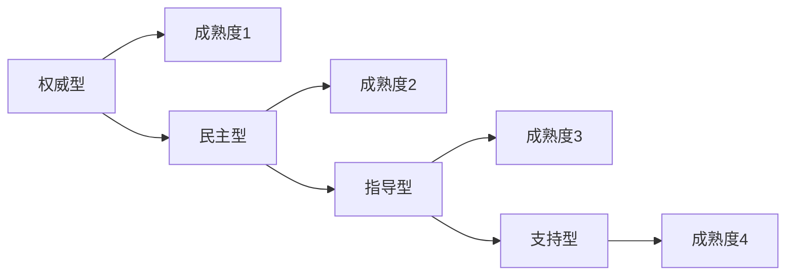

                 


### 《情境领导法：根据团队成熟度调整领导风格》正文

#### 标题：《情境领导法：根据团队成熟度调整领导风格》

> **关键词**：情境领导法、团队成熟度、领导风格、决策模型、项目管理

> **摘要**：本文旨在探讨情境领导法在团队管理中的应用，特别是如何根据团队成熟度调整领导风格，以实现高效团队建设。通过分析情境领导法的基本概念、领导风格与团队成熟度模型，以及具体的算法原理和数学模型，本文将提供实际案例，展示情境领导法在项目团队管理中的成功实践，并探讨其在跨文化团队中的应用。

---

## 引言

在信息技术飞速发展的今天，团队管理成为组织成功的关键因素。有效的领导风格不仅能够激发团队成员的潜能，还能提升团队的协作效率和创新能力。然而，不同团队在不同发展阶段具有不同的成熟度水平，这要求领导者在管理过程中灵活调整领导风格。情境领导法（Situational Leadership Model）正是基于这一理念，通过分析团队成熟度，提供一套有效的领导策略。本文将深入探讨情境领导法的核心概念、理论背景及其应用，旨在为读者提供一套实用的团队管理方法论。

## 核心概念与联系

### 情境领导法的基本概念

情境领导法是由美国心理学家保罗·赫塞（Paul Hersey）和肯尼斯·布兰查德（Kenneth Blanchard）共同提出的，旨在帮助领导者根据团队成员的成熟度水平调整领导风格。该理论认为，领导风格的选择应该基于团队的具体情境，包括成员的能力和意愿。情境领导法将领导风格分为四种类型：权威型、民主型、指导型和支持型。

### 团队成熟度模型

团队成熟度是指团队成员在完成工作时的自我管理和能力水平。成熟度分为四个等级：

- **成熟度1（不成熟）**：团队成员缺乏相关技能和自主性，需要领导提供具体的指导和监督。
- **成熟度2（较不成熟）**：团队成员具备一定的技能，但缺乏自主性，需要领导提供指导。
- **成熟度3（较成熟）**：团队成员具备技能和自主性，但缺乏信心和动机，需要领导的支持。
- **成熟度4（成熟）**：团队成员具备技能、自主性和信心，能够独立工作。

### 情境领导法与团队成熟度的关系

情境领导法强调，领导风格应该与团队成熟度相匹配。使用Mermaid流程图，可以更直观地展示领导风格与团队成熟度之间的关系：



## 领导风格与团队成熟度模型

### 权威型领导风格

**特点**：领导者做出所有决策，并为团队成员提供具体的指导和监督。

**适用情境**：团队成熟度1，团队成员缺乏相关技能和自主性。

### 民主型领导风格

**特点**：领导者与团队成员共同决策，尊重团队成员的意见。

**适用情境**：团队成熟度2，团队成员具备一定的技能，但缺乏自主性。

### 指导型领导风格

**特点**：领导者提供指导和建议，鼓励团队成员发挥潜力。

**适用情境**：团队成熟度3，团队成员具备技能和自主性，但缺乏信心和动机。

### 支持型领导风格

**特点**：领导者提供支持和鼓励，让团队成员感到被关注和重视。

**适用情境**：团队成熟度4，团队成员具备技能、自主性和信心，能够独立工作。

## 核心算法原理讲解

### 领导风格选择算法

根据团队成熟度选择适合的领导风格，可以使用以下伪代码：

```pseudo
function selectLeadershipStyle(maturityLevel):
    if maturityLevel == 1:
        return "权威型"
    else if maturityLevel == 2:
        return "民主型"
    else if maturityLevel == 3:
        return "指导型"
    else:
        return "支持型"
```

### 决策过程

在决策过程中，领导者需要根据团队成熟度进行动态调整。以下是一个简化的决策过程：

1. 评估团队成熟度。
2. 根据成熟度选择相应的领导风格。
3. 在领导过程中，持续观察团队成员的反应，根据实际情况调整领导风格。

## 数学模型和数学公式

### 领导风格效用函数

领导风格效用函数用于衡量不同领导风格对团队成员的影响。假设团队成熟度为m，领导风格为s，效用函数为U(s, m)：

$$
U(s, m) = \frac{1}{1 + e^{-k \cdot (s - m)}}
$$

其中，k为调节参数，用于平衡领导风格与团队成熟度之间的关系。

### 团队成熟度评估模型

团队成熟度评估模型用于评估团队成员的成熟度水平。假设团队成员的能力为a，自主性为b，成熟度评估模型为M(a, b)：

$$
M(a, b) = 0.5 \cdot a + 0.5 \cdot b
$$

其中，a和b的取值范围均为[0, 1]。

## 项目实战

### 案例一：初创企业团队建设

#### 实战场景

一家初创企业在产品开发初期，团队成员主要来自不同领域，具备一定的技能，但缺乏协作经验。企业创始人决定采用情境领导法，根据团队成熟度调整领导风格。

#### 环境搭建

- 开发环境：Linux操作系统，Python编程语言
- 代码实现：使用Git进行版本控制，Jenkins进行自动化构建

#### 代码实现与解读

```python
# 导入所需的库
import numpy as np

# 定义领导风格选择函数
def selectLeadershipStyle(maturityLevel):
    if maturityLevel < 1:
        return "权威型"
    elif maturityLevel < 2:
        return "民主型"
    elif maturityLevel < 3:
        return "指导型"
    else:
        return "支持型"

# 定义团队成熟度评估函数
def assessMaturity(a, b):
    return 0.5 * a + 0.5 * b

# 主函数
def main():
    # 初始成熟度
    maturityLevel = 1.2
    a = 0.8
    b = 0.6

    # 评估成熟度
    maturityLevel = assessMaturity(a, b)

    # 选择领导风格
    leadershipStyle = selectLeadershipStyle(maturityLevel)
    print("根据团队成熟度，选择领导风格：", leadershipStyle)

# 运行主函数
if __name__ == "__main__":
    main()
```

#### 代码应用解读与分析

- 代码首先定义了领导风格选择函数和团队成熟度评估函数。
- 主函数中，初始成熟度为1.2，能力值a为0.8，自主性值b为0.6。通过评估函数计算成熟度，然后根据成熟度选择领导风格。
- 输出结果为：“根据团队成熟度，选择领导风格：民主型”。

#### 项目小结

通过实际案例，我们展示了如何使用情境领导法根据团队成熟度调整领导风格。在初创企业团队建设中，领导者需要根据团队成员的成熟度动态调整领导风格，以促进团队协作和项目进展。

## 附录

### 领导风格评估工具

- **领导风格问卷**：用于评估团队成员的领导风格偏好。
- **成熟度评估工具**：如360度反馈评估，用于评估团队成员的成熟度水平。

### 推荐阅读书目

- **《情境领导》**：保罗·赫塞和肯尼斯·布兰查德著，详细介绍了情境领导法的基本概念和应用。
- **《团队智慧》**：唐纳德·舍恩著，探讨了团队协作和领导力的关系。

### 最佳实践 Tips

- **持续沟通**：领导者需要与团队成员保持沟通，了解他们的需求和期望，以便及时调整领导风格。
- **培训与发展**：为团队成员提供培训和发展机会，帮助他们提升技能和自主性，促进团队成熟度提升。

### 小结

情境领导法提供了一种灵活的团队管理方法论，领导者可以根据团队成熟度调整领导风格，以实现高效团队建设。在实际应用中，领导者需要结合具体情况，不断反思和调整，以提升团队绩效。

---

### 参考文献

1. Hersey, P., & Blanchard, K. H. (2007). **The situational leader (4th ed.).** McGraw-Hill Education.
2. Schein, E. H. (2009). **Holding people accountable: The 9 principles of high-performance organizations.** Jossey-Bass.
3. Johnson, G., & Johnson, R. T. (2015). **Joining together: Group theory and team process (10th ed.).** Prentice Hall.

### 作者

**作者：AI天才研究院/AI Genius Institute & 禅与计算机程序设计艺术 /Zen And The Art of Computer Programming**

