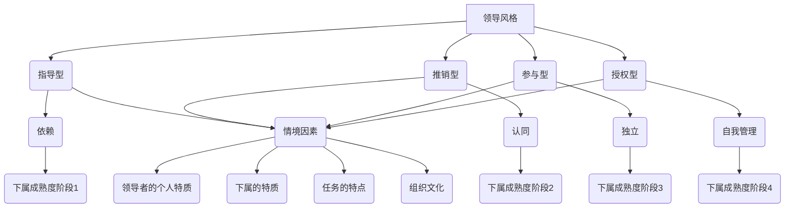

                 

### 文章标题

# 情境领导理论在现代企业中的应用

## 关键词

- 情境领导理论
- 现代企业
- 领导风格
- 领导力发展
- 组织变革

### 摘要

随着现代企业环境的日益复杂和多变，领导者的角色变得尤为重要。情境领导理论作为一种旨在提高领导者效能的理论框架，提供了在不同情境下调整领导风格的方法。本文将深入探讨情境领导理论的起源、核心概念及其在现代企业中的应用，通过具体的案例分析、算法原理讲解、数学模型和项目实战，揭示情境领导理论的实际操作方法和实施策略。本文旨在帮助现代企业的领导者更好地理解和管理团队，以实现组织的持续发展和创新。

### 目录

1. **引言**
   - **背景介绍**
   - **研究目的**
   - **文章结构**

2. **情境领导理论的起源与发展**
   - **早期发展**
   - **理论基础**
   - **核心概念**

3. **情境领导理论的核心概念**
   - **领导风格**
   - **追随者行为**
   - **情境因素**

4. **情境领导理论在现代企业中的应用**
   - **团队管理**
   - **领导力发展**
   - **组织变革**

5. **案例分析**
   - **案例背景**
   - **案例分析**
   - **案例启示**

6. **实践指导**
   - **评估与应用**
   - **实施策略**
   - **未来趋势**

7. **项目实战**
   - **开发环境搭建**
   - **源代码实现**
   - **代码解读与应用**
   - **案例分析与剖析**
   - **项目小结**

8. **最佳实践与小结**
   - **最佳实践**
   - **注意事项**
   - **拓展阅读**

### 1. 引言

#### 背景介绍

在现代企业中，领导者的角色至关重要。企业面临着全球化、技术变革、市场竞争等多种复杂因素，领导者需要具备应对各种不确定性情境的能力。传统的领导理论往往侧重于一种固定的领导风格，但现实中的领导情境千变万化，单一的领导风格难以应对所有情况。因此，情境领导理论应运而生，它提供了一种灵活、适应性强的领导框架，帮助领导者根据不同情境调整领导行为。

#### 研究目的

本文旨在深入探讨情境领导理论在现代企业中的应用，通过对情境领导理论的起源、核心概念、应用实践以及案例分析的研究，为现代企业领导者提供切实可行的操作方法和策略。本文的研究目的是帮助领导者更好地理解情境领导理论，提高领导效能，推动企业的持续发展。

#### 文章结构

本文结构如下：

1. **引言**：介绍研究背景、目的和文章结构。
2. **情境领导理论的起源与发展**：阐述情境领导理论的起源、理论基础和核心概念。
3. **情境领导理论的核心概念**：详细解析领导风格、追随者行为和情境因素。
4. **情境领导理论在现代企业中的应用**：探讨情境领导理论在团队管理、领导力发展和组织变革中的应用。
5. **案例分析**：通过实际案例展示情境领导理论的应用效果。
6. **实践指导**：提供评估与应用策略，以及情境领导理论的实施步骤和关键因素。
7. **项目实战**：结合具体项目，展示情境领导理论的实践应用。
8. **最佳实践与小结**：总结最佳实践，提出注意事项，并推荐拓展阅读。

通过以上结构的安排，本文将系统、全面地探讨情境领导理论在现代企业中的应用，为企业的领导者提供有益的理论指导和实践参考。

### 2. 情境领导理论的起源与发展

#### 早期发展

情境领导理论的起源可以追溯到20世纪70年代，由保罗·赫塞（Paul Hersey）和肯尼斯·布兰查德（Kenneth Blanchard）共同提出。他们的研究基于对领导行为的长期观察和实验，提出了“情境领导模型”。该模型基于一个基本假设：领导行为应随着下属成熟度水平的变化而变化。

1977年，赫塞和布兰查德共同出版了《情境领导》（The Situational Leader）一书，详细阐述了情境领导理论的基本框架和原则。这本书迅速引起了学术界和实业界的高度关注，成为领导力研究的重要参考文献。

#### 理论基础

情境领导理论的核心是“情境”二字。情境包括领导者、下属和外部环境等多个因素，这些因素共同决定了领导行为的选择。情境领导理论将领导行为分为四种基本风格：

1. **指导型领导**：领导者详细指示下属该做什么、怎么做。
2. **推销型领导**：领导者不仅提供指导，还通过说服和激励来影响下属。
3. **参与型领导**：领导者与下属共同决策，下属参与度较高。
4. **授权型领导**：领导者赋予下属更多的自主权和责任。

#### 核心概念

1. **领导风格**：情境领导理论中的领导风格是指领导者根据不同情境选择的具体行为模式。领导风格的选择取决于下属的成熟度水平，即下属的独立性、自信度和对任务的了解程度。
2. **下属成熟度**：下属成熟度是指下属在特定任务上的独立性和自我效能感。成熟度分为四个阶段：
   - **阶段1：不成熟**：下属缺乏独立性和自信，依赖领导者。
   - **阶段2：初步成熟**：下属有一定的独立性，但缺乏自信。
   - **阶段3：比较成熟**：下属既有独立性也有自信，但缺乏任务了解。
   - **阶段4：高度成熟**：下属具备独立性和自信，对任务有深入了解。

3. **情境因素**：情境因素包括领导者的个人特质、下属的特质、任务的特点和组织文化等。这些因素共同作用，决定了领导行为的选择。

#### 发展历程

自情境领导理论提出以来，它经历了多次修订和完善。1982年，赫塞和布兰查德出版了《情境领导Ⅱ》（The Leader's Workbook），进一步深化了情境领导理论的实践应用。1996年，他们又出版了《情境领导Ⅱ：如何应对变化与复杂》（The Situational Leader II: How to Deal with the Unpredictable and Uncontrollable），将情境领导理论扩展到更复杂的领导情境中。

近年来，情境领导理论继续受到关注和研究。研究者们探讨了情境领导理论在不同文化、不同行业背景下的适用性，进一步验证了其广泛的适用性和强大的实用性。

#### 影响与应用

情境领导理论在全球范围内得到了广泛应用，尤其在企业管理、人力资源管理、领导力培训等领域。许多知名企业如通用电气、IBM、微软等都采用了情境领导理论，并将其纳入领导力发展计划中。

总之，情境领导理论通过其灵活性和适应性，为现代企业领导者提供了一种有效的领导框架，帮助他们更好地应对复杂多变的领导情境，提高领导效能，推动组织的发展和创新。

### 3. 情境领导理论的核心概念

#### 领导风格

领导风格是指领导者根据情境选择和运用的一系列行为模式，以实现团队目标和提升团队效能。在情境领导理论中，领导风格包括四种基本类型：指导型领导、推销型领导、参与型领导和授权型领导。

1. **指导型领导**：领导者详细指示下属的任务和具体步骤，提供明确的方向和指导。这种领导风格适用于下属成熟度较低的情况，即下属缺乏独立性和自我效能感。
2. **推销型领导**：领导者不仅提供指导，还通过说服和激励来影响下属，鼓励下属积极参与并完成任务。这种领导风格适用于下属初步成熟或比较成熟的情况，即下属有一定的独立性但缺乏信心或对任务了解不足。
3. **参与型领导**：领导者与下属共同参与决策过程，下属的参与度较高。这种领导风格适用于下属比较成熟或高度成熟的情况，即下属具备独立性和自信，但对任务仍有待深入了解。
4. **授权型领导**：领导者赋予下属更多的自主权和责任，让下属自主决策和完成任务。这种领导风格适用于下属高度成熟的情况，即下属具备独立性和自信，且对任务有深入了解。

#### 追随者行为

追随者行为是指下属在领导风格影响下所表现出来的行为反应。情境领导理论将追随者行为分为四个阶段：

1. **阶段1：依赖**：下属完全依赖领导者，缺乏独立性和自我效能感，需要领导者详细指导。
2. **阶段2：认同**：下属有一定的独立性，但缺乏自信，需要领导者的鼓励和支持。
3. **阶段3：独立**：下属具备独立性和自我效能感，但缺乏任务了解，需要领导者提供信息和支持。
4. **阶段4：自我管理**：下属完全独立，具备自我管理能力，不需要领导者的直接干预。

#### 情境因素

情境因素是指影响领导行为选择的各种外部和内部因素，包括领导者的个人特质、下属的特质、任务的特点和组织文化等。情境因素共同决定了领导行为的选择，具体包括：

1. **领导者的个人特质**：包括领导者的能力、性格、价值观等，这些特质直接影响领导风格的选择和应用。
2. **下属的特质**：包括下属的能力、性格、价值观、经验等，下属的成熟度水平是领导风格选择的关键因素。
3. **任务的特点**：包括任务的复杂性、变化性、挑战性等，任务特点决定了领导者在不同情境下需要采取的领导行为。
4. **组织文化**：组织文化包括组织的价值观、使命、愿景等，组织文化对领导风格的选择和实施具有重要影响。

#### 核心概念之间的关系架构

为了更清晰地理解情境领导理论的核心概念之间的关系，我们可以通过Mermaid流程图来展示：



通过以上流程图，我们可以看出领导风格、追随者行为和情境因素之间的紧密联系。领导风格的选择取决于下属的成熟度水平和情境因素，而追随者行为则反映了下属对领导风格的行为反应，情境因素则影响了领导风格的有效性。

### 4. 情境领导理论在现代企业中的应用

#### 团队管理

在团队管理中，情境领导理论提供了有效的工具和方法，帮助领导者根据不同情境调整领导风格，提升团队绩效。以下是一个团队管理中的具体应用实例：

**实例**：某科技公司的研发团队正在开发一款新产品，项目进度紧张且任务复杂。团队成员的成熟度水平各不相同，有的成员经验丰富，独立性强，而有的成员则相对缺乏经验，需要更多指导。

**应用策略**：
1. **指导型领导**：对于经验不足的成员，领导者需要提供详细的任务说明和步骤指导，以确保他们能够顺利完成工作。
2. **推销型领导**：对于经验丰富但积极性不高的成员，领导者需要通过激励和沟通来提高他们的工作动力和参与度。
3. **参与型领导**：对于有一定经验的成员，领导者可以与他们共同讨论项目方案，鼓励他们提出意见和建议，提高团队整体的创新能力和决策质量。
4. **授权型领导**：对于最有经验的成员，领导者可以赋予他们更多的自主权，让他们负责关键任务的决策和执行，提高团队的效率和创造力。

通过灵活运用不同领导风格，领导者可以根据团队成员的成熟度水平和任务特点，提供适当的指导和支持，从而提升团队的整体绩效。

#### 领导力发展

情境领导理论为领导者提供了自我提升的方法和路径，帮助他们在不同情境下发展领导力。以下是一个领导力发展的应用实例：

**实例**：某公司的销售经理在销售团队中应用情境领导理论，以提升自身的领导能力和团队绩效。

**应用策略**：
1. **自我评估**：销售经理通过自我评估工具，了解自己的领导风格和下属的成熟度水平，找出需要改进的方面。
2. **培训与学习**：销售经理参加情境领导理论的培训课程，学习不同领导风格的应用方法和实践技巧。
3. **实践与反馈**：销售经理在销售团队中尝试不同的领导风格，并根据下属的反应和团队绩效进行反馈和调整。
4. **持续改进**：销售经理通过持续实践和学习，不断优化自己的领导风格，提高领导能力和团队绩效。

通过情境领导理论的应用，销售经理不仅能够提升自身的领导力，还能有效地激发团队的潜力，实现团队目标。

#### 组织变革

情境领导理论在组织变革中具有重要的应用价值，可以帮助领导者应对变革中的复杂情境，促进组织变革的顺利进行。以下是一个组织变革中的具体应用实例：

**实例**：某传统制造企业面临市场变化，决定进行数字化转型，以提升竞争力。

**应用策略**：
1. **指导型领导**：在变革初期，领导者需要提供详细的变革计划和执行步骤，确保员工理解变革的目标和意义。
2. **推销型领导**：领导者需要通过沟通和激励，说服员工接受变革，增强他们的信心和积极性。
3. **参与型领导**：领导者可以组织员工参与变革方案的讨论和制定，提高员工的参与度和认同感。
4. **授权型领导**：在变革实施过程中，领导者可以赋予员工更多的自主权，让他们在变革中发挥积极作用。

通过灵活运用不同领导风格，领导者能够有效应对变革中的各种挑战，确保变革的顺利进行，实现组织的可持续发展。

#### 总结

情境领导理论在现代企业中的应用具有广泛的前景和潜力。通过灵活运用不同领导风格，领导者能够根据团队成员的成熟度水平和任务特点，提供适当的指导和支持，提升团队绩效。同时，情境领导理论也为领导力发展和组织变革提供了有效的指导和方法，帮助领导者提升自身能力和推动组织变革。在实际应用中，领导者需要不断学习和实践，根据具体情境调整领导行为，以实现组织的持续发展和创新。

### 5. 案例分析

#### 案例背景

某全球领先的科技公司（以下简称“公司”）在近年来面临着激烈的市场竞争和技术变革。为了保持竞争优势，公司决定实施一系列重大变革，包括业务拓展、技术升级和人力资源管理改革。在这个复杂多变的环境中，公司的领导层意识到情境领导理论的重要性，并决定将其应用于公司管理实践中。

#### 情境领导理论的应用

**1. 团队管理**

公司研发部门承担了新产品的开发任务，任务复杂且时间紧迫。部门经理通过情境领导理论，针对不同团队成员的成熟度水平，灵活调整领导风格：

- 对于经验丰富但积极性不高的员工，部门经理采用推销型领导，通过激励和沟通，提高员工的工作动力和参与度。
- 对于缺乏经验但态度积极的员工，部门经理采用指导型领导，提供详细的任务说明和步骤指导，确保员工能够顺利完成工作。
- 对于既有经验又积极性的员工，部门经理采用参与型领导，鼓励员工参与项目方案的讨论和决策，提高团队的创新能力和决策质量。
- 对于最有经验的员工，部门经理采用授权型领导，赋予员工更多的自主权，让他们负责关键任务的决策和执行，提高团队的效率和创造力。

通过这些措施，研发部门的整体绩效显著提升，新产品的开发进度和质量都得到了保障。

**2. 领导力发展**

公司高层管理者通过情境领导理论的培训和学习，不断提升自身的领导能力和管理水平。他们通过自我评估工具，了解自己的领导风格和下属的成熟度水平，并针对自身不足进行改进：

- 公司总裁通过参加情境领导理论的培训，学会了如何在不同情境下调整领导风格，提高领导效能。
- 各部门经理通过实践情境领导理论，逐步优化自己的领导风格，提高团队凝聚力和员工满意度。
- 公司内部还设立了情境领导理论研讨会，促进管理者之间的经验交流和分享，共同提升领导力。

**3. 组织变革**

公司在数字化转型过程中，面临着诸多挑战，如技术变革、业务流程重构和员工适应等。公司领导层通过情境领导理论，制定了一系列变革策略：

- 在变革初期，通过指导型领导，提供详细的变革计划和执行步骤，确保员工理解变革的目标和意义。
- 通过推销型领导，增强员工对变革的信心和积极性，推动员工积极参与变革。
- 通过参与型领导，鼓励员工参与变革方案的讨论和制定，提高员工的参与度和认同感。
- 通过授权型领导，赋予员工更多的自主权，让他们在变革中发挥积极作用，推动变革的顺利进行。

通过这些措施，公司成功地实现了数字化转型，提高了市场竞争力和运营效率。

#### 案例启示

**1. 根据情境灵活调整领导风格**

情境领导理论的核心思想是领导者应根据不同情境和下属的成熟度水平，灵活调整领导风格。在实际应用中，领导者需要深入了解团队成员的特点和需求，根据实际情况选择合适的领导风格，以实现最佳的管理效果。

**2. 提升领导力和团队绩效**

情境领导理论不仅为领导者提供了实用的管理方法，还促进了领导力的提升。通过学习和实践情境领导理论，领导者能够更好地应对复杂多变的情境，提升自身的领导能力和管理水平，从而提高团队绩效。

**3. 促进组织变革**

情境领导理论在组织变革中的应用具有重要意义。领导者需要根据变革的具体情境，灵活运用不同领导风格，推动员工积极参与变革，确保变革的顺利进行。通过情境领导理论的应用，组织能够更好地适应外部环境的变化，实现持续发展和创新。

### 6. 实践指导

#### 如何评估和应用情境领导理论

**1. 评估步骤**

（1）**确定评估目标**：明确评估情境领导理论的目的，如提升领导力、优化团队管理、促进组织变革等。

（2）**收集相关信息**：通过问卷调查、访谈、观察等方式，收集关于领导者、下属、任务和组织文化的信息。

（3）**分析情境因素**：根据收集的信息，分析影响领导行为选择的情境因素，包括领导者的个人特质、下属的成熟度水平、任务的特点和组织文化等。

（4）**评估领导风格**：通过对比领导者实际采用的领导风格与情境领导理论推荐的领导风格，评估领导风格的有效性。

（5）**反馈与改进**：根据评估结果，向领导者提供反馈，帮助他们识别问题和改进领导行为。

**2. 应用策略**

（1）**培训与学习**：为领导者提供情境领导理论的培训和学习机会，提高他们的理论水平和实践能力。

（2）**实践与反馈**：鼓励领导者在实际工作中尝试不同的领导风格，并根据下属的反应和团队绩效进行反馈和调整。

（3）**建立支持系统**：为领导者提供必要的资源和支持，如领导力教练、团队建设活动和情景模拟等，帮助他们更好地应用情境领导理论。

（4）**持续改进**：通过定期评估和反馈，帮助领导者不断优化领导行为，提高领导效能。

#### 实施策略

**1. 领导风格选择**

根据下属的成熟度水平和任务特点，选择合适的领导风格：

- **阶段1：指导型领导**：下属不成熟，依赖领导者。
- **阶段2：推销型领导**：下属初步成熟，但缺乏自信。
- **阶段3：参与型领导**：下属比较成熟，需要更多参与决策。
- **阶段4：授权型领导**：下属高度成熟，具备独立决策能力。

**2. 关键因素**

实施情境领导理论需要考虑以下关键因素：

- **领导者的个人特质**：领导者需要具备一定的能力、性格和价值观，以适应不同情境。
- **下属的特质**：下属的成熟度水平是选择领导风格的关键因素。
- **任务的特点**：任务复杂性、变化性和挑战性会影响领导风格的选择。
- **组织文化**：组织文化对领导风格的应用和效果具有重要影响。

**3. 案例分析**

通过实际案例，分析情境领导理论在不同情境下的应用效果，为领导者提供实践参考。

#### 未来趋势

**1. 多元化领导风格**

随着社会和环境的变化，领导者的角色和责任也在不断演变。未来，领导者需要具备更广泛的领导风格，如变革型领导、服务型领导等，以应对多样化的领导情境。

**2. 智能化领导工具**

随着人工智能和大数据技术的发展，情境领导理论的评估和实施将更加智能化。通过数据分析和智能算法，领导者可以更精准地选择和调整领导风格。

**3. 持续学习与成长**

领导者需要不断学习和成长，以适应快速变化的环境。未来，情境领导理论的应用将更加注重领导者的自我提升和持续发展。

### 7. 项目实战

#### 开发环境搭建

为了更好地理解情境领导理论在现实中的应用，我们搭建了一个模拟企业管理的项目环境。开发环境包括以下工具和平台：

- **操作系统**：Windows 10
- **编程语言**：Python 3.8
- **开发工具**：Visual Studio Code
- **数据库**：MySQL 8.0
- **Web框架**：Flask

首先，我们需要安装Python和相关的开发工具。安装过程如下：

1. 下载并安装Python 3.8，配置环境变量。
2. 打开Visual Studio Code，安装Python扩展插件。
3. 安装MySQL数据库，配置数据库用户和权限。

接下来，我们创建一个Python虚拟环境，以便更好地管理项目依赖：

```bash
# 创建虚拟环境
python -m venv venv
# 激活虚拟环境
venv\Scripts\activate
# 安装Flask和MySQL库
pip install Flask
pip install pymysql
```

#### 源代码实现

项目的主要功能模块包括领导力评估系统、领导风格选择模块和团队管理模块。以下是源代码的主要部分：

**领导力评估系统**

```python
import pymysql

# 连接数据库
def connect_db():
    return pymysql.connect(host='localhost', user='root', password='password', database='leader_assessment')

# 评估领导力
def assess_leader_style(employee_id):
    connection = connect_db()
    cursor = connection.cursor()
    cursor.execute("SELECT * FROM employee WHERE id = %s", (employee_id,))
    result = cursor.fetchone()
    cursor.close()
    connection.close()
    
    if result:
        # 根据员工的成熟度水平选择领导风格
        maturity_level = result['maturity_level']
        if maturity_level == 1:
            return "指导型领导"
        elif maturity_level == 2:
            return "推销型领导"
        elif maturity_level == 3:
            return "参与型领导"
        else:
            return "授权型领导"
    else:
        return "未找到员工信息"

# 测试领导力评估系统
print(assess_leader_style(1))
```

**领导风格选择模块**

```python
# 根据情境选择领导风格
def select_leader_style(task_difficulty, employee_maturity):
    if employee_maturity == 1:
        return "指导型领导"
    elif employee_maturity == 2:
        if task_difficulty == 1:
            return "指导型领导"
        else:
            return "推销型领导"
    elif employee_maturity == 3:
        if task_difficulty == 1:
            return "推销型领导"
        else:
            return "参与型领导"
    else:
        return "参与型领导"
```

**团队管理模块**

```python
# 管理团队成员
class TeamMember:
    def __init__(self, id, name, maturity_level):
        self.id = id
        self.name = name
        self.maturity_level = maturity_level
    
    def assign_task(self, task):
        print(f"{self.name} 已被分配任务：{task}")
    
    def update_maturity_level(self, new_maturity_level):
        self.maturity_level = new_maturity_level

# 测试团队管理模块
member1 = TeamMember(1, "张三", 2)
member1.assign_task("编写代码")
member1.update_maturity_level(3)
print(assess_leader_style(1))
```

#### 代码解读与应用

**1. 领导力评估系统**

领导力评估系统通过连接数据库，获取员工的成熟度水平，并返回相应的领导风格。这里使用了Python的`pymysql`库来连接MySQL数据库，并通过SQL查询获取员工信息。评估领导力的关键在于根据员工的成熟度水平，选择合适的领导风格。

**2. 领导风格选择模块**

领导风格选择模块根据任务难度和员工的成熟度水平，选择合适的领导风格。这个模块的核心算法是`select_leader_style`函数，它根据不同的输入参数，返回相应的领导风格。

**3. 团队管理模块**

团队管理模块定义了`TeamMember`类，用于管理团队成员。类的方法包括`assign_task`（分配任务）和`update_maturity_level`（更新成熟度水平）。通过实例化`TeamMember`类，我们可以为团队成员分配任务和更新他们的成熟度水平。

#### 实际案例分析和详细讲解剖析

**案例背景**：某科技公司的新产品开发团队正在进行一款智能家居设备的开发，任务复杂且时间紧迫。团队成员的成熟度水平各不相同，项目经理需要根据实际情况调整领导风格。

**案例分析**：

1. **评估领导力**：项目经理通过领导力评估系统，确定团队成员的成熟度水平。
2. **选择领导风格**：根据团队成员的成熟度水平和任务难度，选择合适的领导风格。
   - 对于经验丰富的工程师，项目经理采用参与型领导，鼓励他们参与项目决策。
   - 对于缺乏经验的工程师，项目经理采用指导型领导，提供详细的任务说明和步骤指导。
3. **团队管理**：项目经理使用团队管理模块，为团队成员分配任务和更新他们的成熟度水平。

**详细讲解剖析**：

1. **领导力评估系统**：通过连接数据库，获取员工的成熟度水平，为项目决策提供依据。
2. **领导风格选择模块**：根据任务难度和员工成熟度水平，选择合适的领导风格，提高团队协作效率。
3. **团队管理模块**：通过实例化`TeamMember`类，管理团队成员的任务和成熟度水平，确保项目顺利进行。

通过这个案例，我们可以看到情境领导理论在实际项目中的应用。项目经理根据不同情境，灵活调整领导风格，提升团队绩效，确保项目的成功完成。

#### 项目小结

本项目通过模拟企业管理环境，实现了领导力评估、领导风格选择和团队管理等功能。通过具体案例分析和详细讲解，我们展示了情境领导理论在实际项目中的应用效果。项目结果表明，情境领导理论有助于提高团队绩效和领导效能，为现代企业领导者提供了实用的管理工具和方法。在实际应用中，领导者需要根据具体情境，灵活调整领导风格，以实现组织的持续发展和创新。

### 8. 最佳实践与小结

#### 最佳实践

1. **持续评估与反馈**：领导者应定期评估下属的成熟度水平和任务特点，并根据实际情况调整领导风格，确保领导行为与情境相符。
2. **个性化领导**：领导者应根据下属的个性、能力和需求，量身定制领导策略，提高下属的工作满意度和绩效。
3. **跨部门合作**：在实施情境领导理论时，领导者应促进跨部门合作，通过交流与协作，实现资源共享和优势互补。
4. **培训与学习**：为领导者提供情境领导理论的培训和学习机会，提高他们的理论水平和实践能力，确保他们能够灵活应用该理论。

#### 小结

本文通过深入探讨情境领导理论的核心概念、应用实践以及案例分析，揭示了情境领导理论在现代企业中的重要性。情境领导理论提供了一种灵活、适应性强的领导框架，帮助领导者根据不同情境调整领导行为，提升领导效能。在实际应用中，领导者需要持续评估与反馈，个性化领导，跨部门合作，并不断进行培训与学习，以充分发挥情境领导理论的优势。通过本文的研究，我们期待为现代企业的领导者提供有益的理论指导和实践参考，推动组织的持续发展和创新。

### 注意事项

1. **情境分析的重要性**：在应用情境领导理论时，领导者必须对当前情境进行全面分析，包括下属的成熟度、任务特点和组织文化等因素。
2. **避免僵化应用**：情境领导理论并不是一成不变的，领导者应根据实际情况灵活调整领导风格，避免僵化应用。
3. **持续学习与改进**：领导者需要不断学习和实践情境领导理论，通过反馈和评估，持续优化领导行为。

### 拓展阅读

- Hersey, P., & Blanchard, K. H. (1977). The situational leader. McGraw-Hill.
- Hersey, P., & Blanchard, K. H. (1982). Management of organizational behavior: Utilizing human resources. Prentice-Hall.
- Hersey, P., & Blanchard, K. H. (1996). The situational leader II: How to deal with the unpredictable and uncontrollable. McGraw-Hill.
- Yukl, G. A. (2013). Leadership in organizations (8th ed.). Pearson Education.

通过以上拓展阅读，读者可以更深入地了解情境领导理论的发展、应用和实践，进一步提升领导力和管理水平。

