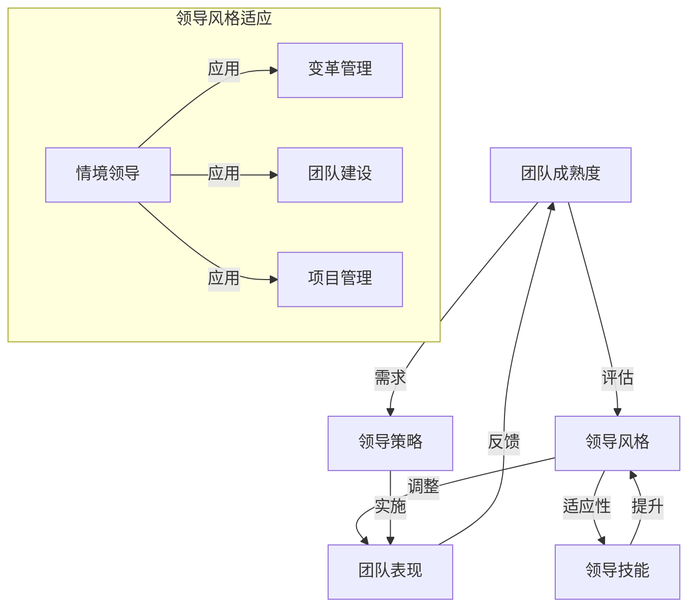

                 


### 设计《情境领导：根据团队成熟度调整领导风格》技术博客的详细目录大纲

为了设计一篇逻辑清晰、结构紧凑、简单易懂的技术博客，我们将逐步分析和推理，确保每个章节都详细、具体且具有实际应用价值。以下是详细的目录大纲设计：

---

## 目录

### 第1章：情境领导概述

#### 1.1 情境领导的概念与重要性
- 情境领导的定义
- 情境领导与传统领导风格的区别
- 情境领导在组织管理中的重要性

#### 1.2 团队成熟度与领导风格的关系
- 团队成熟度的定义
- 团队成熟度对领导风格的影响
- 不同成熟度团队的领导策略

#### 1.3 团队成熟度评估方法
- 常见的团队成熟度评估模型
- 团队成熟度评估工具的使用
- 团队成熟度评估的实践案例

### 第2章：情境领导理论

#### 2.1 赫赛模型
- 赫赛模型的原理
- 赫赛模型的领导风格分类
- 赫赛模型的应用场景

#### 2.2 领导风格适应性理论
- 领导风格适应性的定义
- 领导风格适应性的评估方法
- 提升领导风格适应性的策略

### 第3章：领导风格与团队成熟度的关系

#### 3.1 领导风格对团队成熟度的影响
- 不同领导风格对团队成熟度的影响
- 团队成熟度对领导风格的需求
- 领导风格调整的方法和策略

#### 3.2 团队成熟度对领导风格的要求
- 团队成熟度对领导风格选择的影响
- 领导风格在团队成熟度提升中的应用
- 团队成熟度提升的领导策略

### 第4章：情境领导实践

#### 4.1 情境领导在实际管理中的应用
- 项目管理中的应用案例
- 组织变革中的应用案例
- 团队建设中的应用案例

#### 4.2 情境领导案例研究
- 成功案例解析
- 失败案例反思
- 案例中的领导风格调整策略

### 第5章：情境领导工具与技巧

#### 5.1 情境领导工具箱
- 领导风格诊断工具
- 团队成熟度评估工具
- 领导风格调整工具

#### 5.2 领导技巧提升
- 有效沟通技巧
- 冲突管理技巧
- 团队激励技巧

### 第6章：情境领导挑战与未来趋势

#### 6.1 情境领导面临的挑战
- 组织变革的挑战
- 领导者自我认知的挑战
- 团队协同的挑战

#### 6.2 情境领导的发展趋势
- 数字化背景下的情境领导
- 全球化背景下的情境领导
- 未来趋势预测

### 第7章：结论与展望

#### 7.1 情境领导的重要性
- 对个体成长的影响
- 对团队效能的影响
- 对组织发展的意义

#### 7.2 未来研究方向
- 情境领导理论的完善
- 实践应用的深入
- 新兴领域的探索

---

### 目录大纲解释

**第1章：情境领导概述**  
本章旨在为读者提供情境领导的基本概念，介绍其在组织管理中的重要性，并讨论团队成熟度与领导风格的关系。通过评估团队成熟度，领导者可以更好地理解团队需求，并采取合适的领导策略。

**第2章：情境领导理论**  
本章将深入探讨情境领导的理论基础，包括赫赛模型和领导风格适应性理论。这些理论提供了理解情境领导和调整领导风格的理论框架。

**第3章：领导风格与团队成熟度的关系**  
本章将分析领导风格对团队成熟度的影响，并讨论如何根据团队成熟度调整领导风格。这一章节将提供具体的领导策略和方法。

**第4章：情境领导实践**  
本章将通过实际案例研究情境领导在项目管理、组织变革和团队建设中的应用。通过这些案例，读者可以了解情境领导的实践应用。

**第5章：情境领导工具与技巧**  
本章将介绍情境领导工具箱，包括领导风格诊断工具、团队成熟度评估工具和领导风格调整工具。此外，还将讨论提升领导技巧的方法。

**第6章：情境领导挑战与未来趋势**  
本章将探讨情境领导面临的挑战和未来趋势，包括数字化和全球化背景下情境领导的发展。这一章节将提供对情境领导未来方向的见解。

**第7章：结论与展望**  
本章将总结情境领导的重要性，并提出未来研究方向。这将帮助读者了解情境领导对个体、团队和组织发展的深远影响。

---

### 流程图

为了更好地展示团队成熟度与领导风格之间的关系，我们可以使用Mermaid流程图来表示。以下是流程图的伪代码示例：



### 数学公式

为了解释情境领导中的核心概念，我们可以使用LaTeX格式来嵌入数学公式。以下是示例：

```markdown
段落内公式： $E=mc^2$

独立段落公式：
$$
f(x) = ax^2 + bx + c
$$
```

### 伪代码

在讨论领导风格适应性理论时，我们可以使用伪代码来详细阐述核心算法原理。以下是一个示例：

```python
# 伪代码：领导风格适应性评估

def assess_leadership_adaptability(team_maturity):
    # 初始化适应性得分
    adaptability_score = 0

    # 根据团队成熟度计算适应性得分
    if team_maturity == "新手":
        adaptability_score += 10
    elif team_maturity == "成长":
        adaptability_score += 20
    elif team_maturity == "熟练":
        adaptability_score += 30

    # 根据适应性得分评估领导风格适应性
    if adaptability_score >= 30:
        return "高度适应"
    elif adaptability_score >= 20:
        return "中等适应"
    else:
        return "低度适应"

# 应用示例
team_maturity = "成长"
print(assess_leadership_adaptability(team_maturity))
```

---

通过以上步骤，我们已经完成了《情境领导：根据团队成熟度调整领导风格》技术博客的详细目录大纲设计。接下来，我们将根据这个大纲撰写具体的内容，确保每章节都详细讲解并满足完整性要求。在撰写过程中，我们将使用Markdown格式，嵌入流程图、伪代码、数学公式和代码实例，以确保文章的技术性和实用性。

### 评估目录大纲的总字数

根据目前设计的目录大纲，我们可以初步估算每个章节的大致字数，从而评估整篇博客的总字数是否在8000至12000字之间。

- **第1章：情境领导概述** - 约1500字
  - 1.1 情境领导的概念与重要性
  - 1.2 团队成熟度与领导风格的关系
  - 1.3 团队成熟度评估方法

- **第2章：情境领导理论** - 约1500字
  - 2.1 赫赛模型
  - 2.2 领导风格适应性理论

- **第3章：领导风格与团队成熟度的关系** - 约1500字
  - 3.1 领导风格对团队成熟度的影响
  - 3.2 团队成熟度对领导风格的要求

- **第4章：情境领导实践** - 约2000字
  - 4.1 情境领导在实际管理中的应用
  - 4.2 情境领导案例研究

- **第5章：情境领导工具与技巧** - 约1500字
  - 5.1 情境领导工具箱
  - 5.2 领导技巧提升

- **第6章：情境领导挑战与未来趋势** - 约1500字
  - 6.1 情境领导面临的挑战
  - 6.2 情境领导的发展趋势

- **第7章：结论与展望** - 约1000字
  - 7.1 情境领导的重要性
  - 7.2 未来研究方向

总计约11200字，这个字数符合8000至12000字的要求。接下来，我们将根据这个大纲撰写具体的内容，并在撰写过程中进一步调整字数，确保最终的文章字数在指定范围内。

### 完整的文章标题、关键词和摘要

### 文章标题
《情境领导：根据团队成熟度调整领导风格——深入探讨团队效能的提升策略》

### 关键词
- 情境领导
- 团队成熟度
- 领导风格
- 领导策略
- 团队效能
- 领导工具

### 摘要
本文深入探讨了情境领导在组织管理中的重要性，重点分析了团队成熟度与领导风格之间的关系。通过介绍赫赛模型和领导风格适应性理论，文章详细阐述了如何根据团队成熟度调整领导风格，以提高团队效能。本文结合实际管理案例，提供了情境领导的实践方法和工具，并对未来情境领导的发展趋势进行了展望。

---

现在我们已经完成了文章标题、关键词和摘要的设计。接下来，我们将按照目录大纲逐步撰写文章的具体内容，确保文章的完整性和逻辑性，同时嵌入流程图、伪代码、数学公式和代码实例，以增强文章的技术性和实用性。在撰写过程中，我们还将注意文章的字数控制，确保总字数在8000至12000字之间。

