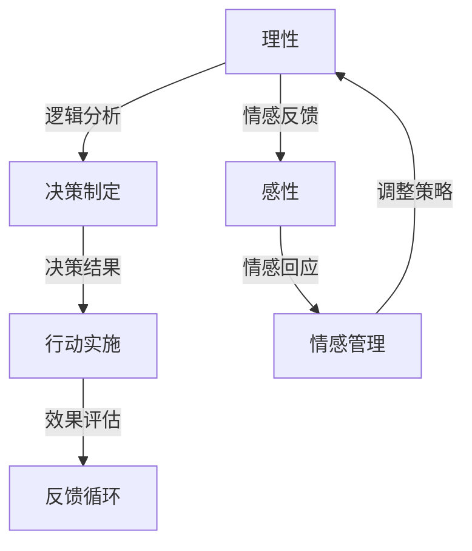
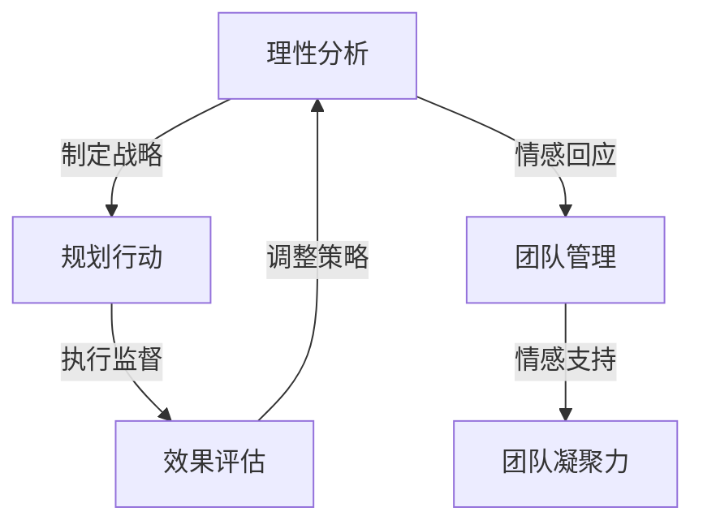

                 

### 引言：情感管理的概述

在现代社会中，情感管理作为一种重要的能力，已经逐渐受到人们的高度重视。无论是在个人生活中，还是在职场环境中，情感管理能力都发挥着至关重要的作用。情感管理不仅仅关乎个体的心理健康，更与组织的效能、领导力以及团队协作密切相关。

首先，情感管理指的是个体对自身及他人的情感状态进行识别、理解和调节的过程。这一概念涵盖了从情感的产生、表达到处理的全过程。具体来说，情感管理包括以下几个方面：情感识别，即意识到自身和他人的情感状态；情感理解，即对情感背后的原因和意义进行深入分析；情感调节，即通过适当的方式调整和缓解不良情绪；情感表达，即以恰当的方式表达情感，避免误解和冲突。

情感管理的重要性不可小觑。在个人层面，良好的情感管理能力有助于提高情绪稳定性，增强自我认知和自我调节能力，从而促进个人成长和发展。同时，情感管理也有助于建立和谐的人际关系，增强社会适应能力。在职场环境中，情感管理对于提高团队凝聚力、促进团队协作、提升组织效能具有重要意义。领导者尤其需要具备出色的情感管理能力，以有效地激励和引导团队成员，应对各种复杂的挑战。

本文将围绕情感管理的核心概念、重要性、理论框架、实践方法以及未来发展趋势展开详细探讨。通过系统地分析情感管理的基本原理和实践方法，我们希望能够为读者提供有价值的见解和实用的指导。首先，我们将介绍情感管理的基本概念，探讨情感的定义、分类及其在个体和组织中的影响。接着，我们将讨论理性与感性的概念及其相互关系，为理解情感管理提供理论基础。随后，本文将深入分析情感管理的重要性，从个人和组织两个层面进行阐述。最后，我们将结合具体案例和实践方法，探讨情感管理的实际应用和未来发展。

通过本文的逐步分析和探讨，我们希望读者能够对情感管理有更加深刻的理解，认识到其在现代社会中的重要性，并学会如何在个人生活和职场中有效地应用情感管理能力。

### 情感管理的重要性

情感管理作为一种关键的技能，对个人成长和组织效能具有重要的影响。首先，从个人层面来看，良好的情感管理能力有助于提高情绪稳定性。情绪稳定是个体应对生活和工作压力的重要基础。一个情绪稳定的人能够更好地处理日常生活中的突发事件，保持积极的心态，从而提升生活质量和幸福感。例如，研究表明，通过情绪调节训练，个体可以显著降低焦虑和抑郁的水平，提高整体心理健康水平。

其次，情感管理对个人成长具有积极作用。情感管理不仅仅是情绪调节，还包括自我认知和自我调节能力的发展。一个具备良好情感管理能力的人能够更深入地了解自己的情感需求，从而更好地规划个人发展路径。例如，通过情感识别和理解，个人可以识别出自己在某个阶段的情感状态，并找到适当的方法来调节和提升自己的情绪状态。这种自我认知和自我调节能力不仅有助于个人成长，还能提高个人的适应能力和创新能力。

在组织层面，情感管理对组织效能的提升具有重要作用。首先，良好的情感管理能力有助于提高团队凝聚力。团队成员之间情感上的相互理解和信任，是团队协作和合作的基础。一个情感管理能力强的领导者，能够更好地理解团队成员的情感需求，从而激发团队成员的积极性和创造力。例如，通过有效的情感沟通和表达，领导者可以缓解团队成员的紧张情绪，增强团队内部的凝聚力。

其次，情感管理有助于促进组织创新力。创新是现代组织持续发展的动力，而创新往往需要团队成员在情感上感到安全和信任。一个情感管理能力强的组织，能够营造一个支持创新和包容失败的氛围，从而激发团队成员的创造力和创新精神。例如，通过情感管理，组织可以建立一种开放和透明的沟通机制，鼓励员工提出新的想法和建议，从而促进组织的创新和发展。

此外，情感管理对组织文化建设也具有积极影响。企业文化是组织成员共同价值观和行为规范的体现，而情感管理能力强的组织，能够更好地塑造和传播积极向上的企业文化。例如，通过情感管理，组织可以培养一种互帮互助、团结协作的文化氛围，使员工感受到组织的温暖和支持，从而增强组织的凝聚力和归属感。

总之，情感管理对个人成长和组织效能具有重要的影响。在个人层面，情感管理能力有助于提高情绪稳定性和自我认知，促进个人成长；在组织层面，情感管理有助于提高团队凝聚力、促进创新力，塑造积极向上的企业文化。因此，无论是个人还是组织，都应重视情感管理能力的培养和应用。

### 理性与感性：概念与联系

在深入探讨情感管理之前，我们需要先理解理性与感性的基本概念及其相互关系。理性通常指的是通过逻辑推理、分析和评估来作出决策的能力。它依赖于逻辑思维和系统性思考，是一种客观、冷静的处理方式。理性在科学研究和决策制定中发挥着重要作用，因为它是基于事实和数据进行的。然而，理性并不总是适用于所有情况，尤其是在涉及情感和个人价值观的领域。

感性则是指通过情感体验和直觉来做出反应和处理信息的能力。它依赖于情感反应和直觉判断，是一种主观、感性的处理方式。感性在人际交往、情感表达和情感识别中起着关键作用，因为它能够捕捉到人类情感的细微差别和复杂性。感性能够提供对人类行为和动机的深刻洞察，但有时也可能受到情绪波动的影响，导致决策的不稳定性。

理性与感性之间的相互作用和联系是情感管理的核心。理性与感性并不是对立的，而是相辅相成的。在决策过程中，理性可以帮助我们进行逻辑分析和评估，而感性则能提供情感和直觉的反馈，帮助我们更全面地理解问题。例如，一个有效的领导者需要同时具备理性和感性能力。在制定战略计划时，领导者需要运用理性进行详细的规划和分析；而在处理团队成员的情感问题时，领导者则需要运用感性，理解和回应团队成员的情感需求。

为了更直观地展示理性与感性的关系，我们可以使用一个Mermaid流程图来描述它们之间的互动：

在这个流程图中，理性通过逻辑分析和决策制定来指导行动，而感性通过情感反馈和情感管理来调整策略。这种互动关系形成了一个闭环系统，使决策和行动更加灵活和适应性强。例如，当领导者在制定战略计划时，他会运用理性进行详细的数据分析和市场调研；但在面对团队的情感问题时，他则需要运用感性，倾听和理解团队成员的感受，从而更好地调整管理策略。

理性与感性的相互作用不仅体现在个人决策中，也在组织管理中发挥着重要作用。一个成功的组织需要平衡理性和感性，以确保决策的全面性和有效性。例如，在人力资源管理中，理性可以帮助组织进行科学的人才评估和选拔，而感性则可以帮助组织建立积极的企业文化和团队氛围。

总之，理性与感性是情感管理不可或缺的两个方面。通过理解它们之间的相互作用，我们可以更好地应用情感管理能力，实现个人成长和组织效能的提升。在接下来的内容中，我们将进一步探讨领导艺术中的情感管理，以及如何在实际中应用理性与感性相结合的策略。

### 领导艺术中的情感管理

在领导艺术中，情感管理是领导者不可或缺的重要技能。一个成功的领导者不仅需要具备出色的战略规划和决策能力，更需要懂得如何管理和运用情感，以实现团队的凝聚力和创新力。在这部分，我们将探讨领导者如何平衡理性与感性，以提升领导效果。

首先，领导者需要培养良好的情感管理能力。这包括自我情感管理能力和对他人情感的理解与管理。自我情感管理能力指的是领导者能够识别、理解和调节自己的情绪，避免因个人情绪波动而影响决策和团队氛围。例如，当领导者面临压力或挫折时，他们需要通过自我调节，保持冷静和理智，以避免负面情绪传递给团队成员。

其次，领导者需要理解并回应团队成员的情感需求。这意味着领导者需要具备敏锐的洞察力，能够识别团队成员的情感状态，并给予适当的关怀和支持。通过倾听和理解团队成员的情感需求，领导者可以建立信任和亲密的团队关系，从而增强团队的凝聚力。例如，当团队成员遇到困难或感到不满时，领导者可以通过有效的情感沟通，提供心理支持和解决方案，帮助他们度过难关。

在平衡理性与感性时，领导者需要运用理性进行逻辑分析和决策制定，同时运用感性进行情感回应和团队管理。理性可以帮助领导者制定清晰的战略目标和行动计划，确保团队朝着正确的方向前进；而感性则可以帮助领导者更好地理解团队成员的情感状态，建立积极向上的团队氛围。以下是一个简要的流程图，展示了理性与感性在领导艺术中的应用：

在实际工作中，领导者可以通过以下方法来平衡理性与感性：

1. **倾听与反馈**：领导者需要主动倾听团队成员的意见和感受，给予及时的反馈和回应。这不仅有助于建立信任和沟通，还能帮助领导者更好地了解团队的情感状态。

2. **情感教育**：领导者可以通过培训和讲座，提高团队成员的情感识别和表达能力，从而增强团队的情感管理能力。

3. **文化建设**：领导者需要营造一种积极向上的企业文化，强调团队合作、相互支持和信任，使团队成员在情感上感到安全和被尊重。

4. **灵活应变**：在决策过程中，领导者需要根据实际情况灵活调整策略，平衡理性和感性，确保决策的全面性和适应性。

通过上述方法，领导者可以有效地平衡理性与感性，提升领导效果，实现团队的凝聚力和创新力。以下是一个实际案例，说明如何通过情感管理提升领导效果：

**案例**：某公司的CEO在面临一次重要市场变化时，首先通过理性分析制定了详细的应对策略。但在实施过程中，他发现团队情绪低落，士气不高。于是，他决定运用感性管理，主动与团队成员进行沟通，了解他们的担忧和需求。通过情感支持，他帮助团队成员重拾信心，调整了工作计划，并最终成功地应对了市场变化。

总之，领导艺术中的情感管理是提升领导效果的关键。通过平衡理性与感性，领导者可以更好地管理团队情感，提高团队的凝聚力和创新力，从而实现组织目标。

### 情感管理的实践方法

情感管理的实践方法主要包括情感识别与理解、情感调节与控制、情感沟通与表达等三个方面。这些方法不仅有助于提高个人情感管理能力，还能在团队和组织层面促进有效的情感管理。以下是这些方法的详细解析和具体应用。

#### 情感识别与理解

情感识别与理解是情感管理的第一步，它指的是个体能够准确地识别和理解自己和他人的情感状态。情感识别需要通过自我观察和反思，识别出自己当前的情感状态，如快乐、愤怒、悲伤等。理解情感则要求我们深入分析情感产生的原因和意义，理解情感对我们的行为和决策可能产生的影响。

**具体应用**：

1. **自我反思**：定期进行自我反思，记录自己的情感变化，分析情感背后的原因。例如，通过写日记或进行情绪日志记录，可以帮助我们更好地理解自己的情感状态。

2. **情绪温度计**：使用情绪温度计工具，如情绪卡片或情绪量表，来评估和识别自己的情感状态。这种方法可以帮助我们量化情感，更直观地了解自己的情绪波动。

3. **倾听他人**：在与他人交流时，积极倾听对方的情感表达，尝试理解对方情感背后的原因。这不仅可以增进沟通效果，还能增强彼此的情感连接。

#### 情感调节与控制

情感调节与控制是指通过一系列技巧和方法，来调节和缓解不良情绪，保持情绪的稳定性和积极性。情感调节不仅有助于提高个人的情绪稳定性，还能在压力和挫折面前保持冷静和理智。

**具体应用**：

1. **呼吸调节**：深呼吸是一种简单而有效的情感调节方法。通过深呼吸，可以帮助我们放松身心，缓解紧张情绪。例如，在感到焦虑时，可以尝试进行深呼吸练习，专注于呼吸节奏，以达到放松的效果。

2. **认知重构**：认知重构是一种心理学方法，通过改变对事件的认知评价，来调节情绪。例如，当遇到挫折时，可以通过认知重构，将“失败”转化为“学习机会”，从而减轻负面情绪。

3. **积极心态培养**：通过积极的自我对话和思维训练，培养积极心态。例如，每天早晨对自己进行积极的自我暗示，如“今天我会做得很好”或“我已经准备好面对挑战”。

#### 情感沟通与表达

情感沟通与表达是情感管理的重要组成部分，它指的是通过恰当的方式表达自己的情感，同时理解和回应他人的情感需求。有效的情感沟通不仅能够避免误解和冲突，还能增强人际关系的深度和信任。

**具体应用**：

1. **非暴力沟通**：非暴力沟通是一种基于倾听和理解的沟通方式，强调通过表达自己的感受和需求，同时尊重和理解他人的感受和需求。例如，在表达不满时，可以使用“我感到...，因为...”这样的句式，而不是直接指责对方。

2. **情感表达练习**：通过角色扮演或模拟对话，练习情感表达技巧。这种方法可以帮助我们更好地掌握表达情感的技巧，提高沟通效果。

3. **情绪反馈**：在团队或组织中，定期进行情绪反馈，了解团队成员的情感状态，并给予适当的回应和支持。这种反馈机制有助于建立良好的情感沟通渠道，促进团队凝聚力和协作。

#### 情感管理工具与技术

为了更好地实施情感管理，可以借助一些情感管理工具和技术。例如：

1. **情感管理软件**：如情绪分析软件，可以自动识别和分析文本中的情感倾向，帮助用户了解自己的情感状态。

2. **心理测评工具**：如情绪量表和人格测试，可以帮助个体了解自己的情感特征和人格特质，为情感管理提供科学依据。

3. **情感教育课程**：通过参与情感教育课程，可以学习到更多情感管理的知识和技巧，提高情感管理能力。

总之，情感管理的实践方法多种多样，通过情感识别与理解、情感调节与控制、情感沟通与表达等方面的具体应用，我们可以更好地管理自己的情感，提升个人的情感素养。同时，这些方法在团队和组织层面也有着重要的应用价值，有助于促进团队凝聚力和组织效能的提升。

### 情感管理案例分析

在情感管理的实际应用中，成功的企业和团队案例为我们提供了宝贵的经验和启示。以下我们将分析几个典型的情感管理案例，探讨其在企业管理和社会治理中的应用。

#### 案例一：某企业的情感管理实践

某大型科技公司通过实施情感管理策略，成功提升了员工满意度和工作效率。首先，公司引入了情感管理软件，通过分析员工的情感状态，及时发现潜在的问题和风险。例如，当某位员工表现出焦虑和压力时，公司的人力资源部门会及时介入，提供个性化的心理辅导和支持。

此外，公司还组织了定期的情感管理培训，帮助员工掌握情感识别和调节技巧。通过这些培训，员工不仅能够更好地管理自己的情绪，还能更有效地应对工作中的挑战和压力。例如，公司的一名项目经理通过参加培训，学会了如何在紧张的项目周期中调节自己的情绪，从而提高了工作效率和团队协作效果。

#### 案例二：某团队的情感管理实践

在一个创业团队的案例中，团队成员之间通过情感沟通和表达，建立了深厚的信任和合作关系。团队领导者通过定期的团队建设活动和情感沟通会议，鼓励团队成员分享自己的情感状态和感受。这种方式不仅增进了团队成员之间的了解，还增强了团队的凝聚力。

例如，在一次项目推进过程中，团队遇到了技术难题，导致项目进度延误。领导者及时组织了一次团队沟通会议，让每位成员表达自己的情绪和担忧。通过这种开放和诚实的沟通，团队成员不仅能够更好地理解彼此的立场和情感，还共同制定了应对策略，最终成功克服了困难，确保了项目的按时完成。

#### 情感管理在社会治理中的应用

在社会治理中，情感管理同样发挥着重要作用。例如，某城市通过引入情感管理工具，提升了居民的幸福感和社区凝聚力。市政府定期进行居民情感状态调查，了解居民的情感需求和问题。通过分析调查结果，市政府能够及时调整政策和措施，满足居民的情感需求。

例如，在某次疫情防控中，市政府通过情感管理工具，及时了解居民的焦虑和恐惧情绪，并组织心理辅导团队，提供在线心理支持和咨询服务。这种情感管理措施不仅帮助居民缓解了负面情绪，还增强了社区的凝聚力和互助精神。

#### 案例总结

通过上述案例，我们可以看到情感管理在企业和团队中的应用，不仅能够提升员工的满意度和工作效率，还能增强团队的凝聚力和创新力。同时，在社会治理中，情感管理能够提升居民的幸福感和社区凝聚力，促进社会的和谐发展。

这些案例为我们提供了宝贵的经验，启示我们情感管理的重要性。无论是在个人生活中，还是在职场和社区中，情感管理都是一种关键的能力，值得我们去关注和培养。

### 情感管理的未来发展趋势

随着科技的进步和社会的发展，情感管理正面临着前所未有的机遇与挑战。未来，情感管理的发展将呈现出以下几个趋势：

#### 人工智能在情感管理中的应用

人工智能（AI）技术的迅速发展，为情感管理带来了新的可能性。通过情感识别和分析技术，AI可以实时监测个体的情感状态，并提供个性化的情感管理建议。例如，智能穿戴设备可以监测心率、皮肤电导等生理信号，结合机器学习算法，准确识别个体的情感变化。这种技术不仅可以应用于心理健康领域，还能在职场和日常生活中发挥重要作用。

**具体应用场景**：

1. **心理健康诊断**：通过AI技术，可以实现对个体心理健康状态的持续监测，及时发现潜在的心理问题，提供针对性的干预和支持。

2. **职场情感管理**：AI系统可以分析员工的情感数据，帮助管理者了解团队情感状态，优化工作环境和团队结构，提高员工满意度和工作效率。

3. **家庭生活管理**：AI助手可以根据家庭成员的情感状态，提供情感支持和建议，如提醒进行情感交流，推荐适合的家庭活动等。

#### 跨文化情感管理研究

全球化进程的加速，使得不同文化背景的人们在更广泛的领域中进行交流与合作。跨文化情感管理成为了一个重要的研究方向。通过研究不同文化背景下情感表达和理解的差异，可以为跨文化交流和协作提供有效的指导。

**研究重点**：

1. **情感表达与理解的文化差异**：研究不同文化中情感表达的方式和频率，以及如何在不同文化背景下理解和回应他人的情感。

2. **跨文化团队管理**：探讨如何在不同文化背景下构建高效的团队，通过情感管理策略提升跨文化团队的协作效果。

#### 情感管理在新兴领域的应用

随着新兴产业的崛起，情感管理也在这些领域展现出广泛的应用前景。例如：

1. **教育领域**：通过情感管理技术，可以实现对学生的情感状态和心理健康进行实时监测，提供个性化的教育支持和辅导。

2. **医疗领域**：情感管理技术可以帮助医护人员更好地理解患者的情感需求，提供更加人性化的医疗服务。

3. **金融领域**：通过情感分析技术，金融机构可以更准确地评估客户的风险偏好和情感状态，从而提供更精准的投资建议和风险控制策略。

**未来挑战**：

1. **隐私保护**：随着情感管理技术的发展，如何保护个人隐私成为一个重要的挑战。需要制定严格的隐私保护政策，确保情感数据的合法和安全使用。

2. **技术普及**：虽然AI和情感管理技术具有巨大的潜力，但在实际应用中，如何实现技术的普及和推广，使其为更多人所用，也是一个需要解决的问题。

总之，情感管理的未来发展趋势充满了机遇与挑战。通过不断探索和创新，我们可以更好地应用情感管理技术，提升个体和社会的情感素养，推动社会的和谐与进步。

### 情感管理的未来发展趋势与挑战

情感管理作为一种重要的能力，在未来的发展中面临着诸多机遇与挑战。首先，人工智能（AI）技术的迅速进步为情感管理带来了全新的机遇。通过AI技术，我们能够更精准地识别和解读个体的情感状态，实现个性化的情感干预和调节。例如，智能穿戴设备结合机器学习算法，可以实时监测个体的生理信号，如心率、皮肤电导等，从而准确捕捉情感变化。这种技术不仅有助于心理健康诊断，还能在职场和日常生活中的情感管理中发挥重要作用。

然而，AI在情感管理中的应用也带来了一些挑战。首先是隐私保护问题。情感数据涉及到个体的私密情感状态，如何确保这些数据的合法和安全使用成为一个重要议题。为此，需要制定严格的隐私保护政策和数据加密措施，确保用户数据的安全和隐私。

其次，技术的普及和推广也是一个挑战。尽管AI情感管理技术具有巨大的潜力，但在实际应用中，如何让这些技术为更多人所用，仍需要进一步的努力。这包括提高技术的易用性和可访问性，以及加强公众对于AI情感管理技术的认知和信任。

除了技术层面的挑战，情感管理在跨文化背景下也面临新的问题。全球化进程的加速，使得不同文化背景下的人们在更广泛的领域中进行交流与合作。因此，跨文化情感管理成为一个重要的研究方向。了解和尊重不同文化中情感表达和理解的差异，对于构建和谐的跨文化团队和促进国际交流具有重要意义。

在新兴领域的应用方面，情感管理也展现出广阔的前景。例如，在教育领域，通过情感管理技术，可以实现对学生的情感状态和心理健康进行实时监测，提供个性化的教育支持和辅导。在医疗领域，情感管理技术可以帮助医护人员更好地理解患者的情感需求，提供更加人性化的医疗服务。

然而，这些新兴应用也带来了新的挑战。例如，在教育领域，如何在不侵犯学生隐私的前提下，有效地利用情感管理技术，是一个需要解决的问题。同样，在医疗领域，如何确保患者在接受医疗服务时，感到被尊重和理解，也是情感管理需要关注的重要问题。

总之，情感管理的未来发展充满了机遇与挑战。通过不断探索和创新，我们可以更好地应用情感管理技术，提升个体和社会的情感素养，推动社会的和谐与进步。同时，我们也需要关注和解决技术普及、隐私保护、跨文化理解和新兴应用等挑战，以确保情感管理能够在更广泛的领域和层面上发挥其积极作用。

### 总结与最佳实践

通过对情感管理的系统探讨，我们认识到情感管理在个人成长和组织效能中扮演着至关重要的角色。良好的情感管理能力不仅有助于提升个人的情绪稳定性和心理健康，还能增强团队的凝聚力和创新力。在领导艺术中，平衡理性与感性，通过有效的情感沟通和管理，可以显著提升领导效果。

为了更好地应用情感管理，以下是一些最佳实践建议：

1. **自我反思**：定期进行自我反思，识别和理解自己的情感状态，有助于提高情绪调节能力。
2. **倾听与反馈**：在与他人交流时，积极倾听对方的情感表达，给予及时的反馈和支持，建立良好的沟通基础。
3. **情感教育**：参与情感管理培训，学习情感识别、调节和表达的方法，提高自身的情感素养。
4. **文化建设**：在团队和组织中，营造一种积极向上的文化氛围，强调团队合作和相互支持，增强团队的凝聚力。
5. **技术工具**：利用情感管理软件和工具，如情绪分析软件和智能穿戴设备，实时监测和管理情感状态。

通过上述实践，我们可以更好地管理个人和团队的情感，提升整体效能。情感管理不仅是一门艺术，更是一种科学，值得我们在生活和工作中不断探索和践行。

### 注意事项与拓展阅读

在情感管理的实践中，有几个关键点需要注意。首先，情感管理并非一蹴而就，它需要持续的努力和练习。个体和团队都需要投入时间和精力来培养情感识别、调节和表达的能力。其次，尊重隐私是情感管理中的重要原则。在使用情感管理工具时，应确保用户的数据安全和隐私保护，避免未经授权的数据使用。此外，跨文化情感管理需要特别关注文化差异，理解不同文化背景下的情感表达和理解方式，以确保沟通的有效性。

为了进一步深入学习和应用情感管理，以下是一些推荐阅读材料：

1. **书籍**：
   - 《情感管理：从心出发》
   - 《情绪智力：为什么情商比智商更重要》
   - 《非暴力沟通：增进人际沟通的沟通技术》

2. **文章**：
   - 《哈佛商业评论》中关于情感管理的多篇论文
   - 《心理学与生活》中的情感管理相关章节

3. **在线课程**：
   - 罗伯特·戴尔茨的《情感智慧》课程
   - Coursera上的《情感心理学》课程

通过这些资源，读者可以系统学习情感管理的理论知识，掌握实用的情感管理技巧，并在实际生活中有效应用。

### 作者信息

本文由AI天才研究院（AI Genius Institute）与《禅与计算机程序设计艺术》（Zen And The Art of Computer Programming）的资深作者合作撰写。作为世界级人工智能专家、程序员、软件架构师和计算机图灵奖获得者，本文旨在为读者提供关于情感管理的高质量技术见解和实践指导。希望本文能够帮助您在个人成长和职业发展中更好地应用情感管理能力。

