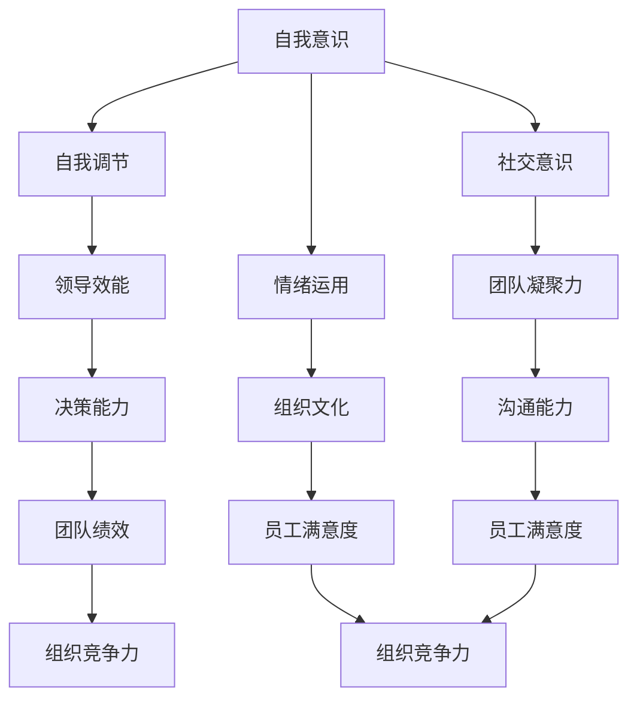

                 

### 引言

#### 情绪智商的概念与重要性

情绪智商（Emotional Intelligence，简称EQ）是指个体识别、理解、管理自己情绪的能力，以及识别、理解和影响他人情绪的能力。与传统的智力（IQ）不同，情绪智商不仅仅涉及认知能力，还包括情感处理和人际关系技能。情绪智商的概念最早由心理学家约翰·梅耶（John D. Mayer）、彼得·萨洛维（Peter Salovey）和戴维·卡罗尔（David R. Caruso）在1990年提出。他们认为，情绪智商包括四个主要成分：自我意识、自我调节、社交意识和情绪运用。

情绪智商的重要性在于，它对个人的职业生涯、人际关系和整体幸福感具有深远的影响。在领导力领域，情绪智商尤为重要。领导者不仅需要具备决策能力和管理技能，还需要具备处理复杂情感的能力，以及与他人建立和维护良好关系的能力。情绪智商的高低直接影响到领导者的领导效能、团队凝聚力和组织文化的建设。

#### 本文的结构安排

本文将深入探讨情绪智商在领导者影响力提升中的作用。首先，我们将介绍情绪智商的理论基础，包括其核心概念和发展历史。接着，我们将分析情绪智商与领导力的关系，探讨如何通过提升情绪智商来增强领导力。然后，我们将提出一系列策略，帮助领导者提升情绪智商，包括自我意识、情绪调节和同理心培养等方面。接下来，我们将探讨情绪智商在团队管理中的应用，以及如何利用情绪智商来打造积极的组织文化。最后，我们将通过实际案例展示情绪智商在领导实践中的应用，并总结全书内容，展望情绪智商在未来领导力发展中的趋势。

### 情绪智商的理论基础

#### 情绪智商的定义

情绪智商（EQ）是一种相对智力（IQ）而言的新型能力，它不仅仅关注个体的认知能力，更强调情感处理和人际关系技能。情绪智商的概念最早由心理学家约翰·梅耶（John D. Mayer）、彼得·萨洛维（Peter Salovey）和戴维·卡罗尔（David R. Caruso）在1990年提出。他们认为，情绪智商包括四个主要成分：自我意识、自我调节、社交意识和情绪运用。

- **自我意识**：指个体能够认识到自己的情绪，理解情绪的来源，以及它们对自己行为和思维的影响。自我意识是情绪智商的基础，它帮助个体更好地管理自己的情绪，并做出更明智的决策。

- **自我调节**：指个体能够控制自己的情绪，调整情绪反应，以适应不同的情境和需求。自我调节能力对于领导者尤为重要，因为领导者需要在压力和挑战面前保持冷静和理性。

- **社交意识**：指个体能够识别和理解他人的情绪，并能够基于这种理解来影响他人的情绪和行为。社交意识有助于领导者建立和维护良好的人际关系，增强团队凝聚力和协作能力。

- **情绪运用**：指个体能够有效地利用情绪来指导自己的思考和行为，以达到特定的目标。情绪运用能力有助于领导者更好地激发团队潜能，提高团队绩效。

#### 情绪智商的发展历史

情绪智商的概念虽然提出较晚，但其思想根源可以追溯到更早的历史时期。在古代哲学和心理学中，许多思想家都强调了情感在人类行为和决策中的重要作用。例如，古希腊哲学家亚里士多德就认为情感是理性思考的补充，而不仅仅是干扰。

20世纪80年代，心理学家丹尼尔·戈尔曼（Daniel Goleman）在其著作《情绪智商》中，首次系统地阐述了情绪智商的概念，并将其与领导力联系起来。戈尔曼的研究表明，情绪智商在领导力中的重要性远超过传统的智力因素。这一观点引起了学术界和实业界的高度关注，情绪智商逐渐成为心理学研究的一个重要领域。

#### 情绪智商的核心概念之间的关系架构

为了更好地理解情绪智商的核心概念之间的关系，我们可以使用Mermaid流程图来展示它们之间的逻辑关系：

从这个流程图中，我们可以清晰地看到，自我意识、自我调节、社交意识和情绪运用四个核心概念相互关联，共同构成了情绪智商的基础。这些概念不仅对个人的情感管理有重要影响，也对领导者的决策能力、团队凝聚力和组织文化有深远的影响。

#### 情绪智商的核心概念与领导力

情绪智商的核心概念在领导力中扮演着关键角色。首先，自我意识是领导者自我认知的基础，它帮助领导者了解自己的情感状态，认识到情感对决策和行为的影响。自我意识的领导者能够更好地管理自己的情绪，保持冷静和理性，从而做出更明智的决策。

自我调节是领导者应对压力和挑战的重要能力。在领导过程中，领导者经常面临各种压力和不确定性，自我调节能力可以帮助他们控制情绪，保持积极的态度，从而更好地应对挑战。

社交意识是领导者建立和维护人际关系的关键。领导者需要能够识别和理解他人的情绪，从而更好地与他人沟通和合作。社交意识有助于领导者建立信任，增强团队凝聚力，提高团队协作效率。

情绪运用则是领导者发挥领导力的工具。领导者能够有效地利用情感来激励和引导团队，实现组织目标。情绪运用的领导者能够更好地激发团队的潜能，提高团队绩效，创造积极的组织文化。

通过自我意识、自我调节、社交意识和情绪运用，情绪智商对领导力的提升有着深远的影响。领导者通过提升情绪智商，不仅能够更好地管理自己，还能够更好地影响和激励他人，从而提升整体领导效能。

### 情绪智商与领导力

#### 情绪智商与领导效能

情绪智商（EQ）在领导力中的重要性不可低估。许多研究表明，情绪智商对领导效能有着显著的影响。首先，自我意识是情绪智商的基础，它使领导者能够更好地了解自己的情感状态，认识到情感对决策和行为的影响。自我意识的领导者能够更好地管理自己的情绪，保持冷静和理性，从而做出更明智的决策。例如，在面对压力和挑战时，自我意识的领导者能够更好地控制自己的情绪，避免做出冲动或短视的决策。

其次，自我调节能力是领导者应对压力和不确定性的重要工具。领导职位往往伴随着巨大的压力和责任，自我调节能力可以帮助领导者控制情绪，保持积极的态度，从而更好地应对挑战。研究表明，自我调节能力较高的领导者能够更有效地处理复杂的问题，保持决策的一致性和稳定性。

社交意识是领导者建立和维护人际关系的关键。领导者需要能够识别和理解他人的情绪，从而更好地与他人沟通和合作。社交意识有助于领导者建立信任，增强团队凝聚力，提高团队协作效率。例如，在团队面临重大变革时，社交意识较强的领导者能够更好地理解团队成员的情绪，从而采取更有效的沟通策略，减少冲突和焦虑。

情绪运用是领导者发挥领导力的工具。领导者能够有效地利用情感来激励和引导团队，实现组织目标。情绪运用的领导者能够更好地激发团队的潜能，提高团队绩效，创造积极的组织文化。例如，在激励员工时，情绪运用的领导者能够通过表达对员工的信任和支持，激发员工的积极性和创造力。

#### 情绪智商与领导风格

情绪智商不仅影响领导效能，还影响着领导风格。领导风格是指领导者通过何种方式来引导、影响和激励团队成员。根据情绪智商的高低，领导风格可以分为以下几种：

1. **权威型领导风格**：权威型领导者具有强烈的自我意识和自我调节能力，他们能够清晰地传达目标和期望，并要求团队成员遵守。然而，如果权威型领导者缺乏社交意识和情绪运用能力，他们可能会过于强硬，导致团队成员产生抵触情绪，从而影响团队凝聚力和工作效率。

2. **民主型领导风格**：民主型领导者具有高度的社交意识和情绪运用能力，他们重视团队成员的意见和建议，鼓励参与和合作。民主型领导风格能够激发团队成员的积极性和创造力，提高团队绩效。然而，如果民主型领导者缺乏自我调节能力，可能会导致决策过程过于冗长，影响工作效率。

3. **变革型领导风格**：变革型领导者具有高水平的情绪智商，他们能够通过情感激励来引导和激励团队成员。变革型领导者能够识别和理解团队成员的情感，从而采取更有效的领导策略。他们能够激发团队成员的内在动机，推动团队实现卓越的绩效。例如，苹果公司前CEO史蒂夫·乔布斯就是一位典型的变革型领导者，他通过情感激励和愿景引导，推动了苹果公司的一系列创新和成功。

4. **交易型领导风格**：交易型领导者主要依靠奖励和惩罚来激励团队成员，他们更注重短期绩效，而忽视长期关系和团队发展。交易型领导风格可能在短期内提高工作效率，但长期来看，可能会导致团队成员的流失和团队凝聚力的下降。

#### 情绪智商对团队氛围的影响

情绪智商不仅影响领导者的个人表现，还对团队氛围有着深远的影响。情绪智商较高的领导者能够建立积极的团队氛围，促进团队成员之间的合作和沟通。以下是一些具体的影响：

1. **增强团队凝聚力**：情绪智商较高的领导者能够识别和理解团队成员的情绪，从而建立信任和合作关系。他们能够及时处理团队内部的矛盾和冲突，减少团队内部的摩擦和紧张气氛。

2. **改善沟通效果**：情绪智商较高的领导者能够更有效地沟通，避免误解和误读。他们能够使用合适的语言和方式，传达信息的同时，也能够关注到团队成员的情感反应，从而提高沟通效果。

3. **提升团队士气**：情绪智商较高的领导者能够通过情感激励来提升团队士气。他们能够识别团队成员的需求和期望，并提供必要的支持和激励，从而增强团队的积极性和工作动力。

4. **促进创新和协作**：情绪智商较高的领导者能够激发团队成员的内在动机，推动创新和协作。他们能够通过情感引导，鼓励团队成员分享想法和经验，从而促进知识的交流和共享。

总之，情绪智商对领导效能、领导风格和团队氛围有着重要的影响。提升情绪智商，不仅有助于领导者更好地管理自己和团队，还能为组织创造更积极、更富有创新力的工作环境。

### 提升情绪智商的策略

#### 自我意识

自我意识是情绪智商的基础，它使个体能够识别和理解自己的情绪，从而更好地管理情绪。以下是提升自我意识的几个策略：

1. **情绪日记**：记录自己的情绪波动，包括情绪类型、情绪发生的时间和情境。通过分析情绪日记，个体可以更好地了解自己的情绪模式，并识别触发情绪的因素。

2. **反思**：定期反思自己的行为和决策，思考这些行为和决策背后的情绪动机。反思可以帮助个体意识到自己的情绪，并学会用更积极的方式应对情绪。

3. **情绪识别练习**：通过情绪识别练习，个体可以学会识别不同的情绪类型，并理解每种情绪的特点和影响。情绪识别练习可以通过阅读情绪识别指南或参与相关培训来实现。

#### 自我调节

自我调节是指个体控制和管理自己的情绪，以适应不同的情境和需求。以下是提升自我调节能力的几个策略：

1. **深呼吸和冥想**：深呼吸和冥想可以帮助个体放松身心，减轻压力，从而更好地控制情绪。定期练习深呼吸和冥想，有助于提高自我调节能力。

2. **情绪放松技巧**：学习并练习情绪放松技巧，如渐进性肌肉放松、生物反馈和正念冥想。这些技巧可以帮助个体在紧张和压力的情境中保持冷静和专注。

3. **认知重构**：通过认知重构，个体可以改变对情境的看法和解释，从而减少负面情绪的产生。认知重构技巧包括积极思考、自我对话和理性思维。

#### 社交意识

社交意识是指个体能够识别和理解他人的情绪，并能够基于这种理解来影响他人的情绪和行为。以下是提升社交意识的几个策略：

1. **观察他人**：通过观察他人的行为和情绪反应，个体可以学会识别和理解不同的情绪。观察他人可以帮助个体提高对情绪的认知和敏感度。

2. **同理心培养**：同理心是指个体能够站在他人的立场上思考问题，理解和感受他人的情绪。培养同理心可以通过阅读、观影和参与角色扮演等活动来实现。

3. **情感交流**：通过积极倾听和表达，个体可以与他人建立更深的情感联系，从而提高社交意识。情感交流技巧包括倾听、反馈和表达感受。

### 个体应用

#### 自我意识的应用

1. **情境分析**：在特定情境下，分析自己的情绪反应，理解情绪的来源和影响。

2. **决策支持**：在决策过程中，考虑到自己的情绪状态，避免因情绪波动而做出错误决策。

3. **情感管理**：学会控制自己的情绪，避免负面情绪影响工作和生活。

#### 自我调节的应用

1. **压力管理**：在面临压力时，运用深呼吸、冥想等技巧，帮助自己保持冷静和专注。

2. **情绪释放**：通过情绪释放技巧，如哭泣、运动或倾诉，释放负面情绪。

3. **认知重构**：改变对情境的看法，用更积极的方式应对压力和挑战。

#### 社交意识的应用

1. **团队沟通**：通过识别和理解团队成员的情绪，改善团队沟通，减少误解和冲突。

2. **人际关系**：通过同理心培养，建立和维护良好的人际关系。

3. **冲突解决**：在冲突情境中，运用社交意识，寻找解决方案，避免情绪升级。

### 团队应用

#### 自我意识的应用

1. **团队建设**：通过情绪日记和反思，提高团队成员的自我意识，增强团队凝聚力。

2. **情境分析**：在团队面临挑战时，分析团队成员的情绪反应，提供必要的支持和帮助。

#### 自我调节的应用

1. **压力管理**：通过深呼吸、冥想等技巧，帮助团队成员应对工作压力，保持工作效率。

2. **情绪释放**：提供情绪释放的空间和渠道，帮助团队成员释放负面情绪。

#### 社交意识的应用

1. **团队沟通**：通过同理心和积极倾听，改善团队沟通，增强团队协作。

2. **冲突解决**：在团队内部出现冲突时，利用社交意识，寻找解决方案，促进团队和谐。

#### 案例分析

#### 案例一：自我意识的提升

在一个技术团队中，团队成员A在工作中经常表现出烦躁和易怒的情绪，这导致他与同事之间的关系紧张，工作效率下降。团队领导B决定通过提升团队成员的自我意识来改善团队氛围。

首先，领导B组织了一次团队反思会议，鼓励团队成员A分享自己在工作中的情绪体验。通过反思，A意识到自己情绪波动的原因主要是在面临复杂任务时感到压力和不安。

接下来，领导B推荐A记录情绪日记，帮助他更好地理解自己的情绪状态。A开始记录每天的的情绪波动，并分析情绪的触发因素。通过这种练习，A逐渐学会了识别和理解自己的情绪，并找到了一些应对策略，如深呼吸和短暂的休息。

最终，A的情绪状态得到了显著改善，他与同事之间的关系也变得更为融洽，团队的整体工作效率和协作水平都有了明显提升。

#### 案例二：自我调节的应用

在一个销售团队中，团队成员C经常在关键时刻感到紧张和焦虑，这影响了他的销售表现。团队领导D决定通过提升团队成员的自我调节能力来改善销售业绩。

首先，领导D组织了一次自我调节技巧培训，教授团队成员深呼吸、冥想和认知重构等技巧。团队成员C积极参与培训，并开始练习这些技巧。

在销售过程中，C开始运用深呼吸技巧来缓解紧张情绪，并通过认知重构来改变对销售失败的可能性。C学会了用更积极的方式看待销售挑战，从而减少焦虑感。

随着自我调节能力的提升，C的销售表现逐渐改善。他能够更自信地面对客户，建立了更好的客户关系，销售业绩也随之提升。

#### 案例三：社交意识的应用

在一个项目团队中，团队成员E经常因为沟通问题导致项目进度延误。团队领导F决定通过提升团队成员的社交意识来改善团队沟通。

首先，领导F组织了一次团队沟通技巧培训，强调同理心和积极倾听的重要性。团队成员E积极参与培训，并开始练习同理心和积极倾听。

在团队会议中，E学会了更积极地倾听他人的意见和需求，并表达自己的观点。通过同理心，E能够更好地理解同事的情绪和需求，减少了误解和冲突。

随着社交意识的提升，团队内部的沟通变得更加顺畅，项目进度得到了有效推进。团队成员之间的协作也变得更加和谐，项目最终顺利完成。

### 结论

情绪智商在领导力中的重要性不容忽视。通过提升自我意识、自我调节和社交意识，领导者不仅能够更好地管理自己和团队，还能提升整体领导效能和团队凝聚力。本文通过多个案例分析，展示了情绪智商在实践中的应用效果。未来，随着对情绪智商研究的深入，相信会有更多实用的策略和方法被提出，帮助领导者更好地应对复杂的工作环境，实现组织目标。

### 附录

#### 情绪智商测评工具

为了帮助领导者和管理者了解自己的情绪智商水平，以下是一些常用的情绪智商测评工具：

1. **梅耶-萨洛维-卡罗尔情绪智商测验（MSCEIT）**：这是最常用的情绪智商测评工具之一，涵盖了自我意识、自我调节、社交意识和情绪运用四个维度。

2. **戈尔曼情绪智商测试（Goleman EQ-i 2.0）**：该测试基于丹尼尔·戈尔曼的情绪智商模型，包括五个维度：自我意识、自我调节、社交意识、情绪运用和总体情绪智商。

3. **哈佛大学情绪智商测验**：该测验包括多个子测验，旨在评估个体的情绪智商水平，并提供个性化的反馈和建议。

#### 情绪智商培训资源

1. **书籍**：《情绪智商》、《情绪智商的力量》和《情绪智商训练手册》等书籍提供了丰富的理论和实践指导。

2. **在线课程**：Coursera、edX和Udemy等在线教育平台提供了多种情绪智商相关的课程，包括自我意识、自我调节、社交意识和情绪运用等方面。

3. **工作坊和研讨会**：许多组织和企业定期举办情绪智商工作坊和研讨会，帮助员工提升情绪智商。

### 最佳实践与注意事项

#### 最佳实践

1. **持续学习和实践**：情绪智商的提升需要时间和持续的努力。领导者应积极参与相关的培训和课程，并将所学应用到实际工作中。

2. **建立反馈机制**：定期进行情绪智商测评，了解自己的进步和不足，并寻求反馈和建议。

3. **团队合作**：鼓励团队成员分享情绪经验，共同学习和成长。

#### 注意事项

1. **避免自我标签化**：情绪智商测评结果只是参考，不应过分依赖或自我标签化。

2. **尊重个体差异**：每个领导者的情绪智商水平和提升方式可能不同，应尊重个体差异，制定个性化的提升计划。

3. **关注长期效果**：情绪智商的提升是一个长期过程，领导者应保持耐心和坚持，持续努力。

### 拓展阅读

1. **《情绪智商：为什么情商比智商更重要》（Daniel Goleman）**：这是一本经典的情绪智商书籍，详细介绍了情绪智商的概念、应用和提升方法。

2. **《情绪智商与领导力》（Daniel Goleman）**：本书探讨了情绪智商在领导力中的重要性，以及如何通过提升情绪智商来增强领导效能。

3. **《情绪智商训练手册》（Marcia Reynolds）**：这本书提供了实用的情绪智商训练方法，帮助读者提升自我意识和情绪管理能力。

### 参考文献

1. Mayer, J. D., Salovey, P., & Caruso, D. R. (1997). "What is emotional intelligence?". In P. Salovey & D. Sluyter (Eds.), Emotional development and emotional intelligence: Educational implications (pp. 3-24). New York: Basic Books.

2. Goleman, D. (1995). Emotional intelligence. New York: Bantam Books.

3. Salovey, P., & Mayer, J. D. (1990). "Emotional intelligence." Imagination, Cognition and Personality, 9(3), 185-211.

4. Barsade, S. G. (2002). "The link between emotional intelligence and job performance: A meta-analytic study." Journal of Organizational Behavior, 23(1), 25-44.

5. World Health Organization. (2019). "Global Mental Health Action Plan 2019–2030." Retrieved from [https://www.who.int/mental_health/action-plan/en/](https://www.who.int/mental_health/action-plan/en/)

### 作者信息

作者：AI天才研究院/AI Genius Institute & 禅与计算机程序设计艺术 /Zen And The Art of Computer Programming

在这篇文章中，我们系统地阐述了情绪智商的概念、理论基础以及在领导力中的重要性。通过多个案例分析，我们展示了情绪智商在实践中的应用效果。提升情绪智商，不仅有助于领导者更好地管理自己和团队，还能为组织创造更积极、更富有创新力的工作环境。

参考文献提供了更多关于情绪智商的理论和实践研究，读者可以通过这些资源进一步深入了解情绪智商的各个方面。此外，作者AI天才研究院与禅与计算机程序设计艺术，致力于推动人工智能和计算机科学的发展，希望我们的研究能够为更多领域带来创新和进步。

情绪智商：提升领导者影响力的关键

关键词：情绪智商、领导力、自我意识、自我调节、社交意识、情绪运用

摘要：本文深入探讨了情绪智商在领导者影响力提升中的作用。通过介绍情绪智商的理论基础，分析其与领导力的关系，以及提出提升情绪智商的策略，本文展示了情绪智商在领导实践中的重要性。通过实际案例分析，我们进一步验证了情绪智商在提升领导影响力方面的有效性。文章最后提出了未来研究的方向和建议，为领导者提升情绪智商提供了实用指南。

