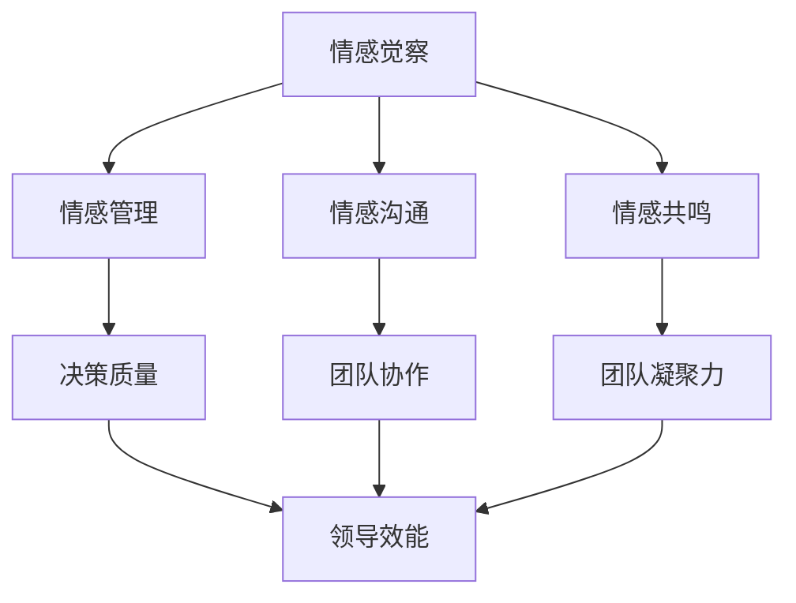

                 

### 《情绪领导力：管理自己和他人情绪的技巧》

#### 文章关键词

- 情绪领导力
- 自我情绪管理
- 他人情绪管理
- 情绪沟通
- 团队情绪管理
- 情绪释放
- 压力管理

#### 摘要

本文旨在探讨情绪领导力的重要性及其在实际应用中的关键技巧。情绪领导力不仅关乎个人情绪的自我管理，也涉及到与他人情绪的有效互动。文章将分四个部分进行详细阐述。首先，我们将介绍情绪领导力的基础概念和重要性。接着，深入探讨自我情绪管理，包括自我情绪觉察与调节、压力管理与情绪释放。随后，文章将关注他人情绪管理，探讨如何理解他人情绪、进行情绪沟通与影响力提升。最后，我们将讨论情绪领导力在团队和组织中的应用，以及如何实现持续发展。通过这些内容，我们希望读者能够掌握情绪领导力的核心技巧，提升自己在日常生活和工作中的情绪管理能力。

### 第一部分：情绪领导力基础

#### 第1章：情绪领导力的概念与重要性

**1.1 情绪领导力的定义**

情绪领导力是指领导者通过理解和管理自身及他人的情绪，以提升团队效能、实现组织目标的能力。这种领导力不仅关注理性决策，更强调情感智慧在领导实践中的重要性。情绪领导力涵盖了情绪自我管理、情感沟通、情感共鸣等多方面的技能，是现代领导者不可或缺的素质。

**1.2 情绪领导力的重要性**

在快速变化和高度竞争的商业环境中，情绪领导力显得尤为重要。以下是情绪领导力在组织和管理中的几个关键作用：

1. **提升员工满意度与忠诚度**：领导者通过有效的情绪管理，能够营造一个积极的工作氛围，增强员工的满意度和忠诚度，从而减少员工流失率。

2. **增强团队协作与创新能力**：情绪领导力有助于建立团队内部的信任和合作关系，激发团队成员的积极性和创造力，提升团队的协作效率。

3. **应对压力和危机**：领导者具备良好的情绪管理能力，能够更好地应对工作压力和危机，保持冷静和理智，做出明智的决策。

4. **塑造组织文化**：情绪领导力有助于塑造积极向上的组织文化，推动组织的长远发展。

**1.3 情绪领导力与领导效能的关系**

情绪领导力与领导效能密切相关。研究表明，具备高情绪领导力的领导者能够显著提升团队的绩效和满意度。以下是情绪领导力对领导效能的具体影响：

- **增强决策质量**：情绪领导力使领导者能够在复杂情境下做出更为理性和情感平衡的决策，提高决策质量。

- **改善人际关系**：通过有效管理自身和团队成员的情绪，领导者能够建立更加和谐的工作关系，增强团队凝聚力。

- **提升创新能力**：情绪领导力激发团队成员的创造力和创新思维，推动组织持续发展。

- **应对变化和挑战**：领导者具备良好的情绪管理能力，能够更好地应对变化和挑战，保持组织的稳定和持续发展。

综上所述，情绪领导力是现代领导者必须掌握的关键技能。通过提升情绪领导力，领导者不仅能够提升个人领导效能，还能为组织的长远发展奠定坚实的基础。

### **情绪领导力的概念与重要性**

情绪领导力，作为一种独特的领导方式，它不仅关乎领导者如何管理自己的情绪，还涉及到如何识别、理解并有效地影响他人的情绪。在当今复杂多变的社会和工作环境中，情绪领导力已经成为衡量领导力水平的重要指标。

**定义**：

情绪领导力是指领导者通过自我情绪管理和情感智慧，影响和激励团队成员，提升团队绩效和实现组织目标的能力。它包含了情感觉察、情感管理、情感沟通和情感共鸣等多方面内容。

**核心概念与联系**：

1. **情感觉察**：情感觉察是情绪领导力的基础，它要求领导者能够敏锐地识别和理解自己的情绪以及他人的情绪。这需要通过自我反思、情感日记等方法来实现。

2. **情感管理**：情感管理是指领导者如何通过调节自己的情绪，保持冷静和理智，以应对各种压力和挑战。这包括情绪调节策略，如深呼吸、正念冥想等。

3. **情感沟通**：情感沟通是领导者如何通过有效的表达和倾听，与他人建立情感连接。这需要掌握一定的沟通技巧，如非语言沟通、积极倾听等。

4. **情感共鸣**：情感共鸣是领导者如何与他人共享情感体验，建立深厚的信任关系。这需要领导者具备同理心，能够从他人的角度理解问题。

**Mermaid 流程图**：

下面是一个简化的情绪领导力概念关系图，用 Mermaid 语法表示：

**情绪领导力与领导效能的关系**：

情绪领导力对领导效能有着深远的影响。具体来说：

- **决策质量**：高水平的情绪领导力使领导者能够在复杂情境下做出更为理性和情感平衡的决策，提高决策质量。

- **团队协作**：通过情感沟通和共鸣，领导者能够建立和谐的工作关系，增强团队的协作效率。

- **团队凝聚力**：有效的情感管理能够激发团队成员的积极性和创造力，提升团队凝聚力。

- **领导效能**：情绪领导力是衡量领导效能的重要指标，具备高情绪领导力的领导者能够显著提升团队的绩效和满意度。

**实例说明**：

以某公司项目经理为例，他通过自我反思和正念冥想，提升了自己的情绪觉察和管理能力。在项目遇到困难时，他能够冷静分析问题，制定合理的解决方案。同时，他积极倾听团队成员的意见，通过情感沟通和共鸣，建立了一个高效协作的团队。最终，项目成功完成，团队绩效显著提升。

总之，情绪领导力不仅是领导者个人成长的体现，更是实现组织目标的重要工具。通过提升情绪领导力，领导者能够更好地应对挑战，推动组织的持续发展。

### **情绪领导力的基础理论**

**2.1 情绪的类型与识别**

情绪是心理学中一个重要概念，指的是个体对特定事件或情境产生的内心体验和生理反应。根据不同的分类标准，情绪可以分为多种类型。常见的情绪类型包括基本情绪和复合情绪。

- **基本情绪**：基本情绪通常包括喜、怒、哀、乐、惊等，是心理学界普遍认可的基本情绪类型。这些情绪是人类普遍具有的，是情感体验的基础。

- **复合情绪**：复合情绪是由基本情绪混合或叠加形成的，如焦虑、愤怒、悲伤、兴奋等。这些情绪更为复杂，可能包含多种基本情绪的成分。

识别情绪是情绪管理的前提。通过自我观察和情感觉察，个体可以识别和理解自己的情绪。以下是几种常见的情绪识别方法：

- **情感日记**：通过记录每日的情绪变化，个体可以逐步学会识别和理解自己的情绪。

- **情绪标签**：使用情绪标签（如“愤怒”、“焦虑”等）来描述当前的情绪状态，有助于个体更清晰地认识到自己的情感体验。

- **情绪问卷**：通过填写情绪问卷，个体可以了解自己在特定情境下的情绪反应模式，从而有针对性地进行情绪管理。

**2.2 情绪管理的基本原则**

情绪管理是情绪领导力的核心组成部分，它涉及到如何有效地调节和控制自己的情绪，以保持心理健康和高效的工作状态。以下是一些情绪管理的基本原则：

- **自我意识**：自我意识是情绪管理的基础。个体需要认识到自己的情绪，了解情绪的来源和影响。

- **情感接受**：情感接受意味着接受自己的情绪，而不是试图逃避或压抑。这有助于个体更好地理解和处理自己的情绪。

- **情绪调节**：情绪调节是指通过特定的策略和技巧，如深呼吸、正念冥想等，来控制和调整情绪状态。

- **理性思考**：在处理情绪时，个体应尝试用理性的思考方式来分析和解决问题，而不是让情绪主导行为。

- **积极应对**：面对负面情绪，个体应采取积极的应对策略，如寻求支持、改变视角等，以减少情绪的负面影响。

**2.3 情绪调节的策略**

情绪调节策略是情绪管理的关键环节，以下是一些常用的情绪调节策略：

- **认知重构**：通过改变对事件或情境的认知评价，来调节情绪。例如，将一个挑战视为成长的机会，而不是威胁。

- **情绪释放**：通过哭泣、运动、写日记等方式，释放负面情绪，减轻情绪压力。

- **正念练习**：通过正念冥想，培养对当前情绪和身体状态的觉知，从而减少情绪的负面影响。

- **自我激励**：通过设定目标和奖励，激励自己克服困难和挑战，提升情绪状态。

- **情感分享**：与信任的人分享自己的情绪，获得情感支持和理解，减轻情绪负担。

通过以上情绪管理的基本原则和策略，个体可以更好地控制和调节自己的情绪，提升情绪领导力，实现个人和团队的持续发展。

### **自我情绪管理：觉察与调节**

情绪管理是情绪领导力的核心组成部分，而自我情绪管理则是情绪领导力的基础。在这部分，我们将探讨自我情绪管理的两个关键方面：自我情绪觉察和自我情绪调节。

**3.1 自我情绪觉察**

自我情绪觉察，也称为情绪觉知，是指个体对自己的情绪状态有清晰的认识和感知。这种能力是情绪管理的前提，也是提升情绪领导力的关键。以下是几种提高自我情绪觉察的方法：

- **情感日记**：通过记录每日的情绪变化，个体可以逐步学会识别和理解自己的情绪。情感日记不仅可以帮助个体回顾和分析自己的情绪模式，还可以作为情绪管理的工具。

- **自我反思**：定期进行自我反思，思考自己的情绪反应和行为模式，有助于个体更深入地了解自己的情绪。

- **情绪标签**：使用情绪标签（如“愤怒”、“焦虑”等）来描述当前的情绪状态，有助于个体更清晰地认识到自己的情感体验。

- **情境回顾**：在情绪发生后的冷静时刻，回顾当时的情境和情绪反应，分析情绪的触发因素和影响。

**实例说明**：

张经理是一名经验丰富的项目经理，他意识到自己在项目压力下容易产生焦虑情绪。为了提高自我情绪觉察，他开始每天记录情感日记，描述自己在工作中的情绪变化和反应。通过这种做法，张经理逐渐能够更准确地识别自己的情绪，并找到情绪反应的触发因素。

**3.2 自我情绪调节**

自我情绪调节是指通过特定的策略和技巧，调节和控制自己的情绪，以保持心理健康和高效的工作状态。以下是几种自我情绪调节的方法：

- **认知重构**：认知重构是一种改变对事件或情境认知评价的方法。通过将负面情绪转化为积极情绪，个体可以更有效地应对压力。例如，将“我无法完成任务”重构为“这是一个挑战，我可以逐步解决”。

- **情绪释放**：情绪释放是通过哭泣、运动、写日记等方式，释放负面情绪，减轻情绪压力。适当的情绪释放有助于个体恢复心理平衡。

- **正念练习**：正念冥想是一种培养对当前情绪和身体状态的觉知的方法。通过正念练习，个体可以减少情绪的负面影响，提升情绪调节能力。

- **自我激励**：自我激励是通过设定目标和奖励，激励自己克服困难和挑战，提升情绪状态。例如，为完成一项任务设定小目标，并在达到目标后给予自己一些奖励。

- **情感分享**：与信任的人分享自己的情绪，获得情感支持和理解，有助于减轻情绪负担。情感分享不仅可以帮助个体释放情绪，还可以获得建设性的反馈和建议。

**实例说明**：

李经理在工作中遇到了一个复杂的挑战，感到压力巨大。为了调节情绪，他决定进行正念冥想，并邀请同事一起分享情绪。通过正念冥想，李经理逐渐平静下来，并通过与同事的交流，获得了宝贵的建议和支持。最终，李经理成功克服了挑战，提高了情绪调节能力。

总之，自我情绪管理是情绪领导力的基石。通过提高自我情绪觉察和自我情绪调节能力，个体可以更好地应对工作和生活中的情绪波动，提升情绪领导力，实现个人和团队的持续发展。

### **压力管理与情绪释放**

压力是现代社会中普遍存在的问题，对个人的身心健康产生负面影响。因此，压力管理与情绪释放变得尤为重要。在这部分，我们将探讨压力管理的策略和情绪释放的方法，帮助读者更好地应对压力，保持心理平衡。

**4.1 压力的来源与影响**

压力可以来源于多个方面，包括工作、人际关系、财务问题等。以下是几种常见的压力来源及其影响：

- **工作压力**：工作压力通常来自于工作负荷、工作竞争、工作环境等。长期的工作压力可能导致焦虑、抑郁等心理问题，影响工作效率和职业发展。

- **人际关系压力**：人际关系压力可能来源于家庭、朋友或同事。不良的人际关系可能导致情绪波动、社交孤立等问题，影响个人的心理健康和幸福感。

- **财务压力**：财务压力可能来源于债务、收入不稳定等。长期的财务压力可能导致焦虑、失眠等问题，影响个人的生活质量。

- **健康压力**：健康压力可能来源于疾病、健康问题等。健康问题不仅影响个人的生活质量，还可能导致心理压力，形成恶性循环。

**4.2 压力管理的策略**

为了有效应对压力，以下是一些常用的压力管理策略：

- **时间管理**：合理安排时间，设定优先级，避免过度工作和拖延。通过时间管理，个体可以减少工作压力，提高工作效率。

- **积极应对**：面对压力，采取积极的应对态度，如改变视角、寻求支持等。积极的应对策略可以帮助个体更好地处理压力，减少负面情绪。

- **放松训练**：通过深呼吸、冥想、瑜伽等方式，放松身心，缓解压力。放松训练有助于降低焦虑和抑郁水平，提升心理健康。

- **运动锻炼**：定期进行体育锻炼，如跑步、游泳、健身等。运动锻炼可以提高身体素质，释放压力，提升心理健康。

- **社交支持**：与亲朋好友交流，分享自己的感受和压力。社交支持可以帮助个体获得情感支持和建议，减轻压力。

**4.3 情绪释放的方法**

情绪释放是压力管理的重要组成部分。以下是一些有效的情绪释放方法：

- **哭泣**：哭泣是一种自然的情绪释放方式，可以帮助个体释放压抑的情绪，减轻心理负担。

- **运动**：通过运动，如跑步、游泳、健身等，释放身体和心理的能量，缓解压力。

- **写日记**：通过写日记，记录自己的情绪和经历，有助于个体理清思绪，释放情绪。

- **艺术创作**：通过绘画、音乐、舞蹈等方式，表达自己的情感和创造力，释放情绪。

- **正念冥想**：通过正念冥想，培养对当前情绪和身体状态的觉知，减少负面情绪的干扰。

**实例说明**：

王先生是一家公司的中层管理者，由于工作繁忙，他常常感到压力巨大。为了应对压力，他开始每天进行深呼吸练习，并参加瑜伽课程。通过这些放松训练，他的焦虑和抑郁症状显著减轻。此外，他还定期与朋友交流，分享自己的感受和压力，获得了宝贵的支持和建议。最终，王先生不仅成功缓解了压力，还提升了工作效率和生活质量。

总之，压力管理与情绪释放是维护心理健康和提升生活质量的必要手段。通过掌握压力管理和情绪释放的策略，个体可以更好地应对生活中的压力，保持心理平衡，实现持续发展。

### **理解他人情绪**

在情绪领导力的实践中，理解他人情绪是关键的一环。这不仅有助于建立和谐的团队关系，还能提升领导者的影响力。在这部分，我们将探讨如何通过情绪表达的理解、非言语情绪的识别和情绪共鸣的建立，有效地理解他人情绪。

**5.1 情绪表达的理解**

情绪表达是指个体通过言语、行为和表情等方式，传达自己的情绪状态。理解他人情绪的第一步是能够正确解读他人的情绪表达。以下是一些提高情绪表达理解能力的策略：

- **观察言语信号**：注意他人言语中的语气、语调和用词。例如，语气低沉、语调缓慢通常表示负面情绪，而语气温和、语调轻松则可能表示积极情绪。

- **关注身体语言**：身体语言，如姿势、手势和面部表情，是情绪表达的另一种形式。例如，紧握双拳、皱眉等可能表示愤怒或紧张，而轻松的姿势和微笑则可能表示放松和愉悦。

- **倾听**：积极倾听是一种重要的情绪理解技巧。通过倾听他人的言语和非言语表达，领导者可以更准确地捕捉到对方的情绪状态。

**实例说明**：

在一个团队会议中，团队成员小张在发言时声音低沉，面部表情紧张。领导者小王通过观察小张的言语信号和身体语言，意识到小张可能感到焦虑和不安。小王决定给予小张一些支持和鼓励，帮助他缓解情绪。

**5.2 非言语情绪的识别**

非言语情绪是指通过面部表情、肢体动作和语调等非言语方式传达的情绪。识别非言语情绪是理解他人情绪的重要环节。以下是一些提高非言语情绪识别能力的技巧：

- **面部表情识别**：面部表情是情绪表达的主要方式之一。通过训练，领导者可以学会识别不同情绪的面部表情，如愤怒、喜悦、悲伤等。

- **肢体语言识别**：肢体语言包括姿势、手势、眼神等。例如，紧握双拳可能表示愤怒或紧张，而打开双手可能表示放松和接受。

- **语调识别**：语调变化可以传达情绪信息。例如，语调升高可能表示兴奋或愤怒，而语调平稳可能表示平静或满意。

**实例说明**：

在一次项目汇报会上，团队成员小李在发言时声音颤抖，语调不稳定。通过观察小李的肢体语言和语调，领导者小张意识到小李可能对项目结果感到紧张和不安。小张决定在会后与小李进行一对一交流，帮助他缓解紧张情绪。

**5.3 情绪共鸣的建立**

情绪共鸣是指领导者能够与团队成员共享情绪体验，建立深厚的信任关系。建立情绪共鸣有助于提升领导者的影响力，增强团队的凝聚力。以下是一些建立情绪共鸣的方法：

- **同理心**：同理心是建立情绪共鸣的基础。领导者需要设身处地地理解团队成员的情绪和感受，以真诚的态度回应他们的情绪。

- **开放沟通**：通过开放沟通，领导者可以与团队成员分享自己的情绪和感受，建立信任和共鸣。这种沟通方式有助于团队成员更愿意分享自己的情绪和问题。

- **积极反馈**：给予团队成员积极的反馈和鼓励，帮助他们认可和接受自己的情绪。积极的反馈可以增强团队成员的情绪共鸣，提升团队的凝聚力。

**实例说明**：

在一个团队会议后，领导者小王注意到团队成员小赵显得情绪低落。小王决定在会后与小赵进行一对一交流，分享自己类似的经历和感受。通过这种真诚的交流，小王成功建立了与小赵的情绪共鸣，帮助小赵缓解了情绪压力。

总之，理解他人情绪是情绪领导力的核心技巧。通过情绪表达的理解、非言语情绪的识别和情绪共鸣的建立，领导者可以更有效地与团队成员互动，提升团队绩效和幸福感。掌握这些技巧，领导者将在情绪领导力的道路上迈出坚实的一步。

### **情绪沟通与影响力**

在情绪领导力的实践中，情绪沟通与影响力是提升领导者影响力的关键环节。通过有效的情绪沟通，领导者可以建立信任、激发团队成员的积极性，从而提升团队的绩效。以下将探讨情绪沟通的技巧、提升情绪影响力的策略以及相关案例研究。

**6.1 情绪沟通的技巧**

情绪沟通是指领导者通过言语和非言语方式，传递自己的情绪状态和情感信息的过程。有效的情绪沟通能够增强团队成员之间的情感连接，提高团队协作效率。以下是几种情绪沟通的技巧：

- **积极倾听**：积极倾听是情绪沟通的基础。领导者需要全神贯注地倾听团队成员的发言，通过点头、目光接触等方式表达关注和理解。

- **表达真诚**：在沟通中，领导者需要表达真诚的情感，避免使用虚假的赞美或批评。真诚的表达能够建立信任，增强团队成员的认同感。

- **使用非言语信号**：通过面部表情、肢体语言和语调等非言语信号，领导者可以传达自己的情绪状态和情感信息。例如，微笑和开放的姿势可以传达友好和接受的情感。

**实例说明**：

在一次项目启动会议上，领导者小李注意到团队成员小王显得有些紧张。为了缓解小王的情绪，小李决定在发言时使用微笑和开放姿势，并通过积极倾听小王的意见，表达对他的尊重和理解。这种情绪沟通技巧帮助小王放松下来，积极参与项目讨论。

- **情绪共鸣**：情绪共鸣是指领导者能够与团队成员共享情绪体验，建立情感连接。通过同理心，领导者可以更好地理解团队成员的情绪，从而提高沟通效果。

- **适时的反馈**：在情绪沟通中，适时的反馈可以增强沟通的效果。领导者可以通过肯定和鼓励的方式，回应团队成员的情绪表达，增强他们的积极性和信心。

**6.2 提升情绪影响力的策略**

情绪影响力是指领导者通过情绪管理和沟通技巧，影响和激励团队成员的能力。以下是一些提升情绪影响力的策略：

- **建立信任**：信任是情绪影响力的基础。领导者需要通过诚信和透明的方式行事，建立团队成员的信任感。

- **情感激励**：通过情感激励，领导者可以激发团队成员的内在动机和热情。例如，领导者可以在团队取得成就时，表达自己的喜悦和感激，激发团队成员的积极情绪。

- **情感领导**：情感领导是指领导者通过情感智慧和情感管理，影响团队成员的情绪和行为。通过情感领导，领导者可以建立积极向上的团队氛围，提升团队绩效。

- **塑造情感文化**：领导者需要塑造一种情感文化，鼓励团队成员表达情感和分享感受。这种文化有助于团队成员建立深厚的情感连接，提升团队凝聚力。

**实例说明**：

在一家科技公司，领导者小张通过定期组织团队活动，如团建活动、分享会等，促进团队成员之间的情感交流。在一次团队活动中，小张分享了自己的成长经历和情感体验，激发了团队成员的情感共鸣。这种情感文化使团队成员更加愿意分享自己的情绪和问题，提升了团队的协作效率和创新能力。

**6.3 情绪沟通案例研究**

以下是一个情绪沟通的案例研究：

**案例背景**：一家公司的项目团队在项目进展过程中遇到了困难，团队成员情绪波动较大，项目进展缓慢。

**案例过程**：

1. **情感识别**：领导者小刘首先识别到团队成员的情绪问题，通过观察和交流，了解到团队成员对项目进度和目标存在疑虑和焦虑。

2. **积极倾听**：小刘采用积极倾听技巧，与团队成员进行一对一交流，表达对他们的关心和理解。在交流中，小刘鼓励团队成员表达自己的情绪和问题。

3. **情绪共鸣**：小刘通过同理心，与团队成员建立情感共鸣，分享自己的类似经历和感受。这种共鸣使团队成员感受到领导者的支持，情绪逐渐稳定。

4. **制定策略**：小刘与团队共同制定了解决问题的策略，包括重新规划项目进度、分配任务等。在制定策略过程中，小刘强调团队成员的参与和贡献，激发他们的积极性和创造力。

5. **情绪反馈**：在项目进展过程中，小刘定期与团队成员沟通，提供反馈和鼓励。这种及时的反馈有助于团队成员保持积极情绪，提高工作效率。

**案例结果**：通过有效的情绪沟通和策略制定，项目团队的情绪逐渐稳定，工作效率显著提升。最终，项目顺利完成，团队取得了显著的成绩。

**案例总结**：这个案例展示了情绪沟通在团队管理中的重要性。通过积极倾听、情绪共鸣和策略制定等情绪沟通技巧，领导者可以有效地理解和管理团队成员的情绪，提升团队绩效和凝聚力。

总之，情绪沟通与影响力是情绪领导力的核心组成部分。通过掌握情绪沟通的技巧和提升情绪影响力的策略，领导者可以建立和谐、高效的团队氛围，推动组织的持续发展。

### **团队情绪管理**

团队情绪管理是情绪领导力的重要组成部分，对于提升团队绩效和团队凝聚力具有关键作用。在这部分，我们将探讨团队情绪管理的策略，包括团队情绪状态评估、建立积极的团队氛围以及处理团队中的情绪冲突。

**7.1 团队情绪状态评估**

团队情绪状态评估是团队情绪管理的第一步，通过评估可以了解团队成员的情绪状态和情绪趋势。以下是一些常用的团队情绪状态评估方法：

- **情绪调查问卷**：通过设计情绪调查问卷，收集团队成员的情绪状态。问卷可以包括多个维度，如情绪满意度、压力水平、团队凝聚力等。通过分析问卷结果，领导者可以了解团队成员的情绪状态。

- **情绪面谈**：通过与团队成员进行一对一的面谈，领导者可以深入了解他们的情绪状态和困扰。面谈中，领导者应保持开放和倾听的态度，鼓励团队成员表达自己的情绪和感受。

- **情绪观察**：在日常工作观察中，领导者可以通过观察团队成员的行为、言语和表情，评估他们的情绪状态。例如，情绪低落、焦虑或愤怒的团队成员可能需要额外的关注和支持。

**实例说明**：

某公司领导团队决定进行一次情绪状态评估，以了解团队成员的情绪状态。他们设计了一份情绪调查问卷，包括情绪满意度、压力水平和团队凝聚力等维度。通过分析问卷结果，领导团队发现团队成员普遍感到工作压力大，但团队凝聚力较高。为了进一步改善团队情绪状态，他们决定实施一系列措施，如提供心理健康支持、组织团队建设活动等。

**7.2 建立积极的团队氛围**

建立积极的团队氛围是团队情绪管理的核心目标，有助于提升团队成员的积极性和幸福感。以下是一些建立积极团队氛围的策略：

- **鼓励开放沟通**：鼓励团队成员在团队中分享自己的感受和想法，建立开放和信任的沟通环境。通过定期举行团队会议、头脑风暴等活动，促进团队成员之间的沟通。

- **认可和奖励**：对团队成员的成就和努力给予认可和奖励，增强他们的自信心和积极性。认可可以是通过口头表扬、奖状、奖金等形式，以不同方式表达对团队成员的感激和认可。

- **培养团队精神**：通过团队活动、团建旅行等，增强团队成员之间的情感连接，培养团队精神。这种团队精神有助于提升团队成员的归属感和凝聚力。

- **提供心理支持**：为团队成员提供心理健康支持，如心理咨询、心理健康讲座等。通过关注团队成员的心理健康，帮助他们应对工作和生活中的压力。

**实例说明**：

某公司定期组织团建活动，如户外拓展、团队聚餐等，以增强团队成员之间的情感连接。在一次团建活动中，团队成员通过共同完成任务，加深了彼此的了解和信任。这种积极的团队氛围使团队成员在工作中的合作更加顺畅，提高了团队的整体绩效。

**7.3 处理团队中的情绪冲突**

情绪冲突是团队中常见的现象，如果不及时处理，可能会影响团队的凝聚力和绩效。以下是一些处理团队情绪冲突的策略：

- **冷静处理**：当团队中发生情绪冲突时，领导者应保持冷静，避免激化冲突。通过倾听双方的陈述，了解冲突的原因和影响。

- **引导对话**：通过引导对话，鼓励冲突双方进行开放和诚实的沟通，寻找共同点和解决方案。在对话中，领导者应保持中立，避免偏袒任何一方。

- **寻求第三方支持**：如果冲突无法通过对话解决，领导者可以寻求第三方支持，如人力资源部门或专业调解人员，协助处理冲突。

- **制定解决方案**：在了解冲突原因和影响后，领导者应与冲突双方共同制定解决方案，确保冲突得到妥善处理。

**实例说明**：

在一次项目讨论中，团队成员小王和小李发生了激烈争吵。领导团队及时介入，首先安抚双方情绪，然后引导他们进行对话。通过倾听双方的陈述，领导团队了解到冲突源于对项目目标的误解。在领导团队的引导下，双方最终达成共识，调整了项目目标，并制定了详细的执行计划。这次冲突的处理使团队成员更加理解彼此，提升了团队的整体协作能力。

总之，团队情绪管理是提升团队绩效和团队凝聚力的重要手段。通过团队情绪状态评估、建立积极的团队氛围和有效处理情绪冲突，领导者可以营造一个和谐、高效的工作环境，推动团队的持续发展。

### **情绪领导力在组织中的应用**

情绪领导力在组织中的应用具有重要意义，它不仅能够提升个人和团队的工作效率，还能塑造积极的组织文化，推动组织的长远发展。在这部分，我们将探讨情绪领导力在组织中的具体应用，以及如何通过情感智慧推动组织文化变革。

**8.1 情绪领导力对组织文化的影响**

组织文化是组织的灵魂，直接影响员工的行为和态度。情绪领导力通过提升领导者的情感智慧，可以积极影响组织文化：

- **增强组织凝聚力**：情绪领导力有助于建立积极的团队关系，增强组织内部的凝聚力。通过有效管理情绪和情感沟通，领导者可以促进团队成员之间的信任和合作，营造和谐的工作氛围。

- **塑造积极的工作态度**：情绪领导力能够激发员工的内在动机和积极性，帮助他们克服工作中的困难和挑战。领导者通过情感激励和正能量传递，塑造积极向上的工作态度，提升员工的工作满意度和忠诚度。

- **促进创新和创造力**：情绪领导力鼓励团队成员表达自己的观点和想法，促进创新和创造力。通过情感共鸣和积极的情感沟通，领导者可以激发员工的创造力和创新能力，推动组织的持续发展。

**实例说明**：

在某科技公司的年度会议上，首席执行官通过分享自己的情感体验，表达对员工的感激和认可。这种真诚的情感表达增强了员工的归属感和自豪感，使公司内部形成了积极向上的工作氛围。会议结束后，员工们普遍感受到被重视和鼓励，工作积极性大幅提升，公司的创新成果显著增加。

**8.2 情绪领导力在组织变革中的应用**

组织变革是推动组织发展的重要手段，而情绪领导力在组织变革中发挥着关键作用：

- **引导变革情绪**：在组织变革过程中，员工可能会经历焦虑、不安等负面情绪。情绪领导力通过理解和引导员工的情绪，帮助他们接受变革，适应新环境。

- **提升变革参与度**：情绪领导力鼓励员工积极参与变革过程，通过情感沟通和激励，激发员工的积极性和参与感。领导者通过倾听员工的意见和反馈，确保变革方案符合员工的期望和需求。

- **缓解变革压力**：情绪领导力通过提供心理支持和情感关怀，帮助员工缓解变革过程中的压力和焦虑。通过建立信任和支持体系，领导者可以增强员工的信心，推动变革的顺利进行。

**实例说明**：

在某大型制造企业进行数字化转型时，领导者意识到员工可能会对变革产生疑虑和担忧。为了缓解员工的情绪压力，公司领导团队开展了一系列的沟通和培训活动，包括定期举行变革进展报告会、开设心理辅导课程等。通过这些措施，员工逐渐接受了变革，积极参与到数字化转型的过程中，公司成功实现了数字化转型目标。

**8.3 情绪领导力实践案例分析**

以下是一个情绪领导力在组织中的应用案例：

**案例背景**：某初创公司在快速成长过程中，面临着团队扩张和文化融合的挑战。

**案例过程**：

1. **情感评估**：公司领导团队通过员工调查和面谈，了解员工在团队扩张过程中的情绪状态和需求。

2. **情感沟通**：领导团队定期举行团队会议，与员工分享公司的愿景和目标，鼓励员工表达自己的意见和建议。通过开放和诚实的沟通，领导团队建立了信任和共鸣。

3. **情感激励**：领导团队通过认可和奖励制度，鼓励员工积极参与团队建设和文化传承。员工在实现个人目标的同时，也为公司的发展贡献力量。

4. **心理支持**：公司提供心理健康支持服务，如员工辅导和心理咨询服务，帮助员工应对工作压力和情绪困扰。

**案例结果**：通过情绪领导力的实践，公司成功实现了团队扩张和文化融合。员工情绪稳定，工作效率和创新能力显著提升，公司实现了快速发展和市场竞争力。

**案例总结**：这个案例展示了情绪领导力在组织中的应用效果。通过情感评估、沟通和激励，领导团队成功建立了积极的组织文化，推动了组织的持续发展。

总之，情绪领导力在组织中的应用能够提升员工的情感体验和工作满意度，塑造积极的组织文化，推动组织的长远发展。通过掌握情绪领导力的技巧，领导者可以更好地应对组织变革和挑战，实现组织的卓越绩效。

### **情绪领导力的持续发展**

情绪领导力的持续发展是确保领导者不断提升个人能力和影响力的关键。在这一部分，我们将探讨如何通过个人成长和团队培养，实现情绪领导力的持续发展，并预测未来情绪领导力的趋势。

**9.1 情绪领导力的个人成长**

个人成长是情绪领导力持续发展的基础。以下是一些有助于个人成长的策略：

- **持续学习**：领导者应不断学习新的知识和技能，包括心理学、沟通技巧和领导力理论。通过阅读书籍、参加培训和工作坊，领导者可以不断提升自己的情绪管理能力。

- **自我反思**：定期进行自我反思，审视自己的情绪反应和行为模式，发现和解决问题。自我反思有助于领导者深入了解自己的情绪状态，提升自我觉察和自我调节能力。

- **心理辅导**：寻求专业的心理辅导，可以帮助领导者更好地理解和管理自己的情绪。心理辅导不仅提供了专业的指导，还可以为领导者提供一个安全的空间，分享自己的情绪和困惑。

**实例说明**：

某公司高级经理李女士通过定期参加领导力培训和心理辅导，不断提升自己的情绪管理能力。她学会了如何通过深呼吸和正念冥想来调节自己的情绪，并在面对压力时保持冷静。通过这些个人成长措施，李女士的领导能力显著提升，团队绩效也得到了显著改善。

**9.2 情绪领导力的团队培养**

团队培养是实现情绪领导力持续发展的重要环节。以下是一些团队培养的策略：

- **建立情感文化**：组织应建立一种情感文化，鼓励团队成员表达情感和分享感受。通过定期的团队建设和情感交流活动，增强团队成员之间的情感连接和信任。

- **提供培训和发展机会**：组织应为团队成员提供情绪管理和领导力发展的培训机会。通过培训，团队成员可以学习新的技能和知识，提升情绪领导力。

- **支持个人成长**：组织应支持团队成员的个人成长，鼓励他们在工作中尝试新事物，提升自信心和领导力。

**实例说明**：

某科技公司通过定期组织情绪管理培训和心理辅导，帮助团队成员提升情绪领导力。公司还设立了员工发展基金，支持员工参加外部培训和研讨会。通过这些措施，团队成员在情绪管理和领导力方面取得了显著进步，团队的整体绩效和幸福感也得到了提升。

**9.3 情绪领导力的未来趋势**

随着社会和科技的发展，情绪领导力在未来将继续发挥重要作用。以下是几个未来情绪领导力的趋势：

- **情感智能的重要性提升**：随着人工智能和大数据技术的发展，情感智能（Emotional Intelligence）将越来越受到重视。领导者具备高水平的情感智能，将成为组织成功的关键因素。

- **心理健康关注增加**：随着对心理健康问题的关注增加，组织将更加重视员工的心理健康。情绪领导力将成为组织管理的重要组成部分，帮助员工应对工作和生活中的压力。

- **跨文化领导力的需求**：全球化带来了多样化的文化背景，领导者需要具备跨文化领导力，理解并管理不同文化背景下的情绪。未来情绪领导力将更加注重跨文化的情感智慧。

**实例预测**：

在未来，随着人工智能和大数据技术的应用，情绪领导力将更加精准和高效。领导者可以通过分析员工的情绪数据，提供个性化的情感支持和激励。同时，虚拟现实（VR）和增强现实（AR）技术将提供新的情感体验和沟通方式，使情绪领导力在虚拟团队管理中发挥更大的作用。

总之，情绪领导力的持续发展需要个人成长和团队培养的共同努力。通过不断提升个人能力和团队凝聚力，领导者可以更好地应对未来的挑战，推动组织的持续发展。

### **结语**

情绪领导力是现代领导者不可或缺的素质，它不仅关乎个人情绪的自我管理，也涉及到与他人情绪的有效互动。通过提升情绪领导力，领导者可以增强团队协作、提升工作效率，塑造积极向上的组织文化。本文从情绪领导力的基础概念、自我情绪管理、他人情绪管理、团队情绪管理等多个方面进行了详细探讨，提供了实用的策略和案例。

**关键要点回顾**：

1. **情绪领导力的定义与重要性**：情绪领导力是指领导者通过理解和管理自身及他人的情绪，以提升团队效能和实现组织目标的能力。
2. **自我情绪管理**：自我情绪管理包括自我情绪觉察和自我情绪调节，是情绪领导力的基础。
3. **他人情绪管理**：理解他人情绪、进行情绪沟通与影响力提升，是有效管理团队情绪的关键。
4. **团队情绪管理**：通过团队情绪状态评估、建立积极氛围和处理情绪冲突，实现团队的高效协作。
5. **持续发展**：个人成长和团队培养是实现情绪领导力持续发展的关键。

**最佳实践 tips**：

- **建立情感文化**：鼓励团队成员开放表达情感，建立信任和共鸣。
- **定期培训**：定期进行情绪管理和领导力培训，提升团队整体情绪领导力。
- **个性化支持**：根据员工的不同需求和情绪状态，提供个性化的支持和指导。
- **情感反馈**：定期收集和反馈员工的情绪状态，及时调整管理策略。

**注意事项**：

- **保持平衡**：在管理情绪时，避免过度依赖某种策略，保持平衡和多样性。
- **持续关注**：情绪管理不是一次性的任务，需要持续关注和改进。

**拓展阅读**：

- 《情商：为什么情商比智商更重要》
- 《正面管教》
- 《非暴力沟通》

通过掌握情绪领导力的核心技巧，领导者可以在不断变化的环境中保持冷静和理智，推动个人和组织的持续发展。希望本文能为读者提供有价值的参考和启示。作者：AI天才研究院/AI Genius Institute & 禅与计算机程序设计艺术 /Zen And The Art of Computer Programming。

