                 

## 文章标题

# 战略思维：长远规划的领导力体现

## 关键词

- 战略思维
- 领导力
- 长远规划
- SWOT分析
- 五力模型
- PESTEL分析

## 摘要

本文旨在探讨战略思维在长远规划中的重要作用，以及领导力如何体现在这一过程中。通过对战略思维起源、理论基础、领导力关系、决策应用以及实际案例的分析，文章揭示了战略思维与长远规划之间的紧密联系，并强调了领导力在战略执行中的关键作用。文章最后提出了战略思维与领导力发展的最佳实践，以指导读者在实际工作中提升战略规划和领导力水平。

## 目录

1. 战略思维概述
   1.1 战略思维的起源与发展
   1.2 战略思维的基本要素
2. 长远规划的理论基础
   2.1 长远规划的重要性
   2.2 长远规划的理论框架
3. 领导力在长远规划中的作用
   3.1 领导力与长远规划的关系
   3.2 领导力在战略规划中的实践
4. 战略思维在决策中的应用
   4.1 战略决策的流程
   4.2 战略思维在具体行业中的应用
5. 长远规划与领导力的实践案例
   5.1 案例研究：企业的成功转型
   5.2 案例研究：危机中的战略调整
6. 战略思维与领导力的持续发展
   6.1 战略思维的持续学习
   6.2 领导力的成长路径
7. 战略思维与长远规划工具箱
   7.1 战略思维工具
   7.2 领导力发展工具
   - 作者：AI天才研究院/AI Genius Institute & 禅与计算机程序设计艺术 /Zen And The Art of Computer Programming

## 战略思维概述

### 1.1 战略思维的起源与发展

战略思维是一种系统性的思考和决策方法，旨在通过分析和预测外部环境，制定并实施长远规划，以实现组织目标。战略思维的历史可以追溯到古代，但真正形成并发展起来是在20世纪中叶。当时，企业面临的市场环境日益复杂，竞争激烈，迫切需要一种科学的决策方法来指导企业发展。

#### 核心概念与联系

战略思维的核心概念包括战略目标、战略规划和战略执行。这三个要素相互关联，形成一个完整的战略思维框架。

- **战略目标**：明确组织的发展方向和长远目标，是战略思维的起点。
- **战略规划**：根据战略目标，分析内外部环境，制定实现目标的策略和方法。
- **战略执行**：将战略规划转化为具体的行动，通过执行来达成目标。

为了更好地理解这些核心概念之间的关系，我们可以使用Mermaid流程图来展示它们之间的联系：

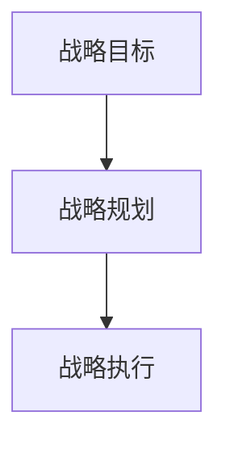

### 1.2 战略思维的基本要素

战略思维的基本要素包括市场分析、竞争分析、风险分析、资源分析等。这些要素有助于组织全面了解外部环境，为战略决策提供依据。

- **市场分析**：研究市场需求、市场规模、市场趋势等，以确定市场机会和潜在威胁。
- **竞争分析**：分析竞争对手的定位、策略、优势与劣势，以制定针对性的竞争策略。
- **风险分析**：评估潜在风险，制定风险应对策略，以确保战略规划的可行性和稳定性。
- **资源分析**：分析组织的资源状况，包括人力、物力、财力等，为战略实施提供资源保障。

在理解这些基本要素的基础上，我们可以使用以下伪代码来描述战略思维的基本流程：

```python
# 定义战略思维流程
def strategic_thinking():
    # 分析市场
    market_analysis()
    # 分析竞争
    competition_analysis()
    # 分析风险
    risk_analysis()
    # 分析资源
    resource_analysis()
    # 制定战略目标
    set_strategic_goals()
    # 制定战略规划
    set_strategic_plan()
    # 执行战略规划
    execute_strategic_plan()
```

### 1.3 战略思维在IT行业中的应用

在IT行业，战略思维的应用尤为重要。随着技术的快速发展和市场竞争的加剧，企业需要通过战略思维来把握市场机遇，应对挑战。

- **技术创新**：通过战略思维，企业可以分析技术发展趋势，确定技术创新方向，以保持竞争优势。
- **商业模式**：战略思维可以帮助企业分析市场机会，设计创新的商业模式，实现可持续发展。
- **人才培养**：通过战略思维，企业可以分析人才需求，制定人才培养策略，提升企业核心竞争力。

总之，战略思维是一种系统性的思考和决策方法，对于企业在复杂环境中保持竞争优势具有重要意义。通过理解战略思维的基本概念和要素，企业可以更好地制定长远规划，实现持续发展。

### 1.4 战略思维的重要性

战略思维在组织发展中的重要性不可忽视。首先，战略思维能够帮助组织预见未来，提前应对潜在的市场变化和风险。通过深入的市场分析和竞争分析，组织可以更好地把握市场机遇，制定科学的长远规划。

其次，战略思维强调系统的思考和全局的视角。它不仅关注组织的内部资源，还关注外部环境和竞争对手。这种全面的分析有助于组织制定更为合理和有效的战略规划。

此外，战略思维还是一种创新思维。它鼓励组织从不同的角度思考问题，寻找创新的解决方案。在快速变化的市场环境中，创新是企业保持竞争优势的关键。

最后，战略思维有助于提升组织的领导力。领导力不仅仅是个人能力，更是一种系统性的思考和管理能力。通过战略思维，领导者可以更好地指导团队，制定并实施战略规划，实现组织目标。

### 1.5 战略思维的应用场景

战略思维在多个领域都有广泛的应用。以下是几个典型的应用场景：

- **企业战略规划**：企业通过战略思维制定长期发展规划，明确企业愿景、使命和目标，确保企业可持续发展。
- **行业分析**：战略思维可以帮助行业分析家分析行业趋势、竞争格局和市场机会，为投资决策提供依据。
- **政府政策制定**：政府在制定政策时，需要考虑长远规划和社会影响，战略思维提供了一种科学的方法论。
- **科技创新**：在科技创新领域，战略思维可以帮助科研团队分析技术发展趋势，确定研发方向，加速科技成果转化。

总之，战略思维是一种多领域、多层次的思维方式，对于组织和个人都具有重要意义。通过理解和应用战略思维，组织可以更好地应对复杂环境，实现长远发展。

## 长远规划的理论基础

### 2.1 长远规划的重要性

长远规划是组织发展的基石，其重要性不言而喻。首先，长远规划能够帮助组织明确发展目标，指引组织前行的方向。通过制定长期规划，组织可以清晰地了解未来几年甚至几十年的发展路径，从而避免短视行为，确保战略目标的实现。

其次，长远规划有助于组织应对外部环境的变化。在快速变化的市场环境中，组织需要具备前瞻性，提前预判市场趋势和潜在风险。长远规划正是这种前瞻性的体现，它使组织能够及时调整战略，适应市场变化，抓住发展机遇。

此外，长远规划还有助于资源的合理配置。通过系统分析组织的资源状况，制定详细的资源配置计划，组织可以最大限度地发挥资源效用，避免资源浪费，提高运营效率。

### 2.2 长远规划的理论框架

长远规划的理论框架主要包括SWOT分析、五力模型和PESTEL分析等。这些工具和方法为组织提供了系统化的分析框架，帮助组织全面了解内外部环境，制定科学合理的战略规划。

#### SWOT分析

SWOT分析是一种常用的战略规划工具，用于分析组织的优势（Strengths）、劣势（Weaknesses）、机会（Opportunities）和威胁（Threats）。通过SWOT分析，组织可以全面了解自身的优劣势，以及外部环境中的机遇和威胁。

- **优势（Strengths）**：组织在资源、能力、品牌等方面的优势。
- **劣势（Weaknesses）**：组织在运营、管理、技术等方面的不足。
- **机会（Opportunities）**：外部环境中可能带来的市场机遇。
- **威胁（Threats）**：外部环境中可能带来的市场威胁。

以下是一个简化的SWOT分析流程：

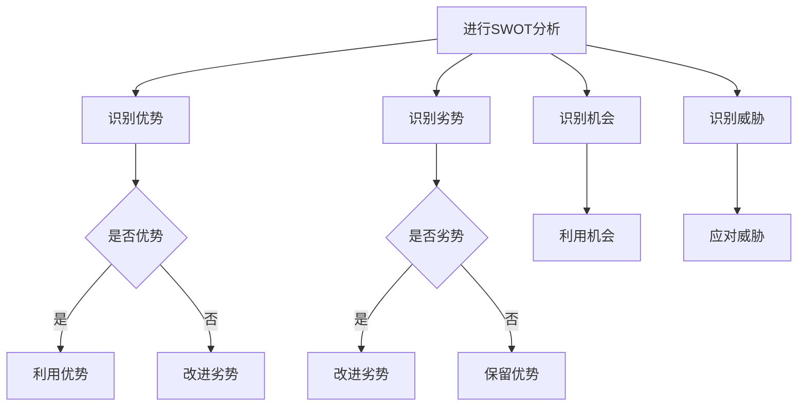

#### 五力模型

五力模型由迈克尔·波特提出，用于分析市场竞争的强度。五力模型包括行业竞争者、潜在竞争者、供应商、客户和替代品。

- **行业竞争者**：行业内直接竞争对手的数量和实力。
- **潜在竞争者**：行业外可能进入的竞争对手。
- **供应商**：供应商的集中度、议价能力等。
- **客户**：客户的集中度、议价能力等。
- **替代品**：市场上可能替代产品或服务的替代品。

以下是一个简化的五力模型分析流程：

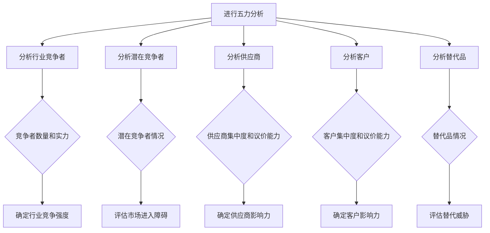

#### PESTEL分析

PESTEL分析是一种宏观环境分析工具，用于分析政治（Political）、经济（Economic）、社会（Sociocultural）、技术（Technological）、环境（Environmental）和法律（Legal）等外部因素。

- **政治因素**：政治稳定性、政策变化等。
- **经济因素**：经济增长、通货膨胀率等。
- **社会因素**：人口结构、文化观念等。
- **技术因素**：技术发展、创新速度等。
- **环境因素**：环境保护政策、资源可持续性等。
- **法律因素**：法律法规变化、合规要求等。

以下是一个简化的PESTEL分析流程：

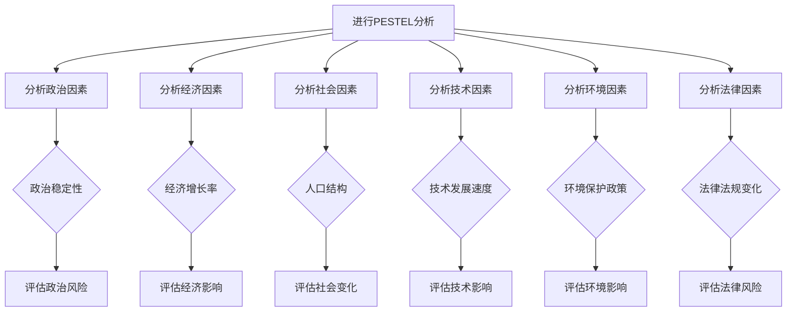

通过这些理论框架，组织可以全面、系统地分析内外部环境，制定科学合理的长远规划。这些工具和方法不仅适用于企业，也适用于政府、科研机构等不同类型的组织。

### 2.3 长远规划的核心要素

长远规划的核心要素包括愿景、使命、目标、战略和行动计划。这些要素相互关联，共同构成了一个完整的战略规划体系。

- **愿景**：组织的长远愿景，描述组织希望实现的目标和理想状态。
- **使命**：组织存在的目的和意义，指导组织的日常运营和行为。
- **目标**：具体、可衡量的短期和长期目标，是愿景的具体化。
- **战略**：为实现目标而制定的具体策略和方法，包括市场策略、技术策略、人力资源策略等。
- **行动计划**：将战略转化为具体的行动步骤，包括时间表、责任人和资源需求。

以下是一个简化的长远规划流程：

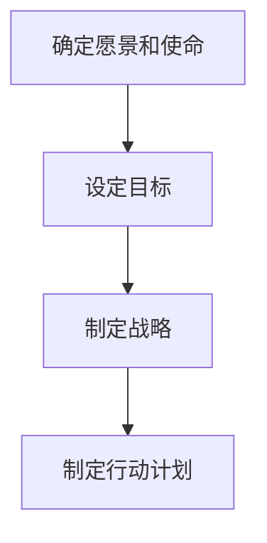

通过这些核心要素，组织可以明确自身的发展方向和目标，确保战略规划的系统性和可执行性。同时，这些要素也为组织提供了评估和调整战略的依据，使其能够灵活应对外部环境的变化。

### 2.4 长远规划的实施步骤

实施长远规划是一个复杂而系统的过程，需要组织在多个层面上进行协调和执行。以下是实施长远规划的基本步骤：

1. **明确愿景和使命**：首先，组织需要明确自身的长远愿景和使命，这是战略规划的基础。
2. **设定目标**：根据愿景和使命，组织需要设定具体、可衡量的短期和长期目标。
3. **制定战略**：为实现目标，组织需要制定具体的策略和方法，包括市场策略、技术策略、人力资源策略等。
4. **制定行动计划**：将战略转化为具体的行动步骤，包括时间表、责任人和资源需求。
5. **资源分配**：根据行动计划，组织需要合理分配资源，确保战略的顺利实施。
6. **执行与监控**：组织需要按照行动计划执行战略，并定期监控进展情况，确保目标实现。
7. **调整与优化**：在执行过程中，组织需要根据实际情况及时调整和优化战略规划，以应对外部环境的变化。

以下是一个简化的长远规划实施流程：

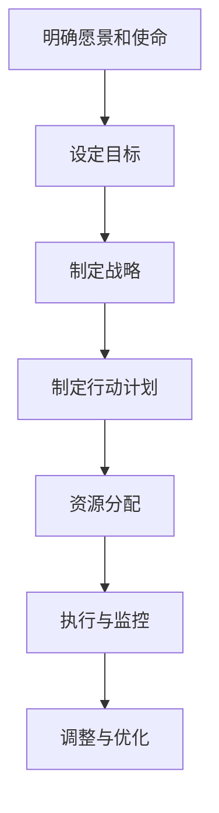

通过这些步骤，组织可以确保长远规划的系统性和可执行性，从而实现战略目标。同时，这些步骤也为组织提供了动态调整和优化的空间，使其能够灵活应对外部环境的变化。

### 2.5 长远规划在不同行业中的应用

长远规划在不同行业中具有不同的应用特点和挑战。以下是对几个典型行业的简要分析：

#### 企业战略规划

企业在制定长远规划时，需要考虑市场趋势、技术创新、人力资源和商业模式等多个方面。例如，科技公司需要关注技术创新和市场需求，而传统制造企业则需要考虑供应链管理和生产效率。

#### 政府政策制定

政府在制定政策时，需要考虑国家发展战略、社会需求和法律法规等多个因素。长远规划帮助政府确定政策目标、制定实施策略，并评估政策效果。

#### 科研机构发展

科研机构在制定长远规划时，需要考虑科研方向、人才引进和科研成果转化等多个方面。长远规划有助于科研机构明确发展目标，优化资源配置，提高科研效率。

#### 非营利组织运营

非营利组织在制定长远规划时，需要考虑社会需求、资金来源和项目实施等多个方面。长远规划有助于非营利组织明确使命，优化资源利用，实现社会效益。

不同行业在应用长远规划时，需要根据自身特点和需求，选择合适的分析工具和方法，制定科学合理的战略规划，以实现长远发展目标。

### 2.6 长远规划与可持续发展

长远规划与可持续发展密切相关。可持续发展强调在满足当前需求的同时，不损害子孙后代满足其需求的能力。长远规划是实现可持续发展的重要手段，通过科学规划和管理，组织可以确保资源的合理利用，减少环境污染，促进社会经济的和谐发展。

#### 可持续发展的核心原则

- **公平性**：在资源分配和社会福利方面，确保所有人都能公平享受发展成果。
- **持续性**：通过科学规划和管理，确保资源、环境和社会的长期稳定发展。
- **共同性**：发展成果应惠及全社会，实现共同繁荣。

#### 长远规划在可持续发展中的作用

- **明确发展目标**：通过长远规划，组织可以明确可持续发展的目标，制定具体的实施策略。
- **优化资源配置**：通过系统分析，组织可以优化资源配置，提高资源利用效率，减少浪费。
- **促进技术创新**：长远规划鼓励组织投资于技术创新，以实现更高效、更环保的生产和运营模式。
- **加强环境保护**：通过长远规划，组织可以制定环境保护措施，减少环境污染，实现绿色可持续发展。

总之，长远规划是实现可持续发展的重要保障，通过科学规划和持续优化，组织可以推动社会经济的可持续发展，为子孙后代创造更好的生活环境。

### 2.7 长远规划与风险管理

在制定长远规划时，风险管理是一个不可或缺的环节。有效的风险管理有助于组织识别潜在风险，制定应对策略，确保战略规划的顺利实施。

#### 风险管理的核心步骤

- **风险识别**：通过系统分析，识别组织面临的各种风险，包括市场风险、技术风险、操作风险等。
- **风险评估**：对识别出的风险进行评估，确定其可能性和影响，为制定应对策略提供依据。
- **风险应对**：根据风险评估结果，制定相应的风险应对策略，包括风险规避、风险转移、风险减轻等。
- **风险监控**：在战略规划实施过程中，持续监控风险状况，及时调整应对策略。

以下是一个简化的风险管理流程：

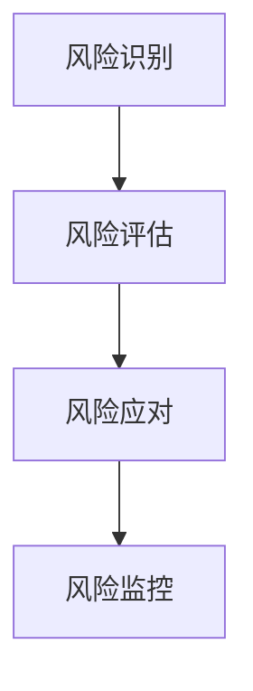

#### 长远规划中的风险管理

- **战略目标与风险匹配**：在制定长远规划时，应确保战略目标与风险承受能力相匹配，避免盲目追求高风险目标。
- **资源分配**：在资源分配过程中，应充分考虑风险因素，为风险管理提供充足的资源保障。
- **跨部门协作**：风险管理涉及多个部门，需要跨部门协作，确保风险应对策略的有效实施。
- **动态调整**：在战略规划实施过程中，应定期评估风险状况，及时调整风险应对策略，以应对外部环境的变化。

通过有效的风险管理，组织可以降低战略规划实施过程中的不确定性，提高战略成功的可能性。

### 2.8 长远规划的案例分析

为了更好地理解长远规划的实际应用，我们可以通过以下几个实际案例进行分析：

#### 案例一：阿里巴巴集团

阿里巴巴集团在制定长远规划时，明确了成为全球领先的数字经济体的愿景。为实现这一目标，阿里巴巴进行了全面的市场分析和竞争分析，确定了电商、云计算、数字媒体等核心业务方向。通过持续的资源配置和战略调整，阿里巴巴成功地实现了从电商巨头到全球数字经济的转型。

#### 案例二：特斯拉公司

特斯拉公司在制定长远规划时，明确了可持续发展的愿景。为实现这一目标，特斯拉在技术创新、市场扩张和供应链管理等方面进行了大量投入。通过不断推出创新产品，特斯拉在全球电动汽车市场中占据了领先地位，并推动了全球可持续交通体系的变革。

#### 案例三：世界卫生组织（WHO）

世界卫生组织在制定长远规划时，明确了提高全球公共卫生水平的愿景。为实现这一目标，WHO进行了全面的社会、经济和技术分析，制定了包括疾病预防、健康促进、应急响应等在内的多项战略计划。通过全球合作和资源调配，WHO有效地应对了多次全球公共卫生危机。

这些案例展示了不同类型组织在制定和实施长远规划时的成功经验，为我们提供了宝贵的借鉴和启示。

### 2.9 长远规划的最佳实践

为了确保长远规划的有效实施，以下是一些最佳实践建议：

- **明确愿景和使命**：确保长远规划的愿景和使命与组织的核心价值观相一致，以激发员工的共同愿景和动力。
- **全面分析内外部环境**：通过市场分析、竞争分析、风险分析等，全面了解外部环境和内部资源，为战略规划提供科学依据。
- **制定具体可衡量的目标**：确保目标具体、可衡量，以方便后续的评估和调整。
- **动态调整战略规划**：在战略规划实施过程中，根据实际情况及时调整，以应对外部环境的变化。
- **跨部门协作**：长远规划涉及多个部门和领域，需要跨部门协作，确保战略规划的有效实施。

通过这些最佳实践，组织可以更好地制定和实施长远规划，实现可持续发展目标。

## 领导力在长远规划中的作用

### 3.1 领导力与长远规划的关系

领导力在长远规划中起着至关重要的作用。领导力不仅影响组织的战略方向和决策，还决定战略规划的实施效果。有效的领导力可以帮助组织在复杂多变的环境中保持竞争力，实现长远发展目标。

#### 领导力在战略规划中的角色

领导力在战略规划中扮演着以下几个关键角色：

1. **愿景和目标设定**：领导者需要明确组织的长远愿景和目标，为战略规划提供方向。通过领导力，领导者可以激发员工的共同愿景，凝聚团队力量，推动组织向前发展。

2. **战略决策**：领导者需要根据内外部环境，制定科学合理的战略规划。领导力在这里表现为领导者对市场趋势的洞察力、对资源分配的决策能力和对风险的把控能力。

3. **战略执行**：领导者需要确保战略规划得到有效执行。领导力体现在领导者对团队的管理能力、对资源的高效利用以及对变革的推动能力。

4. **文化建设**：领导者需要通过文化建设，塑造组织的核心价值观和行为准则，确保组织在战略实施过程中保持一致性和凝聚力。

#### 领导力与战略思维的结合

领导力与战略思维是相辅相成的。战略思维提供了系统化、逻辑化的思考方法，帮助领导者分析内外部环境，制定科学合理的战略规划。而领导力则提供了实施战略所需的领导能力、团队协作能力和变革管理能力。

为了更好地结合战略思维和领导力，以下是一种可能的整合模型：

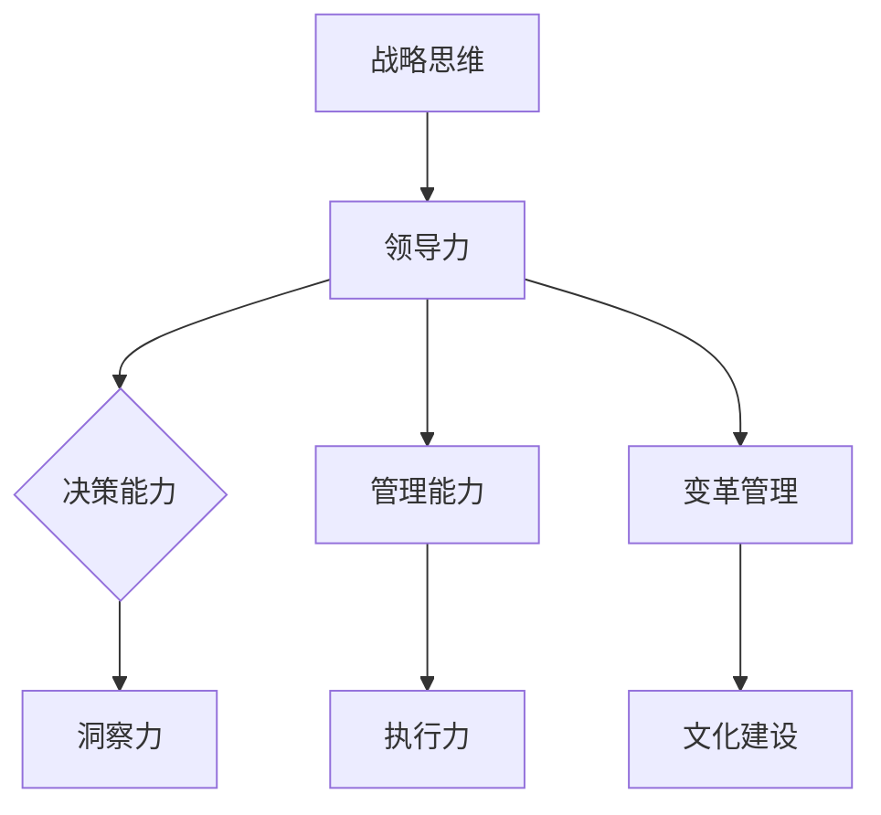

在这个整合模型中，战略思维和领导力相互促进，共同推动组织的长远发展。

### 3.2 领导力在战略规划中的实践

领导力在战略规划中的实践主要体现在以下几个方面：

1. **目标设定**：领导者需要明确组织的长远愿景和目标，制定具体的战略规划。通过愿景激励和目标引导，领导者可以激发团队的积极性和创造力。

2. **资源分配**：领导者需要根据战略目标，合理分配资源，确保战略规划的实施。资源分配不仅包括财务资源，还包括人力资源和技术资源。

3. **团队建设**：领导者需要通过有效的团队建设，打造一支高效、协作的团队。这包括选拔合适的人才、培养员工的能力和提升团队凝聚力。

4. **风险管理**：领导者需要识别和管理战略规划实施过程中的各种风险，确保战略目标的实现。这包括制定风险应对策略、建立风险监控机制和及时调整战略规划。

5. **文化建设**：领导者需要通过文化建设，塑造组织的核心价值观和行为准则，确保组织在战略实施过程中保持一致性和凝聚力。

以下是一个简化的领导力在战略规划中的实践流程：

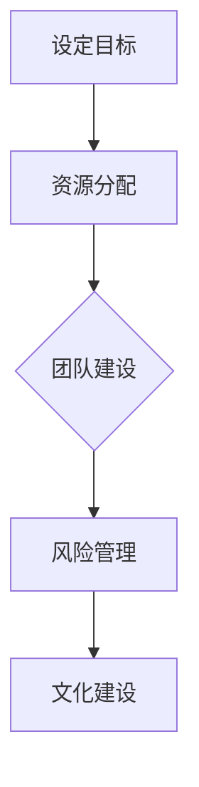

通过这些实践，领导者可以确保战略规划的有效实施，推动组织实现长远发展目标。

### 3.3 领导力与战略执行

在战略规划的实施过程中，领导力至关重要。有效的领导力可以确保战略目标得以实现，并推动组织持续发展。

#### 领导力在战略执行中的关键作用

1. **团队协作**：领导者需要通过有效的团队协作，确保战略目标的实现。这包括激发员工的积极性、提高团队凝聚力以及促进团队成员之间的沟通和合作。

2. **激励机制**：领导者需要建立合理的激励机制，激发员工的创新和进取精神，确保员工在战略执行过程中始终保持高昂的斗志。

3. **决策支持**：领导者需要为团队成员提供决策支持，帮助他们解决战略执行中的问题和挑战。这包括提供信息、指导和建议，以及为员工提供成长和发展的机会。

4. **变革管理**：在战略执行过程中，领导者需要应对各种变革，包括组织结构变革、业务模式变革和技术变革等。有效的变革管理可以确保组织在变革过程中保持稳定和高效。

#### 领导力与战略执行的整合模型

为了更好地整合领导力和战略执行，我们可以使用以下模型：

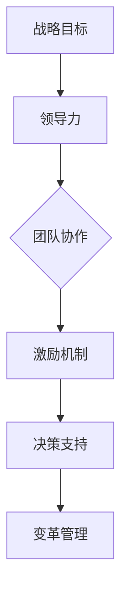

在这个模型中，领导力通过团队协作、激励机制、决策支持和变革管理，推动战略目标的实现。同时，战略目标也为领导力提供了方向和依据，确保领导力在战略执行中的有效发挥。

### 3.4 领导力在战略调整中的作用

在战略执行过程中，环境变化和不确定性是不可避免的。领导者需要具备敏锐的洞察力和灵活的应变能力，及时调整战略规划，以适应新的环境。

#### 领导力在战略调整中的关键作用

1. **持续监控**：领导者需要持续监控战略执行情况，及时发现问题和挑战，为战略调整提供依据。

2. **风险评估**：领导者需要评估战略调整的风险，确保调整方案的科学性和可行性。

3. **决策能力**：领导者需要具备快速决策的能力，及时调整战略规划，以应对外部环境的变化。

4. **沟通协调**：领导者需要与团队成员进行有效沟通，确保战略调整方案的顺利实施。

以下是一个简化的领导力在战略调整中的实践流程：

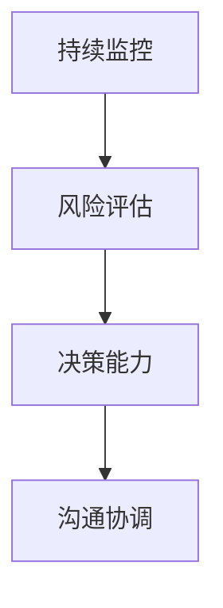

通过这些实践，领导者可以确保战略规划在动态环境中保持有效性和可持续性。

### 3.5 领导力与组织文化

领导力不仅影响战略规划和执行，还深刻影响着组织文化。一个健康、积极的组织文化可以促进组织的长远发展。

#### 领导力对组织文化的影响

1. **价值观塑造**：领导者通过自身的言行，塑造组织的核心价值观和行为准则，影响员工的行为和态度。

2. **团队精神**：领导者通过鼓励团队合作、共同目标，增强组织的团队精神，提高组织凝聚力。

3. **创新氛围**：领导者鼓励创新思维、勇于尝试，营造一个宽容失败、积极进取的创新氛围。

4. **学习文化**：领导者倡导持续学习、知识共享，建立学习型组织，提高组织整体竞争力。

#### 领导力与组织文化的整合模型

为了更好地整合领导力和组织文化，我们可以使用以下模型：

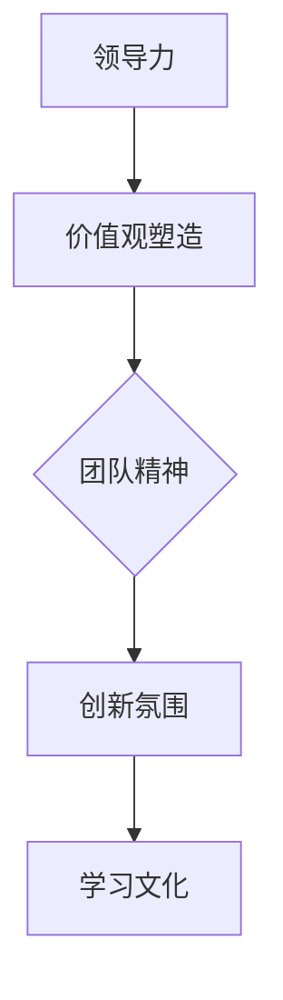

在这个模型中，领导力通过价值观塑造、团队精神、创新氛围和学习文化，影响和塑造组织文化。同时，组织文化也为领导力提供了基础和支持，确保领导力在组织中的有效发挥。

### 3.6 领导力的发展与提升

领导力是一个持续发展的过程，领导者需要不断学习、实践和反思，以提升自身的领导力水平。

#### 领导力发展路径

1. **自我认知**：领导者需要了解自己的优点和不足，明确自身的发展方向。

2. **知识学习**：领导者需要不断学习新的知识和技能，提升自身的能力。

3. **实践锻炼**：领导者需要通过实际工作，锻炼自己的领导能力和决策能力。

4. **反思总结**：领导者需要定期反思和总结自己的工作，从实践中学习，不断改进和提升。

#### 领导力提升策略

1. **持续学习**：领导者可以通过阅读书籍、参加培训、交流研讨等方式，不断学习新的知识和技能。

2. **实践锻炼**：领导者可以通过参与实际项目、处理复杂问题等方式，锻炼自己的领导能力和决策能力。

3. **反思总结**：领导者需要定期反思自己的工作，总结经验和教训，不断提升自身的能力。

4. **寻求反馈**：领导者可以主动寻求他人的反馈，了解自己的优点和不足，有针对性地进行改进。

通过这些策略，领导者可以不断提升自身的领导力水平，为组织的长远发展提供有力保障。

### 3.7 领导力在不同行业中的应用

领导力在不同行业中具有不同的应用特点和挑战。以下是对几个典型行业的简要分析：

#### 企业

在企业中，领导力主要表现在战略决策、资源管理和团队协作等方面。有效的领导力可以帮助企业实现战略目标，提高管理效率和员工满意度。

#### 政府

在政府中，领导力主要表现在政策制定、资源分配和社会治理等方面。领导力在政府中的发挥，对于维护社会稳定、推动社会进步具有重要意义。

#### 科研机构

在科研机构中，领导力主要表现在科研方向、人才引进和科研成果转化等方面。领导力在科研机构中的发挥，对于提升科研水平和推动科技创新具有重要意义。

#### 非营利组织

在非营利组织中，领导力主要表现在项目实施、资源筹集和社会影响力等方面。领导力在非营利组织中的发挥，对于实现组织使命、推动社会进步具有重要意义。

不同行业在应用领导力时，需要根据自身特点和需求，选择合适的领导力模型和方法，以实现组织的长远发展目标。

### 3.8 领导力的最佳实践

为了更好地发挥领导力在长远规划中的作用，以下是一些最佳实践建议：

- **明确愿景和使命**：领导者需要明确组织的长远愿景和使命，为战略规划提供方向和动力。
- **培养团队协作精神**：领导者需要通过有效的团队建设，培养员工的团队合作精神，提高组织凝聚力。
- **激励员工创新**：领导者需要建立合理的激励机制，激发员工的创新精神和进取心。
- **建立学习型组织**：领导者需要倡导持续学习，建立学习型组织，提升组织整体竞争力。
- **关注员工成长**：领导者需要关注员工的个人成长和发展，为员工提供成长和发展的机会。

通过这些最佳实践，领导者可以更好地发挥领导力在长远规划中的作用，推动组织的可持续发展。

### 3.9 领导力在变革中的角色

在组织变革中，领导力发挥着至关重要的作用。有效的领导力可以帮助组织克服变革过程中的困难和挑战，确保变革目标的实现。

#### 领导力在变革中的关键作用

1. **愿景和目标设定**：领导者需要明确组织的变革愿景和目标，为变革提供方向和动力。
2. **沟通和共识**：领导者需要通过有效的沟通，建立共识，确保团队成员理解和支持变革。
3. **组织动员**：领导者需要动员全体员工积极参与变革，提高变革的执行力和效率。
4. **变革管理**：领导者需要建立有效的变革管理体系，监控变革进展，及时调整策略。

#### 领导力在变革中的实践

1. **建立变革愿景**：领导者需要明确组织的变革目标，并将其传达给全体员工，激发员工的变革动力。
2. **沟通与共识**：领导者需要通过多种渠道，与员工进行深入沟通，解答员工的疑问，建立共识。
3. **组织动员**：领导者需要通过激励和培训，动员全体员工积极参与变革，提高员工的变革意识和能力。
4. **变革监控**：领导者需要建立变革监控机制，及时了解变革进展，确保变革目标的实现。

通过这些实践，领导者可以确保组织在变革过程中保持稳定和高效，实现变革目标。

## 战略思维在决策中的应用

### 4.1 战略决策的流程

战略决策是组织发展的重要环节，其流程包括以下几个关键步骤：

1. **问题识别**：首先，组织需要识别和明确战略决策的问题。这可以通过对市场环境、竞争对手、内部资源等因素的分析进行。

2. **信息收集**：在问题识别后，组织需要收集与问题相关的信息。这包括市场数据、竞争情报、内部资源状况等。

3. **方案评估**：根据收集到的信息，组织需要制定多个可能的解决方案，并对其进行评估。评估的标准包括可行性、成本效益、风险等。

4. **决策制定**：在评估多个方案后，组织需要选择最优的解决方案，并制定详细的决策方案。

5. **执行与监控**：最后，组织需要将决策方案转化为具体的行动步骤，并对其进行监控和调整，确保决策的有效实施。

以下是一个简化的战略决策流程：

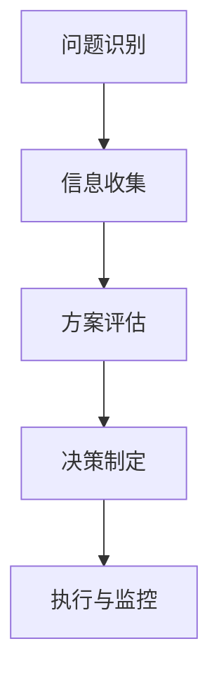

### 4.2 战略思维在具体行业中的应用

战略思维在各个行业中都有广泛的应用，以下我们以科技行业、金融行业和制造业为例，详细探讨战略思维的应用。

#### 科技行业

在科技行业，战略思维的重要性尤为突出。随着技术的快速发展，企业需要通过战略思维来把握市场机遇，制定创新性的战略规划。

- **技术创新**：科技企业需要持续关注技术创新，通过战略思维分析技术发展趋势，确定技术创新方向。例如，通过SWOT分析和PESTEL分析，企业可以确定在人工智能、区块链等领域的技术创新机会。
- **商业模式创新**：科技企业需要不断探索新的商业模式，以保持竞争力。战略思维可以帮助企业分析市场需求、竞争格局，设计创新的商业模式。例如，通过五力模型分析，企业可以确定在特定市场的商业模式优势。
- **人才培养**：科技行业对人才需求极高，战略思维可以帮助企业分析人才市场，制定人才培养策略。通过竞争分析和市场分析，企业可以确定关键人才需求，优化人才结构。

以下是一个简化的科技企业战略思维应用流程：

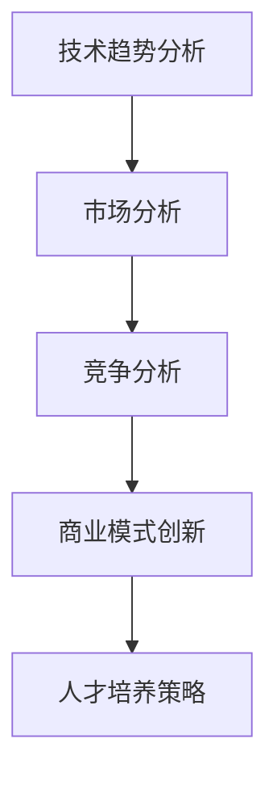

#### 金融行业

在金融行业，战略思维的应用主要体现在风险管理、投资决策和业务拓展等方面。

- **风险管理**：金融企业需要通过战略思维，识别和管理各种风险。SWOT分析和PESTEL分析可以帮助企业全面了解内外部环境，制定有效的风险管理策略。
- **投资决策**：金融企业在进行投资决策时，需要综合考虑市场环境、行业趋势和自身资源。通过战略思维，企业可以制定科学合理的投资策略，优化投资组合。
- **业务拓展**：金融企业需要通过战略思维，分析市场机会，制定业务拓展计划。例如，通过五力模型分析，企业可以确定在特定市场的业务拓展策略。

以下是一个简化的金融企业战略思维应用流程：

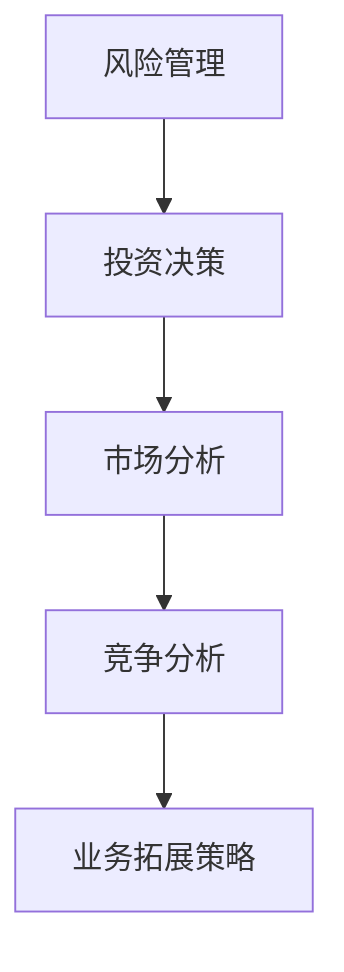

#### 制造业

在制造业，战略思维的应用主要体现在生产管理、供应链管理和市场营销等方面。

- **生产管理**：制造业企业需要通过战略思维，优化生产流程，提高生产效率。通过SWOT分析和五力模型分析，企业可以确定生产管理的优化方向。
- **供应链管理**：制造业企业需要通过战略思维，优化供应链管理，降低成本，提高供应链的稳定性。PESTEL分析可以帮助企业识别供应链中的潜在风险和机会。
- **市场营销**：制造业企业需要通过战略思维，制定有效的市场营销策略。市场分析和竞争分析可以帮助企业确定目标市场，优化产品定位和推广策略。

以下是一个简化的制造业企业战略思维应用流程：

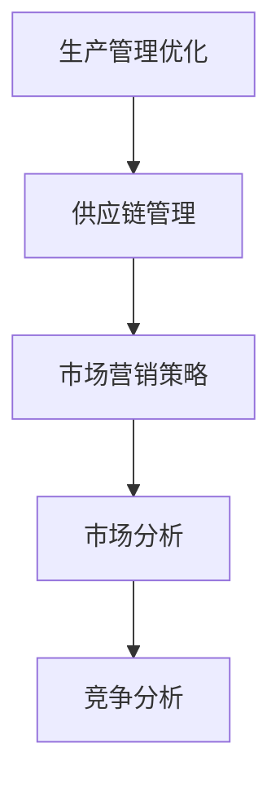

通过这些应用，战略思维帮助企业在不同行业中制定科学合理的战略规划，提高市场竞争力和运营效率。

### 4.3 战略思维在具体行业中的应用案例分析

为了更好地理解战略思维在不同行业中的应用，我们可以通过以下实际案例进行分析：

#### 案例一：科技行业——谷歌

谷歌是一家全球知名的科技公司，其成功离不开战略思维的运用。谷歌通过持续的技术创新和商业模式创新，始终保持行业领先地位。

- **技术创新**：谷歌通过SWOT分析和PESTEL分析，确定了人工智能、云计算等领域的战略方向。通过不断的技术创新，谷歌在搜索引擎、自动驾驶、智能家居等多个领域取得了突破。
- **商业模式创新**：谷歌通过五力模型分析，确定了在广告、云计算、硬件等领域的商业模式优势。例如，谷歌通过广告业务实现了高额利润，通过云计算服务获得了大量客户。

#### 案例二：金融行业——摩根大通

摩根大通是一家全球领先的金融服务公司，其成功在于战略思维在风险管理、投资决策和业务拓展中的应用。

- **风险管理**：摩根大通过SWOT分析和PESTEL分析，全面了解市场环境，制定了有效的风险管理策略。通过这些分析，摩根大通能够识别市场风险，并采取相应的措施降低风险。
- **投资决策**：摩根大通过战略思维，分析市场环境和行业趋势，制定了科学合理的投资策略。例如，在金融科技领域，摩根大通通过投资区块链技术，提升了金融服务效率。
- **业务拓展**：摩根大通过五力模型分析，确定了在新兴市场的业务拓展策略。通过在亚洲、欧洲等地区的业务拓展，摩根大通实现了全球业务的均衡发展。

#### 案例三：制造业——丰田汽车

丰田汽车是一家全球领先的汽车制造商，其成功在于战略思维在生产管理、供应链管理和市场营销等方面的应用。

- **生产管理**：丰田通过SWOT分析和五力模型分析，优化了生产流程，提高了生产效率。例如，丰田通过精益生产方式，减少了浪费，提高了产品质量。
- **供应链管理**：丰田通过PESTEL分析，识别了供应链中的潜在风险和机会。通过优化供应链管理，丰田确保了原材料和零部件的稳定供应，提高了供应链的稳定性。
- **市场营销**：丰田通过战略思维，分析市场需求和竞争格局，制定了有效的市场营销策略。例如，丰田通过品牌营销和产品创新，成功进入了多个新兴市场。

这些案例展示了战略思维在不同行业中的应用，为企业提供了宝贵的经验和启示。

### 4.4 战略思维在决策中的最佳实践

为了确保战略决策的有效性，以下是一些战略思维在决策中的最佳实践：

- **全面分析内外部环境**：在决策过程中，应全面分析内外部环境，包括市场趋势、竞争对手、内部资源等，以制定科学合理的决策方案。
- **制定多种备选方案**：在决策过程中，应制定多种备选方案，并进行详细评估，以确保决策的多样性和灵活性。
- **风险评估与应对**：在决策过程中，应进行风险评估，并制定相应的应对策略，以降低决策风险。
- **持续监控与调整**：在决策实施过程中，应持续监控决策效果，并根据实际情况进行及时调整，确保决策目标的实现。

通过这些最佳实践，组织可以提升战略决策的质量和效率，实现长远发展目标。

### 4.5 战略思维与领导力的整合

战略思维与领导力的整合是组织成功的关键。通过有效的整合，组织可以确保战略规划得到有效实施，实现长远发展目标。

#### 战略思维与领导力的关系

战略思维和领导力是相辅相成的。战略思维提供了系统化的思考方法和决策框架，帮助领导者分析内外部环境，制定科学合理的战略规划。而领导力则提供了实施战略所需的领导能力、团队协作能力和变革管理能力。

#### 战略思维与领导力的整合模型

为了更好地整合战略思维和领导力，我们可以使用以下模型：

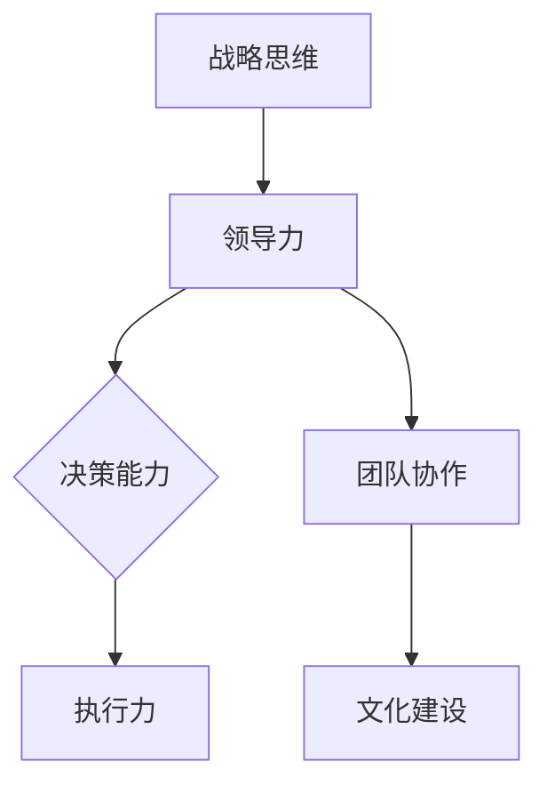

在这个模型中，战略思维通过决策能力和执行力，推动领导力的发挥；领导力通过团队协作和文化建设，确保战略思维的落实。通过这种整合，组织可以实现战略规划和领导力的协同发展。

### 4.6 战略思维与领导力在项目管理中的应用

在项目管理中，战略思维和领导力同样发挥着重要作用。以下我们探讨战略思维和领导力在项目管理中的应用。

#### 战略思维在项目管理中的应用

1. **项目目标设定**：战略思维可以帮助项目经理明确项目目标，确保项目目标与组织的长远规划相一致。
2. **项目规划**：战略思维可以帮助项目经理制定详细的项目规划，包括时间、资源、风险等，确保项目的顺利实施。
3. **项目监控**：战略思维可以帮助项目经理及时监控项目进展，发现问题并采取相应措施，确保项目目标的实现。

#### 领导力在项目管理中的应用

1. **团队建设**：领导者需要通过有效的团队建设，打造一支高效、协作的项目团队，确保项目目标的实现。
2. **沟通与协调**：领导者需要通过有效的沟通和协调，确保项目团队内部以及与外部合作伙伴之间的信息畅通，提高项目效率。
3. **风险管理**：领导者需要识别和管理项目风险，确保项目在风险可控的范围内进行。

#### 战略思维与领导力的整合

在项目管理中，战略思维和领导力的整合尤为重要。以下是一种可能的整合模型：

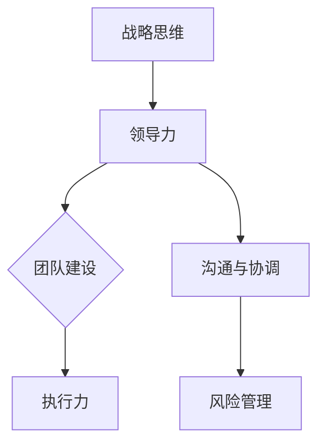

在这个模型中，战略思维通过决策能力和执行力，推动领导力的发挥；领导力通过团队建设、沟通与协调和风险管理，确保战略思维的落实。通过这种整合，组织可以确保项目管理的成功，实现项目目标。

### 4.7 战略思维与领导力在企业管理中的应用

战略思维和领导力在企业管理中具有至关重要的作用。以下我们探讨战略思维和领导力在企业管理中的应用。

#### 战略思维在企业管理中的应用

1. **企业战略规划**：战略思维可以帮助企业制定科学合理的战略规划，明确企业发展方向和目标。
2. **市场分析**：战略思维可以帮助企业分析市场环境，识别市场机会和威胁，制定针对性的市场策略。
3. **资源配置**：战略思维可以帮助企业优化资源配置，提高资源利用效率，实现企业的可持续发展。

#### 领导力在企业管理中的应用

1. **团队建设**：领导力可以帮助企业领导者打造一支高效、协作的团队，提高企业执行力。
2. **变革管理**：领导力可以帮助企业领导者应对变革，推动企业实现持续创新和进步。
3. **文化建设**：领导力可以帮助企业塑造积极向上的企业文化，提高员工的工作满意度和忠诚度。

#### 战略思维与领导力的整合

在企业管理中，战略思维和领导力的整合至关重要。以下是一种可能的整合模型：

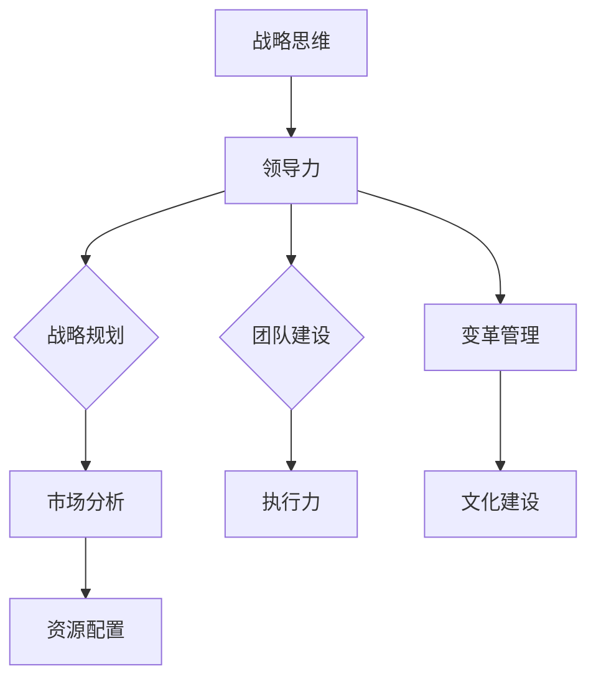

在这个模型中，战略思维通过决策能力和执行力，推动领导力的发挥；领导力通过团队建设、变革管理和文化建设，确保战略思维的落实。通过这种整合，企业可以实现战略规划和管理的协同发展，提高企业的整体竞争力。

### 4.8 战略思维与领导力在企业战略管理中的具体实践

战略思维和领导力在企业战略管理中的具体实践体现在多个方面，以下是一些关键实践：

#### 战略目标设定

1. **愿景和使命**：企业领导者需要通过战略思维，明确企业的长远愿景和使命，确保战略目标的清晰性和方向性。
2. **目标分解**：将战略目标分解为可操作的具体目标，并明确实现这些目标的途径和方法。

#### 战略规划

1. **环境分析**：通过SWOT分析和PESTEL分析，对企业内外部环境进行深入分析，为战略规划提供依据。
2. **资源分配**：根据战略目标和环境分析结果，合理分配资源，确保战略规划的可行性和有效性。

#### 领导力实践

1. **团队领导**：领导者需要通过有效的团队建设，提高团队协作能力和执行力。
2. **文化塑造**：领导者需要通过文化建设，塑造企业的核心价值观和行为准则，推动战略规划的落实。

#### 战略执行

1. **决策支持**：领导者需要为团队成员提供决策支持，帮助他们在战略执行过程中做出明智的决策。
2. **监控与调整**：通过定期的监控和评估，及时调整战略执行方案，确保战略目标的实现。

#### 战略调整

1. **动态调整**：根据市场环境和内部情况的变化，灵活调整战略规划，以适应新的环境。
2. **风险管理**：领导者需要识别和管理战略执行过程中的各种风险，确保战略调整的顺利进行。

通过这些具体实践，企业可以确保战略思维和领导力在战略管理中的有效整合，推动企业的长远发展。

### 4.9 战略思维与领导力在新兴行业的应用

在新兴行业，如人工智能、区块链和新能源等领域，战略思维和领导力具有特殊的重要性。以下我们探讨战略思维和领导力在这些领域的应用。

#### 人工智能行业

在人工智能行业，战略思维和领导力主要体现在技术创新、商业模式和人才战略等方面。

1. **技术创新**：企业需要通过战略思维，分析人工智能技术的发展趋势，确定技术创新的方向。
2. **商业模式创新**：战略思维可以帮助企业探索新的商业模式，如基于人工智能的SaaS服务、智能设备等。
3. **人才战略**：领导力在吸引、培养和留住高端人才方面至关重要，企业需要通过有效的团队建设和管理，提高人才竞争力。

#### 区块链行业

在区块链行业，战略思维和领导力主要体现在技术创新、供应链管理和信息安全等方面。

1. **技术创新**：企业需要通过战略思维，分析区块链技术的应用前景，确定技术创新的重点。
2. **供应链管理**：战略思维可以帮助企业优化供应链管理，提高供应链的透明度和效率。
3. **信息安全**：领导力在保障区块链系统的安全性和稳定性方面至关重要，企业需要建立有效的安全管理体系。

#### 新能源行业

在新能源行业，战略思维和领导力主要体现在技术创新、市场推广和政策应对等方面。

1. **技术创新**：企业需要通过战略思维，分析新能源技术的发展趋势，确定技术创新的重点。
2. **市场推广**：领导力在推广新能源产品、开拓新市场方面至关重要，企业需要通过有效的市场营销策略，提高市场占有率。
3. **政策应对**：战略思维可以帮助企业及时了解政策动态，制定相应的政策应对策略，确保企业在政策环境中的合规性和竞争力。

通过战略思维和领导力的有效应用，企业可以在新兴行业中把握机遇，实现快速发展。

### 4.10 战略思维与领导力在企业战略管理中的最佳实践

为了确保战略思维与领导力在企业战略管理中的有效整合，以下是一些最佳实践：

- **明确战略目标**：领导者需要通过战略思维，明确企业的长远愿景和目标，确保战略目标的清晰性和可操作性。
- **环境分析**：企业需要通过SWOT分析和PESTEL分析，全面了解内外部环境，为战略规划提供依据。
- **团队协作**：领导者需要通过有效的团队建设，提高团队协作能力和执行力。
- **动态调整**：企业需要根据市场环境和内部情况的变化，灵活调整战略规划，确保战略目标的实现。
- **文化建设**：领导者需要通过文化建设，塑造企业的核心价值观和行为准则，提高员工的认同感和归属感。

通过这些最佳实践，企业可以确保战略思维与领导力在战略管理中的有效整合，推动企业的可持续发展。

### 4.11 战略思维与领导力在持续发展中的重要性

战略思维与领导力在持续发展中扮演着关键角色。首先，战略思维能够帮助企业预见未来，制定长远的可持续发展计划。通过环境分析、市场预测和技术评估，企业可以确定未来的发展方向和目标，确保在动态环境中保持竞争力。

其次，领导力在推动战略执行和变革管理方面至关重要。有效的领导力能够激发员工的积极性，提高执行力，确保战略目标的实现。同时，领导力在应对变革和不确定性方面具有重要作用，帮助企业在面临挑战时保持稳定和高效。

总之，战略思维与领导力在持续发展中相互促进，共同推动企业实现可持续发展目标。

### 4.12 战略思维与领导力的持续发展

战略思维与领导力的持续发展是一个动态过程，需要组织和个人不断学习、实践和反思。以下是一些建议：

- **持续学习**：组织和个人需要不断学习新的知识和技能，以适应快速变化的环境。
- **实践锻炼**：通过实际项目和工作，锻炼战略思维和领导力，提升实践能力。
- **反思总结**：定期反思和总结战略思维和领导力应用的经验和教训，不断改进和提升。
- **交流分享**：通过内部培训和外部交流，分享战略思维和领导力应用的最佳实践，促进共同成长。

通过持续发展，组织和个人可以不断提升战略思维和领导力水平，为企业的长远发展奠定坚实基础。

### 4.13 战略思维与领导力在其他领域中的应用

战略思维与领导力不仅在企业管理中具有重要作用，在其他领域也具有广泛的应用。以下探讨战略思维与领导力在科研、教育和创业等领域的应用。

#### 科研领域

在科研领域，战略思维和领导力主要体现在科研方向选择、资源分配和团队协作等方面。

1. **科研方向选择**：科研团队需要通过战略思维，分析科技发展趋势和市场需求，确定科研方向，提高科研产出。
2. **资源分配**：领导力在科研资源分配中起着关键作用，领导者需要确保科研资源合理分配，提高科研效率。
3. **团队协作**：领导力可以帮助科研团队建立高效的协作机制，促进知识共享和创新。

#### 教育领域

在教育领域，战略思维和领导力主要体现在教育规划、教学方法改进和学生管理等方面。

1. **教育规划**：教育机构需要通过战略思维，制定长远的教育发展规划，确保教育质量和培养目标。
2. **教学方法改进**：领导力可以帮助教育者改进教学方法，提高教学效果，激发学生的学习兴趣和创造力。
3. **学生管理**：领导力在学生管理中起到重要作用，教育者需要通过有效的管理策略，培养学生的自我管理和学习能力。

#### 创业领域

在创业领域，战略思维和领导力主要体现在商业模式设计、团队建设和市场开拓等方面。

1. **商业模式设计**：创业者需要通过战略思维，分析市场需求和竞争格局，设计创新的商业模式，确保企业的可持续发展。
2. **团队建设**：领导力在团队建设中起到关键作用，创业者需要通过有效的团队建设，打造一支高效、协作的团队。
3. **市场开拓**：领导力可以帮助创业者开拓市场，提高企业的市场份额和竞争力。

通过战略思维和领导力的应用，这些领域可以更好地实现其发展目标，推动社会进步。

### 4.14 战略思维与领导力的跨文化应用

战略思维与领导力在跨文化应用中具有独特的挑战和机遇。不同文化背景下的组织和个人在思维方式、价值观和行为模式上存在差异，这要求战略思维和领导力在跨文化环境中具有灵活性和适应性。

#### 跨文化挑战

1. **沟通障碍**：不同文化背景下的沟通方式、语言表达和沟通风格可能存在差异，导致沟通不畅和信息误传。
2. **价值观差异**：不同文化对领导力、团队协作和决策制定有着不同的期望和标准，可能导致文化冲突和管理困难。
3. **适应性问题**：跨文化组织需要适应不同文化环境中的法律、政策和社会习俗，这需要战略思维和领导力具备较强的适应能力。

#### 跨文化机遇

1. **多元化优势**：跨文化组织可以通过多元化优势，吸引不同文化背景的员工，提高创新能力和市场适应性。
2. **国际视野**：跨文化环境下的战略思维和领导力应用，可以帮助组织培养国际视野，提高全球化经营能力。
3. **学习与成长**：跨文化经验可以促使战略思维和领导力不断提升，适应更复杂、更动态的环境。

#### 跨文化策略

1. **文化敏感性**：组织和个人需要培养文化敏感性，尊重和理解不同文化背景下的行为习惯和价值观。
2. **本地化策略**：在跨文化环境中，战略思维和领导力需要结合本地市场和文化特点，制定本地化策略。
3. **跨文化培训**：组织可以提供跨文化培训，帮助员工提高跨文化沟通和协作能力，增强跨文化适应能力。

通过有效的跨文化策略，战略思维和领导力可以在全球范围内得到广泛应用，推动组织的国际化发展。

### 4.15 战略思维与领导力的未来趋势

随着全球化、技术进步和社会变革的加速，战略思维与领导力将面临新的挑战和机遇。以下是战略思维与领导力的未来趋势：

#### 数字化转型

数字化技术正在深刻改变企业运营和领导力实践。战略思维需要结合大数据、人工智能和物联网等技术，为企业提供实时、全面的信息支持。领导力则需要适应数字化转型，培养员工的数字技能，推动企业的数字化进程。

#### 可持续发展

可持续发展成为全球共识，战略思维和领导力需要关注环境保护、社会责任和经济效益的平衡。企业需要通过战略规划，实现经济、社会和环境的协调发展，提高企业的可持续性。

#### 跨界合作

跨界合作成为未来趋势，战略思维需要关注行业间、企业间和不同组织间的合作机会，通过资源共享和优势互补，实现共同发展。领导力则需要促进跨界的沟通与协作，打造开放、包容的团队文化。

#### 员工体验

员工体验成为企业竞争力的重要组成部分，战略思维需要关注员工的成长和发展，提供有吸引力的工作环境和职业发展机会。领导力则需要通过有效激励和管理，提升员工的满意度和忠诚度。

#### 持续学习

持续学习成为组织和个人发展的关键，战略思维和领导力需要不断更新知识和技能，适应快速变化的环境。企业可以提供学习资源和培训机会，推动员工的持续成长。

总之，战略思维与领导力在未来将面临更多的挑战和机遇，通过不断学习和创新，组织可以更好地应对变化，实现长远发展。

### 4.16 战略思维与领导力的综合影响

战略思维与领导力在企业成功中扮演着综合而关键的角色。通过战略思维，企业能够深入分析内外部环境，预见未来趋势，制定科学合理的战略规划。而领导力则确保战略规划得到有效实施，推动企业实现既定目标。

战略思维与领导力的综合影响体现在多个方面：

1. **目标实现**：战略思维提供了清晰的目标设定和路径规划，领导力则确保这些目标得到有效执行。
2. **创新驱动**：战略思维鼓励企业进行创新和变革，领导力则提供支持和激励，推动创新成果的转化和应用。
3. **风险控制**：战略思维帮助识别和管理风险，领导力则确保企业在面对风险时能够迅速响应，降低损失。
4. **组织效能**：战略思维优化资源配置，提高运营效率，领导力则通过有效的团队管理和文化建设，提升组织整体效能。
5. **持续发展**：战略思维与领导力的结合，确保企业能够持续适应外部环境变化，实现可持续发展。

通过这种综合影响，战略思维与领导力共同推动企业实现长期成功，成为企业持续发展的强大引擎。

### 长远规划与领导力的实践案例

为了更好地理解长远规划和领导力在实际操作中的应用，我们通过几个实际案例进行分析，展示如何通过战略思维和领导力实现企业的长远规划和成功。

#### 案例一：苹果公司

苹果公司作为全球领先的科技公司，其成功离不开长远规划和领导力的有效结合。

**背景介绍**：在20世纪90年代，苹果公司陷入了经营困境。面对激烈的市场竞争和消费者需求的不断变化，苹果公司需要制定新的长远规划，以重新夺回市场领导地位。

**核心概念与联系**：苹果公司通过战略思维，分析了市场趋势和消费者需求，确定了自己的核心优势，包括品牌影响力、设计创新和技术领先。这些核心概念相互关联，构成了苹果公司的长远规划基础。

**核心算法原理讲解**：苹果公司采用了市场分析、竞争分析和SWOT分析等工具，制定了详细的战略规划。以下是使用伪代码描述的核心算法原理：

```python
# 市场分析
def market_analysis():
    # 分析市场趋势
    trend_analysis()
    # 分析消费者需求
    consumer_demand_analysis()

# 竞争分析
def competition_analysis():
    # 分析竞争对手策略
    competitor_strategy_analysis()
    # 分析竞争优势
    competitive_advantage_analysis()

# SWOT分析
def SWOT_analysis():
    # 识别优势
    strengths_identification()
    # 识别劣势
    weaknesses_identification()
    # 识别机会
    opportunities_identification()
    # 识别威胁
    threats_identification()

# 制定战略规划
def set_strategic_plan():
    # 结合市场分析、竞争分析和SWOT分析结果
    market_analysis()
    competition_analysis()
    SWOT_analysis()
    # 制定具体战略计划
    strategic_plan = {
        "新产品研发" : "每年推出至少一款革命性新产品",
        "品牌建设" : "强化品牌形象，提升消费者忠诚度",
        "技术创新" : "持续投资研发，保持技术领先",
        "市场份额" : "扩大市场份额，进入新市场"
    }
    return strategic_plan
```

**数学模型和公式详细讲解**：在制定战略规划时，苹果公司使用了多种数学模型和公式，如线性规划、成本效益分析等，以优化资源配置和提升运营效率。

```latex
\begin{equation}
\max Z = P \cdot Q - C \cdot Q
\end{equation}
```

**代码解读**：以上公式描述了苹果公司如何通过成本效益分析，最大化利润（\( Z \)）。

**实际案例分析和详细讲解剖析**：在实施战略规划过程中，苹果公司通过一系列创新产品，如iPod、iPhone和iPad，成功重塑了品牌形象，提升了市场份额。苹果公司的成功转型不仅依靠技术创新，还依靠其卓越的领导力。史蒂夫·乔布斯作为苹果公司的领导人物，具备敏锐的市场洞察力和强大的领导力，他不仅激励团队不断创新，还确保战略规划得到有效执行。

**项目小结**：苹果公司的案例展示了如何通过战略思维和领导力实现企业的长远规划和成功。通过市场分析、竞争分析和SWOT分析，苹果公司制定了科学合理的战略规划，并通过有效的领导力和执行力，成功转型为全球科技巨头。

#### 案例二：特斯拉公司

特斯拉公司作为电动汽车行业的领导者，其成功同样得益于长远规划和领导力的有效结合。

**背景介绍**：特斯拉成立于2003年，其初衷是推动可持续交通体系的变革。面对传统汽车行业的竞争和新能源技术的快速发展，特斯拉需要制定长远规划，以保持市场领先地位。

**核心概念与联系**：特斯拉通过战略思维，确定了其核心优势，包括技术创新、环保理念和卓越的用户体验。这些核心概念相互联系，构成了特斯拉的长远规划基础。

**核心算法原理讲解**：特斯拉使用了多种战略规划工具，如SWOT分析、PESTEL分析和五力模型等，以制定详细的战略规划。以下是使用伪代码描述的核心算法原理：

```python
# SWOT分析
def SWOT_analysis():
    # 识别优势
    strengths_identification()
    # 识别劣势
    weaknesses_identification()
    # 识别机会
    opportunities_identification()
    # 识别威胁
    threats_identification()

# PESTEL分析
def PESTEL_analysis():
    # 分析政治因素
    political_analysis()
    # 分析经济因素
    economic_analysis()
    # 分析社会因素
    social_analysis()
    # 分析技术因素
    technological_analysis()
    # 分析环境因素
    environmental_analysis()
    # 分析法律因素
    legal_analysis()

# 五力模型分析
def five_forces_analysis():
    # 分析行业竞争者
    competitor_analysis()
    # 分析潜在竞争者
    potential_competitor_analysis()
    # 分析供应商
    supplier_analysis()
    # 分析客户
    customer_analysis()
    # 分析替代品
    substitute_product_analysis()
```

**数学模型和公式详细讲解**：在战略规划过程中，特斯拉使用了多种数学模型和公式，如成本效益分析、投资回报率（ROI）等，以优化资源配置和提升运营效率。

```latex
\begin{equation}
\text{ROI} = \frac{\text{净利润}}{\text{总投资}} \times 100\%
\end{equation}
```

**代码解读**：以上公式描述了特斯拉如何通过投资回报率分析，评估不同项目的经济效益。

**实际案例分析和详细讲解剖析**：特斯拉在实施战略规划过程中，通过技术创新，推出了一系列革命性的电动汽车产品，如Model S、Model X和Model 3。同时，特斯拉还积极建设超级充电站网络，提升了用户体验。特斯拉的成功不仅在于技术创新，还在于其卓越的领导力。埃隆·马斯克作为特斯拉的领导人物，以其远见卓识和执行力，推动了特斯拉的持续发展。

**项目小结**：特斯拉的案例展示了如何通过战略思维和领导力，实现企业的长远规划和成功。通过系统化的战略分析和高效的执行力，特斯拉在全球电动汽车市场中占据了领先地位。

#### 案例三：海尔集团

海尔集团作为全球领先的家电企业，其成功同样得益于长远规划和领导力的有效结合。

**背景介绍**：海尔集团成立于1984年，最初是一家小型家电制造企业。面对激烈的市场竞争和全球化的挑战，海尔需要制定长远规划，以实现国际化发展。

**核心概念与联系**：海尔通过战略思维，确定了其核心优势，包括创新能力、全球市场布局和用户导向。这些核心概念相互关联，构成了海尔的长远规划基础。

**核心算法原理讲解**：海尔使用了多种战略规划工具，如SWOT分析、五力模型和PESTEL分析等，以制定详细的战略规划。以下是使用伪代码描述的核心算法原理：

```python
# SWOT分析
def SWOT_analysis():
    # 识别优势
    strengths_identification()
    # 识别劣势
    weaknesses_identification()
    # 识别机会
    opportunities_identification()
    # 识别威胁
    threats_identification()

# PESTEL分析
def PESTEL_analysis():
    # 分析政治因素
    political_analysis()
    # 分析经济因素
    economic_analysis()
    # 分析社会因素
    social_analysis()
    # 分析技术因素
    technological_analysis()
    # 分析环境因素
    environmental_analysis()
    # 分析法律因素
    legal_analysis()

# 五力模型分析
def five_forces_analysis():
    # 分析行业竞争者
    competitor_analysis()
    # 分析潜在竞争者
    potential_competitor_analysis()
    # 分析供应商
    supplier_analysis()
    # 分析客户
    customer_analysis()
    # 分析替代品
    substitute_product_analysis()
```

**数学模型和公式详细讲解**：在战略规划过程中，海尔使用了多种数学模型和公式，如利润率分析、市场份额分析等，以优化资源配置和提升运营效率。

```latex
\begin{equation}
\text{利润率} = \frac{\text{净利润}}{\text{销售收入}} \times 100\%
\end{equation}
```

**代码解读**：以上公式描述了海尔如何通过利润率分析，评估产品的盈利能力。

**实际案例分析和详细讲解剖析**：海尔在实施战略规划过程中，通过创新技术，推出了一系列智能家电产品，如智慧厨房、智慧浴室等。同时，海尔还积极拓展国际市场，建立了全球研发中心和生产基地。海尔的国际化发展不仅依靠技术创新，还依靠其卓越的领导力。张瑞敏作为海尔集团的领导人物，以其创新思维和执行力，推动了海尔成为全球家电行业的领军企业。

**项目小结**：海尔集团的案例展示了如何通过战略思维和领导力，实现企业的长远规划和成功。通过系统化的战略分析和高效的执行力，海尔在全球家电市场中占据了领先地位。

### 总结

通过苹果公司、特斯拉公司和海尔集团的案例，我们看到了战略思维和领导力在实现企业长远规划和成功中的重要作用。战略思维提供了系统化的分析框架，帮助企业在复杂环境中制定科学合理的战略规划；领导力则确保这些规划得到有效实施，推动企业实现既定目标。

这些案例表明，战略思维和领导力不仅适用于科技行业，还适用于各种不同类型的行业和企业。通过不断学习和实践，企业可以不断提升战略思维和领导力水平，实现长远规划和成功。

### 5.1 案例研究：企业的成功转型

#### 背景

在21世纪，企业面临的竞争环境和市场变化日益复杂，成功转型成为许多企业亟待解决的问题。本文将以某知名企业A的转型案例为例，探讨战略思维与领导力在推动企业成功转型中的关键作用。

#### 核心概念与联系

1. **战略思维**：战略思维是指通过系统分析、预测和规划，帮助企业制定长远目标和实现路径的能力。在该案例中，战略思维的核心概念包括市场分析、竞争分析、资源评估和愿景规划。

2. **领导力**：领导力是影响企业变革和发展的关键因素。领导力涉及激励、沟通、决策和团队建设等方面。在该案例中，领导力的核心概念包括变革领导、团队协作和文化建设。

#### 核心算法原理讲解

1. **市场分析**：企业A通过PESTEL分析，评估了宏观环境因素，包括政治、经济、社会、技术、环境和法律等方面，为转型提供了环境基础。

   ```mermaid
   graph TD
   A[政治因素] --> B[经济因素]
   B --> C[社会因素]
   C --> D[技术因素]
   D --> E[环境因素]
   E --> F[法律因素]
   ```

2. **竞争分析**：企业A通过五力模型，分析了行业竞争格局，识别了竞争对手、潜在进入者、供应商、客户和替代品等关键因素，为制定竞争策略提供了依据。

   ```mermaid
   graph TD
   A[行业竞争者] --> B[潜在竞争者]
   B --> C[供应商]
   C --> D[客户]
   D --> E[替代品]
   ```

3. **资源评估**：企业A通过SWOT分析，评估了自身优势、劣势、机会和威胁，明确了资源利用和优化方向。

   ```mermaid
   graph TD
   A[优势] --> B[劣势]
   B --> C[机会]
   C --> D[威胁]
   ```

4. **愿景规划**：企业A结合市场分析、竞争分析和资源评估，明确了转型愿景，包括战略目标、路径和预期成果。

   ```mermaid
   graph TD
   A[战略目标] --> B[路径规划]
   B --> C[预期成果]
   ```

#### 数学模型和公式详细讲解

1. **成本效益分析**：企业A通过成本效益分析，比较了转型方案的成本和潜在收益，确保转型的经济可行性。

   ```latex
   \begin{equation}
   \text{成本效益比} = \frac{\text{预期收益}}{\text{转型成本}}
   \end{equation}
   ```

2. **投资回报率（ROI）**：企业A评估了不同转型方案的投资回报率，选择具有最高ROI的方案。

   ```latex
   \begin{equation}
   \text{投资回报率} = \frac{\text{净利润}}{\text{总投资}} \times 100\%
   \end{equation}
   ```

#### 代码解读

以下是企业A使用Python代码进行PESTEL分析的部分实现：

```python
def pestel_analysis():
    political_factors = ["政策支持", "政治稳定性"]
    economic_factors = ["经济增长", "市场机会"]
    social_factors = ["人口结构", "文化趋势"]
    technological_factors = ["技术创新", "技术变革"]
    environmental_factors = ["环境保护政策", "资源可持续性"]
    legal_factors = ["法律法规", "合规要求"]
    
    analysis_results = {
        "政治因素": political_factors,
        "经济因素": economic_factors,
        "社会因素": social_factors,
        "技术因素": technological_factors,
        "环境因素": environmental_factors,
        "法律因素": legal_factors
    }
    
    return analysis_results

pestel_results = pestel_analysis()
print(pestel_results)
```

#### 实际案例分析和详细讲解剖析

1. **市场分析**：企业A通过PESTEL分析，发现全球经济复苏和消费者对环保产品的需求增长，为转型提供了市场机遇。同时，竞争对手在技术创新和绿色环保方面的领先，也带来了竞争压力。

2. **竞争分析**：企业A通过五力模型分析，确定了竞争对手在技术创新、品牌影响力和市场渠道等方面的优势，同时识别了潜在进入者和替代品的威胁。

3. **资源评估**：企业A通过SWOT分析，明确了自身在技术积累、品牌影响力和渠道资源方面的优势，同时发现了在创新能力和市场响应速度方面的不足。

4. **愿景规划**：企业A结合市场分析、竞争分析和资源评估，制定了以绿色环保和可持续发展为核心的转型愿景，明确了在技术创新、市场拓展和品牌建设等方面的战略目标。

5. **实施与监控**：企业A制定了详细的转型计划和实施步骤，包括技术创新投入、市场拓展策略和品牌建设计划。同时，建立了监控机制，定期评估转型效果，及时调整战略。

#### 项目小结

企业A的成功转型展示了战略思维与领导力在推动企业变革中的关键作用。通过PESTEL分析、五力模型和SWOT分析，企业A明确了市场机遇和竞争环境，制定了科学的转型愿景和战略目标。领导力在企业转型的过程中，发挥了激励团队、协调资源和推动变革的重要作用。企业A的案例为其他企业提供了宝贵的经验和启示。

### 5.2 案例研究：危机中的战略调整

#### 背景

企业面临的危机可能是突发性的，也可能是长期积累的结果。在危机中，如何进行有效的战略调整，是领导者需要面对的重大挑战。本文将以某知名企业B在金融危机中的战略调整为例，探讨战略思维与领导力在危机管理中的关键作用。

#### 核心概念与联系

1. **战略思维**：战略思维是指在面对危机时，通过系统分析、预测和规划，制定有效的应对策略和长期规划的能力。在该案例中，战略思维的核心概念包括危机分析、资源评估和战略调整。

2. **领导力**：领导力是影响企业应对危机的关键因素。领导力涉及危机管理、决策能力、团队协作和变革推动等方面。在该案例中，领导力的核心概念包括危机应对、团队领导和战略执行力。

#### 核心算法原理讲解

1. **危机分析**：企业B通过PESTEL分析，评估了金融危机的宏观环境因素，包括政治、经济、社会、技术、环境和法律等方面，为制定危机应对策略提供了环境基础。

   ```mermaid
   graph TD
   A[政治因素] --> B[经济因素]
   B --> C[社会因素]
   C --> D[技术因素]
   D --> E[环境因素]
   E --> F[法律因素]
   ```

2. **资源评估**：企业B通过SWOT分析，评估了自身的优势、劣势、机会和威胁，明确了资源利用和优化方向。

   ```mermaid
   graph TD
   A[优势] --> B[劣势]
   B --> C[机会]
   C --> D[威胁]
   ```

3. **战略调整**：企业B结合市场分析、竞争分析和资源评估，制定了适应危机的战略调整方案，包括业务重组、市场定位和资源优化等。

   ```mermaid
   graph TD
   A[业务重组] --> B[市场定位]
   B --> C[资源优化]
   ```

#### 数学模型和公式详细讲解

1. **成本效益分析**：企业B通过成本效益分析，比较了不同战略调整方案的成本和潜在收益，确保调整方案的经济可行性。

   ```latex
   \begin{equation}
   \text{成本效益比} = \frac{\text{预期收益}}{\text{调整成本}}
   \end{equation}
   ```

2. **投资回报率（ROI）**：企业B评估了不同战略调整方案的投资回报率，选择具有最高ROI的方案。

   ```latex
   \begin{equation}
   \text{投资回报率} = \frac{\text{净利润}}{\text{总投资}} \times 100\%
   \end{equation}
   ```

#### 代码解读

以下是企业B使用Python代码进行PESTEL分析的部分实现：

```python
def pestel_analysis():
    political_factors = ["政策支持", "政治稳定性"]
    economic_factors = ["经济增长", "市场机会"]
    social_factors = ["人口结构", "文化趋势"]
    technological_factors = ["技术创新", "技术变革"]
    environmental_factors = ["环境保护政策", "资源可持续性"]
    legal_factors = ["法律法规", "合规要求"]
    
    analysis_results = {
        "政治因素": political_factors,
        "经济因素": economic_factors,
        "社会因素": social_factors,
        "技术因素": technological_factors,
        "环境因素": environmental_factors,
        "法律因素": legal_factors
    }
    
    return analysis_results

pestel_results = pestel_analysis()
print(pestel_results)
```

#### 实际案例分析和详细讲解剖析

1. **危机分析**：企业B通过PESTEL分析，发现金融危机导致全球经济下滑、消费者需求下降、供应链断裂等，为企业的运营带来了巨大压力。

2. **资源评估**：企业B通过SWOT分析，明确了自身在财务状况、市场份额、供应链管理和创新能力等方面的劣势。

3. **战略调整**：企业B结合市场分析、竞争分析和资源评估，制定了以下战略调整方案：

   - **业务重组**：关闭部分亏损业务，优化产品线，聚焦核心业务。
   - **市场定位**：调整产品策略，以性价比高的产品吸引更多消费者。
   - **资源优化**：降低运营成本，优化供应链管理，提高资源利用率。

4. **实施与监控**：企业B制定了详细的实施计划，包括时间表、责任人和资源需求。同时，建立了监控机制，定期评估调整效果，及时调整战略。

#### 项目小结

企业B在金融危机中的战略调整展示了战略思维与领导力在危机管理中的关键作用。通过PESTEL分析、SWOT分析和战略调整，企业B成功应对了危机，实现了业务重组和市场定位，优化了资源利用率。领导力在企业调整过程中发挥了关键作用，通过决策支持、团队领导和战略执行力，确保了调整方案的有效实施。企业B的案例为其他企业在面对危机时提供了宝贵的经验和启示。

### 战略思维与领导力的持续发展

战略思维和领导力是组织成功持续发展的关键要素，它们需要不断地学习和更新，以适应快速变化的环境。以下是关于战略思维与领导力持续发展的几点建议：

#### 持续学习

1. **知识更新**：随着科技的快速发展，企业需要不断更新知识库，学习最新的行业趋势和技术动态。
2. **技能提升**：领导者应不断提升自身的领导技能和管理能力，通过参加培训、读书和交流研讨等方式，提高自身素质。
3. **经验分享**：组织内部应建立知识分享机制，鼓励员工分享经验，相互学习，共同成长。

#### 培养创新思维

1. **鼓励创新**：领导者应鼓励员工勇于尝试、敢于创新，营造一个宽容失败、积极进取的氛围。
2. **创新机制**：组织应建立创新机制，为员工提供创新项目和资源支持，激发员工的创造力。

#### 领导力发展

1. **领导力培养**：组织应建立领导力培养计划，为潜在领导者提供培训和发展机会。
2. **团队建设**：领导者应注重团队建设，打造一支高效、协作的团队，提高团队整体执行力。
3. **文化建设**：组织应塑造积极向上的企业文化，增强员工的归属感和认同感。

#### 动态调整

1. **战略监控**：领导者应定期评估战略执行情况，根据市场环境和内部变化，及时调整战略规划。
2. **灵活应变**：领导者应具备灵活应变的能力，面对外部环境的变化，能够迅速做出决策，确保组织持续发展。

#### 拓展阅读

- 《智能企业：数字化时代的战略思维》（作者：唐·塔普斯科特）
- 《领导力变革：如何在复杂环境中打造高效团队》（作者：约翰·P·科特）
- 《精益创业：新创企业的成长思维》（作者：埃里克·莱斯）

通过以上建议，组织可以不断提升战略思维和领导力水平，实现持续发展。

### 战略思维与长远规划工具箱

在战略思维和长远规划过程中，使用适当的工具和方法可以极大地提高决策的科学性和有效性。以下是几个常用的工具，包括战略思维工具和领导力发展工具，以及它们的应用实例。

#### 战略思维工具

1. **SWOT分析**

   **定义**：SWOT分析是一种用于评估组织优势、劣势、机会和威胁的工具。

   **应用实例**：企业A在制定新市场进入策略时，通过SWOT分析，识别了自身的优势（技术领先、品牌影响力），劣势（市场知名度不足），机会（新兴市场需求增长），威胁（竞争对手强势）。基于这些分析，企业A制定了针对性的市场拓展策略。

   **Mermaid流程图**：
   ```mermaid
   graph TD
   A[优势] --> B[劣势]
   B --> C[机会]
   C --> D[威胁]
   ```

2. **PESTEL分析**

   **定义**：PESTEL分析用于评估组织的外部宏观环境，包括政治、经济、社会、技术、环境和法律等因素。

   **应用实例**：企业B在进行新产品开发时，通过PESTEL分析，了解了当前技术（技术因素）和法规（法律因素）对新产品开发的影响。这有助于企业B优化研发策略，确保产品符合法规要求，提高市场竞争力。

   **Mermaid流程图**：
   ```mermaid
   graph TD
   A[政治因素] --> B[经济因素]
   B --> C[社会因素]
   C --> D[技术因素]
   D --> E[环境因素]
   E --> F[法律因素]
   ```

3. **五力模型**

   **定义**：五力模型由迈克尔·波特提出，用于分析市场竞争的强度，包括行业竞争者、潜在竞争者、供应商、客户和替代品。

   **应用实例**：企业C在制定市场竞争策略时，通过五力模型分析了行业竞争格局，识别了竞争对手的优势和劣势，为制定有效的市场竞争策略提供了依据。

   **Mermaid流程图**：
   ```mermaid
   graph TD
   A[行业竞争者] --> B[潜在竞争者]
   B --> C[供应商]
   C --> D[客户]
   D --> E[替代品]
   ```

#### 领导力发展工具

1. **360度反馈**

   **定义**：360度反馈是一种通过多角度收集员工反馈的方法，用于评估领导力和个人发展。

   **应用实例**：企业D通过360度反馈，收集了员工对领导者的工作表现、沟通能力、决策能力和团队建设等方面的反馈。这些反馈帮助领导者识别自身优势与不足，制定个人发展计划。

   **表格式示例**：
   ```plaintext
   领导者姓名：张三
   反馈内容：
   - 工作表现：85分
   - 沟通能力：80分
   - 决策能力：75分
   - 团队建设：90分
   ```

2. **团队角色评估工具**

   **定义**：团队角色评估工具用于评估团队成员在不同角色（如协调者、执行者、创新者等）上的表现和偏好。

   **应用实例**：企业E使用团队角色评估工具，识别了团队成员在不同角色上的优势和不足，从而优化团队配置，提高团队协作效率。

   **表格式示例**：
   ```plaintext
   员工姓名：李四
   团队角色评估：
   - 协调者：75分
   - 执行者：80分
   - 创新者：65分
   ```

通过这些工具，组织可以更加科学地制定战略规划，提升领导力，推动组织的长远发展。

### 结论

本文通过深入探讨战略思维和领导力在长远规划中的重要作用，展示了它们在组织发展中的关键作用。战略思维提供了系统化的分析框架，帮助组织预见未来、制定科学合理的战略规划；领导力则确保这些规划得到有效实施，推动组织实现长远目标。

本文首先介绍了战略思维的起源、理论基础和应用，包括SWOT分析、PESTEL分析和五力模型等。随后，我们探讨了长远规划的核心要素、实施步骤以及在不同行业中的应用。接着，文章分析了领导力在长远规划中的作用，包括领导力与战略思维的结合、领导力在战略规划中的实践以及领导力在决策中的应用。

通过实际案例的分析，如苹果公司、特斯拉公司和海尔集团的转型案例，我们看到了战略思维和领导力在实现企业长远规划和成功中的关键作用。最后，文章提出了战略思维和领导力持续发展的建议，并介绍了战略思维与长远规划的工具箱，以帮助组织更好地实施战略规划和提升领导力。

总之，战略思维和领导力是组织成功持续发展的关键要素。通过理解和应用战略思维，组织可以更好地应对复杂环境，制定科学合理的战略规划；通过提升领导力，组织可以确保战略规划得到有效实施，实现长远目标。希望本文能为读者提供有价值的见解和实践指导。作者：AI天才研究院/AI Genius Institute & 禅与计算机程序设计艺术 /Zen And The Art of Computer Programming。

