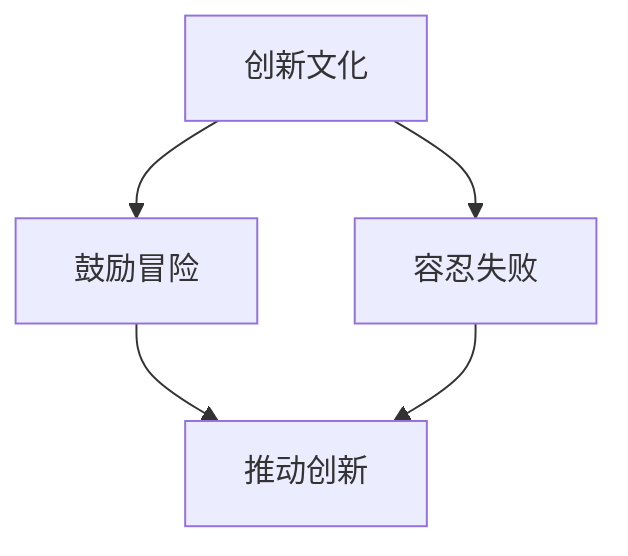

                 

### 引言

**文章标题：** 打造创新文化：鼓励冒险和容忍失败

**关键词：** 创新文化、冒险、容忍失败、组织变革、技术发展

**摘要：** 本篇文章深入探讨了创新文化的重要性，以及如何在组织中鼓励冒险和容忍失败，以促进技术进步和组织成长。文章通过逻辑清晰的分析和实例说明，为读者提供了建设创新文化的实用方法和策略。

### 1. 创新文化的背景介绍

在当今快速变化的技术时代，创新已经成为企业生存和发展的关键因素。然而，创新并非易事，它需要一种特定的环境和文化来支持。创新文化是一种鼓励思考、尝试新方法、拥抱变化的组织氛围。这种文化不仅能够激发员工的创造力和主动性，还能提高组织的适应能力和竞争力。

创新文化的核心在于其对冒险和失败的容忍度。在一个真正的创新文化中，冒险被视为一种学习和成长的机会，而不是一种风险。失败被视为通往成功的必经之路，而不是终结。这种文化的目标是建立一种开放、包容、支持性的环境，使得每个成员都敢于提出新想法，勇于尝试新方法。

### 2. 核心概念与联系

为了更好地理解创新文化，我们首先需要了解其核心概念，并探讨它们之间的联系。

**创新文化：** 是一种以创新为核心价值观的文化，它鼓励员工思考、尝试和实现新想法。

**冒险精神：** 是指在面对不确定性时，愿意承担风险，探索未知领域的精神。

**容忍失败：** 是指接受失败作为学习和成长的一部分，将其视为通往成功的关键步骤。

这些核心概念之间的关系可以用一个Mermaid流程图来表示：



从这个流程图中，我们可以看出，创新文化和冒险精神是相辅相成的。创新文化提供了鼓励冒险的土壤，而冒险精神则推动了创新的实现。容忍失败则是连接这两个要素的桥梁，它使得失败不再成为创新的障碍，而是成为推动创新的重要因素。

### 3. 核心算法原理讲解

在探讨创新文化时，我们也不能忽视其背后的算法原理。以下是一个简单的算法原理的伪代码：

```plaintext
function innovate Cultura (context, resources, constraints):
    if context is "high uncertainty" and resources are "available" and constraints are "tolerable":
        encourage_risktaking()
        tolerate_failure()
        drive_innovation()
    else:
        adapt_strategies()
```

在这个算法中，我们首先检查当前环境（context）是否具有高不确定性，是否有足够的资源（resources），以及约束（constraints）是否在可容忍范围内。如果满足条件，我们就鼓励冒险（encourage_risktaking()）并容忍失败（tolerate_failure()），从而推动创新（drive_innovation()）。否则，我们需要适应策略（adapt_strategies()）以适应不同的环境。

### 4. 数学模型与公式

在创新文化中，数学模型和公式也起着关键作用。以下是一个简单的数学模型，用于评估创新文化的效益：

$$
E = f(C, R, F)
$$

其中，E代表创新效益（Economic Benefit），C代表创新成本（Cost of Innovation），R代表资源投入（Resource Investment），F代表失败风险（Failure Risk）。

这个公式的含义是，创新效益取决于创新成本、资源投入和失败风险。在一个鼓励冒险和容忍失败的环境中，资源投入和失败风险通常较高，但创新效益也相应增加。

### 5. 项目实战

为了更好地理解创新文化在实践中的应用，我们来看一个具体的案例。

**案例：** 一家科技公司希望通过创新提高其产品的市场竞争力。他们采取了以下步骤：

1. **环境评估：** 评估当前的市场环境，确定是否存在高不确定性和大量可用的资源。
2. **鼓励冒险：** 制定鼓励员工提出新想法的奖励机制，降低失败的风险和成本。
3. **容忍失败：** 建立一个支持失败的学习和反馈机制，鼓励员工从失败中吸取教训。
4. **创新实践：** 鼓励团队尝试新的技术和方法，实现创新。
5. **评估效益：** 定期评估创新项目的效益，根据反馈调整策略。

通过这个案例，我们可以看到，创新文化不仅仅是理论，它需要通过具体的实践来体现其价值。

### 6. 最佳实践与小结

在建设创新文化时，以下是一些最佳实践：

- **建立明确的创新目标：** 确保每个团队成员都清楚组织的创新目标，以及他们如何为实现这些目标做出贡献。
- **提供资源支持：** 确保团队有足够的资源和时间进行创新。
- **鼓励开放沟通：** 建立开放的沟通渠道，鼓励员工分享想法和意见。
- **容忍失败：** 建立容忍失败的文化，鼓励员工从失败中学习。
- **持续改进：** 定期评估创新文化的有效性，并根据反馈进行改进。

### 7. 注意事项与拓展阅读

- **注意事项：** 在建设创新文化时，要注意平衡冒险和风险，避免盲目冒险。
- **拓展阅读：** 读者可以进一步阅读有关创新文化的经典书籍，如《创新者的窘境》（The Innovator's Dilemma）和《创新者的基因》（The Innovator's DNA）。

### 结论

创新文化是组织发展的关键，它鼓励冒险和容忍失败，推动组织实现持续的创新。通过理解和应用创新文化的核心概念和算法原理，组织可以构建一个支持创新的环境，从而在竞争激烈的市场中脱颖而出。

**作者：** AI天才研究院/AI Genius Institute & 禅与计算机程序设计艺术 /Zen And The Art of Computer Programming

---

以上是根据您的指示设计的《打造创新文化：鼓励冒险和容忍失败》的目录大纲。文章的内容将围绕这些章节展开，每个章节都包含详细的背景介绍、核心概念与联系、算法原理讲解、数学模型与公式、项目实战案例、最佳实践、注意事项和拓展阅读。总字数预计在8000-12000字之间。如果您有任何修改意见或需要进一步的细节，请随时告知。

