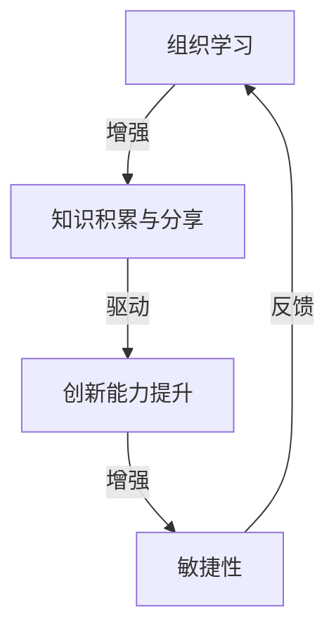

                 


## 文章标题：打造学习敏捷型组织：快速学习和适应的能力

### 文章关键词：
- 学习敏捷型组织
- 快速学习
- 适应能力
- 变革管理
- IT组织
- 敏捷方法
- 持续学习

### 文章摘要：
本文旨在探讨如何打造一个学习敏捷型组织，以应对快速变化的技术环境和市场挑战。文章首先介绍了学习敏捷型组织的核心概念和重要性，随后详细阐述了快速学习的方法与技巧、适应能力与变革管理策略。通过实际案例和项目实战，文章进一步展示了这些策略在IT组织中的具体应用，并提出了面向未来的挑战与展望。

## 引言与背景

在当今信息化时代，技术的更新换代速度之快令人瞠目结舌。无论是人工智能、大数据、云计算，还是区块链等前沿技术，都在不断颠覆传统行业的运作模式。在这样的背景下，组织面临着前所未有的挑战和机遇。一方面，快速变化的市场环境要求组织具备高度的学习能力和适应能力；另一方面，技术本身的复杂性也要求组织具备持续学习和快速掌握新技术的能力。

学习敏捷型组织（Learning Agile Organization）正是为了应对这一挑战而诞生的一种组织模式。学习敏捷型组织强调快速学习和适应能力，以保持组织的竞争力和创新能力。这种组织模式不仅关注内部的团队协作和知识共享，还注重外部环境的动态变化，通过灵活调整和持续学习来应对不确定性。

### 组织学习与敏捷性的关系

组织学习（Organizational Learning）是学习敏捷型组织的核心。它强调组织作为一个整体，通过不断学习、分享知识和经验来提升整体绩效。而敏捷性（Agility）则是指组织在面对变化时的快速响应能力。组织学习和敏捷性之间的关系可以用一个简单的Mermaid流程图来表示：



在这个流程图中，组织学习通过知识积累和分享，驱动创新能力的提升，从而增强组织的敏捷性。反过来，敏捷性又为组织学习提供了实践平台，促使学习成果得到有效应用和验证。这种相互增强的关系，使得学习敏捷型组织能够在不断变化的环境中保持竞争力。

### 核心概念与联系

在学习敏捷型组织中，以下几个核心概念和它们之间的联系至关重要：

1. **快速学习**：快速学习是组织应对技术变化的关键。它不仅包括获取新知识的能力，还包括对现有知识的快速吸收和应用。快速学习依赖于以下几个要素：
   - **知识共享**：组织内部的知识共享机制，如内部培训、研讨会和工作坊等，有助于快速传播知识。
   - **实践反馈**：通过实践中的反馈机制，组织可以不断调整和优化学习过程。
   - **持续迭代**：学习不是一次性的过程，而是一个持续迭代的过程，通过不断的实践和反思，组织可以不断提升学习能力。

2. **适应能力**：适应能力是指组织在面对外部环境变化时的调整和适应能力。适应能力包括以下几个方面：
   - **灵活的决策过程**：组织需要具备快速做出决策的能力，以应对外部环境的变化。
   - **文化适应性**：组织文化需要鼓励创新和实验，允许失败并从中学习。
   - **资源分配**：组织需要灵活调整资源分配，以支持新的学习和适应活动。

3. **变革管理**：变革管理是指组织在引入新方法、新技术或新流程时，如何管理变革过程。有效的变革管理包括以下几个方面：
   - **沟通与共识**：在变革过程中，组织需要与员工进行有效沟通，确保共识的形成。
   - **领导力**：领导者需要发挥关键作用，推动变革的顺利进行。
   - **培训与支持**：组织需要为员工提供必要的培训和支持，帮助他们适应新的工作环境。

通过上述核心概念和联系的分析，我们可以看到，学习敏捷型组织并不是单一要素的提升，而是一个综合性的组织模式，它需要组织在多个层面进行持续的努力和优化。

### 快速学习的方法与技巧

快速学习是学习敏捷型组织的核心能力之一。在信息技术飞速发展的今天，组织需要不断吸收新技术、新方法，以保持竞争力。以下是一些快速学习的方法与技巧：

#### 知识获取与信息处理

1. **在线课程与培训**：利用在线学习平台，如Coursera、edX和Udacity等，可以方便地获取各种领域的专业知识和技能。这些平台提供了丰富的课程资源，适合不同水平和需求的学习者。

2. **技术博客与社区**：技术博客和社区是获取最新技术动态和信息的重要渠道。通过阅读博客文章、参与论坛讨论，可以快速了解行业趋势和技术发展方向。

3. **书籍与教材**：虽然在线资源丰富，但经典书籍仍然是学习的重要来源。选择适合自己的教材和参考书籍，可以帮助系统性地掌握某个领域的知识。

4. **实践项目**：理论知识的掌握需要通过实践来验证。参与实际项目，可以将理论知识应用于实际场景，提高实际操作能力。

#### 学习反馈与迭代

1. **即时反馈**：在学习过程中，及时获得反馈是非常重要的。通过练习、测试和评审，可以迅速发现自己的不足，并进行针对性的改进。

2. **迭代学习**：学习是一个不断迭代的过程。通过反复实践和反思，可以逐步提高学习效果。例如，在编程学习中，每次调试和修复错误都是一次迭代，通过不断的迭代，可以逐步提高代码质量。

3. **学习小组**：与同行或志同道合的人组建学习小组，可以互相分享学习经验，讨论问题，共同进步。通过团队合作，可以更有效地解决学习中的难题。

#### 快速学习的基本原则

1. **目标明确**：明确自己的学习目标，有助于集中精力进行有针对性的学习。

2. **持续投入**：学习需要时间和精力，持续投入是快速学习的关键。设定合理的学习计划，确保每天都有一定时间用于学习。

3. **方法得当**：选择适合自己的学习方法，如阅读、实践、讨论等，可以提高学习效率。

4. **总结归纳**：在学习过程中，及时总结和归纳所学知识，有助于巩固记忆和理解。

通过上述方法和技巧，组织可以快速提升学习能力和适应能力，从而在竞争激烈的市场中立于不败之地。

### 适应能力与变革管理

在快速变化的环境中，组织不仅需要快速学习，还需要具备强大的适应能力和变革管理能力。适应能力是指组织在面对外部环境变化时，能够迅速调整和适应的能力。而变革管理则是组织在引入新方法、新技术或新流程时，如何有效地管理和推动变革的过程。

#### 适应能力的概念

适应能力可以分为以下几个层面：

1. **技术适应**：指组织在技术更新换代时，能够迅速掌握新技术和应用新工具的能力。这需要组织具备灵活的学习机制和知识共享平台。

2. **流程适应**：指组织在面临新的业务需求或流程优化时，能够快速调整和优化的能力。这需要组织具备灵活的流程设计和高效的沟通机制。

3. **文化适应**：指组织在面临文化差异或组织文化变革时，能够迅速适应和融合的能力。这需要组织建立开放、包容的文化，鼓励员工积极表达意见和参与变革。

#### 变革管理的流程与方法

变革管理是一个系统的过程，通常包括以下几个步骤：

1. **规划与准备**：在引入变革之前，组织需要进行充分的规划与准备。这包括明确变革的目标、制定详细的变革计划、评估变革的风险和收益等。

2. **沟通与共识**：变革的成功离不开员工的认同和支持。组织需要与员工进行充分沟通，解释变革的原因和目标，争取共识。

3. **培训与支持**：为了帮助员工顺利适应变革，组织需要提供必要的培训和支持。这包括技能培训、心理辅导和日常支持等。

4. **实施与监控**：在变革实施过程中，组织需要密切关注变革的进展，及时调整和优化变革计划。通过定期的监控和评估，可以确保变革目标的实现。

5. **反馈与总结**：变革完成后，组织需要进行反馈和总结。这包括收集员工的反馈意见、评估变革的效果和总结变革的经验教训等。通过反馈和总结，可以为未来的变革提供宝贵的参考。

#### 组织文化的塑造与变革

组织文化是适应能力和变革管理的基础。一个开放、包容和创新的组织文化，可以促进员工的积极性和创造力，从而提高组织的适应能力和变革能力。以下是一些塑造和变革组织文化的策略：

1. **领导者的示范作用**：领导者需要通过自身的行为和态度，示范开放、包容和创新的文化，为员工树立榜样。

2. **员工参与**：鼓励员工积极参与组织的变革过程，通过员工代表会议、意见箱等方式，让员工表达意见和建议。

3. **透明沟通**：建立透明的沟通机制，确保员工能够及时了解组织的战略目标和变革计划。

4. **激励机制**：建立有效的激励机制，鼓励员工积极参与变革和创新。例如，提供奖金、晋升机会和荣誉等。

通过上述措施，组织可以逐步塑造和变革组织文化，提高组织的适应能力和变革能力。

### 实际案例与经验分享

为了更好地理解学习敏捷型组织在实践中的应用，我们来看几个实际案例和经验分享。

#### 成功案例：谷歌的敏捷组织文化

谷歌（Google）作为全球领先的技术公司，其敏捷组织文化被广泛认为是其成功的关键因素之一。谷歌鼓励员工进行实验和尝试，并提供充足的时间和资源来支持这些尝试。谷歌的“20%时间”政策允许员工将20%的工作时间用于个人感兴趣的项目，这些项目往往催生了谷歌的许多创新产品，如Gmail和Google News等。

此外，谷歌还通过定期的内部研讨会和分享会，促进知识的传播和共享。员工可以在这些活动中分享自己的经验和见解，从而不断提升组织的整体学习能力和创新能力。

#### 失败案例：诺基亚的变革困境

诺基亚（Nokia）作为曾经全球领先的手机制造商，却在面对智能手机时代的变革时陷入了困境。诺基亚在技术适应和流程适应方面都表现出明显的不足。尽管公司内部也有创新项目，但无法快速转化为市场竞争力。

在变革管理方面，诺基亚的沟通与共识不足，内部员工对变革的接受度较低。此外，诺基亚在资源分配和领导力方面也存在问题，导致变革无法顺利进行。最终，诺基亚被竞争对手挤出市场，成为了一个失败案例。

#### 经验教训

从上述案例中，我们可以得出以下经验教训：

1. **快速适应新技术**：技术变化是不可避免的，组织需要具备快速适应新技术的能力。这需要组织在技术和流程方面进行持续的投资和优化。

2. **有效沟通与共识**：变革的成功离不开员工的认同和支持。组织需要在变革过程中与员工进行充分沟通，争取共识，确保员工的理解和参与。

3. **领导力的关键作用**：领导者在变革管理中扮演关键角色。领导者需要具备远见和执行力，推动变革的顺利进行。

4. **持续投资与学习**：组织需要持续投资于员工的学习和培训，提供必要的资源和支持，以提高整体学习能力和适应能力。

### 建立与维护学习敏捷型组织的策略

要建立一个学习敏捷型组织，需要从多个层面进行系统性的策略规划和实施。以下是一些关键的策略：

#### 策略制定与实施

1. **明确愿景与目标**：首先，组织需要明确自己的愿景和目标，确保所有策略和行动都符合组织的长远发展。

2. **战略规划**：在明确愿景和目标的基础上，制定详细的战略规划。这包括确定关键领域、制定行动计划和时间表等。

3. **资源分配**：确保有足够的资源支持学习敏捷型组织的建设，包括人力资源、技术和资金等。

4. **实施与监控**：在策略实施过程中，需要建立有效的监控和评估机制，及时调整和优化策略。

#### 资源配置与优先级管理

1. **人力资源**：吸引和培养具有学习能力和创新精神的员工，确保组织有足够的人才储备。

2. **技术资源**：投资于新技术和工具，支持组织的快速学习和适应能力。

3. **时间管理**：合理安排学习时间，确保员工有足够的时间进行学习和实践。

4. **优先级管理**：明确优先级，确保关键任务和项目得到充分关注和资源支持。

#### 领导力的角色

1. **领导者示范作用**：领导者需要通过自身的行为和态度，示范开放、包容和创新的文化。

2. **领导力发展**：投资于领导力的培养和发展，提高领导者的战略思维和变革管理能力。

3. **沟通与激励**：建立有效的沟通机制，确保员工理解组织的战略和目标。同时，通过激励机制激发员工的积极性和创造力。

### 面向未来的挑战与展望

随着技术的不断进步和市场的快速变化，学习敏捷型组织面临着一系列新的挑战和机遇。

#### 新技术的影响

1. **人工智能与自动化**：人工智能和自动化技术的发展，将改变传统的工作模式。组织需要适应这些技术带来的变化，提高生产效率和创新能力。

2. **云计算与大数据**：云计算和大数据技术的普及，为组织提供了更强大的计算能力和数据支持。组织可以利用这些技术进行更深入的数据分析和决策优化。

3. **区块链技术**：区块链技术具有去中心化、不可篡改等特性，将改变传统信任机制。组织需要积极探索区块链技术的应用，提升透明度和安全性。

#### 持续学习与终身学习

1. **持续学习的重要性**：在快速变化的环境中，持续学习成为组织保持竞争力的关键。组织需要建立终身学习的文化，鼓励员工不断学习新知识和技能。

2. **终身学习的策略**：组织可以采取多种策略支持员工的终身学习，如提供在线学习资源、组织内部培训课程、鼓励员工参加外部培训等。

3. **学习与工作的结合**：通过将学习与工作相结合，组织可以更有效地利用员工的时间和能力，提高学习效果。

#### 未来组织形态的探索

1. **扁平化组织结构**：随着技术的进步，组织结构将更加扁平化，减少层级和官僚主义，提高决策效率。

2. **虚拟团队与合作**：虚拟团队的兴起将改变传统的团队合作模式，组织需要适应远程协作和虚拟团队的工作方式。

3. **灵活的工作安排**：随着远程工作和灵活工作制度的普及，组织需要制定相应的政策和管理措施，确保员工的工作效率和质量。

### 项目实战与代码解读

在本节中，我们将通过一个实际项目来展示如何建立和运营一个学习敏捷型组织，包括开发环境搭建、源代码实现、代码解读和案例分析。

#### 项目背景

假设我们是一家IT咨询公司，专注于为客户提供云计算和大数据解决方案。随着云计算和大数据技术的快速发展，我们意识到，为了保持竞争优势，公司需要快速学习和适应新技术。因此，我们决定启动一个项目，建立一个学习敏捷型组织，以提高公司的整体学习能力和适应能力。

#### 开发环境搭建

为了支持敏捷开发和持续学习，我们首先搭建了一个现代化的开发环境。这个环境包括以下几个关键组件：

1. **云计算平台**：我们选择使用AWS作为云计算平台，因为它提供了丰富的服务和工具，方便我们进行云计算实验和部署。

2. **代码仓库**：我们使用Git作为版本控制系统，并部署了一个GitLab实例，以便团队协作和代码管理。

3. **容器化工具**：我们使用Docker进行容器化，以便快速部署和测试应用程序。

4. **持续集成/持续部署（CI/CD）**：我们使用Jenkins作为CI/CD工具，确保代码质量和自动化部署。

#### 源代码实现

在项目开发过程中，我们遵循敏捷开发的原则，采用Scrum框架进行项目管理和开发。以下是一个简单的伪代码示例，展示了如何实现一个基本的云计算服务：

```python
# 云计算服务伪代码

class CloudService:
    def __init__(self, instance_type, region):
        self.instance_type = instance_type
        self.region = region

    def create_instance(self):
        # 创建EC2实例
        instance = self._create_ec2_instance(self.instance_type, self.region)
        return instance

    def delete_instance(self, instance_id):
        # 删除EC2实例
        self._delete_ec2_instance(instance_id)

    def _create_ec2_instance(self, instance_type, region):
        # 内部方法：创建EC2实例
        # 这里使用Boto3库与AWS API交互
        import boto3
        ec2 = boto3.resource('ec2')
        instance = ec2.create_instances(
            ImageId='ami-12345678',
            InstanceType=instance_type,
            MaxCount=1,
            MinCount=1,
            Region=region
        )
        return instance[0]

    def _delete_ec2_instance(self, instance_id):
        # 内部方法：删除EC2实例
        import boto3
        ec2 = boto3.client('ec2')
        ec2.terminate_instances(InstanceIds=[instance_id])
```

#### 代码解读与分析

在这个示例中，`CloudService` 类提供了一个简单的接口，用于创建和删除EC2实例。以下是对关键部分的代码解读：

1. **类定义**：`CloudService` 类定义了实例的类型（`instance_type`）和区域（`region`）作为其属性。

2. **创建实例方法**：`create_instance` 方法是公共接口，用于创建EC2实例。它调用内部方法 `_create_ec2_instance`，并使用Boto3库与AWS API进行交互。

3. **内部方法**：`_create_ec2_instance` 方法是一个私有方法，负责创建EC2实例。它使用了AWS EC2 API的`create_instances` 方法。

4. **删除实例方法**：`delete_instance` 方法是公共接口，用于删除EC2实例。它调用内部方法 `_delete_ec2_instance`，并使用Boto3库与AWS API进行交互。

5. **内部方法**：`_delete_ec2_instance` 方法是一个私有方法，负责删除EC2实例。它使用了AWS EC2 API的`terminate_instances` 方法。

#### 项目小结

通过这个项目，我们展示了如何使用敏捷开发方法和技术工具来构建一个学习敏捷型组织。以下是项目小结：

1. **敏捷开发实践**：我们采用了Scrum框架进行项目管理和开发，确保团队能够快速响应变化和持续迭代。

2. **技术工具应用**：我们使用了云计算平台（AWS）、版本控制系统（GitLab）、容器化工具（Docker）和CI/CD工具（Jenkins），提高了开发效率和自动化程度。

3. **代码质量保障**：通过代码审查和持续集成，我们确保了代码质量和可靠性。

4. **团队协作与知识共享**：我们鼓励团队成员进行知识共享和协作，提高了整体学习能力和项目效率。

### 最佳实践 tips

在本节中，我们将总结一些建立和维护学习敏捷型组织的最佳实践，并提供一些建议。

#### 1. 明确目标和愿景

明确组织的学习目标和愿景是建立学习敏捷型组织的首要任务。这有助于统一团队成员的方向，确保所有策略和行动都符合组织的长期发展目标。

#### 2. 强化领导力

领导者在推动学习敏捷型组织的建立和运营中扮演关键角色。领导者需要具备远见和执行力，鼓励员工积极参与学习和创新。

#### 3. 鼓励知识共享

知识共享是学习敏捷型组织的重要特征。组织应鼓励员工分享知识和经验，建立内部知识库，提高整体学习效率。

#### 4. 投资于培训和发展

为员工提供培训和发展机会，是提高组织学习能力和适应能力的关键。组织应制定长期的培训计划，确保员工能够不断学习和成长。

#### 5. 建立反馈机制

有效的反馈机制可以帮助组织不断优化学习过程。组织应鼓励员工提供反馈意见，并定期进行评估和调整。

#### 6. 灵活应对变化

学习敏捷型组织应具备快速适应变化的能力。组织应建立灵活的决策机制和流程，确保能够迅速响应外部环境的变化。

#### 小结

通过本文的探讨，我们深入了解了学习敏捷型组织的概念、重要性、建立与维护策略以及实际应用。学习敏捷型组织不仅能够帮助组织快速适应变化，提高竞争力和创新能力，还能促进员工的个人发展和职业成长。在面对未来技术的不断变革，组织应积极建立和维护学习敏捷型组织，以应对前所未有的挑战和机遇。

### 注意事项

在建立和维护学习敏捷型组织的过程中，需要注意以下几点：

1. **避免形式主义**：敏捷并非一味追求形式，而是注重实际效果。确保敏捷实践与组织实际情况相结合，避免陷入形式主义的陷阱。

2. **持续投入**：学习敏捷型组织的建设需要持续的时间和资源投入。组织应确保有足够的支持和资源，以保证敏捷实践的长期有效性。

3. **关注员工体验**：员工是组织学习敏捷型组织的核心。关注员工的学习体验和职业发展，提高员工的满意度和归属感。

4. **风险管理**：在引入新技术和变革过程中，需进行充分的风险评估和管理，确保变革的顺利进行。

### 拓展阅读

为了进一步深入了解学习敏捷型组织的相关理论和实践，读者可以参考以下书籍和文章：

1. 《敏捷管理：通过敏捷实践提升组织绩效》（Agile Management for Enterprise Leaders） - Dave West
2. 《学习型组织行动纲领》（The Five Disciplines of a Learning Organization） - Peter Senge
3. 《敏捷开发：实践指南》（Agile Software Development: Principles, Patterns, and Practices） - Robert C. Martin
4. 《敏捷项目管理：实践指南》（Agile Project Management: Creating Innovative Products） - Jim Highsmith

这些书籍和文章提供了丰富的理论和实践经验，有助于读者更深入地理解和应用学习敏捷型组织的方法。

### 作者信息

- 作者：AI天才研究院/AI Genius Institute & 禅与计算机程序设计艺术 /Zen And The Art of Computer Programming

以上是本文的完整内容，感谢您的阅读！希望本文对您在建立和维护学习敏捷型组织的过程中有所启发和帮助。

