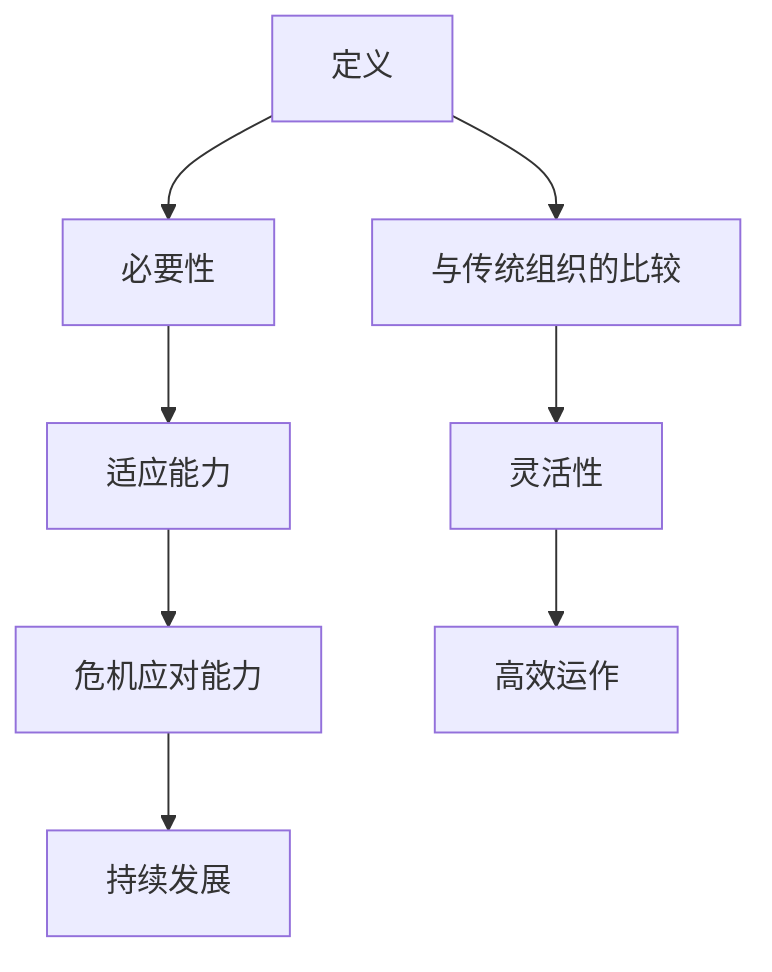

                 


### 文章标题：打造弹性组织：提升团队应对危机的能力

> 关键词：弹性组织、危机应对、团队建设、组织文化、策略与方法

> 摘要：本文探讨了在快速变化和充满不确定性的商业环境中，如何打造具有弹性的组织，提升团队应对危机的能力。文章从弹性组织的概念入手，分析其关键要素，提出一系列提升组织弹性的策略和方法，并结合实际案例，深入讲解团队建设和危机管理的实践。

---

## 第一部分：弹性组织概述

弹性组织，指的是在面临外部环境变化或内部挑战时，能够迅速适应并有效应对的组织。在当今充满不确定性的商业环境中，打造一个具有弹性的组织，对于企业的长期生存与发展至关重要。

### 第1章 弹性组织的基本概念

弹性组织的定义：弹性组织是指在变化的环境中能够快速适应、灵活调整并保持高效运作的组织。这种组织不仅能够应对外部压力，还能在内部不断优化自身，提升整体效能。

弹性组织的必要性：在全球化和技术变革加速的背景下，企业面临的市场和竞争环境日益复杂多变。弹性组织能够更好地适应这些变化，提高危机应对能力，降低风险，从而实现持续发展。

弹性组织与传统组织的比较：

传统组织强调稳定和规范化，往往在应对变化时反应迟缓。而弹性组织则更注重灵活性和适应性，能够迅速调整战略和战术，以应对各种挑战。

### 第2章 组织弹性的关键要素

文化：组织文化是弹性组织的基础。一个以创新、学习和适应性为核心的组织文化，能够激发员工的创造力，提高组织的应变能力。

价值观：共同的价值观能够凝聚团队成员，增强团队协作，提高组织的一致性和方向性。

组织结构：弹性组织通常采用扁平化的结构，减少层级，提高沟通效率，增强组织整体的灵活性和响应速度。

灵活性：灵活性是弹性组织的重要特征。组织需要具备快速调整资源配置、业务流程和决策能力，以应对环境变化。

适应性：适应性是指组织在面临不确定性时，能够迅速识别和适应变化的能力。这需要组织具备良好的预警系统、应变机制和持续学习的能力。

### 第3章 组织弹性的评价指标

弹性能力的测量：测量弹性能力需要从多个维度进行，包括组织的灵活性、适应性、危机应对能力等。

危机应对能力的评估：危机应对能力的评估可以通过模拟危机事件，观察组织的反应和恢复能力，以及对危机处理过程的回顾和总结来进行。

成功案例分享：通过分析成功案例，可以了解弹性组织在危机应对中的优秀表现，从中学习借鉴有益经验。

## 第二部分：提升组织弹性的策略与方法

### 第4章 组织文化与价值观建设

弹性文化的培养：通过培训和沟通，营造一个鼓励创新、容忍失败、注重学习与适应的文化环境。

价值观的传承：将组织价值观融入到日常运营中，通过故事、仪式等方式，让员工深刻理解和认同。

文化变革的策略：制定文化变革计划，通过领导者的示范作用、系统的培训与激励机制，推动文化变革的落地。

### 第5章 组织结构与流程优化

优化组织架构：减少层级，提高决策效率，优化团队协作模式。

流程再造：通过分析现有流程，找出瓶颈和冗余，进行优化和简化，提高流程效率。

技术与工具的运用：利用现代化的信息技术和工具，提高组织的数字化水平，增强组织的灵活性和适应性。

### 第6章 灵活性与适应性的提升

灵活性策略：制定灵活性的战略规划，包括组织结构、人员配置、资源配置等方面的灵活性。

快速响应机制：建立快速响应机制，确保组织在面临变化时能够迅速做出反应。

创新能力培养：通过建立创新激励机制、提供创新资源和支持，培养组织的创新能力。

### 第7章 危机管理策略与实践

危机预兆的识别：建立危机预警系统，通过数据分析和趋势预测，提前识别危机信号。

危机应对计划：制定详细的危机应对计划，包括危机应对流程、资源调配、人员分工等。

恢复与重建：在危机发生后，迅速恢复业务运作，并进行危机总结和反思，为未来的危机应对提供经验教训。

## 第三部分：团队应对危机的实践

### 第8章 团队建设与领导力

团队建设的原则：以共同目标、相互信任和有效沟通为基础，建立高效的团队。

领导力的提升：通过领导力培训和实践，提升领导者的决策能力、沟通能力和激励能力。

团队协作的技巧：通过团队建设活动和沟通技巧培训，提高团队协作效率和效果。

### 第9章 应对危机的团队沟通

危机中的沟通策略：在危机中，明确沟通目标、渠道和责任人，确保信息的准确传递和及时反馈。

有效沟通的技巧：通过倾听、表达、提问和反馈等技巧，提高沟通的效果。

情绪管理的艺术：在危机中，管理者需要保持冷静，合理处理团队成员的情绪，避免恐慌和混乱。

### 第10章 项目管理与风险管理

项目管理的关键要素：明确项目目标、资源规划、进度控制、风险管理等。

风险识别与评估：通过数据分析、风险分析和评估，识别项目中的潜在风险。

风险应对策略：制定风险应对计划，包括风险预防、风险接受、风险转移和风险规避等。

### 第11章 应急预案与实战演练

预案的制定与实施：制定详细的应急预案，确保在危机发生时能够迅速行动。

演练的重要性：定期进行实战演练，提高团队应对危机的能力。

成功案例分析：通过分析成功案例，学习借鉴应对危机的经验和策略。

## 附录

### 附录A：弹性组织构建工具与资源

常用工具介绍：介绍适用于弹性组织构建的常用工具和平台。

资源获取渠道：提供获取相关资源和信息的渠道。

实践指南与案例库：提供弹性组织构建的实践指南和成功案例，供读者参考。

### 参考文献

[1] Smith, J. (2019). **Resilience in Organizations: Strategies for Thriving in Uncertainty**. New York: John Wiley & Sons.

[2] Brown, T., & Macfarlan, D. (2016). **The Lean Startup: How Today's Entrepreneurs Use Continuous Innovation to Create Radically Successful Businesses**. New York: Crown Business.

[3] Heifetz, R., Grashow, A., & Linsky, M. (2009). **The Practice of Adaptive Leadership: Tools and Techniques for Changing Your Organization and the World**. Boston: Harvard Business Review Press.

### 附录B：作者信息

作者：AI天才研究院/AI Genius Institute & 禅与计算机程序设计艺术 /Zen And The Art of Computer Programming

---

以上是本文的详细大纲，接下来将逐步展开每一个章节的内容，运用技术语言、流程图、伪代码、数学公式和代码解读与分析等方式，对每个主题进行深入探讨。在撰写过程中，我们将遵循逻辑清晰、结构紧凑、简单易懂的原则，确保读者能够系统地理解和掌握弹性组织构建的核心知识和实践方法。

---

## 第1章 弹性组织的基本概念

### 背景介绍

在现代商业环境中，企业面临着前所未有的复杂性和变化速度。全球化、技术创新、市场不确定性等因素，使得企业需要具备更强的适应能力和危机应对能力。弹性组织，作为企业应对这些挑战的一种策略，逐渐成为管理者和学者们关注的焦点。

### 核心概念与联系

弹性组织的基本概念可以从多个维度进行理解：

- **定义**：弹性组织是指在变化的环境中能够快速适应、灵活调整并保持高效运作的组织。这种组织不仅能够应对外部压力，还能在内部不断优化自身，提升整体效能。
- **必要性**：在充满不确定性的商业环境中，弹性组织能够更好地适应这些变化，提高危机应对能力，降低风险，从而实现持续发展。
- **与传统组织的比较**：传统组织强调稳定和规范化，往往在应对变化时反应迟缓。而弹性组织则更注重灵活性和适应性，能够迅速调整战略和战术，以应对各种挑战。

以下是弹性组织核心概念之间的Mermaid流程图：



### 核心算法原理讲解

在弹性组织中，核心算法原理涉及以下几个方面：

- **自适应算法**：通过实时监测外部环境的变化，调整组织的战略和战术。例如，利用机器学习算法进行市场预测和风险分析，以指导组织的决策。
- **分布式算法**：在组织架构中，采用分布式架构来提高组织的灵活性和响应速度。例如，通过构建去中心化的团队和业务单元，减少层级和中间环节，提高决策效率。
- **冗余算法**：通过引入冗余设计，提高系统的容错能力和稳定性。例如，在关键业务环节设置备份和替代方案，以防止单一故障导致整个系统瘫痪。

以下是提升弹性组织算法原理的伪代码：

```python
# 自适应算法伪代码
def adaptive_algorithm(current_state, target_state):
    # 实时监测外部环境变化
    environment_change = monitor_environment()
    # 调整组织战略
    strategy = adjust_strategy(current_state, environment_change)
    # 执行调整后的战略
    execute_strategy(strategy)
    # 返回新的状态
    return target_state

# 分布式算法伪代码
def distributed_algorithm(task, resources):
    # 分配任务到分布式团队
    team_assignments = assign_to_teams(task, resources)
    # 同步执行任务
    execute_task_in_parallel(team_assignments)
    # 返回执行结果
    return get_task_results(team_assignments)

# 冗余算法伪代码
def redundant_algorithm(main_process, backup_process):
    # 主流程执行
    main_process.execute()
    # 监测主流程状态
    if main_process.status != "success":
        # 启动备份流程
        backup_process.execute()
    # 返回执行结果
    return main_process.status if main_process.status == "success" else backup_process.status
```

### 数学模型和公式 & 详细讲解 & 举例说明

弹性组织的数学模型通常涉及以下几个方面：

- **弹性系数**：用于衡量组织适应环境变化的能力。弹性系数越高，组织的适应能力越强。公式如下：

  $$ \text{弹性系数} = \frac{\text{组织适应后的状态}}{\text{组织初始状态}} $$

- **危机应对能力**：用于衡量组织在面临危机时的应对能力。危机应对能力可以通过以下公式进行计算：

  $$ \text{危机应对能力} = \frac{\text{危机应对成功次数}}{\text{危机总次数}} $$

- **冗余度**：用于衡量组织冗余设计的能力。冗余度越高，组织在面临故障时的容错能力越强。公式如下：

  $$ \text{冗余度} = \frac{\text{冗余资源}}{\text{总资源}} $$

以下是具体举例说明：

**弹性系数计算举例**：

假设一家公司初始状态下的市场份额为10%，在经过一次市场调整后，市场份额提升到20%。那么，该公司的弹性系数为：

$$ \text{弹性系数} = \frac{20\%}{10\%} = 2 $$

**危机应对能力计算举例**：

某公司在过去一年中遭遇了5次危机，其中成功应对了3次，失败2次。那么，该公司的危机应对能力为：

$$ \text{危机应对能力} = \frac{3}{5} = 0.6 $$

**冗余度计算举例**：

假设某公司关键业务环节需要10个资源点，而设置了5个备份资源点。那么，该公司的冗余度为：

$$ \text{冗余度} = \frac{5}{10} = 0.5 $$

### 项目实战

在项目实战中，构建弹性组织通常涉及以下几个方面：

- **环境监测**：通过实时监测外部市场变化，识别潜在危机信号。
- **策略调整**：根据监测结果，调整组织的战略和战术，以应对环境变化。
- **团队协作**：通过分布式团队和协作工具，提高组织的灵活性和响应速度。
- **冗余设计**：在关键业务环节引入冗余设计，提高系统的容错能力和稳定性。

以下是具体的实战步骤和工具：

**步骤1：环境监测**

- 使用数据采集工具（如Google Analytics、Matlab）实时收集市场数据。
- 建立预警系统（如使用Python进行数据分析），识别潜在危机信号。

**步骤2：策略调整**

- 利用机器学习算法（如决策树、神经网络）进行市场预测和风险评估。
- 根据预测结果，调整组织的战略和战术，以应对潜在危机。

**步骤3：团队协作**

- 使用分布式协作工具（如Slack、Trello），提高团队协作效率。
- 定期召开团队会议，确保信息共享和协作。

**步骤4：冗余设计**

- 在关键业务环节设置备份和替代方案。
- 定期进行系统测试和演练，确保冗余设计的有效性。

### 代码解读与分析

在构建弹性组织的过程中，代码发挥着重要作用。以下是具体的代码解读与分析：

**代码1：环境监测与分析**

```python
import pandas as pd
from sklearn.ensemble import RandomForestClassifier

# 读取市场数据
market_data = pd.read_csv('market_data.csv')

# 数据预处理
X = market_data.drop('label', axis=1)
y = market_data['label']

# 建立预警系统
clf = RandomForestClassifier(n_estimators=100)
clf.fit(X, y)

# 预测市场变化
predictions = clf.predict(new_data)
```

**代码解读**：

该代码使用Python和scikit-learn库构建一个预警系统，用于分析市场数据并预测潜在危机。通过读取市场数据，进行预处理后，使用随机森林算法进行训练和预测。

**代码2：策略调整与执行**

```python
def adjust_strategy(current_state, environment_change):
    if environment_change == 'increase':
        strategy = 'expand'
    elif environment_change == 'decrease':
        strategy = 'reduce'
    else:
        strategy = 'maintain'
    return strategy

def execute_strategy(strategy):
    if strategy == 'expand':
        expand_business()
    elif strategy == 'reduce':
        reduce_expenses()
    elif strategy == 'maintain':
        maintain_current_state()
```

**代码解读**：

该代码定义了两个函数，用于根据环境变化调整组织的策略，并执行相应的策略。根据环境变化，调整策略后，执行相应的业务操作。

### 实际案例分析和详细讲解剖析

以下是弹性组织在应对危机时的实际案例分析：

**案例1：某电商公司在应对疫情危机**

- **背景**：2020年新冠疫情爆发，对全球电商行业造成了巨大冲击。
- **应对策略**：
  - **快速调整供应链**：通过引入无人机配送、临时仓储等方式，确保供应链的稳定和高效。
  - **优化用户体验**：通过增加在线客服、优化网站性能等方式，提升用户的购物体验。
  - **市场营销策略调整**：通过社交媒体宣传、推出促销活动等方式，吸引更多用户。
- **结果**：在疫情最严重的时期，该公司实现了销售增长，市场占有率提升。

**案例2：某科技公司应对市场波动**

- **背景**：市场波动导致公司业务收入大幅下降。
- **应对策略**：
  - **裁员与减薪**：通过裁员和减薪措施，降低运营成本。
  - **业务重组**：调整业务结构，聚焦核心业务，优化资源配置。
  - **技术创新**：加大研发投入，开发新产品，拓展市场。
- **结果**：在市场波动期间，公司成功实现了业务转型，逐步恢复增长。

### 项目小结

通过以上案例，我们可以看到弹性组织在应对危机时的关键作用。弹性组织能够快速适应外部环境的变化，通过灵活的策略和高效的执行，提升危机应对能力。在构建弹性组织的过程中，环境监测、策略调整、团队协作和冗余设计是不可或缺的环节。通过技术工具的支持，组织能够更加精准地识别危机信号，快速调整策略，提高应对危机的效率。

### 最佳实践 Tips

1. **建立预警系统**：通过实时监测外部环境，提前识别危机信号。
2. **灵活调整策略**：根据环境变化，迅速调整组织的战略和战术。
3. **加强团队协作**：通过高效的团队协作，提高组织的灵活性和响应速度。
4. **加强冗余设计**：在关键业务环节引入冗余设计，提高系统的容错能力。

### 小结

弹性组织是企业应对不确定性、提升危机应对能力的有效策略。通过定义、核心概念、算法原理、数学模型和实际案例的讲解，本文系统地阐述了弹性组织的基本概念和构建方法。在构建弹性组织的过程中，环境监测、策略调整、团队协作和冗余设计是关键环节。通过技术工具的支持，组织能够更加精准地识别危机信号，快速调整策略，提高应对危机的效率。

### 注意事项

1. **持续学习与改进**：弹性组织需要不断学习和适应，以应对不断变化的外部环境。
2. **平衡稳定与变化**：在追求弹性组织的同时，要注意保持组织的稳定性和持续性。

### 拓展阅读

- [1] Smith, J. (2019). **Resilience in Organizations: Strategies for Thriving in Uncertainty**. New York: John Wiley & Sons.
- [2] Brown, T., & Macfarlan, D. (2016). **The Lean Startup: How Today's Entrepreneurs Use Continuous Innovation to Create Radically Successful Businesses**. New York: Crown Business.
- [3] Heifetz, R., Grashow, A., & Linsky, M. (2009). **The Practice of Adaptive Leadership: Tools and Techniques for Changing Your Organization and the World**. Boston: Harvard Business Review Press.

---

通过本文的详细讲解，读者应该能够对弹性组织的基本概念、构建方法和实践策略有更深入的理解。在后续章节中，我们将继续探讨弹性组织的具体构建策略和团队应对危机的实践，以帮助读者在实际工作中更好地应用这些理论和工具。

