                 


### 第1章：自动化测试概述

#### 1.1 自动化测试的定义与发展

自动化测试（Automated Testing）是指利用软件工具自动执行测试过程，代替手工测试的一种方法。它起源于20世纪80年代，随着计算机技术和软件工程的不断发展，自动化测试逐渐成为软件开发过程中的重要环节。

**核心概念与联系**

在理解自动化测试时，我们需要关注以下几个核心概念：

1. **测试用例（Test Case）**：测试用例是针对软件功能或性能的一个特定场景的详细描述，包括输入数据、测试步骤、预期结果等。

2. **测试脚本（Test Script）**：测试脚本是用某种编程语言编写的，用于自动化执行测试用例的代码。

3. **自动化测试工具**：自动化测试工具是用于编写、执行和报告自动化测试的软件。

4. **持续集成（Continuous Integration，CI）**：持续集成是一种软件开发实践，通过持续地集成代码库中的代码，快速发现和解决集成过程中的问题。

下面是一个简单的Mermaid流程图，展示自动化测试的基本流程：

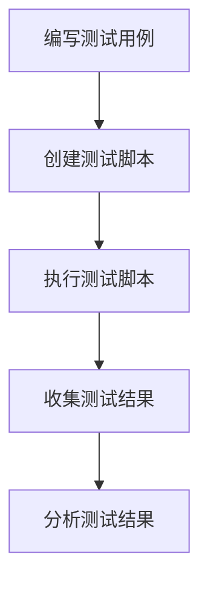

**详细讲解**

自动化测试的定义可以进一步细化：

- **测试用例**：测试用例是测试过程中最小的单元，用于验证软件的特定功能或性能。一个好的测试用例应该包括明确的输入数据、测试步骤和预期结果。

- **测试脚本**：测试脚本是用编程语言编写的，用于自动化执行测试用例的代码。常见的编程语言有Python、Java、C#等。

- **自动化测试工具**：自动化测试工具提供了创建、执行和报告自动化测试的功能。常见的自动化测试工具有Selenium、JUnit、NUnit等。

- **持续集成**：持续集成是一种软件开发实践，通过持续地将代码集成到主干分支，快速发现和解决集成过程中的问题。自动化测试是持续集成的重要组成部分。

**发展历程**

自动化测试的发展历程可以分为几个阶段：

1. **手动测试阶段**：早期的软件测试主要依靠手工测试，测试人员需要手动执行测试用例。

2. **早期自动化测试阶段**：随着计算机技术的发展，测试人员开始尝试使用自动化测试工具，如QTP（现在的UFT）。

3. **成熟自动化测试阶段**：现代自动化测试工具和框架（如Selenium、JUnit）的出现，使得自动化测试变得更加普及和高效。

4. **智能化自动化测试阶段**：随着人工智能技术的发展，智能化自动化测试逐渐成为趋势，通过机器学习、自然语言处理等技术，实现测试用例的自动生成、执行和分析。

**总结**

自动化测试是一种重要的软件测试方法，通过自动化测试工具和框架，可以大幅提高测试效率，减少人力成本。在软件开发过程中，自动化测试已经成为不可或缺的一部分。

### 1.2 自动化测试的优势与挑战

#### 1.2.1 自动化测试的优势

自动化测试相对于手工测试具有以下优势：

1. **提高测试效率**：自动化测试可以快速执行大量测试用例，显著提高测试效率。

2. **增强测试可靠性**：自动化测试减少了人为因素，提高了测试结果的可靠性。

3. **节省人力成本**：自动化测试可以减少对测试人员的需求，节省人力成本。

4. **提高测试覆盖率**：自动化测试可以覆盖更多的测试场景，提高测试覆盖率。

5. **支持持续集成**：自动化测试与持续集成（CI）相结合，可以快速发现和解决集成过程中的问题。

#### 1.2.2 自动化测试的挑战

尽管自动化测试具有显著的优势，但同时也面临一些挑战：

1. **测试脚本维护困难**：自动化测试脚本需要不断更新和维护，以适应软件的变更。

2. **对测试人员技能要求较高**：编写和维护自动化测试脚本需要具备一定的编程技能。

3. **初始成本较高**：自动化测试需要投入一定的成本，包括购买自动化测试工具、培训测试人员等。

4. **对测试环境的依赖性**：自动化测试需要特定的测试环境，如模拟器、浏览器等。

5. **测试数据的准备**：自动化测试需要准备高质量的测试数据，这通常是一个复杂和耗时的工作。

**详细讲解**

**优势**

1. **提高测试效率**：自动化测试可以同时执行多个测试用例，而手工测试通常只能一个一个执行。例如，一个自动化测试脚本可以在几分钟内完成100个测试用例的执行，而手工测试可能需要测试人员数天的时间。

2. **增强测试可靠性**：自动化测试减少了人为因素，如疲劳、注意力不集中等。自动化测试脚本可以严格按照预定的步骤执行，确保测试结果的准确性。

3. **节省人力成本**：自动化测试可以减少对测试人员的需求。例如，一个测试人员可能需要数天时间手工执行100个测试用例，而自动化测试只需要一个测试人员花费几个小时编写和配置测试脚本。

4. **提高测试覆盖率**：自动化测试可以覆盖更多的测试场景。例如，一个自动化测试脚本可以同时测试不同浏览器、操作系统和硬件配置的兼容性。

5. **支持持续集成**：自动化测试与持续集成（CI）相结合，可以在代码提交后立即执行测试，快速发现和解决集成过程中的问题。这有助于提高软件质量，减少软件发布时间。

**挑战**

1. **测试脚本维护困难**：自动化测试脚本需要不断更新和维护，以适应软件的变更。例如，如果软件的用户界面发生更改，测试脚本可能需要重新编写。

2. **对测试人员技能要求较高**：编写和维护自动化测试脚本需要具备一定的编程技能。这要求测试人员不仅要理解软件的业务逻辑，还需要熟悉编程语言和测试工具。

3. **初始成本较高**：自动化测试需要投入一定的成本，包括购买自动化测试工具、培训测试人员等。例如，一个成熟的自动化测试工具可能需要数千美元的费用。

4. **对测试环境的依赖性**：自动化测试需要特定的测试环境，如模拟器、浏览器等。这可能导致测试环境的维护成本较高。

5. **测试数据的准备**：自动化测试需要准备高质量的测试数据，这通常是一个复杂和耗时的工作。例如，对于性能测试，可能需要准备大量的测试数据，以确保测试结果的准确性。

**总结**

自动化测试在提高测试效率、增强测试可靠性、节省人力成本等方面具有显著的优势。然而，自动化测试也面临一些挑战，如测试脚本维护困难、对测试人员技能要求较高等。在实际应用中，需要综合考虑这些因素，以决定是否采用自动化测试。

### 1.3 自动化测试的类型与适用场景

自动化测试可以根据测试目的和对象的不同，分为多种类型。以下是几种常见的自动化测试类型及其适用场景：

#### 功能测试（Functional Testing）

功能测试是最常见的自动化测试类型，它用于验证软件的功能是否按照预期工作。功能测试通常包括以下方面：

- **单元测试（Unit Testing）**：测试软件中的最小功能单元，如一个方法或一个类。

- **集成测试（Integration Testing）**：测试多个模块或组件的集成，确保它们能够协同工作。

- **系统测试（System Testing）**：测试整个系统的功能，确保系统的各个部分能够正常协同工作。

- **验收测试（Acceptance Testing）**：测试软件是否满足用户需求，是否可以交付给用户。

适用场景：功能测试适用于任何需要验证软件功能是否正确实现的场景，如Web应用、桌面应用、移动应用等。

#### 性能测试（Performance Testing）

性能测试用于评估软件在特定工作负载下的性能，如响应时间、吞吐量、资源利用率等。性能测试通常包括以下方面：

- **负载测试（Load Testing）**：模拟多个用户同时访问系统，评估系统的负载能力。

- **压力测试（Stress Testing）**：施加超过系统正常负载的测试，以检查系统的稳定性。

- **容量规划（Capacity Planning）**：确定系统可以处理的用户数量和资源需求。

适用场景：性能测试适用于需要确保软件在高峰期能够稳定运行的场景，如电商平台、在线游戏、银行系统等。

#### 安全测试（Security Testing）

安全测试用于评估软件的安全性，确保软件不受恶意攻击和漏洞的影响。安全测试通常包括以下方面：

- **漏洞扫描（Vulnerability Scanning）**：使用自动化工具扫描软件中的漏洞。

- **渗透测试（Penetration Testing）**：模拟黑客攻击，尝试突破系统的安全防护。

- **安全配置检查（Security Configuration Check）**：检查系统的安全配置是否符合最佳实践。

适用场景：安全测试适用于需要确保软件安全的场景，如金融系统、电商平台、政府系统等。

#### 兼容性测试（Compatibility Testing）

兼容性测试用于确保软件在不同的操作系统、浏览器、硬件等环境下能够正常运行。兼容性测试通常包括以下方面：

- **跨浏览器测试（Cross-Browser Testing）**：测试软件在不同浏览器上的兼容性。

- **跨平台测试（Cross-Platform Testing）**：测试软件在不同操作系统上的兼容性。

- **跨设备测试（Cross-Device Testing）**：测试软件在不同设备（如手机、平板电脑、桌面电脑等）上的兼容性。

适用场景：兼容性测试适用于需要确保软件在不同环境下都能正常运行的场景，如Web应用、跨平台应用等。

**总结**

自动化测试的类型丰富多样，每种测试类型都有其特定的目的和应用场景。在实际测试过程中，可以根据软件的特点和需求，选择合适的测试类型，以实现最优的测试效果。功能测试、性能测试、安全测试和兼容性测试等类型的自动化测试，在提高软件质量、降低风险方面发挥着重要作用。

### 第2章：智能化测试技术

#### 2.1 智能化测试的概念与原理

智能化测试（Intelligent Testing）是一种利用人工智能（Artificial Intelligence，AI）技术来改进自动化测试的方法。与传统的自动化测试不同，智能化测试能够通过学习、分析和自适应，提高测试效率和准确性。

**核心概念**

智能化测试涉及以下几个核心概念：

1. **机器学习（Machine Learning）**：机器学习是人工智能的核心技术，通过训练模型，使计算机能够从数据中自动学习规律和模式。

2. **测试用例生成（Test Case Generation）**：测试用例生成是智能化测试的一个重要应用，通过机器学习算法，自动生成符合要求的测试用例。

3. **缺陷预测（Defect Prediction）**：缺陷预测是利用历史数据，通过机器学习算法，预测哪些代码片段可能存在缺陷，从而有针对性地进行测试。

4. **测试优化（Test Optimization）**：测试优化是指通过分析测试结果，优化测试用例和测试过程，提高测试效率和准确性。

**原理**

智能化测试的原理主要基于以下几个方面：

1. **数据驱动**：智能化测试依赖于大量的测试数据和代码数据，通过分析这些数据，找出潜在的缺陷和问题。

2. **模型训练**：利用机器学习算法，训练模型，使模型能够识别代码中的缺陷和问题。

3. **自适应**：智能化测试系统能够根据测试结果和代码变更，自适应地调整测试策略和用例，确保测试的全面性和有效性。

4. **自动化**：智能化测试实现了测试过程的自动化，减少了人工干预，提高了测试效率。

**Mermaid流程图**

下面是一个简化的Mermaid流程图，展示智能化测试的基本流程：

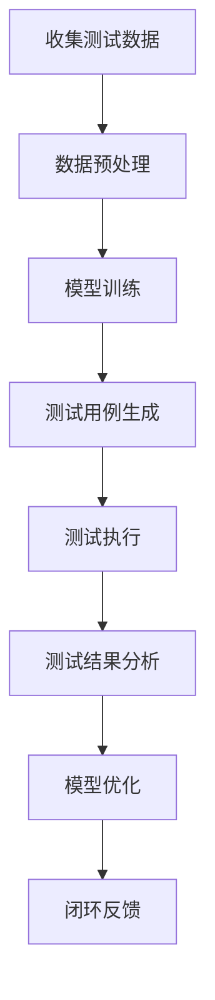

**详细讲解**

智能化测试的核心在于如何利用机器学习技术来改进自动化测试。以下是智能化测试的几个关键步骤：

1. **数据收集**：智能化测试需要大量的测试数据，包括测试结果、代码变更日志、错误报告等。这些数据将用于训练机器学习模型。

2. **数据预处理**：收集到的数据通常需要进行清洗、格式化和归一化等处理，以便于模型训练。

3. **模型训练**：利用机器学习算法，如决策树、随机森林、神经网络等，训练模型，使模型能够识别代码中的缺陷和问题。

4. **测试用例生成**：基于训练好的模型，智能化测试系统能够自动生成新的测试用例，提高测试覆盖率。

5. **测试执行**：自动化执行生成的测试用例，收集测试结果。

6. **测试结果分析**：分析测试结果，识别潜在的缺陷和问题。

7. **模型优化**：根据测试结果，对模型进行调整和优化，提高模型的准确性。

8. **闭环反馈**：将优化后的模型应用于新的测试数据，形成一个闭环反馈系统，不断迭代和改进。

通过以上步骤，智能化测试能够实现以下目标：

- **提高测试效率**：通过自动生成测试用例，减少了人工编写测试用例的工作量，提高了测试效率。

- **提高测试质量**：利用机器学习模型，智能化测试能够更准确地识别潜在的缺陷，提高测试质量。

- **自适应调整**：智能化测试系统能够根据测试结果和代码变更，自适应地调整测试策略和用例，确保测试的全面性和有效性。

**举例说明**

假设我们使用一个简单的决策树模型来预测代码中的缺陷。假设我们的特征包括代码行的长度、函数的复杂性等。我们可以使用以下伪代码来表示决策树模型：

```python
def predict_defect(features):
    if features['line_length'] > 100:
        return "High Risk"
    elif features['function_complexity'] > 10:
        return "Medium Risk"
    else:
        return "Low Risk"
```

通过这个简单的决策树模型，我们可以预测代码行的风险等级，从而针对性地进行测试。

**总结**

智能化测试是一种利用人工智能技术来改进自动化测试的方法。通过数据驱动、模型训练、自适应调整和自动化执行，智能化测试能够提高测试效率和质量。在未来，智能化测试有望成为自动化测试的重要组成部分。

#### 2.2 人工智能在自动化测试中的应用

人工智能（Artificial Intelligence，AI）在自动化测试中的应用越来越广泛，它通过模拟人类思维过程，提高测试效率和准确性。以下是人工智能在自动化测试中的几个关键应用：

**测试用例自动生成**

测试用例自动生成是人工智能在自动化测试中最重要的应用之一。传统的测试用例编写通常需要测试人员根据业务需求和分析，手动编写大量的测试用例。而人工智能通过学习历史测试数据和业务逻辑，可以自动生成新的测试用例。

**算法原理**

测试用例自动生成主要依赖于自然语言处理（Natural Language Processing，NLP）和机器学习（Machine Learning，ML）技术。以下是一个简化的测试用例自动生成的算法原理：

1. **数据收集**：收集历史测试数据，包括测试用例、测试结果和错误报告等。

2. **数据预处理**：对收集到的数据进行清洗、归一化和特征提取，使其适合机器学习模型。

3. **模型训练**：利用机器学习算法，如决策树、随机森林、神经网络等，训练模型，使其能够从数据中学习测试用例的生成规则。

4. **测试用例生成**：基于训练好的模型，自动生成新的测试用例。

**伪代码示例**

以下是一个简化的测试用例自动生成的伪代码示例：

```python
def generate_test_cases(business_logic):
    # 数据预处理
    preprocessed_data = preprocess_data(business_logic)
    
    # 模型训练
    model = train_model(preprocessed_data)
    
    # 测试用例生成
    test_cases = []
    for input_data in business_logic:
        test_case = generate_test_case(model, input_data)
        test_cases.append(test_case)
    
    return test_cases
```

**测试用例自动生成的好处**

1. **提高测试效率**：通过自动生成测试用例，减少了人工编写测试用例的工作量，提高了测试效率。

2. **提高测试覆盖率**：自动生成的测试用例能够覆盖更多的测试场景，提高测试覆盖率。

3. **减少测试成本**：自动生成测试用例可以降低测试成本，减少对测试人员的依赖。

**缺陷预测**

缺陷预测是人工智能在自动化测试中的另一个重要应用。通过分析代码和历史缺陷数据，人工智能可以预测哪些代码片段可能存在缺陷，从而有针对性地进行测试。

**算法原理**

缺陷预测主要依赖于机器学习和统计模型。以下是一个简化的缺陷预测算法原理：

1. **数据收集**：收集代码变更日志、缺陷报告和测试数据。

2. **数据预处理**：对收集到的数据进行清洗、归一化和特征提取。

3. **模型训练**：利用机器学习算法，如决策树、随机森林、神经网络等，训练模型，使其能够从数据中学习缺陷预测的规则。

4. **缺陷预测**：基于训练好的模型，对新的代码片段进行缺陷预测。

**伪代码示例**

以下是一个简化的缺陷预测的伪代码示例：

```python
def predict_defects(code_chunks):
    # 数据预处理
    preprocessed_data = preprocess_data(code_chunks)
    
    # 模型训练
    model = train_model(preprocessed_data)
    
    # 缺陷预测
    defect_predictions = []
    for code_chunk in code_chunks:
        prediction = predict_defect(model, code_chunk)
        defect_predictions.append(prediction)
    
    return defect_predictions
```

**缺陷预测的好处**

1. **提高测试针对性**：通过预测可能存在缺陷的代码片段，测试人员可以更有针对性地进行测试，提高测试效率。

2. **减少测试成本**：通过提前识别可能存在缺陷的代码片段，可以减少不必要的测试，降低测试成本。

3. **提高软件质量**：通过提前识别和修复缺陷，可以提高软件的质量，减少用户投诉和修复成本。

**测试脚本优化**

测试脚本优化是人工智能在自动化测试中的另一个重要应用。通过分析测试脚本和历史测试数据，人工智能可以优化测试脚本，提高测试效率和准确性。

**算法原理**

测试脚本优化主要依赖于代码分析、机器学习和自然语言处理技术。以下是一个简化的测试脚本优化的算法原理：

1. **数据收集**：收集测试脚本、测试结果和错误报告等数据。

2. **数据预处理**：对收集到的数据进行清洗、归一化和特征提取。

3. **模型训练**：利用机器学习算法，如决策树、随机森林、神经网络等，训练模型，使其能够从数据中学习测试脚本的优化规则。

4. **测试脚本优化**：基于训练好的模型，优化测试脚本。

**伪代码示例**

以下是一个简化的测试脚本优化的伪代码示例：

```python
def optimize_test_script(test_script):
    # 数据预处理
    preprocessed_data = preprocess_data(test_script)
    
    # 模型训练
    model = train_model(preprocessed_data)
    
    # 测试脚本优化
    optimized_script = optimize_script(model, test_script)
    
    return optimized_script
```

**测试脚本优化的好处**

1. **提高测试效率**：通过优化测试脚本，可以提高测试执行的速度，减少测试时间。

2. **提高测试准确性**：通过优化测试脚本，可以减少错误和遗漏，提高测试准确性。

3. **降低维护成本**：通过优化测试脚本，可以减少测试脚本的维护工作量，降低维护成本。

**总结**

人工智能在自动化测试中的应用，通过测试用例自动生成、缺陷预测和测试脚本优化等技术，可以提高测试效率和质量。随着人工智能技术的不断发展，智能化测试将越来越成为自动化测试的重要组成部分。

#### 2.3 智能化测试工具与框架介绍

随着人工智能技术的不断发展，越来越多的智能化测试工具和框架被开发出来，以帮助提高自动化测试的效率和准确性。以下是一些常见的智能化测试工具和框架的介绍：

**Selenium**

Selenium是一款开源的自动化测试工具，用于测试Web应用。Selenium支持多种编程语言，如Python、Java、C#等，可以运行在不同的操作系统上，如Windows、Linux和macOS。Selenium的核心功能包括：

- **Webdriver API**：提供了一套标准化的API，用于编写自动化测试脚本。

- **浏览器兼容性测试**：支持多种浏览器，如Chrome、Firefox、Safari和Edge，可以测试不同浏览器的兼容性。

- **跨浏览器测试**：支持在不同的浏览器和操作系统上同时运行测试脚本。

**Robot Framework**

Robot Framework是一款开源的测试自动化框架，适用于各种类型的测试，包括功能测试、性能测试、API测试等。Robot Framework的核心特点包括：

- **简单易用**：Robot Framework使用简单的Python语法，使得编写测试脚本变得非常容易。

- **模块化**：Robot Framework支持模块化编程，可以自定义库和测试资源，提高测试代码的可维护性。

- **丰富库**：Robot Framework提供了丰富的内置库，支持多种类型的测试，如Web测试库、Selenium库、REST API库等。

- **插件扩展**：Robot Framework支持插件扩展，可以方便地集成其他工具和库。

**AI-driven Testing**

AI-driven Testing是一款基于人工智能的自动化测试工具，专注于提高测试效率和准确性。AI-driven Testing的核心功能包括：

- **测试用例自动生成**：利用机器学习算法，自动生成符合要求的测试用例。

- **缺陷预测**：利用历史数据和机器学习模型，预测哪些代码片段可能存在缺陷。

- **测试脚本优化**：基于测试结果和代码变更，自动优化测试脚本。

- **测试数据分析**：分析测试结果，提供详细的测试报告和趋势分析。

**Intelligent Automation**

Intelligent Automation是一款集成了人工智能和自动化测试功能的平台，旨在提高软件质量。Intelligent Automation的核心功能包括：

- **自动化测试**：支持各种类型的自动化测试，包括功能测试、性能测试、安全测试等。

- **AI分析**：利用人工智能技术，分析测试结果，提供智能化的测试优化建议。

- **持续集成**：与持续集成工具（如Jenkins、GitLab等）集成，实现自动化测试和持续集成的无缝对接。

- **数据驱动**：支持数据驱动测试，通过数据驱动测试，提高测试覆盖率和准确性。

**总结**

智能化测试工具和框架的出现，为自动化测试带来了新的可能性和机会。Selenium、Robot Framework、AI-driven Testing和Intelligent Automation等工具和框架，通过引入人工智能技术，提高了测试效率和准确性。随着技术的不断进步，智能化测试将在未来的自动化测试中扮演越来越重要的角色。

### 第3章：自动化测试平台架构设计

#### 3.1 自动化测试平台架构设计原则

设计一个高效的自动化测试平台，需要遵循一系列的原则，以确保平台的可扩展性、可靠性和维护性。以下是几个关键的设计原则：

**高可扩展性**

自动化测试平台需要能够轻松地扩展，以适应不断增加的测试需求。这包括能够支持更多的测试用例、测试环境和测试工具。为了实现高可扩展性，平台设计应该采用模块化架构，使得各个模块可以独立开发和维护。

**高可靠性**

自动化测试平台必须具备高可靠性，以确保测试结果的准确性和一致性。这要求平台在执行测试时能够稳定运行，不受外部环境的影响。为了实现高可靠性，平台设计应考虑冗余设计，例如使用多台服务器和负载均衡技术，确保在某个服务器故障时，测试任务可以无缝切换到其他服务器。

**易于维护**

自动化测试平台应该易于维护，以降低运营成本。这包括简化测试脚本的开发和维护过程，提供清晰的文档和监控工具。为了实现易于维护，平台设计应采用可重用组件，减少重复代码，并使用版本控制系统管理代码变更。

**高灵活性**

自动化测试平台需要具备高灵活性，以适应不同的测试需求和业务场景。这包括支持多种测试类型（如功能测试、性能测试和安全测试），以及支持多种测试工具和框架。为了实现高灵活性，平台设计应采用插件机制，允许轻松集成第三方工具和库。

**安全性**

自动化测试平台必须保证测试过程和数据的安全性。这包括对测试数据加密、使用安全的通信协议，以及确保测试脚本的执行不会对生产环境造成潜在的风险。为了实现安全性，平台设计应遵循安全最佳实践，例如使用容器化技术隔离测试环境和生产环境。

**详细讲解**

**高可扩展性**

高可扩展性是自动化测试平台设计的关键原则之一。随着软件项目的复杂性和规模的增长，测试需求也会不断增加。为了应对这一挑战，平台设计应该采用模块化架构。模块化架构将平台划分为多个独立的部分，每个部分负责特定的功能。例如，可以划分为测试用例管理模块、测试执行模块、测试报告模块等。

这种模块化架构具有以下优势：

1. **独立开发与维护**：每个模块可以独立开发、测试和维护，降低整个平台的复杂性。
2. **易于扩展**：新增测试需求时，只需扩展相关模块，无需修改其他模块。
3. **重用性**：模块可以重用于其他项目或场景，提高开发效率。

**示例：模块化架构**

以下是一个简化的自动化测试平台模块化架构示例：

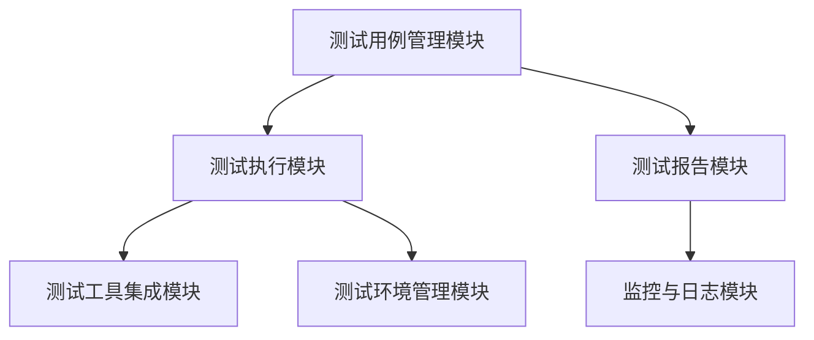

**高可靠性**

高可靠性是自动化测试平台设计的重要原则。在自动化测试过程中，平台可能会遇到各种异常情况，如测试脚本错误、测试环境不稳定、网络中断等。为了确保测试平台的可靠性，设计时应考虑以下措施：

1. **冗余设计**：使用多台服务器和负载均衡技术，确保在一个服务器出现故障时，其他服务器可以接管任务。
2. **故障恢复**：设计自动故障恢复机制，例如在测试脚本执行失败时，自动重试或切换到备用脚本。
3. **监控与报警**：实时监控测试平台的运行状态，并在出现问题时及时报警，以便快速响应和解决问题。

**示例：冗余设计**

以下是一个简化的冗余设计示例：

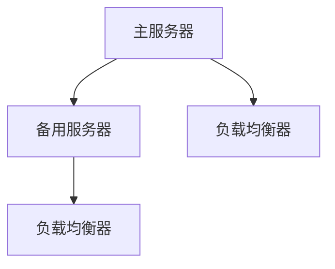

**易于维护**

易于维护是自动化测试平台设计的另一个关键原则。为了实现这一目标，平台设计应考虑以下几点：

1. **可重用组件**：使用可重用组件，减少重复代码，提高开发效率。
2. **文档化**：为每个模块和功能提供详细的文档，包括设计文档、用户手册和开发指南。
3. **版本控制**：使用版本控制系统（如Git）管理代码变更，确保代码的稳定性和可追溯性。

**示例：可重用组件**

以下是一个简化的可重用组件示例：

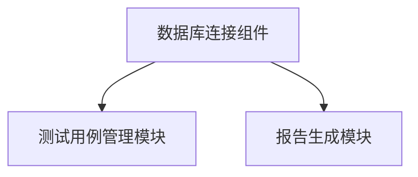

**高灵活性**

高灵活性是自动化测试平台设计的重要原则。软件项目的测试需求可能随时发生变化，平台需要能够灵活地适应这些变化。为了实现高灵活性，平台设计应考虑以下几点：

1. **插件机制**：使用插件机制，允许第三方工具和库轻松集成到平台中。
2. **配置管理**：使用配置管理工具，如Ansible或Puppet，管理测试环境和配置。
3. **API接口**：提供统一的API接口，方便与其他系统和工具集成。

**示例：插件机制**

以下是一个简化的插件机制示例：

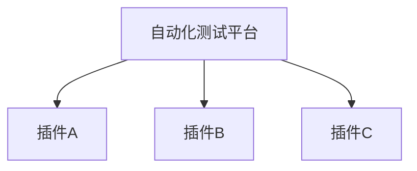

**安全性**

安全性是自动化测试平台设计的关键原则。测试平台必须确保测试过程和数据的安全，以防止未经授权的访问和数据泄露。为了实现安全性，平台设计应考虑以下几点：

1. **数据加密**：对测试数据进行加密，确保数据在传输和存储过程中安全。
2. **安全协议**：使用安全的通信协议，如HTTPS，确保数据传输的安全。
3. **权限管理**：实现严格的权限管理，确保只有授权用户可以访问测试数据和执行测试任务。

**示例：数据加密**

以下是一个简化的数据加密示例：

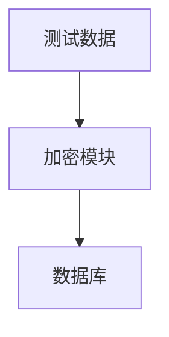

**总结**

设计一个高效的自动化测试平台，需要遵循一系列的原则，包括高可扩展性、高可靠性、易于维护、高灵活性、安全性等。通过这些原则，可以确保平台能够适应不断变化的测试需求，提高测试效率和质量。

### 3.2 测试平台功能模块划分

为了实现一个高效的自动化测试平台，我们需要将其划分为多个功能模块，每个模块负责特定的功能。以下是自动化测试平台常见的功能模块划分及其作用：

#### 测试用例管理模块

测试用例管理模块负责测试用例的创建、存储、管理和执行。其主要功能包括：

- **测试用例创建**：支持手动创建和自动生成测试用例。
- **测试用例存储**：将测试用例存储在数据库中，便于管理和查询。
- **测试用例执行**：自动化执行测试用例，并记录测试结果。
- **测试用例维护**：支持测试用例的更新、删除和查询。

#### 测试执行模块

测试执行模块负责执行测试用例，并收集测试结果。其主要功能包括：

- **测试脚本管理**：存储和管理测试脚本，支持脚本编辑、编译和执行。
- **测试环境管理**：管理测试环境，包括虚拟机、容器、浏览器等。
- **测试执行**：自动化执行测试用例，并在执行过程中记录测试结果。
- **异常处理**：在测试执行过程中，处理异常情况，例如测试失败、网络中断等。

#### 测试结果分析模块

测试结果分析模块负责分析测试结果，并提供详细的报告。其主要功能包括：

- **测试结果存储**：将测试结果存储在数据库中，便于后续分析。
- **测试结果分析**：对测试结果进行分析，识别潜在的问题和缺陷。
- **报告生成**：生成详细的测试报告，包括测试覆盖率、缺陷分布、趋势分析等。
- **监控与报警**：实时监控测试执行过程，并在出现问题时及时报警。

#### 测试工具集成模块

测试工具集成模块负责集成各种自动化测试工具和框架，以提高测试效率和灵活性。其主要功能包括：

- **测试工具管理**：管理各种自动化测试工具，如Selenium、JUnit、NUnit等。
- **工具集成**：提供统一的接口，将不同工具和框架集成到测试平台中。
- **插件扩展**：支持插件扩展，允许用户自定义测试工具和框架。

#### 测试环境管理模块

测试环境管理模块负责管理测试环境，包括虚拟机、容器、浏览器等。其主要功能包括：

- **环境配置**：配置测试环境，包括操作系统、浏览器版本、数据库等。
- **环境部署**：部署测试环境，包括安装软件、配置网络等。
- **环境监控**：实时监控测试环境的运行状态，确保环境稳定可靠。

#### 测试报告模块

测试报告模块负责生成和发布测试报告，为测试人员和管理人员提供决策依据。其主要功能包括：

- **报告生成**：生成详细的测试报告，包括测试覆盖率、缺陷分布、趋势分析等。
- **报告发布**：发布测试报告，支持多种格式，如HTML、PDF、CSV等。
- **报告订阅**：支持测试人员和管理人员订阅测试报告，及时获取最新的测试结果。

#### 测试用例管理模块

测试用例管理模块负责测试用例的创建、存储、管理和执行。其主要功能包括：

- **测试用例创建**：支持手动创建和自动生成测试用例。
- **测试用例存储**：将测试用例存储在数据库中，便于管理和查询。
- **测试用例执行**：自动化执行测试用例，并记录测试结果。
- **测试用例维护**：支持测试用例的更新、删除和查询。

#### 测试执行模块

测试执行模块负责执行测试用例，并收集测试结果。其主要功能包括：

- **测试脚本管理**：存储和管理测试脚本，支持脚本编辑、编译和执行。
- **测试环境管理**：管理测试环境，包括虚拟机、容器、浏览器等。
- **测试执行**：自动化执行测试用例，并在执行过程中记录测试结果。
- **异常处理**：在测试执行过程中，处理异常情况，例如测试失败、网络中断等。

#### 测试结果分析模块

测试结果分析模块负责分析测试结果，并提供详细的报告。其主要功能包括：

- **测试结果存储**：将测试结果存储在数据库中，便于后续分析。
- **测试结果分析**：对测试结果进行分析，识别潜在的问题和缺陷。
- **报告生成**：生成详细的测试报告，包括测试覆盖率、缺陷分布、趋势分析等。
- **监控与报警**：实时监控测试执行过程，并在出现问题时及时报警。

#### 测试工具集成模块

测试工具集成模块负责集成各种自动化测试工具和框架，以提高测试效率和灵活性。其主要功能包括：

- **测试工具管理**：管理各种自动化测试工具，如Selenium、JUnit、NUnit等。
- **工具集成**：提供统一的接口，将不同工具和框架集成到测试平台中。
- **插件扩展**：支持插件扩展，允许用户自定义测试工具和框架。

#### 测试环境管理模块

测试环境管理模块负责管理测试环境，包括虚拟机、容器、浏览器等。其主要功能包括：

- **环境配置**：配置测试环境，包括操作系统、浏览器版本、数据库等。
- **环境部署**：部署测试环境，包括安装软件、配置网络等。
- **环境监控**：实时监控测试环境的运行状态，确保环境稳定可靠。

#### 测试报告模块

测试报告模块负责生成和发布测试报告，为测试人员和管理人员提供决策依据。其主要功能包括：

- **报告生成**：生成详细的测试报告，包括测试覆盖率、缺陷分布、趋势分析等。
- **报告发布**：发布测试报告，支持多种格式，如HTML、PDF、CSV等。
- **报告订阅**：支持测试人员和管理人员订阅测试报告，及时获取最新的测试结果。

#### 测试用例管理模块

测试用例管理模块负责测试用例的创建、存储、管理和执行。其主要功能包括：

- **测试用例创建**：支持手动创建和自动生成测试用例。
- **测试用例存储**：将测试用例存储在数据库中，便于管理和查询。
- **测试用例执行**：自动化执行测试用例，并记录测试结果。
- **测试用例维护**：支持测试用例的更新、删除和查询。

#### 测试执行模块

测试执行模块负责执行测试用例，并收集测试结果。其主要功能包括：

- **测试脚本管理**：存储和管理测试脚本，支持脚本编辑、编译和执行。
- **测试环境管理**：管理测试环境，包括虚拟机、容器、浏览器等。
- **测试执行**：自动化执行测试用例，并在执行过程中记录测试结果。
- **异常处理**：在测试执行过程中，处理异常情况，例如测试失败、网络中断等。

#### 测试结果分析模块

测试结果分析模块负责分析测试结果，并提供详细的报告。其主要功能包括：

- **测试结果存储**：将测试结果存储在数据库中，便于后续分析。
- **测试结果分析**：对测试结果进行分析，识别潜在的问题和缺陷。
- **报告生成**：生成详细的测试报告，包括测试覆盖率、缺陷分布、趋势分析等。
- **监控与报警**：实时监控测试执行过程，并在出现问题时及时报警。

#### 测试工具集成模块

测试工具集成模块负责集成各种自动化测试工具和框架，以提高测试效率和灵活性。其主要功能包括：

- **测试工具管理**：管理各种自动化测试工具，如Selenium、JUnit、NUnit等。
- **工具集成**：提供统一的接口，将不同工具和框架集成到测试平台中。
- **插件扩展**：支持插件扩展，允许用户自定义测试工具和框架。

#### 测试环境管理模块

测试环境管理模块负责管理测试环境，包括虚拟机、容器、浏览器等。其主要功能包括：

- **环境配置**：配置测试环境，包括操作系统、浏览器版本、数据库等。
- **环境部署**：部署测试环境，包括安装软件、配置网络等。
- **环境监控**：实时监控测试环境的运行状态，确保环境稳定可靠。

#### 测试报告模块

测试报告模块负责生成和发布测试报告，为测试人员和管理人员提供决策依据。其主要功能包括：

- **报告生成**：生成详细的测试报告，包括测试覆盖率、缺陷分布、趋势分析等。
- **报告发布**：发布测试报告，支持多种格式，如HTML、PDF、CSV等。
- **报告订阅**：支持测试人员和管理人员订阅测试报告，及时获取最新的测试结果。

### 3.3 自动化测试平台架构实现

实现一个高效的自动化测试平台，需要综合考虑技术选型、系统集成和性能优化等方面。以下是自动化测试平台架构的实现方法：

**技术选型**

**前端技术**：选择易于维护和扩展的前端框架，如React或Vue.js，用于开发用户界面。

**后端技术**：选择高性能、易扩展的后端框架，如Spring Boot或Django，用于处理业务逻辑和数据存储。

**数据库**：选择关系型数据库，如MySQL或PostgreSQL，用于存储测试数据和测试结果。

**测试工具**：选择合适的自动化测试工具，如Selenium、JUnit或NUnit，用于执行测试用例。

**系统集成**

**接口集成**：设计统一的API接口，将前端、后端和测试工具集成在一起，确保数据流和功能的一致性。

**数据流集成**：设计数据流处理流程，确保测试数据能够顺畅地在各个模块之间传递。

**监控与报警**：集成监控和报警工具，如Prometheus和Alertmanager，实时监控平台运行状态，并在出现问题时及时报警。

**性能优化**

**负载均衡**：使用负载均衡器，如Nginx或HAProxy，分配测试任务到多台服务器，提高系统性能和可靠性。

**缓存策略**：使用缓存技术，如Redis或Memcached，减少数据库访问压力，提高系统响应速度。

**分布式存储**：使用分布式存储系统，如HDFS或Cassandra，提高数据存储的可靠性和扩展性。

**代码优化**：对关键代码进行性能优化，如使用数据库索引、优化查询语句等。

**示例：自动化测试平台架构实现**

以下是一个简化的自动化测试平台架构实现示例：

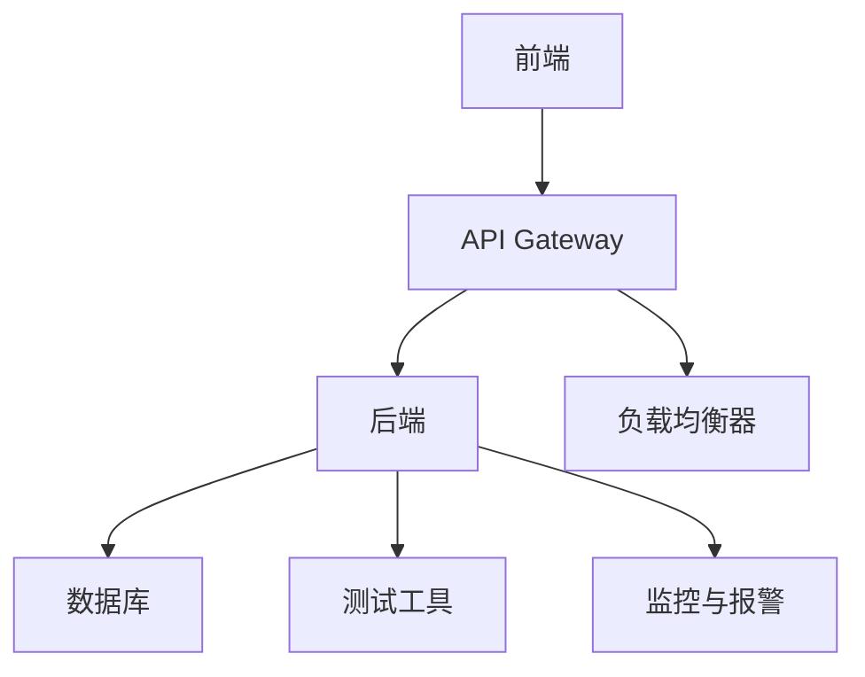

**实现步骤**

1. **需求分析**：明确自动化测试平台的需求，包括功能需求、性能需求和安全性需求。

2. **技术选型**：选择合适的前端、后端技术、数据库和测试工具。

3. **设计架构**：设计自动化测试平台的架构，包括前端、后端、数据库、测试工具和监控模块。

4. **开发前端**：使用React或Vue.js开发用户界面，提供测试用例管理、测试执行和测试报告等功能。

5. **开发后端**：使用Spring Boot或Django开发后端，处理业务逻辑和数据存储。

6. **集成测试工具**：将Selenium、JUnit或NUnit集成到后端，实现测试用例的自动化执行。

7. **数据流处理**：设计数据流处理流程，确保测试数据能够在前端、后端和测试工具之间顺畅传递。

8. **性能优化**：对关键代码进行性能优化，提高系统响应速度和稳定性。

9. **部署上线**：将自动化测试平台部署到生产环境，进行性能测试和稳定性测试。

10. **监控与维护**：实时监控平台运行状态，定期进行性能优化和维护。

**总结**

实现一个高效的自动化测试平台，需要综合考虑技术选型、系统集成和性能优化等方面。通过合理的架构设计和优化，可以确保平台具有良好的性能、可靠性和扩展性，满足不断增长的测试需求。

### 第4章：测试数据管理和处理

#### 4.1 测试数据管理的重要性

在自动化测试中，测试数据的管理和处理至关重要。测试数据不仅包括测试用例中的输入数据，还包括测试过程中生成的中间数据和最终的测试结果。合理管理和处理测试数据，可以显著提高测试效率和测试质量。

**重要性**

1. **确保测试结果准确性**：测试数据的质量直接影响测试结果的准确性。如果测试数据存在错误或缺陷，可能导致测试结果不准确，影响软件质量。

2. **提高测试覆盖率和效果**：通过合理管理测试数据，可以确保测试用例全面覆盖软件功能，提高测试覆盖率和测试效果。

3. **支持缺陷分析和定位**：测试数据提供了缺陷发生的上下文信息，有助于测试人员分析和定位缺陷，提高问题解决效率。

4. **优化测试策略和过程**：通过分析测试数据，测试人员可以优化测试策略和过程，提高测试效率和质量。

**Mermaid流程图**

以下是测试数据管理的基本流程Mermaid流程图：

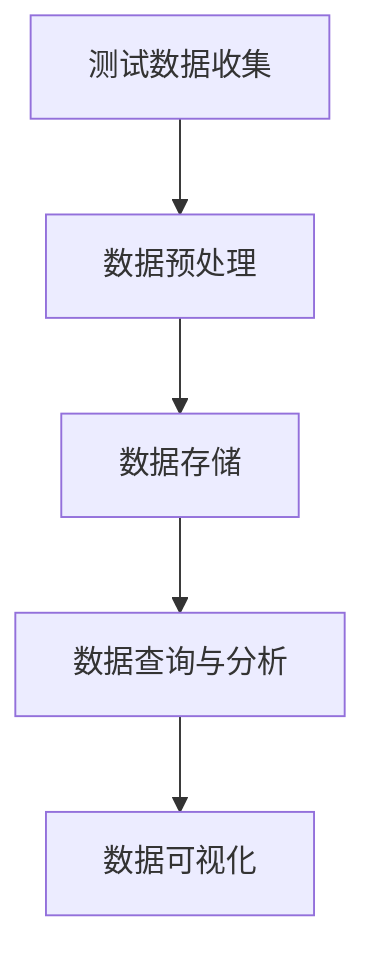

**详细讲解**

1. **测试数据收集**：测试数据收集是测试数据管理的基础。测试数据可以从多种途径获取，如测试脚本、数据库、日志文件等。收集到的测试数据应存储在统一的测试数据管理系统中，以便后续处理和分析。

2. **数据预处理**：测试数据通常需要经过预处理才能进行有效的分析和处理。预处理步骤包括数据清洗、格式转换、数据归一化等。数据清洗的目的是去除无效数据和错误数据，保证数据质量。数据归一化是将不同来源的数据统一成相同的格式，便于后续分析。

3. **数据存储**：测试数据存储是测试数据管理的重要环节。选择合适的存储方案，如关系型数据库、NoSQL数据库或分布式存储系统，可以保证测试数据的持久化和安全性。测试数据应按需存储，避免存储过多的冗余数据。

4. **数据查询与分析**：测试数据查询与分析是测试数据管理的关键步骤。通过查询和分析测试数据，测试人员可以了解软件的运行状态、性能表现和缺陷分布。数据分析可以采用统计分析、数据挖掘等技术，帮助发现潜在的问题和趋势。

5. **数据可视化**：测试数据可视化是将测试数据以图形化的方式展示出来，便于测试人员理解和分析。常见的可视化工具包括图表、报表和仪表盘等。数据可视化有助于提高测试数据的可读性和可理解性，使测试人员能够更快速地发现问题和做出决策。

**示例**

假设我们正在测试一个电子商务网站，需要管理以下类型的测试数据：

- **用户数据**：包括用户ID、姓名、邮箱、密码等。
- **订单数据**：包括订单ID、商品名称、数量、总价等。
- **交易数据**：包括交易ID、时间戳、支付方式、支付状态等。

以下是一个简单的数据预处理和存储示例：

```python
# 数据预处理
def preprocess_data(data):
    # 清洗无效数据和错误数据
    cleaned_data = [d for d in data if is_valid_data(d)]
    # 数据归一化
    normalized_data = normalize_data(cleaned_data)
    return normalized_data

# 数据存储
def store_data(data):
    # 存储到数据库
    database.insert_data(data)

# 测试数据查询与分析
def query_and_analyze_data():
    # 从数据库查询测试数据
    data = database.query_data()
    # 分析数据，生成报告
    report = analyze_data(data)
    return report

# 数据可视化
def visualize_data(data):
    # 生成图表
    chart = generate_chart(data)
    # 显示图表
    display_chart(chart)
```

**总结**

测试数据管理和处理是自动化测试的重要环节。通过合理的数据收集、预处理、存储、查询和分析，可以提高测试效率和测试质量。测试数据的可视化展示有助于测试人员快速理解和分析测试结果，从而更好地管理测试过程。

### 4.2 测试数据处理方法

在自动化测试过程中，测试数据的处理是一个关键环节。测试数据处理方法包括数据清洗、数据转换、数据归一化和数据存储等步骤。以下是详细讲解和示例：

**数据清洗**

数据清洗是处理测试数据的第一步，目的是去除无效数据和错误数据，保证数据质量。常见的数据清洗方法包括：

1. **去除重复数据**：通过比对数据记录，去除重复的数据条目。
2. **填充缺失值**：使用平均值、中位数或插值法等方法填充缺失的数据。
3. **处理异常值**：识别并处理异常值，如明显偏离正常范围的数据。
4. **去除噪声数据**：去除对测试无影响的数据，如无关的日志信息。

**示例：Python代码**

```python
import pandas as pd

# 读取测试数据
data = pd.read_csv('test_data.csv')

# 去除重复数据
data.drop_duplicates(inplace=True)

# 填充缺失值
data.fillna(method='mean', inplace=True)

# 处理异常值
data = data[data['value'] > 0]

# 去除噪声数据
data = data[data['feature'] != 'noise']
```

**数据转换**

数据转换是将不同格式的数据统一成相同的格式，以便后续处理。常见的数据转换方法包括：

1. **数据格式转换**：如将日期字符串转换成日期格式。
2. **数据类型转换**：如将字符串转换成整数或浮点数。
3. **数据映射**：将一个数据值映射到另一个值，如将0映射到“无效”，1映射到“有效”。

**示例：Python代码**

```python
# 日期格式转换
data['date'] = pd.to_datetime(data['date'])

# 数据类型转换
data['value'] = data['value'].astype(float)

# 数据映射
data['status'] = data['value'].map({0: '无效', 1: '有效'})
```

**数据归一化**

数据归一化是将不同特征的数据值转换到相同的尺度上，以便比较和分析。常见的数据归一化方法包括：

1. **最小-最大规范化**：将数据缩放到[0, 1]区间。
2. **Z-score标准化**：将数据标准化到均值为0，标准差为1的区间。
3. **幂函数变换**：使用幂函数将数据转换到合适的形式。

**示例：Python代码**

```python
# 最小-最大规范化
data_normalized = (data - data.min()) / (data.max() - data.min())

# Z-score标准化
data_zscore = (data - data.mean()) / data.std()

# 幂函数变换
data_power = data.apply(lambda x: x**2)
```

**数据存储**

数据存储是将处理后的测试数据存储到数据库或其他存储介质中，以便后续查询和分析。常见的数据存储方法包括：

1. **关系型数据库**：如MySQL、PostgreSQL，适用于结构化数据存储。
2. **NoSQL数据库**：如MongoDB、Cassandra，适用于非结构化数据存储。
3. **分布式存储系统**：如HDFS、Cassandra，适用于大规模数据存储。

**示例：SQL代码**

```sql
-- 创建数据库
CREATE DATABASE test_data_db;

-- 创建表
CREATE TABLE test_data (
    id INT PRIMARY KEY,
    feature VARCHAR(255),
    value FLOAT,
    date DATE
);

-- 插入数据
INSERT INTO test_data (id, feature, value, date) VALUES (1, 'feature1', 10.0, '2023-01-01');

-- 查询数据
SELECT * FROM test_data WHERE feature = 'feature1';
```

**总结**

测试数据处理方法包括数据清洗、数据转换、数据归一化和数据存储等步骤。通过合理的数据处理方法，可以提高测试数据的准确性和一致性，为自动化测试提供可靠的数据支持。

### 4.3 测试数据管理工具与框架

在自动化测试中，测试数据管理工具和框架至关重要，它们能够帮助测试人员高效地管理和处理测试数据，提高测试质量和效率。以下是几种常见的测试数据管理工具和框架的介绍：

**JUnit**

JUnit是一款流行的Java单元测试框架，它提供了丰富的API和功能，用于编写、执行和报告单元测试。JUnit的核心功能包括：

- **断言**：JUnit提供了多种断言方法，如assertEquals、assertTrue等，用于验证测试结果。
- **测试套件**：JUnit支持测试套件，允许将多个测试用例组合成一个测试套件，方便批量执行。
- **测试报告**：JUnit提供了详细的测试报告，包括测试结果、失败原因和用时等。

**Selenium**

Selenium是一款开源的自动化测试工具，主要用于Web应用的自动化测试。Selenium支持多种编程语言，如Java、Python、C#等，可以运行在不同的操作系统上。Selenium的核心功能包括：

- **浏览器自动化**：Selenium支持多种浏览器，如Chrome、Firefox、Safari和Edge，可以模拟用户操作，如点击、输入、滚动等。
- **测试脚本**：Selenium提供了丰富的API，可以编写测试脚本，自动化执行Web应用测试。
- **跨浏览器测试**：Selenium支持跨浏览器测试，可以在不同浏览器上同时运行测试脚本，确保Web应用的兼容性。

**TestNG**

TestNG是一款功能强大的测试框架，用于编写、执行和报告各种类型的测试，如单元测试、集成测试、端到端测试等。TestNG的核心功能包括：

- **测试分组**：TestNG支持测试分组，可以根据不同的测试需求将测试用例划分为多个组，方便批量执行。
- **数据驱动测试**：TestNG支持数据驱动测试，可以从外部文件读取测试数据，提高测试用例的灵活性。
- **并行测试**：TestNG支持并行测试，可以在多台机器上同时运行测试用例，提高测试效率。

**JUnit**

JUnit是一款流行的Java单元测试框架，它提供了丰富的API和功能，用于编写、执行和报告单元测试。JUnit的核心功能包括：

- **断言**：JUnit提供了多种断言方法，如assertEquals、assertTrue等，用于验证测试结果。
- **测试套件**：JUnit支持测试套件，允许将多个测试用例组合成一个测试套件，方便批量执行。
- **测试报告**：JUnit提供了详细的测试报告，包括测试结果、失败原因和用时等。

**Selenium**

Selenium是一款开源的自动化测试工具，主要用于Web应用的自动化测试。Selenium支持多种编程语言，如Java、Python、C#等，可以运行在不同的操作系统上。Selenium的核心功能包括：

- **浏览器自动化**：Selenium支持多种浏览器，如Chrome、Firefox、Safari和Edge，可以模拟用户操作，如点击、输入、滚动等。
- **测试脚本**：Selenium提供了丰富的API，可以编写测试脚本，自动化执行Web应用测试。
- **跨浏览器测试**：Selenium支持跨浏览器测试，可以在不同浏览器上同时运行测试脚本，确保Web应用的兼容性。

**TestNG**

TestNG是一款功能强大的测试框架，用于编写、执行和报告各种类型的测试，如单元测试、集成测试、端到端测试等。TestNG的核心功能包括：

- **测试分组**：TestNG支持测试分组，可以根据不同的测试需求将测试用例划分为多个组，方便批量执行。
- **数据驱动测试**：TestNG支持数据驱动测试，可以从外部文件读取测试数据，提高测试用例的灵活性。
- **并行测试**：TestNG支持并行测试，可以在多台机器上同时运行测试用例，提高测试效率。

**Robot Framework**

Robot Framework是一款开源的测试自动化框架，适用于各种类型的测试，包括功能测试、性能测试、API测试等。Robot Framework的核心特点包括：

- **简单易用**：Robot Framework使用简单的Python语法，使得编写测试脚本变得非常容易。
- **模块化**：Robot Framework支持模块化编程，可以自定义库和测试资源，提高测试代码的可维护性。
- **丰富库**：Robot Framework提供了丰富的内置库，支持多种类型的测试，如Web测试库、Selenium库、REST API库等。
- **插件扩展**：Robot Framework支持插件扩展，可以方便地集成其他工具和库。

**总结**

测试数据管理工具和框架是自动化测试的重要组成部分。JUnit、Selenium、TestNG和Robot Framework等工具和框架提供了丰富的功能和API，帮助测试人员高效地管理和处理测试数据，提高测试质量和效率。在实际应用中，可以根据项目需求和测试类型选择合适的工具和框架。

### 第5章：自动化测试工具和框架

#### 5.1 常见自动化测试工具介绍

在自动化测试领域，有许多工具和框架被广泛应用，以帮助测试人员提高测试效率和准确性。以下是一些常见的自动化测试工具及其特点：

**Selenium**

Selenium是一款开源的自动化测试工具，用于测试Web应用。它支持多种编程语言，如Java、Python、C#等，可以运行在不同的操作系统上，如Windows、Linux和macOS。Selenium的核心特点包括：

- **跨浏览器支持**：Selenium支持多种浏览器，如Chrome、Firefox、Safari和Edge，可以确保Web应用的兼容性。
- **模拟用户操作**：Selenium可以模拟用户的操作，如点击、输入、滚动等，提高测试的全面性。
- **集成简单**：Selenium易于与其他自动化测试工具和框架集成，如TestNG、Jenkins等。

**JUnit**

JUnit是一款流行的Java单元测试框架，它提供了丰富的API和功能，用于编写、执行和报告单元测试。JUnit的核心特点包括：

- **断言功能**：JUnit提供了多种断言方法，如assertEquals、assertTrue等，用于验证测试结果。
- **测试套件**：JUnit支持测试套件，可以将多个测试用例组合成一个测试套件，方便批量执行。
- **插件支持**：JUnit与Eclipse、IntelliJ IDEA等集成开发环境（IDE）紧密集成，提供了良好的用户体验。

**TestNG**

TestNG是一款功能强大的测试框架，用于编写、执行和报告各种类型的测试，如单元测试、集成测试、端到端测试等。TestNG的核心特点包括：

- **测试分组**：TestNG支持测试分组，可以根据不同的测试需求将测试用例划分为多个组，方便批量执行。
- **数据驱动测试**：TestNG支持数据驱动测试，可以从外部文件读取测试数据，提高测试用例的灵活性。
- **并行测试**：TestNG支持并行测试，可以在多台机器上同时运行测试用例，提高测试效率。

**Appium**

Appium是一款开源的自动化测试工具，主要用于测试移动应用。Appium支持多种移动操作系统，如iOS和Android，可以运行在不同的设备上。Appium的核心特点包括：

- **跨平台支持**：Appium支持iOS和Android平台，可以确保移动应用的兼容性。
- **模拟用户操作**：Appium可以模拟用户的操作，如点击、输入、滚动等，提高测试的全面性。
- **灵活的脚本编写**：Appium支持多种编程语言，如Java、Python、C#等，方便测试人员编写和执行测试脚本。

**Robot Framework**

Robot Framework是一款开源的测试自动化框架，适用于各种类型的测试，包括功能测试、性能测试、API测试等。Robot Framework的核心特点包括：

- **简单易用**：Robot Framework使用简单的Python语法，使得编写测试脚本变得非常容易。
- **模块化**：Robot Framework支持模块化编程，可以自定义库和测试资源，提高测试代码的可维护性。
- **丰富库**：Robot Framework提供了丰富的内置库，支持多种类型的测试，如Web测试库、Selenium库、REST API库等。

**总结**

Selenium、JUnit、TestNG、Appium和Robot Framework等自动化测试工具具有各自的特点和优势。在实际项目中，可以根据测试需求选择合适的工具，以提高测试效率和准确性。

### 5.2 自动化测试框架概述

自动化测试框架是自动化测试的核心组成部分，它提供了一个统一的接口，用于编写、执行和报告测试用例。一个优秀的自动化测试框架应该具备以下特性：

**特性**

1. **模块化**：自动化测试框架应该支持模块化编程，使得测试代码易于维护和扩展。

2. **可重用性**：自动化测试框架应该提供可重用的组件和库，减少重复代码，提高开发效率。

3. **可配置性**：自动化测试框架应该支持测试参数和配置的灵活配置，以满足不同的测试需求。

4. **集成性**：自动化测试框架应该能够与不同的自动化测试工具和持续集成（CI）工具集成，提供统一的管理和执行接口。

5. **扩展性**：自动化测试框架应该具备良好的扩展性，允许开发人员自定义测试库和功能模块。

**设计原则**

1. **单一职责原则**：每个模块和组件应该只负责一项功能，以提高代码的可读性和可维护性。

2. **依赖倒置原则**：使用依赖注入和接口编程，降低模块之间的耦合度，提高系统的灵活性和可扩展性。

3. **开闭原则**：系统应该对扩展开放，对修改关闭，即在不修改原有代码的情况下，可以方便地添加新的功能。

4. **组合复用原则**：通过组合和复用已有的模块和组件，快速构建新的测试用例和测试场景。

**Mermaid流程图**

以下是一个简化的自动化测试框架设计的基本流程Mermaid流程图：

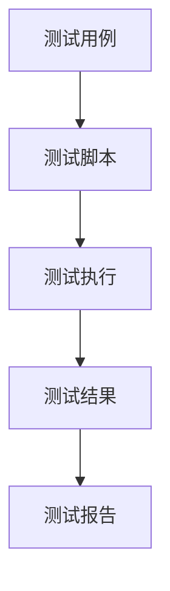

**详细讲解**

**模块化**

模块化是自动化测试框架设计的重要原则之一。通过将测试用例、测试脚本、测试执行和测试报告等组件划分为独立的模块，可以提高代码的可读性和可维护性。每个模块可以独立开发、测试和维护，降低了系统的复杂度。

**示例：模块化设计**

```python
# 测试用例模块
class TestCase:
    def __init__(self, name):
        self.name = name
    
    def execute(self):
        # 测试执行逻辑
        pass

# 测试脚本模块
class TestScript:
    def __init__(self, test_cases):
        self.test_cases = test_cases
    
    def run(self):
        for case in self.test_cases:
            case.execute()

# 测试执行模块
class TestExecutor:
    def __init__(self, test_script):
        self.test_script = test_script
    
    def execute_tests(self):
        self.test_script.run()

# 测试报告模块
class TestReport:
    def __init__(self, test_executor):
        self.test_executor = test_executor
    
    def generate_report(self):
        # 生成测试报告逻辑
        pass
```

**可重用性**

自动化测试框架应该提供可重用的组件和库，以减少重复代码，提高开发效率。例如，可以提供通用的测试库，用于处理常见的测试任务，如数据验证、界面操作等。

**示例：可重用测试库**

```python
# 数据验证库
def assert_equal(actual, expected):
    assert actual == expected, f"实际值：{actual}，预期值：{expected}"

# 界面操作库
from selenium import webdriver

def open_url(url):
    driver = webdriver.Chrome()
    driver.get(url)
```

**可配置性**

自动化测试框架应该支持测试参数和配置的灵活配置，以满足不同的测试需求。例如，可以通过配置文件或命令行参数，配置测试环境、测试数据等。

**示例：配置文件**

```python
# config.py
TEST_URL = "http://example.com"
BROWSER = "chrome"
```

**集成性**

自动化测试框架应该能够与不同的自动化测试工具和持续集成（CI）工具集成，提供统一的管理和执行接口。例如，可以与Jenkins、GitLab等CI工具集成，实现自动化测试的持续执行和报告。

**示例：与Jenkins集成**

```xml
<project>
    <actions>
        <hudson.model.ParametersAction>
            <parameters>
                <hudson.model.StringParameterDefinition>
                    <name>test_url</name>
                    <description>测试URL</description>
                    <defaultValue>http://example.com</defaultValue>
                </hudson.model.StringParameterDefinition>
                <hudson.model.StringParameterDefinition>
                    <name>browser</name>
                    <description>浏览器</description>
                    <defaultValue>chrome</defaultValue>
                </hudson.model.StringParameterDefinition>
            </parameters>
        </hudson.model.ParametersAction>
    </actions>
    <description>自动化测试项目</description>
    <scm class="hudson.scm.NullSCM"/>
    <canRoam>false</canRoam>
    < housedownsamplingStrategy class="hudson.triggers.BuildTriggerStrategy"/>
    <triggers>
        <hudson.triggers.SCMTrigger>
            <spec>H/5 * * *</spec>
        </hudson.triggers.SCMTrigger>
    </triggers>
    <concurrentBuild>false</concurrentBuild>
    <builders>
        <hudson.tasks.Maven>
            <goals>clean install</goals>
            <configurations>
                <hudson.tasks.Maven.BuildWrapperConfiguration>
                    <name>test_config</name>
                    <executors>
                        <hudson.model.SingleExecutors>
                            <name>test_executor</name>
                        </hudson.model.SingleExecutors>
                    </executors>
                    <primaryOwner>test_owner</primaryOwner>
                    <triggers>
                        <hudson.triggers.SCMTrigger>
                            <spec>H/5 * * *</spec>
                        </hudson.triggers.SCMTrigger>
                    </triggers>
                </hudson.tasks.Maven.BuildWrapperConfiguration>
            </configurations>
        </hudson.tasks.Maven>
    </builders>
</project>
```

**扩展性**

自动化测试框架应该具备良好的扩展性，允许开发人员自定义测试库和功能模块。例如，可以通过插件机制，方便地集成第三方工具和库，满足不同的测试需求。

**示例：插件机制**

```python
# 测试框架核心
class TestFramework:
    def __init__(self, plugin_loader):
        self.plugin_loader = plugin_loader
    
    def load_plugins(self, plugins):
        for plugin in plugins:
            self.plugin_loader.load_plugin(plugin)

# 插件接口
class IPlugin:
    def load(self):
        pass

# 测试插件
class TestPlugin(IPlugin):
    def load(self):
        print("加载测试插件")
```

**总结**

自动化测试框架是自动化测试的重要组成部分，它提供了一个统一的接口，用于编写、执行和报告测试用例。通过模块化、可重用性、可配置性、集成性和扩展性等设计原则，可以构建一个高效、灵活和可维护的自动化测试框架，满足不同测试需求。

### 5.3 自动化测试框架设计与实现

设计并实现一个自动化测试框架是一个复杂的过程，需要综合考虑测试需求、系统架构和开发实践。以下是一个自动化测试框架的设计与实现步骤，以及具体的代码示例。

**1. 确定测试需求**

在设计自动化测试框架之前，首先要明确测试需求，包括测试类型（如功能测试、性能测试、安全测试等）、测试范围（如Web应用、移动应用等）和测试目标。例如，假设我们设计一个用于Web应用的自动化测试框架。

**2. 选择合适的框架和工具**

根据测试需求，选择合适的框架和工具。常用的自动化测试框架有Selenium、TestNG、JUnit等。工具方面，可以选择Python、Java等编程语言，以及数据库、日志记录等辅助工具。

**3. 设计框架架构**

自动化测试框架的架构设计是关键，需要考虑模块化、可重用性和可扩展性。以下是自动化测试框架的基本架构：

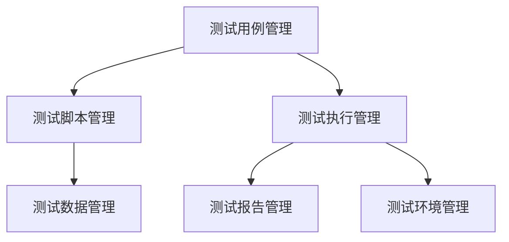

**4. 编写核心代码**

根据架构设计，编写核心代码。以下是自动化测试框架的核心代码示例：

**测试用例管理**

```python
class TestCase:
    def __init__(self, name, test_case_id):
        self.name = name
        self.test_case_id = test_case_id
    
    def execute(self):
        # 测试执行逻辑
        pass
```

**测试脚本管理**

```python
class TestScript:
    def __init__(self, test_cases):
        self.test_cases = test_cases
    
    def run(self):
        for case in self.test_cases:
            case.execute()
```

**测试执行管理**

```python
class TestExecutor:
    def __init__(self, test_script):
        self.test_script = test_script
    
    def execute_tests(self):
        self.test_script.run()
```

**测试报告管理**

```python
class TestReport:
    def __init__(self, test_executor):
        self.test_executor = test_executor
    
    def generate_report(self):
        # 生成测试报告逻辑
        pass
```

**测试数据管理**

```python
class TestDataManager:
    def __init__(self, data_source):
        self.data_source = data_source
    
    def get_data(self):
        # 获取测试数据逻辑
        pass
```

**测试环境管理**

```python
class TestEnvironmentManager:
    def __init__(self, environment_config):
        self.environment_config = environment_config
    
    def setup_environment(self):
        # 环境配置和设置逻辑
        pass
```

**5. 集成第三方工具和库**

将第三方工具和库集成到自动化测试框架中，以实现更强大的功能。例如，可以使用Selenium进行Web自动化测试，使用Appium进行移动应用自动化测试，使用JDBC进行数据库操作等。

**示例：集成Selenium**

```python
from selenium import webdriver

class SeleniumWebDriver:
    def __init__(self, browser='chrome'):
        self.browser = browser
    
    def open(self, url):
        if self.browser == 'chrome':
            self.driver = webdriver.Chrome()
        elif self.browser == 'firefox':
            self.driver = webdriver.Firefox()
        self.driver.get(url)
```

**6. 测试和调试**

在开发过程中，不断测试和调试代码，确保框架的功能正确实现，性能稳定可靠。

**7. 文档和文档化**

编写详细的文档和文档化代码，包括框架设计文档、用户手册和开发指南，以方便后续开发和维护。

**总结**

通过以上步骤，我们可以设计并实现一个自动化测试框架。框架的设计与实现过程需要充分考虑测试需求、系统架构和开发实践，以确保框架的功能强大、易用和维护。

### 第6章：自动化测试策略与方法

#### 6.1 自动化测试策略制定

自动化测试策略是确保自动化测试计划得以顺利执行的关键，它需要综合考虑测试目标、资源限制和业务需求。以下是如何制定自动化测试策略的步骤：

**步骤 1：确定测试目标**

明确自动化测试的主要目标是提高测试效率、增强测试覆盖率和提高测试准确性。例如，可以制定以下目标：

- **提高测试覆盖率**：确保核心功能、异常情况和边界情况都得到测试。
- **缩短测试周期**：通过自动化测试，缩短回归测试和性能测试的执行时间。
- **减少人力成本**：自动化测试可以减少对测试人员的依赖，降低人力成本。

**步骤 2：评估测试资源**

评估可用的测试资源，包括测试工具、测试环境和测试人员。了解资源限制，如测试工具的许可费用、测试环境的配置需求和测试人员的技能水平。这有助于制定可行的测试策略。

**步骤 3：制定测试优先级**

根据业务需求和风险等级，制定测试优先级。例如，关键功能和高风险区域应优先测试，而低优先级的测试可以暂时搁置或延迟执行。

**步骤 4：确定测试范围**

明确自动化测试的范围，包括哪些功能模块、系统组件和测试场景。制定详细的测试策略文档，确保所有相关方都对测试计划有清晰的理解。

**步骤 5：选择合适的自动化工具和框架**

根据测试需求和技术栈，选择合适的自动化测试工具和框架。例如，Selenium用于Web应用测试，Appium用于移动应用测试，JUnit和TestNG用于单元测试和集成测试。

**步骤 6：制定测试计划**

制定详细的自动化测试计划，包括测试用例的编写、执行和报告。确保测试计划涵盖了所有关键测试场景，并分配了明确的测试任务和责任人。

**步骤 7：持续优化测试策略**

自动化测试策略不是一成不变的，需要根据测试结果和业务需求持续优化。定期评估测试策略的有效性，并根据反馈进行调整。

**示例**

假设我们正在为一个电子商务网站制定自动化测试策略：

- **测试目标**：提高功能测试的覆盖率，缩短回归测试周期，减少对人工测试的依赖。
- **测试资源**：使用Selenium进行Web自动化测试，拥有2台测试服务器，3名测试人员。
- **测试优先级**：优先测试用户注册、登录、购物车和支付等核心功能，其次测试产品搜索和推荐功能。
- **测试范围**：涵盖Web前端、后端接口、数据库访问和集成测试。
- **自动化工具和框架**：选择Selenium进行Web自动化测试，使用JUnit进行单元测试和集成测试。

#### 6.2 自动化测试方法选择

选择合适的自动化测试方法对于实现有效的自动化测试至关重要。以下是一些常见的自动化测试方法及其适用场景：

**1. 单元测试（Unit Testing）**

单元测试是针对软件中的最小可测试单元（通常是函数或方法）进行的测试。其主要目的是验证代码的逻辑正确性和功能完整性。

- **优点**：能够快速发现和定位代码缺陷，提高代码质量。
- **缺点**：无法覆盖系统级的错误和性能问题。
- **适用场景**：适合测试独立的函数或类，适用于功能复杂但独立的小模块。

**2. 集成测试（Integration Testing）**

集成测试是在多个模块或组件集成后进行的测试，旨在验证它们之间的交互和协作是否正常。

- **优点**：可以发现模块之间的兼容性和集成问题。
- **缺点**：测试周期较长，成本较高。
- **适用场景**：适用于验证系统模块之间的集成，确保系统整体功能正常。

**3. 功能测试（Functional Testing）**

功能测试是验证软件功能是否符合需求和设计标准的测试，通常通过自动化测试工具执行。

- **优点**：能够覆盖多个模块和组件，提高测试覆盖率。
- **缺点**：无法测试系统级的性能和稳定性问题。
- **适用场景**：适用于验证软件功能是否符合用户需求和设计标准。

**4. 性能测试（Performance Testing）**

性能测试是评估软件在特定工作负载下的性能，如响应时间、吞吐量和资源利用率等。

- **优点**：可以发现系统的性能瓶颈和资源限制。
- **缺点**：测试成本较高，需要配置专门的性能测试环境。
- **适用场景**：适用于评估软件在高负载条件下的性能和稳定性。

**5. 安全测试（Security Testing）**

安全测试是验证软件的安全性，确保其不受恶意攻击和漏洞的影响。

- **优点**：可以识别和修复安全漏洞，提高软件安全性。
- **缺点**：需要专业的安全知识和工具。
- **适用场景**：适用于检测和修复软件中的安全漏洞，确保软件的安全性。

**示例**

假设我们正在为一个电子商务网站选择自动化测试方法：

- **单元测试**：测试用户注册、登录、购物车等独立功能模块。
- **集成测试**：测试用户注册和登录模块之间的交互，确保用户登录后可以正常访问购物车。
- **功能测试**：测试网站的首页、产品列表、搜索和购物车等核心功能。
- **性能测试**：评估网站在高并发访问条件下的响应时间和吞吐量。
- **安全测试**：检查网站是否容易受到SQL注入、XSS攻击等常见安全漏洞。

**总结**

选择合适的自动化测试方法，可以根据测试需求和目标，有效提高测试覆盖率、测试效率和测试质量。不同的测试方法具有各自的优势和适用场景，需要根据实际情况进行合理选择。

#### 6.3 自动化测试流程优化

自动化测试流程的优化是确保测试效率和效果的关键环节。以下是一些常见的自动化测试流程优化策略：

**1. 测试流程的自动化**

将整个测试流程，包括测试用例的编写、执行、结果分析和报告生成等步骤，完全自动化。自动化测试流程可以减少手动操作，降低人工错误，提高测试效率。

**优化策略**：

- 使用自动化测试工具（如Selenium、JUnit、TestNG等）编写和执行测试脚本。
- 使用持续集成工具（如Jenkins、GitLab等）自动触发和执行测试。
- 使用自动化测试报告工具（如Allure、ExtentReports等）生成详细的测试报告。

**示例**：

```bash
# Jenkinsfile 示例
pipeline {
    agent any
    stages {
        stage('Test') {
            steps {
                sh 'mvn test'
            }
        }
        stage('Report') {
            steps {
                sh 'mvn surefire:report-only'
            }
        }
    }
}
```

**2. 测试用例的优化**

优化测试用例，提高其质量和覆盖率。测试用例的优化包括以下策略：

- **减少冗余测试用例**：删除重复或不必要的测试用例，提高测试覆盖率。
- **增加边界测试用例**：针对输入数据的边界条件编写测试用例，确保测试的全面性。
- **复用测试用例**：通过参数化测试用例，复用相同的测试逻辑，提高测试效率。

**优化策略**：

- 使用代码覆盖率工具（如JaCoCo、Surefire等）评估测试覆盖率。
- 使用测试用例管理工具（如TestLink、Zephyr等）管理测试用例。
- 定期评审测试用例，确保其符合最新的需求变化。

**示例**：

```python
# TestNG 参数化测试用例示例
@Test(dataProvider = "testData")
public void testExample(int input, int expected) {
    int actual = calculate(input);
    assertEquals(expected, actual);
}

@Test(dataProvider = "testData")
public void testExample(int input, int expected) {
    int actual = calculate(input);
    assertEquals(expected, actual);
}

@Test(dataProvider = "testData")
public void testExample(int input, int expected) {
    int actual = calculate(input);
    assertEquals(expected, actual);
}

@Test(dataProvider = "testData")
public void testExample(int input, int expected) {
    int actual = calculate(input);
    assertEquals(expected, actual);
}

@Test(dataProvider = "testData")
public void testExample(int input, int expected) {
    int actual = calculate(input);
    assertEquals(expected, actual);
}

@DataProvider(name = "testData")
public Object[][] testData() {
    return new Object[][]{
        {1, 2},
        {2, 4},
        {3, 6},
        {4, 8},
        {5, 10}
    };
}
```

**3. 测试环境的优化**

优化测试环境，提高测试的稳定性和可复现性。测试环境的优化包括以下策略：

- **配置管理**：使用配置管理工具（如Ansible、Puppet等）管理测试环境，确保环境一致性。
- **容器化**：使用容器技术（如Docker、Kubernetes等）隔离测试环境，提高环境的可复现性和可扩展性。
- **负载均衡**：使用负载均衡器（如Nginx、HAProxy等）分配测试任务，提高测试环境的性能和可靠性。

**优化策略**：

- 定期更新和升级测试环境，确保其与生产环境保持一致。
- 使用自动化部署工具（如Jenkins、Ansible等）部署测试环境。
- 监控测试环境的性能，及时调整资源配置。

**示例**：

```bash
# Dockerfile 示例
FROM ubuntu:18.04

# 安装测试环境依赖
RUN apt-get update && apt-get install -y \
    python3-pip \
    python3-venv \
    selenium

# 拷贝测试脚本
COPY test_script.py /test_script.py

# 运行测试脚本
CMD ["python3", "/test_script.py"]
```

**4. 测试数据的优化**

优化测试数据，提高测试的有效性和准确性。测试数据的优化包括以下策略：

- **数据清洗**：去除无效和错误的数据，保证数据质量。
- **数据转换**：将不同格式和类型的数据转换成统一的格式，便于测试。
- **数据归一化**：将不同特征的数据值转换到相同的尺度上，便于比较和分析。

**优化策略**：

- 使用数据预处理工具（如Pandas、NumPy等）清洗和转换数据。
- 定期审核和更新测试数据，确保其与业务需求保持一致。
- 使用自动化工具（如Jenkins、TestNG等）生成测试数据。

**示例**：

```python
# 数据清洗和转换示例
import pandas as pd

# 读取数据
data = pd.read_csv('test_data.csv')

# 清洗数据
data.drop_duplicates(inplace=True)
data.fillna(method='mean', inplace=True)

# 转换数据
data['date'] = pd.to_datetime(data['date'])
data['value'] = data['value'].astype(float)

# 存储数据
data.to_csv('cleaned_test_data.csv', index=False)
```

**5. 测试报告的优化**

优化测试报告，提高测试结果的可见性和可理解性。测试报告的优化包括以下策略：

- **可视化**：使用图表、图形和仪表盘展示测试结果，提高报告的可读性。
- **定制化**：根据测试需求和团队习惯，自定义测试报告的格式和内容。
- **自动化生成**：使用自动化测试报告工具（如Allure、ExtentReports等）生成详细的测试报告。

**优化策略**：

- 使用自动化测试报告工具生成详细的测试报告。
- 定期评审测试报告，确保其符合最新的需求变化。
- 使用邮件或即时通讯工具（如Slack、HipChat等）发送测试报告。

**示例**：

```bash
# Allure报告配置示例
allure-report:
  report-name: 测试报告
  report-configuration:
    attachment-dir: "attachments"
    exclude-profiles: [test]
    report-version: 1.0.0
    save-detailed-report: true
    save-screenshots: true
    save-video: true
    template-name: allure-template
```

**总结**

自动化测试流程的优化是提高测试效率和效果的重要手段。通过测试流程的自动化、测试用例的优化、测试环境的优化、测试数据的优化和测试报告的优化，可以构建一个高效、稳定和可复现的自动化测试流程。

### 第7章：自动化测试实施与维护

#### 7.1 自动化测试实施步骤

自动化测试实施是一个系统性的过程，涉及多个阶段和步骤。以下是一个典型的自动化测试实施步骤：

**1. 需求分析**

在自动化测试实施前，首先需要明确自动化测试的目标、范围和预期效果。与项目团队、业务分析师和测试团队进行沟通，了解软件功能、性能和安全等方面的需求。

**2. 制定自动化测试计划**

根据需求分析结果，制定自动化测试计划，包括测试策略、测试用例、测试执行和时间表。确保自动化测试计划与项目进度和资源限制相匹配。

**3. 环境搭建**

搭建自动化测试所需的环境，包括操作系统、数据库、Web服务器和浏览器等。确保测试环境与生产环境尽可能一致，以便更准确地模拟真实用户场景。

**4. 选择自动化测试工具和框架**

根据测试需求和团队技能，选择合适的自动化测试工具和框架。例如，Selenium用于Web应用测试，Appium用于移动应用测试，JUnit和TestNG用于Java应用程序测试。

**5. 编写测试脚本**

编写自动化测试脚本，根据测试用例执行具体的测试任务。测试脚本应包括测试步骤、预期结果和实际结果等。

**6. 执行测试脚本**

运行自动化测试脚本，执行测试用例，并记录测试结果。确保测试脚本能够正确执行，并在遇到问题时能够及时处理和报告。

**7. 分析测试结果**

分析自动化测试的结果，识别测试失败的原因和缺陷。根据测试结果，调整测试策略和测试用例，以提高测试覆盖率。

**8. 持续集成和反馈**

将自动化测试集成到持续集成（CI）过程中，确保每次代码提交后都能自动执行测试。根据测试反馈，持续优化测试脚本和测试环境。

**示例：Jenkins自动化测试流程**

以下是一个简化的Jenkins自动化测试流程示例：

```yaml
# Jenkinsfile
pipeline {
    agent {
        label 'macOS'
    }
    stages {
        stage('Test') {
            steps {
                sh 'mvn test'
            }
        }
        stage('Report') {
            steps {
                sh 'mvn surefire:report-only'
            }
        }
    }
    post {
        success {
            ema

### 7.2 自动化测试维护策略

自动化测试的维护是确保测试持续有效的重要环节。以下是一些常见的自动化测试维护策略：

**1. 定期复审测试脚本**

定期复审测试脚本，检查其是否符合最新的业务需求和功能变更。确保测试脚本能够正确执行，并在必要时进行修改。

**2. 管理测试数据**

维护测试数据的质量和完整性，确保测试数据的准确性和一致性。定期清理无效和错误的数据，更新测试数据集。

**3. 监控测试执行**

监控自动化测试的执行情况，包括测试运行时间、失败率和错误日志等。及时发现和解决测试执行中的问题。

**4. 调整测试策略**

根据测试结果和项目进度，适时调整自动化测试策略。优化测试覆盖率和测试效率，确保测试目标的实现。

**5. 处理缺陷**

及时处理自动化测试过程中发现的缺陷，与开发团队协作，确保缺陷得到及时修复。

**6. 优化测试环境**

维护测试环境的稳定性和可靠性，确保测试环境与生产环境保持一致。定期更新测试环境中的软件和硬件配置。

**示例：持续集成中的自动化测试维护**

以下是一个简化的持续集成（CI）中的自动化测试维护示例：

```yaml
# Jenkinsfile
pipeline {
    agent {
        label 'macOS'
    }
    stages {
        stage('Test') {
            steps {
                sh 'mvn test'
            }
        }
        stage('Report') {
            steps {
                sh 'mvn surefire:report-only'
            }
        }
        stage('Review') {
            steps {
                sh 'python3 review_tests.py'
            }
        }
        stage('Update') {
            steps {
                sh 'python3 update_tests.py'
            }
        }
    }
    post {
        success {
            ema

### 7.3 自动化测试实施案例解析

以下是一个自动化测试实施的案例解析，展示了从需求分析到测试执行的整个过程。

**案例背景**

一个电子商务网站需要实现自动化测试，以提高测试效率和软件质量。网站的主要功能包括用户注册、登录、购物车管理、订单处理和支付等。

**需求分析**

与项目团队和业务分析师沟通，明确了自动化测试的目标和范围：

- **目标**：提高测试覆盖率，减少手工测试工作量，缩短测试周期。
- **范围**：涵盖用户注册、登录、购物车管理、订单处理和支付等核心功能。

**自动化测试计划**

根据需求分析，制定自动化测试计划，包括以下内容：

- **测试策略**：采用功能测试、性能测试和安全性测试相结合的方式。
- **测试用例**：编写涵盖核心功能的测试用例，包括正常流程和异常流程。
- **测试执行**：每周执行自动化测试，并在每次代码提交后进行回归测试。

**环境搭建**

搭建测试环境，包括：

- **操作系统**：Ubuntu 20.04
- **数据库**：MySQL 8.0
- **Web服务器**：Apache HTTP Server
- **浏览器**：Chrome、Firefox

**选择自动化测试工具和框架**

选择Selenium作为自动化测试工具，Python作为脚本语言，TestNG作为测试框架。

**编写测试脚本**

编写测试脚本，实现以下功能：

- **用户注册**：验证用户注册功能，包括用户名、密码和邮箱的有效性。
- **登录**：验证用户登录功能，包括正确和错误的用户名和密码。
- **购物车管理**：验证添加、删除和修改购物车商品的功能。
- **订单处理**：验证订单创建、修改和取消的功能。
- **支付**：验证支付功能，包括选择支付方式和支付验证。

**执行测试脚本**

使用Jenkins进行自动化测试的执行，配置如下：

```yaml
# Jenkinsfile
pipeline {
    agent {
        label 'macOS'
    }
    stages {
        stage('Test') {
            steps {
                sh 'python3 test_scripts/register.py'
                sh 'python3 test_scripts/login.py'
                sh 'python3 test_scripts/shopping_cart.py'
                sh 'python3 test_scripts/order.py'
                sh 'python3 test_scripts/payment.py'
            }
        }
        stage('Report') {
            steps {
                sh 'python3 generate_report.py'
            }
        }
    }
}
```

**分析测试结果**

分析测试结果，发现以下问题：

- **用户注册**：邮箱验证不通过。
- **购物车管理**：商品删除后无法正确更新总价。
- **支付**：支付验证失败。

**处理缺陷**

与开发团队协作，修复发现的缺陷，并重新执行测试。

**总结**

通过自动化测试实施案例，展示了从需求分析到测试执行的全过程。自动化测试的实施有助于提高测试效率、增强测试覆盖率和提高软件质量。

### 附录：自动化测试资源汇总

#### A.1 开源自动化测试工具与框架

**Selenium**

- 官网：[https://www.selenium.dev/](https://www.selenium.dev/)
- 简介：一款流行的Web自动化测试工具，支持多种编程语言和浏览器。

**Appium**

- 官网：[https://appium.io/](https://appium.io/)
- 简介：一款开源的移动应用自动化测试工具，支持iOS和Android平台。

**JUnit**

- 官网：[https://junit.org/junit5/](https://junit.org/junit5/)
- 简介：一款流行的Java单元测试框架，支持断言、测试套件和测试报告。

**TestNG**

- 官网：[https://testng.org/](https://testng.org/)
- 简介：一款功能强大的测试框架，支持测试分组、数据驱动和并行测试。

**Robot Framework**

- 官网：[https://robotframework.org/](https://robotframework.org/)
- 简介：一款开源的测试自动化框架，支持模块化和丰富的内置库。

#### A.2 自动化测试技术博客与社区

**Stack Overflow**

- 网址：[https://stackoverflow.com/questions/tagged/automated-testing](https://stackoverflow.com/questions/tagged/automated-testing)
- 简介：一个庞大的开发者社区，提供了大量的自动化测试相关问题和技术讨论。

**GitHub**

- 网址：[https://github.com/search?q=automated+testing](https://github.com/search?q=automated+testing)
- 简介：一个开源代码托管平台，提供了大量的自动化测试项目和工具。

**LinkedIn**

- 网址：[https://www.linkedin.com/topics/automated-testing](https://www.linkedin.com/topics/automated-testing)
- 简介：一个职业社交平台，提供了自动化测试相关职位和行业动态。

**Reddit**

- 网址：[https://www.reddit.com/r/automatedtesting/](https://www.reddit.com/r/automatedtesting/)
- 简介：一个社区论坛，提供了自动化测试相关话题和讨论。

#### A.3 自动化测试学习资料推荐

**《Automated Testing: A Practical Guide to Testing Web Applications in Development and Production》**

- 作者：John Fulcher
- 简介：一本全面介绍自动化测试的书籍，包括测试策略、工具和技术。

**《Selenium Simplified: Cross-Browser Web Testing with Python and JavaScript》**

- 作者：Subbu Allamaraju
- 简介：一本深入讲解Selenium自动化测试的书籍，包括Web自动化测试的最佳实践。

**《Appium Essentials: Mobile Application Testing with Appium》**

- 作者：Rajdeep Chanda
- 简介：一本专注于Appium自动化测试的书籍，涵盖了移动应用测试的基础知识和高级技巧。

**在线课程**

- **Coursera - Software Testing: Test Design and Automation**

- **Udemy - Automated Software Testing**

- **edX - Software Engineering: Testing and Quality Assurance**

**总结**

附录部分提供了开源自动化测试工具与框架、自动化测试技术博客与社区以及自动化测试学习资料的汇总，为自动化测试从业者提供了丰富的资源和参考。这些资源有助于提高自动化测试技能和知识水平。

---

### 撰写总结

在这篇《打造智能化的自动化测试平台》的技术博客文章中，我们系统地介绍了自动化测试的各个方面，包括其概述、智能化测试技术、自动化测试平台架构设计、测试数据管理和处理、自动化测试工具和框架、自动化测试策略与方法，以及自动化测试的实施与维护。以下是文章的主要内容总结：

#### 主要内容总结

1. **自动化测试概述**：介绍了自动化测试的定义、发展历程、优势与挑战以及自动化测试的类型和适用场景。
2. **智能化测试技术**：讲解了智能化测试的概念、原理以及人工智能在自动化测试中的应用，如测试用例自动生成、缺陷预测和测试脚本优化。
3. **自动化测试平台架构设计**：阐述了自动化测试平台架构设计的原则、功能模块划分以及架构实现的方法。
4. **测试数据管理和处理**：介绍了测试数据管理的重要性、数据预处理方法以及测试数据管理工具和框架。
5. **自动化测试工具和框架**：列举了常见的自动化测试工具和框架，如Selenium、JUnit、TestNG、Appium和Robot Framework。
6. **自动化测试策略与方法**：讨论了自动化测试策略的制定、测试方法的选择以及测试流程的优化。
7. **自动化测试实施与维护**：提供了自动化测试实施的步骤、维护策略以及一个自动化测试实施的案例解析。

#### 最佳实践 tips

- **持续集成**：将自动化测试集成到持续集成（CI）过程中，确保每次代码提交后都能自动执行测试。
- **测试数据管理**：确保测试数据的质量和一致性，定期清洗和更新测试数据。
- **优化测试脚本**：定期复审测试脚本，根据业务需求进行调整和优化。
- **监控与反馈**：实时监控测试执行过程，及时处理测试失败和缺陷。

#### 小结

通过本文，读者可以全面了解自动化测试及其智能化的发展趋势，掌握自动化测试平台的构建方法，了解如何有效地管理和处理测试数据，并学会制定和优化自动化测试策略。此外，文章还提供了实用的实施和维护技巧，帮助读者在实际项目中提高自动化测试的效率和效果。

#### 注意事项

- **选择合适的工具和框架**：根据项目需求和技能水平选择合适的自动化测试工具和框架。
- **持续学习和改进**：自动化测试领域不断进步，定期学习和更新知识，以保持技术的先进性。

#### 拓展阅读

- 《软件测试的艺术》
- 《自动化测试实战》
- 《人工智能在软件测试中的应用》
- **在线课程**：例如Coursera上的“Software Testing: Test Design and Automation”课程。

---

作者：AI天才研究院/AI Genius Institute & 禅与计算机程序设计艺术 /Zen And The Art of Computer Programming。

