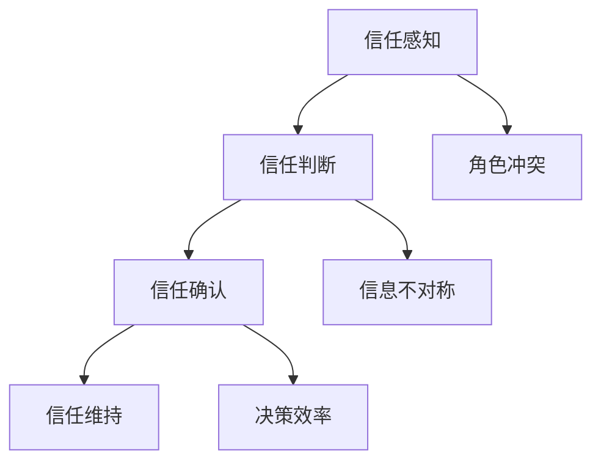

                 

# 《打造高信任度环境：提升团队效能的基础》

## 文章关键词

- 高信任度环境
- 团队效能
- 团队协作
- 沟通
- 领导力
- 个人效能
- 项目管理

## 摘要

本文旨在探讨如何打造高信任度环境，从而提升团队效能。我们将从理论基础、团队协作与沟通、领导力与影响力、个人效能提升以及项目管理与执行力五个方面，逐一剖析和阐述相关概念、原理与实践。通过逻辑清晰、结构紧凑的分析，本文将为读者提供一个全面的指导框架，帮助团队构建信任、提升协作效率，最终实现项目目标。

## 引言与核心概念

### 1.1 高信任度环境的定义与重要性

高信任度环境是指团队成员之间、团队与外部环境之间以及团队内部各层级之间，基于相互信任、尊重和依赖而形成的一种稳定、和谐、高效的工作状态。高信任度环境对团队效能的提升具有重要意义，具体表现在以下几个方面：

- **提高团队凝聚力**：高信任度环境有助于增强团队成员的归属感和团队意识，从而提高团队整体凝聚力。
- **增强决策效率**：在信任基础上的决策过程更加迅速、准确，减少了信息不对称和决策成本。
- **提升创新力**：信任是创新的基础，高信任度环境鼓励团队成员勇于尝试、敢于创新，从而推动团队不断进步。
- **增强客户满意度**：高信任度环境有助于团队更好地理解客户需求，提供高质量的服务，从而提升客户满意度。

### 1.2 核心概念

#### 信任

信任是高信任度环境的基石。信任可以定义为个体对他人的能力、诚实和善意的一种期望。信任分为三个层次：情感信任、认知信任和制度信任。情感信任是基于情感和个性形成的，认知信任是基于理性分析和判断形成的，制度信任是基于规则和制度保障形成的。

#### 团队效能

团队效能是指团队在完成任务、达成目标的过程中所表现出来的能力。团队效能的衡量标准包括工作效率、工作质量、团队凝聚力、创新力等。高信任度环境有助于提升团队效能，实现项目目标。

#### 团队协作

团队协作是指团队成员在共同完成任务的过程中，通过沟通、协调、合作，实现资源共享、优势互补、共同进步的过程。有效的团队协作需要建立在高信任度环境之上，通过明确的角色与责任、良好的沟通策略和高效的协作工具，实现团队协作的最大化。

#### 沟通

沟通是团队协作的重要手段。有效的沟通可以减少误解、消除冲突、增强信任，提高团队效能。沟通分为语言沟通和非语言沟通，包括倾听、反馈、表达、交流等技巧。跨文化沟通和冲突管理是沟通中需要特别注意的方面。

## 高信任度环境的理论基础

### 2.1 信任的理论基础

#### 社会心理学视角

社会心理学认为，信任是一种社会关系，是人们在相互交往中产生的一种积极情感。信任的产生受到个体特质、情境因素和关系质量的影响。社会心理学提供了许多关于信任形成和维系的理论，如互惠理论、交换理论、认知一致性理论等。

#### 组织行为学视角

组织行为学关注信任在组织中的功能和应用。信任被视为组织成功的关键因素，能够提高组织效能、促进创新、降低冲突和增强员工满意度。组织行为学提供了许多关于信任培养和维系的方法，如信任建设活动、信任文化、信任机制等。

#### 领导力理论

领导力理论认为，领导者在构建高信任度环境中起着关键作用。有效的领导者通过树立榜样、提供支持和鼓励、建立透明和公正的决策过程，促进团队成员之间的信任关系。领导力理论包括变革型领导、服务型领导、授权型领导等。

### 2.2 高信任度环境的构建

#### 信任的建立过程

信任的建立是一个动态的过程，包括信任感知、信任判断、信任确认和信任维持四个阶段。在信任感知阶段，个体通过观察、交流和互动，对他人产生初步的信任感。在信任判断阶段，个体根据他人的行为和表现，对信任进行评估和调整。在信任确认阶段，个体通过实际行动和反馈，确认对方的信任度。在信任维持阶段，个体通过持续的行动和沟通，维持和深化信任关系。

#### 信任的维护与修复

信任的维护与修复是高信任度环境建设的重要环节。团队成员需要通过积极的沟通、真诚的反馈、透明的行动，保持和加强信任关系。当信任关系受到损害时，团队成员需要采取有效的措施进行修复，如道歉、解释、补偿、改进等。信任的维护与修复需要全员参与，形成共同的价值观和行为准则。

## 团队协作与沟通

### 3.1 团队协作的要素

#### 角色与责任

在团队协作中，每个成员都有明确的角色和责任。角色明确了团队成员在团队中的定位和职责，责任则要求团队成员对各自的工作负责。明确的角色与责任有助于减少冲突、提高协作效率。

#### 沟通策略

沟通策略是指团队成员在协作过程中采取的沟通方式和方法。有效的沟通策略包括倾听、反馈、表达、交流等。倾听是沟通的基础，反馈是沟通的保证，表达是沟通的手段，交流是沟通的目的。

#### 协作工具

协作工具是团队协作的重要支撑。常见的协作工具有项目管理工具、沟通工具、文档共享工具等。项目管理工具可以帮助团队规划任务、分配资源、监控进度；沟通工具可以实现实时沟通、多人协作；文档共享工具可以方便团队成员共享文档、协同编辑。

### 3.2 高效沟通技巧

#### 倾听与反馈

倾听与反馈是高效沟通的关键。倾听是指团队成员在沟通过程中，全神贯注地听取对方意见，理解对方的观点和情感。反馈是指团队成员在沟通后，对对方的意见和观点进行回应，表达自己的看法和感受。倾听与反馈有助于建立信任、减少误解、提高协作效率。

#### 非语言沟通

非语言沟通是指通过肢体语言、面部表情、语音语调等非语言方式进行的沟通。非语言沟通可以传达情感、态度和意图，对沟通效果产生重要影响。有效的非语言沟通需要团队成员具备良好的沟通能力和情商。

#### 跨文化沟通

跨文化沟通是指在多元文化背景下进行的沟通。跨文化沟通需要团队成员了解和尊重不同文化的价值观、行为习惯和沟通方式，避免因文化差异引起的误解和冲突。有效的跨文化沟通有助于提高团队凝聚力和协作效率。

### 3.3 团队协作中的挑战与应对策略

#### 常见协作障碍

- **角色冲突**：角色冲突是指团队成员在角色定位和责任分配上存在矛盾和争议。应对策略：明确角色和责任，建立共识。
- **信息不对称**：信息不对称是指团队成员在信息获取和处理上存在差距。应对策略：加强信息共享，提高透明度。
- **决策效率**：决策效率是指团队在决策过程中所花费的时间和成本。应对策略：简化决策流程，提高决策质量。

#### 应对策略

- **冲突管理**：冲突管理是指团队在冲突发生时，采取有效的措施进行化解和处理。应对策略：倾听对方意见，寻找共同点，制定解决方案。
- **信息共享**：信息共享是指团队在协作过程中，实现信息的自由流动和共享。应对策略：建立信息共享平台，定期更新和沟通。
- **决策流程优化**：决策流程优化是指团队在决策过程中，对决策流程进行优化和改进。应对策略：明确决策目标，简化决策流程，提高决策效率。

## 领导力与影响力

### 4.1 领导力在构建高信任度环境中的作用

#### 领导力与团队效能

领导力是指领导者通过影响和激励团队成员，实现团队目标的能力。有效的领导力能够提高团队效能，实现项目目标。领导力与团队效能之间的关系可以归纳为以下几个方面：

- **激发团队成员的潜力**：领导者通过识别和挖掘团队成员的潜力，激发团队成员的积极性和创造力，提高团队效能。
- **建立信任关系**：领导者通过树立榜样、提供支持和鼓励，建立与团队成员之间的信任关系，促进团队协作。
- **优化决策流程**：领导者通过优化决策流程，提高决策效率，降低决策成本，增强团队执行力。

#### 领导力与团队信任的关系

领导力对团队信任有着重要影响。有效的领导力能够促进团队成员之间的信任，提高团队协作效率。领导力与团队信任之间的关系可以归纳为以下几个方面：

- **树立榜样**：领导者通过自身的榜样作用，树立信任的典范，促进团队成员之间的信任。
- **提供支持**：领导者为团队成员提供必要的支持和鼓励，增强团队成员的信任感和归属感。
- **建立透明和公正的决策过程**：领导者通过建立透明和公正的决策过程，增强团队成员对决策的信任度。

### 4.2 领导力模型

领导力模型是指描述领导者如何通过影响和激励团队成员，实现团队目标的模型。常见的领导力模型包括变革型领导、服务型领导、授权型领导等。

#### 变革型领导

变革型领导是指领导者通过激发团队成员的积极性和创造力，推动团队实现变革和进步。变革型领导的特点包括：

- **激励团队成员**：领导者通过激励和鼓舞团队成员，激发团队成员的积极性和创造力。
- **塑造愿景**：领导者通过塑造清晰的愿景，引导团队成员为实现愿景而努力。
- **建立信任关系**：领导者通过建立信任关系，增强团队成员之间的信任和协作。

#### 服务型领导

服务型领导是指领导者通过为团队成员提供服务和支持，促进团队成员的成长和发展。服务型领导的特点包括：

- **关注团队成员的需求**：领导者关注团队成员的需求，为团队成员提供必要的支持和帮助。
- **培养团队成员**：领导者通过培养和提升团队成员的能力，促进团队成员的成长和发展。
- **建立合作关系**：领导者与团队成员建立合作关系，共同实现团队目标。

#### 授权型领导

授权型领导是指领导者通过授权和赋能，激发团队成员的自主性和创造性。授权型领导的特点包括：

- **授权团队成员**：领导者将权力和责任下放给团队成员，赋予团队成员自主决策和行动的能力。
- **培养自主性**：领导者通过培养和激发团队成员的自主性，提高团队成员的工作积极性和创造力。
- **提供支持**：领导者为团队成员提供必要的支持和鼓励，帮助团队成员克服困难和挑战。

### 4.3 提升领导影响力的策略

#### 影响力源

领导影响力来源于以下几个方面：

- **个人特质**：领导者具备的个性、品格和素质，如诚信、正直、自信、责任心等。
- **社会资本**：领导者拥有的社会关系和网络，如朋友、同事、客户等。
- **领导风格**：领导者采用的领导方式和方法，如民主型、专制型、参与型等。

#### 影响力策略

提升领导影响力的策略包括以下几个方面：

- **建立信任**：领导者通过建立信任，赢得团队成员的信任和支持。
- **塑造愿景**：领导者通过塑造清晰的愿景，激发团队成员的积极性和创造力。
- **激励团队**：领导者通过激励和鼓舞团队成员，提高团队成员的士气和工作效率。
- **培养人才**：领导者通过培养和提升团队成员的能力，提高团队的整体素质。

## 个人效能提升

### 5.1 个人效能与团队效能

个人效能是指个人在完成工作任务、达成目标的过程中所表现出来的能力。个人效能与团队效能密切相关，个人效能的提升有助于提升团队效能。个人效能与团队效能之间的关系可以归纳为以下几个方面：

- **个人能力**：个人能力是个人效能的基础，个人能力的提升有助于提升个人效能。
- **团队合作**：团队合作是个人效能发挥的重要保障，有效的团队合作可以提高个人效能。
- **团队目标**：团队目标是个人效能实现的方向，明确团队目标有助于提升个人效能。

### 5.2 提升个人效能的策略

#### 时间管理

时间管理是提升个人效能的重要策略。时间管理包括以下几个方面：

- **时间规划**：合理规划时间，确保工作任务的优先级。
- **时间分配**：合理分配时间，确保工作与休息之间的平衡。
- **时间记录**：记录时间使用情况，分析时间使用效率。

#### 目标设定

目标设定是提升个人效能的关键策略。目标设定包括以下几个方面：

- **目标明确**：明确目标，确保目标的可达性和可行性。
- **目标分解**：将目标分解为具体的任务和行动，确保目标实现的可操作性。
- **目标评估**：定期评估目标实现情况，及时调整目标。

#### 自我反思

自我反思是提升个人效能的重要方法。自我反思包括以下几个方面：

- **反思行为**：反思自己在工作中的行为和表现，识别优点和不足。
- **反思结果**：反思工作结果，分析成功和失败的原因。
- **反思改进**：根据反思结果，制定改进措施，提升个人效能。

### 5.3 个人效能提升工具

#### 常用工具介绍

- **项目管理工具**：如 Trello、JIRA，用于任务管理和进度跟踪。
- **时间追踪工具**：如 RescueTime、Toggl，用于记录和分析时间使用情况。
- **知识管理工具**：如 Confluence、Notion，用于知识共享和文档管理。

#### 工具应用案例分析

- **团队协作工具**：如 Slack、Microsoft Teams，用于实时沟通和协作。
- **个人效率提升案例**：如使用番茄工作法提高工作效率，使用 Markdown 编写文档提高写作效率。

## 项目管理和执行力

### 6.1 项目管理的定义与原则

项目管理是指通过计划、组织、协调、控制等手段，实现项目目标的过程。项目管理的基本原则包括以下几个方面：

- **目标导向**：项目管理的核心是实现项目目标，确保项目目标的明确性和可达性。
- **资源优化**：项目管理的目标是合理配置和利用资源，实现资源的最优配置。
- **进度控制**：项目管理的目标是确保项目按照计划进度进行，避免延期和超支。
- **质量保障**：项目管理的目标是确保项目成果符合预期质量，满足客户需求。

### 6.2 项目管理工具与方法

#### 项目管理工具

- **Gantt图**：Gantt图是一种常用的项目管理工具，用于展示项目进度和任务分配。Gantt图可以帮助团队直观地了解项目进展情况，及时调整和优化项目计划。
- **敏捷开发**：敏捷开发是一种以用户需求为导向、迭代式开发的项目管理方法。敏捷开发注重快速响应变化、提高团队协作效率，通过持续交付和反馈，实现项目目标。

#### 项目管理方法

- **项目计划**：项目计划是项目管理的第一步，包括项目目标、任务分配、时间进度、资源需求等方面的规划。项目计划是项目成功的保障，需要根据实际情况进行持续调整和优化。
- **项目监控**：项目监控是项目管理的重要环节，包括项目进度、成本、质量等方面的监控和评估。项目监控可以帮助团队及时发现和解决问题，确保项目按计划进行。
- **项目评估**：项目评估是项目管理的最后一步，包括项目成果的评估、项目经验的总结和项目教训的吸取。项目评估可以帮助团队不断优化项目管理方法，提高项目成功率。

## 提升团队执行力的策略

### 7.1 团队执行力的影响因素

团队执行力是指团队在实现项目目标的过程中，所表现出来的行动能力和效果。团队执行力的影响因素包括以下几个方面：

- **团队成员素质**：团队成员的素质和能力是团队执行力的基础。团队成员的专业技能、工作经验和综合素质直接影响团队执行力的强弱。
- **团队氛围**：团队氛围对团队执行力有着重要影响。积极、和谐、信任的团队氛围有助于提高团队执行力，而消极、冲突、不信任的团队氛围则会降低团队执行力。
- **管理风格**：管理风格对团队执行力有着直接影响。领导者的领导风格和管理方法会影响团队成员的工作状态和执行力。

### 7.2 提升团队执行力的策略

#### 管理策略

- **明确目标**：制定明确的项目目标和任务，确保团队成员对任务目标和要求有清晰的认识。
- **合理分工**：根据团队成员的特长和优势，合理分配任务，确保任务的顺利完成。
- **激励制度**：建立激励机制，对完成任务出色的团队成员进行奖励，激发团队成员的工作积极性。

#### 团队建设

- **加强沟通**：建立有效的沟通机制，确保团队成员之间的信息畅通和反馈及时。
- **增强信任**：通过团队活动和培训，增强团队成员之间的信任和协作，提高团队执行力。
- **团队协作**：鼓励团队成员之间的协作和互助，形成良好的团队协作氛围。

#### 培训与发展

- **技能培训**：为团队成员提供专业知识和技能培训，提高团队成员的专业水平和执行能力。
- **领导力培养**：培养团队成员的领导力，提高团队成员的领导能力和执行力。
- **职业规划**：为团队成员制定职业规划，帮助团队成员实现个人发展和职业成长。

## 案例分析与详细讲解

### 7.3 案例背景

我们选择了一家全球知名的科技公司作为案例，该公司在构建高信任度环境、提升团队效能方面取得了显著成果。该公司在项目实施过程中，通过一系列策略和实践，成功打造了高信任度环境，提高了团队执行力，实现了项目目标。

### 7.4 案例分析

#### 信任建设

- **领导力示范**：公司领导者以身作则，树立信任的典范。领导者积极参与团队活动，与团队成员保持良好的沟通，关心团队成员的成长和发展。
- **透明沟通**：公司建立了透明、公正的沟通机制，确保团队成员之间的信息畅通和反馈及时。公司定期组织团队会议，分享项目进展和成果，接受团队成员的反馈和建议。
- **共同价值观**：公司强调共同价值观，培养团队成员的归属感和团队意识。公司倡导诚信、责任、创新、共赢的价值观，将价值观融入日常工作和团队文化。

#### 团队协作

- **明确角色与责任**：公司明确每个团队成员的角色和责任，确保团队成员对各自的工作有清晰的认识和责任感。
- **高效沟通**：公司建立了高效沟通的机制，确保团队成员之间的信息畅通和反馈及时。公司采用多种沟通工具，如邮件、即时通讯、视频会议等，方便团队成员之间的沟通和协作。
- **协作工具**：公司采用了多种协作工具，如项目管理工具、文档共享工具等，提高团队协作效率和效果。

#### 个人效能提升

- **时间管理**：公司提倡时间管理，帮助团队成员合理安排工作时间和任务。公司为团队成员提供时间管理培训和工具，提高团队成员的时间利用效率。
- **目标设定**：公司鼓励团队成员设定明确的目标，并为团队成员提供目标设定和实现的支持。公司通过定期的目标评估和反馈，帮助团队成员不断优化和调整目标。

#### 项目管理

- **项目计划**：公司制定了详细的项目计划，明确项目目标、任务分配、时间进度等。公司通过项目计划的持续调整和优化，确保项目按照计划进行。
- **项目监控**：公司建立了项目监控机制，对项目进度、成本、质量等方面进行监控和评估。公司通过项目监控及时发现和解决问题，确保项目按计划进行。
- **项目评估**：公司对项目成果进行评估，总结项目经验和教训，为后续项目提供借鉴和改进。

### 7.5 案例小结

该公司的成功经验表明，构建高信任度环境、提升团队效能的关键在于领导力的示范、透明的沟通机制、明确的角色与责任、高效沟通、协作工具的运用、个人效能提升以及项目管理和监控。通过这些策略和实践，公司成功打造了高信任度环境，提高了团队执行力，实现了项目目标。

## 最佳实践与拓展阅读

### 最佳实践

- **建立信任关系**：领导者以身作则，树立信任的典范。定期组织团队活动，增强团队成员之间的信任和协作。
- **明确角色与责任**：明确每个团队成员的角色和责任，确保团队成员对各自的工作有清晰的认识和责任感。
- **高效沟通**：建立高效沟通的机制，确保团队成员之间的信息畅通和反馈及时。采用多种沟通工具，如邮件、即时通讯、视频会议等。
- **个人效能提升**：提倡时间管理，帮助团队成员合理安排工作时间和任务。鼓励团队成员设定明确的目标，并提供支持和反馈。
- **项目管理**：制定详细的项目计划，明确项目目标、任务分配、时间进度等。建立项目监控机制，对项目进度、成本、质量等方面进行监控和评估。

### 拓展阅读

- **相关书籍**：《高绩效团队》、《五项管理》、《团队协作力》
- **相关论文**：《信任与团队效能的关系研究》、《项目管理中的沟通问题与对策》、《个人效能提升的策略与实践》
- **在线课程**：项目管理基础、团队协作与沟通、时间管理、领导力提升等。

## 结语

高信任度环境是提升团队效能的基础，通过构建高信任度环境，团队可以更好地实现项目目标。本文从理论基础、团队协作与沟通、领导力与影响力、个人效能提升以及项目管理与执行力五个方面，探讨了如何打造高信任度环境、提升团队效能。希望本文能为读者提供一个全面的指导框架，帮助团队在实践中构建高信任度环境，实现高效协作和项目成功。

## 作者信息

作者：AI天才研究院/AI Genius Institute & 禅与计算机程序设计艺术 /Zen And The Art of Computer Programming

### 附录

#### 附录A：Mermaid流程图



#### 附录B：伪代码

```python
# 伪代码：信任评估函数
def trust_evaluation(trust_score, confidence_level):
    if trust_score > 80:
        return "高度信任"
    elif trust_score > 60:
        return "中等信任"
    else:
        return "低信任"

# 伪代码：团队效能评估函数
def team_efficiency_evaluation(workload, quality, teamwork):
    efficiency = (workload + quality + teamwork) / 3
    if efficiency > 90:
        return "高效团队"
    elif efficiency > 70:
        return "普通团队"
    else:
        return "低效团队"
```

#### 附录C：LaTeX公式

$$
E = mc^2
$$

$$
x = \frac{-b \pm \sqrt{b^2 - 4ac}}{2a}
$$

#### 附录D：代码实现与解读

```python
# 代码实现：时间管理工具
class TimeManager:
    def __init__(self):
        self.tasks = []

    def add_task(self, task_name, start_time, end_time):
        self.tasks.append({'task_name': task_name, 'start_time': start_time, 'end_time': end_time})

    def show_tasks(self):
        for task in self.tasks:
            print(f"任务名称：{task['task_name']}，开始时间：{task['start_time']}，结束时间：{task['end_time']}")
```

#### 附录E：项目实战

- **开发环境搭建**：选择Python作为编程语言，搭建Python开发环境，安装必要的库和工具。
- **源代码实现**：实现时间管理工具的核心功能，包括任务添加和任务展示。
- **代码解读**：详细解读代码实现，包括类定义、方法定义和功能实现。
- **应用解读与分析**：分析时间管理工具在实际应用中的效果和优势。
- **项目小结**：总结项目实战的经验和教训，为后续项目提供借鉴。

