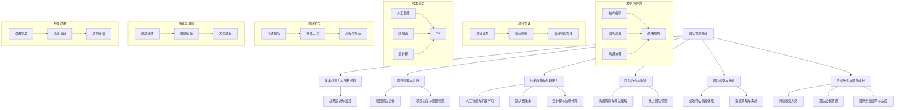

                 

### 文章标题

# 《打造高性能技术团队的方法论》

### 关键词

技术团队建设、团队管理、技术领导力、项目管理、创新思维、团队协作、绩效激励

### 摘要

在现代企业中，技术团队的高性能直接影响到企业的竞争力。本文将深入探讨如何打造一个高效、协作、创新的技术团队。通过分析团队管理基础、技术领导力与战略规划、项目管理与执行、技术趋势与创新能力、团队协作与沟通、团队绩效与激励以及持续改进与团队成长七个关键领域，本文为技术团队领导者提供了一套系统化、实用性的方法论。这些方法论不仅有助于提升团队整体绩效，还能激发团队成员的潜力，推动企业持续发展。

## 第一部分：团队管理基础

### 第1章 团队管理基础

#### 1.1 团队管理概述

团队管理是现代企业运作中不可或缺的一环。它涉及到如何有效地组织、协调、控制和激励团队成员，以实现共同的目标。一个高性能的团队需要具备以下几个关键特征：

1. **清晰的目标**：团队的目标应该是具体、明确且可衡量的，以确保团队成员朝着共同的方向努力。
2. **合理的组织结构**：团队的组织结构应能够高效地分配任务和职责，确保每个成员都能充分发挥其专长。
3. **有效的沟通**：良好的沟通机制可以减少误解和冲突，提高团队的工作效率。
4. **协作精神**：团队成员之间应具备高度的协作意识，能够互相支持和合作。
5. **积极的工作氛围**：一个积极、支持性的工作环境有助于提升团队成员的工作满意度和创造力。

#### 1.2 团队组织结构

团队组织结构是指团队成员如何被组织起来，以及他们如何相互协作。常见的团队组织结构包括：

1. **职能式结构**：按照职能划分团队，如开发、测试、运维等。
2. **项目式结构**：根据项目的需要临时组建团队，项目结束后团队解散。
3. **矩阵式结构**：结合职能式和项目式结构的优点，团队成员同时归属于职能团队和项目团队。

每种组织结构都有其优势和适用场景，团队领导者应根据实际情况进行选择和调整。

#### 1.3 团队生命周期

团队生命周期是指团队从形成到解散的整个过程。一般来说，团队生命周期包括以下几个阶段：

1. **形成期**：团队成员相互了解，确立共同目标。
2. **激荡期**：团队成员之间可能存在冲突和误解，需要有效的沟通和协调。
3. **规范化期**：团队开始进入稳定状态，工作效率提升。
4. **执行期**：团队开始集中精力完成任务，达成目标。
5. **解散期**：项目或任务完成后，团队解散。

了解团队生命周期有助于团队领导者及时调整管理策略，确保团队在不同阶段都能高效运作。

## 第二部分：技术领导力与战略规划

### 第4章 技术领导力

#### 4.1 技术领导者的角色

技术领导者是团队的灵魂人物，他们不仅需要具备深厚的技术能力，还要具备出色的领导力和战略规划能力。技术领导者的角色包括：

1. **技术指导**：提供技术方向和决策，指导团队成员的技术工作。
2. **团队建设**：培养团队成员的技术能力和团队合作精神。
3. **战略规划**：制定技术战略，确保团队的技术发展与企业目标一致。
4. **沟通协调**：协调团队内部和外部的沟通，确保团队高效运作。

#### 4.2 技术决策制定

技术决策制定是技术领导者的重要职责之一。一个好的技术决策应考虑以下因素：

1. **技术可行性**：确保所选技术方案在实际中可行。
2. **业务需求**：满足企业的业务需求，提升企业竞争力。
3. **成本效益**：在成本和效益之间找到平衡点。
4. **风险评估**：评估技术决策可能带来的风险和影响。

技术决策制定应采用科学的方法，如SWOT分析、成本效益分析等，以确保决策的合理性和有效性。

#### 4.3 技术趋势前瞻

技术领导者还应具备前瞻性，关注技术趋势和发展方向。以下是一些当前热门的技术趋势：

1. **人工智能与机器学习**：通过模拟人类智能，提高自动化水平和数据处理能力。
2. **区块链技术**：通过去中心化的方式，提高数据安全和透明度。
3. **云计算与边缘计算**：提供更灵活、高效的计算资源，满足不同场景的需求。
4. **物联网**：通过连接各种设备，实现智能化的生活和工业生产。

了解技术趋势有助于技术领导者把握发展机遇，推动企业技术创新。

### 第5章 团队战略规划

#### 5.1 战略规划框架

团队战略规划是确保团队发展与企业目标一致的重要过程。以下是一个简单的战略规划框架：

1. **使命与愿景**：明确团队的使命和愿景，为团队发展指明方向。
2. **外部环境分析**：分析外部环境，包括市场趋势、竞争对手、政策法规等。
3. **内部能力评估**：评估团队的内部能力，包括技术实力、管理水平、资源等。
4. **目标设定**：根据外部环境和内部能力，设定具体、可行的目标。
5. **策略制定**：制定实现目标的策略和行动计划。
6. **执行与监控**：执行策略，监控进展，及时调整。

#### 5.2 技术战略制定

技术战略是团队战略规划的重要组成部分。以下是一些关键步骤：

1. **技术定位**：确定团队在技术领域中的定位，如领先者、跟随者等。
2. **技术选择**：选择适合团队发展的技术方向，如人工智能、大数据等。
3. **技术储备**：建立技术储备，确保团队有足够的技术实力应对挑战。
4. **创新能力**：鼓励技术创新，推动团队技术水平的提升。
5. **技术合作**：寻求技术合作，提升团队的技术实力和市场竞争力。

#### 5.3 战略实施与监控

战略实施与监控是确保战略规划有效执行的重要环节。以下是一些关键点：

1. **明确责任**：明确每个团队成员在战略实施中的责任和任务。
2. **制定计划**：制定详细的实施计划，确保每个步骤都有明确的目标和时间表。
3. **执行监督**：监督战略实施过程，确保每个步骤都能按计划进行。
4. **反馈调整**：根据实施过程中的反馈，及时调整策略和计划。
5. **绩效评估**：定期评估战略实施的效果，确保团队能够持续改进。

## 第三部分：项目管理与执行

### 第6章 项目管理与执行

#### 6.1 项目管理基础

项目管理是确保项目按时、按质、按预算完成的关键。以下是一些项目管理的基础知识：

1. **项目定义**：项目是临时性的、独特的活动，旨在创造一个特定的成果。
2. **项目生命周期**：项目生命周期包括启动、规划、执行、监控和收尾五个阶段。
3. **项目计划**：项目计划是项目管理的重要组成部分，包括项目范围、时间表、资源分配、风险管理等。
4. **项目监控**：项目监控是确保项目按计划进行的关键，包括进度跟踪、成本控制、质量保证等。
5. **项目收尾**：项目收尾包括验收、总结、项目文档归档等，确保项目顺利完成。

#### 6.2 项目计划与控制

项目计划与控制是项目管理的重要环节。以下是一些关键步骤：

1. **范围管理**：明确项目的范围，确保项目团队和利益相关者对项目目标的共识。
2. **时间管理**：制定项目时间表，确保项目按计划进行。
3. **资源管理**：分配项目所需的资源，包括人力、资金、设备等。
4. **风险管理**：识别、评估和应对项目风险，确保项目能够应对潜在的问题。
5. **成本管理**：监控项目成本，确保项目在预算范围内完成。

#### 6.3 项目风险管理

项目风险管理是确保项目成功的关键。以下是一些关键步骤：

1. **风险识别**：识别项目可能面临的风险，包括技术风险、市场风险、人力资源风险等。
2. **风险评估**：评估每个风险的可能性和影响，确定风险优先级。
3. **风险应对**：制定风险应对策略，包括风险规避、减轻、转移和接受。
4. **风险监控**：监控项目风险，确保风险应对策略的有效性。
5. **风险沟通**：与项目团队和利益相关者沟通风险信息，确保他们了解项目风险。

### 第7章 项目团队协作

#### 7.1 团队协作工具与技术

有效的团队协作是项目成功的关键。以下是一些常用的团队协作工具和技术：

1. **项目管理工具**：如Jira、Trello等，用于任务分配、进度跟踪和团队协作。
2. **沟通工具**：如Slack、Microsoft Teams等，用于实时沟通和协作。
3. **文档管理工具**：如Confluence、Notion等，用于文档共享和知识管理。
4. **代码管理工具**：如Git、GitHub等，用于代码协作和版本控制。
5. **敏捷开发方法**：如Scrum、Kanban等，用于提高团队协作效率和响应速度。

#### 7.2 团队协作流程与规范

有效的团队协作需要明确的流程和规范。以下是一些关键步骤：

1. **需求分析**：明确项目需求，确保团队和利益相关者对需求的理解一致。
2. **任务分配**：根据团队成员的专长和项目需求，分配任务。
3. **进度跟踪**：定期跟踪项目进度，确保项目按计划进行。
4. **沟通协调**：建立有效的沟通机制，确保团队成员之间信息畅通。
5. **质量控制**：制定质量控制标准，确保项目交付的质量。
6. **文档管理**：规范文档管理流程，确保项目文档的完整性和可追溯性。

#### 7.3 项目进度与质量管理

项目进度和质量是项目管理的关键指标。以下是一些关键步骤：

1. **进度管理**：制定项目进度计划，监控项目进度，确保项目按时完成。
2. **质量管理**：制定质量计划，实施质量控制措施，确保项目交付的质量满足要求。
3. **测试与验收**：进行项目测试，确保项目功能符合要求，通过验收。
4. **反馈与改进**：收集项目反馈，识别改进机会，持续优化项目管理流程。
5. **项目总结**：在项目结束后进行总结，评估项目成功因素和改进空间，为后续项目提供借鉴。

## 第四部分：技术趋势与创新能力

### 第8章 技术趋势分析

#### 8.1 人工智能与机器学习

人工智能（AI）和机器学习（ML）是当前技术领域的重要趋势。以下是一些关键点：

1. **技术原理**：AI是指让机器具备人类智能的能力，ML是指通过数据训练模型，让模型具备自动学习和预测能力。
2. **应用场景**：AI和ML在图像识别、自然语言处理、推荐系统等领域有广泛的应用。
3. **发展现状**：随着算法的进步和数据的积累，AI和ML技术已取得显著成果，但仍有很大的发展空间。
4. **挑战**：AI和ML技术的挑战包括数据质量、算法透明度和安全性等。

#### 8.2 区块链技术

区块链技术是一种去中心化的数据库技术，具有安全性高、透明度高等特点。以下是一些关键点：

1. **技术原理**：区块链通过加密算法和分布式数据库技术，实现数据的不可篡改和透明性。
2. **应用场景**：区块链在数字货币、供应链管理、智能合约等领域有广泛的应用。
3. **发展现状**：区块链技术已初步应用于实际场景，但尚处于快速发展阶段。
4. **挑战**：区块链技术的挑战包括性能、可扩展性和标准化等。

#### 8.3 云计算与边缘计算

云计算和边缘计算是现代企业数字化转型的重要技术。以下是一些关键点：

1. **技术原理**：云计算是指通过网络提供计算资源，边缘计算是指将计算任务分配到网络边缘，靠近数据源。
2. **应用场景**：云计算适用于大规模数据处理、应用部署等，边缘计算适用于物联网、智能交通等领域。
3. **发展现状**：云计算和边缘计算技术已成熟，广泛应用于各行业。
4. **挑战**：云计算和边缘计算的挑战包括数据安全、隐私保护和网络带宽等。

### 第9章 创新能力培养

#### 9.1 创新思维与方法

创新思维和方法是提升团队创新能力的关键。以下是一些关键点：

1. **创新思维**：创新思维包括发散思维、逆向思维、组合思维等，有助于发现新的问题和解决方案。
2. **创新方法**：创新方法包括头脑风暴、六顶思考帽、TRIZ等，有助于系统地产生和评估创新想法。
3. **应用场景**：创新思维和方法适用于产品开发、市场营销、业务流程优化等领域。
4. **挑战**：创新思维和方法的挑战包括如何激发团队成员的创新热情和如何有效地管理创新过程。

#### 9.2 创新实践案例

以下是一些创新实践案例，供团队参考：

1. **苹果公司**：苹果公司通过持续创新，推出了多款革命性的产品，如iPhone、iPad等，引领了消费电子行业的发展。
2. **谷歌公司**：谷歌公司通过创新的技术和产品，如Google Search、Google Maps等，成为了全球最大的搜索引擎和技术公司。
3. **特斯拉公司**：特斯拉公司通过创新的技术和商业模式，推动了电动汽车和新能源行业的发展。

#### 9.3 创新文化与氛围建设

创新文化和氛围是团队创新能力的重要保障。以下是一些关键点：

1. **鼓励创新**：建立鼓励创新的企业文化，让团队成员敢于尝试和失败。
2. **知识共享**：促进团队成员之间的知识共享和交流，激发创新思维。
3. **资源支持**：为团队成员提供充足的资源和支持，鼓励他们进行创新实践。
4. **反馈与激励**：对创新实践进行反馈和激励，激发团队成员的创新热情。

## 第五部分：团队协作与沟通

### 第10章 团队沟通与协作

#### 10.1 沟通障碍与解决策略

有效的沟通是团队协作的基础。以下是一些常见的沟通障碍和解决策略：

1. **文化差异**：解决策略包括加强跨文化培训和沟通，建立共同的文化价值观。
2. **信息过载**：解决策略包括优化沟通渠道，减少冗余信息，提高沟通效率。
3. **误解与冲突**：解决策略包括加强沟通技巧培训，建立冲突解决机制，促进团队成员之间的理解和信任。
4. **沟通不畅**：解决策略包括明确沟通目标，制定沟通计划，确保信息传递的准确性和及时性。

#### 10.2 沟通技巧提升

提升沟通技巧有助于提高团队协作效率。以下是一些关键点：

1. **倾听**：积极倾听对方的观点，避免中断和误解。
2. **表达**：清晰、简洁地表达自己的想法，避免模糊和不明确的表述。
3. **提问**：善于提问，以获取更多信息和理解对方的观点。
4. **反馈**：及时给予反馈，帮助对方理解自己的想法和需求。

#### 10.3 团队协作工具应用

有效的团队协作工具可以提高团队协作效率。以下是一些常用的团队协作工具：

1. **项目管理工具**：如Jira、Trello等，用于任务分配和进度跟踪。
2. **沟通工具**：如Slack、Microsoft Teams等，用于实时沟通和协作。
3. **文档管理工具**：如Confluence、Notion等，用于文档共享和知识管理。
4. **代码管理工具**：如Git、GitHub等，用于代码协作和版本控制。
5. **敏捷开发工具**：如Scrum、Kanban等，用于提高团队协作效率和响应速度。

### 第11章 线上团队管理

#### 11.1 线上团队协作挑战

线上团队管理面临一些特殊的挑战，如：

1. **沟通障碍**：远程沟通容易产生误解和隔阂。
2. **协作效率**：线上协作容易受到网络延迟和设备限制的影响。
3. **工作监督**：线上工作难以进行有效的监督和考核。
4. **团队凝聚力**：线上团队难以建立共同的目标和价值观。

#### 11.2 线上团队管理策略

为了应对线上团队协作挑战，可以采取以下策略：

1. **明确目标**：确保团队成员对团队目标和任务有清晰的认识。
2. **建立沟通机制**：建立有效的线上沟通机制，如定期的视频会议和在线讨论。
3. **优化协作工具**：选择适合线上团队的协作工具，提高协作效率。
4. **监督与激励**：采用远程监控工具，确保团队成员按时完成任务，并通过线上奖励机制激励团队成员。
5. **团队文化建设**：通过线上活动和文化建设，增强团队成员之间的联系和凝聚力。

#### 11.3 远程工作与团队文化

远程工作对团队文化带来了一定的影响。以下是一些关键点：

1. **文化适应**：远程工作要求团队成员具备较高的自律性和适应性，以适应新的工作模式。
2. **文化传承**：远程工作可能导致团队文化传承的困难，需要采取线上方式传承和弘扬团队文化。
3. **文化融合**：线上团队管理需要注重文化融合，尊重不同成员的文化背景和价值观，促进团队和谐发展。

## 第六部分：团队绩效与激励

### 第12章 团队绩效评估

#### 12.1 绩效评估指标体系

团队绩效评估是衡量团队工作成效的重要手段。以下是一个简单的绩效评估指标体系：

1. **任务完成度**：衡量团队完成任务的进度和质量。
2. **团队协作**：衡量团队成员之间的协作效率和沟通效果。
3. **创新能力**：衡量团队的创新能力和创新成果。
4. **客户满意度**：衡量团队交付的产品或服务的客户满意度。
5. **团队氛围**：衡量团队的工作氛围和团队成员的满意度。

#### 12.2 绩效评估流程与方法

有效的绩效评估流程和方法包括：

1. **设定评估标准**：根据绩效评估指标体系，设定具体的评估标准和评分规则。
2. **数据收集**：收集与绩效评估相关的数据，如任务进度、客户反馈等。
3. **评估分析**：对收集到的数据进行统计分析，评估团队的整体绩效。
4. **反馈与改进**：将评估结果反馈给团队成员，并提出改进建议。

#### 12.3 绩效反馈与改进

绩效反馈与改进是提升团队绩效的关键。以下是一些关键步骤：

1. **及时反馈**：及时给予团队成员绩效反馈，让他们了解自己的表现。
2. **具体建议**：根据评估结果，提出具体的改进建议，帮助团队成员提升绩效。
3. **持续改进**：建立持续的绩效改进机制，鼓励团队成员不断学习和进步。
4. **激励机制**：设立绩效激励机制，激发团队成员的工作积极性和创造力。

### 第13章 团队激励与文化建设

#### 13.1 激励理论与应用

激励是提升团队绩效的重要手段。以下是一些常见的激励理论：

1. **马斯洛需求层次理论**：根据人们的需求层次，设定相应的激励措施。
2. **双因素理论**：将激励因素分为内在激励和外在激励，合理搭配使用。
3. **目标设置理论**：设定具有挑战性的目标，激发团队成员的工作动力。

激励理论在团队管理中的应用包括：

1. **目标设定**：为团队成员设定明确的、具有挑战性的目标。
2. **奖励制度**：设立奖励制度，对绩效优秀的团队成员进行奖励。
3. **职业发展**：提供职业发展机会，帮助团队成员提升技能和职业素养。

#### 13.2 激励策略与实施

以下是一些激励策略：

1. **物质激励**：提供具有竞争力的薪酬和福利待遇，满足团队成员的基本需求。
2. **精神激励**：通过荣誉表彰、团队活动等方式，满足团队成员的社会需求和精神需求。
3. **参与激励**：让团队成员参与决策和项目执行，提高他们的参与感和责任感。

激励策略的实施包括：

1. **明确激励目标**：确保激励措施与团队目标一致，避免混淆和冲突。
2. **合理分配资源**：根据团队成员的表现和需求，合理分配激励资源。
3. **及时反馈**：对激励效果进行及时反馈，调整激励策略。

#### 13.3 团队文化建设

团队文化建设是提升团队凝聚力和工作效率的重要手段。以下是一些团队文化建设的关键点：

1. **核心价值观**：明确团队的核心价值观，作为团队成员的行为准则。
2. **团队精神**：培养团队成员的团队精神，强调团结协作和共同进步。
3. **文化传承**：通过线上和线下活动，传承和弘扬团队文化。
4. **文化融合**：尊重不同成员的文化背景和价值观，促进团队文化的多样性和包容性。

## 第七部分：持续改进与团队成长

### 第14章 持续改进与优化

#### 14.1 持续改进方法

持续改进是团队成长的重要途径。以下是一些持续改进的方法：

1. **PDCA循环**：通过计划（Plan）、执行（Do）、检查（Check）和行动（Act）的循环，不断优化团队的工作流程。
2. **六西格玛**：通过六西格玛方法论，识别和消除过程中的变异，提高过程质量。
3. **精益管理**：通过精益管理，减少浪费，提高效率。
4. **KPI管理**：通过关键绩效指标（KPI）管理，监控团队绩效，发现改进机会。

#### 14.2 改进项目实施

改进项目实施包括以下步骤：

1. **问题识别**：识别团队工作中存在的问题，确定改进目标。
2. **方案制定**：制定具体的改进方案，包括措施、方法和时间表。
3. **执行与监控**：执行改进方案，监控改进效果，确保改进目标的实现。
4. **评估与反馈**：对改进项目进行评估，总结经验教训，为后续改进提供参考。

#### 14.3 改进效果评估

改进效果评估包括以下步骤：

1. **数据收集**：收集与改进项目相关的数据，如效率、质量、成本等。
2. **分析比较**：分析改进前后的数据，比较改进效果。
3. **评估结论**：根据分析结果，评估改进项目的成功程度，并提出改进建议。
4. **持续优化**：根据评估结论，持续优化团队工作流程和管理方法。

### 第15章 团队成长与发展

#### 15.1 团队成长路径

团队成长是一个持续的过程，包括以下几个阶段：

1. **起步阶段**：团队刚刚组建，成员相互了解，共同目标明确。
2. **发展阶段**：团队开始进入正轨，工作流程逐步完善，绩效逐步提升。
3. **成熟阶段**：团队工作高效，成员之间默契度高，创新能力提升。
4. **卓越阶段**：团队达到较高的绩效水平，具有显著的核心竞争力。

#### 15.2 团队成员职业发展

团队成员职业发展包括以下几个方面：

1. **技能提升**：通过培训和学习，提升团队成员的专业技能和综合素质。
2. **职位晋升**：为团队成员提供晋升机会，激发他们的工作热情和动力。
3. **职业规划**：帮助团队成员制定职业规划，明确职业发展方向和目标。
4. **荣誉与奖励**：对在职业发展中表现优秀的团队成员给予荣誉和奖励，提升他们的职业成就感。

#### 15.3 团队组织变革与适应

团队组织变革与适应包括以下几个方面：

1. **变革需求**：根据企业发展战略和市场需求，识别团队变革的需求。
2. **变革方案**：制定具体的变革方案，包括组织结构、流程优化、文化重塑等。
3. **变革实施**：实施变革方案，确保团队成员适应新的工作环境和要求。
4. **变革评估**：评估变革效果，总结经验教训，为后续变革提供参考。

### 附录

#### 附录 A：常用工具与资源

以下是一些常用的工具和资源，供团队参考：

1. **项目管理工具**：如Jira、Trello等。
2. **沟通工具**：如Slack、Microsoft Teams等。
3. **文档管理工具**：如Confluence、Notion等。
4. **代码管理工具**：如Git、GitHub等。
5. **敏捷开发工具**：如Scrum、Kanban等。
6. **培训资源**：如在线课程、专业书籍等。
7. **行业资讯**：如技术博客、行业报告等。

### 总结

通过本文的讨论，我们可以看到，打造一个高性能的技术团队并非易事，但通过系统化、科学化的方法，我们可以逐步实现这一目标。首先，了解团队管理基础，明确团队的组织结构和生命周期，为团队高效运作打下基础。其次，提升技术领导力与战略规划能力，确保团队能够紧跟技术趋势，实现企业目标。然后，通过科学的项目管理方法和团队协作工具，提高项目执行效率和质量。此外，关注技术趋势和创新能力，推动团队持续进步。最后，通过有效的沟通、激励和文化建设，提升团队凝聚力和工作效率。总之，打造高性能技术团队需要从多个方面入手，持续改进和优化，以适应不断变化的市场环境和技术趋势。

## 作者信息

作者：AI天才研究院/AI Genius Institute & 禅与计算机程序设计艺术 /Zen And The Art of Computer Programming

---

**核心概念与联系**

为了更好地理解本文的核心概念和它们之间的联系，我们可以使用Mermaid流程图来展示团队管理、技术领导力、项目管理、技术趋势、团队协作与沟通、团队绩效与激励以及持续改进与团队成长的关系。



在这个流程图中，我们首先定义了团队管理的核心组成部分（A），然后展示了这些组成部分与技术领导力、项目管理、技术趋势、团队协作与沟通、团队绩效与激励以及持续改进与团队成长的关系。每个子部分都进一步细化为具体的活动和实践（如技术指导、项目计划等），以展示团队管理的多层次结构。这个流程图不仅有助于读者理解文章的结构，还能帮助他们把握各个概念之间的内在联系。

### 核心算法原理讲解

在团队管理中，核心算法原理的应用至关重要。以下我们将详细介绍一个用于团队绩效评估的核心算法——平衡计分卡（Balanced Scorecard，BSC）。平衡计分卡是一种综合评估方法，通过财务、客户、内部业务流程和学习与成长四个维度，全面衡量团队的绩效。以下是该算法的伪代码：

```plaintext
算法：平衡计分卡（Balanced Scorecard, BSC）

输入：团队绩效指标（financial, customer, internal, learning）
输出：团队综合绩效评分（total_score）

步骤：
1. 初始化综合绩效评分 total_score 为 0
2. 对于每个绩效指标维度 do
   2.1 计算该维度的得分 dimension_score
   2.2 将 dimension_score 加到 total_score 上
3. 计算 total_score 的权重权重（如使用归一化方法处理）
4. 返回 total_score 作为团队的综合绩效评分

伪代码：
function BalancedScorecard(finance, customer, internal, learning):
    total_score = 0
    
    for dimension in [finance, customer, internal, learning]:
        dimension_score = CalculateDimensionScore(dimension)
        total_score += dimension_score
    
    # 归一化处理，确保总分为1
    total_score = NormalizeScore(total_score, [finance, customer, internal, learning])
    
    return total_score

function CalculateDimensionScore(dimension):
    # 根据维度特点计算得分
    # 例如，财务维度可以使用财务比率、利润等指标
    # 客户维度可以使用客户满意度、市场份额等指标
    # 内部业务流程维度可以使用生产效率、流程改进等指标
    # 学习与成长维度可以使用员工满意度、培训次数等指标
    dimension_score = ...

function NormalizeScore(total_score, dimensions):
    # 归一化处理，确保总分为1
    max_score = max([CalculateDimensionScore(dimension) for dimension in dimensions])
    normalized_score = total_score / max_score
    
    return normalized_score
```

#### 数学模型和公式

在计算每个维度的得分时，可以使用以下数学模型：

1. **财务维度（Financial）**：
   $$ \text{财务得分} = \frac{\text{净利润}}{\text{总资产}} $$

2. **客户维度（Customer）**：
   $$ \text{客户得分} = \frac{\text{客户满意度评分}}{\text{总客户数量}} $$

3. **内部业务流程维度（Internal）**：
   $$ \text{内部流程得分} = \frac{\text{流程改进次数}}{\text{总流程次数}} $$

4. **学习与成长维度（Learning & Growth）**：
   $$ \text{学习成长得分} = \frac{\text{培训时长}}{\text{总员工工作时间}} $$

#### 详细讲解和举例说明

为了更好地理解平衡计分卡算法，以下是一个具体的例子：

**假设**：一个技术团队有四个绩效指标维度：财务、客户、内部业务流程和学习与成长。

- **财务维度**：净利润为100万元，总资产为500万元。
  $$ \text{财务得分} = \frac{100}{500} = 0.2 $$

- **客户维度**：客户满意度评分为90分，总客户数量为1000个。
  $$ \text{客户得分} = \frac{90}{1000} = 0.09 $$

- **内部业务流程维度**：流程改进次数为10次，总流程次数为50次。
  $$ \text{内部流程得分} = \frac{10}{50} = 0.2 $$

- **学习与成长维度**：培训时长为200小时，总员工工作时间为1000小时。
  $$ \text{学习成长得分} = \frac{200}{1000} = 0.2 $$

**计算总分数**：
首先，我们计算每个维度的权重，这里假设四个维度的权重相等，均为0.25。

- **财务得分**：$0.2 \times 0.25 = 0.05$
- **客户得分**：$0.09 \times 0.25 = 0.0225$
- **内部流程得分**：$0.2 \times 0.25 = 0.05$
- **学习成长得分**：$0.2 \times 0.25 = 0.05$

$$ \text{总分数} = 0.05 + 0.0225 + 0.05 + 0.05 = 0.1775 $$

通过这个例子，我们可以看到如何使用平衡计分卡算法来评估一个技术团队的绩效。这个算法不仅考虑了财务指标，还综合考虑了客户满意度、内部业务流程和学习与成长，提供了一个全面的评估结果。

### 项目实战

在本节中，我们将介绍一个具体的开发环境搭建、源代码实现、代码解读以及实际案例分析的过程。

#### 开发环境搭建

为了演示一个技术团队的协作过程，我们选择了一个常见的项目管理工具——Jenkins，用于自动化构建和部署。以下是如何搭建Jenkins开发环境的步骤：

1. **安装Jenkins**：
   - 下载Jenkins的最新版本：[Jenkins官网](https://www.jenkins.io/download/)
   - 解压下载的压缩文件到指定目录，例如`/opt/jenkins/`
   - 运行Jenkins启动器：`/opt/jenkins/bin/hudson-war h
   ```
   搭建Jenkins的完整命令如下：

   ```shell
   # 下载Jenkins
   wget -O /opt/jenkins/jenkins.war https:// downloads.jenkins.io/war/stable/latest/jenkins.war

   # 启动Jenkins
   java -jar /opt/jenkins/jenkins.war --httpAddress=0.0.0.0 --httpPort=8080 &

   # 访问Jenkins
   http://localhost:8080
   ```

2. **安装Java环境**：
   - Jenkins需要Java环境，确保已经安装了Java SDK，版本至少为8以上。
   - 可以使用以下命令检查Java版本：

   ```shell
   java -version
   ```

3. **配置Jenkins**：
   - 在浏览器中访问Jenkins管理页面，默认用户名和密码为`admin`和`admin`。
   - 安装推荐的插件，如Git、Pipeline等。

#### 源代码实现

接下来，我们创建一个简单的Git仓库，并使用Jenkins自动化构建和部署。

1. **创建Git仓库**：

   ```shell
   # 克隆Jenkins示例仓库
   git clone https://github.com/jenkinsci/examples.git

   # 进入示例仓库
   cd examples

   # 切换到master分支
   git checkout master
   ```

2. **编写Pipeline脚本**：

   在`examples`目录下创建一个名为`Jenkinsfile`的文件，内容如下：

   ```groovy
   pipeline {
       agent any

       stages {
           stage('Check out') {
               checkout([
                       scm: github('MyRepo', 'github.com/myuser/mysite', branch: 'master')
               ])
           }

           stage('Build') {
               echo 'Building the project'
           }

           stage('Test') {
               echo 'Running tests'
           }

           stage('Deploy') {
               echo 'Deploying to production'
           }
       }
   }
   ```

   这个Jenkinsfile定义了一个简单的Pipeline，包含检出代码、构建项目、运行测试和部署到生产环境四个阶段。

3. **配置Jenkins作业**：

   - 在Jenkins管理界面创建一个新的作业，选择“Pipeline”选项。
   - 在“Pipeline script from SCM”部分，选择“Git”，并填写仓库URL和分支信息。
   - 在“Pipeline Script”部分，选择“File”，并上传`Jenkinsfile`。

#### 代码解读

下面是对Jenkinsfile代码的详细解读：

- `pipeline { ... }`：声明这是一个Pipeline作业。
- `agent any`：指定任何可用的代理执行作业。
- `stages { ... }`：定义作业的阶段。
  - `stage('Check out') { ... }`：检出代码阶段，使用Git插件从GitHub克隆代码。
  - `stage('Build') { ... }`：构建阶段，执行构建命令。
  - `stage('Test') { ... }`：测试阶段，执行测试命令。
  - `stage('Deploy') { ... }`：部署阶段，执行部署命令。
- `echo ...`：打印消息到控制台。

#### 实际案例分析

假设我们的项目是一个简单的Web应用，我们使用Jenkins自动化部署流程。

1. **构建项目**：

   Jenkins会检出代码，并执行`mvn clean install`命令构建项目。如果构建成功，会触发下一个阶段。

2. **运行测试**：

   执行测试脚本，确保代码没有错误。如果测试失败，Jenkins会停止流程，并通知开发者。

3. **部署到生产环境**：

   如果构建和测试都成功，Jenkins会部署代码到生产服务器。这可以通过SSH脚本执行，将构建的JAR文件上传到生产服务器，并启动应用。

#### 项目小结

通过上述案例，我们展示了如何使用Jenkins搭建开发环境，编写Pipeline脚本，并配置Jenkins作业进行自动化构建和部署。这种自动化流程大大提高了开发效率和项目质量，减少了人为错误。在实际项目中，可以根据需求扩展Jenkins功能，如集成其他工具、自动化测试、监控等，实现更全面的CI/CD流程。

### 最佳实践 tips

在打造高性能技术团队的过程中，以下是几个最佳实践的建议：

1. **明确目标与责任**：确保每个团队成员都清楚团队的目标和自己的职责，有助于提高工作效率和团队凝聚力。
2. **建立沟通机制**：定期举行团队会议，确保信息畅通，及时发现和解决问题。
3. **培养团队成员**：为团队成员提供培训和学习机会，提升他们的技能和职业素养。
4. **鼓励创新**：设立创新基金和激励政策，激发团队成员的创新思维和创造力。
5. **优化流程**：定期审视和优化团队的工作流程，减少冗余和浪费，提高工作效率。
6. **关注团队氛围**：营造积极、支持性的工作氛围，有助于提升团队成员的工作满意度和团队凝聚力。
7. **合理分配资源**：确保团队有足够的资源支持，包括人力、资金和设备，以应对项目需求。

### 小结

本文详细探讨了如何打造高性能技术团队的方法论。从团队管理基础、技术领导力与战略规划、项目管理与执行、技术趋势与创新能力、团队协作与沟通、团队绩效与激励以及持续改进与团队成长七个方面，提供了系统化、实用性的方法和策略。这些方法不仅有助于提升团队整体绩效，还能激发团队成员的潜力，推动企业持续发展。通过本文的讨论，我们希望读者能够对技术团队建设有一个全面、深入的理解，并在实际工作中灵活运用这些方法，打造出高效、创新的技术团队。

### 注意事项

在实施本文提到的团队管理方法和策略时，以下注意事项有助于提高实施效果：

1. **个性化调整**：每个团队都有其独特的特点和环境，因此在应用本文提供的方法时，应根据团队实际情况进行个性化调整。
2. **持续沟通**：团队沟通是确保各项工作顺利进行的关键，应定期检查和优化沟通机制，确保信息畅通。
3. **风险评估**：在实施新的管理策略和流程时，应进行充分的风险评估，制定相应的应对措施，以应对可能出现的挑战。
4. **灵活应对**：技术团队面临的技术和环境变化较快，管理者应具备灵活应对变化的能力，及时调整策略和计划。
5. **持续改进**：团队管理是一个持续改进的过程，应定期评估团队绩效，发现改进机会，不断优化管理方法和流程。

### 拓展阅读

为了深入了解技术团队管理和绩效评估，以下是一些推荐的拓展阅读资源：

1. **《敏捷软件开发：原则、实践与模式》**：作者：杰夫·萨瑟兰，介绍敏捷开发方法及其在团队管理中的应用。
2. **《团队协作技巧：如何打造高效的团队》**：作者：史蒂芬·罗宾斯，详细讨论了团队协作的技巧和策略。
3. **《绩效管理：策略、工具与最佳实践》**：作者：史蒂夫·芬克尔，介绍了绩效管理的策略和方法。
4. **《精益创业》**：作者：埃里克·莱斯，探讨了如何通过精益创业方法快速验证和迭代产品。
5. **《人月神话》**：作者：弗雷德里克·布鲁克斯，探讨了软件开发中的常见问题和管理挑战。

