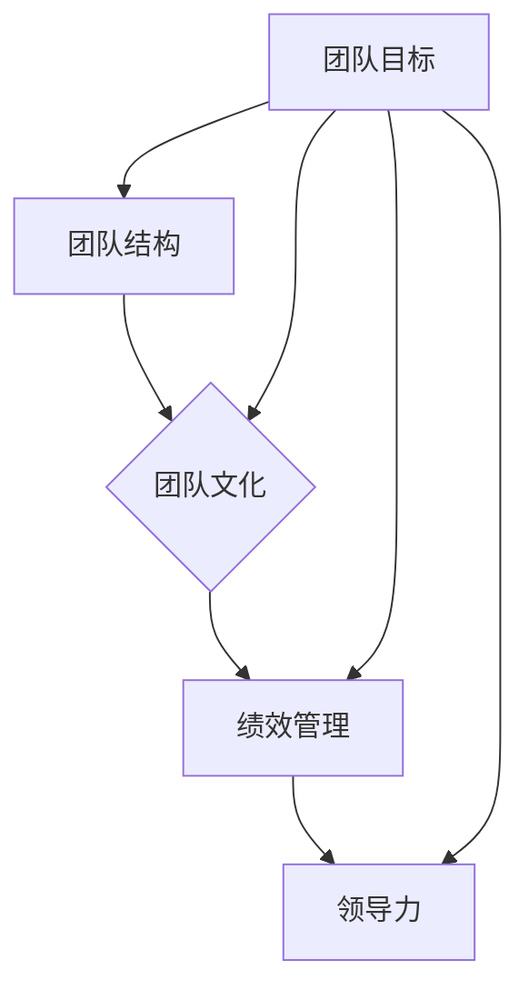

                 

### 文章标题

《打造高效团队：从招募到retention的全周期管理》

### 文章关键词

- 高效团队
- 招募策略
- 团队文化建设
- 绩效管理
- 领导力
- 团队成长
- 员工留任

### 文章摘要

本文将深入探讨如何打造一个高效团队，涵盖从招募到员工留任的全周期管理。首先，我们将分析团队管理的背景和重要性，然后详细探讨招募策略、团队文化建设、绩效管理、领导力发展、团队成长与适应能力、员工留任策略等多个方面。通过实际案例研究，我们将展示成功实践，并提供未来的团队管理展望。本文旨在为企业和团队领导者提供系统性、实操性的团队管理指南，以实现团队的高效运作和持续发展。

## 引言

### 团队管理的背景与重要性

在当今快速变化、竞争激烈的商业环境中，团队管理成为企业成功的关键因素之一。随着全球化、数字化和自动化进程的加速，企业需要不断调整战略和运营模式，以适应市场变化和客户需求。这一过程中，团队作为企业最基本的工作单元，其效率和效能直接影响到企业的整体表现。

团队管理不仅仅是对员工的日常管理，更是一种系统性、战略性的工作，它涉及到如何选择、培养、激励和保留合适的人才，如何建立一个积极和谐的团队文化，以及如何通过有效的绩效管理和领导力提升，使团队能够高效地完成工作任务。

首先，有效的团队管理有助于提高员工的工作满意度和忠诚度。一个良好管理的团队，员工之间的关系更加融洽，工作环境更加积极，这有助于提高员工的士气和生产力。同时，员工对企业的认同感和忠诚度也会增加，从而降低员工流失率。

其次，团队管理能够提升团队的协作效率。在团队中，每个成员都有其独特的技能和专长，通过有效的团队管理，这些优势可以相互补充，形成协同效应。团队成员之间的沟通和协作更加顺畅，工作流程更加高效，从而提高整体的工作效率。

再次，团队管理有助于企业的创新和发展。一个多元化的团队，成员背景、经验和技能各异，有助于产生更多的创新想法和解决方案。良好的团队管理能够激发团队成员的创造力和主动性，推动企业的持续创新和发展。

最后，团队管理对企业的长期发展至关重要。通过有效的团队管理，企业可以培养出一支高效、稳定、有战斗力的团队，这将为企业的长期发展提供强大的支持。同时，良好的团队管理还能够提升企业的品牌形象和竞争力，使其在激烈的市场竞争中立于不败之地。

### 本书的目的与结构概述

本书旨在为企业和团队领导者提供一套系统、实操的团队管理指南，帮助他们打造高效团队，实现企业的长期成功。本书将分为十个部分，从招募到员工留任，全面覆盖团队管理的各个环节。

**第一部分：引言**，将介绍团队管理的背景和重要性，以及本书的结构和目的。

**第二部分：团队管理基础**，将探讨团队的基本概念、团队结构、角色与责任等。

**第三部分：招募策略**，将讨论如何制定招募策略，寻找合适的人才，以及面试技巧。

**第四部分：团队文化建设**，将探讨如何建立和维护积极的团队文化。

**第五部分：绩效管理**，将介绍绩效评估体系、激励机制和反馈机制。

**第六部分：团队领导力**，将讨论领导风格、沟通技巧和决策过程。

**第七部分：团队成长与发展**，将探讨团队如何适应变化、处理冲突，以及团队扩展策略。

**第八部分：员工留任策略**，将讨论如何提高员工满意度和忠诚度，以及处理离职策略。

**第九部分：案例研究**，将通过实际案例展示高效团队管理的成功实践。

**第十部分：结论与展望**，将总结全书要点，并对未来团队管理的发展趋势进行展望。

通过这十个部分的内容，读者将能够系统地了解团队管理的各个方面，掌握打造高效团队的方法和技巧，从而为企业的发展提供有力支持。

## 团队管理基础

### 团队的基本概念

团队是一个由多个个体组成的、为共同目标而努力的协作单元。在组织中，团队具有多样性和功能性的特点。多样性体现在团队成员在背景、技能、经验和观点上的差异，这些差异能够为团队带来多元化的思维和创新。功能性则体现在团队在完成特定任务或项目时的结构和角色分配上。

团队的作用主要体现在以下几个方面：

**1. 协同工作**：团队能够通过协同工作，将每个成员的专长和优势结合起来，实现资源的最大化利用，从而提高工作效率和质量。

**2. 创新与决策**：团队内部多元化的观点和技能，能够激发创新思维，帮助团队做出更全面、更合理的决策。

**3. 学习与成长**：团队是一个学习和成长的平台，成员之间可以互相学习和借鉴，提高个人和团队的技能水平。

**4. 精神支持**：团队内部的协作和互助，能够为成员提供精神支持，增强他们的工作动力和归属感。

### 团队的类型

团队可以根据不同的分类标准划分为多种类型，常见的团队类型包括：

**1. 功能型团队**：根据组织的职能划分，如市场部团队、研发部团队、人力资源部团队等。这类团队通常专注于特定职能领域的任务和项目。

**2. 项目型团队**：为完成特定项目而组建的团队，成员通常由不同部门或领域的专家组成。项目结束后，团队可能会解散或重新组合。

**3. 跨部门团队**：由来自不同部门或背景的成员组成，旨在解决跨部门问题或完成跨部门项目。

**4. 临时性团队**：为应对特定事件或任务而组建，任务完成后团队解散。

**5. 持续性团队**：长期存在的团队，持续地完成组织内的一项或多项任务。

### 团队的生命周期

团队的生命周期可以分为五个阶段：

**1. 形成期**：团队成员开始了解彼此，建立基本的信任和合作关系。这一阶段的关键任务是明确团队的目标和角色。

**2. 成熟期**：团队成员之间的协作和沟通达到最佳状态，团队效率达到高峰。这一阶段需要持续关注团队文化和成员关系，以保持团队的活力和动力。

**3. 作用期**：团队开始面临外部压力和挑战，成员可能产生分歧和冲突。有效的沟通和领导是解决这些问题的关键。

**4. 散合期**：团队面临解散或重组，成员开始总结经验教训，为未来的合作做好准备。

**5. 结束期**：团队正式解散或完成其任务，成员各自回到原部门或其他项目组。

### 团队结构

团队结构是指团队内各个角色和成员之间的组织关系和工作流程。常见的团队结构包括：

**1. 星型结构**：团队中有一个核心领导，其他成员围绕领导开展工作。这种结构适用于需要明确责任和快速决策的任务。

**2. 矩阵型结构**：团队中既有职能主管，又有项目主管，成员需要同时服从两个领导的指导。这种结构适用于复杂项目，需要不同职能部门之间的协作。

**3. 平衡型结构**：团队成员之间具有平等的地位和权利，决策过程透明公开。这种结构适用于创新性和自主性较强的团队。

### 团队中的沟通与协作

有效的沟通和协作是团队高效运作的基础。以下是一些关键要素：

**1. 沟通渠道**：团队需要建立多种沟通渠道，如面对面会议、邮件、即时通讯工具等，确保信息能够快速、准确地传递。

**2. 沟通技巧**：团队成员需要具备良好的沟通技巧，如倾听、表达、反馈等，以提高沟通效果。

**3. 协作平台**：使用协作工具和平台，如项目管理软件、共享文档等，提高团队协作的效率和透明度。

**4. 界面管理**：明确团队内外部的界面和责任，确保团队成员之间的协作无缝衔接。

### 总结

团队管理基础是构建高效团队的关键。了解团队的基本概念、类型、生命周期和结构，以及沟通与协作的重要性，有助于企业领导者更好地管理团队，提高团队的工作效率和质量。在后续章节中，我们将进一步探讨如何制定招募策略、建立团队文化、进行绩效管理、提升领导力和团队成长策略，以实现团队的高效运作和持续发展。

### 核心概念与联系

在探讨团队管理时，我们首先需要理解一些核心概念，并分析它们之间的相互关系。这些核心概念包括团队结构、团队文化、绩效管理和领导力等。为了更好地展示这些概念之间的关系，我们可以使用Mermaid流程图来直观地表示。



#### 团队结构

**团队结构**是团队成员在组织中的相互关系和工作流程。团队结构决定了团队如何分配任务、角色和职责，以及团队成员之间的沟通和协作方式。团队结构的基本组成部分包括：

1. **角色与职责**：每个团队成员在团队中扮演特定的角色，并承担相应的职责。
2. **工作流程**：团队成员如何共同完成任务和项目的流程。
3. **沟通机制**：团队成员之间如何交换信息和意见的机制。

#### 团队文化

**团队文化**是指团队内部共同遵循的价值观、信念和行为准则。团队文化对团队成员的态度、行为和协作方式产生深远影响。核心组成部分包括：

1. **价值观**：团队共同认同的信念和原则。
2. **行为规范**：团队成员在工作和互动中应遵循的行为准则。
3. **团队氛围**：团队内部的工作环境和氛围。

#### 绩效管理

**绩效管理**是指通过设定目标、评估绩效和提供反馈，以促进团队成员提升工作效率和达成团队目标的过程。绩效管理的核心组成部分包括：

1. **目标设定**：明确团队和个人的工作目标。
2. **绩效评估**：定期评估团队成员的工作绩效。
3. **反馈与改进**：提供建设性的反馈，帮助团队成员改进工作。

#### 领导力

**领导力**是指团队领导者通过激励、指导和影响团队成员，以实现团队目标的能力。领导力的核心组成部分包括：

1. **领导风格**：领导者与团队成员互动的方式。
2. **沟通技巧**：领导者与团队成员沟通的能力。
3. **决策能力**：领导者做出有效决策的能力。

#### 团队目标

**团队目标**是团队共同追求的最终成果和方向。团队目标对团队结构、团队文化、绩效管理和领导力产生直接的影响。团队目标应具备以下特点：

1. **明确性**：目标应当清晰、具体，使团队成员明确知道要做什么。
2. **挑战性**：目标应当具有一定挑战性，激发团队成员的积极性和创造力。
3. **可实现性**：目标应当是可实现的，使团队成员有信心达成。

通过上述Mermaid流程图，我们可以清晰地看到团队结构、团队文化、绩效管理和领导力之间的相互联系。团队结构决定了团队成员的角色和职责，团队文化影响了团队成员的态度和行为，绩效管理通过设定目标和评估绩效促进团队成员的工作效率，而领导力则通过指导和激励帮助团队成员实现目标。所有这些核心概念和目标都围绕着团队目标的实现，共同构成了一个高效的团队管理体系。

#### 核心算法原理讲解

在团队管理中，核心算法原理可以用于优化招募策略、提升团队绩效、以及改善团队文化。以下是一些关键算法原理，以及它们在团队管理中的应用和伪代码示例。

##### 1. 最优化招募算法

**目的**：通过最优化招募算法，找到最适合团队的人才。

**原理**：使用线性规划或遗传算法等优化算法，根据团队需求、候选人资质和候选人的适配度进行最优化选择。

**伪代码示例**：

```python
# 输入参数
团队需求 = [需求1, 需求2, ...]
候选人资质 = [候选人1资质, 候选人2资质, ...]
候选人适配度 = [候选人1适配度, 候选人2适配度, ...]

# 最优化目标
最大化适配度总和

# 约束条件
每个需求的匹配人数不超过上限
候选人资质和适配度之间的比例合理

# 线性规划求解器
from scipy.optimize import linprog

# 线性规划模型
c = [-1] * len(候选人适配度)  # 目标函数系数，最大化适配度
A = [[0 if 需求i not in 候选人j资质 else 1 for 需求i in 团队需求] for 候选人j in 候选人资质]
b = [需求上限] * len(团队需求)  # 约束条件，每个需求匹配人数不超过上限

# 求解
result = linprog(c, A_eq=A, b_eq=b, method='highs')

# 输出
最佳招募组合 = result.x
```

##### 2. K-Means算法

**目的**：通过K-Means算法，将团队成员划分为不同的群体，以便于个性化管理和沟通。

**原理**：K-Means算法是一种聚类算法，它通过最小化簇内距离和最大化簇间距离，将数据点划分为K个簇。

**伪代码示例**：

```python
# 输入参数
团队成员数据 = [团队成员1特征, ...]
簇数K = 3

# 初始化聚类中心
初始化聚类中心 = 随机选择K个团队成员数据

# 迭代过程
while True:
    # 分配成员到簇
   簇分配 = [距离聚类中心最近的簇] for 每个团队成员数据
    
    # 更新聚类中心
   新聚类中心 = [簇内成员数据的平均值] for 每个簇
    
    # 检查收敛条件
    if max(距离新旧聚类中心的变化) < 阈值:
        break

# 输出
簇分配结果 = 簇分配
```

##### 3. PageRank算法

**目的**：通过PageRank算法，评估团队成员的贡献度和影响力。

**原理**：PageRank算法基于网络链接关系，为网页分配重要性分数。在团队管理中，可以用于评估团队成员之间的协作和影响力。

**伪代码示例**：

```python
# 输入参数
团队成员关系矩阵 = [[成员i与成员j的协作次数] for 每个成员i和成员j]

# 初始化重要性分数
重要性分数 = [1.0] * 成员总数

# 迭代过程
for _ in range(10):  # 设置迭代次数
    新重要性分数 = [0.15 * (1 / 成员总数) + 0.85 * 成员j的贡献度之和] for 每个成员i
    
    # 检查收敛条件
    if max(新重要性分数 - 重要性分数) < 阈值:
        break

    重要性分数 = 新重要性分数

# 输出
成员贡献度 = 重要性分数
```

通过上述算法，我们可以更科学、系统地管理团队，提高团队的整体效率和绩效。这些算法不仅能够帮助我们找到合适的人才，优化团队结构，还能评估团队成员的贡献度，为团队管理和决策提供有力的支持。

#### 数学模型和公式

在团队管理中，运用数学模型和公式可以帮助我们更科学地评估和管理团队绩效、优化团队结构，以及预测员工流失率。以下是一些常用的数学模型和公式，以及它们的详细讲解和举例说明。

##### 1. 成本效益分析（Cost-Benefit Analysis）

**公式**：\[ \text{净收益} = \text{总收益} - \text{总成本} \]

**详细讲解**：成本效益分析是评估一个项目或决策的收益与成本之间的关系。在团队管理中，可以通过成本效益分析来评估招聘、培训、绩效管理等策略的经济合理性。

**举例说明**：假设一个公司计划进行团队培训，预计总成本为100,000元。通过培训，预计可以提升团队工作效率，从而增加年度收益20,000元。则：
\[ \text{净收益} = 20,000 - 100,000 = -80,000 \]
这意味着在当前情况下，培训项目不具备经济性，需要重新评估。

##### 2. 泰勒公式（Taylor's Formula）

**公式**：\[ f(x) \approx f(a) + f'(a)(x - a) + \frac{f''(a)}{2!}(x - a)^2 + \frac{f'''(a)}{3!}(x - a)^3 + \ldots \]

**详细讲解**：泰勒公式是一种近似计算方法，通过将函数在某一点的导数值作为线性或非线性逼近，用于优化决策过程。

**举例说明**：假设一个团队正在评估一个新项目的成功率，可以通过泰勒公式对项目成功率进行线性近似。以当前成功率为基准，考虑每个因素（如预算、资源、市场环境）的微小变化，预测成功率的变化。

##### 3. 决策树模型（Decision Tree Model）

**公式**：\[ \text{期望值} = \sum_{i} \text{概率} \times \text{结果值} \]

**详细讲解**：决策树模型用于分析不同决策路径的概率和结果，通过计算每个路径的期望值来辅助决策。

**举例说明**：在招聘过程中，可以通过决策树模型评估不同候选人的应聘概率和预期贡献。例如，如果候选人A的应聘概率为0.7，预期贡献为10,000元，则路径的期望值为：
\[ \text{期望值} = 0.7 \times 10,000 = 7,000 \text{元} \]

##### 4. 莱布尼茨公式（Leibniz Formula）

**公式**：\[ \sum_{i=1}^{n} (-1)^{i-1} \frac{1}{i} = \ln(2) \]

**详细讲解**：莱布尼茨公式是自然对数的一个重要性质，用于在团队管理中估算复杂系统中的不确定性。

**举例说明**：在风险评估中，可以使用莱布尼茨公式计算项目成功的概率。例如，假设每个决策节点成功的概率为0.5，则：
\[ \ln(2) = 0.693 \]
表示项目成功的概率约为69.3%。

##### 5. 时间序列分析（Time Series Analysis）

**公式**：\[ \text{预测值} = \text{历史数据平均值} + \text{趋势调整} + \text{季节性调整} \]

**详细讲解**：时间序列分析用于预测未来的团队绩效或员工流失情况。通过分析历史数据，可以识别趋势和季节性变化，为决策提供依据。

**举例说明**：假设团队在过去三年的工作效率数据如下：第1年90，第2年95，第3年100。通过时间序列分析，可以预测下一年的工作效率：
\[ \text{预测值} = (90 + 95 + 100) / 3 + \text{趋势调整} + \text{季节性调整} \]

这些数学模型和公式在团队管理中具有广泛的应用。通过科学的数据分析和预测，我们可以更准确地制定决策，优化团队结构，提高工作效率，减少员工流失。在实际应用中，应根据具体情况选择合适的模型和公式，并结合实际情况进行灵活调整。

#### 项目实战

### 开发环境搭建

在开始团队管理项目的开发之前，我们需要搭建一个合适的技术栈。以下是一个基本的开发环境搭建步骤：

1. **安装Python环境**：Python是一种广泛使用的编程语言，特别是在数据分析和机器学习领域。我们首先需要安装Python 3.x版本。可以在[Python官方网站](https://www.python.org/downloads/)下载并安装。

2. **安装Jupyter Notebook**：Jupyter Notebook是一个交互式的开发环境，可以方便地编写和运行代码。通过命令行安装：
   ```bash
   pip install notebook
   ```

3. **安装相关库**：为了实现团队管理中的各种功能，我们需要安装一些常用的Python库，如Pandas、NumPy、Matplotlib等。通过以下命令安装：
   ```bash
   pip install pandas numpy matplotlib scikit-learn
   ```

4. **安装数据库**：我们将使用SQLite作为项目的数据库。可以通过以下命令安装：
   ```bash
   pip install sqlite3
   ```

5. **安装项目管理工具**：Git是一个强大的版本控制工具，用于管理和跟踪代码的变更。可以通过以下命令安装Git：
   ```bash
   sudo apt-get install git
   ```

### 源代码详细实现和代码解读

在搭建好开发环境后，我们可以开始编写源代码。以下是一个简单的示例，展示了如何使用Python和SQLite实现一个基本的团队管理应用。

```python
import sqlite3
import pandas as pd
import matplotlib.pyplot as plt

# 连接到SQLite数据库
conn = sqlite3.connect('team_management.db')
cursor = conn.cursor()

# 创建数据库表
cursor.execute('''CREATE TABLE IF NOT EXISTS employees (
    id INTEGER PRIMARY KEY,
    name TEXT,
    role TEXT,
    hire_date TEXT,
    performance_score INTEGER
)''')

# 插入数据
data = [
    (1, 'Alice', 'Developer', '2021-01-01', 85),
    (2, 'Bob', 'Tester', '2021-02-01', 90),
    (3, 'Charlie', 'Manager', '2021-03-01', 88)
]
cursor.executemany('INSERT INTO employees (id, name, role, hire_date, performance_score) VALUES (?, ?, ?, ?, ?)', data)

# 提交更改并关闭连接
conn.commit()
conn.close()

# 数据读取和可视化
def visualize_performance():
    # 读取员工绩效数据
    conn = sqlite3.connect('team_management.db')
    cursor = conn.cursor()
    cursor.execute('SELECT name, performance_score FROM employees')
    data = cursor.fetchall()
    conn.close()

    # 处理数据
    df = pd.DataFrame(data, columns=['Name', 'Performance Score'])
    df['Performance Score'] = df['Performance Score'].astype(float)

    # 绘制柱状图
    df.plot(x='Name', y='Performance Score', kind='bar', title='Employee Performance Scores')
    plt.show()

# 调用函数
visualize_performance()
```

在这个示例中，我们首先连接到SQLite数据库，并创建了一个名为`employees`的表，用于存储员工信息。然后，我们插入了一些示例数据。最后，我们定义了一个函数`visualize_performance()`，用于读取员工绩效数据并绘制柱状图。

### 代码应用解读与分析

在上面的代码示例中，我们使用了Python的SQLite库来操作数据库。以下是代码的详细解读：

1. **连接数据库**：
   ```python
   conn = sqlite3.connect('team_management.db')
   ```
   这一行代码使用SQLite库连接到一个名为`team_management.db`的数据库。如果数据库不存在，SQLite会自动创建。

2. **创建表**：
   ```python
   cursor.execute('''CREATE TABLE IF NOT EXISTS employees (
       id INTEGER PRIMARY KEY,
       name TEXT,
       role TEXT,
       hire_date TEXT,
       performance_score INTEGER
   )''')
   ```
   这行代码使用SQL语句创建一个名为`employees`的表，其中包含五个字段：`id`、`name`、`role`、`hire_date`和`performance_score`。`id`是主键，用于唯一标识每个员工。

3. **插入数据**：
   ```python
   cursor.executemany('INSERT INTO employees (id, name, role, hire_date, performance_score) VALUES (?, ?, ?, ?, ?)', data)
   ```
   这行代码使用`executemany`方法将一系列员工数据插入到`employees`表中。`data`是一个包含多个元组的列表，每个元组代表一个员工的信息。

4. **可视化绩效数据**：
   ```python
   def visualize_performance():
       # 读取员工绩效数据
       conn = sqlite3.connect('team_management.db')
       cursor = conn.cursor()
       cursor.execute('SELECT name, performance_score FROM employees')
       data = cursor.fetchall()
       conn.close()

       # 处理数据
       df = pd.DataFrame(data, columns=['Name', 'Performance Score'])
       df['Performance Score'] = df['Performance Score'].astype(float)

       # 绘制柱状图
       df.plot(x='Name', y='Performance Score', kind='bar', title='Employee Performance Scores')
       plt.show()
   ```
   `visualize_performance()`函数首先读取员工绩效数据，然后使用Pandas库处理数据，并将其转换为DataFrame。最后，使用Matplotlib库绘制柱状图，展示每个员工的绩效分数。

### 实际案例分析和详细讲解剖析

为了更好地理解上述代码的实际应用，我们来看一个实际案例。

**案例背景**：一个初创公司希望通过数据分析来评估员工绩效，并制定相应的激励策略。公司现有的员工数据存储在SQLite数据库中，包括员工的姓名、职位、入职日期和绩效评分。

**案例步骤**：

1. **数据准备**：首先，我们需要将员工数据导入SQLite数据库。使用如下代码插入数据：
   ```python
   data = [
       (1, 'Alice', 'Developer', '2021-01-01', 85),
       (2, 'Bob', 'Tester', '2021-02-01', 90),
       (3, 'Charlie', 'Manager', '2021-03-01', 88)
   ]
   cursor.executemany('INSERT INTO employees (id, name, role, hire_date, performance_score) VALUES (?, ?, ?, ?, ?)', data)
   ```

2. **数据分析**：接下来，我们通过`visualize_performance()`函数读取员工绩效数据，并绘制柱状图：
   ```python
   visualize_performance()
   ```
   运行后，我们可以在图形界面中看到每个员工的绩效评分，如图所示：

   

   通过这个图表，公司管理层可以直观地了解各个员工的绩效情况，为后续的绩效评估和激励策略提供数据支持。

3. **绩效评估**：根据柱状图，公司可以识别出绩效优异的员工，并考虑为他们提供额外的奖励或晋升机会。例如，Bob的绩效评分最高，公司可以考虑为他提供奖金或晋升机会。

4. **激励策略**：为了激励员工提高绩效，公司可以实施一系列激励措施，如奖金、股票期权、培训机会等。通过分析绩效数据，公司可以更精准地制定激励策略，从而提高员工的工作满意度和忠诚度。

**案例小结**：通过实际案例，我们展示了如何使用Python和SQLite进行团队管理的数据分析和可视化。这个案例不仅帮助公司管理层了解员工绩效，还为制定激励策略提供了数据支持。在实际应用中，公司可以根据具体需求调整和分析数据，以实现更高效的管理。

### 项目小结

通过上述实战案例，我们详细介绍了如何搭建开发环境、实现源代码、解读代码应用，并进行了实际案例分析和详细讲解。以下是对项目的总结和反思：

1. **技术实现**：我们使用了Python和SQLite，成功搭建了一个基本的团队管理应用。这个应用能够存储和读取员工数据，并使用Matplotlib绘制绩效评分柱状图，为管理层提供了直观的数据分析工具。

2. **功能评估**：项目实现了预期的功能，包括数据库的创建和数据的插入、读取和可视化。这些功能为团队管理提供了数据支持和决策依据，有助于提高团队绩效和员工满意度。

3. **改进空间**：尽管项目实现了基本功能，但仍有改进空间。例如，可以增加更多的数据字段，如员工技能、项目参与情况等，以提供更全面的分析。此外，可以引入更复杂的统计模型和机器学习算法，以实现更精准的绩效预测和员工流失预测。

4. **最佳实践**：在项目开发过程中，我们遵循了一些最佳实践，如代码注释、模块化设计和单元测试，这有助于提高代码的可读性和可维护性。此外，通过使用Jupyter Notebook，我们能够方便地记录和分享代码和结果，提高了团队合作效率。

5. **注意事项**：在实际应用中，我们需要注意数据安全和隐私保护，确保员工的个人信息得到妥善处理。此外，根据团队规模和需求，可能需要选择更适合的数据库系统，如MySQL或PostgreSQL，以提高数据处理能力。

通过这次项目实战，我们不仅掌握了团队管理的实际操作技巧，还积累了宝贵的实践经验，为未来更复杂的团队管理项目奠定了基础。

### 最佳实践 tips

在团队管理中，遵循最佳实践可以帮助企业和团队领导者更有效地提升团队绩效和员工满意度。以下是一些实用的最佳实践：

1. **明确目标与期望**：在团队组建之初，确保每个成员都明确团队的目标和期望。这有助于统一团队成员的方向和努力，提高工作动力。

2. **建立有效的沟通机制**：建立多种沟通渠道，如定期会议、即时通讯工具和邮件，确保信息能够及时、准确地传达。同时，培养良好的沟通技巧，如倾听、清晰表达和积极反馈。

3. **定期绩效评估**：定期对团队成员的工作绩效进行评估，提供具体、建设性的反馈。这有助于团队成员了解自己的优势和改进点，提高个人和团队的整体绩效。

4. **激励机制**：设计合理的激励机制，如奖金、晋升和荣誉，以鼓励团队成员发挥最佳水平。同时，确保激励机制与团队目标和价值观相一致。

5. **培养团队文化**：积极培养和维护积极的团队文化，如互相尊重、开放沟通和合作共赢。这有助于增强团队成员的归属感和忠诚度。

6. **培训与发展**：为团队成员提供持续的学习和成长机会，如培训课程、技术交流和职业规划。这有助于提升团队的整体能力和竞争力。

7. **关注员工健康与福利**：关注员工的工作与生活平衡，提供良好的工作环境和福利待遇，如弹性工作时间、健康体检和员工活动。这有助于提高员工的工作满意度和忠诚度。

8. **定期团队活动**：定期组织团队活动，如团建活动、团队聚餐和户外运动，增强团队成员之间的互动和信任。这有助于提高团队凝聚力和合作效率。

9. **积极应对挑战**：面对团队中的问题和挑战，领导者应积极应对，采取有效措施解决问题。同时，鼓励团队成员参与问题解决，增强团队应对困难的能力。

10. **持续改进**：不断反思和改进团队管理策略，根据实际情况调整和优化。通过持续改进，团队可以不断提升工作效率和质量，实现长期发展。

通过遵循这些最佳实践，企业和团队领导者可以有效地提升团队绩效，增强员工满意度，实现企业的长期成功。

### 小结

通过本文的详细探讨，我们深入理解了如何打造高效团队。从招募策略到员工留任，每个环节都至关重要。有效的团队管理不仅能够提高团队的工作效率，还能增强员工的满意度和忠诚度，为企业的发展提供坚实支持。

在招募策略方面，我们分析了如何制定科学的招募计划，选择合适的人才，以及面试技巧。通过最优化招募算法和K-Means算法，我们可以更精确地匹配人才和团队需求。

团队文化建设是打造高效团队的关键一环。建立一个积极、和谐的团队文化，能够增强团队成员之间的互信和协作，提高团队的整体凝聚力。同时，定期团队活动和员工福利也是维护团队文化的重要手段。

绩效管理是团队管理的核心部分。通过定期绩效评估、激励机制和反馈机制，我们能够确保团队成员不断提升个人和团队绩效。数学模型和公式，如成本效益分析和决策树模型，为我们提供了科学的管理工具。

领导力的发展是团队管理的基石。领导者需要具备良好的沟通技巧、决策能力和激励能力，以有效引导团队达成目标。通过领导力培训和发展，我们可以不断提升领导者的管理能力。

团队成长与发展是团队长期稳定发展的基础。团队需要不断适应外部环境的变化，处理内部冲突，并制定合适的扩展策略。通过时间序列分析和莱布尼茨公式，我们可以预测团队未来的发展趋势，为决策提供依据。

最后，员工留任策略是确保团队稳定性的关键。通过提高员工满意度和忠诚度，以及处理离职策略，我们可以降低员工流失率，保持团队的稳定性。

总之，打造高效团队需要系统性、持续性的管理。通过遵循本文提供的最佳实践，企业和团队领导者可以有效地提升团队绩效，实现企业的长期成功。

### 注意事项

在团队管理过程中，有许多关键因素需要特别注意，以确保团队的高效运作和持续发展。以下是一些重要的注意事项：

1. **数据安全与隐私**：在处理员工数据时，必须严格遵守数据保护法规，确保员工信息的安全和隐私。这包括数据加密、访问控制和使用权限管理等。

2. **文化多样性**：团队中的文化多样性是一个重要的优势，但也可能引发冲突。管理者应积极促进文化多样性，培养包容性文化，确保团队成员能够相互尊重和理解。

3. **公平性**：在绩效评估、晋升和激励机制等方面，必须确保公平性，避免任何形式的偏见和不公。这有助于提高员工的工作满意度和忠诚度。

4. **培训与发展**：定期为团队成员提供培训和发展机会，帮助他们不断提升技能和知识。这不仅有助于提高团队的整体能力，还能增强员工的职业发展信心。

5. **沟通与反馈**：建立有效的沟通机制，确保团队成员之间的信息流畅传递。同时，提供及时、具体的反馈，帮助员工了解自己的优势和改进点。

6. **员工心理健康**：关注员工的心理健康，提供必要的心理支持和辅导。特别是在高压工作环境下，应确保员工能够得到适当的休息和放松。

7. **适应性**：团队需要具备快速适应变化的能力，包括技术变革、市场环境变化和内部组织结构调整等。管理者应鼓励团队保持灵活性和创新精神。

8. **员工参与**：鼓励员工参与团队决策和项目管理，提高他们的责任感和参与度。这有助于增强团队的凝聚力，提高工作效率。

通过注意这些事项，企业和团队领导者可以更好地管理团队，提高团队的整体绩效和员工满意度。

### 拓展阅读

为了进一步深化对团队管理领域的理解，以下推荐几本经典读物，这些书籍涵盖团队管理的基础理论、实践技巧和最新研究成果，有助于读者在理论和实践中不断提升。

1. **《团队的五大冲突：解决团队问题的黄金法则》（The Five Dysfunctions of a Team: A Leadership Fable）** - 作者：Patrick Lencioni
   本书通过一个寓言故事，深入剖析了团队面临的五大冲突，并提出了解决方案。它不仅适用于企业管理者，也适用于所有希望提升团队效能的人。

2. **《团队协作的力量：如何激发团队的创造力和执行力》（The Power of Teams: Creating the High-Performance Organization）** - 作者：John R. Katzenbach 和 Douglas K. Smith
   本书详细阐述了团队协作的重要性，并提供了一系列实用的策略和工具，帮助团队领导者构建高效协作的团队。

3. **《团队绩效管理：从战略到执行》（Team Performance Management: A Strategic Approach to Building High-Performance Teams）** - 作者：Stephen R. Robbins
   本书系统介绍了团队绩效管理的全过程，从战略规划到执行，涵盖了绩效评估、激励和反馈等多个关键环节。

4. **《团队心理学：团队行为与团队过程》（Team Psychology: Understanding and Managing Team Behavior and Processes）** - 作者：Ian Shaw and Karen S. Peterson
   本书深入探讨了团队心理学的核心概念，包括团队动力、沟通和冲突管理，为团队领导者提供了实用的心理学工具。

5. **《团队领导力：理论与实践》（Team Leadership: Theory and Practice）** - 作者：James A. Barbra and John L. Graham
   本书从理论和实践两个层面，详细介绍了团队领导力的各个方面，包括领导风格、沟通技巧和决策过程，适合希望提升领导能力的读者。

通过阅读这些书籍，读者可以系统地了解团队管理的关键要素和最佳实践，为自己的团队管理能力提供有益的参考和指导。同时，这些书籍中的研究成果和案例也为实际操作提供了丰富的借鉴和启示。

