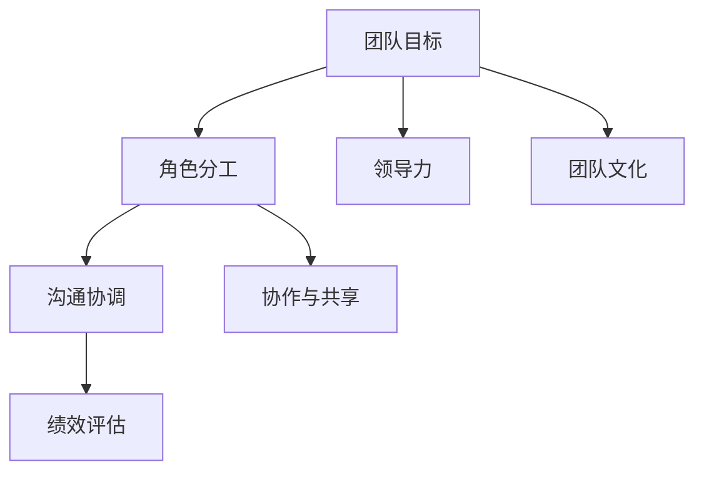
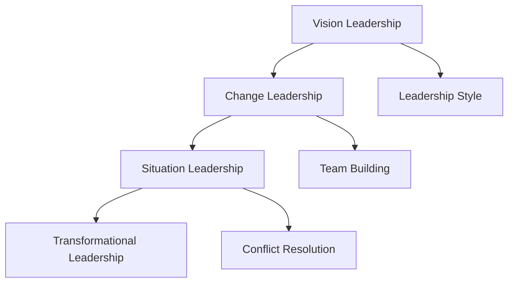
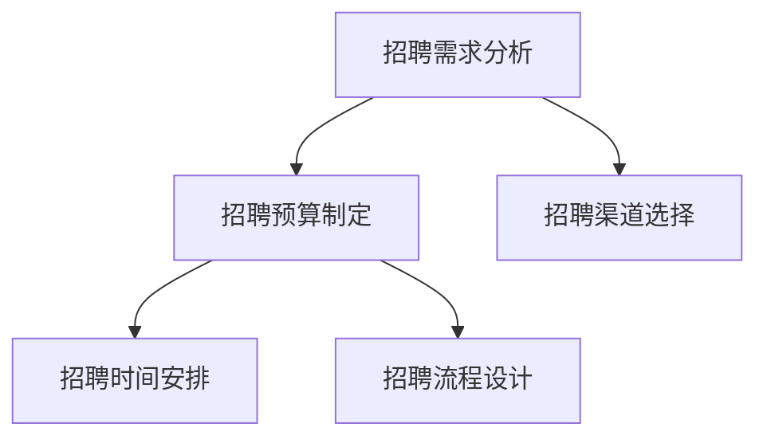
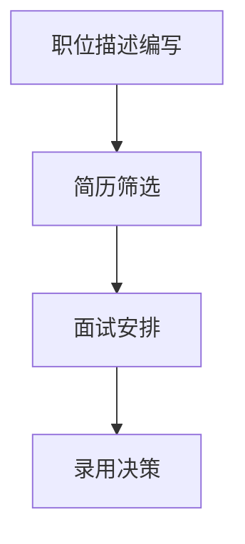
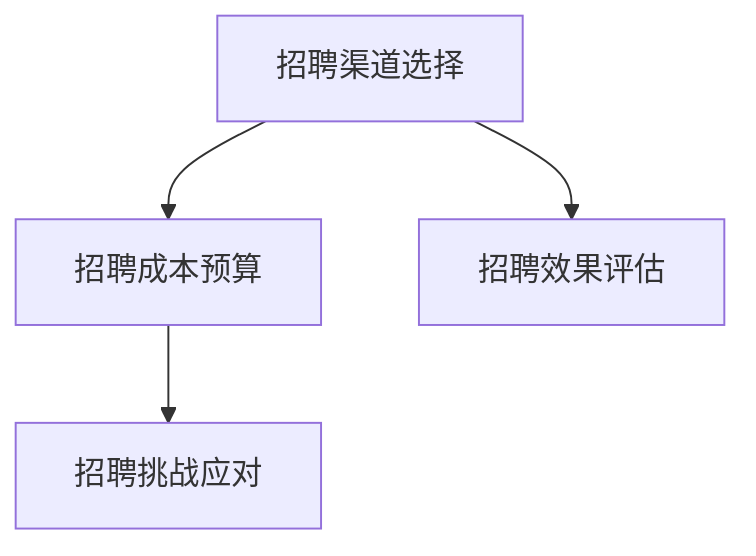
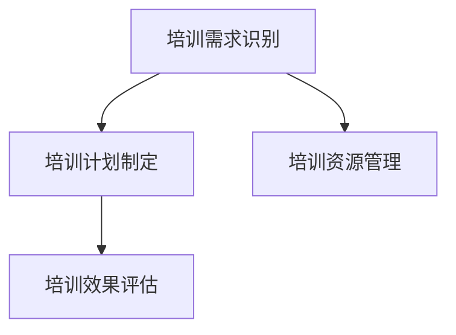
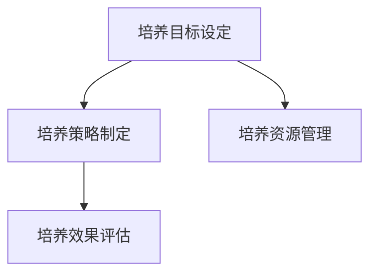
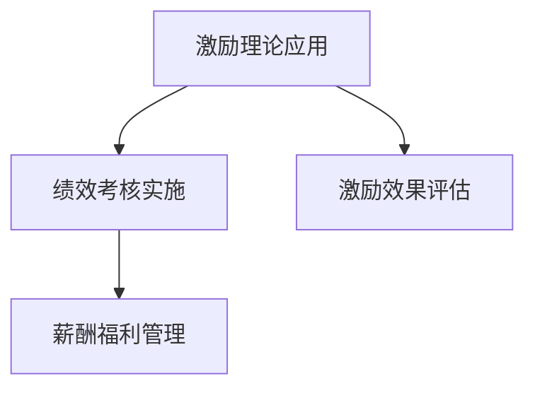
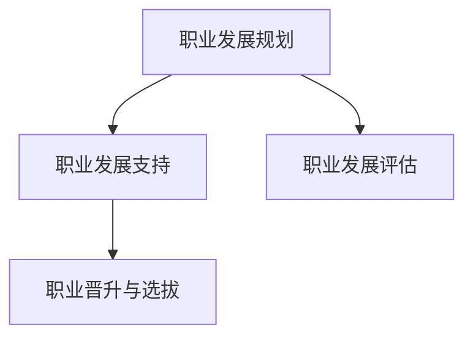
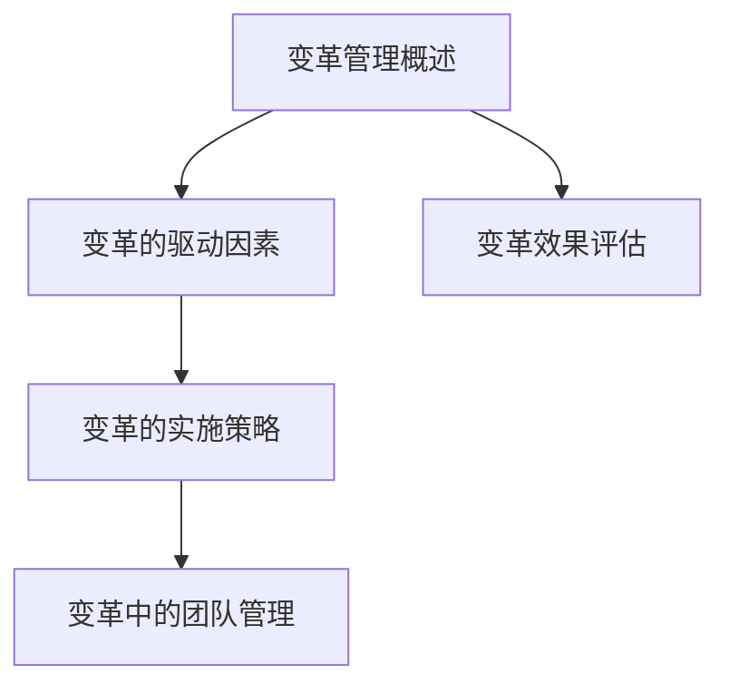

                 

### 文章标题

《打造高效团队：从招聘到培养的全流程指南》

### 关键词

高效团队，招聘策略，团队培养，领导力，沟通技巧

### 摘要

本文旨在为IT领域的技术团队管理者提供一套完整的团队构建和管理指南。文章从团队管理基础、招聘策略与流程、培养与激励以及案例分析与实践四个方面进行了深入探讨。通过详细的分析和实例讲解，帮助团队管理者理解如何从招聘到培养，全面打造一个高效、协作、具有创新力的团队。

## 第一部分：团队管理基础

### 1.1 团队管理概述

#### 背景介绍

团队管理是一个多维度的过程，涉及到团队目标设定、成员分工、沟通协调、绩效评估等多个方面。在一个高效团队中，每个成员都能够发挥自己的优势，共同推动团队达成目标。

#### 核心概念与联系

团队管理的关键概念包括：

- **团队目标**：明确团队的目标和使命，确保团队成员共同朝着一个方向努力。
- **角色分工**：根据团队成员的技能和特长，合理分配任务和职责。
- **沟通协调**：建立有效的沟通机制，确保信息传递的准确性和及时性。
- **绩效评估**：定期对团队成员的绩效进行评估，以持续优化团队表现。

以下是团队管理核心概念的Mermaid流程图：



#### 核心算法原理讲解

团队管理中的核心算法原理主要包括：

- **目标设定算法**：使用SMART原则（具体、可衡量、可实现、相关、时限性）来设定团队目标。
- **角色分工算法**：基于团队成员的技能和兴趣，使用匹配算法进行角色分配。
- **沟通协调算法**：使用网络模型（如社交网络分析）来优化团队内的信息传递路径。

以下是角色分工算法的伪代码：

```python
def assign_roles(team_members, tasks):
    roles = []
    for member in team_members:
        best_fit_role = None
        max_score = 0
        for role in tasks:
            score = calculate_score(member, role)
            if score > max_score:
                max_score = score
                best_fit_role = role
        roles.append(best_fit_role)
    return roles

def calculate_score(member, role):
    skill_score = calculate_skill_score(member, role)
    interest_score = calculate_interest_score(member, role)
    return skill_score + interest_score
```

#### 数学模型和公式

- **绩效评估模型**：可以使用加权评分模型对团队成员的绩效进行评估。

$$
绩效得分 = w_1 \times KPI_1 + w_2 \times KPI_2 + ... + w_n \times KPI_n
$$

其中，$w_i$ 为第 $i$ 个 KPI 的权重，$KPI_i$ 为第 $i$ 个关键绩效指标。

#### 举例说明

假设一个团队有5名成员，需要完成3个任务。我们可以使用上述算法来分配角色：

1. **目标设定**：设定团队目标为“完成3个任务，每个任务按时交付，质量达到预期标准”。
2. **角色分工**：根据成员的技能和兴趣，使用角色分工算法进行角色分配。
3. **沟通协调**：建立沟通机制，确保任务进展的实时更新。
4. **绩效评估**：在任务完成后，根据KPI进行绩效评估。

#### 项目实战

1. **开发环境搭建**：配置团队沟通工具（如Slack或Microsoft Teams），搭建协作平台（如Jira或Trello）。
2. **源代码详细实现**：编写团队管理相关的工具代码，如任务分配、绩效评估等。
3. **代码解读**：详细解读代码实现，确保团队成员理解。
4. **实际案例分析和详细讲解**：分析实际团队管理案例，讲解管理技巧。
5. **项目小结**：总结团队管理经验，提出改进建议。

#### 最佳实践 tips

- 定期进行团队建设活动，增强团队凝聚力。
- 建立明确的绩效目标和考核机制。
- 持续关注团队成员的职业发展需求。

### 1.2 领导力与团队发展

#### 背景介绍

领导力是团队管理中至关重要的一环，它直接影响到团队的士气和执行力。有效的领导能够激发团队成员的潜力，推动团队达成目标。

#### 核心概念与联系

领导力的核心概念包括：

- **愿景领导**：设定清晰的愿景和目标，引领团队向前发展。
- **变革领导**：在组织变革过程中，引导团队成员适应新环境。
- **情境领导**：根据团队成员的不同需求和情境，采取不同的领导风格。
- **变革型领导**：通过激发团队成员的内在动机，推动团队实现卓越表现。

以下是领导力核心概念的Mermaid流程图：



#### 核心算法原理讲解

领导力的核心算法原理主要包括：

- **领导风格匹配算法**：根据团队的需求和环境，选择最合适的领导风格。
- **团队发展评估算法**：定期评估团队的发展状态，调整领导策略。

以下是领导风格匹配算法的伪代码：

```python
def select_leadership_style(team_context):
    if team_context == "Stable":
        return "Affiliative"
    elif team_context == "Chaotic":
        return "Authoritative"
    elif team_context == "Growing":
        return "Democratic"
    else:
        return "Selling"
```

#### 数学模型和公式

- **团队发展指数**：可以使用以下公式来评估团队的发展状态。

$$
团队发展指数 = \frac{创新性 + 合作性 + 满意度}{3}
$$

#### 举例说明

假设一个团队处于“成长”阶段，我们可以使用上述算法来选择领导风格：

1. **评估团队发展状态**：使用团队发展评估算法，确定团队处于“成长”阶段。
2. **选择领导风格**：根据团队发展状态，使用领导风格匹配算法选择“民主型”领导风格。

#### 项目实战

1. **开发环境搭建**：为团队领导提供培训和学习资源，提升领导力。
2. **源代码详细实现**：编写领导力评估和领导风格匹配的工具代码。
3. **代码解读**：详细解读代码实现，确保团队成员理解。
4. **实际案例分析和详细讲解**：分析实际领导力案例，讲解领导技巧。
5. **项目小结**：总结领导力培养经验，提出改进建议。

#### 最佳实践 tips

- 定期进行领导力培训和团队建设活动。
- 关注团队成员的个人成长和职业发展。
- 建立良好的沟通和反馈机制，及时调整领导策略。

## 第二部分：招聘策略与流程

### 2.1 招聘计划

#### 背景介绍

招聘是团队建设的关键环节，它直接影响到团队的组成和绩效。一个良好的招聘计划能够确保团队获得合适的人才，满足组织的发展需求。

#### 核心概念与联系

招聘计划的核心概念包括：

- **招聘需求分析**：分析团队当前和未来的需求，确定招聘的职位和人数。
- **招聘预算制定**：根据组织的财务状况，制定合理的招聘预算。
- **招聘时间安排**：确定招聘的时间表，确保招聘过程的顺利进行。

以下是招聘计划核心概念的Mermaid流程图：



#### 核心算法原理讲解

招聘计划中的核心算法原理主要包括：

- **招聘需求分析算法**：基于团队目标和任务，使用需求分析算法确定招聘需求。
- **招聘预算优化算法**：根据组织的财务状况，优化招聘预算的分配。

以下是招聘需求分析算法的伪代码：

```python
def analyze_recruitment_needs(team_goals, current_resources):
    needed_skills = []
    for goal in team_goals:
        skills_required = get_skills_required_for_goal(goal)
        needed_skills.extend(skills_required)
    return needed_skills

def get_skills_required_for_goal(goal):
    # 算法实现，根据目标获取所需技能
    pass
```

#### 数学模型和公式

- **招聘预算分配模型**：可以使用以下公式来分配招聘预算。

$$
招聘预算 = 基础预算 + (所需技能价值 \times 技能稀缺程度)
$$

#### 举例说明

假设一个团队需要招聘5名开发人员，我们可以使用上述算法来制定招聘计划：

1. **分析招聘需求**：使用招聘需求分析算法，确定招聘所需的技能和人数。
2. **制定招聘预算**：使用招聘预算优化算法，根据组织的财务状况，制定合理的招聘预算。
3. **安排招聘时间**：确定招聘的时间表，确保招聘过程的顺利进行。

#### 项目实战

1. **开发环境搭建**：为招聘团队提供专业的招聘工具和资源。
2. **源代码详细实现**：编写招聘需求分析和预算优化的工具代码。
3. **代码解读**：详细解读代码实现，确保团队成员理解。
4. **实际案例分析和详细讲解**：分析实际招聘案例，讲解招聘策略。
5. **项目小结**：总结招聘经验，提出改进建议。

#### 最佳实践 tips

- 与人力资源部门紧密合作，确保招聘计划的顺利实施。
- 定期评估招聘效果，优化招聘策略。
- 利用多元化招聘渠道，提高招聘成功率。

### 2.2 招聘流程

#### 背景介绍

招聘流程是确保团队获得合适人才的重要环节，它包括职位描述编写、简历筛选、面试安排和录用决策等多个步骤。

#### 核心概念与联系

招聘流程的核心概念包括：

- **职位描述编写**：明确职位的职责、技能要求和任职资格。
- **简历筛选**：根据职位描述，对收到的简历进行初步筛选。
- **面试安排**：根据简历筛选结果，安排面试时间和方式。
- **录用决策**：综合面试结果，做出录用决策。

以下是招聘流程核心概念的Mermaid流程图：



#### 核心算法原理讲解

招聘流程中的核心算法原理主要包括：

- **简历筛选算法**：使用关键词匹配、机器学习等算法，对简历进行初步筛选。
- **面试评分算法**：使用评分模型，对面试者的表现进行量化评估。

以下是简历筛选算法的伪代码：

```python
def filter_resumes(job_description, resumes):
    selected_resumes = []
    for resume in resumes:
        if contains_keywords(job_description, resume):
            selected_resumes.append(resume)
    return selected_resumes

def contains_keywords(job_description, resume):
    # 算法实现，检查简历中是否包含职位描述中的关键词
    pass
```

#### 数学模型和公式

- **面试评分模型**：可以使用以下公式来计算面试者的总分。

$$
面试者总分 = \frac{专业技能得分 + 沟通能力得分 + 团队协作得分}{3}
$$

#### 举例说明

假设一个团队需要招聘一名开发人员，我们可以使用上述算法来实施招聘流程：

1. **编写职位描述**：明确开发人员的职责和技能要求。
2. **筛选简历**：使用简历筛选算法，筛选符合要求的简历。
3. **安排面试**：根据筛选结果，安排面试时间和方式。
4. **评估面试者**：使用面试评分模型，对面试者进行评估。

#### 项目实战

1. **开发环境搭建**：为招聘团队提供专业的面试工具和评分系统。
2. **源代码详细实现**：编写简历筛选和面试评分的工具代码。
3. **代码解读**：详细解读代码实现，确保团队成员理解。
4. **实际案例分析和详细讲解**：分析实际招聘案例，讲解招聘策略。
5. **项目小结**：总结招聘经验，提出改进建议。

#### 最佳实践 tips

- 与人力资源部门紧密合作，确保招聘流程的顺利进行。
- 利用技术手段，提高简历筛选和面试评分的效率。
- 建立良好的招聘反馈机制，持续优化招聘流程。

### 2.3 招聘策略

#### 背景介绍

招聘策略是确保团队获得合适人才的重要手段，它涉及到招聘渠道的选择、招聘成本的预算以及应对招聘挑战的策略。

#### 核心概念与联系

招聘策略的核心概念包括：

- **招聘渠道选择**：选择合适的招聘渠道，如内部推荐、社交媒体、招聘网站等。
- **招聘成本预算**：根据组织的财务状况，制定合理的招聘成本预算。
- **招聘挑战应对**：针对招聘过程中遇到的挑战，采取相应的应对策略。

以下是招聘策略核心概念的Mermaid流程图：



#### 核心算法原理讲解

招聘策略中的核心算法原理主要包括：

- **招聘渠道优化算法**：基于招聘效果和历史数据，优化招聘渠道的分配。
- **招聘成本控制算法**：根据招聘效果和预算，动态调整招聘成本的分配。

以下是招聘渠道优化算法的伪代码：

```python
def optimize_recruitment_channels(channels, historical_data):
    best_channels = []
    max_recruitment_success = 0
    for channel in channels:
        success_rate = calculate_success_rate(channel, historical_data)
        if success_rate > max_recruitment_success:
            max_recruitment_success = success_rate
            best_channels = [channel]
        elif success_rate == max_recruitment_success:
            best_channels.append(channel)
    return best_channels

def calculate_success_rate(channel, historical_data):
    # 算法实现，计算渠道的成功率
    pass
```

#### 数学模型和公式

- **招聘成本效益分析模型**：可以使用以下公式来评估招聘成本效益。

$$
成本效益 = 招聘效果 \times 成本效益系数
$$

#### 举例说明

假设一个团队需要优化招聘渠道，我们可以使用上述算法来制定招聘策略：

1. **分析历史招聘数据**：收集历史招聘数据，包括渠道效果和成本。
2. **优化招聘渠道**：使用招聘渠道优化算法，确定最佳的招聘渠道组合。
3. **调整招聘成本**：根据招聘成本控制算法，调整招聘成本的分配。

#### 项目实战

1. **开发环境搭建**：为招聘团队提供数据分析和决策支持工具。
2. **源代码详细实现**：编写招聘渠道优化和成本控制的工具代码。
3. **代码解读**：详细解读代码实现，确保团队成员理解。
4. **实际案例分析和详细讲解**：分析实际招聘案例，讲解招聘策略。
5. **项目小结**：总结招聘经验，提出改进建议。

#### 最佳实践 tips

- 与人力资源部门紧密合作，确保招聘策略的顺利实施。
- 利用数据驱动决策，优化招聘效果。
- 持续关注招聘市场的动态，灵活调整招聘策略。

### 2.4 员工培训与发展

#### 背景介绍

员工培训与发展是团队持续进步的重要保障，它涉及到培训需求的识别、培训计划的制定和培训效果的评估。

#### 核心概念与联系

员工培训与发展的核心概念包括：

- **培训需求识别**：通过调研和分析，确定员工的培训需求。
- **培训计划制定**：根据培训需求，制定详细的培训计划和内容。
- **培训效果评估**：通过评估，了解培训的效果，持续改进培训方案。

以下是员工培训与发展核心概念的Mermaid流程图：



#### 核心算法原理讲解

员工培训与发展中的核心算法原理主要包括：

- **培训需求识别算法**：基于数据分析和员工反馈，识别员工的培训需求。
- **培训效果评估算法**：使用指标体系，评估培训的效果。

以下是培训需求识别算法的伪代码：

```python
def identify_training_needs(employees, performance_data):
    training_needs = []
    for employee in employees:
        gap = calculate_performance_gap(employee, performance_data)
        if gap > threshold:
            training_needs.append(employee)
    return training_needs

def calculate_performance_gap(employee, performance_data):
    # 算法实现，计算员工绩效差距
    pass
```

#### 数学模型和公式

- **培训效果评估模型**：可以使用以下公式来评估培训的效果。

$$
培训效果得分 = \frac{培训后绩效得分 - 培训前绩效得分}{培训前绩效得分}
$$

#### 举例说明

假设一个团队需要进行员工培训，我们可以使用上述算法来制定培训计划：

1. **识别培训需求**：使用培训需求识别算法，确定需要培训的员工。
2. **制定培训计划**：根据培训需求，制定详细的培训计划和内容。
3. **评估培训效果**：使用培训效果评估算法，评估培训的效果。

#### 项目实战

1. **开发环境搭建**：为培训团队提供专业的培训工具和资源。
2. **源代码详细实现**：编写培训需求识别和效果评估的工具代码。
3. **代码解读**：详细解读代码实现，确保团队成员理解。
4. **实际案例分析和详细讲解**：分析实际培训案例，讲解培训策略。
5. **项目小结**：总结培训经验，提出改进建议。

#### 最佳实践 tips

- 与人力资源部门紧密合作，确保培训计划的顺利实施。
- 利用数据驱动决策，优化培训效果。
- 关注员工的个性化培训需求，提高培训的针对性。

## 第三部分：培养与激励

### 3.1 培养计划

#### 背景介绍

培养计划是确保团队成员持续成长和发展的关键环节，它涉及到培养目标的设定、培养策略的制定和培养效果的评估。

#### 核心概念与联系

培养计划的核心概念包括：

- **培养目标设定**：明确培养的目标和方向，确保培养计划的实施。
- **培养策略制定**：根据培养目标，制定具体的培养方法和措施。
- **培养效果评估**：通过评估，了解培养的效果，持续优化培养计划。

以下是培养计划核心概念的Mermaid流程图：



#### 核心算法原理讲解

培养计划中的核心算法原理主要包括：

- **培养目标设定算法**：基于团队目标和员工个人发展需求，制定培养目标。
- **培养效果评估算法**：使用指标体系，评估培养的效果。

以下是培养目标设定算法的伪代码：

```python
def set_training_goals(team_goals, employee_goals):
    training_goals = []
    for goal in team_goals:
        individual_goals = []
        for employee_goal in employee_goals:
            if goal == employee_goal:
                individual_goals.append(goal)
        training_goals.append(individual_goals)
    return training_goals
```

#### 数学模型和公式

- **培养效果评估模型**：可以使用以下公式来评估培养的效果。

$$
培养效果得分 = \frac{培训后绩效得分 - 培训前绩效得分}{培训前绩效得分}
$$

#### 举例说明

假设一个团队需要制定培养计划，我们可以使用上述算法来实施：

1. **设定培养目标**：使用培养目标设定算法，确定培养的目标和方向。
2. **制定培养策略**：根据培养目标，制定具体的培养方法和措施。
3. **评估培养效果**：使用培养效果评估算法，评估培养的效果。

#### 项目实战

1. **开发环境搭建**：为培养团队提供专业的培养工具和资源。
2. **源代码详细实现**：编写培养目标设定和效果评估的工具代码。
3. **代码解读**：详细解读代码实现，确保团队成员理解。
4. **实际案例分析和详细讲解**：分析实际培养案例，讲解培养策略。
5. **项目小结**：总结培养经验，提出改进建议。

#### 最佳实践 tips

- 关注员工的个性化发展需求，提高培养的针对性。
- 建立完善的培养体系，确保培养计划的连贯性和系统性。
- 利用数据驱动决策，优化培养效果。

### 3.2 激励机制

#### 背景介绍

激励机制是确保团队成员积极性和创造力的重要手段，它涉及到激励理论的应用、绩效考核的实施和薪酬福利的管理。

#### 核心概念与联系

激励机制的核心概念包括：

- **激励理论应用**：了解并应用各种激励理论，如马斯洛需求层次理论、赫兹伯格双因素理论等。
- **绩效考核实施**：通过绩效考核，评估团队成员的工作表现。
- **薪酬福利管理**：合理设计薪酬结构和福利政策，激发团队成员的积极性。

以下是激励机制核心概念的Mermaid流程图：



#### 核心算法原理讲解

激励机制中的核心算法原理主要包括：

- **绩效考核算法**：使用各种评估指标和方法，对团队成员进行绩效考核。
- **薪酬福利优化算法**：根据市场状况和员工绩效，优化薪酬福利结构。

以下是绩效考核算法的伪代码：

```python
def perform_performance_evaluation(employees, performance_data):
    performance_scores = []
    for employee in employees:
        score = calculate_performance_score(employee, performance_data)
        performance_scores.append(score)
    return performance_scores

def calculate_performance_score(employee, performance_data):
    # 算法实现，计算员工绩效得分
    pass
```

#### 数学模型和公式

- **薪酬福利优化模型**：可以使用以下公式来优化薪酬福利。

$$
薪酬福利 = 基础薪酬 + (绩效得分 \times 调整系数)
$$

#### 举例说明

假设一个团队需要实施激励机制，我们可以使用上述算法来制定激励策略：

1. **应用激励理论**：了解并应用各种激励理论，制定激励方案。
2. **实施绩效考核**：使用绩效考核算法，对团队成员进行绩效考核。
3. **优化薪酬福利**：根据绩效考核结果，优化薪酬福利结构。

#### 项目实战

1. **开发环境搭建**：为激励团队提供专业的绩效考核和薪酬福利管理工具。
2. **源代码详细实现**：编写绩效考核和薪酬福利优化的工具代码。
3. **代码解读**：详细解读代码实现，确保团队成员理解。
4. **实际案例分析和详细讲解**：分析实际激励案例，讲解激励策略。
5. **项目小结**：总结激励经验，提出改进建议。

#### 最佳实践 tips

- 关注员工的个性化需求，制定个性化的激励方案。
- 建立透明的绩效考核机制，确保公平性和公正性。
- 定期评估激励效果，持续优化激励策略。

### 3.3 职业发展路径

#### 背景介绍

职业发展路径是确保团队成员长期发展的关键，它涉及到职业发展规划的制定、职业发展支持的实施和职业晋升与选拔的流程。

#### 核心概念与联系

职业发展路径的核心概念包括：

- **职业发展规划**：明确职业发展的目标和路径，为团队成员提供发展方向。
- **职业发展支持**：提供培训、指导和支持，帮助团队成员实现职业发展目标。
- **职业晋升与选拔**：建立科学的晋升机制，确保团队成员能够公平竞争和晋升。

以下是职业发展路径核心概念的Mermaid流程图：



#### 核心算法原理讲解

职业发展路径中的核心算法原理主要包括：

- **职业发展评估算法**：根据团队成员的绩效和发展需求，评估职业发展状况。
- **晋升选拔算法**：基于绩效和发展潜力，选拔合适的团队成员晋升。

以下是职业发展评估算法的伪代码：

```python
def assess_career_progress(employees, performance_data, development_data):
    promotion_candidates = []
    for employee in employees:
        if employee.performance_score > threshold and employee.development_score > threshold:
            promotion_candidates.append(employee)
    return promotion_candidates

def calculate_performance_score(employee, performance_data):
    # 算法实现，计算员工绩效得分
    pass

def calculate_development_score(employee, development_data):
    # 算法实现，计算员工发展得分
    pass
```

#### 数学模型和公式

- **职业发展评估模型**：可以使用以下公式来评估职业发展状况。

$$
职业发展得分 = \frac{绩效得分 + 发展得分}{2}
$$

#### 举例说明

假设一个团队需要制定职业发展路径，我们可以使用上述算法来实施：

1. **评估职业发展状况**：使用职业发展评估算法，评估团队成员的职业发展状况。
2. **制定职业发展规划**：根据评估结果，制定职业发展规划和路径。
3. **实施职业发展支持**：提供培训、指导和支持，帮助团队成员实现职业发展目标。

#### 项目实战

1. **开发环境搭建**：为职业发展团队提供专业的评估和晋升工具。
2. **源代码详细实现**：编写职业发展评估和晋升选拔的工具代码。
3. **代码解读**：详细解读代码实现，确保团队成员理解。
4. **实际案例分析和详细讲解**：分析实际职业发展案例，讲解职业发展策略。
5. **项目小结**：总结职业发展经验，提出改进建议。

#### 最佳实践 tips

- 建立明确的职业发展目标和路径，为团队成员提供清晰的职业规划。
- 提供多样化的职业发展支持，满足团队成员的不同发展需求。
- 建立科学的晋升机制，确保团队成员的公平竞争和晋升机会。

### 3.4 转型与变革管理

#### 背景介绍

转型与变革管理是确保团队在快速变化的市场环境中持续发展的关键，它涉及到变革管理的概述、变革的驱动因素、变革的实施策略和变革中的团队管理。

#### 核心概念与联系

转型与变革管理的核心概念包括：

- **变革管理概述**：了解变革管理的基本原理和过程。
- **变革的驱动因素**：识别导致变革的外部压力和内部需求。
- **变革的实施策略**：制定并实施有效的变革策略。
- **变革中的团队管理**：在变革过程中，确保团队成员的适应和支持。

以下是转型与变革管理核心概念的Mermaid流程图：



#### 核心算法原理讲解

转型与变革管理中的核心算法原理主要包括：

- **变革驱动因素识别算法**：基于数据分析和市场调研，识别变革的驱动因素。
- **变革效果评估算法**：使用指标体系，评估变革的效果。

以下是变革驱动因素识别算法的伪代码：

```python
def identify_change_drivers(external_data, internal_data):
    drivers = []
    for factor in external_data:
        if factor_impact > threshold:
            drivers.append(factor)
    for factor in internal_data:
        if factor_impact > threshold:
            drivers.append(factor)
    return drivers

def calculate_factor_impact(factor, data):
    # 算法实现，计算因素影响
    pass
```

#### 数学模型和公式

- **变革效果评估模型**：可以使用以下公式来评估变革的效果。

$$
变革效果得分 = \frac{变革后绩效得分 - 变革前绩效得分}{变革前绩效得分}
$$

#### 举例说明

假设一个团队需要进行转型与变革，我们可以使用上述算法来实施：

1. **识别变革驱动因素**：使用变革驱动因素识别算法，确定变革的驱动因素。
2. **制定变革实施策略**：根据变革驱动因素，制定具体的变革实施策略。
3. **评估变革效果**：使用变革效果评估算法，评估变革的效果。

#### 项目实战

1. **开发环境搭建**：为变革团队提供专业的变革管理和效果评估工具。
2. **源代码详细实现**：编写变革驱动因素识别和效果评估的工具代码。
3. **代码解读**：详细解读代码实现，确保团队成员理解。
4. **实际案例分析和详细讲解**：分析实际变革案例，讲解变革策略。
5. **项目小结**：总结变革经验，提出改进建议。

#### 最佳实践 tips

- 关注市场动态，及时识别变革的驱动因素。
- 制定详细的变革计划，确保变革的顺利进行。
- 建立有效的沟通和反馈机制，确保团队成员的适应和支持。

## 第四部分：案例分析与实践

### 4.1 招聘与培养成功案例

#### 案例一：某互联网公司的招聘策略

某互联网公司通过以下策略成功招聘到了一批优秀的人才：

1. **明确的招聘需求**：公司对每个职位都进行了详细的需求分析，明确了岗位的职责和技能要求。
2. **多元化的招聘渠道**：公司利用内部推荐、社交媒体、招聘网站等多种渠道进行招聘，提高了招聘的成功率。
3. **科学的面试流程**：公司制定了严格的面试流程，包括初试、复试和终试，确保招聘到的人才符合岗位要求。

#### 案例二：某制造企业的培养计划

某制造企业通过以下培养计划成功提升了员工的专业技能：

1. **全面的培训体系**：公司建立了完善的培训体系，包括新员工入职培训、技能提升培训和职业发展培训。
2. **个性化的培养方案**：公司根据员工的兴趣和职业规划，制定了个性化的培养方案，确保员工能够得到针对性的培训。
3. **培训效果评估**：公司定期对培训效果进行评估，根据评估结果调整培训计划，确保培训效果的最大化。

### 4.2 团队管理实践分享

#### 实践一：提高团队协作效率

为了提高团队协作效率，某IT公司采取了以下措施：

1. **协作工具与平台**：公司引入了协作工具（如Slack、Trello），建立了统一的协作平台，确保团队成员能够实时沟通和协作。
2. **明确的工作流程**：公司制定了明确的工作流程，确保团队成员对任务和职责有清晰的认识，减少了工作中的误解和冲突。
3. **定期团队建设活动**：公司定期组织团队建设活动，增强团队成员的凝聚力和协作精神。

#### 实践二：构建积极团队文化

为了构建积极的团队文化，某公司采取了以下策略：

1. **透明的沟通机制**：公司建立了透明的沟通机制，确保团队成员能够及时了解公司的战略方向和业务动态。
2. **积极的反馈文化**：公司鼓励团队成员之间进行积极的反馈，建立了一种互相尊重和学习的氛围。
3. **公平的晋升机制**：公司建立了公平的晋升机制，确保团队成员有公平的晋升机会，激发了员工的工作热情。

## 附录

### A.1 团队管理工具与资源

#### A.1.1 常用团队管理工具

- **Slack**：一款流行的团队沟通工具，支持实时聊天、文件共享和集成其他应用程序。
- **Trello**：一款简单易用的项目管理工具，通过看板和卡片来管理任务和项目进度。
- **Jira**：一款功能强大的敏捷项目管理工具，支持任务追踪、敏捷开发和团队协作。

#### A.1.2 团队管理资源推荐

- **《团队协作的艺术》**：作者：查尔斯·汉迪，介绍了团队协作的基本原则和实践方法。
- **《团队领导力》**：作者：约翰·马多克斯，探讨了团队领导力的重要性以及如何提升领导力。
- **《团队沟通技巧》**：作者：斯蒂芬·罗宾斯，提供了有效的沟通技巧和策略，帮助团队成员更好地协作。

### 作者信息

- **作者：AI天才研究院/AI Genius Institute & 禅与计算机程序设计艺术 /Zen And The Art of Computer Programming**

