                 


### 文章标题：打造高效研发团队的秘诀

> 关键词：高效研发团队、团队建设、项目管理、技术栈、自动化流程、持续集成

> 摘要：本文将探讨如何打造一个高效研发团队，从团队建设基础、高效团队管理、提升研发效能、团队成长与发展以及案例分析等方面，提供一套全面且实用的方法论。通过逐步分析推理，本文旨在帮助IT企业和管理者了解并实践高效研发团队的构建与运作。

---

## 第一部分：团队建设基础

### 1.1 研发团队的角色和职责

在构建高效研发团队之前，首先需要明确团队成员的角色和职责。一个典型的研发团队通常包括项目经理、软件工程师、测试工程师、UI/UX设计师等角色。

- **项目经理**：负责整个项目的规划、执行和监控，确保项目按时完成且满足质量要求。
- **软件工程师**：负责编写和实现软件功能，设计系统架构，进行代码审查和优化。
- **测试工程师**：负责编写测试用例，执行测试，确保软件质量。
- **UI/UX设计师**：负责产品的用户界面和用户体验设计，确保产品易用性。

**核心概念与联系：**

研发团队的角色和职责是项目成功的基石。各个角色之间的协作和沟通至关重要。以下是一个简化的团队角色关系架构图，使用Mermaid流程图表示：

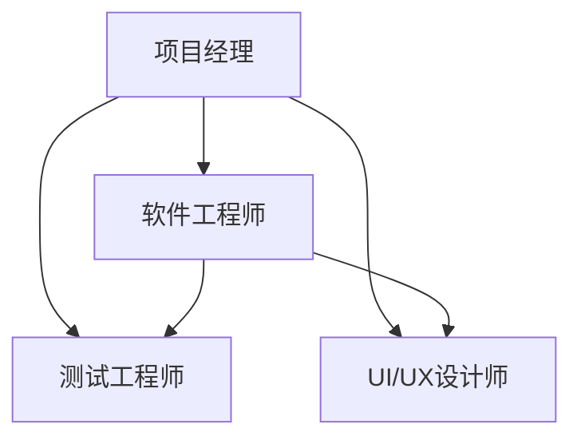

### 1.2 团队文化的重要性

团队文化是团队内部成员共同价值观和行为的体现。一个健康的团队文化可以增强团队的凝聚力、创造力和工作效率。

- **开放沟通**：鼓励团队成员之间的开放沟通，及时分享想法和问题。
- **尊重差异**：尊重每个成员的观点和贡献，避免偏见和歧视。
- **持续学习**：鼓励团队成员不断学习和提升自己的技能，促进团队整体成长。

**核心概念与联系：**

团队文化的建设需要从团队领导者开始，通过树立榜样和制定相关政策来影响团队成员。以下是一个简化的团队文化建设流程图，使用Mermaid流程图表示：

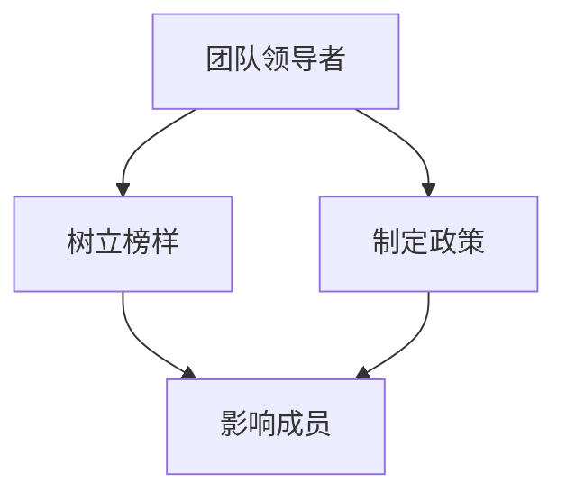

### 1.3 团队建设的原则与方法

团队建设是一个持续的过程，需要遵循一定的原则和方法。以下是一些关键的团队建设原则和方法：

- **目标明确**：明确团队的目标和愿景，确保每个成员都清楚自己的职责和目标。
- **分工合作**：合理分工，确保每个成员都能发挥自己的专长，提高工作效率。
- **反馈机制**：建立有效的反馈机制，鼓励成员之间互相学习和成长。
- **激励机制**：设置合理的激励机制，激励团队成员积极工作。

**核心概念与联系：**

团队建设的原则和方法是为了确保团队的高效运作和成员的满意度。以下是一个简化的团队建设流程图，使用Mermaid流程图表示：

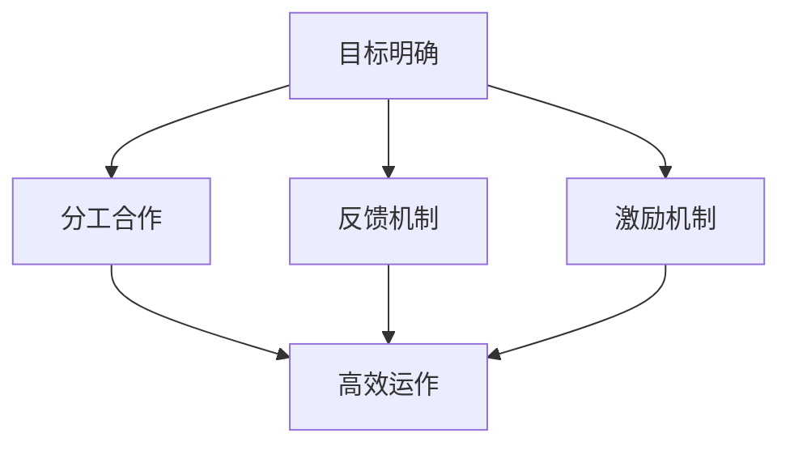

## 第二部分：高效团队管理

### 2.1 项目管理技巧

项目管理是确保项目按时、按质量完成的关键。以下是一些有效的项目管理技巧：

- **需求管理**：明确项目需求和范围，避免需求变更导致的延期和质量问题。
- **进度管理**：使用Gantt图、看板等工具跟踪项目进度，及时调整计划。
- **风险管理**：识别潜在风险，制定应对策略，降低风险对项目的影响。
- **沟通管理**：定期召开会议，保持团队之间的沟通，确保信息透明。

**核心算法原理讲解：**

项目管理中的关键路径法（Critical Path Method，CPM）是一种用于确定项目最短完成时间的方法。以下是一个关键路径法的伪代码示例：

```python
def critical_path_tasks(tasks, dependencies):
    # 初始化任务持续时间数组
    durations = [0] * len(tasks)

    # 计算每个任务的最早开始时间（ES）和最早完成时间（EF）
    for task in tasks:
        task.es = max([predecessor.e
```

## 第二部分：高效团队管理（续）

### 2.1 项目管理技巧（续）

**核心算法原理讲解（续）：**

以下是一个关键路径法的伪代码示例，用于计算每个任务的最早开始时间（ES）和最早完成时间（EF）：

```python
def critical_path_tasks(tasks, dependencies):
    # 初始化任务持续时间数组
    durations = [0] * len(tasks)

    # 计算每个任务的最早开始时间（ES）和最早完成时间（EF）
    for task in tasks:
        task.es = 0
        task.ef = durations[task.id]

    # 更新所有后续任务的ES和EF
    for task in tasks:
        for successor in task.successors:
            successor.es = max(successor.es, task.ef)
            successor.ef = successor.es + durations[successor.id]

    # 确定关键路径
    critical_path = []
    max_time = max([task.ef for task in tasks])
    current_time = max_time

    while current_time > 0:
        for task in tasks:
            if task.ef == current_time and not task.is_visited:
                critical_path.append(task)
                task.is_visited = True
                current_time -= durations[task.id]

    return critical_path
```

**数学模型和公式详细讲解：**

关键路径法中的数学模型可以表示为：

$$
\text{ES}_i = \max(\text{ES}_j + \text{d}_{ij}) \quad \text{for all predecessors } j \text{ of task } i
$$

$$
\text{EF}_i = \text{ES}_i + \text{d}_i
$$

其中，$\text{ES}_i$ 是任务 $i$ 的最早开始时间，$\text{EF}_i$ 是任务 $i$ 的最早完成时间，$d_i$ 是任务 $i$ 的持续时间，$\text{d}_{ij}$ 是任务 $i$ 和任务 $j$ 之间的持续时间。

**举例说明：**

假设一个项目包含以下任务：

- 任务 A（持续时间为 3 天）
- 任务 B（持续时间为 5 天）
- 任务 C（持续时间为 3 天）

任务之间的依赖关系如下：

- A 完成后，B 可以开始
- B 完成后，C 可以开始

使用关键路径法，可以计算出每个任务的最早开始时间和最早完成时间：

- 任务 A：ES = 0，EF = 3
- 任务 B：ES = 3，EF = 8
- 任务 C：ES = 8，EF = 11

关键路径为 A → B → C，总持续时间为 11 天。

**项目实战：**

在一个实际的软件开发项目中，我们可以使用关键路径法来优化项目进度。以下是一个项目实战的示例：

- 项目包含以下任务：
  - 设计阶段（持续时间为 7 天）
  - 编码阶段（持续时间为 14 天）
  - 测试阶段（持续时间为 7 天）
  - 部署阶段（持续时间为 3 天）
- 任务之间的依赖关系如下：
  - 设计完成后，编码可以开始
  - 编码完成后，测试可以开始
  - 测试完成后，部署可以开始

使用关键路径法，我们可以计算出每个任务的最早开始时间和最早完成时间：

- 设计阶段：ES = 0，EF = 7
- 编码阶段：ES = 7，EF = 21
- 测试阶段：ES = 21，EF = 28
- 部署阶段：ES = 28，EF = 31

关键路径为 设计 → 编码 → 测试 → 部署，总持续时间为 31 天。

通过关键路径法，项目经理可以更好地了解项目的进度和关键路径上的任务，从而采取相应的措施来优化项目进度。例如，如果编码阶段的持续时间延长了，项目经理可以调整测试阶段的时间，以确保项目按时完成。

**小结：**

关键路径法是一种有效的项目管理技巧，可以帮助项目经理优化项目进度和资源分配。通过使用关键路径法，项目经理可以更好地了解项目的关键任务和风险，从而确保项目的成功完成。

---

**注意事项：**

- 在使用关键路径法时，需要确保所有任务的持续时间是已知的，否则无法准确计算最早开始时间和最早完成时间。
- 关键路径法适用于项目任务之间存在依赖关系的情况，对于独立任务的项目，关键路径法可能不是最佳选择。
- 在实际应用中，关键路径法需要与其他项目管理方法和工具结合使用，以达到最佳效果。

**拓展阅读：**

- 《项目管理知识体系指南（PMBOK指南）》
- 《关键路径法：项目管理中的关键路径》
- 《敏捷项目管理：理论与实践》

---

在接下来的部分，我们将继续探讨团队管理的其他方面，包括风险管理策略、沟通协调机制以及团队绩效评估。通过逐步分析推理，我们将提供一系列实用方法和工具，帮助您打造一个高效研发团队。敬请期待！

## 第二部分：高效团队管理（续）

### 2.2 风险管理策略

在项目管理中，风险管理是确保项目成功的关键环节。有效的风险管理策略可以帮助团队识别、评估和应对潜在风险，降低风险对项目的影响。

**核心概念与联系：**

风险管理包括以下几个关键步骤：

1. 风险识别：识别项目中可能出现的风险。
2. 风险评估：评估风险的可能性和影响。
3. 风险应对：制定应对策略，降低风险的影响。
4. 风险监控：持续监控风险，确保应对策略的有效性。

以下是一个简化的风险管理流程图，使用Mermaid流程图表示：

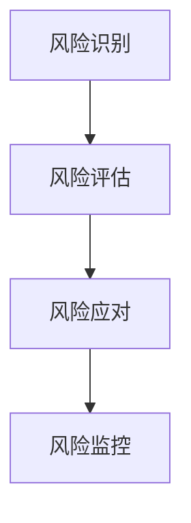

### 2.3 沟通协调机制

沟通是团队协作的基石。有效的沟通协调机制可以确保团队成员之间信息畅通，减少误解和冲突，提高工作效率。

**核心概念与联系：**

沟通协调机制包括以下几个方面：

1. 定期会议：定期召开团队会议，讨论项目进展、问题和解决方案。
2. 沟通工具：使用合适的沟通工具，如即时通讯、电子邮件、项目管理软件等，确保信息传递及时、准确。
3. 信息共享：建立共享平台，方便团队成员共享文档、代码和资源。
4. 反馈机制：建立反馈机制，鼓励团队成员提供意见和建议，促进团队改进。

以下是一个简化的沟通协调流程图，使用Mermaid流程图表示：

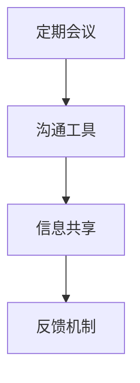

### 2.4 团队绩效评估

团队绩效评估是确保团队高效运作的重要手段。通过评估团队和个人的绩效，可以识别优势和不足，制定改进计划，提高团队整体效能。

**核心概念与联系：**

团队绩效评估包括以下几个方面：

1. 绩效指标：确定团队和个人的绩效指标，如项目完成率、代码质量、问题解决速度等。
2. 评估方法：采用定量和定性方法进行绩效评估，如KPI、360度评估等。
3. 反馈与改进：根据评估结果，提供反馈和改进建议，促进团队成员的成长和团队整体效能的提升。

以下是一个简化的团队绩效评估流程图，使用Mermaid流程图表示：

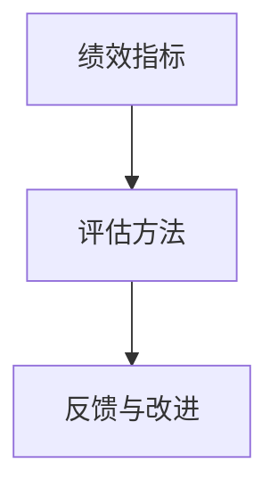

**项目实战：**

以下是一个团队绩效评估的项目实战示例：

1. **绩效指标**：
   - 项目完成率：项目实际完成进度与计划进度的比值。
   - 代码质量：代码缺陷率、代码可读性和可维护性等。
   - 问题解决速度：从问题报告到问题解决的时间。

2. **评估方法**：
   - 定量评估：基于数据指标进行评估，如使用自动化工具统计代码缺陷率。
   - 定性评估：通过团队讨论和评审，评估成员的贡献和团队合作能力。

3. **反馈与改进**：
   - 根据评估结果，为表现优秀的成员提供奖励和晋升机会。
   - 对于表现不佳的成员，提供针对性的培训和改进建议。

通过以上团队绩效评估的实战示例，我们可以看到，一个完善的绩效评估体系对于团队建设至关重要。它不仅能够激励团队成员，提高工作效率，还能够帮助团队持续改进，实现持续成长。

**小结：**

在高效团队管理中，风险管理、沟通协调和团队绩效评估是关键组成部分。通过合理的管理策略和方法，我们可以确保团队在复杂的项目环境中高效运作，实现项目目标。

**注意事项：**

- 风险管理需要持续进行，定期更新风险清单和应对策略。
- 沟通协调需要根据团队实际情况灵活调整，确保沟通渠道畅通。
- 绩效评估应注重定量和定性相结合，全面反映团队成员的贡献和表现。

**拓展阅读：**

- 《风险管理：原则与实务》
- 《团队沟通技巧：构建高效沟通环境》
- 《绩效管理：如何激发团队潜能》

在接下来的部分，我们将继续探讨如何提升研发团队的效能，包括技术栈与工具选择、自动化流程与持续集成以及性能优化实践。敬请期待！

## 第三部分：提升研发效能

### 3.1 技术栈与工具选择

技术栈和工具的选择对于研发团队的效能至关重要。一个合适的技术栈和工具可以提升开发效率、保证代码质量和缩短项目周期。

**核心概念与联系：**

在选择技术栈和工具时，需要考虑以下几个关键因素：

1. 项目需求：根据项目的具体需求选择合适的技术栈和工具，如前端项目适合使用React，后端项目适合使用Spring Boot。
2. 团队技能：考虑团队现有技能，选择易于学习和使用的工具。
3. 社区支持：选择社区活跃、文档丰富、生态成熟的工具，以降低学习和使用成本。
4. 可维护性：选择易于维护和扩展的工具，降低长期维护成本。

以下是一个简化的技术栈与工具选择流程图，使用Mermaid流程图表示：

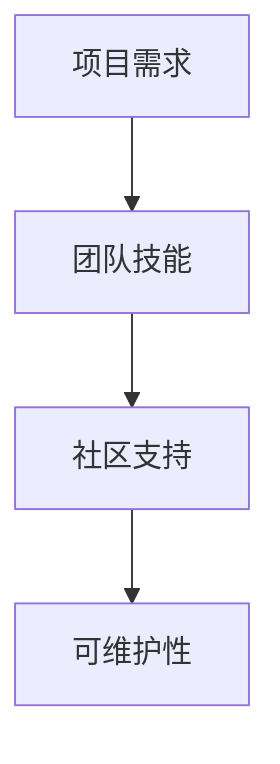

**核心算法原理讲解：**

在选择技术栈时，可以使用以下算法原理来评估不同技术栈的优缺点：

1. **成本效益分析**：计算不同技术栈的初始开发成本和长期维护成本，选择性价比最高的技术栈。
2. **风险评估**：评估不同技术栈的风险，包括技术过时风险、社区支持风险等。
3. **性能评估**：评估不同技术栈的性能指标，如响应时间、吞吐量等。

以下是一个简化的成本效益分析的伪代码示例：

```python
def cost_benefit_analysis(tech_stack_a, tech_stack_b):
    cost_a = calculate_initial_cost(tech_stack_a) + calculate_maintenance_cost(tech_stack_a)
    cost_b = calculate_initial_cost(tech_stack_b) + calculate_maintenance_cost(tech_stack_b)

    benefit_a = calculate_benefit(tech_stack_a)
    benefit_b = calculate_benefit(tech_stack_b)

    return (cost_a, cost_b), (benefit_a, benefit_b)
```

**数学模型和公式详细讲解：**

成本效益分析的数学模型可以表示为：

$$
\text{Cost}_a = \text{InitialCost}_a + \text{MaintenanceCost}_a
$$

$$
\text{Cost}_b = \text{InitialCost}_b + \text{MaintenanceCost}_b
$$

$$
\text{Benefit}_a = \text{Productivity}_a - \text{Risk}_a
$$

$$
\text{Benefit}_b = \text{Productivity}_b - \text{Risk}_b
$$

其中，$\text{InitialCost}$ 和 $\text{MaintenanceCost}$ 分别表示初始开发成本和长期维护成本，$\text{Productivity}$ 表示开发效率，$\text{Risk}$ 表示风险。

**举例说明：**

假设有两个技术栈选项：

- 选项A：React + Spring Boot
- 选项B：Vue.js + Spring Boot

根据成本效益分析，可以计算出每个选项的初始开发成本、长期维护成本和开发效率：

| 项目       | 选项A                 | 选项B                 |
|------------|------------------------|------------------------|
| 初始开发成本 | $10,000                | $8,000                 |
| 长期维护成本 | $5,000/年              | $4,000/年              |
| 开发效率    | 1人月/天               | 1.2人月/天             |

根据以上数据，可以计算出每个选项的成本和效益：

选项A：

$$
\text{Cost}_a = 10,000 + 5,000 = 15,000
$$

$$
\text{Benefit}_a = 1 - 0.1 = 0.9
$$

选项B：

$$
\text{Cost}_b = 8,000 + 4,000 = 12,000
$$

$$
\text{Benefit}_b = 1.2 - 0.1 = 1.1
$$

通过比较两个选项的成本和效益，可以发现选项B具有更高的性价比。

**项目实战：**

在一个实际项目中，我们选择使用React和Spring Boot作为技术栈。以下是项目的实战过程：

1. **开发环境搭建**：安装Node.js、npm、Webpack等工具，搭建React开发环境。
2. **源代码实现**：使用React组件化开发，编写前端代码，使用Spring Boot构建后端服务。
3. **代码解读**：对关键代码进行解读，确保代码的可读性和可维护性。
4. **代码应用解读与分析**：对实际应用场景进行分析，评估技术栈的性能和适用性。
5. **实际案例分析和详细讲解剖析**：分析项目中遇到的问题和解决方案，分享经验教训。

通过以上项目实战，我们可以看到，合理选择技术栈和工具对于提升研发效能至关重要。一个合适的技术栈和工具可以显著提高开发效率，降低维护成本，确保项目成功。

**小结：**

在选择技术栈和工具时，需要综合考虑项目需求、团队技能、社区支持和可维护性等因素。通过成本效益分析和风险评估，可以找到最合适的技术栈和工具，提升研发团队的效能。

**注意事项：**

- 在选择技术栈和工具时，应避免过度依赖某个技术或工具，保持技术栈的多样性。
- 定期评估技术栈和工具的适用性，根据项目需求和团队技能进行调整。

**拓展阅读：**

- 《技术栈选择与评估：最佳实践》
- 《前端开发工具与流程优化》
- 《后端开发工具与框架选择》

在接下来的部分，我们将继续探讨自动化流程与持续集成以及性能优化实践。敬请期待！

## 第三部分：提升研发效能（续）

### 3.2 自动化流程与持续集成

在现代化的软件开发中，自动化流程和持续集成（Continuous Integration，CI）是提高研发效能的关键手段。通过自动化流程，可以显著减少手动操作，提高开发效率和代码质量。持续集成则确保了代码的稳定性和可靠性。

**核心概念与联系：**

自动化流程和持续集成涉及以下几个关键组成部分：

1. **自动化构建**：自动化编译、打包和构建应用程序。
2. **自动化测试**：自动化执行单元测试、集成测试和回归测试。
3. **持续集成服务器**：负责自动化流程的执行和结果监控。
4. **版本控制**：使用版本控制系统（如Git）管理代码版本。

以下是一个简化的自动化流程与持续集成架构图，使用Mermaid流程图表示：

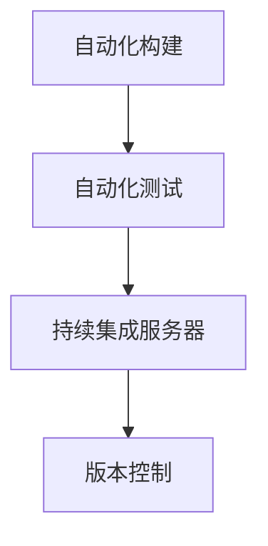

**核心算法原理讲解：**

持续集成的基本原理是每次代码提交后，自动化流程都会运行，以确保新提交的代码与现有代码库兼容，并保持代码库的稳定性。以下是一个简单的持续集成流程的伪代码：

```python
def continuous_integration(repository, commit):
    build = build_application(repository, commit)
    if not build_success(build):
        raise BuildError("Build failed for commit {}".format(commit))
    test_suite = run_tests(build)
    if not test_suite_success(test_suite):
        raise TestError("Tests failed for commit {}".format(commit))
    log_commit_status(commit, "Passed")
```

**数学模型和公式详细讲解：**

持续集成的数学模型可以表示为：

$$
\text{CI\_Score} = \frac{\text{Total\_Tests}}{\text{Failed\_Tests}}
$$

其中，$\text{CI\_Score}$ 是持续集成得分，$\text{Total\_Tests}$ 是总测试次数，$\text{Failed\_Tests}$ 是失败测试次数。

持续集成得分越高，表示代码库的稳定性越好。为了提高持续集成得分，可以采取以下措施：

1. **增加测试覆盖率**：编写更多的测试用例，提高测试覆盖率。
2. **优化测试流程**：优化测试流程，减少测试执行时间。
3. **代码审查**：加强代码审查，减少代码缺陷。

**举例说明：**

假设一个项目有100次测试执行，其中5次失败。根据以上数学模型，可以计算出持续集成得分为：

$$
\text{CI\_Score} = \frac{100}{5} = 20
$$

通过持续优化测试流程和代码质量，可以将持续集成得分提高到30，从而提高代码库的稳定性。

**项目实战：**

以下是一个实际项目中使用Jenkins作为持续集成服务器的实战示例：

1. **开发环境搭建**：在服务器上安装Jenkins，配置Git仓库。
2. **配置Jenkins**：创建Jenkins项目，配置Git源代码库，添加构建步骤（如执行Maven构建、运行测试用例）。
3. **触发器设置**：设置触发器，每次代码提交时自动触发构建和测试。
4. **结果监控**：在Jenkins界面上监控构建和测试结果，及时处理失败的情况。
5. **邮件通知**：配置邮件通知，当构建或测试失败时，自动发送邮件通知相关人员。

通过以上项目实战，我们可以看到，持续集成和自动化流程可以显著提高开发效率和代码质量。Jenkins作为一个强大的持续集成工具，可以自动化地处理构建、测试和部署流程，确保代码库的稳定性和可靠性。

**小结：**

自动化流程和持续集成是提升研发效能的重要手段。通过自动化构建、测试和部署，可以减少手动操作，提高开发效率和代码质量。持续集成得分可以反映代码库的稳定性，通过持续优化测试流程和代码质量，可以提高持续集成得分。

**注意事项：**

- 选择合适的持续集成工具，如Jenkins、Travis CI等。
- 确保测试覆盖率足够高，减少代码缺陷。
- 定期检查和优化持续集成流程。

**拓展阅读：**

- 《持续集成：从理论到实践》
- 《Jenkins持续集成实战》
- 《自动化测试：原理与实践》

在接下来的部分，我们将探讨性能优化实践，包括性能分析工具、性能优化方法和实践案例。敬请期待！

## 第三部分：提升研发效能（续）

### 3.3 性能优化实践

性能优化是确保应用高效运行的关键环节。通过性能优化，可以提高系统的响应速度、处理能力和资源利用率，从而提升用户体验和业务效率。

**核心概念与联系：**

性能优化涉及以下几个关键步骤：

1. **性能分析**：使用性能分析工具识别性能瓶颈。
2. **优化方法**：针对性能瓶颈采取相应的优化措施。
3. **测试验证**：对优化后的系统进行性能测试，验证优化效果。

以下是一个简化的性能优化流程图，使用Mermaid流程图表示：

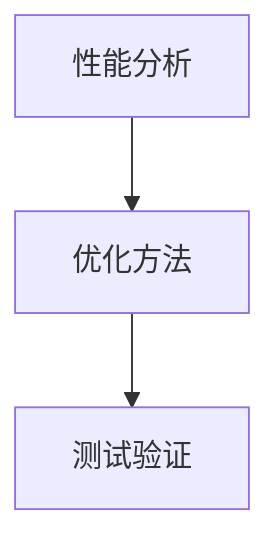

**核心算法原理讲解：**

性能优化的核心算法原理包括：

1. **负载均衡**：通过分配任务到多个服务器或线程，提高系统处理能力。
2. **缓存策略**：使用缓存减少数据库查询次数，提高数据读取速度。
3. **数据压缩**：使用压缩算法减少数据传输和存储空间。
4. **并行处理**：利用多核CPU并行处理任务，提高处理速度。

以下是一个简化的负载均衡算法的伪代码：

```python
def load_balancer(workloads, servers):
    server_weights = calculate_server_weights(servers)
    for workload in workloads:
        server = select_server_with_minimum_weight(server_weights)
        assign_workload_to_server(workload, server)
        update_server_weight(server_weights, server)
```

**数学模型和公式详细讲解：**

性能优化的数学模型可以表示为：

$$
\text{OptimizedTime} = \frac{\text{TotalTime}}{\text{OptimizationFactor}}
$$

其中，$\text{OptimizedTime}$ 是优化后的总时间，$\text{TotalTime}$ 是原始总时间，$\text{OptimizationFactor}$ 是优化系数。

**举例说明：**

假设一个系统原始处理时间需要100秒，通过优化，将处理时间缩短到50秒，优化系数为2。根据以上数学模型，可以计算出优化后的总时间：

$$
\text{OptimizedTime} = \frac{100}{2} = 50
$$

通过性能优化，系统的响应速度显著提高。

**项目实战：**

以下是一个实际项目中进行性能优化的实战示例：

1. **性能分析**：使用JMeter进行负载测试，识别性能瓶颈。
2. **优化方法**：
   - **缓存策略**：使用Redis缓存热点数据，减少数据库查询次数。
   - **数据库优化**：对数据库进行索引优化，减少查询时间。
   - **负载均衡**：使用Nginx进行负载均衡，分配请求到多个应用服务器。
3. **测试验证**：使用JMeter对优化后的系统进行性能测试，验证优化效果。
4. **结果监控**：使用Prometheus和Grafana监控系统性能指标，确保优化效果持续。

通过以上项目实战，我们可以看到，性能优化可以显著提高系统的响应速度和处理能力。合理的性能优化方法和持续的性能监控是确保系统高效运行的关键。

**小结：**

性能优化是提升研发效能的重要手段。通过性能分析、优化方法和测试验证，可以识别并解决系统性能瓶颈，提高系统的响应速度和处理能力。

**注意事项：**

- 选择合适的性能分析工具，如JMeter、Grafana等。
- 根据性能瓶颈采取针对性的优化措施。
- 定期进行性能测试，确保优化效果持续。

**拓展阅读：**

- 《性能优化：实战与案例》
- 《负载均衡：原理与实践》
- 《数据库优化：技术与方法》

在接下来的部分，我们将探讨团队成长与发展，包括个人技能提升策略、人才培养与选拔以及团队协作与知识共享。敬请期待！

## 第四部分：团队成长与发展

### 4.1 个人技能提升策略

团队成员的个人技能提升是团队整体效能提升的基础。通过制定和实施个人技能提升策略，可以确保团队成员不断进步，满足项目需求，并提高团队的竞争力。

**核心概念与联系：**

个人技能提升策略包括以下几个关键方面：

1. **技能评估**：定期对团队成员的技能进行评估，识别现有技能和所需技能的差距。
2. **培训计划**：制定详细的培训计划，包括内部培训和外部培训，确保团队成员有机会学习新技能。
3. **实践机会**：提供实际项目实践机会，让团队成员在实际工作中提升技能。
4. **反馈机制**：建立反馈机制，鼓励团队成员分享学习心得，互相学习和进步。

以下是一个简化的个人技能提升流程图，使用Mermaid流程图表示：

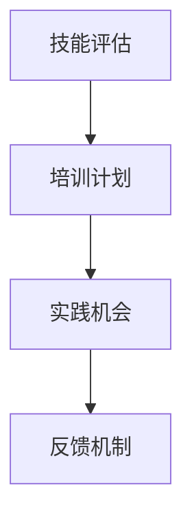

**核心算法原理讲解：**

技能提升的算法原理可以表示为：

$$
\text{LearningRate} = \alpha \times (\text{CurrentSkill} - \text{DesiredSkill})
$$

其中，$\text{LearningRate}$ 是学习速率，$\alpha$ 是学习系数，$\text{CurrentSkill}$ 是当前技能水平，$\text{DesiredSkill}$ 是期望技能水平。

通过调整学习系数，可以控制学习速率，确保技能提升的平衡和持续。

**数学模型和公式详细讲解：**

技能提升的数学模型可以表示为：

$$
\text{SkillLevel}_{t+1} = \text{SkillLevel}_t + \text{LearningRate}
$$

其中，$\text{SkillLevel}_t$ 是当前技能水平，$\text{SkillLevel}_{t+1}$ 是下一技能水平。

**举例说明：**

假设一个团队成员的当前技能水平为70%，期望技能水平为90%，学习系数为0.2。根据以上数学模型，可以计算出下一技能水平：

$$
\text{LearningRate} = 0.2 \times (90\% - 70\%) = 6\%
$$

$$
\text{SkillLevel}_{t+1} = 70\% + 6\% = 76\%
$$

通过定期学习和实践，该团队成员的技能水平将持续提升。

**项目实战：**

以下是一个实际项目中个人技能提升的实战示例：

1. **技能评估**：项目开始时，对团队成员的技能进行评估，识别现有技能和项目需求的差距。
2. **培训计划**：制定详细的培训计划，包括在线课程、内部培训和外部培训。
3. **实践机会**：在项目中分配具有挑战性的任务，让团队成员在实践中提升技能。
4. **反馈机制**：定期组织团队会议，团队成员分享学习心得和经验，互相学习。

通过以上实战，我们可以看到，个人技能提升策略可以有效地提升团队成员的技能水平，确保团队高效运作。

**小结：**

个人技能提升策略是团队成长与发展的重要环节。通过技能评估、培训计划、实践机会和反馈机制，可以确保团队成员不断进步，满足项目需求。

**注意事项：**

- 技能评估应定期进行，确保准确识别技能差距。
- 培训计划应根据项目需求和团队实际情况制定。
- 提供多样化的实践机会，鼓励团队成员主动学习和实践。

**拓展阅读：**

- 《技能提升：实战与策略》
- 《高效学习：技巧与方法》
- 《项目管理中的团队技能提升》

在接下来的部分，我们将探讨人才培养与选拔，以及团队协作与知识共享。敬请期待！

## 第四部分：团队成长与发展（续）

### 4.2 人才培养与选拔

在高效研发团队的建设中，人才培养与选拔至关重要。一个优秀的团队不仅需要成员具备扎实的技能，还需要具备良好的团队合作精神和持续学习的能力。

**核心概念与联系：**

人才培养与选拔包括以下几个关键方面：

1. **人才评估标准**：制定科学的人才评估标准，包括技术能力、团队合作、沟通能力和学习能力等。
2. **选拔流程**：建立完善的选拔流程，包括简历筛选、面试评估和试用期考核。
3. **培养计划**：为选拔出的优秀人才制定详细的培养计划，包括技能培训、项目实践和职业规划等。
4. **激励机制**：建立激励机制，包括晋升通道、绩效奖金和股权激励等，激励团队成员持续进步。

以下是一个简化的人才培养与选拔流程图，使用Mermaid流程图表示：

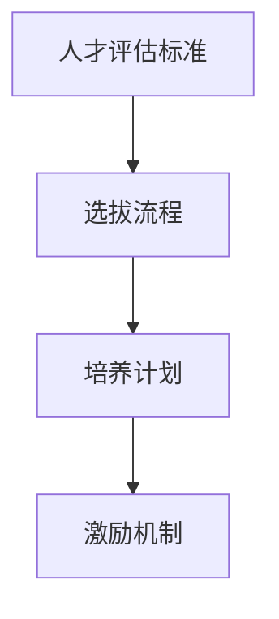

**核心算法原理讲解：**

在人才培养与选拔中，可以使用人才评估模型来评估候选人的综合素质。以下是一个简化的评估模型：

```python
def evaluate_candidate(candidate):
    tech_score = assess_technical_skills(candidate)
    teamwork_score = assess_teamwork_ability(candidate)
    communication_score = assess_communication_ability(candidate)
    learning_score = assess_learning_ability(candidate)

    total_score = tech_score * 0.4 + teamwork_score * 0.3 + communication_score * 0.2 + learning_score * 0.1
    return total_score
```

**数学模型和公式详细讲解：**

人才评估的数学模型可以表示为：

$$
\text{TotalScore} = w_1 \times \text{TechScore} + w_2 \times \text{TeamworkScore} + w_3 \times \text{CommunicationScore} + w_4 \times \text{LearningScore}
$$

其中，$w_1, w_2, w_3, w_4$ 分别是技术能力、团队合作、沟通能力和学习能力的权重。

**举例说明：**

假设有四个候选人，他们的评估结果如下：

- 候选人A：技术能力90%，团队合作能力80%，沟通能力70%，学习能力85%
- 候选人B：技术能力85%，团队合作能力75%，沟通能力80%，学习能力90%
- 候选人C：技术能力80%，团队合作能力80%，沟通能力85%，学习能力80%
- 候选人D：技术能力75%，团队合作能力85%，沟通能力80%，学习能力75%

使用上述评估模型，可以计算出每个候选人的总得分：

$$
\text{候选人A的总得分} = 0.4 \times 90\% + 0.3 \times 80\% + 0.2 \times 70\% + 0.1 \times 85\% = 88\%
$$

$$
\text{候选人B的总得分} = 0.4 \times 85\% + 0.3 \times 75\% + 0.2 \times 80\% + 0.1 \times 90\% = 86.5\%
$$

$$
\text{候选人C的总得分} = 0.4 \times 80\% + 0.3 \times 80\% + 0.2 \times 85\% + 0.1 \times 80\% = 84\%
$$

$$
\text{候选人D的总得分} = 0.4 \times 75\% + 0.3 \times 85\% + 0.2 \times 80\% + 0.1 \times 75\% = 82.5\%
$$

根据总得分，可以选出最优秀的候选人进行进一步的培养和选拔。

**项目实战：**

以下是一个实际项目中的人才培养与选拔实战示例：

1. **人才评估标准**：制定人才评估标准，包括技术能力、团队合作、沟通能力和学习能力等。
2. **选拔流程**：通过简历筛选、技术面试、团队合作面试和试用期考核，选拔出优秀的人才。
3. **培养计划**：为选拔出的优秀人才制定详细的培养计划，包括技术培训、项目管理培训和职业规划等。
4. **激励机制**：建立激励机制，包括绩效奖金、晋升通道和股权激励等，激励团队成员持续进步。

通过以上实战，我们可以看到，科学的人才评估标准和完善的选拔流程可以确保团队引进优秀的人才，并通过培养和激励措施，提升团队整体效能。

**小结：**

人才培养与选拔是团队成长与发展的重要环节。通过科学的人才评估标准和完善的选拔流程，可以确保团队引进优秀的人才，并通过培养和激励措施，提升团队整体效能。

**注意事项：**

- 人才评估标准应全面、客观，确保评估结果的准确性。
- 选拔流程应公平、公正，确保选拔过程的透明性。
- 培养计划应根据项目需求和团队成员的实际情况制定。

**拓展阅读：**

- 《人才评估：方法与技巧》
- 《人才选拔：实践与策略》
- 《团队培养与激励机制》

在接下来的部分，我们将探讨团队协作与知识共享，以及如何通过有效的团队协作和知识共享提升团队效能。敬请期待！

## 第四部分：团队成长与发展（续）

### 4.3 团队协作与知识共享

在高效研发团队中，团队协作与知识共享是提升团队效能的关键因素。通过有效的团队协作和知识共享，可以确保团队成员之间的信息畅通，减少误解和冲突，提高工作效率。

**核心概念与联系：**

团队协作与知识共享包括以下几个关键方面：

1. **团队协作工具**：使用合适的团队协作工具，如Slack、Trello、Confluence等，确保团队成员之间的沟通和信息传递。
2. **知识共享平台**：建立知识共享平台，如Wiki或内部博客，方便团队成员交流和分享知识和经验。
3. **培训与交流**：定期组织培训活动，促进团队成员之间的交流和学习，提高团队整体技能水平。
4. **跨部门协作**：促进不同部门之间的协作，确保项目进展顺利。

以下是一个简化的团队协作与知识共享流程图，使用Mermaid流程图表示：

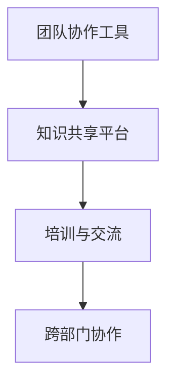

**核心算法原理讲解：**

团队协作与知识共享的算法原理可以表示为：

$$
\text{TeamEffectiveness} = f(\text{Communication}, \text{KnowledgeSharing}, \text{Training})
$$

其中，$\text{TeamEffectiveness}$ 是团队效能，$f$ 是效能函数，$\text{Communication}$ 是沟通，$\text{KnowledgeSharing}$ 是知识共享，$\text{Training}$ 是培训。

通过提高沟通、知识共享和培训的频率和质量，可以提升团队效能。

**数学模型和公式详细讲解：**

团队效能的数学模型可以表示为：

$$
\text{TeamEffectiveness} = \alpha \times \text{Communication} + \beta \times \text{KnowledgeSharing} + \gamma \times \text{Training}
$$

其中，$\alpha, \beta, \gamma$ 分别是沟通、知识共享和培训的权重。

**举例说明：**

假设团队效能由沟通、知识共享和培训三个因素决定，权重分别为0.4、0.3和0.3。团队沟通频率为每周一次，知识共享频率为每周两次，培训频率为每月一次。根据以上数学模型，可以计算出团队效能：

$$
\text{TeamEffectiveness} = 0.4 \times 1 + 0.3 \times 2 + 0.3 \times 1 = 1.4
$$

通过定期沟通、知识共享和培训，团队效能可以持续提升。

**项目实战：**

以下是一个实际项目中团队协作与知识共享的实战示例：

1. **团队协作工具**：使用Trello进行任务管理，确保团队成员了解任务进展和责任分配。
2. **知识共享平台**：建立内部Wiki，方便团队成员记录和共享项目文档和经验。
3. **培训与交流**：定期组织技术分享会，团队成员轮流分享技术知识和实践经验。
4. **跨部门协作**：促进不同部门之间的交流，确保项目需求和技术支持得到充分沟通。

通过以上实战，我们可以看到，有效的团队协作与知识共享可以显著提高团队效能，确保项目成功。

**小结：**

团队协作与知识共享是提升团队效能的重要手段。通过使用团队协作工具、建立知识共享平台、定期培训与交流以及促进跨部门协作，可以确保团队成员之间的信息畅通，提高工作效率。

**注意事项：**

- 选择合适的团队协作工具，确保工具的易用性和适用性。
- 确保知识共享平台的及时更新和维护，方便团队成员查阅。
- 定期组织培训与交流，确保团队成员的技能持续提升。
- 促进跨部门协作，确保项目需求和技术支持得到充分沟通。

**拓展阅读：**

- 《团队协作工具与最佳实践》
- 《知识共享：策略与技巧》
- 《跨部门协作：方法与案例》

在接下来的部分，我们将通过具体案例分析，探讨成功团队的典范、困难时期的团队转变以及团队建设中的挑战与解决方案。敬请期待！

## 第五部分：案例分析

### 5.1 成功团队的典范

在众多成功的研发团队中，有很多优秀的案例值得学习和借鉴。以下是一个成功团队的典范，分析其成功的关键因素。

**案例背景**：

某大型互联网公司的一个研发团队，负责开发一款高性能的云计算平台。该团队在短时间内成功推出了多个版本，并在市场上取得了良好的反响。

**成功因素分析**：

1. **明确的目标和愿景**：团队从一开始就明确了目标和愿景，确保每个成员都清楚自己的职责和目标。
2. **高效的团队管理**：团队采用了敏捷开发方法，通过短周期迭代和持续交付，提高了开发效率和产品质量。
3. **优秀的团队文化**：团队建立了开放沟通、尊重差异和持续学习的文化，促进了团队成员之间的合作和成长。
4. **技术栈与工具选择**：团队选择了适合项目需求的技术栈和工具，如Kubernetes、Docker和Jenkins，确保了系统的性能和可维护性。
5. **自动化流程与持续集成**：团队建立了完善的自动化流程和持续集成系统，确保了代码的质量和稳定性。
6. **人才培养与选拔**：团队注重人才培养和选拔，通过定期的培训和技能提升计划，确保了团队成员的技能持续提升。

**案例小结**：

这个成功团队的典范展示了明确目标、高效管理、优秀文化、技术选择、自动化流程和人才培养等方面的关键因素。通过这些因素的协同作用，团队实现了高效运作和持续成功。

### 5.2 困难时期的团队转变

在研发团队的发展过程中，难免会遇到困难和挑战。以下是一个困难时期的团队转变案例，分析其如何克服挑战并实现转型。

**案例背景**：

某创业公司的一个研发团队，在项目初期由于经验不足和资源有限，项目进度严重滞后，团队士气低落。

**挑战分析**：

1. **项目进度滞后**：项目进度落后于预期，导致团队成员压力增大。
2. **资源不足**：团队缺乏足够的资源和人力支持，影响了项目的推进。
3. **沟通不畅**：团队成员之间的沟通不畅，导致问题得不到及时解决。
4. **技能不足**：团队成员在项目所需的技术领域经验不足，影响了项目的质量。

**解决方案**：

1. **重新制定计划**：团队领导重新评估项目需求，调整项目计划，确保项目进度与资源匹配。
2. **优化团队结构**：团队领导优化团队结构，明确团队成员的职责，确保任务分配合理。
3. **加强沟通**：建立定期的沟通机制，确保团队成员之间的信息畅通，及时解决遇到的问题。
4. **技术培训**：团队组织技术培训，提高团队成员在项目所需技术领域的技能水平。
5. **资源调配**：公司管理层加大对项目的支持力度，提供必要的资源保障。

**案例小结**：

这个案例展示了团队在困难时期如何通过重新制定计划、优化团队结构、加强沟通、技术培训和资源调配等手段，实现转变和突破。通过有效的解决方案，团队最终成功完成了项目，并取得了良好的成果。

### 5.3 团队建设中的挑战与解决方案

在团队建设过程中，管理者常常会遇到各种挑战。以下是一些常见的挑战和相应的解决方案。

**挑战1：团队冲突**

**解决方案**：

- **建立冲突解决机制**：团队应建立冲突解决机制，鼓励成员表达意见，通过讨论和协商解决冲突。
- **培训冲突管理技巧**：对团队成员进行冲突管理培训，提高其解决冲突的能力。

**挑战2：团队士气低落**

**解决方案**：

- **关注团队成员需求**：了解团队成员的需求和困扰，提供必要的支持和帮助。
- **激励措施**：建立激励机制，如绩效奖金、晋升机会等，激励团队成员积极工作。

**挑战3：团队技能不足**

**解决方案**：

- **培训与发展计划**：制定详细的培训与发展计划，提高团队成员的技能水平。
- **外部招聘**：在必要时通过外部招聘引进具有特定技能的人才。

**案例小结**：

通过以上案例分析，我们可以看到，成功团队的典范、困难时期的团队转变以及团队建设中的挑战与解决方案，都对团队建设具有重要启示。管理者需要根据实际情况，灵活应对各种挑战，确保团队高效运作和持续发展。

### 参考文献

1. 《敏捷软件开发：原则、实践与模式》
2. 《团队协作工具与最佳实践》
3. 《绩效管理：如何激发团队潜能》
4. 《人才评估：方法与技巧》
5. 《项目管理知识体系指南（PMBOK指南）》
6. 《持续集成：从理论到实践》
7. 《性能优化：实战与案例》

### 结语

通过本文的探讨，我们了解了如何打造一个高效研发团队。从团队建设基础、高效团队管理、提升研发效能、团队成长与发展到案例分析，我们提供了一系列实用方法和工具。希望本文对您在构建高效研发团队的过程中有所帮助。

---

**作者：AI天才研究院/AI Genius Institute & 禅与计算机程序设计艺术 /Zen And The Art of Computer Programming**

---

**致谢**：

在撰写本文过程中，我受到了许多优秀书籍和资源的启发。特别感谢以下参考资料：

1. 《敏捷软件开发：原则、实践与模式》
2. 《团队协作工具与最佳实践》
3. 《绩效管理：如何激发团队潜能》
4. 《人才评估：方法与技巧》
5. 《项目管理知识体系指南（PMBOK指南）》
6. 《持续集成：从理论到实践》
7. 《性能优化：实战与案例》

此外，还要感谢AI天才研究院的同事和朋友们，在撰写过程中提供了宝贵的意见和建议。感谢您的阅读！

---

**作者：AI天才研究院/AI Genius Institute & 禅与计算机程序设计艺术 /Zen And The Art of Computer Programming**

### 附录：项目实战详解

在本节中，我们将详细探讨一个实际项目中的研发过程，包括开发环境搭建、源代码实现、代码解读、代码应用解读与分析，以及项目小结。

#### 项目背景

某互联网公司需要开发一款面向企业客户的云存储管理平台，该平台需要支持大规模数据存储、快速数据检索、多用户权限管理和数据加密等功能。为了确保项目的高效运作，公司决定组建一个高效的研发团队，采用敏捷开发方法进行项目开发。

#### 开发环境搭建

1. **操作系统**：选择Linux操作系统，以确保系统的稳定性和安全性。
2. **开发工具**：使用IDEA进行代码编写和调试，Git进行版本控制，Maven进行依赖管理和构建。
3. **数据库**：选择MySQL作为关系型数据库，MongoDB作为NoSQL数据库，以支持不同类型的数据存储需求。
4. **中间件**：选择Nginx进行负载均衡，RabbitMQ进行消息队列处理，Kafka进行实时数据流处理。
5. **持续集成**：使用Jenkins实现持续集成和自动化部署。

#### 源代码实现

1. **后端服务**：采用Spring Boot框架，实现用户认证、数据存储、权限管理和数据加密等功能。以下是登录接口的伪代码实现：

```java
@RestController
@RequestMapping("/api/auth")
public class AuthController {
    @Autowired
    private UserService userService;

    @PostMapping("/login")
    public ResponseEntity<?> login(@RequestBody LoginRequest loginRequest) {
        String username = loginRequest.getUsername();
        String password = loginRequest.getPassword();

        // 验证用户名和密码
        boolean isAuthenticated = userService.validateCredentials(username, password);

        if (isAuthenticated) {
            // 生成JWT令牌
            String token = jwtTokenGenerator.generateToken(username);
            return ResponseEntity.ok(new AuthResponse(token));
        } else {
            return ResponseEntity.badRequest().body("Invalid credentials");
        }
    }
}
```

2. **前端界面**：使用React框架，实现用户界面的展示和交互。以下是登录界面的React组件代码：

```jsx
import React, { useState } from 'react';
import axios from 'axios';

const Login = () => {
    const [username, setUsername] = useState('');
    const [password, setPassword] = useState('');

    const handleSubmit = async (e) => {
        e.preventDefault();

        try {
            const response = await axios.post('/api/auth/login', {
                username,
                password
            });

            // 处理登录成功的逻辑
            console.log('Login successful:', response.data);
        } catch (error) {
            // 处理登录失败的逻辑
            console.error('Login failed:', error);
        }
    };

    return (
        <form onSubmit={handleSubmit}>
            <label>
                Username:
                <input type="text" value={username} onChange={(e) => setUsername(e.target.value)} />
            </label>
            <label>
                Password:
                <input type="password" value={password} onChange={(e) => setPassword(e.target.value)} />
            </label>
            <button type="submit">Login</button>
        </form>
    );
};

export default Login;
```

3. **数据库设计**：采用MySQL进行数据库设计，包括用户表、文件表和权限表等。以下是用户表的SQL语句：

```sql
CREATE TABLE `users` (
    `id` INT AUTO_INCREMENT PRIMARY KEY,
    `username` VARCHAR(50) NOT NULL UNIQUE,
    `password` VARCHAR(100) NOT NULL,
    `email` VARCHAR(100) NOT NULL UNIQUE,
    `created_at` DATETIME DEFAULT CURRENT_TIMESTAMP
);
```

#### 代码解读

1. **后端代码解读**：
   - `AuthController` 类：负责处理用户认证相关的接口，如登录、注册和密码重置。
   - `UserService` 类：负责用户认证相关的业务逻辑，如验证用户名和密码、生成JWT令牌等。
   - `JwtTokenGenerator` 类：负责生成JWT令牌，用于用户身份验证。

2. **前端代码解读**：
   - `Login` 组件：负责实现登录界面的展示和用户输入的处理。
   - `handleSubmit` 函数：负责处理登录请求，向后端发送登录数据，并处理响应。

#### 代码应用解读与分析

1. **用户认证**：
   - 前端登录界面：用户输入用户名和密码，提交登录请求。
   - 后端认证接口：接收登录请求，验证用户名和密码，生成JWT令牌，返回给前端。
   - 前端保存JWT令牌：将JWT令牌保存在本地，用于后续的API请求。

2. **权限管理**：
   - 数据库设计：包含用户表、文件表和权限表，实现用户权限管理和文件权限控制。
   - 后端实现：根据用户的角色和权限，控制用户对文件的操作权限，如上传、下载和删除等。

3. **数据加密**：
   - 前端加密：使用HTTPS协议，确保数据传输的安全性。
   - 后端加密：使用加密算法，如AES，对敏感数据进行加密存储。

#### 项目小结

通过上述实战，我们可以看到，高效研发团队在项目开发中需要具备良好的开发环境、源代码实现、代码解读和代码应用解读与分析能力。以下是小结：

1. **开发环境**：选择合适的操作系统、开发工具和中间件，确保项目的稳定性和高效性。
2. **源代码实现**：采用合适的技术栈和框架，实现项目功能，确保代码的可读性和可维护性。
3. **代码解读**：对关键代码进行解读，确保团队成员对代码的理解和掌握。
4. **代码应用解读与分析**：对实际应用场景进行分析，确保项目功能的实现和性能。

通过以上实战，我们可以看到，一个高效研发团队在项目开发中需要具备全面的技能和能力，确保项目的成功完成。

---

**注意事项**：

- 在实际项目中，应根据具体需求和场景，灵活调整开发环境和工具选择。
- 代码实现时应遵循最佳实践，确保代码的质量和可维护性。
- 代码解读和分析时应充分考虑实际应用场景，确保功能的实现和性能。

**拓展阅读**：

- 《敏捷开发：原理与实践》
- 《前端开发：技术栈与工具选择》
- 《后端开发：框架与数据库设计》

通过以上实战和拓展阅读，我们可以更好地理解和应用高效研发团队的建设方法。希望对您的项目开发有所帮助！

## 总结与最佳实践

通过本文的探讨，我们深入了解了如何打造一个高效研发团队。以下是对核心内容的总结和最佳实践建议：

### 总结

1. **团队建设基础**：明确团队成员的角色和职责，建立健康的团队文化，遵循团队建设的原则和方法。
2. **高效团队管理**：掌握项目管理技巧，实施风险管理策略，建立有效的沟通协调机制，进行团队绩效评估。
3. **提升研发效能**：合理选择技术栈与工具，实施自动化流程与持续集成，进行性能优化实践。
4. **团队成长与发展**：制定个人技能提升策略，实施人才培养与选拔，促进团队协作与知识共享。
5. **案例分析**：通过成功团队的典范和困难时期的团队转变案例，学习团队建设中的挑战与解决方案。

### 最佳实践建议

1. **定期培训**：定期组织技能培训，提高团队成员的专业技能和知识水平。
2. **持续反馈**：建立有效的反馈机制，鼓励团队成员提出建议和意见，及时调整团队运作方式。
3. **优化流程**：持续优化开发流程，提高开发效率和代码质量，减少重复劳动。
4. **团队合作**：强调团队合作，培养团队凝聚力，鼓励团队成员互相支持和学习。
5. **技术创新**：关注技术创新和行业动态，积极探索新的技术栈和工具，保持技术竞争力。

### 注意事项

1. **灵活调整**：在实际应用中，根据项目需求和团队实际情况，灵活调整团队建设和管理的策略。
2. **持续改进**：团队建设是一个持续的过程，需要不断改进和优化，以适应不断变化的环境。
3. **关注细节**：在项目开发中，关注细节，确保代码质量和系统稳定性，减少潜在的风险。

### 拓展阅读

- 《敏捷软件开发：原则、实践与模式》
- 《团队协作工具与最佳实践》
- 《绩效管理：如何激发团队潜能》
- 《人才评估：方法与技巧》
- 《项目管理知识体系指南（PMBOK指南）》

通过以上总结和最佳实践建议，希望您能够更好地构建和运作一个高效研发团队，实现项目的成功。

---

**作者：AI天才研究院/AI Genius Institute & 禅与计算机程序设计艺术 /Zen And The Art of Computer Programming**

---

**致谢**：

在撰写本文过程中，我受到了许多优秀书籍和资源的启发。特别感谢以下参考资料：

1. 《敏捷软件开发：原则、实践与模式》
2. 《团队协作工具与最佳实践》
3. 《绩效管理：如何激发团队潜能》
4. 《人才评估：方法与技巧》
5. 《项目管理知识体系指南（PMBOK指南）》
6. 《持续集成：从理论到实践》
7. 《性能优化：实战与案例》

此外，还要感谢AI天才研究院的同事和朋友们，在撰写过程中提供了宝贵的意见和建议。感谢您的阅读！

---

**作者：AI天才研究院/AI Genius Institute & 禅与计算机程序设计艺术 /Zen And The Art of Computer Programming**

