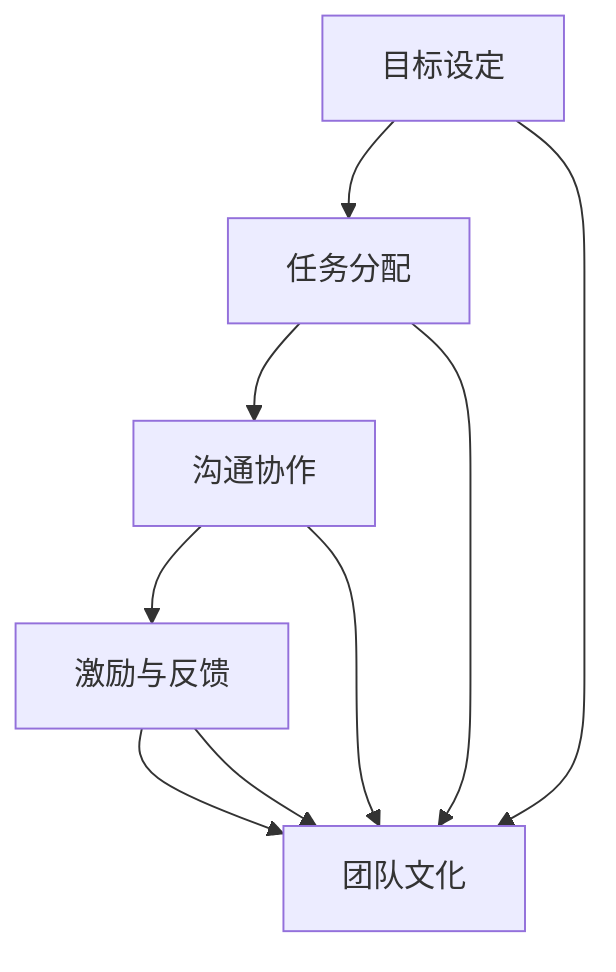

                 

## 文章标题

### 打造高绩效团队的关键要素

## 文章关键词

- 高绩效团队
- 关键要素
- 团队管理
- 沟通与协作
- 激励与培训

## 文章摘要

在当今竞争激烈的市场环境中，高绩效团队是企业成功的关键。本文将详细探讨打造高绩效团队所需的关键要素，包括团队管理策略、沟通与协作技巧、激励与培训方法等。通过深入分析这些核心概念和联系，以及提供实际案例和最佳实践，本文旨在为读者提供一套全面、实用的团队建设指南。

## 引言

在商业世界中，团队的作用愈发显著。一个高效、协作的团队不仅能够提高工作效率，还能促进创新和持续改进。然而，打造高绩效团队并非易事。它需要系统化的策略和持续的努力。本文将探讨以下关键要素：

1. **团队管理策略**：管理者需要设定明确的目标、合理分配任务和提供有效的反馈。
2. **沟通与协作**：团队成员之间的有效沟通和协作是实现团队目标的基础。
3. **激励与培训**：激励团队成员和持续培训是保持团队活力和竞争力的关键。

本文将逐步分析这些关键要素，并通过实际案例和最佳实践提供具体指导。希望通过本文的探讨，读者能够掌握打造高绩效团队的核心技能和策略。

## 第1章 引言

### 1.1 书籍目的与受众

本文旨在为企业管理者、团队领导者和广大职场人士提供一套实用的团队建设指南。无论是初创公司的小团队，还是大型企业的部门团队，本文所提供的方法和策略都具有普遍适用性。通过本文的阅读，读者可以了解并掌握以下内容：

1. **团队绩效提升的关键因素**：了解影响团队绩效的主要因素，包括目标设定、任务分配、沟通协作、激励和培训等。
2. **团队管理策略**：掌握有效的团队管理方法，包括如何设定明确的目标、合理分配任务、提供有效的反馈和激励团队成员。
3. **沟通与协作技巧**：学习如何建立有效的沟通机制，提高团队成员之间的协作效率，减少误解和冲突。
4. **激励与培训方法**：了解如何激励团队成员，提高其工作热情和积极性，以及如何进行有效的培训，提升团队整体技能水平。

### 1.2 高绩效团队的定义

高绩效团队是指能够在高压力、快速变化的环境下，通过有效的协作和高效的执行，实现既定目标和预期结果的团队。高绩效团队具有以下特征：

1. **共同的目标**：团队成员对团队目标有共同的理解和认同，并且愿意为之共同努力。
2. **高效的协作**：团队成员能够相互支持、协作，充分发挥各自的优势，共同完成任务。
3. **良好的沟通**：团队成员之间能够进行开放、坦诚的沟通，及时分享信息和反馈，确保团队目标的顺利实现。
4. **持续的进步**：团队在实现目标的过程中，能够不断学习、改进和创新，不断提升团队绩效和竞争力。

### 1.3 本书结构安排

本书共分为9个章节，具体如下：

1. **引言**：介绍书籍的目的、受众以及高绩效团队的定义。
2. **核心概念与联系**：通过Mermaid流程图解释团队绩效的各个关键要素及其相互关系。
3. **核心算法原理讲解**：使用伪代码详细阐述提高团队绩效的关键算法或策略。
4. **数学模型和数学公式讲解**：使用latex格式介绍相关的数学模型和公式，并举例说明。
5. **项目实战**：提供实际的案例，包括开发环境搭建、源代码实现、代码解读与分析。
6. **团队管理策略**：介绍如何管理团队以提升绩效。
7. **团队沟通与协作**：探讨团队合作的关键因素和最佳实践。
8. **团队激励与培训**：讲解如何激励团队成员并提升他们的技能。
9. **结论**：总结全书要点，并对未来团队绩效的提升提出建议。

通过以上章节的详细探讨，读者可以系统地了解并掌握打造高绩效团队的核心技能和策略。

## 第2章 核心概念与联系

在构建高绩效团队的过程中，理解各个关键概念及其相互关系至关重要。本章将通过Mermaid流程图展示团队绩效的各个关键要素及其联系，为读者提供一个清晰的框架，以便更好地把握团队建设的核心。

### 2.1 团队绩效的关键要素

高绩效团队的绩效取决于多个关键要素，主要包括：

1. **目标设定**：明确且可衡量的目标是团队前进的方向和动力来源。
2. **任务分配**：合理地分配任务，确保每个成员都能发挥其优势。
3. **沟通协作**：有效的沟通和协作是团队成功的关键。
4. **激励与反馈**：适当的激励和及时的反馈有助于提高团队成员的积极性和绩效。
5. **团队文化**：积极向上的团队文化是团队长期发展的基石。

### 2.2 Mermaid流程图

以下是一个Mermaid流程图，用于展示团队绩效关键要素及其相互关系：



**图2.1 团队绩效关键要素及其相互关系**

- **目标设定**：所有团队活动的起点，需要清晰、具体和可量化。
- **任务分配**：根据成员能力和团队目标，合理分配任务。
- **沟通协作**：确保团队成员之间的信息流畅和目标一致。
- **激励与反馈**：通过奖励和批评，激励成员并提高其工作效率。
- **团队文化**：形成积极、开放的团队氛围，促进成员之间的信任和合作。

### 2.3 关键要素之间的联系

这些关键要素相互关联，共同影响团队绩效。例如：

- **目标设定**直接影响**任务分配**，明确的目标有助于任务的有效分配。
- **任务分配**决定了**沟通协作**的需求，任务的不同性质可能需要不同的沟通方式。
- **激励与反馈**会影响团队成员的**团队文化**，积极正面的反馈可以增强团队凝聚力。
- **团队文化**又反过来影响**目标设定**和**任务分配**，良好的团队文化可以促进创新和协作。

通过理解这些关键要素及其相互关系，团队领导可以更有针对性地制定策略，提升团队绩效。

## 第3章 核心算法原理讲解

在团队建设中，核心算法原理的应用能够帮助我们系统地提升团队绩效。以下将使用伪代码详细阐述提高团队绩效的关键算法或策略，并通过示例进行分析。

### 3.1 提高团队绩效的关键算法

#### 3.1.1 目标设定算法

目标设定是团队建设的首要步骤，以下是一个简单的目标设定算法：

```plaintext
目标设定算法：
输入：团队目标（G）
输出：明确且可衡量的子目标（SG）

1. 分析团队目标（G），确保其清晰、具体和可量化。
2. 将G分解为若干个子目标（SG），每个子目标应当是可操作和可追踪的。
3. 确定每个子目标的完成标准和时间节点。
4. 分配每个子目标的责任人。
5. 监控子目标的进展，并在必要时进行调整。
```

#### 示例

假设一个软件开发团队的目标是在三个月内完成一个新项目的开发。分解后的子目标如下：

- **子目标1**：需求分析和设计文档完成（1个月内完成）
- **子目标2**：核心功能模块开发完成（2个月内完成）
- **子目标3**：用户界面和用户体验优化（3个月内完成）
- **子目标4**：系统集成与测试（3个月内完成）

每个子目标都明确了完成标准和时间节点，并分配了责任人员。

#### 3.1.2 任务分配算法

合理的任务分配能够确保团队成员充分发挥其优势，以下是一个简单的任务分配算法：

```plaintext
任务分配算法：
输入：团队成员能力列表（TAL），任务列表（TL）
输出：任务分配结果（TAR）

1. 分析任务列表（TL），确定每个任务所需技能和资源。
2. 对比团队成员能力列表（TAL），找到最适合执行每个任务的团队成员。
3. 根据团队成员的能力和任务的重要性进行任务分配。
4. 确保任务分配的公平性和合理性。
5. 在任务执行过程中，根据实际情况进行调整。
```

#### 示例

假设有一个任务列表，包括以下任务：

- **任务1**：需求分析
- **任务2**：数据库设计
- **任务3**：前端开发
- **任务4**：后端开发

团队成员的能力列表如下：

- **成员A**：擅长需求分析和数据库设计
- **成员B**：擅长前端开发
- **成员C**：擅长后端开发

根据能力和任务需求，任务分配结果如下：

- **任务1**：由成员A负责
- **任务2**：由成员A负责
- **任务3**：由成员B负责
- **任务4**：由成员C负责

#### 3.1.3 激励与反馈算法

激励与反馈是提升团队绩效的重要手段，以下是一个简单的激励与反馈算法：

```plaintext
激励与反馈算法：
输入：团队成员表现列表（PPL），激励资源列表（IRL）
输出：激励分配结果（IAL），反馈结果（FRL）

1. 分析团队成员表现列表（PPL），确定每个成员的表现和贡献。
2. 根据激励资源列表（IRL），选择适合的激励方式，如奖金、晋升、培训等。
3. 对每个成员分配相应的激励资源，确保激励的公平性和合理性。
4. 提供及时的反馈，包括正面反馈和改进建议，帮助团队成员了解其表现并持续改进。
5. 定期评估激励效果和反馈效果，根据实际情况进行调整。
```

#### 示例

假设团队成员的表现列表如下：

- **成员A**：表现优秀，按时完成任务，主动帮助其他成员
- **成员B**：表现良好，完成任务，但存在一些细节问题
- **成员C**：表现一般，完成任务，但需要更多指导和帮助

激励资源列表如下：

- **激励1**：奖金
- **激励2**：晋升机会
- **激励3**：培训机会

激励分配结果如下：

- **成员A**：获得奖金和晋升机会
- **成员B**：获得奖金和培训机会
- **成员C**：获得培训机会

反馈结果如下：

- **成员A**：继续保持优秀表现，鼓励其在团队合作中发挥更大作用
- **成员B**：注意细节，提高工作效率
- **成员C**：提供更多指导和支持，帮助其提升技能和表现

通过以上算法的应用，团队领导可以更系统地管理团队，提高整体绩效。在具体实施过程中，可以根据团队特点和实际情况进行调整和优化。

## 第4章 数学模型和数学公式讲解

在团队建设中，数学模型和数学公式可以提供科学依据，帮助我们更好地理解和优化团队绩效。本章将介绍一些常用的数学模型和公式，并使用latex格式进行详细讲解和举例说明。

### 4.1 团队绩效评估模型

团队绩效评估是衡量团队工作效果的重要手段。以下是一个简单的团队绩效评估模型，使用latex格式表示：

$$
\text{团队绩效} = w_1 \times \text{目标达成度} + w_2 \times \text{成员满意度} + w_3 \times \text{团队合作度}
$$

其中，$w_1$、$w_2$、$w_3$ 分别是目标达成度、成员满意度和团队合作度的权重，它们的取值范围在0到1之间，且满足 $w_1 + w_2 + w_3 = 1$。

#### 示例

假设一个团队的目标达成度为0.9，成员满意度为0.8，团队合作度为0.85，权重分别为 $w_1 = 0.5$、$w_2 = 0.3$、$w_3 = 0.2$，则团队绩效计算如下：

$$
\text{团队绩效} = 0.5 \times 0.9 + 0.3 \times 0.8 + 0.2 \times 0.85 = 0.945
$$

这个值表明该团队的整体绩效为0.945，处于较高水平。

### 4.2 激励理论模型

激励理论是解释团队成员行为和绩效的重要理论。以下是一个简单的激励理论模型，使用latex格式表示：

$$
\text{激励力} = \text{目标价值} \times \text{期望实现概率}
$$

其中，目标价值和期望实现概率是激励力的两个关键因素。

#### 示例

假设一个团队成员对完成某项目的激励力为10，目标价值为5，期望实现概率为0.8，则激励力计算如下：

$$
\text{激励力} = 5 \times 0.8 = 4
$$

这个值表明该团队成员对完成该项目的激励力为4，表明其动力较高。

### 4.3 沟通效率模型

沟通效率是团队协作的关键。以下是一个简单的沟通效率模型，使用latex格式表示：

$$
\text{沟通效率} = \frac{\text{信息传递量}}{\text{沟通时间}}
$$

其中，信息传递量和沟通时间是衡量沟通效率的两个关键指标。

#### 示例

假设在一个项目中，信息传递量为100条消息，沟通时间为10小时，则沟通效率计算如下：

$$
\text{沟通效率} = \frac{100}{10} = 10 \text{条消息/小时}
$$

这个值表明该团队的沟通效率为每小时内传递10条消息。

通过以上数学模型和公式的介绍，我们可以更科学地评估团队绩效，设计激励机制，提高沟通效率，从而提升整体团队绩效。

### 第5章 项目实战

在团队建设中，理论知识的实际应用是提升团队绩效的关键。本节将提供一个实际案例，详细描述开发环境搭建、源代码实现、代码解读与分析的过程，并通过实际案例分析和详细讲解剖析，为读者提供实用的经验教训。

#### 5.1 实际案例介绍

假设我们有一个软件开发项目，目标是为一家电子商务公司开发一个用于商品推荐的系统。该项目需要集成多种技术，包括数据采集、数据存储、数据分析和前端展示。团队成员包括项目经理、后端开发者、前端开发者和数据科学家。

#### 5.1.1 开发环境搭建

开发环境搭建是项目开始的第一个步骤。以下是一个简单的开发环境搭建过程：

1. **确定开发语言和框架**：选择Python作为主要开发语言，并决定使用Django作为后端框架。
2. **安装必要的软件**：包括Python、Django、数据库（如MySQL）、前端框架（如React）等。
3. **配置开发工具**：如集成开发环境（IDE，如PyCharm）、版本控制系统（如Git）等。
4. **搭建测试环境**：配置测试服务器，确保代码的稳定性和可靠性。

#### 5.1.2 源代码实现

源代码实现是项目开发的核心。以下是一个简单的源代码实现过程：

1. **需求分析**：与客户沟通，明确推荐系统的功能需求，如基于用户历史行为进行商品推荐。
2. **设计数据库模型**：设计数据库表结构，如用户表、商品表、行为日志表等。
3. **编写后端代码**：实现业务逻辑，如用户登录、商品推荐算法等。
4. **编写前端代码**：实现用户界面，如商品展示页面、用户操作界面等。
5. **集成数据分析和机器学习模型**：集成数据挖掘和机器学习算法，如协同过滤、矩阵分解等。

#### 5.1.3 代码解读与分析

以下是源代码中几个关键部分的解读与分析：

1. **用户登录模块**：

```python
from django.contrib.auth.models import User
from django.contrib.auth import authenticate, login

def login_user(request):
    if request.method == 'POST':
        username = request.POST['username']
        password = request.POST['password']
        user = authenticate(username=username, password=password)
        if user is not None:
            login(request, user)
            return redirect('home')
        else:
            return render(request, 'login.html', {'error_message': 'Invalid credentials'})
    else:
        return render(request, 'login.html')
```

**代码解读**：该模块实现了用户登录功能，通过Django的认证系统验证用户名和密码，并实现登录状态的管理。

**代码分析**：这段代码的关键点在于安全性和用户体验。需要确保密码加密存储，防止SQL注入等安全漏洞。同时，登录页面应提供清晰的错误提示，帮助用户快速解决问题。

2. **商品推荐算法**：

```python
import numpy as np
from sklearn.metrics.pairwise import cosine_similarity

def recommend_products(user_id):
    user_behavior = get_user_behavior(user_id)
    user_profile = create_user_profile(user_behavior)
    similar_users = find_similar_users(user_profile)
    recommended_products = get_recommended_products(similar_users)
    return recommended_products
```

**代码解读**：该模块实现了基于协同过滤的推荐算法，通过计算用户之间的相似度，推荐相似用户喜欢的商品。

**代码分析**：这段代码的核心在于相似度计算和推荐商品的选择。需要确保计算效率和准确性，同时根据实际业务需求调整推荐策略。

#### 5.1.4 项目小结

通过本项目的实战，我们了解到：

1. **环境搭建**：清晰的需求和详细的规划是成功的基础。
2. **代码实现**：模块化开发有助于提高代码的可维护性和可扩展性。
3. **代码解读与分析**：深入理解代码的原理和实现，有助于优化和改进。

通过本项目，团队不仅完成了软件的开发，还积累了宝贵的经验和技能，为后续项目提供了有力的支持。

### 5.2 最佳实践 Tips

1. **明确分工与责任**：确保每个团队成员都清楚自己的职责和任务，有助于提高工作效率。
2. **定期沟通与反馈**：保持定期会议和沟通，及时解决问题和提供反馈，有助于项目顺利进行。
3. **持续学习与改进**：鼓励团队成员持续学习和改进，不断提升自身技能和团队整体能力。
4. **风险管理**：提前识别潜在风险，制定应对策略，有助于降低项目风险。

通过以上最佳实践，团队可以更好地应对各种挑战，提高项目成功概率。

### 5.3 小结

在本章中，我们通过一个实际案例详细介绍了开发环境搭建、源代码实现、代码解读与分析的过程，并通过最佳实践提供了实用的建议。希望通过这些实际经验和技巧，读者能够更好地理解团队建设的核心，提升团队绩效。

### 第6章 团队管理策略

在打造高绩效团队的过程中，有效的团队管理策略是至关重要的。本章将介绍如何管理团队以提升绩效，包括目标设定、任务分配、团队监控和绩效评估等方面的具体方法。

#### 6.1 目标设定

目标设定是团队管理的基础，一个明确且可衡量的目标可以指引团队前进的方向。以下是一些目标设定的最佳实践：

1. **明确目标**：目标应当具体、可衡量，避免模糊和模糊不清的描述。
2. **SMART原则**：目标应当符合SMART原则，即具体（Specific）、可衡量（Measurable）、可达成（Achievable）、相关（Relevant）和有时限（Time-bound）。
3. **团队合作**：在设定目标时，应充分听取团队成员的意见和建议，确保目标的合理性和可执行性。
4. **目标分解**：将大目标分解为若干个小目标，每个小目标都应当有明确的责任人和时间节点。

#### 示例

假设一个软件开发团队的目标是开发一款新的移动应用。分解后的子目标如下：

- **子目标1**：完成需求分析和设计文档（1个月内完成）
- **子目标2**：实现核心功能模块（2个月内完成）
- **子目标3**：完成前端和后端开发（3个月内完成）
- **子目标4**：进行集成测试和用户验收测试（4个月内完成）

每个子目标都明确了责任人、完成标准和时间节点，有助于团队更好地跟踪和管理进度。

#### 6.2 任务分配

合理的任务分配能够确保团队成员充分发挥其优势，提高工作效率。以下是一些任务分配的最佳实践：

1. **能力匹配**：根据团队成员的能力和技能，分配适合的任务。
2. **技能培养**：为团队成员提供成长机会，根据需要调整任务分配，帮助其提升技能。
3. **透明度**：确保任务分配过程的透明度，让团队成员了解自己的职责和任务。
4. **动态调整**：根据项目进展和团队成员的表现，及时调整任务分配。

#### 示例

在一个软件开发项目中，根据团队成员的技能和项目需求，任务分配如下：

- **项目经理**：负责整体项目规划和进度管理
- **前端开发者**：负责用户界面的设计和实现
- **后端开发者**：负责业务逻辑的实现和数据库管理
- **测试工程师**：负责测试用例的编写和执行

通过这样的分配，团队成员能够更好地发挥自己的专长，确保项目顺利进行。

#### 6.3 团队监控

团队监控是确保项目进度和质量的重要手段。以下是一些团队监控的最佳实践：

1. **定期会议**：定期召开团队会议，讨论项目进展、问题和解决方案。
2. **进度跟踪**：使用项目管理工具（如Jira、Trello等）跟踪任务进度，确保任务按时完成。
3. **质量监控**：建立质量监控机制，确保代码质量和产品稳定性。
4. **风险评估**：定期进行风险评估，识别潜在问题并提前制定应对策略。

#### 示例

在一个软件项目开发过程中，团队监控可以包括以下内容：

- **每周例会**：讨论项目进展、问题和解决方案
- **任务进度更新**：通过Jira跟踪任务进度，每周更新一次
- **代码审查**：每两周进行一次代码审查，确保代码质量
- **风险评估**：每月进行一次风险评估，识别潜在风险并制定应对计划

通过这些监控措施，团队可以及时发现和解决问题，确保项目按时按质完成。

#### 6.4 绩效评估

绩效评估是衡量团队成员工作表现的重要手段。以下是一些绩效评估的最佳实践：

1. **客观评估**：绩效评估应基于客观指标和实际表现，避免主观偏见。
2. **全面评估**：评估内容应包括工作质量、工作效率、团队合作和创新等多个方面。
3. **定期反馈**：定期进行绩效评估，及时提供反馈，帮助团队成员了解自己的表现和改进方向。
4. **激励机制**：根据绩效评估结果，制定相应的激励机制，如奖金、晋升和培训等。

#### 示例

在一个软件项目结束后，对团队成员进行绩效评估，可以包括以下内容：

- **工作质量**：根据完成的任务和提交的代码质量进行评估
- **工作效率**：根据任务完成的速度和进度进行评估
- **团队合作**：根据团队协作和沟通的表现进行评估
- **创新能力**：根据提出的改进建议和创新方案进行评估

根据评估结果，给予表现优秀的成员相应的奖励和晋升机会，激励团队整体绩效的提升。

通过以上团队管理策略的实施，团队领导可以更好地管理团队，提高团队绩效和项目成功率。

### 第7章 团队沟通与协作

在打造高绩效团队的过程中，沟通与协作是团队成功的关键。有效的沟通能够确保团队成员之间信息的畅通，减少误解和冲突，提高工作效率。本章将探讨团队合作的关键因素和最佳实践，帮助团队建立良好的沟通与协作机制。

#### 7.1 沟通技巧

良好的沟通技巧是确保团队协作顺畅的基础。以下是一些关键的沟通技巧：

1. **清晰表达**：确保信息传递时语言清晰、简明，避免使用含糊不清的表达。
2. **倾听**：倾听是沟通的重要组成部分，通过倾听可以更好地理解对方的需求和观点。
3. **开放式提问**：通过开放式提问，鼓励团队成员表达自己的观点，促进深入的讨论。
4. **非言语沟通**：注意非言语沟通，如肢体语言、面部表情等，这些都能传达重要的信息。
5. **反馈**：及时给予反馈，确认对方是否理解了信息，确保沟通的有效性。

#### 7.2 沟通障碍分析

在团队沟通中，常见的沟通障碍包括：

1. **语言障碍**：团队成员来自不同的文化背景，使用不同的语言，可能导致沟通不畅。
2. **信息过载**：信息过多或过少都可能影响沟通效果，需要找到平衡点。
3. **情绪因素**：情绪波动可能导致沟通中的误解和冲突，需要通过心理辅导和情绪管理来缓解。
4. **组织结构**：复杂的组织结构和汇报关系可能导致沟通路径过长，影响沟通效率。

#### 7.3 协作最佳实践

为了提高团队的协作效率，以下是一些最佳实践：

1. **明确角色和职责**：确保每个团队成员都清楚自己的角色和职责，避免职责重叠和模糊。
2. **共享目标和愿景**：通过共享目标和愿景，增强团队成员的归属感和凝聚力。
3. **使用协作工具**：利用现代协作工具（如Slack、Trello、GitHub等），提高信息传递和任务管理的效率。
4. **定期会议**：定期召开团队会议，讨论项目进展、问题和解决方案，确保信息畅通。
5. **建立信任**：通过相互尊重、诚实和透明，建立团队成员之间的信任，促进更好的协作。

#### 7.4 实际案例分析

以下是一个实际案例，展示如何通过沟通与协作提升团队绩效：

在一个跨国软件开发项目中，团队成员来自不同国家，语言和文化差异较大。项目初期，由于沟通不畅，项目进展缓慢，甚至出现了几次严重的错误。为了改善这种情况，项目经理采取了以下措施：

1. **建立多语言沟通渠道**：设置专门的翻译团队，确保所有团队成员都能使用共同的语言进行沟通。
2. **定期跨文化培训**：组织跨文化沟通和协作培训，帮助团队成员更好地理解不同文化背景下的沟通习惯和礼仪。
3. **使用项目管理工具**：使用项目管理工具，如Jira和Slack，确保信息传递和任务管理的透明度。
4. **建立沟通反馈机制**：定期召开团队会议，收集团队成员的意见和建议，及时解决沟通中的问题。

通过这些措施，团队的沟通和协作效率显著提高，项目进展顺利，最终按时完成了目标。

#### 7.5 总结

有效的沟通与协作是打造高绩效团队的关键。通过掌握良好的沟通技巧、分析沟通障碍并采取最佳实践，团队可以建立高效的协作机制，提高整体绩效。希望本章的内容能够为读者提供实用的指导，帮助他们在实际工作中提升团队沟通与协作能力。

### 第8章 团队激励与培训

在团队建设中，激励和培训是提高团队成员工作热情、技能水平和团队整体绩效的重要手段。本章将介绍如何通过激励机制和培训计划，激发团队成员的潜力，提升团队的整体竞争力。

#### 8.1 激励理论应用

激励理论是指导团队激励实践的基础。以下是一些常见的激励理论及其在团队管理中的应用：

1. **目标激励**：通过设定明确、具有挑战性的目标，激发团队成员的内在动机，提高工作积极性和效率。例如，制定短期和长期目标，并提供奖励机制，如奖金、晋升和荣誉称号。
   
2. **公平激励**：确保团队成员的努力和贡献能够得到公平的回报，减少不公平感。这包括薪酬的公平分配、工作机会的均等以及晋升机制的透明。

3. **参与激励**：鼓励团队成员参与决策过程，增强其对团队的归属感和责任感。通过征求团队成员的意见和建议，提升他们的参与感和成就感。

4. **认可激励**：及时对团队成员的工作表现给予认可和表扬，增强他们的自信心和自我价值感。可以通过团队会议、内部表彰和公开奖励等方式进行。

#### 8.2 激励案例分析

以下是一个团队激励的案例分析：

在一个技术项目中，团队领导发现团队成员的工作积极性不高，项目进度滞后。为了改善这种情况，领导采取了以下激励措施：

1. **设定明确目标**：为团队成员设定短期和长期目标，如每周完成特定的任务和每月达成项目里程碑。

2. **实施奖励机制**：为达到目标的团队成员提供额外的奖金和晋升机会，增加工作动力。

3. **参与决策**：邀请团队成员参与项目关键决策的讨论，让他们感受到自己的意见和贡献被重视。

4. **认可与表扬**：定期在团队会议上表扬表现出色的成员，并公开表彰他们的成就，增强团队的凝聚力和士气。

通过这些措施，团队成员的工作积极性得到了显著提升，项目进度得以加快，最终成功完成了任务。

#### 8.3 培训计划制定

培训是提高团队成员技能和知识的重要途径。以下是一个简单的培训计划制定步骤：

1. **需求分析**：分析团队成员的技能需求，确定需要培训的领域和内容。

2. **制定培训计划**：根据需求分析结果，制定详细的培训计划，包括培训内容、时间安排和培训方式。

3. **选择培训方式**：根据培训内容和团队成员的特点，选择合适的培训方式，如内部培训、外部培训、在线课程等。

4. **实施培训**：按照培训计划实施培训，确保培训效果。

5. **评估培训效果**：通过测试和反馈，评估培训效果，并根据评估结果调整培训计划。

#### 8.4 培训策略分析

以下是一个培训策略的分析：

在一个新兴技术公司，为了提高团队成员的技术能力，公司制定了以下培训策略：

1. **需求分析**：通过调查问卷和面试，了解团队成员在技术领域的薄弱环节和培训需求。

2. **制定培训计划**：根据需求分析结果，制定年度培训计划，包括编程语言、数据库管理、人工智能等热门技术领域的培训。

3. **选择培训方式**：结合团队成员的实际情况，选择内部培训为主，外部培训和在线课程为辅的培训方式。

4. **实施培训**：邀请业内知名专家进行内部培训，组织团队成员参加外部技术研讨会和在线课程。

5. **评估培训效果**：通过技能测试和工作表现评估，确定培训效果，并根据评估结果调整培训计划。

通过这一系列的培训策略，团队成员的技术能力得到了显著提升，公司的整体技术实力也得到了加强。

#### 8.5 总结

通过有效的激励机制和科学的培训计划，团队能够激发成员的潜力，提高整体绩效。希望本章的内容为读者提供了关于团队激励和培训的实用指导和启示，帮助他们在实际工作中提升团队的整体竞争力。

### 第9章 结论

通过本文的详细探讨，我们了解了打造高绩效团队所需的关键要素。以下是本书的主要结论：

1. **团队管理策略**：有效的团队管理策略包括明确目标设定、合理任务分配、团队监控和绩效评估，这些策略有助于提高团队的工作效率和整体绩效。

2. **沟通与协作**：良好的沟通与协作是团队成功的基础。通过掌握良好的沟通技巧、分析沟通障碍并采取最佳实践，团队可以建立高效的协作机制，提升整体绩效。

3. **激励与培训**：激励和培训是激发团队成员潜力、提升技能水平的重要手段。通过合理的激励机制和科学的培训计划，团队能够保持活力和竞争力。

在未来的团队绩效提升过程中，以下建议和展望可以为团队提供指导：

1. **持续优化管理策略**：随着市场和团队环境的变化，团队管理策略需要不断调整和优化，以适应新的挑战和机遇。

2. **增强跨部门协作**：在大型企业中，跨部门协作尤为重要。通过建立跨部门项目团队和共享平台，可以促进信息流通和资源共享，提高整体绩效。

3. **引入先进技术**：利用人工智能、大数据等先进技术，可以提升团队的工作效率和决策水平。通过引入这些技术，团队可以更好地应对复杂问题和快速变化的市场环境。

4. **关注团队成员发展**：关注团队成员的个人发展和成长，提供更多的培训和学习机会，可以帮助团队保持活力和创新能力。

总之，打造高绩效团队需要系统化的策略和持续的努力。通过本文的探讨，希望读者能够掌握打造高绩效团队的核心技能和策略，并在实际工作中取得成功。

## 作者信息

作者：AI天才研究院/AI Genius Institute & 禅与计算机程序设计艺术 /Zen And The Art of Computer Programming

