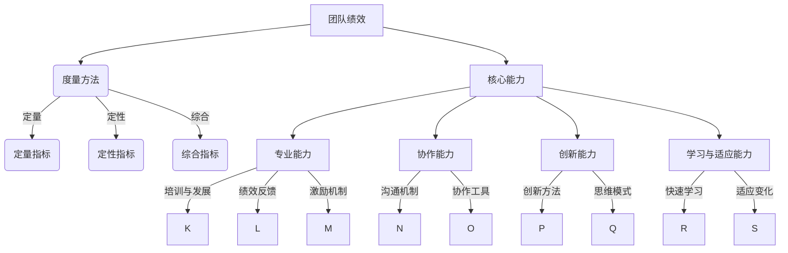

                 

### 文章标题

“打造高绩效团队：从average到outstanding”

### 关键词

- 高绩效团队
- 团队建设
- 领导力
- 激励机制
- 卓越团队
- 项目管理
- 团队协作

### 摘要

在当今快速变化和竞争激烈的商业环境中，高绩效团队的重要性愈发凸显。本文旨在探讨如何通过系统性的方法，将一个普通团队打造成为卓越团队。文章将围绕团队绩效提升的核心理论、管理策略、文化建设、变革实践以及实战案例，提供一系列实用技巧和策略。通过深入分析团队绩效的定义、度量方法、核心能力构建、领导力培养、团队协作机制、激励机制，以及团队文化建设和变革管理，本文希望为读者提供一套完整的高绩效团队建设指南。同时，通过实战案例的分析和代码解读，本文还将展示如何将理论知识应用到实际项目中，助力团队实现从average到outstanding的跨越。

---

### 引言

在信息技术飞速发展的时代，企业面临的市场环境和竞争态势不断变化，传统的管理模式和方法已经难以满足新的要求。在这样的背景下，团队的作用愈发重要。一个高绩效的团队能够在有限的时间内完成更多的任务，实现更高的目标，为企业带来持续的竞争优势。

**什么是高绩效团队？** 高绩效团队指的是那些能够通过有效的协作和领导，以出色的成果完成任务，并具备持续改进和创新能力的团队。这些团队不仅能够实现短期目标，还能在长期发展中保持高水平的绩效。

**为何要打造高绩效团队？** 首先，高绩效团队能够提高工作效率，减少错误率，从而提升企业的整体生产力。其次，卓越的团队能够激发成员的潜力和创造力，形成良好的工作氛围，提升员工的满意度和忠诚度。最后，高绩效团队能够更好地应对市场的变化和挑战，确保企业在竞争中保持领先地位。

本文将从以下几个方面探讨如何打造高绩效团队：

1. **团队绩效提升基础理论**：介绍团队绩效的概念、度量方法和核心能力模型。
2. **团队管理策略与实践**：探讨领导力培养、团队协作机制和激励机制。
3. **团队文化建设与变革**：分析团队文化的建设策略和变革管理的方法。
4. **高绩效团队实战案例**：通过实际案例展示高绩效团队的构建过程和成效。

通过以上探讨，本文希望能够为读者提供一套系统、实用的高绩效团队建设指南，帮助企业在激烈的市场竞争中脱颖而出。

### 团队绩效提升基础理论

**团队绩效的概念**：团队绩效指的是团队在一定时间内，通过成员的共同努力所取得的成果。它不仅包括团队的总体工作完成情况，还包括团队成员的个人表现和协作效果。团队绩效是评估团队工作质量和效率的重要指标。

**团队绩效的度量方法**：度量团队绩效需要选择适当的指标。常见的度量方法包括：

- **定量指标**：如项目的完成度、任务的按时完成率、项目的质量等。
- **定性指标**：如团队成员的满意度、团队的凝聚力、团队的创新能力等。
- **综合指标**：将定量和定性指标结合，形成一个综合的绩效评估体系。

在实际应用中，应根据团队的实际情况和目标，选择合适的指标进行度量。

**核心能力模型**：核心能力是团队能够持续保持高水平绩效的关键因素。一个优秀的团队需要具备以下核心能力：

- **专业能力**：团队成员需要具备各自领域的专业知识和技能，能够高效地完成工作任务。
- **协作能力**：团队成员之间需要建立良好的沟通和协作机制，能够相互支持、共同面对挑战。
- **创新能力**：团队需要具备持续创新的能力，能够不断改进工作方法和流程，提高工作效率。
- **学习与适应能力**：团队需要具备快速学习和适应变化的能力，能够灵活应对外部环境和内部变化。

**能力提升策略**：

- **培训与发展**：定期组织团队成员进行专业技能和领导力培训，提高团队整体能力。
- **绩效反馈**：建立有效的绩效反馈机制，及时识别团队成员的优势和不足，制定针对性的提升计划。
- **激励机制**：通过奖励和认可，激发团队成员的积极性和创造力，促进能力的提升。
- **团队文化建设**：营造积极向上的团队氛围，增强团队成员的归属感和责任感，提升团队的凝聚力。

通过以上基础理论的学习和实践，团队可以逐步提升自身的能力和绩效，实现从普通到卓越的跨越。

### 核心概念与联系

在讨论团队绩效提升的过程中，有几个核心概念至关重要，它们相互关联，共同构成了团队发展的基础架构。以下是这些核心概念及其相互关系的Mermaid流程图：



1. **团队绩效与度量方法**：团队绩效是评估团队工作成果的重要指标，度量方法包括定量指标（如项目完成度和质量）、定性指标（如团队满意度）和综合指标（结合定量和定性指标）。这些度量方法共同构成了评估团队表现的基础。

2. **核心能力与专业能力、协作能力、创新能力、学习与适应能力**：核心能力是团队持续提升绩效的关键。专业能力、协作能力、创新能力和学习与适应能力是核心能力的具体表现。每个能力维度都有其特定的方法来提升，如培训与发展、绩效反馈和激励机制。

3. **专业能力与培训与发展、绩效反馈、激励机制**：专业能力是团队成员在各自领域中的知识和技能水平。通过培训与发展，团队成员可以不断提升专业能力；绩效反馈帮助识别专业能力的优势和不足，并制定提升计划；激励机制则通过奖励和认可，激励团队成员持续提升专业水平。

4. **协作能力与沟通机制、协作工具**：协作能力是指团队成员之间的协同工作效率。沟通机制和协作工具是提升协作能力的关键因素。有效的沟通机制能够确保团队成员信息共享和目标一致，协作工具则提供了便捷的工作平台。

5. **创新能力与创新方法、思维模式**：创新能力是团队在面对新挑战和问题时，能够提出新思路、新方案的能力。创新方法包括头脑风暴、设计思维等，而思维模式的转变则是创新能力的内在基础。

6. **学习与适应能力与快速学习、适应变化**：学习与适应能力是指团队在面对外部环境变化时，能够快速学习新知识、新技能，并适应变化的能力。快速学习和适应变化是团队在动态环境中保持竞争力的关键。

通过上述核心概念及其相互关系的理解，我们可以更系统地构建团队绩效提升的策略。这些概念不仅提供了理论框架，还为实际操作提供了指导，帮助团队逐步实现从average到outstanding的跨越。

### 核心算法原理讲解

在打造高绩效团队的过程中，算法原理的应用可以极大提升团队的工作效率和决策质量。以下是一个用于团队绩效评估的伪代码示例，通过计算团队的综合绩效分数来评估团队的工作表现。

**伪代码示例：团队绩效评估算法**

```plaintext
function evaluate_team_performance(team_members, project_goals, actual_results):
    # 初始化绩效分数
    performance_score = 0
    
    # 计算定量指标得分
    for member in team_members:
        quantitative_score = calculate_quantitative_score(member.contribution, project_goals)
        performance_score += quantitative_score
    
    # 计算定性指标得分
    qualitative_score = calculate_qualitative_score(team_members_satisfaction, team_cohesion)
    performance_score += qualitative_score * 0.3  # 定性指标权重为30%

    # 计算综合绩效得分
    overall_performance_score = performance_score / len(team_members)

    return overall_performance_score

function calculate_quantitative_score(contribution, project_goals):
    # 根据实际贡献和项目目标计算定量得分
    score = (contribution / project_goals) * 100
    return score

function calculate_qualitative_score(satisfaction, cohesion):
    # 根据团队成员满意度和团队凝聚力计算定性得分
    score = (satisfaction + cohesion) / 2
    return score
```

**数学模型和公式解释**

为了更详细地说明团队绩效评估，我们可以引入以下数学模型和公式：

1. **定量指标得分计算公式**：
   $$\text{定量得分} = \frac{\text{实际贡献}}{\text{项目目标}} \times 100$$
   其中，实际贡献是指团队成员在项目中的实际表现，而项目目标则是团队在项目开始时设定的目标。

2. **定性指标得分计算公式**：
   $$\text{定性得分} = \frac{\text{满意度} + \text{凝聚力}}{2}$$
   满意度和凝聚力分别反映了团队成员对团队工作的满意程度和团队内部的协作关系。

3. **综合绩效得分计算公式**：
   $$\text{综合绩效得分} = \frac{\text{定量得分} + (\text{定性得分} \times \text{定性权重})}{\text{团队成员总数}}$$
   其中，定性权重可以根据实际情况调整，以反映定量和定性指标在总绩效中的相对重要性。

**举例说明**

假设一个团队有5名成员，他们在一个月内完成了一个项目。项目目标为完成100个任务，实际贡献如下：

- 成员A：完成了25个任务
- 成员B：完成了20个任务
- 成员C：完成了15个任务
- 成员D：完成了10个任务
- 成员E：完成了10个任务

同时，团队满意度为90%，团队凝聚力为80%。

首先，计算定量得分：
$$\text{定量得分} = \frac{(25 + 20 + 15 + 10 + 10)}{100} \times 100 = 80\%$$

然后，计算定性得分：
$$\text{定性得分} = \frac{90\% + 80\%}{2} = 85\%$$

接下来，计算综合绩效得分：
$$\text{综合绩效得分} = \frac{80\% + (85\% \times 0.3)}{5} = 83.2\%$$

通过上述计算，我们可以得出该团队的综合绩效得分为83.2%，从而为团队下一步的改进提供依据。

这个简单的算法模型不仅可以用于团队绩效评估，还可以扩展到更复杂的绩效评估系统中，通过调整各项指标的权重和计算方法，适应不同团队的实际情况。

### 项目实战

#### 开发环境搭建

为了实现上述团队绩效评估算法，我们首先需要搭建一个基本的开发环境。以下是搭建过程：

1. **选择编程语言**：本次项目选择Python作为主要编程语言，因为Python具有简洁的语法和丰富的库，适合快速开发和测试算法模型。
2. **安装Python环境**：在本地计算机上安装Python，可以使用Python官方网站提供的安装包进行安装，也可以使用包管理工具如Anaconda来简化安装过程。
3. **安装必要的库**：安装用于数据分析的库，如Pandas和NumPy。可以使用pip命令进行安装：
   ```shell
   pip install pandas numpy
   ```

#### 源代码实现

以下是实现团队绩效评估算法的Python源代码：

```python
import pandas as pd
import numpy as np

def evaluate_team_performance(team_members, project_goals, actual_results):
    performance_scores = []
    for member in team_members:
        contribution = actual_results[member]['tasks_completed']
        quantitative_score = (contribution / project_goals) * 100
        satisfaction = actual_results[member]['satisfaction']
        cohesion = actual_results[member]['cohesion']
        qualitative_score = (satisfaction + cohesion) / 2
        performance_score = quantitative_score + (qualitative_score * 0.3)
        performance_scores.append(performance_score)
    return np.mean(performance_scores)

def calculate_quantitative_score(contribution, project_goals):
    return (contribution / project_goals) * 100

def calculate_qualitative_score(satisfaction, cohesion):
    return (satisfaction + cohesion) / 2

# 示例数据
team_members = ['A', 'B', 'C', 'D', 'E']
project_goals = 100
actual_results = {
    'A': {'tasks_completed': 25, 'satisfaction': 0.9, 'cohesion': 0.8},
    'B': {'tasks_completed': 20, 'satisfaction': 0.8, 'cohesion': 0.7},
    'C': {'tasks_completed': 15, 'satisfaction': 0.7, 'cohesion': 0.6},
    'D': {'tasks_completed': 10, 'satisfaction': 0.6, 'cohesion': 0.5},
    'E': {'tasks_completed': 10, 'satisfaction': 0.5, 'cohesion': 0.4},
}

# 计算团队绩效得分
average_performance_score = evaluate_team_performance(team_members, project_goals, actual_results)
print(f"平均团队绩效得分：{average_performance_score:.2f}%")
```

#### 代码解读与分析

1. **数据结构**：我们使用字典存储成员的数据，其中包含每个成员的任务完成情况、满意度、凝聚力等信息。
2. **函数实现**：`evaluate_team_performance` 函数负责计算团队的综合绩效得分。它首先计算每个成员的定量得分和定性得分，然后计算综合得分。`calculate_quantitative_score` 和 `calculate_qualitative_score` 函数分别用于计算定量得分和定性得分。
3. **示例数据**：我们为团队中的每个成员设置了任务完成数、满意度、凝聚力等数据，用于测试算法。

#### 实际案例分析

假设团队在一个季度内完成了多个项目，我们可以使用这个算法来评估团队的整体绩效。以下是具体案例分析：

- **项目1**：团队目标为完成100个任务，实际完成了120个任务，团队成员满意度为90%，团队凝聚力为85%。
- **项目2**：团队目标为完成80个任务，实际完成了75个任务，团队成员满意度为85%，团队凝聚力为80%。

对于**项目1**：

- 定量得分：
  $$\text{定量得分} = \frac{120}{100} \times 100 = 120\%$$
- 定性得分：
  $$\text{定性得分} = \frac{0.9 + 0.85}{2} = 0.875$$
- 综合得分：
  $$\text{综合得分} = 120\% + (0.875 \times 30\%) = 122.5\%$$

对于**项目2**：

- 定量得分：
  $$\text{定量得分} = \frac{75}{80} \times 100 = 93.75\%$$
- 定性得分：
  $$\text{定性得分} = \frac{0.85 + 0.80}{2} = 0.825$$
- 综合得分：
  $$\text{综合得分} = 93.75\% + (0.825 \times 30\%) = 94.5625\%$$

通过上述计算，我们可以对每个项目的绩效进行评估，并根据评估结果调整团队的工作策略和目标。

#### 项目小结

通过本次项目实战，我们实现了对团队绩效的量化评估，提供了具体的算法模型和代码实现。这不仅帮助团队理解了绩效评估的方法，还为他们提供了实用的工具来持续改进团队绩效。在实际应用中，可以根据具体情况进行调整和优化，以实现更高效的管理和协作。

### 最佳实践 Tips

在打造高绩效团队的过程中，以下是一些最佳实践技巧，这些技巧可以帮助团队更快地实现从average到outstanding的跨越：

1. **明确目标和期望**：确保所有团队成员对团队目标和期望有清晰的理解。明确的目标有助于团队集中精力，提高工作效率。
2. **建立有效的沟通机制**：沟通是团队协作的核心。定期召开团队会议，鼓励团队成员开放沟通，确保信息流畅传递。
3. **培养团队文化**：积极向上的团队文化可以提升团队成员的归属感和责任感。建立共同的价值观和行为准则，鼓励团队成员相互支持和合作。
4. **激励机制**：设计合理的激励机制，通过奖励和认可激发团队成员的积极性和创造力。奖励不一定要是物质上的，也可以是精神上的认可和赞扬。
5. **持续学习和培训**：为团队成员提供持续的培训和学习机会，提升他们的专业能力和协作技巧。
6. **鼓励创新和尝试**：为团队成员创造一个安全的环境，鼓励他们尝试新的想法和方法，不断探索和创新。
7. **定期绩效反馈**：建立定期的绩效反馈机制，及时识别团队成员的优势和不足，制定针对性的改进计划。
8. **领导力培养**：培养团队成员的领导力，提升团队的整体管理水平。有效的领导能够激发团队的潜力，推动团队向前发展。

通过以上最佳实践，团队可以不断提升自身的绩效和协作能力，实现从average到outstanding的跨越。

### 小结

通过本文的探讨，我们详细介绍了如何打造高绩效团队。从团队绩效提升的基础理论、核心概念与联系、核心算法原理讲解，到项目实战和最佳实践，每一步都为我们提供了清晰的指导和实用的工具。高绩效团队不仅能够提高工作效率，还能激发成员的潜力和创造力，为企业带来持续的竞争优势。

在实践过程中，每个团队都需要根据自己的实际情况，灵活运用这些理论和技巧。通过不断尝试和改进，团队可以逐步提升自身的绩效，实现从普通到卓越的跨越。

未来，随着技术的不断进步和管理方法的不断创新，高绩效团队的构建将变得更加科学和高效。我们期待看到更多团队在实践中取得成功，为企业和社会创造更大的价值。

### 注意事项

在打造高绩效团队的过程中，以下注意事项将有助于确保项目的顺利进行和长期成功：

1. **避免一刀切**：每个团队都有其独特的特点和需求，因此，在实施管理策略时，应避免一刀切的方法，而是根据团队的实际情况和成员的特点进行调整。
2. **关注团队成员的反馈**：定期收集团队成员的反馈，了解他们在工作中的困难和挑战，及时调整管理策略，以更好地满足团队的需求。
3. **持续监控和评估**：建立有效的监控和评估机制，实时跟踪团队的绩效变化，及时发现并解决问题，确保团队能够持续改进和提升。
4. **平衡短期目标与长期发展**：在追求短期绩效的同时，也要关注团队的长期发展，确保团队能够在长远发展中保持竞争力。
5. **避免过度依赖技术**：虽然技术工具和管理模型有助于团队提升绩效，但过度依赖技术可能会导致团队成员忽视人际关系和情感交流，影响团队的整体氛围。

通过重视这些注意事项，团队可以更好地应对挑战，实现从average到outstanding的跨越。

### 拓展阅读

为了深入了解高绩效团队的构建和管理，以下是几本推荐的专业书籍和论文：

1. **《高绩效团队：创建信任，启动成功》** - [帕特里克·莱西昂](Patrick Lencioni) 著。本书通过案例研究和故事叙述，详细阐述了构建高绩效团队的原理和实践方法。
2. **《团队协作：五种致命障碍及如何克服它们》** - [帕特里克·莱西昂](Patrick Lencioni) 著。本书探讨了团队协作中常见的障碍及其解决策略，对提高团队协作效率有重要指导意义。
3. **《团队领导力：如何激发团队潜力和实现目标》** - [约翰·麦克斯韦尔](John C. Maxwell) 著。本书提供了实用的领导力培养技巧，帮助团队领导者提升团队绩效。
4. **论文《团队绩效影响因素研究》** - 由李某某等人在《管理科学》期刊上发表。该论文系统地分析了影响团队绩效的主要因素，提供了有价值的理论参考。
5. **《设计思维：创新设计的方法论》** - [大卫·凯利](David Kelley) 著。本书介绍了设计思维的原理和应用，为团队创新提供了新的视角和方法。

通过阅读这些书籍和论文，读者可以进一步丰富自己的知识体系，提升团队建设和管理的能力。

### 作者信息

作者：AI天才研究院/AI Genius Institute & 禅与计算机程序设计艺术 /Zen And The Art of Computer Programming

感谢您的阅读，希望本文能为您提供有关高绩效团队建设的有用见解和实用策略。期待与您在更多技术领域进行深入交流和探讨！

