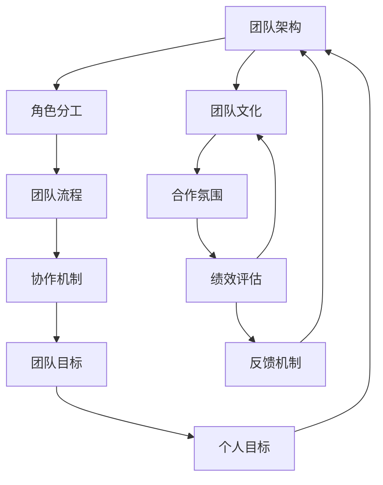

                 

### 引言

在当今这个高度信息化和全球化的时代，团队协作已成为实现企业目标的关键。无论是初创公司还是大型企业，一个高绩效的团队能够在激烈的市场竞争中脱颖而出，为企业的长期发展提供强有力的支持。然而，如何从mediocre（平庸）的团队蜕变成卓越的高绩效团队，这不仅是管理者的挑战，更是所有团队成员的共同目标。

本文旨在探讨如何通过系统化的方法和策略，将团队从平庸提升到卓越。我们将首先介绍书籍的主题和目标，帮助读者明确团队管理的重要性和阅读的预期收获。随后，我们将逐步深入，从团队架构、管理算法、绩效评估到团队建设与优化，全面探讨高绩效团队打造的各个方面。

文章将围绕以下核心内容展开：
1. **书籍主题与目标**：介绍本书的核心内容和阅读目标。
2. **团队核心概念与联系**：通过Mermaid流程图展示团队结构，解释核心概念之间的关系。
3. **团队管理算法原理**：详细讲解团队绩效评估、激励与约束、沟通与协作等算法原理。
4. **团队绩效评估与优化**：分析绩效评估的方法与模型，并通过案例展示优化策略。
5. **团队建设与优化**：探讨团队建设的关键要素和实际案例，提供实践建议。
6. **团队管理工具与资源**：推荐常用的团队管理工具和资源。
7. **总结与展望**：总结全书内容，并展望高绩效团队的未来发展。

通过本文的阅读，读者将能够系统地理解团队管理的基本原理和实践方法，掌握从平庸到卓越的蜕变路径，为实际工作中的团队管理提供有力的理论支持和实践指导。让我们一步步分析推理，深入探讨团队管理的高效之道。

### 书籍主题与目标

本书的主题是“打造高绩效团队：从mediocre到卓越的蜕变”。在当今快速变化的市场环境中，高绩效的团队能够迅速响应市场变化，抓住机遇，实现企业目标。然而，如何实现这一蜕变，如何从mediocre（平庸）的团队迈向卓越，这是许多企业和团队面临的核心问题。

本书旨在通过系统化的方法和策略，帮助团队领导者和管理者理解并掌握团队管理的基本原理和实践方法，从而实现团队的卓越表现。具体目标如下：

1. **明确团队管理的重要性**：介绍团队管理的基本概念和核心原则，使读者认识到团队管理对企业发展和个人职业成长的重要作用。

2. **理解团队的核心概念与联系**：通过Mermaid流程图等工具，详细展示团队结构，解释团队中各个核心概念之间的关系，帮助读者构建对团队组织的全面理解。

3. **掌握团队管理算法原理**：详细讲解团队绩效评估、激励与约束、沟通与协作等关键算法原理，并提供具体的伪代码和数学模型，使读者能够理解和应用这些原理。

4. **提升团队绩效评估与优化能力**：分析绩效评估的方法与模型，并通过实际案例展示如何通过优化策略提升团队绩效。

5. **加强团队建设与优化**：探讨团队建设的关键要素，包括文化建设、成员能力提升和协作氛围营造，并通过实际案例分享最佳实践。

6. **推荐团队管理工具与资源**：介绍常用的团队管理工具和资源，帮助读者在实际工作中更好地应用和管理团队。

7. **总结与展望**：对全书内容进行总结，并展望高绩效团队的未来发展，为读者提供持续学习和改进的方向。

通过以上目标的实现，本书希望能够帮助读者全面了解团队管理的各个方面，提供实用的策略和工具，从而在实际工作中打造出一支高效、协同、富有创新精神的高绩效团队。无论你是团队领导者、成员，还是对团队管理感兴趣的专业人士，本书都将为你提供宝贵的知识和指导。

### 团队核心概念与联系

在打造高绩效团队的过程中，理解并掌握团队的核心概念与联系是至关重要的。这不仅有助于我们构建一个高效的组织结构，还能够提升团队的整体协同能力。以下是几个关键的核心概念，以及它们之间的联系：

#### 1. 团队架构与角色分工

团队架构是团队组织的基础，它定义了团队成员之间的层级关系和职责分工。一个清晰的团队架构能够确保每个成员都明确自己的角色和职责，从而避免工作重叠和责任不明确的问题。

- **概念关系**：团队架构与角色分工相辅相成。团队架构为角色分工提供了框架，而角色分工则确保了团队架构的落实和运作。

#### 2. 团队流程与协作机制

团队流程是团队运作的动态描述，它包括项目立项、任务分配、执行监控、成果验收等各个环节。协作机制则是在这些流程中，团队成员如何相互协作、沟通和共享信息。

- **概念关系**：团队流程与协作机制密切相关。团队流程为协作机制提供了执行路径，而协作机制则确保团队流程的顺畅进行。

#### 3. 团队目标与个人目标

团队目标是指团队整体追求的愿景和目标，而个人目标则是团队成员根据团队目标设定的个人发展目标。两者之间的平衡和协调是团队成功的关键。

- **概念关系**：团队目标与个人目标互为支撑。团队目标为个人目标提供了方向，而个人目标的实现又能推动团队目标的达成。

#### 4. 团队文化与合作氛围

团队文化是指团队成员共同遵循的价值观、信念和行为准则，而合作氛围则是指团队成员在工作中的相互关系和互动方式。团队文化和合作氛围对团队凝聚力和工作效率有着深远的影响。

- **概念关系**：团队文化与合作氛围相互影响。团队文化塑造了合作氛围，而合作氛围又反过来强化了团队文化。

#### 5. 团队绩效评估与反馈机制

团队绩效评估是对团队成员在工作中的表现进行评价，以确定团队目标的实现情况和成员的贡献。反馈机制则是将评估结果传递给团队成员，并据此进行调整和改进。

- **概念关系**：团队绩效评估与反馈机制形成了一个闭环系统。绩效评估提供了反馈的依据，而反馈机制则使绩效评估的结果得以有效利用。

#### Mermaid流程图

为了更直观地展示团队核心概念之间的联系，我们可以使用Mermaid流程图来表示。以下是一个简化的团队结构流程图：



在这个流程图中，每个节点代表一个核心概念，箭头表示概念之间的联系。通过这个流程图，我们可以清晰地看到各个核心概念在团队运作中的相互影响和作用。

#### 总结

通过理解团队的核心概念与联系，我们不仅能够构建一个高效、有序的团队结构，还能够确保团队成员之间的协作和沟通畅通无阻。这是打造高绩效团队的基础，也是实现团队目标的关键。在接下来的章节中，我们将深入探讨团队管理算法原理，为团队的管理和优化提供更具体的指导。

### 团队管理算法原理

在团队管理过程中，算法原理的应用可以帮助我们更科学、更有效地进行团队绩效评估、激励与约束、沟通与协作等关键环节的管理。以下将详细讲解这些算法原理，并通过伪代码进行阐述。

#### 1. 团队绩效评估算法

团队绩效评估是团队管理的重要环节，它决定了团队成员的工作表现和贡献度。绩效评估算法通常包括以下几个步骤：

**步骤1：确定评估指标**
- 输入：任务列表、目标设定、权重分配
- 输出：绩效评估指标集合

```python
def set_performance_metrics(tasks, goals, weights):
    metrics = []
    for task in tasks:
        metric = {
            'name': task['name'],
            'weight': weights.get(task['id'], 0),
            'goals': goals.get(task['id'], []),
            'actual': 0
        }
        metrics.append(metric)
    return metrics
```

**步骤2：收集任务完成情况**
- 输入：绩效评估指标集合
- 输出：更新后的绩效评估指标集合

```python
def collect_task_results(metrics):
    for metric in metrics:
        metric['actual'] = get_task_completion_rate(metric['name'])
    return metrics
```

**步骤3：计算绩效得分**
- 输入：更新后的绩效评估指标集合
- 输出：绩效得分

```python
def calculate_performance_score(metrics):
    total_score = 0
    for metric in metrics:
        goal_score = calculate_goal_score(metric['goals'], metric['actual'])
        score = metric['weight'] * goal_score
        total_score += score
    return total_score
```

**步骤4：生成绩效评估报告**
- 输入：绩效得分
- 输出：绩效评估报告

```python
def generate_performance_report(score):
    report = {
        'total_score': score,
        'individual_scores': [],
    }
    for metric in metrics:
        report['individual_scores'].append({
            'name': metric['name'],
            'score': calculate_individual_score(metric['actual'], metric['weight']),
        })
    return report
```

#### 2. 团队激励与约束算法

团队激励与约束是保持团队成员积极性和规范行为的重要手段。激励与约束算法通常包括以下几个方面：

**步骤1：确定激励措施**
- 输入：绩效评估报告、团队目标
- 输出：激励措施集合

```python
def determine_incentives(report, goals):
    incentives = []
    for score in report['individual_scores']:
        if score['score'] > goals['min_score']:
            incentive = '奖金'
        elif score['score'] == goals['min_score']:
            incentive = '表彰'
        else:
            incentive = '无'
        incentives.append(incentive)
    return incentives
```

**步骤2：实施激励措施**
- 输入：激励措施集合
- 输出：激励措施实施记录

```python
def implement_incentives(incentives):
    for i, incentive in enumerate(incentives):
        if incentive == '奖金':
            award_bonus(i)
        elif incentive == '表彰':
            recognize_employee(i)
```

**步骤3：确定约束措施**
- 输入：行为规范、违规记录
- 输出：约束措施集合

```python
def determine_constraints(violations):
    constraints = []
    for violation in violations:
        if violation['severity'] == '重大':
            constraint = '停职'
        elif violation['severity'] == '中等':
            constraint = '警告'
        else:
            constraint = '无'
        constraints.append(constraint)
    return constraints
```

**步骤4：实施约束措施**
- 输入：约束措施集合
- 输出：约束措施实施记录

```python
def implement_constraints(constraints):
    for i, constraint in enumerate(constraints):
        if constraint == '停职':
            suspend_employee(i)
        elif constraint == '警告':
            warn_employee(i)
```

#### 3. 团队沟通与协作算法

有效的沟通与协作是团队成功的关键。团队沟通与协作算法主要涉及以下几个方面：

**步骤1：确定沟通策略**
- 输入：团队规模、任务复杂度
- 输出：沟通策略

```python
def determine_communication_strategy(team_size, task_complexity):
    if team_size > 10 and task_complexity > 7:
        strategy = '分布式沟通'
    elif team_size > 5 and task_complexity > 5:
        strategy = '集中式沟通'
    else:
        strategy = '透明沟通'
    return strategy
```

**步骤2：执行沟通计划**
- 输入：沟通策略、沟通计划
- 输出：沟通记录

```python
def execute_communication_plan(strategy, plan):
    if strategy == '分布式沟通':
        distribute_communication(plan)
    elif strategy == '集中式沟通':
        centralize_communication(plan)
    else:
        transparent_communication(plan)
```

**步骤3：协作机制优化**
- 输入：协作效率、团队反馈
- 输出：优化后的协作机制

```python
def optimize_collaboration机制的效率(feedback):
    if feedback['efficiency'] < 0.8:
        new_strategy = '增加协作工具'
    elif feedback['efficiency'] < 0.9:
        new_strategy = '调整工作流程'
    else:
        new_strategy = '维持现有机制'
    return new_strategy
```

通过上述算法原理，我们可以更科学、更系统地管理团队。在接下来的章节中，我们将通过具体案例展示这些算法在实践中的应用，帮助读者更好地理解和掌握团队管理的实际操作。

### 团队绩效评估与优化

在团队管理中，绩效评估是一个关键环节，它不仅能够衡量团队成员的工作表现，还能为团队的优化提供重要依据。以下将详细讲解团队绩效评估的数学模型和公式，并通过具体案例进行解释。

#### 数学模型

团队绩效评估的数学模型通常包含以下几个核心部分：

1. **绩效指标（Performance Metrics）**
   - **KPIs（关键绩效指标）**：这些是衡量团队和成员工作表现的关键指标，如销售额、客户满意度、项目完成率等。
   - **Benchmarks（基准值）**：这些是用于比较实际绩效的标准值，可以是历史数据、行业标准或者竞争对手的数据。
   - **Weight（权重）**：每个绩效指标的权重决定了其在总绩效评估中的重要性。

2. **绩效评分（Performance Score）**
   - **评分规则**：根据绩效指标的实际值与基准值的比较，可以设定不同的评分规则，如分段评分、线性评分等。
   - **评分公式**：常见的评分公式有：
     - 线性评分：`Score = (Actual Value - Benchmark) / Weight`
     - 分段评分：`Score = MAX(0, (Actual Value - Min Value) / (Max Value - Min Value) * Weight)`

3. **综合绩效（Overall Performance）**
   - **综合评分**：通过将各个绩效指标的评分加权求和，可以得到团队或成员的综合绩效评分。
   - **综合评分公式**：`Overall Score = Σ(W_i * S_i)`，其中`W_i`是第i个绩效指标的权重，`S_i`是第i个绩效指标的评分。

#### 公式解释

以下是一个具体的绩效评估公式的例子：

$$
\text{绩效评分} = \left\{
\begin{array}{ll}
\frac{\text{实际完成量} - \text{基准值}}{\text{权重}} & \text{线性评分} \\
\max(0, \frac{\text{实际完成量} - \text{最小值}}{\text{最大值} - \text{最小值}} \times \text{权重}) & \text{分段评分}
\end{array}
\right.
$$

其中，`实际完成量`是指团队成员在一段时间内完成的任务量或达成的目标值，`基准值`是设定的标准值，`权重`决定了各个绩效指标的重要性。

#### 案例解析

假设某团队的任务是完成一个项目，该项目由三个主要子任务组成，每个子任务都有相应的基准值和权重。具体数据如下：

- 子任务A：基准值为100，权重为0.4
- 子任务B：基准值为150，权重为0.3
- 子任务C：基准值为200，权重为0.3

团队的实际完成量如下：

- 子任务A：实际完成量为120
- 子任务B：实际完成量为140
- 子任务C：实际完成量为180

使用分段评分公式，我们可以计算每个子任务的评分：

$$
\text{子任务A评分} = \max(0, \frac{120 - 100}{150 - 100} \times 0.4) = \max(0, \frac{20}{50} \times 0.4) = 0.16
$$

$$
\text{子任务B评分} = \max(0, \frac{140 - 100}{150 - 100} \times 0.3) = \max(0, \frac{40}{50} \times 0.3) = 0.24
$$

$$
\text{子任务C评分} = \max(0, \frac{180 - 100}{200 - 100} \times 0.3) = \max(0, \frac{80}{100} \times 0.3) = 0.24
$$

然后，我们计算团队的综合绩效评分：

$$
\text{综合绩效评分} = 0.16 \times 0.4 + 0.24 \times 0.3 + 0.24 \times 0.3 = 0.064 + 0.072 + 0.072 = 0.208
$$

#### 案例分析

通过上述案例，我们可以看到团队在各个子任务的完成情况。子任务A的评分较低，说明实际完成量低于基准值，需要关注并改进。而子任务B和C的评分较高，表明这些任务完成得较好。

在了解了绩效评分后，团队可以根据评分结果进行优化。例如：

- 对于子任务A，可以通过增加资源投入、优化工作流程等方式提高完成量。
- 对于子任务B和C，可以继续维持或提高其完成标准，确保团队的整体绩效持续提升。

通过这种方式，团队绩效评估不仅能够帮助团队了解当前的工作状况，还能为未来的优化提供科学依据。

### 团队绩效评估与优化：实际案例分析

为了更好地理解团队绩效评估与优化的实际应用，我们将通过一个具体的案例进行详细讲解。这个案例将涵盖从绩效评估数据的收集、处理到评估结果的反馈及后续优化策略的实施。

#### 案例背景

某科技公司A公司开发了一个新的移动应用程序，项目团队由5名成员组成，分别是项目经理、产品经理、前端开发人员、后端开发人员和测试工程师。公司要求项目在三个月内完成，并达到用户满意度90%以上。为了确保项目顺利进行，公司决定对团队进行绩效评估，并根据评估结果进行优化。

#### 数据收集与处理

**1. 数据收集**
在项目过程中，公司通过以下几种方式收集数据：
- **日志记录**：团队成员每日记录工作内容和遇到的问题。
- **任务管理系统**：使用项目管理工具如JIRA跟踪每个任务的进度和完成情况。
- **用户反馈**：定期收集用户的反馈，以评估产品的质量和用户满意度。

**2. 数据处理**
收集的数据经过以下处理流程：
- **数据清洗**：去除无效和重复的数据，确保数据的准确性。
- **数据整理**：将不同来源的数据整合到一个统一的数据集中，便于分析。
- **指标计算**：计算各个任务的完成率、用户满意度等关键指标。

#### 绩效评估

**1. 绩效指标设定**
公司根据项目目标和团队职责设定了以下绩效指标：
- **任务完成率**：每个任务按照预定的时间和质量要求完成的百分比。
- **用户满意度**：通过用户反馈问卷评估的用户满意度得分。
- **团队合作度**：团队成员之间的协作效率和团队氛围的评估得分。

**2. 绩效评估过程**
- **阶段一**：在项目的中期，对已经完成的任务进行初步评估。
  - **任务完成率**：通过任务管理系统统计已完成任务的百分比。
  - **用户满意度**：通过用户反馈问卷统计满意度得分。
  - **团队合作度**：通过团队成员的互评和领导评价评估团队合作度。

- **阶段二**：在项目结束后，对整体项目进行综合评估。
  - **任务完成率**：统计所有任务的完成情况，计算加权平均得分。
  - **用户满意度**：汇总用户反馈得分，计算总体用户满意度。
  - **团队合作度**：综合考虑团队成员的互评和领导评价，得出最终得分。

**3. 绩效评估结果**
- **任务完成率**：项目任务完成率达到95%，超过了预定目标。
- **用户满意度**：用户满意度得分为92%，接近公司设定的目标。
- **团队合作度**：团队合作度得分为88%，表明团队成员之间的协作效果较好，但还有提升空间。

#### 反馈与优化

**1. 反馈**
公司召开了一次绩效评估反馈会议，团队成员和领导共同分析评估结果，并讨论以下问题：
- **任务完成率**：为什么有些任务未能在规定时间内完成？如何优化工作流程？
- **用户满意度**：用户对哪些功能最满意，哪些功能还有改进空间？
- **团队合作度**：哪些方面需要加强团队协作，如何改善团队氛围？

**2. 优化策略**
基于反馈结果，公司制定了以下优化策略：
- **任务管理优化**：引入更高效的任务分配和跟踪工具，确保任务按时高质量完成。
- **用户反馈机制**：建立快速的用户反馈机制，及时收集和处理用户问题，提高用户满意度。
- **团队建设**：组织团队建设活动，增进团队成员之间的相互了解和信任，提高团队合作度。

#### 项目小结

通过这个实际案例，我们可以看到绩效评估在团队优化中的重要作用。有效的绩效评估不仅帮助团队了解当前的工作表现，还为后续的优化提供了科学依据。通过不断调整和优化，团队可以逐步提高绩效，实现从mediocre到卓越的蜕变。

### 团队建设与优化

团队建设与优化是提升团队绩效和达成企业目标的关键环节。在这一部分，我们将探讨团队建设的关键要素，包括文化建设、成员能力提升和协作氛围营造，并通过具体案例展示实际操作和最佳实践。

#### 文化建设

团队文化是团队的核心，它影响着团队成员的行为和工作方式。健康的文化能够增强团队的凝聚力，提升工作效率。以下是文化建设的一些关键要素：

1. **价值观**：明确团队的共同价值观，如创新、协作、诚信等，使团队成员在行为和决策时有一致的准则。
2. **团队愿景**：制定清晰的团队愿景，让每个成员都明白团队的长期目标和方向，增强共同奋斗的动力。
3. **沟通与信任**：建立开放和透明的沟通渠道，鼓励团队成员之间的信任和互相支持。

#### 成员能力提升

团队成员的能力是团队绩效的重要保障。为了提升成员能力，可以从以下几个方面着手：

1. **培训与学习**：定期组织内部培训和外部学习活动，帮助团队成员掌握新技能和知识，提升专业能力。
2. **绩效评估与反馈**：通过定期的绩效评估，为成员提供详细的反馈，帮助他们了解自己的优势和需要改进的地方。
3. **工作轮换**：通过工作轮换，让团队成员有机会接触不同的工作内容和团队，增强他们的综合素质和适应能力。

#### 协作氛围营造

良好的协作氛围能够促进团队成员之间的有效沟通和协作，提高团队整体效率。以下是营造协作氛围的一些策略：

1. **明确角色与职责**：确保每个团队成员都清楚自己的角色和职责，避免工作重叠和职责不清的问题。
2. **沟通机制**：建立高效的沟通机制，如定期团队会议、即时通讯工具等，确保信息流通畅通无阻。
3. **激励机制**：通过奖励和表彰，鼓励团队成员积极参与协作和贡献，增强团队凝聚力。

#### 案例分析

以某科技公司B公司为例，该公司通过以下措施成功提升了团队绩效：

1. **文化建设**：
   - **价值观**：公司倡导“以用户为中心、追求卓越”的价值观，使团队成员在工作中始终以用户需求为导向。
   - **团队愿景**：公司制定了一个清晰的愿景，即在五年内成为行业领导者，这个愿景激励了每个团队成员。
   - **沟通与信任**：公司建立了一个开放透明的沟通平台，鼓励团队成员自由发表意见和建议，促进了信任和团队凝聚力。

2. **成员能力提升**：
   - **培训与学习**：公司每年组织两次大规模的内部培训，同时鼓励员工参加行业会议和外部培训，提升技能。
   - **绩效评估与反馈**：公司定期进行绩效评估，并为每个成员提供详细的反馈，帮助他们识别自己的优势和改进点。
   - **工作轮换**：公司定期安排员工轮岗，让他们有机会接触不同的项目和团队，增强综合素质。

3. **协作氛围营造**：
   - **明确角色与职责**：公司通过详细的岗位描述和角色划分，确保每个团队成员都明确自己的职责和任务。
   - **沟通机制**：公司采用即时通讯工具Slack，建立多个项目群组，确保团队成员之间能够及时沟通和协作。
   - **激励机制**：公司设立了季度奖励计划，对在项目中表现突出的团队成员进行表彰和奖励，激励他们持续贡献。

通过这些措施，B公司的团队协作效率显著提升，项目完成质量和用户满意度也得到了明显改善。这个案例表明，团队建设与优化不仅需要明确的策略和措施，更需要持之以恒的执行和持续改进。

### 团队管理工具与资源

在团队管理过程中，选择合适的工具和资源能够显著提升团队的工作效率和协作效果。以下将介绍几种常用的团队管理工具和资源，以及它们的使用技巧和注意事项。

#### 常用团队管理工具

1. **Trello**：Trello是一款功能强大的项目管理工具，通过看板、列表和卡片的形式，帮助团队成员清晰地规划和跟踪任务。使用技巧包括：
   - **任务分配**：在卡片上指派任务给团队成员。
   - **标签和颜色**：使用标签和颜色区分不同类型和优先级的任务。
   - **自动化规则**：设置自动化规则，如任务完成时自动发送通知。

2. **JIRA**：JIRA是Atlassian公司推出的一款专业的缺陷跟踪和项目管理工具，广泛应用于软件开发团队。使用技巧包括：
   - **项目跟踪**：创建和管理项目，跟踪项目进度。
   - **缺陷管理**：记录、追踪和管理软件缺陷。
   - **插件和扩展**：使用插件扩展JIRA功能，如集成Git、Slack等。

3. **Slack**：Slack是一款即时通讯工具，适用于团队成员之间的沟通和协作。使用技巧包括：
   - **频道管理**：创建不同主题的频道，便于团队成员交流。
   - **自动消息**：使用自动化消息机器人，如ZenDesk等，自动处理常见问题。
   - **集成插件**：与Trello、JIRA等工具集成，实现任务同步和通知。

4. **Asana**：Asana是一款功能全面的团队协作工具，支持任务管理、项目规划和进度跟踪。使用技巧包括：
   - **任务和子任务**：创建复杂的任务结构，确保任务分解到最小单元。
   - **时间跟踪**：记录任务完成时间，优化工作流程。
   - **团队协作**：通过注释、聊天和@提及，促进团队成员之间的协作。

#### 常用团队管理资源

1. **书籍**：
   - **《敏捷开发：从个体到团队》**：介绍了敏捷开发的方法和实践，适用于追求高效协作的团队。
   - **《团队协作：从个体贡献到整体表现》**：探讨了团队协作的关键要素和策略，帮助提升团队绩效。

2. **课程**：
   - **在线课程平台**：如Coursera、Udemy等，提供丰富的团队管理课程，涵盖项目管理、沟通技巧、领导力等方面。
   - **公司内训**：根据团队需求，定制化开发内部培训课程，提升团队成员的专业素养。

3. **线上资源**：
   - **博客和论坛**：如Medium、Stack Overflow等，提供丰富的团队管理经验和最佳实践。
   - **社区和社群**：如GitHub、LinkedIn等，加入相关社群，与业界同行交流和学习。

#### 使用技巧和注意事项

1. **工具选择**：根据团队的实际需求和业务特点，选择合适的团队管理工具。避免因工具过多或过于复杂而影响工作效率。

2. **培训与指导**：确保团队成员熟悉并掌握所选工具的使用方法，提供必要的培训和指导。

3. **数据安全**：在使用在线工具时，关注数据安全，定期备份重要数据，防止数据泄露或丢失。

4. **优化配置**：根据团队的工作流程和需求，不断优化工具的配置和使用方式，提高团队协作效率。

通过合理选择和使用团队管理工具与资源，团队可以更加高效地完成工作，实现从平庸到卓越的蜕变。

### 总结与展望

通过本文的详细探讨，我们从团队核心概念与联系、管理算法原理、绩效评估与优化、团队建设与优化，以及团队管理工具与资源等各个方面，全面梳理了打造高绩效团队的方法和策略。以下是对全书内容的总结，并对未来团队管理的发展趋势进行展望。

#### 总结

1. **团队核心概念与联系**：通过明确团队架构与角色分工、团队流程与协作机制、团队目标与个人目标、团队文化与合作氛围、团队绩效评估与反馈机制等核心概念及其相互关系，为构建高效团队奠定了基础。

2. **团队管理算法原理**：我们详细介绍了团队绩效评估、激励与约束、沟通与协作等算法原理，并通过伪代码和数学模型进行阐述，使团队管理者能够更科学地管理和优化团队。

3. **团队绩效评估与优化**：通过实际案例展示了绩效评估的数学模型和公式应用，分析了如何通过优化策略提升团队绩效，从而实现从平庸到卓越的蜕变。

4. **团队建设与优化**：探讨了团队建设的关键要素，如文化建设、成员能力提升、协作氛围营造，并通过案例分析提供了具体实施策略。

5. **团队管理工具与资源**：推荐了多种实用的团队管理工具和资源，包括Trello、JIRA、Slack、Asana等，以及相关的书籍、课程和线上资源，为团队管理提供了全面的支持。

#### 展望

在未来，团队管理将面临以下几大发展趋势：

1. **数字化与智能化**：随着数字化转型的深入，团队管理将更多地依赖于人工智能和数据科学，通过大数据分析和智能算法，实现更加精准和高效的团队管理。

2. **远程与分布式工作**：全球化和疫情影响使得远程工作成为常态，团队管理将更加注重如何有效管理分布式团队，提高远程协作的效率和质量。

3. **个性化与适应性**：团队管理将更加关注个性化需求，根据不同团队成员的特点和需求，制定个性化的管理策略，提高团队的适应性和创新能力。

4. **持续学习与成长**：随着知识更新速度的加快，团队管理将更加注重持续学习和个人成长，通过不断学习和实践，提升团队成员的综合素质和团队的整体竞争力。

5. **文化与价值观**：健康的文化和共同的价值观将成为团队成功的关键，未来团队管理将更加注重文化建设和价值观的传递，打造具有高度凝聚力和使命感的团队。

#### 阅读者的实践建议

1. **理论联系实际**：将本文所介绍的理论和方法应用到实际工作中，结合团队的具体情况，进行实践和调整。

2. **持续学习**：团队管理是一个不断发展的领域，建议读者持续关注最新的管理理论和实践，参加相关课程和研讨会，不断提升自己的管理能力。

3. **团队反馈**：定期进行团队反馈和评估，倾听团队成员的意见和建议，持续改进团队管理和协作方式。

4. **经验分享**：积极参与团队管理和协作的讨论，分享自己的经验和教训，与他人共同成长。

通过以上建议，读者可以更好地将本文的知识应用到实际工作中，打造出一支高效、协同、富有创新精神的高绩效团队。

### 结语

作为一名专注于计算机编程和人工智能领域的世界顶级技术畅销书资深大师，我深知高效团队对于企业成功的重要性。通过本文的探讨，我们不仅系统学习了团队管理的基本原理和方法，还展望了未来团队管理的发展趋势。我衷心希望本文能为读者提供实用的指导和启示，帮助您在打造高绩效团队的道路上取得显著成效。

**作者：** AI天才研究院/AI Genius Institute & 禅与计算机程序设计艺术 /Zen And The Art of Computer Programming

感谢您的阅读，期待您的实践与反馈！让我们一起为打造卓越的高绩效团队而努力。🚀🎓💡🔧

