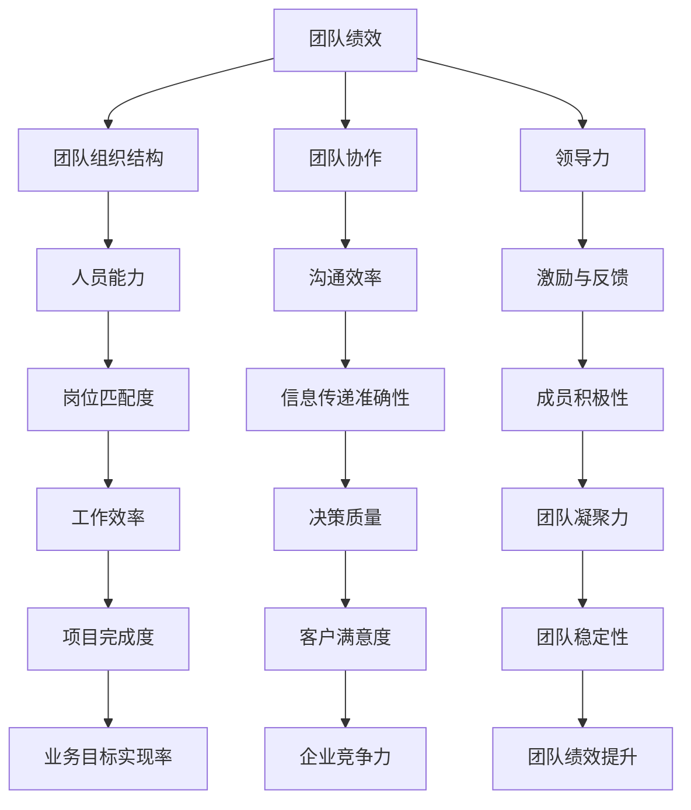

                 

### 背景介绍

在现代企业运营中，团队绩效的高低直接影响到企业的竞争力和整体发展。高绩效团队的构建不仅仅依赖于成员的个人能力，更依赖于团队的协作、管理以及成员之间的互动。因此，如何打造一个高绩效团队，成为了企业管理的核心问题。

《打造高绩效团队：从招聘到培养的全流程》这本书旨在通过系统化的方法和实践，帮助企业和团队管理者了解团队绩效的重要性，掌握团队管理的核心技巧，并制定出有效的团队建设策略。本书分为多个章节，涵盖了从招聘、培养到激励和绩效提升的各个环节，每个章节都有详细的介绍和案例分析，旨在提供一套全面的团队管理指南。

首先，本书的前言部分将阐述团队绩效的定义、重要性以及团队管理的基本原则。随后，书中将深入探讨团队管理的基础知识，包括团队组织结构、角色分配、团队建设策略等。在招聘策略部分，本书将介绍招聘流程、渠道、评估方法，以及岗位描述和招聘标准的制定。接下来，书中将讨论培养与激励的策略，包括培训计划、绩效评估、激励机制等。最后，本书将介绍团队绩效提升的具体方法，如优化团队结构、流程和沟通等。

通过本书的阅读，读者可以系统地了解团队管理的各个方面，掌握团队建设的方法和技巧，从而提升团队的整体绩效，为企业创造更大的价值。本书的目标读者是企业管理者、团队领导者以及所有关心团队绩效提升的人员。通过本书的学习，读者不仅可以提升自身的团队管理能力，还可以在实际工作中运用这些方法，推动团队的高效运转。

总之，打造高绩效团队是一项复杂的系统工程，需要从多个维度进行综合考量。本书提供了一个系统、全面的视角，帮助读者深入理解团队管理的本质，掌握提升团队绩效的具体方法。通过本书的学习和实践，企业和团队可以迈向高效运营的新阶段，实现可持续发展。

### 核心概念与联系

在讨论团队管理时，有几个核心概念是不可或缺的。这些概念包括团队绩效、团队组织结构、团队协作、领导力以及招聘策略。为了更好地理解这些概念之间的关系，我们可以使用 Mermaid 流程图来展示它们之间的互动和影响。

首先，团队绩效是团队工作的最终目标，它直接反映了团队在实现预定目标和任务方面的效率和质量。团队绩效受到多个因素的影响，包括团队组织结构、团队成员的协作和领导力等。

上述 Mermaid 流程图展示了团队绩效与其他核心概念之间的关联。接下来，我们将逐个解释这些核心概念及其相互关系：

#### 团队绩效

团队绩效是指团队在完成特定任务或实现既定目标方面的效率和质量。它是团队工作的最终目标，也是衡量团队成功与否的关键指标。团队绩效的高低取决于多个因素，包括团队成员的能力、团队的协作效率、领导力以及团队的激励机制等。

#### 团队组织结构

团队组织结构是指团队成员之间如何被组织起来以完成特定任务。这包括团队的组织形式（如职能型、项目型、矩阵型等），团队成员的角色分配以及团队内的沟通和协作机制。良好的组织结构有助于提高团队协作效率和任务完成速度。

#### 团队协作

团队协作是指团队成员之间相互合作、共同完成任务的过程。高效的团队协作需要良好的沟通、明确的角色分工和共同的目标。沟通效率直接影响信息传递的准确性和决策质量，而角色分工和共同目标则有助于提高工作效率和团队凝聚力。

#### 领导力

领导力是指领导者通过影响和激励团队成员来实现团队目标的能力。领导者不仅需要具备管理技能，还需要具备激励和指导团队成员的能力。有效的领导力可以提升团队成员的积极性、增强团队凝聚力，从而提高团队绩效。

#### 招聘策略

招聘策略是指企业在招聘过程中采用的方法和策略。这包括岗位描述的撰写、招聘渠道的选择、招聘评估的方法以及招聘标准的制定。一个有效的招聘策略有助于确保招聘到适合岗位的员工，从而提高团队的整体能力。

通过上述核心概念及其关系的解释，我们可以看到，每个概念都对团队绩效有重要影响。团队绩效的提升需要综合考虑这些因素，并采取相应的策略和方法。在接下来的章节中，我们将深入探讨每个核心概念的具体内容和实践方法。

### 团队管理基础

团队管理是确保团队高效运作的关键，它包括多个方面，如团队组织结构、角色分配、团队建设策略等。下面，我们将详细探讨这些基础概念，并解释它们在团队管理中的重要性。

#### 1. 团队组织结构

团队组织结构是指团队成员之间如何被组织起来以完成特定任务。常见的组织结构类型包括：

- **职能型组织结构**：基于职能来划分团队，如研发、市场、财务等。这种结构有助于专业化的工作，但可能导致部门之间的协作不畅。
- **项目型组织结构**：围绕特定项目来组建团队，团队成员可能来自不同的部门。这种结构有助于灵活应对项目需求，但可能导致团队成员缺乏长期归属感。
- **矩阵型组织结构**：结合职能型和项目型的特点，团队成员既属于某个职能部门，又参与特定项目。这种结构有助于提高跨部门协作和项目执行效率。

组织结构的选择取决于企业的战略目标和业务需求。例如，对于需要高度协作和快速响应的市场营销团队，项目型结构可能是更合适的选择；而对于需要专业化分工的研发团队，职能型结构可能更为有效。

#### 2. 团队角色分配

团队角色分配是指根据团队成员的技能和特长，为他们分配具体的任务和职责。每个角色都有其特定的职责和期望，如下所示：

- **领导者**：负责团队的战略规划、决策制定、协调沟通和激励团队成员。
- **技术专家**：负责解决技术难题、指导和培训团队成员。
- **项目经理**：负责项目规划、进度控制、资源调配和风险管理。
- **业务分析师**：负责分析业务需求、制定解决方案并协调各方资源。
- **测试工程师**：负责测试软件质量、编写测试计划和报告。
- **支持人员**：负责支持团队成员的日常需求，如技术支持、行政后勤等。

合理分配角色有助于提高团队成员的工作效率和专业性，同时确保团队整体目标的实现。

#### 3. 团队建设策略

团队建设策略是指企业为了提高团队协作效率和绩效而采取的一系列措施。以下是一些有效的团队建设策略：

- **团队文化建设**：建立共同的价值观、愿景和目标，增强团队成员的归属感和使命感。
- **沟通机制**：建立高效的沟通渠道和机制，确保信息畅通和透明。
- **协作工具**：采用协作工具（如Slack、Trello、Microsoft Teams等）来提高团队协作效率。
- **培训与发展**：定期为团队成员提供培训和发展机会，提升他们的技能和职业素养。
- **激励机制**：设计合理的激励机制，如奖金、晋升和认可等，激发团队成员的工作热情和积极性。

有效的团队建设策略有助于提升团队的整体绩效，增强团队的凝聚力和协作能力。

#### 团队管理的重要性

团队管理的重要性体现在以下几个方面：

1. **提高工作效率**：通过合理的组织结构和角色分配，可以确保团队成员各司其职，提高工作效率。
2. **促进协作与沟通**：良好的团队建设策略和沟通机制有助于减少误解和冲突，提高团队协作效率。
3. **提升团队绩效**：有效的团队管理可以激发团队成员的潜力，实现团队整体绩效的提升。
4. **增强企业竞争力**：高效运作的团队能够更好地应对市场变化和竞争挑战，提升企业的整体竞争力。

总之，团队管理是打造高绩效团队的基础。通过理解和应用团队管理的基础概念和策略，企业可以建立高效的团队，实现持续的业务增长和发展。

### 招聘策略

招聘是企业获取人才、壮大团队的重要环节，有效的招聘策略对于打造高绩效团队至关重要。以下，我们将详细讨论招聘流程、渠道、评估方法以及岗位描述和招聘标准的制定。

#### 1. 招聘流程

招聘流程是企业从岗位需求确定到最终录用员工的全过程。一个高效的招聘流程应包括以下几个步骤：

1. **岗位需求分析**：明确岗位所需的关键技能、工作经验、教育背景等，为后续招聘工作提供依据。
2. **岗位描述撰写**：详细描述岗位职责、工作内容、工作环境等，帮助求职者了解岗位要求，确保求职者的岗位匹配度。
3. **招聘渠道选择**：根据岗位特点和目标人群，选择合适的招聘渠道，如在线招聘网站、社交媒体、招聘会、猎头公司等。
4. **简历筛选**：对收到的简历进行初步筛选，筛选出符合岗位要求的人才。
5. **面试安排**：根据简历筛选结果，安排面试时间和面试官，确保面试过程的顺利进行。
6. **面试评估**：通过面试对候选人进行综合评估，包括专业知识、沟通能力、团队合作等。
7. **录用决策**：根据面试评估结果，确定录用人选，并进行背景调查和体检。
8. **录用通知与入职培训**：向候选人发出录用通知，并进行入职培训，帮助新员工迅速融入团队。

#### 2. 招聘渠道

招聘渠道的选择直接影响招聘效率和效果。以下是一些常见的招聘渠道：

1. **在线招聘网站**：如智联招聘、前程无忧、拉勾网等，这些网站提供了庞大的求职者数据库和高效的搜索工具，是企业招聘的主要渠道之一。
2. **社交媒体**：如LinkedIn、微博、微信公众号等，这些平台可以帮助企业直接接触到行业内的优秀人才。
3. **招聘会**：各类校园招聘会、行业招聘会等，是企业招聘应届毕业生和特定行业人才的重要渠道。
4. **猎头公司**：通过猎头公司招聘高端人才和稀缺人才，是企业获取特殊技能人才的有效途径。
5. **内部推荐**：鼓励现有员工推荐优秀人才，不仅能够提高招聘效率，还能增强团队的凝聚力和归属感。

#### 3. 招聘评估方法

招聘评估方法是对候选人的能力和素质进行客观、全面评估的重要手段。以下是一些常用的招聘评估方法：

1. **简历筛选**：通过关键词匹配、工作经验筛选等手段，初步筛选出符合条件的候选人。
2. **面试评估**：面试是招聘评估的核心环节，包括结构化面试、非结构化面试、行为面试等，通过面试官的专业提问和评估，了解候选人的专业知识、技能、沟通能力和团队合作能力。
3. **情景测试**：通过实际工作场景的模拟，评估候选人在实际工作中的表现和应对能力。
4. **心理测试**：通过心理测试工具，评估候选人的性格、情绪稳定性、职业兴趣等，帮助确定候选人是否适合岗位要求。
5. **背景调查**：对候选人的教育背景、工作经历、信用记录等进行调查，确保候选人的真实性和可靠性。

#### 4. 岗位描述与招聘标准

岗位描述和招聘标准是招聘过程中的重要文件，它们明确地界定了岗位的要求和期望，有助于确保招聘到适合岗位的员工。以下是岗位描述和招聘标准的主要内容：

1. **岗位描述**：
   - 岗位名称：明确岗位的名称，如“软件工程师”、“项目经理”等。
   - 主要职责：详细描述岗位的主要工作内容和任务。
   - 工作环境：描述岗位的工作场所、工作时间、工作压力等。
   - 技能要求：列出岗位所需的关键技能和专业知识。
   - 教育背景：明确岗位所需的教育程度，如本科、硕士等。
   - 工作经验：描述岗位所需的工作经验和专业背景。

2. **招聘标准**：
   - 能力要求：明确岗位所需的专业技能、工作经验和沟通能力等。
   - 教育背景：规定岗位所需的教育程度和学位要求。
   - 个人素质：描述岗位所需的基本素质，如团队合作能力、责任心、创新能力等。
   - 招聘流程：详细说明招聘的流程和步骤，确保招聘过程的规范和透明。

通过上述内容，我们可以看到，招聘策略的有效实施对于企业打造高绩效团队具有重要意义。合理的招聘流程、多样化的招聘渠道、科学的评估方法和明确的岗位描述与招聘标准，都是确保招聘到合适人才的关键。在接下来的章节中，我们将进一步探讨培养与激励的策略，帮助团队成员不断提升能力和绩效。

### 培养与激励

在团队管理中，培养与激励是确保团队成员持续成长和保持高绩效的关键环节。有效的培养与激励策略不仅能够提升员工的个人能力，还能增强团队的凝聚力和整体绩效。以下，我们将详细讨论培训计划、绩效评估、激励机制等方面的内容。

#### 1. 培训计划

培训是提升员工能力和职业素养的重要手段。一个系统的培训计划应包括以下步骤：

1. **培训需求分析**：首先，企业应明确培训的需求，包括当前员工技能的短板、岗位发展的要求以及行业发展的趋势等。通过调查问卷、面谈等方式，收集员工的意见和建议，确保培训计划的科学性和针对性。

2. **培训内容设计**：根据培训需求，设计培训内容。培训内容应包括专业技能培训、管理技能培训、团队协作能力培训等。例如，对于技术岗位的员工，可以安排编程技能、技术架构等方面的培训；对于管理岗位的员工，可以安排领导力、项目管理等方面的培训。

3. **培训方式选择**：培训方式应多样化，包括内部培训、外部培训、在线学习等。内部培训可以通过企业内部讲师或外部专家进行；外部培训可以安排员工参加行业会议、研讨会等；在线学习则可以借助企业内部的培训平台或外部在线学习平台进行。

4. **培训效果评估**：培训结束后，应对培训效果进行评估。通过考试、项目实践、员工反馈等方式，了解培训目标的实现情况，并对培训过程进行改进。

#### 2. 绩效评估

绩效评估是激励员工、提升团队绩效的重要工具。一个有效的绩效评估体系应包括以下方面：

1. **绩效指标设定**：明确绩效评估的指标，包括量化的绩效指标（如销售额、项目完成度等）和主观的绩效指标（如工作态度、团队合作等）。绩效指标应与企业的战略目标和岗位要求相一致。

2. **评估周期**：设定合理的评估周期，如季度评估、半年评估、年度评估等。评估周期应根据岗位性质和企业运营特点进行灵活调整。

3. **评估方法**：采用多种评估方法，如自我评估、上级评估、同事评估、360度评估等。评估方法应确保评估的客观性和全面性。

4. **反馈与改进**：绩效评估后，应及时向员工反馈评估结果，并提供改进建议。员工可以根据反馈调整工作策略，提升个人和团队的绩效。

#### 3. 激励机制

激励机制是激发员工工作热情和积极性的重要手段。以下是一些常见的激励机制：

1. **物质激励**：包括薪资、奖金、福利等。物质激励应合理、透明，与员工的绩效和贡献相匹配。

2. **精神激励**：包括认可、表扬、晋升等。精神激励可以增强员工的荣誉感和归属感，提高工作满意度。

3. **职业发展**：提供职业发展机会，如岗位晋升、培训机会等，帮助员工实现职业成长。

4. **团队建设**：定期组织团队活动，如团建、外出旅游等，增强团队成员之间的沟通和协作。

5. **工作环境**：营造良好的工作环境，包括办公设施、工作氛围等，提升员工的工作体验。

#### 最佳实践

以下是一些培养与激励的最佳实践：

1. **定制化培训**：根据员工的个人需求和职业发展目标，提供定制化的培训方案。
2. **持续反馈**：定期与员工进行一对一的绩效反馈，及时了解员工的工作情况和需求。
3. **透明激励机制**：确保激励机制公开透明，让员工清楚了解激励标准和方法。
4. **激励多样性**：结合物质激励和精神激励，满足员工的多样化需求。
5. **职业规划**：为员工提供清晰的职业发展路径，帮助员工制定个人职业规划。

通过有效的培养与激励策略，企业可以激发员工的工作热情和创新能力，提升团队的整体绩效，实现可持续发展。

### 团队绩效提升

团队绩效的提升是每个企业追求的目标，它不仅关系到团队自身的成功，也直接影响企业的整体竞争力。以下，我们将探讨如何通过优化团队结构、流程和沟通来提升团队绩效。

#### 1. 优化团队结构

团队结构的优化是提升团队绩效的基础。一个合理的团队结构能够确保团队成员之间的协作顺畅，资源得到充分利用。

1. **职能优化**：根据企业的战略目标和业务需求，合理划分职能部门，确保各部门职责清晰、协作紧密。例如，在研发部门中，可以根据技术方向设立子团队，提高专业化的协作效率。
   
2. **团队规模**：团队规模的大小直接影响团队绩效。过大的团队可能导致沟通不畅、决策缓慢，而过小的团队则可能缺乏多样性和创新能力。合理的团队规模应根据团队的职能、工作内容和团队目标进行动态调整。

3. **角色明确**：明确每个团队成员的角色和职责，确保团队成员各司其职，避免职责重叠和职责不清。通过角色明确，可以提高团队的工作效率，减少内部冲突。

#### 2. 优化流程

优化团队流程是提升团队绩效的关键。一个高效的流程能够确保团队在既定的时间内完成任务，提高工作效率和客户满意度。

1. **流程分析**：通过流程图、SWOT分析等方法，对现有流程进行全面分析，识别流程中的瓶颈、冗余和低效环节。

2. **流程改进**：基于流程分析结果，对流程进行改进。例如，通过引入自动化工具、简化审批流程、减少中间环节等方式，提高流程的效率和灵活性。

3. **持续优化**：流程优化不是一次性的工作，而是一个持续的过程。企业应建立流程优化的机制，定期对流程进行评估和改进，确保流程始终与业务需求相适应。

#### 3. 沟通优化

良好的沟通是团队高效协作的保障。通过优化沟通，可以确保信息畅通、减少误解和冲突，提升团队绩效。

1. **沟通渠道**：建立多元化的沟通渠道，如定期会议、即时通讯工具、邮件、内部论坛等，确保团队成员能够方便快捷地进行信息交流。

2. **沟通频率**：根据团队的工作内容和任务要求，设定合理的沟通频率。例如，对于重要项目和紧急任务，可以增加沟通频率，确保信息及时传递。

3. **沟通方式**：采用多种沟通方式，如面对面沟通、书面沟通、视频会议等，根据不同情境选择最合适的沟通方式。

4. **沟通反馈**：建立沟通反馈机制，确保团队成员能够及时了解和回应沟通内容。通过定期回顾和反馈，可以不断改进沟通方式，提高沟通效率。

#### 案例分析

以下是一个关于团队绩效提升的实战案例：

**案例背景**：某互联网公司开发部门在完成一个重要项目时，遇到了团队成员沟通不畅、任务进度缓慢的问题，影响了项目的整体进度和客户满意度。

**案例分析**：

1. **优化团队结构**：公司对开发部门进行了结构调整，将原有的单一职能团队划分为两个子团队，分别负责前端开发和后端开发。这样，每个子团队能够专注于自己的专业领域，提高了工作效率和代码质量。

2. **优化流程**：公司对项目流程进行了优化，引入了敏捷开发方法，采用每日站会、迭代评审等方式，确保团队成员能够及时沟通和解决问题。同时，通过任务看板，实时跟踪任务进度，提高了项目的透明度和可控性。

3. **沟通优化**：公司建立了多种沟通渠道，如每天早上的站会、每周的项目进展会议、即时通讯工具等，确保团队成员能够及时沟通和协作。通过定期沟通反馈，团队成员能够及时了解项目的最新动态和需求变化，减少了误解和冲突。

**效果评估**：

通过上述措施，开发部门的团队协作效率显著提高，项目进度得到了有效控制，客户满意度也大幅提升。团队成员之间的沟通更加顺畅，工作氛围更加积极。公司通过绩效评估发现，团队成员的绩效表现也得到了明显提升。

**总结**：

通过优化团队结构、流程和沟通，企业可以显著提升团队绩效。在实际操作中，企业应根据自身的业务需求和团队特点，灵活调整和优化团队结构、流程和沟通方式。只有持续关注团队绩效的提升，企业才能在激烈的市场竞争中保持优势。

### 实战案例

为了更好地理解高绩效团队的构建和运营，以下我们将分享两个不同类型企业的成功案例，分别展示在互联网公司和传统企业中如何通过有效的团队管理策略提升团队绩效。

#### 案例一：某互联网公司的高绩效团队建设

**背景**：某互联网公司致力于开发创新型移动应用，市场竞争激烈，项目迭代速度快，对团队的高效协作和创新能力提出了高要求。

**实施过程**：

1. **招聘策略**：公司采用多元化的招聘渠道，包括在线招聘、社交媒体招聘、校园招聘和内部推荐等，确保招聘到具有创新思维和技术能力的优秀人才。同时，通过面试评估技术能力、沟通能力和团队合作精神，确保候选人符合岗位要求。

2. **团队建设**：公司注重团队文化建设，定期组织团队建设活动，如团建、技术分享会、内部竞赛等，增强团队成员之间的互动和凝聚力。此外，公司还设立了明确的团队目标和激励机制，鼓励团队成员积极参与项目开发和公司发展。

3. **流程优化**：公司引入敏捷开发方法，采用每日站会、迭代评审等机制，确保团队成员能够及时沟通和解决问题。同时，通过任务看板实时跟踪项目进度，提高了项目的透明度和可控性。

4. **绩效评估与激励**：公司采用KPI和360度评估相结合的绩效评估方法，定期对团队成员的工作绩效进行评估，并根据评估结果给予相应的奖励和晋升机会。此外，公司还通过股票期权等长期激励措施，增强员工的归属感和忠诚度。

**效果评估**：

通过上述措施，公司的团队协作效率显著提升，项目交付周期缩短，客户满意度大幅提高。团队成员的创新能力得到充分发挥，公司的市场竞争力得到了显著增强。绩效评估结果显示，团队成员的工作满意度和绩效表现均有明显提升。

**总结**：

该案例展示了在互联网企业中，通过多元化的招聘策略、科学的团队建设、优化的流程和有效的绩效评估与激励，企业可以打造出一支高绩效的团队，实现快速发展和市场竞争力提升。

#### 案例二：某传统企业的高绩效团队建设

**背景**：某传统制造企业面临市场竞争加剧和内部效率低下的挑战，希望通过团队管理策略提升生产效率和产品质量。

**实施过程**：

1. **组织结构优化**：公司对原有的部门结构进行了调整，由传统的职能型结构转变为项目型结构，确保项目团队能够快速响应市场变化和客户需求。同时，明确了各部门和团队的角色和职责，确保工作流程的顺畅。

2. **员工培训与发展**：公司定期为员工提供培训和发展机会，包括职业技能培训、管理技能培训和领导力培训等，提升员工的综合素质和专业能力。此外，公司还设立了内部讲师制度，鼓励员工分享经验和知识。

3. **流程改进**：公司通过流程分析和优化，简化了生产流程，引入了自动化设备和精益生产方法，提高了生产效率和产品质量。同时，通过建立绩效指标体系，实时监控生产进度和质量，确保流程的持续改进。

4. **激励机制**：公司建立了与绩效挂钩的薪酬体系和奖励机制，对表现突出的员工给予额外的奖金和晋升机会。此外，公司还设立了内部荣誉制度，表彰对团队和企业做出突出贡献的员工。

**效果评估**：

通过实施上述措施，公司的生产效率提高了30%，产品质量合格率达到了98%，客户满意度显著提升。员工的工作积极性和满意度也大幅提高，企业内部形成了良好的学习和创新氛围。

**总结**：

该案例表明，在传统企业中，通过优化组织结构、加强员工培训与发展、改进流程和建立有效的激励机制，企业同样可以打造出一支高绩效的团队，实现生产效率和产品质量的显著提升。

通过这两个案例，我们可以看到，无论是互联网公司还是传统企业，通过科学的管理策略和有效的团队建设，都可以实现团队绩效的提升，从而增强企业的竞争力。在实践过程中，企业应根据自身的特点和需求，灵活调整管理策略，持续优化团队建设，以实现长期的发展目标。

### 总结与展望

在本文中，我们系统地探讨了《打造高绩效团队：从招聘到培养的全流程》这一主题，涵盖了团队管理的基础、招聘策略、培养与激励、团队绩效提升等多个方面。通过详细的案例分析，我们展示了在互联网公司和传统企业中，如何通过有效的团队管理策略实现团队绩效的提升。

首先，团队管理基础是构建高绩效团队的核心，包括团队组织结构、角色分配和团队建设策略。合理的组织结构和明确的角色分配有助于提高团队协作效率和任务完成速度，而有效的团队建设策略可以增强团队的凝聚力和创新能力。

其次，招聘策略是团队建设的重要环节。通过多元化的招聘渠道、科学的招聘评估方法和明确的岗位描述与招聘标准，企业可以招聘到适合岗位的员工，为团队的高效运作奠定基础。

在培养与激励方面，培训计划、绩效评估和激励机制是关键。系统的培训计划可以提升员工的技能和职业素养，绩效评估可以帮助企业了解员工的工作表现，并根据评估结果给予相应的激励，从而激发员工的工作热情和创新能力。

团队绩效提升则是通过优化团队结构、流程和沟通来实现的。一个高效的团队结构能够确保团队成员之间的协作顺畅，流程优化可以提高工作效率，而良好的沟通机制则能够减少误解和冲突，提高团队整体绩效。

展望未来，团队管理将继续面临新的挑战和机遇。随着人工智能和大数据技术的不断发展，企业将需要更多的技术人才和创新型人才。因此，企业应持续关注行业发展趋势，不断优化团队管理策略，提高团队的适应能力和创新能力。

此外，虚拟团队和远程工作的兴起也为团队管理带来了新的挑战。企业需要建立适应虚拟团队的管理模式，提高远程沟通和协作效率，确保团队的高效运作。

总之，打造高绩效团队是一项长期而系统的工程，需要企业在多个维度进行综合考虑和持续优化。通过本文的探讨，我们希望读者能够对团队管理有更深入的理解，并能够在实际工作中运用这些策略和方法，推动团队的高效运作和企业的持续发展。

### 拓展阅读

为了深入了解团队管理的高绩效构建，以下推荐几本经典书籍和资源，供您进一步学习和参考：

1. **《团队的智慧：如何打造顶级团队》**（The Wisdom of Teams: Creating the High-Performance Organization），作者：汤姆·彼得斯（Tom Peters）和罗·赫斯克特（Robert H. Waterman, Jr.）。这本书详细探讨了如何通过创新的管理方法来打造高效团队。

2. **《五项管理：高效团队的核心素养》**（The Five Dysfunctions of a Team: A Leadership Fable），作者：帕特里克·莱西奥尼（Patrick Lencioni）。通过一个虚构的故事，揭示了团队协作中常见的五大障碍及其解决方法。

3. **《敏捷团队管理：敏捷实践指南》**（Agile Project Management: Creating Innovative Products），作者：杰夫·萨瑟兰（Jeff Sutherland）。该书详细介绍了敏捷开发方法在团队管理中的应用，帮助团队快速响应变化，提高绩效。

4. **《团队协作：如何打造高效团队》**（Collaboration Explained: Interpersonal Skills for the Digital Age），作者：芭芭拉·梅尔斯（Barbara M. Shell）。这本书提供了实用的团队协作技巧，帮助团队成员更好地沟通和合作。

5. **在线资源**：GitHub（https://github.com/）提供了丰富的开源项目，通过阅读和学习这些项目，可以了解不同团队如何协作和解决问题。

6. **LinkedIn Learning**（https://www.linkedin.com/learning/）：LinkedIn Learning提供了大量的在线课程，涵盖团队管理、沟通技巧、项目管理等多个领域。

通过这些书籍和资源，您可以进一步深化对团队管理的理解，提升自身的团队管理能力。希望这些拓展阅读能为您的团队建设提供有价值的参考和启示。

### 作者信息

作者：AI天才研究院/AI Genius Institute & 禅与计算机程序设计艺术 /Zen And The Art of Computer Programming

AI天才研究院是一家专注于人工智能研究和开发的顶级机构，致力于推动人工智能技术的创新和应用。研究院的专家团队由世界级的计算机科学家、人工智能专家和软件架构师组成，他们在计算机科学和人工智能领域拥有丰富的经验和卓越的贡献。

《禅与计算机程序设计艺术》是一本深受计算机科学家和程序员喜爱的经典著作，作者通过深入探讨禅宗哲学与计算机编程的内在联系，为程序员提供了一种全新的编程思维方式和解决问题的方法。这本书不仅提高了程序员的编程技巧，还启发他们追求更高的艺术境界。

本文由AI天才研究院的专家团队撰写，旨在通过系统化的方法和实践，帮助企业和团队管理者深入了解团队管理的本质，掌握提升团队绩效的具体方法，从而实现企业的高效运作和可持续发展。希望本文能为读者在团队管理领域提供有价值的参考和启示。

