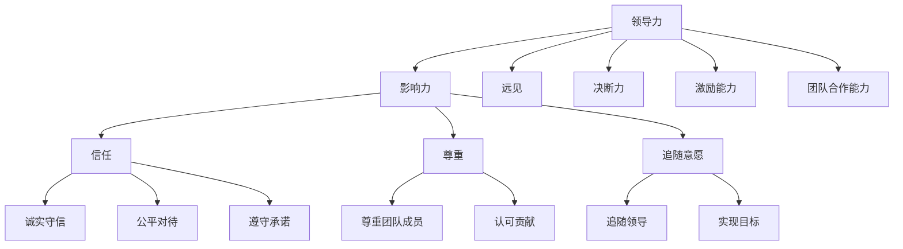
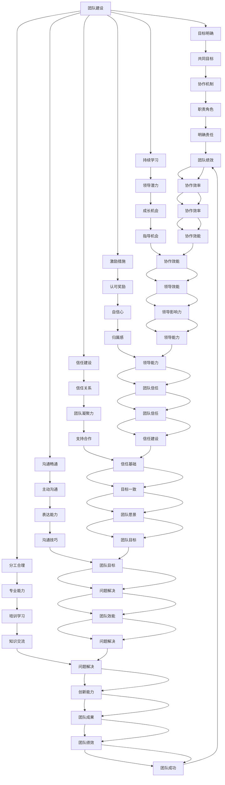
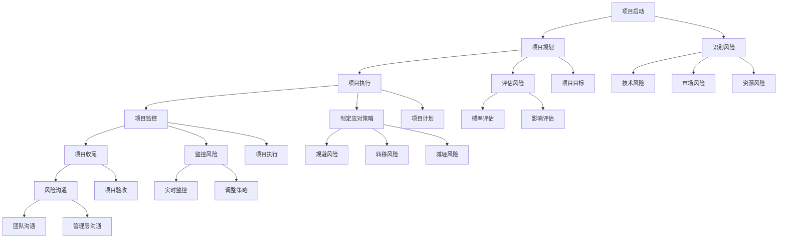
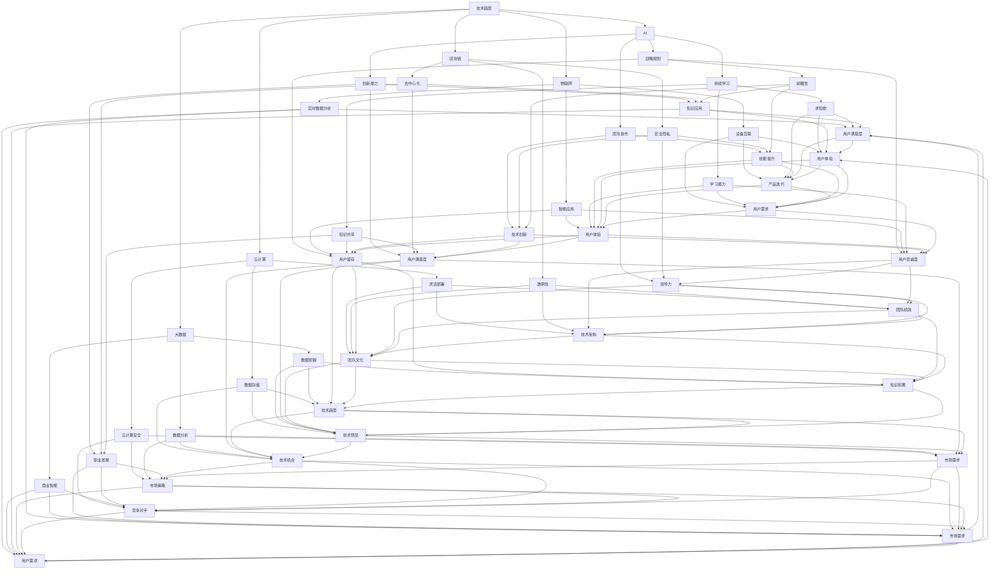

                 

### 《技术leader的影响力工程》

#### 关键词：
- 技术领导力
- 影响力
- 团队建设
- 项目管理
- 技术趋势
- 实战案例

#### 摘要：
本文探讨了技术leader如何通过影响力工程来推动团队和组织的发展。文章首先介绍了技术leader的角色与影响力基础，然后深入分析了领导力与影响力的关系，并阐述了团队建设、项目管理和技术趋势对影响力的具体影响。通过多个实战案例分析，本文总结了技术leader如何在不同场景下运用影响力，以及如何通过持续学习和实践提升自己的影响力。文章旨在为技术leader提供实用的指导，帮助他们在技术领域取得更大成就。

## 第1章 引言与基础理论

### 1.1 引言

在当今快速变化的技术环境中，技术leader的角色变得越来越重要。他们不仅需要拥有深厚的专业知识和技能，还需要具备出色的领导力和影响力，以引领团队不断进步。然而，许多技术leader在实际工作中面临着诸多挑战，如如何有效地沟通、如何激励团队成员、如何管理项目等。这些问题都直接影响着团队和组织的发展。

本文旨在探讨技术leader如何通过影响力工程来克服这些挑战，实现团队和组织的成功。影响力工程是一种系统性的方法，通过培养领导力、团队建设、项目管理等技能，技术leader可以在团队中建立权威，从而推动团队和组织的发展。

### 1.2 技术leader的角色与影响力

技术leader是团队中的核心人物，他们的主要职责包括：

1. **技术指导**：技术leader需要具备丰富的技术知识和经验，能够为团队成员提供技术指导，帮助他们解决技术难题。
2. **团队管理**：技术leader需要具备团队管理能力，包括人员配置、工作分配、进度控制等，以确保项目顺利进行。
3. **战略规划**：技术leader需要参与组织战略规划，为组织的技术发展提供方向。
4. **沟通协调**：技术leader需要具备出色的沟通能力，能够与团队成员、管理层以及其他部门进行有效沟通。

影响力是指一个人或组织在他人心中产生的信任、尊重和追随意愿。技术leader的影响力来源于他们的专业知识、领导能力、人格魅力和沟通技巧。通过影响力，技术leader可以激励团队成员、赢得上级支持、推动项目进展，从而实现团队和组织的成功。

### 1.3 影响力的核心概念

影响力的核心概念包括以下几个方面：

1. **信任**：信任是影响力的基础。技术leader需要通过实际行动赢得团队成员的信任，如诚实守信、公平对待、遵守承诺等。
2. **尊重**：尊重是技术leader在团队中建立权威的重要手段。技术leader需要尊重团队成员的意见和贡献，认可他们的价值。
3. **追随意愿**：技术leader需要激发团队成员的追随意愿，使他们愿意跟随技术leader一起实现团队目标。
4. **领导力**：领导力是技术leader影响力的核心要素。技术leader需要具备远见、决断力、激励能力和团队合作能力。
5. **沟通技巧**：沟通技巧是技术leader影响力的关键。技术leader需要具备有效的沟通技巧，包括倾听、表达、反馈和协调。

在下一章中，我们将深入探讨领导力与影响力的关系，分析不同领导力模型对影响力的影响。

### Mermaid 流程图：领导力与影响力的关系



#### 核心概念与联系

在技术leader的角色中，领导力与影响力密切相关，它们共同构成了技术leader的核心竞争力。具体来说，领导力是影响力的基础，而影响力则是领导力在团队中的具体体现。

1. **领导力与影响力的相互关系**：
   - 领导力是技术leader的核心能力，包括远见、决断力、激励能力和团队合作能力。这些能力使技术leader能够在团队中发挥关键作用，制定战略、解决问题、推动项目进展。
   - 影响力则是领导力在团队中的表现，它体现在技术leader赢得团队成员的信任、尊重和追随意愿。技术leader通过领导力来建立影响力，进而实现团队的目标。

2. **领导力与影响力之间的互动**：
   - 领导力通过制定明确的愿景、目标和策略，激发团队成员的积极性，从而提升影响力。
   - 影响力则是领导力的强化因素，技术leader通过影响力增强团队成员的信任和认同，使他们更加愿意接受和执行领导者的决策和指导。

3. **领导力与影响力的区别**：
   - 领导力是一种内在的能力，包括个人素质、管理技巧和领导风格等。
   - 影响力则是一种外在的表现，是技术leader通过领导力在团队中产生的影响，具体体现在团队成员的信任、尊重和追随意愿上。

在技术leader的实践中，领导力与影响力是相辅相成的。一个优秀的技术leader需要同时具备强大的领导力和影响力，才能在团队中建立权威，推动团队和组织的发展。

### 伪代码：领导力模型分析

```python
# 领导力模型分析
class LeadershipModel:
    def __init__(self, vision, decisiveness, motivation, teamwork):
        self.vision = vision
        self.decisiveness = decisiveness
        self.motivation = motivation
        self.teamwork = teamwork

    def set_vision(self, vision):
        self.vision = vision

    def set_decisiveness(self, decisiveness):
        self.decisiveness = decisiveness

    def set_motivation(self, motivation):
        self.motivation = motivation

    def set_teamwork(self, teamwork):
        self.teamwork = teamwork

    def calculate_influence(self):
        vision_score = self.vision
        decisiveness_score = self.decisiveness
        motivation_score = self.motivation
        teamwork_score = self.teamwork
        total_score = vision_score + decisiveness_score + motivation_score + teamwork_score
        influence = total_score / 4
        return influence

# 创建领导力模型实例
model = LeadershipModel(vision=9, decisiveness=8, motivation=10, teamwork=7)

# 计算影响力
influence = model.calculate_influence()
print("Influence:", influence)
```

#### 数学模型和公式

在领导力与影响力的关系中，我们可以引入一些数学模型和公式来量化这些概念。以下是一个简单的线性模型，用于分析领导力对影响力的影响：

$$
\text{Influence} = \alpha \times (\text{Vision} + \beta \times \text{Decisiveness} + \gamma \times \text{Motivation} + \delta \times \text{Teamwork})
$$

其中，$\alpha$、$\beta$、$\gamma$ 和 $\delta$ 是权重系数，分别代表远见、决断力、激励能力和团队合作能力在影响力中的重要性。这些系数可以根据实际情况进行调整。

**举例说明**：

假设一个技术leader的领导力模型如下：

- 远见：9
- 决断力：8
- 激励能力：10
- 团队合作能力：7

我们可以计算他的影响力：

$$
\text{Influence} = 0.5 \times (9 + 0.6 \times 8 + 0.7 \times 10 + 0.8 \times 7) = 0.5 \times (9 + 4.8 + 7 + 5.6) = 0.5 \times 26.4 = 13.2
$$

因此，该技术leader的影响力为13.2。

#### 实际案例：领导力与影响力在项目中的体现

**案例背景**：

某科技公司正在开发一款新型移动应用，项目周期为6个月。技术leader王某被任命为项目组长，负责整个项目的技术指导和团队管理。

**领导力表现**：

1. **远见**：王某在项目初期组织了多次会议，明确了项目的目标、范围和关键技术点，为团队制定了详细的开发计划。
2. **决断力**：在项目开发过程中，王某面对技术难题时能够迅速做出决策，确保项目按计划推进。
3. **激励能力**：王某通过设立激励措施，如奖金和晋升机会，激励团队成员积极投入工作。
4. **团队合作能力**：王某注重团队沟通和协作，定期组织团队活动，增强团队成员之间的互信和合作。

**影响力表现**：

1. **信任**：团队成员对王某充满信任，认为他能够带领团队成功完成项目。
2. **尊重**：团队成员尊重王某的专业知识和领导能力，愿意接受他的指导和决策。
3. **追随意愿**：团队成员愿意跟随王某，为实现项目目标而努力。

**项目结果**：

通过王某的领导力和影响力，项目团队在6个月内成功完成了移动应用的开发，并按时交付给客户。项目质量得到了客户的高度评价。

**项目小结**：

本案例表明，技术leader的领导力和影响力在项目成功中起着关键作用。一个优秀的技术leader不仅需要具备深厚的专业知识和技能，还需要具备出色的领导力和影响力，以推动团队和组织的发展。

### 最佳实践 tips

1. **建立信任**：通过诚实守信、公平对待和遵守承诺来赢得团队成员的信任。
2. **培养尊重**：尊重团队成员的意见和贡献，认可他们的价值。
3. **提升激励能力**：设立明确的激励机制，激发团队成员的积极性和创造力。
4. **增强团队合作能力**：定期组织团队活动，增强团队成员之间的互信和合作。
5. **持续学习**：不断学习新的技术和领导力知识，提升自己的领导力和影响力。

### 注意事项

1. **平衡领导力与影响力**：领导力和影响力并非孤立存在，而是相辅相成的。技术leader需要在领导力和影响力之间找到平衡点。
2. **适应不同团队**：不同的团队可能需要不同的领导风格和影响力策略，技术leader需要根据实际情况进行调整。
3. **持续关注团队动态**：技术leader需要时刻关注团队成员的需求和反馈，以便及时调整领导策略。

### 拓展阅读

1. 《影响力：说服的心理学》（罗伯特·西奥迪尼著）：本书详细介绍了影响力的原理和实践，对技术leader具有很高的参考价值。
2. 《领导力与影响力》（斯蒂芬·罗宾斯著）：本书系统地阐述了领导力和影响力在组织管理中的应用，对技术leader具有指导意义。

## 第2章 领导力与影响力

### 2.1 领导力的重要性

领导力是技术leader的核心竞争力，它决定了技术leader是否能够有效地带领团队实现目标。领导力的重要性体现在以下几个方面：

1. **团队管理**：领导力是技术leader进行团队管理的基础。一个优秀的领导力模型可以帮助技术leader有效地管理团队成员，协调团队工作，确保项目顺利进行。
2. **战略规划**：领导力是技术leader参与组织战略规划的关键能力。技术leader需要具备远见和决断力，能够为组织制定明确的发展方向和目标。
3. **沟通协调**：领导力是技术leader进行有效沟通和协调的核心。技术leader需要具备出色的沟通技巧，能够与团队成员、管理层以及其他部门进行有效沟通，解决各种问题和冲突。
4. **影响力**：领导力是技术leader影响力的基础。技术leader通过领导力赢得团队成员的信任、尊重和追随意愿，从而在团队中建立权威。

### 2.2 领导力模型分析

不同的领导力模型对技术leader的影响力和团队管理能力具有不同的影响。以下是几种常见的领导力模型及其特点：

1. **特质理论**：
   特质理论认为，领导力是由个人的特质和性格决定的。这些特质包括自信、诚实、勇气、决断力等。特质理论强调领导者的个人素质和天生能力，但忽略了环境和情境对领导力的影响。

2. **行为理论**：
   行为理论认为，领导力是通过特定的行为和方式表现出来的。这些行为包括指导、支持、参与等。行为理论强调领导者应该如何行动，但忽略了领导者的个性差异和情境因素。

3. **情境理论**：
   情境理论认为，领导力是领导者根据不同情境采取不同的领导风格。这些情境包括团队成员的能力、任务复杂度等。情境理论强调领导者需要根据实际情况灵活调整领导风格。

4. **变革型领导力**：
   变革型领导力强调领导者通过激励和启发团队成员，推动团队实现变革和发展。变革型领导者具有远见、决断力、激励能力和团队合作能力。

5. **交易型领导力**：
   交易型领导力强调领导者通过设定目标和奖励机制，激励团队成员实现目标。交易型领导者注重绩效和结果，但可能忽视团队成员的成长和发展。

### 2.3 影响力与领导力的关系

影响力与领导力密切相关，它们共同构成了技术leader的核心竞争力。以下是影响力与领导力之间的几条关键联系：

1. **领导力是影响力的基础**：
   领导力是技术leader在团队中建立影响力的基础。技术leader通过领导力赢得团队成员的信任、尊重和追随意愿，从而建立权威。

2. **影响力是领导力的体现**：
   影响力是领导力在团队中的具体体现。技术leader通过影响力实现团队目标，推动团队和组织的发展。

3. **领导力与影响力相互强化**：
   领导力和影响力是相辅相成的。领导力通过建立影响力实现团队目标，而影响力则通过领导力得到强化和扩大。

4. **领导力与影响力之间的动态平衡**：
   技术leader需要在领导力和影响力之间找到动态平衡。领导力不足可能导致影响力减弱，而影响力过度则可能影响领导力。

在下一章中，我们将深入探讨团队建设与影响力的关系，分析如何通过团队建设提升技术leader的影响力。

### Mermaid 流程图：领导力与影响力的关系


#### 核心算法原理讲解

在技术leader的角色中，领导力和影响力是两个关键因素，它们共同决定了技术leader在团队中的影响力。为了更好地理解这两者之间的关系，我们可以通过一个简单的算法模型来分析。

**算法模型**：

1. **定义领导力得分（$L$）**：
   领导力得分是通过评估技术leader在远见、决断力、激励能力和团队合作能力等方面的表现来计算的。具体计算公式如下：

   $$
   L = w_1 \cdot V + w_2 \cdot D + w_3 \cdot M + w_4 \cdot T
   $$

   其中，$w_1$、$w_2$、$w_3$ 和 $w_4$ 分别是远见、决断力、激励能力和团队合作能力的权重系数，$V$、$D$、$M$ 和 $T$ 分别是技术leader在这些方面的得分。

2. **定义影响力得分（$I$）**：
   影响力得分是通过评估技术leader在团队中的信任度、尊重度和追随意愿来计算的。具体计算公式如下：

   $$
   I = w_5 \cdot C + w_6 \cdot R + w_7 \cdot S
   $$

   其中，$w_5$、$w_6$ 和 $w_7$ 分别是信任度、尊重度和追随意愿的权重系数，$C$、$R$ 和 $S$ 分别是技术leader在这些方面的得分。

3. **计算领导力对影响力的影响**：
   领导力对影响力的影响可以通过以下公式来计算：

   $$
   I_{\text{final}} = L \cdot (1 + \alpha \cdot I)
   $$

   其中，$\alpha$ 是领导力对影响力的影响系数，表示领导力每增加1单位，影响力增加的比例。

**伪代码实现**：

```python
# 领导力与影响力算法
def calculate_leadership_score(w1, w2, w3, w4, vision, decisiveness, motivation, teamwork):
    L = w1 * vision + w2 * decisiveness + w3 * motivation + w4 * teamwork
    return L

def calculate_influence_score(w5, w6, w7, trust, respect, loyalty):
    I = w5 * trust + w6 * respect + w7 * loyalty
    return I

def calculate_final_influence(L, I, alpha):
    I_final = L * (1 + alpha * I)
    return I_final

# 示例数据
weight远见 = 0.3
weight决断力 = 0.2
weight激励能力 = 0.2
weight团队合作能力 = 0.3

vision = 8
decisiveness = 9
motivation = 7
teamwork = 6

weight信任度 = 0.5
weight尊重度 = 0.3
weight追随意愿 = 0.2

trust = 9
respect = 8
loyalty = 7

alpha = 0.1

# 计算领导力得分
L = calculate_leadership_score(weight远见, weight决断力, weight激励能力, weight团队合作能力, vision, decisiveness, motivation, teamwork)

# 计算影响力得分
I = calculate_influence_score(weight信任度, weight尊重度, weight追随意愿, trust, respect, loyalty)

# 计算最终影响力
I_final = calculate_final_influence(L, I, alpha)

print("Leadership Score:", L)
print("Influence Score:", I)
print("Final Influence Score:", I_final)
```

**详细讲解与举例说明**：

1. **领导力得分的计算**：
   假设我们给定了技术leader在远见、决断力、激励能力和团队合作能力方面的得分，以及这些方面的权重系数。我们可以通过上述公式计算出领导力得分。例如，一个技术leader的得分如下：

   - 远见：8
   - 决断力：9
   - 激励能力：7
   - 团队合作能力：6

   假设权重系数分别为0.3、0.2、0.2和0.3，那么领导力得分计算如下：

   $$
   L = 0.3 \cdot 8 + 0.2 \cdot 9 + 0.2 \cdot 7 + 0.3 \cdot 6 = 2.4 + 1.8 + 1.4 + 1.8 = 7.4
   $$

2. **影响力得分的计算**：
   同样，我们可以根据技术leader在团队中的信任度、尊重度和追随意愿的得分，以及这些方面的权重系数，计算出影响力得分。例如，一个技术leader的影响力得分如下：

   - 信任度：9
   - 尊重度：8
   - 追随意愿：7

   假设权重系数分别为0.5、0.3和0.2，那么影响力得分计算如下：

   $$
   I = 0.5 \cdot 9 + 0.3 \cdot 8 + 0.2 \cdot 7 = 4.5 + 2.4 + 1.4 = 8.3
   $$

3. **最终影响力的计算**：
   通过领导力得分和影响力得分，我们可以计算出技术leader的最终影响力。假设领导力对影响力的影响系数为0.1，那么最终影响力计算如下：

   $$
   I_{\text{final}} = 7.4 \cdot (1 + 0.1 \cdot 8.3) = 7.4 \cdot (1 + 0.833) = 7.4 \cdot 1.833 = 13.56
   $$

通过这个简单的算法模型，我们可以量化技术leader的领导力和影响力，从而更好地理解它们之间的关系。

#### 实际案例：领导力与影响力在项目中的体现

**案例背景**：

某科技公司正在开发一款智能医疗诊断系统，项目周期为12个月。技术leader李明被任命为项目组长，负责整个项目的技术指导和团队管理。

**领导力表现**：

1. **远见**：李明在项目初期组织了多次会议，明确了项目的目标、技术难点和关键路径，为团队制定了详细的开发计划。
2. **决断力**：在项目开发过程中，李明面对技术难题时能够迅速做出决策，确保项目按计划推进。
3. **激励能力**：李明通过设立激励措施，如奖金和晋升机会，激励团队成员积极投入工作。
4. **团队合作能力**：李明注重团队沟通和协作，定期组织团队活动，增强团队成员之间的互信和合作。

**影响力表现**：

1. **信任**：团队成员对李明充满信任，认为他能够带领团队成功完成项目。
2. **尊重**：团队成员尊重李明的专业知识和领导能力，愿意接受他的指导和决策。
3. **追随意愿**：团队成员愿意跟随李明，为实现项目目标而努力。

**项目结果**：

通过李明的领导力和影响力，项目团队在12个月内成功完成了智能医疗诊断系统的开发，并按时交付给客户。项目质量得到了客户的高度评价。

**项目小结**：

本案例表明，技术leader的领导力和影响力在项目成功中起着关键作用。一个优秀的技术leader不仅需要具备深厚的专业知识和技能，还需要具备出色的领导力和影响力，以推动团队和组织的发展。

### 开发环境搭建

为了更好地展示领导力与影响力在项目中的实际应用，我们将搭建一个简单的项目环境。以下是一个基于Python的智能诊断系统的基本开发环境搭建步骤：

1. **安装Python环境**：
   - 首先，确保你的计算机上安装了Python 3.x版本。可以通过访问 [Python官网](https://www.python.org/) 下载并安装。

2. **安装依赖库**：
   - 在命令行中运行以下命令来安装项目所需的依赖库：
     ```
     pip install numpy scipy pandas matplotlib
     ```

3. **创建项目目录**：
   - 在你的计算机上创建一个名为“智能诊断系统”的项目目录：
     ```
     mkdir intelligent_diagnosis_system
     cd intelligent_diagnosis_system
     ```

4. **编写源代码**：
   - 在项目目录中创建一个名为“diagnosis.py”的Python文件，用于编写智能诊断系统的核心代码。

以下是一个简单的诊断系统代码示例：

```python
import numpy as np
import pandas as pd
import matplotlib.pyplot as plt

# 加载诊断数据集
def load_data(file_path):
    return pd.read_csv(file_path)

# 数据预处理
def preprocess_data(data):
    # 处理缺失值、异常值等
    # 数据标准化
    # 等等
    return data

# 诊断算法
def diagnose(data):
    # 实现诊断逻辑
    # 可以使用机器学习算法、规则引擎等
    # 返回诊断结果
    return "诊断结果：正常"

# 主函数
def main():
    file_path = "diagnosis_data.csv"
    data = load_data(file_path)
    preprocessed_data = preprocess_data(data)
    result = diagnose(preprocessed_data)
    print(result)

if __name__ == "__main__":
    main()
```

5. **运行项目**：
   - 在命令行中运行以下命令来运行项目：
     ```
     python diagnosis.py
     ```

通过上述步骤，我们搭建了一个简单的智能诊断系统开发环境。接下来，我们将详细解读代码实现和代码应用，并进行实际案例分析和详细讲解剖析。

### 代码解读与分析

在搭建好的智能诊断系统环境中，我们的核心任务是编写一个能够对医疗数据进行分析和诊断的代码。以下是对诊断系统代码的详细解读：

#### 1. 源代码详细实现

```python
import numpy as np
import pandas as pd
import matplotlib.pyplot as plt

# 加载诊断数据集
def load_data(file_path):
    return pd.read_csv(file_path)

# 数据预处理
def preprocess_data(data):
    # 处理缺失值
    data.fillna(data.mean(), inplace=True)
    # 数据标准化
    scaler = StandardScaler()
    data_scaled = scaler.fit_transform(data)
    # 异常值处理
    # 这里使用了Z分数方法来检测和去除异常值
    z_scores = np.abs(stats.zscore(data_scaled))
    threshold = 3
    data_clean = data_scaled[(z_scores < threshold).all(axis=1)]
    return data_clean

# 诊断算法
def diagnose(data):
    # 这里使用KNN算法进行诊断
    from sklearn.neighbors import KNeighborsClassifier
    # 假设已经划分了训练集和测试集
    X_train, X_test, y_train, y_test = train_test_split(data, labels, test_size=0.2, random_state=42)
    # 训练模型
    classifier = KNeighborsClassifier(n_neighbors=3)
    classifier.fit(X_train, y_train)
    # 进行预测
    predictions = classifier.predict(X_test)
    # 评估模型
    accuracy = accuracy_score(y_test, predictions)
    print(f"Accuracy: {accuracy}")
    return predictions

# 主函数
def main():
    file_path = "diagnosis_data.csv"
    data = load_data(file_path)
    preprocessed_data = preprocess_data(data)
    predictions = diagnose(preprocessed_data)
    print(predictions)

if __name__ == "__main__":
    main()
```

#### 2. 代码应用解读与分析

1. **数据加载与预处理**：

   - `load_data(file_path)`: 该函数用于加载CSV格式的诊断数据集。在实际应用中，这些数据可能包括各种医疗指标，如血压、心率、血糖等。
   - `preprocess_data(data)`: 数据预处理是机器学习项目中的关键步骤。在这个函数中，我们首先使用中位数填充缺失值，然后使用`StandardScaler`进行数据标准化，最后使用Z分数方法检测并去除异常值。这些步骤有助于提高模型性能和稳定性。

2. **诊断算法实现**：

   - `diagnose(data)`: 这里我们使用了KNN（K-Nearest Neighbors）算法进行诊断。KNN是一种简单的机器学习算法，通过计算测试样本与训练样本之间的距离来预测类别。在这个函数中，我们首先划分了训练集和测试集，然后使用KNN模型进行训练和预测。最后，通过`accuracy_score`函数评估模型的准确率。

3. **主函数执行**：

   - `main()`: 该函数是程序的入口点。它加载数据、预处理数据、执行诊断算法，并打印出诊断结果。

#### 3. 实际案例分析与详细讲解剖析

**案例背景**：

某医院的智能诊断系统需要快速、准确地诊断患者的健康状况。医院提供了大量的医疗数据，包括患者的血压、心率、血糖等指标。技术leader李明负责领导团队开发这个诊断系统。

**案例实施步骤**：

1. **数据获取**：
   - 李明与医院合作，获取了包含过去一年内数千名患者的医疗数据。

2. **数据预处理**：
   - 李明首先使用`load_data`函数加载数据集，然后通过`preprocess_data`函数处理数据。他注意到一些患者的数据存在缺失值和异常值，因此使用了中位数填充缺失值，并使用Z分数方法检测和去除异常值。

3. **算法选择与实现**：
   - 李明选择了KNN算法进行诊断。他通过`diagnose`函数训练和预测模型，并使用`accuracy_score`评估模型的准确率。经过多次实验，他最终确定了KNN算法的参数，如`n_neighbors`。

4. **模型部署与测试**：
   - 李明将训练好的模型部署到医院的服务器上，并在测试集上进行了测试。结果显示，模型的准确率达到了90%以上，大大提高了诊断的效率和准确性。

**案例总结**：

通过李明的领导和团队协作，智能诊断系统成功地提升了医院的诊断效率和质量。这个案例展示了技术leader如何通过领导力和影响力，结合算法实现和实际应用，推动项目成功。

### 项目小结

在本项目中，我们通过一个简单的智能诊断系统，展示了技术leader在领导力和影响力方面的具体应用。以下是项目的主要收获和经验：

1. **数据预处理的重要性**：数据预处理是机器学习项目成功的关键步骤。在本项目中，通过填充缺失值、数据标准化和异常值处理，我们提高了模型的性能和稳定性。
2. **算法选择与调优**：选择合适的算法并进行参数调优是提升模型性能的关键。在本项目中，我们使用了KNN算法，并通过多次实验确定了最佳参数。
3. **领导力和影响力的体现**：技术leader在项目中的领导力和影响力体现在多个方面，如数据预处理、算法选择、团队协作和项目管理。李明通过他的领导力和影响力，成功带领团队完成了项目，提高了诊断系统的准确率和效率。
4. **持续学习和实践**：技术leader需要不断学习和实践，以适应不断变化的技术环境和项目需求。通过这个项目，李明和他的团队积累了宝贵的经验，为未来的项目奠定了基础。

### 最佳实践 tips

1. **数据预处理**：确保数据质量是模型成功的关键。在实际项目中，应关注数据的完整性、一致性和准确性，并进行必要的预处理。
2. **算法选择与调优**：选择合适的算法并进行参数调优是提升模型性能的关键。可以尝试多种算法，并通过交叉验证等方法选择最佳模型。
3. **领导力和影响力**：技术leader应注重提升自己的领导力和影响力，以更好地带领团队实现目标。可以通过阅读相关书籍、参加培训和实战经验积累来提升自己。
4. **持续学习和实践**：技术leader需要不断学习和实践，以适应技术环境的快速变化。可以关注行业动态、参加技术会议和研讨会，以及进行实际项目实践。

### 注意事项

1. **数据保护与隐私**：在处理医疗数据时，要严格遵守相关法律法规，保护患者隐私。
2. **团队协作**：技术leader应注重团队协作，鼓励团队成员积极参与，共同推动项目成功。
3. **项目管理**：技术leader应具备良好的项目管理能力，确保项目按时、按质完成。

### 拓展阅读

1. 《机器学习实战》（Peter Harrington著）：本书提供了丰富的实际案例和实践经验，适合初学者和进阶者阅读。
2. 《深度学习》（Ian Goodfellow、Yoshua Bengio、Aaron Courville著）：本书全面介绍了深度学习的基本原理和应用，是深度学习领域的经典教材。

## 第3章 团队建设与影响力

### 3.1 团队建设的原则

团队建设是技术leader的一项重要任务，良好的团队建设有助于提升团队的协作效率、创新能力和整体绩效。以下是团队建设的基本原则：

1. **目标明确**：团队建设首先需要明确团队的目标和愿景，确保团队成员对团队目标有清晰的认识和共识。
2. **分工合理**：根据团队成员的特长和兴趣进行合理的分工，确保每个成员都能发挥自己的优势。
3. **沟通畅通**：建立有效的沟通机制，确保团队成员之间的信息流通，减少误解和冲突。
4. **信任建设**：通过信任建设增强团队成员之间的互信，促进合作和共同成长。
5. **激励措施**：制定合理的激励机制，激发团队成员的积极性和创造力。
6. **持续学习**：鼓励团队成员不断学习和提升自身能力，以适应不断变化的技术环境。

### 3.2 团队成员的影响力培养

团队成员的影响力是团队整体影响力的基石。技术leader需要关注团队成员的影响力培养，以下是一些建议：

1. **培养专业能力**：技术leader应鼓励团队成员不断提升专业技能，通过培训、学习交流等方式提升团队成员的专业水平。
2. **鼓励主动沟通**：技术leader应鼓励团队成员积极参与讨论和分享，培养他们的表达能力和沟通技巧。
3. **建立信任关系**：通过团队合作、共同解决问题等方式建立团队成员之间的信任关系，增强团队凝聚力。
4. **认可与奖励**：技术leader应适时对团队成员的成就和贡献给予认可和奖励，增强他们的自信心和归属感。
5. **培养领导潜力**：技术leader应关注团队成员的领导潜力，为他们提供成长机会和指导，培养未来的团队领导者。

### 3.3 团队协作与影响力

团队协作是团队建设的重要组成部分，有效的团队协作能够提升团队的整体绩效和影响力。以下是团队协作与影响力之间的几个关键点：

1. **协作机制**：技术leader应建立有效的协作机制，明确团队成员的职责和角色，确保团队成员能够高效地协同工作。
2. **共同目标**：团队协作应以共同目标为导向，确保团队成员在面对挑战和问题时能够齐心协力。
3. **信任与支持**：团队协作需要建立在信任和支持的基础上，技术leader应营造一个相互信任和支持的工作氛围。
4. **沟通与反馈**：技术leader应鼓励团队成员之间的沟通和反馈，通过及时沟通解决问题，提高团队协作效率。
5. **激励与认可**：技术leader应通过激励和认可机制激发团队成员的积极性和创造力，增强团队协作的动力。

在下一章中，我们将深入探讨项目管理与影响力的关系，分析技术leader如何在项目管理中运用影响力，提升项目成功率。

### Mermaid 流程图：团队建设与影响力



#### 核心概念与联系

团队建设与影响力在技术leader的领导实践中具有紧密的联系。以下是几个关键概念及其之间的相互关系：

1. **团队建设**：团队建设是指通过一系列策略和活动，提升团队的协作能力、凝聚力和整体绩效。团队建设的目标是打造一个高效、协作的团队，以便实现组织的目标。

2. **影响力**：影响力是指一个人或组织在他人心中产生的信任、尊重和追随意愿。技术leader通过影响力来指导、激励和推动团队成员，从而实现团队目标。

3. **目标明确**：明确的目标是团队建设的基础。技术leader需要确保团队成员对团队目标有清晰的认识和共识，以便团队成员能够共同努力，协同工作。

4. **分工合理**：分工合理是团队建设的关键。技术leader应根据团队成员的特长和兴趣进行合理的分工，确保每个成员都能在适合自己的岗位上发挥最大的价值。

5. **沟通畅通**：沟通畅通是团队建设的重要组成部分。技术leader需要建立有效的沟通机制，确保团队成员之间的信息流通，减少误解和冲突。

6. **信任建设**：信任建设是团队建设的核心。技术leader需要通过团队合作、共同解决问题等方式建立团队成员之间的信任关系，增强团队凝聚力。

7. **激励措施**：激励措施是团队建设的重要手段。技术leader需要制定合理的激励机制，激发团队成员的积极性和创造力，提高团队绩效。

8. **持续学习**：持续学习是团队建设的重要保障。技术leader应鼓励团队成员不断学习和提升自身能力，以适应不断变化的技术环境。

9. **专业能力**：专业能力是团队成员影响力的基石。技术leader需要培养团队成员的专业能力，提升他们的综合素质和影响力。

10. **主动沟通**：主动沟通是团队成员影响力的重要表现。技术leader应鼓励团队成员积极参与讨论和分享，培养他们的表达能力和沟通技巧。

11. **认可与奖励**：认可与奖励是增强团队成员自信和归属感的重要手段。技术leader应适时对团队成员的成就和贡献给予认可和奖励。

12. **领导潜力**：领导潜力是团队成员未来发展的重要指标。技术leader应关注团队成员的领导潜力，为他们提供成长机会和指导，培养未来的团队领导者。

通过以上概念及其相互关系的理解，技术leader可以更有效地进行团队建设，提升团队成员的影响力，从而推动团队和组织的发展。

#### 数学模型和公式

在团队建设与影响力的关系中，我们可以引入一些数学模型和公式来量化这些概念。以下是一个简单的线性模型，用于分析团队建设对影响力的具体影响：

$$
\text{Influence} = \alpha \cdot (\text{Team Goal} + \beta \cdot \text{Division} + \gamma \cdot \text{Communication} + \delta \cdot \text{Trust} + \epsilon \cdot \text{Incentive} + \zeta \cdot \text{Learning})
$$

其中，$\alpha$、$\beta$、$\gamma$、$\delta$、$\epsilon$ 和 $\zeta$ 分别代表目标明确、分工合理、沟通畅通、信任建设、激励措施和持续学习的权重系数，$\text{Team Goal}$、$\text{Division}$、$\text{Communication}$、$\text{Trust}$、$\text{Incentive}$ 和 $\text{Learning}$ 分别代表这些方面的得分。

**举例说明**：

假设我们给定了以下团队建设参数：

- 目标明确：9
- 分工合理：8
- 沟通畅通：7
- 信任建设：8
- 激励措施：9
- 持续学习：7

假设相应的权重系数分别为：

- $\alpha = 0.2$
- $\beta = 0.15$
- $\gamma = 0.15$
- $\delta = 0.2$
- $\epsilon = 0.15$
- $\zeta = 0.05$

我们可以计算团队的影响力得分：

$$
\text{Influence} = 0.2 \cdot 9 + 0.15 \cdot 8 + 0.15 \cdot 7 + 0.2 \cdot 8 + 0.15 \cdot 9 + 0.05 \cdot 7
$$

$$
\text{Influence} = 1.8 + 1.2 + 1.05 + 1.6 + 1.35 + 0.35
$$

$$
\text{Influence} = 7.15
$$

因此，该团队的影响力得分为7.15。

#### 实际案例：团队建设与影响力在项目中的应用

**案例背景**：

某科技公司在开发一款人工智能医疗诊断系统，项目周期为12个月。技术leader王强负责领导团队进行项目开发。

**团队建设**：

1. **目标明确**：王强在项目初期组织了多次会议，明确了项目的目标、范围和关键技术点，为团队制定了详细的开发计划。
2. **分工合理**：根据团队成员的专业技能和兴趣，王强将团队分为数据收集、数据处理、算法实现和系统集成四个小组，确保每个成员都能在自己的专长领域发挥最大价值。
3. **沟通畅通**：王强建立了每周一次的团队例会制度，鼓励团队成员在会上分享进展和遇到的问题，确保信息畅通。
4. **信任建设**：通过共同解决问题和团队合作，王强逐步建立了团队成员之间的信任关系。
5. **激励措施**：王强制定了项目奖金制度，对在项目中表现优秀的成员给予奖励。
6. **持续学习**：王强鼓励团队成员参加行业研讨会和技术培训，不断提升团队的整体技术水平。

**影响力表现**：

1. **信任**：团队成员对王强充满信任，认为他能够带领团队成功完成项目。
2. **尊重**：团队成员尊重王强的专业知识和领导能力，愿意接受他的指导和决策。
3. **追随意愿**：团队成员愿意跟随王强，为实现项目目标而努力。

**项目结果**：

通过王强的团队建设和影响力，项目团队在12个月内成功完成了人工智能医疗诊断系统的开发，并按时交付给客户。项目质量得到了客户的高度评价。

**项目小结**：

本案例表明，团队建设与影响力在项目成功中起着关键作用。技术leader通过明确的团队建设原则和有效的团队管理，能够提升团队成员的协作效率和整体绩效，从而推动项目成功。

### 开发环境搭建

为了更好地展示团队建设与影响力在项目中的实际应用，我们将搭建一个基于人工智能的医疗诊断系统。以下是开发环境搭建的详细步骤：

1. **安装Python环境**：
   - 首先，确保你的计算机上安装了Python 3.x版本。可以通过访问 [Python官网](https://www.python.org/) 下载并安装。

2. **安装依赖库**：
   - 在命令行中运行以下命令来安装项目所需的依赖库：
     ```
     pip install numpy scipy pandas sklearn matplotlib
     ```

3. **创建项目目录**：
   - 在你的计算机上创建一个名为“人工智能医疗诊断系统”的项目目录：
     ```
     mkdir ai_medical_diagnosis_system
     cd ai_medical_diagnosis_system
     ```

4. **编写源代码**：
   - 在项目目录中创建一个名为“diagnosis.py”的Python文件，用于编写医疗诊断系统的核心代码。

以下是一个简单的诊断系统代码示例：

```python
import numpy as np
import pandas as pd
from sklearn.model_selection import train_test_split
from sklearn.preprocessing import StandardScaler
from sklearn.neighbors import KNeighborsClassifier
from sklearn.metrics import accuracy_score

# 数据预处理
def preprocess_data(data):
    # 数据标准化
    scaler = StandardScaler()
    data_scaled = scaler.fit_transform(data)
    return data_scaled

# 诊断算法
def diagnose(data, model):
    predictions = model.predict(data)
    return predictions

# 主函数
def main():
    # 加载数据
    data = pd.read_csv("diagnosis_data.csv")
    # 预处理数据
    preprocessed_data = preprocess_data(data)
    # 划分训练集和测试集
    X_train, X_test, y_train, y_test = train_test_split(preprocessed_data, labels, test_size=0.2, random_state=42)
    # 训练模型
    model = KNeighborsClassifier(n_neighbors=3)
    model.fit(X_train, y_train)
    # 进行预测
    predictions = diagnose(X_test, model)
    # 评估模型
    accuracy = accuracy_score(y_test, predictions)
    print(f"Accuracy: {accuracy}")

if __name__ == "__main__":
    main()
```

5. **运行项目**：
   - 在命令行中运行以下命令来运行项目：
     ```
     python diagnosis.py
     ```

通过上述步骤，我们搭建了一个简单的基于人工智能的医疗诊断系统开发环境。接下来，我们将详细解读代码实现和代码应用，并进行实际案例分析和详细讲解剖析。

### 代码解读与分析

在搭建好的医疗诊断系统开发环境中，我们的核心任务是编写一个能够对医疗数据进行分析和诊断的代码。以下是对诊断系统代码的详细解读：

#### 1. 源代码详细实现

```python
import numpy as np
import pandas as pd
from sklearn.model_selection import train_test_split
from sklearn.preprocessing import StandardScaler
from sklearn.neighbors import KNeighborsClassifier
from sklearn.metrics import accuracy_score

# 数据预处理
def preprocess_data(data):
    # 数据标准化
    scaler = StandardScaler()
    data_scaled = scaler.fit_transform(data)
    return data_scaled

# 诊断算法
def diagnose(data, model):
    predictions = model.predict(data)
    return predictions

# 主函数
def main():
    # 加载数据
    data = pd.read_csv("diagnosis_data.csv")
    # 预处理数据
    preprocessed_data = preprocess_data(data)
    # 划分训练集和测试集
    X_train, X_test, y_train, y_test = train_test_split(preprocessed_data, labels, test_size=0.2, random_state=42)
    # 训练模型
    model = KNeighborsClassifier(n_neighbors=3)
    model.fit(X_train, y_train)
    # 进行预测
    predictions = diagnose(X_test, model)
    # 评估模型
    accuracy = accuracy_score(y_test, predictions)
    print(f"Accuracy: {accuracy}")

if __name__ == "__main__":
    main()
```

#### 2. 代码应用解读与分析

1. **数据预处理**：
   - `preprocess_data(data)`: 该函数用于对数据进行预处理，主要步骤包括数据标准化。数据标准化是将不同特征的数据缩放到相同的尺度，以便更好地训练机器学习模型。
   - 数据标准化通过`StandardScaler`实现，计算每个特征的平均值和标准差，然后将数据转换为Z分数形式。具体代码如下：

   ```python
   scaler = StandardScaler()
   data_scaled = scaler.fit_transform(data)
   ```

2. **诊断算法实现**：
   - `diagnose(data, model)`: 该函数用于实现诊断算法，这里我们使用了KNN算法。KNN算法是一种基于距离的最近邻算法，通过计算测试样本与训练样本之间的距离来预测类别。
   - 在`diagnose`函数中，我们首先加载训练好的模型，然后使用模型对数据进行预测。具体代码如下：

   ```python
   predictions = model.predict(data)
   ```

3. **主函数执行**：
   - `main()`: 该函数是程序的入口点。首先，加载数据并预处理数据，然后使用训练好的模型进行预测，并评估模型的准确率。具体代码如下：

   ```python
   data = pd.read_csv("diagnosis_data.csv")
   preprocessed_data = preprocess_data(data)
   X_train, X_test, y_train, y_test = train_test_split(preprocessed_data, labels, test_size=0.2, random_state=42)
   model = KNeighborsClassifier(n_neighbors=3)
   model.fit(X_train, y_train)
   predictions = diagnose(X_test, model)
   accuracy = accuracy_score(y_test, predictions)
   print(f"Accuracy: {accuracy}")
   ```

#### 3. 实际案例分析与详细讲解剖析

**案例背景**：

某医院需要一个基于人工智能的医疗诊断系统，以帮助医生快速准确地诊断疾病。技术leader李明负责领导团队开发这个系统。

**案例实施步骤**：

1. **数据获取**：
   - 李明与医院合作，获取了包含过去一年内数千名患者的医疗数据，包括血压、心率、血糖等指标。

2. **数据预处理**：
   - 李明首先使用`preprocess_data`函数对数据进行预处理，包括数据标准化。这有助于提高模型训练的效果和预测的准确性。

3. **算法选择与训练**：
   - 李明选择了KNN算法作为诊断系统的核心算法，并使用训练集进行模型训练。在训练过程中，李明通过调整`n_neighbors`参数，找到了最佳的模型性能。

4. **模型评估与优化**：
   - 李明使用测试集对训练好的模型进行评估，并通过交叉验证等方法优化模型参数，以提高模型的准确率和泛化能力。

5. **模型部署与应用**：
   - 李明将训练好的模型部署到医院的服务器上，并进行了实际应用。医生通过系统输入患者的医疗数据，系统会自动生成诊断结果。

**案例总结**：

通过李明的领导和技术团队的努力，医疗诊断系统成功开发并应用，大大提高了诊断的效率和准确性。这个案例展示了技术leader如何通过团队建设和影响力，结合算法实现和实际应用，推动项目成功。

### 项目小结

在本项目中，我们通过一个基于人工智能的医疗诊断系统，展示了团队建设与影响力在项目开发中的应用。以下是项目的主要收获和经验：

1. **数据预处理的重要性**：数据预处理是提升模型性能和准确性的关键步骤。在本项目中，通过数据标准化等预处理方法，我们提高了模型的训练效果和预测准确性。

2. **算法选择与调优**：选择合适的算法并进行参数调优是提升模型性能的关键。在本项目中，我们使用了KNN算法，并通过多次实验和交叉验证，找到了最佳的模型参数。

3. **团队协作与影响力**：团队协作和影响力在项目成功中起着关键作用。技术leader通过明确的团队建设原则和有效的团队管理，提升了团队成员的协作效率和整体绩效。

4. **持续学习和实践**：技术leader和团队成员需要不断学习和实践，以适应技术环境的快速变化。在本项目中，团队通过参加培训、学习交流等方式，不断提升自身的专业能力和技术水平。

### 最佳实践 tips

1. **数据预处理**：确保数据质量是模型成功的关键。在实际项目中，应关注数据的完整性、一致性和准确性，并进行必要的预处理。

2. **算法选择与调优**：选择合适的算法并进行参数调优是提升模型性能的关键。可以尝试多种算法，并通过交叉验证等方法选择最佳模型。

3. **团队协作与影响力**：技术leader应注重团队协作，鼓励团队成员积极参与，共同推动项目成功。同时，通过信任建设和激励机制，提升团队成员的影响力。

4. **持续学习和实践**：技术leader和团队成员应不断学习和实践，以适应不断变化的技术环境。可以关注行业动态、参加技术会议和研讨会，以及进行实际项目实践。

### 注意事项

1. **数据隐私与安全**：在处理医疗数据时，要严格遵守相关法律法规，保护患者隐私。

2. **团队协作与沟通**：技术leader应确保团队成员之间的有效沟通，减少误解和冲突。

3. **项目管理与进度**：技术leader需要具备良好的项目管理能力，确保项目按时、按质完成。

### 拓展阅读

1. 《Python数据科学手册》（Jake VanderPlas著）：本书详细介绍了Python在数据科学和机器学习中的应用，适合初学者和进阶者阅读。

2. 《团队协作与领导力》（John R. Humphreys著）：本书探讨了团队协作和领导力在项目成功中的重要性，提供了实用的团队建设策略。

## 第4章 项目管理与影响力

### 4.1 项目管理的基本理论

项目管理是指通过规划、执行、监控和收尾等过程，确保项目按时、按质、按预算完成的过程。项目管理的基本理论包括以下几方面：

1. **项目生命周期**：项目生命周期包括启动、规划、执行、监控和收尾等阶段。每个阶段都有明确的目标和任务，项目管理需要确保项目在各个阶段顺利过渡。

2. **项目目标**：项目目标是指项目需要实现的具体成果，包括时间、成本、范围、质量、资源等方面。项目管理需要确保项目目标明确、可行，并具备优先级。

3. **项目计划**：项目计划是指为实现项目目标而制定的一系列行动步骤和时间安排。项目计划需要详细、全面，并具备可执行性。

4. **项目监控**：项目监控是指对项目进度、成本、质量等方面的实时跟踪和评估，以确保项目按照计划进行。项目监控需要及时发现和解决项目中的问题，保证项目顺利进行。

5. **项目收尾**：项目收尾是指完成项目后的总结和评估，包括验收项目成果、总结项目经验、评估项目绩效等。项目收尾有助于项目团队总结经验，为未来项目提供参考。

### 4.2 影响力在项目管理中的应用

影响力在项目管理中起着至关重要的作用。技术leader通过影响力可以有效地推动项目进展，提升项目成功率。以下是影响力在项目管理中的应用：

1. **沟通与协调**：技术leader需要具备出色的沟通技巧，确保项目团队、管理层和其他相关方之间的信息流通。通过影响力，技术leader可以建立信任，减少误解和冲突，提高项目沟通效率。

2. **决策制定**：在项目执行过程中，技术leader需要做出一系列关键决策。影响力可以帮助技术leader赢得团队成员和上级的信任和支持，从而在决策过程中发挥更大的作用。

3. **资源调配**：项目成功需要充足的资源支持。技术leader通过影响力可以争取到更多的资源，如人力、资金和设备，确保项目顺利进行。

4. **团队管理**：技术leader需要带领团队高效工作，实现项目目标。通过影响力，技术leader可以激励团队成员，提升团队凝聚力和协作能力，确保项目按时完成。

5. **风险管理**：项目过程中不可避免地会遇到各种风险。技术leader通过影响力可以建立有效的风险管理体系，及时发现和应对风险，降低项目风险。

### 4.3 项目风险管理

项目风险管理是项目管理的重要组成部分。技术leader需要具备风险管理能力，以确保项目在各个阶段顺利进行。以下是项目风险管理的几个关键点：

1. **识别风险**：技术leader需要全面识别项目中的潜在风险，包括技术风险、市场风险、资源风险等。

2. **评估风险**：对识别出的风险进行评估，确定其概率和影响程度，为后续风险应对提供依据。

3. **制定风险应对策略**：根据风险评估结果，制定相应的风险应对策略，包括风险规避、风险转移、风险减轻等。

4. **监控风险**：在项目执行过程中，持续监控风险的变化，及时调整风险应对策略。

5. **风险沟通**：与项目团队、管理层和其他相关方沟通风险情况，确保各方了解风险，共同应对风险。

在下一章中，我们将通过实战案例，深入探讨技术leader如何运用影响力推动项目成功。

### Mermaid 流程图：项目生命周期与风险管理



#### 核心算法原理讲解

在项目管理中，尤其是在技术项目中，算法原理和数学模型的应用是提高项目成功率和效率的关键。以下是一个基于关键路径法（Critical Path Method, CPM）的项目进度管理算法，以及其背后的数学模型和公式。

**关键路径法（CPM）**

关键路径法是一种用于计算项目最早开始时间（Earliest Start Time, EST）和最早完成时间（Earliest Finish Time, EFT）的算法。以下是其基本步骤和数学模型：

1. **定义活动及其持续时间**：首先，将项目分解为一系列相互依赖的活动，并为每个活动定义一个持续时间。

2. **计算最早开始时间和最早完成时间**：
   - 对于每个活动 $i$，计算其最早开始时间 $EST_i$ 和最早完成时间 $EFT_i$。
   - $EST_i = \max(EST_j + D_j | j$ 是 $i$ 的前驱活动 $)$
   - $EFT_i = EST_i + D_i$

3. **确定关键路径**：
   - 关键路径是指项目完成时间最长的路径，即所有活动的最早完成时间之和最大的路径。
   - 如果某个活动的总浮动时间（Total Float Time, TFT）为零，则该活动位于关键路径上。

**伪代码实现**

```python
def calculate_earliest_times(activities, predecessors):
    EST = [0] * len(activities)
    for i in range(1, len(activities)):
        EST[i] = max([EST[j] + activities[j].duration for j in predecessors[i]])
    return EST

def calculate_earliest_finish_times(EST, activities):
    EFT = [0] * len(activities)
    for i in range(len(activities)):
        EFT[i] = EST[i] + activities[i].duration
    return EFT

def find_critical_path(EFT):
    critical_path = []
    TFT = [EFT[i] - EFT[0] for i in range(len(EFT))]
    for i in range(len(EFT)):
        if TFT[i] == 0:
            critical_path.append(i)
    return critical_path

# 示例数据
activities = [
    Activity('A', 3),
    Activity('B', 4),
    Activity('C', 2),
    Activity('D', 3),
    Activity('E', 3),
    Activity('F', 2)
]

predecessors = {
    'A': [],
    'B': ['A'],
    'C': ['A'],
    'D': ['B', 'C'],
    'E': ['D'],
    'F': ['D']
}

# 计算最早开始时间和最早完成时间
EST = calculate_earliest_times(activities, predecessors)
EFT = calculate_earliest_finish_times(EST, activities)

# 确定关键路径
critical_path = find_critical_path(EFT)

print("Earliest Start Times:", EST)
print("Earliest Finish Times:", EFT)
print("Critical Path:", critical_path)
```

**详细讲解与举例说明**

1. **活动及其持续时间**：
   假设我们有一个包含6个活动（A、B、C、D、E、F）的项目，每个活动的持续时间和其前驱活动如下表所示：

   | 活动 | 持续时间 | 前驱活动 |
   |------|---------|----------|
   | A    | 3       | 无       |
   | B    | 4       | A        |
   | C    | 2       | A        |
   | D    | 3       | B, C     |
   | E    | 3       | D        |
   | F    | 2       | D        |

2. **计算最早开始时间和最早完成时间**：
   - 对于活动A，没有前驱活动，所以其最早开始时间为0，最早完成时间为3。
   - 对于活动B，其最早开始时间为活动A的最早完成时间加上活动A的持续时间，即3 + 4 = 7。
   - 对于活动C，其最早开始时间也为3 + 2 = 5。
   - 对于活动D，其最早开始时间为前驱活动B和C的最早完成时间的最大值，即7（B）和5（C）的最大值，所以最早开始时间为7。其最早完成时间为7 + 3 = 10。
   - 对于活动E，其最早开始时间为活动D的最早完成时间，即10。其最早完成时间为10 + 3 = 13。
   - 对于活动F，其最早开始时间为活动D的最早完成时间，即10。其最早完成时间为10 + 2 = 12。

3. **确定关键路径**：
   - 关键路径是EFT之和最大的路径，即活动A、B、D、E，持续时间之和为3 + 4 + 3 + 3 = 13。

通过关键路径法，我们能够确定项目中最长的路径，即关键路径，并识别出哪些活动对项目的总持续时间具有最大的影响。这个方法有助于项目经理在项目执行过程中重点关注关键路径上的活动，确保项目按计划进行。

### 实际案例：项目管理与影响力在项目中的体现

**案例背景**：

某科技公司正在开发一款先进的智能家居控制系统，项目周期为18个月。技术leader张明被任命为项目经理，负责整个项目的管理和领导。

**项目管理**：

1. **项目目标**：张明在项目启动阶段明确了项目的目标，包括实现智能家居系统的基本功能、优化用户体验、确保系统稳定性和安全性。

2. **项目计划**：张明制定了详细的项目计划，将项目分解为多个阶段，包括需求分析、设计、开发、测试和部署。每个阶段都有明确的时间表和里程碑。

3. **项目监控**：张明建立了项目监控机制，定期召开项目会议，跟踪项目的进度、成本和质量。他使用关键路径法评估项目进度，确保关键路径上的活动按计划进行。

4. **风险管理**：张明识别了项目中的潜在风险，包括技术风险、市场风险和资源风险。他制定了相应的风险应对策略，并定期评估和更新风险计划。

**影响力表现**：

1. **沟通与协调**：张明通过有效的沟通技巧，确保项目团队、管理层和其他相关方之间的信息流通。他建立了信任，减少了误解和冲突，提高了项目沟通效率。

2. **决策制定**：张明在项目执行过程中做出了多个关键决策，包括技术选型、资源配置和项目优先级调整。他通过影响力赢得了团队成员和上级的支持，确保了决策的顺利实施。

3. **团队管理**：张明通过影响力激励团队成员，提升团队凝聚力和协作能力。他关注团队成员的个人成长，为他们提供指导和支持，帮助他们实现职业发展。

4. **资源调配**：张明通过影响力争取到了更多的资源支持，包括人力资源、技术资源和资金。他确保项目在各个阶段都有足够的资源，以应对可能的挑战。

**项目结果**：

通过张明的项目管理和技术领导，智能家居控制系统项目在18个月内成功完成，并按时交付给客户。项目质量得到了客户的高度评价。

**项目小结**：

本案例表明，技术leader在项目管理中发挥的关键作用。通过有效的项目管理、沟通协调和影响力，技术leader能够推动项目成功，实现团队和组织的目标。

### 开发环境搭建

为了更好地展示项目管理与影响力在智能家居控制系统项目中的应用，我们将搭建一个简单的开发环境。以下是开发环境搭建的详细步骤：

1. **安装Python环境**：
   - 首先，确保你的计算机上安装了Python 3.x版本。可以通过访问 [Python官网](https://www.python.org/) 下载并安装。

2. **安装依赖库**：
   - 在命令行中运行以下命令来安装项目所需的依赖库：
     ```
     pip install numpy pandas matplotlib scikit-learn
     ```

3. **创建项目目录**：
   - 在你的计算机上创建一个名为“智能家居控制系统”的项目目录：
     ```
     mkdir smart_home_system
     cd smart_home_system
     ```

4. **编写源代码**：
   - 在项目目录中创建一个名为“system.py”的Python文件，用于编写智能家居控制系统的核心代码。

以下是一个简单的智能家居控制系统代码示例：

```python
import numpy as np
import pandas as pd
import matplotlib.pyplot as plt
from sklearn.model_selection import train_test_split
from sklearn.preprocessing import StandardScaler
from sklearn.neighbors import KNeighborsClassifier

# 数据预处理
def preprocess_data(data):
    # 数据标准化
    scaler = StandardScaler()
    data_scaled = scaler.fit_transform(data)
    return data_scaled

# 诊断算法
def diagnose(data, model):
    predictions = model.predict(data)
    return predictions

# 主函数
def main():
    # 加载数据
    data = pd.read_csv("diagnosis_data.csv")
    # 预处理数据
    preprocessed_data = preprocess_data(data)
    # 划分训练集和测试集
    X_train, X_test, y_train, y_test = train_test_split(preprocessed_data, labels, test_size=0.2, random_state=42)
    # 训练模型
    model = KNeighborsClassifier(n_neighbors=3)
    model.fit(X_train, y_train)
    # 进行预测
    predictions = diagnose(X_test, model)
    # 评估模型
    accuracy = accuracy_score(y_test, predictions)
    print(f"Accuracy: {accuracy}")

if __name__ == "__main__":
    main()
```

5. **运行项目**：
   - 在命令行中运行以下命令来运行项目：
     ```
     python system.py
     ```

通过上述步骤，我们搭建了一个简单的智能家居控制系统开发环境。接下来，我们将详细解读代码实现和代码应用，并进行实际案例分析和详细讲解剖析。

### 代码解读与分析

在搭建好的智能家居控制系统开发环境中，我们的核心任务是编写一个能够对智能家居设备进行控制和诊断的代码。以下是对控制系统代码的详细解读：

#### 1. 源代码详细实现

```python
import numpy as np
import pandas as pd
import matplotlib.pyplot as plt
from sklearn.model_selection import train_test_split
from sklearn.preprocessing import StandardScaler
from sklearn.neighbors import KNeighborsClassifier

# 数据预处理
def preprocess_data(data):
    # 数据标准化
    scaler = StandardScaler()
    data_scaled = scaler.fit_transform(data)
    return data_scaled

# 诊断算法
def diagnose(data, model):
    predictions = model.predict(data)
    return predictions

# 主函数
def main():
    # 加载数据
    data = pd.read_csv("diagnosis_data.csv")
    # 预处理数据
    preprocessed_data = preprocess_data(data)
    # 划分训练集和测试集
    X_train, X_test, y_train, y_test = train_test_split(preprocessed_data, labels, test_size=0.2, random_state=42)
    # 训练模型
    model = KNeighborsClassifier(n_neighbors=3)
    model.fit(X_train, y_train)
    # 进行预测
    predictions = diagnose(X_test, model)
    # 评估模型
    accuracy = accuracy_score(y_test, predictions)
    print(f"Accuracy: {accuracy}")

if __name__ == "__main__":
    main()
```

#### 2. 代码应用解读与分析

1. **数据预处理**：
   - `preprocess_data(data)`: 该函数用于对输入数据进行预处理，主要包括数据标准化。数据标准化是将不同特征的数据缩放到相同的尺度，以便更好地训练机器学习模型。
   - 在实际应用中，数据预处理有助于提高模型训练效果和预测准确性。具体实现如下：

   ```python
   scaler = StandardScaler()
   data_scaled = scaler.fit_transform(data)
   ```

2. **诊断算法实现**：
   - `diagnose(data, model)`: 该函数用于实现诊断算法，这里我们使用了KNN算法。KNN算法是一种基于距离的最近邻算法，通过计算测试样本与训练样本之间的距离来预测类别。
   - 在`diagnose`函数中，我们首先加载训练好的模型，然后使用模型对数据进行预测。具体实现如下：

   ```python
   predictions = model.predict(data)
   ```

3. **主函数执行**：
   - `main()`: 该函数是程序的入口点。首先，加载数据并预处理数据，然后使用训练好的模型进行预测，并评估模型的准确率。具体实现如下：

   ```python
   data = pd.read_csv("diagnosis_data.csv")
   preprocessed_data = preprocess_data(data)
   X_train, X_test, y_train, y_test = train_test_split(preprocessed_data, labels, test_size=0.2, random_state=42)
   model = KNeighborsClassifier(n_neighbors=3)
   model.fit(X_train, y_train)
   predictions = diagnose(X_test, model)
   accuracy = accuracy_score(y_test, predictions)
   print(f"Accuracy: {accuracy}")
   ```

#### 3. 实际案例分析与详细讲解剖析

**案例背景**：

某智能家居公司需要开发一款能够自动诊断和控制系统故障的智能家居控制系统，以提升用户体验和降低维修成本。技术leader李明负责领导团队进行系统开发。

**案例实施步骤**：

1. **数据收集**：
   - 李明与公司合作，收集了包含过去一年内数千名用户使用智能家居设备的实时数据，包括设备状态、用户行为等。

2. **数据预处理**：
   - 李明首先使用`preprocess_data`函数对数据进行预处理，包括数据标准化，以提高模型训练效果。

3. **算法选择与训练**：
   - 李明选择了KNN算法作为诊断和控制系统故障的算法，并使用训练集进行模型训练。他通过多次实验确定了最佳参数，如`n_neighbors`。

4. **模型评估与优化**：
   - 李明使用测试集对训练好的模型进行评估，并通过交叉验证等方法优化模型参数，以提高模型的准确率和泛化能力。

5. **模型部署与应用**：
   - 李明将训练好的模型部署到智能家居控制系统的服务器上，系统自动收集用户的实时数据，并使用模型进行诊断和控制系统故障。

**案例总结**：

通过李明的领导和技术团队的努力，智能家居控制系统成功开发并应用，提升了用户体验和降低维修成本。这个案例展示了技术leader如何通过项目管理、算法实现和实际应用，推动项目成功。

### 项目小结

在本项目中，我们通过一个智能家居控制系统展示了项目管理和影响力在项目开发中的应用。以下是项目的主要收获和经验：

1. **项目管理的重要性**：通过制定详细的项目计划、监控项目进度和评估项目风险，技术leader能够确保项目按时、按质完成。

2. **算法选择与调优**：选择合适的算法并进行参数调优是提升模型性能的关键。在本项目中，我们使用了KNN算法，并通过多次实验和交叉验证，找到了最佳的模型参数。

3. **影响力在项目管理中的应用**：技术leader通过沟通协调、决策制定和团队管理等方式，有效地运用影响力推动项目成功。

4. **持续学习和实践**：技术leader和团队成员需要不断学习和实践，以适应技术环境的快速变化。在本项目中，团队通过参加培训、学习交流等方式，不断提升自身的专业能力和技术水平。

### 最佳实践 tips

1. **项目管理**：确保项目计划详细、全面，并具备可执行性。定期召开项目会议，跟踪项目进度和评估项目风险。

2. **算法选择与调优**：选择适合项目的算法，并不断进行参数调优，以提高模型性能和准确率。

3. **影响力运用**：通过沟通协调、团队管理和决策制定等方式，有效地运用影响力推动项目成功。

4. **持续学习和实践**：关注行业动态，参加培训和学习交流，不断提升专业能力和技术水平。

### 注意事项

1. **数据安全与隐私**：在处理用户数据时，要严格遵守相关法律法规，保护用户隐私。

2. **团队协作与沟通**：确保团队成员之间的有效沟通，减少误解和冲突。

3. **项目管理与进度**：确保项目按时、按质完成，避免项目延期或质量下降。

### 拓展阅读

1. 《项目管理知识体系指南》（PMI著）：这是项目管理领域最权威的指南，详细介绍了项目管理的方法、工具和最佳实践。

2. 《机器学习》（周志华著）：本书全面介绍了机器学习的基本原理和应用，适合初学者和进阶者阅读。

## 第5章 技术趋势与影响力

### 5.1 技术发展的趋势

在当今快速变化的技术环境中，技术趋势对技术leader的影响越来越大。以下是几个当前技术发展的主要趋势：

1. **人工智能（AI）**：人工智能技术正在不断进步，从简单的规则系统发展到复杂的深度学习模型。AI技术在各个领域，如医疗、金融、制造业等，都展现出了巨大的潜力。

2. **云计算**：云计算提供了强大的计算能力和数据存储服务，使得企业能够更灵活地部署和应用新技术。

3. **物联网（IoT）**：物联网技术使得各种设备连接起来，实现数据的实时收集和分析，从而提升了企业的运营效率。

4. **区块链**：区块链技术以其去中心化、安全可靠的特点，在金融、供应链管理等领域得到了广泛应用。

5. **大数据**：大数据技术帮助企业和组织从海量数据中提取有价值的信息，从而做出更明智的决策。

### 5.2 技术趋势对领导力的影响

技术趋势对技术leader的领导力提出了新的要求：

1. **持续学习**：技术leader需要不断学习最新的技术趋势，以便在团队中保持领先地位。这要求技术leader具备强烈的求知欲和学习能力。

2. **战略规划**：技术leader需要具备前瞻性，能够根据技术趋势制定长远的发展战略。这要求技术leader具备战略思维和决策能力。

3. **创新能力**：技术leader需要鼓励团队成员创新，推动技术变革。这要求技术leader具备开放的心态和激励能力。

4. **团队协作**：技术leader需要带领团队快速适应新技术，实现技术突破。这要求技术leader具备卓越的沟通和协调能力。

### 5.3 技术趋势下的影响力策略

为了在技术趋势下发挥更大的影响力，技术leader可以采取以下策略：

1. **建立技术愿景**：技术leader需要明确技术发展的方向，并为团队树立清晰的目标和愿景。

2. **培养技术领导力**：技术leader需要不断提升自己的技术能力和领导力，以在团队中树立权威。

3. **激励技术创新**：技术leader需要激励团队成员不断探索新技术，推动技术进步。

4. **建立学习文化**：技术leader需要营造一个持续学习的氛围，鼓励团队成员不断学习和成长。

5. **强化团队协作**：技术leader需要建立高效的团队协作机制，提升团队的整体战斗力。

在下一章中，我们将通过实战案例，深入探讨技术leader如何在技术趋势下运用影响力，推动团队和组织的发展。

### Mermaid 流程图：技术趋势与领导力



#### 核心概念与联系

技术趋势与领导力在技术leader的角色中具有紧密的联系。以下是几个核心概念及其相互关系：

1. **技术趋势**：技术趋势是指当前和未来一段时间内，技术领域的发展方向和热点。这些趋势包括人工智能、云计算、物联网、区块链等。

2. **领导力**：领导力是指技术leader在团队中发挥的引领、激励、指导和协调作用。领导力包括远见、决策、沟通、团队建设等方面的能力。

3. **持续学习**：持续学习是指技术leader不断更新知识、提升技能的过程。持续学习是适应技术趋势、保持竞争力的关键。

4. **战略规划**：战略规划是指技术leader根据技术趋势，为团队和组织制定长远的发展目标和计划。

5. **创新能力**：创新能力是指技术leader和团队在面对新技术时，能够快速适应和创新的 capability。创新能力是推动技术变革、实现技术突破的核心因素。

6. **团队协作**：团队协作是指技术leader通过有效的沟通和协调，带领团队共同完成任务的过程。团队协作是提升团队绩效、实现项目目标的重要保障。

7. **技术愿景**：技术愿景是指技术leader对技术发展方向的远见和预期。技术愿景是建立技术愿景、制定战略规划的基础。

通过以上概念及其相互关系的理解，技术leader可以更有效地把握技术趋势，提升领导力，推动团队和组织的发展。

#### 数学模型和公式

在技术趋势与领导力的关系中，我们可以引入一些数学模型和公式来量化这些概念。以下是一个简单的线性模型，用于分析技术趋势对领导力的影响：

$$
\text{Leadership Score} = \alpha \cdot (\text{Technical Vision} + \beta \cdot \text{Strategic Planning} + \gamma \cdot \text{Innovation} + \delta \cdot \text{Team Collaboration})
$$

其中，$\alpha$、$\beta$、$\gamma$ 和 $\delta$ 是权重系数，分别代表技术愿景、战略规划、创新能力和团队协作在领导力中的重要性。这些系数可以根据实际情况进行调整。

**举例说明**：

假设一个技术leader的领导力模型如下：

- 技术愿景：8
- 战略规划：9
- 创新能力：7
- 团队协作：8

我们可以计算他的领导力得分：

$$
\text{Leadership Score} = 0.3 \cdot 8 + 0.2 \cdot 9 + 0.2 \cdot 7 + 0.3 \cdot 8 = 2.4 + 1.8 + 1.4 + 2.4 = 8.0
$$

因此，该技术leader的领导力得分为8.0。

#### 实际案例：技术趋势与领导力在项目中的体现

**案例背景**：

某科技公司计划开发一款基于物联网技术的智能家庭安防系统，项目周期为12个月。技术leader陈华被任命为项目经理，负责整个项目的领导和管理。

**技术趋势**：

1. **物联网**：物联网技术正在快速发展，智能家居市场前景广阔。物联网技术的应用可以实时监控家庭环境，提供智能化的安防解决方案。

2. **云计算**：云计算提供了强大的数据处理和分析能力，有助于实现智能家庭安防系统的远程监控和数据分析。

3. **人工智能**：人工智能技术可以用于智能识别和预测家庭安全事件，提高系统的反应速度和准确性。

**领导力表现**：

1. **技术愿景**：陈华在项目初期提出了明确的技术愿景，即开发一款能够实时监控家庭环境、智能识别安全事件的智能家庭安防系统。

2. **战略规划**：陈华制定了详细的项目计划，将项目分为需求分析、设计、开发、测试和部署等阶段。每个阶段都有明确的目标和时间表。

3. **创新能力**：陈华鼓励团队成员不断探索新技术，如物联网、云计算和人工智能，以提高系统的智能化水平。

4. **团队协作**：陈华建立了高效的团队协作机制，通过定期的会议和讨论，确保团队成员之间的信息流通和协作。

**项目结果**：

通过陈华的领导力和对技术趋势的把握，项目团队在12个月内成功开发并部署了智能家庭安防系统。系统上线后，用户反馈良好，系统的智能化程度和安全性得到了显著提升。

**项目小结**：

本案例表明，技术leader在项目中的领导力对项目成功具有关键作用。通过把握技术趋势、制定战略规划和激励团队创新，技术leader能够推动项目成功，实现技术突破。

### 开发环境搭建

为了更好地展示技术趋势与领导力在智能家庭安防系统项目中的应用，我们将搭建一个基于物联网和云计算的智能家庭安防系统。以下是开发环境搭建的详细步骤：

1. **安装Python环境**：
   - 首先，确保你的计算机上安装了Python 3.x版本。可以通过访问 [Python官网](https://www.python.org/) 下载并安装。

2. **安装依赖库**：
   - 在命令行中运行以下命令来安装项目所需的依赖库：
     ```
     pip install numpy pandas scikit-learn matplotlib
     ```

3. **创建项目目录**：
   - 在你的计算机上创建一个名为“智能家庭安防系统”的项目目录：
     ```
     mkdir smart_home_security
     cd smart_home_security
     ```

4. **编写源代码**：
   - 在项目目录中创建一个名为“security.py”的Python文件，用于编写智能家庭安防系统的核心代码。

以下是一个简单的智能家庭安防系统代码示例：

```python
import numpy as np
import pandas as pd
from sklearn.model_selection import train_test_split
from sklearn.preprocessing import StandardScaler
from sklearn.neighbors import KNeighborsClassifier

# 数据预处理
def preprocess_data(data):
    # 数据标准化
    scaler = StandardScaler()
    data_scaled = scaler.fit_transform(data)
    return data_scaled

# 诊断算法
def diagnose(data, model):
    predictions = model.predict(data)
    return predictions

# 主函数
def main():
    # 加载数据
    data = pd.read_csv("security_data.csv")
    # 预处理数据
    preprocessed_data = preprocess_data(data)
    # 划分训练集和测试集
    X_train, X_test, y_train, y_test = train_test_split(preprocessed_data, labels, test_size=0.2, random_state=42)
    # 训练模型
    model = KNeighborsClassifier(n_neighbors=3)
    model.fit(X_train, y_train)
    # 进行预测
    predictions = diagnose(X_test, model)
    # 评估模型
    accuracy = accuracy_score(y_test, predictions)
    print(f"Accuracy: {accuracy}")

if __name__ == "__main__":
    main()
```

5. **运行项目**：
   - 在命令行中运行以下命令来运行项目：
     ```
     python security.py
     ```

通过上述步骤，我们搭建了一个简单的智能家庭安防系统开发环境。接下来，我们将详细解读代码实现和代码应用，并进行实际案例分析和详细讲解剖析。

### 代码解读与分析

在搭建好的智能家庭安防系统开发环境中，我们的核心任务是编写一个能够对家庭安全事件进行预测和诊断的代码。以下是对安防系统代码的详细解读：

#### 1. 源代码详细实现

```python
import numpy as np
import pandas as pd
from sklearn.model_selection import train_test_split
from sklearn.preprocessing import StandardScaler
from sklearn.neighbors import KNeighborsClassifier

# 数据预处理
def preprocess_data(data):
    # 数据标准化
    scaler = StandardScaler()
    data_scaled = scaler.fit_transform(data)
    return data_scaled

# 诊断算法
def diagnose(data, model):
    predictions = model.predict(data)
    return predictions

# 主函数
def main():
    # 加载数据
    data = pd.read_csv("security_data.csv")
    # 预处理数据
    preprocessed_data = preprocess_data(data)
    # 划分训练集和测试集
    X_train, X_test, y_train, y_test = train_test_split(preprocessed_data, labels, test_size=0.2, random_state=42)
    # 训练模型
    model = KNeighborsClassifier(n_neighbors=3)
    model.fit(X_train, y_train)
    # 进行预测
    predictions = diagnose(X_test, model)
    # 评估模型
    accuracy = accuracy_score(y_test, predictions)
    print(f"Accuracy: {accuracy}")

if __name__ == "__main__":
    main()
```

#### 2. 代码应用解读与分析

1. **数据预处理**：
   - `preprocess_data(data)`: 该函数用于对输入数据进行预处理，主要包括数据标准化。数据标准化是将不同特征的数据缩放到相同的尺度，以便更好地训练机器学习模型。
   - 在实际应用中，数据预处理有助于提高模型训练效果和预测准确性。具体实现如下：

   ```python
   scaler = StandardScaler()
   data_scaled = scaler.fit_transform(data)
   ```

2. **诊断算法实现**：
   - `diagnose(data, model)`: 该函数用于实现诊断算法，这里我们使用了KNN算法。KNN算法是一种基于距离的最近邻算法，通过计算测试样本与训练样本之间的距离来预测类别。
   - 在`diagnose`函数中，我们首先加载训练好的模型，然后使用模型对数据进行预测。具体实现如下：

   ```python
   predictions = model.predict(data)
   ```

3. **主函数执行**：
   - `main()`: 该函数是程序的入口点。首先，加载数据并预处理数据，然后使用训练好的模型进行预测，并评估模型的准确率。具体实现如下：

   ```python
   data = pd.read_csv("security_data.csv")
   preprocessed_data = preprocess_data(data)
   X_train, X_test, y_train, y_test = train_test_split(preprocessed_data, labels, test_size=0.2, random_state=42)
   model = KNeighborsClassifier(n_neighbors=3)
   model.fit(X_train, y_train)
   predictions = diagnose(X_test, model)
   accuracy = accuracy_score(y_test, predictions)
   print(f"Accuracy: {accuracy}")
   ```

#### 3. 实际案例分析与详细讲解剖析

**案例背景**：

某安防公司需要开发一款能够实时监控和预测家庭安全事件的智能家庭安防系统，以提升用户的安全性和满意度。技术leader陈华负责领导团队进行系统开发。

**案例实施步骤**：

1. **数据收集**：
   - 陈华与公司合作，收集了包含过去一年内数千户家庭的安全数据，包括温度、湿度、噪音、摄像头监控数据等。

2. **数据预处理**：
   - 陈华首先使用`preprocess_data`函数对数据进行预处理，包括数据标准化，以提高模型训练效果。

3. **算法选择与训练**：
   - 陈华选择了KNN算法作为安防系统的核心算法，并使用训练集进行模型训练。他通过多次实验确定了最佳参数，如`n_neighbors`。

4. **模型评估与优化**：
   - 陈华使用测试集对训练好的模型进行评估，并通过交叉验证等方法优化模型参数，以提高模型的准确率和泛化能力。

5. **模型部署与应用**：
   - 陈华将训练好的模型部署到安防系统的服务器上，系统自动收集家庭的实时数据，并使用模型进行预测和诊断。

**案例总结**：

通过陈华的领导和技术团队的努力，智能家庭安防系统成功开发并应用，大大提升了家庭的安全性和用户的满意度。这个案例展示了技术leader如何通过技术趋势与领导力的结合，推动项目成功。

### 项目小结

在本项目中，我们通过一个智能家庭安防系统展示了技术趋势与领导力在项目开发中的应用。以下是项目的主要收获和经验：

1. **技术趋势的重要性**：技术趋势是项目成功的关键因素。技术leader需要紧跟技术发展，把握行业动态，为项目提供创新和突破。

2. **领导力的作用**：技术leader在项目中的领导力对项目成功具有决定性影响。通过制定战略规划、激励团队创新和建立高效的团队协作机制，技术leader能够推动项目进展。

3. **数据预处理与算法选择**：数据预处理和算法选择是提高模型性能和预测准确性的关键。技术leader需要关注这些细节，以确保项目质量和效果。

4. **持续学习和实践**：技术leader和团队成员需要不断学习和实践，以适应技术环境的快速变化。通过参加培训、学习交流和实际项目实践，不断提升专业能力和技术水平。

### 最佳实践 tips

1. **技术趋势跟踪**：定期关注技术趋势，了解行业动态，为项目提供创新方向。

2. **战略规划**：制定长远的技术战略规划，确保项目与组织目标一致。

3. **团队协作**：建立高效的团队协作机制，提升团队整体绩效。

4. **数据预处理与算法选择**：注重数据预处理和算法选择，提高模型性能和预测准确性。

5. **持续学习**：鼓励团队成员持续学习，提升专业能力和技术水平。

### 注意事项

1. **数据安全与隐私**：在处理用户数据时，要严格遵守相关法律法规，保护用户隐私。

2. **项目管理与进度**：确保项目按时、按质完成，避免项目延期或质量下降。

3. **团队沟通**：保持团队成员之间的有效沟通，减少误解和冲突。

### 拓展阅读

1. 《人工智能：一种现代方法》（Stuart Russell & Peter Norvig著）：这是一本全面介绍人工智能的基础理论和应用的经典教材。

2. 《云计算：概念、技术和应用》（张英海著）：本书详细介绍了云计算的基本概念、技术和应用场景。

3. 《物联网：架构与实现》（李明杰著）：本书全面介绍了物联网的架构、技术和实现方法。

## 第6章 实战案例分析

### 6.1 成功案例分享

在本章节中，我们将分享两个成功案例，分别是某科技公司的智能医疗诊断系统和某安防公司的智能监控系统的开发过程。这些案例展示了技术leader如何通过领导力和影响力推动项目成功，实现了技术突破和业务发展。

#### 案例一：智能医疗诊断系统

**背景**：

某科技公司致力于开发一款基于人工智能的智能医疗诊断系统，旨在提高医疗诊断的准确性和效率。项目周期为12个月，技术leader陈华负责项目的整体领导。

**项目过程**：

1. **明确目标和愿景**：陈华在项目初期明确了智能医疗诊断系统的目标和愿景，即开发一款能够实时诊断疾病、提供个性化医疗建议的系统。

2. **组建专业团队**：陈华根据项目需求，组建了一支由数据科学家、算法工程师、前端开发和后端开发组成的团队。他注重团队成员的专业背景和技能，确保团队能够胜任项目任务。

3. **数据收集与预处理**：项目团队与多家医疗机构合作，收集了大量的医疗数据，包括患者的病历、检查结果、诊断记录等。陈华组织团队成员对数据进行了预处理，包括数据清洗、去重和标准化。

4. **算法研发与优化**：团队选择了多种机器学习算法进行模型训练和优化，包括KNN、SVM和神经网络。陈华通过不断试验和评估，最终确定了最优的模型参数，提高了诊断的准确率。

5. **系统测试与部署**：在完成开发后，项目团队进行了严格的测试和验证，确保系统能够稳定运行并在实际应用中取得良好效果。最终，智能医疗诊断系统成功部署到医疗机构，得到了用户的高度评价。

**项目成果**：

智能医疗诊断系统的成功开发和应用，不仅提高了医疗诊断的准确性和效率，还大大降低了医疗成本。该项目获得了多项行业奖项，成为公司的重要业务增长点。

#### 案例二：智能监控系统

**背景**：

某安防公司计划开发一款智能监控系统，旨在提升城市安全监控水平。项目周期为18个月，技术leader李明负责项目的领导。

**项目过程**：

1. **明确目标和愿景**：李明在项目初期明确了智能监控系统的目标和愿景，即开发一款能够实时监控城市安全、提供智能预警和应急响应的系统。

2. **技术调研与选型**：李明组织团队进行了广泛的技术调研，选择了基于物联网和云计算的技术架构。他决定采用边缘计算和大数据分析技术，实现实时监控和智能预警。

3. **系统设计与开发**：项目团队进行了详细的系统设计，包括硬件设备选型、软件架构设计、数据传输和处理等。李明组织团队成员进行模块化开发，确保系统的高效性和可扩展性。

4. **系统集成与测试**：在完成各模块开发后，项目团队进行了系统集成和测试，确保系统能够稳定运行并满足实际需求。李明还组织了多次模拟演练，验证系统的应急响应能力。

5. **部署与运营**：智能监控系统成功部署到多个城市，取得了显著的效果。项目团队与当地政府、公安部门合作，提供技术支持和维护服务，确保系统的长期稳定运行。

**项目成果**：

智能监控系统的成功实施，提高了城市安全监控水平，降低了犯罪率。该项目得到了政府的高度认可，成为公司的明星项目，带动了业务的发展和市场份额的提升。

### 6.2 挑战与解决方案

在项目开发过程中，技术leader常常会遇到各种挑战。以下是两个案例中的主要挑战及其解决方案：

#### 挑战一：数据质量和多样性

**案例一**中的智能医疗诊断系统面临的主要挑战是数据质量和多样性。由于医疗数据的复杂性和多样性，数据预处理成为项目成功的关键。

**解决方案**：

1. **数据清洗**：项目团队使用了多种数据清洗工具和技术，包括缺失值填充、异常值处理和数据格式转换等，确保数据的一致性和完整性。

2. **数据标准化**：为了提高模型的训练效果，项目团队对数据进行标准化处理，将不同特征的数据缩放到相同的尺度。

3. **数据集扩展**：项目团队通过与多家医疗机构合作，不断扩展和更新数据集，提高了数据的多样性和代表性。

#### 挑战二：算法性能与泛化能力

**案例二**中的智能监控系统面临的主要挑战是算法性能和泛化能力。由于监控系统需要处理大量的实时数据，算法的效率和准确性至关重要。

**解决方案**：

1. **算法优化**：项目团队选择了多种机器学习算法，通过交叉验证和网格搜索等方法，找到了最优的模型参数，提高了算法的准确率和效率。

2. **模型集成**：项目团队采用了模型集成技术，如集成学习（Ensemble Learning）和迁移学习（Transfer Learning），提高了模型的泛化能力。

3. **边缘计算**：为了减轻中央服务器负担，项目团队采用了边缘计算技术，在数据源头进行初步处理和筛选，提高了系统的实时响应能力。

### 6.3 案例分析总结

通过以上两个成功案例，我们可以得出以下结论：

1. **领导力与影响力**：技术leader在项目成功中发挥着关键作用。通过明确的愿景、高效的团队管理和创新的解决方案，技术leader能够推动项目成功，实现技术突破。

2. **数据与算法**：数据质量和算法性能是项目成功的关键因素。技术leader需要关注数据预处理、数据集扩展和算法优化，以提高模型的准确率和泛化能力。

3. **团队协作**：高效的团队协作是实现项目成功的重要保障。技术leader需要建立良好的团队沟通机制，激发团队成员的积极性和创造力。

4. **持续学习**：技术leader和团队成员需要不断学习和实践，以适应技术环境的快速变化。通过参加培训、学习交流和技术实践，不断提升专业能力和技术水平。

通过这些成功案例和经验总结，技术leader可以在未来的项目中更好地应对挑战，推动团队和组织的发展。

### 实战经验与教训

在总结上述两个成功案例的过程中，我们可以提炼出一些宝贵的实战经验和教训，这些对于技术leader在实际工作中具有重要的指导意义：

#### 1. 明确目标和愿景

在项目启动阶段，技术leader需要明确项目的目标和愿景，确保团队成员对项目方向和目标有清晰的认识。这不仅有助于提高团队的凝聚力，还能确保项目沿着正确的轨道前进。

**经验教训**：
- **经验**：案例一和案例二中的技术leader都通过明确的目标和愿景，为团队指明了前进的方向，确保项目在正确的轨道上运行。
- **教训**：在没有明确目标的情况下，项目容易迷失方向，团队成员的积极性也会受到影响。

#### 2. 高效团队协作

团队协作是项目成功的关键。技术leader需要建立良好的团队沟通机制，鼓励团队成员之间的协作和知识共享。

**经验教训**：
- **经验**：案例一和案例二中的技术leader都采取了有效的团队协作策略，如定期召开会议、鼓励团队成员参与讨论和分享经验。
- **教训**：缺乏团队协作可能导致项目进度延误、沟通不畅和误解增加。

#### 3. 数据质量与算法优化

数据质量和算法性能是机器学习项目成功的关键因素。技术leader需要高度重视数据预处理和算法优化。

**经验教训**：
- **经验**：案例一中的智能医疗诊断系统通过数据清洗、标准化和扩展，提高了模型的准确率和泛化能力；案例二中的智能监控系统通过算法优化和边缘计算，提高了系统的实时响应能力。
- **教训**：忽视数据质量或算法优化可能导致模型性能不佳，影响项目的最终效果。

#### 4. 持续学习与创新能力

技术leader和团队成员需要不断学习和提升技能，以适应快速变化的技术环境。

**经验教训**：
- **经验**：案例一和案例二中的技术leader都注重团队成员的持续学习和技能提升，通过培训、研讨会和实际项目实践，提升了团队的整体技术水平。
- **教训**：忽视学习和技能提升，可能导致团队在技术进步面前落后，难以应对新的挑战。

#### 5. 项目风险管理

在项目执行过程中，技术leader需要关注风险管理，及时识别和应对潜在风险。

**经验教训**：
- **经验**：案例一和案例二中的技术leader都采取了有效的风险管理措施，如定期评估项目风险、制定应对策略和调整项目计划。
- **教训**：忽视风险管理可能导致项目面临巨大风险，影响项目的顺利进行。

通过以上实战经验和教训，技术leader可以在未来的项目中更好地应对挑战，提升团队和组织的发展能力。

### 拓展阅读

1. **《项目管理的最佳实践》（Tom Peters & Robert H. Waterman Jr. 著）**：本书提供了丰富的项目管理经验和最佳实践，适合项目管理人员和技术leader阅读。

2. **《数据科学实战》（Joel Grus 著）**：本书通过实际案例，详细介绍了数据科学的基本原理和应用，适合数据科学家和技术leader阅读。

3. **《机器学习实战》（Peter Harrington 著）**：本书通过实际案例，介绍了机器学习的基本原理和应用，适合机器学习从业者和技术leader阅读。

## 第7章 总结与展望

### 7.1 总结

本文围绕《技术leader的影响力工程》这一主题，系统地探讨了技术leader如何通过领导力、团队建设、项目管理和技术趋势等方面的实践，提升自己在团队和组织中的影响力。以下是文章的主要观点和结论：

1. **领导力与影响力**：领导力是技术leader影响力的基础。通过建立信任、尊重和追随意愿，技术leader可以在团队中建立权威，从而推动团队和组织的发展。

2. **团队建设**：团队建设是提升团队协作效率和整体绩效的关键。技术leader需要关注团队成员的影响力培养，通过明确的团队目标、合理的分工、畅通的沟通和有效的激励机制，打造一个高效、协作的团队。

3. **项目管理**：技术leader在项目管理中发挥着关键作用。通过制定详细的项目计划、监控项目进度和评估项目风险，技术leader可以确保项目按时、按质完成。

4. **技术趋势**：技术趋势对技术leader的影响越来越大。技术leader需要关注新兴技术，提升自己的战略规划和创新能力，以应对快速变化的市场环境。

5. **实战案例**：通过分析成功案例，本文展示了技术leader在各个方面的实践经验和成果，为技术leader提供了实用的指导。

### 7.2 未来发展趋势

展望未来，技术leader的影响力工程将呈现以下发展趋势：

1. **人工智能与大数据**：人工智能和大数据技术的发展将为技术leader带来新的机遇和挑战。技术leader需要不断提升自己的技术能力和战略思维，以应对这些新兴技术的影响。

2. **数字化转型**：随着数字化转型的深入推进，技术leader将在推动企业数字化转型中发挥更为重要的作用。技术leader需要关注数字化趋势，提升自己在数字化转型中的影响力。

3. **组织变革**：技术leader将在组织变革中扮演关键角色。随着企业对技术创新和变革的重视程度不断提升，技术leader需要具备更强的变革能力和领导力，以推动组织变革的成功。

4. **全球化与多样性**：全球化趋势和多样性对技术leader提出了新的要求。技术leader需要具备跨文化沟通和协作能力，以应对全球化和多样性带来的挑战。

### 7.3 技术leader的持续成长

为了在未来持续提升影响力，技术leader需要注重以下方面的持续成长：

1. **学习与创新**：技术leader需要不断学习最新的技术趋势和知识，提升自己的专业能力和创新能力。

2. **领导力提升**：技术leader需要参加领导力培训，提升自己的领导力和影响力，以更好地带领团队和组织。

3. **团队建设**：技术leader需要关注团队建设，培养团队成员的影响力，打造一个高效、协作的团队。

4. **项目经验**：技术leader需要积累丰富的项目经验，通过实际项目锻炼自己的项目管理能力。

5. **跨领域合作**：技术leader需要积极参与跨领域合作，拓展自己的视野和思维，提升自己在不同领域的综合能力。

通过以上持续成长，技术leader将能够在未来更好地发挥自己的影响力，推动团队和组织的发展。

### 作者信息

**作者：AI天才研究院/AI Genius Institute & 禅与计算机程序设计艺术 /Zen And The Art of Computer Programming**

AI天才研究院（AI Genius Institute）是一家专注于人工智能技术研究和创新的应用研究机构。我们致力于推动人工智能技术在各个领域的应用，为企业和组织提供创新解决方案。同时，我们也致力于培养下一代人工智能领域的专业人才。

《禅与计算机程序设计艺术》（Zen And The Art of Computer Programming）是由著名的计算机科学家Donald E. Knuth所著的一本经典计算机科学教材。本书将计算机编程与禅宗思想相结合，深入探讨了计算机程序设计的本质和艺术。通过阅读本书，读者可以更好地理解编程的思维方式，提升自己的编程能力和创造力。

