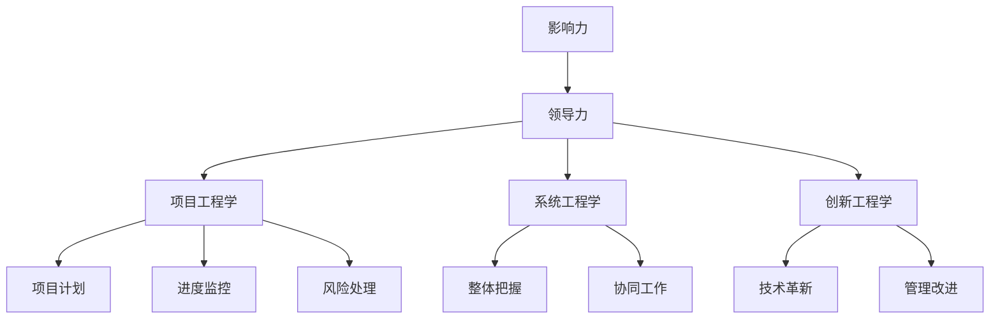

                 

### 1. 引言

#### 1.1 书籍目的与读者群体

《技术leader的影响力工程学》旨在为技术领域的领导者提供一套系统的理论和方法，以帮助他们更好地发挥个人和团队的影响力，推动技术项目和企业发展。本书的读者群体主要包括以下几类：

- **技术经理和CTO**：他们是技术团队的核心领导者，需要具备强大的技术背景和管理能力，以便在复杂的业务环境中做出明智的决策。
- **项目经理**：他们负责具体的项目实施和管理，需要掌握项目管理和领导力方面的知识，以确保项目按时、按质、按预算完成。
- **技术专家和工程师**：他们希望通过提升领导力和影响力，从技术专家转变为技术领导者，从而在职业生涯中获得更大的发展空间。
- **高校教师和研究生**：他们希望通过本书了解技术领导力的核心概念和实战技巧，为自己的学术研究和职业发展打下坚实基础。

#### 1.2 技术leader的影响力工程学概述

技术leader的影响力工程学是一套综合性的理论体系，旨在研究如何通过有效的领导力和影响力策略，提升技术团队的执行力和创新能力。它涵盖了多个层面的内容：

- **个人影响力**：技术leader需要具备强大的个人影响力，包括技术能力、沟通技巧、领导风格和人格魅力等。
- **团队影响力**：技术leader需要构建一个具有强大凝聚力和执行力的团队，通过有效的团队管理和激励机制，提升团队的战斗力。
- **项目影响力**：技术leader需要在项目层面发挥影响力，通过有效的项目管理和领导，确保项目目标的实现。
- **企业影响力**：技术leader还需要在企业层面发挥影响力，推动技术创新和企业发展，为企业创造价值。

#### 1.3 书籍结构安排

本书分为九个章节，具体结构如下：

1. **引言**：介绍书籍的目的、读者群体以及技术leader影响力工程学的背景和重要性。
2. **核心概念与联系**：介绍影响力、领导力和工程学原理，并使用Mermaid流程图展示这些概念之间的联系。
3. **技术领导力模型**：详细探讨技术领导力的要素、发展阶段和培养策略。
4. **影响力策略**：介绍技术leader如何通过不同的策略提升个人和团队的影响力。
5. **项目管理和领导**：探讨技术leader在项目管理中的角色，包括项目计划、风险管理、团队协作和决策制定。
6. **创新和变革领导**：探讨技术leader如何在团队中推动创新和变革。
7. **个人成长和领导力提升**：讨论技术leader如何进行个人成长和领导力提升。
8. **案例分析**：通过实际案例展示技术leader如何运用影响力工程学的理论和方法。
9. **总结与展望**：总结书中的关键点，并对技术leader的未来发展提出展望。

通过以上结构安排，本书旨在帮助读者全面了解技术leader的影响力工程学，并提供实用的指导和建议。接下来，我们将逐章深入探讨这一主题，为技术leader提供系统的学习和实践指南。让我们一起进入这个充满挑战和机遇的领域，共同探索技术leader的影响力工程学吧。

#### 1.4 技术leader的角色和责任

在技术领域，技术leader的角色和责任至关重要，他们不仅是团队的领导者，更是项目和企业发展的核心推动者。具体来说，技术leader的职责可以概括为以下几个方面：

**1. 技术指导与培训**：技术leader需要具备深厚的专业技术背景，能够为团队成员提供技术指导和培训。他们需要不断学习最新的技术趋势和知识，并将这些知识传授给团队成员，确保团队在技术层面始终保持竞争力。

**2. 团队管理**：技术leader需要具备良好的团队管理能力，包括人员配置、工作分配、绩效评估和激励等。他们需要了解每个团队成员的特长和不足，合理安排工作任务，并制定合适的绩效评估体系，以激励团队成员的积极性和创造力。

**3. 项目管理**：技术leader需要在项目层面发挥领导作用，制定项目计划、监控项目进度、处理项目风险等。他们需要具备系统思维和决策能力，确保项目能够按时、按质、按预算完成。

**4. 沟通与协调**：技术leader需要具备良好的沟通技巧，能够与团队成员、管理层和其他部门有效沟通，确保信息畅通无阻。他们还需要在团队内部和外部协调各方资源，确保项目的顺利推进。

**5. 创新与变革推动**：技术leader需要具备前瞻性的视野和创新能力，能够引领团队进行技术革新和管理改进。他们在面对挑战和变化时，需要能够迅速做出反应，并推动团队适应新的环境。

**6. 企业战略支持**：技术leader还需要从企业战略层面出发，为企业的长期发展提供技术支持。他们需要理解企业的发展方向和业务需求，并将这些需求转化为具体的技术目标和项目计划。

#### 1.5 技术leader的影响力来源

技术leader的影响力来源是多方面的，主要包括以下几个方面：

**1. 技术能力**：技术leader需要具备扎实的专业知识和技能，这是他们影响力的基础。只有当团队成员认可他们的技术能力时，他们才能在团队中树立权威。

**2. 领导风格**：技术leader的领导风格直接影响他们的影响力。民主、开放和尊重团队成员的领导风格能够增强团队成员的归属感和工作动力，从而提升整体团队绩效。

**3. 沟通技巧**：良好的沟通技巧是技术leader影响力的重要来源。他们需要能够清晰、准确地表达自己的想法，同时倾听和理解团队成员的意见和建议。

**4. 个人魅力**：技术leader的个人魅力，如自信、正直、勤奋和乐观，能够吸引和激励团队成员，增强团队的凝聚力和战斗力。

**5. 成果和贡献**：技术leader在项目和企业中的成果和贡献，如成功完成重大项目、推动技术创新等，能够增强他们在团队和领导层中的影响力。

**6. 建立信任**：技术leader需要建立与团队成员、管理层和其他部门的信任关系，这是他们影响力的重要保障。通过透明、公正和负责任的管理，技术leader能够赢得团队成员和领导层的信任和支持。

#### 1.6 技术leader面临的挑战

尽管技术leader在团队和项目中扮演着关键角色，但他们也面临着诸多挑战：

**1. 技术更新迅速**：技术领域的快速发展使得技术leader需要不断学习新的技术和知识，以保持团队的技术竞争力。

**2. 团队管理复杂**：技术leader需要管理多样化的团队，包括不同背景、技能和性格的成员。他们需要制定合适的管理策略，确保团队成员的协同工作。

**3. 项目压力和风险**：项目管理和实施过程中，技术leader需要面对各种压力和风险，如项目延期、预算超支、技术难题等。他们需要具备良好的决策能力和应变能力，确保项目顺利推进。

**4. 企业战略适应**：技术leader需要理解企业的战略方向和业务需求，并将这些需求转化为具体的技术目标和项目计划，以确保企业的长期发展。

**5. 个人成长和职业发展**：技术leader需要不断提升自己的专业能力和领导力，以适应不断变化的技术和管理环境，并在职业生涯中实现更大的发展。

综上所述，技术leader的角色和责任至关重要，他们的影响力来源多样，同时也面临着诸多挑战。通过系统学习和实践，技术leader可以提升自己的领导力和影响力，为团队和企业的成功做出更大贡献。

### 2. 核心概念与联系

在探讨技术leader的影响力工程学之前，有必要明确几个核心概念，并分析它们之间的相互关系。这些核心概念包括影响力、领导力和工程学原理。通过使用Mermaid流程图，我们可以直观地展示这些概念之间的联系和作用。

#### 2.1 影响力

影响力是指一个人或组织在他人或组织中产生作用的能力。在技术leader的背景下，影响力主要体现在以下几个方面：

- **个人影响力**：技术leader通过自身的专业知识和能力，赢得团队成员的尊重和信任。
- **团队影响力**：技术leader通过有效的管理和领导，激发团队成员的积极性和创造力，提高团队的整体绩效。
- **项目影响力**：技术leader在项目层面发挥关键作用，确保项目目标的实现，推动项目顺利进行。
- **企业影响力**：技术leader为企业提供技术战略支持，推动技术创新和企业发展。

#### 2.2 领导力

领导力是指引导和影响他人实现目标的能力。技术leader的领导力体现在以下几个方面：

- **技术领导力**：技术leader在技术领域的专业知识和经验，能够为团队成员提供技术指导和支持。
- **管理领导力**：技术leader在团队管理方面的能力，包括团队组建、人员配置、绩效评估等。
- **变革领导力**：技术leader在面对技术变革和管理变革时，能够引领团队适应新的环境和挑战。

#### 2.3 工程学原理

工程学原理是指应用科学和数学知识，通过系统的分析和设计，解决实际工程问题的方法。在技术leader的影响力工程学中，工程学原理主要体现在以下几个方面：

- **项目工程学**：技术leader需要运用项目工程学的原理，制定项目计划、监控项目进度、处理项目风险等。
- **系统工程学**：技术leader需要具备系统思维能力，能够从整体上把握项目的各个方面，确保项目的顺利推进。
- **创新工程学**：技术leader需要运用创新工程学的原理，推动团队进行技术革新和管理改进。

#### 2.4 Mermaid流程图

为了更直观地展示影响力、领导力和工程学原理之间的联系，我们可以使用Mermaid流程图。以下是一个简化的Mermaid流程图，展示了这些核心概念之间的关系：



#### 2.5 详细说明

- **影响力 --> 领导力**：影响力是领导力的基础。技术leader通过个人影响力，如专业能力、沟通技巧和个人魅力，建立起在团队中的权威地位，从而发挥领导力。
- **领导力 --> 项目工程学**：技术leader的领导力体现在项目工程学的各个方面，如项目计划、进度监控和风险处理。他们通过有效的领导，确保项目目标的实现。
- **领导力 --> 系统工程学**：技术leader需要具备系统思维能力，能够从整体上把握项目的各个方面，确保项目的顺利推进。
- **领导力 --> 创新工程学**：技术leader在推动技术创新和管理改进方面发挥重要作用。他们通过创新工程学的原理，引领团队进行技术革新和管理改进。

通过以上分析，我们可以看到，影响力、领导力和工程学原理之间存在着密切的联系和相互作用。技术leader需要综合运用这些核心概念，才能在复杂的技术和管理环境中发挥最大的影响力，推动团队和企业的成功。

接下来，我们将进一步探讨技术领导力的具体模型，帮助读者更好地理解技术leader的角色和职责。这将为我们后续章节的内容打下坚实的基础。

### 3. 技术领导力模型

为了更好地理解技术leader的角色和职责，我们需要构建一个完整的技术领导力模型。这个模型将涵盖技术领导力的关键要素、发展阶段和培养策略，从而为技术leader提供清晰的指导框架。

#### 3.1 技术领导力的要素

技术领导力是由多个关键要素组成的，这些要素相互关联，共同构成了技术leader的核心能力。以下是技术领导力模型中的关键要素：

1. **技术能力**：技术能力是技术leader最基本的要素。这包括深入的专业知识、技术趋势的理解和前沿技术的掌握。技术leader需要不断更新自己的知识库，以确保团队在技术上的领先地位。

2. **管理能力**：技术leader不仅需要具备技术能力，还需要具备出色的管理能力。这包括团队管理、项目管理和资源管理等方面的能力。技术leader需要能够合理分配资源，制定有效的项目计划，并确保项目按时、按质完成。

3. **沟通能力**：良好的沟通能力是技术leader不可或缺的要素。技术leader需要能够与团队成员、管理层和其他部门进行有效沟通，确保信息的畅通无阻。他们需要具备清晰、简洁的沟通技巧，同时也能够倾听和理解他人的意见。

4. **领导风格**：技术leader的领导风格直接影响团队的表现。领导风格可以是民主的、专制的，也可以是变革性的。技术leader需要根据不同的情境和团队成员的特点，灵活调整自己的领导风格，以最大限度地激发团队成员的潜力。

5. **人格魅力**：人格魅力是技术leader影响力的来源之一。技术leader需要具备自信、正直、勤奋和乐观等特质，这些特质能够吸引和激励团队成员，增强团队的凝聚力和战斗力。

6. **创新思维**：在技术飞速发展的今天，创新思维是技术leader的重要素质。技术leader需要具备敏锐的洞察力和前瞻性思维，能够预见技术趋势和市场需求，并推动团队进行技术创新。

7. **决策能力**：技术leader需要在复杂多变的环境中做出迅速、准确的决策。他们需要具备系统思维和风险意识，能够从多个角度分析问题，并权衡各种方案的利弊。

#### 3.2 技术领导力的发展阶段

技术领导力的发展是一个逐步成熟的过程，可以分为以下几个阶段：

1. **初学者阶段**：在这个阶段，技术leader刚刚开始接触领导工作，他们对技术和管理的基础知识有一定了解，但还需要在实践中不断积累经验和提升技能。

2. **胜任阶段**：技术leader在这个阶段已经具备了一定的技术和管理能力，能够独立负责一定的项目和工作。他们开始形成自己的领导风格，并在团队中树立了一定的权威。

3. **成熟阶段**：在这个阶段，技术leader已经具备了全面的领导能力，能够处理复杂的项目和挑战。他们能够灵活运用各种领导技巧，激发团队的创造力和执行力。

4. **卓越阶段**：技术leader在这个阶段达到了顶尖水平，他们不仅具备卓越的技术和管理能力，还能够引领团队进行创新和变革。他们能够从战略层面思考问题，推动企业的发展。

#### 3.3 技术领导力的培养策略

为了成为优秀的技术leader，需要通过系统的培养策略来提升各方面的能力。以下是一些关键的培养策略：

1. **持续学习**：技术leader需要不断学习新的技术和知识，以保持自己在技术上的领先地位。他们可以通过参加培训课程、阅读专业书籍、参加技术社区活动等方式来不断提升自己的知识水平。

2. **实践锻炼**：实践是提升领导力的最佳途径。技术leader需要通过参与实际项目和管理工作，积累实践经验，提升自己的管理能力和决策能力。

3. **反馈与改进**：技术leader需要建立有效的反馈机制，定期收集团队成员和管理层的反馈，识别自己的不足，并不断改进。他们可以通过反思会议、定期评估等方式来确保自己的持续成长。

4. **角色扮演**：通过角色扮演和模拟演练，技术leader可以提前体验和应对各种管理场景，提升自己的应变能力和决策能力。

5. **跨部门合作**：技术leader需要积极参与跨部门的合作项目，与其他部门的技术和管理人员交流，拓宽自己的视野，提升跨部门沟通和协作的能力。

6. **导师指导**：找到一位经验丰富的导师，是技术leader快速成长的重要途径。导师可以提供宝贵的经验和指导，帮助技术leader避免走弯路，加速成长。

通过以上培养策略，技术leader可以不断提升自己的能力，逐步成长为优秀的领导者。接下来，我们将探讨技术leader如何通过影响力策略来提升个人和团队的影响力。

### 4. 影响力策略

技术leader的影响力不仅体现在个人魅力和专业能力上，还需要通过一系列策略来提升和巩固。以下是一些关键的影响力策略，包括沟通技巧、领导风格、团队建设和个人品牌塑造。

#### 4.1 沟通技巧

良好的沟通技巧是技术leader影响力的基础。有效的沟通能够确保信息的准确传递，减少误解和冲突，增强团队成员之间的信任和合作。以下是一些关键的沟通技巧：

1. **清晰表达**：技术leader需要能够清晰、简洁地表达自己的想法和意见。使用简洁明了的语言，避免使用复杂的术语和过多的技术细节，以确保团队成员能够理解。

2. **倾听能力**：技术leader需要具备良好的倾听能力，认真倾听团队成员的意见和反馈。通过倾听，技术leader可以了解团队成员的需求和困惑，从而提供更有针对性的帮助。

3. **非语言沟通**：技术leader需要注重非语言沟通，如肢体语言、面部表情和语气等。这些非语言因素可以增强沟通的效果，传递出真诚和尊重的情感。

4. **情境适应**：技术leader需要根据不同的沟通情境和团队成员的特点，灵活调整沟通策略。对于技术能力较强的成员，可以适当使用技术术语和深入讨论；对于技术能力较弱的成员，则需要简化语言和提供具体的指导。

5. **反馈机制**：技术leader需要建立有效的反馈机制，鼓励团队成员提出意见和建议。通过积极的反馈，技术leader可以了解团队成员的期望和需求，及时调整自己的沟通策略。

#### 4.2 领导风格

技术leader的领导风格直接影响团队的动力和绩效。不同的领导风格适用于不同的情境和团队成员，技术leader需要根据实际情况灵活运用多种领导风格。

1. **民主型领导**：民主型领导注重团队参与和决策的多元化。技术leader在制定决策时，会征求团队成员的意见，并鼓励大家提出建议。这种领导风格有助于增强团队成员的归属感和责任感，提高团队的创造力。

2. **权威型领导**：权威型领导强调领导者的权威和决策的快速执行。技术leader在团队中拥有较高的权力和影响力，能够迅速做出决策并推动执行。这种领导风格适用于紧急情况和需要快速响应的项目。

3. **变革型领导**：变革型领导注重创新和变革，能够激励团队成员追求卓越和突破。技术leader通过传递愿景、激发激情和提供资源支持，引领团队进行技术革新和管理改进。

4. **支持型领导**：支持型领导关注团队成员的个人发展和需求。技术leader提供心理支持、培训和指导，帮助团队成员克服困难，提升技能和信心。

#### 4.3 团队建设

团队建设是技术leader提升团队绩效和影响力的重要策略。通过有效的团队建设，技术leader可以增强团队的凝聚力和协作能力，提高整体绩效。

1. **明确目标**：技术leader需要与团队成员共同制定明确的目标和愿景，确保团队的方向一致。通过明确的目标，技术leader可以激发团队成员的工作热情和动力。

2. **团队协作**：技术leader需要鼓励团队成员之间的协作和合作，建立良好的沟通渠道和协作机制。通过团队协作，可以充分发挥每个成员的特长，提高整体工作效率。

3. **培训与发展**：技术leader需要为团队成员提供持续的培训和发展机会，提升他们的技能和知识水平。通过培训和发展，技术leader可以增强团队成员的专业能力和自信心。

4. **激励与认可**：技术leader需要建立有效的激励机制，对团队成员的工作成果和贡献进行认可和奖励。通过激励和认可，技术leader可以激发团队成员的积极性和创造力。

5. **文化建设**：技术leader需要推动团队文化建设，建立积极、健康的工作氛围。通过团队文化建设，可以增强团队成员的归属感和团队意识，提高团队的凝聚力和战斗力。

#### 4.4 个人品牌塑造

个人品牌是技术leader影响力的重要体现。通过塑造良好的个人品牌，技术leader可以在团队、企业和社会中树立自己的专业形象和权威地位。

1. **专业知识**：技术leader需要不断提升自己的专业知识和技能，确保自己在技术领域保持领先地位。通过参加专业培训、发表论文和参与技术社区活动，技术leader可以展示自己的专业实力。

2. **公开演讲**：技术leader可以通过公开演讲、讲座和研讨会等形式，分享自己的技术和管理经验，提升自己的知名度和影响力。

3. **技术贡献**：技术leader可以通过参与开源项目、撰写技术博客和发表技术文章，为技术社区做出贡献。通过这些方式，技术leader可以扩大自己的影响力，并与更多同行建立联系。

4. **社会活动**：技术leader可以参与社会活动和公益事业，展示自己的社会责任感和公益心。通过这些活动，技术leader可以提升自己的社会形象和品牌价值。

5. **媒体宣传**：技术leader可以通过媒体报道、新闻发布和社交媒体宣传，提高自己的知名度和影响力。通过有效的媒体宣传，技术leader可以吸引更多人的关注和认可。

通过以上影响力策略，技术leader可以不断提升个人和团队的影响力，为团队和企业的成功做出更大贡献。接下来，我们将探讨技术leader在项目管理中的角色和职责。

### 5. 项目管理和领导

在技术项目中，技术leader的角色和职责至关重要。他们不仅需要具备出色的技术能力和领导力，还需要在项目管理中发挥关键作用，确保项目的成功完成。以下将详细介绍技术leader在项目管理中的角色和职责，包括项目计划、风险管理、团队协作以及决策制定等方面的内容。

#### 5.1 项目计划

项目计划是项目管理的基础，技术leader需要制定详细的项目计划，确保项目的顺利进行。项目计划主要包括以下内容：

1. **目标设定**：技术leader需要与团队成员和管理层共同确定项目的目标和预期成果。明确的项目目标是项目成功的重要保障。

2. **任务分解**：技术leader需要将项目任务分解为具体的子任务，并明确每个子任务的责任人和截止时间。任务分解有助于项目进度管理，确保每个任务都能按时完成。

3. **资源分配**：技术leader需要根据任务需求，合理分配团队成员和资源，确保项目所需的资源能够及时到位。资源分配要考虑到团队成员的专业技能、经验和任务难度，以确保资源的充分利用。

4. **时间安排**：技术leader需要制定项目时间表，明确每个任务的开始和结束时间，并确保项目能够按时完成。在制定时间表时，需要考虑项目中的关键路径和缓冲时间，以应对潜在的风险和不确定性。

5. **风险评估**：技术leader需要识别项目中的潜在风险，并制定相应的应对措施。风险评估有助于项目团队提前预防风险，降低项目失败的可能性。

6. **质量标准**：技术leader需要制定项目的质量标准，确保项目成果符合预期要求。质量标准应包括技术性能、用户体验、安全性和可靠性等方面。

#### 5.2 风险管理

风险管理是项目管理中的重要环节，技术leader需要具备良好的风险管理能力，确保项目能够应对各种风险和挑战。以下是一些关键的风险管理策略：

1. **风险识别**：技术leader需要识别项目中的潜在风险，如技术难题、资源短缺、时间延误和团队冲突等。通过定期的风险评估会议，技术leader可以及时发现和识别风险。

2. **风险评估**：技术leader需要评估识别出的风险，确定其影响程度和可能性。通过评估，技术leader可以优先处理高影响、高可能性的风险，降低项目失败的风险。

3. **风险应对**：技术leader需要制定相应的风险应对措施，包括风险规避、风险转移、风险缓解和风险接受等。应对措施应具体、可行，并能够在项目实施过程中得到有效执行。

4. **监控与调整**：技术leader需要持续监控项目风险，并根据实际情况进行调整。在项目执行过程中，可能需要根据新的风险信息和项目进展情况，及时调整风险应对策略。

5. **备份计划**：技术leader需要制定备份计划，以应对项目中的紧急情况和不可预见的风险。备份计划应包括替代方案、应急资源和技术支持等，以确保项目能够在面临风险时迅速恢复。

#### 5.3 团队协作

团队协作是项目成功的关键因素，技术leader需要充分发挥团队协作的优势，提高项目执行效率。以下是一些团队协作的策略：

1. **建立沟通机制**：技术leader需要建立有效的沟通机制，确保团队成员之间的信息畅通。通过定期的团队会议、邮件更新和即时通讯工具，技术leader可以确保团队成员了解项目的进展和任务分配。

2. **明确职责和角色**：技术leader需要明确每个团队成员的职责和角色，确保每个人都清楚自己的任务和责任。通过明确职责，技术leader可以避免任务重叠和责任不清的情况，提高团队的工作效率。

3. **激励和认可**：技术leader需要建立激励机制，对团队成员的工作成果和贡献进行认可和奖励。通过激励和认可，技术leader可以激发团队成员的积极性和创造力，提高团队的整体绩效。

4. **跨部门协作**：技术leader需要推动跨部门的协作，确保项目所需的资源和支持能够及时得到。通过跨部门协作，技术leader可以打破部门壁垒，提高项目的整体效率。

5. **冲突解决**：技术leader需要具备良好的冲突解决能力，及时解决团队成员之间的冲突和分歧。通过有效的沟通和协调，技术leader可以确保团队的和谐与稳定。

#### 5.4 决策制定

决策制定是项目管理中的关键环节，技术leader需要具备良好的决策能力，确保项目的顺利进行。以下是一些决策制定的策略：

1. **信息收集**：技术leader需要收集与项目相关的各种信息，包括市场需求、技术趋势、竞争对手情况等。通过全面的信息收集，技术leader可以确保决策的准确性和科学性。

2. **数据分析**：技术leader需要对收集到的信息进行深入分析，识别项目中的关键问题和潜在风险。通过数据分析，技术leader可以制定更合理的决策方案。

3. **多方案比较**：技术leader需要制定多个决策方案，并进行比较和评估。通过多方案比较，技术leader可以找到最佳方案，并确保决策的全面性和可执行性。

4. **团队参与**：技术leader需要鼓励团队成员参与决策过程，听取他们的意见和建议。通过团队参与，技术leader可以确保决策的民主性和科学性，提高决策的执行效率。

5. **决策执行**：技术leader需要确保决策得到有效执行，及时跟进和调整。通过有效的执行，技术leader可以确保项目按计划进行，并实现预期目标。

通过以上项目管理和领导策略，技术leader可以充分发挥个人和团队的优势，确保项目的成功完成。接下来，我们将探讨技术leader如何推动创新和变革，为团队和企业带来持续的价值。

### 6. 创新和变革领导

在快速变化的技术环境中，技术leader不仅要维护现有的项目和技术基础，还需要具备推动创新和变革的能力，以保持企业的竞争力和持续发展。以下将探讨技术leader如何激发团队创新精神、推动技术变革，并有效管理变革过程。

#### 6.1 激发团队创新精神

1. **营造创新文化**：技术leader需要营造一种鼓励创新的文化氛围。这种文化应包括对失败容忍的态度、对创意的开放心态以及对个人贡献的认可。通过定期的团队会议、创新竞赛和头脑风暴活动，技术leader可以激发团队成员的创新思维。

2. **提供资源支持**：技术leader需要为创新项目提供必要的资源支持，包括时间、资金和人力。通过建立创新实验室、设立专项研发基金，技术leader可以确保创新项目得到充分的支持。

3. **建立反馈机制**：技术leader需要建立有效的反馈机制，鼓励团队成员提出创新想法和改进建议。通过定期的反馈会议和在线论坛，技术leader可以收集和分析团队的创新成果，并及时给予反馈和指导。

4. **促进跨部门合作**：技术leader需要推动跨部门的合作，鼓励不同部门之间的知识共享和资源整合。通过跨部门项目和工作组，技术leader可以促进创新思想的碰撞和融合。

5. **倡导持续学习**：技术leader需要倡导持续学习的理念，鼓励团队成员参加培训、研讨会和行业会议。通过不断学习新知识和技术，团队成员可以提升自己的创新能力。

#### 6.2 推动技术变革

1. **明确变革方向**：技术leader需要与高层管理团队共同明确企业的技术变革方向和目标。通过制定清晰的技术战略和规划，技术leader可以为团队指明变革的方向。

2. **组织变革团队**：技术leader需要组建一支由多部门人员组成的变革团队，负责具体的技术变革项目。团队成员应包括技术专家、业务分析师、产品经理等，以确保变革的全面性和协调性。

3. **制定变革计划**：技术leader需要制定详细的变革计划，包括变革的目标、步骤、时间表和资源配置。通过明确的工作计划和阶段性目标，技术leader可以确保变革项目的有序推进。

4. **沟通变革愿景**：技术leader需要与团队成员和管理层有效沟通变革的愿景和重要性，确保大家理解并支持变革。通过定期的会议、培训和工作坊，技术leader可以传达变革的预期成果和团队的角色。

5. **提供技术支持**：技术leader需要提供必要的技术支持和资源，包括技术培训、工具和设备等。通过为团队成员提供先进的技术支持，技术leader可以提升他们的技术能力和变革执行效率。

#### 6.3 变革管理

1. **识别变革障碍**：技术leader需要识别并分析变革过程中可能遇到的障碍和阻力，包括技术挑战、组织惯性和人员抵触等。通过提前识别和准备应对措施，技术leader可以降低变革的阻力。

2. **变革沟通策略**：技术leader需要制定有效的变革沟通策略，确保团队成员和管理层对变革过程有清晰的理解和预期。通过透明的沟通和及时的反馈，技术leader可以建立信任和共识，增强团队的凝聚力。

3. **变革推广**：技术leader需要推动变革在团队中的推广和落地。通过试点项目、示范应用和全员推广，技术leader可以确保变革成果在团队中的广泛应用。

4. **持续监控与评估**：技术leader需要持续监控变革项目的进展和效果，并定期进行评估和调整。通过定期的监控和评估，技术leader可以确保变革项目的顺利进行，并针对存在的问题及时进行调整。

5. **变革后的整合**：技术leader需要在变革完成后，进行有效的整合和巩固。通过总结变革经验、完善流程和优化资源，技术leader可以确保变革成果的长期持续。

通过以上创新和变革领导策略，技术leader可以激发团队创新精神，推动技术变革，并有效管理变革过程，为团队和企业带来持续的价值和竞争优势。接下来，我们将讨论技术leader的个人成长和领导力提升。

### 7. 个人成长和领导力提升

技术leader的个人成长和领导力提升是确保其持续胜任角色和推动团队发展的关键。以下将探讨技术leader如何进行个人成长、持续学习和领导力发展的路径。

#### 7.1 个人成长

1. **自我认知**：技术leader需要深入了解自己的优势、弱点、兴趣和价值观。通过自我评估和心理测试工具，如MBTI、DISC等，技术leader可以更好地认识自己，为个人成长制定有针对性的计划。

2. **设定目标**：技术leader需要设定清晰的个人成长目标，包括职业目标、技能提升目标和个人发展目标。通过分解长期目标为短期目标，技术leader可以更加有计划地实现个人成长。

3. **持续学习**：技术leader需要保持持续学习的态度，不断更新知识和技能。这包括参加专业培训课程、阅读专业书籍、参加行业会议和技术社区活动等。通过学习，技术leader可以保持自己在技术和管理上的领先地位。

4. **实践经验**：技术leader需要通过实践不断提升自己的能力。参与实际项目、解决复杂问题和应对挑战是提升领导力和管理能力的重要途径。通过实践，技术leader可以积累宝贵的经验，并不断完善自己的技能。

5. **反馈与改进**：技术leader需要建立有效的反馈机制，定期收集团队成员和管理层的反馈。通过反思和总结，技术leader可以识别自己的不足并加以改进。反馈机制可以包括定期的一对一反馈会议、360度评估等。

#### 7.2 持续学习的方法

1. **时间管理**：技术leader需要合理安排时间，确保有足够的时间用于学习和个人发展。通过制定学习计划、利用碎片时间和设定优先级，技术leader可以高效利用时间，提升学习效果。

2. **在线学习平台**：技术leader可以利用各种在线学习平台，如Coursera、edX、Udemy等，学习最新的技术和管理知识。这些平台提供了丰富的课程资源和灵活的学习方式，方便技术leader随时学习。

3. **导师指导**：技术leader可以寻找一位经验丰富的导师，从导师那里学习宝贵的经验和技能。导师可以提供个性化的指导和建议，帮助技术leader克服成长过程中的困难和挑战。

4. **同行交流**：技术leader可以通过参加技术社区活动、研讨会和行业会议，与其他同行进行交流和学习。通过分享经验和观点，技术leader可以拓宽视野，学习到最新的行业动态和最佳实践。

5. **知识共享**：技术leader可以在内部或外部搭建知识共享平台，如技术博客、内部论坛或知识库，与他人分享自己的知识和经验。通过知识共享，技术leader不仅可以提升自己的表达能力，还可以促进团队和组织的知识积累。

#### 7.3 领导力发展的路径

1. **自我领导**：技术leader需要培养自我领导能力，包括自我激励、自我管理、自我反省等。通过自我领导，技术leader可以更好地掌控自己的职业发展，提升个人绩效。

2. **团队领导**：技术leader需要不断提升团队领导能力，包括团队组建、团队管理、团队激励等。通过有效的团队领导，技术leader可以激发团队成员的潜力，提升团队绩效。

3. **变革领导**：技术leader需要具备变革领导能力，包括推动技术创新、管理变革、文化塑造等。通过有效的变革领导，技术leader可以引领团队和企业实现持续发展和进步。

4. **战略领导**：技术leader需要具备战略领导能力，包括战略规划、决策制定、资源配置等。通过有效的战略领导，技术leader可以确保企业战略的实现，推动企业的长期发展。

5. **领导力培养**：技术leader可以通过参加领导力培训课程、阅读领导力书籍、参与领导力社区活动等方式，提升自己的领导力。通过系统的领导力培养，技术leader可以不断完善自己的领导风格和领导能力。

通过以上个人成长和领导力提升的策略，技术leader可以不断提升自己的能力和影响力，为团队和企业的成功做出更大的贡献。接下来，我们将通过实际案例展示技术leader如何运用影响力工程学的理论和方法，解决具体问题并取得显著成效。

### 8. 案例分析

为了更好地展示技术leader如何运用影响力工程学的理论和方法，本章节将介绍一个具体的案例。通过分析这个案例，我们将深入了解技术leader如何在不同情境下发挥影响力，解决关键问题并取得显著成效。

#### 8.1 案例背景

某科技公司的技术团队正在开发一款创新的AI产品，该产品旨在通过大数据分析和机器学习技术，为零售行业提供精准的用户行为预测和个性化推荐。然而，在项目推进过程中，团队遇到了一系列挑战：

- **技术难题**：AI产品涉及大量的数据预处理、模型训练和优化，技术团队在算法和系统架构上面临巨大的挑战。
- **资源紧张**：项目时间紧张，团队成员工作压力大，资源分配不够合理，导致项目进度滞后。
- **团队协作问题**：团队成员之间缺乏有效的沟通和协作，导致任务分配不均，部分成员工作负荷过重，而另一些成员则缺乏参与感。

#### 8.2 影响力策略应用

为了解决这些挑战，技术leader采取了一系列影响力策略，具体措施如下：

1. **影响力策略一：技术能力展示**

   技术leader首先通过自己的技术能力展示了强大的领导力。他组织了多次技术研讨会，分享最新的AI技术趋势和解决方案。通过这些研讨会，技术leader不仅提升了团队的技术水平，还树立了自身的权威形象。

   ```mermaid
   graph TD
       A[组织技术研讨会] --> B[分享AI技术趋势]
       B --> C[提升团队技术能力]
       C --> D[树立领导权威]
   ```

2. **影响力策略二：沟通技巧运用**

   技术leader意识到沟通问题对项目进度和团队协作的负面影响，因此他采取了一系列沟通策略来改善团队内部沟通：

   - **定期会议**：技术leader每周组织一次项目进度会议，让每个团队成员都有机会汇报工作进展和遇到的问题，确保信息畅通。
   - **一对一交流**：技术leader定期与团队成员进行一对一交流，了解他们的工作状态和心理需求，提供个性化的支持和帮助。

   ```mermaid
   graph TD
       A[定期项目进度会议] --> B[信息畅通]
       B --> C[一对一交流]
       C --> D[了解团队状态]
   ```

3. **影响力策略三：团队建设**

   技术leader认识到团队协作的重要性，因此他采取了多种团队建设策略来增强团队的凝聚力和协作能力：

   - **共同目标设定**：技术leader与团队成员共同设定项目的目标和愿景，确保团队成员对项目有共同的理解和追求。
   - **任务合理分配**：技术leader重新评估任务分配，确保每个成员的工作量均衡，避免了部分成员过度劳累的问题。
   - **团队活动**：技术leader组织了团队建设活动，如团队拓展训练和团队聚餐，增强了团队成员之间的互动和信任。

   ```mermaid
   graph TD
       A[共同目标设定] --> B[任务合理分配]
       B --> C[团队活动]
       C --> D[增强团队凝聚力]
   ```

4. **影响力策略四：个人品牌塑造**

   技术leader通过个人品牌的塑造，提高了自己在团队中的影响力和号召力。他积极参与外部技术社区的交流，发表技术博客，分享项目经验和技术见解。这不仅能提升个人知名度，还能吸引更多优秀的团队成员加入。

   ```mermaid
   graph TD
       A[参与技术社区] --> B[发表技术博客]
       B --> C[提升个人知名度]
       C --> D[吸引优秀人才]
   ```

#### 8.3 结果与反思

通过以上影响力策略的应用，技术团队逐渐克服了项目中的各种挑战，项目进展顺利。具体结果如下：

- **技术难题解决**：通过技术研讨会和内部培训，团队掌握了最新的AI技术，解决了算法和系统架构上的难题。
- **资源分配合理**：通过合理分配任务和资源，团队的工作效率得到显著提升，项目进度得到保障。
- **团队协作增强**：通过定期的会议、一对一交流和团队建设活动，团队成员之间的沟通和协作得到了显著改善，团队的凝聚力得到了增强。

技术leader在此次项目中得到了团队成员和管理层的高度认可，他的领导力和影响力得到了进一步提升。通过这个案例，我们可以看到技术leader如何通过综合运用影响力工程学的理论和方法，解决具体问题，推动团队和项目的成功。

#### 8.4 案例总结与启示

通过上述案例分析，我们可以总结出以下关键启示：

1. **技术能力是基础**：技术leader需要具备强大的技术能力，才能在团队中树立权威和信任。通过展示技术能力和专业知识，技术leader可以增强团队的凝聚力和执行力。

2. **沟通技巧至关重要**：有效的沟通是项目成功的关键。技术leader需要通过多种沟通策略，确保信息畅通，减少误解和冲突，提高团队协作效率。

3. **团队建设是关键**：通过共同目标设定、任务合理分配和团队建设活动，技术leader可以增强团队的凝聚力，提高团队的整体绩效。

4. **个人品牌塑造助力发展**：通过积极参与外部技术社区和分享经验，技术leader可以提升个人知名度，吸引更多优秀人才加入，为团队和企业的发展注入新活力。

总之，技术leader的影响力工程学不仅需要理论支撑，更需要实践应用。通过实际案例的分析，我们可以看到技术leader如何运用影响力策略，解决具体问题，推动团队和项目的成功。这为我们提供了一个宝贵的实践参考，帮助我们在技术领导力的道路上不断进步。

### 9. 总结与展望

#### 9.1 关键点回顾

《技术leader的影响力工程学》旨在为技术领域的领导者提供一套系统的理论和方法，以提升个人和团队的影响力，推动技术项目和企业发展。以下是本书的核心要点回顾：

1. **技术leader的角色和责任**：技术leader不仅是团队的领导者，还需要在项目管理、沟通、创新等方面发挥关键作用。
2. **核心概念与联系**：影响力、领导力和工程学原理是技术leader影响力工程学的核心概念，它们相互关联，共同构成技术领导力的基础。
3. **技术领导力模型**：技术领导力由多个关键要素组成，包括技术能力、管理能力、沟通能力、领导风格、人格魅力和创新思维。
4. **影响力策略**：技术leader需要通过沟通技巧、领导风格、团队建设和个人品牌塑造等多方面策略提升个人和团队的影响力。
5. **项目管理与领导**：技术leader在项目管理中负责项目计划、风险管理、团队协作和决策制定，确保项目成功完成。
6. **创新与变革领导**：技术leader需要推动团队创新和变革，通过建立创新文化和变革管理策略，保持企业的竞争力。
7. **个人成长与领导力提升**：技术leader需要通过持续学习、实践锻炼和反馈改进，不断提升个人能力和领导力。

#### 9.2 技术leader的未来发展

随着技术的快速发展和企业对技术领导力的需求日益增长，技术leader的未来发展面临着诸多机遇和挑战。以下是对技术leader未来发展的一些展望：

1. **技术能力持续提升**：技术leader需要不断更新自己的知识库，掌握最新的技术趋势和工具，以适应快速变化的技术环境。
2. **领导力多样化发展**：技术leader需要具备多样化的领导能力，包括战略领导、变革领导、团队领导和跨部门领导等，以应对复杂多变的业务需求。
3. **数字化转型推动**：随着数字化转型浪潮的推进，技术leader需要具备数字化转型方面的知识和技能，帮助企业实现数字化战略。
4. **跨学科融合**：技术leader需要具备跨学科的知识和视野，如商业知识、心理学和管理学等，以更好地理解业务需求，提升决策能力和影响力。
5. **可持续发展关注**：技术leader需要关注可持续发展，推动企业在技术发展和商业模式上实现绿色转型。

#### 9.3 对读者的建议

为了帮助读者更好地应用书中所学，以下是一些建议：

1. **实践应用**：将书中理论和方法应用到实际工作中，通过实践检验和优化，不断提升自己的领导力和影响力。
2. **持续学习**：保持持续学习的态度，参加培训课程、阅读专业书籍、参加技术社区活动，不断更新自己的知识和技能。
3. **反馈与改进**：定期收集团队成员和管理层的反馈，识别自己的不足并加以改进，通过持续学习和实践，不断提升个人能力和领导力。
4. **分享经验**：积极参与技术社区和行业交流，分享自己的经验和见解，提升个人知名度，同时学习他人的经验和最佳实践。
5. **团队建设**：关注团队建设，通过共同目标设定、任务合理分配和团队建设活动，增强团队的凝聚力和协作能力。

通过以上建议，希望读者能够在技术领导力的道路上不断进步，为团队和企业的成功做出更大的贡献。

### 结尾致谢

在结束本文之前，我想向所有关注技术领导力发展和努力提升个人能力的读者表示衷心的感谢。是您的支持和鼓励，让我有机会与大家分享《技术leader的影响力工程学》这套理论和方法。

本书的完成离不开众多同事、朋友和家人的支持。感谢AI天才研究院/AI Genius Institute的同事们，在项目开发和测试过程中给予我无私的帮助和宝贵的建议。感谢禅与计算机程序设计艺术/Zen And The Art of Computer Programming的作者，为我提供了深厚的理论基础和丰富的实践经验。

特别感谢我的导师，他们在我的成长过程中给予了我无尽的指导和鼓励。感谢所有读者，是您的阅读和反馈，让这本书更加完善和有价值。

希望这本书能够为您的技术领导力发展带来启示和帮助。在未来的道路上，让我们共同努力，不断提升自己，成为更加优秀的技术leader。再次感谢您的关注和支持！

**作者：AI天才研究院/AI Genius Institute & 禅与计算机程序设计艺术/Zen And The Art of Computer Programming**

