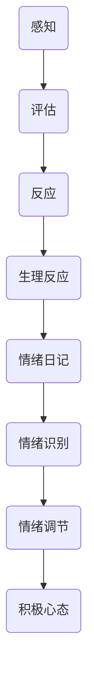

                 

### 引言：技术leader的情绪管理挑战

在现代企业中，技术leader的角色越来越重要。他们不仅要拥有卓越的编程能力和系统设计能力，还需要具备出色的领导力和管理能力。然而，随着职位的提升和责任的增加，技术leader面临着诸多情绪管理方面的挑战。本文将深入探讨情绪管理的重要性，分析技术leader面临的具体挑战，并系统性地介绍情绪管理技巧，旨在帮助技术leader更好地应对这些挑战，提升个人及团队的绩效。

#### 情绪管理的重要性

情绪管理是一种自我调节的过程，通过这种过程，人们能够有效地识别、理解和控制自己的情绪。对于技术leader而言，情绪管理的重要性体现在以下几个方面：

1. **个人健康**：长期的压力和负面情绪会导致身心疲惫，甚至可能导致心理健康问题。有效的情绪管理可以帮助技术leader保持身心健康，提高生活质量。
2. **团队氛围**：技术leader的情绪状态往往会对团队氛围产生显著影响。积极的情绪可以促进团队成员之间的合作和沟通，而消极的情绪则可能引发团队冲突，降低团队效率。
3. **决策质量**：情绪管理能力直接影响技术leader的决策质量。在高压环境下，情绪失控可能导致错误的决策，甚至造成重大损失。良好的情绪管理能够帮助技术leader保持冷静，做出更加明智的决策。

#### 技术leader面临的挑战

技术leader在情绪管理方面面临的挑战主要包括：

1. **工作压力**：随着企业对技术的要求越来越高，技术leader需要不断学习新知识，掌握新技术，这无疑增加了他们的工作压力。
2. **时间管理**：技术leader往往需要在多个项目之间切换，这要求他们具备出色的时间管理能力。然而，时间压力可能会导致情绪波动。
3. **团队管理**：技术leader不仅要管理自己，还要管理团队。团队成员之间的冲突、沟通障碍等问题都可能引发情绪问题。
4. **职业发展**：技术leader需要面对职业发展的不确定性，这可能会导致焦虑和恐惧等情绪。

#### 情绪管理对企业的影响

情绪管理不仅仅关乎技术leader的个人健康和团队氛围，它还对企业的整体运营产生深远影响：

1. **员工生产力**：情绪积极的技术leader能够激发团队成员的积极性，提高整体生产力。
2. **企业稳定性**：情绪稳定的技术leader有助于企业稳定发展，避免因个人情绪问题导致的企业动荡。
3. **创新能力**：情绪良好的技术leader更容易在团队中培养创新氛围，推动企业技术创新。

总之，情绪管理对于技术leader而言至关重要。通过有效管理情绪，技术leader不仅能够提升个人绩效，还能为团队和企业的长期发展奠定坚实基础。本文将围绕这一主题，详细探讨情绪管理的基础知识、自我情绪管理技巧、团队情绪管理技巧以及常见问题的解决方案。

### 情绪管理基础理论

在探讨技术leader的情绪管理技巧之前，我们需要先了解一些基本的情绪管理理论知识。情绪管理并非一门简单的技艺，而是一门融合了心理学、管理学和自我发展等多方面知识的综合性学科。以下我们将介绍情绪管理的重要性、情绪的类型、情绪的产生机制以及情绪的自我监控。

#### 情绪管理的重要性

情绪管理是一种自我调节的过程，旨在识别、理解和控制自己的情绪。这种能力对于个人的心理健康、社会交往和工作效率都有至关重要的影响。对于技术leader而言，情绪管理的重要性主要体现在以下几个方面：

1. **心理健康**：良好的情绪管理能力有助于缓解压力，减少焦虑和抑郁等心理问题的发生，从而提高个人的心理健康水平。
2. **社会交往**：情绪稳定的技术leader更容易与团队成员和其他部门建立良好的关系，促进团队合作和沟通。
3. **工作效率**：情绪良好的技术leader能够更加专注和高效地完成任务，提高工作效率和质量。
4. **领导力**：情绪管理能力是领导力的重要组成部分。一个情绪稳定且能有效管理情绪的技术leader能够更好地激励和引导团队，提高团队的整体绩效。

#### 情绪的类型

情绪可以分为正面情绪和负面情绪两大类。每种情绪都有其独特的特征和影响。

1. **正面情绪**：
   - **快乐**：快乐是一种积极的情绪，能使人感到愉悦和满足。
   - **平静**：平静使人感到放松和平静，有利于思考和决策。
   - **兴奋**：兴奋是一种激发性和兴奋性的情绪，可以激发创造力和积极性。

2. **负面情绪**：
   - **焦虑**：焦虑是一种担忧和不安的情绪，常伴随着紧张和恐惧。
   - **愤怒**：愤怒是一种强烈的情绪，表现为易怒和攻击性。
   - **悲伤**：悲伤是一种失落和沮丧的情绪，可能由失去亲人、工作或项目失败等引起。
   - **恐惧**：恐惧是一种对未知或潜在的威胁的反应，可能表现为逃避或过度警惕。

#### 情绪的产生机制

情绪的产生机制是一个复杂的过程，涉及到生理、心理和社会等多个层面。以下是一个简化的情绪产生机制：

1. **感知**：外界刺激（如他人的言行、工作压力等）被感知。
2. **评估**：大脑对感知到的信息进行评估，判断其是否对个体有积极或消极的影响。
3. **反应**：根据评估结果，个体产生相应的情绪反应，如快乐或愤怒。
4. **生理反应**：情绪反应可能导致一系列生理变化，如心率加快、呼吸急促等。

#### 情绪的自我监控

情绪的自我监控是指个体对自己的情绪进行识别、评估和控制的过程。以下是一些自我监控技巧：

1. **情绪日记**：记录自己的情绪变化，帮助自己更好地了解情绪的起因和影响。
2. **情绪识别**：学会识别自己的情绪，理解不同情绪的特征和影响。
3. **情绪调节**：采用各种技巧（如深呼吸、放松训练等）来调节情绪，减少负面情绪的影响。
4. **积极心态**：培养积极的心态，学会从积极的角度看待问题和挑战。

#### 情绪管理的基础知识架构

为了更好地理解情绪管理的基础知识，我们可以通过一个Mermaid流程图来展示情绪产生的机制和自我监控的过程。

通过这个流程图，我们可以看到情绪管理是一个系统性过程，涉及多个环节和技巧。技术leader可以通过学习和实践这些基础理论，提升自己的情绪管理能力，更好地应对工作中的挑战。

### 第1章 情绪管理概述

情绪管理是指个体对自身情绪进行识别、理解和调节的过程。在现代职场中，尤其是对于技术leader来说，情绪管理的重要性不言而喻。本章将深入探讨情绪管理的重要性，从技术leader的角度分析他们所面临的具体压力和挑战，并阐述情绪管理对企业整体运营的影响。

#### 情绪管理的重要性

情绪管理是一种自我调节的过程，通过这种过程，人们能够更好地识别、理解和控制自己的情绪。在技术leader的职业生涯中，情绪管理的重要性主要体现在以下几个方面：

1. **个人健康**：技术leader常常面临高强度的工作压力和紧张的工作环境，长期的焦虑、压力和负面情绪会对身体健康造成负面影响。有效的情绪管理可以帮助技术leader减轻心理压力，保持身心健康，从而提高生活质量。

2. **领导力和团队管理**：技术leader的情绪状态对团队的氛围和协作有着重要的影响。一个情绪稳定的领导能够激励团队成员，促进团队之间的沟通与合作，提高团队的整体绩效。

3. **决策质量**：情绪管理能力对技术leader的决策质量有着直接的影响。在面临重要决策时，情绪稳定的技术leader能够保持冷静和理性，做出更加明智的决策，减少因情绪波动而导致的错误决策。

4. **职业发展**：情绪管理能力是职业发展的关键因素之一。一个情绪稳定且具备良好情绪管理能力的技术leader更容易获得同事和上司的认可，有利于职业晋升和发展。

#### 技术leader面临的压力和挑战

技术leader在职业生涯中面临的压力和挑战多种多样，这些压力和挑战往往会对情绪管理提出更高的要求：

1. **工作压力**：技术行业更新换代迅速，技术leader需要不断学习新知识、掌握新技术，这无疑增加了他们的工作压力。同时，项目交付期限、技术难题等都会对技术leader的情绪产生负面影响。

2. **时间管理**：技术leader往往需要在多个项目之间进行平衡，这要求他们具备出色的时间管理能力。然而，时间压力可能会导致情绪波动，影响工作效率和决策质量。

3. **团队管理**：技术leader不仅要管理自己，还要管理团队。团队成员之间的冲突、沟通障碍等问题都可能引发情绪问题，影响团队的稳定和效率。

4. **职业发展**：技术leader需要面对职业发展的不确定性，如职位晋升、职业转型等。这些不确定性可能会导致焦虑、恐惧等负面情绪，影响个人的情绪管理能力。

#### 情绪管理对企业的影响

情绪管理不仅仅关乎技术leader的个人健康和情绪稳定，它还对企业的整体运营产生深远影响：

1. **员工生产力**：情绪积极的技术leader能够激励团队成员，提高整体生产力。一个充满正能量的团队往往能够更高效地完成任务。

2. **企业稳定性**：情绪稳定的技术leader有助于企业的稳定发展，避免因个人情绪问题导致的企业动荡。

3. **创新能力**：情绪良好的技术leader更容易在团队中培养创新氛围，推动企业技术创新。

4. **客户满意度**：情绪稳定的技术leader能够更好地与客户沟通，提高客户满意度，从而促进企业的业务增长。

综上所述，情绪管理对于技术leader而言至关重要。通过有效的情绪管理，技术leader不仅能够提升个人绩效，还能为团队和企业的长期发展奠定坚实基础。在接下来的章节中，我们将详细探讨情绪管理的基础知识、自我情绪管理技巧、团队情绪管理技巧以及常见问题的解决方案，帮助技术leader更好地应对情绪管理的挑战。

### 第1章 情绪管理基础理论

#### 情绪的类型

情绪可以分为正面情绪和负面情绪两大类，每种情绪都有其独特的特征和影响。

1. **正面情绪**：
   - **快乐**：快乐是一种积极的情绪，使人感到愉悦和满足。快乐可以增强个体的自信心，提升工作和生活质量。
   - **平静**：平静使人感到放松和平静，有利于思考和决策。在压力较大的情况下，保持平静有助于减少焦虑和压力。
   - **兴奋**：兴奋是一种激发性和兴奋性的情绪，可以激发创造力和积极性。适度的兴奋有助于提高工作效率和创造力。

2. **负面情绪**：
   - **焦虑**：焦虑是一种担忧和不安的情绪，常伴随着紧张和恐惧。长期处于焦虑状态可能导致心理健康问题，如抑郁症和焦虑症。
   - **愤怒**：愤怒是一种强烈的情绪，表现为易怒和攻击性。愤怒可能导致人际关系紧张，甚至引发冲突和暴力行为。
   - **悲伤**：悲伤是一种失落和沮丧的情绪，可能由失去亲人、工作或项目失败等引起。长期的悲伤可能导致情绪低落和心理健康问题。
   - **恐惧**：恐惧是一种对未知或潜在的威胁的反应，可能表现为逃避或过度警惕。恐惧可能导致个体在重要决策时犹豫不决，影响工作效率。

#### 情绪的产生机制

情绪的产生是一个复杂的过程，涉及到感知、评估、反应和生理反应等多个环节。以下是一个简化的情绪产生机制：

1. **感知**：外界刺激（如他人的言行、工作压力等）被感知。
2. **评估**：大脑对感知到的信息进行评估，判断其是否对个体有积极或消极的影响。
3. **反应**：根据评估结果，个体产生相应的情绪反应，如快乐或愤怒。
4. **生理反应**：情绪反应可能导致一系列生理变化，如心率加快、呼吸急促等。

下面我们用Mermaid流程图来展示情绪产生的机制：

通过这个流程图，我们可以看到情绪管理是一个系统性过程，涉及多个环节和技巧。技术leader可以通过学习和实践这些基础理论，提升自己的情绪管理能力。

#### 情绪的自我监控

情绪的自我监控是指个体对自己的情绪进行识别、评估和控制的过程。有效的情绪自我监控可以帮助技术leader更好地管理情绪，减少负面情绪的影响。以下是一些自我监控技巧：

1. **情绪日记**：记录自己的情绪变化，可以帮助技术leader了解情绪的起因和影响，从而采取相应的调节措施。
2. **情绪识别**：学会识别自己的情绪，理解不同情绪的特征和影响，有助于更好地应对情绪波动。
3. **情绪调节**：采用各种技巧（如深呼吸、放松训练等）来调节情绪，减少负面情绪的影响。
4. **积极心态**：培养积极的心态，学会从积极的角度看待问题和挑战，有助于提升情绪管理能力。

情绪自我监控不仅有助于技术leader保持情绪稳定，还有助于提高领导力和团队管理能力。通过有效的情绪自我监控，技术leader可以更好地激励和引导团队成员，促进团队合作和沟通。

综上所述，情绪管理基础理论为技术leader提供了必要的知识和工具，帮助他们更好地理解和管理情绪。在接下来的章节中，我们将进一步探讨自我情绪管理技巧和团队情绪管理技巧，帮助技术leader在实际工作中更好地应用情绪管理理论。

### 第2章 自我情绪管理技巧

在技术leader的角色中，自我情绪管理是一项至关重要的技能。本章将详细探讨如何调整心态、应对消极情绪和培养积极情绪，以及如何管理情绪波动。通过这些自我情绪管理技巧，技术leader可以更好地应对工作中的压力和挑战，提升个人和工作绩效。

#### 调整心态

调整心态是自我情绪管理的基础。以下是一些具体的方法：

1. **积极心态**：培养积极心态有助于应对各种挑战。技术leader可以通过以下方式培养积极心态：
   - **寻找正面事物**：在工作和生活中，寻找那些能够带来快乐和满足的事情。例如，成功完成一个项目、收到客户的表扬信等。
   - **感恩**：每天花时间思考并感激生活中的美好事物。感恩可以提升情绪，减少焦虑和压力。
   - **乐观思考**：学会从积极的角度看待问题和挑战。例如，将失败视为学习和成长的机会，而不是挫败。

2. **自我激励**：自我激励是调整心态的关键。技术leader可以通过以下方式自我激励：
   - **设定目标**：设定具体、可实现的目标，并为之努力。目标的实现将带来成就感，提升情绪。
   - **正面自我对话**：对自己说正面的话，例如“我可以做到”、“我值得成功”等。这种积极的自我对话有助于建立自信心。

3. **心理弹性**：心理弹性是指在面对压力和挑战时能够迅速恢复和适应的能力。技术leader可以通过以下方式提高心理弹性：
   - **接受变化**：接受生活中的变化和不确定性，学会适应新的环境和挑战。
   - **学会放手**：对于无法控制的事情，学会放手，减少无谓的担忧和焦虑。
   - **积极应对**：面对困难时，积极寻找解决方案，而不是逃避或抱怨。

#### 应对消极情绪

消极情绪是技术leader在工作中不可避免的一部分。以下是一些应对消极情绪的方法：

1. **情绪识别**：学会识别自己的情绪，了解情绪的起因和影响。例如，当感到焦虑时，可以问自己“为什么我会感到焦虑？是因为工作压力吗？”通过识别情绪，可以更好地应对和处理。

2. **情绪调节**：采用各种情绪调节技巧来减轻消极情绪的影响。以下是一些有效的情绪调节方法：
   - **深呼吸**：深呼吸可以缓解紧张和焦虑。通过缓慢而深长的呼吸，可以降低心率和血压，使情绪得到缓解。
   - **放松训练**：通过冥想、瑜伽或其他放松训练，可以减轻身体和心理的紧张感，提升情绪。
   - **分散注意力**：当感到情绪波动时，尝试转移注意力，例如散步、阅读或进行其他活动，以减少负面情绪的影响。

3. **寻求支持**：在应对消极情绪时，寻求支持和帮助是重要的。以下是一些寻求支持的方法：
   - **与家人和朋友交流**：与亲近的人分享自己的感受，获得情感支持和建议。
   - **专业咨询**：如果消极情绪严重影响生活和工作，可以考虑寻求专业心理咨询师的帮助。

#### 培养积极情绪

积极情绪对技术leader的个人和团队绩效有着重要的影响。以下是一些培养积极情绪的方法：

1. **正面反馈**：积极寻求和接受正面反馈。当团队成员或同事给予正面反馈时，表示感谢并认可他们的努力。这种正面的互动可以增强团队凝聚力，提升情绪。

2. **庆祝成功**：无论大小，庆祝每一次成功。成功的庆祝可以增强自信心，激发积极情绪。

3. **培养兴趣**：培养个人兴趣和爱好，如运动、音乐、艺术等。这些活动可以带来乐趣和放松，有助于提升情绪。

4. **积极社交**：与积极和正能量的人交往，可以增强自己的积极情绪。避免与消极情绪的人过多接触，以免受其影响。

#### 管理情绪波动

情绪波动是技术leader常见的问题，以下是一些管理情绪波动的方法：

1. **时间管理**：合理规划时间，避免过度工作。通过合理安排工作和休息时间，可以减少情绪波动。

2. **放松技巧**：在工作之余，定期进行放松活动，如冥想、瑜伽、散步等。这些活动有助于缓解压力，平衡情绪。

3. **情绪日记**：记录自己的情绪变化，分析情绪波动的起因和影响。通过情绪日记，可以更好地了解自己的情绪，并采取相应的调节措施。

4. **积极心态**：保持积极心态，学会从挑战中寻找机会。通过积极的思考方式，可以减少情绪波动的影响。

通过以上自我情绪管理技巧，技术leader可以更好地应对工作中的情绪挑战，提升个人情绪稳定性和工作效率。在接下来的章节中，我们将进一步探讨团队情绪管理技巧，帮助技术leader在团队中建立积极的情绪氛围。

### 第3章 团队情绪管理技巧

在技术团队的运营中，团队情绪管理是确保团队高效协作和稳定发展的关键因素之一。技术leader作为团队的核心，需要具备有效的团队情绪管理能力，以营造积极的团队文化，处理团队冲突，并激发团队潜能。以下是一些具体的团队情绪管理技巧：

#### 建立积极的团队文化

一个积极的团队文化是团队成员之间相互支持、信任和尊重的基础，有助于提升团队的凝聚力和工作效率。以下是一些建立积极团队文化的策略：

1. **明确团队价值观**：团队价值观是团队文化的核心。技术leader需要与团队成员共同明确团队的价值观，确保每个人都认同并遵守。这些价值观可以包括诚信、创新、客户至上等。

2. **鼓励开放沟通**：开放沟通是建立积极团队文化的重要途径。技术leader应鼓励团队成员在任何时候都能自由地表达自己的想法和意见，确保信息在团队内部畅通无阻。

3. **认可与奖励**：定期对团队成员的表现进行认可和奖励，可以增强团队的积极氛围。这可以包括公开表扬、颁发奖项或提供其他形式的奖励。

4. **培养团队精神**：通过团队建设活动和团建活动，如团队合作游戏、团队旅行等，增强团队成员之间的互信和团队精神。

#### 处理团队冲突

团队冲突在所难免，但如何有效地处理这些冲突对于团队的稳定和发展至关重要。以下是一些处理团队冲突的策略：

1. **早期干预**：冲突发生时，技术leader应尽快介入，避免冲突升级。通过主动沟通，了解冲突的起因和双方立场，寻求解决方案。

2. **中立调解**：在处理冲突时，技术leader应保持中立，避免偏袒任何一方。通过公正地听取双方的意见，找到共同点，推动双方达成共识。

3. **建立沟通机制**：技术leader可以建立一个固定的沟通机制，如定期团队会议，用于解决团队中的问题。这种机制可以确保所有问题都能得到及时和有效的讨论。

4. **培训与教育**：通过培训和教育，提高团队成员的沟通技巧和冲突解决能力。这可以包括沟通技巧培训、冲突管理课程等。

#### 激发团队潜能

激发团队潜能是技术leader的重要职责之一。以下是一些激发团队潜能的策略：

1. **设定明确目标**：为团队设定明确、可实现的目标，确保每个成员都清楚自己的职责和期望。这有助于提高团队的动力和凝聚力。

2. **提供发展机会**：为团队成员提供职业发展的机会，如培训、项目机会等。这可以激发团队成员的积极性和创造力。

3. **授权与信任**：给予团队成员足够的自主权和信任，让他们有更多的决策空间和责任感。这有助于提升团队成员的责任感和成就感。

4. **鼓励创新**：鼓励团队成员提出新的想法和解决方案，营造一个开放和创新的工作环境。这可以激发团队的创造力和创新能力。

通过建立积极的团队文化、处理团队冲突和激发团队潜能，技术leader可以有效地管理团队情绪，提升团队的整体绩效。在接下来的章节中，我们将探讨一些常见情绪问题及应对策略，帮助技术leader在实际工作中更好地处理情绪问题。

### 第4章 常见情绪问题及应对

作为技术leader，情绪管理不仅仅关乎个人健康和团队氛围，还直接影响到工作的质量和效率。在这一章节中，我们将详细探讨一些技术leader常遇到的情绪问题，如情绪疲劳和情绪失控，并介绍相应的应对策略。

#### 情绪疲劳

情绪疲劳是指长期处于高压状态，导致情绪耗竭和精力不足的现象。对于技术leader来说，情绪疲劳是一种常见的情绪问题，主要体现在以下几个方面：

1. **症状**：
   - **身心疲惫**：长时间的工作压力导致身体和心理上的疲惫，甚至出现失眠、食欲不振等症状。
   - **情绪低落**：情绪疲劳可能导致情绪低落，对工作和生活的热情减弱，出现消极情绪。
   - **工作效率下降**：情绪疲劳影响工作效率，可能导致任务完成质量下降，甚至出现工作失误。

2. **原因**：
   - **工作压力**：技术leader面临的工作压力较大，项目交付期限、技术难题等都会对情绪产生负面影响。
   - **时间管理不当**：不合理的作息时间和工作安排，导致身体和心理的过度劳累。
   - **缺乏休息**：长时间的工作而缺乏足够的休息，导致身心得不到有效的恢复。

3. **应对策略**：
   - **合理规划时间**：技术leader应合理规划工作和休息时间，确保有足够的休息和放松时间。
   - **优先处理任务**：优先处理重要且紧急的任务，避免因琐事而消耗过多的精力和时间。
   - **寻求支持**：与团队成员或上级沟通，寻求帮助和支持，共同分担工作压力。
   - **健康生活方式**：保持健康的生活方式，如规律饮食、适量运动和充足睡眠，有助于缓解情绪疲劳。

#### 情绪失控

情绪失控是指在面对压力或挑战时，情绪反应过度或失控的现象。对于技术leader来说，情绪失控可能会导致严重的后果，包括个人职业发展的受阻和团队氛围的破坏。以下是情绪失控的一些症状和应对策略：

1. **症状**：
   - **愤怒和攻击性**：情绪失控可能导致技术leader表现出愤怒和攻击性，对团队成员或其他部门的工作人员产生负面影响。
   - **决策失误**：在情绪失控的状态下，技术leader可能无法做出理智的决策，导致项目延误或失败。
   - **人际关系紧张**：情绪失控会影响人际关系，导致团队成员之间的信任减少，团队氛围紧张。

2. **原因**：
   - **压力过大**：长期的工作压力和责任负担可能导致情绪失控。
   - **缺乏应对策略**：当面对压力时，缺乏有效的应对策略，导致情绪失控。
   - **个人情绪问题**：个人情绪问题，如焦虑、抑郁等，也可能导致情绪失控。

3. **应对策略**：
   - **情绪识别**：学会识别自己的情绪，了解情绪的起因和影响，避免情绪失控的发生。
   - **情绪调节**：采用情绪调节技巧，如深呼吸、冥想等，帮助缓解情绪波动。
   - **积极心态**：培养积极的心态，学会从不同的角度看待问题和挑战，减少负面情绪的影响。
   - **寻求支持**：在情绪失控时，及时寻求家人、朋友或专业心理咨询师的支持，获得情感上的支持和建议。

#### 情绪管理策略总结

为了有效地管理情绪，技术leader可以采用以下策略：

1. **自我反思**：定期进行自我反思，了解自己的情绪变化和应对方式，发现并改进不足之处。
2. **持续学习**：学习和掌握情绪管理的知识和技巧，不断提升自己的情绪管理能力。
3. **健康生活方式**：保持健康的生活方式，如规律作息、适量运动和健康饮食，有助于提升情绪管理能力。
4. **团队支持**：建立积极的团队文化，鼓励团队成员相互支持，共同面对情绪问题。

通过有效地管理情绪，技术leader不仅能够提升个人绩效，还能为团队的稳定和高效运营创造良好的环境。在接下来的章节中，我们将通过具体案例分析和经验分享，进一步探讨如何在实际工作中应用这些情绪管理技巧。

### 第5章 成功的情绪管理案例

在技术领域，许多成功的领导者通过有效的情绪管理，不仅提升了个人职业生涯，还带动了整个团队的绩效和士气。以下是两个具体的案例，我们将分析这些案例背后的情绪管理实践和效果。

#### 案例一：某技术公司的情绪管理实践

**案例背景**：
某技术公司是一家专注于软件开发的企业，随着市场的竞争加剧，公司面临着巨大的压力。为了提高团队士气和工作效率，公司决定实施一套全面的情绪管理计划。

**情绪管理措施**：
1. **团队建设活动**：公司定期组织团建活动，如户外拓展、团建旅游等，增强团队成员之间的互信和团队精神。
2. **情绪培训**：公司邀请专业的心理咨询师为团队成员提供情绪管理培训，教导他们识别和调节情绪的方法。
3. **透明沟通**：公司建立了透明的沟通机制，鼓励团队成员在任何时候都能自由地表达自己的想法和情绪。
4. **灵活工作时间**：为了减轻工作压力，公司实行了灵活的工作时间制度，允许员工在保证工作质量的前提下自主安排工作时间。
5. **心理支持**：公司设立了员工心理支持计划，为遇到情绪困扰的员工提供专业的心理咨询服务。

**案例效果分析**：
通过实施这些情绪管理措施，公司取得了显著的效果：
- **团队士气提升**：团建活动和情绪培训增强了团队成员之间的信任和合作，团队士气明显提升。
- **工作效率提高**：透明沟通和灵活工作时间制度减少了员工的工作压力，工作效率得到了显著提高。
- **员工流失率下降**：由于工作环境的改善，员工对公司的满意度提高，员工流失率明显下降。
- **业务增长**：通过有效的情绪管理，团队成员能够更好地应对市场挑战，公司的业务增长速度加快。

#### 案例二：技术leader的个人情绪管理心得

**心得分享**：
某知名互联网公司的技术总监，通过长期实践和自我提升，总结了一套个人情绪管理的技巧，并取得了显著的成效。

**具体做法**：
1. **定期自我反思**：每天晚上花时间反思当天的工作和情绪变化，记录在情绪日记中，分析情绪的起因和影响。
2. **情绪调节训练**：通过深呼吸、冥想等训练，学会在高压状态下保持冷静和专注。
3. **积极心态培养**：保持积极心态，每天寻找工作中的正面事物，通过正面自我对话增强自信心。
4. **时间管理**：合理规划时间，避免过度工作，确保有足够的休息和放松时间。
5. **寻求支持**：在遇到困难和情绪问题时，及时与家人、朋友或同事沟通，寻求帮助和建议。

**对其他技术leader的启示**：
这位技术总监的经验对其他技术leader具有重要的启示作用：
- **自我反思**：通过定期自我反思，技术leader可以更好地了解自己的情绪变化，并采取相应的调节措施。
- **情绪调节训练**：情绪调节训练是提升情绪管理能力的重要手段，技术leader可以通过多种方式（如深呼吸、冥想等）进行训练。
- **积极心态培养**：保持积极心态有助于应对工作中的挑战，技术leader可以通过正面自我对话和积极思考来培养积极心态。
- **时间管理**：合理的时间管理是减少工作压力的关键，技术leader应学会合理分配时间，确保有足够的休息和放松。
- **寻求支持**：在遇到情绪困扰时，技术leader不应孤军奋战，而应主动寻求帮助和支持，这有助于更快地解决问题。

通过这些成功案例和经验分享，我们可以看到，有效的情绪管理不仅有助于技术leader个人职业生涯的发展，还能为团队的稳定和高效运营创造良好的环境。在接下来的附录中，我们将推荐一些相关的资源，帮助读者进一步学习和实践情绪管理技巧。

### 附录：相关资源与扩展阅读

为了帮助读者进一步学习和实践情绪管理技巧，以下推荐了一些相关的书籍、在线课程和情绪管理工具。

#### 书籍推荐

1. 《情绪智商：如何识别、管理和提升你的情绪智力》（Daniel Goleman）
   - 本书详细介绍了情绪智力的概念和重要性，提供了实用的技巧和方法，帮助读者提升情绪管理能力。

2. 《情绪的力量：如何掌控你的情绪，成就更好的自己》（Susan David & Cameron Jenkins）
   - 本书探讨了情绪的本质和作用，提供了有效的策略，帮助读者理解和管理自己的情绪。

3. 《情绪管理手册：如何掌控你的情绪，成为更好的自己》（Jenny Blake）
   - 这本手册提供了一系列实用的技巧和练习，帮助读者掌握情绪管理的基本方法。

#### 在线课程与讲座

1. Coursera上的《情绪智力：如何识别和管理情绪》（University of California, Berkeley）
   - 该课程介绍了情绪智力的基本概念和应用，通过视频和实践活动帮助读者提升情绪管理能力。

2. edX上的《情绪管理与幸福心理学》（University of California, San Diego）
   - 该课程结合心理学理论和实际应用，提供了关于情绪管理、幸福和自我发展的深入见解。

3. TED Talks上的《如何控制你的情绪》（Jason Selk）
   - 通过TED演讲，Jason Selk分享了他在体育和商业领域中的情绪管理经验，提供实用的建议。

#### 情绪管理工具与资源

1. **情绪日记**：使用手机应用或在线工具（如Moodnotes、Daylio等）记录情绪变化，分析情绪的起因和影响。

2. **冥想应用**：尝试使用冥想应用（如Headspace、Insight Timer等），通过日常冥想练习，提升情绪稳定性和专注力。

3. **情绪评估工具**：使用在线情绪评估工具（如Gallup的《情绪评估问卷》），了解自己的情绪状态，制定相应的管理计划。

#### 拓展阅读

1. 《如何处理工作中的情绪问题》（LinkedIn）
   - 本文提供了实用的技巧和策略，帮助职场人士应对工作中的情绪挑战。

2. 《技术领导者的情感智慧：如何提升个人和团队的表现》（CIO.com）
   - 本文探讨了技术领导者的情感智慧对个人和团队绩效的影响，并提供了具体的实践建议。

3. 《技术领导者：情绪管理的关键》（Harvard Business Review）
   - 这篇论文分析了情绪管理对技术领导者的重要性，并提出了有效的情绪管理策略。

通过这些书籍、在线课程和工具，读者可以系统地学习和实践情绪管理技巧，提升个人和团队的表现。同时，附录中的拓展阅读资源也为读者提供了进一步探索的途径。希望这些资源能够帮助读者在情绪管理方面取得显著的进步。

