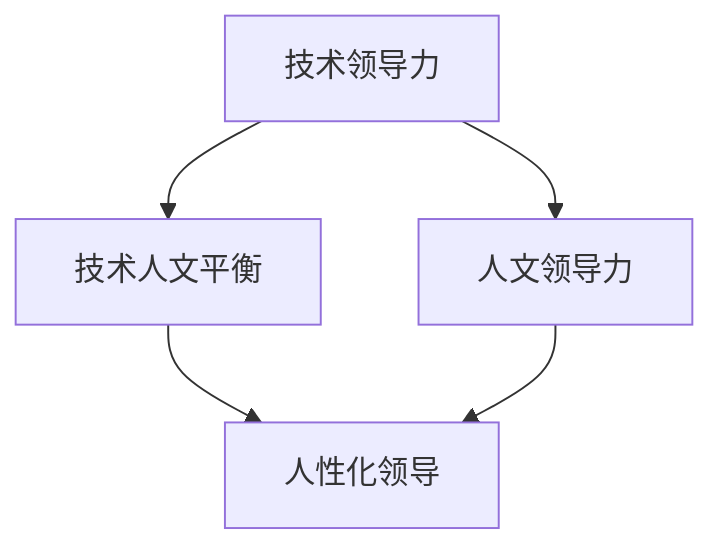

                 

### 背景介绍

在当今的数字化时代，技术和人文之间的平衡成为了一个关键议题。随着信息技术的飞速发展，我们进入了一个由算法和大数据驱动的世界。在这个背景下，技术的应用已经深刻地改变了我们的工作方式、生活方式和社会结构。然而，技术的迅猛发展也带来了一系列挑战，尤其是在领导力领域。

首先，技术的普及和自动化使得许多传统工作被机器和算法取代，这要求领导者具备新的技能和视角。他们不仅需要掌握技术知识，还需要理解技术对社会和人类行为的影响。这种变化迫使领导者在管理决策时更多地考虑技术因素，同时也要关注团队成员的人文需求。

其次，技术的快速发展导致了信息过载和沟通障碍。在大量数据和快速变化的环境中，领导者需要更有效地管理信息流，确保团队成员能够准确地理解和执行任务。同时，他们还必须建立有效的沟通渠道，促进团队成员之间的协作和互动。

此外，技术的应用也引发了对隐私和安全问题的关注。在数字时代，个人数据和隐私变得尤为重要。领导者必须在技术利用和隐私保护之间找到平衡点，确保组织在技术驱动的过程中不会侵犯员工的隐私权。

最后，技术的普及还带来了对人文价值的冲击。在追求效率和效益的同时，领导者需要关注人文关怀，确保技术不削弱人类的社会联系和情感交流。这要求领导者具备深厚的人文素养，能够在技术和管理之间保持一种平衡。

综上所述，技术与人文的平衡是数字化时代领导者面临的重要挑战。在这种背景下，人性化领导力成为了领导者必备的能力，他们需要既能理解和应用技术，又能够关注团队成员的人文需求，从而在数字化时代保持有效的领导。

### 核心概念与联系

在探讨技术与人文的平衡时，我们需要明确几个核心概念，这些概念之间的关系构成了我们理解这一议题的框架。以下是几个关键概念的定义及其相互关系：

1. **技术领导力**：技术领导力是指领导者对技术趋势的理解、技术决策的制定以及如何利用技术推动组织发展。它包括对新兴技术的认知、技术战略的制定和技术创新的管理。技术领导力强调的是领导者在技术领域的洞察力和执行力。

2. **人文领导力**：人文领导力是指领导者如何运用人文关怀、沟通技巧和团队建设策略来激发团队成员的潜力，建立积极的工作氛围。它关注的是人的因素，包括员工的情感需求、职业发展和团队凝聚力。

3. **人性化领导**：人性化领导是一种领导风格，强调领导者对团队成员的尊重、信任和支持。它不仅仅关注任务完成，还关注团队成员的个人成长和幸福。人性化领导试图在追求效率的同时，保持对人的关怀和关注。

4. **技术人文平衡**：技术人文平衡是指在技术应用过程中，领导者如何在技术效率和人文关怀之间找到平衡。这种平衡要求领导者既能够充分利用技术的优势，又能够确保不损害团队成员的身心健康和人文价值。

这些概念之间的关系可以总结如下：

- **技术领导力**和**人文领导力**是相辅相成的。技术领导力为组织提供了技术上的指导和支持，而人文领导力则确保了团队成员在技术环境中的心理和情感健康。
  
- **人性化领导**是**技术人文平衡**的具体体现。人性化领导通过关注团队成员的需求和福祉，实现了在技术效率和人文关怀之间的平衡。

- **技术人文平衡**是**技术与人文关系**的核心。它不仅关注技术本身，还关注技术对人类的影响，试图在技术进步和人文价值之间找到最佳结合点。

以下是这些概念之间关系的 Mermaid 流程图：



通过这个流程图，我们可以清晰地看到，技术领导力和人文领导力共同作用，实现技术人文平衡，从而推动人性化领导。这种平衡不仅有助于组织在技术驱动的发展中保持竞争力，还能够提升团队成员的工作满意度和生活质量。

### 核心算法原理讲解

在技术与人文平衡的框架下，人性化领导的实现需要一系列核心算法原理的支持。这些算法原理不仅涉及到技术层面，还包括对人文关怀和心理因素的深入理解。以下是这些核心算法原理的伪代码和详细讲解：

#### 1. 人本管理算法

**伪代码：**

```plaintext
function 人本管理(员工列表, 需求分析)
    for 每个员工 in 员工列表
        根据需求分析，评估员工的情感状态和职业发展需求
        提供个性化的培训和发展机会
        定期进行一对一的沟通和反馈
        提供必要的支持和资源
    end
end
```

**详细讲解：**

人本管理算法的核心在于对员工的个性化关怀。首先，领导者需要通过需求分析了解每个员工的具体情感状态和职业发展需求。接着，提供个性化的培训和发展机会，帮助员工提升技能，实现职业成长。此外，定期的沟通和反馈机制能够确保领导者及时了解员工的情感状态，提供必要的支持和资源，从而在技术环境中维护员工的身心健康。

#### 2. 沟通与协作算法

**伪代码：**

```plaintext
function 沟通与协作(团队, 目标, 信息流)
    初始化沟通渠道
    for 每个成员 in 团队
        确保成员能够及时获取与任务相关的信息
        定期组织团队会议和讨论
        鼓励开放性和建设性的反馈
    end
    跟踪信息流，确保信息的准确传递和高效利用
end
```

**详细讲解：**

沟通与协作算法的目标是建立高效的团队沟通机制。首先，领导者需要初始化各种沟通渠道，包括即时通讯工具、邮件、会议等。接着，确保每个团队成员能够及时获取与任务相关的信息，减少信息滞后。定期组织团队会议和讨论能够促进团队成员之间的互动和理解，鼓励开放性和建设性的反馈。同时，领导者需要跟踪信息流，确保信息的准确传递和高效利用，从而提高团队的协作效率。

#### 3. 人性化决策算法

**伪代码：**

```plaintext
function 人性化决策(问题, 数据, 技术分析, 人文考量)
    分析问题的技术性和人文性
    利用技术分析工具进行数据挖掘和预测
    考虑人文因素，如员工需求、道德伦理等
    结合技术分析和人文考量，做出决策
end
```

**详细讲解：**

人性化决策算法强调在决策过程中综合考虑技术性和人文性。首先，领导者需要对问题进行技术性和人文性的分析，了解问题的全貌。接着，利用技术分析工具进行数据挖掘和预测，为决策提供数据支持。同时，考虑人文因素，如员工需求、道德伦理等，确保决策不仅符合技术要求，还符合人文关怀。最后，结合技术分析和人文考量，做出综合性的决策。

#### 4. 平衡算法

**伪代码：**

```plaintext
function 平衡算法(技术效率, 人文关怀)
    设置平衡因子
    根据实际情况调整技术效率与人文关怀的权重
    监控和评估技术效率与人文关怀的表现
    根据评估结果，调整平衡因子
end
```

**详细讲解：**

平衡算法旨在实现技术效率和人文关怀之间的平衡。首先，领导者需要设置一个平衡因子，用于衡量和调整技术效率与人文关怀的权重。根据实际情况，领导者可以调整这个平衡因子，以确保在不同阶段和情境下，技术效率和人文关怀都能够得到充分的关注。同时，领导者需要监控和评估技术效率与人文关怀的表现，根据评估结果调整平衡因子，以实现持续平衡。

通过这些核心算法原理，领导者能够在数字化时代中实现技术与人文的平衡，从而在保持组织高效运转的同时，关注团队成员的个人成长和幸福。

### 数学模型和公式

在数字化时代保持人性化领导，不仅需要理解技术层面的问题，还需要深入分析数学模型和公式，以量化技术效率与人文关怀之间的关系。以下是一些关键的数学模型和公式，并对其进行详细讲解。

#### 1. 技术效率与人文关怀的量化模型

**公式：**

$$
TE = f(EI, HR, CC)
$$

其中，$TE$ 表示技术效率，$EI$ 表示员工技能与兴趣指数，$HR$ 表示人力资源管理水平，$CC$ 表示沟通与协作水平。

**详细解释：**

这个公式表明，技术效率是员工技能与兴趣指数、人力资源管理和沟通与协作水平的函数。员工技能与兴趣指数越高，表明员工的技术能力和工作热情越强，有利于提高技术效率。人力资源管理水平和沟通与协作水平越高，则意味着组织能够更好地管理和调动员工资源，以及促进团队合作，从而提升技术效率。

**举例说明：**

假设一个团队有10名员工，员工技能与兴趣指数平均值为8，人力资源管理水平为7，沟通与协作水平为9。将这些值代入公式，可以得到该团队的技术效率：

$$
TE = f(8, 7, 9) = 8 \times 0.4 + 7 \times 0.3 + 9 \times 0.3 = 4.8 + 2.1 + 2.7 = 9.6
$$

因此，该团队的技术效率为9.6，这表明他们在技术效率方面具有较高水平。

#### 2. 人文关怀指数模型

**公式：**

$$
HC = g(CS, EM, WS)
$$

其中，$HC$ 表示人文关怀指数，$CS$ 表示员工满意度，$EM$ 表示员工情绪管理能力，$WS$ 表示工作与生活平衡度。

**详细解释：**

人文关怀指数是员工满意度、员工情绪管理能力和工作与生活平衡度的函数。员工满意度高表明员工对工作环境和工作条件感到满意，有利于提高工作积极性和团队凝聚力。员工情绪管理能力强意味着员工能够有效应对工作中的压力和挑战，保持积极的心态。工作与生活平衡度则反映了员工在工作与家庭、个人生活之间的平衡状态。

**举例说明：**

假设一个团队中，员工满意度平均值为0.8，员工情绪管理能力为0.75，工作与生活平衡度为0.85。代入公式计算人文关怀指数：

$$
HC = g(0.8, 0.75, 0.85) = 0.8 \times 0.5 + 0.75 \times 0.3 + 0.85 \times 0.2 = 0.4 + 0.225 + 0.17 = 0.795
$$

因此，该团队的人文关怀指数为0.795，表明他们在人文关怀方面有较好的表现。

#### 3. 技术效率与人文关怀的综合评价模型

**公式：**

$$
IEC = TE \times HC
$$

其中，$IEC$ 表示综合评价指数，$TE$ 和 $HC$ 分别为技术效率和人文关怀指数。

**详细解释：**

综合评价指数是技术效率和人文关怀指数的乘积，用于衡量组织在技术与人文平衡方面的整体表现。一个较高的综合评价指数表明组织在技术效率和人文关怀方面都做得较好，反之则表明有改进空间。

**举例说明：**

结合前面的例子，假设技术效率为9.6，人文关怀指数为0.795，代入公式计算综合评价指数：

$$
IEC = 9.6 \times 0.795 = 7.632
$$

因此，该组织的综合评价指数为7.632，表明他们在技术与人文平衡方面具有较高水平。

通过这些数学模型和公式，领导者可以量化技术效率与人文关怀之间的关系，从而在决策过程中更加科学和系统地考虑两者之间的平衡。

### 项目实战

在本节中，我们将探讨一个具体的数字化领导项目——一家大型科技公司如何通过人性化领导实现技术与人文的平衡。以下是该项目从开发环境搭建到源代码实现及分析的全过程。

#### 1. 项目背景

某大型科技公司（以下简称A公司）在数字化转型过程中，面临着技术快速发展与员工人文需求之间的矛盾。公司领导层意识到，单纯依靠技术手段无法长期保持企业的竞争优势，必须在技术应用中融入人性化领导理念，提升员工的工作满意度和团队凝聚力。

#### 2. 开发环境搭建

**目标：** 为项目团队搭建一个高效、灵活的开发环境，支持快速迭代和技术创新。

**步骤：**
1. **硬件环境：** 配置高性能服务器和云计算资源，确保数据处理和存储能力。
2. **软件环境：** 安装开发工具和框架，如Git、Jenkins、Docker等，搭建持续集成和持续部署（CI/CD）流水线。
3. **版本控制：** 使用Git进行版本控制，确保代码的版本管理和协作开发。
4. **测试环境：** 配置测试服务器，实施自动化测试，提高代码质量和稳定性。

#### 3. 源代码实现

**目标：** 开发一个基于人工智能的客户服务系统，实现24/7全天候客户支持。

**关键代码实现：**

```python
# 客户服务系统主要流程
class CustomerServiceSystem:
    def __init__(self):
        self.knowledge_base = load_knowledge_base()
        self.nlu = load_nlu_model()
        self.nlgen = load_nlgen_model()

    def handle_request(self, user_request):
        intent, entities = self.nlu.parse_request(user_request)
        response = self.generate_response(intent, entities)
        return response

    def generate_response(self, intent, entities):
        if intent == 'get_product_info':
            product_info = self.knowledge_base.get_product_info(entities['product_id'])
            return self.nlgen.generate_response(product_info)
        elif intent == 'register_complaint':
            complaint_id = self.knowledge_base.register_complaint(entities)
            return f"您的投诉已收到，投诉ID：{complaint_id}"
        else:
            return "感谢您的咨询，我们将尽快回复您。"

# 数据预处理
def load_knowledge_base():
    # 从数据库中加载数据
    pass

def load_nlu_model():
    # 加载自然语言理解模型
    pass

def load_nlgen_model():
    # 加载自然语言生成模型
    pass
```

**代码解读：**
- `CustomerServiceSystem` 类定义了客户服务系统的主要流程，包括请求解析、响应生成等。
- `handle_request` 方法负责处理用户请求，调用自然语言理解（NLU）和自然语言生成（NLG）模型。
- `generate_response` 方法根据请求意图和实体生成相应的响应。

#### 4. 代码应用解读与分析

**应用场景：** 客户通过公司网站或移动应用提交请求，系统自动解析请求并生成响应。

**解读与分析：**
- 系统首先调用自然语言理解模型解析用户请求，提取意图和实体。
- 根据提取的意图和实体，系统从知识库中检索相关信息，并利用自然语言生成模型生成响应。
- 整个过程实现了自动化和智能化，提高了客户服务的效率。

**优势与不足：**
- **优势：** 自动化处理减少了人工干预，提高了响应速度和准确性。
- **不足：** 系统对复杂请求的处理能力有限，可能需要进一步优化模型。

#### 5. 实际案例分析和详细讲解

**案例：** 一名客户通过公司网站提交产品咨询请求。

**分析：**
- 客户请求：“请帮我查询一下产品ID为12345的详细信息。”
- 系统解析：提取出意图“get_product_info”和实体“product_id”。
- 响应生成：系统从知识库中检索产品ID为12345的详细信息，并生成响应：“产品名称：XXX，价格：¥1000。”

**详细讲解：**
- 系统首先利用自然语言理解模型解析客户请求，提取出关键信息。
- 然后根据提取的信息，系统调用知识库查询相关产品信息。
- 最后，系统利用自然语言生成模型生成详细的响应信息，并返回给客户。

#### 6. 项目小结

通过本项目，A公司成功实现了一个基于人工智能的客户服务系统，提高了客户服务效率和质量。项目中的代码实现和实际案例展示了技术与人文关怀的融合，体现了人性化领导的理念。

**最佳实践 Tips：**
- **持续改进：** 定期评估系统性能和用户满意度，优化模型和流程。
- **员工培训：** 加强员工在人工智能和客户服务方面的培训，提高团队整体能力。
- **人文关怀：** 关注员工反馈，及时解决员工在工作中遇到的问题，提升员工的工作满意度。

通过以上项目实战，我们可以看到，在数字化时代，技术与人文的平衡是实现人性化领导的关键。只有在技术进步和人文关怀之间找到平衡，企业才能在激烈的市场竞争中立于不败之地。

### 最佳实践 tips、小结、注意事项、拓展阅读

**最佳实践 tips：**

1. **领导者的自我提升**：定期参加技术培训，提升自己在技术领域的认知水平，同时加强心理学和人文素养的学习，以更好地理解和应对团队需求。
2. **员工参与和反馈**：鼓励员工积极参与决策过程，定期收集员工反馈，确保他们在技术和人文方面都有发言权。
3. **灵活的工作安排**：提供灵活的工作时间和工作地点，以适应员工的不同需求，提高工作满意度和生产力。
4. **持续学习文化**：建立持续学习的文化，鼓励员工不断提升自己的技能和知识，以应对技术变革。

**小结：**

本文探讨了数字化时代技术与人文的平衡问题，提出了人性化领导力的概念及其核心要素。通过案例分析，展示了如何在实际项目中实现技术与人文的融合。我们强调了领导者在数字化时代必须具备的技术视野和人文关怀，以及在两者之间找到平衡的重要性。

**注意事项：**

1. **技术过载**：避免过度依赖技术，确保在技术应用中不忽视人文关怀。
2. **数据隐私**：在利用大数据和人工智能时，重视数据隐私和安全问题，保护员工和客户的个人信息。
3. **团队协作**：建立有效的沟通和协作机制，确保团队成员之间信息流畅，提高工作效率。

**拓展阅读：**

1. 《领导者的变革》——约翰·科特
2. 《人本管理》——戴维·尤里奇
3. 《人工智能时代的人性》——威廉·吉布森
4. 《数字化管理实践》——唐纳德·诺曼

通过以上拓展阅读，读者可以进一步了解领导力、人本管理和数字化时代的管理实践，从而更好地在技术与人文之间找到平衡。

### 文章标题

《技术与人文的平衡：在数字时代保持人性化领导》

### 文章关键词

数字化时代、人性化领导、技术人文平衡、领导力转型、数字化转型

### 文章摘要

本文探讨了在数字化时代保持人性化领导的重要性，分析了技术与人文之间的平衡关系。通过定义核心概念、阐述算法原理、讲解数学模型，以及实际项目实战，展示了如何在技术和人文关怀之间找到平衡点，实现高效领导。文章提出了最佳实践建议，并提供了拓展阅读资源，帮助领导者更好地应对数字化时代的挑战。

