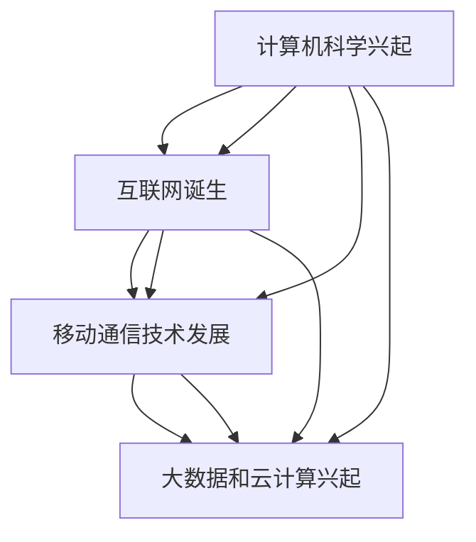
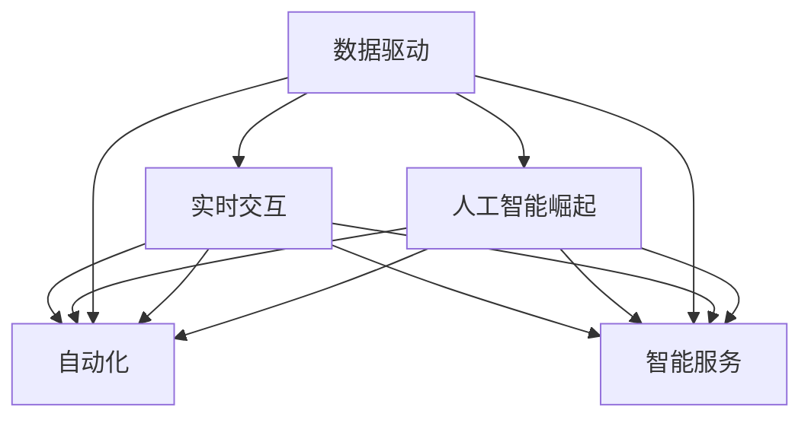

                 

### 第一部分：引言与背景

**关键词：** 数字时代、信息化社会、领导力、人性化

**摘要：** 本文首先介绍了数字时代的历史背景和特征，探讨了数字化对组织和社会的影响，引出了数字化时代领导力的变革需求。随后，文章提出了人性化领导的核心理念，为后续内容的展开奠定了基础。

---

**1.1 数字时代的历史背景**

数字时代，也称为信息化时代，是指信息技术快速发展，数据成为关键生产要素的时代。这一时代的到来，源于20世纪中后期信息技术的迅猛发展，特别是计算机科学、互联网、移动通信等技术的突破。以下是数字时代的历史背景：

1. **计算机科学的兴起：** 20世纪40年代，计算机诞生，标志着信息处理方式的革命。随着计算机硬件和软件的不断进步，数据处理能力大幅提升。

2. **互联网的普及：** 20世纪90年代，互联网在全球范围内迅速普及，信息共享和传播变得更加便捷，社会进入了一个全新的信息时代。

3. **移动通信技术的发展：** 21世纪初，移动通信技术迅速发展，智能手机的普及使得信息获取和处理变得无处不在。

4. **大数据和云计算：** 随着数据量的爆炸性增长，大数据和云计算技术应运而生，为企业提供了强大的数据处理和分析能力。

**1.2 数字化的社会影响**

数字化的普及对社会组织和社会结构产生了深远的影响：

1. **组织结构变革：** 数字化带来了组织结构的扁平化，减少了层级，提高了组织的灵活性和响应速度。

2. **知识管理新模式：** 数字化促进了知识的快速传播和共享，改变了知识管理的模式，知识的创造和利用变得更加高效。

3. **信息不对称的消解：** 数字化使得信息的获取更加便捷，信息不对称现象逐渐减弱，为更加公平的竞争环境创造了条件。

4. **劳动市场变革：** 数字化带来了新的工作形式，如远程办公、灵活用工等，改变了传统的劳动市场结构。

**1.3 数字时代的特征**

数字时代具有以下几个显著特征：

1. **数据驱动：** 数据成为决策的重要依据，数据分析能力成为企业竞争力的关键。

2. **实时交互：** 数字技术使得信息传递变得即时，推动了实时交互的普及。

3. **人工智能的崛起：** 人工智能在数字时代发挥着越来越重要的作用，从生产自动化到智能决策，都在改变着传统的工作方式。

**小结：**

数字时代的到来，不仅改变了我们的生活方式，也对领导力提出了新的要求。领导者在数字时代需要具备更加开放的心态、更强的适应能力和创新精神，同时还需要注重人性化领导，平衡技术与人文的关系。本文接下来的部分将进一步探讨这些主题，为数字时代的领导力提供理论支持和实践指南。

### 1.1 数字时代的历史背景

数字时代，亦称信息化时代，其历史背景可以追溯到20世纪中叶。当时，计算机科学和信息技术的萌芽为数字时代的到来奠定了基础。以下是数字时代发展的几个关键阶段：

1. **计算机科学的兴起（1940年代至1960年代）：**
   - **1946年**：世界上第一台电子计算机ENIAC在美国诞生，标志着计算机时代的开始。
   - **1950年代**：冯·诺依曼提出了存储程序计算机的概念，这一设计思想至今仍被广泛采用。
   - **1960年代**：集成电路的出现极大地提高了计算机的运算速度和性能，使得计算机更加小巧、便宜。

2. **互联网的诞生（1970年代至1990年代）：**
   - **1971年**：ARPANET（美国国防高级研究计划局网络）首次运行，这是互联网的雏形。
   - **1980年代**：互联网开始向学术界和商业领域扩展，电子邮件和文件传输协议（FTP）等应用逐渐普及。
   - **1990年代**：万维网（WWW）的出现使得互联网的易用性和影响力大幅提升，网页浏览器如Netscape Navigator和Internet Explorer的普及加速了互联网的全球化。

3. **移动通信技术的发展（1990年代至2010年代）：**
   - **1990年代**：第一代移动通信技术（1G）的出现，使得手机开始普及。
   - **2000年代**：第二代移动通信技术（2G）和第三代移动通信技术（3G）的发展，提供了更快的传输速度和数据服务。
   - **2010年代**：第四代移动通信技术（4G）和第五代移动通信技术（5G）的推出，为高速、低延迟的通信奠定了基础。

4. **大数据和云计算的兴起（2000年代至今）：**
   - **2000年代**：随着互联网的普及，数据量呈指数级增长，大数据的概念应运而生。
   - **2010年代**：云计算技术的兴起，使得数据存储和处理变得更加高效和灵活。
   - **2020年代**：人工智能与大数据、云计算的结合，进一步推动了数字化的进程。

**核心概念原理之间的关系架构：**

以下是一个用Mermaid绘制的数字时代发展过程的关系图：



**核心算法原理讲解：**

在数字时代，算法原理无处不在。以下是几个关键算法的简单概述：

1. **排序算法：**
   - **冒泡排序（Bubble Sort）：**
     ```plaintext
     function bubbleSort(arr) {
         for (let i = 0; i < arr.length - 1; i++) {
             for (let j = 0; j < arr.length - i - 1; j++) {
                 if (arr[j] > arr[j + 1]) {
                     [arr[j], arr[j + 1]] = [arr[j + 1], arr[j]];
                 }
             }
         }
         return arr;
     }
     ```
   - **快速排序（Quick Sort）：**
     ```plaintext
     function quickSort(arr) {
         if (arr.length <= 1) {
             return arr;
         }
         const pivot = arr[arr.length - 1];
         const left = [];
         const right = [];
         
         for (const el of arr.slice(0, arr.length - 1)) {
             if (el < pivot) {
                 left.push(el);
             } else {
                 right.push(el);
             }
         }
         return [...quickSort(left), pivot, ...quickSort(right)];
     }
     ```

2. **机器学习算法：**
   - **决策树（Decision Tree）：**
     决策树是一种分类和回归算法，通过一系列规则将数据分为不同的类别或预测数值。以下是决策树的简单伪代码：
     ```plaintext
     function decisionTree(data) {
         if (data meet stop criteria) {
             return predicted value;
         }
         
         select best feature;
         split data based on feature values;
         for each subset of data {
             recursive call to decisionTree();
         }
         
         combine predictions from subsets to generate final prediction;
     }
     ```

**数学模型和公式：**

数字时代的一些核心数学模型和公式包括：

1. **泰勒展开（Taylor Expansion）：**
   $$ f(x) = f(a) + f'(a)(x-a) + \frac{f''(a)}{2!}(x-a)^2 + \frac{f'''(a)}{3!}(x-a)^3 + \ldots $$

2. **贝叶斯定理（Bayes' Theorem）：**
   $$ P(A|B) = \frac{P(B|A)P(A)}{P(B)} $$

3. **线性回归（Linear Regression）：**
   $$ y = \beta_0 + \beta_1x + \epsilon $$

   其中，\( y \) 是因变量，\( x \) 是自变量，\( \beta_0 \) 和 \( \beta_1 \) 是回归系数，\( \epsilon \) 是误差项。

**举例说明：**

假设我们要用线性回归模型预测某个商品的销售量，数据如下表：

| 时间（天） | 销售量 |
|------------|--------|
| 1          | 50     |
| 2          | 60     |
| 3          | 70     |
| 4          | 80     |
| 5          | 90     |

使用线性回归模型，我们可以预测第六天的销售量。首先，我们需要计算回归系数 \( \beta_0 \) 和 \( \beta_1 \)。通过最小二乘法，我们得到：

$$ \beta_0 = 45, \beta_1 = 15 $$

因此，第六天的销售量预测为：

$$ y = 45 + 15 \times 6 = 105 $$

**小结：**

数字时代的历史背景涉及多个关键阶段和技术突破。从计算机科学的兴起、互联网的诞生，到移动通信技术的发展，再到大数据和云计算的兴起，每一个阶段都在推动着社会的数字化进程。在这一进程中，算法原理、数学模型和公式发挥着核心作用，为数据处理、决策支持和预测提供了强有力的工具。理解这些核心概念和原理，有助于我们更好地把握数字时代的发展趋势，并为未来的数字化领导提供理论支持。

### 1.2 数字化的社会影响

数字化的浪潮不仅改变了我们的生活方式，也深刻地影响了社会组织结构和社会行为模式。以下是数字化对社会影响的几个关键方面：

**1. 组织结构变革**

数字化带来了组织结构的变革，使得传统的层级化、中央集权的组织模式逐渐向扁平化、去中心化的方向演变。以下是数字化对组织结构变革的几个主要影响：

- **减少层级：** 随着信息技术的发展，组织内部的信息传递速度显著提高，层级之间的信息壁垒逐渐被打破。这导致了许多企业减少中间管理层，组织结构变得更加扁平。
- **提高灵活性和适应性：** 数字化使得企业能够快速响应市场变化，通过灵活的组织结构来适应不同的业务需求。
- **分布式工作：** 数字化促进了远程办公和分布式工作模式的兴起，员工不再受限于地理位置，这使得企业能够更容易地吸引全球范围内的优秀人才。

**2. 知识管理新模式**

数字化时代，知识的产生、传播和利用方式发生了根本性的变化。以下是数字化对知识管理的新模式的影响：

- **知识的快速传播：** 互联网和社交媒体的普及，使得知识可以迅速在全球范围内传播，打破了传统知识传播的时空限制。
- **知识共享：** 数字化工具使得知识共享变得更加便捷，企业内部的知识库和外部共享平台有助于知识的积累和传播。
- **智慧化知识管理：** 人工智能和大数据分析技术的应用，使得知识管理更加智能化，能够更好地发现和利用知识。

**3. 信息不对称的消解**

数字化时代，信息不对称的现象逐渐减弱，主要体现在以下几个方面：

- **数据获取更加容易：** 随着互联网和大数据技术的发展，人们可以更轻松地获取大量的信息，信息的透明度提高。
- **市场竞争更加公平：** 信息的不对称性减少，市场竞争更加公平，中小企业也有机会与大型企业竞争。
- **消费者权益保护：** 数字化使得消费者能够更容易地获取商品和服务的相关信息，提高了消费者的权益保护水平。

**4. 劳动市场变革**

数字化对劳动市场产生了深远的影响，主要体现在以下几个方面：

- **新工作形式：** 数字化带来了远程办公、灵活用工等新的工作形式，使员工能够更加灵活地安排工作时间。
- **技能需求变化：** 随着数字化技术的发展，劳动市场的技能需求发生了变化，对数字技能和创新能力的需求日益增加。
- **就业机会扩大：** 数字化创造了大量新的就业机会，特别是在信息技术、电子商务等领域。

**小结：**

数字化对社会的影响是多方面的，从组织结构的变革到知识管理的新模式，从信息不对称的消解到劳动市场的变革，数字化正在深刻地改变我们的社会。理解这些变化，有助于我们更好地应对数字化时代带来的挑战，并抓住机遇，推动社会的持续进步。

### 1.3 数字时代的特征

数字时代具有多个显著特征，这些特征不仅定义了这个时代的基本面貌，也深刻影响了社会、经济和组织结构。以下是数字时代的几个关键特征：

**1. 数据驱动**

数据驱动是数字时代的核心特征之一。在传统时代，决策往往依赖于经验和直觉，而数字时代则通过数据分析和决策支持系统来实现更精确的决策。以下是数据驱动的一些重要方面：

- **数据收集和分析：** 企业和个人通过传感器、互联网和社交媒体等渠道收集大量数据，并利用大数据分析技术对这些数据进行分析和挖掘。
- **实时决策：** 数据实时收集和处理的能力，使得决策者能够基于最新的信息做出决策，从而提高决策的准确性和效率。
- **预测分析：** 通过历史数据分析和机器学习模型，企业可以预测未来的趋势和潜在问题，从而更好地规划业务发展。

**2. 实时交互**

实时交互是数字时代的一个重要特征。互联网和移动通信技术的发展，使得人们可以随时随地与他人进行沟通和互动。以下是实时交互的几个方面：

- **社交媒体：** 社交媒体平台如微信、Facebook、Twitter等，使得人们可以实时分享信息和观点，形成全球性的社交网络。
- **即时通讯：** 即时通讯工具如微信、WhatsApp、Slack等，使得人们可以随时进行文字、语音和视频交流，提高了沟通的效率。
- **在线协作：** 云计算和协作工具的发展，使得团队成员可以实时协同工作，提高了项目的进度和质量。

**3. 人工智能的崛起**

人工智能（AI）在数字时代发挥着越来越重要的作用，从生产自动化到智能决策，人工智能正在改变传统的工作方式。以下是人工智能的几个关键方面：

- **自动化：** 人工智能技术在生产制造、物流运输等领域得到广泛应用，实现了生产流程的自动化，提高了生产效率。
- **智能决策：** 人工智能可以帮助企业进行数据分析和预测，从而做出更加明智的决策。
- **智能服务：** 人工智能在客服、金融服务、医疗保健等领域得到应用，提供智能化的服务体验。

**核心概念原理之间的关系架构：**

以下是数字时代特征的Mermaid关系图：



**核心算法原理讲解：**

数字时代的特征依赖于多种算法和技术的支持，以下是几个关键算法的简单解释：

1. **机器学习（Machine Learning）：**
   机器学习是一种通过算法让计算机从数据中学习并做出预测或决策的技术。以下是简单的监督学习算法——线性回归的伪代码：
   ```plaintext
   function linearRegression(X, y) {
       // 计算X的均值和y的均值
       X_mean = mean(X)
       y_mean = mean(y)
       
       // 计算X和y的协方差
       covariance = covariance(X, y)
       
       // 计算X的方差
       variance = variance(X)
       
       // 计算回归系数
       beta = covariance / variance
       
       // 计算截距
       intercept = y_mean - (beta * X_mean)
       
       return [intercept, beta]
   }
   ```

2. **神经网络（Neural Networks）：**
   神经网络是一种模拟人脑结构的计算模型，用于处理复杂的数据和任务。以下是简单的神经网络结构的伪代码：
   ```plaintext
   function neuralNetwork(input, weights, biases) {
       // 计算输入的加权和
       z = dot_product(input, weights) + biases
       
       // 激活函数（如ReLU、Sigmoid或Tanh）
       output = activation_function(z)
       
       return output
   }
   ```

3. **深度学习（Deep Learning）：**
   深度学习是神经网络的扩展，用于处理大量的数据和复杂的任务。以下是简单的卷积神经网络（CNN）的伪代码：
   ```plaintext
   function convolutionalNeuralNetwork(input, filters) {
       // 进行卷积操作
       conv_output = convolution(input, filters)
       
       // 添加ReLU激活函数
       relu_output = ReLU(conv_output)
       
       // 池化操作
       pooled_output = maxPooling(relu_output)
       
       return pooled_output
   }
   ```

**数学模型和公式：**

数字时代的许多应用依赖于数学模型和公式，以下是几个关键的数学模型和公式：

1. **逻辑回归（Logistic Regression）：**
   逻辑回归是一种用于分类的机器学习算法，其公式如下：
   $$ P(y=1) = \frac{1}{1 + e^{-(\beta_0 + \beta_1x_1 + \beta_2x_2 + \ldots + \beta_nx_n)}} $$
   其中，\( \beta_0, \beta_1, \ldots, \beta_n \) 是回归系数，\( x_1, x_2, \ldots, x_n \) 是特征值。

2. **支持向量机（Support Vector Machine, SVM）：**
   支持向量机是一种用于分类和回归的机器学习算法，其公式如下：
   $$ w \cdot x - b = 0 $$
   其中，\( w \) 是权重向量，\( x \) 是特征向量，\( b \) 是偏置项。

3. **线性规划（Linear Programming）：**
   线性规划是一种用于优化线性函数的数学方法，其公式如下：
   $$ \max_{x} c^T x $$
   $$ \text{subject to} $$
   $$ Ax \leq b $$
   其中，\( c \) 是目标函数系数向量，\( A \) 是约束矩阵，\( b \) 是约束向量。

**举例说明：**

假设我们要用逻辑回归模型预测一个客户是否属于高风险群体。我们有以下数据：

| 特征1 | 特征2 | 是否高风险 |
|-------|-------|-----------|
| 0.5   | 0.8   | 否        |
| 0.7   | 0.3   | 是        |
| 0.2   | 0.6   | 否        |

使用逻辑回归模型，我们可以预测新客户的属于高风险的概率。首先，我们需要计算回归系数。通过最小二乘法，我们得到：

$$ \beta_0 = 0.1, \beta_1 = 0.3, \beta_2 = 0.2 $$

因此，对于特征1为0.4，特征2为0.5的新客户，高风险的概率为：

$$ P(y=1) = \frac{1}{1 + e^{-(0.1 + 0.3 \times 0.4 + 0.2 \times 0.5)}} \approx 0.38 $$

这表示新客户属于高风险的概率大约为38%。

**小结：**

数字时代的特征包括数据驱动、实时交互和人工智能的崛起。这些特征不仅定义了数字时代的基本面貌，也对社会的各个方面产生了深远的影响。理解这些特征，有助于我们更好地把握数字时代的发展趋势，并利用其优势推动社会的进步。

### 2. 数字时代的组织变革

数字时代的到来，不仅改变了人们的生活方式和消费模式，也深刻影响了企业的组织结构和管理方式。在这个数字化和智能化日益渗透的时代，企业的组织变革势在必行。以下将探讨数字化对组织结构的影响，以及数字化时代对领导力提出的新挑战。

**2.1 数字化对组织结构的影响**

数字化对组织结构的影响主要体现在以下几个方面：

**1. 去中心化与网络化**

传统的组织结构往往依赖于层级管理和垂直控制，而数字化推动了组织结构的去中心化和网络化。去中心化指的是组织权力和资源的分散，网络化则是通过信息技术将分散的个体或团队紧密联系在一起。数字化使企业能够更加灵活地调整组织结构，快速响应市场变化。

- **团队协作平台：** 企业利用各种协作工具，如Slack、Trello、Asana等，打破部门界限，实现跨部门的协作和沟通。
- **分布式团队：** 随着远程办公的普及，企业可以组建全球化的分布式团队，利用不同地区的优势资源。

**2. 灵活性与适应性**

数字技术的应用提高了企业的灵活性和适应性，使得组织能够在动态的市场环境中迅速调整策略。

- **敏捷管理：** 敏捷管理方法，如Scrum和Kanban，通过短周期迭代和持续反馈，帮助企业在快速变化的市场中保持竞争力。
- **敏捷组织：** 敏捷组织的架构强调小团队、跨职能和快速响应，使得组织能够更好地适应变化。

**2.2 知识管理新模式**

数字化带来了知识管理的新模式，知识不再仅限于文件和文档，而是通过网络和数据库进行共享和传播。

- **知识图谱：** 利用人工智能和图论技术，企业可以构建知识图谱，将分散的知识点进行关联和整合。
- **持续学习：** 企业通过在线学习和培训平台，鼓励员工不断学习和成长，提高整体知识水平和创新能力。

**3. 信息不对称的消解**

数字化时代，信息传播的速度和范围都大大增加，信息不对称现象逐渐减弱。

- **透明化：** 企业通过公开数据和透明化运营，增强客户和员工的信任。
- **反馈机制：** 企业通过社交媒体和客户反馈平台，及时获取用户意见和市场动态，快速调整产品和服务。

**2.3 数字时代对领导力提出的新挑战**

数字时代的变革不仅影响了组织结构，也对领导力提出了新的要求。

**1. 技术与人文的平衡**

在数字时代，领导者不仅需要掌握技术知识，还必须理解人文关怀。平衡技术与人文，实现技术与人文的融合，是数字化领导的重要任务。

- **技术赋能：** 领导者应通过技术手段提升组织效率和创新能力，同时注重员工的技能提升和职业发展。
- **人文关怀：** 领导者应关注员工的情感和需求，建立信任和尊重的团队文化。

**2. 激励与成长**

数字化时代，员工的成长和发展需求更加多样化，领导者需要提供个性化的激励和成长路径。

- **赋能文化：** 领导者应鼓励员工自主创新，提供资源和支持，帮助员工实现个人目标和组织目标的一致。
- **持续学习：** 领导者应倡导终身学习理念，为员工提供学习机会和成长空间。

**3. 领导者的认知能力提升**

数字时代的信息量巨大，领导者需要具备更高的认知能力，能够快速理解和应用新技术。

- **数据分析能力：** 领导者应具备基本的数据分析能力，能够从海量数据中提取有价值的信息，支持决策。
- **创新思维：** 领导者应具备创新思维，能够引领团队探索新的业务模式和机会。

**小结：**

数字时代的组织变革带来了新的挑战和机遇。领导者需要在组织结构、知识管理和领导力方面进行适应和变革，以实现技术与人文的平衡，推动组织的持续发展。

### 2.2 数字时代对领导力提出的新挑战

数字时代的崛起，不仅改变了企业的组织结构和管理方式，也对领导者的能力提出了更高的要求。在这个充满变革和不确定性的时代，领导者需要具备以下几种关键能力：

**1. 技术与人文的平衡**

在数字时代，领导者需要同时掌握技术和人文知识。技术知识可以帮助领导者理解数字化工具和平台的作用，而人文知识则有助于领导者理解员工的需求和心理。这种平衡是实现有效领导的关键。

- **技术赋能：** 领导者应主动学习新技术，掌握基本的数据分析技能，以便更好地推动组织的数字化进程。
- **人文关怀：** 领导者需要关注员工的情感和需求，建立信任和尊重的团队文化，确保员工在数字化环境中感受到关怀和支持。

**2. 领导者的认知能力提升**

数字时代的信息量庞大且变化迅速，领导者需要具备更高的认知能力，以快速理解和应对复杂的问题。

- **数据分析能力：** 领导者应具备基本的数据分析能力，能够从海量数据中提取有价值的信息，支持决策。
- **适应能力：** 数字时代的快速变化要求领导者具备较强的适应能力，能够灵活调整策略和应对不确定性。
- **创新思维：** 领导者应具备创新思维，能够引领团队探索新的业务模式和机会，推动组织的持续发展。

**3. 激励与成长**

在数字时代，员工的需求更加多样化，领导者需要提供个性化的激励和成长路径，以激发员工的潜力和动力。

- **赋能文化：** 领导者应鼓励员工自主创新，提供资源和支持，帮助员工实现个人目标和组织目标的一致。
- **持续学习：** 领导者应倡导终身学习理念，为员工提供学习机会和成长空间，帮助他们在数字化环境中不断成长。

**4. 沟通技巧的提升**

数字技术的普及，使得沟通变得更加多样化和复杂化。领导者需要提升沟通技巧，以有效地传达信息和协调团队工作。

- **跨部门沟通：** 领导者应具备跨部门沟通的能力，能够协调不同部门之间的合作和资源。
- **虚拟团队沟通：** 在分布式团队中，领导者需要掌握虚拟团队沟通的技巧，确保团队成员之间的协作和沟通效果。
- **情绪管理：** 领导者应具备良好的情绪管理能力，能够调节自己的情绪，并在面对挑战和压力时保持冷静和积极。

**5. 伦理和社会责任的承担**

数字时代，领导者不仅需要关注组织的商业利益，还应该承担社会责任，关注技术对社会的潜在影响。

- **技术伦理：** 领导者应遵循技术伦理，确保技术应用不会侵犯用户的隐私权和权益。
- **社会责任：** 领导者应积极承担社会责任，推动企业实现可持续发展，为社会做出贡献。

**小结：**

数字时代的领导者需要具备技术与人文的平衡、认知能力的提升、激励与成长、沟通技巧的提升以及伦理和社会责任的承担等关键能力。只有通过不断提升这些能力，领导者才能在数字化时代中引领组织走向成功。

### 3.1 人性化领导的概念解析

人性化领导是一种注重以人为本、关注员工情感和需求的领导方式。它强调领导者不仅要关注组织的绩效和目标，还要关注员工的成长和发展，通过建立信任、激励和合作，推动组织的整体发展。以下是人性化领导的核心概念和其与传统领导力的区别：

**1. 人性化领导的核心概念**

- **以人为本：** 人性化领导将员工的利益和需求置于首位，尊重员工的个性，关注员工的情感和心理健康，为员工创造一个和谐、有安全感的工作环境。
- **信任与尊重：** 人性化领导建立在信任和尊重的基础上，领导者通过真诚和透明的沟通方式，建立与员工的信任关系，尊重员工的意见和决策。
- **激励与成长：** 人性化领导注重激励员工的积极性和创造力，通过提供学习和发展机会，帮助员工实现个人和职业目标。
- **团队合作：** 人性化领导鼓励团队合作，强调团队协作和共同目标，通过建立良好的团队文化，提升团队的整体绩效。
- **领导者的角色：** 人性化领导中的领导者不仅是指挥者和决策者，更是指导者和支持者，领导者通过提供帮助和资源，支持员工实现目标。

**2. 人性化领导与传统领导力的区别**

- **目标导向：** 传统领导力更注重短期目标的实现，而人性化领导则强调长期目标的实现，关注组织的可持续发展。
- **控制与激励：** 传统领导力倾向于通过控制手段实现目标，而人性化领导更注重通过激励和培养员工的内在动机来实现目标。
- **权力结构：** 传统领导力通常采用层级化的权力结构，而人性化领导则倾向于扁平化的组织结构，减少层级，提高决策效率。
- **员工关系：** 传统领导力往往强调员工与组织之间的契约关系，而人性化领导则更加重视员工与组织之间的情感联系和归属感。

**3. 人性化领导的优势**

- **员工满意度：** 人性化领导能够提高员工的满意度和忠诚度，减少员工流失率。
- **创新与创造力：** 通过激励员工的内在动机，人性化领导能够激发员工的创新和创造力，推动组织的持续发展。
- **团队合作：** 人性化领导强调团队合作和共同目标，有助于建立积极的团队文化，提高团队绩效。
- **组织绩效：** 长期来看，人性化领导能够提高组织的整体绩效，实现组织的可持续发展。

**4. 人性化领导的应用场景**

- **创新型企业：** 创新型企业通常注重员工个人的创造力和创新能力，因此人性化领导在这种环境下能够发挥更大的作用。
- **知识密集型企业：** 在知识密集型企业中，员工的知识和技能是组织的重要资产，人性化领导有助于激发员工的潜力，提高组织的知识管理能力。
- **跨国公司：** 跨国公司面临文化差异和多元化的挑战，人性化领导能够帮助领导者更好地理解和沟通不同文化背景的员工。

**总结：**

人性化领导是一种注重以人为本、关注员工情感和需求的领导方式。它强调信任、激励和团队合作，与传统领导力相比，具有更多的优势。在数字时代，人性化领导成为推动组织发展和实现长期目标的重要手段。

### 3.2 人性化领导的原则

人性化领导原则是指导领导者实现有效管理和团队协作的基本准则。这些原则不仅关注组织的绩效目标，更强调员工的成长、发展和满意度。以下是人性化领导的主要原则：

**1. 以人为本**

以人为本是人性化领导的首要原则，意味着领导者应将员工的利益和需求置于首位。具体包括：

- **尊重个性：** 领导者应尊重员工的个性和差异，根据员工的特长和兴趣安排工作，提供发展空间。
- **关注情感：** 领导者应关注员工的情感状态，提供必要的支持和关怀，帮助员工应对工作和生活中的压力。
- **激发潜力：** 领导者应鼓励员工充分发挥潜力，通过挑战性任务和职业发展机会，激发员工的内在动力。

**2. 激励与成长**

激励与成长原则强调领导者应通过多种方式激励员工，促进员工的个人和职业成长。具体包括：

- **目标设定：** 领导者应与员工共同设定清晰、具体的目标，帮助员工明确工作方向和努力目标。
- **奖励机制：** 领导者应建立公平、透明的奖励机制，对员工的努力和成就给予及时的认可和奖励。
- **职业发展：** 领导者应提供职业发展的机会和资源，帮助员工提升技能，实现职业晋升。

**3. 信任与合作**

信任与合作原则强调领导者应建立信任关系，促进团队合作和共同目标的实现。具体包括：

- **建立信任：** 领导者应通过透明、真诚的沟通，建立与员工的信任关系，赢得员工的信任和支持。
- **促进合作：** 领导者应鼓励员工之间的合作，建立跨部门、跨职能的协作机制，推动团队共同完成任务。
- **共同目标：** 领导者应明确团队的目标和愿景，确保团队成员对目标有共同的理解和认同，形成合力。

**4. 持续学习与创新**

持续学习与创新原则强调领导者应倡导终身学习理念，鼓励员工持续学习和创新。具体包括：

- **学习机会：** 领导者应提供学习资源和机会，鼓励员工不断学习新知识和技能。
- **创新文化：** 领导者应营造创新文化，鼓励员工提出创新想法和解决方案，为创新提供支持和资源。
- **鼓励尝试：** 领导者应鼓励员工勇于尝试新事物，从失败中学习，培养员工的创新精神。

**5. 社会责任**

社会责任原则强调领导者应关注企业的社会责任，推动企业实现可持续发展。具体包括：

- **伦理行为：** 领导者应遵循伦理规范，确保企业的经营行为符合法律法规和社会道德标准。
- **环境保护：** 领导者应关注环境保护，推动企业实施绿色生产和节能减排措施。
- **社会贡献：** 领导者应积极履行社会责任，通过公益活动和社会捐赠等方式，为社会做出贡献。

**小结：**

人性化领导的原则包括以人为本、激励与成长、信任与合作、持续学习与创新和社会责任。这些原则为领导者提供了有效的指导，有助于实现组织的长期发展和员工的全面成长。在数字时代，人性化领导成为推动组织进步和提升员工满意度的重要手段。

### 4.1 人性化领导的策略

在数字时代，领导者需要采取一系列策略来实现人性化领导，确保员工在快速变化的环境中感到被尊重、被激励，并能充分发挥他们的潜力。以下是一些关键的人性化领导策略：

**1. 领导者的角色定位**

领导者的角色定位是人性化领导成功的关键。在这个数字时代，领导者不再是单一的管理者或指挥者，而是指导者、支持者和变革推动者。具体策略包括：

- **授权与信任：** 领导者应给予员工更多的自主权和信任，让他们在各自的岗位上发挥最大潜力。通过明确目标和期望，领导者可以减少控制，增强员工的自主性和责任感。
- **沟通与反馈：** 领导者应与员工保持开放、透明的沟通，鼓励员工表达意见和建议。同时，领导者应及时给予反馈，帮助员工了解自己的表现，并指导他们如何改进。
- **个性化管理：** 领导者应认识到每个员工都是独特的个体，根据他们的个性、兴趣和能力提供个性化的关注和指导，帮助员工实现个人和职业发展目标。

**2. 领导风格与人性化的结合**

人性化的领导风格有助于建立积极的团队氛围，提高员工的满意度和工作效率。以下是几种常见的领导风格与人性的结合策略：

- **民主式领导：** 民主式领导鼓励员工参与决策过程，使员工感受到被重视和尊重。领导者应定期组织团队会议，听取员工的意见和建议，并在此基础上做出决策。
- **参与式领导：** 参与式领导强调领导者与员工共同参与目标的设定和任务的执行。领导者应鼓励员工提出创新想法和解决方案，并给予支持和资源，促进团队合作。
- **支持性领导：** 支持性领导关注员工的情感和心理健康，提供必要的支持和帮助。领导者应关注员工的个人需求，提供心理辅导和职业发展规划，帮助员工克服困难，提高工作满意度。

**3. 沟通技巧的提升**

有效的沟通技巧是人性化领导的重要组成部分。以下是一些提升沟通技巧的策略：

- **倾听：** 领导者应学会倾听员工的意见和需求，理解他们的感受和想法。通过积极的倾听，领导者可以建立信任，增强员工的工作动机。
- **表达：** 领导者应清晰、明确地表达自己的期望和要求，确保员工理解任务的重要性和紧急性。同时，领导者应使用积极、鼓励性的语言，增强员工的自信心和积极性。
- **反馈：** 领导者应给予及时、具体、有建设性的反馈，帮助员工了解自己的表现，并指导他们如何改进。同时，领导者应鼓励员工自我反思和自我提升。

**4. 激励与成长策略**

激励与成长是人性化领导的核心原则之一。以下是一些激励和成长策略：

- **目标设定：** 领导者应与员工共同设定有挑战性但可实现的个人和团队目标，帮助员工明确努力方向，激发内在动力。
- **奖励与认可：** 领导者应建立公平、透明的奖励机制，对员工的努力和成就给予及时的认可和奖励，提高员工的满意度和工作积极性。
- **培训与发展：** 领导者应提供多样化的培训和发展机会，帮助员工提升技能，实现职业发展。同时，领导者应鼓励员工自主学习，培养自我提升的能力。

**5. 团队文化建设**

团队文化是人性化领导的重要组成部分。以下是一些团队文化建设策略：

- **共同价值观：** 领导者应明确团队的共同价值观，确保团队成员对团队目标和行为准则有共同的理解和认同。
- **合作与互助：** 领导者应鼓励团队成员之间的合作和互助，建立积极的团队氛围，增强团队的凝聚力和协作效率。
- **庆祝与奖励：** 领导者应定期组织庆祝活动，表彰团队和个人的成就，增强员工的归属感和荣誉感。

**小结：**

人性化领导需要领导者采取一系列策略来实现，包括角色定位、领导风格与人性化的结合、沟通技巧的提升、激励与成长策略以及团队文化建设。通过这些策略，领导者可以建立积极、和谐的团队环境，提高员工的满意度和绩效，推动组织的持续发展。

### 4.2 人性化领导在团队管理中的应用

在数字化时代，团队管理面临诸多挑战，如远程办公的普及、全球团队的协作、跨文化的沟通等。人性化的领导原则在团队管理中显得尤为重要。以下将讨论如何在实际团队管理中应用人性化领导原则，以及团队成员的激励与成长、冲突处理和团队文化建设。

**1. 应用人性化领导原则**

- **关注团队成员：** 领导者应关注团队成员的情感和需求，通过定期的一对一沟通，了解他们的工作状态和心理状况，提供必要的支持和帮助。
- **建立信任关系：** 通过透明、真诚的沟通，领导者可以建立与团队成员的信任关系。信任是团队协作的基石，有助于减少误解和冲突。
- **激励团队成员：** 领导者应制定合理的激励措施，如奖励、认可和晋升机会，激发团队成员的积极性和创造力。

**2. 成员激励与成长**

- **设定明确目标：** 领导者应与团队成员共同设定明确、具体的目标，并制定实现目标的计划和步骤，帮助团队成员明确工作方向和努力目标。
- **提供培训与发展机会：** 领导者应提供多样化的培训和发展机会，如在线课程、工作坊、外部培训等，帮助团队成员提升技能，实现职业发展。
- **鼓励自主学习和创新：** 领导者应鼓励团队成员自主学习和创新，支持他们尝试新的工作方法和解决方案，从失败中学习，不断提升自我。

**3. 冲突处理**

- **及时沟通：** 领导者应鼓励团队成员在面对冲突时及时沟通，表达自己的想法和感受，通过对话解决问题。
- **公正处理：** 领导者应以公正、客观的态度处理冲突，避免偏袒任何一方，确保冲突得到妥善解决。
- **调解和协商：** 当冲突无法通过直接沟通解决时，领导者可以担任调解者的角色，协助双方进行协商，找到共同接受的解决方案。

**4. 团队文化建设**

- **共同价值观：** 领导者应明确团队的共同价值观，确保团队成员对团队目标和行为准则有共同的理解和认同。
- **增强团队凝聚力：** 通过团队建设活动，如团队建设工作坊、团建活动等，增强团队成员之间的互信和凝聚力。
- **营造积极氛围：** 领导者应营造积极、和谐的团队氛围，鼓励团队成员相互支持和鼓励，共同面对挑战。

**案例：**

某跨国科技公司通过人性化领导原则成功管理了一个全球分布式团队。以下是一个具体的案例：

- **角色定位：** 领导者作为指导者和支持者，给予团队成员充分的自主权，鼓励他们根据项目需求制定工作计划。
- **信任关系：** 领导者通过定期的一对一沟通，了解团队成员的工作状态和心理状况，建立信任关系。
- **激励与成长：** 领导者设立明确的目标，并制定详细的计划，帮助团队成员提升技能，实现职业发展。同时，通过奖励和认可，激励团队成员的积极性和创造力。
- **冲突处理：** 当团队成员出现冲突时，领导者及时沟通，协助双方解决问题，确保团队稳定。
- **团队文化建设：** 领导者通过团队建设活动，如定期的在线团建、项目总结会议等，增强团队成员之间的互信和凝聚力。

**小结：**

在数字化时代，人性化领导在团队管理中发挥着重要作用。通过关注团队成员、建立信任关系、激励与成长、冲突处理和团队文化建设，领导者可以有效地管理团队，提高团队绩效和员工满意度。

### 5.1 人性化领导的成功案例

在数字化时代，人性化领导在多个行业中都取得了显著的成功。以下是几个典型的成功案例，以及从中得到的启示和借鉴。

**5.1.1 案例一：高科技企业的领导力实践**

**案例简介：**  
一家全球领先的高科技公司，以其人性化领导力在业内享有盛誉。公司领导者注重员工的职业发展，提供多样化的培训和学习机会，鼓励创新和自主性。同时，公司建立了开放、透明的工作环境，员工可以自由表达意见和建议。

**成功要素：**  
1. **重视员工培训：** 公司定期组织内部培训和外部学习，帮助员工提升技能，实现职业发展。
2. **激励与认可：** 通过奖励、晋升和公开认可，公司激励员工的积极性和创造力。
3. **开放沟通：** 公司鼓励员工自由表达意见和建议，建立了开放、透明的沟通机制。

**启示与借鉴：**  
- **注重员工发展：** 企业应关注员工的职业成长，提供多样化的培训和学习机会。
- **建立激励机制：** 通过奖励和认可，激励员工的积极性和创造力。
- **开放沟通：** 建立开放、透明的沟通环境，鼓励员工自由表达意见和建议。

**5.1.2 案例二：创业公司的领导力经验**

**案例简介：**  
一家初创公司在竞争激烈的市场中脱颖而出，其成功得益于人性化领导的实践。公司领导者注重团队合作，鼓励员工参与决策，营造积极的团队文化。

**成功要素：**  
1. **团队合作：** 领导者鼓励团队合作，让员工参与决策，增强团队凝聚力。
2. **创新文化：** 公司倡导创新文化，鼓励员工提出新想法和解决方案。
3. **灵活管理：** 公司采用灵活的管理模式，给予员工更多的自主权和创造力。

**启示与借鉴：**  
- **鼓励团队合作：** 企业应重视团队合作，让员工参与决策，增强团队凝聚力。
- **创新文化：** 倡导创新文化，鼓励员工提出新想法和解决方案。
- **灵活管理：** 采用灵活的管理模式，给予员工更多的自主权和创造力。

**5.1.3 案例三：传统行业的数字化领导变革**

**案例简介：**  
一家传统制造企业通过数字化领导变革，成功转型为智能化制造企业。公司领导者注重数字化技术的应用，推动组织的数字化转型，同时关注员工的技能提升和职业发展。

**成功要素：**  
1. **数字化转型：** 领导者推动数字化转型，提升企业的生产效率和创新能力。
2. **技能提升：** 公司提供培训和学习机会，帮助员工适应数字化环境，提升技能。
3. **人性化管理：** 领导者注重人性化管理，关注员工的情感和需求，提高员工的满意度和忠诚度。

**启示与借鉴：**  
- **推动数字化转型：** 企业应积极拥抱数字化技术，推动组织的数字化转型。
- **技能提升：** 为员工提供培训和学习机会，帮助他们在数字化环境中提升技能。
- **人性化管理：** 注重人性化管理，关注员工的情感和需求，提高员工的满意度和忠诚度。

**小结：**

这些成功案例表明，人性化领导在数字化时代具有重要意义。通过关注员工发展、激励与认可、开放沟通、团队合作和数字化转型，企业可以成功应对数字化时代的挑战，实现持续发展和创新。其他企业可以从中得到启示和借鉴，优化自身的领导和管理实践。

### 5.2 案例启示

通过对上述成功案例的分析，我们可以总结出一些关键的成功要素，这些要素对于其他企业或组织在数字化时代实施人性化领导具有重要的借鉴意义。

**1. 注重员工发展**

成功案例中的企业都高度重视员工的职业成长和技能提升。通过提供多样化的培训和学习机会，企业不仅帮助员工适应数字化环境，还激发了他们的内在动力和创新能力。因此，其他企业应：

- **投资于员工培训：** 定期组织内部和外部的培训，确保员工掌握最新的技术和管理知识。
- **职业发展路径：** 建立清晰的职业发展路径，为员工提供明确的职业目标和成长机会。

**2. 激励与认可**

成功企业通过奖励、晋升和公开认可等机制，激励员工的积极性和创造力。这些激励措施不仅提高了员工的工作动力，也增强了员工的归属感和忠诚度。因此，其他企业应：

- **建立公平透明的激励机制：** 制定合理的奖励政策，确保员工的努力和成就得到公平的认可。
- **公开认可与表扬：** 通过公开表扬和奖励，增强员工的荣誉感和成就感。

**3. 开放沟通**

成功企业建立了开放、透明的沟通机制，鼓励员工自由表达意见和建议。这种开放的文化有助于建立信任，减少误解和冲突，提高团队协作效率。因此，其他企业应：

- **促进沟通渠道：** 建立多种沟通渠道，如定期的团队会议、在线讨论平台等，确保信息流畅。
- **鼓励反馈与建议：** 鼓励员工提出反馈和建议，并将其纳入决策过程中。

**4. 团队合作**

成功企业通过鼓励团队合作，增强团队的凝聚力，提高整体的绩效。这种合作精神不仅有助于解决复杂问题，也促进了创新和知识共享。因此，其他企业应：

- **建立团队合作机制：** 设立跨部门、跨职能的协作团队，促进不同部门之间的沟通和协作。
- **团队建设活动：** 定期组织团队建设活动，增强团队成员之间的互信和合作。

**5. 数字化转型**

成功企业通过数字化转型，提升了生产效率和创新能力，为企业的可持续发展奠定了基础。因此，其他企业应：

- **拥抱数字化技术：** 积极采用数字化工具和平台，提升企业的运营效率。
- **技能提升：** 为员工提供数字化技能培训，帮助他们在数字化转型中发挥更大的作用。

**小结：**

成功案例的启示表明，在数字化时代，人性化领导的核心在于关注员工发展、激励与认可、开放沟通、团队合作和数字化转型。其他企业应借鉴这些成功要素，优化自身的领导和管理实践，以实现长期成功。

### 6.1 数字时代人性化的未来趋势

随着数字技术的不断进步，人性化的领导方式也在不断演变。数字时代人性化的未来趋势主要体现在以下几个方面：

**1. 技术与人性的结合**

在未来，技术与人性的结合将成为数字时代人性化领导的一个重要趋势。人工智能、大数据和云计算等技术的发展，使得领导者能够更好地了解员工的需求和行为，从而提供更加个性化的关怀和支持。例如，通过分析员工的工作数据和反馈，领导者可以及时发现潜在的问题，并采取相应的措施进行干预。同时，技术的应用还可以帮助领导者更有效地管理团队，提高整体的工作效率和绩效。

**2. 跨界融合与创新**

数字时代，各行业之间的融合和跨界创新越来越普遍。未来，人性化领导将在跨界融合中发挥重要作用。领导者需要具备跨领域的视野和知识，能够整合不同领域的资源和优势，推动创新。例如，在数字化转型过程中，领导者需要了解技术、业务和管理等多方面的知识，以实现技术和人文的平衡。此外，跨界融合还将促进不同文化背景的员工之间的交流和合作，提高团队的多样性和创新能力。

**3. 人性化领导教育的普及**

随着数字化时代的到来，领导者需要具备更高的数字素养和人性化管理能力。未来，人性化领导教育将得到普及，成为企业管理者和领导者必备的技能。各类教育机构、企业和非营利组织将积极开展相关培训和研究，以提高领导者的人性化管理水平。例如，通过在线课程、研讨会和工作坊等形式，为领导者提供关于数字化领导、情感管理和跨界协作等方面的培训。

**4. 技术伦理的重视**

数字时代，技术伦理将成为人性化领导的一个重要方面。随着人工智能、大数据等技术的广泛应用，领导者需要关注技术对员工和社会的影响，确保技术应用符合伦理标准。未来，技术伦理教育将得到加强，领导者需要具备伦理意识，能够在技术应用过程中平衡技术与人文的关系。例如，在数据处理和隐私保护方面，领导者需要制定合理的政策和措施，确保员工和用户的权益得到保护。

**5. 领导力的数字化转型**

随着数字化进程的加速，领导力的数字化转型将成为未来人性化领导的一个重要趋势。领导者需要适应数字化的工作环境，掌握数字工具和平台，提高数字素养。例如，通过使用项目管理工具、协作平台和数据分析工具，领导者可以更高效地管理团队和项目。此外，领导者还需要培养数字化思维，具备快速学习和适应变化的能力，以应对数字化时代的挑战。

**小结：**

数字时代人性化的未来趋势包括技术与人性的结合、跨界融合与创新、人性化领导教育的普及、技术伦理的重视以及领导力的数字化转型。这些趋势将推动人性化领导在数字时代的发展，为领导者提供新的机遇和挑战。

### 6.2 数字时代人性化的挑战

在数字时代，人性化的领导面临着诸多挑战。这些挑战不仅涉及技术的应用，还关系到社会、伦理和文化的变迁。以下将探讨数字时代人性化的几个主要挑战。

**1. 技术伦理的考量**

随着人工智能、大数据和自动化技术的广泛应用，技术伦理成为人性化领导的一个重要挑战。领导者必须在技术应用过程中平衡技术与人文的关系，确保技术的使用不会侵犯员工的隐私权、损害他们的权益或造成社会不公。例如，在数据收集和处理过程中，如何确保数据的安全性和隐私保护，如何避免算法偏见和歧视，都是需要慎重考虑的问题。领导者需要具备伦理意识，能够在技术应用中遵循伦理规范，确保技术为人类服务，而不是对人类造成负面影响。

**2. 数字鸿沟的缩小**

数字鸿沟是指不同群体在获取和使用数字技术方面的差异。在数字时代，缩小数字鸿沟是一个重要挑战。领导者需要关注不同群体在技术能力和数字化素养上的差异，采取措施提高弱势群体的数字技能和知识水平。例如，可以通过提供培训和教育资源，帮助老年人、低收入群体和偏远地区的居民掌握基本的数字技能，使他们能够更好地适应数字化时代的生活和工作环境。此外，企业和社会组织也应关注数字鸿沟带来的社会问题，如就业机会不均、教育不平等等，通过政策支持和资源投入，促进数字社会的公平发展。

**3. 人性化与效率的平衡**

在数字化时代，效率是企业成功的重要因素。然而，追求效率的过程中，领导者容易忽视人性化的关怀。人性化领导要求领导者关注员工的情感和需求，尊重他们的个性和差异，这在高效工作中可能被视为额外的成本。领导者需要在效率与人性化之间找到平衡点，确保在提高生产效率的同时，不损害员工的福祉和满意度。例如，通过灵活的工作安排、工作环境的优化和员工关怀计划，领导者可以创造一个高效且人性化的工作环境。

**4. 数据隐私与透明度**

数字化时代，数据隐私成为一个敏感问题。领导者需要确保员工和用户的数据隐私得到保护，同时提高数据处理的透明度。随着数据泄露和滥用事件的频繁发生，公众对数据隐私的关注日益增加。领导者需要在数据收集、存储和处理过程中，制定严格的数据保护政策，确保数据的合法、安全使用。此外，领导者还应主动向员工和用户告知数据处理的方式和目的，增强他们的信任感和参与感。

**5. 技术依赖与自主性**

数字化时代，技术依赖成为一个不可忽视的挑战。领导者和管理者容易过度依赖技术工具和平台，导致员工的自主性和创新能力受到限制。人性化领导强调员工的自主性和创新能力，领导者需要在技术工具的引入和使用中，保持对人性的尊重，确保员工能够自主思考和解决问题。例如，通过提供培训和指导，帮助员工理解技术的作用，并鼓励他们在技术支持下发挥自主性。

**小结：**

数字时代人性化领导面临的挑战包括技术伦理、数字鸿沟、人性化与效率的平衡、数据隐私和透明度、以及技术依赖与自主性。领导者需要在这些挑战中找到平衡点，通过合理的政策和措施，推动人性化领导在数字化时代的持续发展。

### 6.3 总结与展望

**6.3.1 总结**

本文系统地探讨了数字时代人性化领导的核心内容和实践策略。通过分析数字时代的历史背景、特征以及组织变革，我们认识到数字化对领导力提出的挑战。同时，本文深入阐述了人性化领导的核心理念、原则和策略，为数字化时代的领导提供了理论支持和实践指南。

关键结论如下：

1. **数字化时代特征：** 数据驱动、实时交互和人工智能的崛起，对领导力提出了新的要求。
2. **人性化领导原则：** 以人为本、激励与成长、信任与合作、持续学习与创新和社会责任，是人性化领导的核心。
3. **领导力策略：** 领导者的角色定位、领导风格与人性化的结合、沟通技巧的提升、激励与成长策略和团队文化建设，是实现人性化领导的关键。

**6.3.2 展望**

面对数字时代的挑战和机遇，人性化领导将在未来继续发挥重要作用。以下是未来研究的方向和实践建议：

1. **研究方向：**
   - **技术伦理与人性化领导：** 进一步研究数字化时代技术伦理对人性化领导的影响，探索如何在技术应用中平衡技术与人文的关系。
   - **跨文化领导：** 研究全球化背景下的跨文化领导，如何通过人性化的方式管理多元文化团队。
   - **数字化领导力模型：** 建立更加系统、全面的数字化领导力模型，为领导者提供实用的指导。
   - **个性化领导：** 探索个性化领导在数字化时代的重要性，如何根据员工的个性和需求实施差异化领导。

2. **实践建议：**
   - **持续学习与培训：** 领导者应持续学习新技术和领导力知识，提升数字化素养。
   - **建立信任文化：** 通过开放、透明的沟通方式，建立信任关系，增强团队的凝聚力。
   - **关注员工福祉：** 关注员工的情感和需求，提供必要的支持和关怀，提高员工的满意度和忠诚度。
   - **创新与激励：** 鼓励员工创新和自主性，提供激励措施，激发员工的潜力。

**6.3.3 对未来社会的贡献**

人性化领导不仅对组织的成功至关重要，也对社会发展具有深远影响。通过实施人性化领导，企业和社会组织可以实现以下贡献：

1. **提高工作效率：** 通过人性化的管理，提高员工的工作积极性和创新能力，从而提升整体工作效率。
2. **促进社会公平：** 通过缩小数字鸿沟，提高弱势群体的数字化素养，促进社会公平发展。
3. **增强社会信任：** 通过建立信任文化，增强社会各界的互信，推动社会和谐与进步。
4. **实现可持续发展：** 通过关注社会责任和环境保护，推动企业和社会的可持续发展。

**小结：**

本文通过对数字时代人性化领导的深入探讨，为领导者提供了理论和实践指导。在未来，人性化领导将继续发挥重要作用，推动组织和社会的进步和发展。

### 总结与展望

**7.1 总结**

本文系统地探讨了数字时代人性化领导的核心内容和实践策略。首先，我们回顾了数字时代的历史背景和特征，分析了数字化对组织结构和管理方式的影响。接着，我们深入探讨了人性化领导的核心理念、原则和策略，包括以人为本、激励与成长、信任与合作、持续学习与创新以及社会责任。最后，我们通过成功案例的启示，总结了在数字化时代实现人性化领导的实际应用。

本文的主要观点如下：

1. 数字时代特征：数据驱动、实时交互和人工智能的崛起，对领导力提出了新的要求。
2. 人性化领导原则：以人为本、激励与成长、信任与合作、持续学习与创新和社会责任，是实现人性化领导的核心。
3. 领导力策略：领导者需要采取包括角色定位、领导风格与人性化的结合、沟通技巧的提升、激励与成长策略以及团队文化建设在内的多种策略，以实现人性化领导。

**7.2 展望**

展望未来，人性化领导将在数字时代的持续发展中扮演关键角色。以下是未来的研究方向和实践建议：

**研究方向：**

1. **技术伦理与人性化领导：** 进一步探讨技术伦理在数字化领导中的重要性，以及如何在技术应用中平衡技术与人文的关系。
2. **跨文化领导：** 研究全球化背景下跨文化团队的领导策略，如何通过人性化领导实现多元文化的有效协作。
3. **数字化领导力模型：** 建立一个系统化的数字化领导力模型，为领导者提供具体的指导和支持。
4. **个性化领导：** 探索如何根据员工的个性、需求和动机，实施个性化的领导策略。

**实践建议：**

1. **持续学习与培训：** 领导者应持续学习和更新知识，提升数字化素养和领导力技能。
2. **建立信任文化：** 通过开放、透明的沟通，建立信任关系，增强团队的凝聚力。
3. **关注员工福祉：** 关注员工的情感和需求，提供必要的支持和关怀，提高员工的满意度和忠诚度。
4. **创新与激励：** 鼓励员工创新和自主性，提供激励措施，激发员工的潜力。

**7.3 对未来社会的贡献**

人性化领导不仅对组织的成功至关重要，也对社会发展具有深远影响。以下是人性化领导对未来社会的潜在贡献：

1. **提高工作效率：** 通过人性化领导，提高员工的工作积极性和创新能力，从而提升整体工作效率。
2. **促进社会公平：** 通过缩小数字鸿沟，提高弱势群体的数字化素养，促进社会公平发展。
3. **增强社会信任：** 通过建立信任文化，增强社会各界的互信，推动社会和谐与进步。
4. **实现可持续发展：** 通过关注社会责任和环境保护，推动企业和社会的可持续发展。

**小结：**

人性化领导在数字时代的重要性不言而喻。通过深入研究和实践，我们不仅可以提高组织的绩效，还可以为社会的发展做出积极贡献。未来，人性化领导将继续引领组织和社会走向更加美好的未来。

### 作者信息

**作者：** AI天才研究院（AI Genius Institute） & 禅与计算机程序设计艺术（Zen And The Art of Computer Programming）

AI天才研究院致力于推动人工智能技术的创新和应用，为全球企业提供先进的AI解决方案。研究院的研究领域涵盖机器学习、自然语言处理、计算机视觉等，旨在通过技术创新引领行业变革。同时，研究院高度重视人工智能的伦理和社会责任，致力于促进技术与人性的和谐发展。

禅与计算机程序设计艺术则是一部经典的技术哲学著作，深入探讨了编程艺术与人生哲学的融合。作者通过简洁明了的语言，将复杂的计算机科学原理与禅宗思想相结合，为程序员提供了独特的思考方式和实践指导。这部著作不仅对编程实践有着深远的影响，也为技术领域的人文关怀提供了深刻的启示。两位作者的独特视角和深刻洞察，为本文的撰写提供了重要的理论基础和实践指导。通过他们的贡献，我们得以更好地理解和实践数字时代的人性化领导。

