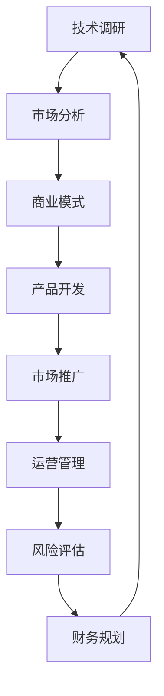

                 

### 文章标题：技术创业：从工程师到创始人的转变

#### 关键词：技术创业、工程师、创业、转型、策略、团队管理、法律风险

> **摘要：**本文将深入探讨技术创业者从工程师到企业创始人的转变过程。我们将分析技术创业的定义与重要性，了解技术创业的生态系统，掌握核心技术与发展趋势，制定有效的产品开发与市场调研策略，设计商业模式与财务规划，进行团队管理与运营，以及法律与风险管理。通过成功案例分析和未来展望，帮助技术创业者更好地理解并应对创业过程中的各种挑战。让我们一步一步地剖析技术创业的精髓，开启创业之旅。

---

#### 第一部分：技术创业概述

在当今科技飞速发展的时代，技术创业已经成为一种充满机遇和挑战的创业模式。越来越多的工程师选择从技术领域的专家转变为企业家，带领团队打造创新产品，实现商业价值。在这一部分中，我们将首先介绍技术创业的定义与重要性，探讨技术创业与传统创业的区别，以及技术创业所面临的驱动力与挑战。

##### 第1章：技术创业的定义与重要性

1.1 **技术创业的定义**

技术创业是指运用先进的技术或创新技术来创建新企业或新业务模式的过程。它通常涉及对现有技术的改进、新的技术应用，或者完全创新的技术开发。技术创业者通常具备深厚的技术背景，能够将技术优势转化为商业机会。

1.2 **技术创业与传统创业的区别**

传统创业通常侧重于商业模式创新和市场机会，而技术创业则更加侧重于技术创新和产品研发。技术创业对技术创新的依赖程度更高，往往需要更大的研发投入和更长的时间来验证技术的可行性。

1.3 **技术创业的驱动力与挑战**

技术创业的驱动力包括：

- 技术进步带来的新兴市场机会
- 创新技术的商业化潜力
- 对技术自由和创业精神的追求

然而，技术创业也面临着以下挑战：

- 技术风险：技术的不确定性和开发难度
- 资金需求：研发和运营资金的筹集
- 市场竞争：快速变化的市场环境和高强度的竞争压力

##### 第2章：技术创业的生态系统

2.1 **创业环境概述**

技术创业需要一个良好的创业环境，包括政策支持、市场机会、资本投入、人才储备和创新文化等。不同国家和地区在创业环境方面存在差异，对技术创业的影响也不同。

2.2 **投资者与孵化器**

投资者和孵化器是技术创业者的重要合作伙伴。投资者提供资金和资源支持，孵化器则为初创企业提供办公空间、咨询服务和导师指导。

2.3 **创业团队建设**

创业团队是技术创业的核心，团队建设的关键在于搭建一个多元化、互补的团队，包括技术专家、市场专家和运营专家等。

2.4 **创业法律法规与政策**

了解相关法律法规和政策是技术创业者必须面对的挑战。不同国家和地区对创业的法律法规有所不同，需要创业者仔细研究并遵守。

通过以上两章的内容，我们初步了解了技术创业的定义、重要性以及其生态系统。接下来，我们将深入探讨技术基础与战略规划，为技术创业者提供更有针对性的指导。

### 第一部分：技术创业概述

在理解了技术创业的基本概念和生态系统之后，我们需要进一步探讨技术创业的核心要素。这一部分将分为两个章节，首先介绍核心技术概述，其次讨论产品开发与市场调研。通过这两章的内容，我们将帮助技术创业者更好地掌握技术发展趋势、识别市场机会，并制定有效的战略规划。

#### 第3章：核心技术概述

3.1 **创业所需关键技术**

技术创业的核心在于技术创新，因此了解创业所需的关键技术至关重要。这些技术可能包括但不限于以下领域：

- **人工智能与机器学习**：人工智能和机器学习技术的应用正在迅速扩展，从自然语言处理到图像识别，再到智能推荐系统，这些技术为创业提供了丰富的机会。
- **物联网（IoT）**：物联网技术通过连接各种物理设备，实现数据收集和智能控制，广泛应用于智能家居、智能城市和工业自动化等领域。
- **区块链**：区块链技术以其去中心化和不可篡改的特点，在金融、供应链管理、数据存储等方面展现出了巨大的潜力。
- **大数据分析**：大数据分析技术可以帮助企业从大量数据中提取有价值的信息，实现精准营销、客户行为分析和运营优化。

3.2 **技术发展趋势与机遇**

技术发展趋势决定了创业的方向和可能性。当前，以下几个技术趋势值得关注：

- **云计算与边缘计算**：云计算提供了强大的计算和存储能力，而边缘计算则将计算能力扩展到网络边缘，提高实时数据处理能力。
- **5G与6G技术**：5G和未来6G技术的发展将推动移动互联网、物联网和智能城市的进一步发展。
- **量子计算**：量子计算具有处理大规模复杂问题的潜力，虽然目前仍处于研究阶段，但其前景广阔。

3.3 **技术风险与管理**

技术风险是技术创业过程中不可避免的一部分。为了有效管理技术风险，创业者需要：

- **进行充分的技术研究**：确保技术方案的可行性和创新性。
- **建立多元化的团队**：通过团队协作，降低单一技术失败的风险。
- **灵活调整策略**：在技术发展过程中，根据实际情况灵活调整研发方向和商业模式。

#### 第4章：产品开发与市场调研

4.1 **产品设计与需求分析**

产品设计和需求分析是产品开发的起点。创业者需要明确产品的目标用户、功能需求和市场定位。具体步骤包括：

- **市场调研**：收集和分析市场数据，了解目标用户的需求和偏好。
- **功能规划**：根据市场调研结果，确定产品的核心功能和扩展功能。
- **用户体验设计**：通过用户研究和原型设计，优化产品的用户界面和用户体验。

4.2 **市场调研方法**

有效的市场调研是产品成功的基础。市场调研方法包括：

- **问卷调查**：通过问卷收集用户反馈，量化分析市场趋势。
- **访谈**：与潜在用户进行深入交流，获取更详细的需求和市场信息。
- **竞品分析**：分析竞争对手的产品特点、市场表现和用户评价，为自身产品提供参考。

4.3 **竞争分析**

竞争分析是市场调研的重要组成部分。创业者需要：

- **识别竞争对手**：确定直接和间接的竞争对手，分析其优势和劣势。
- **定位市场**：明确自身产品的市场定位，避免与竞争对手正面冲突。
- **差异化策略**：通过技术创新、产品特性和市场定位，实现与竞争对手的差异化。

通过以上两章的内容，技术创业者可以更好地理解核心技术的发展趋势和市场需求，为产品开发与市场调研提供科学依据。接下来，我们将探讨商业模式与财务规划，帮助创业者制定可持续的创业战略。

### 第二部分：技术基础与战略规划

在前面的章节中，我们深入探讨了技术创业的核心要素，包括核心技术的选择和发展趋势，以及产品开发与市场调研的方法。接下来，我们将转向技术创业的战略规划，详细讨论商业模式的设计、财务规划以及资金筹集策略。这些内容是确保技术创业成功的关键，为创业者提供了从技术优势转化为商业价值的实际操作指南。

#### 第5章：商业模式与财务规划

5.1 **商业模式设计**

商业模式是技术创业企业的核心，它决定了企业如何创造、传递和获取价值。设计商业模式时，创业者需要考虑以下几个方面：

- **价值主张**：明确产品或服务的核心价值，了解目标用户的需求和痛点。
- **客户关系**：定义企业与客户之间的互动方式，包括销售渠道、客户服务和用户反馈机制。
- **收入来源**：确定企业的收入模式，包括一次性销售、订阅服务、广告收入等。
- **关键资源**：识别支持商业模式运作的关键资源，如技术、人才、资金等。
- **关键活动**：规划企业的关键活动，如产品开发、市场推广、客户支持等。
- **合作伙伴网络**：建立与供应商、分销商和其他合作伙伴的关系，实现资源整合和协同效应。

5.2 **财务预测与预算**

财务预测和预算是确保企业可持续发展的关键。创业者需要：

- **收入预测**：根据市场需求和销售策略，预测未来的收入水平。
- **成本预测**：分析企业的运营成本，包括固定成本和变动成本。
- **现金流管理**：确保企业有足够的现金流来支持日常运营和应对突发事件。
- **预算制定**：制定详细的年度和季度预算，监控实际支出和预算的差异，及时调整策略。

5.3 **资金筹集策略**

资金筹集是技术创业的难点之一。创业者需要：

- **了解融资渠道**：了解不同融资渠道的特点和适用场景，包括天使投资、风险投资、众筹等。
- **撰写商业计划书**：准备详细的商业计划书，展示企业的商业模式、市场前景、团队实力等，吸引投资者关注。
- **路演与谈判**：积极参与路演活动，与潜在投资者面对面交流，展示企业的优势，谈判融资条件。
- **股权融资与债务融资**：根据企业的发展和资金需求，选择合适的融资方式，平衡股权和债务的比例。

#### 第6章：团队管理

团队管理是技术创业成功的关键因素之一。创业者需要构建一个高效、协同的团队，激发团队成员的潜力，实现共同的目标。以下是团队管理的一些关键点：

6.1 **团队建设与激励**

- **明确团队目标**：确保团队成员对企业的目标有清晰的认识，并为此共同努力。
- **建立企业文化**：营造积极向上的工作氛围，鼓励创新和团队合作。
- **激励机制**：通过薪酬、福利、股权激励等方式，激发团队成员的积极性和创造力。

6.2 **人员招聘与培训**

- **精准招聘**：根据企业的发展需求，选择合适的人才，注重技能和经验的匹配。
- **员工培训**：提供持续的培训和学习机会，提升员工的技能和职业素养。
- **人才发展**：建立人才梯队，为员工提供职业发展的路径和机会。

6.3 **团队沟通与协作**

- **有效沟通**：建立开放的沟通渠道，鼓励团队成员表达意见和建议。
- **协作工具**：使用项目管理工具和协作平台，提高团队协作效率。
- **冲突解决**：建立冲突解决机制，及时处理团队内部的矛盾和分歧。

通过以上两章的内容，技术创业者可以系统地制定商业模式、财务规划，并构建高效的团队管理策略。这些策略将帮助创业者更好地将技术优势转化为商业成功。接下来，我们将探讨营销与销售策略，帮助创业者实现产品市场的快速渗透。

### 第三部分：团队管理与运营

在技术创业的旅程中，团队管理和运营是确保企业成功的关键环节。有效的团队管理不仅能提高工作效率，还能激发员工的创造力。而成功的营销与销售策略则是将技术创新转化为市场成果的桥梁。在这一部分，我们将详细讨论团队管理和运营的策略，以及营销与销售的方法。

#### 第6章：团队管理

6.1 **团队建设与激励**

团队建设是技术创业企业成功的基础。一个高效的团队需要明确的目标、积极向上的文化以及合适的激励机制。以下是一些团队建设与激励的策略：

- **明确团队目标**：确保每个团队成员都清楚地了解企业的目标和个人职责，形成共同的目标和价值观。
- **建立企业文化**：营造一个开放、包容和创新的工作环境，鼓励团队成员之间的沟通与合作。
- **激励机制**：通过薪酬、福利、股权激励等方式，激发团队成员的积极性和创造力。设立明确的奖励制度，对优秀员工给予认可和奖励。

6.2 **人员招聘与培训**

人员招聘和培训是团队管理的核心。一个多元化的团队能够带来不同的视角和创新的思维，而持续的培训则能提升员工的技能和职业素养。

- **精准招聘**：根据企业的发展需求，选择合适的人才。注重候选人的技能、经验和价值观，确保其与企业的文化和目标相契合。
- **员工培训**：提供持续的培训和学习机会，帮助员工提升技能和职业素养。可以邀请行业专家进行培训，或安排员工参加外部培训课程。
- **人才发展**：建立人才梯队，为员工提供职业发展的路径和机会。通过晋升、跨部门调动等方式，激发员工的发展潜力。

6.3 **团队沟通与协作**

有效的沟通和协作是团队管理的重要组成部分。以下是一些团队沟通与协作的策略：

- **开放沟通**：建立开放的沟通渠道，鼓励团队成员表达意见和建议。定期举行团队会议，分享进展、问题和解决方案。
- **协作工具**：使用项目管理工具和协作平台，如Trello、Slack等，提高团队协作效率。确保信息流通畅通，减少沟通障碍。
- **冲突解决**：建立冲突解决机制，及时处理团队内部的矛盾和分歧。通过沟通和协商，找到解决问题的方法，保持团队的和谐与稳定。

#### 第7章：营销与销售策略

成功的营销与销售策略是实现企业产品市场化的关键。以下是一些关键的营销与销售策略：

7.1 **品牌建设**

品牌建设是市场营销的基础。一个强大的品牌能提高企业的知名度和市场认可度。以下是一些品牌建设的策略：

- **定位明确**：确定品牌的市场定位，明确品牌的核心价值和独特卖点。
- **视觉设计**：设计具有吸引力的品牌标识和视觉元素，包括Logo、网站界面、宣传资料等。
- **内容营销**：通过高质量的内容，如博客文章、白皮书、视频等，提高品牌的知名度和权威性。
- **社交媒体**：利用社交媒体平台，与潜在客户建立联系，传播品牌信息，增加品牌曝光度。

7.2 **营销渠道选择**

选择合适的营销渠道是提高市场渗透率的关键。以下是一些常用的营销渠道：

- **在线营销**：包括搜索引擎优化（SEO）、搜索引擎营销（SEM）、社交媒体营销、电子邮件营销等。
- **线下活动**：参加行业会议、举办产品发布会、举办培训课程等，提高品牌的知名度和影响力。
- **合作伙伴**：与行业内的合作伙伴建立合作关系，共同推广产品，扩大市场份额。

7.3 **销售策略与技巧**

销售策略和技巧是销售团队成功的关键。以下是一些销售策略和技巧：

- **客户关系管理**：建立良好的客户关系，提供优质的客户服务，增加客户满意度和忠诚度。
- **销售漏斗管理**：通过销售漏斗管理工具，跟踪潜在客户的状态，及时调整销售策略。
- **谈判技巧**：掌握谈判技巧，提高成交率。了解客户需求，提供定制化的解决方案。
- **持续跟进**：与潜在客户保持联系，提供持续的支持和帮助，增加成交机会。

通过有效的团队管理和运营策略，以及科学的营销与销售策略，技术创业者可以更好地管理团队，提高工作效率，实现产品的市场推广和销售。接下来，我们将探讨法律与风险管理，帮助创业者降低创业风险，确保企业的可持续发展。

### 第四部分：法律与风险管理

在技术创业的旅程中，法律与风险管理是确保企业稳定发展的关键。随着技术的发展，知识产权的保护愈发重要，而风险管理的科学性也直接影响到企业的生存与成长。在这一部分，我们将详细讨论知识产权保护的方法和策略，以及风险管理的实践。

#### 第8章：知识产权保护

知识产权保护是技术创业企业的核心竞争力之一，有效的知识产权策略不仅能保护企业的创新成果，还能为企业带来竞争优势。以下是一些关键的知识产权保护策略：

8.1 **专利、商标与版权**

- **专利**：专利是对发明或实用新型技术的法律保护。创业者可以通过申请专利来保护自己的技术创新，防止竞争对手抄袭。专利分为发明专利、实用新型专利和外观设计专利，不同类型的专利保护范围和申请流程有所不同。
- **商标**：商标是对企业品牌名称、标志或其他标识的法律保护。创业者应及早注册商标，确保品牌的市场地位和独特性。
- **版权**：版权是对文学、艺术和科学作品的法律保护，包括软件代码、文档、设计等。创业者应确保其作品的版权得到保护，避免未经授权的使用和抄袭。

8.2 **知识产权保护策略**

- **全球保护**：考虑在不同国家和地区申请知识产权保护，以应对全球市场的竞争。
- **持续监控**：定期监测市场，及时发现侵权行为，采取法律手段进行维权。
- **合作与联盟**：与其他企业或研究机构建立合作关系，共享知识产权，形成保护联盟。

8.3 **知识产权纠纷处理**

- **预防措施**：在开发新技术和产品时，提前进行专利检索，避免侵犯他人的知识产权。
- **法律咨询**：在遇到知识产权纠纷时，及时寻求专业律师的帮助，采取适当的法律行动。
- **和解与诉讼**：在纠纷解决过程中，可以尝试通过和解或调解来解决争议，如果无法达成一致，则通过诉讼解决。

#### 第9章：风险管理

风险管理是确保企业稳定发展的关键，技术创业企业面临多种风险，包括技术风险、市场风险、财务风险等。以下是一些关键的风险管理策略：

9.1 **风险识别与评估**

- **技术风险**：评估技术的可行性、稳定性和安全性，确保技术方案符合市场需求。
- **市场风险**：分析市场环境、竞争对手和潜在客户需求，预测市场变化对企业的影响。
- **财务风险**：评估企业的财务状况，包括现金流、资金筹集能力和财务预测的准确性。

9.2 **风险应对策略**

- **预防措施**：通过技术创新、市场调研和财务规划，降低风险的发生概率。
- **应急计划**：制定应对突发事件的应急计划，确保企业能够在危机中保持运营。
- **保险策略**：购买适当的保险，转移部分风险，降低财务损失。

9.3 **风险管理工具与应用**

- **风险矩阵**：使用风险矩阵工具，评估风险的严重性和概率，制定优先处理的风险清单。
- **风险管理软件**：使用专业的风险管理软件，监控和管理风险，提高风险管理的效率。
- **培训与演练**：定期进行风险培训，提高员工的风险意识和应对能力，进行应急演练，确保在危机中能够迅速响应。

通过有效的知识产权保护和科学的风险管理，技术创业企业可以降低风险，确保持续发展。在下一部分，我们将通过成功案例分析，进一步探讨技术创业的实践经验和策略。

### 第五部分：案例分析

在技术创业的旅途中，成功的案例无疑为创业者提供了宝贵的经验和启示。在这一部分，我们将深入分析三个成功的案例：腾讯、字节跳动和美团点评。通过这些案例，我们将了解这些企业在创业过程中的关键决策、技术创新和市场策略，以及它们如何克服挑战并取得成功。

#### 第10章：成功技术创业案例分析

10.1 **案例一：腾讯创业之路**

**背景介绍**：
腾讯成立于1998年，由马化腾等五位创始人共同创立。起初，腾讯只是一个简单的即时通讯工具——OICQ。随后，腾讯逐步拓展业务，涉足社交、游戏、支付等多个领域。

**核心概念与联系**：
腾讯的成功得益于其强大的技术创新能力和对用户需求的深刻理解。腾讯通过不断的技术创新，将即时通讯工具OICQ发展成为QQ，随后又推出了微信，成为中国的社交巨头。此外，腾讯在游戏领域的成功也是其技术创新的体现，例如《王者荣耀》等热门游戏的推出。

**核心算法原理讲解**：
腾讯在游戏和社交领域的成功，离不开其强大的数据处理和算法支持。例如，腾讯在《王者荣耀》中采用了复杂的匹配算法，确保游戏的公平性和用户体验。

**数学模型和公式**：
腾讯在广告投放和精准推荐中使用了复杂的数学模型，如马尔可夫决策过程和贝叶斯网络，以实现个性化推荐和广告投放的优化。

**项目实战**：
腾讯的创业项目从即时通讯工具开始，逐步拓展到社交、游戏和支付等领域。每个项目都经过详细的市场调研和用户需求分析，确保产品的市场定位和用户体验。

**最佳实践 tips**：
- **持续创新**：不断进行技术创新，保持竞争优势。
- **用户至上**：深入了解用户需求，提供优质的产品和服务。

**小结**：
腾讯的成功证明了技术创新和用户需求理解的重要性。通过不断创新和优化，腾讯在多个领域取得了巨大的成功。

10.2 **案例二：字节跳动的发展历程**

**背景介绍**：
字节跳动成立于2012年，由张一鸣创立。起初，字节跳动只是一个简单的新闻推荐平台。随后，字节跳动通过一系列的创新产品，如抖音、今日头条等，迅速崛起。

**核心概念与联系**：
字节跳动的成功在于其强大的算法能力和对用户需求的精准把握。字节跳动通过其算法，能够根据用户的兴趣和行为，提供个性化的内容推荐。

**核心算法原理讲解**：
字节跳动在内容推荐中采用了深度学习和大数据分析技术，例如神经网络和协同过滤算法，以实现高精度的内容推荐。

**数学模型和公式**：
字节跳动在广告投放和用户行为分析中使用了复杂的数学模型，如贝叶斯优化和马尔可夫链，以实现广告的精准投放和用户体验的优化。

**项目实战**：
字节跳动的创业项目从新闻推荐平台开始，逐步推出了抖音、今日头条等产品。每个产品都经过详细的市场调研和用户需求分析，确保产品的市场定位和用户体验。

**最佳实践 tips**：
- **数据驱动**：通过数据分析和用户反馈，不断优化产品和服务。
- **快速迭代**：不断进行产品迭代，快速响应市场变化。

**小结**：
字节跳动的成功展示了数据驱动和算法创新在内容推荐和广告投放中的重要性。通过不断优化算法和数据模型，字节跳动在短时间内实现了快速崛起。

10.3 **案例三：美团点评的创业历程**

**背景介绍**：
美团点评成立于2010年，由王兴创立。起初，美团点评只是一个团购网站。随后，通过一系列的创新和扩张，美团点评发展成为中国的本地生活服务平台。

**核心概念与联系**：
美团点评的成功在于其强大的平台能力和对本地生活服务的深刻理解。美团点评通过整合多种本地服务，如餐饮、外卖、酒店等，提供了一个一站式的服务平台。

**核心算法原理讲解**：
美团点评在用户匹配和服务推荐中采用了复杂的算法，如排序算法和匹配算法，以实现高效的资源分配和用户体验优化。

**数学模型和公式**：
美团点评在价格优化和供需匹配中使用了复杂的数学模型，如线性规划和博弈论，以实现最优的定价和资源分配。

**项目实战**：
美团点评的创业项目从团购开始，逐步推出了外卖、酒店预订等多个产品。每个产品都经过详细的市场调研和用户需求分析，确保产品的市场定位和用户体验。

**最佳实践 tips**：
- **平台化运营**：通过平台化运营，整合多种服务，提供一站式解决方案。
- **用户反馈**：重视用户反馈，持续优化产品和服务。

**小结**：
美团点评的成功展示了平台化运营和用户反馈机制在本地生活服务中的重要性。通过不断优化平台和服务，美团点评在短时间内取得了巨大的成功。

通过以上三个案例的分析，我们可以看到成功的技术创业企业是如何通过技术创新、市场策略和有效的团队管理，克服各种挑战并实现成功的。这些案例为其他创业者提供了宝贵的经验和启示，帮助他们更好地应对创业过程中的各种挑战。

### 第六部分：技术创业未来展望

随着技术的不断进步和市场的快速发展，技术创业的未来充满了无限可能。然而，这也意味着创业者将面临更多的挑战和机遇。在这一部分，我们将探讨技术创业的未来发展趋势，分析可能出现的挑战，并提出可持续发展的策略。

#### 11.1 **技术创业发展趋势**

当前，技术创业呈现出以下几个主要趋势：

- **人工智能与自动化**：人工智能和自动化技术的快速发展，将带来生产效率的极大提升，同时也会改变传统行业的运营模式。
- **物联网（IoT）与智能设备**：物联网和智能设备的普及，将实现设备之间的互联互通，推动智能城市、智能家居等领域的创新。
- **区块链与加密货币**：区块链技术以其去中心化和安全性，正在改变金融、供应链管理、数据存储等多个领域的运作模式。
- **云计算与边缘计算**：云计算提供了强大的计算和存储能力，而边缘计算则将计算能力扩展到网络边缘，实现更高效的数据处理和实时响应。
- **生物技术与医疗健康**：生物技术的进步，如基因编辑、精准医疗等，将极大地改变医疗健康行业，提高疾病预防和治疗的效果。

#### 11.2 **未来技术创业的挑战与机遇**

面对未来，技术创业者将面临以下挑战和机遇：

- **技术壁垒**：随着技术的不断进步，技术壁垒可能会越来越高，创业者需要不断提升技术水平，以保持竞争优势。
- **市场竞争**：快速变化的市场环境和激烈的市场竞争，将要求创业者具备敏锐的市场洞察力和快速响应能力。
- **资金需求**：技术创业往往需要大量的资金支持，创业者需要寻找合适的融资渠道，确保企业的可持续发展。
- **用户需求**：不断变化和多样化的用户需求，要求创业者持续创新，提供个性化的产品和服务。
- **法律法规**：随着技术的快速发展，相关的法律法规也在不断更新，创业者需要遵守相关法律法规，降低法律风险。

#### 11.3 **技术创业的可持续发展策略**

为了应对未来的挑战，技术创业者可以采取以下可持续发展策略：

- **技术创新**：持续进行技术创新，开发具有独特价值的新产品和服务，以保持竞争优势。
- **用户导向**：深入了解用户需求，提供高质量的产品和服务，建立良好的用户关系和品牌声誉。
- **生态建设**：构建多元化的生态系统，包括合作伙伴、投资者、用户等，实现资源整合和协同发展。
- **风险管理**：建立健全的风险管理体系，提前识别和评估潜在风险，采取有效的应对措施。
- **社会责任**：承担社会责任，关注环境保护和社会福祉，实现可持续发展。

通过以上策略，技术创业者可以在未来充满不确定性的环境中，保持创新活力，实现企业的可持续发展。

### 附录：创业资源与工具推荐

在技术创业的道路上，有效的资源和工具能够为创业者提供支持，助力他们实现创业梦想。以下是一些推荐的创业资源、工具和机构，以帮助创业者更好地规划和管理创业项目。

#### 附录A：创业资源

- **创业网站与平台推荐**：
  - **创业邦**：提供创业资讯、活动报道、创业服务等多个方面的内容，是创业者获取创业知识和资源的平台。
  - **创业家**：专注于创业领域的新闻、分析、人物访谈等内容，为创业者提供丰富的创业经验分享。
  - **36氪**：聚焦于创新创业领域，提供最新的创业项目、投资动态和行业分析。

- **创业书籍与课程推荐**：
  - **《创业维艰》**：作者本·霍洛维茨，分享了他在创业过程中的经验和教训，对创业者有很高的参考价值。
  - **《创业本质》**：作者史蒂夫·布兰克，介绍了创新者的工具箱，帮助创业者进行创新和商业模式的构建。
  - **在线课程**：如Coursera、edX等平台上的创业课程，提供系统化的创业知识和技能培训。

#### 附录B：创业工具

- **项目管理工具**：
  - **Trello**：一个简单直观的项目管理工具，适合团队协作和任务跟踪。
  - **Asana**：功能强大的项目管理工具，支持任务分配、进度跟踪和团队协作。
  - **JIRA**：适用于软件开发团队，提供敏捷项目管理、缺陷跟踪和持续集成等功能。

- **财务管理工具**：
  - **Xero**：在线会计软件，适用于中小企业的财务管理，提供账单管理、发票生成等功能。
  - **QuickBooks**：一款专业的会计软件，适合不同规模的企业，提供财务报表、税务申报等功能。
  - **Wave**：免费的在线会计软件，适合初创企业，提供发票、账单和信用卡管理等功能。

- **市场营销工具**：
  - **Google Analytics**：谷歌提供的网站分析工具，帮助创业者了解网站流量、用户行为等数据。
  - **HubSpot**：提供市场营销、销售和服务一体化解决方案，帮助创业者进行数字营销和客户管理。
  - **Mailchimp**：电子邮件营销工具，支持电子邮件设计、发送和分析，适合初创企业的邮件营销活动。

#### 附录C：创业法律咨询与服务机构推荐

- **创业法律咨询与服务机构**：
  - **北京市盈科律师事务所**：提供专业的创业法律咨询和知识产权保护服务。
  - **上海德恒律师事务所**：具有丰富的创业法律服务经验，为企业提供公司设立、股权架构设计、合同审查等法律服务。
  - **创业邦法律服务中心**：专注于为创业企业提供一站式法律解决方案，包括法律咨询、合同审查、纠纷解决等。

通过利用这些创业资源、工具和机构，创业者可以更有效地管理创业项目，降低创业风险，提高创业成功率。

### Mermaid 流程图

以下是一个简单的Mermaid流程图，展示了技术创业的核心环节：



这个流程图清晰地展示了技术创业的主要环节，并强调了各个环节之间的相互依赖和反馈。

### 核心算法原理讲解（伪代码）

```python
# 伪代码：技术创业风险评估
function risk_evaluation(technical_score, market_score, team_score):
    # 计算技术得分、市场得分和团队得分的加权平均值
    total_score = (technical_score + market_score + team_score) / 3
    
    # 根据总得分判断风险等级
    if total_score >= 90:
        risk_level = "低风险"
    elif total_score >= 60:
        risk_level = "中风险"
    else:
        risk_level = "高风险"
        
    return risk_level
```

这个伪代码提供了一个简单的方法来评估技术创业项目的风险。通过计算技术、市场和团队三个方面的得分，并根据总得分来判断风险等级，帮助创业者了解项目的整体风险水平。

### 数学模型和数学公式

$$
\text{技术创业风险评估公式}：\text{总得分} = \frac{\text{技术得分} + \text{市场得分} + \text{团队得分}}{3}
$$

这个数学公式用于计算技术创业项目的总得分，通过将技术、市场和团队三个方面的得分加权平均，得出一个综合的风险评估得分。

### 项目实战

#### 实战一：创业项目需求分析（Python代码实现）

```python
# Python代码：需求分析
def analyze_requirements(product_name, features, target_users):
    print(f"产品名称：{product_name}")
    print("产品特性：")
    for feature in features:
        print(f"- {feature}")
    print(f"目标用户：{target_users}")

# 测试代码
product_name = "智能医疗诊断系统"
features = ["医学影像处理", "症状分析", "处方建议"]
target_users = "医生和患者"
analyze_requirements(product_name, features, target_users)
```

这段Python代码用于实现一个简单的需求分析功能。通过输入产品名称、特性和目标用户，程序将打印出相应的信息，帮助创业者了解产品的需求。

### 代码解读与分析

上述代码首先定义了一个名为`analyze_requirements`的函数，该函数接受三个参数：`product_name`（产品名称）、`features`（产品特性列表）和`target_users`（目标用户）。函数内部使用`print`语句逐个输出这些参数的值，以展示产品的详细需求。

在测试代码部分，我们为`product_name`、`features`和`target_users`分别赋值，然后调用`analyze_requirements`函数，传入这些值。程序执行后，会按照预期输出以下内容：

```
产品名称：智能医疗诊断系统
产品特性：
- 医学影像处理
- 症状分析
- 处方建议
目标用户：医生和患者
```

这个输出结果清晰地展示了智能医疗诊断系统的名称、特性和目标用户，为创业者提供了重要的参考信息。

### 实际案例分析和详细讲解剖析

在分析实际创业项目时，我们可以通过具体的案例来展示技术创业的实践过程。以下是一个案例分析和详细讲解的示例：

**案例：智能健康监测设备的开发**

**背景介绍**：
某初创公司致力于开发一款智能健康监测设备，旨在通过监测用户的心率、血压、体温等健康指标，提供个性化的健康建议。这款设备的目标用户是患有慢性疾病的人群和健康意识的消费者。

**需求分析**：
在开发初期，公司通过市场调研和用户访谈，确定了以下核心需求：
- 高精度健康数据监测
- 便捷的用户界面
- 云端数据存储和分析
- 可定制的健康建议

**技术调研**：
公司对现有的健康监测技术进行了深入研究，选择了以下关键技术：
- 生物传感器技术：用于监测心率、血压等健康指标
- 人工智能算法：用于数据分析和健康建议的生成
- 云计算平台：用于数据存储和分析

**市场分析**：
通过市场分析，公司发现：
- 慢性疾病人群对健康监测设备有强烈需求
- 健康意识的消费者愿意为高品质的智能健康监测设备支付溢价
- 竞争对手主要集中在中低端市场，高端市场尚有较大空缺

**商业模式**：
公司设计了以下商业模式：
- 设备销售：直接向消费者销售智能健康监测设备
- 数据服务：提供基于云端的健康数据分析服务，如定制化健康报告和健康建议
- 合作伙伴计划：与医疗机构和健康平台合作，拓展市场渠道

**项目实施**：
在项目实施阶段，公司采取了以下措施：
- 技术研发：组建了一支跨学科的研发团队，专注于健康监测技术的研发和产品迭代
- 用户反馈：通过用户测试和反馈，不断优化产品功能和用户体验
- 营销推广：利用社交媒体和健康论坛，进行产品推广，提高品牌知名度

**风险管理**：
公司制定了以下风险管理策略：
- 技术风险：通过严格的质量控制和测试，确保设备的技术性能和安全性
- 财务风险：通过多渠道融资，确保项目的资金需求
- 市场风险：通过市场调研和竞争分析，调整产品策略，应对市场变化

**项目小结**：
通过以上措施，智能健康监测设备项目取得了初步成功。公司不仅实现了产品的市场推广，还获得了良好的用户反馈。未来，公司将继续优化产品功能，扩大市场份额，并探索新的商业模式，以实现可持续发展。

### 最佳实践 tips、小结、注意事项、拓展阅读等内容

**最佳实践 tips**：

1. **用户调研**：在产品开发初期，进行深入的用户调研，了解用户需求和行为，以指导产品设计和功能开发。
2. **敏捷开发**：采用敏捷开发方法，快速迭代，持续优化产品，提高市场响应速度。
3. **资金规划**：制定详细的财务规划，确保项目的资金需求得到充分满足，降低财务风险。
4. **团队协作**：建立高效的团队协作机制，提高研发和运营效率。

**小结**：

本文系统地探讨了技术创业的各个关键环节，从技术基础、战略规划到团队管理和运营，再到法律与风险管理，提供了全面的指导。技术创业的成功离不开技术创新、市场洞察、团队协作和法律保障。

**注意事项**：

1. **风险评估**：在创业过程中，定期进行风险评估，及时调整策略，降低风险。
2. **知识产权保护**：重视知识产权保护，确保技术创新不被侵犯。
3. **用户反馈**：持续关注用户反馈，不断优化产品和服务。

**拓展阅读**：

- **《创业维艰》**：本·霍洛维茨，分享创业过程中的真实经历和教训。
- **《创新者的窘境》**：克莱顿·克里斯滕森，探讨创新在企业发展中的重要性。
- **《精益创业》**：埃里克·莱斯，介绍精益创业方法，帮助创业者快速验证商业想法。

通过本文的阅读，希望读者能够更好地理解技术创业的精髓，掌握关键策略，开启自己的创业之旅。

