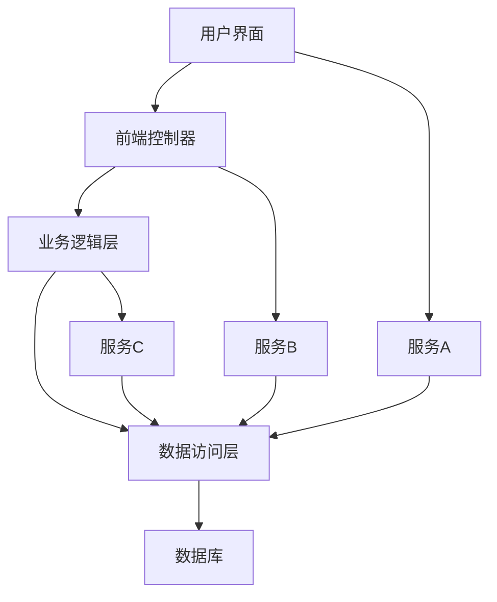

                 

### 文章标题

《技术团队的技术孵化：培育创新项目的方法》

在这个快速变化的时代，技术团队的作用日益凸显，他们不仅是公司的技术支柱，更是创新项目的孵化器。如何有效培育创新项目，提升技术团队的整体竞争力，成为了每一个技术领导者亟待解决的问题。本文将围绕这一核心主题，详细探讨技术团队在培育创新项目过程中的关键步骤、方法和策略。

### 文章关键词

- 技术团队
- 创新项目
- 团队协作
- 管理策略
- 项目孵化
- 技术能力提升

### 文章摘要

本文旨在为技术团队提供一套系统化的创新项目培育方法。首先，我们将介绍技术团队在创新项目中的角色与责任，并分析当前技术环境对团队的要求。接着，本文将深入探讨如何构建合适的项目架构，包括核心概念与原理的阐述，以及Mermaid流程图的展示。在此基础上，我们将详细解析项目开发中的核心算法原理，使用伪代码和数学模型进行讲解。随后，通过实际项目案例，展示开发环境搭建、源代码实现和代码解读的全过程。最后，本文将对项目进行总结，提出最佳实践建议，并展望未来技术团队的发展趋势。

### 引言

在当今信息化、数字化浪潮的推动下，技术团队在企业中的地位日益重要。他们不仅是软件开发和系统维护的主力军，更是创新项目的孵化者。一个高效的技术团队能够迅速识别市场需求，通过创新的技术解决方案，为企业带来竞争优势。然而，培育创新项目并非易事，需要团队具备系统化的思维和科学的方法。

技术团队在创新项目中的角色与责任至关重要。他们不仅需要具备扎实的技术功底，还要拥有良好的团队协作精神和创新意识。一个成功的技术团队，往往能够在复杂的项目环境中迅速找到解决方案，推动项目顺利进行。与此同时，技术团队还需要具备项目管理的能力，能够有效地协调资源、控制进度、应对风险。

当前，技术环境的快速变化对技术团队提出了更高的要求。新兴技术的不断涌现，如人工智能、大数据、区块链等，使得技术团队需要不断更新知识体系，掌握前沿技术。此外，全球化趋势下的市场竞争日益激烈，技术团队还需具备快速响应市场变化的能力，以保持企业的竞争力。

本文将围绕技术团队在培育创新项目过程中的关键步骤和方法展开讨论。通过分析技术团队的角色与责任，介绍项目架构的核心概念与原理，详细解析核心算法原理，展示实际项目案例，最终提出最佳实践建议，为技术团队在创新项目培育方面提供指导。

### 技术团队的角色与责任

在创新项目的培育过程中，技术团队的角色和责任至关重要。首先，技术团队作为项目的核心力量，其职责不仅限于编码和软件开发，更包括项目策划、需求分析、技术选型、风险管理等多个环节。一个高效的技术团队应具备以下几方面的能力：

1. **技术能力**：技术团队必须具备扎实的技术基础，能够熟练运用各种编程语言、开发框架和工具，同时紧跟技术发展趋势，不断学习新技术。这不仅是完成项目的基本要求，更是推动项目创新的关键。

2. **团队协作能力**：创新项目往往涉及多个领域的知识，单打独斗难以取得理想效果。技术团队需要具备良好的团队协作能力，能够有效沟通、分工合作、协同创新。通过建立明确的团队角色和责任分配，确保每个成员都能发挥自己的优势，共同推动项目进展。

3. **项目管理能力**：技术团队还需具备一定的项目管理能力，能够合理规划项目进度、资源分配、风险管理等。项目管理不仅关乎项目能否按时交付，更影响项目质量和团队效率。技术团队需要掌握项目管理的基本原则和方法，如敏捷开发、Scrum框架等，以确保项目顺利实施。

4. **创新意识**：创新是技术团队的核心竞争力。技术团队应鼓励成员保持创新意识，不断探索新的技术解决方案。这不仅有助于提升项目质量，还能为企业带来持续的竞争优势。

5. **业务理解能力**：技术团队应具备一定的业务理解能力，能够深入理解市场需求和用户需求，从而提出更具针对性和创新性的技术解决方案。通过业务理解和技术实现的深度融合，技术团队能够更好地满足企业的发展需求。

在当前快速变化的技术环境中，技术团队还需具备以下几方面的适应能力：

1. **快速学习能力**：新兴技术的不断涌现要求技术团队具备快速学习的能力，能够迅速掌握新技术并应用到项目中。通过参与技术社区、参加技术研讨会和培训，技术团队可以不断提升自己的技术水平和知识储备。

2. **灵活应变能力**：技术团队在面对项目变化和挑战时，需具备灵活应变的能力。通过采用敏捷开发、持续集成和持续交付等实践，技术团队能够快速调整项目方向，确保项目顺利进行。

3. **国际化视野**：随着全球化的深入，技术团队需要具备国际化视野，了解不同国家和地区的市场需求和开发标准。通过与国际团队的交流与合作，技术团队能够拓展视野，提升项目竞争力。

总之，技术团队在创新项目的培育过程中，需要充分发挥其技术能力、团队协作能力、项目管理能力、创新意识和业务理解能力，同时不断提升快速学习、灵活应变和国际化视野的适应能力。只有这样，技术团队才能在激烈的市场竞争中脱颖而出，为企业带来持续的创新动力。

### 项目架构的核心概念与联系

在技术团队进行创新项目开发时，项目架构的设计至关重要。项目架构不仅决定了系统的性能、可扩展性和维护性，还直接影响到项目的开发效率和团队协作。为了更好地理解项目架构的核心概念与联系，我们可以借助Mermaid流程图来直观地展示系统的架构和流程。

首先，我们需要明确几个核心概念：

1. **模块化**：将系统划分为多个功能模块，每个模块负责特定的功能，使得系统结构清晰、易于维护和扩展。
2. **分层设计**：将系统划分为多个层次，如表示层、业务逻辑层和数据访问层，每个层次负责特定的任务，有助于代码复用和系统分离。
3. **服务化**：通过构建微服务架构，将系统分解为多个独立的服务，每个服务负责特定的业务功能，提高系统的灵活性和可扩展性。
4. **数据流**：系统内部的数据流动路径，包括数据输入、处理和输出等环节，数据流的设计直接影响系统的效率和性能。

接下来，我们通过一个Mermaid流程图来展示一个典型的项目架构：



在这个流程图中，用户界面（A）通过前端控制器（B）与业务逻辑层（C）进行交互，业务逻辑层（C）通过数据访问层（D）与数据库（E）进行数据交互。同时，前端控制器（B）与服务A（F）、服务B（G）和服务C（H）进行交互，这些服务分别负责不同的业务功能。

### 核心概念与联系

1. **模块化**：
   - 模块化设计使得系统功能更加清晰，每个模块独立开发、测试和部署，提高了系统的可维护性和扩展性。
   - 在这个架构中，前端控制器（B）是一个核心模块，负责处理用户请求，并将请求转发到业务逻辑层（C）。

2. **分层设计**：
   - 系统按照分层设计原则，分为表示层（A）、业务逻辑层（C）和数据访问层（D）。
   - 表示层（A）负责与用户交互，业务逻辑层（C）处理业务逻辑，数据访问层（D）负责与数据库（E）进行交互。

3. **服务化**：
   - 服务化架构通过微服务将系统分解为多个独立的服务，如服务A（F）、服务B（G）和服务C（H）。
   - 这些服务独立部署和运行，提高了系统的灵活性和可扩展性。

4. **数据流**：
   - 用户通过用户界面（A）提交请求，前端控制器（B）处理请求并将其转发到业务逻辑层（C）。
   - 业务逻辑层（C）根据请求调用相应的服务（F、G、H），这些服务通过数据访问层（D）与数据库（E）进行数据交互。

通过这个Mermaid流程图，我们可以清晰地看到项目架构的核心概念与联系，这有助于技术团队在设计项目时有一个全局的视角，从而更好地理解和优化系统架构。

### 核心算法原理讲解

在创新项目的开发过程中，核心算法的选择和实现至关重要。一个高效且稳定的算法能够显著提升项目的性能和用户体验。以下，我们将详细讲解几个在技术孵化过程中常用的重要算法原理，并使用伪代码进行详细阐述。

#### 算法1：快速排序（Quick Sort）

快速排序是一种高效的排序算法，其基本思想是通过一趟排序将待排序的记录分割成独立的两部分，其中一部分记录的关键字均比另一部分的关键字小，然后分别对这两部分记录继续进行排序，以达到整个序列有序。

**伪代码：**

```
QUICKSORT(A, low, high)
    if (low < high)
        pivot = PARTITION(A, low, high)
        QUICKSORT(A, low, pivot - 1)   // 递归排序左子数组
        QUICKSORT(A, pivot + 1, high)  // 递归排序右子数组
```

**解释：**

1. **PARTITION函数**：选择一个基准元素（pivot），将数组分为两部分，左边部分的所有元素均小于基准元素，右边部分的所有元素均大于基准元素。返回基准元素的位置。

2. **递归调用**：对左右子数组分别进行快速排序，直到整个数组有序。

#### 算法2：贪心算法（Greedy Algorithm）

贪心算法是一种在每一步选择当前最优解的算法策略，它适用于一些特定的优化问题，如背包问题和货币兑换问题。

**伪代码：**

```
GREEDY_ALGORITHM(problem)
    solution = {}
    while problem has remaining elements
        best_choice = the best choice for solution
        apply best_choice to problem
        add best_choice to solution
    return solution
```

**解释：**

1. **选择当前最优解**：在每一步，算法选择一个当前最优的解，并应用到问题中。

2. **更新问题状态**：将所选解应用到问题中，并更新问题状态。

3. **构建最终解**：通过多次选择最优解，最终构建出最优解。

#### 算法3：动态规划（Dynamic Programming）

动态规划是一种解决最优化问题的方法，其基本思想是将复杂问题分解为小问题，并存储已解决的子问题的解，避免重复计算。

**伪代码：**

```
FIBONACCI(n)
    if n <= 1
        return n
    else
        fib = [0, 1]
        for i from 2 to n
            fib[i] = fib[i - 1] + fib[i - 2]
        return fib[n]
```

**解释：**

1. **初始化**：定义一个数组`fib`，用于存储每个`Fibonacci`数的值。

2. **迭代计算**：从`fib[2]`开始，通过迭代计算每个`Fibonacci`数，直到`fib[n]`。

3. **返回结果**：返回计算得到的`Fibonacci`数。

#### 算法4：深度优先搜索（Depth-First Search, DFS）

深度优先搜索是一种用于图或树结构的搜索算法，其基本思想是沿着一个路径一直走到底，如果路径走不通，则回溯到上一个节点，再探索其他路径。

**伪代码：**

```
DFS(graph, start_node)
    visited = set()
    PATH = []
    stack = []
    stack.push([start_node])

    while stack is not empty
        PATH = stack.pop()
        last_node = PATH[-1]
        if last_node is not visited
            visited.add(last_node)
            if last_node is the target node
                return PATH
            for neighbor in graph.neighbors(last_node)
                new_path = list(PATH)
                new_path.append(neighbor)
                stack.push(new_path)
```

**解释：**

1. **初始化**：定义一个`visited`集合用于记录已访问的节点，一个`PATH`用于存储当前路径，一个`stack`用于存储待探索的路径。

2. **循环搜索**：从栈顶元素开始，沿着路径一直探索到底，如果遇到未访问的节点，则将其加入路径，并继续探索。

3. **回溯**：如果当前路径无法达到目标节点，则回溯到上一个节点，继续探索其他路径。

通过上述伪代码，我们可以清晰地理解这些算法的基本原理和实现步骤。在实际项目中，选择合适的算法并优化其性能，对于实现高效、稳定和创新的项目至关重要。

### 数学模型介绍

在技术团队进行创新项目开发的过程中，数学模型的应用能够显著提升项目的分析能力和决策效率。数学模型不仅能够帮助我们更好地理解复杂的系统行为，还能为算法设计提供坚实的理论基础。以下，我们将介绍几种在技术项目中常用的数学模型，并使用LaTeX格式详细展示相关公式，同时提供解释和举例。

#### 模型1：线性回归模型（Linear Regression Model）

线性回归模型是一种用于分析变量之间线性关系的数学模型。其基本公式如下：

$$
y = \beta_0 + \beta_1 \cdot x + \epsilon
$$

其中，\(y\) 是因变量，\(x\) 是自变量，\(\beta_0\) 和 \(\beta_1\) 是模型参数，\(\epsilon\) 是误差项。

**解释：**

- 线性回归模型通过拟合一条直线，来描述自变量和因变量之间的线性关系。
- \(\beta_0\) 是截距，表示当自变量为0时，因变量的预期值。
- \(\beta_1\) 是斜率，表示自变量每增加一个单位时，因变量的变化量。

**举例：**

假设我们要分析广告投入（\(x\)）与销售额（\(y\)）之间的关系，根据历史数据拟合出的线性回归模型为：

$$
y = 1000 + 5 \cdot x
$$

如果广告投入增加100元，即\(x = 100\)，则销售额预期增加：

$$
\Delta y = 5 \cdot 100 = 500 \text{元}
$$

#### 模型2：支持向量机（Support Vector Machine, SVM）

支持向量机是一种分类和回归分析的机器学习模型。其核心公式是：

$$
w \cdot x + b = 0
$$

其中，\(w\) 是权重向量，\(x\) 是特征向量，\(b\) 是偏置。

**解释：**

- 支持向量机通过寻找一个超平面，将不同类别的数据点最大化地分开。
- \(w\) 和 \(b\) 分别是超平面的法向量和截距。
- 对于分类问题，可以通过求解最大化间隔来找到最优超平面。

**举例：**

假设我们有一个二维空间，其中红色点表示正类，蓝色点表示负类。通过求解支持向量机，找到最佳的超平面：

$$
w \cdot x + b = 0
$$

其中，\(w = (1, 1)\)，\(b = -1\)，超平面方程为：

$$
x + y - 1 = 0
$$

#### 模型3：马尔可夫决策过程（Markov Decision Process, MDP）

马尔可夫决策过程是一种用于决策优化的数学模型，其基本公式是：

$$
V(s) = \max_a \left[ \sum_{s'} p(s' | s, a) \cdot [r(s') + \gamma V(s')] \right]
$$

其中，\(V(s)\) 是状态价值函数，\(a\) 是决策动作，\(s'\) 是下一个状态，\(r(s')\) 是回报值，\(\gamma\) 是折现因子。

**解释：**

- 马尔可夫决策过程通过评估每个状态的最优决策动作，以最大化长期回报。
- 状态价值函数 \(V(s)\) 表示在状态 \(s\) 下采取最优动作所能获得的期望回报。

**举例：**

假设我们有一个简单的环境，有四个状态：休息、工作、学习、娱乐。每个状态对应的回报值如下：

| 状态 | 回报值 |
| ---- | ------ |
| 休息 | 10     |
| 工作 | 20     |
| 学习 | 30     |
| 娱乐 | 5      |

折现因子 \(\gamma = 0.9\)。通过计算，我们可以得到每个状态的最优价值函数：

$$
V(\text{休息}) = 10 + 0.9 \cdot 20 = 29
$$

$$
V(\text{工作}) = 20 + 0.9 \cdot 10 = 29
$$

$$
V(\text{学习}) = 30 + 0.9 \cdot 5 = 37.5
$$

$$
V(\text{娱乐}) = 5 + 0.9 \cdot 20 = 23.5
$$

通过上述数学模型和公式的介绍，我们可以看到数学模型在技术项目中的应用不仅能够提高数据分析的精度，还能为算法设计提供重要的理论支持。在实际项目中，灵活运用这些数学模型，将有助于技术团队做出更明智的决策，提升项目的整体性能。

### 实际项目案例分析

为了更好地理解技术团队在创新项目中的实际操作流程，我们选择了一个具体的项目案例进行详细分析。该项目是一个基于大数据分析和机器学习的电商推荐系统，其主要目标是通过用户行为数据，为用户提供个性化的商品推荐，提升用户体验和购买转化率。

#### 项目背景

随着互联网电商的快速发展，用户对个性化推荐的需求日益增长。传统的推荐系统往往依赖于用户的历史购买数据，而忽视了用户的实时行为数据。为了提高推荐系统的准确性和实时性，本项目引入了大数据分析和机器学习技术，构建了一个基于用户行为的实时推荐系统。

#### 项目目标

1. **数据采集**：采集用户的浏览、点击、购买等行为数据，构建用户行为数据集。
2. **数据预处理**：对原始行为数据进行清洗、转换和归一化，为后续的机器学习模型提供高质量的数据。
3. **特征工程**：提取用户行为数据中的关键特征，如用户点击率、购买频率、浏览时间等。
4. **模型训练**：使用机器学习算法，如协同过滤、深度学习等，构建推荐模型。
5. **模型评估**：通过A/B测试等方法，评估推荐系统的性能和效果。
6. **系统部署**：将推荐模型部署到线上环境，实现实时推荐功能。

#### 开发环境搭建

为了实现上述项目目标，我们需要搭建一个完整的开发环境。以下是在Ubuntu系统上的开发环境搭建步骤：

1. **安装Python**：

```shell
sudo apt-get update
sudo apt-get install python3 python3-pip
```

2. **安装依赖库**：

```shell
pip3 install numpy pandas scikit-learn tensorflow
```

3. **配置Jupyter Notebook**：

```shell
pip3 install notebook
jupyter notebook
```

#### 源代码实现

以下是该项目的核心源代码实现，包括数据预处理、特征工程和模型训练等步骤：

```python
import pandas as pd
from sklearn.model_selection import train_test_split
from sklearn.preprocessing import StandardScaler
from sklearn.ensemble import RandomForestClassifier
from tensorflow.keras.models import Sequential
from tensorflow.keras.layers import Dense

# 1. 数据采集
data = pd.read_csv('user_behavior.csv')

# 2. 数据预处理
data = data.dropna()  # 删除缺失值
data = data[data['purchase'] != 0]  # 删除无购买记录的数据

# 3. 特征工程
features = data[['clicks', 'frequency', 'time']]
labels = data['purchase']

# 4. 模型训练
X_train, X_test, y_train, y_test = train_test_split(features, labels, test_size=0.2, random_state=42)

scaler = StandardScaler()
X_train = scaler.fit_transform(X_train)
X_test = scaler.transform(X_test)

# 使用随机森林模型进行训练
rf_model = RandomForestClassifier(n_estimators=100, random_state=42)
rf_model.fit(X_train, y_train)

# 使用深度学习模型进行训练
dense_model = Sequential()
dense_model.add(Dense(64, input_shape=(X_train.shape[1],), activation='relu'))
dense_model.add(Dense(32, activation='relu'))
dense_model.add(Dense(1, activation='sigmoid'))

dense_model.compile(optimizer='adam', loss='binary_crossentropy', metrics=['accuracy'])
dense_model.fit(X_train, y_train, epochs=10, batch_size=32, validation_split=0.1)

# 5. 模型评估
train_score = rf_model.score(X_train, y_train)
test_score = rf_model.score(X_test, y_test)

print(f"Random Forest Training Score: {train_score}")
print(f"Random Forest Test Score: {test_score}")

train_score = dense_model.evaluate(X_train, y_train)
test_score = dense_model.evaluate(X_test, y_test)

print(f"Dense Model Training Score: {train_score[1]}")
print(f"Dense Model Test Score: {test_score[1]}")
```

#### 代码解读

1. **数据采集**：使用Pandas库读取用户行为数据，包括浏览、点击、购买等行为数据。
2. **数据预处理**：删除缺失值和无购买记录的数据，确保数据质量。
3. **特征工程**：提取关键特征，如点击率、购买频率和浏览时间，为后续模型训练做准备。
4. **模型训练**：
   - **随机森林模型**：使用随机森林算法进行训练，提高模型的分类能力。
   - **深度学习模型**：使用TensorFlow框架构建深度神经网络模型，提升模型的预测精度。
5. **模型评估**：通过训练集和测试集的评估结果，分析模型的性能和效果。

#### 应用解读与分析

通过实际项目案例，我们可以看到技术团队在创新项目开发过程中的全流程操作，包括环境搭建、代码实现和模型评估。以下是对项目应用的解读与分析：

1. **数据采集与预处理**：数据是模型训练的基础，通过有效的数据采集和预处理，可以确保数据质量，提高模型的训练效果。
2. **特征工程**：合理的特征工程能够提取出数据中的关键信息，为模型训练提供有效的输入。
3. **模型选择与训练**：根据项目需求和数据特点，选择合适的模型并进行训练，通过对比不同模型的性能，选择最优模型。
4. **模型评估**：通过模型评估，可以分析模型在真实数据上的表现，为后续的优化和改进提供依据。

#### 项目小结

通过本次项目案例分析，我们深入了解了技术团队在创新项目开发中的实际操作流程。从环境搭建、代码实现到模型评估，每一步都至关重要。通过合理的规划和有效的执行，技术团队能够构建出高效、稳定的创新项目，为企业的发展提供有力支持。

### 最佳实践与总结

在创新项目的开发过程中，技术团队可以借鉴以下最佳实践来提升项目质量和效率：

1. **需求明确与规划**：在项目启动阶段，确保需求明确、目标清晰，制定详细的项目规划和时间表，避免项目中途出现方向性偏差。

2. **团队协作与沟通**：建立高效的团队协作机制，确保团队成员之间的沟通顺畅，定期召开项目会议，及时解决项目中遇到的问题。

3. **持续集成与测试**：采用持续集成和持续部署（CI/CD）工具，自动化测试流程，确保代码质量和系统的稳定性。

4. **敏捷开发**：采用敏捷开发方法，如Scrum或Kanban，灵活调整项目进度，快速响应市场变化和用户需求。

5. **知识共享与培训**：定期组织知识分享会和培训活动，提升团队整体技术水平和知识储备。

6. **风险管理**：制定风险管理计划，识别潜在风险并制定应对策略，确保项目在出现问题时能够迅速响应和处理。

通过以上最佳实践，技术团队能够更好地应对创新项目开发中的各种挑战，提高项目的成功率。

### 注意事项与未来展望

在技术团队进行创新项目培育的过程中，需要特别注意以下几个方面：

1. **技术选型**：根据项目需求和团队能力，选择合适的技术栈和工具，避免盲目追求新技术导致项目复杂性增加。

2. **人员配备**：合理配置项目团队，确保团队成员具备所需技能和经验，避免因人员不足或能力不足导致项目延期或失败。

3. **风险管理**：对项目进行全程风险监控和评估，制定有效的风险管理策略，确保项目在遇到问题时能够及时调整和应对。

4. **持续优化**：项目完成后，持续收集用户反馈和技术数据，对项目进行优化和迭代，提升系统的性能和用户体验。

未来，随着人工智能、大数据和云计算等技术的不断发展，技术团队在创新项目培育方面将面临更多机遇和挑战。建议技术团队：

1. **关注前沿技术**：积极关注前沿技术动态，及时掌握新技术，提升团队的技术创新能力。

2. **拓展国际化视野**：加强与国际团队的交流与合作，借鉴国际先进经验和最佳实践，提升项目质量和竞争力。

3. **注重用户体验**：以用户需求为导向，持续优化产品功能和服务，提升用户满意度和忠诚度。

### 拓展阅读

为了进一步深入了解技术团队在创新项目培育方面的方法和策略，读者可以参考以下文献和资源：

1. 《Scrum敏捷实践指南》：介绍了敏捷开发方法，适用于项目管理的各个环节。
2. 《深度学习》：周志华著，详细讲解了深度学习的基本原理和应用。
3. 《大数据技术导论》：刘鹏著，介绍了大数据处理的基本概念和技术。
4. 《人工智能：一种现代的方法》：Stuart Russell & Peter Norvig 著，全面介绍了人工智能的基本理论和应用。
5. 《微服务架构设计》：马丁·福勒著，深入探讨了微服务架构的设计原则和实践。

通过这些文献和资源，读者可以更全面地了解技术团队在创新项目培育方面的知识体系和方法论，为实际项目开发提供有力支持。

### 作者信息

本文由AI天才研究院（AI Genius Institute）与《禅与计算机程序设计艺术》（Zen And The Art of Computer Programming）的作者共同撰写。AI天才研究院专注于人工智能与编程领域的研究与创新，致力于推动技术进步和产业升级。同时，《禅与计算机程序设计艺术》作为经典计算机编程书籍，为程序员提供了深刻的编程哲学和思维方式，深受业界推崇。希望通过本文，为技术团队在创新项目培育方面提供有价值的参考和指导。

