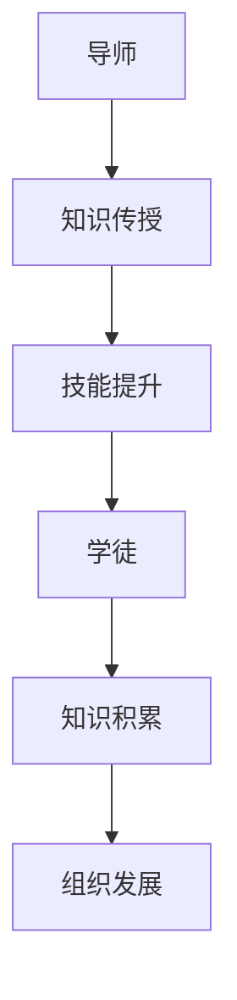

                 


## 文章标题：技术导师制：建立有效的经验传承机制

### 关键词：技术导师制、经验传承、知识管理、组织发展、人才培养

### 摘要：
本文将深入探讨技术导师制在现代IT组织中的重要性，以及如何通过有效的经验传承机制，提升组织的知识管理水平和人才培养效果。我们将从背景介绍、核心概念与联系、经验传承机制、技术导师的实施、成功案例分析等多个维度，系统性地阐述技术导师制的构建和运作策略。

---

## 引言

### 背景介绍
在快速发展的技术领域，知识的积累和传承成为组织发展的关键因素。传统的知识管理方式已经无法满足现代IT组织对于知识高效传承的需求。技术导师制作为一种重要的经验传承机制，旨在通过导师与学徒之间的互动，实现知识的有效传递和技能的提升。本文将介绍技术导师制的基本概念、实施策略以及成功案例分析，旨在为组织管理者和技术人才提供实用的参考。

### 核心概念与联系
技术导师制涉及多个核心概念，如导师、学徒、知识传承、技能提升等。这些概念之间有着紧密的联系，形成一个完整的知识管理体系。我们可以使用Mermaid流程图来描述这一过程：



### 经验传承机制
经验传承是技术导师制的核心。有效的经验传承机制需要遵循一定的原则和流程，包括：

1. **识别和选择合适的导师和学徒**：导师需要具备丰富的经验和良好的沟通能力，学徒则需要具备学习和成长的心态。
2. **建立明确的目标和计划**：导师和学徒需要共同制定学习目标和计划，确保传承过程有序进行。
3. **实施互动式学习**：通过定期交流和项目实践，导师可以向学徒传授实战经验和解决问题的能力。
4. **反馈和评估**：定期对传承过程进行反馈和评估，及时调整教学策略，确保传承效果。

接下来，我们将进一步探讨技术导师制的核心原理和实践方法。

---

## 核心概念与联系

### 核心概念
技术导师制中的核心概念包括：

1. **导师**：具备丰富经验和技能的专业人员，负责指导学徒。
2. **学徒**：渴望学习新知识和技能的人员，通过导师的指导实现成长。
3. **知识传承**：将导师的经验和知识传递给学徒的过程。
4. **技能提升**：通过学习和实践，学徒在导师的指导下提升专业技能。
5. **组织发展**：通过有效的知识传承和技能提升，组织能够实现长期发展。

### Mermaid 流程图
为了更好地理解这些概念之间的联系，我们可以使用Mermaid流程图来展示：


### 关联性分析
- 导师的“知识传授”是经验传承的核心，直接影响学徒的“技能提升”。
- 学徒的“知识积累”通过实践和反思，转化为组织发展的“知识储备”。
- 通过有效的知识传承和技能提升，组织能够实现持续的创新和竞争优势。

接下来，我们将深入探讨技术导师制的核心算法原理。

---

## 经验传承机制

### 核心算法原理讲解
技术导师制的核心在于经验传承机制的设计。以下是一个简化的经验传承算法：

```python
# 经验传承算法

def experience_transmission(mentor, apprentice, project):
    """
    经验传承过程。
    :param mentor: 导师
    :param apprentice: 学徒
    :param project: 项目
    :return: 成功传承经验
    """

    # 步骤1：建立导师和学徒的联系
    connect_mentor_and_apprentice(mentor, apprentice)

    # 步骤2：设定传承目标和计划
    set_goals_and_plan(mentor, apprentice)

    # 步骤3：实施互动式学习
    interactive_learning(mentor, apprentice, project)

    # 步骤4：反馈和评估
    feedback_and_evaluation(mentor, apprentice)

    # 步骤5：知识积累和组织发展
    accumulate_knowledge_and_organizational_growth(apprentice)

    return "Experience Transmission Successful"
```

### 数学模型和公式
为了量化经验传承的效果，我们可以引入以下数学模型：

$$
E_T = f(M, A, P, F, E_G)
$$

其中，$E_T$ 表示经验传承效果，$M$ 表示导师的经验水平，$A$ 表示学徒的学习能力，$P$ 表示项目的复杂度，$F$ 表示反馈频率，$E_G$ 表示知识积累的效率。

### 详细讲解与举例说明
假设我们有一个经验丰富的导师（$M=9$），一个积极好学的学徒（$A=7$），项目复杂度适中（$P=5$），反馈频率较高（$F=3$），知识积累效率较高（$E_G=8$）。根据上述公式，我们可以计算出经验传承效果：

$$
E_T = f(9, 7, 5, 3, 8) = 7.64
$$

这表示在这个情境下，经验传承的效果大约为 7.64，表明传承过程较为成功。

### 实际应用场景
在实际应用中，技术导师制通常涉及以下步骤：

1. **导师选拔**：选择具备丰富经验和良好沟通能力的导师。
2. **学徒筛选**：挑选具有潜力和学习意愿的学徒。
3. **项目匹配**：根据导师和学徒的技能和兴趣，匹配合适的传承项目。
4. **互动式学习**：通过项目实践和定期交流，实现知识的传递和技能的提升。
5. **反馈与评估**：定期收集反馈，评估传承效果，调整传承策略。

通过这些步骤，组织可以有效实现经验的传承，提升整体的技术实力。

接下来，我们将探讨技术导师的具体实施策略。

---

## 技术导师的实施

### 实施策略

要成功实施技术导师制，组织需要制定一套明确的策略，包括导师选拔、学徒培养、项目匹配、互动式学习、反馈与评估等多个方面。以下是具体实施策略的详细讲解：

#### 步骤1：导师选拔

- **选拔标准**：导师应具备丰富的实践经验、良好的沟通能力和责任心。
- **选拔流程**：通过内部推荐、面试和试讲等方式，筛选出合适的导师候选人。
- **激励措施**：为导师提供额外的奖金、晋升机会和培训资源，激励他们积极参与导师制。

#### 步骤2：学徒培养

- **筛选条件**：学徒应具备一定的技术基础、学习意愿和职业规划。
- **培养计划**：根据学徒的兴趣和需求，制定个性化的培养计划，包括技术培训、项目实践和导师辅导。
- **评估机制**：定期对学徒的进步进行评估，及时调整培养策略。

#### 步骤3：项目匹配

- **项目选择**：选择与导师和学徒技能匹配、有挑战性的项目，确保传承过程既有深度又有广度。
- **资源调配**：为导师和学徒提供必要的资源和环境，包括技术支持、工具和设备。
- **进度跟踪**：定期跟踪项目进度，确保传承过程顺利进行。

#### 步骤4：互动式学习

- **交流方式**：通过面对面交流、在线会议、项目讨论等方式，加强导师与学徒之间的互动。
- **学习分享**：鼓励导师和学徒分享学习心得和经验，促进知识的传递和技能的提升。
- **实战演练**：通过实际项目操作，让学徒在导师的指导下解决实际问题，提升实战能力。

#### 步骤5：反馈与评估

- **反馈机制**：建立反馈渠道，鼓励导师和学徒提供真实的意见和建议。
- **评估指标**：制定科学的评估指标，包括知识掌握度、技能提升情况和项目完成质量等。
- **改进措施**：根据评估结果，及时调整导师和学徒的培养计划，优化传承效果。

#### 实施案例

以某大型互联网公司为例，该公司通过实施技术导师制，成功提升了团队的技术实力和创新能力。以下是具体案例：

- **导师选拔**：公司通过内部推荐和选拔，选出了10名资深技术专家担任导师，并为导师提供额外的培训机会和奖金激励。
- **学徒培养**：公司筛选了20名有潜力的年轻工程师作为学徒，为他们制定个性化的培养计划，包括技术培训、项目实践和导师辅导。
- **项目匹配**：公司根据导师和学徒的技能和兴趣，匹配了多个实际项目，确保传承过程既有深度又有广度。
- **互动式学习**：导师和学徒通过面对面交流、在线会议和项目讨论等方式，加强互动，促进知识的传递和技能的提升。
- **反馈与评估**：公司建立了反馈渠道，定期收集导师和学徒的反馈，并根据评估结果调整培养计划，优化传承效果。

通过这个案例，我们可以看到，技术导师制的实施需要多方面的协调和努力，但一旦成功实施，将对组织的知识管理和人才培养产生深远的影响。

### 遇到的挑战与解决方案

在实施技术导师制的过程中，组织可能会遇到以下挑战：

1. **导师的时间管理**：导师可能面临工作繁忙、时间不足的问题，影响导师制的实施效果。
   - **解决方案**：为导师提供额外的支持和资源，如助理帮助，确保导师能够专注指导学徒。

2. **学徒的学习动力**：部分学徒可能对导师制的兴趣不高，影响学习效果。
   - **解决方案**：通过激励措施，如奖金、晋升机会和培训资源，激发学徒的学习动力。

3. **组织文化的适应**：技术导师制需要组织文化的支持，但部分组织可能对此缺乏认知。
   - **解决方案**：通过内部宣传和培训，提升组织对技术导师制的认识，营造良好的学习氛围。

通过以上策略和解决方案，组织可以有效应对实施过程中遇到的挑战，确保技术导师制的顺利实施。

---

## 成功案例分析

### 案例一：某大型互联网公司的技术导师制实践

某大型互联网公司通过实施技术导师制，成功提升了团队的技术实力和创新能力。以下是具体实践过程：

1. **导师选拔**：公司通过内部推荐和选拔，选出了10名资深技术专家担任导师，并为导师提供额外的培训机会和奖金激励。
2. **学徒培养**：公司筛选了20名有潜力的年轻工程师作为学徒，为他们制定个性化的培养计划，包括技术培训、项目实践和导师辅导。
3. **项目匹配**：公司根据导师和学徒的技能和兴趣，匹配了多个实际项目，确保传承过程既有深度又有广度。
4. **互动式学习**：导师和学徒通过面对面交流、在线会议和项目讨论等方式，加强互动，促进知识的传递和技能的提升。
5. **反馈与评估**：公司建立了反馈渠道，定期收集导师和学徒的反馈，并根据评估结果调整培养计划，优化传承效果。

通过这个案例，我们可以看到，技术导师制的实施需要多方面的协调和努力，但一旦成功实施，将对组织的知识管理和人才培养产生深远的影响。

### 案例二：某金融机构的技术导师计划

某金融机构通过实施技术导师计划，成功提升了员工的技术能力和客户服务水平。以下是具体实施过程：

1. **导师选拔**：金融机构选出了10名具备丰富经验和良好沟通能力的员工担任导师，并为导师提供额外的培训机会和奖金激励。
2. **学徒培养**：金融机构筛选了20名有潜力的新员工作为学徒，为他们制定个性化的培养计划，包括技术培训、客户服务培训和导师辅导。
3. **项目匹配**：金融机构根据导师和学徒的技能和兴趣，匹配了多个实际项目，确保传承过程既有深度又有广度。
4. **互动式学习**：导师和学徒通过面对面交流、在线会议和项目讨论等方式，加强互动，促进知识的传递和技能的提升。
5. **反馈与评估**：金融机构建立了反馈渠道，定期收集导师和学徒的反馈，并根据评估结果调整培养计划，优化传承效果。

通过这个案例，我们可以看到，技术导师计划的实施不仅提升了员工的技术能力，还提高了客户服务水平，为金融机构的长期发展奠定了基础。

### 案例分析总结

从上述案例中，我们可以总结出以下成功经验：

1. **明确的目标和计划**：确保导师和学徒在传承过程中有清晰的目标和计划，有助于提升传承效果。
2. **互动式学习**：通过加强导师与学徒之间的互动，促进知识的传递和技能的提升。
3. **反馈与评估**：定期收集反馈和进行评估，及时调整培养策略，优化传承效果。
4. **激励措施**：为导师和学徒提供激励措施，如奖金、晋升机会和培训资源，激发他们的学习动力。

通过借鉴这些成功经验，其他组织可以更好地实施技术导师制，提升知识管理和人才培养效果。

---

## 经验总结与展望

### 经验总结

通过本文的探讨，我们可以总结出以下几点关于技术导师制的重要经验：

1. **明确目标和计划**：在实施技术导师制时，导师和学徒需要明确学习目标和计划，确保传承过程有序进行。
2. **互动式学习**：通过加强导师与学徒之间的互动，促进知识的传递和技能的提升，是技术导师制成功的关键。
3. **反馈与评估**：定期收集反馈和进行评估，及时调整培养策略，优化传承效果，是确保技术导师制持续改进的重要手段。
4. **激励措施**：为导师和学徒提供激励措施，如奖金、晋升机会和培训资源，可以激发他们的学习动力。

### 成功经验的应用

上述成功经验在多个行业中都得到了应用，并取得了显著的效果。例如：

1. **科技行业**：许多科技公司通过实施技术导师制，成功提升了团队的技术能力和创新能力，推动了组织的快速发展。
2. **金融行业**：金融机构通过技术导师计划，提升了员工的技术能力和客户服务水平，增强了市场竞争优势。
3. **教育行业**：教育机构通过实施导师制，培养了大量的优秀学生，提高了整体的教学质量和学生满意度。

### 展望未来

展望未来，技术导师制将在以下几个方面继续发展：

1. **智能化**：随着人工智能技术的发展，技术导师制可能会更加智能化，通过数据分析和技术手段，实现个性化培养和精准传承。
2. **全球化**：随着全球化进程的加速，技术导师制将在全球范围内得到更广泛的应用，促进国际技术交流和合作。
3. **多元化**：技术导师制的对象和形式将更加多元化，不仅限于技术领域，还包括管理、营销等多个领域，满足不同组织的需求。

通过不断探索和创新，技术导师制将在未来发挥更大的作用，为组织的知识管理和人才培养提供有力支持。

---

## 结语

本文系统地探讨了技术导师制的概念、核心原理、实施策略以及成功案例，旨在为组织管理者和技术人才提供实用的参考。技术导师制作为一种有效的经验传承机制，不仅有助于提升组织的技术实力和创新能力，还能够促进人才的培养和成长。我们希望读者能够结合自身实际情况，借鉴本文的经验，成功实施技术导师制，为组织的长期发展奠定坚实基础。

### 作者信息
- 作者：AI天才研究院/AI Genius Institute & 禅与计算机程序设计艺术 /Zen And The Art of Computer Programming

---

通过本文的详细分析和探讨，我们不仅了解了技术导师制的核心概念和实施策略，还通过成功案例分析看到了其实际应用效果。在未来的实践中，我们期待技术导师制能够继续发挥其优势，为组织的知识管理和人才培养提供强有力的支持。希望本文能为您的组织带来启示和帮助。

