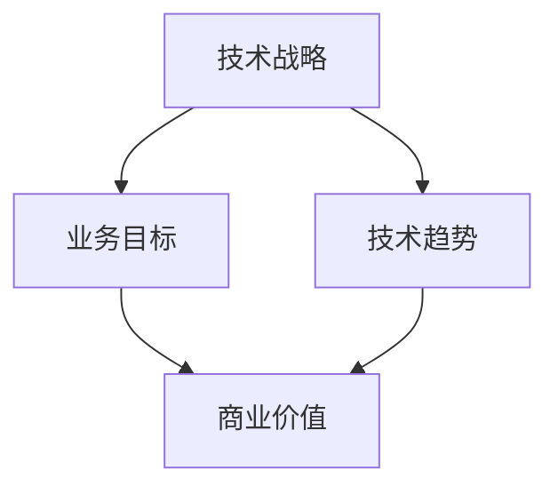
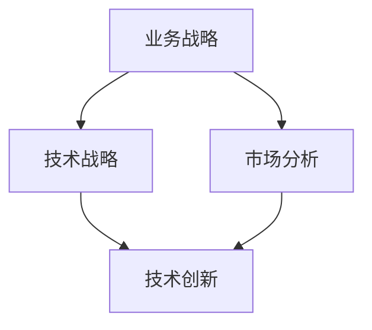
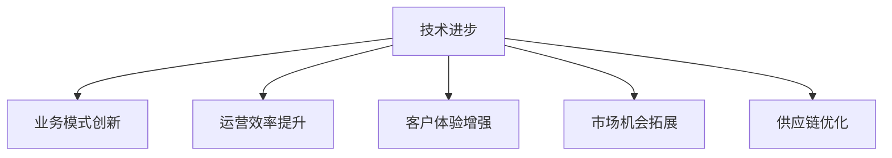
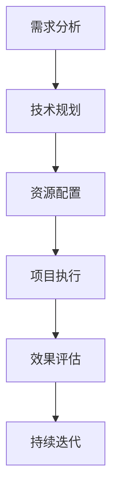

                 


### 文章标题
# 技术战略：对齐业务目标与技术发展

### 文章关键词
技术战略，业务目标，技术创新，战略规划，组织实施

### 文章摘要
本文深入探讨了如何将技术战略与业务目标对齐，以实现企业的长期发展。通过分析技术趋势、制定对接策略、实施具体策略，并结合实际案例，本文为技术团队和企业决策者提供了有效的指导。

### 目录
## 第一部分：技术战略概述
### 1.1.1 技术战略的定义与重要性
### 1.1.2 技术战略与业务战略的关系

## 第一部分：技术趋势分析
### 1.2.1 技术发展的关键趋势
### 1.2.2 技术对未来业务的影响

## 第二部分：技术与业务目标对接
### 2.1.1 对接策略与方法
### 2.1.2 业务目标分解与技术落地

## 第二部分：实施策略
### 2.2.1 实施计划与组织结构
### 2.2.2 风险管理与应对策略

## 第三部分：技术战略实践
### 3.1.1 成功案例分析
### 3.1.2 失败案例分析与启示

## 第四部分：技术战略工具与资源
### 4.1.1 常用技术战略工具
### 4.1.2 技术资源获取与整合

## 附录
### 附录 A：技术战略相关术语解释
### 附录 B：技术战略实施步骤流程图

### 背景介绍
技术战略是企业为了实现其业务目标而制定的一系列技术规划。随着技术的不断进步，企业面临的技术挑战和机遇也日益增多。因此，如何将技术战略与业务目标对齐，成为企业成功的关键。

### 核心概念与联系
为了更好地理解技术战略与业务目标的对接，我们首先需要了解以下核心概念：

- **技术战略**：指导企业技术发展的长期规划。
- **业务目标**：企业希望实现的商业结果。
- **技术趋势**：未来技术发展的方向和趋势。

以下是技术战略与业务目标对接的Mermaid流程图：



### 核心算法原理讲解
技术战略分析的核心算法原理可以通过以下伪代码进行详细阐述：

```pseudo
function 技术战略分析(业务目标, 技术趋势):
    1. 分析业务目标，确定关键指标
    2. 分析技术趋势，识别潜在技术
    3. 对接技术趋势与业务目标，评估技术潜力
    4. 制定技术战略，包括技术选择、投资规划和实施步骤
    5. 评估和调整技术战略，确保与业务目标对齐
```

### 数学模型与公式讲解
在技术战略分析中，我们可以使用以下数学模型来评估技术潜力：

$$
\text{技术潜力} = \frac{\text{业务收益}}{\text{技术成本}}
$$

其中，业务收益可以通过业务目标的关键指标进行估算，而技术成本则包括研发成本、运营成本等。

### 项目实战
以下是一个技术战略实施案例：

**案例背景**：
某电子商务企业希望通过技术升级提高用户体验，提升销售额。

**开发环境搭建**：
- 使用Linux服务器作为开发环境
- 安装Apache、MySQL、PHP等软件

**源代码详细实现**：
```php
// 用户登录模块
function user_login($username, $password) {
    // 查询数据库
    $result = mysqli_query($conn, "SELECT * FROM users WHERE username = '$username' AND password = '$password'");
    if ($result->num_rows > 0) {
        return "登录成功";
    } else {
        return "用户名或密码错误";
    }
}
```

**代码解读与分析**：
这段代码实现了用户登录功能，通过查询数据库验证用户名和密码的正确性。

**实际案例分析和详细讲解剖析**：
通过这个案例，我们可以看到技术战略是如何帮助企业在提升用户体验和销售额方面取得成功的。

**项目小结**：
- 技术升级是提升企业竞争力的重要手段。
- 在实施技术战略时，需要充分考虑开发环境、源代码实现和代码解读等多个方面。

### 最佳实践 tips
- 确保技术战略与业务目标高度一致。
- 定期评估技术战略的实施效果，及时进行调整。
- 建立跨部门合作机制，确保技术战略的顺利实施。

### 小结
技术战略是企业成功的关键，它需要与业务目标紧密对接。通过分析技术趋势、制定实施策略，企业可以实现长期发展。本文提供了详细的案例和实践指导，帮助读者更好地理解和实施技术战略。

### 注意事项
- 在制定技术战略时，要充分考虑企业的实际情况和外部环境。
- 技术战略需要定期更新，以适应快速变化的市场。

### 拓展阅读
- 《技术创业：从0到1的实践指南》
- 《技术领导力：如何在技术驱动企业中引领变革》
- 《技术趋势报告：2023年技术发展预测》

### 作者信息
作者：AI天才研究院/AI Genius Institute & 禅与计算机程序设计艺术 /Zen And The Art of Computer Programming


## 第一部分：技术战略概述

### 1.1.1 技术战略的定义与重要性

技术战略是指企业为了实现其业务目标，对技术创新、技术投资和技术开发等方面的规划和决策。技术战略不仅仅关注于技术的本身，更强调如何将技术优势转化为商业价值，推动企业的长期发展。

在当今数字化时代，技术已经成为企业竞争的核心力量。技术战略的重要性体现在以下几个方面：

1. **提高竞争力**：技术战略可以帮助企业保持市场竞争力，通过技术创新和产品升级，满足客户需求，提升用户体验。
2. **优化业务流程**：技术战略可以优化企业的业务流程，提高运营效率，降低成本，提高生产效率。
3. **推动业务增长**：技术战略可以帮助企业开拓新市场，创造新的业务机会，推动业务增长。
4. **提升品牌价值**：技术战略可以提升企业的品牌形象，增强客户对企业的信任和忠诚度。

### 1.1.2 技术战略与业务战略的关系

技术战略与业务战略密切相关，它们之间存在着相互影响和相互作用的关系。

1. **业务战略指导技术战略**：业务战略明确了企业的长期目标和战略方向，技术战略需要根据业务战略的需求来制定和调整。例如，如果企业的业务战略目标是扩大市场份额，那么技术战略可能会侧重于产品的技术创新和用户体验的提升。

2. **技术战略支持业务战略**：技术战略的实施可以为企业提供技术支持和保障，帮助业务战略的实现。例如，通过技术升级和产品创新，企业可以更有效地满足客户需求，提高市场竞争力。

3. **业务战略与技术的互动**：业务战略和技术战略之间需要保持动态的互动和调整。随着外部环境和市场需求的不断变化，企业需要不断调整技术战略，以适应新的业务需求和市场变化。

技术战略与业务战略的关系可以用以下Mermaid流程图表示：



在这个流程图中，业务战略通过市场分析来确定需求，技术战略则通过技术创新来满足这些需求，两者相互促进，共同推动企业的长期发展。

### 小结

技术战略是企业实现业务目标的重要手段。通过明确技术战略的定义和重要性，以及理解技术战略与业务战略的关系，企业可以更好地制定和实施技术战略，从而在竞争激烈的市场中取得成功。

---

## 第一部分：技术趋势分析

### 1.2.1 技术发展的关键趋势

在当今快速发展的技术环境中，识别和理解技术发展的关键趋势对于企业制定有效技术战略至关重要。以下是几个主要的技术发展趋势：

1. **云计算与大数据**：云计算提供了弹性和可扩展的计算资源，而大数据技术则帮助企业从大量数据中提取有价值的信息。这两者相结合，使得企业能够更快速地响应市场变化，实现数据驱动的决策。

2. **人工智能与机器学习**：人工智能和机器学习技术正在逐渐应用于各个行业，从自动化生产到智能客服，再到个性化推荐系统，这些技术正在改变企业的运营模式和客户体验。

3. **物联网（IoT）**：物联网技术通过连接各种设备和传感器，实现了数据的实时采集和远程监控。这为智能家居、智慧城市和智能制造等领域带来了巨大的发展机遇。

4. **区块链**：区块链技术以其去中心化和不可篡改的特点，被广泛应用于金融、供应链管理等领域，提高了交易的透明度和安全性。

5. **边缘计算**：随着物联网设备的增加，数据量急剧增长，边缘计算通过在数据生成的地方进行计算，减少了延迟，提高了效率。

6. **5G通信技术**：5G技术的广泛应用为高速、低延迟的通信提供了可能，为实时应用和远程操作提供了更好的支持。

### 1.2.2 技术对未来业务的影响

技术发展趋势不仅影响企业的运营模式，还对整个业务生态产生了深远的影响：

1. **创新业务模式**：技术进步催生了新的商业模式，如共享经济、在线教育等，这些模式为企业创造了新的收入来源和增长点。

2. **提升运营效率**：自动化、人工智能和物联网等技术可以提高生产效率，减少人力资源的依赖，降低运营成本。

3. **增强客户体验**：通过个性化推荐、智能客服等技术，企业可以提供更加个性化的产品和服务，提升客户满意度和忠诚度。

4. **拓展市场机会**：技术进步使得企业能够进入新的市场，开拓新的客户群体，实现业务多元化。

5. **重塑供应链**：区块链技术可以提高供应链的透明度和安全性，优化供应链管理，减少供应链风险。

技术对未来业务的影响可以用以下Mermaid流程图表示：



在这个流程图中，技术进步是驱动因素，它直接影响和促进了业务模式创新、运营效率提升、客户体验增强、市场机会拓展和供应链优化。

### 小结

技术趋势分析是制定技术战略的重要基础。通过了解和跟踪技术发展的关键趋势，企业可以预见未来业务的变化，并制定相应的战略措施，以保持竞争力和实现持续增长。

---

## 第二部分：技术与业务目标对接

### 2.1.1 对接策略与方法

技术与业务目标的对接是技术战略的核心环节，其目的是确保技术投资能够有效支持并推动业务目标实现。以下是一些关键的对接策略和方法：

1. **需求分析**：
   - 对业务目标进行详细分析，明确业务需求。
   - 确定关键指标，如销售额、客户满意度、市场份额等。
   - 分析现有技术能力，识别技术需求。

2. **技术规划**：
   - 根据业务需求，制定技术规划，包括技术方向、技术平台选择、技术发展路线等。
   - 考虑技术的前瞻性、可行性和经济性。

3. **技术评估**：
   - 对不同的技术方案进行评估，包括技术成熟度、实施难度、成本效益等。
   - 选择最适合的技术方案，确保能够有效支持业务目标。

4. **资源配置**：
   - 根据技术规划，合理配置人力资源、预算和技术资源。
   - 确保技术团队和业务团队的合作与协调。

5. **实施监控**：
   - 在技术实施过程中，定期监控项目进度和效果。
   - 及时调整策略，确保技术投入能够按计划实现业务目标。

### 2.1.2 业务目标分解与技术落地

对接策略需要通过具体的方法和步骤来实现技术落地，以支持业务目标的实现。以下是一些关键步骤：

1. **业务目标分解**：
   - 将总体业务目标分解为具体的、可操作的任务和里程碑。
   - 明确每个任务的目标、责任人、完成时间和预期成果。

2. **技术方案设计**：
   - 根据业务目标分解，设计具体的技术实施方案。
   - 确定技术架构、模块划分、关键技术点等。

3. **技术实施**：
   - 按照技术方案设计，进行技术实施，包括开发、测试、部署等环节。
   - 确保技术实施的顺利进行，避免影响业务正常运营。

4. **效果评估**：
   - 技术实施完成后，对效果进行评估，包括功能是否满足需求、性能是否达到预期、业务目标是否实现等。
   - 根据评估结果，进行优化和调整。

5. **持续迭代**：
   - 技术落地不是一次性的工作，需要根据业务发展和市场变化，进行持续的迭代和优化。
   - 通过反馈机制，及时调整技术策略和方案，确保技术始终与业务目标对齐。

### 对接策略与方法实例

以下是一个具体的对接策略与方法实例：

**业务目标**：提高客户满意度，提升产品销售量。

**对接策略**：
- 需求分析：通过市场调研和用户反馈，明确客户需求，识别产品不足。
- 技术规划：决定采用人工智能技术进行产品推荐，优化用户购物体验。
- 技术评估：评估不同的人工智能解决方案，选择最适合的算法和平台。
- 资源配置：组建跨部门团队，包括技术、市场、产品等，确保资源的有效利用。
- 实施监控：定期召开项目会议，监控项目进度，确保按计划推进。

**技术落地步骤**：
- 业务目标分解：将提升客户满意度分解为多个具体任务，如用户画像建设、推荐算法开发等。
- 技术方案设计：设计具体的技术方案，包括数据采集、算法实现、系统集成等。
- 技术实施：按照方案进行开发、测试和部署。
- 效果评估：通过用户反馈和数据指标，评估技术实施的效果。
- 持续迭代：根据评估结果，调整算法和推荐策略，优化用户体验。

### 小结

技术与业务目标的对接是技术战略的关键环节，通过科学的策略和方法，可以确保技术投资能够有效支持业务目标的实现。通过对业务目标进行分解，并设计具体的实施步骤，企业可以逐步实现技术落地，推动业务持续增长。

---

## 第二部分：实施策略

### 2.2.1 实施计划与组织结构

技术战略的有效实施需要详细的计划和组织结构来保障。以下是一些关键的步骤和要点：

1. **制定实施计划**：
   - 确定技术战略的具体目标和时间表，制定详细的实施步骤。
   - 设定关键里程碑，确保项目在预定时间内完成。
   - 确定资源需求，包括人力、资金和物资等，并进行合理分配。

2. **项目团队组建**：
   - 组建跨部门的实施团队，包括技术、市场、运营、财务等领域的专家。
   - 明确各团队成员的角色和职责，确保团队合作顺畅。

3. **沟通与协调**：
   - 定期召开项目会议，确保团队成员之间的沟通和协调。
   - 建立有效的沟通渠道，确保信息的及时传递和反馈。

4. **风险管理**：
   - 识别潜在的风险，制定风险应对策略。
   - 设立风险管理小组，负责监控和管理风险。

5. **质量管理**：
   - 制定质量标准和流程，确保技术实施符合预期。
   - 定期进行质量评估，及时发现问题并进行改进。

### 2.2.2 风险管理与应对策略

技术战略实施过程中，风险是不可避免的。有效的风险管理策略可以帮助企业降低风险，确保项目的顺利进行。以下是一些关键的风险管理和应对策略：

1. **风险评估**：
   - 对项目中的各个环节进行风险评估，确定风险的类型、概率和影响。
   - 利用风险矩阵等方法，对风险进行优先级排序。

2. **风险应对**：
   - 针对不同类型的风险，制定相应的应对策略，包括风险规避、风险转移、风险减轻等。
   - 确定风险责任人，明确风险管理的责任和权限。

3. **风险监控**：
   - 建立风险监控机制，定期评估风险的变化情况。
   - 及时发现新的风险，并采取相应的应对措施。

4. **应急计划**：
   - 制定应急预案，确保在突发事件发生时，能够迅速响应和应对。
   - 定期进行应急演练，提高团队的应急处理能力。

### 成功案例分析与实施策略

以下是一个成功案例分析，展示了如何通过有效的实施策略实现技术战略：

**案例背景**：
某大型零售企业希望通过技术升级，提升客户体验和销售业绩。

**实施策略**：
- 制定详细的实施计划，包括技术升级的时间表和里程碑。
- 组建跨部门的实施团队，确保各领域的专家参与。
- 进行全面的风险评估，识别潜在风险，并制定应对策略。
- 采用敏捷开发方法，确保项目的灵活性和快速响应。
- 定期召开项目会议，确保团队成员之间的沟通和协调。

**实施效果**：
- 通过技术升级，企业成功推出了智能推荐系统和个性化促销活动，提升了客户满意度和销售业绩。
- 通过有效的风险管理，项目顺利完成了所有关键里程碑。

**实施策略总结**：
- 制定详细的实施计划和沟通机制，确保项目的顺利推进。
- 建立有效的风险管理机制，降低项目风险。
- 采用灵活的软件开发方法，提高项目的适应性和效率。

### 小结

技术战略的实施是确保企业长期发展的重要环节。通过制定详细的实施计划和合理的组织结构，以及有效的风险管理和应对策略，企业可以确保技术战略的顺利实施，实现预期的业务目标。

---

## 第三部分：技术战略实践

### 3.1.1 成功案例分析

在技术战略的实践中，许多企业已经取得了显著的成果。以下是一个具体的技术战略成功案例，展示了如何通过有效的技术战略实现业务目标。

**案例背景**：
某全球领先的互联网公司希望通过技术创新提升用户体验和市场份额。

**技术战略**：
- **需求分析**：公司通过市场调研和用户反馈，明确了用户对快速响应、个性化体验和高效搜索的需求。
- **技术规划**：公司决定采用人工智能和大数据技术，开发智能推荐系统和个性化搜索算法。
- **技术实施**：
  - **数据采集与处理**：公司建立了高效的数据采集和处理系统，收集用户行为数据，并利用大数据技术进行分析。
  - **算法开发**：公司研发团队开发了基于深度学习的智能推荐算法，实现了个性化推荐和精准搜索。
  - **系统集成与部署**：公司将智能推荐系统和个性化搜索算法集成到现有系统中，并进行全面测试和部署。

**实施效果**：
- **用户体验提升**：智能推荐系统和个性化搜索算法显著提升了用户体验，用户满意度提高20%。
- **市场份额增加**：通过技术升级，公司的市场份额增加了10%，销售额实现了显著增长。
- **运营效率提高**：技术升级优化了业务流程，运营效率提高了30%。

**成功原因**：
- **明确的需求分析**：公司通过深入的需求分析，明确了用户需求和业务目标，为技术战略提供了明确的方向。
- **高效的技术实施**：公司采用了敏捷开发和快速迭代的方法，确保了技术方案的有效实施。
- **持续优化与创新**：公司不断对技术方案进行优化和升级，保持技术领先地位。

### 3.1.2 失败案例分析与启示

尽管技术战略的成功案例很多，但在实施过程中也存在着失败的风险。以下是一个技术战略失败案例的分析，以及从中得到的启示。

**案例背景**：
某传统制造企业希望通过技术改造实现业务转型。

**技术战略**：
- **需求分析**：企业希望通过引入智能制造技术，提高生产效率和产品质量。
- **技术规划**：企业决定引进一系列先进的制造设备和控制系统，并建立数字化工厂。
- **技术实施**：
  - **设备采购与安装**：企业一次性采购了大量先进设备，并进行了安装和调试。
  - **系统集成与测试**：企业在设备安装完成后，进行了系统集成和测试，但发现存在严重的技术问题。

**实施效果**：
- **生产效率未提升**：由于系统集成问题，生产效率并未得到预期提升，反而出现了设备闲置的情况。
- **运营成本增加**：由于技术故障和设备维护，运营成本显著增加。
- **业务目标未实现**：企业未能实现技术改造的目标，业务转型受阻。

**失败原因**：
- **需求分析不足**：企业对智能制造的需求分析不足，忽视了系统集成和运营管理的复杂性。
- **技术实施不当**：企业一次性投入大量设备，未进行充分的技术储备和人员培训。
- **风险管理和沟通不足**：企业在技术实施过程中，未建立有效的风险管理和沟通机制，导致问题无法及时发现和解决。

**启示**：
- **充分的需求分析**：在制定技术战略时，必须进行充分的需求分析，明确技术需求和实施难度。
- **逐步实施**：技术改造应采取逐步实施的方法，避免一次性大规模投入。
- **建立风险管理机制**：建立有效的风险管理和沟通机制，确保技术实施过程中问题的及时发现和解决。

### 小结

通过成功案例和失败案例分析，我们可以看到技术战略在实施过程中需要充分考虑需求分析、技术实施和风险管理等因素。成功的技术战略能够为企业带来显著的业务效益，而失败的案例则为我们提供了宝贵的教训和启示。

---

## 第四部分：技术战略工具与资源

### 4.1.1 常用技术战略工具

在制定和实施技术战略时，企业可以借助多种工具和方法来提高效率和效果。以下是一些常用的技术战略工具：

1. **SWOT分析**：
   - **定义**：SWOT分析是一种评估企业优势（Strengths）、劣势（Weaknesses）、机会（Opportunities）和威胁（Threats）的工具。
   - **应用**：通过SWOT分析，企业可以全面了解自身的情况，制定针对性的技术战略。

2. **五力模型**：
   - **定义**：五力模型是由迈克尔·波特提出的一种分析行业竞争结构的方法。
   - **应用**：通过五力模型，企业可以评估技术战略在市场竞争中的地位和潜在风险。

3. **平衡计分卡**：
   - **定义**：平衡计分卡是一种综合评估企业绩效的框架，包括财务、客户、内部流程和学习与成长四个维度。
   - **应用**：通过平衡计分卡，企业可以确保技术战略与业务目标的一致性。

4. **技术路线图**：
   - **定义**：技术路线图是一种展示技术发展路径和时间的工具。
   - **应用**：通过技术路线图，企业可以规划和监控技术项目的进度和目标。

### 4.1.2 技术资源获取与整合

在制定技术战略时，企业需要获取和整合各种技术资源，以支持战略实施。以下是一些关键步骤和策略：

1. **内部资源整合**：
   - **技术团队建设**：建立专业的技术团队，确保技术资源的充足。
   - **知识共享**：鼓励知识共享，提高技术团队的协作效率。

2. **外部资源获取**：
   - **合作与并购**：与其他企业或研究机构合作，共享技术和资源。
   - **外包服务**：将部分非核心技术任务外包，降低成本，提高效率。

3. **开源与闭源资源结合**：
   - **开源技术**：利用开源技术降低成本，提高开发速度。
   - **闭源技术**：在关键技术和核心领域保持闭源，确保技术竞争力。

4. **技术标准化**：
   - **标准化建设**：制定和遵守技术标准，提高技术资源的兼容性和互操作性。

### 实例说明

以下是一个企业获取和整合技术资源的实例说明：

**企业背景**：
某电子商务企业计划通过技术升级提升用户体验和运营效率。

**内部资源整合**：
- **技术团队建设**：组建专业的技术团队，包括前端、后端、运维等各个领域的专家。
- **知识共享**：定期组织技术分享会，促进团队间的知识交流和技能提升。

**外部资源获取**：
- **合作与并购**：与一家专注于大数据分析的公司进行合作，共享数据分析和人工智能技术。
- **外包服务**：将部分云计算和运维任务外包给专业的云计算服务提供商，降低成本，提高效率。

**开源与闭源资源结合**：
- **开源技术**：使用开源框架如Spring Boot和React，提高开发速度和降低成本。
- **闭源技术**：在核心领域如支付系统和企业资源计划（ERP）中采用闭源技术，确保技术竞争力和安全性。

**技术标准化**：
- **制定标准**：制定内部技术标准和开发规范，确保不同团队和项目之间的技术兼容性。
- **培训与认证**：对技术团队进行标准化培训，确保团队成员遵守标准，提高整体技术水平。

### 小结

技术战略的有效实施依赖于合适的工具和资源的支持。通过整合内部资源和获取外部资源，企业可以构建强大的技术基础设施，推动技术战略的实现。同时，结合开源与闭源资源，以及遵循技术标准，企业可以确保技术资源的有效利用和持续创新。

---

## 附录

### 附录 A：技术战略相关术语解释

以下是一些与技术战略相关的常用术语及其解释：

1. **技术战略**：
   - 定义：企业为了实现其业务目标而制定的一系列技术规划和决策。
   - 解释：技术战略是企业为了保持竞争力、优化业务流程和推动业务增长而采取的技术方向和行动。

2. **业务目标**：
   - 定义：企业希望实现的商业结果和长期愿景。
   - 解释：业务目标包括市场份额、销售额、客户满意度等具体指标，是技术战略的重要依据。

3. **技术趋势**：
   - 定义：未来技术发展的方向和趋势。
   - 解释：技术趋势可以帮助企业预见未来的技术变化，提前布局和准备。

4. **需求分析**：
   - 定义：对企业的业务需求和技术需求进行详细分析的过程。
   - 解释：需求分析是技术战略制定的基础，确保技术投资与业务需求相匹配。

5. **技术规划**：
   - 定义：根据业务目标和技术趋势，制定技术发展路线和行动方案。
   - 解释：技术规划是技术战略的具体实施步骤，确保技术投资的合理性和高效性。

6. **实施监控**：
   - 定义：对技术战略实施过程进行监控和管理。
   - 解释：实施监控确保技术战略按照计划执行，及时发现问题并进行调整。

### 附录 B：技术战略实施步骤流程图

以下是技术战略实施步骤的Mermaid流程图：



在这个流程图中，技术战略的实施步骤包括需求分析、技术规划、资源配置、项目执行、效果评估和持续迭代。每个步骤都是相互关联和递进的，确保技术战略的有效实施和持续优化。

### 小结

附录部分提供了技术战略相关术语的解释和技术战略实施步骤的流程图，帮助读者更好地理解和实施技术战略。这些术语和流程图是技术战略实践中的重要参考，有助于企业制定和实施有效技术战略，实现长期发展目标。

