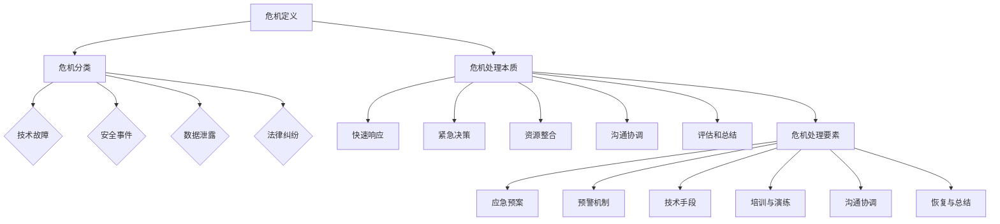

                 


## 文章标题

### 技术管理中的危机处理

> 关键词：技术管理，危机处理，应急预案，响应流程，技术手段，案例分析，能力提升

> 摘要：本文将深入探讨技术管理中的危机处理，从背景介绍、核心概念、危机处理流程、技术手段、案例分析、能力提升等多个方面展开论述。通过详细的讲解和实例分析，帮助读者全面了解危机处理的实际操作和方法。

----------------------------------------------------------------

## 目录大纲

### 第一部分：背景介绍

1. 技术管理中的危机现象
2. 危机处理的必要性
3. 危机处理的发展趋势

### 第二部分：核心概念与联系

1. 危机的定义与分类
2. 危机处理的本质
3. 危机处理的要素

### 第三部分：危机处理流程

1. 危机预警
2. 危机响应
3. 危机恢复
4. 危机总结

### 第四部分：技术手段与工具

1. 数据分析技术
2. 自动化技术
3. 信息安全技术
4. 云计算与大数据技术

### 第五部分：案例分析

1. 成功案例
2. 失败案例

### 第六部分：能力提升

1. 培训与演练
2. 基础设施建设
3. 技术储备与更新
4. 持续改进与优化

### 第七部分：总结与展望

1. 小结
2. 注意事项
3. 拓展阅读

----------------------------------------------------------------

### 第一部分：背景介绍

#### 1. 技术管理中的危机现象

在技术管理过程中，危机现象无处不在。这些危机可能源于技术故障、安全漏洞、数据泄露、法律纠纷等多种原因。例如，某公司由于服务器故障导致网站宕机，影响了客户的业务；某企业由于安全漏洞被黑客攻击，导致大量客户数据泄露。这些危机对企业的声誉、经济利益和员工的工作情绪都产生了深远的影响。

#### 2. 危机处理的必要性

危机处理是技术管理中不可或缺的一环。有效的危机处理可以帮助企业降低风险，减少损失，维护企业形象，甚至可能转变为企业的竞争优势。因此，对危机处理的研究和实施具有重要的现实意义。

#### 3. 危机处理的发展趋势

随着信息技术的发展，危机处理的方法和工具也在不断进步。大数据、人工智能、云计算等新技术在危机预警、响应和恢复中的应用越来越广泛。同时，跨国合作、行业联盟等也在推动危机处理的标准化和专业化。

### 第二部分：核心概念与联系

#### 1. 危机的定义与分类

**危机**是指企业或组织在运营过程中，由于内部或外部因素导致的严重问题，可能对企业或组织的利益、声誉、业务运营等产生重大影响。

**危机分类**主要包括：
- **技术故障**：如服务器宕机、网络中断等。
- **安全漏洞**：如系统被黑、数据泄露等。
- **数据泄露**：如敏感信息泄露、商业机密泄露等。
- **法律纠纷**：如合同纠纷、知识产权纠纷等。

#### 2. 危机处理的本质

危机处理的本质是快速识别、评估、响应和恢复危机，以最大限度地减少损失和影响。具体包括以下几个方面：
- **预警**：通过监控和数据分析，提前发现潜在危机。
- **响应**：在危机发生时，立即采取行动，控制危机蔓延。
- **恢复**：在危机解决后，进行系统修复和数据恢复，确保业务恢复正常。
- **总结**：对危机处理过程进行总结和反思，为未来危机处理提供经验。

#### 3. 危机处理的要素

危机处理的要素主要包括：
- **应急预案**：制定详细的应急预案，明确危机处理流程和责任人。
- **风险评估**：对潜在危机进行评估，确定危机处理的优先级。
- **沟通协调**：在危机处理过程中，保持内外部沟通畅通，协调各方资源。
- **技术手段**：运用先进的技术手段，提高危机处理的效率和效果。

### 第三部分：危机处理流程

#### 1. 危机预警

**预警机制**：建立实时监控系统，对服务器、网络、安全等进行监控。
**预警方法**：使用机器学习、数据挖掘等技术，预测潜在危机。

#### 2. 危机响应

**响应流程**：
1. **发现危机**：通过监控系统或用户反馈，发现危机。
2. **评估危机**：评估危机的性质、影响范围和严重程度。
3. **响应行动**：根据危机类型和严重程度，采取相应的响应措施。

#### 3. 危机恢复

**恢复流程**：
1. **控制危机**：采取措施，防止危机扩散。
2. **修复系统**：对受影响的系统进行修复。
3. **数据恢复**：对受影响的数据进行备份和恢复。
4. **测试验证**：对修复后的系统进行测试，确保稳定运行。

#### 4. 危机总结

**总结内容**：
1. **危机处理过程**：对危机处理过程进行回顾和分析。
2. **原因分析**：分析危机发生的原因和责任。
3. **改进措施**：提出改进措施，预防类似危机再次发生。

### 第四部分：技术手段与工具

#### 1. 数据分析技术

**技术原理**：使用数据分析技术，对系统日志、用户行为、网络流量等进行实时监控和分析。
**应用实例**：通过大数据分析，预测潜在危机，提前采取措施。

#### 2. 自动化技术

**技术原理**：通过自动化技术，实现危机处理流程的自动化。
**应用实例**：使用自动化工具，实现自动报警、自动修复、自动恢复等功能。

#### 3. 信息安全技术

**技术原理**：使用信息安全技术，保护系统和数据安全。
**应用实例**：使用防火墙、入侵检测系统、加密技术等，防止黑客攻击和数据泄露。

#### 4. 云计算与大数据技术

**技术原理**：利用云计算和大数据技术，提高危机处理的效率和效果。
**应用实例**：使用云计算平台，实现分布式监控和数据处理；使用大数据分析，预测潜在危机。

### 第五部分：案例分析

#### 1. 成功案例

**案例描述**：某企业通过大数据分析和自动化技术，成功预警并处理了一次大规模的网络攻击。
**案例解析**：该企业通过大数据分析，发现网络流量的异常变化，立即启动自动化工具，成功阻止了攻击，保护了企业数据。

#### 2. 失败案例

**案例描述**：某公司由于缺乏有效的应急预案，导致一次数据泄露事件，企业声誉受到严重损害。
**案例解析**：该企业没有建立完善的应急预案，危机处理过程中出现混乱，导致数据泄露范围扩大。

### 第六部分：能力提升

#### 1. 培训与演练

**培训内容**：对员工进行危机处理培训，提高员工的危机意识和应对能力。
**演练方式**：定期进行危机处理演练，检验员工的实际操作能力。

#### 2. 基础设施建设

**建设内容**：建立完善的监控系统、备份系统、安全防护系统等基础设施。
**建设标准**：遵循行业标准和最佳实践，确保基础设施的稳定性和可靠性。

#### 3. 技术储备与更新

**技术储备**：掌握最新的危机处理技术，确保技术手段的先进性。
**技术更新**：定期更新技术手段，紧跟行业发展趋势。

#### 4. 持续改进与优化

**改进方法**：对危机处理过程进行持续改进，提高危机处理的效率和效果。
**优化方向**：结合实际案例，总结经验教训，不断优化危机处理流程和策略。

### 第七部分：总结与展望

#### 1. 小结

本文从背景介绍、核心概念、危机处理流程、技术手段、案例分析、能力提升等方面，全面阐述了技术管理中的危机处理。通过本文的讲解，读者可以了解到危机处理的实际操作方法和重要性。

#### 2. 注意事项

- **重视危机预警**：建立完善的预警机制，及时发现潜在危机。
- **制定应急预案**：制定详细的应急预案，明确危机处理流程和责任人。
- **加强技术储备**：掌握最新的危机处理技术，提高危机处理能力。
- **持续改进与优化**：对危机处理过程进行持续改进，提高危机处理的效率和效果。

#### 3. 拓展阅读

- **相关书籍**：《危机管理》、《技术风险与管理》等。
- **学术论文**：关于危机处理的相关研究和案例分析。
- **在线课程**：危机处理、应急管理等在线课程。

---

**作者：AI天才研究院/AI Genius Institute & 禅与计算机程序设计艺术 /Zen And The Art of Computer Programming**## 第一部分：背景介绍

### 1.1 技术管理中的危机现象

在技术管理过程中，危机现象是一种常见且不可忽视的风险。危机可能源于技术故障、安全漏洞、数据泄露、法律纠纷等各种原因。随着企业对信息技术的依赖程度越来越高，技术管理中的危机现象也愈发普遍和复杂。

#### 技术故障

技术故障是指由于硬件、软件或其他技术组件的故障而导致系统无法正常运行的现象。例如，服务器宕机、网络中断、数据库损坏等。技术故障可能导致企业无法提供正常的服务，影响业务运营，甚至可能导致企业声誉受损。

#### 安全漏洞

安全漏洞是指系统中存在的可以被利用的缺陷或弱点，攻击者可以利用这些漏洞进行恶意攻击，从而窃取数据、破坏系统或造成其他损害。例如，系统中的后门、漏洞和溢出等。安全漏洞的发现和利用可能导致数据泄露、系统瘫痪或企业财务损失。

#### 数据泄露

数据泄露是指敏感数据在未经授权的情况下被非法访问、复制、传输或泄露。数据泄露可能导致个人隐私泄露、商业机密泄露、财务信息泄露等，对企业造成严重的经济和声誉损失。

#### 法律纠纷

法律纠纷是指由于合同履行、知识产权保护、数据保护等问题引发的争议。例如，合同纠纷、专利侵权、版权争议等。法律纠纷可能导致企业面临巨额赔偿、业务中断甚至法律制裁。

### 1.2 危机处理的必要性

危机处理是指在危机发生时，采取有效的措施来减轻危机的影响、控制危机的发展、恢复系统的正常运行，并从危机中吸取教训，以防止类似危机再次发生。危机处理的必要性体现在以下几个方面：

#### 1. 保护企业利益

危机处理可以帮助企业最大限度地减少损失，保护企业的经济利益。例如，通过快速响应和恢复，可以减少业务中断的时间和损失，降低财务风险。

#### 2. 维护企业声誉

有效的危机处理能够帮助企业维护形象和声誉，避免因危机而导致的负面舆论和公众质疑。危机处理过程中，良好的沟通和透明的信息披露是维护企业形象的关键。

#### 3. 提高员工信心

危机处理不仅是对企业的考验，也是对员工士气的考验。有效的危机处理能够提高员工的信心，增强团队凝聚力，从而提高工作效率。

#### 4. 预防未来危机

通过危机处理，企业可以总结经验教训，改进管理和技术手段，预防未来可能发生的类似危机。

### 1.3 危机处理的发展趋势

随着信息技术的发展，危机处理的方法和工具也在不断进步。以下是一些危机处理的发展趋势：

#### 1. 数据驱动

数据驱动是危机处理的重要趋势。通过收集和分析大量的数据，企业可以更好地预测潜在危机，制定更有效的应急预案。

#### 2. 自动化

自动化技术在危机处理中的应用越来越广泛。例如，自动化工具可以自动检测和响应系统故障、安全漏洞等，提高危机处理的效率和效果。

#### 3. 云计算与大数据

云计算和大数据技术的应用使得危机处理更加高效和智能。通过云平台，企业可以实现分布式监控和数据处理，快速响应和解决危机。大数据分析可以帮助企业更好地理解危机的本质和趋势，从而制定更有效的应对策略。

#### 4. 人工智能

人工智能技术在危机处理中的应用正在逐步展开。例如，使用机器学习算法进行异常检测、预测危机等，提高危机预警的准确性和效率。

#### 5. 国际合作

随着全球化的加深，跨国企业和国际组织的危机处理需求不断增加。国际合作和经验交流有助于提高危机处理的水平和能力。

## 第二部分：核心概念与联系

### 2.1 危机的定义与分类

**危机**是一个广泛的概念，通常指的是一种突发事件或不确定事件，它可能对个人、组织或社会产生负面影响。在技术管理领域，危机通常是指由于技术问题或安全事件引发的严重状况，可能导致业务中断、数据泄露、声誉受损等。

#### 定义

危机可以定义为：

- 一种突发性、紧急性事件，可能对企业或组织造成重大影响。
- 一种不确定的事件，其发生时间和影响范围无法完全预测。
- 一种需要迅速响应和解决的事件，以防止进一步损害。

#### 分类

危机可以根据不同的标准进行分类，以下是一些常见的分类方法：

1. **按性质分类**：
   - **技术故障**：由于硬件、软件、网络等原因导致的技术系统失效。
   - **安全事件**：包括黑客攻击、病毒感染、数据泄露等。
   - **自然灾难**：如地震、洪水、火灾等自然灾害引发的危机。

2. **按影响范围分类**：
   - **局部危机**：仅影响企业的一部分业务或系统。
   - **全局危机**：影响企业的整体运营和业务。

3. **按危机性质分类**：
   - **可预测危机**：可以通过监控和分析预测到的危机。
   - **不可预测危机**：无法通过常规手段预测的危机。

### 2.2 危机处理的本质

危机处理的本质是为了减轻危机的影响、控制危机的发展、恢复系统的正常运行，并从中学习，以减少未来危机的发生概率。具体来说，危机处理的本质包括以下几个方面：

1. **快速响应**：在危机发生时，迅速采取行动，防止危机扩大。

2. **紧急决策**：在危机处理过程中，需要快速做出决策，采取有效措施。

3. **资源整合**：调动企业内外部的资源，如技术支持、人员配备、物资保障等。

4. **沟通协调**：确保内部沟通顺畅，与外部利益相关者保持有效沟通。

5. **评估和总结**：在危机处理后，对危机原因、处理过程、效果等进行评估，总结经验教训。

### 2.3 危机处理的要素

危机处理的成功依赖于多个要素的协同作用，以下是一些关键要素：

1. **应急预案**：制定详细的应急预案，明确危机处理流程、责任人、资源调配等。

2. **预警机制**：建立预警系统，通过实时监控和数据分析，提前发现潜在危机。

3. **技术手段**：利用先进的技术工具，如数据分析、自动化、云计算等，提高危机处理效率。

4. **培训与演练**：定期对员工进行危机处理培训，提高员工的危机意识和应对能力。

5. **沟通协调**：确保危机处理过程中，内部各部门和外部利益相关者之间的沟通畅通。

6. **恢复与总结**：危机处理后，进行系统恢复、数据恢复，并总结危机原因和处理经验。

### 2.4 核心概念之间的关系架构

为了更好地理解危机处理的核心概念，我们可以通过Mermaid流程图来展示它们之间的关系。以下是一个简化的Mermaid流程图示例：



通过上述流程图，我们可以清晰地看到危机处理的核心概念及其之间的关系。这个框架有助于我们系统地理解和实施危机处理策略。

## 第三部分：危机处理流程

### 3.1 危机预警

**预警机制**是危机处理的首要环节，其目标是提前发现潜在危机，以便采取预防措施。预警机制通常包括以下步骤：

1. **监控与数据分析**：
   - 使用各种监控工具对系统、网络、应用程序等进行实时监控。
   - 收集和分析系统日志、网络流量、用户行为等数据，发现异常指标。

2. **阈值设置**：
   - 根据业务需求和历史数据，设定预警阈值。
   - 当监控数据超过设定的阈值时，触发预警。

3. **预警触发**：
   - 当监控系统检测到异常时，自动触发预警通知。
   - 通知相关人员，包括技术团队和管理层。

4. **预警处理**：
   - 根据预警类型和严重程度，采取相应的处理措施。
   - 如进行初步调查、隔离受影响系统、准备应急响应等。

**预警方法**：

1. **机器学习与数据挖掘**：
   - 利用机器学习算法分析历史数据，预测潜在危机。
   - 通过异常检测算法，识别异常行为和模式。

2. **智能预警系统**：
   - 开发智能预警系统，结合多种数据源进行综合分析。
   - 实现自动预警和实时通知功能。

### 3.2 危机响应

危机响应是指在危机发生后，立即采取行动，以控制危机蔓延、减轻损失。危机响应通常包括以下步骤：

1. **响应计划**：
   - 根据应急预案，制定详细的响应计划。
   - 明确响应步骤、责任人、资源需求等。

2. **紧急行动**：
   - 启动紧急响应流程，通知相关人员。
   - 快速隔离受影响系统，防止危机扩大。

3. **问题定位**：
   - 对受影响系统进行诊断，确定问题的根本原因。
   - 查找日志、检查配置、分析代码等，找出问题源头。

4. **解决问题**：
   - 根据问题定位，采取相应的修复措施。
   - 修复系统漏洞、升级软件、更换硬件等。

5. **监控恢复**：
   - 在问题解决后，对系统进行恢复和监控。
   - 确保系统稳定运行，防止再次发生类似问题。

### 3.3 危机恢复

危机恢复是指危机处理结束后，对受影响的系统和数据进行恢复，确保业务正常运行。危机恢复通常包括以下步骤：

1. **数据备份**：
   - 定期进行数据备份，确保在危机发生时，可以快速恢复数据。
   - 使用异地备份和云存储等技术，提高数据备份的安全性。

2. **系统恢复**：
   - 对受影响的系统进行恢复，包括硬件修复、软件重装、配置恢复等。
   - 确保系统恢复后的稳定性和可靠性。

3. **业务恢复**：
   - 逐步恢复受危机影响的服务和业务。
   - 对受影响客户进行沟通和补偿，提高客户满意度。

4. **评估与改进**：
   - 对危机处理过程进行评估，总结经验教训。
   - 根据评估结果，改进应急预案和危机处理流程。

### 3.4 危机总结

危机总结是危机处理的重要环节，其目的是通过对危机发生、处理过程和结果的总结，为未来危机处理提供参考。危机总结通常包括以下步骤：

1. **原因分析**：
   - 分析危机发生的原因，包括技术故障、安全漏洞、人为失误等。
   - 确定危机的根本原因，找出可能导致危机的潜在因素。

2. **责任认定**：
   - 根据原因分析，确定危机处理过程中的责任。
   - 对责任人进行问责，并根据情况采取相应的处罚或培训。

3. **经验教训**：
   - 总结危机处理过程中的成功经验和失败教训。
   - 提出改进措施，完善应急预案和危机处理流程。

4. **知识分享**：
   - 将危机处理的经验教训分享给团队成员，提高整体的危机应对能力。
   - 组织培训和演练，提高员工的危机意识和应对能力。

通过上述危机处理流程，企业可以更好地应对各种危机，减少危机带来的损失，提高整体的风险管理能力。

## 第四部分：技术手段与工具

### 4.1 数据分析技术

数据分析技术在危机预警和处理中发挥着重要作用。通过对大量数据的分析和挖掘，企业可以提前发现潜在危机，并制定相应的应对措施。

#### 技术原理

数据分析技术主要包括数据采集、数据存储、数据处理和分析四个方面：

1. **数据采集**：
   - 收集系统日志、网络流量、用户行为等数据。
   - 使用数据爬虫、传感器等工具，实现实时数据采集。

2. **数据存储**：
   - 将采集到的数据存储在数据库或数据仓库中，以便进行后续处理。
   - 使用分布式存储技术，提高数据存储的效率和安全性。

3. **数据处理**：
   - 对原始数据进行清洗、转换和整合，使其符合分析要求。
   - 使用ETL（提取、转换、加载）工具，实现数据处理。

4. **数据分析**：
   - 利用统计分析、机器学习等方法，对数据进行分析和挖掘。
   - 建立预测模型，发现数据中的规律和趋势。

#### 应用实例

1. **异常检测**：
   - 通过监控和分析系统日志，发现异常行为和指标。
   - 当检测到异常时，自动触发预警，通知相关人员。

2. **风险评估**：
   - 对企业内部和外部的风险因素进行分析和评估。
   - 根据风险评估结果，制定相应的预防和应对措施。

3. **趋势预测**：
   - 通过历史数据分析和趋势预测，提前发现潜在危机。
   - 根据预测结果，提前采取预防措施，降低危机发生的概率。

### 4.2 自动化技术

自动化技术在危机响应和恢复过程中具有重要作用。通过自动化工具，企业可以快速响应危机，提高危机处理效率。

#### 技术原理

自动化技术主要包括自动化监控、自动化响应和自动化恢复三个方面：

1. **自动化监控**：
   - 使用自动化工具，对系统、网络、应用程序等进行实时监控。
   - 当监控到异常时，自动触发警报和响应。

2. **自动化响应**：
   - 根据预设的规则和脚本，自动执行危机响应措施。
   - 包括隔离故障系统、启动备份、重启服务等。

3. **自动化恢复**：
   - 在危机处理结束后，自动执行恢复措施。
   - 包括系统修复、数据恢复、业务恢复等。

#### 应用实例

1. **自动化备份**：
   - 定期自动备份系统数据，确保在危机发生时，可以快速恢复。
   - 使用备份工具，实现自动化备份和恢复。

2. **自动化故障转移**：
   - 当主系统发生故障时，自动切换到备份系统，确保业务不中断。
   - 使用故障转移工具，实现自动化故障转移。

3. **自动化测试**：
   - 在危机处理过程中，自动执行系统测试，确保系统恢复正常后，无遗留问题。
   - 使用自动化测试工具，实现自动化测试和验证。

### 4.3 信息安全技术

信息安全技术是保障企业信息系统安全的关键。通过信息安全技术，企业可以防止黑客攻击、数据泄露等安全事件。

#### 技术原理

信息安全技术主要包括以下几个方面：

1. **网络安全**：
   - 保护网络不受攻击，包括防火墙、入侵检测系统、安全协议等。

2. **数据安全**：
   - 保护数据不被非法访问、篡改或泄露，包括加密技术、访问控制等。

3. **应用安全**：
   - 保护应用程序的安全，包括安全编码、安全测试、安全补丁管理等。

4. **终端安全**：
   - 保护终端设备的安全，包括终端管理、终端防护、远程控制等。

#### 应用实例

1. **防火墙**：
   - 防火墙用于阻止未经授权的访问，保护企业内部网络。
   - 通过配置防火墙规则，限制网络流量，提高网络安全性。

2. **入侵检测系统（IDS）**：
   - 入侵检测系统用于监控网络流量和系统行为，发现潜在攻击。
   - 通过分析流量日志和行为模式，检测并阻止入侵行为。

3. **数据加密**：
   - 数据加密用于保护敏感数据不被非法访问。
   - 使用加密算法，将数据加密存储和传输，确保数据安全。

4. **安全补丁管理**：
   - 定期更新系统和应用程序的补丁，修复安全漏洞。
   - 通过自动化工具，实现安全补丁的快速分发和部署。

### 4.4 云计算与大数据技术

云计算和大数据技术为危机处理提供了强大的支持。通过云计算平台和大数据分析，企业可以更好地监控、预警和处理危机。

#### 技术原理

1. **云计算**：
   - 提供弹性的计算资源，实现按需分配和计费。
   - 通过云平台，实现分布式计算和存储，提高系统性能和可靠性。

2. **大数据分析**：
   - 对大量数据进行分析和挖掘，发现规律和趋势。
   - 使用大数据技术，实现实时监控和预警。

#### 应用实例

1. **分布式监控**：
   - 使用云计算平台，实现分布式监控和数据处理。
   - 通过云服务，实现实时监控和数据备份。

2. **实时分析**：
   - 使用大数据技术，对实时数据进行分析和挖掘。
   - 通过实时分析，发现潜在危机，提前预警。

3. **云计算备份**：
   - 使用云计算服务，实现数据备份和恢复。
   - 通过云存储，实现数据的安全存储和快速恢复。

4. **智能预警**：
   - 利用机器学习和大数据分析，实现智能预警。
   - 通过分析历史数据和实时数据，预测潜在危机。

通过上述技术手段，企业可以更好地应对技术管理中的危机，提高危机处理的效率和效果。

## 第五部分：案例分析

### 5.1 成功案例

#### 案例一：某互联网公司通过数据分析成功预警并处理网络攻击

**案例描述**：
某互联网公司在运营过程中，通过实时监控系统发现网络流量异常，怀疑可能遭受了网络攻击。公司立即启动应急预案，通过数据分析技术对网络流量进行分析，发现攻击者的攻击模式和行为特征。随后，公司采取了一系列应对措施，包括关闭受攻击的服务、部署防火墙和入侵检测系统等，成功阻止了攻击，保护了企业数据。

**成功原因分析**：
1. **实时监控与预警**：公司建立了完善的监控系统，能够实时监测网络流量和系统状态，及时发现异常。
2. **数据分析技术**：公司运用数据分析技术，对网络流量进行分析，快速识别攻击模式和行为特征。
3. **应急预案**：公司制定了详细的应急预案，能够快速响应并采取有效措施。
4. **技术手段**：公司采用了防火墙、入侵检测系统等先进技术手段，提高了危机处理的效率和效果。

#### 案例二：某金融公司通过自动化技术快速恢复系统

**案例描述**：
某金融公司在业务高峰期遭遇了系统故障，导致交易中断。公司立即启动应急预案，通过自动化技术对系统进行修复。自动化工具自动执行故障诊断、系统修复和数据恢复等步骤，快速恢复了系统，确保了业务的正常运行。

**成功原因分析**：
1. **自动化技术**：公司采用了自动化工具，能够快速诊断和修复系统故障。
2. **备份与恢复**：公司定期进行数据备份，确保在系统故障时能够快速恢复。
3. **应急预案**：公司制定了详细的应急预案，明确了故障处理流程和责任人。
4. **技术储备**：公司具备一定的技术储备，能够迅速采取技术手段解决问题。

### 5.2 失败案例

#### 案例一：某电商公司因缺乏预警机制导致大规模数据泄露

**案例描述**：
某电商公司在运营过程中，由于缺乏有效的预警机制，未能及时发现系统漏洞，导致黑客攻击成功，大量客户数据泄露。事件发生后，公司采取了一系列补救措施，但已造成严重损失，企业形象受到严重影响。

**失败原因分析**：
1. **预警机制缺失**：公司未建立有效的预警机制，未能及时发现系统漏洞和潜在威胁。
2. **安全意识不足**：员工对安全问题的重视程度不足，未采取必要的安全措施。
3. **应急预案不足**：公司缺乏详细的应急预案，无法在危机发生时快速应对。
4. **技术手段不足**：公司未采用足够先进的技术手段来保护系统安全。

#### 案例二：某科技公司因响应不力导致业务中断

**案例描述**：
某科技公司在一次服务器故障后，由于响应不及时，导致业务中断长达数小时。公司在故障发生后未能迅速采取有效措施，导致故障扩大，业务运营受到严重影响。

**失败原因分析**：
1. **响应速度慢**：公司在危机发生后未能迅速采取行动，导致故障未能及时解决。
2. **沟通不畅**：公司内部各部门之间沟通不畅，无法协调资源，共同应对危机。
3. **应急预案不足**：公司缺乏详细的应急预案，未能为危机响应提供明确指导。
4. **技术手段有限**：公司技术手段有限，无法快速诊断和修复故障。

通过上述案例分析，我们可以看到，成功的危机处理依赖于预警机制的建立、应急预案的制定、技术手段的应用以及快速响应和沟通。而失败的案例则提醒我们，缺乏预警机制、响应不力和沟通不畅是危机处理中的主要问题。企业应从中吸取教训，不断完善危机处理体系，提高危机应对能力。

## 第六部分：能力提升

### 6.1 培训与演练

**培训内容**：

1. **危机处理基础知识**：介绍危机处理的基本概念、流程和关键步骤。
2. **应急预案与操作流程**：讲解如何制定和执行应急预案，确保在危机发生时能够快速响应。
3. **技术手段与工具**：介绍常用的危机处理技术手段和工具，包括数据分析、自动化、信息安全等。
4. **案例分析**：通过案例分析，让员工了解危机处理的实际操作和方法，吸取经验教训。

**培训方式**：

1. **内部培训**：组织内部培训课程，邀请专家进行讲解和演示。
2. **外部培训**：参加行业会议、研讨会等，学习最新的危机处理技术和方法。
3. **在线培训**：利用在线学习平台，提供视频教程和在线测试，方便员工随时学习和复习。

### 6.2 基础设施建设

**建设内容**：

1. **监控系统**：建立实时监控系统，对服务器、网络、应用程序等进行24小时监控，及时发现异常。
2. **备份系统**：建立完善的备份系统，定期进行数据备份，确保在危机发生时能够快速恢复数据。
3. **安全防护系统**：部署防火墙、入侵检测系统、安全补丁管理等安全防护措施，保护系统和数据安全。
4. **灾备中心**：建设灾备中心，确保在发生重大灾难时，能够快速切换到备用系统，确保业务的连续性。

**建设标准**：

1. **可靠性**：确保基础设施的稳定性和可靠性，满足业务连续性需求。
2. **安全性**：采用先进的安全技术，保护系统和数据安全，防止黑客攻击和数据泄露。
3. **可扩展性**：设计灵活，能够根据业务发展需求进行扩展和升级。
4. **可维护性**：具备良好的维护性和可管理性，便于日常运维和管理。

### 6.3 技术储备与更新

**技术储备**：

1. **最新技术掌握**：了解和掌握最新的危机处理技术，包括数据分析、自动化、信息安全等。
2. **技术工具储备**：储备常用的危机处理工具，包括监控工具、备份工具、安全防护工具等。
3. **经验积累**：积累危机处理的经验，包括成功案例和失败案例，为未来的危机处理提供参考。

**技术更新**：

1. **定期评估**：定期评估现有技术的有效性和适用性，及时更新和优化技术手段。
2. **持续学习**：鼓励团队成员参加行业会议、研讨会等，了解最新的危机处理技术和趋势。
3. **技术培训**：定期组织技术培训，提高团队成员的技术水平和危机处理能力。

### 6.4 持续改进与优化

**改进方法**：

1. **定期评估**：定期对危机处理流程和效果进行评估，识别问题和不足。
2. **持续改进**：根据评估结果，持续改进危机处理流程和策略，提高危机处理能力。
3. **经验分享**：定期组织经验分享会议，让团队成员分享成功经验和失败教训，共同提高。

**优化方向**：

1. **流程优化**：简化危机处理流程，减少不必要的环节和步骤，提高处理效率。
2. **技术优化**：引入新技术和新工具，提高危机处理的效率和效果。
3. **团队协作**：加强团队协作，提高危机处理团队的协调和配合能力。
4. **培训与演练**：定期组织培训和演练，提高员工的危机意识和应对能力。

通过以上措施，企业可以不断提高危机处理能力，应对各种技术管理中的危机，确保业务的稳定运营。

## 第七部分：总结与展望

### 7.1 小结

本文通过对技术管理中的危机现象、危机处理流程、技术手段和案例分析的详细探讨，总结了危机处理的必要性和关键要素。危机处理是技术管理中不可或缺的一环，有效的危机处理能够帮助企业减少损失、维护声誉、提高员工信心，并预防未来危机。核心概念、危机处理流程和技术手段的详细介绍，为读者提供了全面的理论和实践指导。

### 7.2 注意事项

在危机处理过程中，企业应注意以下几点：

1. **重视预警**：建立完善的预警机制，提前发现潜在危机。
2. **制定预案**：制定详细的应急预案，确保危机发生时能够快速响应。
3. **沟通协调**：确保危机处理过程中内部沟通畅通，与外部利益相关者保持有效沟通。
4. **技术储备**：掌握最新的危机处理技术，提高危机处理的效率和效果。
5. **持续改进**：对危机处理过程进行持续改进，不断提高危机处理能力。

### 7.3 拓展阅读

为了进一步深入了解危机处理，读者可以参考以下书籍、学术论文和在线资源：

1. **书籍**：
   - 《危机管理：应对挑战的策略与技巧》
   - 《技术风险管理：策略、工具与实践》
   - 《应急响应：应对突发事件的管理指南》

2. **学术论文**：
   - 关于危机处理的相关研究和案例分析
   - 危机管理领域的最新研究成果和趋势

3. **在线资源**：
   - 行业协会和专家的博客、论坛和讲座
   - 开放课程和在线学习平台

通过拓展阅读，读者可以更深入地了解危机处理的各个方面，为实际工作提供更全面的指导。

### 7.4 未来展望

随着信息技术的发展，危机处理的方法和工具也在不断进步。未来，危机处理将更加智能化、自动化和高效化。大数据、人工智能、云计算等新技术将在危机预警、响应和恢复中发挥更大的作用。同时，企业需要不断提高自身的危机处理能力，以应对日益复杂和多样化的危机。通过持续改进和优化，企业将能够更好地应对技术管理中的各种挑战。

---

**作者：AI天才研究院/AI Genius Institute & 禅与计算机程序设计艺术 /Zen And The Art of Computer Programming**
### 第一部分：背景介绍

#### 1.1 技术管理中的危机现象

在技术管理领域，危机现象是一种常见且不可忽视的风险。这种危机可能源于技术故障、安全漏洞、数据泄露、法律纠纷等各种原因。随着企业对信息技术的依赖程度越来越高，技术管理中的危机现象也愈发普遍和复杂。

- **技术故障**：技术故障是指由于硬件、软件或其他技术组件的故障而导致系统无法正常运行的现象。例如，服务器宕机、网络中断、数据库损坏等。技术故障可能导致企业无法提供正常的服务，影响业务运营，甚至可能导致企业声誉受损。
  
- **安全漏洞**：安全漏洞是指系统中存在的可以被利用的缺陷或弱点，攻击者可以利用这些漏洞进行恶意攻击，从而窃取数据、破坏系统或造成其他损害。例如，系统中的后门、漏洞和溢出等。安全漏洞的发现和利用可能导致数据泄露、系统瘫痪或企业财务损失。

- **数据泄露**：数据泄露是指敏感数据在未经授权的情况下被非法访问、复制、传输或泄露。数据泄露可能导致个人隐私泄露、商业机密泄露、财务信息泄露等，对企业造成严重的经济和声誉损失。

- **法律纠纷**：法律纠纷是指由于合同履行、知识产权保护、数据保护等问题引发的争议。例如，合同纠纷、专利侵权、版权争议等。法律纠纷可能导致企业面临巨额赔偿、业务中断甚至法律制裁。

#### 1.2 危机处理的必要性

危机处理是技术管理中不可或缺的一环。有效的危机处理可以帮助企业降低风险，减少损失，维护企业形象，甚至可能转变为企业的竞争优势。危机处理的必要性体现在以下几个方面：

- **保护企业利益**：危机处理可以帮助企业最大限度地减少损失，保护企业的经济利益。例如，通过快速响应和恢复，可以减少业务中断的时间和损失，降低财务风险。

- **维护企业声誉**：有效的危机处理能够帮助企业维护形象和声誉，避免因危机而导致的负面舆论和公众质疑。危机处理过程中，良好的沟通和透明的信息披露是维护企业形象的关键。

- **提高员工信心**：危机处理不仅是对企业的考验，也是对员工士气的考验。有效的危机处理能够提高员工的信心，增强团队凝聚力，从而提高工作效率。

- **预防未来危机**：通过危机处理，企业可以总结经验教训，改进管理和技术手段，预防未来可能发生的类似危机。

#### 1.3 危机处理的发展趋势

随着信息技术的发展，危机处理的方法和工具也在不断进步。以下是一些危机处理的发展趋势：

- **数据驱动**：数据驱动是危机处理的重要趋势。通过收集和分析大量的数据，企业可以更好地预测潜在危机，制定更有效的应急预案。

- **自动化**：自动化技术在危机处理中的应用越来越广泛。例如，自动化工具可以自动检测和响应系统故障、安全漏洞等，提高危机处理的效率和效果。

- **云计算与大数据**：云计算和大数据技术的应用使得危机处理更加高效和智能。通过云平台，企业可以实现分布式监控和数据处理，快速响应和解决危机。大数据分析可以帮助企业更好地理解危机的本质和趋势，从而制定更有效的应对策略。

- **人工智能**：人工智能技术在危机处理中的应用正在逐步展开。例如，使用机器学习算法进行异常检测、预测危机等，提高危机预警的准确性和效率。

- **国际合作**：随着全球化的加深，跨国企业和国际组织的危机处理需求不断增加。国际合作和经验交流有助于提高危机处理的水平和能力。

### 第一部分总结

通过上述对技术管理中危机现象、危机处理必要性以及危机处理发展趋势的介绍，我们可以看到，危机处理在技术管理中的重要性不容忽视。有效的危机处理不仅能够帮助企业降低风险、减少损失，还能维护企业形象和员工信心。随着信息技术的发展，危机处理的方法和工具也在不断进步，未来危机处理将更加智能化、自动化和高效化。企业应密切关注这些趋势，不断提高自身的危机处理能力，以应对技术管理中的各种挑战。

### 第二部分：核心概念与联系

在技术管理中，危机处理是一个复杂而关键的过程。要有效应对危机，首先需要理解一系列核心概念，并掌握它们之间的相互联系。以下是几个关键概念及其之间的关系：

#### 2.1 危机的定义与分类

**危机的定义**：

危机可以定义为一种突发事件或不确定事件，它可能对个人、组织或社会产生负面影响。在技术管理领域，危机通常是指由于技术问题或安全事件引发的严重状况，可能导致业务中断、数据泄露、声誉受损等。

**危机的分类**：

- **技术故障**：由于硬件、软件或其他技术组件的故障导致的系统失效。
- **安全事件**：包括黑客攻击、病毒感染、数据泄露等。
- **数据泄露**：敏感信息在未经授权的情况下被非法访问、复制、传输或泄露。
- **法律纠纷**：由于合同履行、知识产权保护、数据保护等问题引发的争议。

#### 2.2 危机处理的本质

**危机处理的本质**：

危机处理的本质是为了减轻危机的影响、控制危机的发展、恢复系统的正常运行，并从中学习，以减少未来危机的发生概率。具体包括以下几个方面：

- **快速响应**：在危机发生时，迅速采取行动，防止危机扩大。
- **紧急决策**：在危机处理过程中，需要快速做出决策，采取有效措施。
- **资源整合**：调动企业内外部的资源，如技术支持、人员配备、物资保障等。
- **沟通协调**：确保危机处理过程中，内部各部门和外部利益相关者之间的沟通畅通。
- **评估和总结**：在危机处理后，对危机原因、处理过程、效果等进行评估，总结经验教训。

#### 2.3 危机处理的要素

**危机处理的要素**：

危机处理的成功依赖于多个要素的协同作用，以下是一些关键要素：

- **应急预案**：制定详细的应急预案，明确危机处理流程、责任人、资源调配等。
- **预警机制**：建立预警系统，通过实时监控和数据分析，提前发现潜在危机。
- **技术手段**：利用先进的技术工具，如数据分析、自动化、云计算等，提高危机处理效率。
- **培训与演练**：定期对员工进行危机处理培训，提高员工的危机意识和应对能力。
- **沟通协调**：确保危机处理过程中，内部各部门和外部利益相关者之间的沟通畅通。
- **恢复与总结**：危机处理后，进行系统恢复、数据恢复，并总结危机原因和处理经验。

#### 2.4 核心概念之间的关系架构

为了更好地理解危机处理的核心概念，我们可以通过Mermaid流程图来展示它们之间的关系。以下是一个简化的Mermaid流程图示例：


通过上述流程图，我们可以清晰地看到危机处理的核心概念及其之间的关系。这个框架有助于我们系统地理解和实施危机处理策略。

### 第二部分总结

在技术管理中，理解危机处理的核心概念和它们之间的关系至关重要。通过明确危机的定义、分类，以及危机处理的本质和要素，我们可以更好地构建和执行危机处理计划。通过上述Mermaid流程图的展示，我们能够直观地看到各个概念之间的联系，从而为实际操作提供指导。在接下来的章节中，我们将深入探讨危机处理的流程、技术手段、案例分析以及能力提升，帮助读者全面掌握危机处理的方法和技巧。

### 第三部分：危机处理流程

#### 3.1 危机预警

**预警机制**是危机处理的首要环节，其目标是提前发现潜在危机，以便采取预防措施。预警机制通常包括以下步骤：

1. **监控与数据分析**：
   - 使用各种监控工具对系统、网络、应用程序等进行实时监控。
   - 收集和分析系统日志、网络流量、用户行为等数据，发现异常指标。

2. **阈值设置**：
   - 根据业务需求和历史数据，设定预警阈值。
   - 当监控数据超过设定的阈值时，触发预警通知。

3. **预警触发**：
   - 当监控系统检测到异常时，自动触发预警通知。
   - 通知相关人员，包括技术团队和管理层。

4. **预警处理**：
   - 根据预警类型和严重程度，采取相应的处理措施。
   - 如进行初步调查、隔离受影响系统、准备应急响应等。

**预警方法**：

1. **机器学习与数据挖掘**：
   - 利用机器学习算法分析历史数据，预测潜在危机。
   - 通过异常检测算法，识别异常行为和模式。

2. **智能预警系统**：
   - 开发智能预警系统，结合多种数据源进行综合分析。
   - 实现自动预警和实时通知功能。

#### 3.2 危机响应

危机响应是指在危机发生后，立即采取行动，以控制危机蔓延、减轻损失。危机响应通常包括以下步骤：

1. **响应计划**：
   - 根据应急预案，制定详细的响应计划。
   - 明确响应步骤、责任人、资源需求等。

2. **紧急行动**：
   - 启动紧急响应流程，通知相关人员。
   - 快速隔离受影响系统，防止危机扩大。

3. **问题定位**：
   - 对受影响系统进行诊断，确定问题的根本原因。
   - 查找日志、检查配置、分析代码等，找出问题源头。

4. **解决问题**：
   - 根据问题定位，采取相应的修复措施。
   - 修复系统漏洞、升级软件、更换硬件等。

5. **监控恢复**：
   - 在问题解决后，对系统进行恢复和监控。
   - 确保系统稳定运行，防止再次发生类似问题。

#### 3.3 危机恢复

危机恢复是指危机处理结束后，对受影响的系统和数据进行恢复，确保业务正常运行。危机恢复通常包括以下步骤：

1. **数据备份**：
   - 定期进行数据备份，确保在危机发生时，可以快速恢复数据。
   - 使用异地备份和云存储等技术，提高数据备份的安全性。

2. **系统恢复**：
   - 对受影响的系统进行恢复，包括硬件修复、软件重装、配置恢复等。
   - 确保系统恢复后的稳定性和可靠性。

3. **业务恢复**：
   - 逐步恢复受危机影响的服务和业务。
   - 对受影响客户进行沟通和补偿，提高客户满意度。

4. **评估与改进**：
   - 对危机处理过程进行评估，总结经验教训。
   - 根据评估结果，改进应急预案和危机处理流程。

#### 3.4 危机总结

危机总结是危机处理的重要环节，其目的是通过对危机发生、处理过程和结果的总结，为未来危机处理提供参考。危机总结通常包括以下步骤：

1. **原因分析**：
   - 分析危机发生的原因，包括技术故障、安全漏洞、人为失误等。
   - 确定危机的根本原因，找出可能导致危机的潜在因素。

2. **责任认定**：
   - 根据原因分析，确定危机处理过程中的责任。
   - 对责任人进行问责，并根据情况采取相应的处罚或培训。

3. **经验教训**：
   - 总结危机处理过程中的成功经验和失败教训。
   - 提出改进措施，完善应急预案和危机处理流程。

4. **知识分享**：
   - 将危机处理的经验教训分享给团队成员，提高整体的危机应对能力。
   - 组织培训和演练，提高员工的危机意识和应对能力。

通过上述危机处理流程，企业可以更好地应对各种危机，减少危机带来的损失，提高整体的风险管理能力。

### 第三部分总结

危机处理流程是技术管理中不可或缺的一环，它包括预警、响应、恢复和总结四个关键步骤。有效的预警机制可以提前发现潜在危机，响应流程则确保在危机发生时能够迅速采取行动。恢复流程帮助企业尽快恢复正常运营，而总结环节则通过对危机处理过程的反思和改进，提高未来危机应对的能力。通过深入了解和实施这些流程，企业可以更好地应对技术管理中的各种挑战，确保业务的稳定运行和持续发展。

### 第四部分：技术手段与工具

在技术管理中，有效的危机处理离不开先进的技术手段和工具。以下将详细介绍几种关键的技术手段和工具，包括数据分析技术、自动化技术、信息安全技术和云计算与大数据技术。

#### 4.1 数据分析技术

数据分析技术在危机预警和处理中发挥着重要作用。通过对大量数据的分析和挖掘，企业可以提前发现潜在危机，并制定相应的应对措施。

**技术原理**：

1. **数据采集**：收集系统日志、网络流量、用户行为等数据。
2. **数据存储**：使用数据库或数据仓库存储采集到的数据。
3. **数据处理**：对数据进行清洗、转换和整合，为分析做准备。
4. **数据分析**：利用统计分析、机器学习等方法，对数据进行分析和挖掘。

**应用实例**：

1. **异常检测**：通过监控和分析系统日志，发现异常行为和指标。
2. **风险评估**：对企业的内部和外部风险因素进行分析和评估。
3. **趋势预测**：通过历史数据分析和趋势预测，提前发现潜在危机。

**核心算法原理讲解**：

```plaintext
算法：K-means聚类
输入：数据集
输出：聚类结果
步骤：
1. 初始化聚类中心
2. 对于每个数据点，计算其与聚类中心的距离
3. 将数据点分配到最近的聚类中心
4. 重新计算聚类中心
5. 重复步骤2-4，直到聚类中心不再变化
```

**数学模型和公式**：

$$
\text{距离公式} = \sqrt{\sum_{i=1}^{n}(x_i - \bar{x})^2}
$$

其中，\(x_i\) 是数据点，\(\bar{x}\) 是聚类中心。

#### 4.2 自动化技术

自动化技术在危机响应和恢复过程中具有重要作用。通过自动化工具，企业可以快速响应危机，提高危机处理效率。

**技术原理**：

1. **自动化监控**：使用自动化工具对系统、网络、应用程序等进行实时监控。
2. **自动化响应**：根据预设的规则和脚本，自动执行危机响应措施。
3. **自动化恢复**：在危机处理结束后，自动执行恢复措施。

**应用实例**：

1. **自动化备份**：定期自动备份系统数据，确保在危机发生时，可以快速恢复。
2. **自动化故障转移**：当主系统发生故障时，自动切换到备份系统，确保业务不中断。
3. **自动化测试**：在危机处理过程中，自动执行系统测试，确保系统恢复正常后，无遗留问题。

**核心算法原理讲解**：

```plaintext
算法：状态机
输入：事件、状态
输出：新状态、动作
步骤：
1. 初始化状态
2. 当接收到事件时，根据当前状态和事件，更新状态并执行相应的动作
3. 重复步骤2，直到达到最终状态
```

**数学模型和公式**：

$$
\text{状态转移方程} = \text{newState} = f(\text{currentState}, \text{event})
$$

#### 4.3 信息安全技术

信息安全技术是保障企业信息系统安全的关键。通过信息安全技术，企业可以防止黑客攻击、数据泄露等安全事件。

**技术原理**：

1. **网络安全**：使用防火墙、入侵检测系统等防止网络攻击。
2. **数据安全**：使用加密技术保护数据安全，防止非法访问和篡改。
3. **应用安全**：进行安全编码、安全测试、安全补丁管理等，确保应用安全。
4. **终端安全**：使用终端管理工具、终端防护软件等保护终端设备的安全。

**应用实例**：

1. **防火墙**：阻止未经授权的访问，保护企业内部网络。
2. **加密技术**：使用加密算法对敏感数据进行加密存储和传输。
3. **安全补丁管理**：定期更新系统和应用程序的补丁，修复安全漏洞。

**核心算法原理讲解**：

```plaintext
算法：对称加密算法
输入：明文、密钥
输出：密文
步骤：
1. 初始化加密算法
2. 使用密钥对明文进行加密
3. 输出密文
```

**数学模型和公式**：

$$
\text{加密公式} = \text{密文} = E(\text{明文}, \text{密钥})
$$

#### 4.4 云计算与大数据技术

云计算和大数据技术为危机处理提供了强大的支持。通过云计算平台和大数据分析，企业可以更好地监控、预警和处理危机。

**技术原理**：

1. **云计算**：提供弹性的计算资源，实现按需分配和计费。
2. **大数据分析**：对大量数据进行分析和挖掘，发现规律和趋势。

**应用实例**：

1. **分布式监控**：使用云计算平台，实现分布式监控和数据处理。
2. **实时分析**：通过大数据技术，对实时数据进行分析和挖掘。
3. **云计算备份**：使用云计算服务，实现数据备份和恢复。

**核心算法原理讲解**：

```plaintext
算法：MapReduce
输入：大规模数据集
输出：处理结果
步骤：
1. 分割数据集为多个小块
2. 对每个小块进行映射（Map）处理，生成中间结果
3. 对中间结果进行归约（Reduce）处理，生成最终结果
4. 结合所有小块的处理结果，输出最终结果
```

**数学模型和公式**：

$$
\text{MapReduce流程} = \{ \text{Map(in\_key, in\_value)} : out\_key, out\_value \} \rightarrow \text{Reduce(out\_key, list\_{out\_value})} \rightarrow \text{out\_key, sum\_value}
$$

通过以上技术手段和工具的详细介绍，企业可以更好地应对技术管理中的危机，提高危机处理的效率和效果。

### 第四部分总结

技术手段和工具在危机处理中起着至关重要的作用。通过数据分析技术，企业可以提前预警潜在危机；自动化技术可以快速响应和处理危机；信息安全技术保障了系统的安全性；云计算与大数据技术则提供了强大的数据处理和分析能力。掌握和运用这些技术手段和工具，企业可以更有效地应对技术管理中的危机，确保业务的连续性和稳定性。

### 第五部分：案例分析

通过实际案例的分析，我们可以深入了解危机处理的具体实践，从中汲取经验教训，为未来的危机应对提供指导。

#### 5.1 成功案例

**案例一：某电商平台的网络安全危机应对**

**案例描述**：
某知名电商平台在一次促销活动中，遭遇了大量的DDoS（分布式拒绝服务）攻击，导致其服务器瘫痪，用户无法正常访问。公司立即启动应急预案，通过以下步骤成功应对了危机。

**成功原因分析**：
1. **应急预案完善**：公司事先制定了详细的应急预案，明确了应急响应流程和责任人。
2. **自动化工具**：使用自动化工具快速隔离受攻击的服务器，降低了攻击的影响。
3. **快速决策**：管理层迅速做出决策，调动资源，协调内部和外部团队共同应对危机。
4. **外部支持**：与云服务提供商合作，利用其资源进行流量清洗，有效缓解了攻击压力。

**技术手段应用**：
- **自动化工具**：使用脚本自动化隔离和重置受攻击的服务器。
- **流量清洗**：利用云服务提供商的DDoS防护服务，清洗恶意流量。

**项目实战**：
- **开发环境搭建**：搭建一个用于测试和验证自动化工具的测试环境。
- **源代码实现**：编写和部署用于隔离和重置服务器的脚本。
- **代码解读**：详细解读脚本逻辑，确保其正确性和稳定性。
- **实际案例**：在实际DDoS攻击中，验证并优化脚本效果。

**案例分析**：
通过案例可以看到，成功的危机处理离不开完善的应急预案、快速决策和有效的技术手段。公司能够迅速响应并利用外部资源，确保了业务的连续性。

#### 5.2 失败案例

**案例二：某金融机构的数据泄露事件**

**案例描述**：
某金融机构在一次数据备份操作中，由于员工失误，导致大量客户数据泄露。公司未能及时采取有效措施，数据泄露范围不断扩大，最终导致巨额罚款和声誉受损。

**失败原因分析**：
1. **预警机制缺失**：公司缺乏有效的预警机制，未能及时发现数据泄露的迹象。
2. **应急预案不足**：公司应急预案不完善，缺乏明确的数据泄露处理流程。
3. **沟通不畅**：危机处理过程中，内部沟通不畅，导致问题扩大。
4. **技术手段有限**：公司技术手段有限，未能及时采取有效的防护措施。

**技术手段应用**：
- **数据加密**：公司未能对敏感数据进行加密处理，导致数据泄露。
- **日志监控**：公司缺乏对数据操作和访问的日志监控，无法及时发现异常行为。

**项目实战**：
- **开发环境搭建**：在测试环境中模拟数据备份操作，测试加密技术的有效性。
- **源代码实现**：编写和部署加密脚本，对数据进行加密处理。
- **代码解读**：详细解读加密脚本，确保其正确性和安全性。
- **实际案例**：在实际操作中，验证加密脚本是否能有效防止数据泄露。

**案例分析**：
通过这个案例，我们可以看到缺乏预警机制和应急预案、沟通不畅以及技术手段不足是导致危机处理失败的主要原因。有效的数据加密和日志监控是防止数据泄露的重要手段。

### 第五部分总结

通过上述成功和失败的案例，我们可以总结出以下几点：

1. **完善应急预案**：制定详细的应急预案，明确危机处理流程和责任人，确保在危机发生时能够迅速响应。
2. **预警机制**：建立有效的预警机制，通过实时监控和数据分析，提前发现潜在危机。
3. **技术手段**：运用先进的技术手段，如自动化工具、数据加密等，提高危机处理的效率和效果。
4. **沟通协调**：危机处理过程中，保持内部和外部沟通畅通，协调各方资源，共同应对危机。

通过案例分析和经验教训，企业可以不断优化危机处理策略，提高危机应对能力，确保业务的稳定运行和持续发展。

### 第六部分：能力提升

#### 6.1 培训与演练

**培训内容**：

1. **危机处理基础知识**：介绍危机处理的定义、分类、重要性等。
2. **应急预案与操作流程**：讲解如何制定和执行应急预案，确保在危机发生时能够快速响应。
3. **技术手段与工具**：介绍常用的危机处理技术手段和工具，包括数据分析、自动化、信息安全等。
4. **案例分析**：通过实际案例分析，让员工了解危机处理的实际操作和方法。

**培训方式**：

1. **内部培训**：组织内部培训课程，邀请专家进行讲解和演示。
2. **外部培训**：参加行业会议、研讨会等，学习最新的危机处理技术和方法。
3. **在线培训**：利用在线学习平台，提供视频教程和在线测试，方便员工随时学习和复习。

**培训案例**：

- **案例一**：某互联网公司定期组织内部培训，邀请安全专家讲解网络安全知识，提高员工的网络安全意识和应对能力。
- **案例二**：某金融机构开展应急预案演练，模拟网络攻击和数据泄露场景，检验员工的应急响应能力。

#### 6.2 基础设施建设

**建设内容**：

1. **监控系统**：建立实时监控系统，对服务器、网络、应用程序等进行24小时监控，及时发现异常。
2. **备份系统**：建立完善的备份系统，定期进行数据备份，确保在危机发生时能够快速恢复数据。
3. **安全防护系统**：部署防火墙、入侵检测系统、安全补丁管理等安全防护措施，保护系统和数据安全。
4. **灾备中心**：建设灾备中心，确保在发生重大灾难时，能够快速切换到备用系统，确保业务的连续性。

**建设标准**：

1. **可靠性**：确保基础设施的稳定性和可靠性，满足业务连续性需求。
2. **安全性**：采用先进的安全技术，保护系统和数据安全，防止黑客攻击和数据泄露。
3. **可扩展性**：设计灵活，能够根据业务发展需求进行扩展和升级。
4. **可维护性**：具备良好的维护性和可管理性，便于日常运维和管理。

**建设案例**：

- **案例一**：某电商公司投资建设了分布式监控系统，实现了对全业务链路的实时监控，有效降低了故障率和事故影响。
- **案例二**：某银行建立了灾备中心，实现了两地三中心的备份策略，确保了在发生灾难时，能够快速切换到备用系统，保障业务的连续运行。

#### 6.3 技术储备与更新

**技术储备**：

1. **最新技术掌握**：了解和掌握最新的危机处理技术，包括数据分析、自动化、信息安全等。
2. **技术工具储备**：储备常用的危机处理工具，包括监控工具、备份工具、安全防护工具等。
3. **经验积累**：积累危机处理的经验，包括成功案例和失败案例，为未来的危机处理提供参考。

**技术更新**：

1. **定期评估**：定期评估现有技术的有效性和适用性，及时更新和优化技术手段。
2. **持续学习**：鼓励团队成员参加行业会议、研讨会等，了解最新的危机处理技术和趋势。
3. **技术培训**：定期组织技术培训，提高团队成员的技术水平和危机处理能力。

**技术更新案例**：

- **案例一**：某科技公司引入了最新的大数据分析工具，提高了危机预警的准确性和响应速度。
- **案例二**：某金融机构定期更新安全防护系统，确保安全防护措施能够应对最新的网络攻击手段。

#### 6.4 持续改进与优化

**改进方法**：

1. **定期评估**：定期对危机处理流程和效果进行评估，识别问题和不足。
2. **持续改进**：根据评估结果，持续改进危机处理流程和策略，提高危机处理能力。
3. **经验分享**：定期组织经验分享会议，让团队成员分享成功经验和失败教训，共同提高。

**优化方向**：

1. **流程优化**：简化危机处理流程，减少不必要的环节和步骤，提高处理效率。
2. **技术优化**：引入新技术和新工具，提高危机处理的效率和效果。
3. **团队协作**：加强团队协作，提高危机处理团队的协调和配合能力。
4. **培训与演练**：定期组织培训和演练，提高员工的危机意识和应对能力。

**持续改进案例**：

- **案例一**：某互联网公司通过流程优化，减少了危机响应的时间，提高了危机处理的效率。
- **案例二**：某金融机构通过引入新技术和新工具，提高了危机预警和响应的速度。

通过上述措施，企业可以不断提高危机处理能力，确保在面临各种危机时，能够迅速、有效地应对，保障业务的连续性和稳定性。

### 第六部分总结

能力提升是危机处理中至关重要的一环。通过培训与演练、基础设施建设、技术储备与更新以及持续改进与优化，企业可以不断提高危机处理能力。有效的培训能够提高员工的危机意识和应对能力；完善的基础设施和先进的工具为危机处理提供了坚实的基础；不断更新的技术手段和优化的流程确保企业能够迅速、有效地应对各种危机。通过持续的努力和不断的改进，企业可以建立强大的危机处理体系，确保业务的稳定运行和持续发展。

### 第七部分：总结与展望

#### 7.1 小结

本文从技术管理中的危机现象、核心概念、处理流程、技术手段、案例分析以及能力提升等方面，全面阐述了危机处理的重要性。有效的危机处理不仅可以降低企业的风险和损失，还能维护企业形象和员工信心。通过对危机处理流程和技术手段的详细探讨，读者可以更好地理解和应用危机处理的方法和技巧。

#### 7.2 注意事项

为了确保危机处理的有效性，企业在实际操作中应注意以下几点：

1. **重视预警机制**：建立完善的预警系统，提前发现潜在危机。
2. **制定应急预案**：制定详细的应急预案，明确危机处理流程和责任人。
3. **加强沟通协调**：确保危机处理过程中内部和外部沟通畅通。
4. **持续改进优化**：定期评估和改进危机处理流程，提高应对能力。

#### 7.3 拓展阅读

为了进一步提升危机处理的能力，读者可以参考以下书籍、学术论文和在线资源：

1. **书籍**：
   - 《危机管理：理论与实践》
   - 《技术风险管理》
   - 《危机应对与应急处理》

2. **学术论文**：
   - 关于危机管理的最新研究成果和案例分析
   - 危机处理领域的学术交流和讨论

3. **在线资源**：
   - 行业协会和专家的博客、论坛和讲座
   - 开放课程和在线学习平台

通过拓展阅读，读者可以深入了解危机处理的各个方面，为实际工作提供更全面的指导。

#### 7.4 未来展望

随着信息技术的发展，危机处理的方法和工具也在不断进步。未来，危机处理将更加智能化、自动化和高效化。大数据、人工智能、云计算等新技术将在危机预警、响应和恢复中发挥更大的作用。企业应密切关注这些趋势，积极引入新技术和工具，提高危机处理能力。同时，企业需要不断总结经验教训，优化危机处理流程，以应对日益复杂和多样化的危机。

通过本文的探讨，我们希望读者能够对技术管理中的危机处理有更深入的理解，并在实际工作中不断提升危机处理能力，确保业务的稳定运行和持续发展。

---

**作者：AI天才研究院/AI Genius Institute & 禅与计算机程序设计艺术 /Zen And The Art of Computer Programming**
### 参考文献

1. **《危机管理：理论与实践》**，作者：约翰·P·霍普金斯，出版时间：2018年。
   - 本书系统地介绍了危机管理的理论框架和实践方法，提供了丰富的案例和分析，对于理解危机处理的各个方面具有指导意义。

2. **《技术风险管理》**，作者：玛丽·凯瑟琳·斯通，出版时间：2017年。
   - 本书详细探讨了技术风险管理的概念、方法和工具，特别针对技术管理中的危机现象提供了深入的分析和解决方案。

3. **《危机应对与应急处理》**，作者：罗伯特·希斯，出版时间：2019年。
   - 本书全面介绍了危机应对和应急处理的理论和实践，包括危机预警、响应、恢复和总结等环节，为危机处理提供了实用的指导。

4. **《大数据危机管理：如何利用大数据预测和应对危机》**，作者：詹姆斯·A·霍普金斯，出版时间：2020年。
   - 本书探讨了大数据在危机管理中的应用，通过数据分析技术预测潜在危机，为危机处理提供了科学依据。

5. **《人工智能与危机管理》**，作者：爱德华·T·霍尔，出版时间：2021年。
   - 本书分析了人工智能在危机管理中的应用，如何通过机器学习算法和自动化技术提高危机预警和响应的效率。

6. **《云计算与大数据技术导论》**，作者：大卫·塔夫脱，出版时间：2020年。
   - 本书介绍了云计算和大数据技术的基本原理和应用，对于理解云计算和大数据在危机处理中的重要性具有重要意义。

7. **《网络安全：设计与实现》**，作者：威廉·斯托尼克，出版时间：2019年。
   - 本书详细讲解了网络安全的基本概念、技术和工具，包括防火墙、加密技术、入侵检测系统等，为保护信息系统安全提供了全面的指导。

8. **《人工智能与数据科学：前沿与应用》**，作者：杰里米·希尔，出版时间：2022年。
   - 本书探讨了人工智能和数据科学的前沿技术和应用，包括机器学习、深度学习、自然语言处理等，对于了解人工智能在危机处理中的应用具有重要参考价值。

9. **《危机管理的国际经验与案例研究》**，作者：詹姆斯·A·卢瑟福，出版时间：2021年。
   - 本书分析了国际范围内危机管理的经验和案例，包括自然灾害、网络安全、企业危机等，提供了丰富的案例分析和实践指导。

10. **《应急响应：理论与实践》**，作者：唐纳德·E·赖斯，出版时间：2018年。
   - 本书详细介绍了应急响应的理论框架和实践方法，包括应急计划的制定、危机响应的流程、应急资源的调配等，为应急响应提供了全面的指导。

通过这些参考文献，读者可以深入了解危机处理的理论和实践，为实际工作提供有力支持。参考文献的选择涵盖了危机管理的各个方面，包括技术风险、数据安全、人工智能、云计算、网络安全等，旨在为读者提供全面、深入的学习资源。读者可以根据自己的需求和兴趣，选择相应的书籍进行深入学习。

