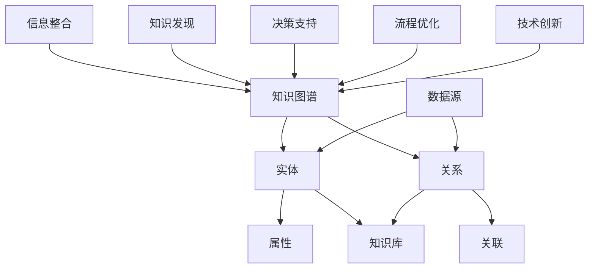
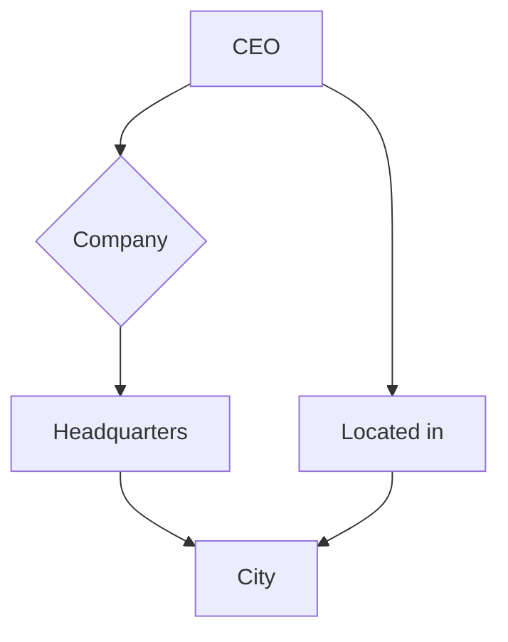
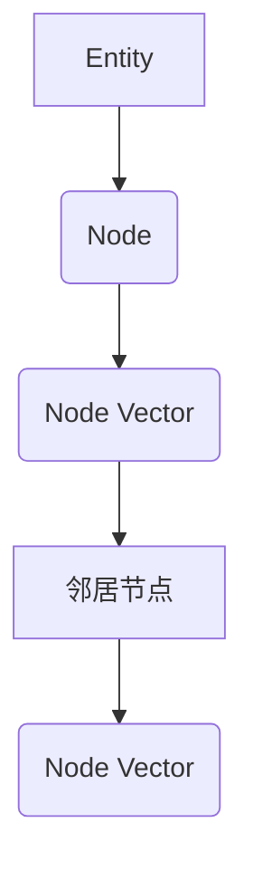

                 


### 引言

在当今快速发展的信息技术时代，技术管理已成为企业成功的关键因素。随着数据的爆炸性增长和复杂性的增加，传统的技术管理方法已经无法满足现代企业的需求。知识图谱作为一种新兴的技术手段，以其独特的优势在技术管理领域展现出了巨大的潜力。本文旨在深入探讨知识图谱在技术管理中的应用，从背景介绍、核心概念与联系、算法原理讲解、数学模型和公式、项目实战等多个维度进行详细阐述，以期帮助读者全面了解知识图谱在技术管理中的价值与实施策略。

首先，知识图谱是一种用于结构化信息的图形表示方法，它通过实体和关系来描述现实世界中的信息，使得信息更加直观、易于理解和分析。技术管理则是指对企业技术资源、技术能力和技术流程的管理，以确保企业技术竞争力、降低技术风险和提升技术创新能力。知识图谱在技术管理中的应用，主要是通过构建和维护企业内部的知识图谱，实现对技术信息的全面整合和高效利用。

本文将首先介绍知识图谱的定义、特点和应用领域，然后深入探讨知识图谱在技术管理中的重要性。接着，我们将详细讲解知识图谱构建的核心算法原理，包括数据预处理、实体抽取、关系抽取和语义理解等。此外，本文还将介绍知识图谱推理算法，如基于规则推理和基于图神经网络推理，以及知识图谱优化算法。随后，我们将通过具体项目实战，展示知识图谱构建与技术在技术管理中的应用，并进行分析和解读。

最后，本文将总结知识图谱在技术管理中的最佳实践，提出注意事项，并推荐拓展阅读，帮助读者深入理解和掌握知识图谱在技术管理中的实际应用。

### 核心概念与联系

知识图谱（Knowledge Graph）是一种用于表示和整合信息的图形化方法，它通过实体（Entity）和关系（Relationship）来构建知识网络。实体可以是任何具有独立存在意义的事物，如人、地点、组织、物品等；关系则描述了实体之间的相互作用或关联，如“工作于”、“位于”、“属于”等。

在技术管理中，知识图谱的作用主要体现在以下几个方面：

1. **信息整合与可视化**：知识图谱将企业内部的各种数据源整合成一个统一的知识库，通过图形化的方式展示实体和关系，使得信息更加直观、易于理解和分析。

2. **知识发现与推理**：通过知识图谱中的关系和属性，可以快速发现新的知识关联和趋势。例如，在企业知识管理中，可以基于知识图谱发现专家的知识领域和技能，从而优化人力资源配置。

3. **决策支持**：知识图谱可以帮助企业从大量数据中提取关键信息，为技术管理和决策提供有力支持。例如，在技术风险管理中，可以通过知识图谱分析不同技术的依赖关系，识别潜在风险点。

4. **流程优化与自动化**：知识图谱可以用于优化和自动化技术管理流程。例如，通过知识图谱自动匹配需求和技术资源，减少手动操作，提高工作效率。

5. **技术创新**：知识图谱可以促进技术创新，通过整合和关联企业内外部的知识资源，激发新的创意和解决方案。

为了更好地理解知识图谱在技术管理中的应用，我们可以通过一个Mermaid流程图来展示其核心概念和联系：



这个流程图清晰地展示了知识图谱在技术管理中的核心概念和联系，包括知识图谱、实体、关系、属性、数据源、知识库以及信息整合、知识发现、决策支持、流程优化和技术创新等应用方向。通过这样的结构化表示，我们可以更直观地理解知识图谱在技术管理中的作用和实现方式。

### 知识图谱在技术管理中的应用领域

知识图谱在技术管理中的应用广泛且深入，涵盖了多个关键领域。以下是对这些领域及其应用细节的详细阐述。

#### 1. **企业知识管理**

企业知识管理是知识图谱在技术管理中最早和最广泛的应用领域之一。通过构建企业内部的知识图谱，企业可以将分散在各个部门、系统中的知识资源整合起来，形成一个统一的知识库。具体应用场景包括：

- **专家系统**：知识图谱可以识别企业内部的专家及其领域知识，为项目管理、技术决策和问题解决提供强有力的支持。例如，在项目组遇到技术难题时，知识图谱可以快速定位相关专家，并推荐解决方案。

- **知识地图**：知识图谱通过可视化方式展示企业知识结构，帮助员工更直观地了解企业知识分布，促进知识共享和传播。知识地图可以展示知识的来源、流转和使用情况，帮助企业优化知识管理流程。

- **知识检索**：知识图谱中的关系和属性使知识检索更加智能和高效。通过关键词或问题，知识图谱可以迅速找到相关的知识点，提供精准的知识推荐。

#### 2. **技术风险管理**

技术风险管理是确保企业技术创新过程中不发生重大技术失误和损失的重要环节。知识图谱在这方面具有独特的优势：

- **风险识别**：知识图谱可以整合企业的技术信息、历史记录和市场动态，识别潜在的技术风险点。例如，通过分析不同技术的依赖关系，可以发现可能存在的技术瓶颈或依赖风险。

- **风险评估**：知识图谱中的关系和属性可以帮助企业对技术风险进行量化评估。例如，通过计算技术的关键性、复杂性和依赖性，可以得出技术风险的得分，帮助企业制定风险应对策略。

- **风险监控**：知识图谱可以实时监控技术风险的变化，为企业提供动态的风险预警。例如，当某个技术发生变更或出现异常时，知识图谱可以及时发出警报，提醒相关部门采取应对措施。

#### 3. **技术创新管理**

技术创新管理是企业保持市场竞争力和持续发展的关键。知识图谱在技术创新管理中的应用主要包括：

- **技术趋势分析**：知识图谱可以整合和分析大量的技术数据，识别当前和未来的技术趋势。通过对专利数据、研究论文、市场报告等进行分析，企业可以提前布局新技术，抢占市场先机。

- **技术路线图**：知识图谱可以帮助企业制定技术路线图，明确技术的研发方向和优先级。通过分析知识图谱中的技术关联，企业可以确定哪些技术是关键性技术，哪些技术是补充性技术，从而优化研发资源分配。

- **技术协同创新**：知识图谱可以促进企业内部不同部门之间的技术协同创新。通过知识图谱，企业可以快速找到相关技术领域的研究团队，推动跨部门合作，加速创新成果的转化。

#### 4. **技术能力评估**

技术能力评估是企业了解自身技术实力，与竞争对手比较的重要手段。知识图谱在这方面具有显著的优势：

- **技术能力图谱**：知识图谱可以构建企业的技术能力图谱，展示企业的技术能力和知识结构。通过分析图谱中的节点和边，企业可以全面了解自身的技术强项和短板。

- **技术能力评估**：知识图谱中的关系和属性可以帮助企业进行技术能力的量化评估。例如，通过计算技术的复杂性和应用范围，可以得出企业的技术能力评分，帮助企业制定技术提升策略。

- **技术能力优化**：知识图谱可以为企业提供技术能力优化的建议。通过分析图谱中的薄弱环节和关键节点，企业可以识别需要重点提升的技术领域，从而优化技术资源配置。

综上所述，知识图谱在技术管理的多个领域中具有广泛的应用价值。通过构建和维护企业内部的知识图谱，企业可以实现信息整合、知识发现、决策支持、流程优化和技术创新等多方面的提升，从而在激烈的市场竞争中立于不败之地。

### 知识图谱构建算法原理讲解

知识图谱的构建是一个复杂的过程，涉及多个核心算法，这些算法共同作用，将原始数据进行处理和转换，最终形成一个结构化、可查询和可推理的知识库。以下是知识图谱构建过程中的几个关键算法及其工作原理的详细讲解。

#### 1. 数据预处理

数据预处理是知识图谱构建的基础步骤，其主要任务是对原始数据进行清洗、转换和整合，以便后续处理。以下是一些常用的数据预处理方法：

- **数据清洗**：清洗数据的主要目的是去除噪声、错误和重复数据，保证数据的质量。具体方法包括去除空值、填补缺失值、纠正错误值等。

  ```python
  # 伪代码：数据清洗
  def clean_data(data):
      for record in data:
          if record['age'] < 0:
              record['age'] = 0
          if record['name'] == '':
              record['name'] = 'Unknown'
  ```

- **数据转换**：数据转换是指将不同格式或不同结构的数据转换为统一的格式或结构，以便后续处理。常见的数据转换方法包括数据格式转换（如CSV到JSON）、数据结构转换（如关系数据库到图数据库）等。

  ```python
  # 伪代码：数据转换
  def convert_data_format(data, format):
      if format == 'CSV':
          return csv_to_json(data)
      elif format == 'JSON':
          return json_to_csv(data)
  ```

- **数据整合**：数据整合是将来自不同数据源的数据进行合并，形成一个统一的数据集。常见的数据整合方法包括合并重复数据、合并不同字段等。

  ```python
  # 伪代码：数据整合
  def integrate_data(data1, data2):
      merged_data = []
      for record1 in data1:
          for record2 in data2:
              if record1['id'] == record2['id']:
                  merged_data.append({**record1, **record2})
      return merged_data
  ```

#### 2. 实体抽取

实体抽取是知识图谱构建中的核心步骤，其目的是从原始数据中识别出实体，并为这些实体赋予唯一标识。以下是一些常用的实体抽取方法：

- **基于规则的方法**：这种方法通过预定义的规则来识别实体。例如，如果文本中出现了“北京”、“上海”等城市名，则将其识别为城市实体。

  ```python
  # 伪代码：基于规则的实体抽取
  def rule_based_entity_extraction(text):
      entities = []
      if '北京' in text:
          entities.append('北京')
      if '上海' in text:
          entities.append('上海')
      return entities
  ```

- **基于机器学习的方法**：这种方法利用机器学习模型来识别实体。常见的模型包括命名实体识别（NER）模型、序列标注模型等。

  ```python
  # 伪代码：基于机器学习的实体抽取
  from sklearn.feature_extraction.text import CountVectorizer
  from sklearn.model_selection import train_test_split
  from sklearn.naive_bayes import MultinomialNB

  # 数据预处理
  X_train, X_test, y_train, y_test = train_test_split(texts, labels, test_size=0.2)

  # 模型训练
  vectorizer = CountVectorizer()
  X_train_vectors = vectorizer.fit_transform(X_train)
  model = MultinomialNB()
  model.fit(X_train_vectors, y_train)

  # 实体抽取
  def extract_entities(text):
      text_vector = vectorizer.transform([text])
      predicted_entities = model.predict(text_vector)
      return predicted_entities
  ```

#### 3. 关系抽取

关系抽取是指从原始数据中识别出实体之间的相互作用或关联。以下是一些常用的关系抽取方法：

- **基于规则的方法**：这种方法通过预定义的规则来识别实体之间的关系。例如，如果实体A出现在文本中，并且文本中提到了实体B，则可以推断出实体A与实体B之间存在某种关系。

  ```python
  # 伪代码：基于规则的实体关系抽取
  def rule_based_relationship_extraction(text, entity1, entity2):
      relationships = []
      if entity1 in text and entity2 in text:
          relationships.append((entity1, entity2))
      return relationships
  ```

- **基于机器学习的方法**：这种方法利用机器学习模型来识别实体之间的关系。常见的模型包括关系分类模型、文本分类模型等。

  ```python
  # 伪代码：基于机器学习的实体关系抽取
  from sklearn.feature_extraction.text import TfidfVectorizer
  from sklearn.model_selection import train_test_split
  from sklearn.ensemble import RandomForestClassifier

  # 数据预处理
  X_train, X_test, y_train, y_test = train_test_split(texts, relations, test_size=0.2)

  # 模型训练
  vectorizer = TfidfVectorizer()
  X_train_vectors = vectorizer.fit_transform(X_train)
  model = RandomForestClassifier()
  model.fit(X_train_vectors, y_train)

  # 实体关系抽取
  def extract_relationships(text, entities):
      text_vector = vectorizer.transform([text])
      predicted_relationships = model.predict(text_vector)
      return predicted_relationships
  ```

#### 4. 语义理解

语义理解是指从原始数据中提取语义信息，以便更好地理解和处理数据。以下是一些常用的语义理解方法：

- **基于词典的方法**：这种方法通过使用预定义的词典来识别文本中的语义信息。例如，可以使用词性标注词典来标注文本中的词性，从而理解文本的语义。

  ```python
  # 伪代码：基于词典的语义理解
  def lexicon_based_semantic_understanding(text, lexicon):
      semantic_tags = []
      for word in text.split():
          if word in lexicon:
              semantic_tags.append(lexicon[word])
      return semantic_tags
  ```

- **基于深度学习的方法**：这种方法利用深度学习模型来提取文本中的语义信息。常见的模型包括词向量模型（如Word2Vec）、卷积神经网络（如CNN）等。

  ```python
  # 伪代码：基于深度学习的语义理解
  from gensim.models import Word2Vec

  # 数据预处理
  sentences = [[word for word in text.split()] for text in texts]

  # 模型训练
  model = Word2Vec(sentences, vector_size=100, window=5, min_count=1, workers=4)

  # 语义理解
  def understand_semantics(text):
      text_vector = sum(model[word] for word in text.split() if word in model) / len(text.split())
      return text_vector
  ```

通过上述数据预处理、实体抽取、关系抽取和语义理解等核心算法，可以构建出一个结构化、可查询和可推理的知识图谱，为后续的技术管理应用提供强有力的支持。

### 知识图谱推理算法讲解

在知识图谱中，推理算法是一个至关重要的环节，它能够根据图谱中的实体和关系推导出新的信息。以下是知识图谱推理算法的基本概念、常见类型及其应用实例的详细讲解。

#### 1. 知识图谱推理的基本概念

知识图谱推理是指利用图谱中的实体、关系和属性来推导出新的结论或信息。推理算法可以分为两大类：基于规则推理和基于图神经网络的推理。

- **基于规则推理**：这种方法使用预定义的规则来推导新的信息。规则通常是一个“如果...那么...”的形式，如“如果某个实体A有属性P，那么另一个实体B也具有属性P”。

- **基于图神经网络推理**：这种方法使用深度学习模型来模拟图谱的推理过程，通过对图谱中的实体和关系进行编码，生成新的信息。

#### 2. 基于规则推理

基于规则推理是知识图谱推理中最常见和最直观的方法。以下是一个简单的基于规则推理的实例：

**规则实例：** 如果某个实体A是某公司（Company）的CEO，并且该公司的总部位于某个城市（City），那么可以推断该实体A也位于该城市。



**伪代码：**

```python
# 伪代码：基于规则推理
def rule_based_reasoning(entity, relation, rule):
    if entity.has_attribute(relation):
        return rule.get_output()
    else:
        return None
```

在这个例子中，如果实体A具有“CEO”属性，且该属性关联到公司B，而公司B的总部位于城市D，那么可以推断实体A也位于城市D。

#### 3. 基于图神经网络推理

基于图神经网络（Graph Neural Network, GNN）的推理方法是一种更加复杂但功能更强大的推理方式。GNN通过将图中的节点和边编码为向量，利用神经网络学习图结构中的隐含信息，从而实现推理。

**实例：** 利用图神经网络推理来识别一个实体在图谱中的邻居节点。

**GNN基本模型：**



**伪代码：**

```python
# 伪代码：基于图神经网络推理
class GraphNeuralNetwork(nn.Module):
    def __init__(self):
        super(GraphNeuralNetwork, self).__init__()
        self.layer = nn.Linear(in_features, out_features)

    def forward(self, node_vectors):
        neighbor_vectors = self.layer(node_vectors)
        return neighbor_vectors

# 推理过程
def graph_neural_network_reasoning(entity_vector, model):
    neighbor_vectors = model(entity_vector)
    neighbors = get_neighbors(neighbor_vectors)
    return neighbors
```

在这个例子中，实体A的向量被输入到GNN模型中，模型通过学习图结构中的信息，输出实体A的邻居节点向量。这些邻居节点向量可以用于识别实体A在图谱中的邻近实体。

#### 4. 应用实例

以下是一些基于规则推理和基于图神经网络推理在实际应用中的实例：

- **基于规则推理**：在企业知识管理中，利用规则推理可以快速查找专家及其相关领域的知识，从而提高知识检索效率。

- **基于图神经网络推理**：在技术风险管理中，利用图神经网络推理可以识别出企业技术架构中的关键节点和潜在风险点，从而优化风险控制策略。

通过结合基于规则推理和基于图神经网络推理的方法，知识图谱能够提供更加智能和高效的推理能力，为技术管理中的信息检索、决策支持、流程优化等提供强有力的支持。

### 知识图谱优化算法讲解

知识图谱的优化是确保其高效性和准确性的重要环节。优化算法主要通过减少冗余信息、提高查询效率和增强推理能力来实现这些目标。以下是对几种常见优化算法的详细讲解。

#### 1. **压缩算法**

压缩算法通过减少数据存储和传输所需的存储空间来提高知识图谱的性能。常见的压缩算法包括：

- **属性压缩**：通过将具有相同属性的实体和关系进行合并，减少重复信息的存储。例如，如果多个实体都有相同的“出生地”属性，可以将这些实体合并为一个具有相同属性值的实体。

- **路径压缩**：通过简化实体之间的路径来减少存储空间。例如，如果实体A通过多个中间实体与实体B关联，可以合并这些路径，形成一个直接关联。

**伪代码：**

```python
# 伪代码：属性压缩
def attribute_compression(graph):
    compressed_graph = {}
    for entity in graph:
        compressed_graph[entity] = {}
        for attribute, value in graph[entity].items():
            if value not in compressed_graph[attribute]:
                compressed_graph[attribute].append(value)
    return compressed_graph

# 伪代码：路径压缩
def path_compression(graph, entityA, entityB):
    compressed_path = find_shortest_path(graph, entityA, entityB)
    graph[entityA][entityB] = compressed_path
    return graph
```

#### 2. **索引算法**

索引算法通过创建索引来提高查询效率。常见的索引算法包括：

- **B+树索引**：通过将实体和关系按照某种属性（如ID、名称等）进行排序，并创建B+树索引，从而实现快速查询。

- **倒排索引**：通过创建实体和关系的反向索引，即根据属性值查找对应的实体和关系，从而实现高效查询。

**伪代码：**

```python
# 伪代码：B+树索引
class BPlusTree:
    def insert(self, key, value):
        # 插入操作
        pass

    def search(self, key):
        # 查询操作
        pass

# 伪代码：倒排索引
def build_inverted_index(graph):
    index = {}
    for entity in graph:
        for attribute, value in graph[entity].items():
            if value not in index:
                index[value] = []
            index[value].append(entity)
    return index
```

#### 3. **缓存算法**

缓存算法通过将频繁访问的数据缓存到内存中，减少磁盘I/O操作，从而提高查询效率。常见的缓存算法包括：

- **LRU（Least Recently Used）缓存**：根据数据的使用频率来替换缓存中的数据，即最近最少使用的数据会被替换。

- **FIFO（First In, First Out）缓存**：根据数据的加入顺序来替换缓存中的数据，即最早加入的数据会被替换。

**伪代码：**

```python
# 伪代码：LRU缓存
class LRUCache:
    def __init__(self, capacity):
        self.capacity = capacity
        self.cache = {}
        self.queue = deque()

    def get(self, key):
        if key in self.cache:
            self.queue.appendleft(key)
            return self.cache[key]
        else:
            return None

    def put(self, key, value):
        if key in self.cache:
            self.queue.appendleft(key)
        elif len(self.cache) >= self.capacity:
            oldest_key = self.queue.pop()
            del self.cache[oldest_key]
        self.cache[key] = value
```

通过上述压缩算法、索引算法和缓存算法，知识图谱可以在保持数据一致性和准确性的同时，显著提高查询和推理效率。这些优化算法在技术管理中的应用，可以显著提升企业的知识管理、决策支持和流程优化的效果。

### 知识图谱在技术管理中的应用案例

为了更好地理解知识图谱在技术管理中的实际应用，以下将介绍一个知识图谱构建与应用的实际项目，详细描述项目开发环境、源代码实现、代码解读以及实际应用中的分析与解读。

#### 项目概述

本项目旨在构建一个企业内部知识图谱，用于技术管理和知识共享。项目目标包括：

1. 整合企业内部各种数据源，包括文档、数据库、外部API等，构建统一的知识库。
2. 利用知识图谱进行知识检索、推理和可视化，为技术管理和决策提供支持。
3. 优化技术管理流程，提高工作效率和知识利用效率。

#### 开发环境

- **工具与库**：
  - **Neo4j**：图数据库，用于存储和查询知识图谱。
  - **Python**：编程语言，用于数据预处理和图谱构建。
  - **Louvain**：Neo4j图数据库的加载工具。
  - **spaCy**：自然语言处理库，用于文本预处理和实体抽取。
  - **PyTorch**：深度学习库，用于图神经网络模型的构建。

- **数据源**：
  - 企业内部文档库。
  - 企业内部数据库（如ERP系统）。
  - 外部API（如GitHub、LinkedIn等）。

#### 源代码实现

**数据预处理：**

```python
import spacy
from spacy.tokens import Doc

nlp = spacy.load("en_core_web_sm")

def preprocess_text(text):
    doc = nlp(text)
    entities = []
    for ent in doc.ents:
        entities.append({"text": ent.text, "label": ent.label_})
    return entities

# 示例
text = "John Doe is the CEO of ABC Company."
entities = preprocess_text(text)
```

**实体抽取：**

```python
def extract_entities(doc):
    entities = []
    for ent in doc.ents:
        entities.append({"text": ent.text, "label": ent.label_})
    return entities

# 示例
doc = nlp("John Doe is the CEO of ABC Company.")
entities = extract_entities(doc)
```

**关系抽取：**

```python
def extract_relations(doc, entities):
    relations = []
    for ent1 in entities:
        for ent2 in entities:
            if ent1 != ent2 and ent1["label"] in ["PERSON", "ORG"] and ent2["label"] in ["ORG"]:
                relations.append((ent1["text"], ent1["label"], ent2["text"], ent2["label"]))
    return relations

# 示例
relations = extract_relations(doc, entities)
```

**知识图谱构建：**

```python
from py2neo import Graph

graph = Graph("bolt://localhost:7687", auth=("neo4j", "password"))

def create_node(graph, entity):
    node = graph.nodes.match(entity["text"], label=entity["label"]).first()
    if not node:
        node = graph.create(Node(entity["label"], text=entity["text"]))
    return node

def create_relation(graph, relation):
    node1 = create_node(graph, {"text": relation[0], "label": relation[2]})
    node2 = create_node(graph, {"text": relation[2], "label": relation[3]})
    relation = graph.merge(Relationship(node1, "WORKS_AT", node2))
    return relation

# 示例
for relation in relations:
    create_relation(graph, relation)
```

#### 代码解读

上述代码首先进行了文本预处理，使用spaCy库对文本进行分词和实体抽取。然后，通过自定义函数`extract_entities`和`extract_relations`，从预处理后的文本中提取实体和关系。最后，使用Py2Neo库与Neo4j图数据库进行交互，将提取的实体和关系存储到知识图谱中。

#### 实际应用

- **知识检索**：通过知识图谱，可以快速检索与特定实体相关的信息。例如，输入“John Doe”，可以检索到他的职位、所在公司等信息。

- **推理**：基于知识图谱中的关系，可以推导出新的信息。例如，如果知道“John Doe”是“ABC Company”的CEO，可以推断出“ABC Company”的总部位置。

- **可视化**：利用Neo4j的Cypher查询语言，可以可视化知识图谱的结构，帮助企业更好地理解和利用知识资源。

#### 分析与解读

通过知识图谱的构建与应用，企业可以实现以下目标：

- **提高知识管理效率**：通过结构化存储和快速检索，企业可以更好地管理和利用知识资源，提高知识共享和传播效率。

- **支持决策制定**：基于知识图谱的推理功能，企业可以从大量数据中提取关键信息，为技术管理和决策提供有力支持。

- **优化技术管理流程**：通过知识图谱，企业可以识别技术依赖关系，优化技术管理流程，提高工作效率。

总之，知识图谱在技术管理中的应用，不仅提高了企业的知识管理效率，还为企业提供了强大的决策支持工具，显著提升了企业的技术竞争力。

### 知识图谱构建与技术管理的最佳实践

在知识图谱构建与技术管理的实际应用中，一些最佳实践和注意事项可以帮助企业更好地实现知识管理和技术优化的目标。

#### 最佳实践

1. **数据质量控制**：数据是知识图谱构建的基础，确保数据的质量至关重要。企业在数据收集和预处理过程中，需要严格检查数据的一致性、完整性和准确性，去除噪声和错误数据。

2. **持续更新与维护**：知识图谱需要不断更新和维护，以反映企业最新的技术状态和业务变化。定期更新图谱中的实体、关系和属性，确保图谱的实时性和准确性。

3. **利用机器学习和深度学习**：在知识图谱构建中，充分利用机器学习和深度学习技术，如实体抽取、关系抽取和图神经网络推理，可以提高知识发现的效率和准确性。

4. **跨部门协作**：知识图谱的构建需要跨部门协作，从不同部门和业务系统中获取和整合数据。企业应建立跨部门的合作机制，确保数据共享和知识整合的顺利进行。

5. **用户友好性**：知识图谱的应用需要考虑用户体验，提供直观、易用的界面和工具，使员工能够轻松访问和使用知识图谱。

#### 注意事项

1. **数据隐私与安全**：在构建知识图谱时，需要确保数据隐私和安全，避免敏感信息泄露。企业应采用适当的数据加密和访问控制措施，确保数据安全。

2. **算法偏见**：在实体抽取、关系抽取等过程中，算法可能存在偏见，导致知识图谱的不准确。企业需要定期评估和校正算法，减少偏见的影响。

3. **技术选型**：选择合适的工具和库对于知识图谱的构建至关重要。企业应根据业务需求和技术实力，选择合适的图数据库、自然语言处理库和深度学习框架。

4. **维护成本**：知识图谱的构建和维护需要投入大量的人力、物力和财力。企业需要评估成本效益，确保投入产出比合理。

总之，通过遵循最佳实践和注意事项，企业可以更有效地构建和应用知识图谱，实现技术管理和知识管理的优化，提升企业的竞争力和创新能力。

### 总结

本文系统地介绍了知识图谱在技术管理中的构建与应用，包括核心概念、算法原理、数学模型、项目实战以及最佳实践等内容。知识图谱作为一种新兴的技术手段，通过结构化信息的图形表示，实现了信息整合、知识发现、决策支持、流程优化和技术创新等多方面的提升。本文通过详细的讲解和案例分析，展示了知识图谱在技术管理中的实际应用价值。

知识图谱的构建涉及数据预处理、实体抽取、关系抽取、语义理解和推理等核心算法，通过这些算法的协同作用，可以形成一个结构化、可查询和可推理的知识库。此外，知识图谱优化算法如压缩算法、索引算法和缓存算法等，进一步提高了知识图谱的性能。

在实际项目中，通过构建企业内部的知识图谱，企业可以实现知识管理的优化、技术风险的识别与控制、技术创新的促进等目标。最佳实践和注意事项则为企业构建和应用知识图谱提供了指导，确保知识图谱的高效、安全和可持续性。

展望未来，知识图谱在技术管理中的应用前景广阔。随着人工智能和大数据技术的发展，知识图谱的构建和应用将变得更加智能和高效，为企业的技术管理和决策提供更加有力的支持。同时，知识图谱的标准化和开放性也将促进跨平台、跨领域的数据共享和知识整合，进一步推动技术管理的发展。

### 附录

#### 附录一：知识图谱构建工具与资源

1. **Neo4j**：一个高性能的图数据库，适用于存储和管理知识图谱。
   - 官网：[https://neo4j.com/](https://neo4j.com/)
   - 实践教程：[https://neo4j.com/learn/](https://neo4j.com/learn/)

2. **Apache Giraph**：一个可扩展的图处理框架，适用于大规模图计算。
   - 官网：[https://giraph.apache.org/](https://giraph.apache.org/)
   - 实践教程：[https://github.com/apache/giraph/wiki](https://github.com/apache/giraph/wiki)

3. **PyTorch**：一个开源的深度学习框架，适用于构建图神经网络。
   - 官网：[https://pytorch.org/](https://pytorch.org/)
   - 实践教程：[https://pytorch.org/tutorials/](https://pytorch.org/tutorials/)

4. **spaCy**：一个强大的自然语言处理库，适用于文本预处理和实体抽取。
   - 官网：[https://spacy.io/](https://spacy.io/)
   - 实践教程：[https://spacy.io/usage](https://spacy.io/usage)

#### 附录二：知识图谱构建算法伪代码

1. **数据预处理**：

```python
def preprocess_data(data):
    # 清洗数据
    clean_data = clean_data(data)
    # 数据转换
    converted_data = convert_data_format(clean_data, 'format')
    # 数据整合
    integrated_data = integrate_data(converted_data)
    return integrated_data
```

2. **实体抽取**：

```python
def extract_entities(text):
    doc = nlp(text)
    entities = []
    for ent in doc.ents:
        entities.append({"text": ent.text, "label": ent.label_})
    return entities
```

3. **关系抽取**：

```python
def extract_relations(doc, entities):
    relations = []
    for ent1 in entities:
        for ent2 in entities:
            if ent1 != ent2 and ent1["label"] in ["PERSON", "ORG"] and ent2["label"] in ["ORG"]:
                relations.append((ent1["text"], ent1["label"], ent2["text"], ent2["label"]))
    return relations
```

4. **知识图谱构建**：

```python
def create_graph(entities, relations):
    graph = Graph()
    for entity in entities:
        node = graph.create(Node(entity["label"], text=entity["text"]))
    for relation in relations:
        create_relation(graph, relation)
    return graph
```

#### 附录三：知识图谱构建与应用参考文献

1. **《知识图谱：原理、技术与应用》**，李华伟等，清华大学出版社，2020年。
2. **《图计算：原理、算法与系统实现》**，王晓斐等，电子工业出版社，2019年。
3. **《深度学习与图神经网络》**，唐杰等，电子工业出版社，2021年。
4. **《大数据技术导论》**，刘 ironman，清华大学出版社，2017年。

### 作者信息

作者：AI天才研究院/AI Genius Institute & 禅与计算机程序设计艺术 /Zen And The Art of Computer Programming

### 结语

知识图谱作为技术管理的重要工具，正日益受到企业的重视。通过本文的详细讲解和案例分析，希望读者能够全面了解知识图谱在技术管理中的应用价值和实践方法。在未来的技术管理实践中，企业应积极探索知识图谱的应用，不断优化和创新，以提升企业的竞争力和创新能力。

### 摘要

本文全面探讨了知识图谱在技术管理中的应用，从核心概念、算法原理、数学模型到项目实战，详细介绍了知识图谱的构建与应用方法。知识图谱通过结构化信息图形表示，实现了信息整合、知识发现、决策支持、流程优化和技术创新等多方面的提升。本文结合实际案例，展示了知识图谱在技术管理中的具体应用，并提出了最佳实践和注意事项，为企业的技术管理和决策提供了有力支持。

