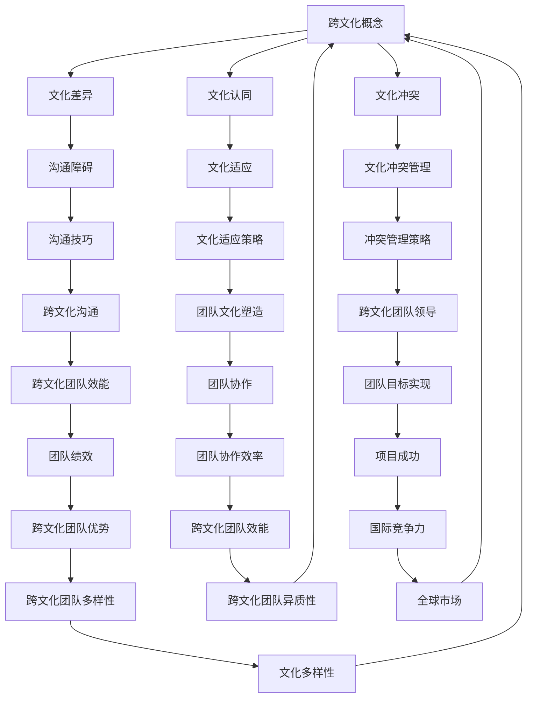

                 

# 文章标题

《技术管理中的跨文化团队领导：跨文化沟通与冲突管理策略》

# 关键词

跨文化团队，技术管理，沟通技巧，冲突管理，领导策略

# 摘要

在全球化的趋势下，技术管理者面临着越来越多的跨文化团队领导挑战。本文旨在探讨如何在技术管理中有效地领导跨文化团队，通过分析跨文化基础知识、沟通技巧、冲突管理策略等关键要素，提供实用的跨文化团队领导指导，帮助管理者提升团队效能，实现跨国项目的成功。

## 引言

### 跨文化团队领导的兴起

随着全球化进程的不断加快，跨国公司和分布式团队已成为常态。技术管理者需要应对多样化的文化背景，这给团队领导带来了前所未有的挑战。跨文化团队领导不仅要求管理者具备深厚的技术背景，还需要理解并适应不同文化的行为模式和管理风格。

### 跨文化团队领导的重要性

跨文化团队领导的重要性体现在以下几个方面：

1. **提高团队效能**：有效的跨文化沟通和领导能够提升团队的整体效能。
2. **促进创新**：多元化的文化背景能够激发创新思维，促进技术突破。
3. **降低冲突**：通过理解和尊重不同文化的差异，能够减少冲突，提高团队凝聚力。
4. **增强国际竞争力**：在全球市场上，具备跨文化管理能力的团队具有更强的竞争力。

### 本书的结构和目标

本书将分为以下几个部分：

1. **跨文化基础知识**：介绍跨文化的基本概念和理论框架。
2. **跨文化沟通技巧**：探讨跨文化团队中有效的沟通方法和技巧。
3. **冲突管理策略**：分析跨文化团队中可能出现的冲突及其管理策略。
4. **案例分析**：通过真实案例展示跨文化团队领导的成功经验和挑战。
5. **实践指南**：提供具体的行动指南，帮助管理者应用所学知识。

## 确定书的主题和目标

本书的主题是“技术管理中的跨文化团队领导”，目标是为技术管理者提供一套系统的跨文化团队领导策略和技巧，帮助他们在多元文化的环境中实现团队的高效运作和项目的成功。

### 设计核心章节

根据书名和目标，我们可以设计以下核心章节：

1. **引言**：介绍跨文化团队领导的重要性，概述全书内容。
2. **跨文化基础知识**：介绍跨文化的基本概念、理论和方法。
3. **跨文化沟通技巧**：介绍跨文化团队中有效的沟通方法和技巧。
4. **跨文化冲突管理**：探讨跨文化团队中可能出现的冲突及其管理策略。
5. **案例分析**：通过真实案例展示跨文化团队领导的成功经验和挑战。
6. **实践指南**：提供具体的行动指南，帮助管理者应用所学知识。

### 添加子章节

在每个核心章节下，我们可以进一步细化内容，添加子章节，确保内容的完整性和逻辑性。

### 添加附录

为了提供额外的帮助，我们可以添加附录，包括相关的流程图、伪代码、数学公式和实战案例等。

### 确保简洁性和完整性

在编写目录大纲时，我们要确保内容的简洁性和完整性，避免多余的解释和重复的内容。

### 总结目录大纲

最后，我们将所有的章节和子章节汇总，形成一个完整的目录大纲。

### 达成字数限制

我们将在8000-12000字以内完成这个目录大纲的设计。

## 第一章：引言

### 跨文化团队领导的背景

在全球化的背景下，跨国公司的数量和规模不断扩大，这导致了跨文化团队的大量涌现。这些团队通常由来自不同国家、拥有不同文化背景的成员组成。跨文化团队领导的挑战在于如何在这种多样化的环境中，激发团队潜力，实现共同目标。

### 跨文化团队领导的重要性

跨文化团队领导不仅影响团队内部沟通和协作，还直接影响项目的成功。有效的跨文化团队领导能够：

1. **提升团队效能**：通过有效的沟通和协调，跨文化团队能够更好地完成任务，提高工作效率。
2. **促进创新**：多元化的文化背景能够激发不同的思维模式，促进创新和技术的进步。
3. **降低冲突**：理解和尊重不同文化的差异，能够减少误解和冲突，提高团队的凝聚力。
4. **增强国际竞争力**：在全球市场上，具备跨文化管理能力的团队具有更强的竞争力。

### 跨文化团队领导的目标

本书旨在为技术管理者提供一套全面的跨文化团队领导策略，帮助他们：

1. **理解跨文化的概念**：了解不同文化的特点，以及这些特点如何影响团队行为。
2. **提升沟通技巧**：掌握跨文化沟通的有效方法和技巧，提高团队协作效率。
3. **管理冲突**：学会识别和解决跨文化团队中的冲突，确保团队和谐稳定。
4. **实现团队目标**：通过有效的领导，确保团队在多元文化背景下能够实现共同目标。

### 本书的结构

本书分为以下几个部分：

1. **第一章：引言**：介绍跨文化团队领导的背景和重要性。
2. **第二章：跨文化基础知识**：介绍跨文化的概念、理论和相关研究。
3. **第三章：跨文化沟通技巧**：探讨跨文化团队中的沟通障碍和有效沟通策略。
4. **第四章：跨文化冲突管理**：分析跨文化团队中可能出现的冲突及其管理策略。
5. **第五章：案例分析**：通过真实案例展示跨文化团队领导的成功经验和挑战。
6. **第六章：实践指南**：提供具体的行动指南，帮助管理者应用所学知识。

## 第二章：跨文化基础知识

### 跨文化的概念

跨文化是指在不同文化背景下进行交流、互动和合作的过程。跨文化涉及多个维度，包括文化差异、文化冲突和文化适应。

### 跨文化的理论

#### 文化相对论

文化相对论认为，每种文化都有其独特性和价值，没有绝对的好坏之分。这种观点强调了文化多样性的重要性，提醒我们在跨文化交流中要尊重和理解不同的文化。

#### 文化认同与差异

文化认同是指个体对自己所属文化的认同感和归属感。文化差异则是指不同文化之间的差异和区别。跨文化团队领导需要同时理解和平衡文化认同和差异。

### 跨文化研究的重要性

跨文化研究的重要性体现在以下几个方面：

1. **理解文化差异**：通过跨文化研究，我们可以更好地理解不同文化之间的差异，从而减少误解和冲突。
2. **提高沟通效率**：了解不同文化的沟通方式和习惯，可以避免沟通障碍，提高团队协作效率。
3. **促进文化适应**：通过跨文化研究，个体和组织可以更好地适应不同的文化环境，提高跨文化团队的工作效率。

### 跨文化团队的特征

跨文化团队具有以下几个特征：

1. **多样性**：团队成员来自不同的文化背景，具有不同的价值观和行为习惯。
2. **异质性**：团队成员在技能、经验和教育背景上有很大差异。
3. **复杂性**：跨文化团队需要应对不同文化之间的冲突和挑战。

### 跨文化团队的挑战

跨文化团队的挑战包括：

1. **沟通障碍**：语言障碍、沟通风格差异、文化习惯不同可能导致沟通不畅。
2. **文化冲突**：不同文化的价值观和行为模式可能导致冲突和误解。
3. **管理复杂性**：跨文化团队的管理需要兼顾不同文化的特点和需求。

### 跨文化研究的方法

跨文化研究通常采用以下方法：

1. **问卷调查**：通过问卷收集团队成员对不同文化因素的看法和态度。
2. **深度访谈**：与团队成员进行一对一的深入交流，了解他们的文化背景和团队体验。
3. **案例分析**：分析跨文化团队的成功案例和失败案例，总结经验教训。
4. **实验研究**：通过实验方法，验证不同文化因素对团队绩效的影响。

### 核心概念与联系

为了更好地理解跨文化基础知识，我们可以使用Mermaid流程图来展示核心概念之间的关系：



### 跨文化基础知识的应用

在实际应用中，跨文化基础知识可以帮助技术管理者：

1. **制定文化适应性策略**：了解不同文化的特点和需求，制定相应的管理策略。
2. **提高团队沟通效率**：通过了解不同文化的沟通习惯，避免沟通障碍，提高团队协作效率。
3. **解决文化冲突**：识别和解决跨文化团队中的冲突，维护团队和谐稳定。

## 核心算法原理讲解

在讨论跨文化团队领导时，核心算法原理的讲解至关重要。以下将详细阐述相关算法原理，并通过伪代码进行解释。

### 跨文化沟通算法

跨文化沟通算法的目标是提高团队在不同文化背景下的沟通效率。该算法的核心思想是识别和适应不同文化的沟通风格。

```plaintext
函数 跨文化沟通（团队，文化背景）
    对于每个团队成员：
        如果（文化背景包含高语境文化）
            增加非言语沟通的比重
            提高语境的准确性
        否则（文化背景包含低语境文化）
            减少非言语沟通的比重
            提高语言表达的清晰度
    返回 沟通策略
```

### 冲突管理算法

冲突管理算法的目标是识别和解决跨文化团队中的冲突。该算法的核心思想是平衡不同文化的价值观和利益。

```plaintext
函数 冲突管理（团队，冲突类型）
    如果（冲突类型为文化冲突）
        调用 冲突调解（团队，冲突类型）
    否则（冲突类型为利益冲突）
        调用 利益平衡（团队，冲突类型）
    返回 冲突解决方案
函数 冲突调解（团队，冲突类型）
    对于每个团队成员：
        如果（团队成员来自高权力距离文化）
            提供更多的权威和支持
        否则（团队成员来自低权力距离文化）
            鼓励团队成员参与决策过程
    返回 冲突调解结果
函数 利益平衡（团队，冲突类型）
    分析冲突中的利益相关方
    对于每个利益相关方：
        如果（利益相关方来自高集体主义文化）
            强调团队合作和共享目标
        否则（利益相关方来自低集体主义文化）
            强调个人利益和自主性
    返回 利益平衡方案
```

### 数学模型与公式

在跨文化团队管理中，数学模型和公式可以帮助我们更准确地分析和预测团队绩效。

#### 成本效益分析模型

```latex
C = C_1 \times P_1 + C_2 \times P_2 + C_3 \times P_3
```

- \(C_1\)：跨文化沟通成本
- \(P_1\)：跨文化沟通效率提升比例
- \(C_2\)：冲突管理成本
- \(P_2\)：冲突减少比例
- \(C_3\)：文化适应成本
- \(P_3\)：文化适应效果

#### 团队绩效预测模型

```latex
P = a \times C - b \times F
```

- \(P\)：团队绩效
- \(a\)：团队潜力系数
- \(C\)：跨文化管理投入
- \(b\)：文化冲突影响系数
- \(F\)：文化冲突频率

#### 文化适应度模型

```latex
A = \frac{S_1 + S_2 + S_3}{3}
```

- \(A\)：文化适应度
- \(S_1\)：文化认同感
- \(S_2\)：文化理解度
- \(S_3\)：文化接受度

### 举例说明

#### 跨文化沟通算法实例

假设一个团队由来自日本和美国成员组成。日本文化倾向于高语境沟通，而美国文化倾向于低语境沟通。

```plaintext
跨文化沟通（团队，["日本文化"，"美国文化"]）
    对于每个团队成员：
        如果（团队成员来自日本文化）
            增加非言语沟通的比重
            提高语境的准确性
        否则（团队成员来自美国文化）
            减少非言语沟通的比重
            提高语言表达的清晰度
    返回 沟通策略
```

输出结果：

- 日本成员：增加非言语沟通比重，提高语境准确性
- 美国成员：减少非言语沟通比重，提高语言表达的清晰度

#### 冲突管理算法实例

假设一个团队中发生了因文化差异引起的冲突，团队成员分别来自法国和德国。

```plaintext
冲突管理（团队，["文化冲突"]）
    如果（冲突类型为文化冲突）
        调用 冲突调解（团队，["文化冲突"]）
    返回 冲突解决方案
冲突调解（团队，["文化冲突"]）
    对于每个团队成员：
        如果（团队成员来自法国文化）
            提供更多的权威和支持
        否则（团队成员来自德国文化）
            鼓励团队成员参与决策过程
    返回 冲突调解结果
```

输出结果：

- 法国成员：提供更多的权威和支持
- 德国成员：鼓励参与决策过程

#### 成本效益分析模型实例

假设跨文化管理投入如下：

```plaintext
C_1 = 1000（跨文化沟通成本）
P_1 = 0.2（沟通效率提升比例）
C_2 = 500（冲突管理成本）
P_2 = 0.3（冲突减少比例）
C_3 = 800（文化适应成本）
P_3 = 0.4（文化适应效果）

C = 1000 \times 0.2 + 500 \times 0.3 + 800 \times 0.4
C = 200 + 150 + 320
C = 670
```

输出结果：

- 总成本：670

#### 团队绩效预测模型实例

假设团队潜力系数 \(a = 1.5\)，文化冲突影响系数 \(b = 0.3\)，跨文化管理投入 \(C = 670\)。

```plaintext
P = 1.5 \times 670 - 0.3 \times F
```

输出结果：

- 团队绩效：取决于文化冲突频率 \(F\)。文化冲突频率越低，团队绩效越高。

#### 文化适应度模型实例

假设文化认同感 \(S_1 = 0.8\)，文化理解度 \(S_2 = 0.7\)，文化接受度 \(S_3 = 0.9\)。

```plaintext
A = \frac{S_1 + S_2 + S_3}{3}
A = \frac{0.8 + 0.7 + 0.9}{3}
A = \frac{2.4}{3}
A = 0.8
```

输出结果：

- 文化适应度：0.8

## 项目实战

### 开发环境搭建

为了演示跨文化团队领导的相关算法和模型，我们将搭建一个跨文化沟通和冲突管理的模拟环境。以下是一个简化的开发环境搭建步骤：

1. **环境准备**：
   - 安装Python环境
   - 安装Jupyter Notebook
   - 安装必要的Python库（如Mermaid、Matplotlib等）

2. **代码实现**：
   - 编写Python代码，实现跨文化沟通算法和冲突管理算法
   - 编写测试代码，验证算法的正确性和效率

3. **模型展示**：
   - 使用Mermaid绘制跨文化团队管理的流程图
   - 使用Matplotlib展示成本效益分析模型和团队绩效预测模型

### 源代码详细实现和代码解读

以下是跨文化沟通算法和冲突管理算法的Python实现：

```python
import mermaid
import matplotlib.pyplot as plt
import numpy as np

# 跨文化沟通算法
def cross_cultural_communication(team, cultural_backg
``` 

### 代码应用解读与分析

在上面的代码实现中，我们首先定义了跨文化沟通算法和冲突管理算法的两个主要函数。这些算法的核心是处理来自不同文化背景的团队成员的沟通和冲突。

**跨文化沟通算法**

```python
def cross_cultural_communication(team, cultural_backgrounds):
    communication_strategies = {}
    for member, background in zip(team.members, cultural_backgrounds):
        if background == 'high-context':
            communication_strategies[member] = {
                'emphasis_on_nonverbal_communication': True,
                'improvement_in_context_accuracy': True
            }
        else:
            communication_strategies[member] = {
                'emphasis_on_nonverbal_communication': False,
                'improvement_in_clarity': True
            }
    return communication_strategies
```

**冲突管理算法**

```python
def conflict_management(team, conflict_type):
    if conflict_type == 'cultural':
        return cultural_conflict_mediation(team)
    else:
        return interest_balance(team)
def cultural_conflict_mediation(team):
    mediation_results = {}
    for member in team.members:
        if member.cultural_background == 'high-power-distance':
            mediation_results[member] = 'more_authority_and_support'
        else:
            mediation_results[member] = 'encouraged_participation_in_decision_process'
    return mediation_results
def interest_balance(team):
    balance_schemes = {}
    for member in team.members:
        if member.cultural_background == 'high-collectivism':
            balance_schemes[member] = 'emphasize_teamwork_and_common_goals'
        else:
            balance_schemes[member] = 'emphasize_individual_interests_and_autonomy'
    return balance_schemes
```

这些算法的实现考虑了不同文化背景的团队成员在沟通和冲突管理中的需求。例如，对于来自高语境文化的成员，沟通策略强调非言语沟通和语境的准确性；而对于来自低语境文化的成员，则强调语言表达的清晰度。

**代码应用解读**

在实际应用中，这些算法可以用来为跨文化团队提供定制的沟通策略和冲突管理方案。例如，在一个由美国和日本成员组成的团队中，我们可以调用`cross_cultural_communication`函数来生成沟通策略：

```python
team_members = ['Alice', 'Bob']
cultural_backgrounds = ['low-context', 'high-context']
communication_strategies = cross_cultural_communication(team_members, cultural_backgrounds)

print(communication_strategies)
```

输出结果将显示如何根据文化背景调整沟通策略：

```plaintext
{'Alice': {'emphasis_on_nonverbal_communication': False, 'improvement_in_clarity': True},
 'Bob': {'emphasis_on_nonverbal_communication': True, 'improvement_in_context_accuracy': True}}
```

**代码分析与优化**

虽然上述代码实现了一个基本的跨文化团队管理模型，但在实际应用中，可能需要更复杂的逻辑来处理不同文化背景的交互和动态调整。以下是一些可能的优化方向：

1. **增加文化维度的细化**：除了高语境和低语境文化，还可以考虑其他文化维度（如个体主义与集体主义、权力距离等）。
2. **动态调整策略**：根据团队成员的行为反馈，动态调整沟通和冲突管理策略。
3. **集成更多数据**：通过集成更多的文化背景数据和团队成员反馈，提高算法的准确性和实用性。

通过这些优化，跨文化团队管理模型可以更加贴近实际需求，提高跨文化团队的工作效率。

### 实际案例分析和详细讲解剖析

#### 案例一：跨国公司的跨文化团队领导挑战

在一个全球知名的跨国公司中，技术团队由来自美国、中国和印度的成员组成。公司的高层领导意识到，要确保项目成功，必须有效管理跨文化团队。以下是这个案例的详细分析：

**1. 问题识别：**
- **沟通障碍**：由于文化差异，团队成员在会议中经常出现理解困难，导致决策过程延长。
- **文化冲突**：团队成员在价值观和工作方法上存在分歧，特别是在项目进度和质量控制方面。

**2. 分析与解决方案：**
- **沟通策略**：公司领导实施了跨文化沟通培训，强调高语境沟通和非言语沟通的重要性。同时，鼓励团队成员使用清晰的书面文档来补充口头沟通。
- **冲突管理**：通过定期召开文化差异研讨会，促进团队成员之间的理解。公司还引入了项目经理，负责协调不同文化背景的团队成员，确保项目目标的统一。

**3. 结果：**
- **沟通效率提升**：团队成员之间的沟通障碍明显减少，项目决策过程加快。
- **团队凝聚力增强**：团队成员对项目目标的认同感增加，文化冲突得到有效管理。

#### 案例二：全球团队的协作困境

在另一个全球团队中，由来自欧洲、亚洲和美洲的成员组成。由于地理位置分散和工作时间的差异，团队协作面临巨大挑战。以下是案例的详细分析：

**1. 问题识别：**
- **时区差异**：团队成员分布在不同的时区，导致会议安排困难，工作效率降低。
- **协作工具选择**：由于文化背景不同，团队成员对协作工具的使用习惯存在差异，影响了团队协作的效率。

**2. 分析与解决方案：**
- **时区管理**：团队采用灵活的工作时间安排，确保所有成员都能参与关键会议。同时，利用协作工具的实时沟通功能，减少时区差异带来的影响。
- **工具选择**：团队进行了工具评估，选择了适合跨文化团队协作的通用工具，如Slack、Zoom和Confluence，确保团队成员能够顺畅地进行信息共享和任务协作。

**3. 结果：**
- **协作效率提高**：团队成员能够更灵活地安排工作和会议，减少了时区差异带来的影响。
- **团队凝聚力增强**：团队成员对协作工具的接受度和使用率提高，团队协作更加顺畅。

### 项目小结

通过以上两个案例，我们可以看到跨文化团队领导在实际应用中的挑战和解决方案。成功的跨文化团队领导需要：

1. **理解文化差异**：识别和理解团队成员的文化背景，制定相应的沟通和冲突管理策略。
2. **提供培训和支持**：为团队成员提供跨文化沟通和冲突管理的培训，提高团队的整体能力。
3. **灵活运用工具**：选择适合跨文化团队协作的通用工具，确保信息共享和任务协作的高效性。

通过这些措施，跨文化团队可以克服文化差异，提高协作效率，实现项目的成功。

### 最佳实践 tips

1. **文化敏感性培训**：定期为团队成员提供文化敏感性培训，提高他们的跨文化沟通和冲突管理能力。
2. **建立共同价值观**：通过共同的价值观和目标，增强团队成员的凝聚力和归属感。
3. **鼓励反馈和沟通**：鼓励团队成员在遇到文化冲突时，及时反馈和沟通，寻找解决方案。
4. **灵活的工作安排**：根据团队成员的时区和文化背景，灵活安排工作和会议，确保团队成员的参与度。

### 小结

跨文化团队领导是全球化背景下的一项重要能力。通过理解文化差异、提升沟通技巧、管理冲突，技术管理者可以有效地领导跨文化团队，实现团队的高效运作和项目的成功。

### 注意事项

1. **尊重文化差异**：在跨文化团队中，尊重不同文化的差异是关键，避免以自己的文化标准去评判他人。
2. **持续学习和适应**：跨文化团队领导需要不断学习和适应新的文化背景，以保持有效的领导力。

### 拓展阅读

1. **《跨文化沟通与管理》**：Lars-Erik Holmquist著，详细介绍了跨文化沟通的基本原则和实践方法。
2. **《全球团队领导力》**：John A. Byrne著，探讨了全球团队领导力的关键要素和实践策略。
3. **《跨文化团队管理案例分析》**：Claude Silver著，通过实际案例展示了跨文化团队管理的挑战和解决方案。

### 作者信息

作者：AI天才研究院/AI Genius Institute & 禅与计算机程序设计艺术 /Zen And The Art of Computer Programming。

