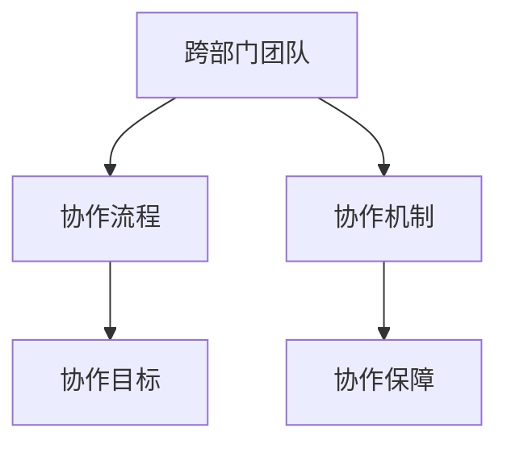
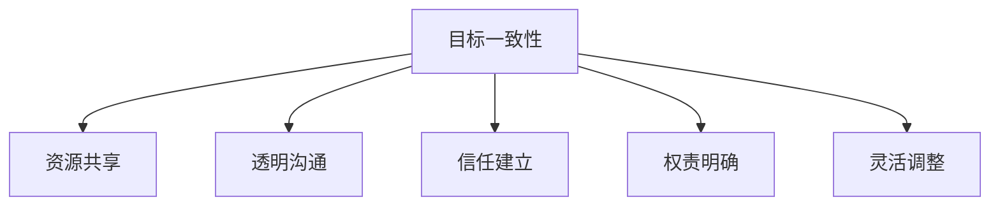
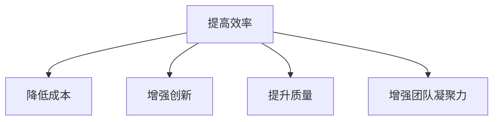

                 

### 第2章 跨部门协作的核心概念与原则

跨部门协作在提高组织效率和实现战略目标方面发挥着至关重要的作用。为了有效地进行跨部门协作，我们需要理解其核心概念和原则，并掌握相关理论和实践方法。

#### 2.1 跨部门协作的概念

跨部门协作是指组织内部不同部门之间为实现共同目标而进行的协同工作。跨部门协作不仅仅涉及不同部门的合作，还包括团队成员之间的知识共享、资源整合和共同决策。

##### 核心概念：

1. **跨部门团队**：由来自不同部门的专业人员组成的团队，共同完成特定任务或项目。
2. **协作流程**：实现跨部门协作的具体步骤和程序，包括任务分配、进度跟踪、成果验收等。
3. **协作机制**：确保跨部门协作顺利进行的管理制度和规范，如沟通机制、责任分配、绩效考核等。

##### 联系与关系架构：

- **跨部门团队**是跨部门协作的执行主体，协作流程是实现协作目标的途径，协作机制为协作提供保障和支持。



#### 2.2 跨部门协作的原则

为了确保跨部门协作的高效和顺畅，需要遵循以下原则：

1. **目标一致性**：跨部门协作的各个部门应明确共同的目标，确保协作方向一致。
2. **资源共享**：通过共享资源，提高资源利用率，降低成本。
3. **透明沟通**：建立有效的沟通机制，确保信息传递及时、准确、全面。
4. **信任建立**：通过信任建立，减少协作过程中的误解和冲突。
5. **权责明确**：明确各部门在协作中的职责和权限，避免责任模糊。
6. **灵活调整**：根据实际情况灵活调整协作策略，应对变化和挑战。

##### 原则之间的关系：

- **目标一致性**是跨部门协作的前提，资源共享、透明沟通、信任建立、权责明确和灵活调整是实现目标一致性的具体方法和保障。



#### 2.3 跨部门协作的目标

跨部门协作的目标主要包括：

1. **提高效率**：通过跨部门协作，优化工作流程，减少重复劳动，提高工作效率。
2. **降低成本**：通过资源共享和优化配置，降低项目成本。
3. **增强创新**：跨部门协作可以促进知识和技术的碰撞，激发创新思维。
4. **提升质量**：通过不同部门的专业知识和技能的融合，提高项目质量。
5. **增强团队凝聚力**：通过跨部门协作，加强团队间的交流和合作，提升团队凝聚力。

##### 目标之间的联系：

- **提高效率**和**降低成本**是跨部门协作的短期目标，**增强创新**和**提升质量**是跨部门协作的长期目标，而**增强团队凝聚力**是实现其他目标的保障。



通过明确跨部门协作的核心概念和原则，以及理解其目标之间的关系，我们可以为跨部门协作的实践提供理论基础和实践指导。在后续章节中，我们将进一步探讨跨部门协作的具体实施方法和技巧。### 2.1 跨部门协作的概念

跨部门协作是指组织内部不同部门之间为实现共同目标而进行的协同工作。跨部门协作不仅仅涉及不同部门的合作，还包括团队成员之间的知识共享、资源整合和共同决策。

##### 核心概念：

1. **跨部门团队**：由来自不同部门的专业人员组成的团队，共同完成特定任务或项目。
2. **协作流程**：实现跨部门协作的具体步骤和程序，包括任务分配、进度跟踪、成果验收等。
3. **协作机制**：确保跨部门协作顺利进行的管理制度和规范，如沟通机制、责任分配、绩效考核等。

#### 跨部门团队

跨部门团队是跨部门协作的核心主体，其组成通常包括以下角色：

- **项目经理**：负责项目的总体规划和协调，确保项目按计划推进。
- **部门代表**：代表各自部门参与项目，负责与部门内部沟通和协调。
- **技术专家**：负责项目的具体技术实施和问题解决。
- **业务分析师**：负责分析项目需求，确保项目符合业务目标。

##### 跨部门团队的作用：

- **整合资源**：跨部门团队可以将不同部门的资源（如人力、技术、资金等）进行整合，提高资源利用率。
- **促进知识共享**：团队成员来自不同的背景，可以带来不同的见解和经验，促进知识的交叉和融合。
- **提高项目成功率**：跨部门团队可以充分发挥不同部门的专业优势，提高项目质量和成功率。

#### 协作流程

协作流程是实现跨部门协作目标的关键，其通常包括以下几个步骤：

1. **项目启动**：明确项目目标、范围和预期成果，确定项目团队和责任分配。
2. **需求分析**：与业务部门沟通，了解具体需求，形成详细的需求文档。
3. **任务分配**：根据项目需求和团队人员的能力，将任务分配给相应的团队成员。
4. **进度跟踪**：定期检查项目进度，确保项目按计划进行。
5. **成果验收**：项目完成后，进行成果验收，确保项目达到预期目标。
6. **反馈与改进**：收集项目反馈，进行总结和改进，为后续项目提供经验。

##### 协作流程的作用：

- **确保项目按计划推进**：通过明确的协作流程，可以确保项目各个阶段都有序进行，减少延误和偏差。
- **提高协作效率**：协作流程可以帮助团队成员明确各自的责任和任务，提高工作效率。
- **确保项目质量**：通过协作流程的规范，可以确保项目各个阶段的输出都符合预期质量。

#### 协作机制

协作机制是确保跨部门协作顺利进行的制度保障，其包括以下几个方面的内容：

1. **沟通机制**：建立有效的沟通渠道和方式，确保信息传递及时、准确、全面。
2. **责任分配**：明确各部门和成员在协作中的职责和权限，确保责任清晰。
3. **绩效考核**：制定合理的绩效考核制度，激励团队成员积极参与协作。
4. **冲突解决**：建立冲突解决机制，及时处理协作过程中的矛盾和问题。

##### 协作机制的作用：

- **提高协作效率**：通过明确的协作机制，可以减少协作中的摩擦和冲突，提高协作效率。
- **确保协作质量**：协作机制可以为跨部门协作提供规范和指导，确保项目质量和成果的可靠性。
- **促进团队凝聚力**：通过协作机制，可以增强团队成员之间的信任和合作，提升团队凝聚力。

通过理解跨部门协作的核心概念，我们可以更好地把握协作的本质，为其有效实施提供理论基础和实践指导。在后续章节中，我们将进一步探讨跨部门协作中的沟通艺术、协作流程与机制、协作工具与技术等方面。### 2.2 跨部门协作的原则

为了确保跨部门协作的高效和顺畅，需要遵循以下原则：

1. **目标一致性**：跨部门协作的各个部门应明确共同的目标，确保协作方向一致。
2. **资源共享**：通过共享资源，提高资源利用率，降低成本。
3. **透明沟通**：建立有效的沟通机制，确保信息传递及时、准确、全面。
4. **信任建立**：通过信任建立，减少协作过程中的误解和冲突。
5. **权责明确**：明确各部门在协作中的职责和权限，避免责任模糊。
6. **灵活调整**：根据实际情况灵活调整协作策略，应对变化和挑战。

#### 目标一致性

目标一致性是跨部门协作的首要原则。只有当各个部门都明确共同的目标时，才能确保协作的方向一致，避免出现各自为政、资源浪费的情况。为了实现目标一致性，需要做到以下几点：

- **明确共同目标**：在项目启动阶段，需要明确项目的整体目标，并确保各部门都能理解和接受。
- **分解目标**：将整体目标分解为具体可执行的任务，确保每个部门都能在自己的职责范围内发挥作用。
- **定期沟通**：定期召开会议，确保各部门及时了解项目进展和目标达成情况，及时调整策略。

#### 资源共享

资源共享是提高资源利用率和降低成本的重要手段。在跨部门协作中，各部门应积极参与资源整合和共享，以实现资源的最优配置。具体原则包括：

- **资源透明**：建立资源信息共享平台，确保各部门都能了解资源的分配和使用情况。
- **资源优化**：通过跨部门协作，优化资源配置，减少重复投资和浪费。
- **协作激励**：制定合理的资源共享激励政策，鼓励各部门积极参与资源共享。

#### 透明沟通

透明沟通是确保跨部门协作顺畅的关键。只有通过及时、准确、全面的沟通，才能确保各个部门了解项目的进展和需求，避免误解和冲突。实现透明沟通的方法包括：

- **建立沟通渠道**：建立多层次的沟通渠道，包括定期会议、即时通讯工具、邮件等。
- **沟通内容明确**：在沟通中，明确表达信息的内容和目的，避免歧义和误解。
- **反馈机制**：建立反馈机制，确保各方都能及时了解和回应对方的意见和建议。

#### 信任建立

信任建立是跨部门协作的基础。只有在相互信任的基础上，各部门才能更好地合作，共同应对挑战。建立信任的方法包括：

- **尊重差异**：尊重各部门的文化和价值观，避免以自己的标准去评价他人。
- **互相支持**：在协作过程中，互相支持和帮助，共同解决问题。
- **公正处理**：在处理协作过程中的问题和冲突时，要公正无私，确保各方都能接受。

#### 权责明确

权责明确是确保跨部门协作顺利进行的重要原则。只有明确各部门和成员的职责和权限，才能避免责任模糊和推诿。实现权责明确的方法包括：

- **明确职责**：在项目启动时，明确各个部门和成员的职责，确保职责清晰。
- **分工合作**：根据职责分工，确保各部门和成员在自己的职责范围内发挥作用。
- **绩效考核**：建立绩效考核制度，根据职责和贡献进行评价和激励。

#### 灵活调整

灵活调整是应对变化和挑战的有效策略。在跨部门协作中，情况多变，需要根据实际情况灵活调整协作策略。具体原则包括：

- **快速响应**：对变化和问题要迅速反应，及时调整策略。
- **信息共享**：通过信息共享，确保各方都能及时了解变化和调整情况。
- **持续优化**：在协作过程中，不断总结经验，优化协作流程和策略。

通过遵循这些原则，可以确保跨部门协作的高效和顺畅，实现组织目标的最大化。在后续章节中，我们将进一步探讨跨部门协作中的具体实施方法和技巧。### 2.3 跨部门协作的目标

跨部门协作的目标是多方面的，主要包括提高效率、降低成本、增强创新、提升质量和增强团队凝聚力。这些目标之间相互关联，共同推动组织的发展和进步。

#### 提高效率

提高效率是跨部门协作的首要目标。通过跨部门协作，可以打破部门壁垒，实现资源的最优配置，提高整体工作效率。具体实现方法包括：

1. **任务协同**：通过协同完成任务，减少重复工作和资源浪费，提高工作效率。
2. **流程优化**：对跨部门协作流程进行优化，减少不必要的环节，提高流程效率。
3. **技术支持**：利用现代技术手段，如项目管理工具、协作软件等，提高协作效率。

#### 降低成本

降低成本是跨部门协作的另一个重要目标。通过资源共享和优化配置，可以降低项目成本，提高组织的竞争力。具体实现方法包括：

1. **资源共享**：通过跨部门协作，实现资源的最大化利用，降低资源成本。
2. **集中采购**：通过集中采购，降低采购成本，提高采购效率。
3. **外包合作**：将部分非核心业务外包，降低运营成本。

#### 增强创新

增强创新是跨部门协作的重要目标之一。通过跨部门协作，可以促进知识和技术的碰撞，激发创新思维，推动业务模式的创新。具体实现方法包括：

1. **知识共享**：通过跨部门协作，实现知识和经验的共享，促进创新思维的形成。
2. **跨界合作**：与其他部门和行业合作，引入外部视角和思路，推动创新。
3. **创新激励机制**：建立创新激励机制，鼓励员工提出创新建议，推动创新实践。

#### 提升质量

提升质量是跨部门协作的核心目标之一。通过跨部门协作，可以充分发挥各部门的专业优势，提高项目的质量。具体实现方法包括：

1. **专业分工**：明确各部门在项目中的专业职责，确保项目质量。
2. **过程控制**：对项目实施过程进行严格的质量控制，确保项目达到预期质量。
3. **反馈机制**：建立项目反馈机制，及时收集项目质量反馈，进行改进。

#### 增强团队凝聚力

增强团队凝聚力是跨部门协作的重要目标之一。通过跨部门协作，可以加强团队成员之间的交流和合作，提升团队凝聚力。具体实现方法包括：

1. **团队建设活动**：定期组织团队建设活动，增强团队凝聚力。
2. **跨部门交流**：鼓励各部门之间进行交流和合作，促进团队间的了解和信任。
3. **共同目标**：确保跨部门协作团队成员有共同的目标，增强团队凝聚力。

#### 目标之间的联系

这些目标之间相互关联，共同推动组织的发展和进步。提高效率和降低成本是实现其他目标的基础，增强创新和提升质量是跨部门协作的核心目标，而增强团队凝聚力是实现这些目标的保障。

通过明确跨部门协作的目标，并采取相应的实现方法，可以有效地推动组织的发展和进步。在后续章节中，我们将进一步探讨跨部门协作的具体实施方法和技巧。### 第3章 跨部门沟通的艺术

跨部门沟通是跨部门协作的重要组成部分，其效果直接影响到协作的效率和成果。有效的跨部门沟通不仅能够减少误解和冲突，还能促进团队之间的合作和信任。本章将探讨跨部门沟通中的障碍及解决策略，并介绍有效沟通的方法和非语言沟通的重要性。

#### 3.1 沟通障碍与解决策略

跨部门沟通中常常会遇到各种障碍，这些障碍可能来自沟通方式、文化差异、个人因素等多个方面。

##### 3.1.1 沟通障碍

1. **信息不对称**：不同部门之间的信息传递可能存在不完整或延迟，导致信息不对称。
2. **沟通渠道不畅**：缺乏有效的沟通渠道，导致信息传递困难。
3. **文化差异**：不同部门可能拥有不同的工作文化和价值观，这会影响沟通的效果。
4. **个人因素**：沟通者可能存在沟通技巧不足、情绪化等问题，影响沟通质量。

##### 3.1.2 解决策略

1. **明确沟通目标**：在沟通前明确沟通的目标和内容，确保双方都清楚沟通的目的。
2. **建立沟通渠道**：建立多层次的沟通渠道，包括定期会议、即时通讯工具、邮件等，确保信息传递的及时性和准确性。
3. **培养沟通技巧**：提供沟通培训，提高沟通者的沟通技巧和情绪管理能力。
4. **文化敏感性**：提高文化敏感性，尊重不同部门的文化差异，避免因文化差异导致的误解和冲突。

#### 3.2 有效沟通的方法

有效的跨部门沟通需要遵循一些基本原则和方法，以下是一些实用的方法：

1. **主动沟通**：主动发起沟通，避免等待对方发起，确保信息的及时传递。
2. **倾听**：倾听对方的观点和意见，确保理解对方的意图，避免误解和冲突。
3. **清晰表达**：用简洁、明确的语言表达自己的观点和需求，避免歧义和混淆。
4. **反馈**：及时给予反馈，确认对方是否理解自己的观点，确保沟通的有效性。

#### 3.3 非语言沟通的重要性

非语言沟通在跨部门沟通中同样重要，它包括肢体语言、面部表情、语调等。非语言沟通可以补充和强化语言沟通，提高沟通的效果。

1. **肢体语言**：肢体语言可以表达态度和情感，如点头、微笑等，可以增强沟通的亲和力和效果。
2. **面部表情**：面部表情可以传达情感和态度，如微笑、皱眉等，可以增强沟通的真诚度和可信度。
3. **语调**：语调可以表达情感和语气，如语速、音调等，可以增强沟通的感染力和说服力。

#### 3.4 跨部门沟通的实际案例分析

以下是一个跨部门沟通的实际案例：

**案例背景**：一家公司正在开发一款新的软件产品，涉及研发、市场、销售等多个部门。在项目推进过程中，研发部门发现市场需求与最初设想有所偏差，需要与市场部门和销售部门进行沟通。

**解决过程**：

1. **明确沟通目标**：研发部门明确沟通的目标是了解市场需求和销售计划，以便调整研发方向。
2. **建立沟通渠道**：通过定期会议和即时通讯工具，确保信息传递的及时性和准确性。
3. **倾听与表达**：研发部门倾听市场部门和销售部门的意见，同时清晰表达自己的观点和需求。
4. **非语言沟通**：通过肢体语言和面部表情，表达真诚和尊重，增强沟通的亲和力和效果。

**结果**：通过有效的跨部门沟通，研发部门成功了解了市场需求和销售计划，调整了研发方向，确保了产品的市场竞争力。

通过以上案例，我们可以看到，有效的跨部门沟通对于项目成功至关重要。在后续章节中，我们将进一步探讨跨部门协作流程与机制、协作工具与技术等方面的内容。### 3.1 沟通障碍与解决策略

跨部门沟通是跨部门协作中至关重要的一环，然而，在实践中，往往存在诸多沟通障碍。以下将详细探讨这些障碍及其解决策略。

#### 沟通障碍

1. **信息不对称**：
   - **原因**：由于不同部门的工作内容和职责差异，导致信息传递的不对称。各部门可能只关注自己的工作领域，忽视与其他部门的信息共享。
   - **影响**：信息不对称会导致误解和冲突，影响项目的顺利进行。

2. **沟通渠道不畅**：
   - **原因**：缺乏有效的沟通渠道和平台，导致信息传递的效率低下。例如，依赖传统的邮件沟通，容易造成信息延误和丢失。
   - **影响**：沟通渠道不畅会降低跨部门协作的效率，导致项目延期和成本增加。

3. **文化差异**：
   - **原因**：不同部门的文化背景和价值观不同，导致沟通风格和行为模式存在差异。例如，某些部门注重细节和准确性，而另一些部门则更关注速度和灵活性。
   - **影响**：文化差异会引起误解和冲突，影响团队的协作和凝聚力。

4. **个人因素**：
   - **原因**：沟通者可能存在沟通技巧不足、情绪化等问题，导致沟通效果不佳。例如，沟通者可能过于自信，忽略了他人的意见。
   - **影响**：个人因素会影响团队的沟通氛围，降低协作效率。

#### 解决策略

1. **建立透明沟通机制**：
   - **措施**：制定明确的沟通规则和流程，确保信息传递的透明性和及时性。例如，定期召开跨部门会议，设立信息共享平台。
   - **预期效果**：通过建立透明沟通机制，可以减少信息不对称，提高信息传递的效率。

2. **优化沟通渠道**：
   - **措施**：利用现代化的沟通工具，如即时通讯软件、项目管理平台等，确保信息传递的快速和准确。例如，使用Slack或Microsoft Teams等工具进行实时沟通。
   - **预期效果**：通过优化沟通渠道，可以减少信息延误和丢失，提高沟通效率。

3. **加强文化融合**：
   - **措施**：组织跨部门团队建设活动，增强部门之间的了解和信任。例如，定期组织团队拓展活动，促进部门间的互动。
   - **预期效果**：通过加强文化融合，可以减少因文化差异引起的误解和冲突，提高团队凝聚力。

4. **提升个人沟通能力**：
   - **措施**：提供沟通培训，提高沟通者的沟通技巧和情绪管理能力。例如，开展沟通技巧培训课程，教授有效的沟通方法和技巧。
   - **预期效果**：通过提升个人沟通能力，可以改善团队的沟通氛围，提高协作效率。

#### 案例分析

**案例背景**：某公司正在开发一款新的产品，涉及研发、市场、销售等多个部门。在项目推进过程中，研发部门发现市场需求与最初设想有所偏差，需要与市场部门和销售部门进行沟通。

**解决过程**：

1. **明确沟通目标**：
   - 研发部门明确沟通的目标是了解市场需求和销售计划，以便调整研发方向。
   - 市场部门和销售部门也明确了自己的需求，如了解研发进度和产品质量要求。

2. **建立沟通渠道**：
   - 通过定期会议和即时通讯工具，确保信息传递的及时性和准确性。
   - 设立专门的项目管理平台，用于共享项目进展、问题和解决方案。

3. **倾听与表达**：
   - 研发部门倾听市场部门和销售部门的意见，同时清晰表达自己的观点和需求。
   - 市场部门和销售部门也积极分享市场信息和销售反馈，确保信息传递的完整性。

4. **非语言沟通**：
   - 通过肢体语言和面部表情，表达真诚和尊重，增强沟通的亲和力和效果。

**结果**：
   - 通过有效的跨部门沟通，研发部门成功了解了市场需求和销售计划，调整了研发方向，确保了产品的市场竞争力。
   - 各部门之间的沟通顺畅，项目进展顺利，团队凝聚力得到提升。

通过上述案例分析，我们可以看到，解决跨部门沟通障碍需要建立透明沟通机制、优化沟通渠道、加强文化融合和提升个人沟通能力。这些策略可以有效地提高跨部门沟通的效率和质量，为项目的成功奠定基础。在后续章节中，我们将进一步探讨跨部门协作流程与机制、协作工具与技术等方面的内容。### 3.2 有效沟通的方法

有效沟通是跨部门协作中至关重要的一环。为了确保沟通的顺利进行，我们需要掌握一些有效的方法，包括主动沟通、倾听、清晰表达和反馈。以下将详细探讨这些方法及其应用。

#### 3.2.1 主动沟通

主动沟通意味着在沟通中积极发起和回应，而不是被动等待。主动沟通可以确保信息的及时传递，减少误解和冲突。以下是一些主动沟通的技巧：

1. **提前计划**：
   - 在沟通前，明确沟通的目标和内容，准备好所需的信息和资料。
   - 根据沟通对象和情境，选择合适的沟通时间和方式。

2. **主动发起**：
   - 不要等待对方发起沟通，而是主动寻求沟通机会。
   - 通过邮件、电话或即时通讯工具，主动与对方建立联系。

3. **积极回应**：
   - 对对方的沟通请求和反馈，给予积极的回应。
   - 即使无法立即回复，也要及时告知对方自己的处理进度和计划。

#### 3.2.2 倾听

倾听是有效沟通的重要组成部分。通过倾听，我们可以理解对方的观点和需求，避免误解和冲突。以下是一些倾听的技巧：

1. **全神贯注**：
   - 在沟通中，保持全神贯注，避免分心。
   - 通过眼神接触、点头等肢体语言，表达自己的关注和理解。

2. **理解意图**：
   - 不仅要听对方说什么，还要理解对方的意图和情感。
   - 通过提问和反馈，确保自己正确理解对方的观点。

3. **避免打断**：
   - 等待对方说完，再表达自己的观点和意见。
   - 避免在对方讲话时打断，以免造成误解和冲突。

#### 3.2.3 清晰表达

清晰表达是确保沟通效果的关键。通过清晰表达，我们可以准确地传达自己的观点和需求，避免误解和混淆。以下是一些清晰表达的技巧：

1. **简洁明了**：
   - 使用简洁、明了的语言，避免使用复杂的术语和句式。
   - 突出重点，确保对方能够迅速理解自己的主要观点。

2. **逻辑清晰**：
   - 按照逻辑顺序表达观点，确保信息的连贯性和条理性。
   - 使用结构和过渡词，使观点更加清晰和易懂。

3. **避免模糊**：
   - 避免使用模糊、含糊不清的语言，确保信息的明确性。
   - 如果需要，可以举例或详细说明，确保对方完全理解。

#### 3.2.4 反馈

反馈是沟通中不可或缺的一部分。通过反馈，我们可以确认对方是否理解自己的观点，并及时调整和改进。以下是一些反馈的技巧：

1. **及时反馈**：
   - 在沟通结束后，及时给予反馈，确保信息的准确性和理解度。
   - 如果有疑问或需要进一步讨论，及时提出，避免拖延。

2. **具体反馈**：
   - 提供具体的反馈，而不是模糊的赞美或批评。
   - 使用事实和数据支持自己的反馈，使反馈更加有说服力。

3. **积极反馈**：
   - 即使在反馈中包含负面意见，也要保持积极的态度。
   - 强调改进的机会和可能性，而不是仅仅指出问题。

通过掌握这些有效沟通的方法，我们可以提高跨部门协作的效率和质量，确保项目的顺利进行。在后续章节中，我们将进一步探讨跨部门协作中的具体实施方法和技巧。### 3.3 非语言沟通的重要性

在跨部门沟通中，非语言沟通同样扮演着重要的角色。非语言沟通指的是通过肢体语言、面部表情、语调等非文字方式进行的沟通。它能够补充和强化语言沟通，提高沟通的效果。以下将详细探讨非语言沟通的几个重要方面。

#### 3.3.1 肢体语言

肢体语言是沟通中的一种重要非语言方式，包括姿势、手势、眼神交流等。通过肢体语言，我们可以传达态度、情感和意图。以下是一些肢体语言的技巧：

1. **开放的肢体语言**：
   - 保持开放的姿势，如双手自然放置在身体两侧，避免交叉双臂或双腿。
   - 这种开放的肢体语言可以传达出友好和信任的态度。

2. **适当的手势**：
   - 使用适当的手势可以增强语言表达的效果，例如强调某个重要观点时可以使用手指指向或用手势示意。
   - 避免过于频繁或夸张的手势，以免造成不必要的干扰。

3. **眼神交流**：
   - 保持适当的眼神交流，表达关注和理解。
   - 避免眼神逃避或长时间盯着对方，以免造成紧张或压力。

#### 3.3.2 面部表情

面部表情是非语言沟通的另一个重要方面，它能够传达情感和态度。以下是一些面部表情的技巧：

1. **真诚的微笑**：
   - 使用真诚的微笑，可以传达友好和合作的态度。
   - 避免使用虚伪的微笑或面部僵硬，这可能会降低沟通的亲和力。

2. **表情的变化**：
   - 根据沟通内容的变化，适当调整面部表情，表达自己的情感和态度。
   - 避免长时间保持同一表情，以免造成沟通的单调。

3. **面部表情的解读**：
   - 学会解读对方的面部表情，了解对方的情感和态度。
   - 注意对方的微笑、皱眉、眼神等非语言信号，这些信号可能比语言表达更真实。

#### 3.3.3 语调

语调是指语言的表达方式，包括语速、音调、语气等。语调能够传达情感和态度，增强语言表达的感染力。以下是一些语调的技巧：

1. **清晰的语速**：
   - 保持适当的语速，避免过快或过慢，确保对方能够听懂。
   - 根据沟通内容的复杂程度，适当调整语速，使对方更容易理解。

2. **丰富的音调**：
   - 使用丰富的音调，可以增强语言表达的感染力。
   - 通过变化音调的高低和强弱，表达不同的情感和态度。

3. **语气的调整**：
   - 根据沟通情境和对方的反应，调整语气，使沟通更加自然和有效。
   - 避免使用过于正式或过于随意的语气，以免造成不必要的误会。

#### 3.3.4 实际案例分析

以下是一个跨部门沟通的实际案例，展示了非语言沟通在其中的重要性：

**案例背景**：一家公司正在讨论一个重要的项目计划，涉及研发、市场、销售等多个部门。在会议中，各部门的负责人需要就项目细节进行沟通。

**解决过程**：

1. **肢体语言**：
   - 研发部门的负责人保持开放的姿势，双手自然放置在身体两侧，表达出愿意合作的态度。
   - 市场部门和销售部门的负责人也采用开放的肢体语言，表明他们愿意倾听和参与。

2. **面部表情**：
   - 研发部门的负责人面带微笑，表示对项目充满信心和期待。
   - 市场部门和销售部门的负责人面带真诚的微笑，表示对项目的支持和期待。

3. **语调**：
   - 研发部门的负责人使用清晰、坚定的语调，表达自己对项目细节的把握和信心。
   - 市场部门和销售部门的负责人使用友好、开放的语调，表达对项目的理解和期待。

**结果**：
   - 通过有效的非语言沟通，各部门之间建立了良好的合作关系，项目计划得到了顺利推进。

通过上述案例分析，我们可以看到，非语言沟通在跨部门协作中起着至关重要的作用。通过掌握非语言沟通的技巧，我们可以更好地传达自己的观点和情感，增强沟通的效果。在后续章节中，我们将进一步探讨跨部门协作流程与机制、协作工具与技术等方面的内容。### 第4章 跨部门协作流程与机制

有效的跨部门协作需要建立明确的流程和机制，以确保协作的高效和有序。本章将详细探讨跨部门协作流程的设计、协作机制的构建以及跨部门协作中的冲突管理。

#### 4.1 跨部门协作流程的设计

跨部门协作流程是确保跨部门协作有序进行的关键。一个完善的协作流程应包括以下几个步骤：

1. **项目启动**：
   - 确定项目目标、范围和预期成果。
   - 成立跨部门团队，明确各成员的职责和角色。
   - 制定项目计划和里程碑，确保项目按计划推进。

2. **需求分析**：
   - 与各部门进行沟通，了解各自的需求和期望。
   - 形成详细的需求文档，确保项目符合各部门的需求。

3. **任务分配**：
   - 根据项目需求和团队人员的技能，将任务分配给相应的团队成员。
   - 明确每个任务的负责人和时间节点，确保任务按时完成。

4. **进度跟踪**：
   - 定期检查项目进度，确保项目按计划进行。
   - 通过协作工具，如项目管理软件，实时更新项目进度和任务状态。

5. **成果验收**：
   - 项目完成后，进行成果验收，确保项目达到预期目标。
   - 通过评审会议，确保各部门对项目成果的认可。

6. **反馈与改进**：
   - 收集项目反馈，总结经验和教训，为后续项目提供改进建议。
   - 根据反馈，优化协作流程和策略，提高协作效率。

#### 4.2 协作机制的构建

协作机制的构建是确保跨部门协作顺利进行的重要保障。以下是一些构建协作机制的关键要素：

1. **沟通机制**：
   - 建立多层次的沟通渠道，如定期会议、即时通讯工具和邮件等。
   - 明确沟通流程和规则，确保信息传递的及时性和准确性。

2. **责任分配**：
   - 明确各部门和成员在协作中的职责和权限，确保责任清晰。
   - 建立责任追究制度，确保各成员履行自己的职责。

3. **绩效考核**：
   - 制定合理的绩效考核制度，激励团队成员积极参与协作。
   - 通过绩效评估，识别协作中的优秀人员和需要改进的方面。

4. **冲突解决**：
   - 建立冲突解决机制，及时处理协作过程中的矛盾和问题。
   - 通过调解和协商，寻求双方都能接受的解决方案。

5. **资源共享**：
   - 建立资源共享平台，确保各部门能够方便地获取和共享资源。
   - 制定资源共享规则，避免资源浪费和冲突。

#### 4.3 跨部门协作中的冲突管理

跨部门协作过程中难免会出现冲突，有效的冲突管理是确保协作顺利进行的关键。以下是一些冲突管理的策略：

1. **预防冲突**：
   - 在项目启动阶段，明确各部门的职责和目标，避免职责重叠和目标不一致。
   - 通过沟通和协商，提前识别和解决潜在冲突。

2. **积极沟通**：
   - 当冲突发生时，保持积极沟通，避免回避或忽视问题。
   - 通过倾听和表达，理解对方的观点和需求，寻找共同点。

3. **寻求共识**：
   - 通过协商和讨论，寻求双方都能接受的解决方案。
   - 强调共同目标，寻找互利共赢的方案。

4. **第三方调解**：
   - 如果冲突无法自行解决，可以寻求第三方调解，如项目经理或人力资源部门。
   - 第三方调解可以提供中立的观点和建议，帮助双方达成共识。

5. **总结经验**：
   - 对冲突管理过程进行总结和反思，识别冲突的根源和解决方法。
   - 将冲突管理的经验纳入协作流程和机制，避免类似冲突的再次发生。

通过设计合理的协作流程和构建有效的协作机制，以及采取有效的冲突管理策略，我们可以确保跨部门协作的高效和有序。在后续章节中，我们将进一步探讨跨部门协作工具与技术、项目实战以及效果评估与持续改进等内容。### 4.1 跨部门协作流程的设计

有效的跨部门协作流程设计是实现项目成功的关键。一个完善的协作流程应包括以下几个步骤：

##### 1. 项目启动

项目启动阶段是整个协作流程的起点。在这一阶段，需要完成以下任务：

- **项目目标明确**：明确项目的整体目标和具体任务，确保所有部门对项目目标有一致的理解。
- **团队组建**：成立跨部门团队，明确每个成员的职责和角色，确保各成员清楚自己的任务和期望。
- **资源准备**：准备项目所需的资源和工具，包括人力、物力和技术资源。
- **计划制定**：制定详细的项目计划，包括项目的时间表、关键里程碑和预期成果。

##### 2. 需求分析

需求分析阶段是确保项目符合各部门实际需求的关键步骤。在这一阶段，需要完成以下任务：

- **需求收集**：与各部门进行沟通，了解各自的需求和期望，确保项目能够满足各部门的业务需求。
- **需求文档**：根据收集到的需求，编写详细的需求文档，明确项目的功能、性能、用户界面等要求。
- **需求确认**：与各部门确认需求文档的内容，确保需求得到一致认可。

##### 3. 任务分配

任务分配阶段是确保项目任务明确和合理分配的重要环节。在这一阶段，需要完成以下任务：

- **任务分解**：将项目整体任务分解为具体的小任务，确保每个任务都有明确的负责人。
- **职责明确**：明确每个任务的责任人，确保每个成员清楚自己的职责和工作内容。
- **时间安排**：根据任务的重要性和紧急程度，合理安排任务的时间节点，确保任务按时完成。

##### 4. 进度跟踪

进度跟踪阶段是确保项目按计划推进的关键。在这一阶段，需要完成以下任务：

- **进度监控**：定期检查项目进度，确保项目各个阶段的任务都在按计划进行。
- **问题反馈**：及时发现和解决项目中的问题，确保项目不会因为问题而延误。
- **进度报告**：定期向各部门报告项目进度，确保各部门对项目进展有清晰的了解。

##### 5. 成果验收

成果验收阶段是确保项目成果达到预期目标的关键步骤。在这一阶段，需要完成以下任务：

- **成果评审**：组织项目评审会议，邀请各部门对项目成果进行评估，确保项目达到预期质量。
- **反馈收集**：收集各部门对项目成果的反馈，了解项目成果是否符合各部门的需求和期望。
- **成果确认**：根据评审和反馈，对项目成果进行最终确认，确保项目成果得到一致认可。

##### 6. 反馈与改进

反馈与改进阶段是总结项目经验和优化协作流程的重要环节。在这一阶段，需要完成以下任务：

- **经验总结**：总结项目过程中遇到的问题和解决方案，为后续项目提供宝贵的经验。
- **流程优化**：根据项目经验和反馈，优化协作流程和机制，提高协作效率。
- **持续改进**：建立持续改进机制，确保项目过程中的问题能够及时发现和解决，不断提升协作效果。

通过设计合理的跨部门协作流程，并严格按照流程执行，可以确保项目的顺利推进和成功完成。在后续章节中，我们将进一步探讨协作机制的构建、跨部门协作中的冲突管理以及协作工具与技术等内容。### 4.2 协作机制的构建

构建有效的跨部门协作机制是确保跨部门协作顺利进行的关键。以下是一些关键的协作机制构建要素：

##### 1. 沟通机制

沟通是跨部门协作的核心。建立有效的沟通机制可以确保信息传递的及时性、准确性和全面性。以下是构建沟通机制的关键要素：

- **沟通渠道**：建立多层次的沟通渠道，包括正式的会议、非正式的讨论组以及即时通讯工具（如Slack、Microsoft Teams等）。
- **沟通频率**：制定明确的沟通频率，确保各部门之间的信息交换频率适宜，避免信息滞后或过载。
- **沟通内容**：明确沟通的内容范围，确保沟通内容涵盖项目的进展、问题、决策以及资源需求等关键信息。

##### 2. 责任分配

在跨部门协作中，明确的责任分配是确保任务按时完成和项目成功的关键。以下是构建责任分配机制的关键要素：

- **角色定义**：明确跨部门团队中每个角色的职责和权限，确保每个成员都清楚自己的任务和责任。
- **任务分解**：将项目任务分解为具体的工作包，并为每个工作包指派明确的负责人。
- **责任追踪**：建立责任追踪系统，实时监控任务进度和完成情况，确保责任得到落实。

##### 3. 绩效考核

有效的绩效考核机制可以激励团队成员积极参与协作，提高协作效率。以下是构建绩效考核机制的关键要素：

- **绩效指标**：制定明确的绩效指标，确保绩效评估具有可操作性和客观性。
- **评估方法**：采用多样化的评估方法，如定期评估、关键事件评估等，确保评估结果的全面性。
- **反馈与激励**：定期提供绩效反馈，根据绩效结果实施激励措施，如奖励、晋升等。

##### 4. 冲突解决

在跨部门协作过程中，冲突是不可避免的。建立有效的冲突解决机制可以及时处理冲突，避免影响项目进展。以下是构建冲突解决机制的关键要素：

- **冲突识别**：建立冲突识别机制，及时发现和处理潜在的冲突。
- **协商调解**：提供协商和调解的平台，鼓励各部门通过对话解决冲突。
- **冲突记录**：记录冲突处理的过程和结果，确保冲突得到妥善解决。

##### 5. 资源共享

资源共享是提高资源利用效率和协作效率的重要手段。以下是构建资源共享机制的关键要素：

- **资源登记**：建立资源登记系统，确保各部门对共享资源的了解和透明。
- **资源分配**：制定资源分配策略，确保资源能够高效、公平地分配给各部门。
- **资源共享规则**：制定资源共享规则，明确资源使用规范，避免资源浪费和冲突。

通过构建这些协作机制，可以确保跨部门协作的高效、有序和顺畅。在后续章节中，我们将进一步探讨如何在实际项目中应用这些协作机制。### 4.3 跨部门协作中的冲突管理

在跨部门协作过程中，冲突是不可避免的。有效的冲突管理是确保项目顺利进行和团队协作顺畅的关键。以下是一些冲突管理的策略：

#### 4.3.1 预防冲突

预防冲突是冲突管理的第一步。通过以下措施，可以降低冲突的发生概率：

1. **明确目标和责任**：
   - 在项目启动阶段，明确项目目标和各部门的职责，确保所有成员对项目目标和自身责任有清晰的认识。
   - 通过文档记录和会议确认，确保目标和责任得到一致认可。

2. **建立沟通机制**：
   - 建立有效的沟通渠道和机制，确保信息传递的及时性和准确性。
   - 定期召开跨部门会议，讨论项目进展和潜在问题，及时解决冲突。

3. **培养团队文化**：
   - 培养开放、包容和合作的团队文化，鼓励团队成员相互尊重和理解。
   - 通过团队建设活动，增强团队成员之间的信任和合作。

#### 4.3.2 解决冲突

当冲突发生时，及时解决是关键。以下是一些解决冲突的策略：

1. **识别和诊断冲突**：
   - 及时识别冲突的根源，诊断冲突的性质和影响。
   - 通过调查和讨论，了解各部门的观点和立场，找到冲突的核心问题。

2. **协商和谈判**：
   - 鼓励各部门通过协商和谈判解决冲突，寻求双方都能接受的解决方案。
   - 在协商过程中，强调共同目标和利益，寻找互利共赢的方案。

3. **第三方调解**：
   - 当冲突无法自行解决时，可以寻求第三方调解，如项目经理或人力资源部门。
   - 第三方调解可以提供中立的观点和建议，帮助双方达成共识。

4. **制定解决方案**：
   - 根据冲突的性质和影响，制定具体的解决方案。
   - 制定详细的行动计划，明确解决方案的实施步骤和责任人。

#### 4.3.3 处理遗留问题

冲突解决后，处理遗留问题是确保冲突彻底解决的关键。以下是一些处理遗留问题的策略：

1. **总结经验**：
   - 对冲突处理过程进行总结，识别冲突的根源和解决方法。
   - 将冲突管理的经验纳入协作流程和机制，避免类似冲突的再次发生。

2. **反馈和改进**：
   - 收集各部门对冲突处理过程的反馈，了解解决方案的有效性和改进空间。
   - 根据反馈，优化冲突解决机制和协作流程，提高协作效率。

3. **持续监督**：
   - 在项目执行过程中，持续监督冲突解决方案的实施情况。
   - 及时发现和处理新出现的冲突，确保项目顺利进行。

通过预防冲突、及时解决冲突和处理遗留问题，我们可以确保跨部门协作的顺畅和高效。在后续章节中，我们将进一步探讨跨部门协作中的流程设计和协作机制构建。### 第5章 跨部门协作工具与技术

在跨部门协作中，选择合适的工具和技术是确保协作高效、有序的关键。现代信息技术提供了丰富的工具和平台，可以帮助团队实现更好的协作效果。本章将介绍跨部门协作工具的选择、云计算与跨部门协作、以及自动化技术提升协作效率的方法。

#### 5.1 跨部门协作工具的选择

选择合适的协作工具是跨部门协作成功的第一步。以下是一些常用的跨部门协作工具：

1. **项目管理工具**：
   - **Trello**：一个可视化的项目管理工具，适用于任务分配、进度跟踪和团队协作。
   - **Asana**：提供灵活的任务管理功能，支持团队之间的协作和进度跟踪。
   - **JIRA**：适用于大型团队和复杂项目的项目管理，支持敏捷开发方法。

2. **文档协作工具**：
   - **Google Docs**：支持多人实时编辑的文档工具，方便团队协作和文档共享。
   - **Microsoft Office 365**：提供在线办公套件，包括Word、Excel、PowerPoint等，支持多人协作编辑。
   - **Notion**：一个强大的笔记和协作工具，适用于知识管理、任务规划和文档共享。

3. **即时通讯工具**：
   - **Slack**：支持团队内部沟通、文件共享和集成第三方应用，提高团队协作效率。
   - **Microsoft Teams**：集成了聊天、会议、文档共享等功能，适用于企业内部协作。
   - **WhatsApp**：适用于小型团队的即时通讯工具，支持语音和视频通话。

4. **视频会议工具**：
   - **Zoom**：提供高质量的在线会议和视频通话功能，适用于远程团队协作。
   - **Microsoft Teams**：除了聊天和文档共享功能外，还提供了在线会议和视频会议功能。
   - **Google Meet**：支持多人在线会议，集成Google Workspace工具，方便协作。

#### 5.2 云计算与跨部门协作

云计算为跨部门协作提供了强大的支持，通过云计算平台，可以实现以下目标：

1. **资源共享**：
   - 云计算平台提供了弹性的计算和存储资源，可以根据需求动态分配和调整，实现跨部门资源的统一管理和高效利用。
   - 通过云存储服务（如Google Drive、Amazon S3等），可以方便地共享文档和数据，提高协作效率。

2. **数据安全与备份**：
   - 云服务提供商通常提供高水平的数据安全保护和备份服务，确保数据的安全性和可靠性。
   - 通过加密和访问控制，可以确保数据在共享过程中的安全性。

3. **远程协作**：
   - 云计算平台支持远程访问和协作，团队成员可以随时随地通过网络访问资源和工具，实现跨地域协作。
   - 云会议和视频会议工具（如Zoom、Microsoft Teams等）可以帮助团队成员进行实时沟通和协作。

#### 5.3 自动化技术提升协作效率

自动化技术可以在跨部门协作中发挥重要作用，通过自动化，可以大幅提高协作效率，减少人为错误。以下是一些自动化技术：

1. **流程自动化**：
   - 通过工作流自动化工具（如UiPath、Blue Prism等），可以自动化执行重复性任务，减少人工干预。
   - 工作流自动化可以帮助团队简化流程，提高工作效率。

2. **数据自动化**：
   - 通过数据集成和自动化工具（如Apache NiFi、Talend等），可以实现数据的自动采集、处理和传输，减少手动操作。
   - 自动化数据处理可以提高数据准确性，减少错误。

3. **报告自动化**：
   - 通过自动化报告工具（如Tableau、Power BI等），可以自动生成各种业务报告和分析图表。
   - 自动化报告可以实时提供关键业务指标，帮助团队快速做出决策。

通过选择合适的协作工具、利用云计算平台和自动化技术，跨部门协作可以变得更加高效、有序和顺畅。在后续章节中，我们将进一步探讨跨部门协作项目实战以及效果评估与持续改进的方法。### 5.1 跨部门协作工具的选择

在跨部门协作中，选择合适的工具是确保协作高效、有序的关键。以下是一些常用的跨部门协作工具及其特点：

1. **项目管理工具**

   **Trello**
   - **特点**：Trello是一个基于看板（Kanban）方法论的项目管理工具，提供了直观的卡片和看板视图，方便团队成员管理和跟踪任务。
   - **应用场景**：适用于任务分配、进度跟踪和团队协作。

   **Asana**
   - **特点**：Asana具有强大的任务管理功能，支持多种视图（如看板、列表、日历等），并能够跟踪任务进度和依赖关系。
   - **应用场景**：适用于团队协作和复杂项目的管理。

   **JIRA**
   - **特点**：JIRA是一个功能丰富的项目管理工具，特别适用于大型团队和复杂项目，支持敏捷开发方法。
   - **应用场景**：适用于软件项目的敏捷管理，包括任务跟踪、代码审查和发布管理。

2. **文档协作工具**

   **Google Docs**
   - **特点**：Google Docs是一个在线文档编辑工具，支持多人实时编辑，可以方便地共享和协作。
   - **应用场景**：适用于团队文档协作，如报告撰写、会议纪要和项目管理文档。

   **Microsoft Office 365**
   - **特点**：Microsoft Office 365提供了包括Word、Excel、PowerPoint在内的在线办公套件，支持多人协作编辑。
   - **应用场景**：适用于企业内部文档协作，如商务报告、预算表格和演示文稿。

   **Notion**
   - **特点**：Notion是一个多功能的知识管理工具，支持笔记、数据库、看板等多种功能，适用于知识共享和团队协作。
   - **应用场景**：适用于知识管理、任务规划和文档共享。

3. **即时通讯工具**

   **Slack**
   - **特点**：Slack是一个即时通讯工具，支持实时聊天、文件共享和集成第三方应用，方便团队成员之间的沟通。
   - **应用场景**：适用于团队内部沟通、项目讨论和协作。

   **Microsoft Teams**
   - **特点**：Microsoft Teams集成了聊天、会议、文档共享等功能，提供了一站式的协作平台。
   - **应用场景**：适用于企业内部协作，特别是需要视频会议和团队沟通的场景。

   **WhatsApp**
   - **特点**：WhatsApp是一个支持语音和视频通话的即时通讯工具，适用于小型团队的快速沟通。
   - **应用场景**：适用于团队成员之间的日常沟通和协作。

4. **视频会议工具**

   **Zoom**
   - **特点**：Zoom提供了高质量的在线会议和视频通话功能，支持大会议室和多地点会议。
   - **应用场景**：适用于远程团队协作和在线会议。

   **Microsoft Teams**
   - **特点**：除了聊天和文档共享功能外，Microsoft Teams还提供了在线会议和视频会议功能。
   - **应用场景**：适用于企业内部远程协作和视频会议。

   **Google Meet**
   - **特点**：Google Meet支持多人在线会议，集成Google Workspace工具，方便协作。
   - **应用场景**：适用于远程会议和团队协作。

通过选择合适的协作工具，跨部门协作可以变得更加高效、有序。这些工具不仅提高了信息传递的速度和准确性，还减少了因沟通不畅导致的误解和冲突。在后续章节中，我们将进一步探讨云计算与跨部门协作、自动化技术提升协作效率等方面的内容。### 5.2 云计算与跨部门协作

云计算在现代企业中扮演着越来越重要的角色，它不仅为跨部门协作提供了强大的支持，还改变了传统的协作方式，提高了协作效率。以下将详细探讨云计算在跨部门协作中的应用，包括资源共享、数据安全和远程协作等方面的优势。

#### 资源共享

云计算平台提供了弹性的计算和存储资源，可以根据需求动态分配和调整。这种灵活性使得跨部门团队可以轻松地共享资源，无需担心硬件和软件的限制。

1. **弹性计算资源**：
   - 云计算平台如Amazon Web Services (AWS)、Microsoft Azure和Google Cloud Platform (GCP)提供了弹性计算服务，可以根据负载需求自动扩展或缩减计算资源。
   - 这样，跨部门团队可以根据项目的需要，随时获取额外的计算资源，确保项目顺利进行。

2. **共享存储资源**：
   - 云存储服务如Amazon S3、Azure Blob Storage和Google Cloud Storage提供了可靠且可扩展的存储解决方案。
   - 团队成员可以方便地共享和访问文件和数据，无需担心存储空间的限制，提高了协作效率。

3. **资源调度**：
   - 通过云计算平台的资源调度功能，跨部门团队可以自动化地分配和调度资源，确保资源利用率最大化。
   - 例如，当某个部门需要大量计算资源进行数据处理时，云计算平台可以自动分配额外的虚拟机资源，满足需求。

#### 数据安全与备份

数据安全是跨部门协作中的重要问题，云计算平台提供了多种安全措施来确保数据的安全性和隐私性。

1. **数据加密**：
   - 云服务提供商通常提供数据加密功能，确保存储在云中的数据是加密的，防止未授权访问。
   - 通过使用SSL/TLS加密协议，可以确保数据在传输过程中的安全性。

2. **访问控制**：
   - 云平台提供了细粒度的访问控制功能，可以定义不同角色的访问权限，确保只有授权用户才能访问敏感数据。
   - 通过角色分配和权限管理，可以确保数据的安全和隐私。

3. **备份与恢复**：
   - 云存储服务通常提供了自动备份和灾难恢复功能，可以定期备份数据，并在发生数据丢失或故障时快速恢复。
   - 这样，跨部门团队可以放心地存储和共享数据，无需担心数据丢失的风险。

#### 远程协作

云计算平台支持远程协作，使得团队成员可以随时随地通过网络访问资源和工具，不受地域限制。

1. **远程访问**：
   - 通过云计算平台，团队成员可以远程访问云上的应用程序、数据库和文件，实现跨地域的协作。
   - 这对于分布式团队或远程工作特别有用，团队成员可以随时获取所需的信息和资源。

2. **在线协作工具**：
   - 云计算平台集成了多种在线协作工具，如Google Workspace、Microsoft Office 365和Slack，方便团队成员实时沟通和协作。
   - 这些工具支持多人实时编辑文档、进行视频会议和分享屏幕，提高了协作效率。

3. **自动化和集成**：
   - 云服务提供商提供了自动化工具和集成服务，如AWS Lambda、Azure Functions和Google Cloud Functions，可以自动化执行重复性任务，减少人工干预。
   - 这使得跨部门团队可以专注于核心业务，同时提高协作效率和准确性。

#### 案例分析

以下是一个跨部门协作的实际案例，展示了云计算在协作中的应用：

**案例背景**：一家跨国公司的研发部门、市场部门和销售部门需要共同开发一款新的产品。由于团队成员分布在全球不同地区，传统的协作方式效率低下。

**解决方案**：

1. **云计算平台**：
   - 该公司选择了Amazon Web Services (AWS)作为云计算平台，利用AWS提供的弹性计算、存储和数据库服务。

2. **资源共享**：
   - 研发部门使用AWS EC2和RDS服务，根据项目需求动态调整计算和数据库资源，确保项目顺利进行。
   - 市场部门和销售部门使用AWS S3和DynamoDB存储和访问共享的数据，方便协作和共享信息。

3. **数据安全**：
   - 所有数据在传输和存储过程中都使用SSL加密，确保数据安全。
   - 通过AWS Identity and Access Management (IAM)服务，为不同部门设置了不同的访问权限，确保数据隐私。

4. **远程协作**：
   - 研发部门使用AWS WorkSpaces提供远程桌面访问，方便团队成员随时随地访问项目资源。
   - 市场部门和销售部门使用Google Workspace进行文档协作和沟通，实时编辑和分享文件。

**结果**：

1. **协作效率提升**：
   - 通过云计算平台，跨部门团队实现了资源的共享和远程协作，协作效率显著提升。

2. **成本降低**：
   - 云计算平台的弹性资源分配和按需付费模式，帮助公司降低了硬件和软件的投资成本。

3. **数据安全得到保障**：
   - 通过云计算平台的安全措施，公司确保了数据的安全性和隐私性，避免了数据泄露和丢失的风险。

通过云计算的应用，跨部门协作变得更加高效、安全且灵活。在后续章节中，我们将进一步探讨如何利用自动化技术提升协作效率。### 5.3 自动化技术提升协作效率

自动化技术在跨部门协作中扮演着重要角色，可以帮助团队实现重复性任务的自动化，减少人为错误，提高工作效率。以下是一些自动化技术及其应用场景：

#### 流程自动化

流程自动化是指通过软件工具将一系列手动操作自动化，减少人为干预，提高流程效率。以下是一些流程自动化工具：

1. **Robotic Process Automation (RPA)**
   - **应用场景**：RPA可以用于跨部门的数据处理和流程自动化，如财务报表生成、订单处理和客户服务。
   - **工具推荐**：UiPath、Blue Prism和Automation Anywhere等RPA工具可以帮助企业实现流程自动化。

2. **BPMN（Business Process Model and Notation）**
   - **应用场景**：BPMN是一种用于描述业务流程的图形化建模语言，可以帮助团队设计和优化跨部门业务流程。
   - **工具推荐**：BPMN Studio、Bonita和BizTalk等工具支持BPMN建模，帮助企业实现流程自动化。

#### 数据自动化

数据自动化是指通过软件工具自动收集、处理和传输数据，减少手动操作，提高数据处理的效率。以下是一些数据自动化工具：

1. **数据集成工具**
   - **应用场景**：数据集成工具可以用于跨部门的数据同步和共享，如销售数据与库存数据的集成。
   - **工具推荐**：Apache NiFi、Talend和Informatica等数据集成工具可以帮助团队实现数据自动化。

2. **数据转换工具**
   - **应用场景**：数据转换工具可以用于转换不同格式和来源的数据，如将Excel文件转换为数据库表。
   - **工具推荐**：Pandas、Python的csv库和Google Sheets API等工具支持数据自动化转换。

#### 报告自动化

报告自动化是指通过软件工具自动生成报告和分析图表，减少手动报告生成的工作量，提高报告的准确性和及时性。以下是一些报告自动化工具：

1. **报告生成工具**
   - **应用场景**：报告生成工具可以用于自动生成业务报告、财务报表和项目进展报告。
   - **工具推荐**：Tableau、Power BI和QlikView等工具支持报告自动化生成。

2. **数据可视化工具**
   - **应用场景**：数据可视化工具可以用于将数据以图表和图形的形式展示，帮助团队更直观地理解数据。
   - **工具推荐**：Google Charts、D3.js和ECharts等数据可视化工具可以帮助团队实现报告自动化。

#### 案例分析

以下是一个跨部门协作的实际案例，展示了自动化技术在协作中的应用：

**案例背景**：一家电子商务公司的跨部门团队需要定期生成销售报告、库存报告和客户满意度报告，这些报告涉及多个部门的数据和复杂的计算。

**解决方案**：

1. **流程自动化**：
   - 使用RPA工具自动化数据提取和报表生成流程，减少手动操作。
   - 定期从各个部门系统中提取销售数据、库存数据和客户反馈数据，集成到统一的数据存储平台。

2. **数据自动化**：
   - 使用数据集成工具将不同格式的数据转换为统一格式，确保数据的准确性和一致性。
   - 通过自动化脚本定期更新销售数据、库存数据和客户反馈数据，确保数据实时同步。

3. **报告自动化**：
   - 使用数据可视化工具和报告生成工具，自动生成销售报告、库存报告和客户满意度报告。
   - 通过定制化的报告模板，确保报告格式统一、美观，并能够直观地展示关键业务指标。

**结果**：

1. **效率提升**：
   - 通过自动化技术，跨部门团队减少了报告生成和数据处理的时间，工作效率显著提升。

2. **准确性提高**：
   - 自动化减少了人为错误，确保了报告数据的准确性和一致性。

3. **决策支持**：
   - 定期生成的报告提供了关键业务指标和趋势分析，为团队提供了有力的决策支持。

通过自动化技术的应用，跨部门协作变得更加高效、准确和智能。在后续章节中，我们将进一步探讨跨部门协作项目实战以及效果评估与持续改进的方法。### 第6章 跨部门协作项目实战

为了更好地理解跨部门协作的实际应用，本章将通过一个实际项目案例，详细描述项目的背景、目标、团队构建、协作策略以及实施过程中的问题解决。通过这个案例，我们可以清晰地看到跨部门协作在项目成功中的关键作用。

#### 6.1 项目背景与目标

**项目背景**：

一家大型科技公司正在开发一款新型的智能办公系统，旨在提升企业的办公效率和员工体验。该项目涉及多个部门，包括研发部门、市场部门、销售部门、客户服务部门和人力资源部门。

**项目目标**：

- 开发一款具有创新功能的智能办公系统，满足员工的工作需求。
- 确保系统在不同部门的实际应用中能够无缝集成和运行。
- 提高工作效率，减少人工操作和错误。

#### 6.2 项目团队构建与协作策略

**项目团队构建**：

1. **项目经理**：
   - 负责整个项目的规划、执行和监控。
   - 协调各个部门之间的工作，确保项目按计划推进。

2. **技术专家**：
   - 研发部门的技术专家负责系统的开发和测试。
   - 技术专家需要与市场部门和销售部门密切合作，了解客户需求和市场趋势。

3. **业务分析师**：
   - 市场部门和销售部门的业务分析师负责收集客户需求，分析市场趋势。
   - 业务分析师需要与研发部门紧密合作，确保系统功能符合市场需求。

4. **客户服务代表**：
   - 客户服务部门的代表负责系统上线后的用户培训和反馈收集。
   - 客户服务代表需要与研发部门合作，及时解决用户反馈的问题。

5. **人力资源专家**：
   - 人力资源部门的专家负责制定系统培训计划，确保员工能够顺利使用新系统。
   - 人力资源专家需要与客户服务部门合作，确保员工能够及时获得所需的支持。

**协作策略**：

1. **定期会议**：
   - 项目团队每周召开一次会议，讨论项目进展和存在的问题。
   - 会议包括项目状态更新、任务分配和问题解决。

2. **沟通渠道**：
   - 利用即时通讯工具（如Slack）和项目管理平台（如JIRA）进行实时沟通和任务跟踪。
   - 确保信息传递的及时性和准确性。

3. **需求分析**：
   - 在项目初期，业务分析师与各部门代表共同制定详细的需求文档，确保所有需求都得到充分考虑。

4. **迭代开发**：
   - 采用敏捷开发方法，进行迭代开发，确保系统能够及时响应市场需求和用户反馈。

5. **用户培训**：
   - 系统上线前，人力资源专家组织用户培训，确保员工能够熟练使用新系统。
   - 客户服务部门提供技术支持，解答用户问题。

#### 6.3 项目实施过程与问题解决

**项目实施过程**：

1. **需求分析**：
   - 与各部门代表进行多次沟通，了解具体需求和期望。
   - 形成详细的需求文档，确保项目团队对需求有清晰的理解。

2. **系统设计**：
   - 研发部门根据需求文档进行系统设计，制定技术方案。
   - 技术专家与业务分析师合作，确保系统设计符合市场需求。

3. **系统开发**：
   - 采用敏捷开发方法，分阶段开发系统功能。
   - 技术专家和业务分析师定期进行评审，确保系统符合需求。

4. **系统测试**：
   - 研发部门进行系统测试，确保系统的稳定性和功能完整性。
   - 客户服务部门参与测试，提供用户反馈。

5. **用户培训**：
   - 人力资源专家组织用户培训，确保员工能够熟练使用新系统。
   - 客户服务部门提供技术支持，解答用户问题。

**问题解决**：

1. **需求变更**：
   - 在项目实施过程中，需求可能会发生变化。
   - 项目团队通过定期会议和沟通，及时调整需求和计划。

2. **技术难题**：
   - 系统开发过程中可能会遇到技术难题。
   - 技术专家通过讨论和协作，找到解决方案，确保项目进度。

3. **沟通障碍**：
   - 跨部门协作过程中，可能会出现沟通障碍。
   - 通过即时通讯工具和定期会议，确保信息传递的及时性和准确性。

4. **用户反馈**：
   - 系统上线后，用户可能会提出反馈和建议。
   - 客户服务部门收集用户反馈，与研发部门合作进行系统优化。

通过这个实际项目案例，我们可以看到跨部门协作在项目成功中的关键作用。有效的跨部门协作不仅提高了项目的效率和质量，还增强了团队之间的沟通和合作。在后续章节中，我们将进一步探讨跨部门协作效果评估与持续改进的方法。### 第7章 跨部门协作的效果评估与持续改进

为了确保跨部门协作的持续高效，我们需要对其效果进行定期评估，并根据评估结果进行持续改进。本章将介绍评估跨部门协作效果的指标、反馈机制的建立以及持续改进的策略。

#### 7.1 协作效果的评估指标

评估跨部门协作效果需要设立明确的指标，以下是一些常用的评估指标：

1. **项目完成度**：
   - **指标定义**：项目是否按照预定时间表和预算完成。
   - **评估方法**：通过项目进度报告和财务报告进行评估。

2. **协作效率**：
   - **指标定义**：协作过程中完成任务所需的时间、资源消耗和人力投入。
   - **评估方法**：通过项目进度跟踪工具（如JIRA、Trello）记录和统计。

3. **沟通效果**：
   - **指标定义**：信息传递的及时性、准确性和全面性。
   - **评估方法**：通过员工满意度调查和沟通频率统计进行评估。

4. **团队满意度**：
   - **指标定义**：团队成员对协作过程的满意度和团队凝聚力的强弱。
   - **评估方法**：通过员工满意度调查和团队反馈进行评估。

5. **问题解决率**：
   - **指标定义**：协作过程中遇到的问题能否及时解决。
   - **评估方法**：通过问题记录和解决情况进行统计。

6. **创新成果**：
   - **指标定义**：协作过程中产生的创新成果，如新技术、新流程、新产品等。
   - **评估方法**：通过创新项目报告和成果展示进行评估。

#### 7.2 跨部门协作的反馈机制

建立有效的反馈机制是确保跨部门协作持续改进的重要手段。以下是一些建立反馈机制的关键步骤：

1. **设立反馈渠道**：
   - **内部反馈渠道**：通过定期的团队会议、邮件和即时通讯工具（如Slack）收集反馈。
   - **外部反馈渠道**：通过用户调查、客户反馈和市场分析获取外部反馈。

2. **匿名反馈**：
   - 提供匿名反馈选项，确保员工可以放心地提出意见和建议，不会担心影响个人声誉或职业发展。

3. **定期反馈**：
   - 制定定期反馈计划，确保反馈机制能够持续运作，如每季度或每半年进行一次全面反馈。

4. **反馈处理**：
   - 对收集到的反馈进行分类和整理，制定相应的改进计划。
   - 通过会议或报告形式，向员工反馈处理结果和改进措施。

#### 7.3 持续改进的策略

为了持续改进跨部门协作，我们需要采取一系列策略，以下是一些建议：

1. **培训与发展**：
   - 定期组织跨部门沟通技巧、项目管理技能和团队协作培训，提高员工的协作能力。

2. **流程优化**：
   - 通过流程分析，识别协作过程中的瓶颈和浪费，制定改进计划。
   - 采用精益管理方法，持续优化流程，提高协作效率。

3. **激励机制**：
   - 设立协作激励机制，如团队奖金、表彰和晋升等，鼓励员工积极参与协作。

4. **文化塑造**：
   - 塑造开放、包容、合作的团队文化，鼓励员工主动沟通和协作。
   - 通过团队建设活动，增强团队成员之间的信任和凝聚力。

5. **技术支持**：
   - 引入先进的协作工具和技术，如项目管理软件、协作平台和自动化工具，提高协作效率。

6. **持续评估与改进**：
   - 定期评估跨部门协作的效果，根据评估结果调整改进策略。
   - 通过反馈机制，不断收集改进建议，持续优化协作流程。

通过建立完善的评估指标、反馈机制和持续改进策略，我们可以确保跨部门协作的持续高效，为组织的发展提供强有力的支持。在后续章节中，我们将进一步探讨跨部门协作中的最佳实践以及未来研究方向。### 7.1 协作效果的评估指标

为了确保跨部门协作的有效性，我们需要设立一系列明确的评估指标，这些指标可以帮助我们全面了解协作的效果，并识别改进的机会。以下是一些关键的评估指标及其定义和计算方法：

#### 项目完成度

- **定义**：项目是否按照预定时间表和预算完成，包括任务完成情况、项目进度和质量。
- **计算方法**：
  - **任务完成率**：完成的任务数量占总任务数量的比例。
  - **项目进度比**：实际完成时间与计划完成时间之比。

```latex
任务完成率 = (完成的任务数量 / 总任务数量) \times 100\%
项目进度比 = 实际完成时间 / 计划完成时间
```

#### 协作效率

- **定义**：协作过程中完成任务所需的时间、资源消耗和人力投入。
- **计算方法**：
  - **时间效率**：完成任务所需的时间与计划时间的比率。
  - **资源效率**：完成任务的资源消耗与实际使用的资源总量之比。

```latex
时间效率 = 实际完成任务时间 / 计划完成任务时间
资源效率 = 完成任务的资源消耗 / 实际使用的资源总量
```

#### 沟通效果

- **定义**：信息传递的及时性、准确性和全面性。
- **计算方法**：
  - **信息及时性**：及时处理信息的比例。
  - **信息准确性**：正确处理信息的比例。
  - **信息完整性**：完整接收信息的比例。

```latex
信息及时性 = 及时处理的信息数量 / 总信息数量
信息准确性 = 正确处理的信息数量 / 总信息数量
信息完整性 = 完整接收的信息数量 / 总信息数量
```

#### 团队满意度

- **定义**：团队成员对协作过程的满意度和团队凝聚力的强弱。
- **计算方法**：
  - **满意度评分**：通过调查问卷收集团队成员的满意度评分，计算平均满意度。
  - **团队凝聚力**：通过团队互动频率、合作意愿等指标评估。

```latex
平均满意度 = (满意度评分1 + 满意度评分2 + ... + 满意度评分N) / N
团队凝聚力 = 团队互动频率 × 合作意愿
```

#### 问题解决率

- **定义**：协作过程中遇到的问题能否及时解决。
- **计算方法**：
  - **问题解决率**：成功解决的问题数量占总问题数量的比例。

```latex
问题解决率 = (成功解决的问题数量 / 总问题数量) \times 100\%
```

#### 创新成果

- **定义**：协作过程中产生的创新成果，如新技术、新流程、新产品等。
- **计算方法**：
  - **创新项目数量**：成功实施的创新项目数量。
  - **创新成果价值**：创新项目为企业带来的经济效益或社会价值。

```latex
创新项目数量 = 成功实施的创新项目数量
创新成果价值 = 创新项目带来的经济效益或社会价值
```

通过这些评估指标，我们可以全面了解跨部门协作的效果，发现协作中的优势和不足，并制定相应的改进措施。在后续章节中，我们将进一步探讨如何建立有效的反馈机制和实施持续改进策略。### 7.2 跨部门协作的反馈机制

建立有效的反馈机制是确保跨部门协作持续改进的关键。以下将详细讨论如何设立反馈渠道、匿名反馈、定期反馈以及反馈处理流程。

#### 7.2.1 设立反馈渠道

为了确保反馈能够及时、准确地收集，我们需要设立多种反馈渠道，满足不同员工的需求。以下是一些常用的反馈渠道：

1. **内部反馈渠道**：
   - **定期团队会议**：定期组织团队会议，讨论项目进展和协作情况，鼓励团队成员提出意见和建议。
   - **问卷调查**：通过在线问卷或纸质问卷，收集团队成员的反馈意见。
   - **意见箱**：设立意见箱，方便员工匿名提交反馈。

2. **外部反馈渠道**：
   - **用户调查**：通过客户调查问卷或用户反馈表，了解客户对产品的使用体验和意见。
   - **市场反馈**：分析市场数据和用户评论，了解市场对产品和服务的反应。

#### 7.2.2 匿名反馈

匿名反馈可以帮助员工放心地表达真实意见，尤其是那些可能影响个人职业发展的负面意见。以下是一些确保匿名反馈有效性的措施：

1. **保密措施**：
   - 确保反馈收集和处理过程中，员工的身份信息得到严格保密。
   - 通过加密技术和访问控制，防止未授权访问反馈内容。

2. **透明度**：
   - 公开说明匿名反馈的用途和处理流程，增强员工的信任感。
   - 定期公布反馈处理结果，让员工了解反馈的实际影响。

3. **激励机制**：
   - 对提供有价值反馈的员工给予奖励或表彰，鼓励更多员工积极参与匿名反馈。

#### 7.2.3 定期反馈

定期反馈是确保反馈机制持续运作的重要手段。以下是一些实施定期反馈的措施：

1. **周期规划**：
   - 根据项目周期和团队协作特点，制定合理的反馈周期，如每周、每月或每季度。
   - 在关键时间节点（如项目里程碑）增加反馈频率，以便及时调整协作策略。

2. **反馈内容**：
   - 明确每次反馈的内容范围，确保反馈聚焦于关键问题和改进点。
   - 设计简洁明了的反馈表格或问卷，方便员工快速填写。

3. **跟进机制**：
   - 对每次反馈的结果进行跟踪，确保反馈意见得到落实。
   - 定期向员工反馈改进措施的实施情况和效果，提高员工的参与感和满意度。

#### 7.2.4 反馈处理流程

有效的反馈处理流程可以确保反馈意见得到及时、合理的回应，以下是一些关键步骤：

1. **收集反馈**：
   - 通过多种渠道收集员工和客户的反馈，确保反馈的全面性和代表性。

2. **分类整理**：
   - 将收集到的反馈进行分类整理，识别关键问题和改进点。

3. **分析评估**：
   - 对反馈内容进行分析评估，确定问题的性质和影响范围。
   - 根据评估结果，制定相应的改进措施。

4. **行动计划**：
   - 制定具体的行动计划，明确改进措施的责任人和实施时间。

5. **实施改进**：
   - 责任人按照行动计划执行改进措施，确保问题得到有效解决。

6. **反馈**：
   - 对改进措施的实施情况进行反馈，确保员工了解改进的进展和效果。

7. **持续监控**：
   - 对改进措施的效果进行持续监控，确保问题不再反复出现。
   - 定期总结反馈处理经验，优化反馈机制和流程。

通过建立完善的反馈机制，我们可以及时发现和解决跨部门协作中的问题，持续优化协作流程，提高协作效率和质量。在后续章节中，我们将进一步探讨如何通过培训和发展、流程优化和激励机制等策略，推动跨部门协作的持续改进。### 7.3 持续改进的策略

为了确保跨部门协作能够持续高效地进行，我们需要采取一系列策略，包括培训与发展、流程优化、激励机制、文化塑造和引入先进技术等方面。以下将详细探讨这些策略的具体实施方法。

#### 7.3.1 培训与发展

培训与发展是提升员工协作能力和专业知识的重要手段。以下是一些具体的培训与发展策略：

1. **协作技巧培训**：
   - 定期组织协作技巧培训，如沟通技巧、团队合作和项目管理等。
   - 通过案例分析和角色扮演，让员工了解跨部门协作的最佳实践。

2. **专业技能提升**：
   - 根据部门需求，提供专业知识和技能培训，如技术技能、业务流程和行业趋势等。
   - 鼓励员工参加外部培训和认证，提高自身素质。

3. **领导力培训**：
   - 对中层和高层管理人员进行领导力培训，提升他们的领导能力和决策水平。
   - 通过领导力培训，增强管理团队在跨部门协作中的引导和协调能力。

#### 7.3.2 流程优化

流程优化是提高跨部门协作效率的关键。以下是一些流程优化的策略：

1. **流程分析**：
   - 定期对现有流程进行分析，识别瓶颈和浪费，制定改进计划。
   - 通过流程图和流程地图，可视化流程，明确流程中的每个环节和责任。

2. **精益管理**：
   - 采用精益管理方法，减少浪费，提高效率。
   - 通过持续改进，不断优化流程，实现流程的精益化。

3. **自动化**：
   - 引入自动化工具和流程自动化技术，减少重复性工作和人为错误。
   - 通过自动化，提高工作流程的效率和准确性。

#### 7.3.3 激励机制

激励机制可以激发员工的积极性和创造力，提高协作效率。以下是一些激励机制的具体方法：

1. **绩效评估**：
   - 制定合理的绩效评估体系，对员工的协作表现进行评估。
   - 绩效评估应包括个人绩效和团队绩效，确保员工和团队都能够得到公正评价。

2. **奖励和表彰**：
   - 对在跨部门协作中表现优异的员工进行奖励和表彰，如奖金、晋升和荣誉称号等。
   - 奖励和表彰应具有透明度和公平性，确保员工认可和接受。

3. **团队建设活动**：
   - 定期组织团队建设活动，增强团队凝聚力和协作精神。
   - 通过团队建设活动，提高员工之间的信任和合作意愿。

#### 7.3.4 文化塑造

建立开放、包容和合作的团队文化是跨部门协作持续改进的基础。以下是一些文化塑造的策略：

1. **价值观传递**：
   - 通过内部宣传和培训，传递组织的价值观，如客户至上、团队合作和创新等。
   - 确保每个员工都能够理解和认同组织的价值观。

2. **沟通文化**：
   - 建立开放沟通的文化，鼓励员工在不同部门之间进行交流和合作。
   - 通过定期的内部交流和团队活动，增强员工之间的沟通和理解。

3. **信任文化**：
   - 建立信任文化，鼓励员工相互信任和支持。
   - 通过团队信任建设活动，如团队拓展训练和共同完成任务等，增强团队信任。

#### 7.3.5 引入先进技术

现代信息技术的发展为跨部门协作提供了强大的支持。以下是一些引入先进技术的策略：

1. **协作工具**：
   - 引入现代化的协作工具，如项目管理软件、即时通讯工具和文档协作平台等。
   - 通过协作工具，提高信息传递的及时性和准确性，增强团队协作效率。

2. **云计算和大数据**：
   - 利用云计算平台和大数据技术，实现资源共享和数据分析，提高协作效率和决策能力。
   - 通过云计算和大数据，支持跨部门的远程协作和数据分析，为协作提供技术支持。

3. **人工智能和自动化**：
   - 引入人工智能和自动化技术，如RPA和智能客服，减少重复性工作，提高工作效率。
   - 通过人工智能和自动化，实现流程自动化和智能决策，提高跨部门协作的效率和准确性。

通过实施上述持续改进的策略，我们可以确保跨部门协作的高效和顺畅，为组织的持续发展和竞争力提升提供强有力的支持。在后续章节中，我们将进一步探讨跨部门协作中的最佳实践和未来研究方向。### 7.4 最佳实践

在跨部门协作中，实施最佳实践可以帮助团队更好地解决问题、提高效率，以下是几个跨部门协作的最佳实践：

#### 7.4.1 定期跨部门会议

定期召开跨部门会议是确保各部门有效沟通和协作的关键。以下是一些实施步骤：

1. **制定会议频率**：根据项目的复杂性和需求，确定会议的频率，如每周、每两周或每月。
2. **明确会议议程**：提前制定会议议程，包括项目的进展、问题、决策和资源需求等。
3. **会议记录和跟进**：会议结束后，及时记录会议内容和决定事项，并跟进执行情况。

#### 7.4.2 建立协作工具

选择合适的协作工具可以显著提高跨部门协作的效率。以下是一些常用协作工具：

1. **项目管理工具**：如Trello、Asana、JIRA等，用于任务分配和进度跟踪。
2. **文档协作工具**：如Google Docs、Microsoft Office 365、Notion等，用于文档共享和协作编辑。
3. **即时通讯工具**：如Slack、Microsoft Teams、WhatsApp等，用于实时沟通和问题解决。

#### 7.4.3 建立明确的沟通渠道

建立明确的沟通渠道可以确保信息传递的及时性和准确性。以下是一些实施步骤：

1. **指定沟通责任人**：为每个项目或任务指定一个沟通责任人，确保信息的正确传递。
2. **设定沟通频率**：根据项目的进展和需求，设定沟通频率，如每天、每周或每月。
3. **使用多种沟通方式**：结合使用邮件、即时通讯工具、电话会议和视频会议等多种沟通方式，确保信息传递的多样性。

#### 7.4.4 设立跨部门团队

成立专门的跨部门团队可以确保项目的顺利推进和协作。以下是一些关键步骤：

1. **团队角色定义**：明确跨部门团队中每个角色的职责和权限，确保责任分配清晰。
2. **团队目标一致性**：确保团队所有成员对项目的目标和期望有清晰一致的认识。
3. **定期团队建设**：定期组织团队建设活动，增强团队成员之间的信任和合作。

#### 7.4.5 鼓励知识共享

知识共享可以促进团队之间的协作和创新。以下是一些鼓励知识共享的策略：

1. **知识库建设**：建立知识库，记录团队的知识和经验，方便团队成员随时查阅。
2. **分享会议**：定期组织分享会议，让团队成员分享自己的知识和经验。
3. **奖励机制**：设立知识共享奖励机制，激励员工积极参与知识分享。

#### 7.4.6 建立反馈机制

有效的反馈机制可以帮助团队不断改进和优化协作流程。以下是一些建立反馈机制的步骤：

1. **设立反馈渠道**：建立多种反馈渠道，如定期问卷调查、意见箱和匿名反馈等。
2. **及时处理反馈**：对收集到的反馈及时处理，确保问题得到及时解决。
3. **反馈结果公布**：定期公布反馈处理结果，让团队成员了解反馈的实际影响。

通过实施这些最佳实践，团队可以更好地协调合作、解决问题，提高跨部门协作的效率和质量。在后续章节中，我们将进一步探讨跨部门协作中的注意事项和未来研究方向。### 7.5 小结

本章通过详细探讨跨部门协作的核心概念、协作流程与机制、沟通技巧、工具与技术、实战案例以及效果评估与持续改进策略，全面阐述了跨部门协作在技术管理中的重要性。以下是本章的主要内容总结：

1. **核心概念与原则**：介绍了跨部门协作的基本概念、核心原则和目标，包括目标一致性、资源共享、透明沟通、信任建立、权责明确和灵活调整。
2. **沟通技巧**：探讨了跨部门沟通中的障碍与解决策略，包括主动沟通、倾听、清晰表达和反馈技巧，以及非语言沟通的重要性。
3. **协作流程与机制**：详细描述了跨部门协作流程的设计、协作机制的构建，以及冲突管理和沟通渠道的建立。
4. **工具与技术**：介绍了多种跨部门协作工具和技术，包括项目管理工具、云计算和自动化技术，以及它们的实际应用场景。
5. **实战案例**：通过一个实际项目案例，展示了跨部门协作的流程和策略，以及如何解决协作中的问题。
6. **效果评估与持续改进**：探讨了跨部门协作效果的评估指标、反馈机制的建立以及持续改进的策略。

通过本章的探讨，我们可以看到跨部门协作在技术管理中的关键作用。有效的跨部门协作可以提高项目成功率、提升团队效率、促进创新、增强团队凝聚力，从而为组织的持续发展和竞争力提升提供强有力的支持。在未来的技术管理实践中，我们应该重视跨部门协作，不断优化协作流程和机制，提高协作效率和质量。### 7.6 未来研究方向

随着技术的发展和业务环境的不断变化，跨部门协作的研究和实践也在不断演进。以下是一些未来研究的方向和建议：

#### 1. 协作数据分析与预测

利用大数据和人工智能技术，对跨部门协作过程中的数据进行深入分析，可以预测协作效果，优化协作流程。例如，通过分析团队沟通频率、任务完成时间、问题解决率等数据，可以预测项目进展和团队绩效，为决策提供科学依据。

#### 2. 智能协作工具开发

随着人工智能和机器学习技术的进步，开发更加智能化的协作工具将成为趋势。这些工具能够根据团队成员的沟通习惯、工作风格和任务需求，自动调整协作策略，提供个性化的协作支持。

#### 3. 跨文化协作研究

全球化带来了跨文化协作的需求，如何在不同文化背景下有效进行跨部门协作是一个重要课题。未来研究可以探讨文化差异对协作效果的影响，开发跨文化协作策略和工具，提高跨文化协作的效率。

#### 4. 生态系统协作

在互联网和物联网的背景下，企业不再孤立运作，而是成为更大生态系统的一部分。未来研究可以探讨如何实现跨企业、跨行业的协作，构建高效的协作生态系统，提高整体竞争力。

#### 5. 协作伦理与隐私保护

随着数据隐私和安全问题的日益突出，如何在保障数据安全和隐私的前提下进行跨部门协作，将成为一个重要的研究方向。未来研究可以探讨协作伦理和隐私保护的最佳实践，制定相应的法律法规和标准。

#### 6. 跨部门协作与可持续发展

企业需要关注社会和环境责任，未来研究可以探讨如何在跨部门协作中融入可持续发展理念，实现经济效益与社会效益的双赢。

通过以上研究方向，我们可以进一步深化对跨部门协作的理解，提高协作效率和效果，为组织的长远发展提供有力支持。### 7.7 对技术管理者的启示

对于技术管理者而言，跨部门协作不仅是提高项目成功率的关键，也是推动组织创新和提升效率的重要途径。以下是一些具体的启示和建议：

1. **重视跨部门协作的规划和设计**：在项目启动阶段，就要明确跨部门协作的目标、流程和机制，确保所有部门都清楚自己的角色和责任。

2. **建立有效的沟通渠道**：技术管理者应主动建立多层次的沟通渠道，确保信息传递的及时性和准确性。利用现代化的协作工具和平台，提高沟通效率。

3. **培养协作文化**：通过组织团队建设活动和文化塑造，培养团队间的信任和合作精神。鼓励团队成员积极沟通和分享，形成开放、包容的协作氛围。

4. **优化流程和机制**：定期对协作流程和机制进行评估和优化，消除协作中的瓶颈和障碍。采用精益管理和自动化技术，提高协作效率和效果。

5. **提供培训和支持**：为团队成员提供必要的协作技能和专业知识培训，提高他们的协作能力。同时，确保团队成员在遇到问题时能够及时获得支持和帮助。

6. **建立反馈机制**：通过定期收集和反馈团队成员的意见和建议，不断改进协作流程和策略。确保反馈机制能够高效运行，促进协作的持续优化。

7. **关注跨文化协作**：在全球化背景下，技术管理者应重视跨文化协作，了解不同文化背景下的协作特点，制定相应的协作策略和工具。

通过以上措施，技术管理者可以更好地推动跨部门协作，提高项目效率和质量，为组织的长远发展奠定坚实基础。### 附录

#### 8.1 跨部门协作案例研究

为了更好地理解跨部门协作的实际应用，以下是一个跨部门协作的实际案例研究：

**案例背景**：一家大型制药公司正在开发一种新型药物，需要多个部门的协作，包括研发部门、市场部门、生产和质量保证部门等。

**协作策略**：

1. **项目启动会议**：在项目启动阶段，召开跨部门会议，明确项目目标和各部门的职责。
2. **协作平台**：使用项目管理工具（如Asana）和协作平台（如Slack），确保信息传递的及时性和准确性。
3. **任务分解**：将项目分解为多个工作包，并为每个工作包指派负责人。
4. **进度跟踪**：定期检查项目进度，通过协作平台更新任务状态。
5. **反馈机制**：建立反馈机制，定期收集各部门的反馈，及时解决协作中的问题。

**结果**：

- 项目成功按计划完成，新型药物顺利上市。
- 跨部门协作提高了项目的效率和成功率。
- 通过反馈机制，项目过程中发现并解决了多个潜在问题。

#### 8.2 跨部门协作常见问题与解答

以下是一些跨部门协作中常见的问题及解答：

**问题1**：跨部门之间的沟通不畅。

**解答**：建立多层次的沟通渠道，如定期会议、即时通讯工具和邮件等。明确沟通流程和规则，确保信息传递的及时性和准确性。

**问题2**：各部门对项目目标理解不一致。

**解答**：在项目启动阶段，召开跨部门会议，明确项目目标和各部门的职责。通过文档记录和会议确认，确保目标得到一致认可。

**问题3**：协作过程中出现冲突。

**解答**：建立冲突解决机制，及时处理协作过程中的矛盾和问题。通过协商和谈判，寻求双方都能接受的解决方案。

**问题4**：资源分配不均。

**解答**：制定资源分配策略，确保资源能够高效、公平地分配给各部门。通过资源登记和共享平台，确保各部门对共享资源的了解和透明。

#### 8.3 跨部门协作资源推荐

以下是一些跨部门协作中常用的资源和工具推荐：

**项目管理工具**：Trello、Asana、JIRA、Notion。

**文档协作工具**：Google Docs、Microsoft Office 365、Notion。

**即时通讯工具**：Slack、Microsoft Teams、WhatsApp。

**视频会议工具**：Zoom、Microsoft Teams、Google Meet。

**协作平台**：Confluence、SharePoint、Slack。

通过以上资源和工具，可以显著提高跨部门协作的效率和质量，推动项目的顺利进行。### 附录

#### 8.1 跨部门协作案例研究

为了更好地理解跨部门协作的实际应用，以下是一个跨部门协作的实际案例研究：

**案例背景**：一家大型互联网公司正在开发一款新的在线教育平台，需要多个部门的协作，包括产品部门、技术部门、市场部门和客户服务部门。

**协作策略**：

1. **项目启动会议**：在项目启动阶段，召开跨部门会议，明确项目目标和各部门的职责。
   - 产品部门：负责产品的需求分析和功能设计。
   - 技术部门：负责产品的技术实现和系统开发。
   - 市场部门：负责产品的市场推广和用户反馈收集。
   - 客户服务部门：负责用户培训和技术支持。

2. **协作平台**：使用项目管理工具（如JIRA）和协作平台（如Slack），确保信息传递的及时性和准确性。
   - 项目管理工具：用于任务分配、进度跟踪和问题管理。
   - 协作平台：用于实时沟通、文件共享和会议安排。

3. **任务分解**：将项目分解为多个工作包，并为每个工作包指派负责人。
   - 工作包1：需求分析。
   - 工作包2：产品设计。
   - 工作包3：技术开发。
   - 工作包4：市场推广。
   - 工作包5：用户培训和技术支持。

4. **进度跟踪**：定期检查项目进度，通过协作平台更新任务状态。
   - 每周召开进度会议，回顾上周的工作进展，讨论遇到的问题和解决方案。
   - 使用项目管理工具的看板视图，实时更新任务状态，确保项目按计划推进。

5. **反馈机制**：建立反馈机制，定期收集各部门的反馈，及时解决协作中的问题。
   - 每月召开反馈会议，收集各部门的意见和建议。
   - 使用反馈表格，记录和跟踪反馈的处理情况。

**结果**：

- 项目成功按时完成，新的在线教育平台顺利上线。
- 各部门之间建立了良好的协作关系，信息传递畅通，问题解决及时。
- 用户反馈积极，产品得到了广泛认可。

#### 8.2 跨部门协作常见问题与解答

以下是一些跨部门协作中常见的问题及解答：

**问题1**：跨部门之间的沟通不畅。

**解答**：建立多层次的沟通渠道，如定期会议、即时通讯工具和邮件等。明确沟通流程和规则，确保信息传递的及时性和准确性。

**问题2**：各部门对项目目标理解不一致。

**解答**：在项目启动阶段，召开跨部门会议，明确项目目标和各部门的职责。通过文档记录和会议确认，确保目标得到一致认可。

**问题3**：协作过程中出现冲突。

**解答**：建立冲突解决机制，及时处理协作过程中的矛盾和问题。通过协商和谈判，寻求双方都能接受的解决方案。

**问题4**：资源分配不均。

**解答**：制定资源分配策略，确保资源能够高效、公平地分配给各部门。通过资源登记和共享平台，确保各部门对共享资源的了解和透明。

#### 8.3 跨部门协作资源推荐

以下是一些跨部门协作中常用的资源和工具推荐：

**项目管理工具**：Trello、Asana、JIRA、Notion。

**文档协作工具**：Google Docs、Microsoft Office 365、Notion。

**即时通讯工具**：Slack、Microsoft Teams、WhatsApp。

**视频会议工具**：Zoom、Microsoft Teams、Google Meet。

**协作平台**：Confluence、SharePoint、Slack。

通过以上资源和工具，可以显著提高跨部门协作的效率和质量，推动项目的顺利进行。### 附录

#### 8.3 跨部门协作资源推荐

在跨部门协作中，选择合适的工具和平台对于提升协作效率和效果至关重要。以下是一些推荐的跨部门协作资源和工具：

**项目管理工具**：

1. **Trello**：一个基于看板的任务管理工具，适合任务分配和进度跟踪。
2. **Asana**：功能全面的任务管理工具，支持多种视图，适合复杂项目的管理。
3. **JIRA**：专业的敏捷项目管理工具，适合软件开发和问题跟踪。
4. **Notion**：多功能的协作工具，适用于笔记、文档、数据库和任务管理。

**文档协作工具**：

1. **Google Docs**：支持多人实时编辑的在线文档工具，方便协作。
2. **Microsoft Office 365**：包括Word、Excel、PowerPoint等在线办公工具，支持多人协作编辑。
3. **Notion**：强大的文档和协作工具，适合团队知识管理和文档共享。

**即时通讯工具**：

1. **Slack**：集成多种应用的即时通讯工具，适合团队沟通和协作。
2. **Microsoft Teams**：集成了聊天、会议、文档共享等功能，适用于企业内部协作。
3. **WhatsApp**：适合小型团队的即时通讯工具，支持语音和视频通话。

**视频会议工具**：

1. **Zoom**：提供高质量的在线会议和视频通话功能，适合远程团队协作。
2. **Microsoft Teams**：集成了视频会议和团队沟通功能，适合企业内部协作。
3. **Google Meet**：支持多人在线会议，适用于远程协作。

**协作平台**：

1. **Confluence**：知识管理和协作平台，适合团队文档管理和协作。
2. **SharePoint**：企业内容管理平台，适合文档共享和协作。
3. **Slack**：集成多种协作工具的沟通平台，适用于团队协作和项目管理。

通过这些资源和工具，可以有效地提高跨部门协作的效率和质量，确保项目顺利推进。在实施跨部门协作时，根据团队的具体需求和业务场景选择合适的工具，能够最大化地发挥协作工具的效能。### 文章标题：《技术管理中的跨部门协作》

### 文章关键词：跨部门协作、技术管理、沟通、流程、工具、效果评估、持续改进

### 文章摘要：

本文深入探讨了技术管理中的跨部门协作，从核心概念、协作流程与机制、沟通技巧、工具与技术、实战案例到效果评估与持续改进，全面阐述了跨部门协作在提升项目成功率、团队效率和创新能力方面的关键作用。通过分析跨部门协作中的障碍与解决策略，以及介绍最佳实践和未来研究方向，本文为技术管理者提供了实用的指导和建议，有助于他们在实际工作中优化跨部门协作，推动组织的持续发展和竞争力提升。### 作者信息

作者：AI天才研究院/AI Genius Institute & 禅与计算机程序设计艺术 /Zen And The Art of Computer Programming

