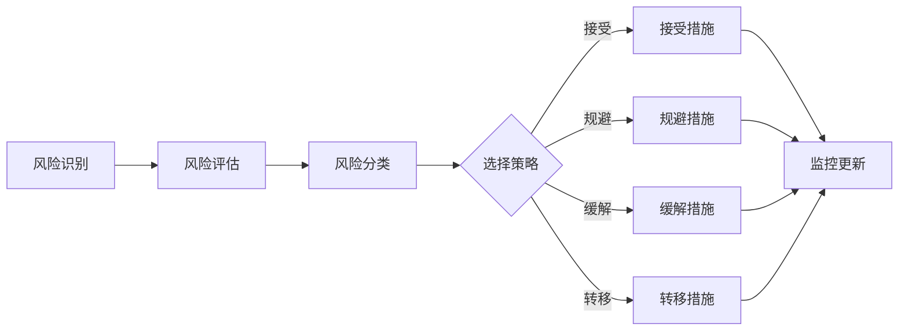
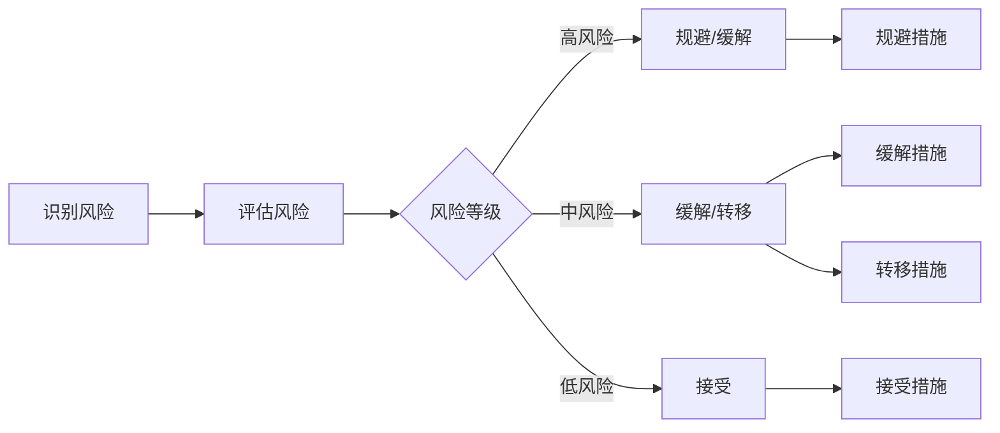

                 

### 文章标题

# 技术管理中的风险评估与控制

在信息化和数字化迅速发展的时代，技术管理在企业运营中的作用愈发重要。技术管理的有效性不仅取决于技术本身的质量，还受到风险评估与控制的影响。对于技术管理者来说，如何识别潜在风险、评估其影响，并采取有效的控制措施，是保障企业持续发展的关键。

本文将围绕技术管理中的风险评估与控制这一主题，从以下几个方面进行探讨：

1. **风险概述**：介绍技术管理中常见风险类型及其对企业的影响。
2. **风险评估理论**：阐述风险评估的基本概念、框架和评估模型。
3. **风险控制策略**：讨论风险规避、缓解、转移和接受等策略。
4. **案例分析**：通过实际案例展示风险评估与控制的应用。
5. **实践与展望**：探讨技术风险管理实践方法及未来发展趋势。

希望通过本文的阐述，能够帮助技术管理者更好地理解和应用风险评估与控制的方法，提升技术管理的整体水平。

---

关键词：技术管理，风险评估，风险控制，案例，实践

---

摘要：本文探讨了技术管理中风险评估与控制的重要性，从理论到实践，详细介绍了风险评估的基本概念、框架、评估模型以及风险控制策略。通过实际案例的分析，展示了风险评估与控制在企业运营中的应用，并对技术风险管理的未来发展趋势进行了展望。希望本文能为技术管理者提供有益的参考和指导。

### 技术管理的风险概述

技术管理中的风险是指在技术项目开发、实施和运营过程中，由于技术、管理、人员等多方面的不确定性因素，可能导致项目失败或影响企业正常运营的不利事件。技术风险可以分为以下几个方面：

#### 1. 技术风险

技术风险主要源于技术本身的复杂性。例如，新技术的不确定性、技术实现的难度、技术选型的风险等。技术管理者需要面对的是如何选择合适的技术路线，确保技术实现的可能性。

#### 2. 管理风险

管理风险主要涉及项目计划、资源配置、沟通协调等方面。例如，项目管理不善可能导致进度延误、预算超支、团队协作困难等问题。技术管理者需要具备良好的项目管理能力，确保项目的顺利进行。

#### 3. 人员风险

人员风险指的是团队成员的技术水平、经验、稳定性等因素可能带来的风险。例如，团队成员流动性强可能导致项目中断、技术积累不足等问题。技术管理者需要重视团队建设，提升团队整体能力。

#### 4. 运营风险

运营风险主要包括系统稳定性、安全性、可持续性等方面。例如，系统崩溃、数据泄露、维护成本高等问题都可能对企业的运营产生负面影响。技术管理者需要制定有效的运维策略，确保系统的稳定和安全。

#### 风险对企业的具体影响

技术风险对企业的具体影响是多方面的，主要包括以下几个方面：

1. **财务影响**：技术风险可能导致项目失败，从而带来经济损失。例如，项目延期可能导致市场机会的丧失，预算超支则增加企业的财务负担。

2. **品牌影响**：技术风险可能导致企业品牌形象受损。例如，系统崩溃或数据泄露可能导致客户信任度下降，影响企业的市场竞争力。

3. **运营影响**：技术风险可能导致企业运营中断，影响正常业务流程。例如，系统不稳定可能导致业务效率低下，甚至影响到企业的核心业务。

4. **管理影响**：技术风险暴露出企业管理中的问题，可能需要调整管理策略，增加管理成本。

因此，对技术风险进行有效的识别、评估和控制，对于保障企业持续发展至关重要。

### 风险评估理论

风险评估是技术管理中的重要环节，旨在识别、分析和评估潜在风险，为风险控制提供依据。以下将从风险评估的基本概念、框架和评估模型等方面进行详细阐述。

#### 1. 风险评估的基本概念

风险评估（Risk Assessment）是指通过系统的方法识别和分析项目或系统中可能存在的风险，评估其影响和可能性，以便采取有效的风险控制措施。

- **风险识别**：指在项目或系统开发过程中，识别可能存在的风险因素。风险识别是风险评估的基础，常见的风险识别方法包括问卷调查、头脑风暴、访谈等。
- **风险分析**：指对已识别的风险进行详细分析，评估其影响和可能性。风险分析的方法包括定性分析和定量分析，定性分析主要通过专家意见、历史数据等评估风险，定量分析则通过概率分布、风险价值（VaR）等方法进行量化评估。
- **风险评估**：指综合风险识别和风险分析的结果，对风险进行优先级排序，以便采取相应的控制措施。

#### 2. 风险评估框架

风险评估框架是进行风险评估的基本结构，通常包括以下几个关键步骤：

1. **定义范围**：明确评估的目标和范围，确保评估的全面性。
2. **风险识别**：通过多种方法识别项目或系统中的潜在风险。
3. **风险分析**：对已识别的风险进行详细分析，评估其影响和可能性。
4. **风险评估**：综合分析结果，对风险进行优先级排序。
5. **风险应对**：根据风险评估结果，制定相应的风险应对策略。
6. **监控与更新**：持续监控风险变化，及时更新风险评估结果。

#### 3. 风险评估模型

风险评估模型是进行风险评估的工具，可以帮助技术管理者更好地识别和管理风险。以下介绍几种常用的风险评估模型：

1. **定性风险评估模型**
   - **故障模式与影响分析（FMEA）**：FMEA是一种系统性的分析方法，通过识别和评估产品或系统的潜在故障模式及其影响，确定故障的严重性、发生概率和检测难度，从而制定改进措施。
   - **风险矩阵**：风险矩阵是一种直观的评估工具，通过风险的可能性和影响矩阵来评估风险等级。常见的风险矩阵包括二维矩阵和三维矩阵。

2. **定量风险评估模型**
   - **风险价值（VaR）**：VaR是一种用于衡量金融风险的方法，通过计算在一定置信水平下，某资产或投资组合在一定时间内的最大可能损失。
   - **敏感性分析**：敏感性分析通过改变某个变量的值，观察其对系统输出（如利润、损失等）的影响，从而评估该变量的风险。

3. **综合风险评估模型**
   - **多层次风险评估模型**：多层次风险评估模型将风险评估分为多个层次，从宏观到微观全面评估风险。例如，可以首先评估项目整体风险，然后逐层细化到具体模块或过程。
   - **概率风险评估模型**：概率风险评估模型通过构建概率模型，评估风险发生的概率及其影响，从而进行综合评估。

#### 4. 风险评估工具

在实际应用中，风险评估工具可以帮助技术管理者更高效地进行风险评估。以下介绍几种常用的风险评估工具：

1. **风险登记册**：风险登记册是记录和跟踪风险的重要工具，通常包括风险识别、分析、评估和应对策略等信息。
2. **风险管理软件**：如RiskManager、Qualys等，这些软件可以帮助管理者识别、评估和监控风险，提高风险评估的效率。
3. **数据分析工具**：如Excel、R、Python等，通过数据分析工具可以更精确地进行定量风险评估，如计算风险概率和风险价值等。

通过以上对风险评估理论的介绍，可以看出风险评估在技术管理中的重要性。技术管理者需要熟练掌握风险评估的方法和工具，以便更好地识别和管理风险，保障项目的成功实施和企业持续发展。

### 风险控制策略与方法

在识别和评估了技术管理中的各种风险后，接下来需要采取有效的风险控制策略与方法，以降低风险发生的可能性或减轻其影响。以下将详细介绍风险规避、缓解、转移和接受策略，以及常用的风险管理工具和技术。

#### 1. 风险规避策略

风险规避是指通过调整项目计划、技术路线或资源配置，避免风险发生。以下是一些常见的风险规避策略：

1. **变更技术路线**：当识别出某项技术存在较高风险时，可以考虑调整技术路线，选择更成熟、风险更低的技术方案。
2. **调整项目计划**：通过重新规划项目进度和任务分配，避免高风险的任务在项目关键阶段进行。
3. **替代方案**：为某些关键任务或技术环节准备替代方案，以备不时之需。

**注意事项**：风险规避策略可能会增加项目成本和复杂性，因此在实施前需要权衡利弊。

#### 2. 风险缓解策略

风险缓解策略旨在降低风险发生的概率或减轻其影响。以下是一些常见的风险缓解策略：

1. **增加冗余**：通过增加系统的冗余设计，提高系统的容错能力和稳定性。例如，增加备份服务器、冗余数据存储等。
2. **提前预防**：在项目早期阶段进行充分的规划和设计，识别潜在风险，并采取预防措施。例如，进行风险分析和评估，制定应急预案等。
3. **技术改进**：通过技术改进，降低技术实现的风险。例如，采用更成熟的技术、优化系统架构等。

**注意事项**：风险缓解策略需要根据具体风险情况进行调整，确保有效性和经济性。

#### 3. 风险转移策略

风险转移策略是指通过合同、保险等方式，将风险转移给第三方。以下是一些常见的风险转移策略：

1. **外包**：将部分高风险的任务外包给专业的第三方服务提供商，由其承担相应的风险。
2. **购买保险**：为项目购买适当的保险，以应对可能发生的损失。例如，项目责任险、技术保险等。
3. **签订合同**：在合同中明确各方的责任和义务，以降低合同纠纷带来的风险。

**注意事项**：风险转移策略需要确保合同条款的公平性和有效性，避免因条款模糊导致的风险责任不清。

#### 4. 风险接受策略

风险接受策略是指在不采取具体措施的情况下，接受风险发生的可能性。以下是一些常见的风险接受策略：

1. **接受低风险**：对于一些发生概率较低、影响较小的风险，可以采取接受的态度，减少管理成本。
2. **风险容忍度**：设定合理的风险容忍度，对在容忍度范围内的风险，采取接受的态度。
3. **风险监测**：对接受的风险进行持续监测，及时发现和应对可能的负面情况。

**注意事项**：风险接受策略需要确保风险在可接受范围内，并制定相应的应急计划。

#### 常用的风险管理工具和技术

在实际操作中，技术管理者可以借助多种工具和技术来实施风险控制策略：

1. **风险管理软件**：如RiskManager、Qualys等，这些软件可以帮助管理者识别、评估和监控风险，提高风险评估的效率。
2. **数据分析工具**：如Excel、R、Python等，通过数据分析工具可以更精确地进行定量风险评估，如计算风险概率和风险价值等。
3. **应急预案**：制定详细的应急预案，以应对可能发生的风险事件。
4. **培训与教育**：对团队成员进行风险管理培训，提高其风险意识和应对能力。

通过以上策略和工具，技术管理者可以更有效地控制技术管理中的风险，保障项目的成功实施和企业的持续发展。

### 风险管理工具与技术

在技术管理中，有效应用风险管理工具和技术是确保项目成功的关键。以下将介绍几种常见的风险管理工具和技术，包括风险管理软件、数据分析工具、应急预案等，并提供使用方法和实例。

#### 1. 风险管理软件

风险管理软件是帮助技术管理者进行风险识别、评估和监控的重要工具。以下介绍几种常用的风险管理软件：

1. **RiskManager**：RiskManager是一款功能强大的风险管理软件，支持风险识别、评估、应对策略制定和风险监控。使用方法如下：
   - **风险识别**：通过头脑风暴、专家访谈等方法，将识别出的风险记录在RiskManager中。
   - **风险评估**：使用RiskManager内置的风险评估工具，对每个风险进行概率和影响评估，生成风险矩阵。
   - **风险应对**：根据风险评估结果，制定相应的风险应对策略，并记录在软件中。
   - **风险监控**：定期更新风险评估结果，监控风险的变化，确保应对策略的有效性。

   **实例**：某IT公司使用RiskManager对一项大型软件项目进行风险管理，通过风险矩阵确定了高、中、低风险的优先级，并制定了相应的应对措施，最终成功降低了项目风险。

2. **Qualys**：Qualys是一款专业的网络安全风险管理软件，主要用于识别和评估网络安全风险。使用方法如下：
   - **漏洞扫描**：通过Qualys扫描网络设备和应用，识别潜在的漏洞和风险。
   - **风险评估**：对扫描结果进行风险评估，确定漏洞的严重程度。
   - **修复建议**：根据风险评估结果，提供修复建议和最佳实践，帮助技术团队进行漏洞修复。

   **实例**：某互联网公司使用Qualys进行网络安全风险管理，通过定期扫描和评估，及时发现了多个高危漏洞，并迅速进行了修复，有效防止了网络攻击。

#### 2. 数据分析工具

数据分析工具可以帮助技术管理者更精确地进行定量风险评估，以下介绍几种常用的数据分析工具：

1. **Excel**：Excel是一款功能强大的电子表格软件，支持数据录入、分析和可视化。使用方法如下：
   - **数据录入**：将风险数据（如风险概率、影响等）录入Excel表格。
   - **数据分析**：使用Excel的公式和函数进行数据分析和计算，如计算风险值、绘制风险矩阵等。
   - **可视化**：使用Excel的数据透视表、图表等功能，将分析结果进行可视化展示。

   **实例**：某IT公司使用Excel对项目风险进行定量分析，通过计算每个风险的概率和影响，生成了详细的风险评估报告，为项目决策提供了有力支持。

2. **R**：R是一种统计计算和图形展示的语言和环境，特别适用于复杂的数据分析和风险评估。使用方法如下：
   - **数据导入**：将风险数据导入R环境中，进行预处理。
   - **数据分析**：使用R的统计函数和包进行风险分析，如计算风险概率、风险价值（VaR）等。
   - **图形展示**：使用R的图形函数绘制风险分布图、风险矩阵等，进行可视化展示。

   **实例**：某金融机构使用R对投资组合的风险进行评估，通过计算VaR和条件期望损失（CVaR），生成了详细的风险评估报告，为投资决策提供了科学依据。

3. **Python**：Python是一种通用编程语言，广泛应用于数据分析和风险评估。使用方法如下：
   - **数据预处理**：使用Python的库（如NumPy、Pandas）进行数据预处理，如数据清洗、归一化等。
   - **数据分析**：使用Python的库进行风险分析，如计算风险值、构建风险评估模型等。
   - **可视化**：使用Python的库（如Matplotlib、Seaborn）进行数据可视化展示。

   **实例**：某IT公司使用Python进行项目风险分析，通过构建风险评估模型和绘制风险分布图，有效识别了项目中的潜在风险，并制定了相应的应对措施。

#### 3. 应急预案

应急预案是应对突发事件和风险的重要工具，以下介绍几种常见的应急预案：

1. **项目应急预案**：针对项目中可能发生的各种风险，制定详细的应急预案，包括预警机制、应急响应流程、应急资源配备等。
   - **预警机制**：通过实时监控和数据分析，及时发现潜在风险，发出预警。
   - **应急响应流程**：明确应急响应的步骤和责任人，确保应急处理高效有序。
   - **应急资源配备**：提前准备必要的应急设备和物资，确保在突发事件发生时能够迅速应对。

   **实例**：某IT公司为应对项目延期风险，制定了详细的应急预案，包括预警机制、应急响应流程和应急资源配备，在项目延期时成功降低了风险影响。

2. **网络安全应急预案**：针对网络安全风险，制定详细的应急预案，包括安全漏洞修复、数据泄露应对、网络攻击防范等。
   - **安全漏洞修复**：在发现安全漏洞后，及时进行漏洞修复，防止风险扩大。
   - **数据泄露应对**：制定数据泄露应对方案，包括数据备份、数据加密、数据恢复等。
   - **网络攻击防范**：通过防火墙、入侵检测系统等，防范网络攻击。

   **实例**：某互联网公司为应对网络安全风险，制定了详细的应急预案，通过定期安全检查和应急演练，有效防范了多次网络攻击，保障了系统的安全稳定运行。

通过以上风险管理工具和技术的应用，技术管理者可以更有效地识别、评估和控制风险，保障项目的成功实施和企业持续发展。

### 案例分析

为了更好地理解技术管理中的风险评估与控制，以下通过三个实际案例，展示风险评估与控制在不同场景中的应用。

#### 案例一：互联网企业的风险管理体系建设

某互联网公司计划开发一款全新社交平台，面对技术复杂性和市场不确定性，公司决定建立一套全面的风险管理体系。以下是该公司的风险管理过程：

1. **风险识别**：通过问卷调查、专家访谈等方法，识别出技术实现、市场需求、系统稳定性、数据安全等潜在风险。
2. **风险评估**：使用FMEA模型对识别出的风险进行评估，确定各风险的严重性、发生概率和检测难度，生成风险矩阵。
3. **风险控制**：根据风险评估结果，采取以下风险控制措施：
   - **风险规避**：为降低市场需求风险，提前进行市场调研，调整产品功能。
   - **风险缓解**：通过优化系统架构，提高系统稳定性，降低技术实现风险。
   - **风险转移**：购买网络安全保险，将数据安全风险转移给保险公司。
   - **风险接受**：对于发生概率较低的风险，如小概率的系统漏洞，采取接受策略。

通过这些措施，公司有效降低了项目风险，确保了社交平台的顺利开发与上线。

#### 案例二：IT项目的风险管理实践

某大型IT公司负责一个跨国企业的ERP系统实施项目，项目涉及多个国家、多个部门，风险复杂且影响巨大。以下是项目风险管理的具体步骤：

1. **风险识别**：通过项目团队会议、问卷调查等方法，识别出项目管理、技术实施、数据迁移、沟通协调等风险。
2. **风险评估**：使用风险矩阵对识别出的风险进行评估，确定各风险的优先级。
3. **风险控制**：
   - **风险规避**：在项目规划阶段，通过增加预留时间、调整项目计划，规避项目延误风险。
   - **风险缓解**：通过加强项目管理流程、建立多层次的沟通机制，降低沟通协调风险。
   - **风险转移**：通过签订详细的合同，明确各方的责任和权利，将部分风险转移给合作伙伴。
   - **风险接受**：对于不可避免的低概率风险，如数据迁移中的偶发错误，制定应急计划。

通过以上措施，项目在遇到多次突发问题时，均能迅速应对，确保了项目的顺利实施。

#### 案例三：网络安全风险控制案例分析

某金融机构在数字化转型过程中，面临严峻的网络安全风险。以下是该机构采取的风险控制措施：

1. **风险识别**：通过漏洞扫描、安全审计等方法，识别出系统漏洞、数据泄露、网络攻击等风险。
2. **风险评估**：使用风险矩阵和VaR模型，评估各风险的严重性和发生概率。
3. **风险控制**：
   - **风险规避**：通过技术改进，采用更安全的加密算法和数据保护措施，降低数据泄露风险。
   - **风险缓解**：通过建立防火墙、入侵检测系统等安全防护措施，提高系统抗攻击能力。
   - **风险转移**：购买网络安全保险，将部分风险转移给保险公司。
   - **风险接受**：对于低概率的风险，如特定类型的网络攻击，制定应急响应计划。

通过这些措施，金融机构成功降低了网络安全风险，保障了业务的安全运行。

通过以上案例分析，可以看出，技术管理中的风险评估与控制在实际应用中的重要性。不同企业在不同场景下采取的风险控制策略各有特点，但都体现了对风险的全面识别、科学评估和有效控制。这些经验可以为其他企业进行技术风险管理提供有益的参考。

### 技术风险管理实践

在实际操作中，技术风险管理是一项系统工程，涉及多个环节和方法。以下将详细阐述技术风险管理流程设计、风险控制策略选择以及风险管理工具的应用。

#### 1. 技术风险管理流程设计

技术风险管理流程主要包括以下几个关键步骤：

1. **风险识别**：通过多种方法识别项目或系统中的潜在风险。常见的识别方法包括问卷调查、专家访谈、历史数据分析等。
2. **风险评估**：对已识别的风险进行详细分析，评估其影响和可能性。风险评估可以采用定性分析和定量分析相结合的方法，例如风险矩阵、FMEA等工具。
3. **风险分类**：根据风险评估结果，将风险分为高、中、低风险等级，以便采取不同的风险控制措施。
4. **风险控制策略选择**：根据风险分类和项目实际情况，选择合适的风险控制策略，如风险规避、风险缓解、风险转移、风险接受等。
5. **风险应对措施制定**：为每个风险制定具体的应对措施，包括技术改进、流程优化、人员培训等。
6. **风险监控与更新**：持续监控风险变化，及时更新风险评估结果和应对措施，确保风险管理的有效性。

以下是一个简单的技术风险管理流程图（使用Mermaid流程图）：



#### 2. 风险控制策略选择

在技术风险管理中，风险控制策略的选择至关重要。以下介绍几种常见的风险控制策略及其适用场景：

1. **风险规避**：通过调整项目计划、技术路线或资源配置，避免风险发生。适用于高风险且无有效缓解措施的情况。
2. **风险缓解**：通过增加冗余、提前预防或技术改进等措施，降低风险发生的概率或减轻其影响。适用于高风险但可以通过技术改进和管理措施缓解的情况。
3. **风险转移**：通过合同、保险等方式，将风险转移给第三方。适用于高风险且可以通过经济手段转移的情况。
4. **风险接受**：在不采取具体措施的情况下，接受风险发生的可能性。适用于低风险或风险在可接受范围内的情况。

以下是一个简化的风险控制策略选择流程图（使用Mermaid流程图）：



#### 3. 风险管理工具的应用

在实际操作中，多种风险管理工具可以帮助技术管理者更高效地实施风险控制策略。以下介绍几种常用的风险管理工具：

1. **风险管理软件**：如RiskManager、Qualys等，这些软件提供风险识别、评估、监控等功能，提高风险管理的效率。
2. **数据分析工具**：如Excel、R、Python等，通过数据分析工具可以进行定量风险评估，如计算风险概率和风险价值（VaR）等。
3. **应急预案**：制定详细的应急预案，以应对可能发生的风险事件，包括预警机制、应急响应流程、应急资源配备等。

以下是一个简单的风险管理工具应用实例：

```mermaid
gantt
    title 风险管理工具应用
    dateFormat  YYYY年m月d日
    section 风险识别
    A1[启动风险管理] :start>>=2023-04-01
    B1[问卷调查] :after A1 1d
    C1[专家访谈] :after B1 1d
    D1[历史数据分析] :after C1 1d
    
    section 风险评估
    A2[建立风险评估模型] :after D1 1d
    B2[计算风险概率和影响] :after A2 1d
    C2[生成风险矩阵] :after B2 1d
    
    section 风险控制
    A3[选择风险控制策略] :after C2 1d
    B3[制定应对措施] :after A3 1d
    C3[实施风险控制措施] :after B3 1d
    
    section 风险监控
    A4[持续监控风险] :after C3 1d
    B4[更新风险评估结果] :after A4 1d
```

通过以上技术风险管理流程的设计、风险控制策略的选择以及风险管理工具的应用，技术管理者可以更有效地识别、评估和控制技术风险，保障项目的成功实施和企业的持续发展。

### 风险管理与未来展望

随着技术的不断进步和市场的快速变化，技术管理中的风险也在不断演变。以下是关于风险管理在未来的发展趋势、技术革新对风险管理的影响以及风险管理在未来的角色与挑战的探讨。

#### 1. 风险管理的发展趋势

（1）**智能化**：人工智能和机器学习技术的应用，将使风险评估和风险控制更加智能化。通过大数据分析和机器学习算法，可以更精确地识别和预测潜在风险，提高风险管理效率。

（2）**自动化**：自动化工具和技术将在风险管理中发挥更大的作用。例如，自动化风险评估工具可以实时监控项目风险，自动化应急响应系统可以在风险发生时自动采取应对措施。

（3）**集成化**：未来的风险管理将更加注重与其他管理领域的集成，如项目管理、财务管理等。通过整合不同管理领域的数据和工具，实现全面的风险管理。

（4）**全球化**：随着全球化进程的加快，企业面临的风险也变得更加复杂和多样化。风险管理需要考虑跨国经营、国际合规等问题，实现全球范围内的风险监控和应对。

#### 2. 技术革新对风险管理的影响

（1）**云计算**：云计算技术的普及，使得企业可以更灵活地部署和管理技术资源，同时也带来了新的风险，如数据安全、隐私保护等。风险管理需要适应云计算环境，制定相应的风险管理策略。

（2）**大数据**：大数据技术的应用，使得企业可以更全面地收集和分析数据，从而提高风险评估的准确性。但同时，大数据也带来了数据隐私、数据滥用等问题，需要加强风险管理。

（3）**区块链**：区块链技术的去中心化、不可篡改等特点，为风险管理提供了新的手段。例如，通过区块链技术可以实现对重要数据的加密保护，提高数据安全性。

（4）**人工智能**：人工智能技术的应用，将使风险管理更加智能化，如通过机器学习算法预测风险、通过自动化系统进行风险控制等。

#### 3. 风险管理在未来的角色与挑战

（1）**角色**：未来的风险管理将不仅仅是风险控制，更是风险识别、评估、应对和监控的全过程管理。技术管理者需要扮演更加主动的角色，积极参与风险管理，确保项目和企业运营的安全和稳定。

（2）**挑战**：
- **技术复杂性**：随着技术的不断进步，项目的技术复杂性增加，风险识别和评估的难度也随之增大。
- **数据隐私**：在大数据时代，如何保护用户隐私和数据安全成为风险管理的重要挑战。
- **合规要求**：全球化背景下，企业需要遵守不同国家和地区的法律法规，风险管理需要考虑合规性。
- **人才短缺**：随着技术和管理要求的不断提高，风险管理领域的人才短缺问题日益突出，需要通过培训和教育提升现有人员的能力。

总之，未来的风险管理将面临更多的挑战，但也提供了更多的发展机遇。技术管理者需要不断学习和适应新技术，提高风险管理能力，为企业的持续发展保驾护航。

### 最佳实践、小结、注意事项及拓展阅读

#### 最佳实践

1. **定期进行风险评估**：定期对项目或系统进行风险评估，及时发现和应对潜在风险。
2. **建立风险预警机制**：通过实时监控和数据分析，建立风险预警机制，提前识别潜在风险。
3. **制定详细的应急预案**：为可能发生的风险事件制定详细的应急预案，确保在风险发生时能够迅速响应。
4. **加强团队培训**：对团队成员进行风险管理培训，提高其风险意识和应对能力。
5. **运用风险管理工具**：借助风险管理软件和数据分析工具，提高风险评估和风险控制的效率。

#### 小结

技术管理中的风险评估与控制是保障项目成功和企业持续发展的重要环节。通过识别、评估和控制风险，技术管理者可以降低项目失败的风险，确保项目的顺利实施。本文从风险评估理论、风险控制策略、案例分析、实践与展望等方面进行了详细阐述，提供了全面的指导和建议。

#### 注意事项

1. 风险评估需要全面、客观，避免遗漏重要风险。
2. 风险控制策略的选择应根据具体风险情况，确保其有效性和经济性。
3. 持续监控风险变化，及时更新风险评估结果和应对措施。
4. 风险管理需要跨部门协作，确保全员参与和共同应对。

#### 拓展阅读

1. **《风险管理：应对不确定性的艺术》**：详细介绍风险管理的理论和方法，适合初学者阅读。
2. **《项目风险管理：实践指南》**：针对项目管理的具体实践，提供风险管理的方法和工具。
3. **《大数据风险管理与合规》**：探讨大数据时代下风险管理的挑战和合规要求，适合从事大数据分析和风险管理的人员阅读。

### 结语

作者：AI天才研究院/AI Genius Institute & 禅与计算机程序设计艺术 /Zen And The Art of Computer Programming

本文围绕技术管理中的风险评估与控制，通过详细的理论讲解、实际案例分析和实践指导，阐述了风险管理的核心概念、方法和技术。希望本文能为技术管理者提供有价值的参考，助力企业在信息化和数字化时代实现持续发展。在未来的技术管理实践中，不断学习和创新，优化风险管理流程，是企业应对复杂环境、保持竞争优势的关键。让我们共同探索技术管理的未知领域，共创美好未来。

